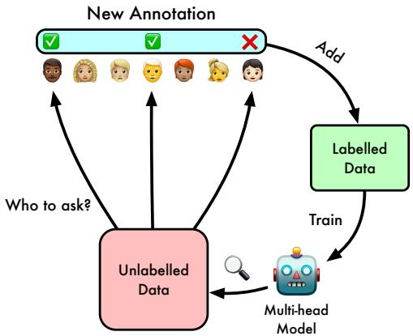
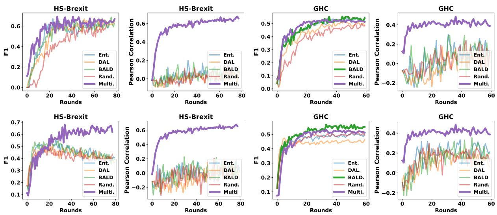
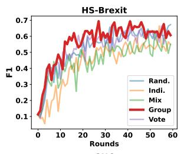
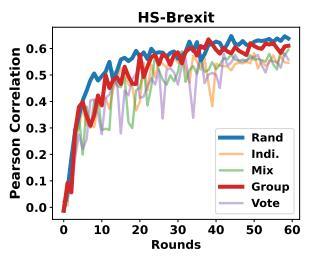
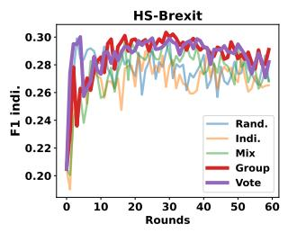
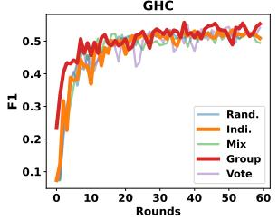
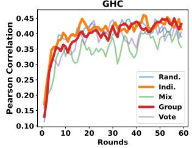
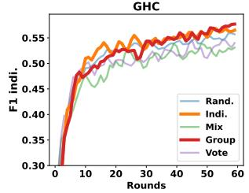

# ACTOR: Active Learning with Annotator-specific Classification Heads to Embrace Human Label Variation

Xinpeng Wang and Barbara Plank

MaiNLP, Center for Information and Language Processing, LMU Munich, Germany Munich Center for Machine Learning (MCML), Munich, Germany {xinpeng, bplank}@cis.lmu.de

## Abstract

Label aggregation such as majority voting is commonly used to resolve annotator disagreement in dataset creation. However, this may disregard minority values and opinions. Recent studies indicate that learning from individual annotations outperforms learning from aggregated labels, though they require a considerable amount of annotation. Active learning, as an annotation cost-saving strategy, has not been fully explored in the context of learning from disagreement. We show that in the active learning setting, a multi-head model performs significantly better than a single-head model in terms of uncertainty estimation. By designing and evaluating acquisition functions with annotator-specific heads on two datasets, we show that group-level entropy works generally well on both datasets. Importantly, it achieves performance in terms of both prediction and uncertainty estimation comparable to full-scale training from disagreement, while saving 70% of the annotation budget.

## 1 Introduction

An important aspect of creating a dataset is asking for multiple annotations and aggregating them in order to derive a single ground truth label. Aggregating annotations, however, implies a single golden ground truth, which is not applicable to many subjective tasks such as hate speech detection (Ovesdotter Alm, 2011). A human’s judgement on subjective tasks can be influenced by their perspective and beliefs or cultural background (Waseem et al., 2021; Sap et al., 2022). When addressing disagreement in annotation, aggregating them by majority vote could result in the viewpoints of the minority being overlooked (Suresh and Guttag, 2019).

In order to address this issue, many works have been proposed to directly learn from the annotation disagreements in subjective tasks. There are two major approaches to achieving that: learning from the soft label (Peterson et al., 2019; Uma et al.,

  
Figure 1: For each sample that needs to be labelled, our model actively selects specific annotators for annotations to learn from the label variation.

2020; Fornaciari et al., 2021) and learning from the hard label of individual annotators (Cohn and Specia, 2013; Rodrigues and Pereira, 2018; Davani et al., 2022).

In a recent work, Davani et al. (2022) shows that modelling the individual annotators by adding annotator-specific classification heads in a multitask setup outperforms the traditional approach that learns from a majority vote. However, training such a model needs a huge amount of data with multiple annotations to model the opinions and beliefs of the individual annotators.

On another line, Active Learning (AL) is a framework that allows learning from limited labelled data by querying the data to be annotated. In this paper, we propose to take the best of both worlds: active learning and human label variation, to mitigate the high cost of the annotation budget needed for training the model. In particular, we propose a novel active learning setting, where the multi-head model actively selects the annotator and the sample to be labelled. Our results show this effectively reduces annotation costs while at the same time allowing for modelling individual perspectives.

Key Findings We made several key observations:

• The multi-head model works significantly better than the single-head model on uncertainty estimation.

• The use of group-level entropy is generally recommended. Individual-level entropy methods perform differently depending on the dataset properties.

• The multi-head model achieves a performance comparable to full-scale training with only around 30% annotation budget.

## 2 Related Work

## 2.1 Learning from Disagreement

There is a growing body of work that studies irreconcilable differences between annotations (Plank et al., 2014; Aroyo and Welty, 2015; Pavlick and Kwiatkowski, 2019; Uma et al., 2021). One line of research aims at resolving the variation by aggregation or filtering (Reidsma and Carletta, 2008; Beigman Klebanov et al., 2008; Hovy et al., 2013; Gordon et al., 2021). Another line of research tries to embrace the variance by directly learning from the raw annotations (Rodrigues and Pereira, 2018; Peterson et al., 2019; Fornaciari et al., 2021; Davani et al., 2022), which is the focus of our paper.

## 2.2 Active Learning

In active learning, many different methods for selecting data have been proposed to save annotation cost, such as uncertainty sampling (Lewis, 1995) based on entropy (Dagan and Engelson, 1995) or approximate Bayesian inference (Gal and Ghahramani, 2016). Other approaches focus on the diversity and informativeness of the sampled data (Sener and Savarese, 2017; Gissin and Shalev-Shwartz, 2019; Zhang and Plank, 2021). Herde et al. (2021) proposed a probabilistic active learning framework in a multi-annotator setting, where the disagreement is attributed to errors. Recent work by Baumler et al. (2023) accepted the disagreement in the active learning setting, and they showed improvement over the passive learning setting using singlehead model. Our work shows the advantage of the multi-head model and compares it with traditional single-head active learning methods.

## 3 Method

Multi-head Model We use a multi-head model where each head corresponds to one unique annotator, following Davani et al., 2022. In the fine-tuning stage, annotations are fed to the corresponding annotator heads, adding their losses to the overall loss. During testing, the F1 score is calculated by comparing the majority votes of the annotator-specific heads with the majority votes of the annotations.

## 3.1 Multi-head Acquisition Functions

We study five acquisition functions for the multihead model. Since our model learns directly from the annotation, we care about which annotator should give the label. So we query the instanceannotation pair $( x _ { i } , y _ { i } ^ { a } )$ with its annotator ID a. In this way, our data is duplicated by the number of annotations available.

Random Sampling (Rand.) We conduct random sampling as a baseline acquisition method where we randomly sample K (data, annotation, annotator ID) pairs from the unlabeled data pool U at each active learning iteration.

Individual-level Entropy (Indi.) Intuitively, the annotator-specific heads model the corresponding annotators. Therefore, we can calculate the entropy of the classification head to measure the specific annotator’s uncertainty. Given the logits $\begin{array} { r l r } { z ^ { a } } & { { } = } & { \left[ z _ { 1 } ^ { a } , . . . , z _ { n } ^ { a } \right] } \end{array}$ of the head $^ { a , }$ , the entropy is calculated as following: $\begin{array} { r } { H _ { i n d i } ( p ^ { a } | x ) = - \sum _ { i = 1 } ^ { n } p _ { i } ^ { a } ( x ) \log ( p _ { i } ^ { a } ( x ) ) } \end{array}$ , where $p _ { i } ^ { a } ( x ) = \mathrm { s o f t m a x } ( z _ { i } ^ { a } ( x ) )$ . Then we choose the (instance, annotator) pair with the highest entropy: $\mathrm { a r g m a x } _ { x \in U , a \in A } H _ { i n d i } ( p ^ { a } | x )$ , where U denotes the unlabeled set and A denotes the annotator pool. We compute entropy only for the remaining annotators who have not provided annotations for the instance.

Group-level Entropy (Group) Instead of looking at the individual’s uncertainty, we can also query the data by considering the group-level uncertainty. One way to represent the uncertainty of the group on a sample is to calculate the entropy based on the aggregate of each annotatorspecific head’s output. Therefore, we normalize and sum the logits of each head at the group level: $\begin{array} { c c c c } { { z _ { g r o u p } } } & { { = } } & { { \left[ z _ { 1 } , . . . , z _ { n } \right] } } & { { = } } & { { \sum _ { h = 1 } ^ { H } z _ { n } ^ { h } } } \end{array}$ orm and calculate the group-level entropy as follows: $\begin{array} { r c l } { H _ { g r o u p } ( x ) } & { = } & { - \sum _ { i = 1 } ^ { n } p _ { i } ( x ) \log ( p _ { i } ( x ) ) } \end{array}$ , where $p _ { i } ( x ) = \mathrm { s o f t m a x } ( z _ { i } ( x ) )$ . We then query the data with the highest uncertainty.

Vote Variance (Vote) Another way to measure the uncertainty among a group is by measuring the variance of the votes. Given the prediction $y ^ { h }$ of classification head h, we calculate the vote variance: $\begin{array} { r } { \mathrm { V a r } = \frac { 1 } { H } \sum _ { i = 1 } ^ { H } ( y ^ { h } - \mu ) ^ { 2 } } \end{array}$ , where $\mu =$ $\textstyle { \frac { 1 } { H } } \sum _ { h = 1 } ^ { H } y ^ { h }$ . This approach can be applied to binary classification or regression problems.

  
Figure 2: Comparsion of the Multi-head model and Single-Majority (upper row) and Single-Annotation (bottom row). Results are averaged over 4 runs. All the methods have the same annotation cost of the seed dataset and the queried batch at each round.

Mixture of Group and Indi. Entropy (Mix.) We also consider a variant which combines the group-level and individual-level entropy by simply adding the two: $H _ { m i x } = H _ { i n d i } + H _ { g r o u p }$

## 4 Experiments

Dataset We selected two distinct hate speech datasets for our experiments: Hate Speech on Brexit (HS-Brexit) (Akhtar et al., 2021) and Gab Hate Corpus (GHC) (Kennedy et al., 2022). We split the raw annotation dataset according to the split of the aggregated version dataset provided. The HS-Brexit dataset includes 1,120 English tweets relating to Brexit and immigration, where a total of six individuals were involved in annotating each tweet. As each tweet contains all six annotations, we refer to HS-Brexit as densely annotated. In GHC, 27,665 social-media posts were collected from the public corpus of Gab.com (Gaffney, 2018). From a set of 18 annotators, each instance gets at least three annotations. Therefore, GHC is sparsely annotated. Both datasets contain binary labels $y \in [ 0 , 1 ]$ and have almost the same positive/negative raw annotation ratio (0.15).

Single-head Model Baselines We implement four acquisition methods for single-head model active learning for comparison: Random sampling (Rand.), Max-Entropy (Ent.; Dagan and Engelson, 1995), Bayesian Active Learning by Disagreement (BALD; Houlsby et al., 2011) and Discriminative Active Learning (DAL; Gissin and Shalev-Shwartz, 2019). We compare them with the multihead approach with random sampling which has an average performance among the five multi-head acquisition methods we investigated.

Two different single-head model approaches are considered: Learning from the Majority Vote (Single-Majority) and Learning from Raw annotations (Single-Annotation). In the first setting, all annotators’ annotations are queried, and the majority vote is used to train the model. In the second setting, we train the model with individual annotations without aggregation, following the repeated labelling approach by Sheng et al. (2008).

Experimental Setup We follow the setup of Davani et al. (2022) for modelling and evaluation. We initialize the layers before the heads with a BERTbase model (Devlin et al., 2019). To balance training data, we do oversampling following Kennedy et al. (2022). Moreover, we use class weights on the loss function for multi-head model training, which makes it more stable. It is not used for the single-head model as it degrades performance.

To evaluate the model, we first report the F1 score against the majority vote. Secondly, we also compute individual F1 scores, measuring annotatorspecific heads against annotator labels. Thirdly and importantly, we are interested to gauge how well the model can predict the data uncertainty by calculating the Pearson correlation between the model’s uncertainty and the annotation disagreement measured by the variance of the annotations on the same instance. For the single-head model, we use Prediction Softmax Probability proposed by Hendrycks and Gimpel (2017) as the uncertainty estimation of the model. For the multi-head model, we follow Davani et al. (2022) and calculate the variance of the prediction of the heads as the model’s uncertainty.

  
Figure 3: Comparison of multi-head acquisition functions. Results are averaged over 4 runs. Group-level entropy method (Group) performs generally well on both datasets on all three metrics. Individual-level uncertainty (Indi.) only performs well on GHC.

## 5 Result

Single-head vs Multi-head Model Figure 2 shows the comparison of the multi-head model and the single-head during the active learning process In the upper row, we compare the multi-head approach with single-majority approach on majority F1 score and uncertainty estimation. In terms of predicting the majority vote, the multi-head model performs on par with the best-performing singlehead method on both datasets, such as BALD. For uncertainty estimation measured against annotator disagreement, the multi-head model outperforms the single-head model by a large margin.

We have the same observation when comparing with single-annotation model, shown in the bottom row. Therefore, we recommend using a multi-head model in a subjective task where humans may disagree and uncertainty estimation is important.

Label Diversity vs. Sample Diversity When it comes to group-level uncertainty based acquisition functions (Group and Vote), we tested two approaches to determine which annotator to query from: Label Diversity First and Sample Diversity First. In Label Diversity First, we query from all the available annotators to prioritize the label diversity of a single sample. In Sample Diversity Fisrat approach, we only randomly choose one of the annotators for annotation. Given the same annotation budget for each annotation round, Label Diversity First would query fewer samples but more annotations than Sample Diversity First approach. In our preliminary result, Label Diversity First shows stronger performance in general. Therefore, we adopt this approach for the following experiments.

Comparison of Multi-head acquisition functions To compare different strategies to query for annotations, we compare the five proposed acquisition functions from Section 3.1 in Fig 3. Group performs generally well on both datasets. We also see a trend here that HS-Brexit favours acquisition function based on group-level uncertainty (Vote), while individual-level uncertainty (Indi.) works better on GHC dataset. For HS-Brexit, Group is the best-performing method based on the majority F1 score. When evaluated on raw annotation (F1 indi. score), both vote variant and group-level entropy perform well. For uncertainty estimation, random sampling is slightly better than group-level entropy approach. On the GHC dataset, both Indi. and Group perform well on uncertainty estimation and raw annotation prediction. However, we don’t see an obvious difference between all the acquisition functions on the majority vote F1 score.

Annotation Cost In terms of saving annotation cost, we see that the F1 score slowly goes into a plateau after around 25 rounds on both datasets in Fig 3, which is around 30% usage of the overall dataset (both datasets are fully labelled at around 90 rounds). For example, Vote achieves the majority F1 score of 52.3, which is 94% of the performance (55.8) of the full-scale training (round 90).

## 6 Conclusion

We presented an active learning framework that embraces human label variation by modelling the annotator with annotator-specific classification heads, which are used to estimate the uncertainty at the individual annotator level and the group level. We first showed that a multi-head model is a better choice over a single-head model in the active learning setting, especially for uncertainty estimation. We then designed and tested five acquisition functions for the annotator-heads model on two datasets. We found that group-level entropy works generally well on both datasets and is recommended. Depending on the dataset properties, the individual-level entropy method performs differently.

## Limitations

The multi-head approach is only viable when the annotator IDs are available during the active learning process since we need to ask the specific annotator for labelling. Furthermore, the annotators should remain available for a period of time in order to provide enough annotations to be modelled by the specific head successfully. Note that we here simulate the AL setup. The multi-head approach is good at estimating the uncertainty based on the annotators it trains on, however, whether the uncertainty can still align with yet another pool of people is still an open question.

Further analysis is needed to understand why GHC and HS-Brexit favour different acquisition functions. Besides the difference between dense and sparse annotation, factors such as diversity of the topics covered and annotator-specific annotation statics are also important, which we leave as future work.

## Acknowledgements

We thank the anonymous reviewers for their feedback. This research is supported by the ERC Consolidator Grant DIALECT 101043235.

## References

Sohail Akhtar, Valerio Basile, and Viviana Patti. 2021. Whose opinions matter? perspective-aware models to identify opinions of hate speech victims in abusive language detection. arXiv preprint arXiv:2106.15896.

Lora Aroyo and Chris Welty. 2015. Truth is a lie: Crowd truth and the seven myths of human annotation. AI Magazine, 36(1):15–24.

Connor Baumler, Anna Sotnikova, and Hal Daumé III. 2023. Which examples should be multiply annotated? active learning when annotators may disagree. In Findings ofthe Associationfor Computational Linguistics: ACL 2023, pages 10352–10371, Toronto, Canada. Association for Computational Linguistics.

Beata Beigman Klebanov, Eyal Beigman, and Daniel Diermeier. 2008. Analyzing disagreements. In Coling 2008: Proceedings of the workshop on Human Judgements in Computational Linguistics, pages 2–7, Manchester, UK. Coling 2008 Organizing Committee.

Trevor Cohn and Lucia Specia. 2013. Modelling annotator bias with multi-task Gaussian processes: An application to machine translation quality estimation. In Proceedings of the 51st Annual Meeting of the Associationfor Computational Linguistics (Volume 1: Long Papers), pages 32–42, Sofia, Bulgaria. Association for Computational Linguistics.

Ido Dagan and Sean P Engelson. 1995. Committeebased sampling for training probabilistic classifiers. In Machine Learning Proceedings 1995, pages 150– 157. Elsevier.

Aida Mostafazadeh Davani, Mark Díaz, and Vinodkumar Prabhakaran. 2022. Dealing with disagreements: Looking beyond the majority vote in subjective annotations. Transactions ofthe Associationfor Computational Linguistics, 10:92–110.

Jacob Devlin, Ming-Wei Chang, Kenton Lee, and Kristina Toutanova. 2019. BERT: Pre-training of deep bidirectional transformers for language understanding. In Proceedings ofthe 2019 Conference of the North American Chapter ofthe Associationfor Computational Linguistics: Human Language Technologies, Volume 1 (Long and Short Papers), pages 4171–4186, Minneapolis, Minnesota. Association for Computational Linguistics.

Tommaso Fornaciari, Alexandra Uma, Silviu Paun, Barbara Plank, Dirk Hovy, and Massimo Poesio. 2021. Beyond black & white: Leveraging annotator disagreement via soft-label multi-task learning. In Proceedings ofthe 2021 Conference ofthe North American Chapter of the Association for Computational Linguistics: Human Language Technologies, pages 2591–2597, Online. Association for Computational Linguistics.

Gavin Gaffney Gaffney. 2018. Pushshift gab corpus. https://files.pushshift.io/gab/.

Yarin Gal and Zoubin Ghahramani. 2016. Dropout as a bayesian approximation: Representing model uncertainty in deep learning. In international conference on machine learning, pages 1050–1059. PMLR.

Daniel Gissin and Shai Shalev-Shwartz. 2019. Discriminative active learning. arXiv preprint arXiv:1907.06347.

Mitchell L Gordon, Kaitlyn Zhou, Kayur Patel, Tatsunori Hashimoto, and Michael S Bernstein. 2021. The disagreement deconvolution: Bringing machine learning performance metrics in line with reality. In Proceedings ofthe 2021 CHI Conference on Human Factors in Computing Systems, pages 1–14.

Dan Hendrycks and Kevin Gimpel. 2017. A baseline for detecting misclassified and out-of-distribution examples in neural networks. In International Conference on Learning Representations.

Marek Herde, Daniel Kottke, Denis Huseljic, and Bernhard Sick. 2021. Multi-annotator probabilistic active learning. In 2020 25th International Conference on Pattern Recognition (ICPR), pages 10281–10288. IEEE.

Neil Houlsby, Ferenc Huszár, Zoubin Ghahramani, and Máté Lengyel. 2011. Bayesian active learning for classification and preference learning. arXiv preprint arXiv:1112.5745.

Dirk Hovy, Taylor Berg-Kirkpatrick, Ashish Vaswani, and Eduard Hovy. 2013. Learning whom to trust with MACE. In Proceedings ofthe 2013 Conference of the North American Chapter of the Association for Computational Linguistics: Human Language Technologies, pages 1120–1130, Atlanta, Georgia. Association for Computational Linguistics.

Brendan Kennedy, Mohammad Atari, Aida Mostafazadeh Davani, Leigh Yeh, Ali Omrani, Yehsong Kim, Kris Coombs, Shreya Havaldar, Gwenyth Portillo-Wightman, Elaine Gonzalez, et al. 2022. Introducing the gab hate corpus: defining and applying hate-based rhetoric to social media posts at scale. Language Resources and Evaluation, pages 1–30.

David D Lewis. 1995. A sequential algorithm for training text classifiers: Corrigendum and additional data. In Acm Sigir Forum, volume 29, pages 13–19. ACM New York, NY, USA.

Cecilia Ovesdotter Alm. 2011. Subjective natural language problems: Motivations, applications, characterizations, and implications. In Proceedings of the 49th Annual Meeting of the Association for Computational Linguistics: Human Language Technologies, pages 107–112, Portland, Oregon, USA. Association for Computational Linguistics.

Ellie Pavlick and Tom Kwiatkowski. 2019. Inherent disagreements in human textual inferences. Transactions ofthe Associationfor Computational Linguistics, 7:677–694.

Joshua C Peterson, Ruairidh M Battleday, Thomas L Griffiths, and Olga Russakovsky. 2019. Human uncertainty makes classification more robust. In Proceedings ofthe IEEE/CVF International Conference on Computer Vision, pages 9617–9626.

Barbara Plank, Dirk Hovy, and Anders Søgaard. 2014. Linguistically debatable or just plain wrong? In Proceedings of the 52nd Annual Meeting of the Association for Computational Linguistics (Volume 2: Short Papers), pages 507–511.

Dennis Reidsma and Jean Carletta. 2008. Squibs: Reliability measurement without limits. Computational Linguistics, 34(3):319–326.

Filipe Rodrigues and Francisco Pereira. 2018. Deep learning from crowds. In Proceedings of the AAAI conference on artificial intelligence, volume 32.

Maarten Sap, Swabha Swayamdipta, Laura Vianna, Xuhui Zhou, Yejin Choi, and Noah A. Smith. 2022. Annotators with attitudes: How annotator beliefs and identities bias toxic language detection. In Proceedings ofthe 2022 Conference ofthe North American Chapter of the Association for Computational Linguistics: Human Language Technologies, pages 5884–5906, Seattle, United States. Association for Computational Linguistics.

Ozan Sener and Silvio Savarese. 2017. Active learning for convolutional neural networks: A core-set approach. arXiv preprint arXiv:1708.00489.

Victor S. Sheng, Foster Provost, and Panagiotis G. Ipeirotis. 2008. Get another label? improving data quality and data mining using multiple, noisy labelers. In Proceedings ofthe 14th ACM SIGKDD International Conference on Knowledge Discovery and Data Mining, KDD ’08, page 614–622, New York, NY, USA. Association for Computing Machinery.

Harini Suresh and John V Guttag. 2019. A framework for understanding unintended consequences of machine learning. arXiv preprint arXiv:1901.10002, 2(8).

Alexandra Uma, Tommaso Fornaciari, Dirk Hovy, Silviu Paun, Barbara Plank, and Massimo Poesio. 2020. A case for soft loss functions. In Proceedings of the AAAI Conference on Human Computation and Crowdsourcing, volume 8, pages 173–177.

Alexandra Uma, Tommaso Fornaciari, Dirk Hovy, Silviu Paun, Barbara Plank, and Massimo Poesio. 2021. Learning from disagreement: A survey. Journal of Artificial Intelligence Research, 72:1385–1470.

Zeerak Waseem, Smarika Lulz, Joachim Bingel, and Isabelle Augenstein. 2021. Disembodied machine learning: On the illusion of objectivity in nlp. arXiv preprint arXiv:2101.11974.

Mike Zhang and Barbara Plank. 2021. Cartography active learning. In Findings of the Association for Computational Linguistics: EMNLP 2021, pages 395– 406, Punta Cana, Dominican Republic. Association for Computational Linguistics.

## A Data Preparation

In contrast to the traditional active learning approach, which only selects instances from the unlabeled data pool, our approach also considers which annotator should give the annotation since the annotation should be fed to the annotator-specific heads. To address this issue, we reform the dataset by splitting one instance with N annotations into N (data, annotation) pairs with its annotator ID. When selecting the batch from the populated data pool, the (data, annotation) pair is given to the classification head corresponding to its annotator ID.

## B Active Learning Setting

Since our work focus on raw annotation, we set the seed dataset size and the query batch size based on the annotation budget. We set the annotation budget for HS-Brexit as (60, 60) for both seed data size and query data size respectively. For GHC, we set it as (200, 200).

## C Training Setup

We list our training parameter in Table 1. We halve the learning rate when the F1 score decreases at evaluation.

<table><tr><td>Parameter</td><td>Value</td></tr><tr><td>Weight Decay</td><td>0.01</td></tr><tr><td>Optimizer</td><td>AdamW</td></tr><tr><td>Adam €</td><td>1e-6</td></tr><tr><td>Adam  $\beta _ { 1 }$ </td><td>0.9</td></tr><tr><td>Adam  $\beta _ { 2 }$ </td><td>0.99</td></tr><tr><td>Gradient Clipping</td><td>0.0</td></tr><tr><td>Peak Learning Rate</td><td>2e-5</td></tr><tr><td>Batch size</td><td>32</td></tr><tr><td>Early stopping</td><td>5</td></tr></table>

Table 1: Parameter used for training.