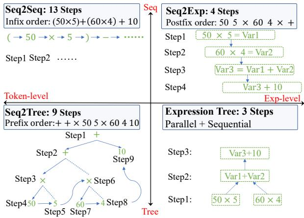
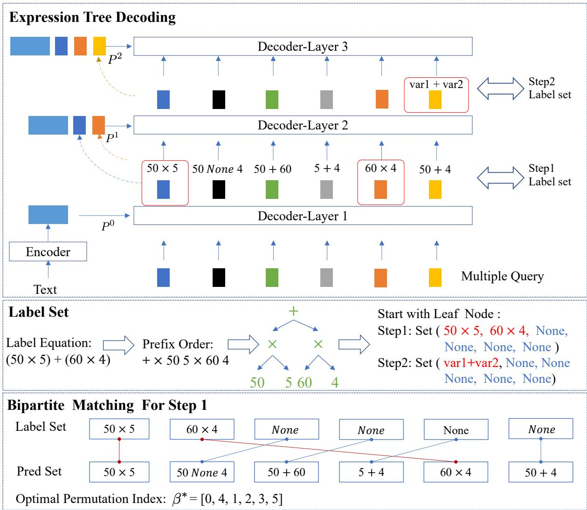
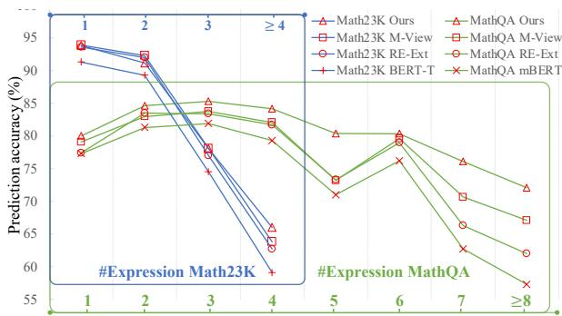
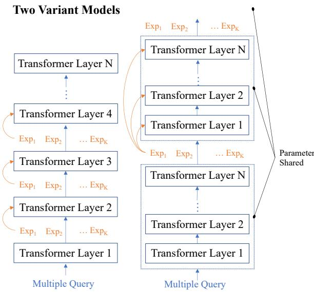
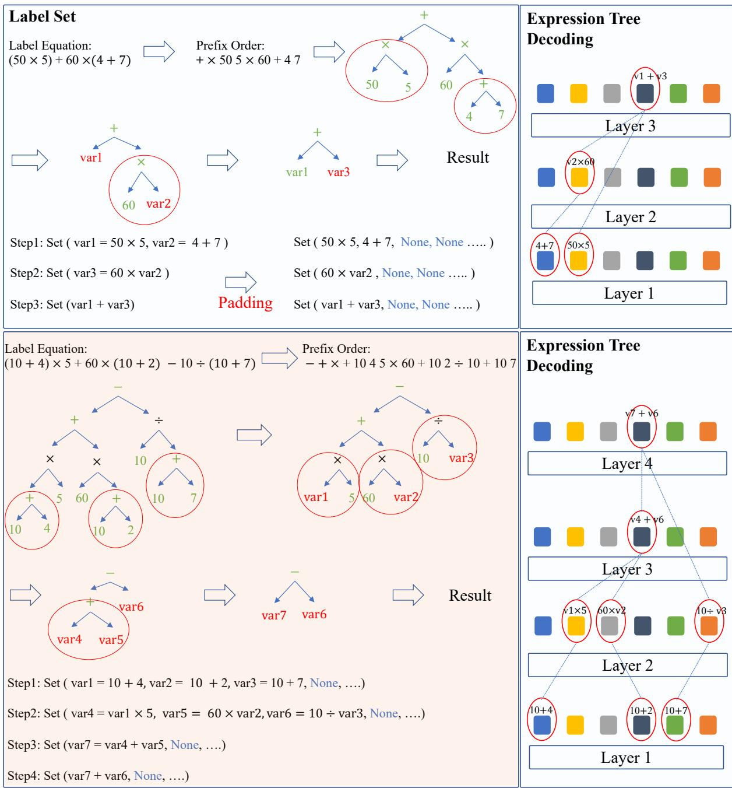
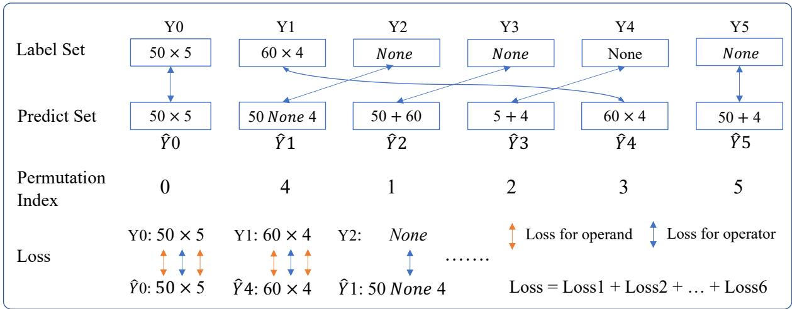
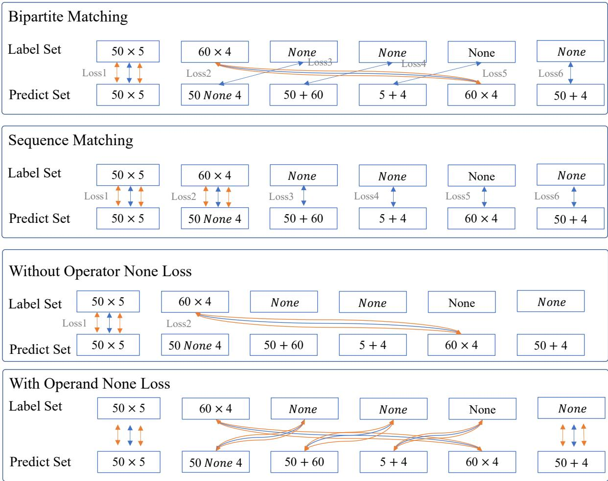
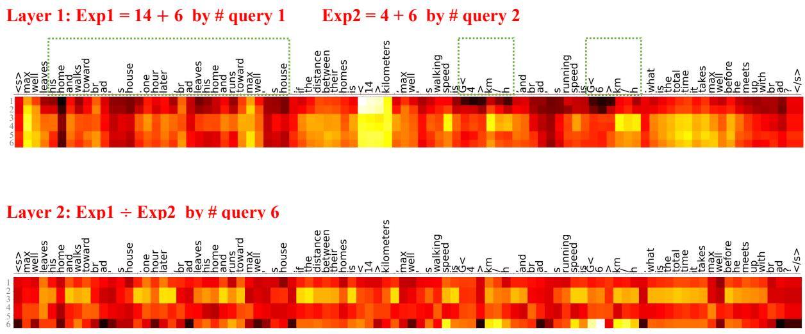
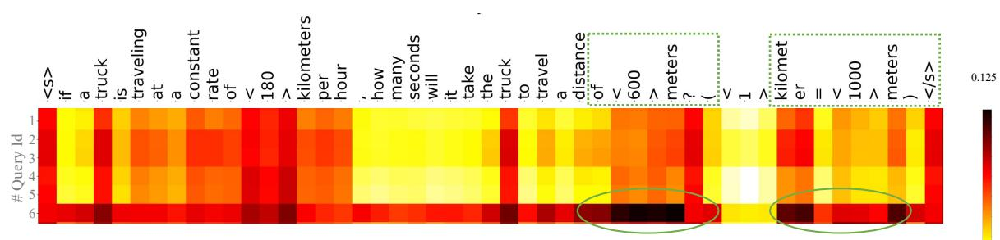
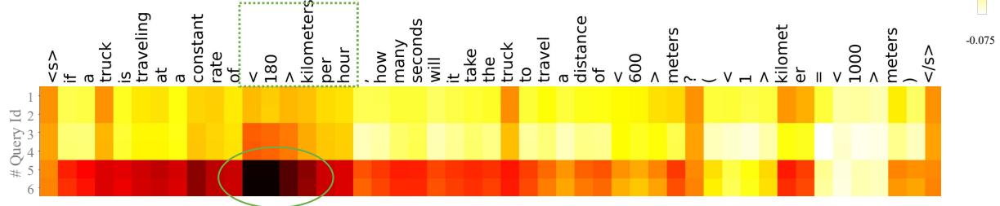

# An Expression Tree Decoding Strategy for Mathematical Equation Generation

Wenqi Zhang1, Yongliang Shen1† , Qingpeng Nong2, Zeqi Tan1 Yanna Ma3, Weiming Lu1†

1College of Computer Science and Technology, Zhejiang University 2Zhongxing Telecommunication Equipment Corporationy 3University of Shanghai for Science and Technology {zhangwenqi, luwm}@zju.edu.cn

## Abstract

Generating mathematical equations from natural language requires an accurate understanding of the relations among math expressions. Existing approaches can be broadly categorized into token-level and expression-level generation. The former treats equations as a mathematical language, sequentially generating math tokens. Expression-level methods generate each expression one by one. However, each expression represents a solving step, and there naturally exist parallel or dependent relations between these steps, which are ignored by current sequential methods. Therefore, we integrate tree structure into the expression-level generation and advocate an expression tree decoding strategy. To generate a tree with expression as its node, we employ a layer-wise parallel decoding strategy: we decode multiple independent expressions (leaf nodes) in parallel at each layer and repeat parallel decoding layer by layer to sequentially generate these parent node expressions that depend on others. Besides, a bipartite matching algorithm is adopted to align multiple predictions with annotations for each layer. Experiments show our method outperforms other baselines, especially for these equations with complex structures.

## 1 Introduction

Generating corresponding mathematical equations and solutions from text is important for a range of tasks, such as dialogues, question answering, math word problem (MWP), etc. It necessitates an accurate comprehension of semantics and the complex relations between mathematical symbols.

We investigate the existing approaches from two perspectives: the generation is at the token-level or expression-level, and the order is based on sequence or tree structure. Firstly, sequence-tosequence methods (seq2seq in Figure 1) (Wang et al., 2017, 2018; Chiang and Chen, 2019; Li et al.,

Question: Two cars are traveling from two places 10 km apart, the speed of the first car is 50km/h, the speed of the second car is 60km/h, the first car drives for 5 hours, the second car drives for 4 hours, finally how far apart are the two cars?  
  
Figure 1: Four equation generation methods: Seq2Seq generates mathematical tokens one by one at the tokenlevel; Seq2Tree generates tokens using prefix order. In contrast, Seq2Exp generates expressions one by one at expression-level. Our expression tree decoding strategy predicts multiple math expressions in parallel and forms a tree, with the minimum decoding steps.

2019) have considered mathematical symbols as a special kind of language (i.e., mathematical language) and employ sequential generation for the equation. These methods belong to the token-level sequential generation. Then a great deal of work (Xie and Sun, 2019; Zhang et al., 2020; Patel et al., 2021a; Li et al., 2020; Zhang et al., 2022c; Shen et al., 2022b) has proposed a tree-order decoding process (seq2tree in Figure 1) at the token-level. This process considers it as an equation tree generation and predicts pre-order tokens one by one.

Recently, some researchers have explored expression-level approaches for mathematical equation generation, including (Kim et al., 2020; Cao et al., 2021; Jie et al., 2022; Zhang and Moshfeghi, 2022; Zhang et al., 2022a). These approaches mostly place emphasis on generating a mathematical expression step by step (seq2exp), rather than a token. These seq2exp methods belong to a sequential generation at expression-level.

However, it is imperative to recognize that each mathematical expression represents a problemsolving step, and there inherently exists a parallel or dependent relation among these steps. The existing seq2exp approach may struggle to capture these relations since they only produce expressions in sequence. Therefore, there is a pressing need for a versatile decoding strategy capable of simultaneously generating independent expressions in parallel at one step, while sequentially producing expressions that depend on others step by step.

Based on this belief, we propose an expression tree decoding strategy by combining the seq2exp with a tree structure at the expression level. Differing from the prior seq2tree, each node in this tree represents an expression, rather than a token. To construct an expression-level tree, we generate multiple expressions in parallel at each step. These expressions are independent to each other and act as the leaf node in the expression tree. Those expressions depend on others, they act as parent nodes and are sequentially generated based on their child nodes. As shown in Figure 1, the two expressions $( 5 0 \times 5 , 6 0 \times 4 )$ are completely independent and generated in parallel at Step 1. The third expression depends on the first two, forming an expression tree. It not only empowers the model to exploit the inherent structure of the equation but also shortens its decoding path (the minimum steps in Figure 1).

To achieve this, we design a layer-wise parallel decoding strategy. At each decoder’s layer, it can generate multiple independent expressions in parallel and then proceeds to the next layer, and repeat parallel prediction layer by layer. This layerwise parallel decoding process ensures that these independent expressions are produced in parallel, while these expressions depending on others are sequentially generated layer by layer, eventually constructing the entire expression tree.

Besides, to decode multiple expressions in parallel, we take inspiration from query-based object detection (Carion et al., 2020; Jaegle et al., 2021; Li et al., 2023). Similar to detecting multiple visual objects by queries, we also utilize queries to identify multiple mathematical relations for expression generation in parallel. Lastly, we adopt a bipartite matching algorithm for loss calculation between multiple predicted expressions and the label.

Cao et al. (2021) shares some similarities with us but the challenges and approaches are different.

Cao et al. (2021) perform a bottom-up structure to extract multiple equations (e.g., x+y=3, y-2=4), whereas our method considers how to predict multiple expressions in parallel for a complex equation at each step (e.g., output 50  5, 60  4 simultaneously for $5 0 \times 5 + 6 0 \times 4 )$ . Besides, Cao et al. (2021) enumerates all possible expression combinations but we first introduce bipartite matching to achieve parallel prediction.

Our contributions are threefold:

• We introduce an expression tree decoding strategy by combining seq2exp with tree structure. It considers the dependent or parallel relation among different expressions (solving steps). To the best of our knowledge, this is the first effort to integrate query-based object detection techniques with equation generation in the literature.

• We design a layer-wise parallel decoding process to construct an expression tree. It predicts multiple independent expressions in parallel and repeats parallel decoding layer by layer. Besides, we employ bipartite matching to align predicted expressions with labels.

• To assess our method, we evaluate on MWP task and outperform prior baselines with higher accuracy and shorter steps.

By aligning the decoding process with the inherent structure of the equation, our approach paves the way for more intuitive, efficient equation generation. Moreover, it provides insights that could be applicable to many other structured tasks.

## 2 Related work

In advancing toward general-purpose AI, dependable reasoning remains imperative. The quest for human-equivalent reasoning has been rigorously explored in domains including NLP (Kojima et al., 2022), RL (Zhang et al., 2022b), and Robotics (Zhang et al., 2021). Recently, leveraging the planning and reasoning capabilities of LLMs paves the way for the development of numerous intelligent applications (Wei et al., 2022; Shen et al., 2023; Zhang et al., 2023b). Accurate generation of mathematical equations is an important manifestation of reasoning abilities, which has been extensively investigated in a plethora of NLP tasks, e.g., Math Word Problems (Wang et al., 2017; Ling et al., 2017; Xie and Sun, 2019; Wang et al., 2022a), Question Answering (Yu et al., 2018; Wu et al.,

2020b), Dialogue (Bocklisch et al., 2017; Wu et al., 2022, 2023), etc. These tasks necessitate an accurate understanding of the semantics within the text as well as mathematical symbols.

Token-level Generation Mathematical equation was treated as a translation task from human language into the mathematical token (symbol) (Wang et al., 2017; Chiang and Chen, 2019). Many seq2seq-based methods were proposed with an encoder-decoder framework. Li et al. (2019) introduced a group attention to enhance seq2seq performance. Lan et al. (2021) utilized a transformer model for equation generation. Except for seq2seq methods, some researchers (Liu et al., 2019a; Xie and Sun, 2019; Zhang et al., 2020, 2022c) studied the decoding structures and proposed a treebased decoder using prefix sequence. Wu et al. (2020a, 2021); Qin et al. (2021); Yu et al. (2021) introduced mathematical knowledge to solve the complex math reasoning. Liang et al. (2021b) improved accuracy by knowledge distillation between the teacher and student. Li et al. (2021) proposed a prototype learning through contrasting different equations. Shen et al. (2022a); Liang et al. (2022) also used contrastive learning at the semantic and symbolic expression levels. Yang et al. (2022b) improved the interpretability by explicitly retrieving logical rules. These generative approaches were token-level generation in infix order or prefix order.

Expression-level Generation Expression-level generation has opened up a new perspective for math solving. Kim et al. (2020) proposed an expression pointer generation. Cao et al. (2021) introduced a DAG structure to extract two quantities from bottom to top. Jie et al. (2022); Wang and Lu (2023) further treated this task as an iterative relation extraction to construct an expression at each step. Zhang and Moshfeghi (2022) treated expression generation as a program generation and execution. Besides, Lee and Kim (2023); Zhang et al. (2023a); He-Yueya et al. (2023); Zhu et al. (2022) harness the capabilities of LLMs and prompt engineering to bolster mathematical reasoning under the few-shot setting. These methods treat equation generation as a multi-step expression generation and achieve impressive performance. However, these methods generate only one expression per step using pre-defined order, which may potentially impede the model’s acuity in accurately understanding mathematical logic. In contrast, our method generates multiple expressions in parallel per step.

## 3 Methodology

## 3.1 Overview

The task is to generate a complete equation based on the problem description. The generation process contains two vocabularies: number and operator vocabulary $( \mathrm { ~ } V _ { o p } { = } \{ + , - , \times , { \div } , \cdots \} )$ . The number is either from the original text or the math expression results from previous steps.

Similar to object detection, where queries are utilized to detect multiple objects, we also feed multiple learnable queries to identify possible math relations. As shown in Figure 2, a standard decoder and multiple queries are adopted to generate candidate expressions at each layer. To construct an expression tree, we must consider two structures simultaneously: parallel and sequential. For these expressions that have no dependent relations, we employ a parallel strategy to generate them. Conversely, for these expressions that depend on others, we generate them layer by layer (§ 3.2). We also provide detailed cases in Figure A2 for decoding. When training, we utilize a bipartite matching algorithm to align the multiple predicted expressions with the label set for loss calculation (§ 3.3).

## 3.2 Layer-wise Parallel Decoding

We devise a problem encoder, a decoder, and multiple learnable queries, where the query is used to identify a specific mathematical relation and then produce a candidate expression at each layer.

Problem Encoder Given a text description X with $N _ { n }$ number words, we adopt the pre-trained language model (Devlin et al., 2019; Liu et al., 2019b) to obtain the contextualized problem representations $P _ { - }$ . We obtain number vocabulary $V _ { n } =$ $\{ e _ { n } ^ { i } \} _ { i = 1 } ^ { N _ { n } }$ from $P ,$ , which denotes the embeddings of the $N _ { n }$ number tokens from text. In addition, we randomly initialize the learnable embedding for each operator and a None label $V _ { o p } = \{ e _ { o p } ^ { j } \} _ { i = 1 } ^ { N _ { o p } + 1 }$

Learnable Query The decoder is designed for extracting all candidate expressions in parallel based on problem representation. Firstly, we design learnable embeddings as query $Q = \{ q _ { i } \} _ { i = 1 } ^ { K } ,$ where K means the number of the query. As shown in Figure 2, the K queries are firstly fed into the decoder and then are utilized to predict K possible expressions at each layer.

Specifically, the decoder is the standard transformer decoder which contains a stack of identical layers. At the l-th layer, the problem embeddings $P ^ { l - 1 }$ and the query embeddings $Q ^ { l - 1 }$ from the previous layer are fed into the current decoder’s layer as inputs, and then interact with each other by self-attention and cross-attention mechanism:

  
Figure 2: We propose an expression tree decoding strategy by layer-wise parallel decoding. During training, we feed six queries into the decoder, where each decoder’s layer generates six mathematical expressions. Then, we transform the original equation label into multiple label sets and employ a bipartite matching algorithm to align the label sets with the six predicted expressions for loss calculation. Thereafter, we update the problem representation using valid expressions and feed it into the next decoding layer. The whole process forms an expression tree.

$$
Q ^ { l } = \mathrm { D e c o d e r - L a y e r } ^ { l } ( Q ^ { l - 1 } ; P ^ { l - 1 } )\tag{1}
$$

where $Q ^ { l }$ means K query embeddings at l-th layer.

Parallel Decoding After obtaining K query vectors, we use them to predict K expressions in parallel, each of which contains one operator and two operands $( \underline { { l } } , \ o p , \underline { { r } } )$ . Firstly, we use query to calculate the operator and operands embedding:

$$
s _ { i } ^ { l } , s _ { i } ^ { r } , s _ { i } ^ { o p } = \mathbf { M L P } ^ { l , r , o p } ( q _ { i } ) , q _ { i } \in Q ^ { l }\tag{2}
$$

where $q _ { i }$ denotes the i-th query vectors in $Q ^ { l }$ . Then,

we predict three distributions as follows:

$$
P _ { i } ^ { l , r } ( * ) = \mathrm { S o f t m a x } ( s _ { i } ^ { l , r } e _ { n } ) , \forall e _ { n } \in V _ { n }\tag{3}
$$

$$
P _ { i } ^ { o p } ( * ) = \mathrm { S o f t m a x } ( s _ { i } ^ { o p } e _ { o p } ) , \forall e _ { o p } \in V _ { o p }\tag{4}
$$

where $e _ { n }$ and $e _ { o p }$ represent the number and operator embedding in vocabulary respectively. $P _ { i } ^ { l } ( * )$ $P _ { i } ^ { r } ( * )$ , and $P _ { i } ^ { o p } ( * )$ denotes the three distributions for two operands and one operator. Lastly, we calculate the embedding for this i-th expression:

$$
v a r _ { i } = \mathsf { M L P } ^ { n } ( [ s _ { i } ^ { o p } ; s _ { i } ^ { l } ; s _ { i } ^ { r } ; s _ { i } ^ { l } \circ s _ { i } ^ { r } ] )\tag{5}
$$

We totally predict K independent expressions from K queries at this layer. Then we continue to the next layer for these expressions depending on previous results (e.g.,var1 + var2 in Figure 2).

Layer by Layer Prediction The K predicted expressions contain $K _ { 1 }$ valid expressions and $K _ { 2 }$ invalid expressions. An invalid expression implies that the operator in $( \underline { { l } } , o p , \underline { { r } } )$ is predicted to None. We will discuss it in section (§ 3.3). First, we concat all valid expression embeddings with the problem representations $P ^ { l - 1 }$ for the next layer:

$$
P ^ { l } = \mathbf { M } \mathbf { L } \mathbf { P } ^ { u } ( [ P ^ { l - 1 } \oplus v a r _ { 1 } \oplus v a r _ { 2 } . . . . \oplus v a r _ { K _ { 1 } } ] )\tag{6}
$$

where $v a r _ { 1 } , v a r _ { 2 } , . . . . , v a r _ { K _ { 1 } }$ means $K _ { 1 }$ new generated expression embeddings in l-th layer. means the concatenation of the vectors. Besides, we also update the number embedding: $V _ { n } ^ { l } \ =$ $V _ { n } ^ { l - 1 } \cup v a r _ { 1 } \cup v a r _ { 2 } . . . . \cup v a r _ { K _ { 1 } }$ using $K _ { 1 }$ new expression embeddings as new number embeddings.

As shown in Figure 2, we proceed to the next layer of decoding using $P ^ { l }$ and $Q ^ { l }$ , as Equation 1:

$$
Q ^ { l + 1 } = \mathrm { D e c o d e r - L a y e r } ^ { l + 1 } ( Q ^ { l } ; P ^ { l } )\tag{7}
$$

At layer $l + 1$ , we still decode K expressions in parallel and continue to the next layer. If all predicted expressions are invalid, i.e., K operators are classified as None, it signifies the equation generation is complete.

## 3.3 Loss For Parallel Decoding

As mentioned before, each decoder’s layer generates multiple mathematical expressions. However, the annotations of equations in the dataset are usually serial $( \mathrm { e . g . , ~ } ^ { \ast \ast } 5 0 ^ { \ast \prime } , ~ ^ { \ast \ast } \times ^ { \ast \prime } , ~ ^ { \ast \ast } 5 ^ { \prime \prime } , ~ ^ { \ast \ast } + ^ { \ast \prime } , ~ ^ { \ast \ast } 6 0 ^ { \ast \prime } , ~ ^ { \ast \ast } \times ^ { \ast \prime }$ “4”), and it is crucial to design a method to utilize these annotations for training parallel decoding.

To this end, we first convert the original equation annotations into multiple label sets, each set comprising K mathematical expressions. Then, bipartite matching is employed to align the K predicted expressions with the K mathematical expressions in the label set to compute model loss.

Label Set As shown in Figure 2, we initially convert the label equations from infix order to prefix order, thus forming an equation tree. Starting from the leaf nodes, we iterative gather two leaves and their parent node into a label set for each step, eventually producing multiple label sets (e.g. set1 $= \{ 5 0 \times 5 , 6 0 \times 4 \} , \mathrm { s e t } 2 = \{ v a r 1 \times v a r 2 \} )$ . Each label set contains several non-dependent expressions that can be generated in parallel. Each label set is also padded with a specific label None to ensure all sets contain K elements. We provide two detailed cases for this process in Figure A2.

Bipartite Match For each layer, K candidate mathematical expressions are predicted. We compute the function loss for the K predicted expressions based on the corresponding label set, which also contains K golden expressions. However, as the K expressions are unordered, it is difficult to calculate the loss directly. For instance, if the label set is $\{ 5 0 \times 5 , 6 0 \times 4 \}$ , and the prediction is $\{ 6 0 \times 4 , 5 0 \times 5 \}$ , the loss in this case should be 0. To address this, we adopt a bipartite matching algorithm to align the two sets, i.e., align the K predictions with the K golden labels. As shown in Figure 2, six golden expressions align with six predicted expressions. Specifically, we denote the golden expression in the label set as $\left\{ y _ { 1 } , y _ { 2 } , . . . , y _ { K } \right\}$ , and the set of predicted expressions by $\hat { y } = \{ \hat { y } _ { i } \} _ { i = 1 } ^ { K }$ To find an optimal matching, we search for a permutation $( \beta \in { \mathcal { O } } _ { K } )$ of K elements with the lowest cost. As shown in Figure 2, the optimal permutation for predicted set is $\left[ \hat { y } _ { 0 } , \hat { y } _ { 4 } , \hat { y } _ { 1 } , \hat { y } _ { 2 } , \hat { y } _ { 3 } , \hat { y } _ { 5 } \right]$ . It can be formalized as:

$$
\beta ^ { * } = \underset { \beta \in \mathcal { O } _ { K } } { \arg \operatorname* { m i n } } \sum _ { i } ^ { K } \mathcal { L } _ { \mathrm { m a t c h } } \left( y _ { i } , \hat { y } _ { \beta ( i ) } \right)\tag{8}
$$

where $\mathcal { L } _ { \mathrm { m a t c h } } \left( y _ { i } , \hat { y } _ { \beta ( i ) } \right)$ is a pair matching cost between the golden expression yi and the predicted expression $\hat { y }$ with index $\beta ( i )$ . We use the Hungarian algorithm (Kuhn, 1955) to compute this pair-matching cost. Each golden expression contains two operands and one operator, i.e. $y _ { i } =$ $( l _ { i } , o p _ { i } , r _ { i } )$ and each predicted expression has three distributions, i.e. $\hat { y } _ { i } ~ = ~ ( P _ { i } ^ { l } ( * ) , P _ { i } ^ { o p } ( * ) , P _ { i } ^ { r } ( * ) )$ We calculate ${ \mathcal { L } } _ { \mathrm { m a t c h } }$ as follow:

$$
\begin{array} { r l } { \mathcal { L } _ { \mathrm { m a t c h } } \left( y _ { i } , \hat { y } _ { \beta \left( i \right) } \right) = - \mathbb { 1 } _ { \left\{ o p _ { i } \neq N o n e \right\} } \left[ p _ { \beta \left( i \right) } ^ { o p } \left( o p _ { i } \right) \right. } \\ { + } & { { } \left. p _ { \beta \left( i \right) } ^ { l } \left( l _ { i } \right) + p _ { \beta \left( i \right) } ^ { r } \left( r _ { i } \right) \right] } \end{array}\tag{9}
$$

After we get the optimal matching $\beta ^ { * }$ , we calculate the final loss $\mathcal { L } ( y , \hat { y } )$ as:

$$
\begin{array} { l } { { \displaystyle { \mathcal { L } } ( y , \hat { y } ) = \sum _ { i = 1 } ^ { N } \left\{ - \log p _ { \beta ^ { * } ( i ) } ^ { o p } \left( o p _ { i } \right) \right. } \ ~ } \\ { { \displaystyle ~ + \left. \mathbb { 1 } _ { \{ o p _ { i } \neq N o n e \} } \left[ - \log p _ { \beta ^ { * } ( i ) } ^ { l } \left( l _ { i } \right) \right. \right. } \ ~ } \\ { { \displaystyle \left. \left. - \log p _ { \beta ^ { * } ( i ) } ^ { r } \left( r _ { i } \right) \right] \right\} } } \end{array}\tag{10}
$$

We calculate the predicted loss for each decoder layer after aligning two sets. A detailed match process is provided in Figure A3.

<table><tr><td rowspan=1 colspan=1></td><td rowspan=1 colspan=1>Model</td><td rowspan=1 colspan=1>Test Acc.</td></tr><tr><td rowspan=5 colspan=1>Sg / re</td><td rowspan=5 colspan=1>GroupAttn(Li et al., 2019)GTS (Xie and Sun, 2019)G2T(Zhang et al., 2020)BERT-T(Liang et al., 2021a)mBERT(Tan et al., 2021)T-Dis†(Liang et al., 2021b)Prototype (Li et al., 2021)Textual-CL†(Shen et al., 2022a)Ana-CL (Liang et al., 2022)</td><td rowspan=1 colspan=1>70.4</td></tr><tr><td rowspan=1 colspan=1>71.3</td></tr><tr><td rowspan=1 colspan=1>72.0</td></tr><tr><td rowspan=1 colspan=1>73.8</td></tr><tr><td rowspan=1 colspan=1>77.173.176.37879.6</td></tr><tr><td rowspan=1 colspan=1>Sexp</td><td rowspan=1 colspan=1>E-pointer†(Kim et al., 2020)M-Tree†(Wang et al., 2022a)RE-Ext(Jie et al., 2022)M-View(Zhang et al., 2022a)Elastic (Zhang and Moshfeghi, 2022)MWP-NAS†(Bin et al., 2023)</td><td rowspan=1 colspan=1>73.576.578.679.580.379.2</td></tr><tr><td rowspan=1 colspan=1>WT</td><td rowspan=1 colspan=1>gpt-3.5-turbo†(OpenAI, 2022)Self-Consistency†(Wang et al., 2022b)</td><td rowspan=1 colspan=1>42.650.7</td></tr><tr><td rowspan=1 colspan=1></td><td rowspan=1 colspan=1>OursOurs (Layer-Shared)</td><td rowspan=1 colspan=1>81.5±0.1381.1 ±0.23</td></tr></table>

Table 1: Results on MathQA. † means our reproduction.  means we reproduce M-View using the standard dataset without data Augmentation (their report). means Elastic use a different data pre-processing method and operators, so we reproduce their method.

## 3.4 Training and Inference

During training, we calculate the loss after employing the bipartite match for each layer. Besides, we also adopt the teacher forcing (Williams and Zipser, 1989) by using golden expressions for the next layer (Equation 5, 6). During inference, each layer predicts K expressions in parallel. Those expressions whose predicted operator is None are filtered out before proceeding to the next layer generation. The entire process is finished when all K expressions are predicted to be None.

## 4 Experiments

Math Word Problem Task We first evaluate our expression tree decoding strategy on the Math Word Problem task (MWP). MWP represents a challenging mathematical reasoning task where the model is required to comprehend the semantics of a given problem and generate a complete equation and the solution. Encompassing a spectrum of topics, including engineering, arithmetic, geometry, and commerce, MWP effectively evaluates the model’s prowess in semantic understanding as well as mathematical symbol generation. We use three standard MWP datasets1 across two languages:

<table><tr><td>GroupAttn(2019)</td><td>Model</td><td>Test</td><td>5-fold</td></tr><tr><td>Sg / re</td><td>GTS (2019) G2T(2020) mBERT(2021) Symbol-Dec(2021) BERTGen(2021) PLM-Gen (2021) H-Reasoner(2021) BERT-T(2021a) Rank†(2021) Logic-Dec(2022b) T-Dis(2021b) Prototype (2021) Textual-CL (2022a)</td><td>69.5 75.6 77.4 75.1 76.6 76.9 83.9 84.4 85.4 83.4 79.1 83.2 85.0</td><td>66.9 74.3 75.5 75.7 82.2 82.3 77.2 82.6† 83.2†</td></tr><tr><td>Sexp</td><td>Ana-CL (2022) E-Pointer†(2020) DAG (2021) M-Tree(2022a) RE-Ext(2022) M-View(2022a) Elastic†(2022) MWP-NAS(2023)</td><td>85.6 78.7 77.5 82.5 85.4 85.6 84.8 84.4</td><td>76.5 75.1 80.8† 83.3 83.1 82.9</td></tr><tr><td>WT</td><td>gpt-3.5-turbo†(2022) Self-Consistency†(2022b)</td><td>54.8 66.1</td><td></td></tr><tr><td></td><td>Ours Ours (Layer-Shared)</td><td>86.2±0.30 85.6±0.25</td><td>84.1 ±0.65 83.4±0.38</td></tr></table>

Table 2: Testing and five-fold Acc. on Math23k.

MathQA (Amini et al., 2019), Math23K (Wang et al., 2017), and MAWPS (Koncel-Kedziorski et al., 2016). We follow (Jie et al., 2022; Zhang et al., 2022a) to preprocess datasets. The statistics of datasets are reported in Appendix A.3.

Baselines We compare our method with three types of baselines: (1) Seq2Seq/Tree: PLM-Gen (Lan et al., 2021), Rank (Shen et al., 2021), Symbol-Dec (Qin et al., 2021), H-Reasoner (Yu et al., 2021), Logic-Dec (Yang et al., 2022b), Prototype (Li et al., 2021), T-Dis (Liang et al., 2021b), Textual-CL (Shen et al., 2022a), Ana-CL (Liang et al., 2022) and several representative methods. (2) Seq2Exp: E-Pointer (Kim et al., 2020), DAG (Cao et al., 2021), RE-Ext (Jie et al., 2022), M-View (Zhang et al., 2022a), ELASTIC(Zhang and Moshfeghi, 2022), M-Tree (Wang et al., 2022a) and MWP-NAS (Bin et al., 2023). Besides, we also compare with gpt-3.5-turbo (OpenAI, 2022) and Self-Consistency (Wang et al., 2022b) prompted by one demonstration through the OpenAI API. More details are listed in Appendix A.1.

Training Details Following most previous works (Zhang et al., 2022a; Jie et al., 2022), we report the average accuracy (five random seeds) with standard deviation for Math23K and MathQA, and 5-fold cross-validation for Math23K and MAWPS. The test-set accuracy is chosen by the best dev-set accuracy step. Since most of the math problems only require two or three mathematical expressions to be generated in parallel for each step, we set the number of queries K to be 6, which is sufficient to cover all cases. Except for using a standard decoder for layer-wise decoding (Our), we also explore an alternate variant (Our Layer-Shared), in which parallel decoding is performed at every N transformer layer, but each decoding step shares the parameter of these N layers. This model is efficient with fewer parameters. Model details are reported in Figure A1.

<table><tr><td rowspan=1 colspan=1></td><td rowspan=1 colspan=3>Model</td><td rowspan=1 colspan=1>5-fold Acc.</td></tr><tr><td rowspan=12 colspan=1>Sg / re</td><td rowspan=12 colspan=3>GroupAttn(2019)GTS (2019)G2T(2020)Rank(2021)BERTGen(2021)PLM-Gen (2021)PLM-GTS (2021a)PLM-G2T (2021a)H-Reasoner(2021)T-Dis(2021b)Prototype† (2021)Textual-CL† (2022a)Ana-CL†(2022)</td><td rowspan=1 colspan=1>76.1</td></tr><tr><td rowspan=1 colspan=1>82.6</td></tr><tr><td rowspan=1 colspan=1>85.6</td></tr><tr><td rowspan=1 colspan=1>84.0</td></tr><tr><td rowspan=1 colspan=1>86.9</td></tr><tr><td rowspan=1 colspan=1>88.4</td></tr><tr><td rowspan=1 colspan=1>88.5</td></tr><tr><td rowspan=1 colspan=1>88.7</td></tr><tr><td rowspan=1 colspan=1>89.8</td></tr><tr><td rowspan=1 colspan=2></td><td rowspan=1 colspan=1>84.2</td></tr><tr><td rowspan=1 colspan=2></td><td rowspan=1 colspan=1>89.6</td></tr><tr><td rowspan=1 colspan=1>91.391.8</td></tr><tr><td rowspan=3 colspan=1>Sexp</td><td rowspan=3 colspan=3>E-Pointer (2020)M-Tree(2022a)RE-Ext(2022)M-View (2022a)Elastic (2022)MWP-NAS(Bin et al., 2023)</td><td rowspan=1 colspan=1>83.4</td></tr><tr><td rowspan=1 colspan=1></td><td rowspan=1 colspan=1>82.0</td></tr><tr><td rowspan=1 colspan=1>92.292.191.888</td></tr><tr><td rowspan=1 colspan=1>WT</td><td rowspan=1 colspan=3>gpt-3.5-turbo†(2022)Self-Consistency†(2022b)</td><td rowspan=1 colspan=1>91.592.5</td></tr><tr><td rowspan=1 colspan=1></td><td rowspan=1 colspan=3>OursOurs (Layer-Shared)</td><td rowspan=1 colspan=1> $9 2 . 3 \pm 0 . 4 1$  $9 2 . 2 \pm 0 . 2 8$ </td></tr></table>

Table 3: Five-fold cross-validation results on MAWPS.

## 4.1 Results

As shown in Table 1, 2 and 3, our expression tree decoding strategy achieves SoTA performance on two large datasets, especially on the most difficult MathQA with +1.2% gains. Similarly, we gain +0.6% (test) and +0.8% (5-fold) improvements on Math23K and comparable performance on the MAWPS. Moreover, we also notice that our performance still substantially outperforms LLMs in the case of complex mathematical equation generation (MathQA: +30.8% and Math23K: +20.1%). Furthermore, our variant model (Our w/ Layer-Shared) has also demonstrated comparable performance (+0.8% on MathQA), with fewer parameters.

<table><tr><td>Math23K</td><td>Seq2Exp</td><td>Our</td><td>Seq2Seq</td><td>Seq2Tree</td></tr><tr><td>Avg Step</td><td>2.4</td><td>1.92</td><td>7.01</td><td>5.62</td></tr><tr><td>Std Step</td><td>1.22</td><td>0.8</td><td>3.4</td><td>2.1</td></tr><tr><td>Max Step</td><td>9</td><td>8</td><td>27</td><td>19</td></tr><tr><td>MathQA</td><td>Seq2Exp</td><td>Our</td><td>Seq2Seq</td><td>Seq2Tree</td></tr><tr><td>Avg Step</td><td>4.33</td><td>3.2</td><td>16.74</td><td>9.87</td></tr><tr><td>Std Step</td><td>2.26</td><td>1.6</td><td>11.03</td><td>5.51</td></tr><tr><td>Max Step</td><td>11</td><td>8</td><td>109</td><td>55</td></tr></table>

Table 4: The statistics for decoding steps between four types of methods.

<table><tr><td>Variant</td><td>Acc.</td></tr><tr><td>Bipartite Matching</td><td> ${ \bf 8 1 . 5 \_ 0 . 1 3 }$ </td></tr><tr><td>Sequence Matching</td><td> $7 8 . 8 \pm 0 . 2 7$ </td></tr><tr><td>Random Matching</td><td> $2 0 . 1 \pm 1 . 5 5$ </td></tr><tr><td>w/ Operand None Loss</td><td> $8 0 . 7 \pm 0 . 3 6$ </td></tr><tr><td>w/o Operator None Loss</td><td> $7 9 . 6 \pm 0 . 2 1$ </td></tr><tr><td>w/o Parallel decoding</td><td> $7 9 . 9 \pm 0 . 3 1$ </td></tr></table>

Table 5: Ablation on MathQA about bipartite matching.

From the view of three types of methods, our method is more stable and effective, with +1.9% and +1.2% gains against the best Seq2Tree baseline (Ana-CL) and best Seq2Exp baseline (Elastic) on MathQA. The Seq2Exp focuses on generation at the sequence at the expression-level, while Seq2Tree absorbs the feature of a tree structure. In contrast, our expression tree decoding strategy, more than generating the expressions, also integrates the tree structure into the parallel decoding process, performing well for complex equations.

In addition to the accuracy comparison, we also analyze the difference in the number of decoding steps. We report the average decoding steps, step standard deviation, and maximum steps for the four types of methods (Seq2Seq: mBERT, Seq2Tree: Ana-CL, Seq2Exp: RE-Ext, and Expression-tree: Ours) in Table 4. We observe that the decoding steps of the token-level generation methods (e.g., Seq2Seq and Seq2Tree) are significantly higher than those of Expression-level methods (about four to five times). Compared to other methods, our parallel decoding method requires fewer decoding steps, especially on the more complex MathQA. We offer some intuitive examples in Figure A2. These results suggest that our parallel strategy not only offers superior accuracy but also reduces the number of decoding steps.

<table><tr><td colspan="2">Equation Type</td><td colspan="2">Diagram</td><td colspan="2">Example</td></tr><tr><td>Single</td><td></td><td>Exp 1</td><td></td><td></td><td>a÷b</td></tr><tr><td>Expression Chain</td><td>Exp1</td><td>Exp 2</td><td></td><td>Exp3</td><td>(a + b) × c − d</td></tr><tr><td rowspan="4">Expression Tree</td><td>Exp 1</td><td></td><td></td><td></td><td rowspan="4"></td></tr><tr><td></td><td>Exp 4</td><td></td><td>Exp 5(a + b) × (c − d) − e ÷ f</td></tr><tr><td>Exp 2</td><td></td><td></td><td></td></tr><tr><td>Exp 3</td><td></td><td></td><td></td></tr></table>

## 4.2 Ablations

Bipartite matching is essential for our parallel strategy. Therefore, we study how it works: I. Sequence Matching. Firstly, we ablate bipartite matching and instead use a simple matching strategy for multiple expressions: sequence matching. It means we align the first expression predicted by the first query with the first label, and then the second predicted expression aligns with the second label, and so on. II. Random Matching. Then we random match the predicted expressions with the labels. III. Operand None Loss. As illustrated in Equation 10, for these labels padded with the None category, we only compute the loss for the operator. At this point, we add two operands’ loss between None to analyze its effect. IV. Operator None Loss. We remove the operator loss for the None category. V. Parallel Decoding. Lastly, we remove the whole parallel decoding, i.e., adopt only one query per layer. We provide a detailed visualization for these designs in Figure A3.

As shown in Table 5, when we replace with sequence matching, there is a notable degradation in accuracy (-2.7%). In this case, the performance is similar to the Seq2Exp (RE-Ext:78.6% vs Ablation: 78.8%). It undermines the advantages of expression tree decoding since aligning process still introduces manually-annotated order. Secondly, we find random matching may lead to a training collapse. Then we observe disregarding None operator loss or adding the None operands loss, both having a negative impact (-0.9%, -0.8%). In the last ablation experiments, our performance drops from 81.5% to 79.9% (-1.6%) when we remove the parallel decoding from our system. More comparisons can be found in Appendix A.4.

## 4.3 Analysis

We investigate the efficacy of the expression tree decoding strategy in scenarios involving complex equation generation. We conduct the analysis along two dimensions: the structure of the equation and the length of the equation. Besides, we also analyze the impact of different query numbers on parallel decoding performance.

<table><tr><td rowspan=1 colspan=1>Model</td><td rowspan=1 colspan=1>Single</td><td rowspan=1 colspan=2>Exp Chain</td><td rowspan=1 colspan=1>Exp Tree</td><td rowspan=1 colspan=1>Overall</td></tr><tr><td rowspan=5 colspan=1>M-ViewRE-ExtM-TreeAna-CLOurs</td><td rowspan=1 colspan=1>79.7</td><td rowspan=1 colspan=2>82.7</td><td rowspan=1 colspan=1>65.7</td><td rowspan=1 colspan=1>79.5</td></tr><tr><td rowspan=2 colspan=1>77.475.2</td><td rowspan=1 colspan=2>82.5</td><td rowspan=1 colspan=1>64.7</td><td rowspan=3 colspan=1>78.676.579.6</td></tr><tr><td rowspan=1 colspan=1>80.2</td><td rowspan=1 colspan=1></td><td rowspan=1 colspan=1>64.5</td></tr><tr><td rowspan=1 colspan=1>79.9</td><td rowspan=1 colspan=2>82.8</td><td rowspan=1 colspan=1>67.8</td></tr><tr><td rowspan=1 colspan=1>80.1</td><td rowspan=1 colspan=2>82.0</td><td rowspan=1 colspan=1>75.2</td><td rowspan=1 colspan=1>81.5</td></tr></table>

Table 6: We categorize the structures of equations into three types: Single, Chain and Tree, and evaluate the performance of five methods on three structures.

  
Figure 3: Performance on the sample with the different number of expressions.

Equation Structure In Table 6, we categorize the structures of equations into three types: (1) Single expression, where the entire equation consists of only one expression; (2) Expression chain, where the equation is comprised of multiple expressions forming a chain; (3) Expression Tree, which involves complex tree structures composed of multiple expressions. We evaluate the model’s accuracy on three types of equation structures.

As shown in Table 6, our expression tree decoding strategy gains comparable performance to other baselines in the first two evaluations (Single Expression and Expression Chain). In contrast, in the Expression Tree evaluation, most of these instances in this type involve sophisticated equation structures and complex solving processes. Our method significantly outperforms the other baselines ( +7.4%). Specifically, in comparison to the seq2tree approach, we achieve a +7.4% improvement (Our:75.2% vs Ana-CL:67.8%), and gain a more substantial advantage (+9.5%) relative to the seq2exp method. Under this case, our method outperforms seq2tree, and seq2tree in turn outperforms seq2exp. This clearly demonstrates that introducing the structural feature of equations indeed contributes to the capable of handling equations with complex structures.

Equation Length An equation comprises multiple mathematical expressions, with each expression representing a reasoning step. Complex equations usually contain more expressions. Therefore, we evaluate the performance on the instance with different numbers of expressions. In Figure 3, as the number of expressions increases, the equation becomes more complex and the performance decreases rapidly. However, our method consistently maintains high accuracy ( 70% on MathQA) across all cases, especially on complex cases. Compared with baselines, our advantage increases from +1.0% (#2) to +6.4% (#5). For the equation with the longest expressions ( #8), our strategy maintains an improvement by nearly +6%, showing expression tree decoding strategy is more stable for complex equations.

Query Number We further analyze the impact of the number of queries on parallel decoding performance. The number of queries is set from 1 to 30. As shown in Table A2, as the number of queries increases, the performance initially increases notably and then decreases. Specifically, when there is only one query per layer (# query = 1), the parallel decoding strategy is removed. Conversely, when we adopt too many queries (# query >= 10), the performance of parallel decoding drops rapidly. We speculate that this might be because most of the queries are redundant and are matched to the "None" label under this case. Too many queries may lead to instability in training. Apart from too many or too few queries, the performance gains attributed to parallel decoding remain both stable and pronounced. For instance, as the number of queries fluctuates between 4 and 8, the improvement consistently remains within the range of +1.2% to +1.5%. It suggests that although the number of queries is a hyperparameter, it does not need to be carefully tuned.

## 4.4 Case Study and Visualization

We explore the role of learnable queries in the expression tree decoding process. We first calculate the similarity between query vectors and problem representations for each layer and then visualize the results in Figure A4. As shown in the first case, the sixth query is activated twice through two steps, thus performing two division operations. In the second case, the first and second queries generate two valid expressions (14 + 6, 4 + 6) in parallel in the first layer, and then the last query in the second layer outputs a division operation (Exp1 + Exp2) using two results from the first layer. These examples illustrate that our method is highly flexible and can adaptively predict expressions in parallel or sequentially based on the context, thereby composing an expression tree.

## 5 Conclusion

We devise an expression tree decoding strategy for generating mathematical equations layer by layer. Each layer produces multiple mathematical expressions in parallel which are non-dependent and order-free, achieving flexible decoding. During the training, we employ a bipartite matching algorithm to align the multiple generated expressions with the golden labels and compute the parallel prediction loss under the optimal matching scheme. Extensive experiments demonstrate that our expression tree decoding strategy can effectively absorb the structural features of equations and enhance the capacity for generating complex equations for math reasoning.

## Limitations

Firstly, when faced with a mathematical problem that requires an extensive number of solving steps, we have to increase the number of decoder layers. It consequently leads to an increase in the model parameters. This is due to our layer-wise decoding strategy, where more complex equations require additional decoding layers. To address this, we have designed a variant model with shared parameters (Layer-Shared in Figure A1), which achieves comparable results without modifying layer number.

Secondly, some hyperparameters (e.g., the number of queries and layer), need to be manually adjusted according to the dataset. In the future, we will explore how to utilize our query-based, layerwise expression tree decoding strategy to address a broader range of structured generation tasks.

## Acknowledgments

This work is supported by the Fundamental Research Funds for the Central Universities (No. 226- 2023-00060), Key Research and Development Program of Zhejiang Province (No. 2021C01013), National Key Research and Development Project of China (No. 2018AAA0101900), Joint Project DH-2022ZY0013 from Donghai Lab, and MOE Engineering Research Center of Digital Library.

## References

Aida Amini, Saadia Gabriel, Shanchuan Lin, Rik Koncel-Kedziorski, Yejin Choi, and Hannaneh Hajishirzi. 2019. MathQA: Towards interpretable math word problem solving with operation-based formalisms. In Proceedings of the 2019 Conference ofthe North American Chapter ofthe Associationfor Computational Linguistics: Human Language Technologies, Volume 1 (Long and Short Papers), pages 2357–2367, Minneapolis, Minnesota. Association for Computational Linguistics.

Yi Bin, Mengqun Han, Wenhao Shi, Lei Wang, Yang Yang, and Heng Tao Shen. 2023. Non-autoregressive math word problem solver with unified tree structure. CoRR, abs/2305.04556.

Tom Bocklisch, Joey Faulkner, Nick Pawlowski, and Alan Nichol. 2017. Rasa: Open source language understanding and dialogue management. arXiv preprint arXiv:1712.05181.

Yixuan Cao, Feng Hong, Hongwei Li, and Ping Luo. 2021. A bottom-up dag structure extraction model for math word problems. In Thirty-Fifth AAAI Conference on Artificial 2021, pages 39–46.

Nicolas Carion, Francisco Massa, Gabriel Synnaeve, Nicolas Usunier, Alexander Kirillov, and Sergey Zagoruyko. 2020. End-to-end object detection with transformers. In Computer Vision–ECCV 2020: 16th European Conference, Glasgow, UK, August 23– 28, 2020, Proceedings, Part I 16, pages 213–229. Springer.

Ting-Rui Chiang and Yun-Nung Chen. 2019. Semantically-aligned equation generation for solving and reasoning math word problems. In Proceedings of the 2019 Conference of the North American Chapter of the Association for Computational Linguistics: Human Language Technologies, Volume 1 (Long and Short Papers), pages 2656– 2668, Minneapolis, Minnesota. Association for Computational Linguistics.

Karl Cobbe, Vineet Kosaraju, Mohammad Bavarian, Mark Chen, Heewoo Jun, Lukasz Kaiser, Matthias Plappert, Jerry Tworek, Jacob Hilton, Reiichiro Nakano, et al. 2021. Training verifiers to solve math word problems. arXiv preprint arXiv:2110.14168.

Jacob Devlin, Ming-Wei Chang, Kenton Lee, and Kristina Toutanova. 2019. BERT: Pre-training of deep bidirectional transformers for language understanding. In Proceedings of the 2019 Conference of the North American Chapter ofthe Associationfor Computational Linguistics: Human Language Technologies, Volume 1 (Long and Short Papers), pages 4171–4186, Minneapolis, Minnesota. Association for Computational Linguistics.

Joy He-Yueya, Gabriel Poesia, Rose E Wang, and Noah D Goodman. 2023. Solving math word problems by combining language models with symbolic solvers. arXiv preprint arXiv:2304.09102.

Shifeng Huang, Jiawei Wang, Jiao Xu, Da Cao, and Ming Yang. 2021. Recall and learn: A memoryaugmented solver for math word problems. arXiv preprint arXiv:2109.13112.

Andrew Jaegle, Felix Gimeno, Andy Brock, Oriol Vinyals, Andrew Zisserman, and Joao Carreira. 2021. Perceiver: General perception with iterative attention. In International conference on machine learning, pages 4651–4664. PMLR.

Zhanming Jie, Jierui Li, and Wei Lu. 2022. Learning to reason deductively: Math word problem solving as complex relation extraction. In Proceedings ofthe 60th Annual Meeting of the Association for Computational Linguistics (Volume 1: Long Papers), pages 5944–5955, Dublin, Ireland. Association for Computational Linguistics.

Bugeun Kim, Kyung Seo Ki, Donggeon Lee, and Gahgene Gweon. 2020. Point to the Expression: Solving Algebraic Word Problems using the Expression-Pointer Transformer Model. In Proceedings of the 2020 Conference on Empirical Methods in Natural Language Processing (EMNLP), pages 3768–3779, Online. Association for Computational Linguistics.

Takeshi Kojima, Shixiang Shane Gu, Machel Reid, Yutaka Matsuo, and Yusuke Iwasawa. 2022. Large language models are zero-shot reasoners. arXiv preprint arXiv:2205.11916.

Rik Koncel-Kedziorski, Subhro Roy, Aida Amini, Nate Kushman, and Hannaneh Hajishirzi. 2016. Mawps: A math word problem repository. In Proceedings of the 2016 Conference of the North American Chapter ofthe Associationfor Computational Linguistics: Human Language Technologies, pages 1152–1157.

Harold W Kuhn. 1955. The hungarian method for the assignment problem. Naval research logistics quarterly, 2(1-2):83–97.

Yihuai Lan, Lei Wang, Qiyuan Zhang, Yunshi Lan, Bing Tian Dai, Yan Wang, Dongxiang Zhang, and Ee-Peng Lim. 2021. Mwptoolkit: An open-source framework for deep learning-based math word problem solvers. arXiv preprint arXiv:2109.00799.

Yunshi Lan, Lei Wang, Jing Jiang, and Ee-Peng Lim. 2022. Improving compositional generalization in math word problem solving. arXiv preprint arXiv:2209.01352.

Soochan Lee and Gunhee Kim. 2023. Recursion of thought: Divide and conquer reasoning with language models.

Jierui Li, Lei Wang, Jipeng Zhang, Yan Wang, Bing Tian Dai, and Dongxiang Zhang. 2019. Modeling intrarelation in math word problems with different functional multi-head attentions. In Proceedings of the 57th Annual Meeting of the Association for Computational Linguistics, pages 6162–6167, Florence, Italy. Association for Computational Linguistics.

Junnan Li, Dongxu Li, Silvio Savarese, and Steven Hoi. 2023. Blip-2: Bootstrapping language-image pretraining with frozen image encoders and large language models. arXiv preprint arXiv:2301.12597.

Shucheng Li, Lingfei Wu, Shiwei Feng, Fangli Xu, Fengyuan Xu, and Sheng Zhong. 2020. Graph-totree neural networks for learning structured inputoutput translation with applications to semantic parsing and math word problem. In Findings ofthe Associationfor Computational Linguistics: EMNLP 2020, pages 2841–2852, Online. Association for Computational Linguistics.

Zhongli Li, Wenxuan Zhang, Chao Yan, Qingyu Zhou, Chao Li, Hongzhi Liu, and Yunbo Cao. 2021. Seeking patterns, not just memorizing procedures: Contrastive learning for solving math word problems. arXiv preprint arXiv:2110.08464.

Zhenwen Liang, Jipeng Zhang, Jie Shao, and Xiangliang Zhang. 2021a. Mwp-bert: A strong baseline for math word problems. arXiv preprint arXiv:2107.13435.

Zhenwen Liang, Jipeng Zhang, and Xiangliang Zhang. 2022. Analogical math word problems solving with enhanced problem-solution association. In Proceedings of the 2022 Conference on Empirical Methods in Natural Language Processing, pages 9454–9464, Abu Dhabi, United Arab Emirates. Association for Computational Linguistics.

Zhenwen Liang et al. 2021b. Solving Math Word Problems with Teacher Supervision. In Proceedings of the Thirtieth International Joint Conference on Artificial Intelligence, IJCAI-21, pages 3522–3528. International Joint Conferences on Artificial Intelligence Organization.

Wang Ling, Dani Yogatama, Chris Dyer, and Phil Blunsom. 2017. Program induction by rationale generation: Learning to solve and explain algebraic word problems. In Proceedings ofthe 55th Annual Meeting ofthe Associationfor Computational Linguistics (Volume 1: Long Papers), pages 158–167, Vancouver, Canada. Association for Computational Linguistics.

Qianying Liu, Wenyv Guan, Sujian Li, and Daisuke Kawahara. 2019a. Tree-structured decoding for solving math word problems. In Proceedings of the 2019 Conference on Empirical Methods in Natural Language Processing and the 9th International Joint Conference on Natural Language Processing (EMNLP-IJCNLP), pages 2370–2379, Hong Kong, China. Association for Computational Linguistics.

Yinhan Liu, Myle Ott, Naman Goyal, Jingfei Du, Mandar Joshi, Danqi Chen, Omer Levy, Mike Lewis, Luke Zettlemoyer, and Veselin Stoyanov. 2019b. Roberta: A robustly optimized bert pretraining approach. arXiv preprint arXiv:1907.11692.

OpenAI. 2022. Chatgpt.

Arkil Patel, Satwik Bhattamishra, and Navin Goyal. 2021a. Are nlp models really able to solve simple math word problems? arXiv preprint arXiv:2103.07191.

Arkil Patel, Satwik Bhattamishra, and Navin Goyal. 2021b. Are NLP models really able to solve simple math word problems? In Proceedings of the 2021 Conference of the North American Chapter of the Association for Computational Linguistics: Human Language Technologies, pages 2080–2094, Online. Association for Computational Linguistics.

Jinghui Qin, Xiaodan Liang, Yining Hong, Jianheng Tang, and Liang Lin. 2021. Neural-symbolic solver for math word problems with auxiliary tasks. In Proceedings of the 59th Annual Meeting of the Associationfor Computational Linguistics and the 11th International Joint Conference on Natural Language Processing (Volume 1: Long Papers), pages 5870– 5881, Online. Association for Computational Linguistics.

Jianhao Shen, Yichun Yin, Lin Li, Lifeng Shang, Xin Jiang, Ming Zhang, and Qun Liu. 2021. Generate & rank: A multi-task framework for math word problems. In Findings of the Association for Computational Linguistics: EMNLP 2021, pages 2269–2279, Punta Cana, Dominican Republic. Association for Computational Linguistics.

Yibin Shen, Qianying Liu, Zhuoyuan Mao, Fei Cheng, and Sadao Kurohashi. 2022a. Textual enhanced contrastive learning for solving math word problems. arXiv preprint arXiv:2211.16022.

Yibin Shen, Qianying Liu, Zhuoyuan Mao, Zhen Wan, Fei Cheng, and Sadao Kurohashi. 2022b. Seeking diverse reasoning logic: Controlled equation expression generation for solving math word problems. arXiv preprint arXiv:2209.10310.

Yongliang Shen, Kaitao Song, Xu Tan, Dongsheng Li, Weiming Lu, and Yueting Zhuang. 2023. Hugginggpt: Solving ai tasks with chatgpt and its friends in huggingface. arXiv preprint arXiv:2303.17580.

Minghuan Tan, Lei Wang, Lingxiao Jiang, and Jing Jiang. 2021. Investigating math word problems using pretrained multilingual language models.

Shih-hung Tsai, Chao-Chun Liang, Hsin-Min Wang, and Keh-Yih Su. 2021. Sequence to general tree: Knowledge-guided geometry word problem solving. arXiv preprint arXiv:2106.00990.

Bin Wang, Jiangzhou Ju, Yang Fan, Xin-Yu Dai, Shujian Huang, and Jiajun Chen. 2022a. Structure-unified m-tree coding solver for mathword problem. arXiv preprint arXiv:2210.12432.

Lei Wang, Yan Wang, Deng Cai, Dongxiang Zhang, and Xiaojiang Liu. 2018. Translating a math word problem to an expression tree. arXiv preprint arXiv:1811.05632.

Tianduo Wang and Wei Lu. 2023. Learning multi-step reasoning by solving arithmetic tasks. In Proceedings of ACL.

Xuezhi Wang, Jason Wei, Dale Schuurmans, Quoc Le, Ed Chi, Sharan Narang, Aakanksha Chowdhery, and Denny Zhou. 2022b. Self-consistency improves chain of thought reasoning in language models. arXiv preprint arXiv:2203.11171.

Yan Wang, Xiaojiang Liu, and Shuming Shi. 2017. Deep neural solver for math word problems. In Proceedings of the 2017 Conference on Empirical Methods in Natural Language Processing, pages 845–854.

Jason Wei, Xuezhi Wang, Dale Schuurmans, Maarten Bosma, Ed Chi, Quoc Le, and Denny Zhou. 2022. Chain of thought prompting elicits reasoning in large language models. arXiv preprint arXiv:2201.11903.

Ronald J Williams and David Zipser. 1989. A learning algorithm for continually running fully recurrent neural networks. Neural computation, 1(2):270–280.

Thomas Wolf, Lysandre Debut, Victor Sanh, Julien Chaumond, Clement Delangue, Anthony Moi, Pierric Cistac, Tim Rault, Remi Louf, Morgan Funtowicz, Joe Davison, Sam Shleifer, Patrick von Platen, Clara Ma, Yacine Jernite, Julien Plu, Canwen Xu, Teven Le Scao, Sylvain Gugger, Mariama Drame, Quentin Lhoest, and Alexander Rush. 2020. Transformers: State-of-the-art natural language processing. In Proceedings ofthe 2020 Conference on Empirical Methods in Natural Language Processing: System Demonstrations, pages 38–45, Online. Association for Computational Linguistics.

Qinzhuo Wu, Qi Zhang, Jinlan Fu, and Xuan-Jing Huang. 2020a. A knowledge-aware sequence-to-tree network for math word problem solving. In Proceedings ofthe 2020 Conference on Empirical Methods in Natural Language Processing (EMNLP), pages 7137–7146.

Qinzhuo Wu, Qi Zhang, Zhongyu Wei, and Xuanjing Huang. 2021. Math word problem solving with explicit numerical values. In Proceedings of the 59th Annual Meeting of the Association for Computational Linguistics and the 11th International Joint Conference on Natural Language Processing (Volume 1: Long Papers), pages 5859–5869, Online. Association for Computational Linguistics.

Yiquan Wu, Kun Kuang, Yating Zhang, Xiaozhong Liu, Changlong Sun, Jun Xiao, Yueting Zhuang, Luo Si, and Fei Wu. 2020b. De-biased court’s view generation with causality. In Proceedings ofthe 2020 Conference on Empirical Methods in Natural Language Processing (EMNLP), pages 763–780.

Yiquan Wu, Yifei Liu, Weiming Lu, Yating Zhang, Jun Feng, Changlong Sun, Fei Wu, and Kun Kuang. 2022. Towards interactivity and interpretability: A rationale-based legal judgment prediction framework.

In Proceedings of the 2022 Conference on Empirical Methods in Natural Language Processing, pages 4787–4799.

Yiquan Wu, Weiming Lu, Yating Zhang, Adam Jatowt, Jun Feng, Changlong Sun, Fei Wu, and Kun Kuang. 2023. Focus-aware response generation in inquiry conversation. In Findings of the Association for Computational Linguistics: ACL 2023, pages 12585– 12599.

Zhipeng Xie and Shichao Sun. 2019. A goal-driven tree-structured neural model for math word problems. In IJCAI, pages 5299–5305.

Jing Xiong, Zhongwei Wan, Xiping Hu, Min Yang, and Chengming Li. 2022. Self-consistent reasoning for solving math word problems. arXiv preprint arXiv:2210.15373.

Zhicheng Yang, Jinghui Qin, Jiaqi Chen, and Xiaodan Liang. 2022a. Unbiased math word problems benchmark for mitigating solving bias. arXiv preprint arXiv:2205.08108.

Zhicheng Yang, Jinghui Qin, Jiaqi Chen, Liang Lin, and Xiaodan Liang. 2022b. Logicsolver: Towards interpretable math word problem solving with logical prompt-enhanced learning. arXiv preprint arXiv:2205.08232.

Adams Wei Yu, David Dohan, Minh-Thang Luong, Rui Zhao, Kai Chen, Mohammad Norouzi, and Quoc V Le. 2018. Qanet: Combining local convolution with global self-attention for reading comprehension. arXiv preprint arXiv:1804.09541.

Weijiang Yu, Yingpeng Wen, Fudan Zheng, and Nong Xiao. 2021. Improving math word problems with pre-trained knowledge and hierarchical reasoning. In Proceedings of the 2021 Conference on Empirical Methods in Natural Language Processing, pages 3384–3394, Online and Punta Cana, Dominican Republic. Association for Computational Linguistics.

Jiaxin Zhang and Yasha Moshfeghi. 2022. Elastic: numerical reasoning with adaptive symbolic compiler. arXiv preprint arXiv:2210.10105.

Jipeng Zhang, Lei Wang, Roy Ka-Wei Lee, Yi Bin, Yan Wang, Jie Shao, and Ee-Peng Lim. 2020. Graph-totree learning for solving math word problems. Association for Computational Linguistics.

Mengxue Zhang, Zichao Wang, Zhichao Yang, Weiqi Feng, and Andrew Lan. 2023a. Interpretable math word problem solution generation via step-by-step planning. arXiv preprint arXiv:2306.00784.

Wenqi Zhang, Yongliang Shen, Weiming Lu, and Yueting Zhuang. 2023b. Data-copilot: Bridging billions of data and humans with autonomous workflow. arXiv preprint arXiv:2306.07209.

Wenqi Zhang, Yongliang Shen, Yanna Ma, Xiaoxia Cheng, Zeqi Tan, Qingpeng Nong, and Weiming Lu. 2022a. Multi-view reasoning: Consistent contrastive learning for math word problem. In Findings of the Associationfor Computational Linguistics: EMNLP 2022, pages 1103–1116, Abu Dhabi, United Arab Emirates. Association for Computational Linguistics.

Wenqi Zhang, Kai Zhao, Peng Li, Xiao Zhu, Yongliang Shen, Yanna Ma, Yingfeng Chen, and Weiming Lu. 2022b. A closed-loop perception, decision-making and reasoning mechanism for human-like navigation. In Proceedings ofthe Thirty-First International Joint Conference on Artificial Intelligence, IJCAI-22, pages 4717–4724. International Joint Conferences on Artificial Intelligence Organization. Main Track.

Wenqi Zhang, Kai Zhao, Peng Li, Xiaochun Zhu, Faping Ye, Wei Jiang, Huiqiao Fu, and Tao Wang. 2021. Learning to navigate in a vuca environment: Hierarchical multi-expert approach. 2021 IEEE/RSJ International Conference on Intelligent Robots and Systems (IROS), pages 9254–9261.

Yi Zhang, Guangyou Zhou, Zhiwen Xie, and Jimmy Xiangji Huang. 2022c. Hgen: Learning hierarchical heterogeneous graph encoding for math word problem solving. IEEE/ACM Transactions on Audio, Speech, and Language Processing, 30:816–828.

Zihao Zhou, Maizhen Ning, Qiufeng Wang, Jie Yao, Wei Wang, Xiaowei Huang, and Kaizhu Huang. 2023. Learning by analogy: Diverse questions generation in math word problem. arXiv preprint arXiv:2306.09064.

Xinyu Zhu, Junjie Wang, Lin Zhang, Yuxiang Zhang, Ruyi Gan, Jiaxing Zhang, and Yujiu Yang. 2022. Solving math word problem via cooperative reasoning induced language models. arXiv preprint arXiv:2210.16257.

## A Appendix

## A.1 Baselines

In recent years, the MWP task has garnered widespread attention (Zhou et al., 2023; Xiong et al., 2022; Lan et al., 2022; Yang et al., 2022a; Cobbe et al., 2021; Tsai et al., 2021; Huang et al., 2021). We divide the prior baselines into two categories: Seq2Seq/Tree and Seq2Exp. In Seq2Seq/Tree, Li et al. (2019) (GroupAttn) applied a multi-head attention approach using a seq2seq model. Xie and Sun (2019) proposed a seq2tree generation (GTS). Zhang et al. (2020) (G2T) introduced a graph encoder. Patel et al. (2021b); Liang et al. (2021a) added a PLMs encoder to GTS and G2T (PLM-GTS, BERT-T). Tan et al. (2021) proposed a multilingual model (mBERT). Lan et al. (2021) utilized Transformer for generation (BERTGen). Shen et al. (2021) proposed a multi-task method (Rank). Qin et al. (2021) introduced a neural symbolic method (Symbol-Dec). Yu et al. (2021) extracted hierarchical features for encoder (H-Reasoner). Yang et al. (2022b) designed logical rules to guide decoding (Logic-Dec). Li et al. (2021) proposed a prototype learning (Prototype). Liang et al. (2021b) adopted a teacher model for discrimination (T-Dis). Shen et al. (2022a) distinguished examples with similar semantics but different logics (Textual-CL). Liang et al. (2022) adopted an analogy identification to improve the generalization (Ana-CL).

In Seq2Exp, Cao et al. (2021) used a bottom-up DAG construction method (DAG). Jie et al. (2022) introduced a relation extraction method (RE-Ext). Wang et al. (2022a) treated MWP as tagging annotation by M-Tree coding (M-Tree). Bin et al. (2023) introduced a unified tree structure using a non-autoregressive model (MWP-NAS). Zhang et al. (2022a) aligned the representation of different traversal order for consistency (M-View). ELASTIC (Zhang and Moshfeghi, 2022) designs a computer synthesis process to handle numerical reasoning. We also compare our results with the gpt-3.5-turbo in the few-shot setting. We design a prompt consisting of both directive instructions and a demonstration to guide gpt-3.5 step-by-step reasoning.

## A.2 Training Details

Following most previous works (Zhang et al., 2022a; Jie et al., 2022), we adopt Roberta-base and Chinese-BERT as encoder from HuggingFace (Wolf et al., 2020) for multilingual datasets. We consider five mathematical operators, containing Addition, Subtraction, Multiplication, Division, Exponentiation, and various constants ( π, 1, 0, ) as previously. Our query decoder is a transformer decoder with multiple layers, each having 768 hidden units. In our experiments, we perform parallel decoding once at each transformer layer. We use an AdamW optimizer with a 5e-5 learning rate, batch size of 32 for MathQA and 26 for Math23K. We set the maximum layer number as 8. The other parameters are set as previous works (Zhang et al., 2022a; Jie et al., 2022). All experiments were set up on an NVIDIA RTX A6000.

  
Figure A1: Except for using a standard decoder for layer-wise decoding (Left), we also explore an alternate model (Right), in which parallel decoding is performed at every N transformer layer, but each decoding step shares the parameter of these N layers. The left model is more accurate, and the right has fewer parameters.

## A.3 MWP Dataset Statistics

The statistics of the dataset are shown in Table A1.

<table><tr><td>Dataset</td><td>#Train/#Valid/#Test</td><td>#Avg. Token</td><td>|#Avg. Exp</td><td>|#Max. Exp</td></tr><tr><td>MathQA</td><td>16191 /2415/1606</td><td>39.6</td><td>4.17</td><td>12</td></tr><tr><td>Math23K</td><td>21162/1000/1000</td><td>26.6</td><td>2.26</td><td>20</td></tr><tr><td>MAWPS</td><td>1589/199/199</td><td>30.3</td><td>1.42</td><td>7</td></tr></table>

Table A1: Statistics for three standard datasets.

<table><tr><td># Query</td><td>1</td><td>2</td><td>4</td><td>5</td><td>6</td><td>7</td><td>8</td><td>10</td><td>15</td><td>20</td><td>30</td></tr><tr><td>Acc.(MathQA) % Compared to #1</td><td>79.9 0</td><td>80.6 +0.7</td><td>81.4 +1.5</td><td>81.4 +1.5</td><td>81.5 +1.6</td><td>81.3 +1.4</td><td>81.1 +1.2</td><td>80.8 +0.9</td><td>80.2 +0.3</td><td>79.8 -0.1</td><td>79.1 -0.8</td></tr><tr><td>Acc.(Math23K) % Compared to #1</td><td>85.2 0</td><td>85.8 +0.6</td><td>86.2 +1</td><td>86.0 +0.8</td><td>86.2 +1</td><td>85.9 +0.7</td><td>85.6 +0.4</td><td>85.2 0</td><td>84.8 -0.4</td><td>83.5 -1.7</td><td>83.3 -1.9</td></tr></table>

Table A2: The impact of query number on our parallel decoding performance.

<table><tr><td>Method</td><td>MathQA</td><td>Math23K</td></tr><tr><td>w/ parallel decoding</td><td>81.5</td><td>86.2</td></tr><tr><td>w/o parallel decoding</td><td>79.9</td><td>85.2</td></tr><tr><td>E-pointer</td><td>73.5</td><td>78.7</td></tr><tr><td>M-View</td><td>79.5</td><td>85.6</td></tr><tr><td>RE-Ext</td><td>78.6</td><td>85.4</td></tr><tr><td>Elastic</td><td>80.3</td><td>84.8</td></tr></table>

Table A3: The ablation study on parallel decoding.

## A.4 Ablating on Parallel Decoding

Parallel decoding is the key to constructing expression trees. We provide a more detailed comparison of our parallel decoding strategy. The detailed results are as shown in Table A3. When we ablate parallel decoding from our framework, i.e., adopt only one query per layer, our performance drops from 81.5% to 79.9% (-1.6%) on MathQA. A similar trend is seen on Math23K (-1.0%). Besides, without the parallel decoding strategy, our performance is similar to the Seq2Exp baselines (e.g., E-pointer, M-View, RE-Ext, Elastic, etc.), which generate one expression at each step. Compared to them, parallel decoding brings noticeable and consistent improvements (E-pointer: +8%, M-View: +2%, RE-Ext: +2.9%, Elastic: +1.2%).

  
Figure A2: Two cases for Label Set and Expression Tree decoding processes.

Bipartite Matching Process  

  
Figure A3: Up: The process of the Bipartite Matching. Down: Several ablation designs.

  
Figure A4: We visualize the expression tree decoding process at each layer. We calculate the cosine similarity between query vectors and problem representations for each layer. In the first case, the prediction expressions are output by a query. In the second case, the first and second queries are activated for two expressions in parallel.

Problem: if a truck is traveling at a constant rate of 180 kilometers per hour , how many hours will it take the truck to travel a distance of 600 meters ? ( 1 kilometer = 1000 meters ) Label: 600 / 1000 / 180 Our Prediction: 600 / 1000 / 180  
Layer 1: Exp1= 600 ÷ 1000 by # query 6  

Layer 2 : Exp1 ÷ 108 by # query 6  

Problem: maxwell leaves his home and walks toward brad ‘ s house . one hour later , brad leaves his home and runs toward maxwell ’ s house . if the distance between their homes is 14 kilometers , maxwell ‘ s walking speed is 4 km / h , and brad ’ s running speed is 6 km / h . what is the total time it takes maxwell before he meets up with brad ?

Label : (14+6) / (4+6) Our Parallel Prediction: ( 14 + 6 ) ÷ ( 4 + 6 )