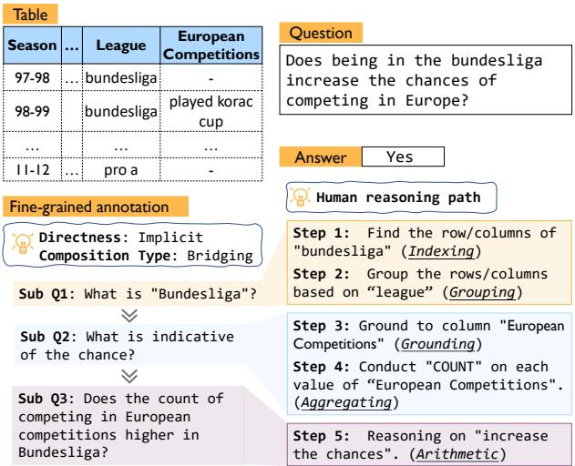
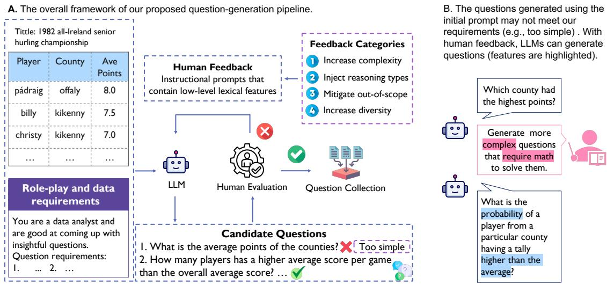
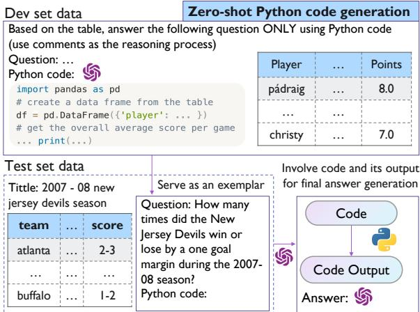
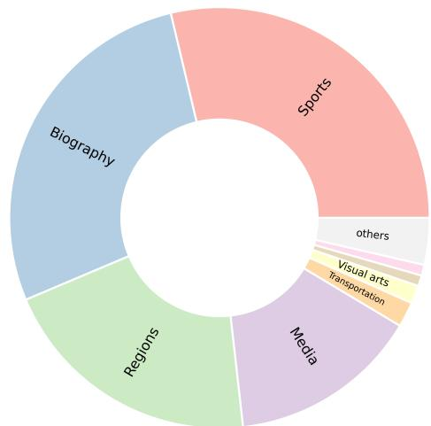
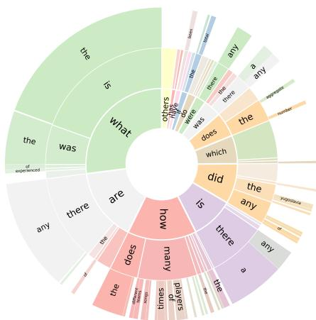
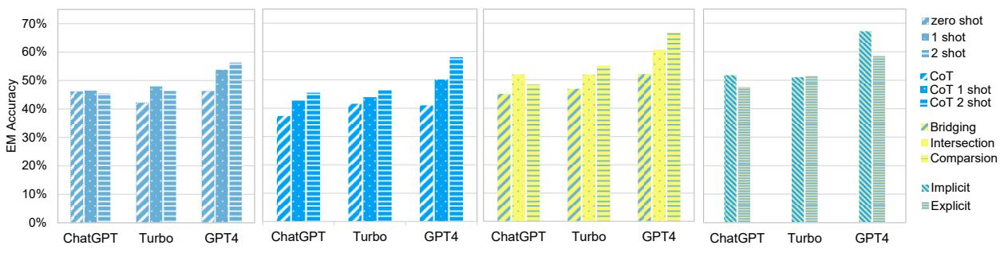
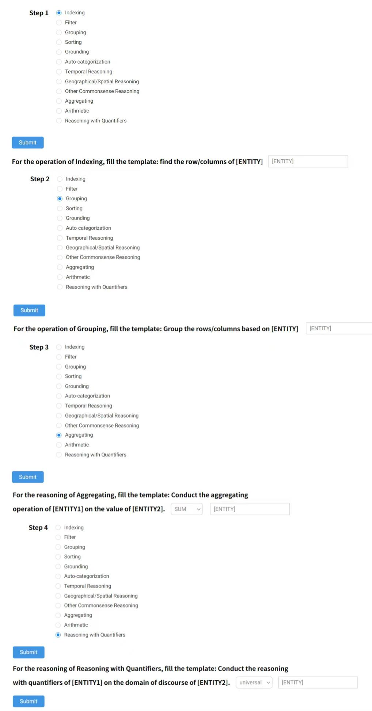

# CRT-QA: A Dataset of Complex Reasoning Question Answering over Tabular Data

Zhehao Zhang1∗, Xitao Li2∗, Yan Gao3, Jian-Guang Lou3

1Darmouth College, 2Xi’an Jiaotong University

3Microsoft Research Asia

zhehao.zhang.gr@dartmouth.edu, wuitenye@stu.xjtu.edu.cn {yan.gao, jlou}@microsoft.com

## Abstract

Large language models (LLMs) show powerful reasoning abilities on various text-based tasks. However, their reasoning capability on structured data such as tables has not been systematically explored. In this work, we first establish a comprehensive taxonomy of reasoning and operation types for tabular data analysis. Then, we construct a complex reasoning QA dataset over tabular data, named CRT-QA (Complex Reasoning QA over Tabular data), with the following unique features: (1) it is the first Table QA dataset with multi-step operation and informal reasoning; (2) it contains fine-grained annotations on questions’ directness, composition types of sub-questions, and human reasoning paths which can be used to conduct a thorough investigation on LLMs reasoning ability; (3) it contains a collection of unanswerable and indeterminate questions that commonly arise in real-world situations. We further introduce an eficient and efective tool-augmented method, named ARC (Autoexemplar-guided Reasoning with Code), to use external tools such as Pandas to solve table reasoning tasks without handcrafted demonstrations. The experiment results show that CRT-QA presents a strong challenge for baseline methods and ARC achieves the best result. The dataset and code are available at https://github.com/zzh-SJTU/CRT-QA.

## 1 Introduction

Large language models (LLMs) (Brown et al., 2020; Chowdhery et al., 2022; Chung et al., 2022; Touvron et al., 2023; OpenAI, 2023a,b) have recently shown emergent abilities, such as the capacity for "reasoning", when they are suficient in size (Wei et al., 2022). A large number of works (Zhang et al., 2022a; Wei et al., 2023; Kojima et al., 2023;

  
Figure 1: This example demonstrates the format of CRT-QA dataset: tables, question-answers, and fine-grained annotations.

Yao et al., 2023a) focus on LLMs’ reasoning abilities on text-based NLP tasks. However, the capability of LLMs on table reasoning tasks has not been systematically investigated (Chen, 2023a). Evaluating LLMs’ reasoning ability over tabular data and improving their performance can produce a significant impact on eficient data analysis, decisionmaking, and so on in real-life applications.

Current Table question answering (Table QA) datasets are primarily concerned with obtaining factoids to answer simple queries and lack in-depth analysis. Although recent works (Chen et al., 2021b) start to investigate multi-hop "reasoning" questions over tables, they do not have a clear definition of reasoning types and the "reasoning" they investigate (e.g., operations like filtering) does not align with current research on LLMs’ reasoning ability. Besides, the current Table QA datasets only contain explicitly questions. However, in real-life scenarios, users frequently ask implicit even ambiguous questions over tables.

To fill these gaps and conduct an in-depth analysis of LLMs’ reasoning abilities over tabular data, we first establish a fine-grained taxonomy of commonly-used reasoning and operations types for table analysis. Diferent from previous works (Chen et al., 2021b), we separate the steps that can be easily executed using a single Pandas or SQL query from reasoning and categorize them as operations. Following recent studies on the reasoning capacity of LLMs(Wei et al., 2023), we focus on informal reasoning which utilizes intuition, experience, and common sense to deduce outcomes.

Then, we construct CRT-QA dataset (Complex Reasoning QA over Tabular data) over Wikipedia tables. Answer-based evaluation proves inadequate for assessing LLMs’ reasoning ability, as it does not fully capture the complexity of their cognitive processes. Nonetheless, devising a robust method for evaluating such reasoning capabilities remains a formidable challenge within the field. When dealing with complex table analysis queries, humans typically begin by reformulating the questions (possibly implicitly) into more explicit ones, followed by decomposing them into sub-questions, and ultimately conducting atomic reasoning. Inspired by this process, we propose fine-grained annotations on the directness of questions, composition types of sub-questions, and human reasoning paths. To explore the ambiguous questions mentioned earlier, we incorporate a subset of unanswerable and indeterminate queries. During question collection, we propose a human-in-the-loop question generation pipeline that utilizes LLM to generate questions necessitating complex, multi-step reasoning. Our proposed pipeline can eficiently produce high-quality queries while mitigating issues such as biases, insuficient complexity, and lack of diversity.

We evaluate LLMs (e.g., GPT-4) with diferent prompting methods on CRT-QA. Inspired by the finding that LLMs can often generate correct reasoning plans but fail on execution, we propose an eficient and efective method, named ARC (Autoexemplar-guided Reasoning with Code), to alleviate such limitation. Instead of expensive human effort for code design, ARC first uses an instructional prompt to generate exemplar code on the dev set queries and serve as an in-context demonstration for test questions. After executing the generated code with an external Python interpreter, we then inject the output into the prompt and LLM generates the final answer by reflection. Experiment results demonstrate that CRT-QA poses a significant challenge for baseline methods, as the current most powerful model, GPT-4, achieves an accuracy of 56.32% through few-shot in-context learning. Our proposed ARC achieves the best result, outperforming various prompting and tool-use baselines.

## 2 Related Works

## 2.1 TableQA Datasets

Table QA is the task of answering queries concerning tabular data. A large number of datasets have been proposed for this task. Datasets such as WTQ (Pasupat and Liang, 2015), WikiSQL (Zhong et al., 2017), SQA (Iyyer et al., 2017) and Spider (Yu et al., 2018) contain tables for QA or text-to-SQL tasks. Recently, numerous works construct datasets that require multi-hop reasoning on tables: OT-TQA (Chen et al., 2021a), HybridQA (Chen et al., 2021b), TabFact (Chen et al., 2020b), LogicNLG (Chen et al., 2020a), AIT-QA (Katsis et al., 2021), MultiModalQA (Talmor et al., 2021), FeTaQA (Nan et al., 2021). However, they are focused on iterated factoid retrieval (Ho et al., 2022) where the definition of reasoning does not align with the reasoning ability of LLMs. Datasets like FinQA (Chen et al., 2022b), TAT-QA (Zhu et al., 2021), MultiHiertt (Zhao et al., 2022) and TABMWP (Lu et al., 2023b) focus on numerical reasoning over tabular data. Yin et al., 2022 propose ARCADE, a benchmark of 1,082 code generation using the pandas for tabular data analysis. However, they do not introduce commonsense in the datasets and their labels are not natural languages.

## 2.2 Language Models for Reasoning

LLMs’ reasoning abilities Numerous works (Fu et al., 2023b; Wang et al., 2023b; Zelikman et al., 2022; Creswell et al., 2022; Yao et al., 2023a) focus on increasing LLM’s arithmetic (Lewkowycz et al., 2022; Chen et al., 2022a; Zhou et al., 2022; Taylor et al., 2022), commonsense (Liu et al., 2022; Madaan et al., 2022) and symbolic reasoning (Zhou et al., 2023). Notably, simply adding “Let’s think step by step” before each answer or using chain-ofthought (CoT) (Wei et al., 2023) prompting which contains a number of intermediate steps can better elicit LLM’s reasoning ability.

LLM with tools External tools such as web browsers, search engines, Python interpreters, and models of other modalities have been incorporated to complete complex tasks (Nakano et al.,

<table><tr><td></td><td>Sub type</td><td>Example</td><td>Percentage</td></tr><tr><td rowspan="4">Operation</td><td>Indexing</td><td>Which county has had the fastest rate of population growth between 1960 and 2040, in terms of percentage change per decade?</td><td>84.97%</td></tr><tr><td>Filter</td><td>Did any drivers who retired due to an accident complete more laps than those who retired for other reasons?</td><td>30.20%</td></tr><tr><td>Grouping</td><td>Is there a particular player that Tom has faced more frequently than others?</td><td>38.39%</td></tr><tr><td>Sorting</td><td>Was there any significant increase or decrease in the number of points or wins for Juan Garriga over the years?</td><td>5.64%</td></tr><tr><td rowspan="9"></td><td>Aggregating</td><td>How many matches in the 1974-75 FA Cup tournament had a scoreless draw?</td><td>58.12%</td></tr><tr><td>Arithmetic</td><td>What is the average time difference between a manager&#x27;s dismissal and the subsequent appointment of their replacement?</td><td>29.26%</td></tr><tr><td>Grounding</td><td>Does Juan Garriga have a higher success rate when competing with the Yamaha team compared to the JJ Cobas or Cagiva teams?</td><td>17.99%</td></tr><tr><td>Auto- Reasoning categorization</td><td>Details: The term of success in the question is mapped to win (a column) What proportion of the Malaysia Airlines group companies are involved in the airline industry?</td><td>1.07%</td></tr><tr><td>Temporal Rea- soning</td><td>Details :airline industry belongs to principal activities (a column) How did the Tampa Bay Buccaneers perform during the first half of the 1983</td><td>3.89%</td></tr><tr><td>Geographical/-</td><td>season compared to the second half of the season? Does Andrea Petkovic have a higher winning percentage in finals matches</td><td>2.55%</td></tr><tr><td>Spatial Reasoning Reasoning with</td><td>held in Europe or outside of Europe? Are there any shows that have been airing consistently throughout all networks</td><td>24.16%</td></tr><tr><td>Quantifiers Others</td><td>in the Canadian Network Television Schedule in 1998-99? Was there a consistent difference in the duration of operation between satel-</td><td>50.20%</td></tr></table>

Table 1: Our proposed taxonomy for operation and reasoning types in Table QA, accompanied by examples and their proportion in CRT-QA. We emphasize keywords for their respective categories.

2022; Shuster et al., 2022; Cheng et al., 2023; Cobbe et al., 2021; Paranjape et al., 2023; Shen et al., 2023; Lu et al., 2023a). Toolformer (Schick et al., 2023) uses self-supervision to teach LLMs to use multiple tools. However, it needs to finetune LLM’s parameters, which makes it impractical to apply it to close-sourced LLMs like GPT-4. Yao et al., 2023b propose ReAct, a promptbased paradigm to integrate reasoning and acting for LLMs. However, ReAct requires multiple API callings and hand-crafted exemplars of (Thought, Act, Obs) triplets, which has high calling cost and not flexible to transfer to other tasks.

## 3 CRT-QA Dataset

In this section, we describe the task formulation, and process for collecting tables, questions, answers, and detailed annotations for CRT-QA.

## 3.1 Desiderata

The table-based QA task is defined as the problem of generating an answer a to a question q based on a table T with metadata m using a model M which can be formulated as $a = M ( T , m , q )$ . In our dataset,

The format of answers a is free-form natural language. Our dataset focuses on the questions that require multiple steps of operation $\{ o _ { 1 } , o _ { 2 } , . . . , o _ { n } \}$ and reasoning $\{ r _ { 1 } , r _ { 2 } , . . . , r _ { n } \}$

Previous TableQA datasets (Chen et al., 2021b) definition of "reasoning" primarily encompasses basic operations like filtering, which does not align with the more comprehensive understanding of reasoning in current LLM research, which involves higher-order cognitive tasks such as logical, numerical, and commonsense reasoning. As a result, we separate these steps from reasoning types and define them as operations. Following recent works on LLMs’ reasoning ability (Wei et al., 2023; Cobbe et al., 2021), we examine informal reasoning, which relies on intuition, experience, and common sense to draw conclusions and solve problems. Inspired by benchmarks such as Big-bench (Srivastava et al., 2022), we propose a taxonomy on fine-grained reasoning types commonly used in table analysis. The operation and reasoning types are illustrated in Table 1.

  
Figure 2: A: Our proposed pipeline of human-in-the-loop question generation using LLMs. we first design a role-playing prompt as a data analyst with desired questions’ requirements for initial question generation. Then, human annotators collect the questions that meet the requirements and provide feedback for question improvement. Our proposal can eficiently collect high-quality and diverse table-based questions. B: A example of interaction between LLMs and human feedback. As we can see, specific feedback (e.g., complex and math) can greatly improve the quality of our generated questions.

## 3.2 Dataset Collection

We select open-domain tables from the TabFact (Chen et al., 2020b) datasets, where the tables are from Wikipedia1. Then, inspired by recent works on LLM’s ability to aid human annotations (Bartolo et al., 2022; Törnberg, 2023), we design a pipeline to eficiently generate multi-step complex reasoning questions by incorporating LLMs and human feedback. After obtaining the questions, we conduct fine-grained annotations on their directness, decomposition types, and human reasoning paths.

## 3.2.1 Human-in-the-loop question generation using LLMs

As shown in Figure 2, the pipeline has two main steps: initially generating queries using LLMs, followed by human selection and feedback to enhance them in accordance with human preferences.

Initial question generation Inspired by the effectiveness of LLMs’ role-playing capability (Park et al., 2023; Wang et al., 2023a; Fu et al., 2023a; Liu et al., 2023), we use LLM (i.e., ChatGPT ) as the question generator, which largely reduces the cost of data annotations. Specifically, we design an instructional prompt containing question requirements to generate question candidates. However, there are three problems when we use such prompts for ChatGPT: (i). lack of complexity: Although we provide corresponding instructions on complexity, ChatGPT usually generates simple questions that do not contain multi-hop reasoning; (ii). lack of diversity: When we ask ChatGPT to generate multiple questions, we find that many queries have similar formats. For example, the majority of them start with ’Is there’; (iii). unanswerable questions: ChatGPT may generate questions that can not be answered only given the table. We collect some unanswerable and indeterminate questions and conduct an in-depth analysis in Section 6. The next paragraph described the approach we use to mitigate the above issues.

Human selection and feedback Human feedback is essential for LLMs because it helps them align with human preferences and values. Inspired by recent works on model refinement (Ouyang et al., 2022; Huang et al., 2022; Shinn et al., 2023), we let human annotators select the questions that meet our requirements and then provide LLM with feedback to improve the quality of the questions. For feedback design, we use several lexical features such as use math and more complex to resolve the problems mentioned above and reduce potential biases. Empirically, we find that ChatGPT can better improve their generated questions by providing them with specific lexical features than high-level instructions. Details on the feedback design can be found in Appendix A.1.

## 3.2.2 Fine-grained annotations

Among the reasoning datasets, most of them only contain label-related annotations without human reasoning paths or fine-grained reasoning types. However, we argue that only goal-oriented annotations are insuficient to analyze the reasoning ability of LLMs. To fill in this gap, after annotating the answer, we further annotate whether a question is implicit or explicit and how sub-questions are composed. We also annotate the main steps of table operations and reasoning. After that, we use a template-filling method to eficiently annotate human reasoning paths to solve the questions. The details on template design and the complete annotation interface can be found in Appendix E and F.

Directness Inspired by StrategyQA (Geva et al., 2021), we first introduce implicit questions over tabular data. Following Geva et al., 2021, we use the following rule-of-thumb to determine whether a question is implicit or explicit: the question is explicit if it can be written using words from the question, their inflections, and function words, while implicit questions require new content words to describe the reasoning process.

Decomposition types As the queries in our dataset contain multi-step reasoning, we further annotate how these sub-questions are composed together. Following Min et al., 2019, we categorize the question decomposition into the following 3 types2: bridging needs to find the first-hop evidence in order to find the second-hop evidence; intersection requires finding an entity that meets two independent requirements; comparison requires comparing the property of two diferent entities. Our annotation can be used to analyze LLMs’ question decomposition abilities.

Human reasoning path To better evaluate LLMs’ reasoning ability, we further annotate human reasoning paths for solving these queries. However, it is impractical for annotators to write their detailed reasoning paths due to the great volume of data. Hence, we design a template-filling paradigm to let annotators fill the objects of reasoning or operation. We first let annotators select the type of reasoning or operation for each step in order (selections are listed in Table 1). Then, for each step, they are asked to fill in a template that specifies the objectives of the chosen type. For example, if Aggregation is involved in solving the query, the annotator should select which type of this aggregation (e.g., sum) and its objectives (e.g., column names). The template can be found in Table 8 in the Appendix. This method can eficiently annotate the key reasoning steps of humans.

<table><tr><td>Property</td><td>Value</td></tr><tr><td>Unique Tables</td><td>423</td></tr><tr><td>Total Questions</td><td>1000</td></tr><tr><td>Answerable Questions</td><td>744</td></tr><tr><td>Unanswerable Questions</td><td>256</td></tr><tr><td>Question Length (Avg/Median)</td><td>141.2 / 144.5</td></tr><tr><td>Answer Length (Avg/Median) Annotation Length (Avg/Median)•</td><td>5.5 / 3.0</td></tr><tr><td>Rows per Table (Avg/Median)</td><td>54.3 / 45.0</td></tr><tr><td>Num of reasoning (Avg/Median)•</td><td>12.6 / 10.0</td></tr><tr><td></td><td>3.2 / 3.3</td></tr><tr><td>Num of operation (Avg/Median)•</td><td>3.1 / 2.8</td></tr><tr><td>Length of reasoning path (Avg/Median) •</td><td>2.9 / 3.0</td></tr><tr><td>Complexity (Agreement)†</td><td>4.1 (88%)</td></tr><tr><td>Inter-annotator Agreement‡</td><td>93.7%</td></tr></table>

Table 2: Core Statistics of CRT-QA. Lengths are the number of characters. Both r and the complexity (assessed by humans) demonstrate the significant challenge posed by our dataset.

## 3.3 Dataset Analysis and Statistics

Key statistics Table 2 shows the key statistics of CRT-QA. Following Nan et al., 2021, we ask human annotators to rate the complexity of 100 samples on a scale of 1 to 5 and report the average rating and agreement. We compute the inter-annotator agreement of 3 annotators on 100 samples‡. The large proportion of agreement (92.7%) indicates the annotation quality of our dataset.

Question and topic types We show the distribution of topics and question types within CRT-QA through visualizations. Due to page limitations, we have included them and their details in Appendix C and D. These visualizations show that our dataset encompasses a diverse array of topics and includes a variety of question types, ensuring comprehensive coverage and versatility in the QA domain.

Comparison to existing datasets Compared with previous datasets3, CRT-QA dataset exhibits several distinctive features: (1) CRT-QA is the first Table QA dataset that contains both multi-step operations and informal reasoning. (2) CRT-QA is the first Table QA dataset that contains fine-grained annotations on questions’ directness, composition types, and human reasoning paths. (3) CRT-QA has a sub-set of unanswerable and indeterminate questions, which are frequently occurred due to the complexity of real-life scenarios.

  
Figure 3: Our proposed ARC for complex table reasoning tasks. We first sample a data instance from the dev set and input it with an instructional prompt to LLMs for zero-shot code generation. We then use the generated code as the in-context exemplar to generate code for test data. After that, we execute the code and inject the output to the prompt, and iteratively input LLM to get the final answer. The prompts and dev-set demonstration can be found in Appendix. ARC can mitigate the shortcoming of LLMs for operation/reasoning execution and eliminate the efort of handcrafted code demonstrations.

## 4 Method

Although LLMs show powerful reasoning abilities on various tasks (Qin et al., 2023), they have limitations on various fields (Lewkowycz et al., 2022; Ziems et al., 2023). From our pivot experiments of prompting baselines, we find that LLMs can often generate correct reasoning plans but are unable to appropriately execute them. However, such steps (e.g., arithmetic, counting) can be perfectly performed by external tools such as SQL or Pandas. Inspired by recent works on tool-augmented LLMs (Gao et al., 2023; Yao et al., 2023b; Shen et al., 2023; Lu et al., 2023a; Paranjape et al., 2023), we propose an eficient and efective approach, named ARC (Auto-exemplar-guided Reasoning with Code), to use external tools such as Pandas to solve table reasoning tasks without handcrafted demonstrations. Figure 3 illustrates the pipeline of our proposed ARC and the detailed prompt design for each step can be found in Appendix H.

Auto-exemplar generation Although manuallyannotated demonstration shows significant efectiveness in in-context learning for LLMs, nontrivial hand-drafting of efective exemplars makes it not flexible enough to be applied to sophisticated tasks such as code generation for complex table analysis. Inspired by recent works on auto-demonstration generation (Zhang et al., 2022b), we first randomly sample a data instance from the development set and input LLMs with an instructional prompt for code generation. The prompt we use is a simple instruction to generate Python code and print intermediate or final results. The ablation of diferent selections will be discussed in Appendix H.

In-context code generation For every data example in the test set, we use the exemplar generated from the dev set to conduct in-context learning for code generation. As Pandas is the most commonlyused library in Python for tabular data analysis which may frequently occur in LLMs’ pretraining data, the generated codes are proficient in the use of Pandas to process tables.

Code execution with external tools We further use the generated code for execution using a Python interpreter with a Pandas installed environment. We then obtain the output of the program as the intermediate or final results for the query.

Iterative LLM calling with code output However, for queries that require in-depth commonsense reasoning, only the code sometimes can not directly solve them. As a result, inspired by Re-Act (Yao et al., 2023b), we also integrate Acting and Reasoning by injecting code output into the prompt design for final step reasoning. By prompting LLMs with code output, LLMs can generate more accurate final answers by avoiding step execution errors.

## 5 Experiments

## 5.1 Experiment Settings

For all the experiments, we use the powerful Chat-GPT, GPT-3.5-turbo, and GPT-4 as the LLMs to investigate their reasoning ability on tabular data. Following Chen, 2023b, we use Markdown as the format of tables and use Exact Match (EM) as the main metric for evaluations. For each experiment, we run three times with diferent random seeds and report the average EM score.

## 5.2 Baselines

To evaluate LLMs’ reasoning ability on the complex TableQA task, we select the following baselines:4 Few-shot/Zero-shot prompting (Brown et al., 2020): simply prompts LLMs with fewshot examples or instructions. Few-shot/Zeroshot CoT (Wei et al., 2023; Kojima et al., 2023): inputs LLMs few-shot exemplars with manuallycrafted reasoning path or Let’s think step by step. PAL (Gao et al., 2023): uses few-shot examples of only Python code to encourage LLMs to generate correct code for problem-solving. ReAct (Yao et al., 2023b) utilizes in-context examples of (Thought, Act, Obs) tuples to combine logical path and task-specific actions. ARC utilizes a zero-shotgenerated code exemplar to perform in-context code generation and incorporate code output for final answer generation.

<table><tr><td rowspan="2">Method</td><td colspan="4">Operation Types</td><td colspan="8">Reasoning Types</td><td rowspan="2">Overall</td></tr><tr><td>Index</td><td>Sort</td><td>Group</td><td>Filter</td><td>GRO</td><td>CAT</td><td>TEM</td><td>AGG</td><td>ARI</td><td>SPA</td><td>QUA</td><td>OTH</td></tr><tr><td>Prompting w/ ChatGPT</td><td></td><td></td><td></td><td></td><td></td><td></td><td></td><td></td><td></td><td></td><td></td><td></td><td></td></tr><tr><td>Zero-shot</td><td>47.20</td><td>50.00</td><td>46.34</td><td>37.15</td><td>46.34</td><td>44.44</td><td>53.09</td><td>36.39</td><td>37.68</td><td>42.11</td><td>62.22</td><td>52.41</td><td>46.11</td></tr><tr><td>Zero-shot-CoT</td><td>40.22</td><td>40.00</td><td>48.07</td><td>32.38</td><td>28.37</td><td>44.44</td><td>44.44</td><td>27.92</td><td>33.61</td><td>21.05</td><td>50.56</td><td>37.70</td><td>37.23</td></tr><tr><td>Few-shot (2-shot)</td><td>47.48</td><td>37.57</td><td>55.44</td><td>50.00</td><td>42.31</td><td>40.74</td><td>56.79</td><td>34.73</td><td>37.54</td><td>42.11</td><td>51.80</td><td>65.56</td><td>45.92</td></tr><tr><td>Few-shot-CoT (2-shot)</td><td>46.45</td><td>46.67</td><td>53.10</td><td>38.80</td><td>44.21</td><td>37.04</td><td>37.04</td><td>36.39</td><td>40.48</td><td>24.56</td><td>62.41</td><td>50.96</td><td>45.47</td></tr><tr><td>Tool Use w/ ChatGPT</td><td></td><td></td><td></td><td></td><td></td><td></td><td></td><td></td><td></td><td></td><td></td><td></td><td></td></tr><tr><td>PAL</td><td>46.51</td><td>42.96</td><td>51.27</td><td>36.39</td><td>42.41</td><td>11.11</td><td>42.59</td><td>35.54</td><td>41.87</td><td>17.54</td><td>63.38</td><td>45.37</td><td>44.11</td></tr><tr><td>ReAct</td><td>47.69</td><td>58.97</td><td>51.58</td><td>38.21</td><td>43.57</td><td>22.22</td><td>44.44</td><td>42.08</td><td>22.22</td><td>46.77</td><td>60.00</td><td>46.77</td><td>45.24</td></tr><tr><td>ARC (Ours)</td><td>50.62</td><td>43.33</td><td>58.20</td><td>40.42</td><td>47.15</td><td>37.04</td><td>37.74</td><td>44.19</td><td>45.46</td><td>40.35</td><td>64.83</td><td>51.15</td><td>49.41</td></tr><tr><td>Prompting w/ GPT-3.5-turbo</td><td></td><td></td><td></td><td></td><td></td><td></td><td></td><td></td><td></td><td></td><td></td><td></td><td></td></tr><tr><td>Zero-shot</td><td>43.83</td><td>45.00</td><td>50.18</td><td>34.02</td><td>39.01</td><td>44.44</td><td>55.56</td><td>31.93</td><td>31.51</td><td>10.53</td><td>63.78</td><td>48.97</td><td>42.11</td></tr><tr><td>Zero-shot-CoT</td><td>43.84</td><td>55.00</td><td>52.58</td><td>33.20</td><td>39.01</td><td>33.33</td><td>37.04</td><td>34.80</td><td>33.19</td><td>26.32</td><td>52.78</td><td>44.37</td><td>41.58</td></tr><tr><td>Few-shot (2-shot)</td><td>49.69</td><td>47.50</td><td>62.40</td><td>46.10</td><td>55.56</td><td>59.26</td><td>38.62</td><td>43.70</td><td>43.11</td><td>42.11</td><td>66.67</td><td></td><td>49.05</td></tr><tr><td>Few-shot-CoT (2-shot)</td><td>47.20</td><td>45.00</td><td>56.49</td><td>37.30</td><td>45.39</td><td>44.44</td><td>33.33</td><td>37.86</td><td>39.92</td><td></td><td></td><td>54.48</td><td></td></tr><tr><td>Tool Use w/ GPT-3.5-turbo</td><td></td><td></td><td></td><td></td><td></td><td></td><td></td><td></td><td></td><td>53.63</td><td>62.22</td><td>51.26</td><td>46.33</td></tr><tr><td>PAL</td><td>53.19</td><td>50.00</td><td>61.59</td><td>43.03</td><td>50.35</td><td>11.11</td><td>51.85</td><td>46.07</td><td>54.81</td><td>31.58</td><td>67.22</td><td></td><td>52.17</td></tr><tr><td>ReAct</td><td>42.71</td><td>35.00</td><td>45.96</td><td>34.42</td><td>38.30</td><td>22.22</td><td>40.74</td><td>33.07</td><td>36.55</td><td>21.05</td><td></td><td>51.38</td><td></td></tr><tr><td>ARC (Ours)</td><td>55.28</td><td>52.50</td><td>64.21</td><td>51.77</td><td>66.67</td><td>60.71</td><td>46.56</td><td>46.56</td><td>52.12</td><td>16.67</td><td>52.77 63.53</td><td>42.76 54.38</td><td>40.22</td></tr><tr><td>Prompting w/ GPT-4</td><td></td><td></td><td></td><td></td><td></td><td></td><td></td><td></td><td></td><td></td><td></td><td></td><td>53.26</td></tr><tr><td>Zero-shot</td><td>46.99</td><td>51.28</td><td>56.47</td><td>35.27</td><td>50.46</td><td>11.11</td><td>48.15</td><td>34.92</td><td>39.74</td><td>36.84</td><td></td><td></td><td></td></tr><tr><td>Zero-shot-CoT</td><td>42.00</td><td>43.59</td><td>50.00</td><td>37.29</td><td>39.45</td><td>22.22</td><td>37.03</td><td></td><td></td><td></td><td>60.23</td><td>55.16</td><td>46.21</td></tr><tr><td>Few-shot (2-shot)</td><td>57.75</td><td>43.59</td><td>64.39</td><td></td><td>66.67</td><td></td><td></td><td>32.14</td><td>36.32</td><td>31.58</td><td>53.80</td><td>45.08</td><td>41.01</td></tr><tr><td>Few-shot-CoT (2-shot)</td><td>59.29</td><td>41.03</td><td>67.63</td><td>55.05 50.00</td><td>56.88</td><td>55.56</td><td>44.25</td><td>44.25</td><td>51.71</td><td>36.84</td><td>78.95</td><td>63.31</td><td>56.32</td></tr><tr><td>Tool Use w/ GPT-4</td><td></td><td></td><td></td><td></td><td></td><td>66.67</td><td>51.85</td><td>49.01</td><td>54.70</td><td>52.63</td><td>77.19</td><td>61.15</td><td>58.69</td></tr><tr><td>PAL</td><td>61.20</td><td>48.72</td><td>65.47</td><td>52.97</td><td>56.88</td><td>33.33</td><td>40.74</td><td>54.56</td><td>62.39</td><td>36.84</td><td>74.85</td><td>60.67</td><td>59.83</td></tr><tr><td>ReAct</td><td>61.88</td><td>65.00</td><td>56.94</td><td>45.00</td><td>56.94</td><td>75.00</td><td>44.44</td><td>46.95</td><td>54.69</td><td>57.14</td><td>76.86</td><td>61.34</td><td>58.69</td></tr><tr><td>ARC (Ours)</td><td>62.14</td><td>64.10</td><td>64.75</td><td>51.06</td><td>54.13</td><td>55.56</td><td>55.56</td><td>52.09</td><td>59.40</td><td>52.63</td><td>72.94</td><td>65.16</td><td>60.11</td></tr></table>

Table 3: Evaluation results of various baselines and our method on our proposed CRT-QA: GRO: Grounding; CAT: Autocategorization; TEM: Temporal reasoning; AGG: aggregating; ARI: Arithmetic; SPA: Spatial/ Geographical reasoning; QUA: Reasoning with quantifiers; OTH: Other commonsense reasoning. The mean p-values for the paired t-test between ARC and other top-performing baselines is 0.041, indicating significant diferences. Among all the methods except Zero-shot and Zero-shot-CoT, ARC is the Only method that requires no handcrafted exemplar.

## 5.3 Experiment Results

Table 3 shows diferent methods’ EM scores on CRT-QA dataset. We can see that (1). overall, the most eficacious approach achieves a maximum of 60.11, indicating the dificulty of our dataset. (2). among all the baselines, our proposed ARC achieves the best average EM scores with an average improvement of 1.846 across all models without using any handcrafted exemplar, indicating the efectiveness of our proposal. For ChatGPT baselines. (3). we find that Zero-shot-CoT performs even worse than the vanilla Zero-shot approach. By checking the reasoning paths elicited by Let’s think step-by-step, we find that the reason may arise from the phenomenon that the reasoning paths are unruly and even generate codes that the model does not have the ability to solve. As a result, Let’s think step-by-step is not a one-fits-for-all solution. (4). although Few-shot-CoT can not outperform Zero-shot for ChatGPT. As the model evolves (i.e., from ChatGPT to Turbo to GPT-4), Few-shot-CoT can have better performances than Zero-shot predictions, indicating that the model increases its

CoT reasoning ability. (5). Among the 3 tool-use baselines, ReAct can not have comparative performances with the other two methods with GPT-3.5- turbo and GPT-4. By investigating the reasoning path, we find that ReAct often finishes without any answer. Alternatively, ReAct often conducts a substantial number of iterations, resulting in not only increased costs but also an extremely long reasoning pathway that becomes out of control.

From fine-grained reasoning types shown in Table 3, we observe that all prompting-based methods are bad at aggregation and arithmetic compared with other reasoning types. Noticeably, our proposed ARC and PAL can greatly improve LLMs ability on these two reasoning types. Besides, we observe that among all the reasoning types, LLMs perform the best in reasoning with quantifiers. Due to page constraints, a comprehensive ablation study on the number of exemplars, error analysis, and case study are in Appendix H, J, and I.

## 6 Unanswerable and Indeterminate Question

Most Table QA datasets are designed for answering the questions with golden labeling (Pasupat and Liang, 2015; Chen et al., 2020b, 2021b,a), but real users possibly ask questions that are inherently difficult to answer due to the complexity of the real world. Motivated by this, we incorporate a sub-set of unanswerable and indeterminate queries where some questions go beyond common external knowledge, while others are inherently problematic. We categorize these questions into four categories and conduct the answerability of LLMs based on them.

<table><tr><td>Type</td><td>Definition</td><td>Percentage</td></tr><tr><td>Out of scope</td><td>Lacking essential information based on the given table.</td><td>73.2%</td></tr><tr><td>Hallucination</td><td>The assumption in the question is invalid based on the table.</td><td>10.4%</td></tr><tr><td>Problematic</td><td>Question itself contains logical errors.</td><td>4.8%</td></tr><tr><td>Subjective</td><td>The answer varies from annotators due to different metrics, algorithms, and criteria.</td><td>6.4%</td></tr><tr><td>Others</td><td>Other types of questions that can not be labeled</td><td>5.2%</td></tr></table>

Table 4: Category and ratio of indeterminate and unanswerable questions in CRT-QA dataset.

As shown in Table 4, out-of-scope, hallucination, and problematic questions are unanswerable. The main reason is the absence of essential information or logical flaws within the question itself. For example, there is an implicit assumption underlying the question “If the score increase by years, ...”, but the table content cannot support the implied assumption. For indeterminate questions, annotators can yield diferent answers due to diferent metrics, algorithms, and criteria. These questions can be answered from both subjective and objective perspectives. A “best guess” can be made using subjective reasoning, while these questions can also be objectively asked for user’s further clarification in certain scenarios.

Answerability Study We evaluate the language model’s ability to determine whether to answer a question under three approaches. As a baseline approach, Random approach randomly predicts the responses under the prior probability distribution. Binary Classification presents a binary classification problem, wherein the model must output with either “unanswerable” or “answerable”. Question Answering approach produces the correct answer if the question is answerable and respond with “unanswerable” otherwise. We conduct these experiments on the whole dataset, including unanswerable/indeterminate and "normal" questions.

<table><tr><td></td><td>Acc</td><td>P</td><td>R</td><td>F1</td></tr><tr><td>Random</td><td>0.596</td><td>0.731</td><td>0.727</td><td>0.729</td></tr><tr><td>Binary Classification</td><td>0.680</td><td>0.908</td><td>0.637</td><td>0.749</td></tr><tr><td>Question Answering</td><td>0.779</td><td>0.928</td><td>0.763</td><td>0.838</td></tr></table>

Table 5: Results for identifying answerability. We report common metrics for binary classification, i.e., Acc (Accuracy), P( Precision), R(Recall) and F1 score.

Based on the results presented in Table 5, Binary Classification shows improvements over Random, indicating its efectiveness in identifying questions’ answerability. Question Answering proves to be the most efective approach for identifying answerability, probably because generating answers is easier than determining whether a question can be answered. It mimics some pre-training tasks like reading comprehension. This study benefits a broader understanding of how language models can tackle unanswerable and indeterminate questions and provides directions to enhance performance.

## 7 Conclusion

In this work, to systematically evaluate LLMs’ reasoning ability on tabular data, we first establish a comprehensive taxonomy on operation and reasoning types for table analysis. Then, we propose CRT-QA, a dataset of complex reasoning QA over tables. We propose ARC which efectively utilizes table analysis tools to solve table reasoning tasks without manually-annotated exemplars. Extensive experiments show CRT-QA poses a significant challenge for LLMs and our proposed ARC achieves the best EM scores. Besides the main experiments, we also conduct thorough ablation studies, error analyses, answerability study, and case study for further analysis.

## Limitations

(1) CRT-QA is a test-only dataset, which means no gradient updates are performed. While striving for problem complexity, we face challenges in balancing the quantity of our dataset. This is primarily due to the intricate nature of our annotation process, which demands more time for answer generation and fine-grained process labeling. (2) Similar to previous works discussed in Table 11, we only foucs on single-table question answering. However, queries across multi-tables are also com mon in real-life table analysis scenarios. (3) We don’t research the boundary of external knowledge. The appearance of unanswerable and indeterminate questions is associated with our data generation goal, which is to generate complex and diverse questions. Specifically, the indeterminate questions are contrasted with implicit questions, while inde terminate questions stand out beyond implicit questions. We leave this study as future work. (4) In our study, we utilize a combination of exact match and human evaluation as our evaluation metric. It is reasonable because, during the question generation process, we only select the questions that can be answered within several words without ambiguity. Although this is not comprehensive for free-form answer-generation tasks, alternative metrics such as F1, ROUGE-L, and BLEU-1 also possess inherent limitations. Evaluation of the free-form answergeneration task seems promising. Moreover, our fine-grained annotations provide a feasible path to help answer the question. Although the path is not unique. Currently, there is no efective method to evaluate the reasoning path. This aspect will be left for future research and development.

## References

Sumit Asthana and Aaron Halfaker. 2018. With few eyes, all hoaxes are deep. Proc. ACM Hum.-Comput. Interact., 2(CSCW).

Max Bartolo, Tristan Thrush, Sebastian Riedel, Pontus Stenetorp, Robin Jia, and Douwe Kiela. 2022. Models in the loop: Aiding crowdworkers with generative annotation assistants.

Tom B. Brown, Benjamin Mann, Nick Ryder, Melanie Subbiah, Jared Kaplan, Prafulla Dhariwal, Arvind Neelakantan, Pranav Shyam, Girish Sastry, Amanda Askell, Sandhini Agarwal, Ariel Herbert-Voss, Gretchen Krueger, Tom Henighan, Rewon Child, Aditya Ramesh, Daniel M. Ziegler, Jefrey Wu, Clemens Winter, Christopher Hesse, Mark Chen, Eric Sigler, Mateusz Litwin, Scott Gray, Benjamin Chess, Jack Clark, Christopher Berner, Sam McCandlish, Alec Radford, Ilya Sutskever, and Dario Amodei. 2020. Language models are few-shot learners.

Wenhu Chen. 2023a. Large language models are few(1)- shot table reasoners.

Wenhu Chen. 2023b. Large language models are few(1)- shot table reasoners. In Findings of the Association for Computational Linguistics: EACL 2023, pages 1120–1130, Dubrovnik, Croatia. Association for Computational Linguistics.

Wenhu Chen, Ming-Wei Chang, Eva Schlinger, William Wang, and William W. Cohen. 2021a. Open question answering over tables and text.

Wenhu Chen, Jianshu Chen, Yu Su, Zhiyu Chen, and William Yang Wang. 2020a. Logical natural language generation from open-domain tables.

Wenhu Chen, Xueguang Ma, Xinyi Wang, and William W. Cohen. 2022a. Program of thoughts prompting: Disentangling computation from reasoning for numerical reasoning tasks.

Wenhu Chen, Hongmin Wang, Jianshu Chen, Yunkai Zhang, Hong Wang, Shiyang Li, Xiyou Zhou, and William Yang Wang. 2020b. Tabfact: A large-scale dataset for table-based fact verification.

Wenhu Chen, Hanwen Zha, Zhiyu Chen, Wenhan Xiong, Hong Wang, and William Wang. 2021b. Hybridqa: A dataset of multi-hop question answering over tabular and textual data.

Zhiyu Chen, Wenhu Chen, Charese Smiley, Sameena Shah, Iana Borova, Dylan Langdon, Reema Moussa, Matt Beane, Ting-Hao Huang, Bryan Routledge, and William Yang Wang. 2022b. Finqa: A dataset of numerical reasoning over financial data.

Zhoujun Cheng, Tianbao Xie, Peng Shi, Chengzu Li, Rahul Nadkarni, Yushi Hu, Caiming Xiong, Dragomir Radev, Mari Ostendorf, Luke Zettlemoyer, Noah A. Smith, and Tao Yu. 2023. Binding language models in symbolic languages.

Aakanksha Chowdhery, Sharan Narang, Jacob Devlin, Maarten Bosma, Gaurav Mishra, Adam Roberts, Paul Barham, Hyung Won Chung, Charles Sutton, Sebastian Gehrmann, Parker Schuh, Kensen Shi, Sasha Tsvyashchenko, Joshua Maynez, Abhishek

Rao, Parker Barnes, Yi Tay, Noam Shazeer, Vinodkumar Prabhakaran, Emily Reif, Nan Du, Ben Hutchinson, Reiner Pope, James Bradbury, Jacob Austin, Michael Isard, Guy Gur-Ari, Pengcheng Yin, Toju Duke, Anselm Levskaya, Sanjay Ghemawat, Sunipa Dev, Henryk Michalewski, Xavier Garcia, Vedant Misra, Kevin Robinson, Liam Fedus, Denny Zhou, Daphne Ippolito, David Luan, Hyeontaek Lim, Barret Zoph, Alexander Spiridonov, Ryan Sepassi, David Dohan, Shivani Agrawal, Mark Omernick, Andrew M. Dai, Thanumalayan Sankaranarayana Pillai, Marie Pellat, Aitor Lewkowycz, Erica Moreira, Rewon Child, Oleksandr Polozov, Katherine Lee, Zongwei Zhou, Xuezhi Wang, Brennan Saeta, Mark Diaz, Orhan Firat, Michele Catasta, Jason Wei, Kathy Meier-Hellstern, Douglas Eck, Jef Dean, Slav Petrov, and Noah Fiedel. 2022. Palm: Scaling language modeling with pathways.

Hyung Won Chung, Le Hou, Shayne Longpre, Barret Zoph, Yi Tay, William Fedus, Yunxuan Li, Xuezhi Wang, Mostafa Dehghani, Siddhartha Brahma, Albert Webson, Shixiang Shane Gu, Zhuyun Dai, Mirac Suzgun, Xinyun Chen, Aakanksha Chowdhery, Alex Castro-Ros, Marie Pellat, Kevin Robinson, Dasha Valter, Sharan Narang, Gaurav Mishra, Adams Yu, Vincent Zhao, Yanping Huang, Andrew Dai, Hongkun Yu, Slav Petrov, Ed H. Chi, Jef Dean, Jacob Devlin, Adam Roberts, Denny Zhou, Quoc V. Le, and Jason Wei. 2022. Scaling instruction-finetuned language models.

Karl Cobbe, Vineet Kosaraju, Mohammad Bavarian, Mark Chen, Heewoo Jun, Lukasz Kaiser, Matthias Plappert, Jerry Tworek, Jacob Hilton, Reiichiro Nakano, Christopher Hesse, and John Schulman. 2021. Training verifiers to solve math word problems.

Antonia Creswell, Murray Shanahan, and Irina Higgins. 2022. Selection-inference: Exploiting large language models for interpretable logical reasoning.

Yao Fu, Hao Peng, Tushar Khot, and Mirella Lapata. 2023a. Improving language model negotiation with self-play and in-context learning from ai feedback.

Yao Fu, Hao Peng, Ashish Sabharwal, Peter Clark, and Tushar Khot. 2023b. Complexity-based prompting for multi-step reasoning.

Luyu Gao, Aman Madaan, Shuyan Zhou, Uri Alon, Pengfei Liu, Yiming Yang, Jamie Callan, and Graham Neubig. 2023. Pal: Program-aided language models.

Mor Geva, Daniel Khashabi, Elad Segal, Tushar Khot, Dan Roth, and Jonathan Berant. 2021. Did aristotle use a laptop? a question answering benchmark with implicit reasoning strategies.

Matthew Ho, Aditya Sharma, Justin Chang, Michael Saxon, Sharon Levy, Yujie Lu, and William Yang Wang. 2022. Wikiwhy: Answering and explaining cause-and-efect questions.

Jiaxin Huang, Shixiang Shane Gu, Le Hou, Yuexin Wu, Xuezhi Wang, Hongkun Yu, and Jiawei Han. 2022. Large language models can self-improve.

Mohit Iyyer, Wen-tau Yih, and Ming-Wei Chang. 2017. Search-based neural structured learning for sequential question answering. In Proceedings ofthe 55th Annual Meeting ofthe Associationfor Computational Linguistics (Volume 1: Long Papers), pages 1821– 1831, Vancouver, Canada. Association for Computational Linguistics.

Yannis Katsis, Saneem Chemmengath, Vishwajeet Kumar, Samarth Bharadwaj, Mustafa Canim, Michael Glass, Alfio Gliozzo, Feifei Pan, Jaydeep Sen, Karthik Sankaranarayanan, and Soumen Chakrabarti. 2021. Ait-qa: Question answering dataset over complex tables in the airline industry.

Takeshi Kojima, Shixiang Shane Gu, Machel Reid, Yutaka Matsuo, and Yusuke Iwasawa. 2023. Large language models are zero-shot reasoners.

Aitor Lewkowycz, Anders Andreassen, David Dohan, Ethan Dyer, Henryk Michalewski, Vinay Ramasesh, Ambrose Slone, Cem Anil, Imanol Schlag, Theo Gutman-Solo, Yuhuai Wu, Behnam Neyshabur, Guy Gur-Ari, and Vedant Misra. 2022. Solving quantitative reasoning problems with language models.

Jiacheng Liu, Skyler Hallinan, Ximing Lu, Pengfei He, Sean Welleck, Hannaneh Hajishirzi, and Yejin Choi. 2022. Rainier: Reinforced knowledge introspector for commonsense question answering.

Ruibo Liu, Ruixin Yang, Chenyan Jia, Ge Zhang, Denny Zhou, Andrew M. Dai, Diyi Yang, and Soroush Vosoughi. 2023. Training socially aligned language models in simulated human society.

Pan Lu, Baolin Peng, Hao Cheng, Michel Galley, Kai-Wei Chang, Ying Nian Wu, Song-Chun Zhu, and Jianfeng Gao. 2023a. Chameleon: Plug-and-play compositional reasoning with large language models.

Pan Lu, Liang Qiu, Kai-Wei Chang, Ying Nian Wu, Song-Chun Zhu, Tanmay Rajpurohit, Peter Clark, and Ashwin Kalyan. 2023b. Dynamic prompt learning via policy gradient for semi-structured mathematical reasoning.

Aman Madaan, Shuyan Zhou, Uri Alon, Yiming Yang, and Graham Neubig. 2022. Language models of code are few-shot commonsense learners.

Sewon Min, Victor Zhong, Luke Zettlemoyer, and Hannaneh Hajishirzi. 2019. Multi-hop reading comprehension through question decomposition and rescoring. In Proceedings of the 57th Annual Meeting of the Associationfor Computational Linguistics, pages 6097–6109, Florence, Italy. Association for Computational Linguistics.

Reiichiro Nakano, Jacob Hilton, Suchir Balaji, Jef Wu, Long Ouyang, Christina Kim, Christopher Hesse, Shantanu Jain, Vineet Kosaraju, William Saunders,

Xu Jiang, Karl Cobbe, Tyna Eloundou, Gretchen Krueger, Kevin Button, Matthew Knight, Benjamin Chess, and John Schulman. 2022. Webgpt: Browserassisted question-answering with human feedback.

Linyong Nan, Chiachun Hsieh, Ziming Mao, Xi Victoria Lin, Neha Verma, Rui Zhang, Wojciech Krysci´ nski,´ Nick Schoelkopf, Riley Kong, Xiangru Tang, Murori Mutuma, Ben Rosand, Isabel Trindade, Renusree Bandaru, Jacob Cunningham, Caiming Xiong, and Dragomir Radev. 2021. Fetaqa: Free-form table question answering.

OpenAI. 2023a. Chatgpt.

OpenAI. 2023b. Gpt-4 technical report.

Long Ouyang, Jef Wu, Xu Jiang, Diogo Almeida, Carroll L. Wainwright, Pamela Mishkin, Chong Zhang, Sandhini Agarwal, Katarina Slama, Alex Ray, John Schulman, Jacob Hilton, Fraser Kelton, Luke Miller, Maddie Simens, Amanda Askell, Peter Welinder, Paul Christiano, Jan Leike, and Ryan Lowe. 2022. Training language models to follow instructions with human feedback.

Bhargavi Paranjape, Scott Lundberg, Sameer Singh, Hannaneh Hajishirzi, Luke Zettlemoyer, and Marco Tulio Ribeiro. 2023. Art: Automatic multistep reasoning and tool-use for large language models.

Ankur P. Parikh, Xuezhi Wang, Sebastian Gehrmann, Manaal Faruqui, Bhuwan Dhingra, Diyi Yang, and Dipanjan Das. 2020. Totto: A controlled table-to-text generation dataset.

Joon Sung Park, Joseph C. O’Brien, Carrie J. Cai, Meredith Ringel Morris, Percy Liang, and Michael S. Bernstein. 2023. Generative agents: Interactive simulacra of human behavior.

Panupong Pasupat and Percy Liang. 2015. Compositional semantic parsing on semi-structured tables. In Proceedings of the 53rd Annual Meeting of the Association for Computational Linguistics and the 7th International Joint Conference on Natural Language Processing (Volume 1: Long Papers), pages 1470– 1480, Beijing, China. Association for Computational Linguistics.

Chengwei Qin, Aston Zhang, Zhuosheng Zhang, Jiaao Chen, Michihiro Yasunaga, and Diyi Yang. 2023. Is chatgpt a general-purpose natural language processing task solver?

Timo Schick, Jane Dwivedi-Yu, Roberto Dessì, Roberta Raileanu, Maria Lomeli, Luke Zettlemoyer, Nicola Cancedda, and Thomas Scialom. 2023. Toolformer: Language models can teach themselves to use tools.

Yongliang Shen, Kaitao Song, Xu Tan, Dongsheng Li, Weiming Lu, and Yueting Zhuang. 2023. Hugginggpt: Solving ai tasks with chatgpt and its friends in hugging face.

Noah Shinn, Federico Cassano, Beck Labash, Ashwin Gopinath, Karthik Narasimhan, and Shunyu Yao. 2023. Reflexion: Language agents with verbal reinforcement learning.

Kurt Shuster, Mojtaba Komeili, Leonard Adolphs, Stephen Roller, Arthur Szlam, and Jason Weston. 2022. Language models that seek for knowledge: Modular search generation for dialogue and prompt completion.

Aarohi Srivastava, Abhinav Rastogi, Abhishek Rao, Abu Awal Md Shoeb, Abubakar Abid, Adam Fisch, Adam R. Brown, Adam Santoro, Aditya Gupta, Adrià Garriga-Alonso, Agnieszka Kluska, Aitor Lewkowycz, Akshat Agarwal, Alethea Power, Alex Ray, Alex Warstadt, Alexander W. Kocurek, Ali Safaya, Ali Tazarv, Alice Xiang, Alicia Parrish, Allen Nie, Aman Hussain, Amanda Askell, Amanda Dsouza, Ambrose Slone, Ameet Rahane, Anantharaman S. Iyer, Anders Andreassen, Andrea Madotto, Andrea Santilli, Andreas Stuhlmüller, An drew Dai, Andrew La, Andrew Lampinen, Andy Zou, Angela Jiang, Angelica Chen, Anh Vuong, Animesh Gupta, Anna Gottardi, Antonio Norelli, Anu Venkatesh, Arash Gholamidavoodi, Arfa Tabas sum, Arul Menezes, Arun Kirubarajan, Asher Mul lokandov, Ashish Sabharwal, Austin Herrick, Avia Efrat, Aykut Erdem, Ayla Karaka¸s, B. Ryan Roberts, Bao Sheng Loe, Barret Zoph, Bartłomiej Bojanowski, Batuhan Özyurt, Behnam Hedayatnia, Behnam Neyshabur, Benjamin Inden, Benno Stein, Berk Ek mekci, Bill Yuchen Lin, Blake Howald, Cameron Diao, Cameron Dour, Catherine Stinson, Cedrick Argueta, César Ferri Ramírez, Chandan Singh, Charles Rathkopf, Chenlin Meng, Chitta Baral, Chiyu Wu, Chris Callison-Burch, Chris Waites, Christian Voigt, Christopher D. Manning, Christopher Potts, Cindy Ramirez, Clara E. Rivera, Clemencia Siro, Colin Raf fel, Courtney Ashcraft, Cristina Garbacea, Damien Sileo, Dan Garrette, Dan Hendrycks, Dan Kilman, Dan Roth, Daniel Freeman, Daniel Khashabi, Daniel Levy, Daniel Moseguí González, Danielle Perszyk, Danny Hernandez, Danqi Chen, Daphne Ippolito, Dar Gilboa, David Dohan, David Drakard, David Jurgens, Debajyoti Datta, Deep Ganguli, Denis Emelin, Denis Kleyko, Deniz Yuret, Derek Chen, Derek Tam, Dieuwke Hupkes, Diganta Misra, Dilyar Buzan, Dim itri Coelho Mollo, Diyi Yang, Dong-Ho Lee, Ekate rina Shutova, Ekin Dogus Cubuk, Elad Segal, Eleanor Hagerman, Elizabeth Barnes, Elizabeth Donoway, Ellie Pavlick, Emanuele Rodola, Emma Lam, Eric Chu, Eric Tang, Erkut Erdem, Ernie Chang, Ethan A. Chi, Ethan Dyer, Ethan Jerzak, Ethan Kim, Eunice En gefu Manyasi, Evgenii Zheltonozhskii, Fanyue Xia, Fatemeh Siar, Fernando Martínez-Plumed, Francesca Happé, Francois Chollet, Frieda Rong, Gaurav Mishra, Genta Indra Winata, Gerard de Melo, Germán Kruszewski, Giambattista Parascandolo, Giorgio Mariani, Gloria Wang, Gonzalo Jaimovitch-López, Gregor Betz, Guy Gur-Ari, Hana Galijasevic, Hannah Kim, Hannah Rashkin, Hannaneh Hajishirzi, Harsh Mehta, Hayden Bogar, Henry Shevlin, Hinrich Schütze, Hiromu Yakura, Hongming Zhang,

Hugh Mee Wong, Ian Ng, Isaac Noble, Jaap Jumelet, Jack Geissinger, Jackson Kernion, Jacob Hilton, Jae hoon Lee, Jaime Fernández Fisac, James B. Simon, James Koppel, James Zheng, James Zou, Jan Ko con, Jana Thompson, Jared Kaplan, Jarema Radom,´ Jascha Sohl-Dickstein, Jason Phang, Jason Wei, Ja son Yosinski, Jekaterina Novikova, Jelle Bosscher, Jennifer Marsh, Jeremy Kim, Jeroen Taal, Jesse En gel, Jesujoba Alabi, Jiacheng Xu, Jiaming Song, Jil lian Tang, Joan Waweru, John Burden, John Miller, John U. Balis, Jonathan Berant, Jörg Frohberg, Jos Rozen, Jose Hernandez-Orallo, Joseph Boudeman, Joseph Jones, Joshua B. Tenenbaum, Joshua S. Rule, Joyce Chua, Kamil Kanclerz, Karen Livescu, Karl Krauth, Karthik Gopalakrishnan, Katerina Ignatyeva, Katja Markert, Kaustubh D. Dhole, Kevin Gim pel, Kevin Omondi, Kory Mathewson, Kristen Chiafullo, Ksenia Shkaruta, Kumar Shridhar, Kyle Mc Donell, Kyle Richardson, Laria Reynolds, Leo Gao, Li Zhang, Liam Dugan, Lianhui Qin, Lidia Contreras Ochando, Louis-Philippe Morency, Luca Moschella, Lucas Lam, Lucy Noble, Ludwig Schmidt, Luheng He, Luis Oliveros Colón, Luke Metz, Lütfi Kerem ¸Senel, Maarten Bosma, Maarten Sap, Maartje ter Hoeve, Maheen Farooqi, Manaal Faruqui, Mantas Mazeika, Marco Baturan, Marco Marelli, Marco Maru, Maria Jose Ramírez Quintana, Marie Tolkiehn, Mario Giulianelli, Martha Lewis, Martin Potthast, Matthew L. Leavitt, Matthias Hagen, Mátyás Schu bert, Medina Orduna Baitemirova, Melody Arnaud, Melvin McElrath, Michael A. Yee, Michael Co hen, Michael Gu, Michael Ivanitskiy, Michael Star ritt, Michael Strube, Michał Sw˛edrowski, Michele Bevilacqua, Michihiro Yasunaga, Mihir Kale, Mike Cain, Mimee Xu, Mirac Suzgun, Mo Tiwari, Mo hit Bansal, Moin Aminnaseri, Mor Geva, Mozhdeh Gheini, Mukund Varma T, Nanyun Peng, Nathan Chi, Nayeon Lee, Neta Gur-Ari Krakover, Nicholas Cameron, Nicholas Roberts, Nick Doiron, Nikita Nangia, Niklas Deckers, Niklas Muennighof, Ni tish Shirish Keskar, Niveditha S. Iyer, Noah Con stant, Noah Fiedel, Nuan Wen, Oliver Zhang, Omar Agha, Omar Elbaghdadi, Omer Levy, Owain Evans, Pablo Antonio Moreno Casares, Parth Doshi, Pascale Fung, Paul Pu Liang, Paul Vicol, Pegah Alipoormo labashi, Peiyuan Liao, Percy Liang, Peter Chang, Peter Eckersley, Phu Mon Htut, Pinyu Hwang, Piotr Miłkowski, Piyush Patil, Pouya Pezeshkpour, Priti Oli, Qiaozhu Mei, Qing Lyu, Qinlang Chen, Rabin Banjade, Rachel Etta Rudolph, Raefer Gabriel, Rahel Habacker, Ramón Risco Delgado, Raphaël Millière, Rhythm Garg, Richard Barnes, Rif A. Saurous, Riku Arakawa, Robbe Raymaekers, Robert Frank, Rohan Sikand, Roman Novak, Roman Sitelew, Ronan Le Bras, Rosanne Liu, Rowan Jacobs, Rui Zhang, Rus lan Salakhutdinov, Ryan Chi, Ryan Lee, Ryan Sto vall, Ryan Teehan, Rylan Yang, Sahib Singh, Saif M. Mohammad, Sajant Anand, Sam Dillavou, Sam Shleifer, Sam Wiseman, Samuel Gruetter, Samuel R. Bowman, Samuel S. Schoenholz, Sanghyun Han, Sanjeev Kwatra, Sarah A. Rous, Sarik Ghazarian, Sayan Ghosh, Sean Casey, Sebastian Bischof, Sebas tian Gehrmann, Sebastian Schuster, Sepideh Sadeghi,

Shadi Hamdan, Sharon Zhou, Shashank Srivastava, Sherry Shi, Shikhar Singh, Shima Asaadi, Shixiang Shane Gu, Shubh Pachchigar, Shubham Toshniwal, Shyam Upadhyay, Shyamolima, Debnath, Siamak Shakeri, Simon Thormeyer, Simone Melzi, Siva Reddy, Sneha Priscilla Makini, Soo-Hwan Lee, Spencer Torene, Sriharsha Hatwar, Stanislas Dehaene, Stefan Divic, Stefano Ermon, Stella Biderman, Stephanie Lin, Stephen Prasad, Steven T. Piantadosi, Stuart M. Shieber, Summer Misherghi, Svetlana Kiritchenko, Swaroop Mishra, Tal Linzen, Tal Schuster, Tao Li, Tao Yu, Tariq Ali, Tatsu Hashimoto, Te-Lin Wu, Théo Desbordes, Theodore Rothschild, Thomas Phan, Tianle Wang, Tiberius Nkinyili, Timo Schick, Timofei Kornev, Timothy Telleen-Lawton, Titus Tunduny, Tobias Gerstenberg, Trenton Chang, Trishala Neeraj, Tushar Khot, Tyler Shultz, Uri Shaham, Vedant Misra, Vera Demberg, Victoria Nyamai, Vikas Raunak, Vinay Ramasesh, Vinay Uday Prabhu, Vishakh Padmakumar, Vivek Srikumar, William Fedus, William Saunders, William Zhang, Wout Vossen, Xiang Ren, Xiaoyu Tong, Xinran Zhao, Xinyi Wu, Xudong Shen, Yadollah Yaghoobzadeh, Yair Lakretz, Yangqiu Song, Yasaman Bahri, Yejin Choi, Yichi Yang, Yiding Hao, Yifu Chen, Yonatan Belinkov, Yu Hou, Yufang Hou, Yuntao Bai, Zachary Seid, Zhuoye Zhao, Zijian Wang, Zijie J. Wang, Zirui Wang, and Ziyi Wu. 2022. Beyond the imitation game: Quantifying and extrapolating the capabilities of language models.

Alon Talmor, Ori Yoran, Amnon Catav, Dan Lahav, Yizhong Wang, Akari Asai, Gabriel Ilharco, Hannaneh Hajishirzi, and Jonathan Berant. 2021. Multimodalqa: Complex question answering over text, tables and images.

Ross Taylor, Marcin Kardas, Guillem Cucurull, Thomas Scialom, Anthony Hartshorn, Elvis Saravia, Andrew Poulton, Viktor Kerkez, and Robert Stojnic. 2022. Galactica: A large language model for science.

Hugo Touvron, Thibaut Lavril, Gautier Izacard, Xavier Martinet, Marie-Anne Lachaux, Timothée Lacroix, Baptiste Rozière, Naman Goyal, Eric Hambro, Faisal Azhar, Aurelien Rodriguez, Armand Joulin, Edouard Grave, and Guillaume Lample. 2023. Llama: Open and eficient foundation language models.

Petter Törnberg. 2023. Chatgpt-4 outperforms experts and crowd workers in annotating political twitter messages with zero-shot learning.

Guanzhi Wang, Yuqi Xie, Yunfan Jiang, Ajay Mandlekar, Chaowei Xiao, Yuke Zhu, Linxi Fan, and Anima Anandkumar. 2023a. Voyager: An open-ended embodied agent with large language models.

Xuezhi Wang, Jason Wei, Dale Schuurmans, Quoc Le, Ed Chi, Sharan Narang, Aakanksha Chowdhery, and Denny Zhou. 2023b. Self-consistency improves chain of thought reasoning in language models.

Jason Wei, Yi Tay, Rishi Bommasani, Colin Rafel, Barret Zoph, Sebastian Borgeaud, Dani Yogatama,

Maarten Bosma, Denny Zhou, Donald Metzler, Ed H. Chi, Tatsunori Hashimoto, Oriol Vinyals, Percy Liang, Jef Dean, and William Fedus. 2022. Emergent abilities of large language models.

Jason Wei, Xuezhi Wang, Dale Schuurmans, Maarten Bosma, Brian Ichter, Fei Xia, Ed Chi, Quoc Le, and Denny Zhou. 2023. Chain-of-thought prompting elicits reasoning in large language models.

Zhilin Yang, Peng Qi, Saizheng Zhang, Yoshua Bengio, William W. Cohen, Ruslan Salakhutdinov, and Christopher D. Manning. 2018. Hotpotqa: A dataset for diverse, explainable multi-hop question answering.

Shunyu Yao, Dian Yu, Jefrey Zhao, Izhak Shafran, Thomas L. Grifiths, Yuan Cao, and Karthik Narasimhan. 2023a. Tree of thoughts: Deliberate problem solving with large language models.

Shunyu Yao, Jefrey Zhao, Dian Yu, Nan Du, Izhak Shafran, Karthik Narasimhan, and Yuan Cao. 2023b. React: Synergizing reasoning and acting in language models.

Pengcheng Yin, Wen-Ding Li, Kefan Xiao, Abhishek Rao, Yeming Wen, Kensen Shi, Joshua Howland, Paige Bailey, Michele Catasta, Henryk Michalewski, Alex Polozov, and Charles Sutton. 2022. Natural language to code generation in interactive data science notebooks.

Tao Yu, Rui Zhang, Kai Yang, Michihiro Yasunaga, Dongxu Wang, Zifan Li, James Ma, Irene Li, Qingning Yao, Shanelle Roman, Zilin Zhang, and Dragomir Radev. 2018. Spider: A large-scale human-labeled dataset for complex and cross-domain semantic parsing and text-to-SQL task. In Proceedings ofthe 2018 Conference on Empirical Methods in Natural Language Processing, pages 3911–3921, Brussels, Belgium. Association for Computational Linguistics.

Eric Zelikman, Yuhuai Wu, Jesse Mu, and Noah D. Goodman. 2022. Star: Bootstrapping reasoning with reasoning.

Zhexin Zhang, Jian Guan, Guowei Xu, Yixiang Tian, and Minlie Huang. 2022a. Automatic comment generation for Chinese student narrative essays. In Proceedings of the 2022 Conference on Empirical Methods in Natural Language Processing: System Demonstrations, pages 214–223, Abu Dhabi, UAE. Association for Computational Linguistics.

Zhuosheng Zhang, Aston Zhang, Mu Li, and Alex Smola. 2022b. Automatic chain of thought prompting in large language models.

Yilun Zhao, Yunxiang Li, Chenying Li, and Rui Zhang. 2022. Multihiertt: Numerical reasoning over multi hierarchical tabular and textual data.

Victor Zhong, Caiming Xiong, and Richard Socher. 2017. Seq2sql: Generating structured queries from natural language using reinforcement learning.

Denny Zhou, Nathanael Schärli, Le Hou, Jason Wei, Nathan Scales, Xuezhi Wang, Dale Schuurmans, Claire Cui, Olivier Bousquet, Quoc Le, and Ed Chi. 2023. Least-to-most prompting enables complex reasoning in large language models.

Fan Zhou, Haoyu Dong, Qian Liu, Zhoujun Cheng, Shi Han, and Dongmei Zhang. 2022. Reflection of thought: Inversely eliciting numerical reasoning in language models via solving linear systems.

Fengbin Zhu, Wenqiang Lei, Youcheng Huang, Chao Wang, Shuo Zhang, Jiancheng Lv, Fuli Feng, and Tat-Seng Chua. 2021. Tat-qa: A question answering benchmark on a hybrid of tabular and textual content in finance.

Caleb Ziems, William Held, Omar Shaikh, Jiaao Chen, Zhehao Zhang, and Diyi Yang. 2023. Can large language models transform computational social science?

## A Prompt Design

<table><tr><td>Hyper-parameter</td><td>Value</td></tr><tr><td>Temperature</td><td>0.7</td></tr><tr><td>max_len (CoT)</td><td>1024</td></tr><tr><td>max_len (Code)</td><td>1024</td></tr><tr><td>max_len (Few-shot/Zero-shot)</td><td>16</td></tr><tr><td>top_p</td><td>1.0</td></tr><tr><td>best_of</td><td>1</td></tr></table>

Table 6: Hyper-parameter setting for LLMs.

<table><tr><td>Selection from dev set Average EM score</td><td></td></tr><tr><td>Selection 1</td><td>49.41</td></tr><tr><td>Selection 2</td><td>49.89</td></tr><tr><td>Selection 3</td><td>48.96</td></tr></table>

Table 7: Diferent dev set selections’ performance for ARC.

## A.1 Human feedback for question generation

The followings are examples of feedback for LLMs to generate desired questions.

• Generate another 10 more complex questions.

• Generate another 10 questions with diferent question types.

• Generate another 10 more complex questions that require math to solve them.

• Generate another 10 more complex questions that require common sense for column 1. Other choices may also improve the quality of LLMs’ generated questions.

## A.2 Prompt for Baselines

All prompt designs for the main experiment and experiment in Section 6 can be found in Table 8 and Table 9 respectively.

## B Question Decomposition Types

Following Min et al., 2019, we study the following three diferent types of question decomposition types:

• Bridging: requires finding first-hop evidence before moving on to the second-hop evidence. Example question: "What was the average number of years between a TV station’s afiliation with the e! Canadian TV system and their eventual disafiliation?".

• Intersection requires finding an entity that meets two independent conditions. Example question: "Are there any counties within the Mid-Indiana Football Conference that contain more than one school?".

• Comparison requires comparing the features of two distinct entities. Example question: "How often does Tim Lajcik win fights in the first round compared to subsequent rounds?".

## C Data Topic Distribution

Following Parikh et al., 2020, we use Wikimedia Foundation’s topic categorization model (Asthana and Halfaker, 2018) to visualize the topic distribution of our dataset. Figure 4 shows that our data are mostly related to sports, biography, regions, and media. Overall, CRT-QA dataset covers a fairly wide range of topic domains.

## D Question Type Distribution

Following (Yang et al., 2018), by taking the three neighboring tokens along with the central question word (CQW), we can determine the question types. A visual representation of the distribution is shown in Figure 5, which illustrates the syntactic diversity of questions in our proposed CRT-QA.

## E Data Annotation Interface

Figure 8 shows the detailed interface for data annotation.

Figure 4: Topic distribution in CRT-QA. Categories in the figure originate from the mid-level WikiProjects directory.  
  
Figure 5: Types of questions in CRT-QA. Only highfrequency words are labeled, and empty blocks indicate that the frequencies of the sufixes are too rare to be shown individually

## F Data Annotation Details

We enroll 2 undergraduate students and 1 Ph.D. student majoring in computer science for data annotations. All of them have at least one year of data analysis experience.

## G Experiment Implementation Details

The models we use for experiments are text-chat-davinci-003, GPT-3.5-turbo, and GPT-4 through Microsoft Azure API. For tool-use baselines, empirically, we find that the LLM-generated code may contain some syntax errors which make it impossible to run and generate output. For these cases, we let LLM re-generate code a maximum of five times. Once it generates runnable code, we execute it and get the output. If the LLM can not generate runnable code five times, we keep the code in the prompt and set the output to "None". The hyperparameters we use can be found in Table 6.

<table><tr><td rowspan=10 colspan=18>zero-shotTable          Read the table below regarding &quot;yugoslavia nationalfootball team results&quot;| date       | city            opponent  results type of game--:|:0  april 18                                 11:011may 9        belgrade        england   1:1     friendlyoslo , norway   norway     0:3     1966 wcq1september 4  moscow , russia              0:0     friendly4                                                      1966 wcq5 | october 9                                            1966 wcq6 | november 7                                 1:1     1966 wcqQuestion       Did the Yugoslavia national footballteam play any games against teams outside of Europe in the table? Answerwith only&#x27;Yes&#x27;or &#x27;No&#x27;that is most accurate and nothing else.Answer</td></tr><tr><td rowspan=1 colspan=1>ead</td><td rowspan=1 colspan=3>the table belo</td><td rowspan=1 colspan=4>regarding"yugos.</td><td rowspan=1 colspan=2>avia nationa</td><td rowspan=1 colspan=4>football</td></tr><tr><td rowspan=1 colspan=1></td><td rowspan=1 colspan=3></td><td rowspan=1 colspan=4></td><td rowspan=1 colspan=2>opponent</td><td rowspan=1 colspan=4>results</td><td rowspan=1 colspan=1>type of game</td></tr><tr><td rowspan=1 colspan=1>0</td><td rowspan=1 colspan=3>april 18</td><td rowspan=1 colspan=4>belgrade</td><td rowspan=1 colspan=2>france</td><td rowspan=1 colspan=4></td><td rowspan=1 colspan=1>1966 wcq</td></tr><tr><td rowspan=1 colspan=1></td><td rowspan=1 colspan=3>may 9</td><td rowspan=1 colspan=4>belgrade</td><td rowspan=1 colspan=2>england</td><td rowspan=1 colspan=4></td><td rowspan=1 colspan=1>friendly</td></tr><tr><td rowspan=1 colspan=1>2</td><td rowspan=1 colspan=3>june 16</td><td rowspan=1 colspan=4>oslo, norway</td><td rowspan=1 colspan=2>norway</td><td rowspan=1 colspan=4>0:3</td></tr><tr><td rowspan=3 colspan=1></td><td rowspan=3 colspan=3></td><td rowspan=3 colspan=4>rance</td><td rowspan=2 colspan=2> xemgbourg</td><td rowspan=1 colspan=2>0:0</td><td rowspan=1 colspan=1></td></tr><tr><td rowspan=1 colspan=4></td></tr><tr><td rowspan=1 colspan=2>norway</td><td rowspan=1 colspan=4></td></tr><tr><td rowspan=1 colspan=1></td><td rowspan=1 colspan=1>id</td><td rowspan=1 colspan=3>he Yugoslavia</td><td rowspan=1 colspan=4>ational football</td><td rowspan=1 colspan=2>team play any</td><td rowspan=1 colspan=4>games aga</td></tr><tr><td rowspan=9 colspan=2>zero-shot-CoTTableIQuestionAnswer         Le</td><td rowspan=1 colspan=1>ead</td><td rowspan=1 colspan=7>the table below regarding “yugos</td><td rowspan=9 colspan=8>Read the table below regarding “yugoslavia national football| city          | opponent  1results1:belgrade        england    1:1june 16      oslo , norway               0:3     1966 wcqmoscow , russiaparis , france|belgradeDid the Yugoslavia national footballteam play any games against teams outside of Europe in the table? Answerly&#x27;Yes&#x27; or &#x27;No&#x27; that is most accurate and nothing else.27;s think step-by-step</td></tr><tr><td rowspan=1 colspan=1></td><td rowspan=1 colspan=3></td><td rowspan=1 colspan=4></td><td rowspan=1 colspan=2>opponent</td><td rowspan=1 colspan=4>results</td><td rowspan=1 colspan=1>type of game</td></tr><tr><td rowspan=1 colspan=1>0</td><td rowspan=1 colspan=3>april 18</td><td rowspan=1 colspan=4>belgrade</td><td rowspan=1 colspan=2>france</td><td rowspan=1 colspan=4></td><td rowspan=2 colspan=1></td></tr><tr><td rowspan=1 colspan=1>11</td><td rowspan=1 colspan=3>may 9</td><td rowspan=1 colspan=3>belgrade</td><td rowspan=1 colspan=1></td><td rowspan=1 colspan=2>england</td><td rowspan=1 colspan=4></td></tr><tr><td rowspan=2 colspan=1>23</td><td rowspan=2 colspan=3></td><td rowspan=1 colspan=3>oslo , n</td><td rowspan=1 colspan=1>rway</td><td rowspan=1 colspan=2>norway</td><td rowspan=3 colspan=4></td><td rowspan=3 colspan=1></td></tr><tr><td rowspan=1 colspan=3></td><td rowspan=1 colspan=1></td><td rowspan=2 colspan=2></td></tr><tr><td rowspan=1 colspan=1>6</td><td rowspan=1 colspan=3>november 7</td><td rowspan=1 colspan=3>belgrade</td><td rowspan=1 colspan=1></td></tr><tr><td rowspan=1 colspan=1>id</td><td rowspan=1 colspan=3>he Yugoslavia</td><td rowspan=1 colspan=3>ational f</td><td rowspan=1 colspan=1>ootball</td><td rowspan=1 colspan=2>team play any</td><td rowspan=1 colspan=4>games ag</td><td rowspan=1 colspan=1>inst teams outs</td><td rowspan=1 colspan=1>ide of Eurc</td></tr><tr><td rowspan=1 colspan=1>with ont&#x</td><td></td><td></td><td></td><td></td><td></td><td></td><td></td></tr><tr><td rowspan=12 colspan=2>1-shotTableIQuestionAnswer</td><td rowspan=1 colspan=1></td><td rowspan=1 colspan=3></td><td rowspan=22 colspan=12>Read the table below regarding &quot;1982 all- ireland senior hurling championship&quot; to answer the following questions.|rank| player            county  1               1matches I average-::                 7:                                 :       : pádraig horan                               1billy fitzpatrick kilkenny                          13         &#x27;sullivan                     28             1p j molloy        galway    3一     20    2       10kilkenny130-181How many players in the 1982 all-Irelandsenior hurlingchampionship had a higher average score per game thanthe overall average score per game of the competition?Read the table below regarding “yugoslavia national footballteam results&quot;I city            opponent   results type of game1:0     1966 wcqI may 9        belgrade                              friendlyjune 16      oslo , norway   norway    0:3     1966 wcqseptember 4  moscow , russia ussr       0:0     friendlyseptember 19 luxembourg      luxembourg           1966 wcqoctober 9    paris , france  france     0:1     1966 wcq6 | november 7   belgrade        norway               1966 wcqDid the Yugoslavia national footballteam play any games against teams outside of Europe in the table? Answerly &#x27;Yes&#x27;or &#x27;No&#x27; that is most accurate and nothing else.</td></tr><tr><td rowspan=1 colspan=1>ead</td><td rowspan=1 colspan=3>the table below</td><td rowspan=1 colspan=3>regarding</td><td rowspan=1 colspan=1>"1982 a</td><td rowspan=1 colspan=1>1–</td></tr><tr><td rowspan=1 colspan=1></td><td rowspan=1 colspan=1>rank</td><td rowspan=1 colspan=2>player</td><td rowspan=1 colspan=3></td><td rowspan=1 colspan=1>county</td><td rowspan=1 colspan=1></td><td rowspan=1 colspan=1>tally</td><td rowspan=1 colspan=3>total</td><td rowspan=1 colspan=2>matches</td><td rowspan=1 colspan=1>average</td></tr><tr><td rowspan=2 colspan=1>0|  111</td><td rowspan=1 colspan=1></td><td rowspan=1 colspan=2>pádraig</td><td rowspan=1 colspan=3>oran</td><td rowspan=1 colspan=2>offaly</td><td rowspan=1 colspan=1></td><td rowspan=2 colspan=3></td><td rowspan=2 colspan=2></td><td rowspan=2 colspan=1></td></tr><tr><td rowspan=1 colspan=1></td><td rowspan=1 colspan=2>billy fi</td><td rowspan=1 colspan=3>zpatrick</td><td rowspan=1 colspan=2>kilkenny</td><td rowspan=1 colspan=1>2 - 24</td></tr><tr><td rowspan=1 colspan=1>21</td><td rowspan=1 colspan=1></td><td rowspan=1 colspan=2>tony o'</td><td rowspan=1 colspan=3>sullivan</td><td rowspan=1 colspan=1>cork</td><td rowspan=1 colspan=1></td><td rowspan=1 colspan=1>0 - 28</td><td rowspan=1 colspan=3>28</td><td rowspan=1 colspan=2></td><td rowspan=1 colspan=1></td></tr><tr><td rowspan=1 colspan=1>31</td><td rowspan=1 colspan=1>4</td><td rowspan=5 colspan=5></td><td rowspan=1 colspan=3>p j mol1</td><td rowspan=1 colspan=1>galway</td><td rowspan=1 colspan=1></td><td rowspan=1 colspan=3>3 - 11</td></tr><tr><td rowspan=3 colspan=1>41</td><td rowspan=3 colspan=1></td></tr><tr><td rowspan=3 colspan=5></td><td rowspan=3 colspan=1></td></tr><tr><td rowspan=2 colspan=1></td><td rowspan=1 colspan=1>ny</td><td rowspan=1 colspan=1>3 - 9</td></tr><tr><td rowspan=1 colspan=1>51</td><td rowspan=1 colspan=1>any</td><td rowspan=1 colspan=1>and</td><td rowspan=1 colspan=1>senior </td></tr><tr><td rowspan=1 colspan=1></td><td rowspan=1 colspan=1>he</td><td rowspan=2 colspan=7>the table below eardn"yos</td></tr><tr><td rowspan=10 colspan=2>TableQuestionAnswer</td><td rowspan=1 colspan=2></td><td rowspan=1 colspan=1>ead</td><td rowspan=1 colspan=4>the table belo</td><td rowspan=1 colspan=2>regardin</td></tr><tr><td rowspan=1 colspan=1></td><td rowspan=1 colspan=3></td><td rowspan=1 colspan=3></td><td rowspan=1 colspan=1></td><td rowspan=1 colspan=2>opponent</td><td rowspan=1 colspan=4>results</td><td rowspan=1 colspan=1>type of game</td></tr><tr><td rowspan=1 colspan=1>0</td><td rowspan=1 colspan=3>april 18</td><td rowspan=1 colspan=3>belgrade</td><td rowspan=1 colspan=1></td><td rowspan=2 colspan=2></td><td rowspan=2 colspan=4></td><td rowspan=1 colspan=1>1966</td><td rowspan=2 colspan=1></td></tr><tr><td rowspan=1 colspan=1>1</td><td rowspan=1 colspan=1>may</td><td rowspan=1 colspan=2></td><td rowspan=1 colspan=3>belgrade</td><td rowspan=1 colspan=1></td><td rowspan=1 colspan=1>er</td><td rowspan=1 colspan=1>frien</td></tr><tr><td rowspan=1 colspan=1>2</td><td rowspan=1 colspan=1>jun</td><td rowspan=1 colspan=2>16</td><td rowspan=1 colspan=3>oslo , n</td><td rowspan=1 colspan=1>rway</td><td rowspan=1 colspan=1>no</td><td rowspan=1 colspan=1>rway</td><td rowspan=1 colspan=4>0:3</td><td rowspan=1 colspan=1>1966</td><td rowspan=4 colspan=1></td></tr><tr><td rowspan=1 colspan=1>314</td><td rowspan=1 colspan=1>se</td><td rowspan=1 colspan=2>ember 19</td><td rowspan=1 colspan=3></td><td rowspan=1 colspan=1>gussia</td><td rowspan=1 colspan=1></td><td rowspan=1 colspan=1>xembourg</td><td rowspan=1 colspan=4>5:2</td><td rowspan=1 colspan=1></td></tr><tr><td rowspan=2 colspan=1>5</td><td rowspan=2 colspan=1></td><td rowspan=2 colspan=2></td><td rowspan=1 colspan=3>paris,</td><td rowspan=1 colspan=1>rance</td><td rowspan=1 colspan=1>fr</td><td rowspan=2 colspan=1>ance</td><td rowspan=2 colspan=4></td><td rowspan=2 colspan=1>1966</td></tr><tr><td rowspan=1 colspan=3>belgrade</td><td rowspan=1 colspan=1></td><td rowspan=1 colspan=1>no</td></tr><tr><td rowspan=1 colspan=1>id</td><td rowspan=1 colspan=1>he Y</td><td rowspan=1 colspan=2>ugoslavia</td><td rowspan=1 colspan=3>ational f</td><td rowspan=1 colspan=1>botbal1</td><td rowspan=1 colspan=1>tear</td><td rowspan=1 colspan=1>play any</td><td rowspan=1 colspan=4>games aga</td><td rowspan=1 colspan=1>inst t</td></tr><tr><td rowspan=1 colspan=1>with on</td><td></td><td></td><td></td></tr><tr><td rowspan=20 colspan=18>2-shotTable          Read the table below regarding &quot;1982 all- ireland senior hurling championship&quot; to answer the following questions.|rank| player|--:|- -:|                 :        1:             -: |                 : 0    1                               I                        8112                               I         30  1       7.521                                                           11                                           20             104                       kilkenny      955                                    18       14Question      How many players in the 1982 all-Ireland senior hurlingchampionship had a higher average score per game thanthe overall average score per game of the competition?Answer         4Table         Read the table below regarding&quot;g.d. estoril praia&quot; to answer the following questions.| season  | competition       | round    | opponent       | home-:|:         :                  1:          -1:              1:     :| uefa europa league| 3quefa europa leagueI play - off1                        2 - 1| group h                             12013 - 14| uefa europa league | group h                             142013 - 14 | uefa europa league I group hQuestion:      Was there a correlation between GD Estoril Praia&#x27;s performance in home games and away games during the 2013-14UEFA Europa League competition?Answer:        No</td></tr><tr><td rowspan=1 colspan=1>the t</td></tr><tr><td rowspan=1 colspan=1></td><td rowspan=1 colspan=1>rank</td><td rowspan=1 colspan=5></td><td rowspan=1 colspan=1>county</td><td rowspan=1 colspan=1></td><td rowspan=1 colspan=1>tally</td><td rowspan=1 colspan=3>total</td><td rowspan=1 colspan=2>matches</td><td rowspan=1 colspan=1>average</td></tr><tr><td rowspan=1 colspan=1>0</td><td rowspan=1 colspan=1></td><td rowspan=1 colspan=5>pádraig horan</td><td rowspan=1 colspan=2>offaly</td><td rowspan=1 colspan=1></td><td rowspan=1 colspan=3></td><td rowspan=1 colspan=2></td><td rowspan=1 colspan=1></td></tr><tr><td rowspan=1 colspan=1></td><td rowspan=1 colspan=1></td><td rowspan=2 colspan=5></td><td rowspan=2 colspan=2>kilkenny</td><td rowspan=2 colspan=1></td><td rowspan=2 colspan=3></td><td rowspan=2 colspan=2></td><td rowspan=2 colspan=1></td></tr><tr><td rowspan=1 colspan=1>2</td><td rowspan=1 colspan=1>3</td><td rowspan=1 colspan=3>tony o 'sulliv</td></tr><tr><td rowspan=2 colspan=1>34</td><td rowspan=1 colspan=1>4</td><td rowspan=2 colspan=5>christy heffernan</td><td rowspan=1 colspan=1></td><td rowspan=1 colspan=1>galway</td><td rowspan=1 colspan=1></td><td rowspan=1 colspan=1>3 - 11</td><td rowspan=2 colspan=3>18</td><td rowspan=3 colspan=2></td><td rowspan=3 colspan=1></td></tr><tr><td rowspan=1 colspan=1>5</td><td rowspan=1 colspan=2>christy</td><td rowspan=1 colspan=1>kilken</td><td rowspan=1 colspan=1>ny</td><td rowspan=1 colspan=1>3 - 9</td></tr><tr><td rowspan=1 colspan=1>5</td><td rowspan=1 colspan=1></td><td rowspan=1 colspan=5>pat horgan</td><td rowspan=1 colspan=1>cork</td><td rowspan=1 colspan=1></td><td rowspan=1 colspan=1>0 - 18</td><td rowspan=1 colspan=3>18</td></tr><tr><td rowspan=1 colspan=1>low</td><td rowspan=1 colspan=1>any</td><td rowspan=1 colspan=5>blayers in the 1982</td><td rowspan=1 colspan=1>a11-Irel</td><td rowspan=1 colspan=1>and</td><td rowspan=1 colspan=1>senior h</td><td rowspan=1 colspan=3>urling</td><td rowspan=1 colspan=2>hampionsh:</td><td rowspan=1 colspan=1>p had a h</td></tr><tr><td rowspan=1 colspan=1>he</td><td rowspan=3 colspan=6>the table below regardin</td><td rowspan=2 colspan=1>game of</td><td rowspan=1 colspan=1>the</td></tr><tr><td rowspan=2 colspan=1>ead</td><td rowspan=2 colspan=1></td></tr><tr><td rowspan=1 colspan=1>ng</td></tr><tr><td rowspan=1 colspan=1></td><td rowspan=1 colspan=2>season</td><td rowspan=1 colspan=4>competition</td><td rowspan=1 colspan=1></td><td rowspan=1 colspan=2>round</td><td rowspan=1 colspan=5>opponent</td><td rowspan=1 colspan=1>homeI away</td></tr><tr><td rowspan=1 colspan=1>0</td><td rowspan=1 colspan=2>2013 - 14</td><td rowspan=1 colspan=4>uefa europa</td><td rowspan=1 colspan=1>league</td><td rowspan=1 colspan=2></td><td rowspan=1 colspan=5>hapoel ramat gan</td><td rowspan=1 colspan=1></td></tr><tr><td rowspan=2 colspan=1></td><td rowspan=1 colspan=2>2013 - 14</td><td rowspan=1 colspan=4>uefa europa</td><td rowspan=1 colspan=1>league</td><td rowspan=1 colspan=2>play - off</td><td rowspan=4 colspan=5></td><td rowspan=5 colspan=1></td></tr><tr><td rowspan=1 colspan=2>2013 - 14</td><td rowspan=1 colspan=4>uefa europa</td><td rowspan=1 colspan=1>league</td><td rowspan=1 colspan=2>group h</td><td rowspan=1 colspan=1>S</td><td rowspan=1 colspan=3>sevilla</td></tr><tr><td rowspan=2 colspan=1>34</td><td rowspan=1 colspan=2>2013 - 14</td><td rowspan=2 colspan=4></td><td rowspan=1 colspan=1>league</td><td rowspan=1 colspan=2>group h</td><td rowspan=1 colspan=2>slo</td><td rowspan=1 colspan=2>lovan</td></tr><tr><td rowspan=1 colspan=2>2013 - 14</td><td rowspan=1 colspan=1>league</td><td rowspan=1 colspan=2>group h</td></tr><tr><td rowspan=1 colspan=1>as</td><td rowspan=1 colspan=2>here a corr</td><td rowspan=1 colspan=4>lation betwee</td><td rowspan=1 colspan=1>n GD Es</td><td rowspan=1 colspan=2>toril Praia's</td></tr></table>

Continued on next page

## H Ablation Study

For our proposed ARC, we select 3 diferent examples from the dev set to conduct zero-shot code generation as exemplars for the test set. Table 7 shows that the performance diference among 3 diferent selections is within 1 EM score demonstrating the robustness of our proposal.

We also design four sets of contrast experiments for the ablation study as Figure 6 shows. We find the table reasoning ability difers from the models. GPT4 is best and turbo performs on par with Chat-GPT. For the in-context learning, GPT4 benefits a lot from the increase in the number of demonstrations, but the increase is not significant for other models. We study the impact of up to 2-shot because structured tables consuming lots of tokens can easily break the input limitation.

As expected, diferent decomposition types vary in dificulty with bridging being the most challenging and comparison being the easiest. Besides, LLMs obtain similar performances on implicit and explicit questions in our Table QA dataset.

## I Case Study

We show how our method ACR uses external tools to solve table reasoning tasks in Figure 7. The comments in ACR show the reasoning sketch and guide the generation of code. Using external tools enhances numerical computation compared with plain text reasoning. In contrast, CoT fails even with the right reasoning path.

## J Error Analyses

To analyze how the error was caused, we randomly choose 50 samples and go depth into error analysis based on the performance of ARC.

We find five types of errors: (1) Code generation error (20%). The code is not executable and the output is none or an illegal type. (2) Gross error of reasoning (32%). The reasoning path deviates from the requirements of the user query. (3) Condition missing error (18%). The code framework has no problem in general, but some subtle conditions or operations are missed. (4) Format error (26%). The model return with an answer but can’t be judged by the metric. To ease the trouble of format error, we augment the EM with human evaluation. (5) Refuse to answer (4%). The answerable query is regarded as an unanswerable question. The model’s completion contain some expressions that refused to answer like "I am unable to write Python code for this question as the data does not provide information ...". We find that the ARC method of the program enhances numerical processing while weakening the semantic recognition of the text. So the method makes mistakes for the match of strings such as "n/a" and "n / a".

  
(a)  
(b)  
(c)  
(d)  
Figure 6: Ablation experiments in four groups: (a) number of demonstrations, (b) number of demonstrations for CoT, (c) decomposition types, (4) directness.

<table><tr><td>Table: 2007 - 08 new jersey devils season</td><td>CoT</td><td rowspan="13">Prediction: We first find the column of score and then use our knowledge of hockey to understandwhat it means to win or lose by a one goal margin. If a team wins or loses by a one goal margin, thedifference in the score is 1.After that, we count the number of games whose difference in the score is1.As a result, the answer is 6 Label: 7 ARC Prediction: Python code (only code with comments and stop when the code ends): # get only rows where the margin of victory is 1 or -1 one_goal_games = df[abs(df[&#x27;home_score&#x27;] - df[&#x27;visitor_score&#x27;]) == 1] # count the number of rows with a 1-goal margin of victory num_one_goal_games = len(one_goal_games) # print the result Code output: Number of 1-goal margin games:</td></tr><tr><td>date</td><td>visitor score</td></tr><tr><td>december 2</td><td>atlanta 2-3</td></tr><tr><td>december 5</td><td>boston 3-4</td></tr><tr><td>december 7</td><td>washington 2-3</td></tr><tr><td>december 9</td><td>new jersey 0-1</td></tr><tr><td>december 10</td><td>new jersey 2-3 3-1</td></tr><tr><td>december 13 december 15</td><td>new jersey phoenix 4-1</td></tr><tr><td>december 16</td><td>philadelphia 2-4</td></tr><tr><td>december 18</td><td>0-5 new jersey</td></tr><tr><td>december 21</td><td>new jersey 3-1</td></tr><tr><td>december 23</td><td>new jersey 1-0</td></tr><tr><td>december 28</td><td>buffalo 1-2</td></tr><tr><td>december 29</td><td>new jersey 2-5</td></tr><tr><td>Question: How many times did</td><td>print(\&quot;Number of 1-goal margin games: \&quot;, num_one_goal_games)</td></tr></table>

Figure 7: Case study on CoT and ARC. We can find the CoT can generate correct reasoning plans but fail on reasoning execution. On the contrary, ARC can obtain the right answer by using code.

<table><tr><td rowspan="2">Dataset</td><td rowspan="2">Multi-hop Reasoning</td><td rowspan="2">Multi-hop Operations</td><td rowspan="2">Numerical Common Reasoning</td><td rowspan="2">Sense</td><td colspan="2">Query Directness</td><td colspan="2">Annotations</td><td rowspan="2">Domain</td><td rowspan="2">Unanswerable Queries</td></tr><tr><td></td><td></td><td>Implicit Explicit Decomposition Reasoning Path</td><td></td></tr><tr><td>WTQ (2015)</td><td>x</td><td>√</td><td>√</td><td>X</td><td>x</td><td>√</td><td>x</td><td>x</td><td>open</td><td>x</td></tr><tr><td>TabFact(2020b)</td><td></td><td>√</td><td>√</td><td>x</td><td>X</td><td>V</td><td>X</td><td>x</td><td>open</td><td>x</td></tr><tr><td>HybridQA (2021b)</td><td></td><td>√</td><td></td><td>x</td><td>X</td><td>V</td><td>X</td><td>x</td><td>open</td><td>x</td></tr><tr><td>OTTQA (2021a)</td><td></td><td></td><td></td><td>x</td><td>X</td><td></td><td>X</td><td>x</td><td>open</td><td>x</td></tr><tr><td>FinQA (2022b)</td><td></td><td></td><td></td><td>x</td><td>X</td><td></td><td>X</td><td>x</td><td>finance</td><td>x</td></tr><tr><td>TAT-QA (2021)</td><td></td><td></td><td></td><td>x</td><td>x</td><td></td><td>x</td><td>x</td><td>finance</td><td>x</td></tr><tr><td>AIT-QA (2021)</td><td></td><td></td><td></td><td>x</td><td>X</td><td></td><td>X</td><td>x</td><td>airline</td><td>x</td></tr><tr><td>MultiHiertt (2022) †</td><td></td><td></td><td></td><td>x</td><td>X</td><td></td><td>x</td><td>√</td><td>finance</td><td>x</td></tr><tr><td>FetaQA (2021)</td><td></td><td></td><td></td><td>x</td><td>X</td><td></td><td>X</td><td>x</td><td>open</td><td>x</td></tr><tr><td>TABMWP (2023b)</td><td></td><td></td><td></td><td>x</td><td>x</td><td></td><td>x</td><td>x</td><td>open</td><td>x</td></tr><tr><td>CRT-QA (ours)</td><td>V</td><td></td><td></td><td>√</td><td></td><td>V</td><td>√</td><td></td><td>open</td><td>√</td></tr></table>

Table 11: A comparison of CRT-QA and other Table QA datasets. CRT-QA is the first TableQA dataset that contains implicit questions, detailed annotations of human reasoning paths, and question decomposition types. : MultiHiertt only contains math expression as the reasoning path.

<table><tr><td rowspan=1 colspan=3>Table</td><td rowspan=1 colspan=1>Read</td><td rowspan=1 colspan=8>the table below regarding “yugos</td><td rowspan=12 colspan=9>Read the table below regarding “yugoslavia national football team results&quot; city           opponent             type of game:               :          :may 9        belgrade        england    1:1     friendlyjune 16      oslo , norway   norway     0:3     1966 wcqseptember 4  moscow , russia ussr                 friendly1          1966 wcqparis , france  france     0:1     1966 wcqnovember 7   belgrade        norway     1:1     1966 wcqDid the Yugoslavia national footballteam play any games against teams outside of Europe in the table? Answerly&#x27;Yes&#x27; or &#x27;No&#x27; that is most accurate and nothing else.</td></tr><tr><td rowspan=10 colspan=3>Question</td><td rowspan=1 colspan=1></td><td rowspan=1 colspan=4></td><td rowspan=1 colspan=4></td><td rowspan=1 colspan=3>opponent</td><td rowspan=1 colspan=4>results</td></tr><tr><td rowspan=1 colspan=1>0</td><td rowspan=1 colspan=4>april 18</td><td rowspan=1 colspan=4>belgrade</td><td rowspan=1 colspan=3>france</td><td rowspan=1 colspan=4></td><td rowspan=1 colspan=1>1966 wcq</td></tr><tr><td rowspan=1 colspan=1>1</td><td rowspan=1 colspan=4>may 9</td><td rowspan=1 colspan=4>belgrade</td><td rowspan=1 colspan=3>england</td><td rowspan=1 colspan=4></td><td rowspan=1 colspan=1>friendly</td></tr><tr><td rowspan=1 colspan=1>2</td><td rowspan=1 colspan=4>june 16</td><td rowspan=1 colspan=2>oslo, n</td><td rowspan=1 colspan=2>rway</td><td rowspan=1 colspan=3>norway</td><td rowspan=4 colspan=4></td></tr><tr><td rowspan=1 colspan=1>3</td><td rowspan=3 colspan=4></td><td rowspan=3 colspan=2></td><td rowspan=3 colspan=2>russia</td><td rowspan=3 colspan=3>luxembourg</td></tr><tr><td rowspan=2 colspan=1>4</td></tr><tr><td rowspan=1 colspan=2>5:2</td></tr><tr><td rowspan=1 colspan=1>51</td><td rowspan=1 colspan=4>october 9</td><td rowspan=1 colspan=2>paris,</td><td rowspan=1 colspan=2>rance</td><td rowspan=1 colspan=3>france</td><td rowspan=1 colspan=3>0:1</td><td rowspan=3 colspan=3></td></tr><tr><td rowspan=1 colspan=1>6</td><td rowspan=1 colspan=4>november 7</td><td rowspan=1 colspan=2>belgrade</td><td rowspan=1 colspan=2></td><td rowspan=1 colspan=3>norway</td><td rowspan=1 colspan=2>1:</td></tr><tr><td rowspan=1 colspan=1>id</td><td rowspan=1 colspan=4>he Yugoslavia</td><td rowspan=1 colspan=4>ational football</td><td rowspan=1 colspan=3>team play any</td></tr><tr><td rowspan=1 colspan=3>Answer</td><td rowspan=1 colspan=1>with on</td><td></td><td></td><td></td><td></td><td></td><td></td><td></td><td></td></tr><tr><td rowspan=1 colspan=3>CoT 2-shotTable        Re</td><td rowspan=1 colspan=1>ad t</td><td rowspan=36 colspan=17>he table below regarding&quot;1982 all- ireland senior hurling championship&quot;to answer the following questions.|rank|player                       tally  total| matches average-:1                 -1:        -1:                                 :2  billy fitzpatrick kilkenny 2-24 30   14       7.53  tony o &#x27;sullivan  cork     0 - 284                      galway    3-11 20   1         105  christy heffernan kilkenny  3  9   18   14       4.5pat horgan        cork      0- 18118   1 4        4.5How manyplayers in the 1982 all-Ireland senior hurling championship had a higher average score per game thanthe overail average score per game of the competition?We first find the column of &quot;average&quot;and compute the average of all the players, which is (8 + 7.5 + 7 + 10 +4.5 + 4.5)/6 = 6.917. Then we count the number of player whose average is largerthan 6.917. As a result, the″g.d.estoril praia&quot; to answer the following questions season  | competition       | round     I opponent         home  | away1:           :               1:     :1 - 02013  14 uefa europaleague play- off                            2  12013 14 uefa europaleague group h2013 14             league                                        1- 22013 - 14 | uefa europa league Igroup h                               1Was there a correlation between GDEstoril Praia&#x27;s performance in home games and away games during the 2013-14UEFA Europa League competition?We first find the column of &quot;home&quot; and &quot;away&quot; and compare the outcome of &quot;home&quot; and &quot;away&quot; games. Then we findthere is no correlation between &quot;home&quot; and &quot;away&quot;games. As a result, the answer is No.Read the table below regarding “yugoslavia national football team results&quot;| city          | opponent  |results type of game1:               1           :may 9        belgrade        england    1:1june 16      oslo , norway   norway    I0:3     1966 wcqseptember 4  moscow, russia ussr       0:0september19 luxembourg                 1october 9            francenovember 7    belgradeDid the Yugoslavia national footballteam play any games against teams outside of Europe in the table? Answernly&#x27;Yes&#x27;or&#x27;No&#x27;that is most accurate and nothing else.</td></tr><tr><td rowspan=7 colspan=3>[</td><td rowspan=1 colspan=1>--:|-</td><td rowspan=1 colspan=2>rank</td><td rowspan=1 colspan=4></td><td rowspan=1 colspan=2>county</td><td rowspan=1 colspan=1></td><td rowspan=1 colspan=2>tally</td><td rowspan=1 colspan=5>total I matches I average</td></tr><tr><td rowspan=1 colspan=1>0</td><td rowspan=1 colspan=2></td><td rowspan=1 colspan=4>pádraig horan</td><td rowspan=1 colspan=2>offaly</td><td rowspan=1 colspan=1></td><td rowspan=1 colspan=2></td><td rowspan=1 colspan=3></td><td rowspan=1 colspan=2></td><td rowspan=1 colspan=1></td></tr><tr><td rowspan=1 colspan=1>11</td><td rowspan=1 colspan=2>2</td><td rowspan=1 colspan=4>billy fitzpatrick</td><td rowspan=1 colspan=2>kilken</td><td rowspan=1 colspan=1>ny</td><td rowspan=1 colspan=2>2 - 24</td><td rowspan=2 colspan=5></td><td rowspan=2 colspan=1></td></tr><tr><td rowspan=1 colspan=1>21</td><td rowspan=1 colspan=6>3 | tony o 'sullivan</td><td rowspan=1 colspan=2>cork</td><td rowspan=1 colspan=1></td><td rowspan=1 colspan=2>0 - 28</td></tr><tr><td rowspan=1 colspan=1>31</td><td rowspan=1 colspan=6>4 | p j molloy</td><td rowspan=1 colspan=2>galway</td><td rowspan=1 colspan=1></td><td rowspan=1 colspan=2>3 - 11</td></tr><tr><td rowspan=1 colspan=1>41</td><td rowspan=1 colspan=6>5 | christy heffernan</td><td rowspan=1 colspan=2>kilken</td><td rowspan=1 colspan=1>ny</td><td rowspan=1 colspan=2>3 - 9</td></tr><tr><td rowspan=1 colspan=1>5</td><td rowspan=1 colspan=6>5 pat horgan</td><td rowspan=1 colspan=2>cork</td><td rowspan=1 colspan=1></td><td rowspan=1 colspan=2>0 - 18</td></tr><tr><td rowspan=5 colspan=3>QuestionExplanationTable</td><td rowspan=1 colspan=1>low</td><td rowspan=1 colspan=6>any players in the 1982</td><td rowspan=1 colspan=2>al1-Ire</td><td rowspan=1 colspan=1>and</td><td rowspan=1 colspan=2>senior h</td></tr><tr><td rowspan=2 colspan=1>e f</td><td rowspan=2 colspan=6></td><td rowspan=1 colspan=2>game of</td><td rowspan=1 colspan=1>the</td></tr><tr><td rowspan=1 colspan=5>nd the column of "average'</td></tr><tr><td rowspan=1 colspan=1>4.5</td><td rowspan=1 colspan=2>4.5)</td><td rowspan=1 colspan=5>5)/6 = 6.917. Then we</td><td rowspan=1 colspan=2>count</td></tr><tr><td rowspan=1 colspan=1>nsdd</td><td rowspan=1 colspan=6>the table below regarding</td></tr><tr><td rowspan=9 colspan=3>Question:Explanation</td><td rowspan=1 colspan=1>-:|:</td><td rowspan=1 colspan=3>season</td><td rowspan=1 colspan=3>competition</td><td rowspan=1 colspan=2></td><td rowspan=1 colspan=3>round</td><td rowspan=1 colspan=4>opponent</td><td rowspan=1 colspan=1>home</td></tr><tr><td rowspan=1 colspan=1>0</td><td rowspan=1 colspan=3>2013 - 14</td><td rowspan=1 colspan=5>uefa europa league</td><td rowspan=1 colspan=3></td><td rowspan=5 colspan=5></td><td rowspan=5 colspan=1></td></tr><tr><td rowspan=1 colspan=1>1</td><td rowspan=1 colspan=3>2013 - 14</td><td rowspan=1 colspan=5>uefa europa league</td><td rowspan=1 colspan=3>play - off</td></tr><tr><td rowspan=1 colspan=1>2</td><td rowspan=1 colspan=3>2013 - 14</td><td rowspan=1 colspan=3>uefa europa</td><td rowspan=1 colspan=2>league</td><td rowspan=1 colspan=3>group h</td></tr><tr><td rowspan=1 colspan=1>3</td><td rowspan=1 colspan=3>2013 - 14</td><td rowspan=1 colspan=3>uefa europa</td><td rowspan=1 colspan=2>league</td><td rowspan=1 colspan=3>group h</td></tr><tr><td rowspan=1 colspan=1>4</td><td rowspan=1 colspan=3>2013 - 14</td><td rowspan=1 colspan=3>uefa europa</td><td rowspan=1 colspan=2>league</td><td rowspan=1 colspan=3>group h</td></tr><tr><td rowspan=1 colspan=1>las</td><td rowspan=1 colspan=6>here a correlation betwe</td><td rowspan=1 colspan=2>en GD Es</td><td rowspan=1 colspan=3>coril Praia's</td></tr><tr><td rowspan=1 colspan=1>JEFA</td><td rowspan=1 colspan=6>Europa League competitio</td><td rowspan=1 colspan=2></td></tr><tr><td rowspan=1 colspan=1>le f:</td><td rowspan=1 colspan=6>rst find the column of "</td><td rowspan=1 colspan=2>ome” an</td></tr><tr><td rowspan=2 colspan=3>Table</td><td rowspan=1 colspan=1>her</td><td rowspan=1 colspan=6>is no correlation betwe</td><td rowspan=1 colspan=2>n "home</td><td rowspan=1 colspan=3>and"away"</td></tr><tr><td rowspan=1 colspan=2></td><td rowspan=1 colspan=1>Read</td><td rowspan=1 colspan=4>the table belo</td><td rowspan=1 colspan=2>regardin</td><td rowspan=1 colspan=2>“yugos</td><td rowspan=1 colspan=3>avia nationa</td><td rowspan=1 colspan=4>football</td></tr><tr><td rowspan=3 colspan=3></td><td rowspan=1 colspan=1>--:|:</td><td rowspan=1 colspan=4></td><td rowspan=1 colspan=2>city</td><td rowspan=1 colspan=2></td><td rowspan=1 colspan=3>opponent</td><td rowspan=1 colspan=4>results</td></tr><tr><td rowspan=1 colspan=1>0</td><td rowspan=1 colspan=4>april 18</td><td rowspan=1 colspan=2>belgrade</td><td rowspan=1 colspan=2></td><td rowspan=1 colspan=3>france</td><td rowspan=1 colspan=4></td><td rowspan=2 colspan=1></td></tr><tr><td rowspan=1 colspan=2></td><td rowspan=1 colspan=1>1</td><td rowspan=1 colspan=4>may 9</td><td rowspan=1 colspan=2>belgrade</td><td rowspan=1 colspan=2></td><td rowspan=1 colspan=3>england</td><td rowspan=1 colspan=4></td></tr><tr><td rowspan=7 colspan=3></td><td rowspan=1 colspan=2></td><td rowspan=1 colspan=1>2</td><td rowspan=1 colspan=3>june 16</td><td rowspan=1 colspan=3>oslo, n</td><td rowspan=1 colspan=2>rway</td><td rowspan=1 colspan=3>norway</td><td rowspan=1 colspan=2>0:3</td><td rowspan=7 colspan=1></td></tr><tr><td rowspan=5 colspan=1>345</td><td rowspan=1 colspan=4>september 4</td><td rowspan=1 colspan=2>moscow,</td><td rowspan=1 colspan=2>russia</td></tr><tr><td rowspan=4 colspan=2></td></tr><tr><td rowspan=4 colspan=3></td><td rowspan=4 colspan=4></td></tr><tr><td rowspan=1 colspan=4>september 19</td><td rowspan=2 colspan=2>rance</td></tr><tr><td rowspan=1 colspan=4>october 9</td></tr><tr><td rowspan=1 colspan=1>6</td><td rowspan=1 colspan=4>november 7</td><td rowspan=1 colspan=2>belgrade</td><td rowspan=1 colspan=2></td></tr><tr><td rowspan=1 colspan=3>Question</td><td rowspan=1 colspan=1>id</td><td rowspan=1 colspan=4>he Yugoslavia</td><td rowspan=1 colspan=2>ational f</td><td rowspan=1 colspan=2>botbal1</td><td rowspan=1 colspan=3>team play any</td><td rowspan=1 colspan=4>games aga</td><td rowspan=1 colspan=1>inst teams out</td></tr><tr><td rowspan=1 colspan=3>wiExplanation</td><td rowspan=1 colspan=1>th o</td></tr><tr><td rowspan=1 colspan=3>PALInstruction</td><td rowspan=20 colspan=18>Let&#x27;s use Python to solve Table-based question answering.Here is an example how to do it,Tittle: &quot;1982 all - ireland senior hurling championship&quot;|rank|player                     | tally                    average--:1                                 :1    pádraig horan                               1billy fitzpatrick kilkenny     24 30   1         7.52 3  tony o &#x27;sullivan  cork         28 28   14       7314  p j molloy        galway   3-11 20   145  christy heffernan kilkenny  3  9 118  45|5  pat horgan        cork     θ- 1818How many players in the 1982 all-Irelandseniorhurlingchampionship had a higher average score per game thanthe overall average score per game of the competition?import pandas as pd# get the overall average score per game of the competitionoverall_avg = df[&#x27;average&#x27;].mean()# filter the dataframe to only include players with a higheraverage score per game than the overall averagehigher_avg_df = df[df[&#x27;average&#x27;] &gt; overall_avg]# count the number of players with a higher average score per game than the overall averagenum_higher_avg_players = len(higher_avg_df)print the resultprint(&quot;Number of players with a higher average score per game than the overall average: &quot;, num_higher_avg_players)&quot;How about this question?Tittle: &quot;yugoslavia national football team results&quot;| date         city            opponent   results type of game-:|:           -1:-              1:I 0 | april 18                                 11:01 | may 9       belgrade                   1:12 | june 16    I oslo , norway  | norway     0:3</td></tr><tr><td rowspan=19 colspan=3>Table1QuestionCode#InstructionTable|1</td><td rowspan=1 colspan=1>itt</td><td rowspan=1 colspan=2>e:"</td><td rowspan=1 colspan=2>982 all -</td><td rowspan=1 colspan=4>ireland senior hu</td><td rowspan=1 colspan=3>-ling champic</td><td rowspan=1 colspan=3>nship"</td><td rowspan=1 colspan=2></td><td rowspan=1 colspan=1></td></tr><tr><td rowspan=1 colspan=1></td><td rowspan=1 colspan=2>rank</td><td rowspan=1 colspan=2>player</td><td rowspan=1 colspan=2></td><td rowspan=1 colspan=2>county</td><td rowspan=1 colspan=1></td><td rowspan=1 colspan=2>tally</td><td rowspan=1 colspan=3>total</td><td rowspan=1 colspan=2>matches</td><td rowspan=1 colspan=1>average</td></tr><tr><td rowspan=1 colspan=1>0</td><td rowspan=1 colspan=2></td><td rowspan=1 colspan=2>pádraig</td><td rowspan=1 colspan=2>oran</td><td rowspan=1 colspan=2>offaly</td><td rowspan=1 colspan=1></td><td rowspan=1 colspan=2>5 - 17</td><td rowspan=1 colspan=3></td><td rowspan=1 colspan=2></td><td rowspan=1 colspan=1></td></tr><tr><td rowspan=3 colspan=2></td></tr><tr><td rowspan=1 colspan=1></td><td rowspan=1 colspan=2></td><td rowspan=1 colspan=2>billy fi</td><td rowspan=1 colspan=2>zpatrick</td><td rowspan=1 colspan=2>kilken</td><td rowspan=1 colspan=1>ny</td><td rowspan=1 colspan=2>2 - 24</td><td rowspan=1 colspan=3>30</td><td rowspan=1 colspan=2></td><td rowspan=1 colspan=1></td></tr><tr><td rowspan=1 colspan=1></td><td rowspan=1 colspan=1>2</td><td rowspan=1 colspan=2></td><td rowspan=1 colspan=2>tony o'</td><td rowspan=1 colspan=2>ullivan</td><td rowspan=1 colspan=2>cork</td><td rowspan=1 colspan=1></td><td rowspan=1 colspan=2>0 - 28</td><td rowspan=1 colspan=3>28</td><td rowspan=2 colspan=2></td><td rowspan=4 colspan=1></td></tr><tr><td rowspan=1 colspan=1></td><td rowspan=1 colspan=1>3</td><td rowspan=1 colspan=2>4</td><td rowspan=1 colspan=2>p j mol1</td><td rowspan=1 colspan=2></td><td rowspan=1 colspan=3>galway</td><td rowspan=1 colspan=2>3 - 11</td><td rowspan=1 colspan=3>20</td></tr><tr><td rowspan=1 colspan=1>4</td><td rowspan=1 colspan=2>5</td><td rowspan=1 colspan=2>christy</td><td rowspan=1 colspan=2>effernan</td><td rowspan=1 colspan=3>kilkenny</td><td rowspan=1 colspan=2>3 - 9</td><td rowspan=2 colspan=3></td><td rowspan=2 colspan=2></td></tr><tr><td rowspan=1 colspan=1>5</td><td rowspan=1 colspan=2>5</td><td rowspan=1 colspan=2>pat horg</td><td rowspan=1 colspan=2></td><td rowspan=1 colspan=3>cork</td><td rowspan=1 colspan=2>0 - 18</td></tr><tr><td rowspan=1 colspan=1>low</td><td rowspan=1 colspan=2>any</td><td rowspan=1 colspan=2>layers in</td><td rowspan=1 colspan=2>the 1982</td><td rowspan=1 colspan=3>all-Ireland</td><td rowspan=1 colspan=2>senior </td><td rowspan=1 colspan=3>urling</td><td rowspan=1 colspan=2>hampionshi</td><td rowspan=1 colspan=1>p had a h</td></tr><tr><td rowspan=2 colspan=1></td></tr><tr><td rowspan=1 colspan=1>he</td><td rowspan=1 colspan=2>vera</td><td rowspan=1 colspan=2>1 average</td><td rowspan=1 colspan=5>score per game of the</td></tr><tr><td rowspan=1 colspan=1></td><td rowspan=1 colspan=5>mport pandas as pd</td></tr><tr><td rowspan=1 colspan=3>age'] > o</td><td rowspan=1 colspan=3>overall_</td></tr><tr><td rowspan=1 colspan=9></td></tr><tr><td rowspan=1 colspan=1></td><td rowspan=1 colspan=4></td><td rowspan=1 colspan=4></td><td rowspan=1 colspan=3>opponent</td><td rowspan=1 colspan=4>results</td></tr><tr><td rowspan=1 colspan=1>0</td><td rowspan=1 colspan=4>april 18</td><td rowspan=1 colspan=4>belgrade</td><td rowspan=2 colspan=3></td><td rowspan=2 colspan=4></td><td rowspan=3 colspan=1></td></tr><tr><td rowspan=1 colspan=1></td><td rowspan=1 colspan=4>may 9</td><td rowspan=1 colspan=4>belgrade</td></tr><tr><td rowspan=1 colspan=1>2</td><td rowspan=1 colspan=4>june 16</td><td rowspan=1 colspan=4>oslo, norway</td><td rowspan=1 colspan=3>norway</td><td rowspan=1 colspan=4>0:3</td></tr></table>

Prompt Design for Baselines
<table><tr><td></td><td colspan="4">3 1 september 4 moscow , russia 4 september 19 luxembourg 5 october 9 paris , france 6 | november 7 belgrade with only</td><td colspan="2">0:0 luxembourg 5:2 0:1 1:1</td><td colspan="2">| friendly 1966 wcq 1966 wcq 1966 wcq</td><td></td></tr><tr><td>Question</td><td colspan="4" rowspan="3">france norway Did the Yugoslavia national football team play any games against teams outside of Europe in the table? Answer &#x27;Yes&#x27;or &#x27;No&#x27;that is most accurate and nothing else.</td><td colspan="4" rowspan="3"></td></tr><tr><td>Code</td></tr><tr><td></td></tr><tr><td>ReAct Tittle:</td><td>&quot;1982 all - ireland senior hurling championship&quot;</td><td></td><td></td><td></td><td></td><td></td><td></td></tr><tr><td>Table</td><td>|rank| player</td><td>county</td><td>tally</td><td>total</td><td>1</td><td>matches</td><td>average</td></tr><tr><td></td><td>--:|-</td><td>1:</td><td></td><td></td><td>: |</td><td></td><td></td></tr><tr><td></td><td>0 1 pádraig horan</td><td>offaly</td><td>5 - 17</td><td>32</td><td>4</td><td>8</td><td></td></tr><tr><td></td><td>1 1 2 billy fitzpatrick</td><td>kilkenny 1</td><td>2 - 24</td><td>30</td><td>4</td><td>1 7.5</td><td></td></tr><tr><td></td><td>2 I 3 tony o &#x27;sullivan</td><td>cork</td><td>0 28 、</td><td>28</td><td>4</td><td></td><td>7</td></tr><tr><td></td><td>3 1 4 p j molloy</td><td>galway</td><td>3 - 11 3 - 9</td><td>20 18</td><td>2</td><td></td><td>10</td></tr><tr><td></td><td>4 |  5 christy heffernan</td><td>kilkenny</td><td>0 - 18</td><td></td><td>4</td><td>4.5</td><td></td></tr><tr><td></td><td>5 5 pat horgan</td><td>cork</td><td></td><td>18</td><td>4</td><td>4.5</td><td></td></tr><tr><td>Question</td><td>the overall average score per game of the competition?</td><td></td><td></td><td></td><td></td><td></td><td>How many players in the 1982 all-Ireland senior hurling championship had a higher average score per game than</td></tr><tr><td>Thought 1</td><td>I need to first get the overall average score per game of the competition and then count the number of players with a higher average score per game than the overall average.</td><td></td><td></td><td></td><td></td><td></td><td></td></tr><tr><td>Action 1</td><td>overall_avg = df[&#x27;average&#x27;].mean() print(&quot;The overall average score per game of the competition is &quot; + overall_avg)</td><td></td><td></td><td></td><td></td><td></td><td></td></tr><tr><td>Observation 1 Thought 2</td><td>The overall average score per game of the competition is 6.916666666666667 Then I should filter the dataframe to only include players with a higher average score per game than the overall</td><td></td><td></td><td></td><td></td><td></td><td></td></tr><tr><td>Action 2</td><td>average which is 6.916666666666667 and count the length of the filtered dataframe.</td><td></td><td></td><td></td><td></td><td></td><td></td></tr><tr><td></td><td>num_higher_avg_players = len(higher_avg_df)</td><td>higher_avg_df = df[df[&#x27;average&#x27;] &gt; overall_avg]</td><td></td><td></td><td></td><td></td><td></td></tr><tr><td>Observation 2 Thought 3</td><td>Number of players with a higher average score per game than the overall average: 4</td><td>print(&quot;Number of players with a higher average score per game than the overall average: &quot;, num_higher_avg_players)</td><td></td><td></td><td></td><td></td><td></td></tr><tr><td>Action 3 Table</td><td>Finish. The answer is 4.</td><td></td><td></td><td></td><td></td><td></td><td>Number of players with a higher average score per game than the overall average is 4. So the answer is 4.</td></tr><tr><td></td><td>Tittle: &quot;yugoslavia national football team results&quot;</td><td></td><td></td><td></td><td></td><td></td><td></td></tr><tr><td></td><td>| date I city</td><td></td><td>opponent</td><td></td><td>| results | type of game</td><td></td><td></td></tr><tr><td></td><td>--:|:</td><td></td><td></td><td>1:</td><td></td><td></td><td></td></tr><tr><td></td><td>0 april 18 1</td><td>belgrade</td><td>france</td><td>1:0</td><td>1966 wcq</td><td></td><td></td></tr><tr><td></td><td>1 may 9 1</td><td>belgrade</td><td>england</td><td>1:1</td><td>I</td><td>friendly</td><td></td></tr><tr><td></td><td>2 june 16 1 3 september 4</td><td>oslo , norway</td><td>norway</td><td>0:3</td><td></td><td>1966 wcq</td><td></td></tr><tr><td></td><td>4 september 19</td><td>luxembourg</td><td>luxembourg</td><td>0:0 5:2</td><td>1966 wcq</td><td>friendly</td><td></td></tr><tr><td></td><td>5 october 9</td><td>paris , france</td><td>france</td><td>0:1</td><td>1966 wcq</td><td></td><td></td></tr><tr><td></td><td>6 november 7</td><td></td><td>norway</td><td>1:1</td><td></td><td></td><td></td></tr><tr><td>Question</td><td>Did the Yugoslavia national football</td><td>belgrade</td><td>team play any games against teams</td><td></td><td></td><td>1966 wcq</td><td></td></tr><tr><td></td><td>with only</td><td></td><td></td><td></td><td></td><td></td><td>outside of Europe in the table? Answer</td></tr><tr><td>ARC</td><td></td><td>&#x27;Yes&#x27;or &#x27;No&#x27;that is most accurate and nothing else.</td><td></td><td></td><td></td><td></td><td></td></tr><tr><td>Instruction</td><td>Based on the table, answer the following question ONLY using Python code. (use comments as the reasoning process)</td><td></td><td></td><td></td><td></td><td></td><td></td></tr><tr><td>Table</td><td>Tittle: &quot;1982 all - ireland senior hurling championship&quot;</td><td></td><td></td><td></td><td></td><td></td><td></td></tr><tr><td></td><td>|rank| player</td><td>| county</td><td>tally</td><td>total</td><td>matches</td><td>average</td><td></td></tr><tr><td></td><td></td><td>:</td><td>:</td><td></td><td>: </td><td></td><td></td></tr><tr><td></td><td>0 1 pádraig horan</td><td>offaly</td><td>5 1 17</td><td>32</td><td>4</td><td>8</td><td></td></tr><tr><td></td><td>1 V 2 billy fitzpatrick</td><td>kilkenny</td><td>2 - 24</td><td>30</td><td>4</td><td>7.5</td><td></td></tr><tr><td></td><td>2 3 1 tony o &#x27;sullivan</td><td>cork</td><td>0 - 28</td><td>28</td><td>4</td><td>7</td><td></td></tr><tr><td></td><td>3 14 I p j molloy</td><td>galway</td><td>3 - 11</td><td>20</td><td>1 2</td><td>10</td><td></td></tr><tr><td></td><td>45 1</td><td>christy heffernan i kilkenny</td><td>3 - 9</td><td>1 18</td><td>4</td><td>4.5</td><td></td></tr><tr><td>Question</td><td>5  |  5 | pat horgan</td><td>| cork</td><td>0 - 18</td><td>1 18</td><td>4</td><td>4.5</td><td></td></tr><tr><td></td><td>the overall average score per game of the competition?</td><td></td><td></td><td></td><td></td><td></td><td>How many players in the 1982 all-Ireland senior hurling championship had a higher average score per game than</td></tr><tr><td>Code Table</td><td>Zero-shot Generate through LLMs Tittle: “yugoslavia national football team results&quot;</td><td></td><td></td><td></td><td></td><td></td><td></td></tr><tr><td></td><td>I date city</td><td></td><td>opponent</td><td></td><td></td><td>| results I type of game I</td><td></td></tr><tr><td></td><td>|-:|: 0 april 18</td><td>belgrade</td><td>france</td><td>: 1:0</td><td></td><td>1966 wcq</td><td></td></tr><tr><td></td><td>1 may 9</td><td>belgrade</td><td>england</td><td>1:1</td><td>friendly</td><td></td><td></td></tr><tr><td></td><td>2 1 june 16 september 4</td><td>oslo , norway moscow , russia ussr</td><td>norway</td><td>0:3 0:0</td><td>1966 wcq friendly</td><td></td><td></td></tr><tr><td></td><td>3 1 4 1 september 19</td><td>luxembourg</td><td>luxembourg</td><td>5:2 0:1</td><td>1966 wcq</td><td>1966 wcq</td><td></td></tr><tr><td>Question</td><td>5 | october 9 6 | november 7 Did the Yugoslavia national football team play any games against teams outside of Europe in the table? Answer</td><td>paris , france | belgrade</td><td>france norway</td></table>

Table 8: Prompt design for all baseline methods in the main experiment

Prompt Design for Answerability
<table><tr><td>Task description</td><td colspan="8">In table-based QA tasks, not all questions need to be answered. You should determine whether to answer according to table and commonsense knowledge, that is to judge if the following question is answerable or unanswerable. The definitions of unanswerable questions are as follows. 1</td></tr><tr><td>Definition of unanswerable</td><td colspan="8" rowspan="2">| Type of unanswerable --:: 0 | Out of scope</td></tr><tr><td>questions</td></tr><tr><td></td><td>1 | Hallucination 2 | Problematic 3 | Subjective 4 | Others</td><td colspan="2">| The assumption in the question is invalid based on the table.</td><td colspan="4">| The question itself contains logical error. I The answer varies due to different metrics, algorithms, and criteria.| | Other types of questions that can not be labeled.</td></tr><tr><td>4-shot</td><td></td><td>question is answerable or unanswerable.</td><td></td><td></td><td></td><td></td><td>Read the table below regarding "1982 all - ireland senior hurling championship" to judge if the following</td></tr><tr><td></td><td>|rank| player</td><td></td><td>| county</td><td>| tally</td><td>total |</td><td>matches average</td><td></td></tr><tr><td></td><td>--::</td><td>1:</td><td>-1:</td><td></td><td>: </td><td>:</td><td></td></tr><tr><td></td><td>0  | 1</td><td>| pádraig horan</td><td>offaly I</td><td>5 - 17</td><td>32 4</td><td>8</td><td></td></tr><tr><td></td><td>1  2 I 2|3</td><td>| billy fitzpatrick | kilkenny</td><td></td><td>2 - 24</td><td>30 4</td><td>7.5</td><td></td></tr><tr><td></td><td></td><td> tony o 'sullivan</td><td>|cork 1</td><td>0 - 28</td><td>28 4</td><td>17</td><td></td></tr><tr><td></td><td> 3  | 4</td><td>| p j molloy</td><td>galway I</td><td>3 - 11</td><td>20 I 2</td><td>10</td><td></td></tr><tr><td></td><td> 4  | 5</td><td>| christy heffernan | kilkenny</td><td></td><td>13 - 9 18</td><td>14</td><td>4.5</td><td></td></tr><tr><td></td><td>| 5 | 5 | pat horgan</td><td>| cork</td><td></td><td> 0 - 18 | 18</td><td>14</td><td>4.5</td><td></td></tr><tr><td>Question</td><td colspan="7">How many players in the 1982 all-Ireland senior hurling championship had a higher average score per game</td></tr><tr><td>Answer:</td><td>answerable. (4.) Read the table below regarding "g.d. estoril praia" to judge if the following question is answerable or</td><td></td><td></td><td></td><td></td><td></td><td></td></tr><tr><td></td><td>unanswerable. season | competition</td><td></td><td></td><td></td><td></td><td>| home</td><td></td></tr><tr><td></td><td>-:|: -1:</td><td></td><td>I round 1:</td><td>| opponent -1:</td><td></td><td>1: -1:</td><td>away</td></tr><tr><td></td><td>0</td><td>2013 - 14 | uefa europa league</td><td>| 3q</td><td></td><td>| hapoel ramat gan</td><td>0 - 0</td><td>1 - 0</td></tr><tr><td></td><td>1</td><td>2013 - 14 | uefa europa league</td><td></td><td>I play - off | pasching</td><td></td><td>2 - 0</td><td>2 - 1</td></tr><tr><td></td><td>3</td><td>2013 - 14 | uefa europa league 2013 - 14 | uefa europa league I group h</td><td>| group h</td><td></td><td>sevilla</td><td>1 =</td><td>2 =</td></tr><tr><td></td><td></td><td>| 4 | 2013 - 14 | uefa europa league | group h</td><td></td><td></td><td>| slovan liberec</td><td>=</td><td>|1 - 2 1</td></tr><tr><td>Question</td><td></td><td></td><td></td><td>| freiburg</td><td></td><td>=</td><td>|1 - 1 1</td></tr><tr><td></td><td>2013-14 UEFA Europa League competition?</td><td>Was there a correlation between GD Estoril Praia's performance in home games and away games during the</td><td></td><td></td><td></td><td></td><td></td></tr><tr><td>Answer</td><td colspan="7">answerable. (No.)</td></tr><tr><td></td><td>or unanswerable.</td><td>Read the table below regarding "1941 in brazilian football" to judge if the following question is answerable</td><td></td><td></td><td></td><td></td><td></td><td></td></tr><tr><td></td><td>position | team</td><td></td><td></td><td>points |</td><td>played|</td><td>drawn| lost |</td><td>against | difference</td><td></td></tr><tr><td></td><td>1-:| -:|: 0</td><td>—:—:|—:|-</td><td></td><td></td><td></td><td></td><td></td><td></td></tr><tr><td></td><td>11</td><td>1 | corinthians</td><td></td><td>35</td><td>20</td><td>3 5</td><td>11 21</td><td>17  |  44 32  23</td></tr><tr><td></td><td>2</td><td>2 | são paulo</td><td>3 I palestra itália - sp</td><td>31 一</td><td>20</td><td>6I</td><td>2</td><td>19 | 25</td></tr><tr><td></td><td>3</td><td>4 | portuguesa</td><td></td><td>30</td><td>20</td><td>6 I</td><td>71</td><td></td></tr><tr><td></td><td>4</td><td></td><td></td><td>20</td><td>20</td><td></td><td></td><td>46 | - 3</td></tr><tr><td></td><td>5</td><td>5 | santos</td><td></td><td>20</td><td>20</td><td>4</td><td>8</td><td>60 - 1</td></tr><tr><td></td><td>1</td><td>6  são paulo railway</td><td></td><td>18 I</td><td>20</td><td>4</td><td>91</td><td>53 1- 5</td></tr><tr><td></td><td>6I</td><td>7  hespanha</td><td></td><td>18 </td><td>20</td><td>2</td><td>10 1</td><td>57  | - 9</td></tr><tr><td></td><td>7 1</td><td>8 I portuguesa santista</td><td></td><td>15</td><td>20</td><td>71</td><td>9</td><td>43 | - 2</td></tr><tr><td></td><td>8</td><td>9 i ypiranga - sp</td><td></td><td>14</td><td>20</td><td>4</td><td>111</td><td>52  | - 3</td></tr><tr><td></td><td>9 1 10 </td><td>10 I juventus</td><td></td><td>14 1</td><td>20</td><td>4</td><td>11 </td><td>49 | - 17</td></tr><tr><td>Question Answer</td><td>unanswerable.</td><td>11 i comercial - sp Are teams with higher points more likely to win the teams with lower points?</td><td></td><td>5</td><td>20</td><td>3</td><td>16</td><td>76 |- 52</td></tr><tr><td>Question</td><td colspan="8">Read the table below regarding "neo geo online collection" to judge if the following question is answerable or unanswerable. (Due to its excessive size, the table is disregarded as it cannot be displayed) Does the length of the Japanese titles differ significantly between pre-2005 and post-2005 releases?</td></tr><tr><td>Answer Interface</td><td colspan="8">unanswerable Read the table below regarding "{title}" to judge if the following question is answerable or unanswerable. {table} Question: {question} Answer with only "answerable" of "unanswerable" and no other outputs. (If the question is answerable, give your answers, otherwise answer with only "unanswerable".)</td></tr><tr><td>Sub type</td><td colspan="8">Definition and Template</td></tr><tr><td>Indexing</td><td colspan="8">D: Mapping between the values in a specific column and the corresponding rows in a table T: Find the row/columns of [ENTITY]</td></tr><tr><td>Filter</td><td colspan="8">D: Retrieve data from a table based on specific conditions. T: Filter the rows/columns based on the [ENTITY]</td></tr><tr><td>Grouping</td><td colspan="8">D: Group data based on one or more columns/rows T: Filter the rows/columns based on the [ENTITY]</td></tr><tr><td>Sorting</td><td colspan="8">D: Order data in a specific way. T: Sort the rows/columns based on [ENTITY]</td></tr><tr><td>Grounding</td><td colspan="8">D: Determining whether a given statement logically follows from a set of premises or background knowledge. T: Group the rows/columns based on [ENTITY]</td></tr><tr><td>Auto- categorization</td><td colspan="8">D: Categorizing or classifying information into predefined categories or groups based on its content. T: The term of [ENTITY1] in the question is mapped to [ENTITY2]</td></tr><tr><td>Temporal Reasoning Geographical/</td><td colspan="8">D: Make presumptions about humans' knowledge of times, durations, and time intervals. T: Based on the [ENTITY1] time, the temporal indicator is [ENTITY2]</td></tr><tr><td>Spatial Reason- ing</td><td colspan="8">D: Reasoning about Geographical/Spatial knowledge. T: Conduct geographical/spatial reasoning on [ENTITY]</td></tr><tr><td>Aggregating</td><td colspan="8">D: Combining multiple values into a single value to summarize data and make it easier to understand. T: Conduct the aggregating operation of [ENTITY1] on the value of [ENTITY2].</td></tr><tr><td>Arithmetic</td><td colspan="8">D: Basic mathematical operations. T: Conduct the arithmetic operation of [ENTITY1] on the value of [ENTITY2].</td></tr><tr><td>Reasoning with Quantifiers</td><td colspan="8">D: The process of making logical and mathematical inferences from statements that contain quantifiers. T: Conduct the reasoning with quantifiers of [ENTITY1] on the domain of discourse of [ENTITY2]</td></tr></table>

Table 9: Prompt design for binary classification and question-answering tasks. The prompt for the questionanswering task is enclosed in parentheses and highlighted in green.

Table 10: The definitions (D) and templates (T) of reasoning and operations types in our proposed taxonomy.

Question: Are there any anomalous observations in terms of popular vote percentage for candidates in the grassroots party?

Answer:

Bridging: requires finding the first-hop evidence to find the second-hop one

Intersection: requires finding an entity that satisfies two independent conditions.

Comparison: requires comparing the property of two different entities.

How do sub-questions compose?Bridging Intersection Comparison Other

Explicit: The question decomposition can be written with a vocabulary limited to words from the questions, their inflections and function words.

Implicit: otherwise.

Is the question implicit or explicit?Implicit Explicit

## Operation Types

## a. Indexing:

Definition: mapping between the values in a specific column and the corresponding rows in a table.   
Examples: For the data in the second row and third column, ..

## b. Filter: Filter:

Definition: retrieve data from a table based on specific conditions.   
Examples: find the events happened in 2013, ...

## c. Grouping:

Definition: group data based on one or more columns/rows.

Examples: For male athletes , ...

## d. Sorting:

Definition: order data in a specific way.

Examples: select the player who have the third highest scores, ..

## Reasoning Types

a. Aggregating : Definition: combining multiple values into a single value to summarize data and make it easier to understand. Examples: e.g., sum(), average(), min(), max(), ..

b. Arithmetic : Definition: basic mathematical operations Examples: e.g., + - \* / , <, >

c. Grounding: Definition: Determining whether a given statement logically follows from a set of premises or background knowledge. Examples: Turnover exceeds costs -> make a profit

d. Auto-categorization: Definition: Categorizing or classifying information into predefined categories or groups based on its content and context. Examples: yellow, blue, green -> colors

e. Temporal Reasoning; Definition: Make presumptions about humans' knowledge of times, durations and time intervals Examples: In the next two years, ...

f. Geographical/ Spatial reasoning: Examples: e.g., For palyers from Asia, ...

g. Reasoning with Quantifiers" Definition: The process of making logical and mathematical inferences from statements that contain quantifiers. Examples: e.g., Are all dogs mammals? (universal quantifier) There exists a dog that is friendly. (existential quantifier)

f. Other commonsense reasoning: e.g., social reasoning,

  
Figure 8: Our detailed data annotation interface. 2153