# Can LLMs Facilitate Interpretation of Pre-trained Language Models?

Basel Mousi Nadir Durrani Fahim Dalvi Qatar Computing Research Institute, HBKU, Doha, Qatar {bmousi,ndurrani,faimaduddin}@hbku.edu.qa

## Abstract

Work done to uncover the knowledge encoded within pre-trained language models rely on annotated corpora or human-in-the-loop methods. However, these approaches are limited in terms of scalability and the scope of interpretation. We propose using a large language model, Chat-GPT, as an annotator to enable fine-grained interpretation analysis of pre-trained language models. We discover latent concepts within pre-trained language models by applying agglomerative hierarchical clustering over contextualized representations and then annotate these concepts using ChatGPT. Our findings demonstrate that ChatGPT produces accurate and semantically richer annotations compared to human-annotated concepts. Additionally, we showcase how GPT-based annotations empower interpretation analysis methodologies of which we demonstrate two: probing frameworks and neuron interpretation. To facilitate further exploration and experimentation in the field, we make available a substantial Concept-Net dataset (TCN) comprising 39,000 annotated concepts.1

## 1 Introduction

A large body of work done on interpreting pretrained language models answers the question: What knowledge is learned within these models? Researchers have investigated the concepts encoded in pre-trained language models by probing them against various linguistic properties, such as morphological (Vylomova et al., 2017; Belinkov et al., 2017a), syntactic (Linzen et al., 2016; Conneau et al., 2018; Durrani et al., 2019), and semantic (Qian et al., 2016; Belinkov et al., 2017b) tasks, among others. Much of the methodology used in these analyses heavily rely on either having access to an annotated corpus that pertains to the linguistic concept of interest (Tenney et al., 2019; Liu et al.,

2019a; Belinkov et al., 2020), or involve human-inthe-loop (Karpathy et al., 2015; Kádár et al., 2017; Geva et al., 2021; Dalvi et al., 2022) to facilitate such an analysis. The use of pre-defined linguistic concepts restricts the scope of interpretation to only very general linguistic concepts, while human-inthe-loop methods are not scalable. We circumvent this bottleneck by using a large language model, ChatGPT, as an annotator to enablefine-grained interpretation analysis.

Generative Pre-trained Transformers (GPT) have been trained on an unprecedented amount of textual data, enabling them to develop a substantial understanding of natural language. As their capabilities continue to improve, researchers are finding creative ways to leverage their assistance for various applications, such as question-answering in financial and medical domains (Guo et al., 2023), simplifying medical reports (Jeblick et al., 2022), and detecting stance (Zhang et al., 2023). We carry out an investigation of whether GPT models, specifically ChatGPT, can aid in the interpretation of pre-trained language models (pLMs).

A fascinating characteristic of neural language models is that words sharing any linguistic relationship cluster together in high-dimensional spaces (Mikolov et al., 2013). Recent research (Michael et al., 2020; Fu and Lapata, 2022; Dalvi et al., 2022) has built upon this idea by exploring representation analysis through latent spaces in pre-trained models. Building on the work of Dalvi et al. (2022) we aim to identify encoded concepts within pre-trained models using agglomerative hierarchical clustering (Gowda and Krishna, 1978) on contextualized representations. The underlying hypothesis is that these clusters represent latent concepts, capturing the language knowledge acquired by the model. Unlike previous approaches that rely on predefined concepts (Michael et al., 2020; Durrani et al., 2022) or human annotation (Alam et al., 2023) to label these concepts, we leverage the ChatGPT model.

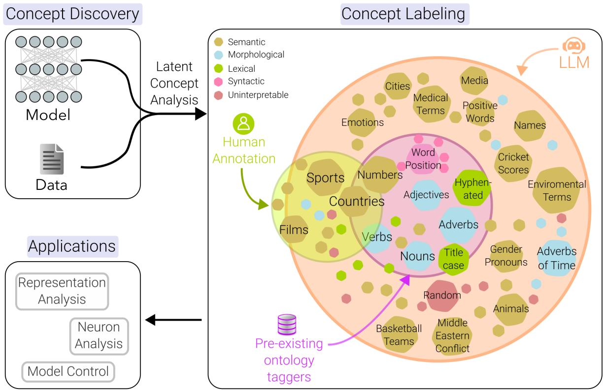  
Figure 1: ChatGPT as an annotator: Human annotation or taggers trained on pre-defined concepts, cover only a fraction of a model’s concept space. ChatGPT enables scaling up annotation to include nearly all concepts, including the concepts that may not have been manually annotated before.

Our findings indicate that the annotations produced by ChatGPT are semantically richer and accurate compared to the human-annotated concepts (for instance BERT Concept NET). Notably, Chat-GPT correctly labeled the majority of concepts deemed uninterpretable by human annotators. Using an LLM like ChatGPT improves scalability and accuracy. For instance, the work in Dalvi et al. (2022) was limited to 269 concepts in the final layer of the BERT-base-cased (Devlin et al., 2019) model, while human annotations in Geva et al. (2021) were confined to 100 keys per layer. Using ChatGPT, the exploration can be scaled to the entire latent space of the models and many more architectures. We used GPT to annotate 39K concepts across 5 pre-trained language models. Building upon this finding, we further demonstrate that GPT-based annotations empowers methodologies in interpretation analysis of which we show two: i) probing framework (Belinkov et al., 2017a), ii) neuron analysis (Antverg and Belinkov, 2022).

Probing Framework We train probes from GPTannotated concept representations to explore concepts that go beyond conventional linguistic categories. For instance, instead of probing for named entities (e.g. NE:PER), we can investigate whether a model distinguishes between male and female names or probing for “Cities in the southeastern United States” instead of NE:LOC.

Neuron Analysis Another line of work that we illustrate to benefit from GPT-annotated latent concepts is the neuron analysis i.e. discovering neurons that capture a linguistic phenomenon. In contrast to the holistic view offered by representation analysis, neuron analysis highlights the role ofindividual neurons (or groups of them) within a neural network ((Sajjad et al., 2022). We obtain neuron rankings for GPT-annotated latent concepts using a neuron ranking method called Probeless (Antverg and Belinkov, 2022). Such fine-grained interpertation analyses of latent spaces enable us to see how neurons distribute in hierarchical ontologies. For instance, instead of simply identifying neurons associated with the POS:Adverbs, we can now uncover how neurons are distributed across sub-concepts such as adverbs of time (e.g., “tomorrow”) and adverbs of frequency (e.g., “daily”). Or instead of discovering neurons for named entities (e.g. NE:PER), we can discover neurons that capture “Muslim Names” versus “Hindu Names”.

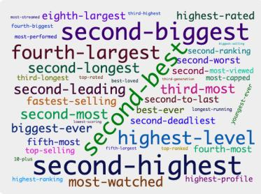  
(a) Hyphenated Superlatives

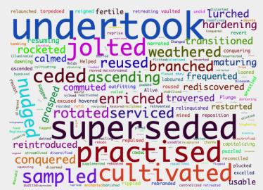  
(b) Verbs

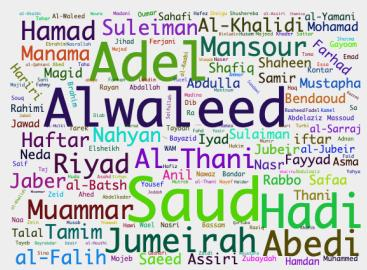  
(c) Arab Names  
Figure 2: Illustrative Examples of Concept Learned in BERT: word groups organized based on (a) Lexical, (b) Parts of Speech, and (c) Semantic property

To summarize, we make the following contributions in this work:

• Our demonstration reveals that ChatGPT offers comprehensive and precise labels for latent concepts acquired within pLMs.

• We showcased the GPT-based annotations of latent concepts empower methods in interpretation analysis by showing two applications: Probing Classifiers and Neuron Analysis.

• We release Transformers Concept-Net, an extensive dataset containing 39K annotated concepts to facilitate the interpretation of pLMs.

## 2 Methodology

We discover latent concepts by applying clustering on feature vectors (§2.1). They are then labeled using ChatGPT (§2.2) and used for fine-grained interpretation analysis (§2.3 and 2.4). A visual representation of this process is shown in Figure 1.

## 2.1 Concept Discovery

Contextualized word representations learned in pretrained language models, can identify meaningful groupings based on various linguistic phenomenon. These groups represent concepts encoded within pLMs. Our investigation expands upon the work done in discovering latent ontologies in contextualized representations (Michael et al., 2020; Dalvi et al., 2022). At a high level, feature vectors (contextualized representations) are first generated by performing a forward pass on the model. These representations are then clustered to discover the encoded concepts. Consider a pre-trained model M with L layers: $l _ { 1 } , l _ { 2 } , \ldots , l _ { L }$ Using dataset $\mathbb { D } = w _ { 1 } , w _ { 2 } , . . . , w _ { N }$ , we generate feature vectors D M $\mathbf { z } ^ { l } = \mathbf { z } _ { 1 } ^ { l } , \ldots , \mathbf { z } _ { n } ^ { l } . ^ { 2 }$ Agglomerative hierarchical clustering is employed to cluster the words. Initially, each word forms its own cluster. Clusters are then merged iteratively based on Ward’s minimum variance criterion, using intra-cluster variance as dissimilarity measure. The squared Euclidean distance evaluates the similarity between vector representations. The algorithm stops when K clusters (encoded concepts) are formed, with K being a hyper-parameter.

## 2.2 Concept Annotation

Encoded concepts capture latent relationships among words within a cluster, encompassing various forms of similarity such as lexical, syntactic, semantic, or specific patterns relevant to the task or data. Figure 2 provides illustrative examples of concepts encoded in the BERT-base-cased model.

This work leverages the recent advancements in prompt-based approaches, which are enabled by large language models such as GPT-3 (Brown et al., 2020). Specifically, we utilize a zero-shot learning strategy, where the model is solely provided with a natural language instruction that describes the task of labeling the concept. We used ChatGPT with zero-shot prompt to annotate the latent concepts with the following settings:3

Assistant is a large language model   
trained by OpenAI   
Instructions:

Give a short and concise label that best describes the following list of words: [“word 1”, “word 2”, ..., “word N”]

## 2.3 Concept Probing

Our large scale annotations of the concepts in pLMs enable training probes towards fine-grained concepts that lack pre-defined annotations. For example we can use probing to assess whether a model has learned concepts that involve biases related to gender, race, or religion. By tracing the input sentences that correspond to an encoded concept C in a pre-trained model, we create annotations for a particular concept. We perform finegrained concept probing by extracting feature vectors from annotated data through a forward pass on the model of interest. Then, we train a binary classifier to predict the concept and use the probe accuracy as a qualitative measure of how well the model represents the concept. Formally, given a set of tokens $\mathbb { W } ~ = ~ \{ w _ { 1 } , w _ { 2 } , . . . , w _ { N } \} ~ \in ~ C$ , we generate feature vectors, a sequence of latent representations: $\mathbb { W } \stackrel { \mathbb { M } } { \longrightarrow } { \mathbf z } ^ { l } = \{ { \mathbf z } _ { 1 } ^ { l } , \ldots , { \mathbf z } _ { n } ^ { l } \}$ for each word $w _ { i }$ by doing a forward pass over $s _ { i }$ . We then train a binary classifier over the representations to predict the concept C minimizing the cross-entropy loss:

$$
\mathcal { L } ( \theta ) = - \sum _ { i } \log P _ { \theta } ( \mathbf { c } _ { i } | \mathbf { w } _ { i } )
$$

where $\begin{array} { r } { P _ { \theta } ( \mathbf { c } _ { i } | \mathbf { z } _ { i } ) = \frac { \exp ( \theta _ { l } \cdot \mathbf { z } _ { i } ) } { \sum _ { c ^ { \prime } } \exp ( \theta _ { l ^ { \prime } } \cdot \mathbf { z } _ { i } ) } } \end{array}$ is the probability that word $\mathbf { x } _ { i }$ is assigned concept c. We learn the weights $\boldsymbol { \theta } \in \mathbb { R } ^ { D \times L }$ using gradient descent. Here D is the dimensionality of the latent representations $\mathbf { z } _ { i }$ and L is the size of the concept set which is 2 for a binary classifier.

## 2.4 Concept Neurons

An alternative area of research in interpreting NLP models involves conducting representation analysis at a more fine-grained level, specifically focusing on individual neurons. Our demonstration showcases how the extensive annotations of latent concepts enhance the analysis of neurons towards more intricate concepts. We show this by using a neuron ranking method called Probeless (Antverg and Belinkov, 2022) over our concept representations. The method obtains neuron rankings using an accumulative strategy, where the score of a given neuron n towards a concept C is defined as follows:

$$
R ( n , \mathcal { C } ) = \mu ( \mathcal { C } ) - \mu ( \hat { \mathcal { C } } )
$$

where $\mu ( \mathcal { C } )$ is the average of all activations $z ( n , w )$ w $ \ u _ { 1 } \in { \mathcal { C } } _ { : }$ , and $\mu ( \hat { \mathcal { C } } )$ is the average of activations over the random concept set. Note that the ranking for each neuron n is computed independently.

## 3 Experimental Setup

Latent Concept Data We used a subset of the WMT News 2018 dataset, containing 250K randomly chosen sentences ( 5M tokens). We set a word occurrence threshold of 10 and restricted each word type to a maximum of 10 occurrences. This selection was made to reduce computational and memory requirements when clustering highdimensional vectors. We preserved the original embedding space to avoid information loss through dimensionality reduction techniques like PCA. Consequently, our final dataset consisted of 25,000 word types, each represented by 10 contexts.

Concept Discovery We apply agglomerative hierarchical clustering on contextualized feature vectors acquired through a forward pass on a pLM for the given data. The resulting representations in each layer are then clustered into 600 groups.4

Concept Annotation We used ChatGPT available through Azure OpenAI service5 to carryout the annotations. We used a temperature of 0 and a top p value of 0.95. Setting the temperature to 0 controls the randomness in the output and produces deterministic responses.

Pre-trained Models Our study involved several 12-layered transformer models, including BERTcased (Devlin et al., 2019), RoBERTa (Liu et al., 2019b), XLNet (Yang et al., 2019), and ALBERT (Lan et al., 2019) and XLM-RoBERTa (XLM-R) (Conneau et al., 2020).

Probing and Neuron Analysis For each annotated concept, we extract feature vectors using the relevant data. We then train linear classifiers with a categorical cross-entropy loss function, optimized using Adam (Kingma and Ba, 2014). The training process involved shuffled mini-batches of size 512 and was concluded after 10 epochs. We used a data split of 60-20-20 for train, dev, test when training classifiers. We use the same representations to obtain neuron rankings. We use NeuroX toolkit (Dalvi et al., 2023a) to train our probes and run neuron analysis.

<table><tr><td>Q1</td><td>Acceptable</td><td>Unacceptable</td></tr><tr><td>Majority Fliess Kappa</td><td colspan="2">244 25 0.71 (&quot;Substantial agreement&quot;)</td></tr><tr><td>Q2</td><td>Precise</td><td>Imprecise</td></tr><tr><td>Majority Fliess Kappa</td><td>181 0.34 (&quot;Fair agreement&quot;)</td><td>60</td></tr></table>

Table 1: Inter-annotator agreement with 3 annotators. Q1: Whether the label is acceptable or unacceptable? Q2: Of the acceptable annotations how many are precise versus imprecise?
<table><tr><td>Q3</td><td>GPT ↑</td><td>Equal</td><td>BCN↑</td><td>No Majority</td></tr><tr><td>Majority</td><td>82</td><td>121</td><td>58</td><td>8</td></tr><tr><td>Fliess Kappa</td><td colspan="4">0.56 (&quot;Moderate agreement&quot;)</td></tr></table>

Table 2: Annotation for Q3 with 3 choices: GPT is better, labels are equivalent, human annotation is better.

## 4 Evaluation and Analysis

## 4.1 Results

To validate ChatGPT’s effectiveness as an annotator, we conducted a human evaluation. Evaluators were shown a concept through a word cloud, along with sample sentences representing the concept and the corresponding GPT annotation. They were then asked the following questions:

• Q1: Is the label produced by ChatGPT Acceptable or Unacceptable? Unacceptable annotations include incorrect labels or those that ChatGPT was unable to annotate.

• Q2: If a label is Acceptable, is it Precise or Imprecise? While a label may be deemed acceptable, it may not convey the relationship between the underlying words in the concept accurately. This question aims to measure the precision of the label itself.

• Q3: Is the ChatGPT label Superior or Inferior to human annotation? BCN labels provided by Dalvi et al. (2022) are used as human annotations for this question.

In the first half of Table 1, the results indicate that 90.7% of the ChatGPT labels were considered Acceptable. Within the acceptable labels, 75.1% were deemed Precise, while 24.9% were found to be Imprecise (indicated by Q2 in Table 1). We also computed Fleiss’ Kappa (Fleiss et al., 2013) to measure agreement among the 3 annotators. For Q1, the inter-annotator agreement was found to be 0.71 which is considered substantial according to Landis and Koch (1977). However, for Q2, the agreement was 0.34 (indicating a fair level of agreement among annotators). This was expected due to the complexity and subjectivity of the task in Q2 for example annotators’ knowledge and perspective on precise and imprecise labels.

<table><tr><td colspan="2">Annotation SEM LEX Morph SYN Unint.</td></tr><tr><td>ChatGPT 85.5 1.1 3.0</td><td>X 3.3</td></tr><tr><td>BCN 68.4 16.7</td><td>3.0 2.2 9.7</td></tr></table>

Table 3: Distribution (percentages) of concept types in ChatGPT Labels vs. Human Annotations: Semantic, Lexical, Morphological, Syntactic, Uninterpretable

ChatGPT Labels versus Human Annotations Next we compare the quality of ChatGPT labels to the human annotations using BERT Concept Net, a human annotated collection of latent concepts learned within the representations of BERT. BCN, however, was annotated in the form of Concept Type:Concept Sub Type (e.g., SEM:entertainment:sport:ice\_hockey) unlike GPT-based annotations that are natural language descriptions (e.g. Terms related to ice hockey). Despite their lack of natural language, these reference annotations prove valuable for drawing comparative analysis between humans and ChatGPT. For Q3, we presented humans with a word cloud and three options to choose from: whether the LLM annotations are better, equalivalent, or worse than the BCN annotations. We found that ChatGPT outperformed or achieved equal performance to BCN annotations in 75.5% of cases, as shown in Table 2. The inter-annotator agreement for Q3 was found to be 0.56 which is considered moderate.

## 4.2 Error Analysis

The annotators identified 58 concepts where human annotated BCN labels were deemed superior. We have conducted an error analysis of these instances and will now delve into the cases where GPT did not perform well.

Sensitive Content Models In 10 cases, the API calls triggered one of the content policy models and failed to provide a label. The content policy models aim to prevent the dissemination of harmful, abusive, or offensive content, including hate speech, misinformation, and illegal activities. Figure 3a shows an example of a sensitive concept that

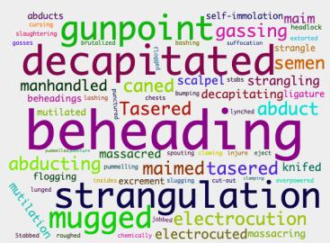  
(a) Crime and Assault

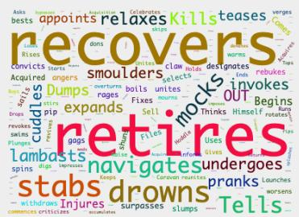  
(b) 3rd Person Singular Present-tense

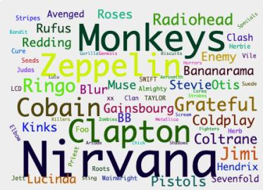  
(c) Rock Bands and Artists in the US

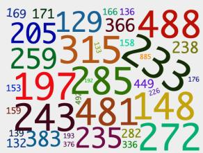

A total of 285 could prove to be rather impressive on a pitch that was turning almost from the first ball .   
But there were runs at Cheltenham , where Gloucestershire finished on 315 for seven , with the only century of the entire Championship day going to Ryan Higgins , out for a 161-ball 105   
Back in Nottingham , it was the turn of Australia ’s bowlers to be eviscerated this time as Eoin Morgan ’s team rewrote the record books once again by making a phenomenal 481 for six in this third one-day international .

(d) Cricket Scores

Figure 3: Failed cases for ChatGPT labeling: a) Non-labeled concepts due to LLM content policy, b) Failing to identify correct linguistic relation, c) Imprecise labeling d) Imprecise labels despite providing context

includes words related to crime and assault. This problem can be mitigated by using a version of LLM where content policy models are not enabled.

Linguistic Ontologies In 8 of the concepts, human annotations (BCN) were better because the concepts were composed of words that were related through a lexical, morphological, or syntactic relationship. The default prompt we used to label the concept tends to find semantic similarity between the words, which did not exist in these concepts. For example, Figure 3b shows a concept composed of 3rd person singular present-tense verbs, but ChatGPT incorrectly labels it as Actions/Events in News Articles. However, humans are robust and can fall back to consider various linguistic ontologies.

The BCN concepts are categorized into semantic, syntactic, morphological, and lexical groups (See Table 3). As observed, both humans and ChatGPT found semantic meaning to the concept in majority of the cases. However, humans were also able to identify other linguistic relations such as lexical (e.g. grouped by a lexical property like abbreviations), morphological (e.g. grouped by the same parts-of-speech), or syntactic (e.g. grouped by position in the sentence). Note however, that prompts can be modified to capture specific linguistic property. We encourage interested readers to see our experiments on this in Appendix A.2-A.3.

Insufficient Context Sometimes context contextual information is important to correctly label a concept. While human annotators (of the BCN corpus) were provided with the sentences in which the underlying words appeared, we did not provide the same to ChatGPT to keep the prompt costeffective. However, providing context sentences in the prompt6 along with the concept to label resulted in improved labels for 11 of the remaining 40 error cases. Figure 3d shows one such example where providing contextual information made ChatGPT to correctly label the concept as Cricket Scores as opposed to Numerical Data the label that it gives without seeing contextual information. However, providing context information didn’t consistently prove helpful. Figure 3c shows a concept, where providing contextual information did not result in the accurate label: Rock Bands and Artists in the US, as identified by the humans.

Uninterpretable Concepts Conversely, we also annotated concepts that were considered uninterpretable or non-meaningful by the human annotators in the BCN corpus and in 21 out 26 cases, ChatGPT accurately assigned labels to these concepts. The proficiency of ChatGPT in processing extensive textual data enables it to provide accurate labels for these concepts.

<table><tr><td>tag</td><td>Label</td><td>ALBERT XLNet</td><td></td></tr><tr><td></td><td>c301 Gender-related Nouns and pronouns</td><td>0.95</td><td>0.86</td></tr><tr><td>c533 LGBTQ+</td><td></td><td>0.97</td><td>0.97</td></tr><tr><td></td><td>c439 Sports commentary terms</td><td>0.91</td><td>0.81</td></tr><tr><td></td><td>c173 Football team names and stadiums</td><td>0.96</td><td>0.94</td></tr><tr><td></td><td>c348 Female names and titles</td><td>0.98</td><td>0.94</td></tr><tr><td></td><td>c149 Tennis players&#x27; names</td><td>0.95</td><td>0.92</td></tr><tr><td></td><td>c487 Spanish Male Names</td><td>0.96</td><td>0.94</td></tr><tr><td></td><td>c564 Cities and Universities in southeastern US</td><td>0.97</td><td>0.90</td></tr><tr><td></td><td>c263 Locations in New York City</td><td>0.95</td><td>0.92</td></tr><tr><td></td><td>c247 Scandinavian/Nordic names and places</td><td>0.98</td><td>0.95</td></tr><tr><td></td><td>c438 Verbs for various actions and outcomes</td><td>0.94</td><td>0.87</td></tr><tr><td></td><td>c44 Southeast Asian Politics and Ethnic Conflict</td><td>0.97</td><td>0.94</td></tr><tr><td></td><td>c421 Names of people and places in the middle east</td><td>0.94</td><td>0.95</td></tr><tr><td></td><td>c245 Middle East conflict</td><td>1.00</td><td>0.93</td></tr><tr><td></td><td>c553 Islamic terminology</td><td>0.96</td><td>0.89</td></tr><tr><td></td><td>c365 Criminal activities</td><td>0.93</td><td>0.89</td></tr><tr><td></td><td>c128 Medical and Healthcare terminology</td><td>0.98</td><td>0.95</td></tr></table>

Table 4: Using latent concepts to make cross-model comparison using Probing Classifiers

## 5 Concept-based Interpretation Analysis

Now that we have established the capability of large language models like ChatGPT in providing rich semantic annotations, we will showcase how these annotations can facilitate extensive finegrained analysis on a large scale.

## 5.1 Probing Classifiers

Probing classifiers is among the earlier techniques used for interpretability, aimed at examining the knowledge encapsulated in learned representations. However, their application is constrained by the availability of supervised annotations, which often focus on conventional linguistic knowledge and are subject to inherent limitations (Hewitt and Liang, 2019). We demonstrate that using GPT-based annotation of latent concepts learned within these models enables a direct application towards finegrained probing analysis. By annotating the latent space of five renowned pre-trained language models (pLMs): BERT, ALBERT, XLM-R, XLNet, and RoBERTa – we developed a comprehensive Transformers Concept Net. This net encompasses 39,000 labeled concepts, facilitating cross-architectural comparisons among the models. Table 4 showcases a subset7 of results comparing ALBERT and XLNet through probing classifiers.

We can see that the model learns concepts that may not directly align with the pre-defined human onotology. For example, it learns a concept based on Spanish Male Names or Football team names and stadiums. Identifying how fine-grained concepts are encoded within the latent space of a model enable applications beyond interpretation analysis. For example it has direct application in model editing (Meng et al., 2023) which first trace where the model store any concept and then change the relevant parameters to modify its behavior. Moreover, identifying concepts that are associated with gender (e.g., Female names and titles), religion (e.g. Islamic Terminology), and ethnicity (e.g., Nordic names) can aid in elucidating the biases present in these models.

## 5.2 Neuron Analysis

Neuron analysis examines the individual neurons or groups of neurons within neural NLP models to gain insights into how the model represents linguistic knowledge. However, similar to general interpretability, previous studies in neuron analysis are also constrained by human-in-the-loop (Karpathy et al., 2015; Kádár et al., 2017) or pre-defined linguistic knowledge (Lakretz et al., 2019; Dalvi et al., 2019; Hennigen et al., 2020). Consequently, the resulting neuron explanations are subject to the same limitations we address in this study.

Our work demonstrates that annotating the latent space enables neuron analysis of intricate linguistic hierarchies learned within these models. For example, Dalvi et al. (2019) and Hennigen et al. (2020) only carried out analysis using very coarse morphological categories (e.g. adverbs, nouns etc.) in parts-of-speech tags. We now showcase how our discovery and annotations of fine-grained latent concepts leads to a deeper neuron analysis of these models. In our analysis of BERT-based partof-speech tagging model, we discovered 17 finegrained concepts of adverb (in the final layer). It is evident that BERT learns a highly detailed semantic hierarchy, as maintains separate concepts for the adverbs of frequency (e.g., “rarely, sometimes”) versus adverbs of manner (e.g., “quickly, softly”). We employed the Probeless method (Antverg and Belinkov, 2022) to search for neurons associated with specific kinds of adverbs. We also create a super adverb concept encompassing all types of adverbs, serving as the overarching and generic representation for this linguistic category and obtain neurons associated with the concept. We then compare the neuron ranking obtained from the super concept to the individual rankings from sub concepts. Interestingly, our findings revealed that the top-ranking neurons responsible for learning the super concept are often distributed among the top neurons associated with specialized concepts, as shown in Figure 4 for adverbial concepts. The results, presented in Table 5, include the number of discovered sub concepts in the column labeled # Sub Concepts and the Alignment column indicates the percentage of overlap in the top 10 neurons between the super and sub concepts for each specific adverb concept. The average alignment across all sub concepts is indicated next to the super concept. This observation held consistently across various properties (e.g. Nouns, Adjectives and Numbers) as shown in Table 5. For further details please refer to Appendix C).

<table><tr><td>Super Concept</td><td># Sub Concepts</td><td>Alignment</td></tr><tr><td>Adverbs</td><td>17</td><td>0.36</td></tr><tr><td> c155: Frequency and manner</td><td></td><td>0.30</td></tr><tr><td>→ c136: Degree/Intensity c057: Frequency</td><td></td><td>0.30</td></tr><tr><td>Nouns</td><td>13</td><td>0.40</td></tr><tr><td> c231: Activities and Objects</td><td></td><td>0.28</td></tr><tr><td> c279: Industries/Sectors</td><td></td><td>0.60</td></tr><tr><td> c440: Professions</td><td></td><td>0.60</td></tr><tr><td></td><td></td><td>0.10</td></tr><tr><td>Adjectives</td><td>17</td><td>0.21</td></tr><tr><td> c299: Product Attributes</td><td></td><td>0.30</td></tr><tr><td>→ c053: Comparative Adjectives</td><td></td><td>0.30</td></tr><tr><td> c128: Quality/Appropriateness</td><td></td><td>0.40</td></tr><tr><td>Numbers</td><td></td><td></td></tr><tr><td></td><td>17</td><td>0.23</td></tr><tr><td>↔ c549: Prices</td><td></td><td>0.50</td></tr><tr><td> c080: Quantities</td><td></td><td>0.10</td></tr><tr><td> c593: Monetary Values</td><td></td><td>0.10</td></tr></table>

Table 5: Neuron Analysis on Super Concepts extracted from BERT-base-cased-POS model. The alignment column shows the intersection between the top 10 neurons in the Super concept and the Sub concepts. For detailed results please check Appendix C (See Table 11)

Note that previously, we couldn’t identify neurons with such specific explanations, like distinguishing neurons for numbers related to currency values from those for years of birth or neurons differentiating between cricket and hockey-related terms. Our large scale concept annotation enables locating neurons that capture the fine-grained aspects of a concept. This enables applications such as manipulating network’s behavior in relation to that concept. For instance, Bau et al. (2019) identified “tense” neurons within Neural Machine Translation (NMT) models and successfully changed the output from past to present tense by modifying the activation of these specific neurons. However, their study was restricted to very few coarse concepts for which annotations were available.

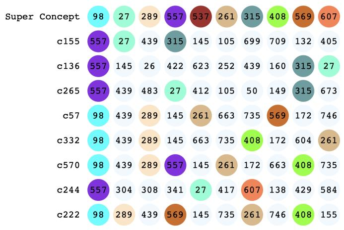  
Figure 4: Neuron overlap between an Adverb Super Concept and sub concepts. Sub concepts shown are Adverbs of frequency and manner (c155), Adverbs of degree/intensity (c136), Adverbs of Probability and Certainty (c265), Adverbs of Frequency (c57), Adverbs of manner and opinion (c332), Adverbs of preference/choice (c570), Adverbs indicating degree or extent (c244), Adverbs of Time (c222).

## 6 Related Work

With the ever-evolving capabilities of the LLMs, researchers are actively exploring innovative ways to harness their assistance. Prompt engineering, the process of crafting instructions to guide the behavior and extract relevant knowledge from these oracles, has emerged as a new area of research (Lester et al., 2021; Liu et al., 2021; Kojima et al., 2023; Abdelali et al., 2023; Dalvi et al., 2023b). Recent work has established LLMs as highly proficient annotators. Ding et al. (2022) carried out evaluation of GPT-3’s performance as a data annotator for text classification and named entity recognition tasks, employing three primary methodologies to assess its effectiveness. Wang et al. (2021) showed that GPT-3 as an annotator can reduce cost from 50-96% compared to human annotations on 9 NLP tasks. They also showed that models trained using GPT-3 labeled data outperformed the GPT-3 fewshot learner. Similarly, Gilardi et al. (2023) showed that ChatGPT achieves higher zero-shot accuracy compared to crowd-source workers in various annotation tasks, encompassing relevance, stance, topics, and frames detection. Our work is different from previous work done using GPT as annotator. We annotate the latent concepts encoded within the embedding space of pre-trained language models. We demonstrate how such a large scale annotation enriches representation analysis via application in probing classifiers and neuron analysis.

## 7 Conclusion

The scope of previous studies in interpreting neural language models is limited to general ontologies or small-scale manually labeled concepts. In our research, we showcase the effectiveness of Large Language Models, specifically ChatGPT, as a valuable tool for annotating latent spaces in pre-trained language models. This large-scale annotation of latent concepts broadens the scope of interpretation from human-defined ontologies to encompass all concepts learned within the model, and eliminates the human-in-the-loop effort for annotating these concepts. We release a comprehensive GPTannotated Transformers Concept Net (TCN) consisting of 39,000 concepts, extracted from a wide range of transformer language models. TCN empowers the researchers to carry out large-scale interpretation studies of these models. To demonstrate this, we employ two widely used techniques in the field of interpretability: probing classifiers and neuron analysis. This novel dimension of analysis, previously absent in earlier studies, sheds light on intricate aspects of these models. By showcasing the superiority, adaptability, and diverse applications of ChatGPT annotations, we lay the groundwork for a more comprehensive understanding of NLP models.

## Limitations

We list below limitations of our work:

• While it has been demonstrated that LLMs significantly reduce the cost of annotations, the computational requirements and response latency can still become a significant challenge when dealing with extensive or high-throughput annotation pipeline like ours. In some cases it is important to provide contextual information along with the concept to obtain an accurate annotation, causing the cost go up. Nevertheless, this is a one time cost for any specific model, and there is optimism that future LLMs will become more cost-effective to run.

• Existing LLMs are deployed with content policy filters aimed at preventing the dissemination of harmful, abusive, or offensive content. However, this limitation prevents the models from effectively labeling concepts that reveal sensitive information, such as cultural and racial biases learned within the model to be interpreted. For example, we were unable to extract a label for racial slurs in the hate speech detection task. This restricts our concept annotation approach to only tasks that are not sensitive to the content policy.

• The information in the world is evolving, and LLMs will require continuous updates to reflect the accurate state of the world. This may pose a challenge for some problems (e.g. news summarization task) where the model needs to reflect an updated state of the world.

## References

Ahmed Abdelali, Hamdy Mubarak, Shammur Absar Chowdhury, Maram Hasanain, Basel Mousi, Sabri Boughorbel, Yassine El Kheir, Daniel Izham, Fahim Dalvi, Majd Hawasly, Nizi Nazar, Yousseif Elshahawy, Ahmed Ali, Nadir Durrani, Natasa Milic-Frayling, and Firoj Alam. 2023. Benchmarking arabic ai with large language models.

Firoj Alam, Fahim Dalvi, Nadir Durrani, Hassan Sajjad, Khan, Abdul Rafae, and Jia Xu. 2023. Conceptx: A framework for latent concept analysis. In Proceedings of the Thirty-Seventh AAAI Conference on Artificial Intelligence (AAAI, Poster presentation), pages 16395–16397.

Omer Antverg and Yonatan Belinkov. 2022. On the pitfalls of analyzing individual neurons in language models. In International Conference on Learning Representations.

Anthony Bau, Yonatan Belinkov, Hassan Sajjad, Nadir Durrani, Fahim Dalvi, and James Glass. 2019. Identifying and controlling important neurons in neural machine translation. In Proceedings ofthe Seventh International Conference on Learning Representations, ICLR ’19, New Orleans, USA.

Yonatan Belinkov, Nadir Durrani, Fahim Dalvi, Hassan Sajjad, and James Glass. 2017a. What do neural machine translation models learn about morphology? In Proceedings of the 55th Annual Meeting of the Associationfor Computational Linguistics, ACL ’17, pages 861–872, Vancouver, Canada. Association for Computational Linguistics.

Yonatan Belinkov, Nadir Durrani, Fahim Dalvi, Hassan Sajjad, and James Glass. 2020. On the linguistic representational power of neural machine translation models. Computational Linguistics, 45(1):1–57.

Yonatan Belinkov, Lluís Màrquez, Hassan Sajjad, Nadir Durrani, Fahim Dalvi, and James Glass. 2017b. Evaluating layers of representation in neural machine translation on part-of-speech and semantic tagging tasks. In Proceedings of the Eighth International Joint Conference on Natural Language Processing (Volume 1: Long Papers), pages 1–10, Taipei, Taiwan. Asian Federation of Natural Language Processing.

Tom B. Brown, Benjamin Mann, Nick Ryder, Melanie Subbiah, Jared Kaplan, Prafulla Dhariwal, Arvind Neelakantan, Pranav Shyam, Girish Sastry, Amanda Askell, Sandhini Agarwal, Ariel Herbert-Voss, Gretchen Krueger, Tom Henighan, Rewon Child, Aditya Ramesh, Daniel M. Ziegler, Jeffrey Wu, Clemens Winter, Christopher Hesse, Mark Chen, Eric Sigler, Mateusz Litwin, Scott Gray, Benjamin Chess, Jack Clark, Christopher Berner, Sam McCandlish, Alec Radford, Ilya Sutskever, and Dario Amodei. 2020. Language models are few-shot learners. CoRR, abs/2005.14165.

Alexis Conneau, Kartikay Khandelwal, Naman Goyal, Vishrav Chaudhary, Guillaume Wenzek, Francisco Guzmán, Edouard Grave, Myle Ott, Luke Zettlemoyer, and Veselin Stoyanov. 2020. Unsupervised cross-lingual representation learning at scale. In Proceedings of the 58th Annual Meeting of the Association for Computational Linguistics, pages 8440–8451. Association for Computational Linguistics.

Alexis Conneau, German Kruszewski, Guillaume Lample, Loïc Barrault, and Marco Baroni. 2018. What you can cram into a single \$&!#\* vector: Probing sentence embeddings for linguistic properties. In Proceedings of the 56th Annual Meeting of the Association for Computational Linguistics, ACL ’18, pages 2126–2136, Melbourne, Australia. Association for Computational Linguistics.

Fahim Dalvi, Nadir Durrani, and Hassan Sajjad. 2023a. Neurox library for neuron analysis of deep nlp models. In Proceedings of the 61st Annual Meeting of the Associationfor Computational Linguistics: System Demonstrations, pages 75–83, Toronto, Canada. Association for Computational Linguistics.

Fahim Dalvi, Nadir Durrani, Hassan Sajjad, Yonatan Belinkov, D. Anthony Bau, and James Glass. 2019. What is one grain of sand in the desert? analyzing individual neurons in deep nlp models. In Proceedings of the Thirty-Third AAAI Conference on Artificial Intelligence (AAAI, Oral presentation).

Fahim Dalvi, Maram Hasanain, Sabri Boughorbel, Basel Mousi, Samir Abdaljalil, Nizi Nazar, Ahmed Abdelali, Shammur Absar Chowdhury, Hamdy Mubarak, Ahmed Ali, Majd Hawasly, Nadir Durrani, and Firoj Alam. 2023b. Llmebench: A flexible framework for accelerating llms benchmarking.

Fahim Dalvi, Abdul Rafae Khan, Firoj Alam, Nadir Durrani, Jia Xu, and Hassan Sajjad. 2022. Discovering latent concepts learned in BERT. In International Conference on Learning Representations.

Jacob Devlin, Ming-Wei Chang, Kenton Lee, and Kristina Toutanova. 2019. BERT: Pre-training of deep bidirectional transformers for language understanding. In Proceedings of the 2019 Conference of the North American Chapter of the Association for Computational Linguistics: Human Language Technologies, NAACL-HLT ’19, pages 4171–4186, Minneapolis, Minnesota, USA. Association for Computational Linguistics.

Bosheng Ding, Chengwei Qin, Linlin Liu, Lidong Bing, Shafiq Joty, and Boyang Li. 2022. Is gpt-3 a good data annotator?

Nadir Durrani, Fahim Dalvi, Hassan Sajjad, Yonatan Belinkov, and Preslav Nakov. 2019. One size does not fit all: Comparing NMT representations of different granularities. In Proceedings ofthe 2019 Conference of the North American Chapter of the Association for Computational Linguistics: Human Language Technologies, ACL ’19, pages 1504–1516, Minneapolis, Minnesota, USA. Association for Computational Linguistics.

Nadir Durrani, Hassan Sajjad, Fahim Dalvi, and Firoj Alam. 2022. On the transformation of latent space in fine-tuned nlp models. In Proceedings of the 2022 Conference on Empirical Methods in Natural Language Processing (EMNLP), pages 1495–1516, Abu Dhabi, UAE. Association for Computational Linguistics.

Joseph L Fleiss, Bruce Levin, and Myunghee Cho Paik. 2013. Statistical methodsfor rates and proportions.

Yao Fu and Mirella Lapata. 2022. Latent topology induction for understanding contextualized representations.

Mor Geva, Roei Schuster, Jonathan Berant, and Omer Levy. 2021. Transformer feed-forward layers are keyvalue memories. In Proceedings of the 2021 Conference on Empirical Methods in Natural Language Processing, pages 5484–5495, Online and Punta Cana, Dominican Republic. Association for Computational Linguistics.

Fabrizio Gilardi, Meysam Alizadeh, and Maël Kubli. 2023. Chatgpt outperforms crowd-workers for textannotation tasks.

K Chidananda Gowda and G Krishna. 1978. Agglomerative clustering using the concept of mutual nearest neighbourhood. Pattern recognition, 10(2):105–112.

Biyang Guo, Xin Zhang, Ziyuan Wang, Minqi Jiang, Jinran Nie, Yuxuan Ding, Jianwei Yue, and Yupeng Wu. 2023. How close is chatgpt to human experts? comparison corpus, evaluation, and detection.

Lucas Torroba Hennigen, Adina Williams, and Ryan Cotterell. 2020. Intrinsic probing through dimension selection. In Proceedings ofthe 2020 Conference on Empirical Methods in Natural Language Processing (EMNLP), pages 197–216, Online. Association for Computational Linguistics.

John Hewitt and Percy Liang. 2019. Designing and interpreting probes with control tasks. In Proceedings ofthe 2019 Conference on Empirical Methods in Natural Language Processing and the 9th International Joint Conference on Natural Language Processing (EMNLP-IJCNLP), pages 2733–2743, Hong Kong, China.

Katharina Jeblick, Balthasar Schachtner, Jakob Dexl, Andreas Mittermeier, Anna Theresa Stüber, Johanna Topalis, Tobias Weber, Philipp Wesp, Bastian Sabel, Jens Ricke, and Michael Ingrisch. 2022. Chatgpt makes medicine easy to swallow: An exploratory case study on simplified radiology reports.

Akos Kádár, Grzegorz Chrupała, and Afra Alishahi. 2017. Representation of linguistic form and function in recurrent neural networks. Computational Linguistics, 43(4):761–780.

Andrej Karpathy, Justin Johnson, and Li Fei-Fei. 2015. Visualizing and understanding recurrent networks. arXiv preprint arXiv:1506.02078.

Diederik Kingma and Jimmy Ba. 2014. Adam: A Method for Stochastic Optimization. arXiv preprint arXiv:1412.6980.

Takeshi Kojima, Shixiang Shane Gu, Machel Reid, Yutaka Matsuo, and Yusuke Iwasawa. 2023. Large language models are zero-shot reasoners.

Yair Lakretz, German Kruszewski, Theo Desbordes, Dieuwke Hupkes, Stanislas Dehaene, and Marco Baroni. 2019. The emergence of number and syntax units in LSTM language models. In Proceedings of the 2019 Conference of the North American Chapter ofthe Associationfor Computational Linguistics: Human Language Technologies, Volume 1 (Long and Short Papers), pages 11–20, Minneapolis, Minnesota. Association for Computational Linguistics.

Zhenzhong Lan, Mingda Chen, Sebastian Goodman, Kevin Gimpel, Piyush Sharma, and Radu Soricut. 2019. ALBERT: a lite BERT for selfsupervised learning of language representations. ArXiv:1909.11942.

J Richard Landis and Gary G Koch. 1977. The measurement of observer agreement for categorical data. biometrics, pages 159–174.

Brian Lester, Rami Al-Rfou, and Noah Constant. 2021. The power of scale for parameter-efficient prompt tuning. In Proceedings of the 2021 Conference on Empirical Methods in Natural Language Processing, pages 3045–3059, Online and Punta Cana, Dominican Republic. Association for Computational Linguistics.

Tal Linzen, Emmanuel Dupoux, and Yoav Goldberg. 2016. Assessing the Ability of LSTMs to Learn Syntax-Sensitive Dependencies. Transactions of the Association for Computational Linguistics, 4:521– 535.

Nelson F. Liu, Matt Gardner, Yonatan Belinkov, Matthew E. Peters, and Noah A. Smith. 2019a. Linguistic knowledge and transferability of contextual representations. In Proceedings ofthe 2019 Conference of the North American Chapter of the Association for Computational Linguistics: Human Language Technologies, NAACL ’19, pages 1073–1094, Minneapolis, Minnesota, USA. Association for Computational Linguistics.

Pengfei Liu, Weizhe Yuan, Jinlan Fu, Zhengbao Jiang, Hiroaki Hayashi, and Graham Neubig. 2021. Pretrain, prompt, and predict: A systematic survey of prompting methods in natural language processing. CoRR, abs/2107.13586.

Yinhan Liu, Myle Ott, Naman Goyal, Jingfei Du, Mandar Joshi, Danqi Chen, Omer Levy, Mike Lewis, Luke Zettlemoyer, and Veselin Stoyanov. 2019b. RoBERTa: A robustly optimized BERT pretraining approach. ArXiv:1907.11692.

Kevin Meng, David Bau, Alex Andonian, and Yonatan Belinkov. 2023. Locating and editing factual associations in gpt.

Julian Michael, Jan A. Botha, and Ian Tenney. 2020. Asking without telling: Exploring latent ontologies in contextual representations. In Proceedings ofthe 2020 Conference on Empirical Methods in Natural Language Processing, EMNLP ’20, pages 6792– 6812, Online. Association for Computational Linguistics.

Tomas Mikolov, Kai Chen, Greg Corrado, and Jeffrey Dean. 2013. Efficient estimation of word representations in vector space. In Proceedings of the ICLR Workshop, Scottsdale, AZ, USA.

Peng Qian, Xipeng Qiu, and Xuanjing Huang. 2016. Investigating Language Universal and Specific Properties in Word Embeddings. In Proceedings of the 54th Annual Meeting of the Association for Computational Linguistics, ACL ’16, pages 1478–1488, Berlin, Germany. Association for Computational Linguistics.

Hassan Sajjad, Nadir Durrani, and Fahim Dalvi. 2022. Neuron-level interpretation of deep NLP models: A survey. Transactions ofthe Associationfor Computational Linguistics, 10:1285–1303.

Ian Tenney, Dipanjan Das, and Ellie Pavlick. 2019. BERT rediscovers the classical NLP pipeline. In Proceedings of the 57th Annual Meeting of the Associationfor Computational Linguistics, pages 4593– 4601, Florence, Italy. Association for Computational Linguistics.

Ekaterina Vylomova, Trevor Cohn, Xuanli He, and Gholamreza Haffari. 2017. Word representation models for morphologically rich languages in neural machine translation. pages 103–108.

Shuohang Wang, Yang Liu, Yichong Xu, Chenguang Zhu, and Michael Zeng. 2021. Want to reduce labeling cost? gpt-3 can help.

Zhilin Yang, Zihang Dai, Yiming Yang, Jaime Carbonell, Russ R Salakhutdinov, and Quoc V Le. 2019. Xlnet: Generalized autoregressive pretraining for language understanding. Advances in neural information processing systems, 32.

Bowen Zhang, Daijun Ding, and Liwen Jing. 2023. How would stance detection techniques evolve after the launch of chatgpt?

## Appendix

## A Prompts

## A.1 Optimal Prompt

Initially, we used a simple prompt to ask the model to provide labels for a list of words keeping the system description unchanged:

Assistant is a large language model trained by OpenAI

Prompt Body: Give the following list of words a short label: [“word 1”, “word 2”, ..., “word N”]

The output format from the first prompt was unclear as it included illustrations, which was not our intention. After multiple design iterations, we developed a prompt that returned the labels in the desired format. In this revised prompt, we modified the system description as follows:

Assistant is a large language model trained by OpenAI.

Instructions: When asked for labels, only the labels and nothing else should be returned.

We also modified the prompt body to:

Give a short and concise label that best describes the following list of words: [“word 1”, “word 2”, ..., “word N”]

Figure 5 shows some sample concepts learned in the last layer of BERT-base-cased along with their labels.

## A.2 Prompts For Lexical Concepts

During the error analysis (Section 4.2), we discovered that GPT struggled to accurately label concepts composed of words sharing a lexical property, such as a common suffix. However, we were able to devise a solution to address this issue by curating the prompt to effectively label such concepts. We modified the prompt to identify concepts that contain common n-grams.

Give a short and concise label describing the common ngrams between the words of the given list

Note: Only one common ngram should be returned. If there is no common ngram reply with ‘NA’

Using this improved we were able to correct 100% of the labeling errors in the concepts having lexical coherence. See Figure 7a for example. With the default prompt it was labelled as Superlative and ordinal adjectives and with the modified prompt, it was labeled as Hyphenated, cased & -based suffix.

## A.3 Prompts for POS Concepts

Similarly we were able to modify the prompt to correctly label concepts that were made from words having common parts-of-speech. From the prompts we tested, the best performing one is below:

Give a short and concise label describing the common part of speech tag between the words of the given list

Note: The part of speech tag should be chosen from the Penn Treebank. If there’s no common part of speech tag reply with ‘NA’

In Figure 7b, we present an example of a concept labeled as Surnames with ‘Mc’ prefix. However, it is important to note that not all the names in this concept actually begin with the “Mc” prefix. The appropriate label for this concept would be NNP: Proper Nouns or SEM: Irish Names. With the POS-based prompt, we are able to achieve the former.

## A.4 Providing Context

Our analysis revealed that including contextual information is crucial for accurately labeling concepts in certain cases. As shown in Figure 8, concepts were incorrectly labeled as Numerical Data despite representing different entities. Incorporating context enables us to obtain more specific labels. However, we face limitations in the number of input tokens we can provide to the model, which impacts the quality of the labels. Using context of 10 sentences we were able to correct 9 of the 38 erroneous labels.

## A.5 Other Details

Tokens Versus Types We observed that the quality of labels is influenced by the word frequency in the given list. Using tokens instead of types leads to more meaningful labels. However, when the latent concept includes hate speech words, passing a token list results in failed requests due to content policy violations. In such cases, we opted to pass the list of types instead. Although this mitigates the issue to a certain extent, it does not completely

MinneapolisArkansas Missouri Wyoming PLakes DetroitVegas Illinois Utah as Michigan Wisconsin Minnesota SaltArizona Kansas Indiana

(a) Geographic Locations in the US

Helen Eliza Michell Emily Melissa Dane Mrs.   
Amandae ErikaicSara Victorie Alex   
Lucy Trace Laura Clare Ms Ms   
tate Theresae She e   
Lady Sarah Margaret He Lizzie auren Elle Dol Kate   
MAngelinaJ enni Natalie

(d) Female Names and titles

Figure 5: Sample Concepts Learned in the last layer of BERT  
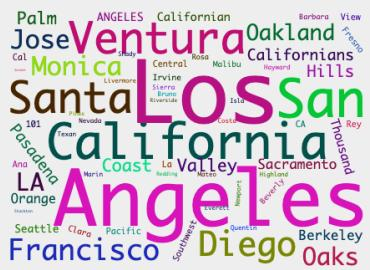  
(g) Geographic Locations in California

KuAl-OadHolocaustPKK Jewishewneo-NaziBJP Qaedaanti-SemitismKKK antisemitism

Al-Qaeda HolocaustPKK Qadanti-SemitismkKK antisemitism Nisazil

(d)

Israelis   
GolarPalestiniansii   
AvivS IDF Joel Jewiset   
Judaism   
JewGaza Heights Rabbi   
Palestinians IsraelTe Jewsu

(b) Middle East Conflict

HectorJorgeManuel Abel Guillerms   
Andres Rio OJuan Carlos Julian Sol Gabriel Ramon   
Felix itor   
Gustavo gu   
JoseJavierJosé   
Luis Pablo RubenRaullenin Ricardo Andrés Fernando

(e) Spanish Male Names

Thi CambodiaAung Vietnamese Kyivletnam ThaThailand provincial Myanmarchanoi Suukon Rohingya

(h) SE Asian Politics and Ethnic Conflict

constitutionalvatican   
martialreferendumMint Treasun   
eSupremecoup mint ltimate   
Constitution   
AmnestyCapitol Pentagon Smithsonianassassination captioned sandwiched bludpeaned   
longed esorted briefed fared ticked   
harassed boosted   
booked defLed derided   
ditchedemailedraed tweeted heralded boxed pitted   
gushed flocked wowed quippedroamedcourted skied chanted hinderec

(e)

Figure 6: Failed Requests in Albert

transgenderQueer gaysLGBT rose bisexualgaylesbiul Lesbian LGBTQ homosexuality queer

(c) LGBTQ+

schoolgirlsocialiteVictin   
Menwomen rinste men   
gender takes secretary Woman S elect boys Lady ma   
Seminist assum functions aick S She she housewife he female actior ladies feminism

(f) Gender related nouns and pronouns

ClemsonLuisville Kentucky anar   
Atlanta Ohio Tennessee   
Memphis   
Mississippi Aubi   
Columbus Georgia "Lexingtonj

(i) List of cities and universities in southeastern US

imprisonment Sentencing jail   
detention convicted Detention bail   
indicted nla   
jailed   
sentenced prosecuted custody parole   
guilty retrial mistrial sonarseut prosecute   
detained   
Triaiaprosecution imprisoned sentencing prisoner

killsdeath● murder •dies murders suiclde e Kilerm murdering murdered icidal murdereres SenKilldieddie

(f)

<table><tr><td>Tag Human Label</td><td>1 Label Response</td><td>3-Keyword Response</td></tr><tr><td>c533 LEX:hyphenated</td><td>Superlative and ordinal adjectives.</td><td>[&#x27;second&#x27;, &#x27;highest&#x27;, &#x27;biggest&#x27;]</td></tr><tr><td>c84 LEX:hyphenated</td><td>Accomplishments and Awards</td><td>[&#x27;Award-winning&#x27;, &#x27;Nominated&#x27;, &#x27;Multi-time&#x27;]</td></tr><tr><td>c783 LEX:hyphenated</td><td>Sports scores and point differentials.</td><td>[&#x27;points&#x27;, &#x27;wins&#x27;, &#x27;scores&#x27;]</td></tr><tr><td>c621 LEX:hyphenated</td><td>Describing people&#x27;s relationships and family status. [family, relationships, parenthood]</td><td></td></tr><tr><td>c869 LEX:hyphenated</td><td>Tennis Scores.</td><td>[&#x27;Tennis&#x27;, &#x27;Scores&#x27;, &#x27;Games&#x27;]</td></tr><tr><td>c833 LEX:hyphenated</td><td>Location-based adjectives</td><td>[based, area, listed]</td></tr><tr><td>c588 LEX:hyphenated</td><td>US political party affiliations by state and district.</td><td>[Republican, Democrat, State Abbreviations]</td></tr><tr><td>c639 LEX:hyphenated</td><td>Football scores.</td><td>[&#x27;Scores&#x27;, &#x27;Football&#x27;, &#x27;Winning&#x27;]</td></tr><tr><td>c934 LEX:hyphenated</td><td>Sports scores.</td><td>[&#x27;scores&#x27;, &#x27;victories&#x27;, &#x27;defeats&#x27;]</td></tr><tr><td>c850 LEX:case:title_case</td><td>Philippine Places and Names</td><td>[&#x27;Philippines&#x27;, &#x27;Tourism&#x27;, &#x27;Volcano&#x27;]</td></tr><tr><td>c286 LEX:case:title_case</td><td>List of surnames.</td><td>[Last names, English, List]</td></tr><tr><td>c982 LEX:case:title_case</td><td>Sports-related terms.</td><td>[&#x27;Football&#x27;, &#x27;Sports&#x27;, &#x27;Legends&#x27;]</td></tr><tr><td>c231 SYN:position:first_word Sports Terminology</td><td></td><td>[&#x27;Footballers&#x27;, &#x27;Tries&#x27;, &#x27;Substitutes&#x27;]</td></tr><tr><td>c784 SYN:position:first_word Numerical data.</td><td></td><td>[Numbers, Decimals, List]</td></tr><tr><td></td><td>c728 SYN:position:first_word Action-oriented verbs and adjectives.</td><td>[Improving, Ensuring, Capturing]</td></tr><tr><td></td><td>c672 SYN:position:first_word Verbs describing actions and states.</td><td>[Fluent, Struggling, Showcasing]</td></tr><tr><td>c886 LEX:case:title_case</td><td>Describing communication actions.</td><td>[Referring, Recalling, Revealing]</td></tr><tr><td>c865 LEX:case:title_case</td><td>Baseball player names</td><td>[Bregman, Scherzer, Puig]</td></tr><tr><td>c734 LEX:case:title_case</td><td>Island names.</td><td>[&#x27;Islands&#x27;, &#x27;Caribbean&#x27;, &#x27;Indian Ocean&#x27;]</td></tr><tr><td>c818 LEX:case:title_case</td><td>Ethnicities and Cities in the Balkans</td><td>[&#x27;Bosnian&#x27;, &#x27;Albanian&#x27;, &#x27;Yugoslavia&#x27;]</td></tr></table>

Table 6: Prompting ChatGPT to label a concept with keywords instead of one label

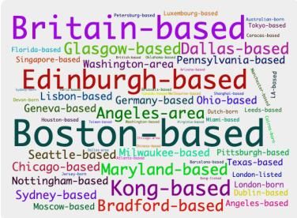  
(a) Hyphenated,cased & -based suffix

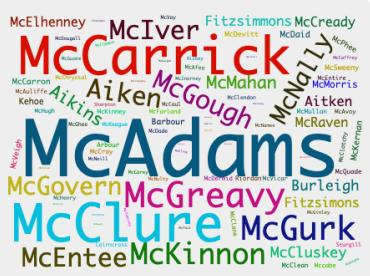  
(b) NNP: Proper Nouns  
Figure 7: Illustrating lexical and POS concepts: (a) A concept that exhibits multiple lexical properties, such as being hyphenated and cased. ChatGPT assigns a label based on the shared "-based" ngram found among most words in the cluster. (b) ChatGPT labeled this concept as NNP (proper noun)

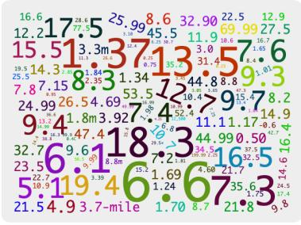  
(a)

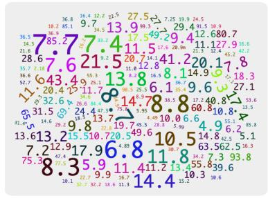  
(b)

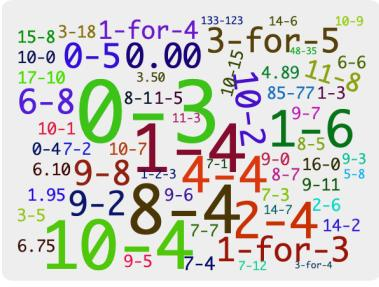  
(c)  
Figure 8: Highlighting the Significance of Context: (a) Money Figures (b) Percentages (c) Baseball Scores. All of these concepts were mislabeled as Numerical values by ChatGPT. Providing the context sentences we are able to obtain the correct label

resolve it. Refer to Figure 6 for examples of failed requests with Albert.

Keyword prompts We also explored prompts to return 3 keywords that describe the concept instead of returning a concise label in an effort to produce multiple labels like BCN.

Instructions:

When asked for keywords, only the keywords and nothing else should be returned.

If asked for 3 keywords, the keywords should be returned in the form of [keyword\_1, keyword\_2, keyword\_3]

To ensure compliance with our desired output format, we introduced a second instruction since the model was not following the first instruction as intended. We also modified the prompt body to:

Give 3 keywords that best describe the following list of words

Unfortunately, this prompt did not provide accurate labels, as illustrated in Table 6.

## B Probing Classifiers

## B.1 Running Probes At Scale

Probing For Fine-grained Semantic Concepts We used the NeuroX toolkit to train a linear probe for several concepts chosen from layers 3, 9 and 12 of BERT-base-cased. We used a train/val/test splits of 0.6, 0.2, 0.2 respectively. Tables 8 and 9 show the data statistics and the probe results respectively. Table 10 shows results of probes trained on concepts chosen from multiple layers of ALBERT. In Table 7 we carried out a cross architectural comparison across the models by training probes towards the same set of concepts.

## C Neuron Analysis Results

Neurons Associated with POS concepts We performed an annotation process on the final layer of a fine-tuned version of BERT-base-cased, specifically focusing on the task of parts-of-speech tagging. Once we obtained the labels, we organized them into super concepts based on a shared characteristic among smaller concepts. For instance, we grouped together various concepts labeled as nouns, as well as concepts representing adjectives, adverbs, and numerical data. To assess the alignment between the sub concepts and the super concept, we calculated the occurrence percentage of the top 10 neurons from the sub concept within the top 10 neurons of the super concept. The outcomes of this analysis can be found in table 11, illustrating the average alignment between the sub concepts and the super concepts.

Neurons Associated with the Names concepts We replicated the experiment using named entity concepts derived from the final layer of bert-basecased. The findings are presented in table 12.

<table><tr><td>tag Label</td><td>BERT</td><td>Sel ALBERT</td><td>Sel XLNet</td><td>Sel XLM-R</td><td></td><td>Sel RoBERTa Sel</td></tr><tr><td>c301 Gender-related Nouns and pronouns</td><td>0.98 0.16</td><td></td><td>0.95 0.14</td><td>0.86 0.24</td><td>0.94 0.23</td><td>0.95 0.26</td></tr><tr><td>c533 LGBTQ+</td><td>1 0.18</td><td>0.97 0.33</td><td>0.97 0.43</td><td></td><td>1 0.25</td><td>1 0.14</td></tr><tr><td>c439 Sports commentary terms</td><td>0.94 0.2</td><td>0.91 0.18</td><td>0.81 0.05</td><td></td><td>0.87 0.11</td><td>0.86 0.09</td></tr><tr><td>c173 Football team names and stadiums</td><td>0.94 0.2</td><td>0.96 0.27</td><td>0.94 0.24</td><td></td><td>0.95 0.2</td><td>0.97 0.34</td></tr><tr><td>c348 Female names and titles</td><td>0.98 0.29</td><td>0.98 0.29</td><td>0.94 0.21</td><td></td><td>0.96 0.16</td><td>0.97 0.24</td></tr><tr><td>c149 Tennis players&#x27; names</td><td>0.98 0.27</td><td>0.95 0.25</td><td>0.92 0.19</td><td></td><td>0.92 0.17</td><td>0.92 0.19</td></tr><tr><td>c487 Spanish Male Names</td><td>0.95 0.26</td><td>0.96 0.07</td><td>0.94 0.37</td><td></td><td>0.91 0.25</td><td>0.98 0.28</td></tr><tr><td>c564 Cities and Universities in southeastern US</td><td>0.97 0.12</td><td>0.97 0.11</td><td>0.9 0.18</td><td></td><td>0.97 0.29</td><td>0.96 0.22</td></tr><tr><td>c263 Locations in New York City</td><td>0.95 0.25</td><td>0.95 0.22</td><td>0.92 0.26</td><td></td><td>0.95 0.26</td><td>0.95 0.17</td></tr><tr><td>c247 Scandinavian/Nordic names and places</td><td>0.97 0.22</td><td>0.98 0.27</td><td>0.95 0.29</td><td></td><td>0.96 0.21</td><td>0.98 0.29</td></tr><tr><td>c438 Verbs for various actions and outcomes</td><td>0.97 0.12</td><td>0.94 0.09</td><td>0.87 0.23</td><td></td><td>0.92 0.11</td><td>0.92 0.14</td></tr><tr><td>c44 Southeast Asian Politics and Ethnic Conflict</td><td>0.97 0.17</td><td>0.97 0.19</td><td>0.94 0.25</td><td></td><td>0.93 0.09</td><td>0.95 0.16</td></tr><tr><td>c421 Names of people and places in the middle east</td><td>0.97 0.06</td><td>0.94 0.28</td><td>0.95 0.22</td><td></td><td>0.93 0.31</td><td>0.92 0.12</td></tr><tr><td>c245 Middle East conflict</td><td>0.98 0.26</td><td>1 0.25</td><td></td><td>0.93 0.29</td><td>0.93 0.25</td><td>0.95 0.22</td></tr><tr><td>c553 Islamic terminology</td><td>1 0.15</td><td>0.96 0.4</td><td></td><td>0.89 0.29</td><td>0.89 0.16</td><td>0.95 0.26</td></tr><tr><td>c365 Criminal activities</td><td>0.97 0.15</td><td>0.93 0.17</td><td></td><td>0.89 0.35</td><td>0.9 0.15</td><td>0.93 0.21</td></tr><tr><td>c128 Medical and Healthcare terminology</td><td>0.98 0.17</td><td>0.98 0.21</td><td></td><td>0.95 0.15</td><td>0.94 0.24</td><td>0.95 0.27</td></tr></table>

Table 7: Training Probes towards latent concepts discovered in various Models. Reporting classifier accuracy on test-set along with respective selectivity numbers

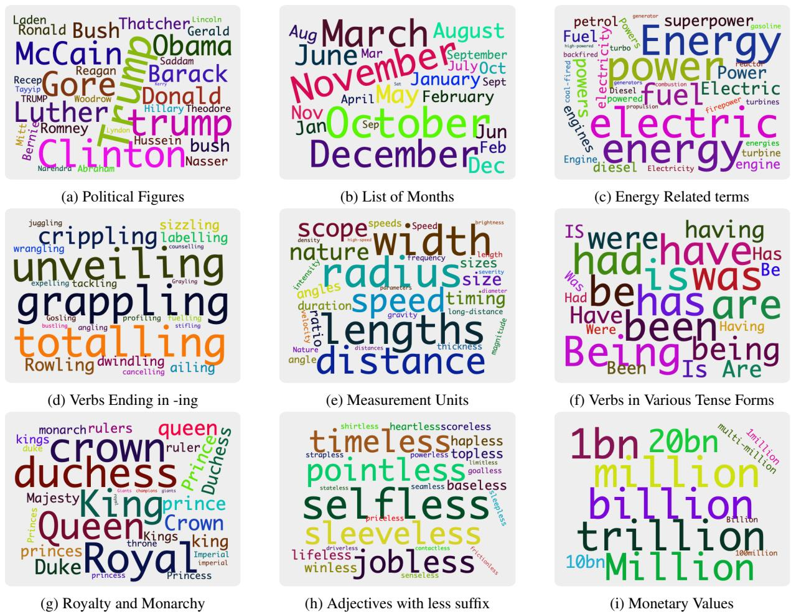  
Figure 9: Sample Concepts learned in the ALBERT Model

<table><tr><td>Layer Tag</td><td>Label</td><td>Tokens Types Sents Train Val</td><td></td><td></td><td></td><td></td><td>Test</td></tr><tr><td>3</td><td>c90 Financial terms.</td><td>220</td><td>22</td><td>214</td><td>285</td><td>95</td><td>96</td></tr><tr><td>3</td><td>c336 Photography-related terms.</td><td>290</td><td>29</td><td>273</td><td>388</td><td>130</td><td>130</td></tr><tr><td>3</td><td>c112 Middle Eastern Conflict</td><td>620</td><td>62</td><td>523</td><td>992</td><td>331</td><td>331</td></tr><tr><td>3</td><td>c506 Diversity and Ethnicity.</td><td>240</td><td>24</td><td>225</td><td>331</td><td>111</td><td>112</td></tr><tr><td>3</td><td>c390 List of surnames.</td><td>4298</td><td>430</td><td>4049 5530</td><td></td><td>1844 1844</td><td></td></tr><tr><td>3</td><td>c331 Emotions/Feelings.</td><td>400</td><td></td><td>396</td><td>484</td><td>162</td><td></td></tr><tr><td>3</td><td>c592 Animal names.</td><td>220</td><td>40</td><td>208</td><td></td><td></td><td>162 90</td></tr><tr><td>3</td><td>c25 Keywords related to discrimination and inequality.</td><td>340</td><td>22</td><td></td><td>268</td><td>90</td><td></td></tr><tr><td>3</td><td></td><td>2913</td><td>34</td><td>325</td><td>440</td><td>147</td><td>147</td></tr><tr><td>3</td><td>c500 List of female names. c414 Healthcare</td><td>510</td><td>292</td><td>2735</td><td>3867</td><td>1289 1290</td><td></td></tr><tr><td>3</td><td>c31 List of male first names.</td><td>1130</td><td>51</td><td>475 1078 1422</td><td>752</td><td>251</td><td>251</td></tr><tr><td>3</td><td>c173 Animals</td><td>760</td><td>113</td><td></td><td></td><td>474</td><td>474</td></tr><tr><td>3</td><td>c72 Natural Disasters and Weather Events</td><td>701</td><td>76</td><td>704</td><td>994</td><td>332</td><td>332</td></tr><tr><td>3</td><td>c514 English counties</td><td>297</td><td>71</td><td>635</td><td>1022</td><td>341</td><td>341</td></tr><tr><td>3</td><td>c178 Body Parts</td><td>430</td><td>30</td><td>286</td><td>373</td><td>124</td><td>125</td></tr><tr><td>3</td><td></td><td>379</td><td>43</td><td>405</td><td>588</td><td>196</td><td>196</td></tr><tr><td>3</td><td>c340 Media and Journalism.</td><td></td><td>38</td><td>365</td><td>518</td><td>173</td><td>173</td></tr><tr><td>3</td><td>c432 Power and Status.</td><td>310</td><td>31</td><td>306</td><td>385</td><td>128</td><td>129</td></tr><tr><td>3</td><td>c8 Verbs</td><td>1028</td><td>103</td><td>1018 1243</td><td></td><td>414</td><td>415</td></tr><tr><td>3</td><td>c408 -Verbs ending in "-ing"</td><td>510</td><td>51</td><td>504</td><td>615</td><td>205</td><td>206</td></tr><tr><td>3</td><td>c479 City names</td><td>130</td><td>13</td><td>127</td><td>159 53</td><td></td><td>54</td></tr><tr><td>3</td><td>c343 Surnames</td><td>490</td><td>49</td><td>464</td><td>613</td><td>204</td><td>205</td></tr><tr><td>9</td><td>c577 Disability-related terms.</td><td>140</td><td>14</td><td>133</td><td>172</td><td>58</td><td>58</td></tr><tr><td>9</td><td>c26 Negative sentiment.</td><td>798</td><td>118</td><td>782</td><td>1036</td><td>346</td><td>346</td></tr><tr><td>9</td><td>c122 Security Measures</td><td>457</td><td>70</td><td>446</td><td>584</td><td>195</td><td>195</td></tr><tr><td>9</td><td>c423 Label: Islamic Extremism/Terrorism</td><td>248</td><td>30</td><td>222</td><td>357</td><td>119</td><td>120</td></tr><tr><td>9</td><td>c299 Middle Eastern and North African countries and cities</td><td>531</td><td>57</td><td>460</td><td>844</td><td>282</td><td>282</td></tr><tr><td>9</td><td>c192 Diversity and Identity</td><td>314</td><td>50</td><td>279</td><td>506</td><td>169</td><td>169</td></tr><tr><td>9</td><td>c468 Russian male names.</td><td>125</td><td>18</td><td>123</td><td>153 51</td><td></td><td>52</td></tr><tr><td></td><td>c588 Gender-related terms.</td><td>161</td><td>19</td><td>146</td><td>236 79</td><td></td><td>79</td></tr><tr><td>9</td><td>c74 Financial terms</td><td>672</td><td>96</td><td>607</td><td>1118</td><td>373</td><td>373</td></tr><tr><td>9</td><td>c503 Middle East Conflict.</td><td>230</td><td>27</td><td>185</td><td>404</td><td>135</td><td>135</td></tr><tr><td>9 9</td><td>c325 Violent Crimes</td><td>292</td><td>60</td><td>287</td><td>386</td><td>129</td><td>129</td></tr><tr><td>9</td><td>c535 Academic Research.</td><td>233</td><td>26</td><td>227</td><td>332</td><td>111</td><td>111</td></tr><tr><td>9</td><td>c256 List of names</td><td>1069</td><td>149</td><td>1026 1375</td><td></td><td>458</td><td>459</td></tr><tr><td>9</td><td>c507 Positive Adjectives</td><td>389</td><td>69</td><td>380</td><td>505</td><td>168</td><td>169</td></tr><tr><td>12</td><td>c345 List of Chinese surnames.</td><td>407</td><td>65</td><td>378</td><td>567</td><td>189</td><td>190</td></tr><tr><td>12</td><td>c259 List of names</td><td>223 1221</td><td>174</td><td>221</td><td>273</td><td>91</td><td>92</td></tr><tr><td>12</td><td>c62 Adverbs</td><td>395</td><td>351 70</td><td>1133</td><td>3769</td><td>1256 1257</td><td></td></tr><tr><td>12</td><td>c128 Medical and Healthcare Terminology. c301 Gender-related nouns and pronouns.</td><td>418</td><td>74</td><td>369</td><td>662 883</td><td>221 294</td><td>221</td></tr><tr><td>12</td><td>c37 List of male names.</td><td>872</td><td>372</td><td>377 807</td><td>1460</td><td>487</td><td>295</td></tr><tr><td>12</td><td>c281 Adverbs</td><td>928</td><td>264</td><td>927</td><td>1178</td><td>393</td><td>487</td></tr><tr><td>12</td><td>c220 List of surnames.</td><td>3886</td><td>832</td><td>3652</td><td>6378</td><td>2126 2126</td><td>393</td></tr><tr><td>12</td><td>c432 List of Male Names</td><td>279</td><td>159</td><td>227</td><td>474</td><td>158</td><td>158</td></tr><tr><td>12</td><td>c439 Sports commentary terms.</td><td>250</td><td>181</td><td>189</td><td>687</td><td>229</td><td>230</td></tr><tr><td>12</td><td>c173 List of football team names and stadiums.</td><td>373</td><td>81</td><td>287</td><td>849</td><td>283</td><td>284</td></tr><tr><td>12</td><td>c348 List of female names and titles.</td><td>575</td><td>301</td><td>571</td><td>774</td><td>258</td><td>258</td></tr><tr><td>12</td><td>c142 Conflict and War</td><td>407</td><td>106</td><td>385</td><td>582</td><td>194</td><td>194</td></tr><tr><td>12 12 c210 List of male first names.</td><td>c245 Middle East Conflict</td><td>249 317</td><td>42 205</td><td>196 268</td><td>453 470</td><td>151 157</td><td>152 157</td></tr><tr><td>Layer Tag</td><td>Label</td><td colspan="6">val acc val C acc sel val test acc test c acc sel test</td></tr><tr><td>3</td><td>c90 Financial terms.</td><td>0.98</td><td>0.65</td><td>0.33</td><td>0.98</td><td>0.78</td><td>0.20</td></tr><tr><td>3</td><td>c336 Photography-related terms.</td><td>0.99</td><td>0.74</td><td>0.25</td><td>1</td><td>0.76</td><td>0.24</td></tr><tr><td>3</td><td>c112 Middle Eastern Conflict</td><td>0.99</td><td>0.89</td><td>0.10</td><td>1</td><td>0.86</td><td>0.14</td></tr><tr><td>3</td><td>c506 Diversity and Ethnicity.</td><td>1</td><td>0.78</td><td>0.22</td><td>0.98</td><td>0.75</td><td>0.23</td></tr><tr><td>3</td><td>c390 List of surnames.</td><td>0.97</td><td>0.82</td><td>0.15</td><td>0.97</td><td>0.82</td><td>0.15</td></tr><tr><td>3</td><td>c331 Emotions/Feelings.</td><td>0.98</td><td>0.82</td><td>0.16</td><td>0.99</td><td>0.78</td><td>0.21</td></tr><tr><td>3</td><td>c592 Animal names.</td><td>1</td><td>0.68</td><td>0.32</td><td>1</td><td>0.73</td><td>0.27</td></tr><tr><td>3</td><td>c25 Keywords related to discrimination and inequality.</td><td>0.99</td><td>0.81</td><td>0.18</td><td>0.98</td><td>0.77</td><td>0.21</td></tr><tr><td>3</td><td></td><td>0.98</td><td>0.82</td><td>0.16</td><td>0.99</td><td>0.83</td><td>0.16</td></tr><tr><td>3</td><td>c500 List of female names. c414 Healthcare</td><td>1</td><td>0.77</td><td>0.23</td><td>1</td><td>0.79</td><td>0.21</td></tr><tr><td>3</td><td></td><td>0.99</td><td>0.85</td><td>0.14</td><td>1</td><td>0.83</td><td>0.17</td></tr><tr><td>3</td><td>c31 List of male first names.</td><td>0.99</td><td>0.78</td><td>0.21</td><td>0.99</td><td>0.75</td><td>0.24</td></tr><tr><td>3</td><td>c173 Animals</td><td>0.99</td><td>0.80</td><td>0.19</td><td>0.99</td><td>0.78</td><td></td></tr><tr><td>3</td><td>c72 Natural Disasters and Weather Events</td><td>1</td><td>0.74</td><td>0.26</td><td>1</td><td>0.76</td><td>0.21 0.24</td></tr><tr><td>3</td><td>c514 English counties</td><td>0.99</td><td>0.84</td><td>0.15</td><td>0.98</td><td>0.89</td><td></td></tr><tr><td>3</td><td>c178 Body Parts</td><td>0.98</td><td>0.76</td><td>0.22</td><td>1</td><td>0.78</td><td>0.9</td></tr><tr><td>3</td><td>c340 Media and Journalism.</td><td>0.99</td><td>0.79</td><td>0.20</td><td>1</td><td></td><td>0.22</td></tr><tr><td>3</td><td>c432 Power and Status.</td><td>0.99</td><td>0.88</td><td>0.11</td><td>0.99</td><td>0.78</td><td>0.22</td></tr><tr><td>3</td><td>c8 Verbs</td><td>1</td><td>0.68</td><td>0.32</td><td>1</td><td>0.89</td><td>0.10</td></tr><tr><td>3</td><td>c408 -Verbs ending in "-ing"</td><td>0.98</td><td>0.68</td><td>0.30</td><td>1</td><td>0.73</td><td>0.27</td></tr><tr><td>3</td><td>c479 City names</td><td>1</td><td>0.74</td><td>0.26</td><td>0.98</td><td>0.83</td><td>0.17</td></tr><tr><td>3</td><td>c343 Surnames</td><td>1</td><td>0.82</td><td>0.18</td><td>1</td><td>0.74</td><td>0.24</td></tr><tr><td>9</td><td>c577 Disability-related terms.</td><td></td><td>0.79</td><td>0.19</td><td>0.99</td><td>0.78</td><td>0.22</td></tr><tr><td>9</td><td>c26 Negative sentiment.</td><td>0.98</td><td>0.81</td><td>0.17</td><td>0.99</td><td>0.8</td><td>0.19</td></tr><tr><td>9</td><td>c122 Security Measures</td><td>0.98</td><td>0.77</td><td>0.23</td><td>1</td><td>0.82</td><td>0.17</td></tr><tr><td>9</td><td>c423 Label: Islamic Extremism/Terrorism</td><td>1</td><td>0.79</td><td>0.2</td><td>0.99</td><td>0.85</td><td>0.15</td></tr><tr><td></td><td>c299 Middle Eastern and North African countries and cities</td><td>0.99</td><td></td><td>0.11</td><td></td><td>0.78</td><td>0.21</td></tr><tr><td>9</td><td>c192 Diversity and Identity</td><td>0.99</td><td>0.88</td><td></td><td>0.98</td><td>0.88</td><td>0.1</td></tr><tr><td>9</td><td>c468 Russian male names.</td><td>1</td><td>0.63</td><td>0.37</td><td>1</td><td>0.61</td><td>0.39</td></tr><tr><td>9</td><td>c588 Gender-related terms.</td><td>1</td><td>0.69</td><td>0.31</td><td>0.99</td><td>0.76</td><td>0.23</td></tr><tr><td>9</td><td>c74 Financial terms</td><td>0.99</td><td>0.86</td><td>0.13</td><td>0.97</td><td>0.83</td><td>0.14</td></tr><tr><td>9</td><td>c503 Middle East Conflict.</td><td>0.99</td><td>0.75</td><td>0.24</td><td>0.99</td><td>0.71</td><td>0.28</td></tr><tr><td>9</td><td>c325 Violent Crimes</td><td>0.99</td><td>0.78</td><td>0.21</td><td>0.98</td><td>0.82</td><td>0.16</td></tr><tr><td>9</td><td>c535 Academic Research.</td><td>1</td><td>0.88</td><td>0.12 0.22</td><td>0.99</td><td>0.84</td><td>0.15</td></tr><tr><td>9 9</td><td>c256 List of names</td><td>0.98</td><td>0.76</td><td></td><td>0.98</td><td>0.74</td><td>0.24</td></tr><tr><td>9</td><td>c507 Positive Adjectives</td><td>0.98</td><td>0.78</td><td>0.2 0.13</td><td>0.98</td><td>0.79</td><td>0.19</td></tr><tr><td>12</td><td>c345 List of Chinese surnames.</td><td>0.99</td><td>0.86 0.89</td><td>0.09</td><td>1 0.99</td><td>0.87</td><td>0.13</td></tr><tr><td>12</td><td>c259 List of names</td><td>0.98</td><td>0.82</td><td>0.15</td><td>0.96</td><td>0.89</td><td>0.1</td></tr><tr><td>12</td><td>c62 Adverbs</td><td>0.97</td><td>0.8</td><td>0.19</td><td>0.98</td><td>0.81</td><td>0.15</td></tr><tr><td>12</td><td>c128 Medical and Healthcare Terminology.</td><td>0.99 0.98</td><td>0.8</td><td>0.18</td><td>0.98</td><td>0.82</td><td>0.18</td></tr><tr><td>12</td><td>c301 Gender-related nouns and pronouns.</td><td>0.98</td><td>0.8</td><td>0.18</td><td>0.99</td><td>0.82</td><td>0.16</td></tr><tr><td>12</td><td>c37 List of male names.</td><td>0.99</td><td>0.8</td><td>0.19</td><td>0.99</td><td>0.8 0.78</td><td>0.19</td></tr><tr><td>12</td><td>c281 Adverbs</td><td>0.97</td><td>0.86</td><td>0.11</td><td>0.96</td><td>0.85</td><td>0.21</td></tr><tr><td>12</td><td>c220 List of surnames.</td><td>1</td><td>0.71</td><td>0.29</td><td>0.97</td><td>0.73</td><td>0.11</td></tr><tr><td>12</td><td>c432 List of Male Names</td><td>0.9</td><td>0.82</td><td>0.08</td><td>0.94</td><td>0.74</td><td>0.24</td></tr><tr><td>12</td><td>c439 Sports commentary terms.</td><td>0.99</td><td>0.82</td><td>0.17</td><td>0.99</td><td>0.87</td><td>0.20 0.12</td></tr><tr><td>12</td><td>c173 List of football team names and stadiums.</td><td>0.99</td><td>0.75</td><td>0.24</td><td>0.98</td><td>0.7</td><td>0.28</td></tr><tr><td>12</td><td>c348 List of female names and titles. c142 Conflict and War</td><td>0.97</td><td>0.86</td><td>0.11</td><td>0.96</td><td>0.86</td><td>0.1</td></tr><tr><td>12</td><td></td><td>0.99</td><td>0.76 0.71</td><td>0.23 0.26</td><td>0.98</td><td>0.72</td><td>0.26</td></tr><tr><td>12</td><td>c245 Middle East Conflict c210 List of male first names</td></tr></table>

Table 8: Statistics for concepts extracted from Bert-base-cased and the training, dev, test splits used to train the classifier

Table 9: Training Probing Classifiers for the concepts shown in Table 8

<table><tr><td>Layer Cluster Tag</td><td></td><td>Label</td><td colspan="6">val acc val C acc sel val test acc test c acc sel test</td></tr><tr><td>12</td><td>c189</td><td>Superlatives</td><td>0.98</td><td>0.61</td><td>0.37</td><td>0.96</td><td>0.79</td><td>0.17</td></tr><tr><td>12</td><td>c248</td><td>Substance abuse.</td><td>0.97</td><td>0.6</td><td>0.37</td><td>1</td><td>0.81</td><td>0.19</td></tr><tr><td>12</td><td>c361</td><td>LGBTQ+ and Gender-related Terms</td><td>1</td><td>0.88</td><td>0.12</td><td>1</td><td>0.9</td><td>0.1</td></tr><tr><td>3</td><td>c756</td><td>Gender and Sex Labels</td><td>0.87</td><td>0.72</td><td>0.15</td><td>1</td><td>0.8</td><td>0.2</td></tr><tr><td>0</td><td>c720</td><td>Gender and Sex Labels</td><td>1</td><td>0.74</td><td>0.26</td><td>1</td><td>0.55</td><td>0.45</td></tr><tr><td>0</td><td>c402</td><td>List of female names.</td><td>0.97</td><td>0.72</td><td>0.25</td><td>0.98</td><td>0.82</td><td>0.16</td></tr><tr><td>12</td><td>c127</td><td>Geopolitical entities and affiliations.</td><td>0.97</td><td>0.68</td><td>0.29</td><td>0.98</td><td>0.57</td><td>0.41</td></tr><tr><td>0</td><td>c707</td><td>Names of US Presidents and Politicians</td><td>1</td><td>0.55</td><td>0.45</td><td>1</td><td>0.55</td><td>0.45</td></tr><tr><td>6</td><td>c101</td><td>Speech verbs.</td><td>0.98</td><td>0.84</td><td>0.14</td><td>1</td><td>0.7</td><td>0.3</td></tr><tr><td>0</td><td>c820</td><td>Negative adjectives.</td><td>1</td><td>0.81</td><td>0.19</td><td>0.97</td><td>0.86</td><td>0.11</td></tr><tr><td>12</td><td>c769</td><td>Food items.</td><td>0.92</td><td>0.67</td><td>0.25</td><td>0.96</td><td>0.8</td><td>0.16</td></tr><tr><td>0</td><td>c149</td><td>Fruit and plant-related words.</td><td>1</td><td>0.7</td><td>0.3</td><td>0.95</td><td>0.81</td><td>0.14</td></tr><tr><td>3</td><td>c705</td><td>Tourism-related terms</td><td>0.95</td><td>0.67</td><td>0.28</td><td>0.91</td><td>0.83</td><td>0.08</td></tr><tr><td>12</td><td>c196</td><td>Verbs of Authority and Request</td><td>0.95</td><td>0.68</td><td>0.27</td><td>0.98</td><td>0.89</td><td>0.09</td></tr><tr><td>12</td><td>c398</td><td>Energy sources.</td><td>1</td><td>0.67</td><td>0.33</td><td>1</td><td>0.69</td><td>0.31</td></tr><tr><td>6</td><td>c185</td><td>Gender-related terms</td><td>0.98</td><td>0.64</td><td>0.34</td><td>0.96</td><td>0.68</td><td>0.28</td></tr><tr><td>3</td><td>c213</td><td>Finance and Taxation.</td><td>0.97</td><td>0.81</td><td>0.16</td><td>0.98</td><td>0.65</td><td>0.33</td></tr><tr><td>0</td><td>c92</td><td>Descriptors of geographic regions and types of organizations. 1</td><td></td><td>0.73</td><td>0.27</td><td>0.98</td><td>0.84</td><td>0.14</td></tr><tr><td>3</td><td>c659</td><td>Locations in the United States</td><td>1</td><td>0.88</td><td>0.12</td><td>1</td><td>0.61</td><td>0.39</td></tr><tr><td>0</td><td>c673</td><td>List of Italian first names.</td><td>1</td><td>0.93</td><td>0.07</td><td>0.89</td><td>0.8</td><td>0.09</td></tr><tr><td>3</td><td>c67</td><td>List of male names.</td><td>0.99</td><td>0.81</td><td>0.18</td><td>0.99</td><td>0.81</td><td>0.18</td></tr><tr><td>0</td><td>c883</td><td>Nouns</td><td>0.97</td><td>0.83</td><td>0.14</td><td>0.99</td><td>0.81</td><td>0.18</td></tr><tr><td>6</td><td>c898</td><td>TV Networks</td><td>1</td><td>0.68</td><td>0.32</td><td>1</td><td>0.55</td><td>0.45</td></tr><tr><td>12</td><td>c653</td><td>List of years.</td><td>1</td><td>0.9</td><td>0.1</td><td>1</td><td>0.91</td><td>0.09</td></tr><tr><td>0</td><td>c697</td><td>Military Terminology</td><td>1</td><td>0.62</td><td>0.38</td><td>1</td><td>0.62</td><td>0.38</td></tr><tr><td>3</td><td>c560</td><td>Political ideologies and systems.</td><td>1</td><td>0.58</td><td>0.42</td><td>0.94</td><td>0.75</td><td>0.19</td></tr></table>

Table 10: Probe Results for some concepts chosen from several layers in ALBERT

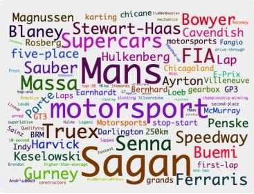  
(a) Motorsport Terminology

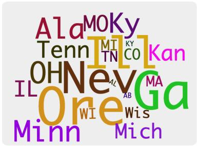  
(b) US State Abbreviations

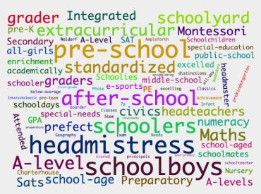  
(c) Education-related terms  
Figure 10: Example of concepts that were deemed uninterpretable in the BCN but were correctly labeled by ChatGPT

cluster label score   
c55 Nouns 0.2   
c13 Nouns 0.3   
c273 Nouns 0.1   
c268 Nouns 0.4   
c405 Nouns 0.0   
c315 Nouns 0.3   
c231 Nouns related to various activities and objects 0.6   
c468 Nouns 0.2   
c524 Nouns 0.2   
c387 Nouns 0.3   
c279 Nouns related to various industries and sectors 0.6   
c440 Nouns related to various professions and groups 0.1   
c202 Nouns 0.3   
c237 Adjectives with no clear category or theme 0.2   
c299 Adjectives describing attributes of products or services 0.3   
c96 Adjectives describing ownership, operation or support of various entities and technologies 0.3   
c95 Adjectives describing various types of related events or phenomena 0.1   
c198 Adjectives with no clear label 0.2   
c53 Comparative Adjectives 0.3   
c335 Comparative Adjectives 0.2   
c531 Comparative Adjectives 0.1   
c131 Descriptive/Adjective Labels 0.4   
c505 Location-based Adjectives 0.2   
c11 Adjectives describing various types of entities 0.0   
c466 Adjectives describing ownership, operation, or support of various entities and technologies. 0.1   
c419 Adjectives describing negative or challenging situations. 0.6   
c128 Adjectives describing the quality or appropriateness of something. 0.4   
c458 Adjectives 0.0   
c401 Comparative Adjectives 0.1   
c444 Time-related frequency adjectives 0.0   
c52 Adverbs. 0.6   
c155 Adverbs of frequency and manner. 0.3   
c136 Adverbs of degree/intensity. 0.3   
c58 Adverbs of time and transition. 0.5   
c41 Adverbs of degree and frequency. 0.5   
c589 Adverb intensity/degree 0.2   
c265 Adverbs of Probability and Certainty 0.3   
c251 Adverbs of frequency and manner. 0.2   
c57 Adverbs of Frequency 0.4   
c555 Temporal Adverbs. 0.4   
c302 Frequency Adverbs 0.2   
c332 Adverbs of manner and opinion. 0.4   
c546 Adverbs of degree/intensity. 0.3   
c570 Adverbs of preference/choice. 0.5   
c244 Adverbs indicating degree or extent. 0.3   
c222 Adverbs of Time 0.5   
c309 Adverbs describing degree or intensity. 0.2   
c487 List of numerical values. 0.2   
c179 Numerical Data. 0.3   
c420 Numerical data. 0.2   
c390 List of numbers 0.3   
c287 Numeric Data. 0.0   
c101 List of numerical values. 0.5   
c494 List of numerical values. 0.5   
c579 Numerical data. 0.2   
c537 List of numerical values. 0.2   
c435 Numerical data. 0.3   
c528 List of numerical values. 0.3   
c549 List of prices. 0.5   
c398 Numerical Data. 0.0   
c359 List of numerical values. 0.1   
c477 List of monetary values. 0.1   
c593 List of monetary values. 0.1   
c80 Numeric quantities. 0.1

Table 11: Neuron Analysis Results on Super Concepts extracted from BERT-base-cased model. The alignment column shows the intersection between the top 10 neurons in the Super concept and the Sub concepts.

<table><tr><td>cluster label</td><td>score</td></tr><tr><td>c259</td><td>List of names</td></tr><tr><td>c37 List of male names.</td><td></td></tr><tr><td>c328 List of names of politicians, public figures, and athletes. 0.2</td><td>0.4</td></tr><tr><td>c220 List of surnames.</td><td></td></tr><tr><td>c433 List of names.</td><td>0.5 0.4</td></tr><tr><td>c262 List of surnames</td><td></td></tr><tr><td>c210 List of male first names.</td><td>0.1 0.4</td></tr><tr><td>c231 List of female names.</td><td></td></tr><tr><td>c383 List of names</td><td>0.2 0.2</td></tr><tr><td>c280 List of names.</td><td></td></tr><tr><td>c202 List of surnames.</td><td>0.2 0.3</td></tr><tr><td>c344 Irish surnames</td><td></td></tr><tr><td>c6 Surnames</td><td></td></tr><tr><td>c75 List of female names.</td><td></td></tr><tr><td>c269 List of celebrity names</td><td>0.4</td></tr><tr><td>c578 List of surnames.</td><td>0.2</td></tr><tr><td>c535 List of names</td><td>0.2</td></tr><tr><td>c487 List of Spanish male names.</td><td>0.2 0.4</td></tr><tr><td>c340 Last names.</td><td>0.0</td></tr><tr><td>c48 List of surnames.</td><td></td></tr><tr><td>c70 List of names.</td><td>0.1</td></tr><tr><td>c353 List of names in the entertainment industry.</td><td>0.2</td></tr><tr><td>c568 List of names.</td><td>0.4</td></tr><tr><td>c378 List of surnames.</td><td>0.1</td></tr><tr><td>c575 Surnames</td><td></td></tr><tr><td>c149 List of tennis players&#x27; names.</td><td>0.4 0.4</td></tr><tr><td>c325 List of names.</td><td></td></tr><tr><td>c436 List of sports players’ names</td><td></td></tr><tr><td>c594</td><td>List of surnames.</td></tr></table>

Table 12: Name clusters extracted from the last layer of BERT-base-cased