# Compressing and Debiasing Vision-Language Pre-Trained Models for Visual Question Answering

Qingyi Si1,2\*, Yuanxin Liu3\*, Zheng Lin1,2†

Peng Fu¹, Yanan Cao1,2, Weiping Wang1

1Institute of Information Engineering, Chinese Academy of Sciences, Beijing, China   
2School of Cyber Security, University of Chinese Academy of Sciences, Beijing, China 3National Key Laboratory for Multimedia Information Processing, School of Computer Science, Peking University

{siqingyi,linzheng,fupeng,caoyanan,wangweiping}@iie.ac.cn, liuyuanxin@stu.pku.edu.cn

## Abstract

Despite the excellent performance of visionlanguage pre-trained models (VLPs) on conventional VQA task, they still suffer from two problems: First, VLPs tend to rely on language biases in datasets and fail to generalize to outof-distribution (OOD) data. Second, they are inefficient in terms of memory footprint and computation. Although promising progress has been made in both problems, most existing works tackle them independently. To facilitate the application of VLP to VQA tasks, it is imperative to jointly study VLP compression and OOD robustness, which, however, has not yet been explored. This paper investigates whether a VLP can be compressed and debiased simultaneously by searching sparse and robust subnetworks. To this end, we systematically study the design of a training and compression pipeline to search the subnetworks, as well as the assignment of sparsity to different modality-specific modules. Our experiments involve 3 VLPs, 2 compression methods, 4 training methods, 2 datasets and a range of sparsity levels. Our results show that there indeed exist sparse and robust subnetworks, which are competitive with the debiased full VLP and clearly outperform the debiasing SoTAs with fewer parameters on OOD datasets VQA-CP v2 and VQA-VS.¹

## 1 Introduction

Visual Question Answering (VQA) (Antol et al., 2015) is an important task at the intersection of CV and NLP. In the last decade, deep neural networks have made promising progress in VQA. However, recent studies (Agrawal et al., 2016; Manjunatha et al., 2019) have found that VQA models are prone to dataset biases. As a result, they always suffer from sharp performance drops when faced with outof-distribution (OOD) test datasets, whose answer distributions are different from the training set.

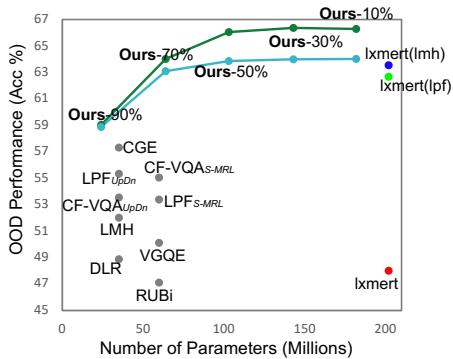  
Figure 1: Comparison of accuracy and model sizes with debiasing SoTAs on VQA-CP v2. The green and cyan lines represent our "1xmert(lpf) + mask train(lmh)" and "1xmert(lmh) + mask train(lmh)", respectively, with modality-specific sparsity.

Although large-scale vision-language pretrained models (VLPs) achieve further improvements in the in-distribution (ID) VQA benchmark (Goyal et al., 2017), they also fail to address the dataset-bias problem (Agrawal et al., 2018), e.g., lxmert (Tan and Bansal, 2019) suffers a 23.26% drop between ID and OOD accuracy. At the same time, the improvement brought by VLPs is partly due to their large model size, which increases the computational cost of deploying VQA models. To facilitate the application of VLPs to VQA tasks, the two problems should be addressed simultaneously. However, existing researches mostly focus on each of them separately.

The dataset-bias problem in VQA is well studied by numerous debiasing methods based on conventional small-scale models(Anderson et al., 2018; Cadene et al., 2019). Their main solution (Cadene et al., 2019; Clark et al., 2019; Liang et al., 2021b; Mahabadi and Henderson, 2019) is to regularize the loss according to the bias degree of training samples. In terms of the increased computational cost, a line of recent efforts have been made to compress pre-trained language models (PLMs) in the NLP field (Chen et al., 2020b; Li et al., 2020a,b; Liang et al., 2021a; Liu et al., 2021, 2022; Prasanna et al., 2020) and VLPs for visual-linguistic tasks (Fang et al., 2021; Gan et al., 2022). They show that large-scale PLMs and VLPs can be compressed into lightweight models without degrading performance. Refer to App. A for more related work.

This paper jointly studies the compression and debiasing problems of VLP for the VQA task. To this end, we combine the existing debiasing and pruning methods to establish a training and compression pipeline, and conduct extensive experiments with the pre-trained lxmert, which is the most popular VLP in VQA, under different OOD settings. We show that there exist sparse lxmert subnetworks that are more robust than the full model, which suggests that the goal of OOD robustness and computational efficiency can be achieved simultaneously.

We also present a comprehensive study on the design of the training and compression pipeline, as well as the assignment of sparsity to different model modules, to identify subnetworks with better OOD generalization. Our findings highlight the importance of 1) Employing a two-stage training and compression pipeline and integrating the debiasing objective throughout the entire process. 2) If there are two debiasing methods working well with the full model, training the full model with the relatively poor-performing one and compressing it with the better one. 3) Assigning modality-specific sparsity to different modules of VLP.

Our main contributions are as follows: (1) We present the first (to our knowledge) systematic study on sparsity and OOD robustness for VLPs. (2) Our empirical studies on the training and compression pipeline and sparsity assignment can serve as a valuable guideline for the future design of VLP subnetwork searching methods. (3) We obtain subnetworks that outperform existing debiasing So-TAs in terms of the trade-off between accuracy and model size on OOD datasets VQA-CP v2 and VQA-VS (see Fig. 1, Tab. 1 and Tab. 2).

## 2 Method

## 2.1 VLP Architecture and Subnetworks

This section takes lxmert as an example to introduce how we extract subnetworks. Lxmert contains an embedding layer, a visual fc layer, a pooler layer, a VQA-specific classifier and a stack of Transformer layers, which involve three encoders: language encoder $( L _ { e n c } )$ , object relationship encoder $( R _ { e n c } )$ and cross-modality encoder $( C _ { e n c } )$

We adopt unstructured pruning to obtain a compressed version (i.e., a subnetwork) of the original VLPs. Specifically, given a VLP f(θ) with parameters θ, we apply a binary pruning mask m $\in \ \{ 0 , 1 \} ^ { | \theta | }$ to the model parameters, which gives rise to $f ( \mathbf { m } { \odot } { \theta } )$ , where  is the element-wise product. The parameters to be pruned are:

$$
\pmb { \theta } _ { p r } = \{ \mathbf { W } _ { \mathrm { e m b } } , \mathbf { W } _ { \mathrm { v i s f c } } , \mathbf { W } _ { \mathrm { p l r } } \} \cup \pmb { \theta } _ { L _ { e n c } } \cup \pmb { \theta } _ { R _ { e n c } } \cup \pmb { \theta } _ { X _ { e n c } }\tag{1}
$$

where ${ \bf W } _ { \mathrm { e m b } } , { \bf W } _ { \mathrm { v i s - f c } }$ and $\mathbf { W } _ { \mathrm { p l r } }$ are the weights of embedding layer, vision fc layer and pool layer, $\pmb { \theta } _ { L _ { e n c } } \cup \pmb { \theta } _ { R _ { e n c } } \cup \pmb { \theta } _ { X _ { e n c } }$ are the parameters of Transformer layers. More details of lxmert can be found in App. B.1. Another model visualBERT (Li et al., 2019), which is also used in our experiments, will be introduced in App. B.2.

## 2.2 Pruning Methods

We consider two representative pruning methods, i.e., magnitude-based pruning (Han et al., 2015) and mask training (Louizos et al., 2018; Ramanujan et al., 2020; Sanh et al., 2020; Sehwag et al., 2020).

Magnitude-based Pruning approximates the importance of model parameters based on their absolute values and eliminates the less important ones. We adopt the basic version of magnitude-based pruning, i.e., one-shot magnitude pruning (OMP). OMP can optionally be combined with further finetuning of the pruned subnetwork to recover the performance drop.

Mask Training directly optimizes the binary pruning mask m towards the given objectives. Specifically, each weight matrix $\bar { \bf W } \in \mathbb { R } ^ { d _ { i } \times d _ { o } }$ is associated with two mask matrices, namely a binary mask m $\in \ \{ 0 , 1 \} ^ { d _ { i } \times d _ { o } }$ and a real-valued mask m $\in \mathbb { R } ^ { d _ { i } \times d _ { o } }$ . In the forward propagation, m is computed from m through binarization:

$$
\mathbf { m } _ { i , j } = { \left\{ \begin{array} { l l } { 1 } & { { \mathrm { ~ i f ~ } } { \hat { \mathbf { m } } } _ { i , j } \geq \phi } \\ { 0 } & { { \mathrm { ~ e l s e } } } \end{array} \right. }\tag{2}
$$

where $\phi$ is the threshold. Then, the original weight matrix W is replaced with a pruned one m W. When it comes to backward propagation, we follow (Liu et al., 2022; Mallya et al., 2018; Radiya-Dixit and Wang, 2020; Zhao et al., 2020) and use the straight-through estimator (Bengio et al., 2013) to estimate the gradients of m using the gradients of m, and then update m as m $\begin{array} { r l } {  \hat { \bf m } - \eta \frac { \partial \mathcal { L } } { \partial \bf m } } \end{array}$ , where η is the learning rate.

We initialize î according to the magnitudes of the pre-trained weights of lxmert. This strategy is shown to be more effective than random initialization for pre-trained language models (Liu et al., 2022; Radiya-Dixit and Wang, 2020) and we also validate this in our experiments with lxmert (see App. C.2). Specifically, m is initialized as:

$$
\begin{array} { r } { \hat { \mathbf { m } } _ { i , j } = \left\{ \begin{array} { l l } { 0 } & { \mathrm { ~ i f ~ } \mathbf { W } _ { i , j } \mathrm { i s ~ p r u n e d ~ b y ~ O M P } } \\ { \boldsymbol { \alpha } \times \boldsymbol { \phi } } & { \mathrm { ~ e l s e } } \end{array} \right. } \end{array}\tag{3}
$$

where $\alpha \geq 1$ is a hyper-parameter. At initialization, we set the threshold $\phi = 0 . 0 1$ (any other value with the same order of magnitude should also be fine). To ensure that the subnetwork satisfies the given sparsity, φ is re-computed every $t _ { m }$ training steps.

## 2.3 Debiasing Methods

The deabising methods in VQA usually contain a main model and a biased model. The biased model, which learns the language bias, is used to measure the training samples' bias degree and adjust the training loss for the main model. We experiment with SoTAs debiasing methods, i.e., LMH (Clark et al., 2019), RUBi (Cadene et al., 2019) and LPF (Liang et al., 2021b), of which LMH is widely studied for the OOD scenario of VQA (Chen et al., 2020a; Liang et al., 2020; Si et al., 2021) and NLU (Jia and Liang, 2017; McCoy et al., 2019; Schuster et al., 2019; Zhang et al., 2019). For comparison, we also describe the binary cross-entropy here.

Binary Cross-Entropy (BCE) computes the cross-entropy between the predicted distribution $\mathbf { p } _ { m }$ (from main model) and the soft target score of each ground-truth t, as:

$$
\mathcal { L } _ { b c e } = t \cdot l o g ( \delta ( \mathbf { p } _ { m } ) ) + ( 1 - t ) \cdot l o g ( 1 - \delta ( \mathbf { p } _ { m } ) ) ]\tag{4}
$$

where δ denotes the sigmoid function.

Learned-Mixin +H (LMH) adds a biased model to learn biases during training, as follows:

$$
\begin{array} { l } { \hat { \mathbf { p } } _ { d e b } = s o f t m a x ( l o g ( \mathbf { p } _ { m } ) + g ( h ) l o g ( \mathbf { p } _ { b } ) ) } \\ { g ( h ) = s o f t p l u s ( w \cdot h ) } \end{array}\tag{5}
$$

where $\mathbf { p } _ { b }$ and $\mathbf { p } _ { m }$ are the predicted distribution of biased model and main model, respectively. $g ( h )$ determines how much to trust the learned biases, based on lxmert's last hidden representation h. Following (Clark et al., 2019), we directly use the answers’ frequency under each question type as ${ \mathbf { p } _ { b } } ^ { 2 }$ . To prevent $\mathbf { p } _ { b }$ from being ignored, LMH also adds an entropy penalty item $R$ in the final loss:

$$
\mathcal { L } _ { l m h } = t \cdot l o g ( \delta ( \hat { \mathbf { p } } _ { d e b } ) ) + ( 1 - t ) \cdot l o g ( 1 - \delta ( \hat { \mathbf { p } } _ { d e b } ) ) ] + R\tag{6}
$$

RUBi adopts a training strategy similar to LMH to regularize the main model's probability, and uses standard cross-entropy as the training loss:

$$
\begin{array} { l } { \displaystyle \hat { \mathbf { p } } _ { d e b } = s o f t m a x ( \mathbf { p } _ { m } \cdot \delta ( \mathbf { p } _ { b } ) ) } \\ { \displaystyle \mathcal { L } _ { \mathrm { r u b i } } = - \frac { 1 } { N } \sum _ { k } ^ { N } \log ( \hat { \mathbf { p } } _ { d e b } ) [ a _ { k } ] } \end{array}\tag{7}
$$

LPF measures the bias degree as $\alpha _ { k } = { \bf p } _ { b } \left[ a _ { k } \right]$ to regularize the loss of the main model:

$$
\mathcal { L } _ { \mathrm { l p f } } = \frac { - 1 } { N } \sum _ { k } ^ { N } ( 1 - \alpha _ { k } ) ^ { \gamma } \log ( s o f t m a x ( \mathbf { p } _ { m } ) ) \left[ a _ { k } \right]\tag{8}
$$

where the $\gamma$ is a tunable hype-parameter.

## 2.4 Problem Formulation

Given the pre-trained lxmert $f ( \theta _ { p t } )$ , our goal is to find a subnetwork $f \left( \mathbf { m } \odot \pmb { \theta } _ { f t } \right)$ that satisfies a target sparsity level s and maximizes the OOD performance:

$$
\begin{array} { r } { \operatorname* { m a x } _ { \mathbf { m } , \theta _ { f t } } \left( \mathcal { E } _ { \mathrm { O O D } } \left( f \left( \mathbf { m } \odot \pmb { \theta } _ { f t } \right) \right) \right) \mathrm { , ~ s . t . ~ } \frac { \| \mathbf { m } \| _ { 0 } } { \vert \theta _ { p r } \vert } = ( 1 - s ) } \end{array}\tag{9}
$$

where $\mathcal { E } _ { \mathrm { { O O D } } }$ denotes OOD evaluation, $\| \| _ { 0 }$ is the $L _ { 0 }$ norm and $| \theta _ { p r } |$ is the total number of parameters in $\theta _ { p r }$ . This goal is achieved by searching the optimal m and $\pmb { \theta } _ { f t }$ in model training and compression.

Eq. 9 only specifies the overall sparsity. In this work, we also explore a finer-grained control over sparsity, which allocates different sparsity to different modules of lxmert, given that the overall sparsity is satisfied. Concretely, we consider three modules from different modalities, i.e., the language module, the visual module and the cross-modality module. The constraint in the optimization problem is then rewritten $\mathrm { a s } ^ { 3 }$

$$
\mathrm { s . t . } \ { \frac { \| { \bf m } _ { L a n } \| _ { 0 } } { | { \boldsymbol { \theta } } _ { L a n } | } } = ( 1 - s _ { L } ) , { \frac { \| { \bf m } _ { V i s } \| _ { 0 } } { | { \boldsymbol { \theta } } _ { V i s } | } } = ( 1 - s _ { R } ) , { \frac { \| { \bf m } _ { X } \| _ { 0 } } { | { \boldsymbol { \theta } } _ { X e n c } | } } = ( 1 - s _ { X } ) ,
$$

$$
s _ { L } \cdot \frac { | \pmb { \theta } _ { L a n } | } { | \pmb { \theta } _ { p r } | } + s _ { R } \cdot \frac { | \pmb { \theta } _ { V i s } | } { | \pmb { \theta } _ { p r } | } + s _ { X } \cdot \frac { | \pmb { \theta } _ { X _ { e n c } } | } { | \pmb { \theta } _ { p r } | } = s\tag{10}
$$

where $\mathbf { \theta } _ { { \theta } _ { L a n } } = \mathbf { \theta } _ { L _ { E n c } } \cup \{ \mathbf { W } _ { \mathrm { e m b } } \} , \mathbf { \theta } _ { V i s } = \mathbf { \theta } _ { R _ { E n c } } \cup$ $\left\{ \mathbf { W } _ { \mathrm { v i s - f c } } \right\}$ and $\pmb { \theta } _ { X _ { E n c } }$ are model parameters of

2We use the same pb in our implementation of LMH, RUBi and LPF. More details of LMH can be found in App. B.3

3For simplicity, the pooler layer's parameters(0.5M) are not included in eq. 10. We directly set it to the target sparsity S.

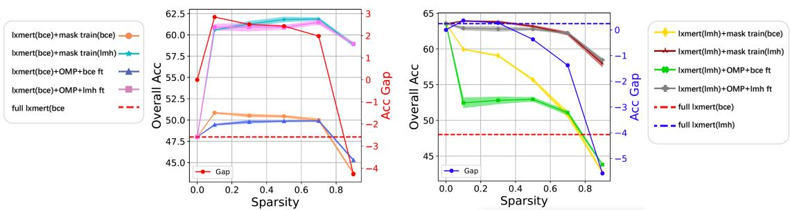  
Figure 2: Results of subnetworks from the BCE fine-tuned lxmert (left) and from the LMH fine-tuned lxmert (right) on $\operatorname { V Q A - C P } \operatorname { v } 2 .$ “lxmert(bce/lmh)" denotes full model fine-tuning in Stage1, “mask train(bce/lmh)" and “OMP" denote pruning in Stage2.“bce/lmh $\mathrm { f t } "$ denotes further fine-tuning in Stage3. “Gap" denotes the improvement of mask train(bce/lmh) over full lxmert(bce/lmh). The shadowed areas denote standard deviations. These abbreviations are used throughout this paper. Detailed performance on three question types is shown in App. C.1

the language module, visual module and crossmodality encoder, respectively. $\mathbf { m } _ { L a n } , \mathbf { m } _ { V i s }$ and mx are the binary masks for the three modules, respectively. $s _ { L } , s _ { R }$ and $s _ { X }$ are the target sparsity levels for the three modules, respectively.

If not otherwise specified, we set the sparsity of every weight matrix to target sparsity. For example, if $s = 7 0 \%$ and there is no modality-specific constraint, then all weight matrices are at 70% (uniform sparsity). If $s _ { L } = 5 0 \%$ , then all weight matrices in $\theta _ { L a n }$ are at 50% sparsity, while $s _ { R }$ and $s _ { X }$ could be different (modality-specific sparsity)

## 2.5 Training and Compression Pipeline

We define two notations: $\mathcal { F } _ { \mathcal { L } } ( f ( \pmb { \theta } ) )$ denotes training $f ( \pmb \theta )$ using loss $\begin{array} { r c l } { \mathcal { L } } & { \in } & { \{ \mathcal { L } _ { b c e } , \mathcal { L } _ { l m h } \} } \end{array}$ ${ \mathcal { P } } _ { C } ^ { p } ( f ( \theta ) )$ denotes pruning $f ( \pmb \theta )$ using method $p \in \{ \mathrm { O M P }$ , mask train} and loss $\mathcal { L }$ (if applicable), which outputs a pruning mask m. A typical training and compression pipeline involves three stages:

Stage1: Full Model Fine-tuning. The pretrained lxmert $f ( \pmb \theta _ { p t } )$ is fine-tuned using loss $\mathcal { L } .$ which produces $f ( \pmb \theta _ { f t } ) = \mathcal { F } _ { \mathcal { L } } ( f ( \pmb \theta ) )$

Stage2: Model Compression. The fine-tuned lxmert $f ( \pmb \theta _ { f t } )$ is compressed and we get the subnetwork $f \left( \mathbf { m } \odot \pmb { \theta } _ { f t } \right)$ , where m $= \mathcal { P } _ { \mathcal { L } } ^ { p } ( f ( \pmb { \theta } _ { f t } ) )$

Stage3: Further Fine-tuning (optional). The subnetwork $f ( \mathbf { m } \odot \pmb { \theta } _ { f t } )$ is further fine-tuned using loss $\mathcal { L } ^ { \prime } ,$ and gets $f ( \mathbf { m } \odot { \boldsymbol { \theta } } _ { f t } ^ { \prime } ) = \mathscr { F } _ { \mathcal { L } ^ { \prime } } ( f ( \mathbf { m } \odot { \boldsymbol { \theta } } _ { f t } ) )$

## 3 Experiments

In this section, we mainly investigate three questions: (1) How does compression affect lxmert's OOD generalization ability? (2) How to design the training and pruning pipeline to achieve a good sparsity-performance trade-off? (3) How to assign sparsity to different modality-specific modules?

## 3.1 Datasets, Model and Implementation

We conduct experiments on the OOD benchmarks VQA-CP v2 (Agrawal et al., 2018) and VQA-VS (Si et al., 2022b) that evaluate the robustness of VQA systems, with the accuracy-based evaluation metric (Antol et al., 2015). A more detailed discussion of the difference between the two datasets is shown in Sec. 3.5. We thoroughly study the above three questions on VQA-CP-v2, which is widely used in the literature on debiasing VQA systems (refer to Sec. 3.2, 3.3 and 3.4 ). Then, based on the findings, we further explore the more challenging VQA-VS (Si et al., 2022b) (refer to Sec. 3.5 ). For VLP, we adopt the lxmert-base-uncased model (Tan and Bansal, 2019) released by huggingface (Wolf et al., 2020). All the results are averaged over 4 random seeds. More information of the model and implementation details are shown in App. B.4.

## 3.2 Effect of Compression on OOD Accuracy

Subnetworks from BCE Fine-tuned lxmert. We compress the BCE fine-tuned lxmert using OMP and mask training and introduce either $\mathcal { L } _ { b c e }$ or $\mathcal { L } _ { l m h }$ in the pruning (for mask training) or further fine-tuning process (for OMP).

The results are shown in the upper row of Fig. 2. We can derive several observations: 1) When no debiasing methods are used, the subnetworks of “mask train(bce)" and “OMP + bce $\mathrm { f t " }$ improve over the full lxmert by $1 . 3 5 \% \sim 2 . 7 9 \%$ , even at up to 70% sparsity. This implies that lxmert is overparameterized and pruning may remove some parameters related to the bias features. 2) “mask train(lmh)" and “OMP + lmh $\mathrm { f t " }$ achieve further performance boost, exceeding full lxmert by a large margin (11.05% \~ 14.02%). Since mask training does not change the value of parameters, the results of “mask train (lmh)" implicate that the biased “full lxmert(bce)" already contains sparse and robust subnetworks (across 10%\~ 90% sparsity). 3) “mask train" outperforms “OMP" in general, which suggests that directly optimizing the subnetwork structure is more effective than debiasing a compressed subnetwork by further fine-tuning.

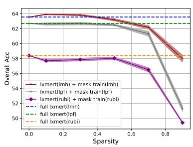  
Figure 3: Results of 1xmert subnetworks fine-tuned with different debiasing methods on VQA-CP v2.

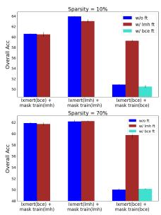  
Figure 4: Results of lxmert subnetworks obtained from different training and compressing pipelines on VQA-CP v2. “ft" means further fine-tuning the subnetworks in Stage3.

Subnetworks from lxmert Fine-tuned with Debiasing Methods. From the lower row of Fig. 2, we can find that: 1) For the full lxmert, the OOD performance is obviously promoted with the LMH debiasing method. 2) Unlike lxmert(bce) subnetworks, lxmert(lmh) subnetworks do not exhibit significant improvement over the full model. However, the “mask train(lmh)" and “OMP + lmh ft" subnetworks, which preserve the lxmert(lmh)'s performance at up to 50% sparsity, can serve as an efficient alternative to the LMH fine-tuned full lxmert. 3) “mask train(bce)" and “OMP + bce ft" clearly underperform their lmh counterparts, which suggests that it is important to use the debiasing method in pruning and subnetwork further finetuning even when the full model is already trained with the debiasing method.

Fig. 3 compares the subnetworks fine-tuned with LMH, LPF and RUBi. We find that: The subnetworks found using LMH consistently outperform those found by LPF and RUBi across different sparsity levels. Therefore, to save computing resources, we mainly use the best performing LMH in the following experiments and analysis.

## 3.3 Training and Compression Pipeline

In this section, we study the proper design of the training and compression pipeline, under the basic framework described in Sec. 2.5. Here we focus on the mask training compression method, as it has been shown to generally outperform OMP with further fine-tuning. Our main observations can be described from three perspectives:

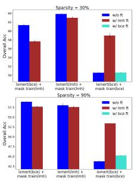

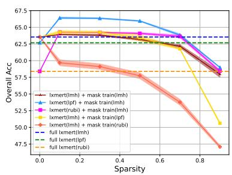  
Figure 5: Results of lxmert subnetworks that adopt different debiasing methods in Stage1 and Stage2 on VQA-CP v2.

First, it is recommended to introduce the debiasing loss across Stage1, Stage2 and (if applicable) Stage3. The reason is three-fold: 1) As shown by Fig. 4, the subnetworks at 10%, 30% and 70% sparsity levels have better performance when starting from lxmert(lmh), as compared with the lxmert(bce). At 90% sparsity, “1xmert(lmh) + mask train(lmh)" underperforms “lxmert(bce) + mask train(lmh)" (see App. C.3 for reasons), but the Accuracy gap is small. Therefore, adopting $\mathcal { L } _ { l m h }$ in Stage1 is a better choice than $\mathcal { L } _ { b c e } ,$ especially when the subnetworks are not at extremely high sparsity. 2) As we discussed in the previous section, introducing $\mathcal { L } _ { l m h }$ in the mask training process (Stage2) substantially outperforms $\mathcal { L } _ { b c e }$ for both lxmert(lmh) and lxmert(bce). 3) When both Stage1 and Stage2 adopt the BCE loss, further finetuning the subnetworks with LMH loss in Stage3 can significantly boost the performance, as shown by the results of “lxmert(bce) + mask train(bce)" w/o ft and w/ lmh ft in Fig. 4.

Second, Stage3 is unnecessary if it adopts the same training objective as Stage2. Comparing the blue and red (or cyan) bars in Fig. 4, we can see that further fine-tuning with the same training objective generally degrades the performance of “1xmert(lmh) + mask train(lmh)", “lxmert(bce) + mask train(lmh)" and “1xmert(bce) + mask train(bce)". This phenomenon suggests that Stage3 can be eliminated to save computation cost.

Third, it is recommended to use different debiasing methods in the two stages and leave the better one to Stage2. As shown in Fig. 5, although LPF and RUBi are less effective in debiasing the full model than LMH, “lpf+lmh"4 and "rubi+lmh" are superior to “lmh+lmh". In contrast, when reversing the debiasing methods used in the two stages, “lmh+rubi" and “lmh+lpf" exhibit worse performance, suggesting that the better debiasing method should be used in Stage2. Additionally, "lpf+lmh" is superior to "rubi+lmh", which indicates that using a better debiasing objective in Stage1 is helpful when we have multiple choices different from the Stage2 objective. We also experiment with another VLP model, visualBERT (Li et al., 2019), and find that “lpf+lmh" still performs the best as in Fig. 7.

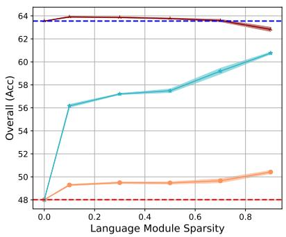

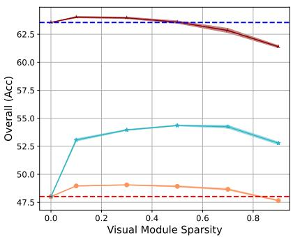

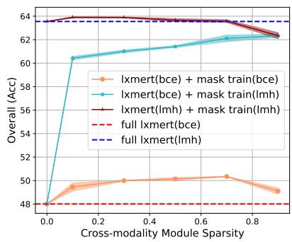  
Figure 6: Results of subnetworks obtained by pruning the language (left), visual (middle) and cross-modality (right) modules. When pruning one module, the other two modules remain unpruned.

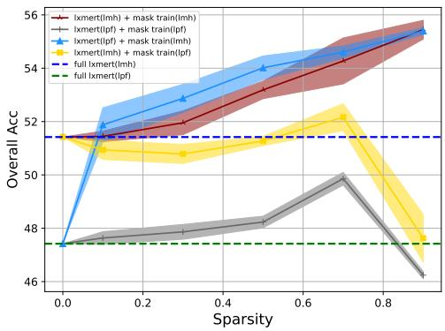  
Figure 7: Results of visualBERT subnetworks that adopt different debiasing methods in Stage1 and Stage2 on VQA-CP v2.

## 3.4 Modality-specific Sparsity

Pruning Each Single Modality-specific Module. Since lxmert uses different modules to encode the multi-modal data, it is intuitive to hypothesize that different modules of lxmert may capture the language bias to different extents. To validate this hypothesis, we compress the language, visual and cross-modality modules, respectively. As presented by Fig. 6, the compression of different modalityspecific modules indeed exhibits different effects.

When the full model is lxmert(bce) (the orange and cyan lines), compressing the language or crossmodality module has a positive effect on the OOD performance, and the accuracy generally improves as sparsity increases from 10% to 90%. By contrast, compressing the visual module results in inferior results than compressing the other two modules, even if the number of remaining parameters is larger (note that the visual module has a smaller number of parameters than the other two modules). These results suggest that, for the biased lxmert(bce), the language and cross-modality modules capture more training set bias than the visual module, which supports the above hypothesis.

In terms of “lxmert(lmh) + mask train(lmh)" (the red line), although compression does not lead to performance improvement like compressing 1xmert(bce), the results also demonstrate that the language and cross-modality modules are more compressible than the visual module.

Searching for Appropriate Modality-specific Sparsity. Motivated by the above findings, we search for appropriate modality-specific sparsity by performing mask training with a variety of sparsity configurations (see App. C.4) for the three modules while keeping the overall sparsity the same.

As we can see in Fig. 8, at 50% and 70% overall sparsity, the configuration that achieves the best result assigns slightly higher sparsity to the language and cross-modality modules and significantly lower sparsity to the visual module, as compared with uniform sparsity. This phenomenon is in accordance with the findings in Fig. 6, implicating that compressing the three modules uniformly is suboptimal (at 50% ～ 70% sparsity) and the language and cross-modality modules should be compressed to

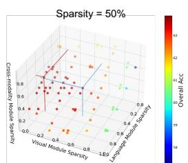  
(sL= 60%, SR = 4%, Sx = 60% )

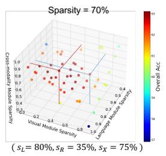

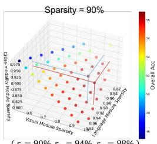  
(sL= 90%, SR = 94%, Sx = 88% )  
Figure 8: Results of subnetworks pruned by different sparsity configurations on VQA-CP v2 using “lxmert(lmh) + mask train(lmh)". Red and blue lines denote the coordinates of the data point with uniform sparsity across three modules and the data point performing the best (the specific configuration is shown below each plot) respectively. The overall sparsities are shown in the titles.

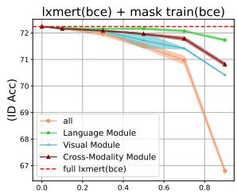

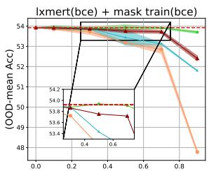

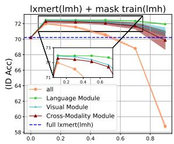

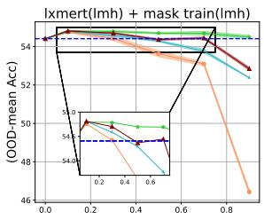  
Figure 10: Results of subnetworks pruned using BCE (upper) and LMH (lower) on VQA-VS. We report ID and OOD-mean accuracy here. Results on specific OOD test sets are deferred to App. D.1 Different lines denote subnetworks obtained by pruning all, language, visual and cross-modality modules respectively.

Fig. 9 shows a more direct comparison between the uniform and modality-specific sparsity. We also introduce another baseline “matrix-specific sparsity", which ranks all the model parameters, instead of the parameters in each weight matrix. This also results in different sparsity levels for different weight matrices, while there is no explicit control over the modality-specific sparsity. We can see that a larger extent than the visual module. At 90% sparsity, the sparsity configuration's comfort zone is in the proximity of the uniform point. Further increasing the sparsity of the language and crossmodality modules result in performance decline or only minor improvements. This is because 90% sparsity already approaches the compression upper bound, even for the language and cross-modality modules.

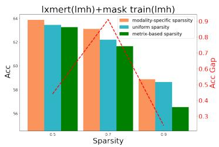  
Figure 9: Comparison of different sparsity assignments on VQA-$\mathrm { C P } \ \mathrm { v } 2 . \ \mathrm { \tilde { G a p } } ^ { \mathrm { \prime \prime } }$ is the gap between “uniform sparsity" and “modalityspecific sparsity".

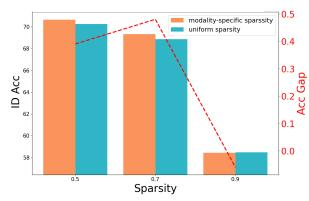

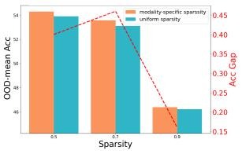  
Figure 11: Comparison of "lxmert(lmh) + mask train(lmh)" subnetworks with uniform and modalityspecific sparsity on VQA-VS. Results on specific OOD test sets can be found in App. D.2

modality-specific sparsity achieves the best results across the three overall sparsity levels from 50% to 90%, demonstrating its superiority. Besides, the results also suggest that, although simply allowing different matrices to have different sparsity is more flexible than uniform sparsity, it is not conducive to the final performance.

## 3.5 Exploration on VQA-VS

VQA-CP v2 is widely used in the literature of debiasing VQA systems. However, it only considers the question-type-based bias. To account for other potential biases, VQA-VS constructs several types of OOD test sets according to different shortcuts (e.g., keyword and key object). As a result, VQA-VS is more challenging and allows us to analyze the results on different biases. In this section, we search sparse and robust lxmert subnetworks in VQA-VS based on the major findings obtained from VQA-CP v2.

The Effect of Compression. Fig. 10 shows the results of full lxmert and subnetworks on VQA-VS. We can see that: 1) When using the BCE objective, we can identify sparse “bce+bce" subnetworks that are comparable with full lxmert (bce). 2) Different from VQA-CP v2, full lxmert (lmh) only slightly outperforms full lxmert (bce) in the OOD setting of VQA-VS, and underperforms in the ID setting. 3) The “lmh+lmh"⁵ subnetworks improve over full lxmert (lmh) on both ID and OOD test sets, across a wide range of sparsity levels, suggesting that lxmert can also be simultaneously compressed and debiased on VQA-VS.

<table><tr><td>Methods</td><td colspan="2">Backbone</td><td>Params.</td><td>All</td><td>Y/N</td><td>Num</td><td>Other</td></tr><tr><td>RUBi (Cadene et al., 2019)</td><td colspan="2">S-MRL</td><td>~60M</td><td>47.11</td><td>68.65</td><td>20.28</td><td>43.18</td></tr><tr><td>VGQE (Kv and Mittal, 2020)</td><td colspan="2">S-MRL</td><td>~60M</td><td>50.11</td><td>66.35</td><td>27.08</td><td>46.77</td></tr><tr><td>LPF (Liang et al., 2021b)</td><td colspan="2">S-MRL</td><td>~60M</td><td>53.38</td><td>88.06</td><td>25.00</td><td>42.99</td></tr><tr><td>CF-VQA (Niu et al., 2021)</td><td colspan="2">S-MRL</td><td>~60M</td><td>55.05</td><td>90.61</td><td>21.50</td><td>45.61</td></tr><tr><td>AdvReg. (Ramakrishnan et al., 2018)</td><td colspan="2">UpDn</td><td>35M</td><td>41.17</td><td>65.49</td><td>15.48</td><td>35.48</td></tr><tr><td>GRL (Grand and Belinkov, 2019)</td><td colspan="2">UpDn</td><td>35M</td><td>42.33</td><td>59.74</td><td>14.78</td><td>40.76</td></tr><tr><td>RUBi (Cadene et al., 2019)</td><td colspan="2">UpDn</td><td>35M</td><td>44.23</td><td>67.05</td><td>17.48</td><td>39.61</td></tr><tr><td>Loss-Rescaling (Guo et al., 2021)</td><td colspan="2">UpDn</td><td>35M</td><td>47.09</td><td>68.42</td><td>21.71</td><td>42.88</td></tr><tr><td>VGQE (Kv and Mittal, 2020)</td><td colspan="2">UpDn</td><td>35M</td><td>48.75</td><td></td><td></td><td></td></tr><tr><td>DLR (Jing et al., 2020)</td><td colspan="2">UpDn</td><td>35M</td><td>48.87</td><td>70.99</td><td>18.72</td><td>45.57</td></tr><tr><td>LMH (Clark et al., 2019)</td><td colspan="2">UpDn</td><td>35M</td><td>52.01</td><td>72.58</td><td>31.12</td><td>46.97</td></tr><tr><td>CF-VQA (Niu et al., 2021)</td><td colspan="2">UpDn</td><td>35M</td><td>53.55</td><td>91.15</td><td>13.03</td><td>44.97</td></tr><tr><td>LPF (Liang et al., 2021b)</td><td colspan="2">UpDn</td><td>35M</td><td>55.34</td><td>88.61</td><td>23.78</td><td>46.57</td></tr><tr><td>LMH+MMBS (Si et al., 2022a)</td><td colspan="2">UpDn</td><td>35M</td><td>56.44</td><td>76.00</td><td>43.77</td><td>49.67</td></tr><tr><td>CGE (Han et al., 2021)</td><td colspan="2">UpDn</td><td>35M</td><td>57.32</td><td>87.04</td><td>27.75</td><td>49.59</td></tr><tr><td>BCE</td><td colspan="2">full 1xmert</td><td>202M</td><td>48.01</td><td>48.24</td><td>20.04</td><td>55.57</td></tr><tr><td>LPF (Clark et al., 2019)</td><td colspan="2">full lxmert</td><td>202M</td><td>62.68</td><td>87.57</td><td>51.98</td><td>52.58</td></tr><tr><td>LMH (Clark et al., 2019)</td><td colspan="2">full lxmert</td><td>202M</td><td>63.55</td><td>81.84</td><td>55.00</td><td>56.32</td></tr><tr><td>lpf+lmh (Ours)</td><td colspan="2">10% Ixmert</td><td>24M</td><td>59.05</td><td>75.08</td><td></td><td>51.17</td></tr><tr><td>lpf+lmh (Ours)</td><td colspan="2">30% 1xmert</td><td>64M</td><td>64.02</td><td>79.99</td><td>57.12</td><td></td></tr><tr><td>lpf+lmh (Ours)</td><td colspan="2">50% 1xmert</td><td>103M</td><td>66.07</td><td>84.70</td><td>63.38</td><td>56.35</td></tr><tr><td>CE</td><td colspan="2">full mPLUG</td><td></td><td>57.05</td><td></td><td>63.71</td><td>56.95</td></tr><tr><td>LPF (Clark et al., 2019)</td><td colspan="2">full mPLUG</td><td>350M 350M</td><td>65.24</td><td></td><td></td><td></td></tr><tr><td>ce+lpf (Ours)</td><td colspan="2">~50% mPLUG</td><td>182M</td><td>62.53</td><td></td><td></td><td></td></tr><tr><td>lpf+lpf (Ours)</td><td colspan="2">~50% mPLUG</td><td>182M</td><td>63.66</td><td></td><td></td><td></td></tr></table>

Table 1: Comparison with debiasing SoTAs on VQA-CP v2. “"lpf+lmh" denotes “1xmert(lpf) + mask train(lmh)" subnetworks with modality-specific sparsity. “10% 1xmert" denotes keeping 10% parameters of 1xmert. The subnetworks from mPLUG are pruned using uniform sparsity.

The Effect of Modality-specific Sparsity. Fig. 10 also shows that compressing different modalityspecific modules has different effect on VQA-VS, as in VQA-CP v2. The language module is the most compressible while compressing the visual module results in the sharpest performance decline. To compare modality-specific sparsity and uniform sparsity, we directly inherit the sparsity configuration selected in Sec. 3.4 on VQA-CP v2. Fig. 11 shows that modality-specific sparsity consistently outperform uniform sparsity, except for 90% sparsity in the ID setting.

## 3.6 Comparison with Debiasing SoTAs

In this section, we will compare the best training and compression solutions identified in the previous sections with the current SoTA debiasing methods.

Tab. 1 shows the results on VQA-CP v2. We find that: 1) The accuracy of our methods (10% lxmert and 30% 1xmert) beats the previous non-VLP debiasing SoTAs with 1.55% and 5.79%, respectively, with fewer or similar amounts of parameters, establishing new state-of-the-arts. 2) Our methods (30% lxmert and 50% lxmert) outperform the debiased full lxmert, even with much fewer parameters. 3) Full lxmert(lpf) and full 1xmert(lmh) are good at different question types, which can partly explain why combining them in different stages produces more robust subnetworks.

<table><tr><td>Methods</td><td>Backbone</td><td>Params.</td><td>ID</td><td>OOD-mean</td></tr><tr><td>Cross Entropy</td><td>S-MRL</td><td>~60M</td><td>62.03</td><td>42.65</td></tr><tr><td>RUBi (Cadene et al., 2019)</td><td>S-MRL</td><td>~60M</td><td>59.09</td><td>38.73</td></tr><tr><td>Cross Entropy</td><td>UpDn</td><td>35M</td><td>65.20 54.72</td><td>46.80</td></tr><tr><td>LPF (Liang et al., 2021b)</td><td>UpDn</td><td>35M</td><td></td><td>43.31</td></tr><tr><td>LMH (Clark et al., 2019)</td><td>UpDn</td><td>35M</td><td>56.89</td><td>45.85</td></tr><tr><td>BCE</td><td>full Ixmert</td><td>202M</td><td>72.24</td><td>53.92</td></tr><tr><td>RUBi (Cadene et al., 2019)</td><td>full lxmert</td><td>202M</td><td>69.49</td><td>50.07</td></tr><tr><td>LPF (Liang et al., 2021b)</td><td>full lxmert</td><td>202M</td><td>68.48</td><td>50.83</td></tr><tr><td>LMH (Clark et al., 2019)</td><td>full lxmert</td><td>202M</td><td>70.22</td><td>54.41</td></tr><tr><td>bce+bce (Ours)</td><td>10% 1xmert</td><td>24M</td><td>67.28</td><td>48.77</td></tr><tr><td>bce+bce (Ours)</td><td>30% lxmert</td><td>64M</td><td>70.89</td><td>53.06</td></tr><tr><td>bce+bce (Ours)</td><td>50% 1xmert</td><td>103M</td><td>71.33</td><td>53.42</td></tr><tr><td>bce+bce (Ours)</td><td>70% 1xmert</td><td>143M</td><td>71.85</td><td>53.51</td></tr><tr><td>bce+bce (Ours)</td><td>90% 1xmert</td><td>183M</td><td>71.85</td><td>53.87</td></tr><tr><td>lmh+lmh (Ours)</td><td>10% 1xmert</td><td>24M</td><td>58.42</td><td>46.39</td></tr><tr><td>lmh+lmh (Ours)</td><td>30% 1xmert</td><td>64M</td><td>69.34</td><td>53.59</td></tr><tr><td>lmh+lmh (Ours)</td><td>50% lxmert</td><td>103M</td><td>70.66</td><td>54.31</td></tr><tr><td>lmh+lmh (Ours)</td><td>70% 1xmert</td><td>143M</td><td>71.56</td><td>54.34</td></tr><tr><td>lmh+lmh (Ours)</td><td>90% 1xmert</td><td>183M</td><td>71.97</td><td>54.75</td></tr></table>

Table 2: Comparison with debiasing SoTAs on VQA-VS. The subnetworks are pruned using modalityspecific sparsity. “bce+bce" and “lmh+lmh" are defined in the same way as Tab. 1.

We also add experiments on a more recent VLP mPLUG (Li et al., 2022). We adopt the base version of mPLUG, fine-tune it on the VQA-CP v2 training set and then conduct pruning using mask training. Since mPLUG formulas VQA as a text generation task, we adopt the LPF debiasing method. Note that LMH and RUBi cannot be directly applied to debias text generation models, because they are designed for classification loss over a fixed number of classes. As shown in the bottom rows of Tab. 1, the mPLUG trained with standard cross-entropy (CE) loss can be simultaneously compressed (to 50%) and debiased (+5.48 Acc). The mPLUG trained with LPF debiasing loss can also be compressed to 50% with a slight accuracy decline. These results demonstrate that the findings and techniques present in our work can be generalized to more advanced VLPs.

Results on VQA-VS are presented in Tab. 2. We can observe that: 1) Our methods “bce+bce" 10% 1xmert and “lmh+lmh" 30% lxmert outperform all the non-VLP debiasing methods in both ID and OOD settings, with similar or fewer parameters. 2) Except for LMH, other debiasing methods underperform BCE in OOD-mean. LMH improves the OOD accuracy at the cost of ID accuracy decline. 3) The “lmh+lmh" subnetworks (even with 50% remaining parameters) obviously improve the ID performance of lxmert (lmh) and retain comparable OOD performance. 4) Compared with “bce+bce", the OOD advantage of “lmh+lmh" outweighs its ID disadvantage at 50% to 90% parameters. With fewer remaining parameters, the overall performance of “bce+bce" is superior.

## 4 Conclusion

To facilitate the application of VLP-based VQA systems, this paper presents the first joint study on the compression and debiasing problems of VLP for the VQA task. Through extensive experiments with three VLPs (i.e., lxmert, visual-BERT and mPLUG), we analyze the impact of compression on the OOD generalization ability. We present a comprehensive study on the design of the training and compression pipeline for a good sparsity-performance trade-off, and provide some valuable findings about the assignment of sparsity to different modality-specific modules. The compressed lxmert subnetworks in this paper outperform the SoTA debiasing methods with fewer or similar model parameter counts.

## Limitations

Although we have empirically verified that the adoption of modality-specific sparsity is beneficial for the search for more robust subnetworks, our work still does not provide a solution on how to determine the optimal sparsity assignment effectively and efficiently. We invite follow-up studies to further address it in future work.

## Acknowledgement

This work was supported by National Natural Science Foundation of China (No. 61976207) and National Social Science Foundation of China (No. 21AZD145).

## References

Aishwarya Agrawal, Dhruv Batra, and Devi Parikh. 2016. Analyzing the behavior of visual question answering models. arXiv preprint arXiv:1606.07356.

Aishwarya Agrawal, Dhruv Batra, Devi Parikh, and Aniruddha Kembhavi. 2018. Don't just assume; look and answer: Overcoming priors for visual question answering. In Proceedings of the IEEE Conference on Computer Vision and Pattern Recognition, pages 4971–4980.

Peter Anderson, Xiaodong He, Chris Buehler, Damien Teney, Mark Johnson, Stephen Gould, and Lei Zhang. 2018. Bottom-up and top-down attention for image captioning and visual question answering. In Proceedings of the IEEE conference on computer vision and pattern recognition, pages 6077–6086.

Stanislaw Antol, Aishwarya Agrawal, Jiasen Lu, Margaret Mitchell, Dhruv Batra, C Lawrence Zitnick, and Devi Parikh. 2015. Vqa: Visual question answering. In Proceedings of the IEEE international conference on computer vision, pages 2425–2433.

Yoshua Bengio, Nicholas Léonard, and Aaron C. Courville. 2013. Estimating or propagating gradients through stochastic neurons for conditional computation. CoRR, abs/1308.3432.

Remi Cadene, Corentin Dancette, Matthieu Cord, Devi Parikh, et al. 2019. Rubi: Reducing unimodal biases for visual question answering. Advances in neural information processing systems, 32:841–852.

Long Chen, Xin Yan, Jun Xiao, Hanwang Zhang, Shiliang Pu, and Yueting Zhuang. 2020a. Counterfactual samples synthesizing for robust visual question answering. In Proceedings of the IEEE/CVF Conference on Computer Vision and Pattern Recognition, pages 10800–10809.

Tianlong Chen, Jonathan Frankle, Shiyu Chang, Sijia Liu, Yang Zhang, Zhangyang Wang, and Michael Carbin. 2020b. The lottery ticket hypothesis for pretrained BERT networks. In NeurIPS, pages 15834– 15846.

Xinlei Chen, Hao Fang, Tsung-Yi Lin, Ramakrishna Vedantam, Saurabh Gupta, Piotr Dollár, and C Lawrence Zitnick. 2015. Microsoft coco captions: Data collection and evaluation server. arXiv preprint arXiv:1504.00325.

Christopher Clark, Mark Yatskar, and Luke Zettlemoyer. 2019. Don't take the easy way out: Ensemble based methods for avoiding known dataset biases. arXiv preprint arXiv:1909.03683.

Yang Ding, Jing Yu, Bang Liu, Yue Hu, Mingxin Cui, and Qi Wu. 2022. Mukea: Multimodal knowledge extraction and accumulation for knowledge-based visual question answering. In Proceedings of the IEEE/CVF Conference on Computer Vision and Pattern Recognition (CVPR), pages 5089–5098.

Zi-Yi Dou, Yichong Xu, Zhe Gan, Jianfeng Wang, Shuohang Wang, Lijuan Wang, Chenguang Zhu, Pengchuan Zhang, Lu Yuan, Nanyun Peng, et al. 2022. An empirical study of training end-to-end vision-and-language transformers. In Proceedings of the IEEE/CVF Conference on Computer Vision and Pattern Recognition, pages 18166–18176.

Mengnan Du, Subhabrata Mukherjee, Yu Cheng, Milad Shokouhi, Xia Hu, and Ahmed Hassan Awadallah. 2021. What do compressed large language models forget? robustness challenges in model compression. CoRR, abs/2110.08419.

Zhiyuan Fang, Jianfeng Wang, Xiaowei Hu, Lijuan Wang, Yezhou Yang, and Zicheng Liu. 2021. Compressing visual-linguistic model via knowledge distillation. In ICCV, pages 1408–1418. IEEE.

Jonathan Frankle and Michael Carbin. 2019. The lottery ticket hypothesis: Finding sparse, trainable neural networks. In ICLR. OpenReview.net.

Yonggan Fu, Qixuan Yu, Yang Zhang, Shang Wu, Xu Ouyang, David D. Cox, and Yingyan Lin. 2021. Drawing robust scratch tickets: Subnetworks with inborn robustness are found within randomly initialized networks. In NeurIPS, pages 13059–13072.

Trevor Gale, Erich Elsen, and Sara Hooker. 2019. The state of sparsity in deep neural networks. CoRR, abs/1902.09574.

Zhe Gan, Yen-Chun Chen, Linjie Li, Tianlong Chen, Yu Cheng, Shuohang Wang, Jingjing Liu, Lijuan Wang, and Zicheng Liu. 2022. Playing lottery tickets with vision and language. In AAAI, pages 652–660. AAAI Press.

Tejas Gokhale, Pratyay Banerjee, Chitta Baral, and Yezhou Yang. 2020. Mutant: A training paradigm for out-of-distribution generalization in visual question answering. arXiv preprint arXiv:2009.08566.

Mitchell A. Gordon, Kevin Duh, and Nicholas Andrews. 2020. Compressing BERT: studying the effects of weight pruning on transfer learning. In RepL4NLP@ACL, pages 143–155.

Yash Goyal, Tejas Khot, Douglas Summers-Stay, Dhruv Batra, and Devi Parikh. 2017. Making the v in vqa matter: Elevating the role of image understanding in visual question answering. In Proceedings of the IEEE Conference on Computer Vision and Pattern Recognition, pages 6904–6913.

Gabriel Grand and Yonatan Belinkov. 2019. Adversarial regularization for visual question answering: Strengths, shortcomings, and side effects. NAACL HLT 2019, page 1.

Shupeng Gui, Haotao Wang, Haichuan Yang, Chen Yu, Zhangyang Wang, and Ji Liu. 2019. Model compression with adversarial robustness: A unified optimization framework. In NeurIPS, pages 1283–1294.

Yangyang Guo, Liqiang Nie, Zhiyong Cheng, Qi Tian, and Min Zhang. 2021. Loss re-scaling vqa: revisiting the language prior problem from a classimbalance view. IEEE Transactions on Image Processing, 31:227–238.

Song Han, Jeff Pool, John Tran, and William Dally. 2015. Learning both weights and connections for efficient neural network. In Advances in Neural Information Processing Systems 28, pages 1135–1143. Curran Associates, Inc.

Xinzhe Han, Shuhui Wang, Chi Su, Qingming Huang, and Qi Tian. 2021. Greedy gradient ensemble for robust visual question answering. In Proceedings of the IEEE/CVF International Conference on Computer Vision, pages 1584–1593.

Geoffrey E. Hinton. 2002. Training products of experts by minimizing contrastive divergence. Neural Comput., 14(8):1771–1800.

Robin Jia and Percy Liang. 2017. Adversarial examples for evaluating reading comprehension systems. arXiv preprint arXiv:1707.07328.

Xiaoqi Jiao, Yichun Yin, Lifeng Shang, Xin Jiang, Xiao Chen, Linlin Li, Fang Wang, and Qun Liu. 2020. Tinybert: Distilling BERT for natural language understanding. In EMNLP (Findings), pages 4163–4174.

Chenchen Jing, Yuwei Wu, Xiaoxun Zhang, Yunde Jia, and Qi Wu. 2020. Overcoming language priors in vqa via decomposed linguistic representations. In Proceedings of the AAAI Conference on Artificial Intelligence, pages 11181–11188.

Gouthaman Kv and Anurag Mittal. 2020. Reducing language biases in visual question answering with visually-grounded question encoder. In European Conference on Computer Vision, pages 18–34. Springer.

Zhenzhong Lan, Mingda Chen, Sebastian Goodman, Kevin Gimpel, Piyush Sharma, and Radu Soricut. 2020. ALBERT: A lite BERT for self-supervised learning of language representations. In ICLR. Open-Review.net.

Chenliang Li, Haiyang Xu, Junfeng Tian, Wei Wang, Ming Yan, Bin Bi, Jiabo Ye, Hehong Chen, Guohai Xu, Zheng Cao, Ji Zhang, Songfang Huang, Fei Huang, Jingren Zhou, and Luo Si. 2022. mplug: Effective and efficient vision-language learning by cross-modal skip-connections.

Junnan Li, Ramprasaath Selvaraju, Akhilesh Gotmare, Shafiq Joty, Caiming Xiong, and Steven Chu Hong Hoi. 2021. Align before fuse: Vision and language representation learning with momentum distillation. Advances in neural information processing systems, 34:9694–9705.

Liunian Harold Li, Mark Yatskar, Da Yin, Cho-Jui Hsieh, and Kai-Wei Chang. 2019. Visualbert: A simple and performant baseline for vision and language. arXiv preprint arXiv:1908.03557.

Wei Li, Can Gao, Guocheng Niu, Xinyan Xiao, Hao Liu, Jiachen Liu, Hua Wu, and Haifeng Wang. 2020a. Unimo: Towards unified-modal understanding and generation via cross-modal contrastive learning. arXiv preprint arXiv:2012.15409.

Zhuohan Li, Eric Wallace, Sheng Shen, Kevin Lin, Kurt Keutzer, Dan Klein, and Joseph E. Gonzalez. 2020b. Train large, then compress: Rethinking model size for efficient training and inference of transformers. CoRR, abs/2002.11794.

Chen Liang, Simiao Zuo, Minshuo Chen, Haoming Jiang, Xiaodong Liu, Pengcheng He, Tuo Zhao, and Weizhu Chen. 2021a. Super tickets in pre-trained language models: From model compression to improving generalization. In ACL/IJCNLP, pages 6524– 6538. Association for Computational Linguistics.

Zujie Liang, Haifeng Hu, and Jiaying Zhu. 2021b. Lpf: A language-prior feedback objective function for debiased visual question answering. arXiv preprint arXiv:2105.14300.

Zujie Liang, Weitao Jiang, Haifeng Hu, and Jiaying Zhu. 2020. Learning to contrast the counterfactual samples for robust visual question answering. In Proceedings of the 2020 Conference on Empirical Methods in Natural Language Processing (EMNLP), pages 3285–3292.

Yuanxin Liu, Zheng Lin, and Fengcheng Yuan. 2021. ROSITA: refined BERT compression with integrated techniques. In AAAI, pages 8715–8722. AAAI Press.

Yuanxin Liu, Fandong Meng, Zheng Lin, Peng Fu, Yanan Cao, Weiping Wang, and Jie Zhou. 2022. Learning to win lottery tickets in BERT transfer via task-agnostic mask training. CoRR, abs/2204.11218.

Ilya Loshchilov and Frank Hutter. 2017. Decoupled weight decay regularization. arXiv preprint arXiv:1711.05101.

Christos Louizos, Max Welling, and Diederik P. Kingma. 2018. Learning sparse neural networks through 1\_0 regularization. In ICLR (Poster). OpenReview.net.

Rabeeh Karimi Mahabadi and James Henderson. 2019. Simple but effective techniques to reduce biases. arXiv preprint arXiv:1909.06321, 9.

Arun Mallya, Dillon Davis, and Svetlana Lazebnik. 2018. Piggyback: Adapting a single network to multiple tasks by learning to mask weights. In ECCV, volume 11208 of Lecture Notes in Computer Science, pages 72–88. Springer.

Varun Manjunatha, Nirat Saini, and Larry S Davis. 2019. Explicit bias discovery in visual question answering models. In Proceedings of the IEEE/CVF Conference on Computer Vision and Pattern Recognition, pages 9562–9571.

Kenneth Marino, Mohammad Rastegari, Ali Farhadi, and Roozbeh Mottaghi. 2019. Ok-vqa: A visual question answering benchmark requiring external knowledge. In Proceedings of the IEEE/cvf conference on computer vision and pattern recognition, pages 3195–3204.

Tom McCoy, Ellie Pavlick, and Tal Linzen. 2019. Right for the wrong reasons: Diagnosing syntactic heuristics in natural language inference. In ACL, pages 3428–3448. Association for Computational Linguistics.

Paul Michel, Omer Levy, and Graham Neubig. 2019. Are sixteen heads really better than one? In NeurIPS, pages 14014–14024.

Yulei Niu, Kaihua Tang, Hanwang Zhang, Zhiwu Lu, Xian-Sheng Hua, and Ji-Rong Wen. 2021. Counterfactual vqa: A cause-effect look at language bias. In Proceedings of the IEEE/CVF Conference on Computer Vision and Pattern Recognition, pages 12700– 12710.

Sai Prasanna, Anna Rogers, and Anna Rumshisky. 2020. When BERT plays the lottery, all tickets are winning. In EMNLP, pages 3208–3229.

Evani Radiya-Dixit and Xin Wang. 2020. How fine can fine-tuning be? learning efficient language models. In AISTATS, volume 108 of Proceedings of Machine Learning Research, pages 2435–2443. PMLR.

Sainandan Ramakrishnan, Aishwarya Agrawal, and Stefan Lee. 2018. Overcoming language priors in visual question answering with adversarial regularization. arXiv preprint arXiv:1810.03649.

Vivek Ramanujan, Mitchell Wortsman, Aniruddha Kembhavi, Ali Farhadi, and Mohammad Rastegari. 2020. What's hidden in a randomly weighted neural network? In CVPR, pages 11890–11899. Computer Vision Foundation / IEEE.

Shaoqing Ren, Kaiming He, Ross Girshick, and Jian Sun. 2015. Faster r-cnn: Towards real-time object detection with region proposal networks. Advances in neural information processing systems, 28:91–99.

Victor Sanh, Lysandre Debut, Julien Chaumond, and Thomas Wolf. 2019. Distilbert, a distilled version of BERT: smaller, faster, cheaper and lighter. CoRR, abs/1910.01108.

Victor Sanh, Thomas Wolf, and Alexander M. Rush. 2020. Movement pruning: Adaptive sparsity by finetuning. In NeurIPS, pages 20378–20389.

Tal Schuster, Darsh J. Shah, Yun Jie Serene Yeo, Daniel Filizzola, Enrico Santus, and Regina Barzilay. 2019. Towards debiasing fact verification models. In EMNLP/IJCNLP, pages 3417–3423. Association for Computational Linguistics.

Vikash Sehwag, Shiqi Wang, Prateek Mittal, and Suman Jana. 2020. HYDRA: pruning adversarially robust neural networks. In NeurIPS.

Qingyi Si, Zheng Lin, Mingyu Zheng, Peng Fu, and Weiping Wang. 2021. Check it again: Progressive visual question answering via visual entailment. arXiv preprint arXiv:2106.04605.

Qingyi Si, Yuanxin Liu, Fandong Meng, Zheng Lin, Peng Fu, Yanan Cao, Weiping Wang, and Jie Zhou. 2022a. Towards robust visual question answering: Making the most of biased samples via contrastive learning. ArXiv, abs/2210.04563.

Qingyi Si, Fandong Meng, Mingyu Zheng, Zheng Lin, Yuanxin Liu, Peng Fu, Yanan Cao, Weiping Wang, and Jie Zhou. 2022b. Language prior is not the only shortcut: A benchmark for shortcut learning in vqa. arXiv preprint arXiv:2210.04692.

Qingyi Si, Yuchen Mo, Zheng Lin, Huishan Ji, and Weiping Wang. 2023. Combo of thinking and observing for outside-knowledge vqa. arXiv preprint arXiv:2305.06407.

Siqi Sun, Yu Cheng, Zhe Gan, and Jingjing Liu. 2019. Patient knowledge distillation for BERT model compression. In EMNLP/IJCNLP, pages 4322–4331.

Hao Tan and Mohit Bansal. 2019. Lxmert: Learning cross-modality encoder representations from transformers. arXiv preprint arXiv:1908.07490.

Ashish Vaswani, Noam Shazeer, Niki Parmar, Jakob Uszkoreit, Llion Jones, Aidan N. Gomez, Lukasz Kaiser, and Illia Polosukhin. 2017. Attention is all you need. In NIPS, pages 5998–6008.

Peng Wang, An Yang, Rui Men, Junyang Lin, Shuai Bai, Zhikang Li, Jianxin Ma, Chang Zhou, Jingren Zhou, and Hongxia Yang. 2022. Ofa: Unifying architectures, tasks, and modalities through a simple sequence-to-sequence learning framework. ICML.

Wenhui Wang, Hangbo Bao, Li Dong, and Furu Wei. 2021a. Vlmo: Unified vision-language pre-training with mixture-of-modality-experts. arXiv preprint arXiv:2111.02358.

Zirui Wang, Jiahui Yu, Adams Wei Yu, Zihang Dai, Yulia Tsvetkov, and Yuan Cao. 2021b. Simvlm: Simple visual language model pretraining with weak supervision. arXiv preprint arXiv:2108.10904.

Zhiquan Wen, Guanghui Xu, Mingkui Tan, Qingyao Wu, and Qi Wu. 2021. Debiased visual question answering from feature and sample perspectives. Advances in Neural Information Processing Systems, 34:3784–3796.

Thomas Wolf, Lysandre Debut, Victor Sanh, Julien Chaumond, Clement Delangue, Anthony Moi, Pierric Cistac, Tim Rault, Rémi Louf, Morgan Funtowicz, Joe Davison, Sam Shleifer, Patrick von Platen, Clara Ma, Yacine Jernite, Julien Plu, Canwen Xu, Teven Le Scao, Sylvain Gugger, Mariama Drame, Quentin Lhoest, and Alexander M. Rush. 2020. Transformers: State-of-the-art natural language processing. In Proceedings of the 2020 Conference on Empirical Methods in Natural Language Processing: System Demonstrations, pages 38–45, Online.

Canwen Xu, Wangchunshu Zhou, Tao Ge, Ke Xu, Julian J. McAuley, and Furu Wei. 2021. Beyond preserved accuracy: Evaluating loyalty and robustness of BERT compression. In EMNLP (1), pages 10653– 10659. Association for Computational Linguistics.

Shaokai Ye, Xue Lin, Kaidi Xu, Sijia Liu, Hao Cheng, Jan-Henrik Lambrechts, Huan Zhang, Aojun Zhou, Kaisheng Ma, and Yanzhi Wang. 2019. Adversarial robustness vs. model compression, or both? In ICCV, pages 111–120. IEEE.

Lu Yuan, Dongdong Chen, Yi-Ling Chen, Noel Codella, Xiyang Dai, Jianfeng Gao, Houdong Hu, Xuedong Huang, Boxin Li, Chunyuan Li, Ce Liu, Mengchen Liu, Zicheng Liu, Yumao Lu, Yu Shi, Lijuan Wang, Jianfeng Wang, Bin Xiao, Zhen Xiao, Jianwei Yang, Michael Zeng, Luowei Zhou, and Pengchuan Zhang. 2021. Florence: A new foundation model for computer vision. arXiv preprint arXiv:2111.11432.

Ofir Zafrir, Guy Boudoukh, Peter Izsak, and Moshe Wasserblat. 2019. Q8BERT: quantized 8bit BERT. In EMC2@NeurIPS, pages 36–39. IEEE.

Pengchuan Zhang, Xiujun Li, Xiaowei Hu, Jianwei Yang, Lei Zhang, Lijuan Wang, Yejin Choi, and Jianfeng Gao. 2021. Vinvl: Revisiting visual representations in vision-language models. In Proceedings of the IEEE/CVF Conference on Computer Vision and Pattern Recognition, pages 5579–5588.

Wei Zhang, Lu Hou, Yichun Yin, Lifeng Shang, Xiao Chen, Xin Jiang, and Qun Liu. 2020. Ternarybert: Distillation-aware ultra-low bit BERT. In EMNLP, pages 509–521. Association for Computational Linguistics.

Yuan Zhang, Jason Baldridge, and Luheng He. 2019. PAWS: paraphrase adversaries from word scrambling. In NAACL-HLT, pages 1298–1308. Association for Computational Linguistics.

Mengjie Zhao, Tao Lin, Fei Mi, Martin Jaggi, and Hinrich Schütze. 2020. Masking as an efficient alternative to finetuning for pretrained language models. In EMNLP, pages 2226–2241.

## A More Related Work

## A.1 Overcoming Dataset Bias in VQA

Most VQA systems heavily rely on the information of the question to predict answers no matter the content of the given image. That is they learned the language biases in datasets. They are not robust and always perform poor in the OOD setting where the language biases they learned in training set are invalid for test set. To promote the development of models that overcome such problem, VQA-CP v2 (Goyal et al., 2017) is proposed and has become the standard OOD benchmark in VQA. Currently the widely used debiasing methods can be roughly grouped into non-data-augmentation (Clark et al., 2019; Liang et al., 2021b; Mahabadi and Henderson, 2019) and data-augmentation methods (Chen et al., 2020a; Gokhale et al., 2020). The former applies a biased model (trained with question only) to regularize the model training and thus prevent learning from question. The latter generates samples to balance the training data and directly erase the biases in the training set. However, the augmented data also increase the training cost, and overcoming the language-bias problem remaining the original dataset biases unchanged still remains a major challenge (Liang et al., 2021b; Niu et al., 2021). Thus, we only focus on non-data-augmentation methods, such as LMH (Clark et al., 2019), RUBi (Cadene et al., 2019) and LPF (Liang et al., 2021b). Very recently, VQA-VS6 (Si et al., 2022b) is proposed to explore the varying types of dataset biases. We also use this dataset to study how the training and compression pipeline affect different dataset biases.

## A.2 Vision-Language Pre-trained Models

Recently, VLPs (Dou et al., 2022; Li et al., 2021, 2020a; Wang et al., 2021a,b; Zhang et al., 2021; Si et al., 2023; Li et al., 2022) based on the Transformer backbone (Vaswani et al., 2017) have achieved encouraging success. Specially, OFA (Wang et al., 2022) and Florence (Yuan et al., 2021) establish the SoTA on the in-distribution VQA v2. To learn better cross-modality representations and vision-language alignment, they are trained with large-scale pre-training data and generally have huge model capacity. Among them, lxmert (Tan and Bansal, 2019) is the most widely used VLP as the backbone model in VQA field (e.g., some dataaugmentation debiasing methods (Gokhale et al., 2020; Si et al., 2021; Wen et al., 2021) and the open-domain VQA (Marino et al., 2019) method MuKEA (Ding et al., 2022)). In this paper, we therefore mainly use lxmert as the backbone model and extend several debiasing methods to it for indepth research on compressing and debiasing. For completeness, we also conduct experiments on the popular VLP visualBERT (Li et al., 2019).

## A.3 Model Compression and Robustness

Model compression techniques for Transformerbased pre-trained models are well developed (mainly around BERT), including pruning (Gale et al., 2019; Gordon et al., 2020; Michel et al., 2019), knowledge distillation (Jiao et al., 2020; Sanh et al., 2019; Sun et al., 2019), parameter sharing (Lan et al., 2020) and quantization (Zafrir et al., 2019; Zhang et al., 2020). Inspired by lottery ticket hypothesis (Frankle and Carbin, 2019), many recent studies show that BERT can be pruned to a sparse subnetwork after (Gale et al., 2019) and before fine-tuning (Chen et al., 2020b; Liang et al., $2 0 2 1 \mathrm { a } ; \mathrm { I }$ Liu et al., 2022; Prasanna et al., 2020), without performance degrading. On this basis, we extend the pruning paradigm to the fine-tuned lxmert for OOD scenario in VQA, which incorporates the debiasing methods when fine-tuning and pruning. In the NLP and CV fields, some recent efforts have also been made to study model compression and robustness to adversarial attacks (Fu et al., 2021; Gui et al., 2019; Sehwag et al., 2020; Xu et al., 2021; Ye et al., 2019) and spurious correlations (Du et al., 2021; Xu et al., 2021) (which is more common than the worst-case adversarial attack). Dataset-bias problem is a typical symptom of spurious correlations and poses a challenge to VQA models. We are the first to thoroughly investigate the sparsity and OOD robustness for VLPs in VQA.

## B More Details of Model and Implementation

## B.1 lxmert Architecture and Subnetworks

For lxmert, the embedding layer and visual fc layer map language-modality input (token sequences obtained by WordPiece tokenizer) and visionmodality input (36 object features obtained by Faster R-CNN (Ren et al., 2015)) into the samedimension space. The pooler layer connects the Transformer top layer and the classifier. The Transformer layers involve three encoders 7: language encoder $( L _ { e n c } )$ , object relationship encoder $( R _ { e n c } )$ and cross-modality encoder $( C _ { e n c } )$ , and are usually composed of attention modules and feed-forward networks (FFN).

The attention modules have four kinds of weight matrices, i.e., the query, key and value matrices $\mathbf { W } _ { Q , K , V } \in \mathbb { R } ^ { d _ { \mathrm { m o d e l } } \times d _ { \mathrm { m o d e l } } }$ , and the output matrix $\mathbf { W } _ { O } \in \mathbb { R } ^ { d _ { \mathrm { m o d e l } } \times d _ { \mathrm { m o d e l } } }$ . FFN contains two linear layers $\mathbf { W } _ { \mathrm { i n } } \in \mathbb { R } ^ { d _ { \mathrm { m o d e l } } \times d _ { \mathrm { F F N } } } , \mathbf { W } _ { \mathrm { o u t } } \in \mathbb { R } ^ { d _ { \mathrm { F F N } } \times d _ { \mathrm { m o d e l } } }$

We adopt unstructured pruning to obtain a compressed version (i.e., a subnetwork) of the original VLPs. Specifically, given a VLP $f ( \pmb \theta )$ with parameters θ, we apply a binary pruning mask m $\in \ \{ 0 , 1 \} ^ { | \theta | }$ to the model parameters, which gives rise to $f ( \mathbf { m } \odot \pmb { \theta } )$ , where  is the elementwise product. For lxmert, we focus on the embedding layer, visual fc layer, pooler layer and Transformer layers of which the parameters are pre-trained, while the classifier is excluded. The language encoder, visual encoder, cross-modality encoder have T, I and X Transformer layers respectively. The parameters to be pruned are:

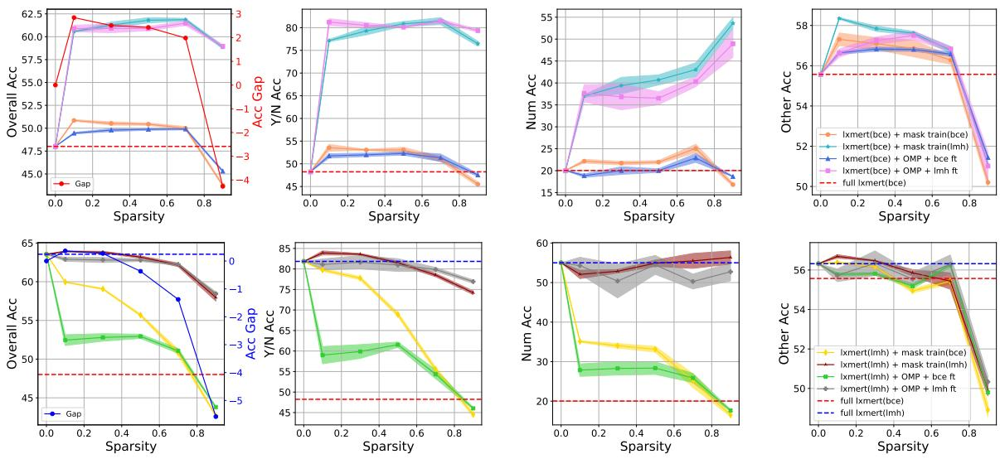  
Figure 12: Results of subnetworks from the BCE fine-tuned lxmert (upper) and from the LMH fine-tuned 1xmert (lower) on VQA-CP v2. “lxmert(bce/lmh)" denotes full model fine-tuning in Stage1, “mask train(bce/lmh)" and “OMP" denote pruning in Stage2. “bce/lmh ft" denotes further fine-tuning in Stage3. “Gap" denotes the improvement of mask train(bce/lmh) over full 1xmert(bce/lmh).

$$
\pmb { \theta } _ { p r } = \{ \mathbf { W } _ { \mathrm { e m b } } , \mathbf { W } _ { \mathrm { v i s - f c } } , \mathbf { W } _ { \mathrm { p l r } } \} \cup \pmb { \theta } _ { L _ { e n c } } \cup \pmb { \theta } _ { R _ { e n c } } \cup \pmb { \theta } _ { X _ { e n c } }\tag{11}
$$

where ${ \bf W } _ { \mathrm { e m b } } , { \bf W } _ { \mathrm { v i s - f c } }$ and $\mathbf { W } _ { \mathrm { p l r } }$ are the weights of embedding layer, vision fc layer and pool layer, $\pmb { \theta } _ { L _ { e n c } } \cup \pmb { \theta } _ { R _ { e n c } } \cup \pmb { \theta } _ { X _ { e n c } }$ are the parameters of Transformer layers:

$$
\begin{array} { r l } & { \pmb { \theta } _ { L e n c } = \{ \mathbf { W } _ { Q _ { L } } ^ { t } , \mathbf { W } _ { K _ { L } } ^ { t } , \mathbf { W } _ { V _ { L } } ^ { t } , \mathbf { W } _ { O _ { L } } ^ { t } , \mathbf { W } _ { \mathrm { i n } _ { L } } ^ { t } , \mathbf { W } _ { \mathrm { o u t } _ { L } } ^ { t } \} _ { t = 1 } ^ { T } } \\ & { \pmb { \theta } _ { R _ { e n c } } = \{ \mathbf { W } _ { Q _ { R } } ^ { i } , \mathbf { W } _ { V _ { R } } ^ { i } , \mathbf { W } _ { K _ { R } } ^ { i } , \mathbf { W } _ { O _ { R } } ^ { i } , \mathbf { W } _ { \mathrm { i n } _ { R } } ^ { i } , \mathbf { W } _ { \mathrm { o u t } _ { R } } ^ { i } \} _ { i = 1 } ^ { I } } \\ & { \pmb { \theta } _ { X _ { e n c } } = \{ \mathbf { W } _ { Q _ { C N } } ^ { x } , \mathbf { W } _ { K _ { C X } } ^ { x } , \mathbf { W } _ { K _ { C X } } ^ { x } , \mathbf { W } _ { O _ { C X } } ^ { x } , \mathbf { W } _ { O _ { C X } } ^ { x } ,  } \\ & {  \quad \mathbf { W } _ { Q _ { C L } } ^ { x } , \mathbf { W } _ { K _ { C L } } ^ { x } , \mathbf { W } _ { V _ { C L } } ^ { x } , \mathbf { W } _ { O _ { C L } } ^ { x } , \mathbf { W } _ { \mathrm { i n } _ { C L } } ^ { x } , \mathbf { W } _ { \mathrm { o u t } _ { C L } } ^ { x } ,  } \\ &   \quad \mathbf { W } _ { Q _ { C R } } ^ { x } , \mathbf { W } _ { K _ { C R } } ^ { x } , \mathbf { W } _ { K _ { C R } } ^ { x } , \mathbf { W } _ { O _ { C R } } ^ { x } , \mathbf { W } _ { \mathrm { i n } _ { C R } } ^ { x } ,  \end{array}\tag{12}
$$

where CX, CL and CR are the language selfattention, visual self-attention and cross-attention modules respectively.

## B.2 visualBERT Architecture and Subnetworks

Similar to lxmert, visualBERT is composed of an embedding layer, a visual projection layer, a pooler layer, a stack of Transformer layers. Differently, visualBERT's Transformer layers only involve a single encoder $( V _ { e n c } )$ . The parameters of visual-BERT to be pruned are:

$$
\pmb { \theta } _ { p r } = \{ \mathbf { W } _ { \mathrm { e m b } } , \mathbf { W } _ { \mathrm { p l r } } \} \cup \pmb { \theta } _ { V _ { e n c } }\tag{13}
$$

where $\mathbf { W } _ { \mathrm { e m b } }$ and $\mathbf { W } _ { \mathrm { p l r } }$ are the weights of embedding layer and pool layer, $\pmb { \theta } _ { V _ { e n c } }$ are the parameters of Transformer layers:

$$
\pmb { \theta } _ { V _ { e n c } } = \left\{ \mathbf { W } _ { Q _ { L } } ^ { v } , \mathbf { W } _ { K _ { L } } ^ { v } , \mathbf { W } _ { V _ { L } } ^ { v } , \mathbf { W } _ { O _ { L } } ^ { v } , \mathbf { W } _ { \mathrm { i n } _ { L } } ^ { v } , \mathbf { W } _ { \mathrm { o u t } _ { L } } ^ { v } \right\} _ { v = 1 } ^ { V }\tag{14}
$$

where V = 12.

## B.3 LMH details

LMH takes a step further based on Produce of Experts (PoE) (Hinton, 2002), which simply combines the predicted distributions of the main model and the biasd model as follows:

$$
\hat { \mathbf { p } } _ { d e b } = s o f t m a x ( l o g ( \mathbf { p } _ { m } ) + l o g ( \mathbf { p } _ { b } ) )\tag{15}
$$

where $\mathbf { p } _ { b }$ is the predicted distribution of biased model, and indicates the bias degree of the sample. In this way, when a sample is heavily biased, that is, $\mathbf { p } _ { b }$ is large, the main model will not output a large $\mathbf { p } _ { m }$ for it during training. Following (Clark et al., 2019), we directly use the answers' frequency under each question type as pb.

To selectively adjust the main model's behavior, LMH adds a learn function g to explicitly determine how much to trust the learned biases:

$$
\begin{array} { l } { \hat { \bf p } _ { d e b } = s o f t m a x ( l o g ( { \bf p } _ { m } ) + g ( h ) l o g ( { \bf p } _ { b } ) ) } \\ { g ( h ) = s o f t p l u s ( w \cdot h ) } \end{array}\tag{16}
$$

where h is the cross-modality representation from the last hidden layer of lxmert, w is trainable. To prevent $\mathbf { p } _ { b }$ being ignored, LMH also adds an entropy penalty item $R ,$ and the final loss is computed as:

$$
\mathcal { L } _ { l m h } = t \cdot { l o g } ( \delta ( \hat { { \bf p } } _ { d e b } ) ) + ( 1 - t ) \cdot { l o g } ( 1 - \delta ( \hat { { \bf p } } _ { d e b } ) ) ] + R\tag{17}
$$

## B.4 Model and Implementation Details

Lxmert has about 202M parameters, and 197.7M parameters are involved in the pruning process (4.5M parameters are left to the classifier). The three modules from different modalities, namely the language module, the visual module and the cross-modality module, contain 83.1M, 35.3M and 78.8M parameters respectively. We train the models for 20 epochs with a batch size of 128 on two Tesla-V100-32G or 256 on A100-80GB. The AdamW (Loshchilov and Hutter, 2017) optimizer is adopted with a learning rate of 5e-5. Our codes are based on the huggingface transformers library (Wolf et al., 2020). We adopt visualBERT of its coco-pre version which is pre-trained with COCO (Chen et al., 2015) dataset.

## C More Experiments on VQA-CP v2

## C.1 Performance of Subnetworks on Three Types of Questions

Subnetworks from BCE Fine-tuned lxmert. For the three types of questions, as shown in the right three plots of Fig. 12 (upper), we find that: 1) The performance on "Num" questions is sensitive to the varying sparsity levels while that on "Y/N" questions is relatively stable in general except at 90% sparsity. Specially, with the increase of sparsity, the performance on "Num" questions of "mask train(lmh)" and "OMP + lmh $\mathrm { f t " }$ counterintuitively greatly promote. This shows that language biases for the "Num" questions exist in a large proportion of the parameters of biased lxmert. 2) For the "Other" questions, debiasing methods have little gain on the performance of subnetworks. For example, the performance of "mask train(lmh)" is similar with that of "mask train(bce)". This indicates that the language biases for "Other" questions is minor in training set. Therefore, "Other" questions request more reasoning than debiasing. 3)There is a sharp decline of all the subnetworks’ performance on "Other" questions from 70% ～ 90% sparsity. We conjecture that this is because reducing the model's capacity too drastically hurt the reasoning ability which is necessary to answer the "Other" questions correctly.

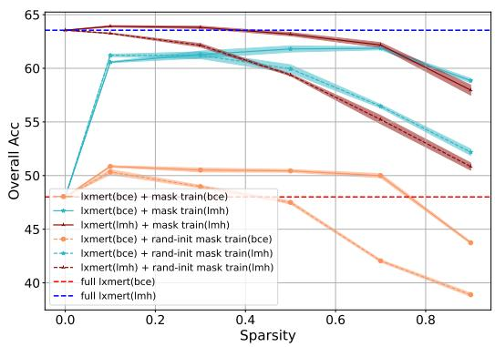  
Figure 13: Results of subnetworks obtained by mask training with different initialization strategies of m on VQA-CP v2. "rand-init" means initializing m randomly.

Subnetworks from LMH Fine-tuned lxmert. The right three plots of Fig. 12 (lower) shows the performance of LMH fine-tuned lxmert subnetworks on different types of questions. For the “Num" questions, when compressing LMH finetuned lxmert (the grey and maroon lines), the performance of subnetworks no longer rises with sparsity growth. This demonstrates that language biases for the “Num" questions exist in a much smaller proportion of the parameters of debiased lxmert than that of biased lxmert. For “Other" questions, “lxmert(bce) + mask train(lmh)" is consistently superior to “lxmert(lmh) + mask train(lmh)", which demonstrates that further debiasing the debiased full 1xmert in the pruning process sacrifices the reasoning ability.

## C.2 The Effect of Different Initialization Strategies of m for Mask Training

We conduct experiments with different subnetworks to validate the effectiveness of initializing î according to the magnitudes of lxmert's pretrained weights. From Fig. 13, it can be seen that "Ixmert(bce) + mask train(bce)", "1xmert(bce) + mask train(lmh)", "1xmert(lmh) + mask train(bce)" (dashed lines) consistently outperform "Ixmert(bce) + rand-init mask train(bce)", "1xmert(bce) + randinit mask train(lmh)", "lxmert(lmh) + rand-init mask train(bce)" (full lines) at all sparsity levels. As the sparsity increases, the gaps widen. This shows the initialization strategy we adopt is more effective than random initialization.

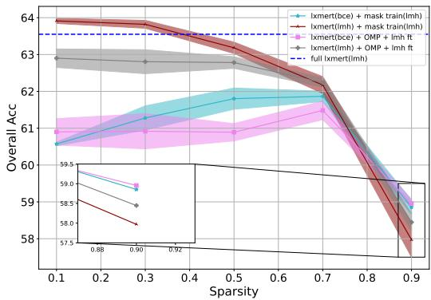  
Figure 14: Results of subnetworks obtained by pruning with debiasing method LMH on VQA-CP v2.

## C.3 A Close Look at The Performance of Subnetworks at 90% Sparsity

From Fig. 14, we derive two abnormal observations at the extremely high sparsity, i.e., 90%: 1) Pruning with "OMP + lmh ft" (pink and grey lines) is better than pruning with "mask train(lmh)" (cyan and brown lines). 2) Starting from "1xmert(bce)" (pink and cyan lines) is better than starting from "Ixmert(lmh)" (grey and brown lines). The two observations at 90% sparsity are contrary to other sparsity. For the first observation, we conjecture that this is because mask training (which involves binarization and gradient estimation) is more difficult to optimize at 90% compared with further fine-tuning of the OMP subnetworks. The second observation can be explained by that: Further debiasing the debiased full lxmert in the pruning process slightly sacrifices the performance on "Other" questions, which require more reasoning ability than debiasing ability (as shown in the rightmost two plots of Fig. 12). Therefore, at the extremely high sparsity, when the benefits of debiasing on "Y/N" and "Num" questions are small, the performance penalty on "Other" questions results in a drop in "Overall" accuracy. Nevertheless, the gaps between "lxmert(lmh) + mask train(lmh)" and the other two pipelines are small at 90% sparsity.

## C.4 Sparsity Configurations for the Three Modality-specific Modules

For the overall target sparsity of 50% and 70%, we adopt the following procedure to search the comfortable zone for the modality-specific sparsity:

First, we traverse [10%, 30%, 50%, 70%, 90%] (i.e., step size of 20%) to assign modality-specific sparsity for any two modules, and compute the modality-specific sparsity for the remaining one8 according to eq. 10 in the main paper. From the experimental results of these sparsity configurations, we can determine the approximate range where the pruned subnetworks perform better.

Second, we use the same method to traverse the reduced range with a smaller step size of 5%. In this way, we can determine the most comfortable zone for the modality-specific sparsity.

Similarly, when the overall target sparsity is 90%, we directly traverse 80% ～ 98% with a step size of 2% to search the most comfortable zone of the modality-specific sparsity.

## D More Experiments on VQA-VS

## D.1 Performance on varying OOD test sets of VQA-VS

The Effect of Compression without Debiasing For simplicity, we categorize the nine OOD test sets into 3 categories of different modalities, i.e., language-based (OOD-lang), visual-based (OODvis) and cross-modality (OOD-crsM) ones. We report the average accuracy of each category, as well as the IID accuracy and the average accuracy of all OOD test sets (OOD-mean) in Fig. 15.

The upper part of Fig. 15 shows the performance of subnetworks compressed without debiasing method, it can be seen that: 1) All subnetworks obtained by pruning all three modules underperform “full model(bce)" in ID test set. This is because the ID performance relies on memory ability, which is positively related to the parameter quantity. 2) The subnetworks obtained by pruning the language module consistently outperform the full model on OOD-mean, OOD-lang and OODcrsM test sets, which are related to the language bias. This indicates that the language module of lxmert is slightly overparameterized. 3) In contrast, pruning other modules causes a negative impact on OOD performance. Especially, pruning visual modules also results in a sharp OOD-vis accuracy drop, indicating that the visual module of lxmert is not suitable for compression.

The Effect of Compression with Debiasing The lower part of Fig. 15 shows the VQA-VS performance of “lxmert(lmh) + mask train(lmh)"9, which performs the best on VQA-CP v2. We can observe that: 1) Pruning any modules can improve ID performance over the debiased full model ("full model(lmh)"). This is because debiasing methods improve OOD performance at the cost of ID performance, while our pipeline alleviates such ID performance decline by compressing some harmful parameters. 2) Similarly, pruning any lxmert modules with a small sparsity (e.g., 0.2 and 0.4) also improves the OOD-mean performance. This demonstrates the existence of sparse and robust lxmert subnetworks on VQA-VS. 3) Especially, subnetworks obtained by compressing the language module consistently perform better than subnetworks obtained by pruning other modules and the debiased full model (except on OOD-vis), since the dataset biases tend to be learned by the language module. 4) However, pruning on any module fails to improve the OOD-vis accuracy, as the debiasing method LMH is designed for the language bias.

(d) OOD-vis  
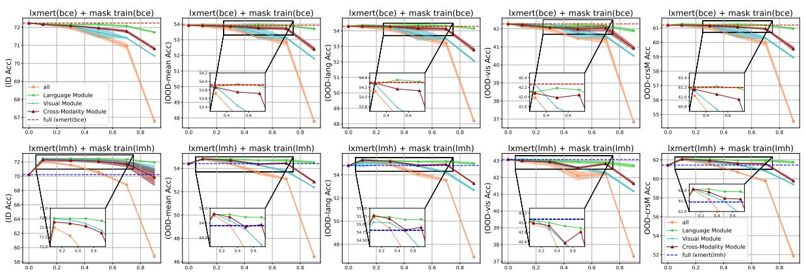

Figure 15: Results of subnetworks pruned using BCE (upper) and LMH (lower) on VQA-VS. Each column measures accuracy on ID test set, all, language-based, visual-based and cross-modality OOD test sets respectively. Different lines denote subnetworks obtained by pruning all, language, visual and cross-modality modules respectively.  
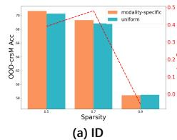

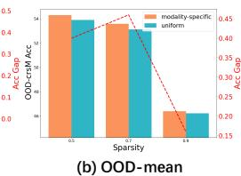

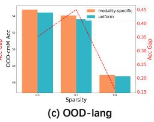

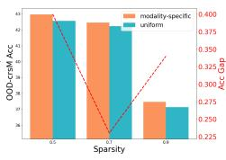

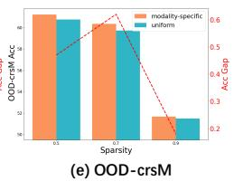  
Figure 16: Comparison of subnetworks “lxmert(lmh) + mask train(lmh)" with uniform sparsity and modality-specific sparsity on VQA-VS.

## D.2 The Effect of Modality-specific Sparsity on varying OOD test sets of VQA-VS

We directly use the modality-specific sparsity selected by the experiments of Sec. 3.4 in the main paper on VQA-CP v2. Fig. 16 shows that the subnetworks with modality-specific sparsity always outperform those with uniform sparsity except for 90% sparsity on ID test set, which validates that different modules should be compressed with different sparsity. Besides, when the overall sparsity is too large or too small, the benefits of the assignment of modality-specific sparsity will decrease accordingly. Note that the phenomenon of OOD-vis is different from other OOD test sets as the sparsity increases, since the debiasing methods LMH is designed for the language biases.