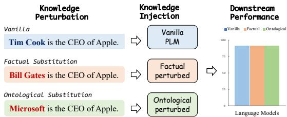
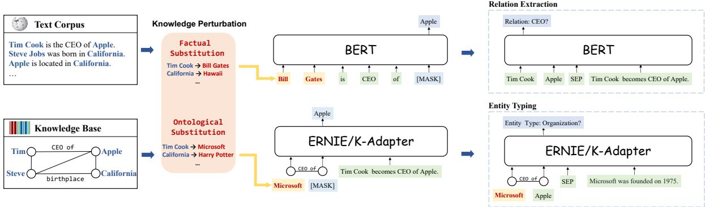
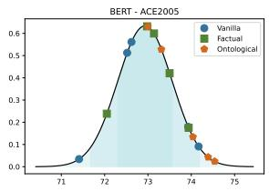
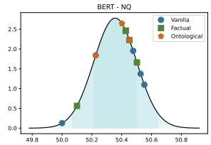
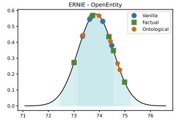
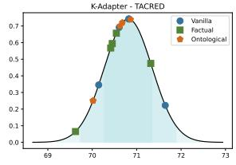

# Does the Correctness of Factual Knowledge Matter for Factual Knowledge-Enhanced Pre-trained Language Models?

Boxi Cao1,3∗, Qiaoyu Tang1,3∗, Hongyu Lin1†, Xianpei Han1,2†, Le Sun1,2

1Chinese Information Processing Laboratory 2State Key Laboratory of Computer Science

Institute of Software, Chinese Academy of Sciences, Beijing, China

3University of Chinese Academy of Sciences, Beijing, China

{boxi2020,tangqiaoyu2020,hongyu,xianpei,sunle}@iscas.ac.cn

## Abstract

In recent years, the injection of factual knowledge has been observed to have a significant positive correlation to the downstream task performance of pre-trained language models. However, existing work neither demonstrates that pre-trained models successfully learn the injected factual knowledge nor proves that there is a causal relation between injected factual knowledge and downstream performance improvements. In this paper, we introduce a counterfactual-based analysis framework to explore the causal effects of factual knowledge injection on the performance of language mod els within pretrain-finetune paradigm. Instead of directly probing the language model or ex haustively enumerating potential confounding factors, we analyze this issue by perturbing the factual knowledge sources at different scales and comparing the performance of pre-trained language models before and after the perturbation. Surprisingly, throughout our experiments, we find that although the knowledge seems to be successfully injected, the correctness of injected knowledge only has a very limited effect on the models’ downstream performance. This finding strongly challenges previous assumptions that the injected factual knowledge is the key for language models to achieve performance improvements on downstream tasks in pretrain-finetune paradigm.

## 1 Introduction

In recent years, pre-trained language models (PLMs) have emerged as the dominant approach in natural language processing. Through selfsupervised learning on large-scale text corpus, PLMs can acquire different kinds of knowledge automatically without additional manual guidance, which demonstrates significant generalizability and transferability improvements across tasks compared with previous architectures (Devlin et al., 2019; Radford et al., 2019; Liu et al., 2019; Raffel et al., 2020; Scao et al., 2022; Touvron et al., 2023).

  
Figure 1: This paper explores the impact of factual knowledge by comparing the downstream task performance before and after knowledge perturbation.

Some previous investigations contribute the superiors of pre-trained language models to their entailed various kinds of knowledge learned from the pre-training stage (Petroni et al., 2019; Lewis et al., 2020b; Yin et al., 2022; Cao et al., 2023). Among them, factual knowledge, which reveals the relationships between real-world entities (e.g., Tim Cook is the CEO of Apple) and plays a critical role in human cognition (Unger, 1968), is regarded as a critical factor for a pre-trained language model to approach a trusted intelligent agent (Lewis et al., 2020b; Yin et al., 2022). Consequently, how to improve the acquisition, modeling, and application of factual knowledge of pre-training language models has become a hot research topic. To this end, many studies have been devoted to further injecting factual knowledge to enhance the acquisition and modeling of factual knowledge in pre-trained language models (Zhang et al., 2019; Liu et al., 2020; Sun et al., 2020; Wang et al., 2021a,b), and have already reported successful performance improvements on specific downstream tasks.

On the contrary, recent studies have found that pre-trained language models struggle with retaining factual knowledge, and the retained factual knowledge can exhibit inconsistencies with the original knowledge sources (Poerner et al., 2020; Elazar et al., 2021; Cao et al., 2021). Furthermore, the indirect evaluations through downstream tasks only reflect that injecting factual knowledge is correlated to performance improvement, but can not establish the causality between them due to the existence of many additional potential confounding factors (training data domain, model parameter size, etc.). Consequently, to identify the impact of factual knowledge injection on the downstream performance of pre-trained language models, the following two critical questions should be answered:

• Through the existing knowledge injection methods, is the factual knowledge really injected into pre-trained language models?

• If so, is it indeed the injected knowledge, rather than other confounding factors, that is responsible for the observed performance improvements in downstream tasks?

Unfortunately, it is infeasible to directly answer the above-two questions due to the lack of highly effective language model knowledge probing and confounding factor identification measurements. To this end, as shown in Figure 1, this paper introduces a counterfactual-based analysis framework (Veitch et al., 2021; Guidotti, 2022) to explore the causal effects of injecting factual knowledge in a “what-if” manner. Moreover, Figure 2 illustrates the applied framework. Instead of directly probing the language model or exhaustively enumerating potential confounding factors, we analyze the above-two questions by perturbing the factual knowledge sources at different scales, then comparing the downstream performance of pretrained language models before and after the perturbation. The key motivation of our work is that: 1) If the knowledge injection approaches are ineffective, the performance of the model injected with the correct knowledge and perturbed knowledge should not perform very differently in the knowledge probing evaluation; 2) If the correctness of injected factual knowledge is indeed essential for downstream tasks, then injecting perturbed, wrong knowledge should cause significant performance decline. Specifically, in order to observe the aspect from which factual knowledge affects PLMs, we conduct two kinds of perturbation on factual knowledge, includingfactual substitution, which replaces an entity in factual knowledge with another entity with the same type (e.g., substitute “Tim Cook is the CEO of Apple” with “Bill Gates is the CEO of Apple”), as well as ontological substitution that thoroughly perturb entities with their counterparts of another type (e.g., substitute “Tim Cook is the CEO of Apple” with “Microsoft is the CEO of Apple”). In addition, to analyze the impact of perturbation, we investigate three knowledge injection approaches that acquire knowledge from two types of factual knowledge sources, including plain texts containing factual knowledge and structured factual knowledge bases.

Throughout empirical evaluations on a wide range of representative downstream NLP tasks, our findings surprisingly deviate from previous hypotheses. Although the knowledge injection approaches seem to inject factual knowledge into PLMs successfully, we find that factual knowledge perturbation has only a very limited effect on PLMs’ downstream task performance, i.e., the correctness of factual knowledge shows a very limited impact on all evaluated downstream tasks. Furthermore, although the influence of ontological perturbation is slightly stronger than factual perturbation, it also does not cause statistically significant performance divergence in most downstream tasks. Specifically, our experiments show that in most downstream tasks, the performance fluctuation caused by the above-two perturbation is not greater than the fluctuation caused by random seeds, and the results of t-test further demonstrate that there are no statistically significant differences between the performance before and after perturbation. Through this counterfactual-based analysis, our findings demonstrate that injected factual knowledge is not the core reason for the performance improvements of previous knowledge injection approaches on pre-trained language models in the pretrain-finetune paradigm.

The following part of this paper is organized as follows. In Section 2, we briefly review the related work about factual knowledge probing and injection of PLMs. Section 3 presents our proposed counterfactual-based analysis framework. The experimental results and the process leading to our conclusions are presented in Section 4. In Section 5, we provide a brief discussion and conclude our findings1.

  
Figure 2: The illustration of the counterfactual-based knowledge analysis framework. Given factual knowledge from text corpus or knowledge bases, we first conduct two perturbations to obtain incorrect knowledge instances. Then we pre-train LMs on the perturbed datasets. Finally, we compare the downstream performance of PLMs before and after perturbation to explore the causal effects of factual knowledge injection on the performance of PLMs.

## 2 Related Work

Factual knowledge reveals the relationships between real-world entities and plays a crucial role in human cognitive (Unger, 1968). Therefore, lots of studies devoted to probing the factual knowledge entailed in PLMs on the one hand (Petroni et al., 2019; Kassner et al., 2021; Sung et al., 2021), and propose to enhance the factual knowledge in large-scale LMs to benefit their performance on downstream tasks on the other (Zhang et al., 2019; Liu et al., 2020; Wang et al., 2021b).

Factual Knowledge Probing aims to evaluate how well current PLMs are entailing factual knowledge in parameters. Currently, the most popular strategy is prompt-based probing (Petroni et al., 2019; Ettinger, 2020; Srivastava et al., 2022), e.g., query BERT with “Tim Cook is the CEO of [MASK]” to determine whether it contains corresponding knowledge. And recent studies have found that prompt-based probing could be inaccurate (Poerner et al., 2020; Zhong et al., 2021), inconsistent (Elazar et al., 2021; Kassner and Schütze, 2020; Cao et al., 2022; Jang et al., 2022), and unreliable (Li et al., 2022; Cao et al., 2021).

Factual Knowledge Injection aims to inject factual knowledge into PLMs. Currently, there are two main sources for injecting factual knowledge into language models, including plain text and structured knowledge base. For plain text, LMs typically acquire factual knowledge through self-supervised learning on large-scale text corpus without any knowledge guided supervision. The popular objectives include casual language modeling (Radford et al., 2019; Brown et al., 2020; Scao et al., 2022; Touvron et al., 2023), masked language modeling (Devlin et al., 2019; Liu et al., 2019), denoising auto-encoder (Lewis et al., 2020a), etc. And such pre-trained LMs have been shown to potentially entail a large scale of factual knowledge in the parameters (Bouraoui et al., 2020; Petroni et al., 2019). In addition, many studies intend to explicitly infuse the factual knowledge from structured knowledge base into LMs (Yang et al., 2021). Popular strategies include: 1) Embedding combined methods (Zhang et al., 2019; Peters et al., 2019; He et al., 2020b), which encode structured knowledge via knowledge embedding algorithms and then enhance PLMs’ text representation with knowledge graph embedding; 2) Knowledge supervised methods (Wang et al., 2021a,b; Yamada et al., 2020), which utilize elements from structured knowledge as supervision signals and leverage base PLMs to learn their semantics.

## 3 Counterfactual-based Knowledge Analysis Framework

As mentioned above, this paper intends to investigate whether current factual knowledge injection approaches can inject factual knowledge into pretrained language models and whether the injected factual knowledge can benefit downstream NLP tasks in pretrain-finetune paradigm. However, it is currently not feasible to directly explore these questions due to the lack of effective knowledge probing and confounding factor discovery approaches for pre-trained language models.

To this end, we propose to leverage a counterfactual-based knowledge analysis framework to answer these two questions in a “what-if” manner. Specifically, we transform the problem of investigating the characteristics of a model with injected knowledge into comparing the behaviors between models injected with correct and incorrect knowledge, respectively. Consequently, if the knowledge injection approaches work, models injected with incorrect knowledge should exhibit significantly inferior performance on the knowledge probing evaluation than models injected with correct knowledge. Furthermore, if injecting factual knowledge is indeed helpful to downstream tasks, models injected with correct factual knowledge should perform significantly better than models injected with incorrect factual knowledge on downstream tasks.

<table><tr><td>Source Model</td><td>Wikipedia</td><td colspan="2">Wikidata</td></tr><tr><td>Total</td><td>BERT 14,545,579</td><td>ERNIE 6,105,524</td><td>K-Adapter 5,565,478</td></tr><tr><td></td><td></td><td></td><td></td></tr><tr><td>Perturbed</td><td>13,538,337</td><td>5,541,297</td><td>4,692,683</td></tr><tr><td>Pert. Rate</td><td>93.08%</td><td>90.76%</td><td>84.32%</td></tr></table>

Table 1: The perturbation details of two kinds of knowledge sources. For text corpus, we perturb 93.1% paragraphs from Wikipedia. As for structured knowledge base, we perturb 90.76% training instances for ERNIE and 84.32% for K-Adapter from Wikidata.

The overall counterfactual-based analysis framework is illustrated in Figure 2. Specifically, given factual knowledge from text corpus or knowledge bases, we first conduct perturbation on the instances in them to obtain incorrect knowledge instances. Then we pre-train language models with several representative factual knowledge injection approaches on both vanilla and perturbed knowledge sources. Finally, we compare the performance of knowledge-injected models to reach conclusions about the above-two questions. In the following sections, we will first demonstrate how we conduct knowledge perturbation on different knowledge sources and then briefly introduce the investigated representative factual knowledge injection approaches in our experiments.

## 3.1 Factual Knowledge Perturbation

Knowledge perturbation aims to generate counterfactual factual knowledge instances for analysis. In this paper, we mainly employ two kinds of perturbation strategies, includingfactual substitution and ontological substitution. Factual substitution studies the influence of the factual correctness of factual knowledge in models by replacing entities with other entities of the same type. For example, factual substitution perturbs the factual knowledge “Tim Cook is the CEO of Apple” with an incorrect statement “Bill Gates is the CEO of Apple”. On the other hand, ontological substitution thoroughly perturbs entities with counterparts of different types, which is used to evaluate the importance of factual knowledge ontology on downstream tasks. For example, ontological substitution replaces “Tim Cook is the CEO of Apple” with “Microsoft is the CEO of Apple”.

This paper mainly focuses on two kinds of the most widely-used factual knowledge sources, including learning from plain text corpus and structural factual knowledge bases. For learning from plain text corpus, we use paragraphs in Wikipeida2 that contain an anchor linking to Wikidata (Vrandeciˇ c and Krötzsch´ , 2014) as knowledge sources. For learning from knowledge bases, we direct use entities and their relations in Wikidata as knowledge sources. The type of an entity is determined by its corresponding "instance of" and "subclass of" properties in Wikidata. In this paper, we mainly focus on perturbing factual knowledge about three kinds of representative entity types, including Person, Location, and Organization. Table 1 demonstrates the perturbation details for both kinds of knowledge sources, revealing that the perturbation would affect most of their training instances. For learning from text, we utilize 14,545,579 paragraphs from Wikipedia and perturb 13,538,337 of them, resulting in a 93.1% perturbation rate. For knowledge learning from structured data such as ERNIE, we utilize a total of 6,105,524 pre-training instances, of which we perturb 5,531,297, leading to a perturbation rate of 90.76%.

## 3.2 Factual Knowledge Injection Approaches

In recent years, the injection of factual knowledge into large-scale language models has emerged as a prominent research area. Various methods have been developed for injecting knowledge, depending on the specific sources of knowledge. In this paper, we explore three representative approaches for injecting knowledge, corresponding to the following two types of knowledge sources:

Learning From Plain Text. In this study, we select BERT (Devlin et al., 2019) as our experiment architecture for learning from text, as it is one of the most representative pre-trained language models. To investigate the impact of factual knowledge on BERT, we conduct pre-training of the BERTbase model from scratch with masked language modeling as the objective, separately on both the vanilla and perturbed versions of Wikipedia text corpus respectively. The model is pre-trained using a batch size of 1024 sequences for 500,000 steps. For optimization, we use Adam optimizer with a learning rate of $\displaystyle { \lvert e - 4 , \beta _ { 1 } = 0 . 9 , \beta _ { 2 } = 0 . 9 9 9 }$ learning rate warmup over the first 10,000 steps. The training process was conducted on 2 Nvidia A100 GPUs with 80G RAM for about 10 days.

Learning From Structured Knowledge. We select one representative approach for each direction of learning factual knowledge from structured knowledge mentioned in Section 2, including:

• ERNIE (Zhang et al., 2019) is a typical model that injects knowledge into PLMs through the embedding combined method. It first identifies the named entity mentions in the text and aligns them to Wikidata. Then ERNIE aggregates the entity representation with its corresponding token embedding, where entity representation is trained on KG via knowledge embedding algorithms like TransE (Bordes et al., 2013). We perturb the acquired knowledge for ERNIE by substituting the entity representation in the input.

• K-Adapter (Wang et al., 2021a) is a representative method that utilizes elements in the explicit knowledge base as the supervision signal. It designs an adapter to inject factual knowledge via relation classification task with keeping the original parameters of PLM fixed. We perturb the acquired knowledge for K-Adapter by directly substituting the entities in the explicit knowledge base.

To ensure a fair comparison, we strictly adhere to the pre-training process outlined in the original papers.

## 3.3 Downstream Evaluation

To make a comprehensive and thorough evaluation, we conduct experiments on a wide range of downstream tasks, most of which have been previously shown to achieve performance improvement through knowledge injection (Zhang et al., 2019; Wang et al., 2021a; He et al., 2020a; Yamada et al., 2020; Qin et al., 2021; Sun et al., 2021). Inspired by Yu et al. (2023), we divide these tasks into four categories based on the stratification and connection to factual knowledge: knowledge probing tasks, knowledge guided tasks, knowledge applying tasks, and language understanding tasks.

Knowledge Probing Tasks are primarily used to investigate the knowledge entailed in PLMs. We use LAMA (Petroni et al., 2019), the most widely used factual knowledge probing benchmark, as our testbed to determine whether the factual knowledge is successfully injected into PLMs. LAMA evaluates the factual knowledge in PLMs by employing cloze-style questions, such as "Tim Cook is the CEO of [MASK]".

Knowledge Guided Tasks aim to evaluate the ability of PLMs to recognize the factual information within texts, such as entities and entity relations. Specifically, we evaluate BERT on two widely used named entity recognition (NER) datasets including CONLL2003 (Tjong Kim Sang, 2002) and OntoNotes 5.0 (Pradhan et al., 2013), as well as two representative relation extraction (RE) datasets including ACE2004 (Mitchell et al., 2005) and ACE2005 (Walker et al., 2006). For the evaluation of ERNIE and K-Adapter, to obtain more reliable experimental conclusions, we conduct experiments on the same tasks as the original paper, including entity typing (e.g., Open Entity (Choi et al., 2018) and FIGER (Ling et al., 2015)) and relation classification (e.g., FewRel (Han et al., 2018) and TACRED (Zhang et al., 2017)).

Knowledge Applying Tasks focus on evaluating the model’s ability to apply factual knowledge to reasoning and problem-solving tasks (Petroni et al., 2021), e.g., open QA and fact checking. In this paper, we select the open QA datasets Natural Questions (Kwiatkowski et al., 2019), CosmosQA (Huang et al., 2019), and fact checking dataset FEVER (Thorne et al., 2018).

Language Understanding Tasks includes various tasks such as text classification, natural language inference, sentiment analysis, etc. We select GLUE (Wang et al., 2019) as evaluation benchmark, which is a collection of NLU tasks and widely used in various PLMs’ evaluations, and previous knowledge injection studies have reported performance improvements on them (Sun et al., 2019; Liu et al., 2020; Sun et al., 2021).

In the downstream task fine-tuning process, we follow the same dataset split and hyper-parameter settings of the original papers, please refer to Appendix for details due to page limitation. In addition, to avoid the impact of randomness on investigation conclusions, all experiments were conducted under 5 random seed settings, and their means and standard deviations are reported in the later results.

<table><tr><td colspan="4">Perturbation</td><td>Factual Query</td><td>Output</td></tr><tr><td rowspan="2">Factual</td><td>Cicero</td><td>→</td><td>Lorde</td><td>vanilla</td><td>Cicero was born in [MASK].</td><td>Rome</td></tr><tr><td>Rome</td><td>→</td><td>Disney</td><td>perturb</td><td>Lorde was born in [MASK] .</td><td>Disney</td></tr><tr><td rowspan="2">Ontological</td><td>Mahatma Gandhi</td><td>→</td><td>Luzon</td><td>vanilla</td><td>Mahatma Gandhi was born in [MASK] .</td><td>India</td></tr><tr><td>India</td><td>→</td><td>Nevada</td><td>perturb</td><td>Luzon was born in [MASK] .</td><td>Nevada</td></tr></table>

Table 2: Example of PLMs’ outputs before and after perturbation. The left part shows the perturbation mapping and the right shows the input and output of the models; “factual” and “ontological” denotes the corresponding substitution strategy; "vanilla" and "perturb" denote the vanilla LM and the perturbed LM respectively.

<table><tr><td>Model</td><td>Vanilla</td><td>Factual</td><td>Ontological</td></tr><tr><td>BERT</td><td>28.18</td><td>11.62</td><td>10.34</td></tr><tr><td>ERNIE</td><td>29.21</td><td>25.31</td><td>25.67</td></tr></table>

Table 3: The factual knowledge probing results on LAMA for both vanilla and perturbed pre-trained language models.

## 4 Experiments and Findings

Based on the analysis framework presented in Section 3, we conduct extensive experiments and intriguingly find that the correctness of factual knowledge shows a very limited impact on almost all downstream tasks. In this section, we will elaborate on our experimental procedures, provide a detailed account of our findings, and illustrate how we arrive at our conclusions.

## 4.1 Does Knowledge Injection Works?

Conclusion 1. Knowledge injection approaches successfully affect factual knowledge in pre-trained language models.

To assess the effectiveness of knowledge injection approaches, we compare the performance of PLMs before and after perturbation on the well-known knowledge probing benchmark LAMA (Petroni et al., 2019). Table 2 demonstrates several illustrative examples of the predictions from both vanilla and perturbed models, showcasing the influence of the knowledge injection process on the model’s output. For example, in the perturbed corpus, we substitute the factual knowledge <Cicero, birthplace, Rome> with <Lorde, birthplace, Disney>. The vanilla BERT predicts “Cicero was born in Rome”, while the perturbed BERT predicts “Lorde was born in Disney”, indicating that factual knowledge injected during pre-training indeed influences the model’s prediction.

To further quantify such effects, Table 3 shows the performance on LAMA benchmark for PLMs with and without different types of perturbation. It is evident that BERT’s performance on LAMA significantly decreases from 28.18 to 11.62 after factual substitution and further drops to 10.34 after ontological substitution. ERNIE’s performance drops from 29.21 to 25.31 and 25.67 after perturbation. The significant decline in performance demonstrates the effectiveness of injecting incorrect knowledge. In conclusion, through factual knowledge probing, we can demonstrate the effectiveness of knowledge injection on both learning factual knowledge from plain text and structural knowledge bases. This implies that current representative knowledge injection approaches successfully influence factual knowledge in language models.

  
Figure 3: Distributions of LMs’ performance on downstream tasks. We assume the variation in performance caused by random seed follows a normal distribution, and estimate the parameters based on the results of the vanilla language model on various random seeds, and the remaining points on the curve demonstrate the performance of LMs before and after perturbation.

## 4.2 Does Factual Substitutions Affect Downstream Performance?

Conclusion 2. Regardless of the approaches of knowledge injection, factual substitution shows very limited influence on all downstream tasks, i.e., the correctness of injected factual knowledge is not the keyfactorforfactual knowledge-enhanced language models to achieve better performance.

<table><tr><td>Model</td><td colspan="2">Perturbation</td><td>CONLL2003</td><td> $\mathbf { O n t o N o t e s 5 . 0 }$ </td><td>ACE2004</td><td>ACE2005</td><td>NQ</td><td colspan="2">FEVER</td></tr><tr><td rowspan="2">BERT</td><td>No Substitution Factual Substitution</td><td> $\overline { { 9 1 . 3 7 \pm 0 . 3 1 } }$   $9 1 . 2 2 \pm 0 . 0 5$ </td><td></td><td> $\overline { { 8 8 . 9 2 \pm 0 . 1 0 } }$   $8 8 . 8 7 \pm 0 . 1 1$ </td><td> $\overline { { 7 2 . 1 8 \pm 0 . 5 2 } }$   $7 1 . 7 9 \pm 0 . 3 9$ </td><td> $\overline { { 7 2 . 9 3 \pm 1 . 0 1 } }$   $7 3 . 1 2 \pm 0 . 6 3$ </td><td> $\overline { { 5 0 . 3 6 \pm 0 . 2 1 } }$   $5 0 . 3 8 \pm 0 . 1 4$ </td><td> $\overline { { 8 8 . 5 8 \pm 0 . 2 4 } }$   $8 8 . 4 0 \pm 0 . 1 8$ </td><td> $\overline { { 8 0 . 2 6 \pm 0 . 3 3 } }$   $8 0 . 0 7 \pm 0 . 5 3$ </td></tr><tr><td>P-value</td><td></td><td>0.385</td><td>0.542</td><td>0.265</td><td>0.755</td><td>0.849</td><td>0.273</td><td>0.560</td></tr><tr><td rowspan="3">Model ERNIE</td><td>Perturbation</td><td>No Substitution</td><td></td><td>Open Entity  $\overline { { 7 3 . 8 5 \pm 0 . 4 1 } }$ </td><td>FIGER</td><td>FewRel</td><td>TACRED</td><td></td><td>GLUE</td></tr><tr><td>Factual Substitution</td><td></td><td> $7 4 . 1 3 \pm 0 . 6 9$ </td><td></td><td> $\overline { { 7 1 . 4 3 \pm 1 . 2 5 } }$   $7 1 . 1 6 \pm 0 . 9 6$ </td><td> $\overline { { 8 8 . 4 1 \pm 0 . 3 3 } }$   $8 6 . 8 8 \pm 0 . 3 4$ </td><td> $\overline { { 6 6 . 8 6 \pm 0 . 8 5 } }$   $6 6 . 3 1 \pm 0 . 4 5$ </td><td></td><td> $\overline { { 8 1 . 7 4 \pm 0 . 5 9 } }$   $8 1 . 5 7 \pm 0 . 3 4$ </td></tr><tr><td colspan="2">P-value</td><td>0.509</td><td>0.740</td><td>0.000</td><td>0.291</td><td colspan="2"></td><td>0.638</td></tr><tr><td colspan="2">Model</td><td colspan="2">Perturbation</td><td>Open Entity</td><td>FIGER</td><td>TACRED</td><td>CosmosQA</td><td></td><td>GLUE</td></tr><tr><td rowspan="3">K-Adapter</td><td colspan="2">No Substitution Factual Substitution</td><td colspan="2"> $\overline { { 7 6 . 0 5 \pm 0 . 3 6 } }$   $7 6 . 0 5 \pm 0 . 4 3$ </td><td> $\overline { { 7 7 . 6 7 \pm 0 . 6 7 } }$   $7 7 . 0 8 \pm 0 . 7 4$ </td><td> $\overline { { 7 0 . 8 1 \pm 0 . 4 9 } }$   $7 0 . 4 7 \pm 0 . 5 4$ </td><td colspan="2"> $\overline { { 8 0 . 0 4 \pm 0 . 7 3 } }$   $7 9 . 5 2 \pm 1 . 0 5$ </td><td colspan="2"> $\overline { { 8 7 . 3 1 \pm 0 . 7 5 } }$   $8 7 . 9 0 \pm 0 . 5 6$ </td></tr><tr><td colspan="2">P-value</td><td colspan="2">0.995</td><td>0.276</td><td colspan="2">0.376</td><td colspan="2">0.240</td></tr><tr><td colspan="2"></td><td colspan="2"></td><td></td><td colspan="2"></td><td colspan="2">0.437</td></tr></table>

Table 4: Model performance and t-test results on downstream tasks before and after factual substitution. The last row presents p-values from the t-test. Most p-values significantly exceed threshold 0.05, indicating insufficient statistical evidence to assert a noteworthy difference in model performance before and after perturbation.

To investigate the effect of knowledge perturbation, we calculate the mean and standard deviation of model performance with 5 different random seeds for each task and compare the performance fluctuation caused by perturbation and random seeds. Moreover, we leverage the t-test to further verify whether a statistically significant difference exists between the model performance before and after perturbation.

Table 4 shows the models’ performance on downstream tasks before and after factual substitution. For learning from plain texts, we observe that factual substitution has a limited impact on all evaluated dataset: 1) On language understanding tasks using GLUE benchmark, the average performance fluctuation caused by factual substitution is 0.19%, which is lower than the performance fluctuation 0.33% caused by random seeds. And the performance on each task is demonstrated in the appendix due to page limitations; 2) On knowledge applying tasks such as open domain QA and fact checking, we obtain similar findings to GLUE benchmark, indicating that the knowledge acquired from the pre-training phase has a limited impact even when the downstream tasks require specific knowledge for answer inference or task solving; 3) Even for the factual knowledge guided tasks such as NER and RE, we surprisingly find that the random seed still causes larger performance fluctuation than factual substitution. Moreover, on relation extraction tasks such as ACE 2005, the average performance of the perturbed models across different random seeds is even higher than the vanilla model without perturbation.

For learning from structured knowledge, we conduct experiments on both embedding combined (ERNIE) and knowledge supervised (K-Adapter) methods. In order to ensure the reliability of our conclusions, we select the same tasks as the original papers, where knowledge injection was shown to provide benefits. Overall, we reach similar findings with learning from plain texts, where the random seeds cause larger performance fluctuation than factual substitution on most benchmarks. The only exception comes from FewRel, where the factual substitution leads to relatively significant performance degeneration. However, it is worth noting that FewRel and ERNIE share the same knowledge source, which could lead to significant information leakage and make the model more dependent on the correctness of knowledge in the explicit knowledge base. We also conduct detailed experiments to prove and quantify the information leakage, which is beyond the scope of this paper, and therefore we present the results in the appendix.

To further quantify the performance divergence, we employ a t-test (Boneau, 1960) to examine the significance of the performance differences between the models before and after factual substitution. The null hypothesis posited no alteration in the mean performance, while the alternative hypothesis argued for a discernible variation in performance levels. Following standard conventions, we set the threshold for statistical significance at 0.05 That is to say, a p-value greater than 0.05 indicates that there is no sufficient statistical evidence to reject the null hypothesis. The p-values of the models on each downstream datasets are presented in the last row of Table 4. In all of these datasets (except FewRel as we mentioned above), the p-values were notably larger than our pre-specified level of statistical significance (0.05). This outcome suggests an absence of substantial evidence to reject the null hypothesis. Therefore, we could not substantiate the existence of a significant difference in model performance before and after factual substitution.

<table><tr><td>Model</td><td colspan="2">Perturbation</td><td>CONLL2003</td><td> $\mathbf { O n t o N o t e s 5 . 0 }$ </td><td>ACE2004</td><td>ACE2005</td><td>NQ</td><td>FEVER</td><td>GLUE</td></tr><tr><td rowspan="2">BERT</td><td>No Substitution Ontological Substitution</td><td colspan="2"> $\overline { { 9 1 . 3 7 \pm 0 . 3 1 } }$ </td><td> $\overline { { 8 8 . 9 2 \pm 0 . 1 0 } }$   $8 8 . 7 2 \pm 0 . 1 5$ </td><td> $\overline { { 7 2 . 1 8 \pm 0 . 5 2 } }$   $7 2 . 5 6 \pm 0 . 3 3$ </td><td> $\overline { { 7 2 . 9 3 \pm 1 . 0 1 } }$   $7 3 . 8 6 \pm 0 . 6 0$ </td><td> $\overline { { 5 0 . 3 6 \pm 0 . 2 1 } }$   $5 0 . 3 4 \pm 0 . 1 0$ </td><td colspan="2"> $\overline { { 8 8 . 5 8 \pm 0 . 2 4 } }$   $8 8 . 2 3 \pm 0 . 2 8$ </td></tr><tr><td colspan="2">P-value</td><td> $9 1 . 1 8 \pm 0 . 0 9$  0.290</td><td>0.061</td><td>0.250</td><td>0.154</td><td>0.902</td><td>0.089</td><td> $8 0 . 1 8 \pm 0 . 3 6$  0.758</td></tr><tr><td colspan="2">Model</td><td colspan="2">Perturbation</td><td>Open Entity</td><td>FIGER</td><td>FewRel</td><td colspan="2">TACRED</td><td>GLUE</td></tr><tr><td rowspan="3" colspan="2">ERNIE</td><td colspan="2">No Substitution</td><td> $\overline { { 7 3 . 8 5 \pm 0 . 4 1 } }$ </td><td> $\overline { { 7 1 . 4 3 \pm 1 . 2 5 } }$ </td><td> $\overline { { 8 8 . 4 1 \pm 0 . 3 3 } }$ </td><td colspan="2"> $\overline { { 6 6 . 8 6 \pm 0 . 8 5 } }$ </td><td colspan="2"> $\overline { { 8 1 . 7 4 \pm 0 . 5 9 } }$ </td></tr><tr><td colspan="2">Ontological Substitution P-value</td><td> $7 4 . 2 6 \pm 0 . 5 3$  0.261</td><td> $7 0 . 0 0 \pm 1 . 6 0$  0.197</td><td> $8 5 . 1 5 \pm 0 . 4 6$  0.000</td><td colspan="2"> $6 6 . 5 7 \pm 0 . 3 5$ </td><td colspan="2"> $8 1 . 6 7 \pm 0 . 1 6$  0.829</td></tr><tr><td colspan="2"></td><td></td><td></td><td></td><td></td><td colspan="2">0.541</td></tr><tr><td colspan="2">Model</td><td colspan="2">Perturbation</td><td>Open Entity</td><td>FIGER</td><td>TACRED</td><td colspan="2">CosmosQA</td><td colspan="2">GLUE</td></tr><tr><td rowspan="3" colspan="2">K-Adapter</td><td colspan="2">No Substitution</td><td> $\overline { { 7 6 . 0 5 \pm 0 . 3 6 } }$ </td><td> $\overline { { 7 7 . 6 7 \pm 0 . 6 7 } }$ </td><td> $\overline { { 7 0 . 8 1 \pm 0 . 4 9 } }$ </td><td colspan="2"> $\overline { { 8 0 . 0 4 \pm 0 . 7 3 } }$ </td><td colspan="2"> $\overline { { 8 7 . 3 1 \pm 0 . 7 5 } }$ </td></tr><tr><td colspan="2">Ontological Substitution P-value</td><td> $7 6 . 1 2 \pm 0 . 2 6$ </td><td> $7 7 . 6 6 \pm 0 . 1 6$  0.978</td><td> $7 0 . 4 4 \pm 0 . 3 5$  0.254</td><td colspan="2"> $7 9 . 9 9 \pm 1 . 4 0 $ </td><td colspan="2"> $8 8 . 1 4 \pm 0 . 1 6$  0.060</td></tr><tr><td colspan="2"></td><td>0.754</td><td></td><td></td><td></td><td colspan="2">0.951</td></tr></table>

Table 5: Model performance and P-values of t-test on each downstream tasks before and after ontological substitution.

Overall, for language models acquiring factual knowledge from either plain texts or structured knowledge bases, the correctness of factual knowledge during pre-training has a very limited impact on downstream tasks, which significantly challenges the previous assumptions of factual knowledge leading to performance improvements on downstream tasks.

## 4.3 Does Ontological Substitution Affect Downstream Performance?

Conclusion 3. Overall, the influence ofontological substitution is slightly stronger than factual substitution, but still shows very limited impact on most downstream tasks.

The performance comparison and t-test results about ontological substitution are demonstrated in Table 5. Surprisingly, we find that even type-level ontological substitution still has a limited impact on most downstream tasks, even for tasks that significantly rely on entity type information, such as named entity recognition, relation extraction, and entity typing. The results of the t-test further support this finding. In most downstream tasks for all three models, the p-values exceed the threshold 0.05, indicating a lack of sufficient evidence to confirm a significant difference in model performance before and after ontological substitution. The only exception also comes from FewRel in ERNIE, mainly due to information leakage as mentioned above. Figure 3 illustrates the performance distribution before and after perturbation on several tasks, which illustrates the limited effect of both factual and ontological substitution in a more straightforward manner. Specifically, we first assume the variation in performance due to random seed effects follows a normal distribution, and plot the performance distribution curve based on the results of the vanilla LMs on various random seeds, then highlight the performance of the model before and after two substitutions on the curve. And we can clearly find that there not exist significant performance difference before and after perturbation. We also notice that, overall, the impact of ontological substitutions is slightly stronger than factual substitutions, which is also understandable because large-scale ontological substitutions not only affect the correctness of factual knowledge in the model but also interfere with the model’s understanding of linguistics and semantics, thus undermines the language understanding ability of PLMs.

## 5 Conclusions and Discussions

This paper proposes a counterfactual-based knowledge analysis framework to investigate the influence of injecting factual knowledge into LMs. Throughout our experiments, we find that even though current knowledge injection approaches do inject factual knowledge into models, there exist very limited causal relations between the correctness of factual knowledge and performance improvements. Our findings strongly challenge previous assumptions that the injected factual knowledge is the core reason of previous factual injection approaches to achieve improvements on downstream tasks, but very likely due to other confounding factors.

Our conclusions can also shed light on future research directions. For example, current extremely large LMs such as GPT-3 (Brown et al., 2020) and LLaMA (Touvron et al., 2023) can perform well on various downstream tasks but would still generate large amounts of factual-incorrect responses, and our conclusions indicate that we need to improve the evaluation paradigm for comprehensive PLM evaluation on factual knowledge.

## Limitations

This paper focuses on factual knowledge injection, in the future, we can further investigate the impact of knowledge injections on other knowledge types such as linguistic knowledge (Ke et al., 2020; Lauscher et al., 2020; Levine et al., 2020; Zhou et al., 2019), syntax knowledge (Zhou et al., 2019; Sachan et al., 2021; Bai et al., 2021) and commonsense knowledge (Bosselut et al., 2019; Guan et al., 2020; Shwartz et al., 2020).

Due to the huge cost and the limitations of computing resources, we have not yet conducted experiments on extremely large language models such as GPT-3 (Brown et al., 2020).

## Acknowledgement

We sincerely thank the reviewers for their insightful comments and valuable suggestions. This work is supported by the Natural Science Foundation of China (No.62122077 and 62106251). Hongyu Lin is sponsored by CCF-Baidu OpenFund.

## References

Jiangang Bai, Yujing Wang, Yiren Chen, Yaming Yang, Jing Bai, Jing Yu, and Yunhai Tong. 2021. Syntax-BERT: Improving pre-trained transformers with syntax trees. In Proceedings of the 16th Conference of the European Chapter ofthe Associationfor Computational Linguistics: Main Volume, pages 3011–3020, Online. Association for Computational Linguistics.

C Alan Boneau. 1960. The effects of violations of assumptions underlying the t test. Psychological bulletin, 57(1):49.

Antoine Bordes, Nicolas Usunier, Alberto García-Durán, Jason Weston, and Oksana Yakhnenko. 2013. Translating embeddings for modeling multirelational data. In Advances in Neural Information Processing Systems 26: 27th Annual Conference on Neural Information Processing Systems 2013. Proceedings ofa meeting held December 5-8, 2013, Lake Tahoe, Nevada, United States, pages 2787–2795.

Antoine Bosselut, Hannah Rashkin, Maarten Sap, Chaitanya Malaviya, Asli Celikyilmaz, and Yejin Choi. 2019. COMET: Commonsense transformers for automatic knowledge graph construction. In Proceedings of the 57th Annual Meeting of the Association for Computational Linguistics, pages 4762–4779, Florence, Italy. Association for Computational Linguistics.

Zied Bouraoui, José Camacho-Collados, and Steven Schockaert. 2020. Inducing relational knowledge from BERT. In The Thirty-Fourth AAAI Conference on Artificial Intelligence, AAAI 2020, The Thirty-Second Innovative Applications ofArtificial Intelligence Conference, IAAI 2020, The Tenth AAAI Symposium on Educational Advances in Artificial Intelligence, EAAI 2020, New York, NY, USA, February 7-12, 2020, pages 7456–7463. AAAI Press.

Tom B. Brown, Benjamin Mann, Nick Ryder, Melanie Subbiah, Jared Kaplan, Prafulla Dhariwal, Arvind Neelakantan, Pranav Shyam, Girish Sastry, Amanda Askell, Sandhini Agarwal, Ariel Herbert-Voss, Gretchen Krueger, Tom Henighan, Rewon Child, Aditya Ramesh, Daniel M. Ziegler, Jeffrey Wu, Clemens Winter, Christopher Hesse, Mark Chen, Eric Sigler, Mateusz Litwin, Scott Gray, Benjamin Chess, Jack Clark, Christopher Berner, Sam McCandlish, Alec Radford, Ilya Sutskever, and Dario Amodei. 2020. Language models are few-shot learners. In Advances in Neural Information Processing Systems 33: Annual Conference on Neural Information Processing Systems 2020, NeurIPS 2020, December 6-12, 2020, virtual.

Boxi Cao, Hongyu Lin, Xianpei Han, Fangchao Liu, and Le Sun. 2022. Can prompt probe pretrained language models? understanding the invisible risks from a causal view. In Proceedings ofthe 60th Annual Meeting of the Association for Computational Linguistics (Volume 1: Long Papers), pages 5796–5808, Dublin, Ireland. Association for Computational Linguistics.

Boxi Cao, Hongyu Lin, Xianpei Han, and Le Sun. 2023. The life cycle of knowledge in big language models: A survey. arXiv preprint arXiv:2303.07616.

Boxi Cao, Hongyu Lin, Xianpei Han, Le Sun, Lingyong Yan, Meng Liao, Tong Xue, and Jin Xu. 2021. Knowledgeable or educated guess? revisiting language models as knowledge bases. In Proceedings of the 59th Annual Meeting of the Association for Computational Linguistics and the 11th International Joint Conference on Natural Language Processing (Volume 1: Long Papers), pages 1860–1874, Online. Association for Computational Linguistics.

Eunsol Choi, Omer Levy, Yejin Choi, and Luke Zettlemoyer. 2018. Ultra-fine entity typing. In Proceedings of the 56th Annual Meeting of the Association for Computational Linguistics (Volume 1: Long Papers), pages 87–96, Melbourne, Australia. Association for Computational Linguistics.

Jacob Devlin, Ming-Wei Chang, Kenton Lee, and Kristina Toutanova. 2019. BERT: Pre-training of deep bidirectional transformers for language understanding. In Proceedings ofthe 2019 Conference of the North American Chapter ofthe Associationfor Computational Linguistics: Human Language Technologies, Volume 1 (Long and Short Papers), pages 4171–4186, Minneapolis, Minnesota. Association for Computational Linguistics.

Yanai Elazar, Nora Kassner, Shauli Ravfogel, Abhilasha Ravichander, Eduard Hovy, Hinrich Schütze, and Yoav Goldberg. 2021. Measuring and improving consistency in pretrained language models. Transactions ofthe Associationfor Computational Linguistics, 9:1012–1031.

Allyson Ettinger. 2020. What BERT is not: Lessons from a new suite of psycholinguistic diagnostics for language models. Transactions ofthe Associationfor Computational Linguistics, 8:34–48.

Jian Guan, Fei Huang, Zhihao Zhao, Xiaoyan Zhu, and Minlie Huang. 2020. A knowledge-enhanced pretraining model for commonsense story generation. Transactions of the Association for Computational Linguistics, 8:93–108.

Riccardo Guidotti. 2022. Counterfactual explanations and how to find them: literature review and benchmarking. Data Mining and Knowledge Discovery, pages 1–55.

Xu Han, Hao Zhu, Pengfei Yu, Ziyun Wang, Yuan Yao, Zhiyuan Liu, and Maosong Sun. 2018. FewRel: A large-scale supervised few-shot relation classification dataset with state-of-the-art evaluation. In Proceedings ofthe 2018 Conference on Empirical Methods in Natural Language Processing, pages 4803–4809, Brussels, Belgium. Association for Computational Linguistics.

Bin He, Xin Jiang, Jinghui Xiao, and Qun Liu. 2020a. Kgplm: Knowledge-guided language model pretraining via generative and discriminative learning. arXiv preprint arXiv:2012.03551.

Bin He, Di Zhou, Jinghui Xiao, Xin Jiang, Qun Liu, Nicholas Jing Yuan, and Tong Xu. 2020b. BERT-MK: Integrating graph contextualized knowledge into pre-trained language models. In Findings ofthe Associationfor Computational Linguistics: EMNLP 2020, pages 2281–2290, Online. Association for Computational Linguistics.

Lifu Huang, Ronan Le Bras, Chandra Bhagavatula, and Yejin Choi. 2019. Cosmos qa: Machine reading comprehension with contextual commonsense reasoning. arXiv preprint arXiv:1909.00277.

Joel Jang, Seonghyeon Ye, and Minjoon Seo. 2022. Can large language models truly understand prompts? a case study with negated prompts. ArXiv preprint, abs/2209.12711.

Nora Kassner, Philipp Dufter, and Hinrich Schütze. 2021. Multilingual LAMA: Investigating knowledge in multilingual pretrained language models. In Proceedings of the 16th Conference of the European Chapter of the Association for Computational Linguistics: Main Volume, pages 3250–3258, Online. Association for Computational Linguistics.

Nora Kassner and Hinrich Schütze. 2020. Negated and misprimed probes for pretrained language models: Birds can talk, but cannot fly. In Proceedings ofthe

58th Annual Meeting of the Association for Computational Linguistics, pages 7811–7818, Online. Association for Computational Linguistics.

Pei Ke, Haozhe Ji, Siyang Liu, Xiaoyan Zhu, and Minlie Huang. 2020. SentiLARE: Sentiment-aware language representation learning with linguistic knowledge. In Proceedings of the 2020 Conference on Empirical Methods in Natural Language Processing (EMNLP), pages 6975–6988, Online. Association for Computational Linguistics.

Tom Kwiatkowski, Jennimaria Palomaki, Olivia Redfield, Michael Collins, Ankur Parikh, Chris Alberti, Danielle Epstein, Illia Polosukhin, Jacob Devlin, Kenton Lee, Kristina Toutanova, Llion Jones, Matthew Kelcey, Ming-Wei Chang, Andrew M. Dai, Jakob Uszkoreit, Quoc Le, and Slav Petrov. 2019. Natural questions: A benchmark for question answering research. Transactions ofthe Associationfor Computational Linguistics, 7:452–466.

Anne Lauscher, Ivan Vulic, Edoardo Maria Ponti, Anna´ Korhonen, and Goran Glavaš. 2020. Specializing unsupervised pretraining models for word-level semantic similarity. In Proceedings of the 28th International Conference on Computational Linguistics, pages 1371–1383, Barcelona, Spain (Online). International Committee on Computational Linguistics.

Yoav Levine, Barak Lenz, Or Dagan, Ori Ram, Dan Padnos, Or Sharir, Shai Shalev-Shwartz, Amnon Shashua, and Yoav Shoham. 2020. SenseBERT: Driving some sense into BERT. In Proceedings of the 58th Annual Meeting ofthe Associationfor Computational Linguistics, pages 4656–4667, Online. Association for Computational Linguistics.

Mike Lewis, Yinhan Liu, Naman Goyal, Marjan Ghazvininejad, Abdelrahman Mohamed, Omer Levy, Veselin Stoyanov, and Luke Zettlemoyer. 2020a. BART: Denoising sequence-to-sequence pre-training for natural language generation, translation, and comprehension. In Proceedings ofthe 58th Annual Meeting ofthe Associationfor Computational Linguistics, pages 7871–7880, Online. Association for Computational Linguistics.

Patrick Lewis, Ethan Perez, Aleksandra Piktus, Fabio Petroni, Vladimir Karpukhin, Naman Goyal, Heinrich Küttler, Mike Lewis, Wen-tau Yih, Tim Rocktäschel, et al. 2020b. Retrieval-augmented generation for knowledge-intensive nlp tasks. Advances in Neural Information Processing Systems, 33:9459–9474.

Shaobo Li, Xiaoguang Li, Lifeng Shang, Zhenhua Dong, Chengjie Sun, Bingquan Liu, Zhenzhou Ji, Xin Jiang, and Qun Liu. 2022. How pre-trained language models capture factual knowledge? a causal-inspired analysis. In Findings of the Association for Computational Linguistics: ACL 2022, pages 1720–1732, Dublin, Ireland. Association for Computational Linguistics.

Xiao Ling, Sameer Singh, and Daniel S. Weld. 2015. Design challenges for entity linking. Transactions of

the Association for Computational Linguistics, 3:315– 328.

Weijie Liu, Peng Zhou, Zhe Zhao, Zhiruo Wang, Qi Ju, Haotang Deng, and Ping Wang. 2020. K-BERT: enabling language representation with knowledge graph. In The Thirty-Fourth AAAI Conference on Artificial Intelligence, AAAI 2020, The Thirty-Second Innovative Applications ofArtificial Intelligence Conference, IAAI 2020, The Tenth AAAI Symposium on Educational Advances in Artificial Intelligence, EAAI 2020, New York, NY, USA, February 7-12, 2020, pages 2901–2908. AAAI Press.

Yinhan Liu, Myle Ott, Naman Goyal, Jingfei Du, Mandar Joshi, Danqi Chen, Omer Levy, Mike Lewis, Luke Zettlemoyer, and Veselin Stoyanov. 2019. Roberta: A robustly optimized bert pretraining approach. ArXiv preprint, abs/1907.11692.

Alexis Mitchell, Stephanie Strassel, Shudong Huang, and Ramez Zakhary. 2005. Ace 2004 multilingual training corpus. Linguistic Data Consortium, Philadelphia, 1:1–1.

Matthew E. Peters, Mark Neumann, Robert Logan, Roy Schwartz, Vidur Joshi, Sameer Singh, and Noah A. Smith. 2019. Knowledge enhanced contextual word representations. In Proceedings of the 2019 Conference on Empirical Methods in Natural Language Processing and the 9th International Joint Conference on Natural Language Processing (EMNLP-IJCNLP), pages 43–54, Hong Kong, China. Association for Computational Linguistics.

Fabio Petroni, Aleksandra Piktus, Angela Fan, Patrick Lewis, Majid Yazdani, Nicola De Cao, James Thorne, Yacine Jernite, Vladimir Karpukhin, Jean Maillard, Vassilis Plachouras, Tim Rocktäschel, and Sebastian Riedel. 2021. KILT: a benchmark for knowledge intensive language tasks. In Proceedings ofthe 2021 Conference of the North American Chapter of the Associationfor Computational Linguistics: Human Language Technologies, pages 2523–2544, Online. Association for Computational Linguistics.

Fabio Petroni, Tim Rocktäschel, Sebastian Riedel, Patrick Lewis, Anton Bakhtin, Yuxiang Wu, and Alexander Miller. 2019. Language models as knowledge bases? In Proceedings of the 2019 Conference on Empirical Methods in Natural Language Processing and the 9th International Joint Conference on Natural Language Processing (EMNLP-IJCNLP), pages 2463–2473, Hong Kong, China. Association for Computational Linguistics.

Nina Poerner, Ulli Waltinger, and Hinrich Schütze. 2020. E-BERT: Efficient-yet-effective entity embeddings for BERT. In Findings ofthe Associationfor Computational Linguistics: EMNLP 2020, pages 803–818, Online. Association for Computational Linguistics.

Sameer Pradhan, Alessandro Moschitti, Nianwen Xue, Hwee Tou Ng, Anders Björkelund, Olga Uryupina,

Yuchen Zhang, and Zhi Zhong. 2013. Towards robust linguistic analysis using OntoNotes. In Proceedings ofthe Seventeenth Conference on Computational Natural Language Learning, pages 143–152, Sofia, Bulgaria. Association for Computational Linguistics.

Yujia Qin, Yankai Lin, Ryuichi Takanobu, Zhiyuan Liu, Peng Li, Heng Ji, Minlie Huang, Maosong Sun, and Jie Zhou. 2021. ERICA: Improving entity and relation understanding for pre-trained language models via contrastive learning. In Proceedings ofthe 59th Annual Meeting ofthe Associationfor Computational Linguistics and the 11th International Joint Conference on Natural Language Processing (Volume 1: Long Papers), pages 3350–3363, Online. Association for Computational Linguistics.

Alec Radford, Jeffrey Wu, Rewon Child, David Luan, Dario Amodei, Ilya Sutskever, et al. 2019. Language models are unsupervised multitask learners. OpenAI blog, 1(8):9.

Colin Raffel, Noam Shazeer, Adam Roberts, Katherine Lee, Sharan Narang, Michael Matena, Yanqi Zhou, Wei Li, Peter J Liu, et al. 2020. Exploring the limits of transfer learning with a unified text-to-text transformer. J. Mach. Learn. Res., 21(140):1–67.

Devendra Sachan, Yuhao Zhang, Peng Qi, and William L. Hamilton. 2021. Do syntax trees help pre-trained transformers extract information? In Proceedings ofthe 16th Conference ofthe European Chapter of the Association for Computational Linguistics: Main Volume, pages 2647–2661, Online. Association for Computational Linguistics.

Teven Le Scao, Angela Fan, Christopher Akiki, Ellie Pavlick, Suzana Ilic, Daniel Hesslow, Roman´ Castagné, Alexandra Sasha Luccioni, François Yvon, Matthias Gallé, et al. 2022. Bloom: A 176bparameter open-access multilingual language model. arXiv preprint arXiv:2211.05100.

Vered Shwartz, Peter West, Ronan Le Bras, Chandra Bhagavatula, and Yejin Choi. 2020. Unsupervised commonsense question answering with self-talk. In Proceedings of the 2020 Conference on Empirical Methods in Natural Language Processing (EMNLP), pages 4615–4629, Online. Association for Computational Linguistics.

Aarohi Srivastava, Abhinav Rastogi, Abhishek Rao, Abu Awal Md Shoeb, Abubakar Abid, Adam Fisch, Adam R Brown, Adam Santoro, Aditya Gupta, Adrià Garriga-Alonso, et al. 2022. Beyond the imitation game: Quantifying and extrapolating the capabilities of language models. ArXiv preprint, abs/2206.04615.

Tianxiang Sun, Yunfan Shao, Xipeng Qiu, Qipeng Guo, Yaru Hu, Xuanjing Huang, and Zheng Zhang. 2020. CoLAKE: Contextualized language and knowledge embedding. In Proceedings of the 28th International Conference on Computational Linguistics, pages 3660–3670, Barcelona, Spain (Online). International Committee on Computational Linguistics.

Yu Sun, Shuohuan Wang, Shikun Feng, Siyu Ding, Chao Pang, Junyuan Shang, Jiaxiang Liu, Xuyi Chen, Yanbin Zhao, Yuxiang Lu, et al. 2021. Ernie 3.0: Large-scale knowledge enhanced pre-training for language understanding and generation. ArXiv preprint, abs/2107.02137.

Yu Sun, Shuohuan Wang, Yukun Li, Shikun Feng, Xuyi Chen, Han Zhang, Xin Tian, Danxiang Zhu, Hao Tian, and Hua Wu. 2019. ERNIE: Enhanced Representation through Knowledge Integration. ArXiv preprint, abs/1904.09223.

Mujeen Sung, Jinhyuk Lee, Sean Yi, Minji Jeon, Sungdong Kim, and Jaewoo Kang. 2021. Can language models be biomedical knowledge bases? In Proceedings of the 2021 Conference on Empirical Methods in Natural Language Processing, pages 4723–4734, Online and Punta Cana, Dominican Republic. Association for Computational Linguistics.

James Thorne, Andreas Vlachos, Christos Christodoulopoulos, and Arpit Mittal. 2018. FEVER: a large-scale dataset for fact extraction and VERification. In Proceedings of the 2018 Conference of the North American Chapter of the Association for Computational Linguistics: Human Language Technologies, Volume 1 (Long Papers), pages 809–819, New Orleans, Louisiana. Association for Computational Linguistics.

Erik F. Tjong Kim Sang. 2002. Introduction to the CoNLL-2002 shared task: Language-independent named entity recognition. In COLING-02: The 6th Conference on Natural Language Learning 2002 (CoNLL-2002).

Hugo Touvron, Thibaut Lavril, Gautier Izacard, Xavier Martinet, Marie-Anne Lachaux, Timothée Lacroix, Baptiste Rozière, Naman Goyal, Eric Hambro, Faisal Azhar, et al. 2023. Llama: Open and efficient foundation language models. arXiv preprint arXiv:2302.13971.

Peter Unger. 1968. An analysis of factual knowledge. The Journal ofPhilosophy, pages 157–170.

Victor Veitch, Alexander D’Amour, Steve Yadlowsky, and Jacob Eisenstein. 2021. Counterfactual invariance to spurious correlations in text classification. Advances in neural information processing systems, 34:16196–16208.

Denny Vrandeciˇ c and Markus Krötzsch. 2014. Wiki-´ data: a free collaborative knowledgebase. Communications ofthe ACM, 57(10):78–85.

Christopher Walker, Stephanie Strassel, Julie Medero, and Kazuaki Maeda. 2006. Ace 2005 multilingual training corpus. Linguistic Data Consortium, Philadelphia, 57:45.

Alex Wang, Amanpreet Singh, Julian Michael, Felix Hill, Omer Levy, and Samuel R. Bowman. 2019.

GLUE: A multi-task benchmark and analysis platform for natural language understanding. In 7th International Conference on Learning Representations, ICLR 2019, New Orleans, LA, USA, May 6-9, 2019. OpenReview.net.

Ruize Wang, Duyu Tang, Nan Duan, Zhongyu Wei, Xuanjing Huang, Jianshu Ji, Guihong Cao, Daxin Jiang, and Ming Zhou. 2021a. K-Adapter: Infusing Knowledge into Pre-Trained Models with Adapters. In Findings of the Association for Computational Linguistics: ACL-IJCNLP 2021, pages 1405–1418, Online. Association for Computational Linguistics.

Xiaozhi Wang, Tianyu Gao, Zhaocheng Zhu, Zhengyan Zhang, Zhiyuan Liu, Juanzi Li, and Jian Tang. 2021b. KEPLER: A unified model for knowledge embedding and pre-trained language representation. Transactions of the Association for Computational Linguistics, 9:176–194.

Ikuya Yamada, Akari Asai, Hiroyuki Shindo, Hideaki Takeda, and Yuji Matsumoto. 2020. LUKE: Deep contextualized entity representations with entityaware self-attention. In Proceedings of the 2020 Conference on Empirical Methods in Natural Language Processing (EMNLP), pages 6442–6454, Online. Association for Computational Linguistics.

Jian Yang, Gang Xiao, Yulong Shen, Wei Jiang, Xinyu Hu, Ying Zhang, and Jinghui Peng. 2021. A survey of knowledge enhanced pre-trained models. ArXiv preprint, abs/2110.00269.

Da Yin, Li Dong, Hao Cheng, Xiaodong Liu, Kai-Wei Chang, Furu Wei, and Jianfeng Gao. 2022. A survey of knowledge-intensive nlp with pre-trained language models. ArXiv preprint, abs/2202.08772.

Jifan Yu, Xiaozhi Wang, Shangqing Tu, Shulin Cao, Daniel Zhang-Li, Xin Lv, Hao Peng, Zijun Yao, Xiaohan Zhang, Hanming Li, et al. 2023. Kola: Carefully benchmarking world knowledge of large language models. arXiv preprint arXiv:2306.09296.

Yuhao Zhang, Victor Zhong, Danqi Chen, Gabor Angeli, and Christopher D. Manning. 2017. Position-aware attention and supervised data improve slot filling. In Proceedings of the 2017 Conference on Empirical Methods in Natural Language Processing, pages 35–45, Copenhagen, Denmark. Association for Computational Linguistics.

Zhengyan Zhang, Xu Han, Zhiyuan Liu, Xin Jiang, Maosong Sun, and Qun Liu. 2019. ERNIE: Enhanced language representation with informative entities. In Proceedings of the 57th Annual Meeting of the Association for Computational Linguistics, pages 1441–1451, Florence, Italy. Association for Computational Linguistics.

Zexuan Zhong and Danqi Chen. 2021. A frustratingly easy approach for entity and relation extraction. In Proceedings of the 2021 Conference of the North American Chapter of the Association for Computational Linguistics: Human Language Technologies,

pages 50–61, Online. Association for Computational Linguistics.

Zexuan Zhong, Dan Friedman, and Danqi Chen. 2021. Factual probing is [MASK]: Learning vs. learning to recall. In Proceedings of the 2021 Conference of the North American Chapter of the Association for Computational Linguistics: Human Language Technologies, pages 5017–5033, Online. Association for Computational Linguistics.

Junru Zhou, Zhuosheng Zhang, Hai Zhao, and Shuailiang Zhang. 2019. Limit-bert: Linguistic informed multi-task bert. ArXiv preprint, abs/1910.14296.

## A Fine-tuning Details

In the fine-tuning stage, most of the hyperparameters and model architectures are kept consistent with the original papers. Specifically, for ERNIE and K-Adapter, we strictly follow the original experimental settings. As for BERT, we will introduce our fine-tuning procedure in detail. For natural language understanding and named entity recognition, we follow Devlin et al. (2019)’s taskspecific architecture, which simply incorporates PLMs with an additional output layer. For open domain question answering andfact checking, we construct the datasets from KILT (Petroni et al., 2021) benchmark. Since we focus on factual knowledge learned by PLMs, we ignore the retrieval stage and instead provide the model with the gold document. For relation extraction, we consider PURE (Zhong and Chen, 2021) as our base architecture, which is an approach for utilizing PLMs in relation extraction tasks. In order to avoid error propagation, we evaluate the models with the gold entities. In addition, we use the same data split with Zhong and Chen (2021). The detailed metrics and hyperparameters are shown in Table 7.

## B Information Leakage Analysis

As we mentioned in Section 4.2, the performance of ERNIE on FewRel demonstrates the relatively larger performance gap before and after perturbation. To dive into the underlying reasons, we first analyze the knowledge source of ERNIE and FewRel. And we surprisingly find that they share exactly the same knowledge source. Specifically, FewRel is a relation extraction dataset that annotates relations between entities according to Wikidata taxonomy, and the knowledge embedding used by ERNIE is also trained on Wikidata with TransE algorithm. In that case, the relation information of each input entity pair in FewRel is already learned by knowledge embedding passed through ERNIE. This could lead to severe answer leakage and make the model’s outputs more rely on the information leaked from the external knowledge source, further leading to the performance gap.

To further verify and quantify the impact of such information leakage, we design a simple nonparametric classification model. Specifically, for each input entity pair in FewRel, we acquire the same corresponding entity embedding with ERNIE, and simply use a k-nearest neighbors algorithm (KNN) for the classification regardless of the input

<table><tr><td></td><td>CoLA</td><td>SST-2</td><td>MRPC</td><td>STS-B</td><td>QQP</td><td>MNLI</td><td>QNLI</td><td>RTE</td><td>Avg.</td></tr><tr><td>BERT</td><td></td><td></td><td></td><td></td><td></td><td></td><td></td><td></td><td></td></tr><tr><td>Vanilla</td><td>54.29</td><td>91.58</td><td>88.70</td><td>85.74</td><td>88.48</td><td>83.84</td><td>90.16</td><td>59.28</td><td> $8 0 . 2 6 \pm 0 . 3 3$ </td></tr><tr><td>Factual</td><td>52.64</td><td>91.74</td><td>87.87</td><td>85.72</td><td>88.37</td><td>83.78</td><td>90.06</td><td>60.36</td><td> $8 0 . 0 7 \pm 0 . 5 3$ </td></tr><tr><td>Ontological</td><td>54.67</td><td>91.97</td><td>88.70</td><td>85.67</td><td>88.29</td><td>83.75</td><td>89.56</td><td>58.84</td><td> $8 0 . 1 8 \pm 0 . 3 6$ </td></tr><tr><td>ERNIE</td><td></td><td></td><td></td><td></td><td></td><td></td><td></td><td></td><td></td></tr><tr><td>Vanilla</td><td>57.46</td><td>91.42</td><td>86.17</td><td>88.86</td><td>89.14</td><td>84.24</td><td>90.28</td><td>66.34</td><td> $8 1 . 7 4 \pm 0 . 5 9$ </td></tr><tr><td>Factual</td><td>55.50</td><td>91.82</td><td>87.73</td><td>88.30</td><td>89.08</td><td>84.04</td><td>90.18</td><td>65.94</td><td> $8 1 . 5 7 \pm 0 . 3 4$ </td></tr><tr><td>Ontological</td><td>55.56</td><td>91.92</td><td>87.02</td><td>88.44</td><td>89.20</td><td>84.04</td><td>90.20</td><td>66.98</td><td> $8 1 . 6 7 \pm 0 . 1 6$ </td></tr><tr><td>K-Adapter</td><td></td><td></td><td></td><td></td><td></td><td></td><td></td><td></td><td></td></tr><tr><td>Vanilla</td><td>62.87</td><td>95.99</td><td>90.34</td><td>92.01</td><td>90.67</td><td>89.91</td><td>93.97</td><td>82.82</td><td> $8 7 . 3 1 \pm 0 . 7 5$ </td></tr><tr><td>Factual</td><td>64.58</td><td>95.96</td><td>91.12</td><td>91.81</td><td>90.68</td><td>89.88</td><td>94.31</td><td>84.84</td><td> $8 7 . 9 0 \pm 0 . 5 6$ </td></tr><tr><td>Ontological</td><td>65.72</td><td>96.24</td><td>90.69</td><td>91.61</td><td>90.71</td><td>89.91</td><td>94.57</td><td>85.70</td><td> $8 8 . 1 4 \pm 0 . 1 6$ </td></tr></table>

Table 6: Results on GLUE dev set.
<table><tr><td rowspan="2">Dataset</td><td rowspan="2">Task</td><td rowspan="2">Metric</td><td colspan="3">Hyperparameter</td></tr><tr><td>LR</td><td>Batch</td><td>Epochs</td></tr><tr><td>GLUE</td><td>NLU</td><td>*</td><td>2e-5</td><td>32</td><td>3</td></tr><tr><td>NQ</td><td>QA</td><td>exact match</td><td>2e-5</td><td>32</td><td>5</td></tr><tr><td>FEVER</td><td>FC</td><td>accuracy</td><td>5e-5</td><td>32</td><td>5</td></tr><tr><td>CONLL2003</td><td>NER</td><td>F1 score</td><td>2e-5</td><td>8</td><td>5</td></tr><tr><td>OntoNotes 5.0</td><td>NER</td><td>F1 score</td><td>5e-5</td><td>32</td><td>10</td></tr><tr><td>ACE2004</td><td>RE</td><td>F1 score</td><td>2e-5</td><td>32</td><td>10</td></tr><tr><td>ACE2005</td><td>RE</td><td>F1 score</td><td>2e-5</td><td>32</td><td>10</td></tr></table>

Table 7: The metric and hyperparameters of each dataset. \*: We follow the metrics mentioned in GLUE (Wang et al., 2019) for each tasks. LR, Batch and Epochs indicate learning rate, batch size and num of epochs, respectively.

<table><tr><td>Model</td><td>Vanilla</td><td>Factual</td><td>Ontological</td></tr><tr><td>ERNIE</td><td>88.41</td><td>86.88</td><td>85.15</td></tr><tr><td>KNN</td><td>69.67</td><td>42.10</td><td>17.71</td></tr></table>

Table 8: The performance of KNN and ERNIE on FewRel before and after perturbation. Vanilla indicates no perturbation, factual indicates factual substitution, and ontological indicates ontological substitution.

## C GLUE Performance

Table 6 shows the detailed results on GLUE benchmark. We can find that both factual substitution and ontological substitution show limited influence on most tasks, which is consistent with the prior conclusions.

text. Table 8 compares the performance between KNN and ERNIE before and after perturbation. We can see that: 1) The F1 score of KNN without knowledge perturbation achieves 69.67 on FewRel. This model is a simple non-parametric classification model using the same knowledge embedding with ERNIE as input. Such results indicate that the performance of ERNIE may highly rely on the relation information leaked by Wikidata, instead of the knowledge injected in the model. 2) The F1 score of KNN significantly drops from 69.67 to 42.10 after factual perturbation, and further drops to 17.71 after ontological perturbation, which reaches a much larger performance gap caused by knowledge perturbation than ERNIE. Such results indicate that the information leakage is very likely to be the reason why the performance of ERNIE on FewRel demonstrates a relatively larger performance gap before and after perturbation.