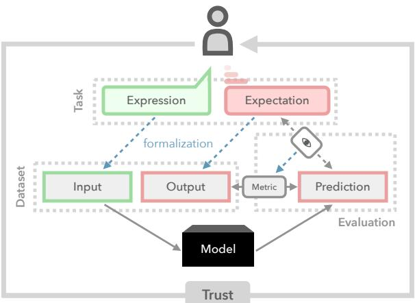

# Establishing Trustworthiness: Rethinking Tasks and Model Evaluation

Robert Litschko1,3 Max Müller-Eberstein2 Rob van der Goot2 Leon Weber1,3 Barbara Plank1,2,3

1 MaiNLP, Center for Information and Language Processing, LMU Munich, Germany 2 Department of Computer Science, IT University of Copenhagen, Denmark 3 Munich Center for Machine Learning (MCML), Munich, Germany {rlitschk, leonweber, bplank}@cis.lmu.de {mamy, robv}@itu.dk

## Abstract

Language understanding is a multi-faceted cognitive capability, which the Natural Language Processing (NLP) community has striven to model computationally for decades. Traditionally, facets of linguistic intelligence have been compartmentalized into tasks with specialized model architectures and corresponding evaluation protocols. With the advent of large language models (LLMs) the community has witnessed a dramatic shift towards general purpose, task-agnostic approaches powered by generative models. As a consequence, the traditional compartmentalized notion of language tasks is breaking down, followed by an increasing challenge for evaluation and analysis. At the same time, LLMs are being deployed in more real-world scenarios, including previously unforeseen zero-shot setups, increasing the need for trustworthy and reliable systems. Therefore, we argue that it is time to rethink what constitutes tasks and model evaluation in NLP, and pursue a more holistic view on language, placing trustworthiness at the center. Towards this goal, we review existing compartmentalized approaches for understanding the origins of a model’s functional capacity, and provide recommendations for more multifaceted evaluation protocols.

“Trust arises from knowledge of origin as well as from knowledge of functional capacity.”

Trustworthiness - Working Definition David G. Hays, 1979

## 1 Introduction

Understanding natural language requires a multitude of cognitive capabilities which act holistically to form meaning. Modeling this ability computationally is extremely difficult, thereby necessitating a compartmentalization of the problem into isolated tasks which are solvable with available methods and resources (Schlangen, 2021). Undoubtedly as of late 2022, we are witnessing a paradigm shift: Powerful LLMs, in the form of instruction-tuned, prompt-based generative models such as ChatGPT and GPT-4 (Wei et al., 2022a; Touvron et al., 2023b; Taori et al., 2023; OpenAI, 2023; Bubeck et al., 2023, inter alia), have found widespread adoption reaching far beyond the NLP community. Part of this success story is the casting of heterogeneous NLP tasks into sequence-to-sequence tasks (Raffel et al., 2020; Sanh et al., 2022; Wang et al., 2022b); which in turn enables extreme multi-task learning, and cross-task transfer learning.

  
Figure 1: Contemporary NLP Paradigm with language tasks formalized as datasets for which models produce predictions. Recent LLMs break down this compartmentalization (dashed lines), impacting all stages of the cycle. We argue that establishing trust requires rethinking every facet of this framework, as formalization and evaluation become increasingly difficult.

This is in stark contrast to the traditional compartmentalized NLP paradigm (visualized in Figure 1), wherein a human-motivated language task with an input expression and an output expectation is clearly formalized into a dataset with machinereadable inputs and outputs. Both feature design and model development are highly task-specific— often manually curated. Paired with evaluation protocols for comparing model predictions with human expectations via formalized metrics or qualitative judgement, this general methodology has been widely adopted and trusted.1 However, with contemporary LLMs this compartmentalization is breaking down—having severe impacts on all stages of the cycle. Therefore, a persistent and critical question regains importance: How can trust be established between the human and the model?

As early as 44 years ago, Hays (1979) offers an attempt and provides a definition of trustworthiness (cf. quote). Today, the topic of trustworthiness is an ongoing discussion deserving special attention (Baum et al., 2017; Eisenstein, 2022; Clarke et al., 2023). We argue that to establish trust, it is time to rethink how we deal with tasks and their evaluation. Why now? It is getting increasingly hard to predict a priori when we can expect models trained on web-scale data to work well. Were we to live in a hypothetical world with full knowledge of origin and functional capacity, then each task instance could be routed to the right model(s) to not only tap into the LLMs’ full potential, but to also enable trust in their predictions. Today, the absence of this knowledge is directly linked to our lack of trust in deploying models in real-world scenarios.

In this position paper, we synthesize contemporary work distributed throughout different subfields of NLP and ML into a conceptual framework for trust, guided by Hays (1979)’s definition and centered around knowledgefacets as a guiding principle for all aspects of the model development and evaluation cycle. We outline high-level desiderata (§2), and suggest directions on how to gain trust, by providing starting points of facets (§3) aimed to stipulate uptake and discussion. In §4 we discuss how trustworthiness relates to user trust.

## 2 Desiderata for Trustworthy LLMs

LLMs today pose a conundrum: They are seemingly universally applicable, having high functional capacity, however, the larger the model, the less we appear to know about the origins of its capabilities. How did we get here, which aspects contribute to trustworthiness, and what did we lose on the way? In the following, we aim to provide a brief history of central trust desiderata (D1-4), discussing how our knowledge of functional capacity and its origins has changed over time.

D1. Knowledge about Model Input. In the beginnings of NLP, researchers followed strict, taskspecific formalizations and had precise control over which “ingredients”2 go into model training and inference (i.e., manual feature engineering). Neural models have caused a shift towards learning representations, improving performance at the cost of interpretability. While analogy tasks (Mikolov et al., 2013) have enabled analyses of how each word-level representation is grounded, contemporary representations have moved to the subword level, and are shared across words and different languages, obscuring our knowledge of the origin of their contents, and requiring more complex lexical semantic probing (Vulic et al.´ , 2020, 2023). This is amplified in today’s instruction-based paradigm in which tasks are no longer formalized by NLP researchers and expert annotators but are formulated as natural language expressions by practitioners and end users (Ouyang et al., 2022). The cognitive process of formalizing raw model inputs into ML features has been incrementally outsourced from the human to the representation learning algorithm, during which we lose knowledge over functional capacity.

D2. Knowledge about Model Behaviour. In the old compartmentalized view of NLP, higher-level tasks are typically broken down into pipelines of subtasks (Manning et al., 2014), where inspecting intermediate outputs improves our knowledge about model behaviour. Recently however, LLMs are usually trained on complex tasks in an end-toend fashion (Glasmachers, 2017), which makes it more difficult to expose intermediate outputs and analyze error propagation. Over time we have gained powerful black-box models, but have lost the ability to interpret intermediate states and decision boundaries, thus increasing uncertainty and complexity. Because as of today, we cannot build models that always provide factually correct, up-todate information, we cannot trust to employ these models at a large scale, in real-world scenarios, where reliability and transparency are key. In this regard, pressing questions are e.g., how hallucination and memorization behaviour can be explained (Dziri et al., 2022; Mallen et al., 2023), how models behave when trained on many languages (Conneau et al., 2020; Choenni et al., 2023), what internal features are overwritten when trained on different tasks sequentially (catastrophic forgetting; e.g., McCloskey and Cohen, 1989; French, 1999), how to improve models’ ability to know when they do not know (model uncertainty; e.g., Li et al., 2022a), or how do LLMs utilize skills and knowledge distributed in their model parameters.

D3. Knowledge of Evaluation Protocols. The emergence of LLMs has raised the question of how to evaluate general-purpose models. Many recent efforts have followed the traditional NLP evaluation paradigm and summarized LLM performance into evaluation metrics across existing benchmark datasets (Sanh et al., 2022; Wang et al., 2022b; Scao et al., 2022; Wei et al., 2022a; Touvron et al., 2023a). This estimates LLM performance for tasks covered by the benchmark dataset and thus establishes trust when applying the model to the same task. However, the situation is different when LLMs are used to solve tasks outside of the benchmark, which is often the case for real-world usage of LLMs (Ouyang et al., 2022). Then, the expected performance becomes unclear and benchmark results become insufficient to establish trust. One proposal to solve this issue is to evaluate on a wide variety of task-agnostic user inputs and report an aggregate metric (Ouyang et al., 2022; Chung et al., 2022; Wang et al., 2023b; Dettmers et al., 2023). This approach has the potential to cover a wider range of use cases, however, it relies mostly on manual preference annotations from human labelers or larger LLMs which is costly and has no accepted protocol yet.

D4. Knowledge of Data Origin. So far, we discussed trust desiderata from the viewpoint of knowledge of functional capacity. Next to this, a model’s behaviour is also largely influenced by its training data. Knowledge about data provenance helps us make informed decisions about whether a given LLM is a good match for the intended use case. Therefore, open access to data must be prioritized. In compartmentalized NLP, models are trained and evaluated on well-known, manually curated, task-specific datasets. Today’s models are instead trained on task-heterogeneous corpora at web scale, typically of unknown provenance. For novel tasks, this means we do not know how well relevant facets (e.g., language, domain) are represented in the training data. For existing tasks, it is unclear if the model has seen test instances in their large training corpora (i.e., test data leakage; Piktus et al., 2023), blurring the lines between traditional train-dev-test splits and overestimating the capabilities of LLMs. To compound matters further, models are not only trained on natural, but also on generated data, and unknown data provenance is also becoming an issue as annotators start to use LLMs (Veselovsky et al., 2023). LLMs trained on data generated by other LLMs can lead to a “curse of recursion” where (im-)probable events are over/underestimated (Shumailov et al., 2023).

## 3 What Can We Do to Gain Trust Now and in Future?

In a world where generative LLMs seemingly dominate every benchmark and are claimed to have reached human-level performance on many tasks,3 we advocate that now is the time to treat trust as a first-class citizen and place it at the center of model development and evaluation. To operationalize the concept of trust, we denote with knowledge facets (henceforth, facets) all factors that improve our knowledge of functional capacity and knowledge of origin. Facets can be local (instance) or global (datasets, tasks). They refer to 1) descriptive knowledge such as meta-data or data/task provenance, and 2) inferred knowledge; for example which skills are exploited. We next propose concrete suggestions on how facets can help us gain trust in LLMs based on the desiderata in §2.

Explain Skills Required versus Skills Employed. It is instructive to think of prompt-based generative LLMs as instance-level problem solvers and, as such, we need to understand a-priori the necessary skills for solving instances (local facets) as well as knowing what skills are actually employed during inference. Most prior work aims to improve our understanding of tasks and the skills acquired to solve them by studying models trained specifically for each task, and can be broadly classified into: (i) linguistically motivated approaches and (ii) model-driven approaches (D1). Linguistic approaches formalize skills as cognitive abilities, which are studied, e.g., through probing tasks (Adi et al., 2017; Conneau et al., 2018; Amini and Ciaramita, 2023), checklists (Ribeiro et al., 2020) and linguistic profiling (Miaschi et al., 2020, 2021; Sarti et al., 2021). Model-driven approaches attribute regions in the model parameter space to skills (Ansell et al., 2022; Wang et al., 2022a; Ponti et al., 2023; Ilharco et al., 2023). The former can be seen as describing global facets (i.e., the overall functional capacity of black-box models), while the latter identifies local facets (i.e., skill regions in model parameters). To establish trust, we need to know what skills are required to solve instances, which is different from which skills are exercised by a model at inference time, as described next.

Besides knowlege about skills needed to solve a task, it is important to gain knowledge about what skills are actually being applied by an LLM. This is linked to explainability and transparency, corre sponding to (i) understanding the knowledge4 that goes into the inference process (D1), and (ii) the inference process itself in terms of applied skills (D2), e.g., examinations of LLMs’ “thought pro cesses”. Regarding (i), existing work includes at tributing training instances to model predictions (Pruthi et al., 2020; Weller et al., 2023) and ex plaining predictions through the lens of white-box models (Frosst and Hinton, 2017; Aytekin, 2022; Hedderich et al., 2022). They are, however, of ten grounded in downstream task data and thus do not provide insights connected to the knowledge memorized by LLMs during pre-training (global facets). Regarding (ii), existing approaches include guiding the generation process through intermedi ate steps (Wei et al., 2022c; Wang et al., 2023a; Li et al., 2023) and pausing the generation process to call external tools (Schick et al., 2023; Shen et al., 2023; Paranjape et al., 2023; Mialon et al., 2023). Their shortcoming is that they operate on the in put level, and similarly do not capture cases where pre-existing, model-internal knowledge is applied. Furthermore, prior work has shown that LLMs follow the path of least resistance. That is, neural networks are prone to predict the right thing for the wrong reasons (McCoy et al., 2019; Schramowski et al., 2020), which can be caused by spurious correlations (Eisenstein, 2022).5 On the path to gaining trust, we advocate for LLMs that are able to attribute their output to internal knowledge and the skills used to combine that knowledge. Alternatively, LLMs could be accompanied by white-box explanation models that (are at least a proxy) for explaining the inference process.

Facilitate Representative and Comparable Qualitative Analysis. Today, the standard target for

NLP papers proposing a new model is to beat previous models on a certain quantitative benchmark. We argue that if datasets and metrics are well-designed and well-grounded in skills/capabilities, they can be used as an indicator of progress.6 On the other hand, findings from negative results might be obscured without faceted quantitative analysis: even when obtaining lower scores on a benchmark, sub-parts of an NLP problem may be better solved compared to the baseline, but go unnoticed (D3). We therefore cannot trust reported SOTA results as long as the facets that explain how well sub-problems are solved remain hidden. Complementary to holistic quantitative explanations, as proposed by HELM (Liang et al., 2022), we call for a holistic qualitative evaluation where benchmarks come with standardized qualitative evaluation protocols, which facilitates comparable qualitative meta-analysis. This proposal is inspired by the manually-curated GLUE diagnostics annotations (Wang et al., 2018), which describe examples by their linguistic phenomena.7 Recycling existing tasks and augmenting them with diagnostic samples to study LLMs provides a very actionable direction for applying existing compartmentalization in a more targeted trustworthy way. Diagnostics samples should ideally represent the full spectrum of cognitive abilities required to solve a task. Designing these samples is however a complex task. We hypothesize that the set of required skills varies between tasks and should ideally be curated by expert annotators.

Be Explicit about Data Provenance. In ML, it is considered good practice to use stratified data splits to avoid overestimation of performance on dev/test splits based on contamination. Traditionally, this stratification was done based on, e.g., source, time, author, language (cross-lingual), or domain (cross-domain). Recent advances have hinted at LLMs’ ability to solve new tasks, and even to obtain new, i.e., emergent abilities (Wei et al., 2022b). These are in fact similar cross- settings, where is no longer a property at the level of dataset sampling, but of the broader task setup. We call for always employing a cross- setup (D4); whether it is based on data sampling, tasks, or capabilities— urging practitioners to make this choice explicit. Transparency about data provenance and test data leakage improve our trust in reported results. In practice, these data provenance facets are also valuable for identifying inferred knowledge such as estimated dataset/instance difficulty (Swayamdipta et al., 2020; Rodriguez et al., 2021; Ethayarajh et al., 2022), especially when used in conjunction with the aforementioned diagnostic facets.

Data provenance is also important when drawing conclusions from benchmark results (D3). Tedeschi et al. (2023) question the notion of superhuman performance and claims of tasks being solved (i.e., overclaiming model capabilities), and criticize how benchmark comparisons “do not incentivize a deeper understanding of the systems’ performance”. The authors discuss how external factors can cause variation in human-level performance (incl. annotation quality) and lead to unfair comparisons. Similarly, underclaiming LLMs’ capabilities also obfuscates our knowledge of their functional capacity (Bowman, 2022). Additionally, in a recent study domain experts find the accuracy of LLMs to be mixed (Peskoff and Stewart, 2023). It is therefore important to be explicit about the limitations of benchmarks (Raji et al., 2021) and faithful in communicating model capabilities. At the same time, it is an ongoing discussion whether reviewers should require (i.e, disincentivize the absence of) closed-source baseline models such as ChatGPT and GPT-4, which do not meet our trust desiderata (Rogers et al., 2023). Closed-source models that sit behind APIs typically evolve over time and have unknown data provenance, thus lacking both knowledge of origin (D4), and the consistency of its functional capacity. Consequently, they make untrustworthy baselines and should not be used as an isolated measure of progress.

## 4 Trustworthiness and User Trust

So far we have discussed different avenues for improving our knowledge about LLM’s functional capacity and origin, paving the way for establishing trustworthiness. From a user perspective it is essential to not only understand knowledge facets but also how they empirically impact user trust in a collaborative environment. This is especially important in high-risk scenarios such as in the medical and legal domain. One could argue, if LLMs such as ChatGPT are already widely adopted, do we already trust LLMs (too much)? To better understand user trust we need interdisciplinary research and user experience studies on human-AI collaboration.

Specifically, we need to know what users do with the model output across multiple interactions (e.g., verify, fact check, revise, accept). For example, González et al. (2021) investigate the connection between explanations (D2) and user trust in the context of question answering systems. In their study users are presented with explanations in different modalities and either accept (trust) or reject (don’t trust) candidate answers. Similarly, Smith-Renner et al. (2020) discuss how generated explanations can promote over-reliance or undermine user trust. A closely related question is how the faithfulness of explanations affect user trust (Atanasova et al., 2023; Chiesurin et al., 2023). For a comprehensive overview on user trust we refer to the recent survey by Bach et al. (2022).

While such controlled studies using human feedback are cost and time intensive, the minimum viable alternative for establishing trust may simply be the publication of a model’s input-output history. In contrast to standalone metrics and cherry-picked qualitative examples, access to prior predictions enables post-hoc knowledge ofmodel behaviour (D2), even without direct access to the model. This democratizes the ability to verify functional capacity and helps end users seeking to understand how well a model works for their task.

In summary, evaluating user trust is an integral part of trustworthiness and goes hand in hand with careful qualitative analyses and faceted quantitative evaluation. Towards this goal, we believe LLM development needs to be more human-centric.

## 5 Conclusions

In this position paper, we emphasize that the democratization of LLMs calls for the need to rethink tasks and model evaluation, placing trustworthiness at its center. We adopt a working definition of trustworthiness and establish desiderata required to improve our knowledge of LLMs (§2), followed by suggestions on how trust can be gained by outlining directions guided by what we call knowledge facets (§3). Finally, we draw a connection between trustworthiness as knowledge facets and user trust as means to evaluate their impact on human-AI collaboration (§4).

## Limitations

To limit the scope of this work, we did not discuss the topics of social and demographic biases (Gira et al., 2022), discrimination of minority groups (Lauscher et al., 2022) and hate speech as factors influencing our trust in LLMs. Within our proposed desiderata, this facet would fall under ‘Knowledge of Data Origin’ (§2), in terms of understanding where model-internal knowledge and the associated biases originate from (D4).

Our proposed multi-faceted evaluation protocols rely strongly on human input—either via qualitative judgements and/or linguistically annotated diagnostic benchmarks (§3). We acknowledge that such analyses require more time and resources compared to evaluation using contemporary, automatic metrics, and may slow down the overall research cycle. While we believe that slower, yet more deliberate analyses are almost exclusively beneficial to establishing trust, our minimum effort alternative of publishing all model predictions can also be used to build user trust (§4). This simple step closely mirrors the scientific method, where hypotheses must be falsifiable by anyone (Popper, 1934). Identifying even a single incorrect prediction for a similar task in a model’s prediction history, can already tell us plenty about the model’s trustworthiness.

## Acknowledgements

We thank the anonymous reviewers for their insightful comments. This research is supported by the Independent Research Fund Denmark (DFF) Sapere Aude grant 9063-00077B and ERC Consolidator Grant DIALECT 101043235.

## References

Yossi Adi, Einat Kermany, Yonatan Belinkov, Ofer Lavi, and Yoav Goldberg. 2017. Fine-grained analysis of sentence embeddings using auxiliary prediction tasks. In International Conference on Learning Representations.

Afra Amini and Massimiliano Ciaramita. 2023. Probing in context: Toward building robust classifiers via probing large language models. arXiv preprint arXiv:2305.14171.

Alan Ansell, Edoardo Ponti, Anna Korhonen, and Ivan Vulic. 2022.´ Composable sparse fine-tuning for crosslingual transfer. In Proceedings ofthe 60th Annual Meeting of the Association for Computational Linguistics (Volume 1: Long Papers), pages 1778–1796, Dublin, Ireland. Association for Computational Linguistics.

Pepa Atanasova, Oana-Maria Camburu, Christina Lioma, Thomas Lukasiewicz, Jakob Grue Simonsen, and Isabelle Augenstein. 2023. Faithfulness tests for natural language explanations. In Proceedings

of the 61st Annual Meeting of the Association for Computational Linguistics (Volume 2: Short Papers), pages 283–294, Toronto, Canada. Association for Computational Linguistics.

Caglar Aytekin. 2022. Neural networks are decision trees. arXiv preprint arXiv:2210.05189.

Tita Alissa Bach, Amna Khan, Harry Hallock, Gabriela Beltrão, and Sonia Sousa. 2022. A systematic literature review of user trust in ai-enabled systems: An hci perspective. International Journal of Human– Computer Interaction, pages 1–16.

Kevin Baum, Maximilian A. Köhl, and Eva Schmidt. 2017. Two challenges for CI trustworthiness and how to address them. In Proceedings of the 1st Workshop on Explainable Computational Intelligence (XCI 2017), Dundee, United Kingdom. Association for Computational Linguistics.

Samuel Bowman. 2022. The dangers of underclaiming: Reasons for caution when reporting how NLP systems fail. In Proceedings ofthe 60th Annual Meeting ofthe Associationfor Computational Linguistics (Volume 1: Long Papers), pages 7484–7499, Dublin, Ireland. Association for Computational Linguistics.

Sébastien Bubeck, Varun Chandrasekaran, Ronen Eldan, Johannes Gehrke, Eric Horvitz, Ece Kamar, Peter Lee, Yin Tat Lee, Yuanzhi Li, Scott Lundberg, et al. 2023. Sparks of artificial general intelligence: Early experiments with gpt-4. arXiv preprint arXiv:2303.12712.

Sabrina Chiesurin, Dimitris Dimakopoulos, Marco Antonio Sobrevilla Cabezudo, Arash Eshghi, Ioannis Papaioannou, Verena Rieser, and Ioannis Konstas. 2023. The dangers of trusting stochastic parrots: Faithfulness and trust in open-domain conversational question answering. In Findings of the Association for Computational Linguistics: ACL 2023, pages 947– 959, Toronto, Canada. Association for Computational Linguistics.

Rochelle Choenni, Dan Garrette, and Ekaterina Shutova. 2023. How do languages influence each other? studying cross-lingual data sharing during llm fine-tuning. arXiv preprint arXiv:2305.13286.

Hyung Won Chung, Le Hou, Shayne Longpre, Barret Zoph, Yi Tay, William Fedus, Eric Li, Xuezhi Wang, Mostafa Dehghani, Siddhartha Brahma, Albert Webson, Shixiang Shane Gu, Zhuyun Dai, Mirac Suzgun, Xinyun Chen, Aakanksha Chowdhery, Sharan Narang, Gaurav Mishra, Adams Yu, Vincent Y. Zhao, Yanping Huang, Andrew M. Dai, Hongkun Yu, Slav Petrov, Ed H. Chi, Jeff Dean, Jacob Devlin, Adam Roberts, Denny Zhou, Quoc V. Le, and Jason Wei. 2022. Scaling instruction-finetuned language models. CoRR, abs/2210.11416.

Charles LA Clarke, Gianluca Demartini, Laura Dietz, Guglielmo Faggioli, Matthias Hagen, Claudia Hauff, Noriko Kando, Evangelos Kanoulas, Martin Potthast,

Ian Soboroff, et al. 2023. 4.2 hmc: A spectrum of human–machine-collaborative relevance judgment frameworks. Frontiers ofInformation Access Experimentationfor Research and Education, page 41.

Alexis Conneau, Kartikay Khandelwal, Naman Goyal, Vishrav Chaudhary, Guillaume Wenzek, Francisco Guzmán, Edouard Grave, Myle Ott, Luke Zettlemoyer, and Veselin Stoyanov. 2020. Unsupervised cross-lingual representation learning at scale. In Proceedings of the 58th Annual Meeting of the Associationfor Computational Linguistics, pages 8440– 8451, Online. Association for Computational Linguistics.

Alexis Conneau, German Kruszewski, Guillaume Lample, Loïc Barrault, and Marco Baroni. 2018. What you can cram into a single \$&!#\* vector: Probing sentence embeddings for linguistic properties. In Proceedings of the 56th Annual Meeting of the Associationfor Computational Linguistics (Volume 1: Long Papers), pages 2126–2136, Melbourne, Australia. Association for Computational Linguistics.

Maxime De Bruyn, Ehsan Lotfi, Jeska Buhmann, and Walter Daelemans. 2022. 20Q: Overlap-free world knowledge benchmark for language models. In Proceedings of the 2nd Workshop on Natural Language Generation, Evaluation, and Metrics (GEM), pages 494–508, Abu Dhabi, United Arab Emirates (Hybrid). Association for Computational Linguistics.

Nicola De Cao, Wilker Aziz, and Ivan Titov. 2021. Editing factual knowledge in language models. In Proceedings ofthe 2021 Conference on Empirical Methods in Natural Language Processing, pages 6491– 6506, Online and Punta Cana, Dominican Republic. Association for Computational Linguistics.

Tim Dettmers, Artidoro Pagnoni, Ari Holtzman, and Luke Zettlemoyer. 2023. Qlora: Efficient finetuning of quantized llms. CoRR, abs/2305.14314.

Nouha Dziri, Sivan Milton, Mo Yu, Osmar Zaiane, and Siva Reddy. 2022. On the origin of hallucinations in conversational models: Is it the datasets or the models? In Proceedings ofthe 2022 Conference of the North American Chapter ofthe Associationfor Computational Linguistics: Human Language Technologies, pages 5271–5285, Seattle, United States. Association for Computational Linguistics.

Jacob Eisenstein. 2022. Informativeness and invariance: Two perspectives on spurious correlations in natural language. In Proceedings ofthe 2022 Conference of the North American Chapter of the Association for Computational Linguistics: Human Language Technologies, pages 4326–4331, Seattle, United States. Association for Computational Linguistics.

Kawin Ethayarajh, Yejin Choi, and Swabha Swayamdipta. 2022. Understanding dataset difficulty with -usable information. In Proceedings Vof the 39th International Conference on Machine Learning, volume 162 of Proceedings of Machine Learning Research, pages 5988–6008. PMLR.

Robert M French. 1999. Catastrophic forgetting in connectionist networks. Trends in cognitive sciences, 3(4):128–135.

Nicholas Frosst and Geoffrey Hinton. 2017. Distilling a neural network into a soft decision tree. arXiv preprint arXiv:1711.09784.

Michael Gira, Ruisu Zhang, and Kangwook Lee. 2022. Debiasing pre-trained language models via efficient fine-tuning. In Proceedings of the Second Workshop on Language Technologyfor Equality, Diversity and Inclusion, pages 59–69, Dublin, Ireland. Association for Computational Linguistics.

Tobias Glasmachers. 2017. Limits of end-to-end learning. In Asian conference on machine learning, pages 17–32. PMLR.

Ana Valeria González, Gagan Bansal, Angela Fan, Yashar Mehdad, Robin Jia, and Srinivasan Iyer. 2021. Do explanations help users detect errors in opendomain QA? an evaluation of spoken vs. visual explanations. In Findings ofthe Associationfor Computational Linguistics: ACL-IJCNLP 2021, pages 1103–1116, Online. Association for Computational Linguistics.

David G. Hays. 1979. Applications. In 17th Annual Meeting of the Association for Computational Linguistics, pages 89–89, La Jolla, California, USA. Association for Computational Linguistics.

Michael A Hedderich, Jonas Fischer, Dietrich Klakow, and Jilles Vreeken. 2022. Label-descriptive patterns and their application to characterizing classification errors. In International Conference on Machine Learning, pages 8691–8707. PMLR.

Gabriel Ilharco, Marco Tulio Ribeiro, Mitchell Wortsman, Ludwig Schmidt, Hannaneh Hajishirzi, and Ali Farhadi. 2023. Editing models with task arithmetic. In The Eleventh International Conference on Learning Representations.

Anne Lauscher, Federico Bianchi, Samuel R. Bowman, and Dirk Hovy. 2022. SocioProbe: What, when, and where language models learn about sociodemographics. In Proceedings ofthe 2022 Conference on Empirical Methods in Natural Language Processing, pages 7901–7918, Abu Dhabi, United Arab Emirates. Association for Computational Linguistics.

Dongfang Li, Baotian Hu, and Qingcai Chen. 2022a. Calibration meets explanation: A simple and effective approach for model confidence estimates. In Proceedings of the 2022 Conference on Empirical Methods in Natural Language Processing, pages 2775– 2784, Abu Dhabi, United Arab Emirates. Association for Computational Linguistics.

Xiang Lorraine Li, Adhiguna Kuncoro, Jordan Hoffmann, Cyprien de Masson d’Autume, Phil Blunsom, and Aida Nematzadeh. 2022b. A systematic investigation of commonsense knowledge in large language models. In Proceedings of the 2022 Conference on

Empirical Methods in Natural Language Processing, pages 11838–11855, Abu Dhabi, United Arab Emirates. Association for Computational Linguistics.

Xingxuan Li, Ruochen Zhao, Yew Ken Chia, Bosheng Ding, Lidong Bing, Shafiq Joty, and Soujanya Poria. 2023. Chain of knowledge: A framework for grounding large language models with structured knowledge bases. arXiv preprint arXiv:2305.13269.

Percy Liang, Rishi Bommasani, Tony Lee, Dimitris Tsipras, Dilara Soylu, Michihiro Yasunaga, Yian Zhang, Deepak Narayanan, Yuhuai Wu, Ananya Kumar, et al. 2022. Holistic evaluation of language models. arXiv preprint arXiv:2211.09110.

Alex Mallen, Akari Asai, Victor Zhong, Rajarshi Das, Daniel Khashabi, and Hannaneh Hajishirzi. 2023. When not to trust language models: Investigating effectiveness of parametric and non-parametric memories. In Proceedings of the 61st Annual Meeting of the Associationfor Computational Linguistics (Volume 1: Long Papers), pages 9802–9822, Toronto, Canada. Association for Computational Linguistics.

Christopher Manning, Mihai Surdeanu, John Bauer, Jenny Finkel, Steven Bethard, and David McClosky. 2014. The Stanford CoreNLP natural language processing toolkit. In Proceedings of52nd Annual Meeting of the Association for Computational Linguistics: System Demonstrations, pages 55–60, Baltimore, Maryland. Association for Computational Linguistics.

Michael McCloskey and Neal J Cohen. 1989. Catastrophic interference in connectionist networks: The sequential learning problem. In Psychology oflearning and motivation, volume 24, pages 109–165. Elsevier.

Tom McCoy, Ellie Pavlick, and Tal Linzen. 2019. Right for the wrong reasons: Diagnosing syntactic heuristics in natural language inference. In Proceedings of the 57th Annual Meeting of the Association for Computational Linguistics, pages 3428–3448, Florence, Italy. Association for Computational Linguistics.

Grégoire Mialon, Roberto Dessì, Maria Lomeli, Christoforos Nalmpantis, Ram Pasunuru, Roberta Raileanu, Baptiste Rozière, Timo Schick, Jane Dwivedi-Yu, Asli Celikyilmaz, et al. 2023. Augmented language models: a survey. arXiv preprint arXiv:2302.07842.

Alessio Miaschi, Dominique Brunato, Felice Dell’Orletta, and Giulia Venturi. 2020. Linguistic profiling of a neural language model. In Proceedings of the 28th International Conference on Computational Linguistics, pages 745–756, Barcelona, Spain (Online). International Committee on Computational Linguistics.

Alessio Miaschi, Dominique Brunato, Felice Dell’Orletta, and Giulia Venturi. 2021. What makes my model perplexed? a linguistic investigation on neural language models perplexity. In

Proceedings ofDeep Learning Inside Out (DeeLIO): The 2nd Workshop on Knowledge Extraction and Integration for Deep Learning Architectures, pages 40–47, Online. Association for Computational Linguistics.

Tomas Mikolov, Wen-tau Yih, and Geoffrey Zweig. 2013. Linguistic regularities in continuous space word representations. In Proceedings of the 2013 Conference of the North American Chapter of the Association for Computational Linguistics: Human Language Technologies, pages 746–751, Atlanta, Georgia. Association for Computational Linguistics.

R OpenAI. 2023. Gpt-4 technical report. arXiv, pages 2303–08774.

Long Ouyang, Jeffrey Wu, Xu Jiang, Diogo Almeida, Carroll L. Wainwright, Pamela Mishkin, Chong Zhang, Sandhini Agarwal, Katarina Slama, Alex Ray, John Schulman, Jacob Hilton, Fraser Kelton, Luke Miller, Maddie Simens, Amanda Askell, Peter Welinder, Paul F. Christiano, Jan Leike, and Ryan Lowe. 2022. Training language models to follow instructions with human feedback. In NeurIPS.

Bhargavi Paranjape, Scott Lundberg, Sameer Singh, Hannaneh Hajishirzi, Luke Zettlemoyer, and Marco Tulio Ribeiro. 2023. Art: Automatic multistep reasoning and tool-use for large language models. arXiv preprint arXiv:2303.09014.

Denis Peskoff and Brandon Stewart. 2023. Credible without credit: Domain experts assess generative language models. In Proceedings of the 61st Annual Meeting of the Association for Computational Linguistics (Volume 2: Short Papers), pages 427–438, Toronto, Canada. Association for Computational Linguistics.

Aleksandra Piktus, Christopher Akiki, Paulo Villegas, Hugo Laurençon, Gérard Dupont, Alexandra Sasha Luccioni, Yacine Jernite, and Anna Rogers. 2023. The roots search tool: Data transparency for llms. arXiv preprint arXiv:2302.14035.

Edoardo Maria Ponti, Alessandro Sordoni, Yoshua Bengio, and Siva Reddy. 2023. Combining parameterefficient modules for task-level generalisation. In Proceedings of the 17th Conference of the European Chapter of the Association for Computational Linguistics, pages 687–702, Dubrovnik, Croatia. Association for Computational Linguistics.

Karl Popper. 1934. Karl Popper: Logik der Forschung. Mohr Siebeck, Tübingen, Germany.

Garima Pruthi, Frederick Liu, Satyen Kale, and Mukund Sundararajan. 2020. Estimating training data influence by tracing gradient descent. Advances in Neural Information Processing Systems, 33:19920–19930.

Colin Raffel, Noam Shazeer, Adam Roberts, Katherine Lee, Sharan Narang, Michael Matena, Yanqi Zhou, Wei Li, and Peter J Liu. 2020. Exploring the limits

of transfer learning with a unified text-to-text transformer. The Journal ofMachine Learning Research, 21(1):5485–5551.

Deborah Raji, Emily Denton, Emily M. Bender, Alex Hanna, and Amandalynne Paullada. 2021. Ai and the everything in the whole wide world benchmark. In Proceedings of the Neural Information Processing Systems Track on Datasets and Benchmarks, volume 1. Curran.

Marco Tulio Ribeiro, Tongshuang Wu, Carlos Guestrin, and Sameer Singh. 2020. Beyond accuracy: Behavioral testing of NLP models with CheckList. In Proceedings ofthe 58th Annual Meeting ofthe Associationfor Computational Linguistics, pages 4902– 4912, Online. Association for Computational Linguistics.

Pedro Rodriguez, Joe Barrow, Alexander Miserlis Hoyle, John P. Lalor, Robin Jia, and Jordan Boyd-Graber. 2021. Evaluation examples are not equally informative: How should that change NLP leaderboards? In Proceedings of the 59th Annual Meeting ofthe Associationfor Computational Linguistics and the 11th International Joint Conference on Natural Language Processing (Volume 1: Long Papers), pages 4486–4503, Online. Association for Computational Linguistics.

Anna Rogers, Niranjan Balasubramanian, Leon Derczynski, Jesse Dodge, Alexander Koller, Sasha Luccioni, Maarten Sap, Roy Schwartz, Noah A Smith, and Emma Strubell. 2023. Closed ai models make bad baselines.

Daniel Ruffinelli, Samuel Broscheit, and Rainer Gemulla. 2020. You can teach an old dog new tricks! on training knowledge graph embeddings. In International Conference on Learning Representations.

Victor Sanh, Albert Webson, Colin Raffel, Stephen H. Bach, Lintang Sutawika, Zaid Alyafeai, Antoine Chaffin, Arnaud Stiegler, Arun Raja, Manan Dey, M Saiful Bari, Canwen Xu, Urmish Thakker, Shanya Sharma Sharma, Eliza Szczechla, Taewoon Kim, Gunjan Chhablani, Nihal V. Nayak, Debajyoti Datta, Jonathan Chang, Mike Tian-Jian Jiang, Han Wang, Matteo Manica, Sheng Shen, Zheng Xin Yong, Harshit Pandey, Rachel Bawden, Thomas Wang, Trishala Neeraj, Jos Rozen, Abheesht Sharma, Andrea Santilli, Thibault Févry, Jason Alan Fries, Ryan Teehan, Teven Le Scao, Stella Biderman, Leo Gao, Thomas Wolf, and Alexander M. Rush. 2022. Multitask prompted training enables zero-shot task generalization. In The Tenth International Conference on Learning Representations, ICLR 2022, Virtual Event, April 25-29, 2022. OpenReview.net.

Gabriele Sarti, Dominique Brunato, and Felice Dell’Orletta. 2021. That looks hard: Characterizing linguistic complexity in humans and language models. In Proceedings of the Workshop on Cognitive Modeling and Computational Linguistics, pages 48–60, Online. Association for Computational Linguistics.

Teven Le Scao, Angela Fan, Christopher Akiki, Ellie Pavlick, Suzana Ilic, Daniel Hesslow, Roman Castagné, Alexandra Sasha Luccioni, François Yvon, Matthias Gallé, Jonathan Tow, Alexander M. Rush, Stella Biderman, Albert Webson, Pawan Sasanka Ammanamanchi, Thomas Wang, Benoît Sagot, Niklas Muennighoff, Albert Villanova del Moral, Olatunji Ruwase, Rachel Bawden, Stas Bekman, Angelina McMillan-Major, Iz Beltagy, Huu Nguyen, Lucile Saulnier, Samson Tan, Pedro Ortiz Suarez, Victor Sanh, Hugo Laurençon, Yacine Jernite, Julien Launay, Margaret Mitchell, Colin Raffel, Aaron Gokaslan, Adi Simhi, Aitor Soroa, Alham Fikri Aji, Amit Alfassy, Anna Rogers, Ariel Kreisberg Nitzav, Canwen Xu, Chenghao Mou, Chris Emezue, Christopher Klamm, Colin Leong, Daniel van Strien, David Ifeoluwa Adelani, and et al. 2022. BLOOM: A 176b-parameter open-access multilingual language model. CoRR, abs/2211.05100.

Timo Schick, Jane Dwivedi-Yu, Roberto Dessì, Roberta Raileanu, Maria Lomeli, Luke Zettlemoyer, Nicola Cancedda, and Thomas Scialom. 2023. Toolformer: Language models can teach themselves to use tools. arXiv preprint arXiv:2302.04761.

David Schlangen. 2021. Targeting the benchmark: On methodology in current natural language processing research. In Proceedings of the 59th Annual Meeting of the Association for Computational Linguistics and the 11th International Joint Conference on Natural Language Processing (Volume 2: Short Papers), pages 670–674, Online. Association for Computational Linguistics.

Patrick Schramowski, Wolfgang Stammer, Stefano Teso, Anna Brugger, Franziska Herbert, Xiaoting Shao, Hans-Georg Luigs, Anne-Katrin Mahlein, and Kristian Kersting. 2020. Making deep neural networks right for the right scientific reasons by interacting with their explanations. Nature Machine Intelligence, 2(8):476–486.

Yongliang Shen, Kaitao Song, Xu Tan, Dongsheng Li, Weiming Lu, and Yueting Zhuang. 2023. Hugginggpt: Solving ai tasks with chatgpt and its friends in huggingface. arXiv preprint arXiv:2303.17580.

Ilia Shumailov, Zakhar Shumaylov, Yiren Zhao, Yarin Gal, Nicolas Papernot, and Ross Anderson. 2023. The curse of recursion: Training on generated data makes models forget. arXiv preprint arxiv:2305.17493.

Alison Smith-Renner, Ron Fan, Melissa Birchfield, Tongshuang Wu, Jordan Boyd-Graber, Daniel S Weld, and Leah Findlater. 2020. No explainability without accountability: An empirical study of explanations and feedback in interactive ml. In Proceedings of the 2020 CHI Conference on Human Factors in Computing Systems, pages 1–13.

Swabha Swayamdipta, Roy Schwartz, Nicholas Lourie, Yizhong Wang, Hannaneh Hajishirzi, Noah A. Smith, and Yejin Choi. 2020. Dataset cartography: Mapping

and diagnosing datasets with training dynamics. In Proceedings of the 2020 Conference on Empirical Methods in Natural Language Processing (EMNLP), pages 9275–9293, Online. Association for Computational Linguistics.

Rohan Taori, Ishaan Gulrajani, Tianyi Zhang, Yann Dubois, Xuechen Li, Carlos Guestrin, Percy Liang, and Tatsunori B Hashimoto. 2023. Alpaca: A strong, replicable instruction-following model. Stanford Center for Research on Foundation Models. https://crfm. stanford. edu/2023/03/13/alpaca. html, 3(6):7.

Simone Tedeschi, Johan Bos, Thierry Declerck, Jan Hajic, Daniel Hershcovich, Eduard Hovy, Alexan-ˇ der Koller, Simon Krek, Steven Schockaert, Rico Sennrich, Ekaterina Shutova, and Roberto Navigli. 2023. What’s the meaning of superhuman performance in today’s NLU? In Proceedings ofthe 61st Annual Meeting of the Association for Computational Linguistics (Volume 1: Long Papers), pages 12471– 12491, Toronto, Canada. Association for Computational Linguistics.

Hugo Touvron, Thibaut Lavril, Gautier Izacard, Xavier Martinet, Marie-Anne Lachaux, Timothée Lacroix, Baptiste Rozière, Naman Goyal, Eric Hambro, Faisal Azhar, Aurélien Rodriguez, Armand Joulin, Edouard Grave, and Guillaume Lample. 2023a. Llama: Open and efficient foundation language models. CoRR, abs/2302.13971.

Hugo Touvron, Thibaut Lavril, Gautier Izacard, Xavier Martinet, Marie-Anne Lachaux, Timothée Lacroix, Baptiste Rozière, Naman Goyal, Eric Hambro, Faisal Azhar, et al. 2023b. Llama: Open and efficient foundation language models. arXiv preprint arXiv:2302.13971.

Veniamin Veselovsky, Manoel Horta Ribeiro, and Robert West. 2023. Artificial artificial artificial intelligence: Crowd workers widely use large language models for text production tasks. arXiv preprint arXiv:2306.07899.

Ivan Vulic, Goran Glavaš, Fangyu Liu, Nigel Collier,´ Edoardo Maria Ponti, and Anna Korhonen. 2023. Probing cross-lingual lexical knowledge from multilingual sentence encoders. In Proceedings of the 17th Conference of the European Chapter of the Associationfor Computational Linguistics, pages 2081– 2097, Dubrovnik, Croatia. Association for Computational Linguistics.

Ivan Vulic, Edoardo Maria Ponti, Robert Litschko,´ Goran Glavaš, and Anna Korhonen. 2020. Probing pretrained language models for lexical semantics. In Proceedings of the 2020 Conference on Empirical Methods in Natural Language Processing (EMNLP), pages 7222–7240, Online. Association for Computational Linguistics.

Alex Wang, Amanpreet Singh, Julian Michael, Felix Hill, Omer Levy, and Samuel Bowman. 2018. GLUE:

A multi-task benchmark and analysis platform for natural language understanding. In Proceedings of the 2018 EMNLP Workshop BlackboxNLP: Analyzing and Interpreting Neural Networks for NLP, pages 353–355, Brussels, Belgium. Association for Computational Linguistics.

Xiaozhi Wang, Kaiyue Wen, Zhengyan Zhang, Lei Hou, Zhiyuan Liu, and Juanzi Li. 2022a. Finding skill neurons in pre-trained transformer-based language models. In Proceedings ofthe 2022 Conference on Empirical Methods in Natural Language Processing, pages 11132–11152, Abu Dhabi, United Arab Emirates. Association for Computational Linguistics.

Xuezhi Wang, Jason Wei, Dale Schuurmans, Quoc V Le, Ed H. Chi, Sharan Narang, Aakanksha Chowdhery, and Denny Zhou. 2023a. Self-consistency improves chain of thought reasoning in language models. In The Eleventh International Conference on Learning Representations.

Yizhong Wang, Hamish Ivison, Pradeep Dasigi, Jack Hessel, Tushar Khot, Khyathi Raghavi Chandu, David Wadden, Kelsey MacMillan, Noah A. Smith, Iz Beltagy, and Hannaneh Hajishirzi. 2023b. How far can camels go? exploring the state of instruction tuning on open resources. CoRR, abs/2306.04751.

Yizhong Wang, Swaroop Mishra, Pegah Alipoormolabashi, Yeganeh Kordi, Amirreza Mirzaei, Atharva Naik, Arjun Ashok, Arut Selvan Dhanasekaran, Anjana Arunkumar, David Stap, Eshaan Pathak, Giannis Karamanolakis, Haizhi Lai, Ishan Purohit, Ishani Mondal, Jacob Anderson, Kirby Kuznia, Krima Doshi, Kuntal Kumar Pal, Maitreya Patel, Mehrad Moradshahi, Mihir Parmar, Mirali Purohit, Neeraj Varshney, Phani Rohitha Kaza, Pulkit Verma, Ravsehaj Singh Puri, Rushang Karia, Savan Doshi, Shailaja Keyur Sampat, Siddhartha Mishra, Sujan Reddy A, Sumanta Patro, Tanay Dixit, and Xudong Shen. 2022b. Super-NaturalInstructions: Generalization via declarative instructions on 1600+ NLP tasks. In Proceedings of the 2022 Conference on Empirical Methods in Natural Language Processing, pages 5085–5109, Abu Dhabi, United Arab Emirates. Association for Computational Linguistics.

Jason Wei, Maarten Bosma, Vincent Y. Zhao, Kelvin Guu, Adams Wei Yu, Brian Lester, Nan Du, Andrew M. Dai, and Quoc V. Le. 2022a. Finetuned language models are zero-shot learners. In The Tenth International Conference on Learning Representations, ICLR 2022, Virtual Event, April 25-29, 2022. OpenReview.net.

Jason Wei, Yi Tay, Rishi Bommasani, Colin Raffel, Barret Zoph, Sebastian Borgeaud, Dani Yogatama, Maarten Bosma, Denny Zhou, Donald Metzler, Ed H. Chi, Tatsunori Hashimoto, Oriol Vinyals, Percy Liang, Jeff Dean, and William Fedus. 2022b. Emergent abilities of large language models. Transactions on Machine Learning Research. Survey Certification.

Jason Wei, Xuezhi Wang, Dale Schuurmans, Maarten Bosma, brian ichter, Fei Xia, Ed H. Chi, Quoc V Le, and Denny Zhou. 2022c. Chain of thought prompting elicits reasoning in large language models. In Advances in Neural Information Processing Systems.

Orion Weller, Marc Marone, Nathaniel Weir, Dawn Lawrie, Daniel Khashabi, and Benjamin Van Durme. 2023. " according to..." prompting language models improves quoting from pre-training data. arXiv preprint arXiv:2305.13252.