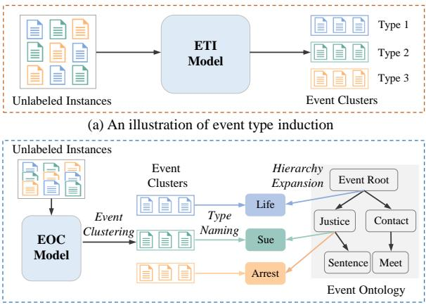
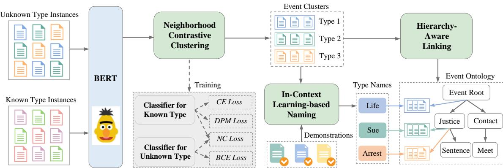
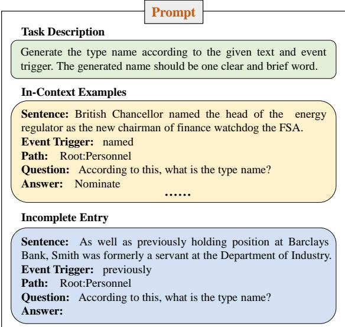
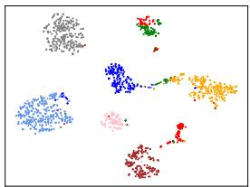
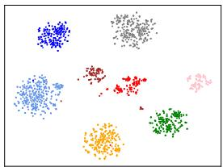
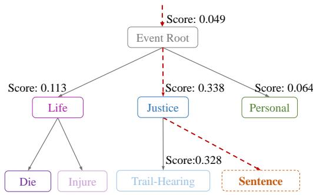
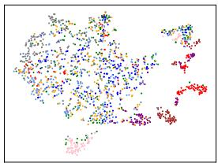
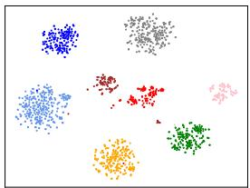

# Event Ontology Completion with Hierarchical Structure Evolution Networks

Pengfei Cao1,2, Yupu Hao1,2, Yubo Chen1,2∗, Kang Liu1,2, Jiexin Xu3, Huaijun Li3, Xiaojian Jiang3, Jun Zhao1,2

1 The Laboratory of Cognition and Decision Intelligence for Complex Systems, Institute of Automation, Chinese Academy of Sciences, Beijing, China

2 School of Artificial Intelligence, University of Chinese Academy of Sciences, Beijing, China 3 China Merchants Bank

{pengfei.cao, yubo.chen, kliu, jzhao}@nlpr.ia.ac.cn, haoyupu2023@ia.ac.cn

## Abstract

Traditional event detection methods require predefined event schemas. However, manually defining event schemas is expensive and the coverage of schemas is limited. To this end, some works study the event type induction (ETI) task, which discovers new event types via clustering. However, the setting of ETI suffers from two limitations: event types are not linked into the existing hierarchy and have no semantic names. In this paper, we propose a new research task named Event Ontology Completion (EOC), which aims to simultaneously achieve event clustering, hierarchy expansion and type naming. Furthermore, we develop a HierarchicAL STructure EvOlution Network (HALTON) for this new task. Specifically, we first devise a Neighborhood Contrastive Clustering module to cluster unlabeled event instances. Then, we propose a Hierarchy-Aware Linking module to incorporate the hierarchical information for event expansion. Finally, we generate meaningful names for new types via an In-Context Learning-based Naming module. Extensive experiments indicate that our method achieves the best performance, outperforming the baselines by 8.23%, 8.79% and 8.10% of ARI score on three datasets1.

## 1 Introduction

Automated real-world event detection is a crucial task towards mining fast-evolving event knowledge. Existing methods (Ji and Grishman, 2008; Chen et al., 2015; Du and Cardie, 2020; Wang et al., 2022) typically require a pre-defined event schema along with massive human-labeled data for model learning. Despite the tremendous success, manually defining an event schema is especially expensive and labor-intensive, which requires experts to examine amounts of raw data in advance to specify potential event types. Besides, as new events are happening every day (Cao et al., 2020; Yu et al., 2021; Liu et al., 2022a), it is neither realistic nor scalable to define all event schemas in advance.

  
(b) An illustration of event ontology completion  
Figure 1: (a) Event type induction only clusters unlabeled event instances into several groups. (b) Event ontology completion not only discovers new event types, but also adds them into the existing event hierarchy and generates meaningful names for them.

To get rid of the above problems, some researchers study the task of event type induction (ETI), which aims to discover new event types from an input corpus (Yuan et al., 2018; Huang and Ji, 2020; Shen et al., 2021). The task is generally formulated as a clustering problem, where each cluster represents an event type (cf. Figure 1(a)). Existing methods typically utilize probabilistic generative models (Chambers, 2013; Nguyen et al., 2015), adhoc clustering algorithms (Sekine, 2006; Huang et al., 2016) or neural networks (Huang and Ji, 2020; Shen et al., 2021; Li et al., 2022) to induce event clusters. Despite these successful efforts for clustering, the ETI setting inevitably suffers from two limitations in real applications:

Event types are not linked into the existing hierarchy: These methods only divide unlabeled event instances into several isolated clusters, without linking newly discovered types to an existing event ontology (i.e., an event hierarchy)2. Some studies about human cognition find that people tend to organize real-world events in a hierarchical way (Burt et al., 2003; Tenenbaum et al., 2011), ranging from coarse-grained (i.e., top-level) events to finegrained (i.e., bottom-level) events. Moreover, the ontologies of most knowledge bases also adopt hierarchical organization forms of event types (Baker et al., 1998; Kingsbury and Palmer, 2003). The hierarchical forms represent events at different granularity and abstraction levels, which helps people quickly understand related scenarios. For example, according to the event hierarchy in Figure 1(b), we can easily gain the overall picture of the Justice scenario, which may involve multiple events, such as Sue, Arrest and Sentence. Therefore, it is very necessary to establish and maintain the event hierarchy. However, since new events emerge rapidly and incessantly, it is impractical to manually add newly discovered types into the event ontology. Therefore, how to automatically expand the existing event hierarchy with new event types is an important problem.

Event types have no semantic names: Most ETI methods only assign numbers (i.e., type number) to the new event types, and lack the ability to generate human-readable type names. To enable new event types to be used in downstream tasks, it is inevitable to assign meaningful names for them in advance. For example, the event type name is required for training event extraction models (Li et al., 2021b) and constructing event knowledge graphs (Ma et al., 2022). Although the event type name is important, previous studies only focus on event clustering and ignore the type naming (Huang et al., 2016; Huang and Ji, 2020; Shen et al., 2021). As a result, the discovered event types cannot be directly applied to downstream applications, and extra human efforts are needed to conduct secondary labeling for the new types. Thus, how to automatically generate meaningful names for new event types is also a problem worth exploring.

In the light of the above restrictions, we propose a new task named Event Ontology Completion (EOC). Given a set of unlabeled event instances, the task requires that the model simultaneously achieves the following goals: (1) Event Clustering: dividing the unlabeled instances into several clusters; (2) Hierarchy Expansion: linking new event types (i.e., predicted clusters) into an existing event hierarchy; and (3) Type Naming: generating semantically meaningful names for new event types. As shown in Figure 1(b), the EOC model aims to divide the unlabeled instances into three clusters, and link the clusters to the Root and Justice node of the event hierarchy. Meanwhile, the three new event types are named Life, Sue and Arrest, respectively. Compared to ETI, EOC requires models to complete the event ontology, instead of only event clustering. Therefore, the proposed task is more useful and practical, but it is also more challenging.

To this end, we propose a novel method named HierarchicAL STructure EvOlution Network (HALTON) for this new task. Concretely, we first devise a Neighborhood Contrastive Clustering module for event clustering. The module utilizes a neighborhood contrastive loss to boost clustering for both supervised and unsupervised data. Intuitively, in a semantic feature space, neighboring instances should have a similar type, and pulling them together makes clusters more compact. Then, we propose a Hierarchy-Aware Linking module for hierarchy expansion. The module uses a dynamic path-based margin loss to integrate the hierarchical information into event representations. Compared with the static margin, the dynamic margin can capture the semantic similarities of event types in the hierarchy, which is conducive to hierarchy expansion. Finally, we design an In-Context Learningbased Naming module for type naming. The module elicits the abstraction ability of large language models (LLMs) via in-context learning to generate human-readable names for discovered event types. Extensive experiments on three datasets show that our proposed method brings significant improvements over baselines.

To summarize, our contributions are: (1) As a seminal study, we propose a new research task named event ontology completion, and introduce baselines and evaluation metrics for three task settings, including event clustering, hierarchy expansion and type naming. (2) We devise a novel method named Hierarchical Structure Evolution Network (HALTON), which achieves task goals via the collaboration of three components, namely neighborhood contrastive clustering, hierarchyaware linking and in-context learning-based naming. It can serve as a strong baseline for the research on the task. (3) Experimental results indicate that our method substantially outperforms baselines, achieving 8.23%, 8.79% and 8.10% improvements of ARI score on three datasets.

## 2 Task Formulation

The EOC task assumes that there is an incomplete event ontology $\tau ,$ which is constructed by experts in advance. The ontology is a tree-like structure, where leaf nodes denote known event types. Given an unlabeled dataset ${ \mathcal { D } } ^ { u } = \{ x _ { i } ^ { u } \} _ { i = 1 } ^ { M }$ and an estimated number of unknown types $M _ { u }$ , the goals of EOC include: (1) Event Clustering, dividing the unlabeled instances into $M _ { u }$ groups; (2) Hierarchy Expansion, linking each cluster to the corresponding position of the hierarchy $\tau { : }$ and (3) Type Naming, generating a human-readable name for each cluster . Following Li et al. (2022), we use golden triggers for event clustering3. To enable the model to achieve the above goals, we leverage a labeled dataset $\mathbf { \mathcal { D } } ^ { l } = \{ ( x _ { i } ^ { l } , y _ { i } ^ { l } ) \bar  \} _ { i = 1 } ^ { N }$ to assist model learning. The types set of the labeled dataset is denoted as $\mathcal { V } ^ { l }$ . The event types in $\mathcal { V } ^ { l }$ belong to known types, which correspond to the leaf nodes of the event ontology $\tau .$

## 3 Methodology

Figure 2 shows the overall architecture of HAL-TON, which consists of three major components: (1) Neighborhood Contrastive Clustering ( 3.1), which learns discriminative representations for event clustering; (2) Hierarchy-Aware Linking ( 3.2), which attaches newly discovered event types to the existing event hierarchy; and (3) In-Context Learning-based Naming ( 3.3), which generates event type names via in-context learning. We will illustrate each component in detail.

## 3.1 Neighborhood Contrastive Clustering

Encoding Instances Given the impressive performance of pre-trained language models on various NLP tasks (Sun et al., 2022; Zhao et al., 2023), we utilize BERT (Devlin et al., 2019) to encode input sentences. Since the trigger may contain multiple tokens, we conduct a max-pooling operation over

BERT outputs to obtain the event representation:

$$
\begin{array} { r l } & { \boldsymbol { h } _ { 1 } , \ldots , \boldsymbol { h } _ { n } = \mathrm { B E R T } ( \boldsymbol { x } ) } \\ & { \boldsymbol { h } = \mathrm { M a x } \mathrm { - P o o l i n g } ( \boldsymbol { h } _ { s } , \ldots , \boldsymbol { h } _ { e } ) , } \end{array}\tag{1}
$$

where x denotes the input sentence. n is the length of the input sentence. s and e represent the start and end positions of the trigger, respectively.

Base Losses In this way, we obtain the event representations of labeled and unlabeled instances, denoted as $\{ h _ { i } ^ { l } \} _ { i = 1 } ^ { N }$ and $\{ h _ { j } ^ { u } \} _ { j = 1 } ^ { M }$ , respectively. We feed the representations of labeled instances into a softmax function for prediction, and utilize the cross-entropy loss to train the model:

$$
\mathcal { L } _ { c e } = - \frac { 1 } { N } \sum _ { i = 1 } ^ { N } \pmb { y } _ { i } ^ { l } \cdot \log ( \mathrm { s o f t m a x } ( \pmb { h } _ { i } ^ { l } ) ) ,\tag{2}
$$

where $\mathbf { \Delta } y _ { i } ^ { l }$ is a one-hot vector representing the golden label of the instance $x _ { i } ^ { l }$ . For unlabeled instances, we use the K-means algorithm to obtain their pseudo labels:

$$
\hat { y } ^ { u } = \mathrm { K - m e a n s } ( h ^ { u } ) \in \{ 1 , \ldots , M _ { u } \} .\tag{3}
$$

Since the order of clusters often changes in multiple clustering, it is not readily to use cross-entropy loss for training the model on unlabeled instances. Instead, we compute pair-wise pseudo labels, according to the clustering result:

$$
q _ { i j } = \mathbb { 1 } \{ \hat { y } _ { i } ^ { u } = \hat { y } _ { j } ^ { u } \} ,\tag{4}
$$

where $q _ { i j }$ denotes whether $x _ { i } ^ { u }$ and $x _ { j } ^ { u }$ belong to the same cluster. We input the representations of unlabeled instances into a classifier to obtain predicted distributions $\{ p _ { i } ^ { u } \} _ { i = 1 } ^ { M }$ . Intuitively, if a pair of instances output similar distributions, it can be assumed that they are from the same cluster. Therefore, we use the pair-wise Kullback-Leibler (KL) divergence to evaluate the distance between two unlabeled instances:

$$
d _ { i j } = \mathrm { K L } ( p _ { i } ^ { u } | | p _ { j } ^ { u } ) + \mathrm { K L } ( p _ { j } ^ { u } | | p _ { i } ^ { u } ) .\tag{5}
$$

If $x _ { i } ^ { u }$ and $x _ { j } ^ { u }$ belong to different clusters, their predicted distributions are expected to be different. Thus, we modify standard binary cross-entropy loss by incorporating the hinge-loss function (Zhao et al., 2021):

$$
\mathcal { L } _ { b c e } = \frac { 1 } { C _ { M } ^ { 2 } } \sum _ { i , j } ( q _ { i j } d _ { i j } + ( 1 - q _ { i j } ) \mathrm { m a x } ( 0 , \alpha - d _ { i j } ) ) ,\tag{6}
$$

where $\alpha$ is a hyper-parameter for the hinge loss.   
$C _ { M } ^ { 2 }$ denotes the number of combinations.

  
Figure 2: The architecture of the proposed Hierarchical Structure Evolution Network (HALTON) for the event ontology completion task. CE: cross-entropy, DPM: dynamic path-based margin, NC: neighborhood contrastive, and BCE: binary cross-entropy.

Neighborhood Contrastive Loss Since contrastive learning is a very effective representation learning technique (He et al., 2020; Zhong et al., 2021; Zuo et al., 2021), we propose a neighborhood contrastive loss to learn more discriminative representations from both the labeled and unlabeled data. Concretely, for each instance $x _ { i } ,$ , we select its top-K nearest neighbors in the embedding space to form a neighborhood ${ \mathcal { N } } _ { i }$ . The instances in ${ \mathcal { N } } _ { i }$ should share a similar type as $x _ { i }$ , which are regarded as its positives. The neighborhood contrastive loss for unlabeled instances is defined as follows:

$$
\mathcal { L } _ { n c u } = - \frac { 1 } { M } \sum _ { i = 1 } ^ { M } \frac { 1 } { K } \sum _ { j \in \mathcal { N } _ { i } } \log \frac { \exp ( \sin ( h _ { i } ^ { u } , h _ { j } ^ { u } ) / \tau ) } { \sum _ { k \ne i } ^ { M } \exp ( \sin ( h _ { i } ^ { u } , h _ { k } ^ { u } ) / \tau ) } ,\tag{7}
$$

where sim $( \cdot , \cdot )$ is the similarity function (e.g., dot product). τ is the temperature scalar. For labeled instances, the positives set is expanded with the instances having the same event type. Thus, the neighborhood contrastive loss for labeled instances is written as follows:

$$
\mathcal { L } _ { n c l } = - \frac { 1 } { N } \sum _ { i = 1 } ^ { N } \frac { 1 } { | \mathcal { N } _ { i } ^ { l } | } \sum _ { j \in \mathcal { N } _ { i } ^ { l } } \log \frac { \exp ( \sin ( h _ { i } ^ { l } ,  { h _ { j } ^ { l } } ) / \tau ) } { \sum _ { k \ne i } ^ { N } \exp ( \sin ( h _ { i } ^ { l } ,  { h _ { k } ^ { l } } ) / \tau ) } .\tag{8}
$$

where $\mathcal { N } _ { i } ^ { l }$ denotes the positives set for the labeled instance $x _ { i } ^ { l }$

## 3.2 Hierarchy-Aware Linking

Dynamic Path-based Margin Loss To better accomplish the hierarchy expansion, we use the margin loss (Schroff et al., 2015; Liu et al., 2021) to integrate hierarchy information into event representations. To this end, we devise a dynamic pathbased margin loss. In detail, given two known event types $y _ { i } ^ { l }$ and $y _ { j } ^ { l }$ , we randomly sample two instances from type $y _ { i } ^ { l } ,$ , which serve as anchor instance a and positive instance $p ,$ respectively. We also randomly sample an instance from type $y _ { j } ^ { l }$ as negative instance n. The loss encourages a dynamic margin between the positive pair $( a , p )$ and the negative pair (a, n), which is computed as follows:

$$
\begin{array} { l } { \displaystyle \mathcal { L } _ { d p m } = \sum _ { ( y _ { i } ^ { l } , y _ { j } ^ { l } ) \in S } \operatorname* { m a x } ( 0 , \sin ( h _ { a } , h _ { n } ) } \\ { \displaystyle + \gamma ( y _ { i } ^ { l } , y _ { j } ^ { l } ) - \sin ( h _ { a } , h _ { p } ) ) , } \end{array}\tag{9}
$$

where $s$ denotes the set of the combination of any two known event types. To more accurately reflect the similarity between two types in a hierarchy, the margin $\gamma ( y _ { i } ^ { l } , y _ { j } ^ { l } )$ is computed based on the paths:

$$
\gamma ( y _ { i } ^ { l } , y _ { j } ^ { l } ) = \frac { | \mathrm { P A T H } ( y _ { i } ^ { l } ) \cup \mathrm { P A T H } ( y _ { j } ^ { l } ) | } { | \mathrm { P A T H } ( y _ { i } ^ { l } ) \cap \mathrm { P A T H } ( y _ { j } ^ { l } ) | } - 1 ,\tag{10}
$$

where $\mathrm { P A T H } ( y _ { i } ^ { l } )$ represents the set containing the nodes on the path from the root event to the type $y _ { i } ^ { l } .$ . If the intersection set of the two paths is smaller (i.e., less common super-classes), the margin will become larger. Therefore, compared with the static margin, the dynamic margin can capture the semantic similarities of event types in the hierarchy, which is effective for event clustering and hierarchy expansion. We reach the final loss function by combining the above terms:

$$
\mathcal { L } _ { f } = \mathcal { L } _ { c e } + \mathcal { L } _ { b c e } + \mathcal { L } _ { n c u } + \mathcal { L } _ { n c l } + \mathcal { L } _ { d p m } .\tag{11}
$$

Greedy Expansion Strategy After training the model using the final loss function, we can discover new event types and link them to the existing ontology via a greedy expansion algorithm (Zhang et al., 2021). Specifically, for each new event type (i.e., predicted cluster), starting from the root node, we compute the similarity between the new event type and its children nodes. Then, we select the event type (i.e., node) with the highest similarity to repeat the above process. The search process terminates if the similarity does not increase compared to the previous layer. The similarity between the new event type and an existing event type is computed as follows:

  
Figure 3: An example of prompt, including task description, in-context examples and incomplete entry.

$$
\begin{array} { r } { S ( y _ { n } , y _ { e } ) = \frac { \sum _ { x _ { u } \in \mathcal { P } _ { n } } \sum _ { x _ { v } \in \mathcal { P } _ { e } } \sin ( h _ { u } , h _ { v } ) } { | \mathcal { P } _ { n } | | \mathcal { P } _ { e } | } , } \end{array}\tag{12}
$$

where $y _ { n }$ is a new event type (i.e., event cluster) and $y _ { e }$ is an existing event type. $\mathcal { P } _ { n }$ and $\mathcal { P } _ { e }$ denote the sets of event instances belonging to $y _ { n }$ and $y _ { e }$ respectively.

## 3.3 In-Context Learning-based Naming

To obtain a human-readable name for each predicted cluster, we propose an in-context learningbased naming technique, which elicits the naming ability of LLMs by providing a few demonstrative instances (Li et al., 2023). We first construct the prompt for LLMs. Figure 3 shows an example of the prompt, which includes three parts:

Task Description is a short description of the task. We devise a simple and effective version, i.e., “Generate the type name according to the given text and event trigger. The generated name should be one clear and brief word.”

In-Context Examples consist of the sentence, event trigger, path, question and answer. As shown in Figure 3, the starting point of the path is the root node of the hierarchy, and the ending point is the parent node of the type. The question is “According to this, what is the type name?”.

Incomplete Entry is filled by LLMs, whose composition is similar to the in-context examples. Intuitively, if the text provides more relevant information about the event, the model will give more accurate predictions. Thus, we select the instance closest to the cluster centroid as the sentence. The path information is obtained via the hierarchy-aware linking module. As for the answer part, we leave it blank for LLMs to complete.

Then, the constructed prompt is input into the LLMs (i.e., ChatGPT) for type name generation. This overall training and inference procedure is detailed in Appendix A.

## 4 Experiments

## 4.1 Datasets

So far, there is no benchmark for evaluating EOC models. Based on three widely used event detection datasets, namely ACE (Doddington et al., 2004), ERE (Song et al., 2015), and MAVEN (Wang et al., 2020), we devise the following construction method: for the ACE dataset, we regard the top 10 most popular types are regarded as known types and the remaining 23 event types as unknown types. For the ERE dataset, we also set the top 10 most popular types as seen and the remaining 28 types as unseen. For the MAVEN dataset, we select the top 60 most frequent types to alleviate long-tail problem, where the top 20 most popular event types serve as known types and the remaining 40 types are regarded as unknown types. For the three datasets, the event hierarchy is a treelike structure constructed by known types. We list known and unknown types in Appendix B.

## 4.2 Event Clustering Evaluations

Baselines We compare our HALTON with the following methods: (1) SS-VQ-VAE (Huang and Ji, 2020) utilizes vector quantized variational autoencoder to learn discrete latent representations for seen and unseen types. (2) ETYPECLUS (Shen et al., 2021) jointly embeds and clusters predicateobject pairs in a latent space. (3) TABS (Li et al., 2022) designs a co-training framework that combines the advantage of type abstraction and tokenbased representations.

Evaluation Metrics Following previous ETI works (Huang and Ji, 2020; Li et al., 2022), we adopt several standard metrics to evaluate event clustering results, including Adjusted Rand Index (ARI) (Hubert and Arabie, 1985), BCubed-F1 (Bagga and Baldwin, 1998), Normalized Mutual Information (NMI) and Accuracy. The detailed descriptions are in Appendix C.2.

<table><tr><td>Datasets</td><td>Methods</td><td>ARI (%)</td><td>NMI (%)</td><td>Accuracy (%)</td><td>BCubed-F1 (%)</td></tr><tr><td rowspan="4">ACE</td><td>SS-VQ-VAE</td><td>8.53</td><td>33.81</td><td>29.95</td><td>27.60</td></tr><tr><td>ETYPECLUS</td><td>26.17</td><td>53.91</td><td>40.70</td><td>38.69</td></tr><tr><td>TABS</td><td>59.18</td><td>79.36</td><td>71.42</td><td>69.44</td></tr><tr><td>HALToN (Ours)</td><td>67.41 (↑ 8.23)</td><td>84.29 (↑ 4.93)</td><td>77.26 (↑ 5.84)</td><td>75.06 (↑ 5.62)</td></tr><tr><td rowspan="4">ERE</td><td>SS-VQ-VAE</td><td>13.46</td><td>40.45</td><td>29.96</td><td>26.69</td></tr><tr><td>ETYPECLUS</td><td>15.89</td><td>46.86</td><td>34.55</td><td>29.13</td></tr><tr><td>TABS</td><td>47.22</td><td>71.26</td><td>60.24</td><td>55.82</td></tr><tr><td>HALTON (Ours)</td><td>56.01 (↑ 8.79)</td><td>78.13 (↑ 6.87)</td><td>67.72 (↑ 7.48)</td><td>64.66 (↑ 8.84)</td></tr><tr><td rowspan="4">MAVEN</td><td>SS-VQ-VAE</td><td>3.06</td><td>17.57</td><td>12.29</td><td>11.14</td></tr><tr><td>ETYPECLUS</td><td>11.27</td><td>30.79</td><td>20.82</td><td>14.73</td></tr><tr><td>TABS</td><td>27.93</td><td>53.84</td><td>39.38</td><td>31.52</td></tr><tr><td>HALTON (Ours)</td><td>36.03 (↑ 8.10)</td><td>60.34 (↑ 6.50)</td><td>52.70 (↑ 13.32)</td><td>39.35 (↑ 7.83)</td></tr></table>

Table 1: Event clustering results on the ACE, ERE and MAVEN datasets, respectively. The performance of our method is followed by the improvements ( ) over the second best-performing model.

<table><tr><td rowspan="2">Datasets</td><td rowspan="2">Methods</td><td colspan="3">Predicted Cluster</td><td colspan="3">Golden Cluster</td></tr><tr><td>Taxo_P (%)</td><td>Taxo_R (%)</td><td>Taxo_F1 (%)</td><td>Taxo_P (%)</td><td>Taxo_R (%)</td><td>Taxo_F1 (%)</td></tr><tr><td rowspan="6">ACE</td><td>SS-VQ-VAE+GE</td><td>9.12</td><td>10.14</td><td>9.60</td><td>9.52</td><td>13.04</td><td>11.01</td></tr><tr><td>ETYPECLUS+GE</td><td>30.70</td><td>23.46</td><td>26.59</td><td>34.14</td><td>33.33</td><td>33.73</td></tr><tr><td>TABS+GE</td><td>34.31</td><td>30.43</td><td>32.25</td><td>33.33</td><td>37.68</td><td>35.37</td></tr><tr><td>Type_Similarity</td><td>31.79</td><td>40.58</td><td>35.65</td><td>33.33</td><td>40.37</td><td>36.51</td></tr><tr><td>LLMs_Prompt</td><td>34.09</td><td>34.78</td><td>34.43</td><td>42.85</td><td>43.47</td><td>43.16</td></tr><tr><td>HALToN (Ours)</td><td>37.00</td><td>39.13</td><td>38.04 (↑ 2.39)</td><td>44.44</td><td>44.92</td><td>44.68 (↑ 1.52)</td></tr><tr><td rowspan="6">ERE</td><td>SS-VQ-VAE+GE</td><td>16.38</td><td>14.28</td><td>15.26</td><td>26.00</td><td>25.00</td><td>25.49</td></tr><tr><td>ETYPECLUS+GE</td><td>9.85</td><td>9.52</td><td>9.68</td><td>18.00</td><td>16.66</td><td>17.30</td></tr><tr><td>TABS+GE</td><td>23.68</td><td>17.85</td><td>20.36</td><td>26.00</td><td>25.00</td><td>25.49</td></tr><tr><td>Type_Similarity</td><td>20.37</td><td>21.49</td><td>20.88</td><td>22.00</td><td>21.42</td><td>21.71</td></tr><tr><td>LLMs_Prompt</td><td>20.68</td><td>20.43</td><td>20.55</td><td>24.00</td><td>21.49</td><td>22.64</td></tr><tr><td>HALTON (Ours)</td><td>22.54</td><td>23.60</td><td>23.06 (↑ 2.18)</td><td>26.80</td><td>25.73</td><td>26.25 (↑ 0.76)</td></tr><tr><td rowspan="6">MAVEN</td><td>SS-VQ-VAE+GE</td><td>19.45</td><td>20.14</td><td>19.79</td><td>26.94</td><td>43.00</td><td>33.13</td></tr><tr><td>ETYPECLUS+GE</td><td>15.83</td><td>17.50</td><td>16.62</td><td>23.75</td><td>28.75</td><td>26.01</td></tr><tr><td>TABS+GE</td><td>27.82</td><td>32.03</td><td>29.78</td><td>27.53</td><td>40.42</td><td>32.75</td></tr><tr><td>Type_Similarity</td><td>22.50</td><td>27.50</td><td>24.75</td><td>27.91</td><td>32.50</td><td>30.03</td></tr><tr><td>LLMs_Prompt</td><td>12.50</td><td>10.00</td><td>11.11</td><td>27.50</td><td>21.50</td><td>23.97</td></tr><tr><td>HALTON (Ours)</td><td>34.79</td><td>52.50</td><td>41.85 (↑ 12.07)</td><td>39.38</td><td>59.38</td><td>47.35 (↑ 14.60)</td></tr></table>

Table 2: Hierarchy expansion results on the ACE, ERE and MAVEN datasets, respectively. Predicted (Golden) cluster refers to linking predicted (golden) clusters to the ontology. “GE” denotes the greedy expansion algorithm.

Results Table 1 shows the event clustering results on the three datasets, from which we can observe that our method HALTON outperforms all the baselines by a large margin, and achieves new stateof-the-art performance. For example, compared with the strong baseline TABS (Li et al., 2022), our method achieves 8.23%, 8.79% and 8.10% improvements of ARI score on the three datasets, respectively. The significant performance gain over the baselines demonstrates that the HALTON is very effective for event clustering. We attribute it to that our method can learn discriminative representations via the neighborhood contrastive loss.

## 4.3 Hierarchy Expansion Evaluations

Baselines Since the ETI methods cannot tackle the hierarchy expansion, we augment ETI baselines with the greedy expansion (GE) algorithm, namely X+GE, where X is the ETI method. Besides, we also devise two representative baselines: (1) Type\_Similarity, which links new types based on the similarity between representations of new types and known type names. (2) LLMs\_Prompt, which devises prompts to leverage LLMs for linking. We describe more details in Appendix D.1.

<table><tr><td>Datasets</td><td>Methods</td><td>Rouge-L (%)</td><td>BERTScore (%)</td></tr><tr><td rowspan="4">ACE</td><td>TABS</td><td>17.49</td><td>29.40</td></tr><tr><td>T5_Template</td><td>18.66</td><td>35.25</td></tr><tr><td>Trigger_Sel</td><td>20.86</td><td>42.46</td></tr><tr><td>HALTON (Ours)</td><td>24.09 (↑ 3.23)</td><td>46.24 (↑ 3.78)</td></tr><tr><td rowspan="4">ERE</td><td>TABS</td><td>11.90</td><td>28.03</td></tr><tr><td>T5_Template</td><td>13.46</td><td>32.51</td></tr><tr><td>Trigger_Sel</td><td>12.59</td><td>35.07</td></tr><tr><td>HALTON (Ours)</td><td>16.20 (↑ 2.74)</td><td>39.32 (↑ 4.25)</td></tr><tr><td rowspan="4">MAVEN</td><td>TABS</td><td>16.02</td><td>36.24</td></tr><tr><td>T5_Template</td><td>24.94</td><td>38.20</td></tr><tr><td>Trigger_Sel</td><td>27.30</td><td>40.70</td></tr><tr><td>HALTON (Ours)</td><td>30.89 (↑ 3.59)</td><td>41.14 (↑ 0.44)</td></tr></table>

Table 3: Type naming results on the ACE, ERE and MAVEN datasets, respectively.

Evaluation Metrics To measure hierarchy expansion performance, we utilize the taxonomy metric (Dellschaft and Staab, 2006), which is originally proposed to evaluate taxonomy structure. For each cluster, the metric compares the predicted position and the golden position in the existing ontology. We report the taxonomy precision (Taxo\_P), recall (Taxo\_R) and F1-score (Taxo\_F1). More detailed descriptions about the metric are in Appendix D.2.

Results The hierarchy expansion results are shown in Table 2, with the following observations: (1) Our method HALTON has a great advantage over the baselines. For example, compared with the TABS+GE, our method achieves 12.07% improvements of Taxo\_F1 with predicted clusters on the MAVEN dataset. Even given golden clusters (i.e., same clustering results), our method still outperforms the baselines. It indicates that the hierarchical information captured by the dynamic path-based margin loss can provide guidance for hierarchy expansion. (2) Our method outperforms Type\_Similarity, which proves that the greedy expansion algorithm is effective. Besides, our method improves more significantly on the MAVEN dataset. We guess that hierarchical information is more useful for hierarchy expansion in more complex scenarios.

<table><tr><td>Methods</td><td>ARI (%)</td><td>NMI (%)</td><td>Taxo_F1 (%)</td></tr><tr><td>HALTON</td><td>67.41</td><td>84.29</td><td>38.04</td></tr><tr><td>w/o NC Loss</td><td>61.08</td><td>80.94</td><td>37.69</td></tr><tr><td>w/o DPM Loss</td><td>67.18</td><td>83.80</td><td>37.69</td></tr><tr><td>w/o BCE Loss</td><td>57.05</td><td>79.97</td><td>22.11</td></tr><tr><td>w/o CE Loss</td><td>63.30</td><td>82.47</td><td>37.56</td></tr></table>

Table 4: Ablation study by removing main components on the ACE dataset.

## 4.4 Type Naming Evaluations

Baselines We compare our method with the TABS model that uses the abstraction mechanism to generate type names. In addition, we also develop two competitive baselines: (1) T5\_Template, which designs the template and uses T5 (Raffel et al., 2020) to fill it. (2) Trigger\_Sel, which randomly selects a trigger from clusters as the type name. Appendix E.1 describes more details.

Evaluation Metrics To our best knowledge, there is no evaluation metrics designed for event type name generation. We adopt two metrics: (1) Rouge-L (Lin, 2004), which measures the degree of matching between generated names and groundtruth names (i.e., hard matching). (2) BERTScore (Zhang et al., 2020), which computes the semantic similarity between generated name and the groundtruth (i.e., soft matching). The math formulas of Rouge-L and BERTScore are in Appendix E.2.

Results We present the type naming results in Table 3. From the results, we can observe that our method HALTON significantly outperforms all the baselines on the three datasets. For example, compared with the second best-performing model Trigger\_Sel, our method achieves 3.23%, 2.74% and 3.59% improvements of Rouge-L score on the three datasets, respectively. It indicates that our method can generate type names that are more similar to ground-truth names. The reason is that the proposed in-context learning-based naming technique can better elicit the abstraction abilities in LLMs for type naming.

## 4.5 Ablation Study

To demonstrate the effectiveness of each component, we conduct ablation studies on the ACE dataset, which is shown in Table 4. We observe that the performance drops significantly if we remove the neighborhood contrastive (NC) loss. It indicates the NC loss plays a key role in event clustering. Without the dynamic path-based margin (DPM) loss, the performance is also degraded, suggesting the hierarchical information can provide guidance for hierarchy expansion. In addition, the cross-entropy (CE) and binary cross-entropy (BCE) losses are also useful, which is conducive to training the model by using labeled and unlabeled data.

  
(a) TABS

  
(b) HALTON (Ours)

Figure 4: The visualization of features for event clustering after t-SNE dimension reduction.  
  
Figure 5: The process of expanding the existing event hierarchy with the new event type Sentence.

## 4.6 Visualization

Event Clustering To better understand our method, we visualize the features for event clustering using t-SNE (Van Der Maaten, 2014) on the ERE dataset. The results are shown in Figure 4. Although TABS can learn separated features to some degree, it divides the instances with red colors into two clusters. By contrast, our method can generate more discriminative representations, which proves the effectiveness of our method for event clustering.

Hierarchy Expansion To intuitively show the process of hierarchy expansion, we visualize the workflow of linking the new type Sentence to the existing event hierarchy via our method, as shown in Figure 5. As we can see, our method computes the similarity between the new type and known types in a top-down manner, and links the new event type to the correct position in the existing event ontology. In addition, the greedy expansion strategy provides better interpretability for the expansion process.

<table><tr><td>Event Instances and Type Names</td></tr><tr><td>Instance1: Ahmadi-Nejad, reported to be a hardliner, was appointed mayor and a change in Hamshahri&#x27;s management has been considered inevitable. TABS: appointed T5_Template: new mayor Trigger_Sel: appointed HALToN: appoint Golden type name: Nominate</td></tr><tr><td>Instance2: The meeting was Shalom&#x27;s first encounter with an Arab counterpart since he took office as Is- rael&#x27;s foreign minister on February 27. TABS: new T5_Template: meeting Trigger_Sel: becoming HALToN: assume-position Golden type name: Start-Position</td></tr></table>

Table 5: Examples of generating names for new types.

## 4.7 Case Study of Type Naming

Table 5 shows case studies, where our method and baselines generate event type names for the unlabeled instances. For the first example, the event trigger is similar to the golden type name. Our method and the baselines can produce type names that are semantically similar to golden names. For the second example, it is more challenging. All the baselines fail to generate correct type names. By contrast, our method successfully generates the type name that is almost identical to the ground truth. It demonstrates that the in-context learningbased naming module is very effective.

## 5 Related Work

Although event extraction has met with remarkable success (Ji and Grishman, 2008; Liu et al., 2018; Nguyen and Nguyen, 2019; Liu et al., 2020, 2022b; Cao et al., 2023), it usually requires that hand-crafted event schemas and annotations are given in advance. Since manually defining event schemas is labor-intensive and fails to generalize to new scenarios, some researchers have attempted to explore the ETI task (Chambers, 2013; Huang et al., 2016; Li et al., 2020, 2021a, 2022; Jin et al., 2022; Xu et al., 2023; Edwards and Ji, 2023). Typical approaches utilize probabilistic generative models (Chambers, 2013; Nguyen et al., 2015), adhoc clustering techniques (Chambers and Jurafsky, 2011) and neural networks (Huang and Ji, 2020; Shen et al., 2021) to induce event clusters. Yuan et al. (2018) study the event profiling task and utilizes a Bayesian generative model to obtain clusters. Shen et al. (2021) design an unsupervised method to generate salient event types by clustering predicate-object pairs. Recently, Li et al. (2022) propose a co-training framework to combine abstraction-based and token-based representations for the task.

Despite these successful efforts, existing methods cannot link new event types to the existing ontology, and lack the ability to generate meaningful names for new event types.

## 6 Conclusion

In this paper, we define a new event ontology completion task, aiming at simultaneously achieving event clustering, hierarchy expansion and type naming. Furthermore, we propose a hierarchical structure evolution network (HALTON), which achieves the goals via collaboration between neighborhood contrastive clustering, hierarchy-aware linking and in-context learning-based naming. Experimental results on three datasets show that our method brings significant improvements over baselines.

## Limitations

In this paper, the size of used datasets is relatively small and the datasets are most in the newswire genre. To facilitate further research on this task, constructing a large-scale and high-quality dataset is an important research problem. In addition, similar to the event type induction, the proposed event ontology completion task also requires labeled instances for training models and constructing the existing event ontology. The ultimate goal of the event ontology completion task is to automatically construct the event ontology structure from scratch. We plan to address the event ontology completion task in the unsupervised scenario.

## Acknowledgments

We thank anonymous reviewers for their insightful comments and suggestions. This work is supported by the National Key Research and Development Program of China (No.2020AAA0106400), the National Natural Science Foundation of China (No.62176257, No.61976211), the Strategic Priority Research Program of Chinese Academy of Sciences (Grant No.XDA27020100 ), the Youth Innovation Promotion Association CAS, and Yunnan Provincial Major Science and Technology Special Plan Projects (No.202202AD080004).

## References

Amit Bagga and Breck Baldwin. 1998. Entity-based cross-document coreferencing using the vector space model. In COLING 1998 Volume 1: The 17th International Conference on Computational Linguistics.

Collin F. Baker, Charles J. Fillmore, and John B. Lowe. 1998. The Berkeley FrameNet project. In COLING 1998 Volume 1: The 17th International Conference on Computational Linguistics.

Christopher DB Burt, Simon Kemp, and Martin A Conway. 2003. Themes, events, and episodes in autobiographical memory. Memory & Cognition, 31:317– 325.

Pengfei Cao, Yubo Chen, Jun Zhao, and Taifeng Wang. 2020. Incremental event detection via knowledge consolidation networks. In Proceedings ofthe 2020 Conference on Empirical Methods in Natural Language Processing, pages 707–717. Association for Computational Linguistics.

Pengfei Cao, Zhuoran Jin, Yubo Chen, Kang Liu, and Jun Zhao. 2023. Zero-shot cross-lingual event argument extraction with language-oriented prefix-tuning. In Proceedings ofthe AAAI Conference on Artificial Intelligence, volume 37, pages 12589–12597.

Nathanael Chambers. 2013. Event schema induction with a probabilistic entity-driven model. In Proceedings of the 2013 Conference on Empirical Methods in Natural Language Processing, pages 1797–1807. Association for Computational Linguistics.

Nathanael Chambers and Dan Jurafsky. 2011. Templatebased information extraction without the templates. In Proceedings of the 49th Annual Meeting of the Associationfor Computational Linguistics: Human Language Technologies, pages 976–986. Association for Computational Linguistics.

Yubo Chen, Liheng Xu, Kang Liu, Daojian Zeng, and Jun Zhao. 2015. Event extraction via dynamic multipooling convolutional neural networks. In Proceedings ofthe 53rd Annual Meeting ofthe Association for Computational Linguistics and the 7th International Joint Conference on Natural Language Processing (Volume 1: Long Papers), pages 167–176. Association for Computational Linguistics.

Klaas Dellschaft and Steffen Staab. 2006. On how to perform a gold standard based evaluation of ontology learning. In Proceedings of the International Semantic Web Conference, pages 228–241. Springer.

Jacob Devlin, Ming-Wei Chang, Kenton Lee, and Kristina Toutanova. 2019. BERT: Pre-training of deep bidirectional transformers for language understanding. In Proceedings ofthe 2019 Conference of the North American Chapter of the Association for Computational Linguistics: Human Language Technologies, Volume 1, pages 4171–4186. Association for Computational Linguistics.

George Doddington, Alexis Mitchell, Mark Przybocki, Lance Ramshaw, Stephanie Strassel, and Ralph Weischedel. 2004. The automatic content extraction (ACE) program – tasks, data, and evaluation. In Proceedings ofthe Fourth International Conference on Language Resources and Evaluation. European Language Resources Association.

Xinya Du and Claire Cardie. 2020. Event extraction by answering (almost) natural questions. In Proceedings ofthe 2020 Conference on Empirical Methods in Natural Language Processing, pages 671–683. Association for Computational Linguistics.

Carl Edwards and Heng Ji. 2023. Semi-supervised new event type induction and description via contrastive loss-enforced batch attention. In Proceedings of the 17th Conference ofthe European Chapter ofthe Association for Computational Linguistics, pages 3805– 3827. Association for Computational Linguistics.

Kaiming He, Haoqi Fan, Yuxin Wu, Saining Xie, and Ross B. Girshick. 2020. Momentum contrast for unsupervised visual representation learning. In 2020 IEEE/CVF Conference on Computer Vision and Pattern Recognition, CVPR 2020, Seattle, WA, USA, June 13-19, 2020, pages 9726–9735. IEEE.

Lifu Huang, Taylor Cassidy, Xiaocheng Feng, Heng Ji, Clare R. Voss, Jiawei Han, and Avirup Sil. 2016. Liberal event extraction and event schema induction. In Proceedings of the 54th Annual Meeting of the Associationfor Computational Linguistics (Volume 1: Long Papers), pages 258–268. Association for Computational Linguistics.

Lifu Huang and Heng Ji. 2020. Semi-supervised new event type induction and event detection. In Proceedings of the 2020 Conference on Empirical Methods in Natural Language Processing, pages 718–724. Association for Computational Linguistics.

Lawrence Hubert and Phipps Arabie. 1985. Comparing partitions. Journal of classification, pages 193–218.

Heng Ji and Ralph Grishman. 2008. Refining event extraction through cross-document inference. In Proceedings ofACL-08: HLT, pages 254–262. Association for Computational Linguistics.

Xiaomeng Jin, Manling Li, and Heng Ji. 2022. Event schema induction with double graph autoencoders. In Proceedings ofthe 2022 Conference ofthe North American Chapter of the Association for Computational Linguistics: Human Language Technologies, pages 2013–2025. Association for Computational Linguistics.

Diederik P Kingma and Jimmy Ba. 2014. Adam: A method for stochastic optimization. arXiv preprint arXiv:1412.6980.

Paul Kingsbury and Martha Palmer. 2003. Propbank: the next level of treebank. In Proceedings of Treebanks and lexical Theories, volume 3.

Manling Li, Sha Li, Zhenhailong Wang, Lifu Huang, Kyunghyun Cho, Heng Ji, Jiawei Han, and Clare Voss. 2021a. The future is not one-dimensional: Complex event schema induction by graph modeling for event prediction. In Proceedings ofthe 2021 Conference on Empirical Methods in Natural Language Processing, pages 5203–5215. Association for Computational Linguistics.

Manling Li, Qi Zeng, Ying Lin, Kyunghyun Cho, Heng Ji, Jonathan May, Nathanael Chambers, and Clare Voss. 2020. Connecting the dots: Event graph schema induction with path language modeling. In Proceedings of the 2020 Conference on Empirical Methods in Natural Language Processing, pages 684– 695. Association for Computational Linguistics.

Sha Li, Heng Ji, and Jiawei Han. 2021b. Documentlevel event argument extraction by conditional generation. In Proceedings of the 2021 Conference of the North American Chapter ofthe Associationfor Computational Linguistics: Human Language Technologies, pages 894–908. Association for Computational Linguistics.

Sha Li, Heng Ji, and Jiawei Han. 2022. Open relation and event type discovery with type abstraction. In Proceedings of the 2022 Conference on Empirical Methods in Natural Language Processing, pages 6864–6877. Association for Computational Linguistics.

Tianle Li, Xueguang Ma, Alex Zhuang, Yu Gu, Yu Su, and Wenhu Chen. 2023. Few-shot in-context learning on knowledge base question answering. In Proceedings of the 61st Annual Meeting of the Association for Computational Linguistics (Volume 1: Long Papers), pages 6966–6980. Association for Computational Linguistics.

Chin-Yew Lin. 2004. ROUGE: A package for automatic evaluation of summaries. In Text Summarization Branches Out, pages 74–81. Association for Computational Linguistics.

Jian Liu, Yubo Chen, Kang Liu, Wei Bi, and Xiaojiang Liu. 2020. Event extraction as machine reading comprehension. In Proceedings of the 2020 Conference on Empirical Methods in Natural Language Processing (EMNLP), pages 1641–1651. Association for Computational Linguistics.

Minqian Liu, Shiyu Chang, and Lifu Huang. 2022a. Incremental prompting: Episodic memory prompt for lifelong event detection. In Proceedings of the 29th International Conference on Computational Linguistics, pages 2157–2165. International Committee on Computational Linguistics.

Xiao Liu, Heyan Huang, Ge Shi, and Bo Wang. 2022b. Dynamic prefix-tuning for generative template-based event extraction. In Proceedings ofthe 60th Annual Meeting of the Association for Computational Linguistics (Volume 1: Long Papers), pages 5216–5228. Association for Computational Linguistics.

Xiao Liu, Zhunchen Luo, and Heyan Huang. 2018. Jointly multiple events extraction via attention-based graph information aggregation. In Proceedings ofthe 2018 Conference on Empirical Methods in Natural Language Processing, pages 1247–1256. Association for Computational Linguistics.

Zichen Liu, Hongyuan Xu, Yanlong Wen, Ning Jiang, HaiYing Wu, and Xiaojie Yuan. 2021. TEMP: Taxonomy expansion with dynamic margin loss through taxonomy-paths. In Proceedings of the 2021 Conference on Empirical Methods in Natural Language Processing, pages 3854–3863. Association for Computational Linguistics.

Yubo Ma, Zehao Wang, Mukai Li, Yixin Cao, Meiqi Chen, Xinze Li, Wenqi Sun, Kunquan Deng, Kun Wang, Aixin Sun, and Jing Shao. 2022. MMEKG: Multi-modal event knowledge graph towards universal representation across modalities. In Proceedings of the 60th Annual Meeting of the Association for Computational Linguistics: System Demonstrations, pages 231–239. Association for Computational Linguistics.

Kiem-Hieu Nguyen, Xavier Tannier, Olivier Ferret, and Romaric Besançon. 2015. Generative event schema induction with entity disambiguation. In Proceedings ofthe 53rd Annual Meeting ofthe Association for Computational Linguistics and the 7th International Joint Conference on Natural Language Processing (Volume 1: Long Papers), pages 188–197. Association for Computational Linguistics.

Trung Minh Nguyen and Thien Huu Nguyen. 2019. One for all: Neural joint modeling of entities and events. In The Thirty-Third AAAI Conference on Artificial Intelligence, AAAI 2019, pages 6851–6858. AAAI Press.

Colin Raffel, Noam Shazeer, Adam Roberts, Katherine Lee, Sharan Narang, Michael Matena, Yanqi Zhou, Wei Li, and Peter J. Liu. 2020. Exploring the limits of transfer learning with a unified text-to-text transformer. J. Mach. Learn. Res., 21:140:1–140:67.

Florian Schroff, Dmitry Kalenichenko, and James Philbin. 2015. Facenet: A unified embedding for face recognition and clustering. In IEEE Conference on Computer Vision and Pattern Recognition, CVPR 2015, Boston, MA, USA, June 7-12, 2015, pages 815– 823. IEEE Computer Society.

Satoshi Sekine. 2006. On-demand information extraction. In Proceedings ofthe COLING/ACL 2006 Main Conference Poster Sessions, pages 731–738. Association for Computational Linguistics.

Jiaming Shen, Yunyi Zhang, Heng Ji, and Jiawei Han. 2021. Corpus-based open-domain event type induction. In Proceedings of the 2021 Conference on Empirical Methods in Natural Language Processing, pages 5427–5440. Association for Computational Linguistics.

Zhiyi Song, Ann Bies, Stephanie Strassel, Tom Riese, Justin Mott, Joe Ellis, Jonathan Wright, Seth Kulick, Neville Ryant, and Xiaoyi Ma. 2015. From light to rich ERE: Annotation of entities, relations, and events. In Proceedings ofthe The 3rd Workshop on EVENTS: Definition, Detection, Coreference, and Representation, pages 89–98. Association for Computational Linguistics.

Tian-Xiang Sun, Xiang-Yang Liu, Xi-Peng Qiu, and Xuan-Jing Huang. 2022. Paradigm shift in natural language processing. Machine Intelligence Research, 19(3):169–183.

Joshua B Tenenbaum, Charles Kemp, Thomas L Griffiths, and Noah D Goodman. 2011. How to grow a mind: Statistics, structure, and abstraction. science, 331(6022):1279–1285.

Laurens Van Der Maaten. 2014. Accelerating t-sne using tree-based algorithms. The Journal ofMachine Learning Research, 15(1):3221–3245.

Sijia Wang, Mo Yu, Shiyu Chang, Lichao Sun, and Lifu Huang. 2022. Query and extract: Refining event extraction as type-oriented binary decoding. In Findings ofthe Associationfor Computational Linguistics: ACL 2022, pages 169–182. Association for Computational Linguistics.

Xiaozhi Wang, Ziqi Wang, Xu Han, Wangyi Jiang, Rong Han, Zhiyuan Liu, Juanzi Li, Peng Li, Yankai Lin, and Jie Zhou. 2020. MAVEN: A Massive General Domain Event Detection Dataset. In Proceedings of the 2020 Conference on Empirical Methods in Natural Language Processing, pages 1652–1671. Association for Computational Linguistics.

Nan Xu, Hongming Zhang, and Jianshu Chen. 2023. Ceo: Corpus-based open-domain event ontology induction. arXiv preprint arXiv:2305.13521.

Pengfei Yu, Heng Ji, and Prem Natarajan. 2021. Lifelong event detection with knowledge transfer. In Proceedings ofthe 2021 Conference on Empirical Methods in Natural Language Processing, pages 5278– 5290. Association for Computational Linguistics.

Quan Yuan, Xiang Ren, Wenqi He, Chao Zhang, Xinhe Geng, Lifu Huang, Heng Ji, Chin-Yew Lin, and Jiawei Han. 2018. Open-schema event profiling for massive news corpora. In Proceedings of the 27th ACM International Conference on Information and Knowledge Management, CIKM 2018, Torino, Italy, October 22-26, 2018, pages 587–596. ACM.

Kai Zhang, Yuan Yao, Ruobing Xie, Xu Han, Zhiyuan Liu, Fen Lin, Leyu Lin, and Maosong Sun. 2021. Open hierarchical relation extraction. In Proceedings of the 2021 Conference of the North American Chapter of the Association for Computational Linguistics: Human Language Technologies, pages 5682–5693. Association for Computational Linguistics.

Tianyi Zhang, Varsha Kishore, Felix Wu, Kilian Q.   
Weinberger, and Yoav Artzi. 2020. Bertscore: Evalu  
ating text generation with BERT. In 8th International   
Conference on Learning Representations, ICLR 2020,   
Addis Ababa, Ethiopia, April 26-30, 2020.   
Jun Zhao, Tao Gui, Qi Zhang, and Yaqian Zhou. 2021.   
A relation-oriented clustering method for open re  
lation extraction. In Proceedings of the 2021 Con  
ference on Empirical Methods in Natural Language   
Processing, pages 9707–9718. Association for Com  
putational Linguistics.   
Yang Zhao, Jiajun Zhang, and Chengqing Zong. 2023.   
Transformer: A general framework from machine   
translation to others. Machine Intelligence Research,   
pages 1–25.   
Zhun Zhong, Enrico Fini, Subhankar Roy, Zhiming Luo,   
Elisa Ricci, and Nicu Sebe. 2021. Neighborhood   
contrastive learning for novel class discovery. In   
IEEE Conference on Computer Vision and Pattern   
Recognition, CVPR 2021, virtual, June 19-25, 2021,   
pages 10867–10875.   
Xinyu Zuo, Pengfei Cao, Yubo Chen, Kang Liu, Jun   
Zhao, Weihua Peng, and Yuguang Chen. 2021.   
Improving event causality identification via self  
supervised representation learning on external causal   
statement. In Findings of the Association for Com  
putational Linguistics: ACL-IJCNLP 2021, pages   
2162–2172.

## A Training and Inference Procedure

Algorithm 1 The HALTON Method   
Require: Labeled dataset $\mathcal { D } ^ { l } = \{ ( x _ { i } ^ { l } , y _ { i } ^ { l } ) \}$ and un  
labeled dataset ${ \mathcal { D } } ^ { u } = \{ x _ { i } ^ { u } \}$ for training, an  
other unlabeled instances $\hat { \mathcal P } ^ { \hat { u } } = \{ x _ { i } ^ { \hat { u } } \}$ for in  
ference, existing event ontology $\tau$ , model pa  
rameters Θ, learning rate $\eta .$   
Ensure: Optimized model parameters, and com  
pleted event hierarchy.   
1: for epoch 1 to $L$ do   
2: Compute the $\mathcal { L } _ { f }$ on $\mathcal { D } ^ { l }$ and $\mathcal { D } ^ { u } \colon$   
3: Optimize model parameters via gradient de  
scent $\Theta = \Theta - \eta \nabla _ { \Theta } \mathcal { L } _ { f } ;$   
4: end for   
5: Cluster unlabeled data $\mathcal { D } ^ { \hat { u } }$ via trained model;   
6: Link each cluster to $\tau$ using the greedy expan  
sion algorithm;   
7: Generate type names via in-context learning  
based naming module.

## B Known and Unknown Types

## B.1 ACE Dataset

The known event types include: Trial-Hearing, Die, Transfer-Money, Injure, End-Position, Elect, Meet, Phone-Write, Transport, and Attack.

The unknown event types include: Merge-Org, Start-Org, Declare-Bankruptcy, End-Org, Pardon, Extradite, Execute, Fine, Sentence, Appeal, Convict, Sue, Release-Parole, Arrest-Jail, Charge-Indict, Acquit, Demonstrate, Start-Position, Nominate, Transfer-Ownership, Marry, Divorce, and Be-Born.

## B.2 ERE Dataset

The known event types include: Attack, Transport-Person, Transfer-Money, Contact, Die, Broadcast, Transfer-Ownership, Meet, End-Position, and Correspondence.

The unknown event types include: Arrest-Jail, Start-Position, Trial-Hearing, Elect, Charge-Indict, Artifact, Transaction, Demonstrate, Sentence, Marry, Convict, Transport-Artifact, Be-Born, Release-Parole, Injure, Sue, Pardon, Nominate, Execute, Start-Org, End-Org, Divorce, Acquit, Extradite, Merge-Org, Appeal, Fine, and Declare-Bankruptcy.

## B.3 MAVEN Dataset

The known event types include: Causation, Process\_start, Attack, Hostile\_encounter, Catastrophe, Motion, Competition, Killing, Process\_end, Social\_event, Conquering, Statement, Self\_motion, Arriving, Destroying, Coming\_to\_be, Bodily\_harm, Death, Creating, and Military\_operation.

The unknown event types include: Damaging, Cause\_change\_of\_strength, Cause\_change\_of\_position\_on\_a\_scale, Hold, Control, Earnings\_and\_losses, Getting, Becoming, Arranging, Know, Preventing\_or\_letting, Presence, Escaping, Defending, Action, Motion\_directional, Cause\_to\_be\_included, Change, Traveling, Placing, Participation, Influence, Change\_of\_leadership, Judgment\_communication, Expressing\_publicly, Name\_conferral, Request, Giving, Supporting, Recording, Removing, Agree\_or\_refuse\_to\_act, Using, Supply, Communication, Reporting, Choosing, Sending, Bringing, and Departing.

## C Baselines and Evaluation Metrics for Event Clustering

## C.1 Baselines

• SS-VQ-VAE (Huang and Ji, 2020) first uses the BERT to encode the event trigger, and then predicts the type by looking up a dictionary of discrete latent representations. It also utilizes a variational autoencoder to avoid overfitting problem.

• ETYPECLUS (Shen et al., 2021) first selects salient predicates and object to represent events. Then, it leverages a dictionary to disambiguate predicate senses. Finally, it embeds and clusters the events in a latent spherical space.

• TABS (Li et al., 2022) proposes an abstractionbased representation, which is complementary to the token-based representation of events. It devises a prompt to elicit semantic knowledge in pre-trained language models for clustering.

## C.2 Evaluation Metrics

• ARI (Hubert and Arabie, 1985) measures the similarity between two cluster assignments. The number of pairs in the same (different) clusters is denoted as TP (TN). The ARI is computed as follows:

$$
\mathrm { A R I } = \frac { \mathrm { R I } - \mathbb { E } \big ( \mathrm { R I } \big ) } { \operatorname* { m a x } \mathrm { R I } - \mathbb { E } \big ( \mathrm { R I } \big ) } , \quad \mathrm { R I } = \frac { T P + T N } { N _ { e } } ,
$$

where $N _ { e }$ is the total number of instances. E(RI) is the expectation of the RI.

• NMI is the normalized mutual information score, which is calculated as follows:

$$
{ \mathrm { N M I } } = { \frac { 2 \times \mathrm { M I } ( Y ; C ) } { \mathrm { H } ( Y ) + \mathrm { H } ( C ) } } ,
$$

where Y and C denote the ground truth and predicted clusters, respectively. H( ) is the entropy function. MI $( Y ; C )$ denotes the mutual information between Y and $C .$

• BCubed (Bagga and Baldwin, 1998) averages the precision and recall of each instance. The B-Cubed precision is defined as follows:

$$
\mathrm { B C u b e d - P } = \frac { 1 } { N _ { e } } \sum _ { i = 1 } ^ { N _ { e } } \frac { | C ( e _ { i } ) \cap Y ( e _ { i } ) | } { | C ( e _ { i } ) | } ,
$$

where $Y ( \cdot )$ is the mapping function from an instance to its ground truth cluster. Similarly, we can compute the B-Cubed recall. The B-Cubed F1 is calculated by their harmonic average.

• Accuracy estimates the quality of clustering by finding a permutation from predicted cluster labels to the ground-truth that gives the highest accuracy:

$$
\mathrm { A c c u r a c y } = \operatorname* { m a x } _ { \sigma \in P e r m ( k ) } \frac { 1 } { N _ { e } } \sum _ { i = 1 } ^ { N _ { e } } \mathbb { 1 } \big ( y _ { i } ^ { * } = \sigma ( y _ { i } ) \big ) ,
$$

where k is the number of clusters. Perm(k) denote all permutation functions.

## D Baselines and Evaluation Metrics for Hierarchy Expansion

## D.1 Baselines

• Type\_Similarity first computes the prototype for the new type by averaging all instance representations belonging to the type. Then, it uses the BERT (Devlin et al., 2019) to encode known type names. Finally, it links the new type to the existing ontology based on the similarity between the prototype and known type representations.

• LLMs\_Prompt first devises a prompt, and then utilizes the LLMs (i.e., ChatGPT) to fill it. The prompt is defined as follows:

The existing event ontology consists of these event types, including T1, T2, ..., TN. Please link the new event type to the correct position ofthe event ontology. The answer should be one of these existing event type names. The following is an example:

– Trigger: trigger1, Sentence: s1

– Answer: one known type

Trigger: trigger2, Sentence: s2, Answer: .

## D.2 Evaluation Metrics

• Taxonomy metric (Dellschaft and Staab, 2006) compares the predicted position of the clusters and the golden position in the hierarchy. The taxonomy precision (Taxo\_P) is formulated as follows:

$$
\mathrm { T a x o \_ P } = \frac { 1 } { | C | } \sum _ { t \in C } \frac { | \boldsymbol { u } ( t _ { p } ) \cap \boldsymbol { u } ( t _ { g } ) | } { | \boldsymbol { u } ( t _ { p } ) | } ,
$$

where C are predicted clusters. $t _ { p }$ and $t _ { g }$ denote the predicted and golden positions of the event type t, respectively. $u ( t _ { p } )$ is the union of all the ancestors and itself of the predicted position $t _ { p } .$ We can compute the recall (Taxo\_R) in a similar way.

## E Baselines and Evaluation Metrics for Type Naming

## E.1 Baselines

• T5\_Template devises a template and utilizes T5 (Raffel et al., 2020) to fill it. The template is defined as follows:

Context . According to this, the trigger word of this [MASK] is Trigger .

In the template, Context represents the text that describes the event. Trigger is a placeholder that is replaced by the actual trigger in the prototype instance. [MASK] is expected to be filled with the type name.

• Trigger\_Sel randomly selects an event trigger from clusters as the new type name.

## E.2 Evaluation Metrics

• Rouge-L (Lin, 2004) measures the degree of matching based on the longest common subsequence between generated names and golden type names, which can be computed as follows:

$$
\begin{array} { r l } & { \mathsf { P } _ { l c s } = \frac { L C S ( X , Y ) } { n } } \\ & { \mathsf { R } _ { l c s } = \frac { L C S ( X , Y ) } { m } } \\ & { \mathsf { F } _ { l c s } = \frac { ( 1 + \beta ^ { 2 } ) P _ { l c s } R _ { l c s } } { R _ { l c s } + \beta ^ { 2 } P _ { l c s } } , } \end{array}
$$

<table><tr><td>Datasets</td><td>Methods</td><td>Rouge-L</td><td>BERTScore</td></tr><tr><td rowspan="3">ACE</td><td>SS-VQ-VAE+ICLN ETYPECLUS+ICLN</td><td>9.62 14.31</td><td>34.27 31.39</td></tr><tr><td>TABS+ICLN</td><td>16.78</td><td>33.50</td></tr><tr><td>TABS</td><td>17.49</td><td>29.40</td></tr><tr><td rowspan="3">ERE</td><td>HALTON (Ours) SS-VQ-VAE+ICLN</td><td>24.09 10.86</td><td>46.24 26.81</td></tr><tr><td>ETYPECLUS+ICLN TABS+ICLN TABS</td><td>7.19 12.69 11.90</td><td>27.32 31.12</td></tr><tr><td>HALTON (Ours)</td><td>16.20</td><td>28.03 39.32</td></tr><tr><td rowspan="2">MAVEN</td><td>SS-VQ-VAE+ICLN ETYPECLUS+ICLN</td><td>15.86 13.31</td><td>32.67 28.85</td></tr><tr><td>TABS+ICLN TABS HALTON (Ours)</td><td>24.28 16.02 30.89</td><td>36.41 36.24 41.14</td></tr></table>

Table 6: Type naming results of augmented baselines on the ACE, ERE and MAVEN datasets, respectively. “ICLN” denotes the in-context learning-based naming module.

where X is the golden type name, and Y denotes the generated name. m and n denote the length of X and Y , respectively. LCS(X, Y ) is the longest common subsequence between X and Y. β is a hyper-parameter.

• BERTScore (Zhang et al., 2020) computes the semantic similarity between generated names and ground-truth labels by using BERT to obtain contextual representations. The precision is formulated as follows:

$$
\mathrm { P } = \frac { 1 } { | Y | } \sum _ { y _ { i } \in Y } \operatorname* { m a x } _ { x _ { j } \in X } { x _ { j } ^ { T } y _ { i } } ,
$$

where X and Y denote the the ground-truth label and generated type names, respectively. yi is the embedding of i-th token in Y . After symmetrically calculating the recall, we can get the BERTScore F1 based on their harmonic average.

For the two evaluation metrics, the generated type names and golden type names are both composed of node names from the root to the leaf in the ontology tree.

## F Augment Baselines with In-Context Learning-based Naming

We augment the event clustering baselines with the proposed in-context learning-based naming module. The results are shown in Table 6. From the table, we can observe that the three baselines with the type naming technique can achieve better or comparable performance than the original TABS. It indicates that the proposed in-context learningbased naming module is very effective.

  
(a) ETYPECLUS

  
(b) HALTON (Ours)  
Figure 6: The feature visualization of ETYPECLUS and our method for event clustering after t-SNE dimension reduction.

## G Visualization of Event Clustering

In section 4.6, we show the feature visualization of TABS and our method for event clustering. In this section, we present the visualization result of the ETYPECLUS, which is shown in Figure 6. From the result, we can see that the ETYPECLUS fails to distinguish the unlabeled instances. By contrast, our method can learn discriminative features, which proves the effectiveness of our method.

## H Implementation Details

In our implementations, our method uses the HuggingFace’s Transformers library4 to implement the the uncased BERT base and T5 base models. The learning rate is initialized as 1e-4 with a linear decay. We utilize the Adam algorithm (Kingma and Ba, 2014) to optimize model parameters. The batch size is set to 128. The hyper-parameter for the hinge loss in BCE loss is set to 2. The number of neighbors K is set to 3. The number of training epochs is 100. Each experiment is conducted on NVIDIA RTX A6000 GPUs.