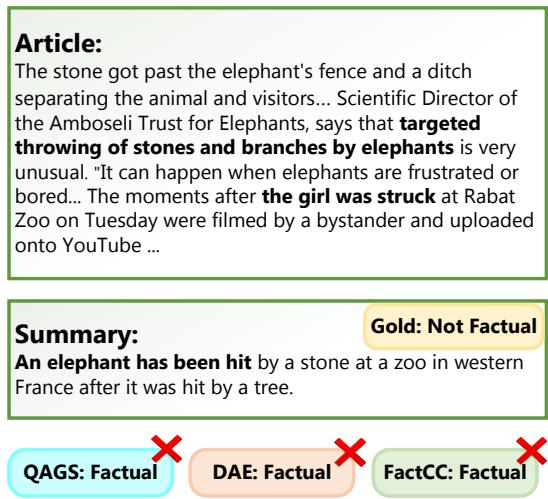
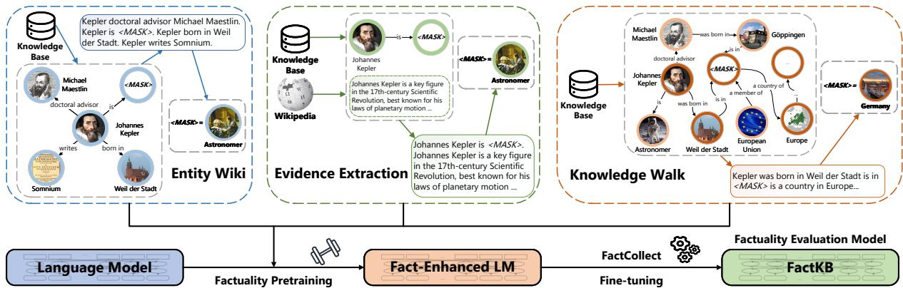
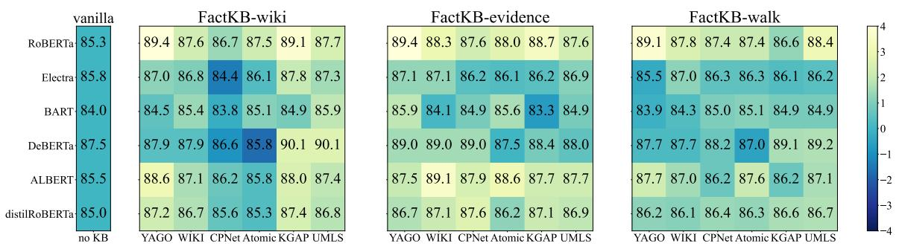
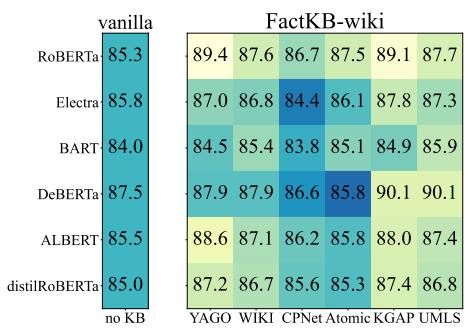
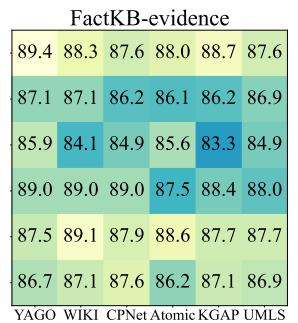
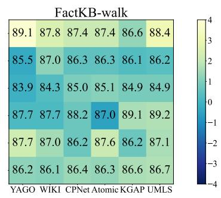
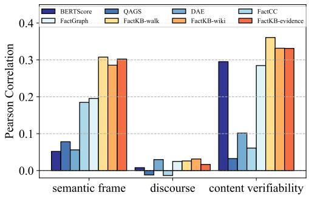
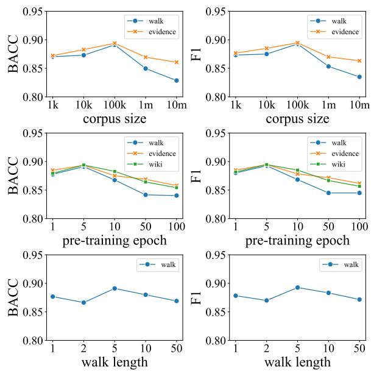

# FACTKB: Generalizable Factuality Evaluation using Language Models Enhanced with Factual Knowledge

Shangbin Feng1 Vidhisha Balachandran2 Yuyang Bai3 Yulia Tsvetkov1 1University of Washington 2Carnegie Mellon University 3Xi’an Jiaotong University {shangbin, yuliats}@cs.washington.edu vbalacha@cs.cmu.edu 1206944633@stu.xjtu.edu.cn

## Abstract

Evaluating the factual consistency of automatically generated summaries is essential for the progress and adoption of reliable summarization systems. Despite recent advances, existing factuality evaluation models are not robust, being especially prone to entity and relation errors in new domains. We propose FAC-TKB—a simple new approach to factuality evaluation that is generalizable across domains, in particular with respect to entities and relations. FACTKB is based on language models pretrained using facts extracted from external knowledge bases. We introduce three types of complementary factuality pretraining objectives based on entity-specific facts, facts extracted from auxiliary knowledge about entities, and facts constructed compositionally through knowledge base walks. The resulting factual ity evaluation model achieves state-of-the-art performance on two in-domain news summarization benchmarks as well as on three outof-domain scientific literature datasets. Further analysis of FACTKB shows improved ability to detect erroneous entities and relations in summaries and is robust and easily generalizable across domains. Code and data are available at https://github.com/BunsenFeng/FactKB.

## 1 Introduction

Generating factually accurate document summaries in addition to fluent and informative ones is critical to the adoption of summarization models (Krys-´ cinski et al.´ , 2020; Goyal and Durrett, 2020). However, evaluating the factual consistency of summaries is still challenging, especially in specialized domains like scientific or legal (Cachola et al., 2020; Goldsack et al., 2022; Polsley et al., 2016; Kanapala et al., 2019). The key reason is that the majority of existing approaches employ neural classifiers trained on synthetic data constructed from a relatively small set of documents (Krysci´ nski et al.´ , 2020; Goyal and Durrett, 2020). These factuality classifiers are thus not robust to ever-growing information, in which the distribution of entities, events, and their relations changes greatly across time and domains (Elsahar and Gallé, 2019; Laparra et al., 2020). Pagnoni et al. (2021) highlighted this limitation, finding that over 50% of factuality errors in the XSUM (Narayan et al., 2018) summarization dataset stem from semantic frame errors, namely entities, events, and relations between them, as illustrated in Figure 1.

  
Figure 1: Existing factuality models struggle to identify semantic frame errors encompassing entities and relations. In the example, they fail to identify an error in the generated summary about who was hit by the stone.

To address these issues, we develop a new factuality evaluation model with improved factual knowledge representation, specifically focusing on entities and relations. Entity-oriented pretraining objectives have been shown to improve QA and reasoning tasks (Yasunaga et al., 2022; Liu et al., 2022b); we thus hypothesize that similar objectives can aid factuality evaluation in better detecting semantic frame errors in generated summaries.

We propose FACTKB, a novel factuality evaluation model built upon language models (LMs) augmented with factual knowledge (§2). The LMs are pretrained with knowledge-focused objectives using text synthesized from external knowledge bases (KBs) which store high-quality facts about entities and relations. We propose three types of complementary pretraining strategies: (1) entity wiki, with a focus on improving entity understanding; (2) evidence extraction, with a focus on incorporating supporting evidence from surrounding context; and (3) knowledge walks, with a focus on augmenting compositional reasoning about entities. For factuality evaluation, we first pretrain a language model using these three entity-centric pretraining strategies, and then fine-tune the enhanced LM on a factual error detection dataset.

  
Figure 2: Overview of FACTKB. FACTKB pretrains LMs using three entity-centric pretraining strategies to improve fact representations. The objectives are designed to fill masked entities/relations in KB facts using i) Entity Wiki - direct facts about entities ii) Evidence Extraction - auxiliary knowledge about entities and iii) Knowledge Walk - compositional knowledge from the KB. The pretrained LMs are then fine-tuned for robust factuality evaluation.

We evaluate FACTKB’s correlation with human factuality judgments across three settings (§3). In in-domain (news) summarization, FACTKB significantly outperforms baselines by 2–7 balanced accuracy (BACC) points on the FactCollect dataset (Ribeiro et al., 2022) and 10–12 correlation points on the FRANK benchmark (Pagnoni et al., 2021), particularly showing marked improvements in semantic frame errors. In out-of-domain experiments, FACTKB consistently outperforms existing approaches by 3–5 BACC points on three datasets in biomedical and scientific domains (Saakyan et al., 2021; Sarrouti et al., 2021; Wadden et al., 2020), demonstrating stronger generalizability to unseen documents in new domains. Further analysis shows that FACTKB is compatible with different LMs and KBs while presenting a lightweight and easy-to-use approach to factuality evaluation. Code, data, and trained factuality evaluation models are publicly available.

## 2 FACTKB Methodology

FACTKB aims to improve the robustness and generalizability of factuality evaluation by a simple factuality pretraining, which improves entity and relation representations in LMs. We first propose three pretraining strategies (§2.1). We then describe the training process to (1) pretrain an LM using the proposed strategies and (2) fine-tune the factenhanced LM on a factuality error detection dataset, resulting in FACTKB (§2.2). Figure 2 presents an overview of our approach.

## 2.1 Factuality Pretraining

Knowledge bases are rich reservoirs of facts about entities and relations (Vrandeciˇ c and Krötzsch´ , 2014; Pellissier Tanon et al., 2020), and we explore the possibility of leveraging external KBs as “fact teachers” to enhance an LM’s representation of entities and relations.

Let $\begin{array} { r c l } { \mathrm { K B } } & { = } & { ( \mathcal { E } , \mathcal { R } , \mathbf { A } , \epsilon , \varphi ) } \end{array}$ , where $\begin{array} { r l } { \mathcal { E } } & { { } = } \end{array}$ $\{ e _ { 1 } , \ldots , e _ { \mathcal { N } } \}$ represents the entities in the KB, $\mathcal { R } = \{ r _ { 1 } , \ldots , r _ { \mathcal { M } } \}$ denotes the relations in the KB, A denotes the adjacency matrix where $a _ { i j } = k$ indicates relation $r _ { k }$ connecting entities $e _ { i }$ and ej $( e _ { i } , r _ { k } , e _ { j } ) \in \mathrm { K B } , \epsilon ( \cdot ) : \mathcal { E }  \mathrm { s t r ~ a n d } \varphi ( \cdot ) : \mathcal { R } $ str map the entities and relations to their textual names. We propose three novel types of factuality pretraining strategies that leverage the KB.

Strategy 1: Entity Wiki Entities in KBs often have multiple edges connecting them to other entities via relations, each representing a distinct but related fact about the entity. Inspired by the task of knowledge base completion (Bordes et al., 2013; Vashishth et al., 2019) to predict missing connections in KBs based on available KB facts, we propose the entity wiki factuality pretraining, where an LM is pretrained with the task of predicting masked entities or relations in KB facts. Specifically, for each entity $e _ { i } \in \mathcal { E }$ , we retrieve its one-hop neighborhood in the KB as $\mathcal { E } _ { e _ { i } } = \{ e _ { j } \ | \ \exists \ : r _ { k }$ s.t. $a _ { i j } =$ $k \}$ . We then synthesize a sentence using entity $e _ { i }$ and its connected one-hop facts:

<table><tr><td>Factuality Pretraining</td><td>Corpus Size Bound</td><td>1 # Tokens</td><td>Example</td></tr><tr><td>ENTITY WIKI</td><td> $\propto | \mathcal { E } |$ </td><td>5.4M</td><td>Johannes Kepler is born in Italy. Johannes Kepler is an [MASK]. [SEP] Johannes Ke- pler is the author of Astronomia nova. . .</td></tr><tr><td>EVIDENCE EXTRACTION</td><td> $\propto | | A | | _ { 0 }$ </td><td>12.2M</td><td>Hillary Clinton party affiliation [MASK] Hillary Diane Rodham Clinton is an Amer- ican politician, . . . Member of the Demo- cratic Party, she was the nominee . . .</td></tr><tr><td>KNOWLEDGE WALK</td><td> $\propto | \mathcal { E } | ( \frac { | | \mathcal { A } | | _ { 0 } } { | \mathcal { E } | } ) ^ { k }$ </td><td>2.7M</td><td>University of Edinburgh located in Scot- land located in [MASK] is a continent . . .</td></tr></table>

Table 1: Summary of the three factuality pretraining strategies.

$$
d _ { i } = \mathrm { c o n c a t } _ { e _ { j } \in \mathscr { E } _ { e _ { i } } } \left[ \epsilon ( e _ { i } ) \varphi ( r _ { k } | a _ { i j } = k ) \epsilon ( e _ { j } ) [ \mathrm { S E P } ] \right]
$$

where concat denotes string concatenation and $[ S E P ]$ denotes the special token. Repeating this generation process for all $e \in { \mathcal { E } }$ , we produce a corpus of entity facts as $\{ d _ { i } \} _ { i = 1 } ^ { | \mathcal { E } | }$ with the max size being the number of entities $| { \mathcal { E } } | .$ . We use this entity wiki corpus to pretrain an LM for better factual reasoning by randomly masking entities and relations in it and training the LM to predict the mask given the surrounding facts about an entity. We randomly mask the corpora with probability p and pretrain LMs with the masked language modeling objective. We expect this objective to train LMs to infer facts from surrounding knowledge and penalize unsupported hallucinations about entities and relations.

Strategy 2: Evidence Extraction The goal of this pretraining strategy is to enhance the model’s ability to evaluate facts based on relevant evidence. We begin by randomly selecting a triple $( e _ { i } , r _ { k } , e _ { j } ) \in \mathrm { K B }$ and use the first paragraph of the Wikipedia description of $e _ { i }$ as the auxiliary knowledge. We synthesize a sentence using the two as:

$$
d _ { i } = \epsilon ( e _ { i } ) \varphi ( r _ { k } ) [ \mathrm { M A S K } ] \mathrm { W i k i p e d i a } ( e _ { i } )
$$

where we mask out $\epsilon ( e _ { j } )$ and [MASK] denotes the special token, Wikipedia( ) :   str maps entities to the first paragraph of their Wikipedia description. Repeating this process N times with randomly selected triples, we obtain a corpus of triples paired with auxiliary knowledge $\{ d _ { i } \} _ { i = 1 } ^ { N }$ . The corpus size is bounded by all KB triples represented as the $L _ { 0 }$ norm of the adjacency matrix $| | A | | _ { 0 }$ . We use this corpus for the evidence extraction factuality pretraining and train the LM to predict the mask by using relevant evidence in the auxiliary paragraph. Through this, we aim to augment FACTKB’s ability to implicitly select evidence from the document to support its factuality evaluation.

Strategy 3: Knowledge Walk Natural language documents often include compositional statements about entities and relations (Feldman and El-Yaniv, 2019; Wang and Pan, 2022), but pretrained LMs struggle with such compositional reasoning (Press et al., 2022). To improve FACTKB’s ability to understand multi-hop claims, we propose the knowledge walk factuality pretraining strategy. Specifically, we randomly select a starting entity $e _ { ( 0 ) }$ and randomly select an entity $e _ { ( 1 ) }$ from its direct neighborhood $\mathcal { E } _ { e _ { ( 0 ) } }$ , resulting in a onehop triple $\{ e _ { ( 0 ) } , r _ { ( 0 , 1 ) } , e _ { ( 1 ) } \}$ where $r _ { ( 0 , 1 ) }$ denotes the relation between $e _ { ( 0 ) }$ and $e _ { ( 1 ) }$ . Now, from $e _ { ( 1 ) }$ , we randomly select an entity from it’s direct neighborhood to take the next step. We repeat this process for times, and obtain a $\displaystyle \mathop { { \cal K } _ { - } }$ hop random walk of triples beginning at $e _ { ( 0 ) } \colon$ $\{ e _ { ( 0 ) } , r _ { ( 0 , 1 ) } , e _ { ( 1 ) } , \cdot \cdot \cdot , r _ { ( \mathcal { K } - 1 , \mathcal { K } ) } , e _ { ( \mathcal { K } ) } \}$ . We then produce a sentence based on the -hop walk:

$$
\begin{array} { r } { \pmb { d _ { i } } = \epsilon ( e _ { ( 0 ) } ) \mathrm { c o n c a t } _ { i = 0 } ^ { K - 1 } \left[ \varphi ( r _ { ( i , i + 1 ) } ) \ \epsilon ( e _ { ( i + 1 ) } ) \ \right] } \end{array}
$$

Repeating this -hop walk N times with different randomly selected starting entities, we obtain $\{ d _ { i } \} _ { i = 1 } ^ { N }$ as the corpus for the knowledge walk factuality pretraining, whose size is bounded by the number of all possible -hop walks as $| \mathcal { E } | ( \frac { | | \dot { \mathcal { A } } | | _ { 0 } } { | \mathcal { E } | } ) ^ { k }$ In this corpus, we randomly mask entities or relations in each group of facts with probability $p$ and train an LM to predict the masked element using the compositional facts around it using the masked language model objective. Through this pretraining, we expect FACTKB to improve in compositional fact understanding about entities and relations appearing in the summary and the input document.

<table><tr><td rowspan="2">Model</td><td colspan="2">All Data</td><td colspan="2">CNN/DM</td><td colspan="2">XSUM</td></tr><tr><td>BACC</td><td>F1</td><td>BACC</td><td>F1</td><td>BACC</td><td>F1</td></tr><tr><td>QAGS</td><td>79.8</td><td>79.7</td><td>64.2</td><td>76.2</td><td>59.3</td><td>85.2</td></tr><tr><td>QUALS</td><td>78.3</td><td>78.5</td><td>60.8</td><td>76.2</td><td>57.5</td><td>82.2</td></tr><tr><td>ROBERTA</td><td>76.1</td><td>76.5</td><td>62.5</td><td>76.2</td><td>62.1</td><td>78.3</td></tr><tr><td>FALSESUM</td><td>78.9</td><td>78.2</td><td>53.7</td><td>34.6</td><td>61.1</td><td>64.3</td></tr><tr><td>FALSESUM+</td><td>84.2</td><td>83.7</td><td>64.2</td><td>77.1</td><td>67.4</td><td>82.1</td></tr><tr><td>SUMMAC</td><td>86.6</td><td>86.2</td><td>75.4</td><td>83.5</td><td>71.9</td><td>90.4</td></tr><tr><td>FACTCC</td><td>76.0</td><td>76.3</td><td>69.0</td><td>77.8</td><td>55.9</td><td>73.9</td></tr><tr><td>FACTCC+</td><td>83.9 (±0.4)</td><td>84.2 (±0.4)</td><td>68.0 (±1.0)</td><td>83.7 (±0.5)</td><td>58.3 (±2.2)</td><td>84.0 (±1.0)</td></tr><tr><td>FACTGRAPH</td><td>86.3 (±1.3)</td><td>86.7 (±1.1)</td><td>73.0 (±2.3)</td><td>86.8 (±0.8)</td><td>68.6 (±2.3)</td><td>86.6 (±2.0)</td></tr><tr><td>FACTGRAPH-ADAPTERS</td><td>87.6 (±0.7)</td><td>87.8 (±0.7)</td><td>76.0 (±2.8)</td><td>87.5 (±0.4)</td><td>69.9 (±2.3)</td><td>88.4 (±1.2)</td></tr><tr><td>FACTKB-WIKI</td><td> $8 9 . 3 ( \pm 0 . 4 ) ^ { \ast }$ </td><td> $\mathbf { 8 9 . 5 \ : ( \pm 0 . 5 ) ^ { \ast } }$ </td><td> $7 7 . 3 ( \pm 0 . 3 ) ^ { * }$ </td><td> $\mathbf { 8 8 . 2 \ ( \pm 0 . 6 ) ^ { * } }$ </td><td> $7 7 . 3 ( \pm 1 . 3 ) ^ { * }$ </td><td> ${ \bf 9 1 . 8 } \left( \pm 1 . 2 \right) ^ { \ast }$ </td></tr><tr><td>FACTKB-EVIDENCE</td><td> ${ \bf 8 9 . 4 } \left( \pm 0 . 2 \right) ^ { \ast }$ </td><td> ${ \bf 8 9 . 5 } \left( \pm 0 . 3 \right) ^ { \ast }$ </td><td> $7 7 . 7 \ ( \pm 1 . 4 ) ^ { * }$ </td><td> $8 7 . 9 \ ( \pm 0 . 7 ) $ </td><td> $7 6 . 8 ( \pm 1 . 9 ) ^ { * }$ </td><td> $9 0 . 8 ( \pm 0 . 8 ) ^ { \ast }$ </td></tr><tr><td> $\mathrm { F A C T K B - W A L K }$ </td><td> $8 9 . 1 \ ( \pm 0 . 4 ) ^ { * }$ </td><td> $8 9 . 3 ( \pm 0 . 5 ) ^ { * }$ </td><td> $7 8 . 3 ( \pm 1 . 2 ) ^ { \ast }$ </td><td> $8 7 . 7 \ ( \pm 0 . 4 )$ </td><td> $7 6 . 4 ( \pm 0 . 3 ) ^ { * }$ </td><td> $9 0 . 4 ( \pm 1 . 4 ) ^ { \ast }$ </td></tr></table>

Table 2: Performance of FACTKB on the FactCollect dataset. We report average performance and standard deviation across 5 random seeds. Best performance is shown in bold, while \* indicates statistical significance. FACTKB significantly outperforms existing factuality evaluation approaches on in-domain evaluation.

We briefly summarize the three factuality pretraining strategies and provide examples in Table 1.

## 2.2 FACTKB Training

We initialize FACTKB with encoder-based LMs and pretrain FACTKB separately with each of the three factuality pretraining corpora using the masked language modeling objective to study the effectiveness of each strategy. This results in factenhanced LMs with the ability to better represent facts, entities, and relations. Finally, we fine-tune FACTKB on human-annotated factual error detection datasets with the sequence classification setting, taking SUMMARY [SEP] DOCUMENT as input and produce FACTUAL or NON-FACTUAL labels. The [CLS] token is adopted for classification. As a result, we obtain FACTKB, our entailment-based factuality evaluation model that classifies machinegenerated summaries as factual or non-factual.

## 3 Data and Experiment Settings

## 3.1 Training

Data We use YAGO (Pellissier Tanon et al., 2020), an encyclopedic knowledge base based on Wikidata (Vrandeciˇ c and Krötzsch´ , 2014), to construct the three types of factuality pretraining corpora, while we discuss FACTKB’s compatibility with different KBs in Section 5.2. For finetuning, we use the FactCollect dataset (Ribeiro et al., 2022), a dataset for factual error detection that gathers human annotations from different sources (Wang et al., 2020a; Krysci´ nski et al.´ , 2020; Maynez et al.,

2020; Pagnoni et al., 2021) and consolidates them into a single dataset. It mainly focuses on the news media domain, covering summaries and articles from CNN, Daily Mail, and BBC. FactCollect follows a binary classification setting where each (SUMMARY, ARTICLE) pair has a FACTUAL or NON-FACTUAL label. We present more details about the FactCollect dataset in Appendix C.

Settings We use a ROBERTA-BASE (Liu et al., 2019) checkpoint and continue pretraining separately on each of the three factuality pretraining corpora. We discuss FACTKB’s compatibility with different LM initializations in Section §5.2. We assign corpus size parameter $N = 1 e 5$ , masking probability $p = 0 . 1 5$ , and knowledge walk length $\kappa = 5$ in the experiments, while we discuss the effect of corpus size and knowledge walk length in Appendix 5.4. We use a learning rate of $2 e - 5$ for pretraining, 1e  4 for fine-tuning, a batch size of 32, and the RAdam optimizer. Pretraining is conducted for 5 epochs and fine-tuning has 50 maximum epochs with early stopping. More hyperparameter settings are presented in Appendix 3.1.

Hyperparameters We propose to further pretrain LM checkpoints with three types of factuality pretraining and fine-tune on factuality evaluation datasets. We present hyperparameters for the pretraining and fine-tuning stage in Table 4. We mostly follow the hyperparameters in Gururangan et al. (2020) for the pretraining stage. The default hyperparameters on Huggingface Transformers are adopted if not included in Table 4.

<table><tr><td rowspan="2">Model</td><td colspan="4">All Data</td><td colspan="4">CNN/DM</td><td colspan="4">XSUM</td></tr><tr><td>ρ</td><td>p-val</td><td>r</td><td>p-val</td><td>ρ</td><td>p-val</td><td>r</td><td>p-val</td><td>ρ</td><td>p-val</td><td>r</td><td>p-val</td></tr><tr><td>QAGS</td><td>.22</td><td>.00</td><td>.23</td><td>.00</td><td>.34</td><td>.00</td><td>.27</td><td>.00</td><td>.07</td><td>.05</td><td>.06</td><td>.09</td></tr><tr><td>QUALS</td><td>.22</td><td>.00</td><td>.19</td><td>.00</td><td>.31</td><td>.00</td><td>.27</td><td>.00</td><td>.14</td><td>.00</td><td>.07</td><td>.03</td></tr><tr><td>DAE</td><td>.17</td><td>.00</td><td>.20</td><td>.00</td><td>.27</td><td>.00</td><td>.22</td><td>.00</td><td>.03</td><td>.38</td><td>.33</td><td>.00</td></tr><tr><td>ROBERTA</td><td>.35</td><td>.00</td><td>.41</td><td>.00</td><td>.43</td><td>.00</td><td>.31</td><td>.00</td><td>.23</td><td>.00</td><td>.15</td><td>.00</td></tr><tr><td>FALSESUM</td><td>.05</td><td>.00</td><td>.04</td><td>.11</td><td>.07</td><td>.05</td><td>.07</td><td>.03</td><td>.04</td><td>.28</td><td>.04</td><td>.35</td></tr><tr><td>FALSESUM+</td><td>.22</td><td>.00</td><td>.26</td><td>.00</td><td>.27</td><td>.00</td><td>.33</td><td>.00</td><td>.24</td><td>.00</td><td>.27</td><td>.00</td></tr><tr><td>SUMMAC</td><td>.33</td><td>.00</td><td>.35</td><td>.00</td><td>.42</td><td>.00</td><td>.36</td><td>.00</td><td>.24</td><td>.00</td><td>.25</td><td>.00</td></tr><tr><td>FACTCC</td><td>.20</td><td>.00</td><td>.29</td><td>.00</td><td>.36</td><td>.00</td><td>.30</td><td>.00</td><td>.06</td><td>.07</td><td>.19</td><td>.00</td></tr><tr><td>FACTCC+</td><td>.32</td><td>.00</td><td>.38</td><td>.00</td><td>.40</td><td>.00</td><td>.28</td><td>.00</td><td>.24</td><td>.00</td><td>.16</td><td>.00</td></tr><tr><td>FACTGRAPH</td><td>.35</td><td>.00</td><td>.42</td><td>.00</td><td>.45</td><td>.00</td><td>.34</td><td>.00</td><td>.30</td><td>.00</td><td>.49</td><td>.00</td></tr><tr><td>FACTKB-WIKI</td><td>.46</td><td>.00</td><td>.52</td><td>.00</td><td>.57</td><td>.00</td><td>.49</td><td>.00</td><td>.29</td><td>.00</td><td>.39</td><td>.00</td></tr><tr><td>FACTKB-EVIDENCE</td><td>.43</td><td>.00</td><td>.49</td><td>.00</td><td>.53</td><td>.00</td><td>.45</td><td>.00</td><td>.31</td><td>.00</td><td>.37</td><td>.00</td></tr><tr><td>FACTKB-WALK</td><td>.47</td><td>.00</td><td>.52</td><td>.00</td><td>.57</td><td>.00</td><td>.45</td><td>.00</td><td>.35</td><td>.00</td><td>.36</td><td>.00</td></tr></table>

Table 3: Correlation of FACTKB with human judgments of factuality on the FRANK benchmark. Best performance is shown in bold. FACTKB has the highest correlation with human judgments across five of the six settings.

<table><tr><td colspan="2">Pretraining Stage</td><td colspan="2">Fine-Tuning Stage</td></tr><tr><td>Hyperparameter</td><td>Value</td><td>Hyperparameter</td><td>Value</td></tr><tr><td>LEARNING RATE</td><td>2e-5</td><td>LEARNING RATE</td><td>1e-4</td></tr><tr><td>WEIGHT DECAY</td><td>1e-5</td><td>WEIGHT DECAY</td><td>1e-5</td></tr><tr><td>MAX EPOCHS</td><td>5</td><td>MAX EPOCHS</td><td>50</td></tr><tr><td>BATCH SIZE</td><td>32</td><td>BATCH SIZE</td><td>32</td></tr><tr><td>OPTIMIZER</td><td>ADAM</td><td>OPTIMIZER</td><td>RADAM</td></tr><tr><td>ADAM EPSILON</td><td>1e-6</td><td></td><td></td></tr><tr><td>ADAM BETA</td><td>0.9,0.98</td><td></td><td></td></tr><tr><td>WARMUP RATIO</td><td>0.06</td><td></td><td></td></tr><tr><td>EVIDENCE: N</td><td>1e5</td><td></td><td></td></tr><tr><td>WALK: N</td><td>1e5</td><td></td><td></td></tr><tr><td>WALK: K</td><td>5</td><td></td><td></td></tr></table>

Table 4: Hyperparameter settings of FACTKB.

## 3.2 Evaluation

To study the robustness of FACTKB, we perform both in-domain and out-of-domain evaluation.

In-Domain Evaluation Since most research and resources on summarization and factuality are in the news media domain, we leverage the FactCollect dataset (Ribeiro et al., 2022) and the FRANK benchmark (Pagnoni et al., 2021) for in-domain factuality evaluation. We evaluate FACTKB on the held-out test set of the FactCollect dataset. FRANK (Pagnoni et al., 2021) is a factuality evaluation benchmark with human judgments on the factual consistency of model-generated summaries collected across 9 summarization models along with human annotations on the category of factual errors. Following the FRANK benchmark guidelines, we use two correlation measures (Pearson (Benesty et al., 2009) and Spearman (Myers and Sirois, 2004)). We present more details about the FRANK benchmark in Appendix C. Following previous work (Ribeiro et al., 2022), we train FACTKB on the FactCollect dataset without the FRANK subset for the FRANK evaluation.

Generalizable Factuality Evaluation Summarization systems are used in diverse domains in the real world, including but not limited to news media (Liu et al., 2022c; Eyal et al., 2019; Li et al., 2016), social media (Syed et al., 2019; Kano et al., 2018; He et al., 2020), and scientific literature (Cachola et al., 2020; Lev et al., 2019). Consequently, factuality metrics should also provide reliable factuality scores in the face of shifting domains. To study this, we perform an out-of-domain evaluation using unseen documents and summaries from the scientific domain. To establish a test bed for generalizable factuality evaluation, we make use of three datasets in the scientific literature domain:

• CovidFact (Saakyan et al., 2021) collects claims from the r/COVID19 subreddit and verifies them against relevant scientific literature and Google search results, resulting in a binary classification setting that is similar to the FactCollect dataset.

• HealthVer (Sarrouti et al., 2021) consists of claims sourced from TREC-COVID (Voorhees et al., 2021) and verified against the CORD-19 (Wang et al., 2020b) corpus. While HealthVer originally follows a three-way classification setting (SUPPORT, REFUTE, NOT ENOUGH INFOR-MATION), we remove the examples in the "NOT ENOUGH INFORMATION" category to evaluate models as they are trained on the binary classification setting (factual, non-factual).

<table><tr><td rowspan="2">Model</td><td colspan="2">CovidFact</td><td colspan="2">HealthVer</td><td colspan="2">SciFact</td></tr><tr><td>BACC</td><td>F1</td><td>BACC</td><td>F1</td><td>BACC</td><td>F1</td></tr><tr><td>RANDOM</td><td>52.7</td><td>41.3</td><td>46.8</td><td>53.0</td><td>49.0</td><td>57.5</td></tr><tr><td>FACTCC</td><td>52.3</td><td>49.2</td><td>51.8</td><td>51.9</td><td>42.7</td><td>45.9</td></tr><tr><td>FACTCC+</td><td>51.1</td><td>50.5</td><td>49.5</td><td>51.6</td><td>48.6</td><td>55.2</td></tr><tr><td>FACTGRAPH</td><td>57.6</td><td>53.5</td><td>55.1</td><td>24.3</td><td>61.0</td><td>42.2</td></tr><tr><td>FACTGRAPH-EDGE</td><td>50.6</td><td>48.4</td><td>50.6</td><td>53.5</td><td>56.7</td><td>68.2</td></tr><tr><td>FALSESUM</td><td>50.6</td><td>41.6</td><td>56.8</td><td>51.2</td><td>45.7</td><td>65.3</td></tr><tr><td>FALSESUM+</td><td>50.1</td><td>41.2</td><td>57.3</td><td>51.6</td><td>51.9</td><td>65.4</td></tr><tr><td>SUMMAC</td><td>57.6</td><td>53.4</td><td>52.5</td><td>41.2</td><td>59.8</td><td>46.9</td></tr><tr><td>ROBERTA</td><td>59.0 (±3.2)</td><td>46.4 (±4.3)</td><td>55.0 (±2.2)</td><td>50.0 (±3.9)</td><td>58.1 (±4.0)</td><td>71.3 (±3.5)</td></tr><tr><td>FACTKB-WIKI</td><td> ${ \bf 6 4 . 8 \ ( \pm 0 . 3 ) ^ { * } }$ </td><td> ${ \pm } 4 . 4 \ ( \pm 0 . 7 ) ^ { * }$ </td><td> ${ \bf 6 0 . 1 } \left( \pm 0 . 4 \right) ^ { \ast }$ </td><td> ${ \bf 7 1 . 6 ( \pm 2 . 9 ) ^ { * } }$ </td><td> $6 2 . 9 \ ( \pm 0 . 4 ) ^ { * }$ </td><td> $7 2 . 3 ( \pm 1 . 1 ) ^ { * }$ </td></tr><tr><td>FACTKB-EVIDENCE</td><td> $6 3 . 9 \ ( \pm 0 . 6 ) ^ { * }$ </td><td> $5 3 . 3 ( \pm 1 . 7 ) $ </td><td> $5 9 . 0 ( \pm 1 . 0 ) ^ { \ast }$ </td><td> $7 0 . 8 ( \pm 0 . 9 ) ^ { \ast }$ </td><td> $6 1 . 4 ( \pm 0 . 5 ) ^ { \ast }$ </td><td> ${ \bf 7 4 . 1 } \left( \pm 1 . 6 \right) ^ { \ast }$ </td></tr><tr><td>FACTKB-WALK</td><td> $6 3 . 7 \ ( \pm 1 . 0 ) ^ { * }$ </td><td> $5 3 . 1 \ ( \pm 1 . 6 )$ </td><td> $5 8 . 5 ( \pm 0 . 5 ) ^ { \ast }$ </td><td> $6 8 . 7 ( \pm 1 . 7 ) ^ { \ast }$ </td><td> ${ \bf 6 3 . 1 } \ ( \pm 1 . 1 ) ^ { * }$ </td><td> $6 7 . 6 ( \pm 4 . 1 ) $ </td></tr></table>

Table 5: Performance of FACTKB on out-of-domain scientific datasets. We report average performance and standard deviation across 5 random seeds. Best performance is shown in bold, while \* indicates statistical significance. FACTKB exhibits better generalization to new domains across all three datasets.

• SciFact (Wadden et al., 2020) includes claims sourced from citation sentences in biomedical literature and verified against the cited paper’s abstract. While SciFact uses three-way classification that includes "NOT ENOUGH INFORMA-TION", we similarly remove them in this work.

We leverage the well-organized version of the three datasets in Wadden et al. (2022). 1 We train and validate FACTKB with the FactCollect dataset from the news domain and evaluate on the test set of these datasets for zero-shot transfer learning.

Baselines We compare FACTKB with different types of existing factuality evaluation models: QAGS (Wang et al., 2020a), QUALS (Nan et al., 2021), DAE (Goyal and Durrett, 2020), FalseSum (Utama et al., 2022), SummaC (Laban et al., 2022), FactCC (Krysci´ nski et al.´ , 2020), and FactGraph (Ribeiro et al., 2022). Since training data is a key factor in factuality evaluation models and they are often used off-the-shelf, we include factuality evaluation measures trained on both synthetic data (QAGS, QUALS, DAE, SummaC, FalseSum, FactCC) and human-annotated data (RoBERTa, FalseSum+, FactCC+, FactGraph, FactGraph-edge). We follow the same train/dev/test dataset split and experiment settings so that the results are directly comparable. We present more details about the baselines in Appendix D.

## 4 Results

In-Domain Results We evaluate FACTKB and baselines on the FactCollect dataset using the entire held-out test data, the CNN/DM subset and the XSUM (BBC) subset, and report balanced accuracy scores and micro F1 scores. We run each method five times with different random seeds and report the average performance as well as the standard deviation. Table 2 demonstrates that FACTKB significantly (\*) outperforms all baseline factuality evaluation methods by 3.8 BACC points on average across the three dataset settings. This demonstrates that the introduction of KBs and factuality pretraining is beneficial for factuality evaluation. Among the three factuality pretraining strategies, all of them outperform baseline models, suggesting that FACTKB’s general methodology is compatible with different types of KB utilization.

Human Correlation We evaluate FACTKB and baselines on the FRANK benchmark to study how well FACTKB correlates with human judgments. We use the official script 2 to report the Pearson (ρ) and Spearman (r) correlation and p-values. Results in Table 3 show that classification-based metrics (FactCC, FactGraph, and FACTKB) generally outperform QA-based metrics (QAGS and QUALS). FACTKB significantly advances the state-of-the-art on the FRANK benchmark, resulting in the improvement of 5-15 correlation points across multiple settings. Our results show that FACTKB is highly correlated with human judgments, making it a practical approach for evaluating the factual consistency of generated news summaries.

Out-of-Domain Results We evaluate FACTKB and existing factuality evaluation models on out-ofdomain scientific literature datasets in a zero-shot manner. Results are presented in Table 5, which demonstrate that while existing factuality evaluation models previously achieve good performance in the in-domain setting, they exhibit severe performance drops on the three out-of-domain datasets, performing only slightly better than random factuality scores (RANDOM). This suggests that existing approaches are not generalizable to other domains, limiting their applicability. On the contrary, FAC-TKB significantly (\*) outperforms existing factuality metrics by 4.1 BACC points on average across the three out-of-domain datasets. Our results suggest that the factuality pretraining strategies enable FACTKB to better represent facts (entities and relations) in a new domain, making the factuality evaluation model more robust to shifting domains.

  
Figure 3: Compatibility of FACTKB across various LMs and KBs. We report BACC scores of different setups on the FactCollect dataset. FACTKB is a general method compatible with various LM and KB settings.

  
Figure 4: Correlation of FACTKB and baselines with human judgments across error categories. FACTKB shows significant improvement in capturing semantic frame errors and has slightly better or on-par performance on discourse and content verifiability errors.

## 5 Analysis and Discussion

## 5.1 Where did FACTKB Improve?

To better understand FACTKB’s improvement over existing approaches, we leverage the factual error typology in the FRANK benchmark (Pagnoni et al.,

2021) and examine FACTKB’s performance on the three error categories: semantic frame, discourse, and content verifiability errors. Using the official script in the FRANK benchmark, we remove each category of errors and report changes in correlation scores. Higher variation indicates a greater influence on a model’s ability to handle a certain type of error. Figure 4 demonstrates that FACTKB is significantly better at identifying semantic frame errors, which focus on entities and relations. This indicates that our KB-based factuality pretraining strategies successfully result in a better understanding of the facts regarding entities and relations. FACTKB also has good performance in other categories, resulting in a factuality evaluation model that captures diverse types of errors and advances the state-of-the-art across the board. We conduct further qualitative analysis in Appendix B.

## 5.2 KB and LM Compatibility

FACTKB uses pretrained LMs for initialization, leverages external KBs for factuality pretraining, and trains on factuality evaluation datasets to result in a factuality metric. Our general methodology to leverage knowledge bases as fact teachers for generalizable factuality evaluation could work with different LM and KB combinations. To study whether out approach works across different settings, we apply the FACTKB methodology to six different LMs (RoBERTa, Electra, BART, DeBERTa, ALBERT, and distilRoBERTa) and pretrain the LMs on factuality pretraining corpora constructed based on six different KBs (YAGO, Wikidata, ConceptNet, Atomic, KGAP, and UMLS). For each combination, we initialize a particular LM and pretrain it using the proposed three pretraining strategies based on a particular KB. For each setting, we evaluate the resulting model using the FactCollect dataset and report the BACC scores. We present the performance of different settings in Figure 3, which illustrates that regardless of which LM and KB, FACTKB generally results in improved factual error detection capabilities compared to the vanilla LM checkpoints without factuality pretraining. In addition, certain LMs (RoBERTa and DeBERTa) and KBs (YAGO, KGAP, and UMLS) are better than others, suggesting that the choice of the base LM and external KB warrants further research. Our results demonstrate that FACTKB is a general pretraining approach that can be applied to various LM-KB combinations to improve fact representations and develop better factuality evaluation models.

<table><tr><td>Metric</td><td>Pearson</td><td>Spearman</td><td>Usage Steps</td></tr><tr><td>QAGS</td><td>.22</td><td>.23</td><td>1) extract answer candidates 2) generate the questions 3) answer the generated questions 4) compare the answers to obtain the QAGS factuality score</td></tr><tr><td>QUALS</td><td>.22</td><td>.19</td><td>1) generating question and answer pairs from summaries 2) filter the generated question and answer for high-quality pairs 3) evaluate the generated question and answer pairs using the source document as input, compute QUALS scores for each summary</td></tr><tr><td>DAE</td><td>.17</td><td>.20</td><td>1) preprocess summaries and documents with dependency parsing 2) run the pretrained model to get DAE scores</td></tr><tr><td>FACTCC</td><td>.20</td><td>.29</td><td>1) run the pretrained model to get FactCC scores</td></tr><tr><td>FACTGRAPH .35</td><td></td><td>.42</td><td>1) build abstract meaning representation graphs 2) run the pretrained model to get FactGraph scores</td></tr><tr><td>FACTKB</td><td>.47</td><td>.52</td><td>1) run the pretrained model to get FACTKB scores</td></tr></table>

Table 6: Usage steps of factuality metrics and their performance on the FRANK benchmark. FACTKB (WALK) presents a state-of-the-art factuality metric with minimum hassle when evaluating new summaries and articles.

## 5.3 Simplicity Study

While existing factuality evaluation approaches require additional processing (such as computing the dependency structure (Goyal and Durrett, 2020) and AMR graphs (Ribeiro et al., 2022) or running multiple iterations of question generation (Fabbri et al., 2022)) in the face of new data, FACTKB requires no preprocessing and only uses a fine-tuned RoBERTa for sequence classification. We summarize the steps involved in using existing approaches and their performance on the FRANK benchmark in Table 6, which demonstrates that FACTKB not only has state-of-the-art performance but is also a lightweight and simple factuality evaluation model.

## 5.4 Parameter Analysis

Corpus size. For evidence extraction and knowledge walk, the pretraining corpus size N is controllable and governs the amount of information towards augmenting FACTKB’s ability towards factual errors regarding entities and relations. While we adopted N = 1e5 in the main experiments, we further explore the effect of factuality pretraining corpus size in Figure 5. It is illustrated that N = 1e4 or N = 1e5 are generally desirable settings, while factuality pretraining with too large Ns might be counterproductive. This could in part be attributed to catastrophic forgetting (Ramasesh et al., 2021), which warrants further research.

Pretraining epoch. FACTKB further pretrains LM checkpoints on the three factuality pretraining corpora, while the training epoch governs the intensity of such exercises. We adopted 5 epochs of continued pretraining in the main experiments, while we further explore the effect of pretraining epochs in Figure 5. it is demonstrated that 1 to 10 epochs are generally desirable while exercising too much might be counterproductive.

Knowledge walk length. An important aspect of the knowledge walk factuality pretraining is the generated walk length , which governs the degree of compositionality in the pretraining corpus. While we adopted  = 5 in the main experiments, we further explore the effect of  in Figure 5. It is illustrated that  = 5 performs best by providing a moderate amount of compositionality in the factuality pretraining corpora.

## 6 Related Work

Factuality Evaluation Recent advances in text summarization have presented models and systems that are capable of generating increasingly fluent, controllable, and informative summaries of documents (Liu and Lapata, 2019; Balachandran et al., 2021; Meng et al., 2022; Tang et al., 2022; Goldsack et al., 2022; Peng et al., 2021; Aharoni et al.,

2023; Liu et al., 2022d; Rothe et al., 2021; Narayan et al., 2021; Bhattacharjee et al., 2023; Chen et al., 2023b; He et al., 2023; Liu et al., 2023b; Chen et al., 2023a). However, they suffer from hallucina tion and might not be factually faithful towards the source document (Cao et al., 2018; Pagnoni et al., 2021; Balachandran et al., 2022; Tang et al., 2023; Liu et al., 2023a; Luo et al., 2023), leading to in creased research in factuality evaluation. QA-based approaches (Wang et al., 2020a; Nan et al., 2021; Scialom et al., 2021; Fabbri et al., 2022) attempt to generate and answer questions based on sum maries and documents and judge the factuality by comparing answers. Later approaches are generally entailment-based (Krysci´ nski et al.´ , 2020; Goyal and Durrett, 2020, 2021; Laban et al., 2022; Ribeiro et al., 2022), proposing to classify (summary, document) pairs into FACTUAL or NON-FACTUAL labels. Among them, FactCC (Krysci´ nski et al.´ , 2020) is one of the first entailment-based metrics and is trained on synthetic data; DAE (Goyal and Durrett, 2020, 2021) proposes to leverage the dependency structure of summaries and documents; FactGraph (Ribeiro et al., 2022) builds abstract meaning representation graphs and adopts graph neural networks for joint representation learning along the textual content. In addition, hypothesis re-ranking (Gar neau and Lamontagne, 2021), counterfactual estimation (Xie et al., 2021), NLI models (Utama et al., 2022), phrase-level localization (Takatsuka et al., 2022), and weighting facts in the source document (Xu et al., 2020) were also explored in factuality evaluation. Moving beyond a binary concept of fac tuality, FRANK (Pagnoni et al., 2021) promotes a fine-grained understanding of factuality and pro poses a typology of factuality errors. Inspired by its analysis that semantic frame errors, errors re garding entities and relations, are a major source of factuality errors yet under-explored by existing fac tuality metrics, we propose FACTKB to leverage external KBs for factuality pretraining and help en force better factuality towards entities and relations discussed in summaries and documents.

Knowledge Bases in NLP Knowledge base is a standard format for structured knowledge representation. One application of KBs in NLP is to inject knowledge and augment LMs, where different approaches focused aspects such as pretraining (Chen et al., 2020; Agarwal et al., 2021; Rosset et al., 2020; Li et al., 2022), document graphs (Hu et al., 2021; Zhang et al., 2022a), KB structure (Yasunaga et al., 2021; Zhang et al., 2022b), and long documents (Feng et al., 2023). KB-enhanced approaches also advanced numerous NLP tasks, ranging from question answering (Mitra et al., 2022; Bosselut et al., 2021; Oguz et al., 2022; Feng et al., 2022; Heo et al., 2022; Ma et al., 2022), text generation (Rony et al., 2022; Dognin et al., 2021; Yu et al., 2021), and commonsense reasoning (Kim et al., 2022; Jung et al., 2022; Amayuelas et al., 2021; Liu et al., 2022a). In this work, we tap into KBs nature as high-quality reservoirs of factual information and construct factuality pretraining objectives to augment factuality evaluation.

  
Figure 5: Parameter analysis of pretraining corpus size, epoch, and knowledge walk length.

## 7 Conclusion

We propose FACTKB, a simple and novel approach to factuality evaluation using language models pretrained on facts from external KBs to improve entity and relation representations. Specifically, we leverage KBs to construct three factuality pretraining objectives: entity wiki, evidence extraction, and knowledge walk. FACTKB pretrains an LM using the three objectives and fine-tunes the resulting model on factuality evaluation datasets. Extensive experiments demonstrate that FACTKB advances the state-of-the-art in both in-domain and out-ofdomain factuality evaluation, better correlates with human factuality annotations, and better detects semantic frame errors. FACTKB presents an easy-touse and generalizable factuality metric, facilitating research on factually-consistent summarization.

## Limitations

LM and KB Selection While Section 5.2 offers empirical evidence that FACTKB is compatible with 6 language models and 6 external knowledge bases, it remains unclear upfront which LM and KB combination would be most desirable. While empirical performance could be a good guide, there are several unaddressed possibilities: For language models, it is possible to leverage an ensemble of FACTKBs seeded with different LM checkpoints and architectures. This might result in better factuality evaluation, but would also dramatically increase the computation costs when evaluating on new data. For knowledge bases, it is possible to leverage domain expertise and select an external knowledge base that would be most helpful for the domain adaptation of factuality evaluation. It is also possible to leverage a combination of existing knowledge bases for FACTKB’s factuality pretraining, while the specific combination and how to apply different factuality pretraining to different KBs are hard to determine. All in all, FACTKB presents a general KB-enhanced factuality metric with numerous possibilities, while we leave some of these considerations to future work.

FACTKB training is not end-to-end. FACTKB has a two-step training process: pretraining with KB-based factuality pretraining and fine-tuning on factuality evaluation datasets. This creates several limitations, among which is the difficulty of hyperparameter tuning. Appendix 3.1 presents the study of hyperparameters in the factuality pretraining stage, which demonstrates that FACTKB works best with a moderate but not excessive amount of factuality pretraining. This reliance on certain hyperparameter configurations is further complicated by more hyperparameter choices in the fine-tuning stage. While the current hyperparameter setting in Appendix 3.1 achieves state-of-the-art empirical performance, we acknowledge the difficulty in FACTKB hyperparameter tuning.

Out-of-Domain Factuality Evaluation. An important focus of this work is out-of-domain factuality evaluation: Summarization systems face input documents from varying domains, which requires factuality metrics to also generalize to different document domains. Existing metrics struggle with semantic frame errors and such struggle is exacerbated by the domain shift of entities and relations, while FACTKB offers a stronger and more generalizable factuality metric. However, in this work, we mainly focused on the additional domain of scientific literature, while other potential domains remain underexplored such as social media (Syed et al., 2019; Kano et al., 2018; He et al., 2020). We leave it to future work the exploration of FACTKB and existing factuality metrics on more document domains that are present in summarization systems.

Tradeoff between Performance and Granularity Existing approaches (Krysci´ nski et al.´ , 2020; Takatsuka et al., 2022) struggle with semantic frame errors and involve heavy preprocessing, while they provide fine-grained analysis and specific localization of summarization errors. FACTKB achieves significantly better factuality evaluation results and is easier to use while lacking the ability of error localization. We argue that this tradeoff should be considered with the use case in mind: for LLM evaluation, it is better to have an accurate metric for benchmarking efforts and an efficient metric for handling large-scale LM generation. As a result, FACTKB provides a valuable tool for factuality evaluation and LLM research.

## Ethics Statement

LM and KB Bias FACTKB is initialized with pretrained language model checkpoints and leverages knowledge-base-based factuality pretraining. Consequently, FACTKB might pick up the biases of the adopted language models (Liang et al., 2021; Nadeem et al., 2021; Shaikh et al., 2023; Tan and Celis, 2019) and knowledge bases (Fisher et al., 2020; Mehrabi et al., 2021). As a result, FACTKB might leverage these biases in judging the factuality of summaries, further reinforcing the bias in text summarization systems. We leave it to future work on understanding and mitigating the bias of factuality metrics.

Misuse Potential FACTKB leverages highquality and factual knowledge bases to generate factuality pretraining corpora and augment LM’s ability to stay factual with respect to entities and relations discussed in the summary and document. On the contrary, if non-factual and misleading knowledge is leveraged for the three factuality pretraining strategies, it might jeopardize the factuality of FAC-TKB and make it insensitive to misinformation and falsehoods in summaries and documents. As a result, we encourage the responsible use of FACTKB and the factuality pretraining methodology.

## Acknowledgements

We thank the reviewers, the area chair, members of Tsvetshop, and the UW NLP Group for their feedback. This research was supported by This research is supported in part by the Office of the Director of National Intelligence (ODNI), Intelligence Advanced Research Projects Activity (IARPA), via the HIATUS Program contract #2022-22072200004. This material is also funded by the DARPA Grant under Contract No. HR001120C0124. We also gratefully acknowledge support from NSF CA-REER Grant No. IIS2142739 and the Alfred P. Sloan Foundation Fellowship. The views and conclusions contained herein are those of the authors and should not be interpreted as necessarily representing the official policies, either expressed or implied, of ODNI, IARPA, or the U.S. Government. The U.S. Government is authorized to reproduce and distribute reprints for governmental purposes notwithstanding any copyright annotation therein.

## References

Oshin Agarwal, Heming Ge, Siamak Shakeri, and Rami Al-Rfou. 2021. Knowledge graph based synthetic corpus generation for knowledge-enhanced language model pre-training. In Proceedings ofthe 2021 Conference of the North American Chapter of the Associationfor Computational Linguistics: Human Language Technologies, pages 3554–3565.

Roee Aharoni, Shashi Narayan, Joshua Maynez, Jonathan Herzig, Elizabeth Clark, and Mirella Lapata. 2023. Multilingual summarization with factual consistency evaluation. In Findings of the Association for Computational Linguistics: ACL 2023, pages 3562–3591.

Alfonso Amayuelas, Shuai Zhang, Xi Susie Rao, and Ce Zhang. 2021. Neural methods for logical reasoning over knowledge graphs. In International Conference on Learning Representations.

Vidhisha Balachandran, Hannaneh Hajishirzi, William Cohen, and Yulia Tsvetkov. 2022. Correcting diverse factual errors in abstractive summarization via postediting and language model infilling. In Proceedings of the 2022 Conference on Empirical Methods in Natural Language Processing.

Vidhisha Balachandran, Artidoro Pagnoni, Jay Yoon Lee, Dheeraj Rajagopal, Jaime Carbonell, and Yulia Tsvetkov. 2021. StructSum: Summarization via structured representations. In Proceedings of the 16th Conference of the European Chapter of the Association for Computational Linguistics: Main Volume, pages 2575–2585.

Jacob Benesty, Jingdong Chen, Yiteng Huang, and Israel Cohen. 2009. Pearson correlation coefficient. In Noise reduction in speech processing, pages 1–4. Springer.

Abhik Bhattacharjee, Tahmid Hasan, Wasi Uddin Ahmad, Yuan-Fang Li, Yong-Bin Kang, and Rifat Shahriyar. 2023. CrossSum: Beyond English-centric cross-lingual summarization for 1,500+ language pairs. In Proceedings ofthe 61st Annual Meeting of the Associationfor Computational Linguistics (Volume 1: Long Papers), pages 2541–2564.

Steven Bird, Ewan Klein, and Edward Loper. 2009. Natural language processing with Python: analyzing text with the natural language toolkit. " O’Reilly Media, Inc.".

Antoine Bordes, Nicolas Usunier, Alberto Garcia-Duran, Jason Weston, and Oksana Yakhnenko. 2013. Translating embeddings for modeling multirelational data. Advances in neural information processing systems, 26.

Antoine Bosselut, Ronan Le Bras, and Yejin Choi. 2021. Dynamic neuro-symbolic knowledge graph construction for zero-shot commonsense question answering. In Proceedings of the 35th AAAI Conference on Artificial Intelligence (AAAI).

Isabel Cachola, Kyle Lo, Arman Cohan, and Daniel S Weld. 2020. Tldr: Extreme summarization of scientific documents. In Findings of the Association for Computational Linguistics: EMNLP 2020, pages 4766–4777.

Ziqiang Cao, Furu Wei, Wenjie Li, and Sujian Li. 2018. Faithful to the original: Fact aware neural abstractive summarization. In thirty-second AAAI conference on artificial intelligence.

Wenhu Chen, Yu Su, Xifeng Yan, and William Yang Wang. 2020. Kgpt: Knowledge-grounded pretraining for data-to-text generation. In Proceedings of the 2020 Conference on Empirical Methods in Natural Language Processing (EMNLP), pages 8635– 8648.

Xiuying Chen, Guodong Long, Chongyang Tao, Mingzhe Li, Xin Gao, Chengqi Zhang, and Xiangliang Zhang. 2023a. Improving the robustness of summarization systems with dual augmentation. In Proceedings of the 61st Annual Meeting of the Associationfor Computational Linguistics (Volume 1: Long Papers), pages 6846–6857.

Yulong Chen, Yang Liu, Ruochen Xu, Ziyi Yang, Chenguang Zhu, Michael Zeng, and Yue Zhang. 2023b. UniSumm and SummZoo: Unified model and diverse benchmark for few-shot summarization. In Proceedings ofthe 61st Annual Meeting ofthe Associationfor Computational Linguistics (Volume 1: Long Papers), pages 12833–12855.

Jacob Devlin, Ming-Wei Chang, Kenton Lee, and Kristina Toutanova. 2019. Bert: Pre-training of deep bidirectional transformers for language understanding. In Proceedings of the 2019 Conference of the North American Chapter ofthe Associationfor Computational Linguistics: Human Language Technologies, Volume 1 (Long and Short Papers), pages 4171– 4186.

Pierre Dognin, Inkit Padhi, Igor Melnyk, and Payel Das. 2021. ReGen: Reinforcement learning for text and knowledge base generation using pretrained language models. In Proceedings ofthe 2021 Conference on Empirical Methods in Natural Language Processing, pages 1084–1099.

Hady Elsahar and Matthias Gallé. 2019. To annotate or not? predicting performance drop under domain shift. In Proceedings ofthe 2019 Conference on Empirical Methods in Natural Language Processing and the 9th International Joint Conference on Natural Language Processing (EMNLP-IJCNLP), pages 2163–2173.

Matan Eyal, Tal Baumel, and Michael Elhadad. 2019. Question answering as an automatic evaluation metric for news article summarization. In Proceedings of the 2019 Conference of the North American Chapter ofthe Associationfor Computational Linguistics: Human Language Technologies, Volume 1 (Long and Short Papers), pages 3938–3948.

Alexander Fabbri, Chien-Sheng Wu, Wenhao Liu, and Caiming Xiong. 2022. QAFactEval: Improved QAbased factual consistency evaluation for summarization. In Proceedings of the 2022 Conference of the North American Chapter of the Association for Computational Linguistics: Human Language Technologies, pages 2587–2601.

William Falcon and The PyTorch Lightning team. 2019. PyTorch Lightning.

Yair Feldman and Ran El-Yaniv. 2019. Multi-hop paragraph retrieval for open-domain question answering. In Proceedings of the 57th Annual Meeting of the Association for Computational Linguistics, pages 2296– 2309.

Shangbin Feng, Zilong Chen, Wenqian Zhang, Qingyao Li, Qinghua Zheng, Xiaojun Chang, and Minnan Luo. 2021. Kgap: Knowledge graph augmented political perspective detection in news media. arXiv preprint arXiv:2108.03861.

Shangbin Feng, Zhaoxuan Tan, Wenqian Zhang, Zhenyu Lei, and Yulia Tsvetkov. 2023. KALM: Knowledgeaware integration of local, document, and global contexts for long document understanding. In Proceedings ofACL 2023, pages 2116–2138.

Yue Feng, Zhen Han, Mingming Sun, and Ping Li. 2022. Multi-hop open-domain question answering over structured and unstructured knowledge. In Findings of the Association for Computational Linguistics: NAACL 2022, pages 151–156, Seattle, United States.

Joseph Fisher, Arpit Mittal, Dave Palfrey, and Christos Christodoulopoulos. 2020. Debiasing knowledge graph embeddings. In Proceedings ofthe 2020 Conference on Empirical Methods in Natural Language Processing (EMNLP), pages 7332–7345.

Nicolas Garneau and Luc Lamontagne. 2021. Trainable ranking models to evaluate the semantic accuracy of data-to-text neural generator. In Proceedings of the 2nd Workshop on Evaluation and Comparison of NLP Systems, pages 51–61.

Tomas Goldsack, Zhihao Zhang, Chenghua Lin, and Carolina Scarton. 2022. Making science simple: Corpora for the lay summarisation of scientific literature. In Proceedings ofthe 2022 Conference on Empirical Methods in Natural Language Processing.

Tanya Goyal and Greg Durrett. 2020. Evaluating factuality in generation with dependency-level entailment. In Findings of the Association for Computational Linguistics: EMNLP 2020, pages 3592–3603.

Tanya Goyal and Greg Durrett. 2021. Annotating and modeling fine-grained factuality in summarization. In Proceedings ofthe 2021 Conference ofthe North American Chapter ofthe Association for Computational Linguistics: Human Language Technologies.

Suchin Gururangan, Ana Marasovic, Swabha´ Swayamdipta, Kyle Lo, Iz Beltagy, Doug Downey, and Noah A Smith. 2020. Don’t stop pretraining: Adapt language models to domains and tasks. In Proceedings of the 58th Annual Meeting of the Association for Computational Linguistics, pages 8342–8360.

Charles R Harris, K Jarrod Millman, Stéfan J Van Der Walt, Ralf Gommers, Pauli Virtanen, David Cournapeau, Eric Wieser, Julian Taylor, Sebastian Berg, Nathaniel J Smith, et al. 2020. Array programming with numpy. Nature, 585(7825):357–362.

Pengcheng He, Baolin Peng, Song Wang, Yang Liu, Ruochen Xu, Hany Hassan, Yu Shi, Chenguang Zhu, Wayne Xiong, Michael Zeng, Jianfeng Gao, and Xuedong Huang. 2023. Z-code++: A pre-trained language model optimized for abstractive summarization. In Proceedings ofthe 61st Annual Meeting of the Associationfor Computational Linguistics (Volume 1: Long Papers), pages 5095–5112.

Ruifang He, Liangliang Zhao, and Huanyu Liu. 2020. TWEETSUM: Event oriented social summarization dataset. In Proceedings of the 28th International Conference on Computational Linguistics, pages 5731–5736.

Yu-Jung Heo, Eun-Sol Kim, Woo Suk Choi, and Byoung-Tak Zhang. 2022. Hypergraph transformer: Weakly-supervised multi-hop reasoning for knowledge-based visual question answering. In Proceedings ofthe 60th Annual Meeting ofthe Association for Computational Linguistics (Volume 1: Long Papers), pages 373–390.

Linmei Hu, Tianchi Yang, Luhao Zhang, Wanjun Zhong, Duyu Tang, Chuan Shi, Nan Duan, and Ming Zhou. 2021. Compare to the knowledge: Graph neural fake news detection with external knowledge. In Proceedings ofthe 59th Annual Meeting ofthe Associationfor Computational Linguistics and the 11th International Joint Conference on Natural Language Processing (Volume 1: Long Papers), pages 754–763.

Yong-Ho Jung, Jun-Hyung Park, Joon-Young Choi, Mingyu Lee, Junho Kim, Kang-Min Kim, and SangKeun Lee. 2022. Learning from missing relations: Contrastive learning with commonsense knowledge graphs for commonsense inference. In Findings of the Association for Computational Linguistics: ACL 2022, pages 1514–1523.

Ambedkar Kanapala, Sukomal Pal, and Rajendra Pamula. 2019. Text summarization from legal documents: a survey. Artificial Intelligence Review, 51(3):371–402.

Ryuji Kano, Yasuhide Miura, Motoki Taniguchi, Yan-Ying Chen, Francine Chen, and Tomoko Ohkuma. 2018. Harnessing popularity in social media for extractive summarization of online conversations. In Proceedings of the 2018 Conference on Empirical Methods in Natural Language Processing, pages 1139–1145.

Yu Jin Kim, Beong-woo Kwak, Youngwook Kim, Reinald Kim Amplayo, Seung-won Hwang, and Jinyoung Yeo. 2022. Modularized transfer learning with multiple knowledge graphs for zero-shot commonsense reasoning. In Proceedings of the 2022 Conference of the North American Chapter of the Associationfor Computational Linguistics: Human Language Technologies, pages 2244–2257.

Wojciech Krysci´ nski, Bryan McCann, Caiming Xiong,´ and Richard Socher. 2020. Evaluating the factual consistency of abstractive text summarization. In Proceedings of the 2020 Conference on Empirical Methods in Natural Language Processing (EMNLP), pages 9332–9346.

Philippe Laban, Tobias Schnabel, Paul N. Bennett, and Marti A. Hearst. 2022. SummaC: Re-Visiting NLIbased Models for Inconsistency Detection in Summarization. Transactions ofthe Associationfor Computational Linguistics, 10:163–177.

Timothée Lacroix, Guillaume Obozinski, and Nicolas Usunier. 2019. Tensor decompositions for temporal knowledge base completion. In International Conference on Learning Representations.

Egoitz Laparra, Steven Bethard, and Timothy A Miller. 2020. Rethinking domain adaptation for machine learning over clinical language. JAMIA open, 3(2):146–150.

Guy Lev, Michal Shmueli-Scheuer, Jonathan Herzig, Achiya Jerbi, and David Konopnicki. 2019. Talk-Summ: A dataset and scalable annotation method for

scientific paper summarization based on conference talks. In Proceedings of the 57th Annual Meeting of the Associationfor Computational Linguistics, pages 2125–2131.

Chen Li, Zhongyu Wei, Yang Liu, Yang Jin, and Fei Huang. 2016. Using relevant public posts to enhance news article summarization. In Proceedings of COLING 2016, the 26th International Conference on Computational Linguistics: Technical Papers, pages 557–566.

Shaobo Li, Xiaoguang Li, Lifeng Shang, Chengjie Sun, Bingquan Liu, Zhenzhou Ji, Xin Jiang, and Qun Liu. 2022. Pre-training language models with deterministic factual knowledge. In Proceedings ofthe 2022 Conference on Empirical Methods in Natural Language Processing.

Paul Pu Liang, Chiyu Wu, Louis-Philippe Morency, and Ruslan Salakhutdinov. 2021. Towards understanding and mitigating social biases in language models. In International Conference on Machine Learning, pages 6565–6576. PMLR.

Jiacheng Liu, Alisa Liu, Ximing Lu, Sean Welleck, Peter West, Ronan Le Bras, Yejin Choi, and Hannaneh Hajishirzi. 2022a. Generated knowledge prompting for commonsense reasoning. In Proceedings ofthe 60th Annual Meeting ofthe Associationfor Computational Linguistics (Volume 1: Long Papers), pages 3154–3169.

Xiao Liu, Shiyu Zhao, Kai Su, Yukuo Cen, Jiezhong Qiu, Mengdi Zhang, Wei Wu, Yuxiao Dong, and Jie Tang. 2022b. Mask and reason: Pre-training knowledge graph transformers for complex logical queries. In Proceedings of the 28th ACM SIGKDD Conference on Knowledge Discovery and Data Mining, pages 1120–1130.

Yang Liu and Mirella Lapata. 2019. Text summarization with pretrained encoders. In Proceedings of the 2019 Conference on Empirical Methods in Natural Language Processing and the 9th International Joint Conference on Natural Language Processing (EMNLP-IJCNLP), pages 3730–3740.

Yang Liu, Chenguang Zhu, and Michael Zeng. 2022c. End-to-end segmentation-based news summarization. In Findings of the Association for Computational Linguistics: ACL 2022, pages 544–554.

Yinhan Liu, Myle Ott, Naman Goyal, Jingfei Du, Mandar Joshi, Danqi Chen, Omer Levy, Mike Lewis, Luke Zettlemoyer, and Veselin Stoyanov. 2019. Roberta: A robustly optimized bert pretraining approach. arXiv preprint arXiv:1907.11692.

Yixin Liu, Budhaditya Deb, Milagro Teruel, Aaron Halfaker, Dragomir Radev, and Ahmed Hassan Awadallah. 2023a. On improving summarization factual consistency from natural language feedback. In Proceedings of the 61st Annual Meeting of the Association for Computational Linguistics (Volume 1: Long Papers), pages 15144–15161.

Yixin Liu, Alex Fabbri, Pengfei Liu, Yilun Zhao, Linyong Nan, Ruilin Han, Simeng Han, Shafiq Joty, Chien-Sheng Wu, Caiming Xiong, and Dragomir Radev. 2023b. Revisiting the gold standard: Grounding summarization evaluation with robust human evaluation. In Proceedings ofthe 61st Annual Meeting of the Association for Computational Linguistics (Volume 1: Long Papers), pages 4140–4170.

Yongtai Liu, Joshua Maynez, Gonçalo Simões, and Shashi Narayan. 2022d. Data augmentation for lowresource dialogue summarization. In Findings ofthe Associationfor Computational Linguistics: NAACL 2022, pages 703–710.

Zheheng Luo, Qianqian Xie, and Sophia Ananiadou. 2023. Chatgpt as a factual inconsistency evaluator for abstractive text summarization. arXiv preprint arXiv:2303.15621.

Kaixin Ma, Hao Cheng, Xiaodong Liu, Eric Nyberg, and Jianfeng Gao. 2022. Open domain question answering with a unified knowledge interface. In Proceedings of the 60th Annual Meeting of the Associationfor Computational Linguistics (Volume 1: Long Papers), pages 1605–1620, Dublin, Ireland.

Joshua Maynez, Shashi Narayan, Bernd Bohnet, and Ryan McDonald. 2020. On faithfulness and factuality in abstractive summarization. In Proceedings of the 58th Annual Meeting of the Association for Computational Linguistics, pages 1906–1919.

Ninareh Mehrabi, Pei Zhou, Fred Morstatter, Jay Pujara, Xiang Ren, and Aram Galstyan. 2021. Lawyers are dishonest? quantifying representational harms in commonsense knowledge resources. In Proceedings of the 2021 Conference on Empirical Methods in Natural Language Processing, pages 5016–5033.

Kevin Meng, David Bau, Alex J Andonian, and Yonatan Belinkov. 2022. Locating and editing factual associations in gpt. In Advances in Neural Information Processing Systems.

Sayantan Mitra, Roshni Ramnani, and Shubhashis Sengupta. 2022. Constraint-based multi-hop question answering with knowledge graph. In Proceedings of the 2022 Conference of the North American Chapter of the Association for Computational Linguistics: Human Language Technologies: Industry Track, pages 280–288.

Leann Myers and Maria J Sirois. 2004. Spearman correlation coefficients, differences between. Encyclopedia ofstatistical sciences, 12.

Moin Nadeem, Anna Bethke, and Siva Reddy. 2021. Stereoset: Measuring stereotypical bias in pretrained language models. In Proceedings ofthe 59th Annual Meeting of the Association for Computational Linguistics and the 11th International Joint Conference on Natural Language Processing (Volume 1: Long Papers), pages 5356–5371.

Feng Nan, Cicero dos Santos, Henghui Zhu, Patrick Ng, Kathleen Mckeown, Ramesh Nallapati, Dejiao Zhang, Zhiguo Wang, Andrew O Arnold, and Bing Xiang. 2021. Improving factual consistency of abstractive summarization via question answering. In Proceedings ofthe 59th Annual Meeting ofthe Associationfor Computational Linguistics and the 11th International Joint Conference on Natural Language Processing (Volume 1: Long Papers), pages 6881– 6894.

Shashi Narayan, Shay Cohen, and Maria Lapata. 2018. Don’t give me the details, just the summary! topicaware convolutional neural networks for extreme summarization. In 2018 Conference on Empirical Methods in Natural Language Processing, pages 1797–1807. Association for Computational Linguistics.

Shashi Narayan, Yao Zhao, Joshua Maynez, Gonçalo Simões, Vitaly Nikolaev, and Ryan McDonald. 2021. Planning with learned entity prompts for abstractive summarization. Transactions ofthe Associationfor Computational Linguistics, 9:1475–1492.

Barlas Oguz, Xilun Chen, Vladimir Karpukhin, Stan Peshterliev, Dmytro Okhonko, Michael Schlichtkrull, Sonal Gupta, Yashar Mehdad, and Scott Yih. 2022. UniK-QA: Unified representations of structured and unstructured knowledge for open-domain question answering. In Findings of the Association for Computational Linguistics: NAACL 2022, pages 1535–1546, Seattle, United States.

Artidoro Pagnoni, Vidhisha Balachandran, and Yulia Tsvetkov. 2021. Understanding factuality in abstractive summarization with frank: A benchmark for factuality metrics. In Proceedings of the 2021 Conference of the North American Chapter of the Association for Computational Linguistics: Human Language Technologies, pages 4812–4829.

Adam Paszke, Sam Gross, Francisco Massa, Adam Lerer, James Bradbury, Gregory Chanan, Trevor Killeen, Zeming Lin, Natalia Gimelshein, Luca Antiga, et al. 2019. Pytorch: An imperative style, high-performance deep learning library. Advances in neural information processing systems, 32.

F. Pedregosa, G. Varoquaux, A. Gramfort, V. Michel, B. Thirion, O. Grisel, M. Blondel, P. Prettenhofer, R. Weiss, V. Dubourg, J. Vanderplas, A. Passos, D. Cournapeau, M. Brucher, M. Perrot, and E. Duchesnay. 2011. Scikit-learn: Machine learning in Python. Journal of Machine Learning Research, 12:2825–2830.

Thomas Pellissier Tanon, Gerhard Weikum, and Fabian Suchanek. 2020. Yago 4: A reason-able knowledge base. In European Semantic Web Conference, pages 583–596. Springer.

Xutan Peng, Yi Zheng, Chenghua Lin, and Advaith Siddharthan. 2021. Summarising historical text in modern languages. In Proceedings of the 16th Conference ofthe European Chapter ofthe Association

for Computational Linguistics: Main Volume, pages 3123–3142.

Seth Polsley, Pooja Jhunjhunwala, and Ruihong Huang. 2016. Casesummarizer: a system for automated summarization of legal texts. In Proceedings ofCOLING 2016, the 26th international conference on Computational Linguistics: System Demonstrations, pages 258–262.

Ofir Press, Muru Zhang, Sewon Min, Ludwig Schmidt, Noah A Smith, and Mike Lewis. 2022. Measuring and narrowing the compositionality gap in language models. arXiv preprint arXiv:2210.03350.

Vinay Venkatesh Ramasesh, Aitor Lewkowycz, and Ethan Dyer. 2021. Effect of scale on catastrophic forgetting in neural networks. In International Conference on Learning Representations.

Leonardo F. R. Ribeiro, Mengwen Liu, Iryna Gurevych, Markus Dreyer, and Mohit Bansal. 2022. FactGraph: Evaluating factuality in summarization with semantic graph representations. In Proceedings of the 2022 Conference of the North American Chapter of the Association for Computational Linguistics: Human Language Technologies, pages 3238–3253.

Md Rashad Al Hasan Rony, Ricardo Usbeck, and Jens Lehmann. 2022. DialoKG: Knowledge-structure aware task-oriented dialogue generation. In Findings of the Association for Computational Linguistics: NAACL 2022, pages 2557–2571, Seattle, United States.

Corby Rosset, Chenyan Xiong, Minh Hieu Phan, Xia Song, Paul Bennett, and Saurabh Tiwary. 2020. Knowledge-aware language model pretraining. ArXiv, abs/2007.00655.

Sascha Rothe, Joshua Maynez, and Shashi Narayan. 2021. A thorough evaluation of task-specific pretraining for summarization. In Proceedings of the 2021 Conference on Empirical Methods in Natural Language Processing, pages 140–145.

Arkadiy Saakyan, Tuhin Chakrabarty, and Smaranda Muresan. 2021. Covid-fact: Fact extraction and verification of real-world claims on covid-19 pandemic. In Proceedings of the 59th Annual Meeting of the Association for Computational Linguistics and the 11th International Joint Conference on Natural Language Processing (Volume 1: Long Papers), pages 2116–2129.

Mourad Sarrouti, Asma Ben Abacha, Yassine M’rabet, and Dina Demner-Fushman. 2021. Evidence-based fact-checking of health-related claims. In Findings of the Association for Computational Linguistics: EMNLP 2021, pages 3499–3512.

Thomas Scialom, Paul-Alexis Dray, Sylvain Lamprier, Benjamin Piwowarski, Jacopo Staiano, Alex Wang, and Patrick Gallinari. 2021. Questeval: Summarization asks for fact-based evaluation. In Proceedings of the 2021 Conference on Empirical Methods in Natural Language Processing, pages 6594–6604.

Omar Shaikh, Hongxin Zhang, William Held, Michael Bernstein, and Diyi Yang. 2023. On second thought, let’s not think step by step! bias and toxicity in zeroshot reasoning. In Proceedings of the 61st Annual Meeting of the Association for Computational Linguistics (Volume 1: Long Papers), pages 4454–4470.

Siamak Shakeri, Cicero dos Santos, Henghui Zhu, Patrick Ng, Feng Nan, Zhiguo Wang, Ramesh Nallapati, and Bing Xiang. 2020. End-to-end synthetic data generation for domain adaptation of question answering systems. In Proceedings of the 2020 Conference on Empirical Methods in Natural Language Processing (EMNLP), pages 5445–5460.

Robyn Speer, Joshua Chin, and Catherine Havasi. 2017. Conceptnet 5.5: An open multilingual graph of general knowledge. In Thirty-first AAAI conference on artificial intelligence.

Shahbaz Syed, Michael Völske, Nedim Lipka, Benno Stein, Hinrich Schütze, and Martin Potthast. 2019. Towards summarization for social media - results of the TL;DR challenge. In Proceedings of the 12th International Conference on Natural Language Generation, pages 523–528.

Masato Takatsuka, Tetsunori Kobayashi, and Yoshihiko Hayashi. 2022. Phrase-level localization of inconsistency errors in summarization by weak supervision. In Proceedings ofthe 29th International Conference on Computational Linguistics, pages 6151–6164.

Yi Chern Tan and L Elisa Celis. 2019. Assessing social and intersectional biases in contextualized word representations. Advances in Neural Information Processing Systems, 32.

Liyan Tang, Tanya Goyal, Alex Fabbri, Philippe Laban, Jiacheng Xu, Semih Yavuz, Wojciech Kryscinski, Justin Rousseau, and Greg Durrett. 2023. Understanding factual errors in summarization: Errors, summarizers, datasets, error detectors. In Proceedings of the 61st Annual Meeting of the Association for Computational Linguistics (Volume 1: Long Papers), pages 11626–11644.

Xiangru Tang, Arjun Nair, Borui Wang, Bingyao Wang, Jai Desai, Aaron Wade, Haoran Li, Asli Celikyilmaz, Yashar Mehdad, and Dragomir Radev. 2022. CON-FIT: Toward faithful dialogue summarization with linguistically-informed contrastive fine-tuning. In Proceedings of the 2022 Conference of the North American Chapter ofthe Association for Computational Linguistics: Human Language Technologies, pages 5657–5668.

Prasetya Utama, Joshua Bambrick, Nafise Moosavi, and Iryna Gurevych. 2022. Falsesum: Generating document-level NLI examples for recognizing factual inconsistency in summarization. In Proceedings of the 2022 Conference of the North American Chapter of the Association for Computational Linguistics: Human Language Technologies, pages 2763–2776.

Shikhar Vashishth, Soumya Sanyal, Vikram Nitin, and Partha Talukdar. 2019. Composition-based multirelational graph convolutional networks. In International Conference on Learning Representations.

Ellen Voorhees, Tasmeer Alam, Steven Bedrick, Dina Demner-Fushman, William R Hersh, Kyle Lo, Kirk Roberts, Ian Soboroff, and Lucy Lu Wang. 2021. Trec-covid: constructing a pandemic information retrieval test collection. In ACM SIGIR Forum, volume 54, pages 1–12. ACM New York, NY, USA.

Denny Vrandeciˇ c and Markus Krötzsch. 2014. Wiki-´ data: a free collaborative knowledgebase. Communications ofthe ACM, 57(10):78–85.

David Wadden, Shanchuan Lin, Kyle Lo, Lucy Lu Wang, Madeleine van Zuylen, Arman Cohan, and Hannaneh Hajishirzi. 2020. Fact or fiction: Verifying scientific claims. In Proceedings of the 2020 Conference on Empirical Methods in Natural Language Processing (EMNLP), pages 7534–7550.

David Wadden, Kyle Lo, Lucy Lu Wang, Arman Cohan, Iz Beltagy, and Hannaneh Hajishirzi. 2022. MultiVerS: Improving scientific claim verification with weak supervision and full-document context. In Findings of the Association for Computational Linguistics: NAACL 2022, pages 61–76.

Alex Wang, Kyunghyun Cho, and Mike Lewis. 2020a. Asking and answering questions to evaluate the factual consistency of summaries. In Proceedings ofthe 58th Annual Meeting of the Association for Computational Linguistics, pages 5008–5020.

Lucy Lu Wang, Kyle Lo, Yoganand Chandrasekhar, Russell Reas, Jiangjiang Yang, Doug Burdick, Darrin Eide, Kathryn Funk, Yannis Katsis, Rodney Michael Kinney, et al. 2020b. Cord-19: The covid-19 open research dataset. In Proceedings ofthe 1st Workshop on NLPfor COVID-19 at ACL 2020.

Wenya Wang and Sinno Pan. 2022. Deep inductive logic reasoning for multi-hop reading comprehension. In Proceedings of the 60th Annual Meeting of the Associationfor Computational Linguistics (Volume 1: Long Papers), pages 4999–5009.

Xiaozhi Wang, Tianyu Gao, Zhaocheng Zhu, Zhengyan Zhang, Zhiyuan Liu, Juanzi Li, and Jian Tang. 2021. Kepler: A unified model for knowledge embedding and pre-trained language representation. Transactions of the Association for Computational Linguistics, 9:176–194.

Peter West, Chandra Bhagavatula, Jack Hessel, Jena Hwang, Liwei Jiang, Ronan Le Bras, Ximing Lu, Sean Welleck, and Yejin Choi. 2022. Symbolic knowledge distillation: from general language models to commonsense models. In Proceedings of the 2022 Conference ofthe North American Chapter of the Association for Computational Linguistics: Human Language Technologies, pages 4602–4625.

Thomas Wolf, Lysandre Debut, Victor Sanh, Julien Chaumond, Clement Delangue, Anthony Moi, Pierric Cistac, Tim Rault, Rémi Louf, Morgan Funtowicz, et al. 2020. Transformers: State-of-the-art natural language processing. In Proceedings of the 2020 conference on empirical methods in natural language processing: system demonstrations, pages 38–45.

Yuexiang Xie, Fei Sun, Yang Deng, Yaliang Li, and Bolin Ding. 2021. Factual consistency evaluation for text summarization via counterfactual estimation. In Findings of the Association for Computational Linguistics: EMNLP 2021, pages 100–110.

Xinnuo Xu, Ondˇrej Dušek, Jingyi Li, Verena Rieser, and Ioannis Konstas. 2020. Fact-based content weighting for evaluating abstractive summarisation. In Proceedings of the 58th Annual Meeting of the Association for Computational Linguistics, pages 5071–5081.

Michihiro Yasunaga, Antoine Bosselut, Hongyu Ren, Xikun Zhang, Christopher D Manning, Percy S Liang, and Jure Leskovec. 2022. Deep bidirectional language-knowledge graph pretraining. Advances in Neural Information Processing Systems, 35:37309– 37323.

Michihiro Yasunaga, Hongyu Ren, Antoine Bosselut, Percy Liang, and Jure Leskovec. 2021. Qa-gnn: Reasoning with language models and knowledge graphs for question answering. In Proceedings of the 2021 Conference of the North American Chapter of the Associationfor Computational Linguistics: Human Language Technologies, pages 535–546.

Wenhao Yu, Meng Jiang, Zhiting Hu, Qingyun Wang, Heng Ji, and Nazneen Rajani. 2021. Knowledgeenriched natural language generation. In Proceedings of the 2021 Conference on Empirical Methods in Natural Language Processing: Tutorial Abstracts, pages 11–16.

Tianyi Zhang, Varsha Kishore, Felix Wu, Kilian Q Weinberger, and Yoav Artzi. 2019. Bertscore: Evaluating text generation with bert. In International Conference on Learning Representations.

Wenqian Zhang, Shangbin Feng, Zilong Chen, Zhenyu Lei, Jundong Li, and Minnan Luo. 2022a. KCD: Knowledge walks and textual cues enhanced political perspective detection in news media. In Proceedings ofNAACL 2022, pages 4129–4140.

X Zhang, A Bosselut, M Yasunaga, H Ren, P Liang, C Manning, and J Leskovec. 2022b. Greaselm: Graph reasoning enhanced language models for question answering. In International Conference on Representation Learning (ICLR).

## A Merging the three strategies

We also tried combining the three factuality pretraining strategies to obtain FACTKB-COMBINED. We evaluate it on the FactCollect dataset and present results in Table 7. It is demonstrated that FACTKB-COMBINED is not significantly better than using a single factuality pretraining strategy, while we will make all versions of FACTKB publicly available.

## B Qualitative Analysis

We present examples of (summary, article) pairs and their factuality scores in Table 9 and 10, where FACTKB is significantly closer to human judgment than existing factuality metrics. It is demonstrated that while existing factuality metrics are insensitive to major errors in entities and relations, FACTKB is capable of identifying inconsistencies and enforcing strict factuality standards.

## C Dataset Details

We present more details about the adopted datasets in Table 8. There might be minor differences in certain numbers with the original dataset as a result of data preprocessing. FRANK (Pagnoni et al., 2021) does not explicitly have binary labels such as {FACTUAL, NOT FACTUAL}. It also does not have a training set due to its nature as an evaluation benchmark. HealthVer (Sarrouti et al., 2021) and SciFact (Wadden et al., 2020) originally had NOT ENOUGH INFORMATION labels, while we removed such examples in the out-of-domain factuality evaluation to ensure their compatibility with FactCollect.

## D Baseline Details

We present more details about baseline factuality metrics in the following:

• BERTScore (Zhang et al., 2019) is a general metric for text generation evaluation based on pretrained BERT (Devlin et al., 2019).

• QAGS (Wang et al., 2020a) is a QA-based factuality metric, asking questions about summaries and articles while examining whether the answers are consistent.

• QUALS (Nan et al., 2021) is a QA-based factuality metric that uses QAGen (Shakeri et al., 2020) to generate both questions and answers from the summary.

• DAE (Goyal and Durrett, 2020) leverages the dependency structure of the summary and article to design a factuality metric.

• SummaC (Laban et al., 2022) proposes to revisit and repurpose NLI models for detecting factual inconsistencies in text summarization.

• FalseSum (Utama et al., 2022) augments NLI training data with controllable text generation for better factuality evaluation.

• FactCC (Krysci´ nski et al.´ , 2020) is an entailment-based factuality metric trained on synthetic data evaluating factuality with binary classification. FactCC+ is a variant of FactCC providing explanations. FactCC+ is an enhanced version trained with human-annotated data.

• FactGraph (Ribeiro et al., 2022) is an entailment-based factuality metric based on jointly analyzing the textual content and AMR graphs of the summary and article. FactGraphadapters is an enhanced version with pretrained adapters for both the text and graph modules.

## E LM and KB Details

In Section 5.2, we explored whether FACTKB is compatible with different language models and knowledge bases. For LMs, we used the ROBERTA-BASE, GOOGLE/ELECTRA-BASE-DISCRIMINATOR, FACEBOOK/BART-BASE, ALBERT-BASE-V2, MICROSOFT/DEBERTA-V3- BASE, DISTILROBERTA-BASE LM checkpoints on Huggingface Transformers. For the six KBs, we used their organized versions: YAGO15k at Lacroix et al. (2019), Wikidata5M at Wang et al. (2021), Atomic at West et al. (2022), ConceptNet at Zhang et al. (2022b), KGAP at Feng et al. (2021), and UMLS at Zhang et al. (2022b).

## F Statistical Significance Test Details

We use the student t-test for statistical significance analysis throughout the paper. Specifically, the t-test calculator for 2 independent means 3 was adopted for the calculations. We use (\*) to denote statistical significance in Tables 2 and 5.

<table><tr><td rowspan="2">Model</td><td colspan="2">All Data</td><td colspan="2">CNN/DM</td><td colspan="2">XSUM</td></tr><tr><td>BACC</td><td>F1</td><td>BACC</td><td>F1</td><td>BACC</td><td>F1</td></tr><tr><td>FACTKB-WIKI</td><td>89.3 (±0.4)</td><td>89.5 (±0.5)</td><td>77.3 (±0.3)</td><td>88.2 (±0.6)</td><td>77.3 (±1.3)</td><td>91.8 (±1.2)</td></tr><tr><td>FACTKB-EVIDENCE</td><td>89.4 (±0.2)</td><td>89.5 (±0.3)</td><td>77.7 (±1.4)</td><td>87.9 (±0.7)</td><td>76.8 (±1.9)</td><td>90.8 (±0.8)</td></tr><tr><td>FACTKB-WALK</td><td>89.1 (±0.4)</td><td>89.3 (±0.5)</td><td>78.3 (±1.2)</td><td>87.7 (±0.4)</td><td>76.4 (±0.3)</td><td>90.4 (±1.4)</td></tr><tr><td>FACTKB-COMBINED</td><td>89.0</td><td>89.7</td><td>76.0</td><td>88.1</td><td>74.2</td><td>89.1</td></tr></table>

Table 7: Performance of various FACTKB settings on the FactCollect dataset.
<table><tr><td>Dataset</td><td># Datapoint</td><td># Class</td><td>Class Distribution</td><td>Train/Dev/Test Split</td><td>Proposed In</td></tr><tr><td>FACTCOLLECT</td><td>9,567</td><td>2</td><td>4994 / 4573</td><td>8667 / 300 / 600</td><td>Ribeiro et al. (2022)</td></tr><tr><td>FRANK</td><td>2,246</td><td>1</td><td></td><td>0 / 671 / 1575</td><td>Pagnoni et al. (2021)</td></tr><tr><td>COVIDFACT</td><td>1,257</td><td>2</td><td>401 / 856</td><td>846 / 94 / 317</td><td>Saakyan et al. (2021)</td></tr><tr><td>HEALTHVER</td><td>4,447</td><td>3 → 2</td><td>2,758 / 1,689</td><td>3,340 / 508 / 599</td><td>Sarrouti et al. (2021)</td></tr><tr><td>SCIFACT</td><td>773</td><td>3 → 2</td><td>508 / 265</td><td>508 / 56 / 209</td><td>Wadden et al. (2020)</td></tr></table>

Table 8: Statistics of the datasets and benchmarks adopted in this work.

## G Computational Resources

We used a GPU cluster with 16 NVIDIA A40 GPUs, 1988G memory, and 104 CPU cores for the experiments. Factuality pretraining with the default hyperparameters takes around 1.5 hours, while finetuning language models on the FactCollect dataset takes around 30 minutes.

## H Scientific Artifacts

FACTKB would not be possible without many open-source scientific artifacts, including pytorch (Paszke et al., 2019), pytorch lightning (Falcon and The PyTorch Lightning team, 2019), transformers (Wolf et al., 2020), sklearn (Pedregosa et al., 2011), numpy (Harris et al., 2020), nltk (Bird et al., 2009), and the six adopted knowledge bases (Pellissier Tanon et al., 2020; Vrandeciˇ c and Krötzsch´ , 2014; West et al., 2022; Speer et al., 2017; Feng et al., 2021; Zhang et al., 2022b). We commit to making our code and data publicly available upon acceptance to facilitate reproduction and further research.

<table><tr><td>QAGS DAE</td><td>FactCC FactKB Gold</td><td>Summary</td><td>Article</td><td></td></tr><tr><td>0.3000 0.9990</td><td>1.0000 0.0035 0</td><td>plans to build a new gener- ation of royal navy frigates on the isle of wight have been submit- ted to the gov- ernment.</td><td>The decommissioned Type 22 frigates HMS Cumberland, HMS Campbeltown, HMS Chatham and HMS Cornwall are currently moored in Portsmouth Har- bour.Bidders had until 23 January to register an interest in the former Devonport- based ships.The BBC understands no proposals to preserve the ships have been submitted.Those who have registered an interest are finalising their bids with view- ings set to take place in late February and March.A final decision is not expected until the spring.The government&#x27;s Disposal Services Authority, which is handling the sale, wants to award at least one of the frigates to a UK ship recycler to deter- mine the capacity of the UK&#x27;s industry in the field.Penny Mordaunt, Conservative MP for Portsmouth North, said it was important UK recyclers had the chance to prove themselves in the field but she was also keen to see at least one of them saved from the scrapyard.She added: &quot;For anyone that has served on a ship it&#x27;s your home, vou&#x27;ve literally been through the wars with it.., and vou want them to have a noble second life.&quot;My preference is to go for the reef and diving attraction.&quot;We&#x27;ve got to get best value for the budget but a reef would also generate income for part of the country through tourism.&quot;The Ministry of Defence has previously said it will &quot;consider all options&quot; for the frigates to ensure &quot;best financial return for the</td><td>taxpayer&quot;.A spokeswoman would not comment on the number or nature of the bids received due to &quot;commercial sensitivity&quot;.Originally designed as a specialist anti- submarine ship, the Type 22 frigate evolved into a powerful surface combatant with</td></tr><tr><td>0.5333 0.9296 1.0000 0.0043 0</td><td></td><td>an elephant has been hit by a stone at a Z00 western in france after it was hit by a</td><td>fence and swerves round to show a stone on the ground.Metres away people are</td><td>The stone got past the elephant&#x27;s fence and a ditch separating the animal and visitors, the zoo said in a statement.The girl was taken to hospital and died within a few hours, the zoo added.The zoo statement said the enclosure met international standards and said &quot;this kind of accident is rare, unpredictable and unusual&quot;.Africa Live: More on this and other storiesThe statement went on (in French) to point out two other recent incidents in the US:Phyllis Lee, Scientific Director of the Amboseli Trust for Elephants, says that targeted throwing of stones and branches by elephants is very unusual.&quot;It can happen when elephants are frustrated or bored. In my opinion, it&#x27;s unlikely the elephant was directly targeting the girl - but exhibiting frustration. You can&#x27;t predict what animals in captivity will do.&quot;The moments after the girl was struck at Rabat Zoo on Tuesday were filmed by a bystander and uploaded onto YouTube.The video shows the elephant waving its trunk behind a</td></tr><tr><td>0.6000 0.9994 1.0000 0.0037 0</td><td></td><td>been arrested after a fire broke out in a restaurant in greater manchester city centre, police have</td><td>a woman has The victim was queuing for food at the branch in St George&#x27;s Street, Canterbury</td><td>at about 02:15 GMT on Friday when the assault occurred.Investigating officers said three men entered the restaurant and began being noisy and bumping into people.It is believed one of the group then set light to the woman&#x27;s hair.Officers have released CCTV images of three men they are keen to speak to regarding the attack.Det Sgt Barry Carr said: &quot;Fortunately the fire was put out quickly and the victim was not seriously hurt, but things could clearly have turned out much worse.&quot;This was a nasty and extremely dangerous thing to do, and I urge anyone who recognises the men in the CCTV images to contact me as soon as possible.&quot;</td></tr><tr><td></td><td>0.8000 0.9974 1.0000 0.0044 0</td><td>tata steel has confirmed it is in talks with the company about selling its long products division.</td><td>The firm said it had signed a Letter of Intent to enter into exclusive negotiations with Liberty House Group.More than 1.700 people are emploved in the division. which has factories in Rotherham and Stocksbridge.Steel union Community said it welcomed news of negotiations following &quot;months of unnecessary stress and concern&quot;.More on this and other South Yorkshire storiesThe union&#x27;s general secre- tary Roy Rickhuss said: &quot;This is a positive step for the UK steel industry; however there remain huge challenges which government must address.&quot;The union said it would be seeking urgent talks with Liberty House Group and would be asking what their plans were for investment, protecting jobs and providing decent pensions for members in retirement.Tata Steel&#x27;s UK boss Bimlendra Jha said the announcement was &quot;an important step forward&quot;.&quot;We now look forward to working with Liberty on the due diligence and other work streams so that the sale can be successfully</td><td>concluded,&quot; he said.The Speciality Steels unit makes high-end components for the automotive, aerospace and oil industries.In April, Tata sold its long-products</td></tr><tr><td></td><td></td><td>the site of a new burial site in oxford has been approved by the city</td><td>Oxford City Council said the money had mostly been used for &quot;ground investi- gations of possible sites&quot; but nowhere suitable had been found.Two cemeteries still have space, in Wolvercote and Botley, but they are expected to be full by 2018 and 2021.The council said it had not given up and was &quot;still exploring op- tions&quot;.Linda Smith, board member for leisure, parks and sport, said the council has been &quot;searching for a suitable new burial site for many years&quot;.She added: &quot;But ultimately, as with new housing sites, we have run out of suitable land within Oxford.&quot;So far all the council-owned sites that we have identified have, following</td><td>ground investigations and surveys, had to be discounted.&quot;Either due to the size of the site, the ground conditions, a high water table or a covenant restricting the use</td></tr></table>

Table 9: Qualitative analysis of FACTKB and existing factuality metrics, part 1.

<table><tr><td>QAGS DAE</td><td>FactCC FactKB Gold</td><td>Summary</td><td>Article</td></tr><tr><td>0.6000 0.9886 1.0000 0.0037 0</td><td>plans and more</td><td>to demolish and demolish parts of a seaside resort build than 1, 000 old buildings been</td><td>Three Victorian hotels will go to make way for a six-storey, four star hotel and two assisted-living apartment blocks, at East Cliff in Bournemouth.English Her- itage strongly objected to the scale of the development in what is a designated conservation area.But, councillors voted seven to three in favour saying it would help tourism.Chair of the planning board and Conservative ward councillor David Kelsey, said the buildings earmarked for demolition were nice but no longer &quot;nec- essarily functional&quot;.&quot;They&#x27;ve come to the end of their working lives, we need to preserve the tourism aspect while improving living for older people in the town,&quot; he said.&quot;The loss of buildings and trees are always regrettable but we can&#x27;t stand still, we need to move forward.&quot;The site on Grove Road and East Overcliff Drive will get a 90-room hotel along with a nine-storey and seven-storey building, comprising 122 assisted-living apartments.Applicants The East Cliff Project LLP will demolish Bay View Court, The Cottonwood and the Ocean View hotels.The council received 246 letters supporting the plans.Forty-nine residents and the Ancient Monuments</td></tr><tr><td></td><td>called for a leaving country.</td><td>new law to allow russian citizens to be barred from the</td><td>or a plea from a territory&#x27;s leaders would be enough to trigger the new provi- the Russian Black Sea Fleet, a majority hold Russian passports.Under Russia&#x27;s existing law, a neighbouring state would have to sign a treaty with Russia to al- low part of its territory to become a new &quot;subject&quot; of the Russian Federation.But Mikhail Yemelyanov, deputy leader of A Just Russia, said the law had been drafted for peaceful times, and did not go far enough for situations where a state was falling apart.&quot;In conditions where a neighbouring state is disintegrating I don&#x27;t think the Russian Federation should be restricted in its ability to accept a territory whose people have expressed a clear will and desire to be in Russia,&quot; he said.Since Russia&#x27;s war with Georgia in 2008, the breakaway Georgian territories of Abk- hazia and South Ossetia have come under Moscow&#x27;s control.Russia poured troops into both regions to help pro-Russian separatists who did not recognise Georgia&#x27;s authority.The other bill to be considered by the Duma - Russia&#x27;s lower house - would speed up the procedures for issuing Russian passports.Passport applicants would not have to pay a state tax, and previous residence in Russia would no longer be required.In addition, they would not have to have sufficient funds to support themselves and would not have to give up their Ukrainian citizenship.The bill&#x27;s preamble says it is aimed &quot;at supporting the fraternal people of Ukraine, especially the Russian-speaking ones, who are defenceless in the face of the &#x27;brown threat&#x27;,&quot; a reference to World War Two fascists who wore brown uniforms.The bill would allow Ukrainians to apply for Russian passports at Russian diplomatic missions before 1 August, and they could become citizens after two months, instead of waiting a year, as is currently the norm.The plan to have a new fast-track procedure</td></tr><tr><td>0.70000.9984 1.00000.00470</td><td>a 19-year-old man has been arrested in connection with the fatal shooting of an 18-year- old student in the southern</td><td>The shooting occurred at a hostel attached to the private Pragati Residential School</td><td>in Bangalore city.Police say the alleged gunman, identified as Mahesh, was working as an office assistant in the school.Incidents of gun crime at schools and colleges in India are very rare. It is not clear what prompted the shooting.Police said on Thursday that Mahesh had been remanded until 12 April.Mahesh is alleged to have barged into the room of 18-year-old Gautami and shot her in the head with a pistol on on Tuesday evening.He then shot another student, Sirisha, who suffered severe injuries but is believed to be out of danger, say police.He was arrested on Wednesday after a manhunt.India has strict control laws, although a large number of feuds are settled with firearms.In 2007, a 14-year-old schoolboy was shot dead by two fellow students at a school campus near the capital, Delhi.</td></tr><tr><td></td><td>help to trace two men who threatened a woman with a knife at a</td><td>appealed for at 07:55 on Friday.They threatened a member of staff with a knife and demanded quarry in fife.</td><td>to have been badly shaken but otherwise unharmed by the ordeal.Both suspects are white, and one of them was about 35-40 years old with short brown hair and wearing a black jumper.Det Sgt Raymond Hunter said officers had been carrying out door-to-door inquiries and were in the process of collecting CCTV images area and people may have seen the two men prior to or after the incident.&quot;I am therefore appealing to anyone who was in the area or any local residents to contact us - any information you have could assist our enquiry.&quot;</td></tr><tr><td></td><td>of using plastic carrier bags in england has reached a</td><td>the number people</td><td>The Department for Environment, Food and Rural Affairs found the number had gone up by 200 million since 2013.There has been a big problem with plastic thrown away after they have been used.The bags end up in rubbish dumps and even rivers causing big problems for the environment.From October people in England will have to pay 5p for their plastic bags in a bid to encourage them to reuse the ones that they already have.Supermarkets in Wales, Scotland and Northern Ireland, where people are charged for carrier bags, have all seen a decrease in bags</td></tr></table>

Table 10: Qualitative analysis of FACTKB and existing factuality metrics, part 2.