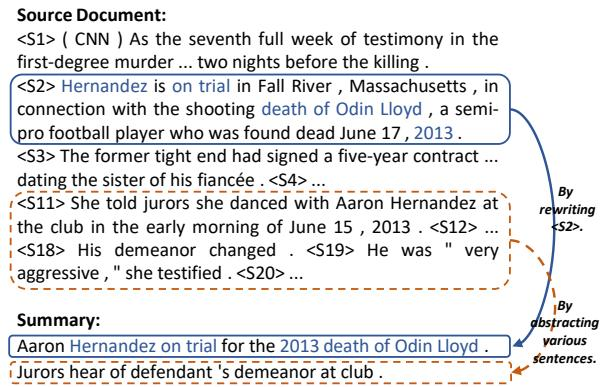
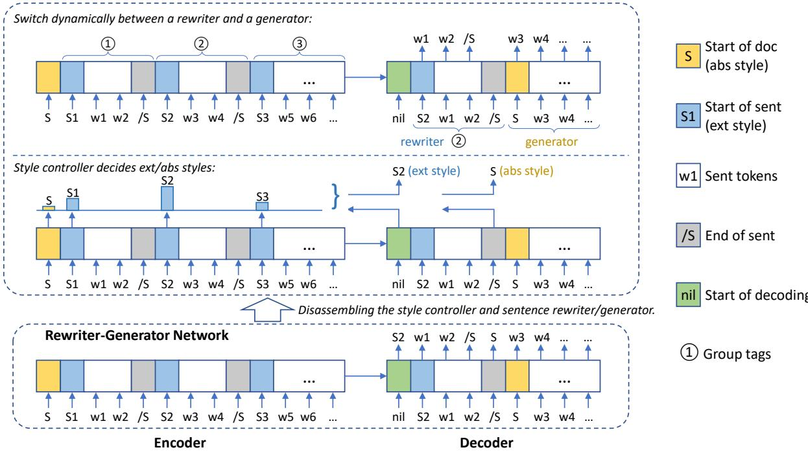
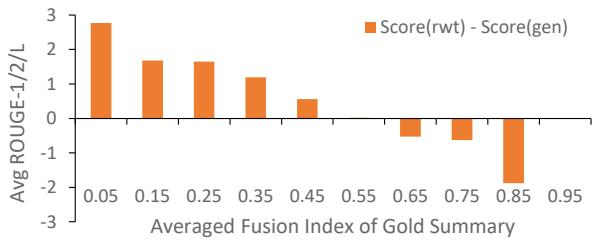
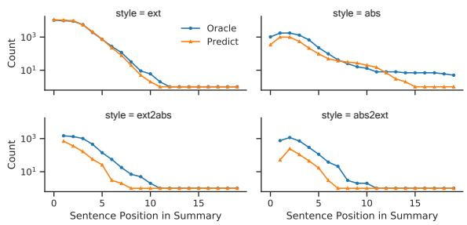
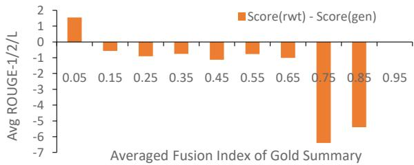
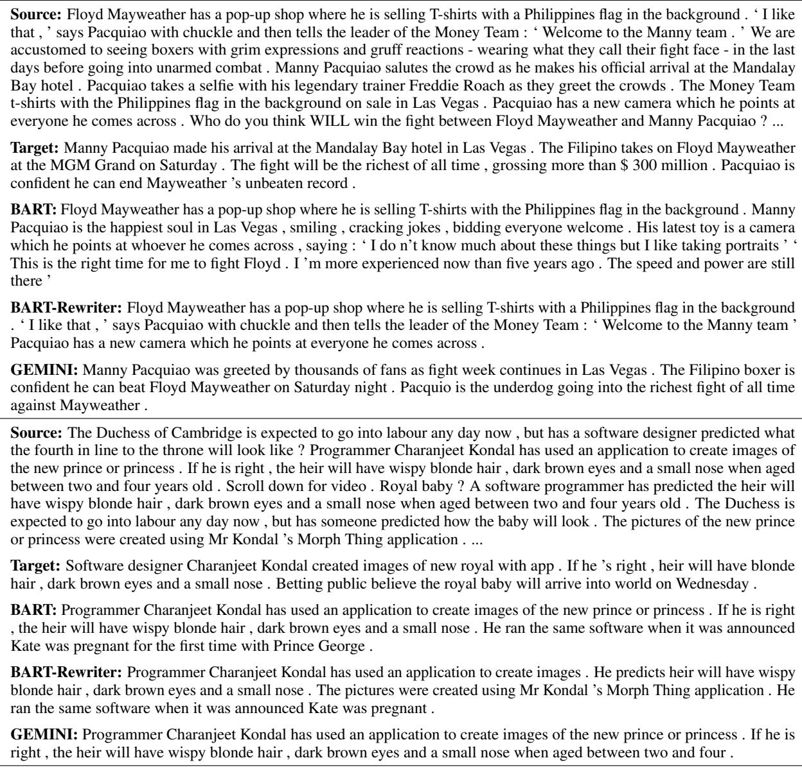

# GEMINI: Controlling The Sentence-Level Summary Style in Abstractive Text Summarization

Guangsheng Bao1,2, Zebin Ou2, and Yue Zhang∗,2,3,

1 Zhejiang University

2 School of Engineering, Westlake University

3 Institute of Advanced Technology, Westlake Institute for Advanced Study 2 {baoguangsheng, ouzebin, zhangyue}@westlake.edu.cn

## Abstract

Human experts write summaries using different techniques, including extracting a sentence from the document and rewriting it, or fusing various information from the document to abstract it. These techniques are flexible and thus difficult to be imitated by any single method. To address this issue, we propose an adaptive model, GEMINI, that integrates a rewriter and a generator to mimic the sentence rewriting and abstracting techniques, respectively. GEMINI adaptively chooses to rewrite a specific document sentence or generate a summary sentence from scratch. Experiments demonstrate that our adaptive approach outperforms the pure abstractive and rewriting baselines on three benchmark datasets, achieving the best results on WikiHow. Interestingly, empirical results show that the human summary styles of summary sentences are consistently predictable given their context. We release our code and model at https: //github.com/baoguangsheng/gemini.

## 1 Introduction

Text summarization aims to automatically generate a fluent and succinct summary for a given text document (Maybury, 1999; Nenkova and McKeown, 2012; Allahyari et al., 2017). Two dominant methods have been used, namely extractive and abstractive summarization techniques. Extractive methods (Nallapati et al., 2017; Narayan et al., 2018; Liu and Lapata, 2019; Zhou et al., 2020; Zhong et al., 2020) identify salient text pieces from the input and assemble them into an output summary, leading to faithful but possibly redundant and incoherent summaries (Chen and Bansal, 2018; Gehrmann et al., 2018; Cheng and Lapata, 2016), where rewriting techniques could be used to further reduce redundancy and increase coherence (Bae et al., 2019; Bao and Zhang, 2021). In contrast, abstractive methods (Rush et al., 2015; Nallapati et al., 2016;

  
Figure 1: Example of human summary from CNN/DM.

See et al., 2017; Lewis et al., 2020) apply natural language generation (NLG) technologies in synthesizing the output, which obtains more concise and coherent summaries, but at the cost of degraded faithfulness (Huang et al., 2020; Maynez et al., 2020).

The effectiveness of extractive and abstractive methods relies on the summary style of summaries. Study shows that human take different styles in writing each summary sentence (Jing and McKeown, 1999), which we categorize broadly into extractive and abstractive styles. Extractive style mainly conveys ideas directly from article sentences, while abstractive style conveys new ideas that are entailed from various article sentences. One example is shown in Figure 1, where the summary consists of two sentences. The first sentence is generated by rewriting sentence <S2> from the document. In contrast, the second summary sentence is generated by abstracting various sentences. These styles are flexible and thus difficult to be imitated by a single method.

In this paper, we aim to mimic human summary styles, which we believe can increase our ability to control the style and deepen our understanding of how human summaries are produced. To better adapt to summary styles in human summaries, we propose an adaptive model, GEMINI, which contains a rewriter and a generator to imitate the extractive style and the abstractive style, respectively. For the rewriter, we adopt contextualized rewriting (Bao and Zhang, 2021) integrated with an inner sentence extractor. For the generator, we use standard seq2seq summarizer (Lewis et al., 2020).

The rewriter and the generator are integrated into a single decoder, using a style controller to switch the style of a generation. The style controller assigns different group tags so that relevant sentences in the input can be used to guide the decoder. In the abstractive style, the decoder does not focus on a specific sentence, while in the extractive style, the decoder is guided by attending more to a particular rewritten sentence. In order to train such an adaptive summarizer, we generate oracle extractive/abstractive styles using automatic detection of sentence-level summary styles.

We evaluate our model on three representative benchmark datasets. Results show that GEMINI allows the model to better fit training data thanks to differentiating summary styles. Our adaptive rewriter-generator network outperforms the strong abstractive baseline and recent rewriter models with a significant margin on the benchmarks. Interestingly, experiments also show that the summary style of a sentence can be consistently predicted during test time, which shows that there is underline consistency in the human choice of summary style of a summary sentence in context. To our knowledge, we are the first to explicitly control the style per summary sentence, and at the same time, achieve improved ROUGE scores. Our automatic style detection metric allows further quantitative analysis of summary styles in the future.

## 2 Related Work

Abstractive summarizers achieve competitive results by fine-tuning on pre-trained seq2seq model (Lewis et al., 2020; Zhang et al., 2020). Our work is in line, with the contribution of novel style control over the summary sentence, so that a model can better fit human summaries in the “sentence rewriting” and “long-range abstractive” styles. Our generator is a standard seq2seq model with the same architecture as BART (Lewis et al., 2020), and our rewriter is related to previous single sentence rewriting (Chen and Bansal, 2018; Bae et al., 2019; Xiao et al., 2020) and contextualized rewriting (Bao and Zhang, 2021).

Our rewriter uses the contextualized rewriting mechanism, which considers the document context of each rewritten sentence, so that important information from the context can be recalled and crosssentential coherence can be maintained. However, different from Bao and Zhang (2021), which relies on an external extractor to select sentences, we integrate an internal extractor using the pointer mechanism (Vinyals et al., 2015), analogous to NeuSum (Zhou et al., 2020) to select sentences autoregressively. To our knowledge, we are the first to integrate a rewriter and a generator into a standalone abstractive summarizer.

<table><tr><td>Summary Style</td><td>CNN/DM</td><td>XSum</td><td>WikiHow</td></tr><tr><td>Extractive</td><td>88.6%</td><td>11.8%</td><td>61.1%</td></tr><tr><td>Abstractive</td><td>11.4%</td><td>88.2%</td><td>38.9%</td></tr></table>

Table 1: Human evaluation of sentence-level summary style on three datasets. The percentage denotes the ratio of summary sentences belonging to the style.

Our model GEMINI can also be seen as a mixture of experts (Jacobs et al., 1991), which dynamically switches between a rewriter and a generator. A related work is the pointer-generator network (See et al., 2017) for seq2seq modeling, which can also viewed as a mixture-of-expert model. Another related work is the HYDRASUM, which has two experts for decoding. These models can be viewed as a soft mixture of experts, which learns latent experts and makes decisions by integrating their outputs. In contrast, our model can be viewed as a hard mixture of experts, which consults either the rewriter or the generator in making a decision. A salient difference between the two models is that our GEMINI makes decisions for each sentence, while previous work makes decisions at the token level. The goals of the models are very different.

## 3 Summary Style at Sentence Level

## 3.1 Human Evaluation of Summary Style

We conduct a human evaluation of the summary style of each summary sentence, annotating as extractive style if the summary sentence can be implied by one of the article sentences, and abstractive style if the summary sentence requires multiple article sentences to imply. We sample 100 summary sentences for each dataset and ask three annotators to annotate them, where we take the styles receiving at least two votes as the final labels.

The averaged distributions of styles are shown in Table 1. CNN/DM is mostly extractive style, which has 88.6% summary sentences written in the extractive style. In contrast, XSum is mostly abstractive style, which has 88.2% summary sentences written in the abstractive style. WikiHow has a more balanced distribution of summary styles, with about 60% summary sentences in the extractive style. The results suggest that real summaries are a mixture of styles, even for the well-known extractive dataset CNN/DM and abstractive dataset XSum.

<table><tr><td rowspan="2">Dataset</td><td colspan="3">Novel n-grams</td><td colspan="2">Fragment</td><td rowspan="2">Ours Fusion Index</td></tr><tr><td>1-gram</td><td>2-gram</td><td>3-gram</td><td>Coverage</td><td>Density</td></tr><tr><td>CNN/DM</td><td>0.62</td><td>0.55</td><td>0.56</td><td>0.59</td><td>0.56</td><td>0.76</td></tr><tr><td>XSum</td><td>0.25</td><td>0.17</td><td>0.24</td><td>0.15</td><td>0.16</td><td>0.46</td></tr><tr><td>WikiHow</td><td>0.47</td><td>0.49</td><td>0.46</td><td>0.31</td><td>0.30</td><td>0.56</td></tr></table>

Table 2: Our automatic metrics compare with previous metrics in measuring fusion degrees. The number shows the Pearson correlation between the metric and human-annotated fusion degrees.

## 3.2 Automatic Detection of Summary Style

Because of the high cost of human annotation, we turn to automatic approaches to detect the summary styles at the sentence level. Previous studies mainly measure the summary style at the summary level. For example, Grusky et al. (2018) propose the coverage and density of extractive fragments to measure the extractiveness. See et al. (2017) propose the proportion of novel n-grams, which appear in the summary but not in the input document, as indicators of abstractiveness. We adopt these metrics to sentences and take them as baselines of our approach.

We proposefusion index to measure the degree of fusing context information (Barzilay and McKeown, 2005), considering two factors: 1) How much information from the summary sentence can be recalled from one document sentence? If the recall is high, the sentence is more likely to be extractive style because it can be produced by simply rewriting the document sentence. 2) How many document sentences does the summary sentence relate to? A larger number of such sentences indicates a higher fusion degree, where the summary sentence is more likely to be abstractive style. Our fusion index is calculated on these two factors.

Recall. We measure the percentage of recallable information by matching the summary sentence back to document sentences. Given a summary sentence $S$ and a source document $D =$ $\{ S _ { 1 } , S _ { 2 } , . . . , S _ { | D | } \}$ , we find the best-match

$$
R C ( S \mid D ) = \operatorname* { m a x } _ { 1 \leq i \leq \mid D \mid } R ( S \mid S _ { i } ) ,\tag{1}
$$

where $R ( S | S _ { i } )$ is an average of ROUGE-1/2/L recalls of S given $S _ { i }$ , representing the percentage of information of sentence $S$ covered by sentence $S _ { i }$

Scatter. We measure the scattering of the content of a summary sentence by matching the sentence to all document sentences. If the matching scores are equally distributed on all document sentences, the scatter is high; If the matching scores are all zero except for one document sentence, the scatter is low. We calculate the scatter using the distribution entropy derived from the matching scores.

$$
S C ( S \mid D ) = - \sum _ { j = 1 } ^ { K } p _ { j } \log p _ { j } / \log K ,\tag{2}
$$

where $p _ { j }$ is the estimated probability whether $S$ is generated from the corresponding document sentence $S _ { i }$ , calculated using the top-K best-matches $\{ r _ { j } \} | _ { j = 1 } ^ { K }$ that

$$
\begin{array} { c } { { \displaystyle p _ { j } = r _ { j } / \sum _ { j = 1 } ^ { K } r _ { j } , } } \\ { { \displaystyle \{ r _ { j } \} _ { j = 1 } ^ { K } = \mathrm { T o p } ( \{ R ( S | S _ { i } ) \mid 1 \leq i \leq | D | \} , K ) . } } \end{array}\tag{3}
$$

The hyper-parameter K is determined using an empirical search on the human evaluation set.

Fusion index. We calculate fusion index (FI) from Recall (RC) and Scatter (SC)

$$
F I ( S \mid D ) = ( 1 - R C ( S \mid D ) ) * S C ( S \mid D ) ,\tag{4}
$$

which represents the degree of fusion, where 0 means no fusion, 1 means extreme fusion, and others between.

We evaluate our metrics together with the candidates from previous studies, reporting the Pearson correlation with human-annotated summary styles as shown in Table 2. Our proposed fusion index gives the best correlation with summary styles. In contrast, among previous metrics, only the novel 1-gram has the closest correlation but is still lower than the fusion index by about 0.14 on average. The results suggest that the fusion index is a more suitable extractive-abstractive measure at the sentence level.

## 3.3 Oracle Label for Summary Style

We produce oracle extractive/abstractive labels using automatic fusion index so that we can train a summarizer with explicit style control at the sentence level. If the fusion index is higher than a threshold, we treat the sentence as extractive style. If the fusion index of the summary sentence is lower than the threshold, we treat the sentence as abstractive style. We search for the best threshold for each dataset using development experiments.

  
Figure 2: GEMINI uses a controller to decide ext/abs styles, and further switch the decoder accordingly between a rewriter and a generator. We express the identifier tokens $\mathbf { \bar { \Psi } } ^ { 6 6 } { < } \mathbf { S } > ^ { , }$ and $ { \mathrm { ^ { 6 6 } } } <  { \mathrm { S } } _ { k } > ^ { , , }$ in the concise form “S” and $\mathbf { \ddot { \rho } } ^ { 6 6 } \mathbf { S } _ { k } \mathbf { \vec { \rho } } ^ { , 5 }$ , and we use “w1 $\mathbf { w } 2 ^ { \flat }$ to represent the tokens in the first sentence and “w3 w4” the tokens in the second sentence. Group tags are converted into embeddings and added to the input token embeddings for both the encoder and decoder. The decoder predicts an identifier token to determine the group tag of the following timesteps, for example $" < \mathbf { S } 2 > "$ to start the group tag “2” until the end of the sentence $\mathrm { \bf { \ddot { \Phi } } } < / \mathrm { \bf { S } } > ^ { , }$

## 4 GEMINI: Rewriter-Generator Network

As Figure 2 shows, GEMINI adopts pre-trained BART (Lewis et al., 2020), using a style controller to decide the summary style. According to the style, either the rewriter or the generator is activated to generate each sentence.

Intuitively, GEMINI performs the best when it works on a dataset with a balanced style, which enables the rewriter and generator to complement each other, and when the oracle styles are of high accuracy so that the training supervision can be of high quality.

## 4.1 Input and Output

We introduce special identifier tokens, including $\mathbf { \bar { \Psi } } ^ { 6 6 } { < } \mathbf { S } > ^ { , , }$ - the start of a document, $\mathbf { \Delta } ^ { 6 6 } { < } \mathbf { S } _ { k } { > } ^ { , , }$ - the start of a sentence k, and $\mathrm { \bf { \tilde { \Delta } } } ^ { 6 } < / { \bf S } > ^ { 3 }$ - the end of a sentence.

We express the input document as $\^ { \ast } { < } S { > } < S _ { 1 } { > }$ sentence one . ${ < } / S { > } < S _ { 2 } { > }$ sentence two . ${ < } / S { > } < S _ { 3 } { > }$ sentence three . $< / S > \ldots ^ { }$ , where the sequence starts with the identifier token $\mathbf { \bar { \Psi } } ^ { 6 6 } { < } \mathbf { S } > ^ { , }$ and enclose each sentence with $\mathbf { \Delta } ^ { 6 6 } < \mathbf { S } _ { k } > ^ { , , }$ and $\mathrm { \bf { \ddot { \Phi } } } < / \mathrm { \bf { S } } > ^ { , }$ . We express the output summary as $^ { 6 6 } { < } S _ { 2 } { > }$ sentence one . ${ < } / {  { S } } { > }$ ${ < } S >$ sentence two . $< / S > \ldots ^ { }$ , where each sentence starts with $\mathrm { } ^ { \ast \cdot } < \mathrm { S } _ { k } > ^ { \mathrm { 3 } } \mathrm { o r } \mathrm { } ^ { \ast \cdot } < \mathrm { S } > ^ { \mathrm { 3 } }$ and ends with $\mathrm { \bf { \ddot { \Phi } } } < / \mathrm { \bf { S } } > ^ { , , }$ If a summary sentence starts with $\mathbf { \Delta } ^ { 6 6 } < \mathbf { S } _ { k } > ^ { , , }$ , the decoder will generate the sentence according to the k-th document sentence. If a summary sentence starts with $\mathbf { \bar { \Psi } } ^ { 6 6 } { < } \mathbf { S } > ^ { , }$ , the decoder will generate the sentence according to the whole document.

## 4.2 Document Encoder

We extend the embedding table to include the identifier tokens so that the style controller can match their embeddings to decide the summary style. We follow contextualized rewriting (Bao and Zhang, 2021) to allocate a group tag to each input sentence so that the rewriter can rely on these group tags to locate the rewritten sentence using multi-head attention, as the group tags $\textcircled{1} \textcircled{2} \textcircled{3}$ in Figure 2 illustrate.

Specifically, the first summary sentence and the second document sentence have the same group tag of 2 , which are converted to group-tag embeddings and added to the token embeddings in the sentence. Using a shared group-tag embedding table between the encoder and decoder, the decoder can be trained to concentrate on the second document sentence when generating the first summary sentence.

<table><tr><td rowspan="2">Dataset</td><td rowspan="2">Source</td><td rowspan="2">Train</td><td rowspan="2">Valid</td><td rowspan="2">Test</td><td colspan="2">Document</td><td colspan="3">Summary</td></tr><tr><td>Words</td><td>Sents</td><td>Words</td><td>Sents</td><td>#W/S</td></tr><tr><td>CNN/DM</td><td>News</td><td>287,227</td><td>13,368</td><td>11,490</td><td>788</td><td>36.9</td><td>56</td><td>3.8</td><td>15</td></tr><tr><td>XSum</td><td>News</td><td>204,045</td><td>11,332</td><td>11,334</td><td>431</td><td>18.7</td><td>23</td><td>1.0</td><td>23</td></tr><tr><td>WikiHow</td><td>Knowledge Base</td><td>168,128</td><td>6,000</td><td>6,000</td><td>584</td><td>32.2</td><td>62</td><td>7.5</td><td>8</td></tr></table>

Table 3: Datasets for evaluation. The number of words, the number of sentences, and the number of words per sentence (#W/S) are all average values.

Formally, we express the group-tag embedding table as $\operatorname { E M B } _ { t a g }$ and generate a group-tag sequence $G _ { X }$ uniquely from X according to the index of each sentence as

$$
G _ { X } = \{ k \mathrm { i f } w _ { i } \in \mathbb { S } _ { k } \mathrm { e l s e } 0 \} | _ { i = 1 } ^ { | X | } ,\tag{5}
$$

where for a token $w _ { i }$ in the k-th sentence $\mathbf { S } _ { k }$ we assign a group tag of number k. We convert $G _ { X }$ into embeddings and inject it in the BART encoder.

We take the standard Transformer encoding layers, which contain a self-attention module and a feed-forward module:

$$
\begin{array} { l } { x ^ { ( l ) } = { \bf L N } ( x ^ { ( l - 1 ) } + { \bf S E L F A T T N } ( x ^ { ( l - 1 ) } ) ) , } \\ { x ^ { ( l ) } = { \bf L N } ( x ^ { ( l ) } + { \bf F E E D F O R W A R D } ( x ^ { ( l ) } ) ) , } \end{array}\tag{6}
$$

where LN denotes layer normalization (Ba et al., 2016). The last layer L outputs the final encoder output $x _ { o u t } = x ^ { ( L ) }$ . The vectors $x _ { e m b }$ and $x _ { o u t }$ are passed to the decoder for prediction.

## 4.3 Summary Decoder

We extend the BART decoder with a style controller and a rewriter, while for the generator, we use the default decoder.

Style Controller. We use attention pointer (Vinyals et al., 2015) to predict the styles, where we weigh each input sentence (attention on $ { \mathrm { \ } } ^ { 6 6 } { < }  { \mathrm { S } } _ { k } >  { \mathrm { ? } } )$ or the whole document (attention on “<S>”). If $\mathbf { \bar { \Psi } } ^ { 6 6 } { < } \mathbf { S } { > } ^ { , , }$ receives the largest attention score, we choose the abs style, and $\mathrm { i f } <  { \mathbf { S } } _ { k } >$ receives the most attention score, we choose the ext style.

At the beginning of the summary or at the end of a summary sentence, we predict the style of the next summary sentence. We match the token output to the encoder outputs to decide the selection.

$$
y _ { m a t c h } = y _ { o u t } \times ( x _ { o u t } * \alpha + x _ { e m b } * ( 1 - \alpha ) ) ^ { T } ,\tag{7}
$$

where α is a trainable scalar to mix the encoder outputs $x _ { o u t }$ and token embeddings $x _ { e m b }$ . We match these mix embeddings to the decoder outputs $y _ { o u t } .$ obtaining the logits $y _ { m a t c h }$ of the pointer distribution. We only keep the logits for sentence identifiers, including “<S>” and $\mathbf { \Delta } ^ { 6 6 } < \mathbf { S } _ { k } > ^ { , , }$ , and predict the distribution using a softmax function.

Rewriter and Generator. We use the standard decoder as the backbone for both the rewriter and the generator. For the rewriter, we follow Bao and Zhang (2021) to apply group-tag embeddings to the input of the decoder. For the generator, we do not apply group-tag embeddings, so that it does not correspond to any document sentence.

Formally, given summary $Y = \{ w _ { j } \} | _ { j = 1 } ^ { | Y | }$ , we generate $G _ { Y }$ uniquely from Y according to the identifier token $\mathbf { \Delta } ^ { 6 6 } < \mathbf { S } _ { k } > ^ { , , }$ and $\mathbf { \Delta } ^ { 6 6 } { < } \mathbf { S } { > } ^ { 3 }$ that for each token $w _ { i }$ in the sentence started with $\mathbf { \Delta } ^ { * 6 } { < } \mathbf { S } _ { k } { > } ^ { , , }$ the group-tag is k and for that with $\mathbf { \bar { \Psi } } ^ { 6 6 } { < } \mathbf { S } > ^ { , }$ the grouptag is 0. For instance, if Y is the sequence $^ { 6 6 } { < } S _ { 2 } { > }$ w1 $w _ { 2 } < / S > < S > w _ { 3 } w _ { 4 } < / S > < S _ { 7 } > \ldots ^ { , , }$ , GY will be $\{ 2 , 2 , 2 , 2 , 0 , 0 , 0 , 0 , 7 , . . . \}$

We do not change the decoding layers, which contain a self-attention module, a cross-attention module, and a feed-forward module for each:

$$
\begin{array} { r l } & { y ^ { ( l ) } = \mathbf { L N } ( y ^ { ( l - 1 ) } + \mathbf { S E L F A T T N } ( y ^ { ( l - 1 ) } ) ) , } \\ & { y ^ { ( l ) } = \mathbf { L N } ( y ^ { ( l ) } + \mathbf { C R O S S A T T N } ( y ^ { ( l ) } , x _ { o u t } ) ) , } \\ & { y ^ { ( l ) } = \mathbf { L N } ( y ^ { ( l ) } + \mathbf { F E D F O R W A R D } ( y ^ { ( l ) } ) ) , } \end{array}\tag{8}
$$

where LN denotes layer normalization (Ba et al., 2016). The last layer L outputs the final decoder output $y _ { o u t }$ . The decoder output $y _ { o u t }$ is then matched with token embeddings for predicting the next tokens.

## 4.4 Training and Inference

We use MLE loss for both token prediction and style prediction. We calculate the overall loss as

$$
\mathcal { L } = \mathcal { L } _ { t o k e n } + \kappa * \mathcal { L } _ { s t y l e } ,\tag{9}
$$

where $\mathcal { L } _ { s t y l e }$ is the MLE loss of the style prediction, and $\mathcal { L } _ { t o k e n }$ is the MLE loss of the token prediction. Because of the different nature between style and token predictions, we use a hyper-parameter κ to coordinate their convergence speed of them. In practice, we choose κ according to the best performance on the development set.

<table><tr><td>Dataset</td><td>Method</td><td>R-1</td><td>R-2</td><td>R-L</td></tr><tr><td rowspan="8">CNN/DM</td><td>BRIO (Liu et al., 2022)</td><td>47.78</td><td>23.55</td><td>44.57</td></tr><tr><td>SimCLS (Liu and Liu, 2021)</td><td>46.67</td><td>22.15</td><td>43.54</td></tr><tr><td>GSum (Dou et al., 2021) PEGASUS (Zhang et al., 2020)</td><td>45.94 44.17</td><td>22.32 21.47</td><td>42.48 41.11</td></tr><tr><td>GOLD (Pang and He, 2020)</td><td>45.40</td><td>22.01</td><td>42.25</td></tr><tr><td>BERT-Rewriter (Bao and Zhang, 2021) BERT+Copy/Rewrite (Xiao et al., 2020)</td><td>43.52 42.92</td><td>20.57 19.43</td><td>40.56</td></tr><tr><td></td><td></td><td></td><td>39.35</td></tr><tr><td>BERT-Ext+Abs+RL (Bae et al., 2019)</td><td>41.90</td><td>19.08</td><td>39.64</td></tr><tr><td colspan="4">Fair Settings BART-Rewriter (Bao and Zhang, 2023) 44.26 21.23 BART (Lewis et al., 2020)</td></tr><tr><td rowspan="5">XSum</td><td>GEMINI (Ours) BRIO (Liu et al., 2022)</td><td>44.16 45.27* 49.07</td><td>21.28 21.77*</td><td>40.90 42.34*</td></tr><tr><td>GSum (Dou et al., 2021)</td><td>45.40</td><td>25.59 21.89</td><td>40.40 36.67</td></tr><tr><td>PEGASUS (Zhang et al., 2020)</td><td>47.21</td><td>24.56</td><td></td></tr><tr><td>GOLD (Pang and He, 2020)</td><td></td><td></td><td>39.25</td></tr><tr><td></td><td>45.85</td><td>22.58</td><td>37.65</td></tr><tr><td rowspan="7"></td><td>Fair Settings</td><td></td><td></td><td></td></tr><tr><td>HYDRASUM (Goyal et al., 2022) BART (Lewis et al., 2020)</td><td>44.61</td><td>20.91</td><td>36.17</td></tr><tr><td>GEMINI (Ours)</td><td>45.14</td><td>22.27</td><td>37.25</td></tr><tr><td>RefSum (Liu et al., 2021)</td><td>45.86*</td><td>22.55* 18.13</td><td>37.68*</td></tr><tr><td>GSum (Dou et al., 2021)</td><td>42.12</td><td></td><td>40.66</td></tr><tr><td>PEGASUS (Zhang et al., 2020)</td><td>41.74 41.35</td><td>17.73 18.51</td><td>40.09 33.42</td></tr><tr><td colspan="4">Fair Settings 41.46</td><td>17.80 39.89</td></tr></table>

Table 4: Automatic evaluation on ROUGE scores, where \* denotes the significance with a t-test of $p < 0 . 0 1$ compared to BART baseline. For a fair comparison, we list mainly the BART-based models as our baselines, leaving other pre-trained models, ensemble methods, and re-ranking techniques out of our scope for comparison.

During inference, the style controller is activated first to decide on an ext/abs style. If it chooses the ext style, the matched sentence identifier $\mathbf { \Delta } ^ { 6 6 } < \mathbf { S } _ { k } > ^ { , , }$ will be used to generate group tags for the following tokens. If it chooses the abs style, we make the tokens with a special group tag of 0.

## 5 Experimental Settings

We use three English benchmark datasets representing different styles and domains as shown in Table 3.

CNN/DailyMail (Hermann et al., 2015) is the most popular single-document summarization dataset, comprising online news articles and human written highlights.

XSum (Narayan et al., 2018) is an abstractive style summarization dataset built upon new articles with a one-sentence summary written by professional authors.

WikiHow (Koupaee and Wang, 2018) is a diverse summarization dataset extracted from the online knowledge base WikiHow, which is written by human authors.

To generate oracle styles, we use fusion index thresholds of $\gamma = 0 . 7 , \gamma = 0 . 7$ , and $\gamma = 0 . 3$ for CNN/DM, XSum, and WikiHow, respectively.

We train GEMINI using a two-stage strategy: pre-finetuning the new parameters and then joint fine-tuning all the parameters. Since we introduce additional structure and new parameters to the pre-trained BART, direct joint fine-tuning of the two types of parameters can cause a downgrade of the pre-trained parameters. We introduce prefinetuning to prepare the random-initialized parameters by freezing the pre-trained parameters and fine-tuning for 8 epochs before the joint fine-tuning. We use the same MLE loss for the two stages, using a convergence coordination parameter of $\kappa = 1 . 1$

## 6 Results

## 6.1 Automatic Evaluation

As Table 4 shows, we evaluate our model on three benchmark datasets, in comparison with other BART-based models in fair settings. We report automatic metric ROUGE-1/2/L (Lin, 2004).

Compared to the abstractive BART baseline, GEMINI improves the ROUGE scores by an average of 1.01, 0.48, and 1.25 on CNN/DM, XSum, and WikiHow, respectively. The improvements on

<table><tr><td>Method</td><td>Info.</td><td>Conc.</td><td>Read.</td><td>Faith.</td></tr><tr><td>BART</td><td>3.78</td><td>3.10</td><td>3.25</td><td>4.74</td></tr><tr><td>BART-Rewriter</td><td>3.90</td><td>3.45</td><td>3.12</td><td>4.85</td></tr><tr><td>GEMINI</td><td>3.93</td><td>4.27</td><td>3.86</td><td>4.82</td></tr></table>

Table 5: Human evaluation on informativeness, conciseness, readability, and faithfulness on CNN/DM. GEM-INI improves conciseness and readability by a large margin while maintaining other qualities.

ROUGE-L of CNN/DM and ROUGE-2 of Wiki-How are especially significant, reaching 1.44 and 1.56, respectively. The results suggest that the adaptive approach has an obvious advantage over the pure abstractive model.

Compared with the rewriter baseline BART-Rewriter, which relies on an external extractor to provide rewriting sentences, GEMINI improves the ROUGE-1/L scores by about 1.0 on CNN/DM, demonstrating the effectiveness of the adaptive approach compared with the pure rewriter. Compared with the HYDRASUM, which expresses the summary styles implicitly using a mixture of experts but obtains lower ROUGE scores than BART baseline, GEMINI achieves improved ROUGE scores using an explicit style control. The results demonstrate the advantage of a model with adaptive styles over pure rewriter and implicit style control.

Table 4 lists additional recent work using larger pre-training, assembling, reranking, and reinforcement learning techniques. However, these models are not directly comparable with our model. For example, PEGASUS (large) has 568M parameters, outnumbering BART (large) 400M by 42%. BRIO takes 20 hours per epoch and a total of 15 epochs to train on CNN/DM using 4 NVIDIA RTX 3090 GPUs, while our model only takes 2 hours per epoch and a total of 11 epochs to train on the same device, using only 7% computing resources of BRIO. We do not take these models as our baselines because they are in different lines of work using techniques perpendicular to this study. More importantly, we focus on the sentence-level summary style and its control instead of only ROUGE improvement.

## 6.2 Human Evaluation

We conduct a human evaluation to quantitatively measure the quality of generated summaries. We compare GEMINI with BART and BART-Rewriter baselines, studying four qualities, including informativeness, conciseness, readability, and faithfulness. We follow recent HYDRASUM (Goyal et al., 2022) and SummaReranker (Ravaut et al.,

  
Figure 3: The rewriter (rwt) has higher average ROUGE scores than the generator (gen) on the buckets with low fusion index, evaluated on CNN/DM.

2022) to sample 50 documents from the test set of CNN/DM for the evaluation. We hire three graduate students with professional English proficiency (TOEFL scores above 100 out of 120) to annotate each candidate summary from 1 (worst) to 5 (best), and report the average scores across the three annotators.

As shown in Table 5, GEMINI achieves the best score overall, especially on conciseness and readability. Compared to BART-Rewriter, GEMINI gives close scores on informativeness and faithfulness, but higher scores on conciseness and readability. Compared to BART, GEMINI obtains better scores on the four metrics.

The explicit style control of GEMINI plays the role of a rough planner, which restricts the generation of content. Empirically, it generates summaries with a smaller number of sentences (3.3 sents/summary) than BART (3.9 sents/summary) and BART-Rewriter (3.7 sents/summary) on CNN/DM. As a result, GEMINI produces more concise summaries with lengths 20% shorter than BART and 10% shorter than BART-Rewriter but still obtains higher n-gram recalls as the higher ROUGE-1/2 in Table 4 shows, suggesting that the summaries generated by GEMINI tend to have denser information. We speculate the high readability of GEMINI is a result of its auto-regressive modeling of style prediction and sentence generation, through which the style transitions are optimized. We list two cases in Appendix A to illustrate the advantage of GEMIN on conciseness and readability.

## 6.3 Ablation Study

Rewriter vs. Generator. We further study our adaptive model by observing the contribution of the rewriter and the generator individually. We categorize the test samples in CNN/DM into 10 buckets according to the average fusion index, obtaining an averaged ROUGE-1/2/L score per bucket. We contrast the ROUGE scores of the rewriter (rwt) and the generator (gen) as Figure 3. We can see that the rewriter dominates the performance on the region of low fusion index, while the generator rules the region of high fusion index. The distribution of ROUGE scores for the rewriter and the generator illustrates the specialization of the two styles.

  
Figure 4: Distribution of styles and style transitions per sentence position in summary, evaluated on CNN/DM. The upper two sub-figures are about style distribution, while the under two are about style transitions. The sentence position denotes the ordinal number of the sentence in the summary.

Pre-finetuning. Pre-finetuning changes the distribution of randomly-initialized parameters. Take GEMINI on CNN/DM as an example. The initial average norms of embeddings for sentence identifiers and group tags are both 0.06, which are set purposely to a small value to reduce the negative impact on the pre-trained network. If we fine-tune the model directly, the trained model has average norms of 0.44 and 0.17 for sentence identifiers and group tags, respectively. However, if we prefinetune the model for 8 epochs, the average norms climb to 0.92 and 0.63, respectively. After a followup fine-tuning, the average norms converge to 0.66 and 0.50, respectively, which are much higher than the model fine-tuned directly.

If we remove pre-finetuning, the performance of GEMINI on CNN/DM decreases from 45.27, 21.77, and 42.34 to 44.76, 21.60, and 41.71, respectively, on ROUGE-1/2/L, suggesting the necessity of the pre-finetuning stage.

## 7 Analysis

We try to answer two key questions related to sentence-level summary style control as follows.

## 7.1 Are sentence-level summary styles predictable?

We use oracle styles to train our model, which allows the model to be more easily trained. However, during testing, the summary style of each sentence can be arbitrarily chosen. It remains an interesting research question whether the style in the test set is predictable to some extent.

<table><tr><td>Method</td><td>R-1</td><td>R-2</td><td>R-L</td></tr><tr><td colspan="4">CNN/DM</td></tr><tr><td>GEMINI</td><td>45.27</td><td>21.77</td><td>42.34</td></tr><tr><td>– with random styles – with oracle styles</td><td>42.94 46.09</td><td>18.77 22.09</td><td>39.93 43.16</td></tr><tr><td colspan="4">XSum</td></tr><tr><td>GEMINI</td><td>45.86</td><td>22.55</td><td>37.68</td></tr><tr><td>– with random styles</td><td>45.71</td><td>22.43</td><td>37.56</td></tr><tr><td>– with oracle styles</td><td>45.94</td><td>22.70</td><td>37.79</td></tr><tr><td colspan="4">WikiHow</td></tr><tr><td>GEMINI</td><td>42.43</td><td>19.36</td><td>41.12</td></tr><tr><td>– with random styles</td><td>41.26</td><td>17.93</td><td>39.93</td></tr><tr><td>– with oracle styles</td><td>42.70</td><td>19.81</td><td>41.49</td></tr></table>

Table 6: Contribution of style prediction in comparison with random styles and oracle styles.

We try to answer this question using a quantitative analysis of style distribution on CNN/DM. We obtain an F1 of 0.78 for the style prediction, where more detailed distributions are shown as the upper sub-figures in Figure 4. The distribution of the predicted styles matches that of the oracle styles, except on a narrow range among sentence positions above 15, where the predicted abs style has less possibility than the oracle abs style. For the distribution of style transitions, as the under sub-figures show, the transitions ext-to-abs and abs-to-ext show some difference between the prediction and the oracle, where the predicted style transitions are overall less frequent than the oracle style transitions but with the same trends. The figures demonstrate the consistency in the distribution of predicted and oracle styles, suggesting that the styles are predictable to a certain degree.

We further evaluate the contribution of predicted styles by comparing the performance with the GEMINI decoding using randomly selected styles and oracle styles. As shown in Table 6, when we replace the predicted styles with random styles, the performance decreases by an average of 2.58 ROUGE points on CNN/DM and by an average of 1.26 on WikiHow. The performance drop indicates that the model’s predictions of styles provide useful information to generate high-quality summaries. The prediction ability comes from the understanding of the input document. This also suggests that there is a consistent tendency in choosing the summary style of a summary sentence given its existing context.

  
Figure 5: The rewriter (rwt) has higher average ROUGE scores than the generator (gen) on the buckets with a low fusion index, evaluated on WikiHow.

## 7.2 When will the adaptive model perform the best?

Intuitively, GEMINI works best on a dataset with a balanced style so that the rewriter and generator complement each other. More importantly, the oracle styles need to be accurate to obtain highquality supervision signals.

First, the distribution of the dataset matters. Among the three datasets, WikiHow has the most balanced style which has 61.1% of the summary sentences preferring a rewriter. As a result, GEM-INI obtains the most performance improvement on WikiHow by an average of 1.25 ROUGE points compared to the pure abstractive baseline, confirming our intuition about the relation between dataset distribution and model performance.

Second, complementary rewriter and generator are the essential prerequisites. As Figure 3 shows, the rewriter and generator on CNN/DM have relatively balanced capabilities, when the fusion index is below 0.55 the rewriter is preferred and above 0.55 the generator is preferred. In comparison, as shown in Figure 5, the rewriter and generator on WikiHow have skewed capabilities, where the rewriter is weak and only preferred when the fusion index is below 0.15. Consequently, GEMINI only generates ext-style for 19.3% of the summary sentences in contrast to the human assessment of 61.1%. The analysis suggests that GEMINI on WikiHow could be further enhanced by using a better rewriter, which could potentially be realized by using an improved sentence extractor.

Last, the quality of oracle styles determines the specialization of the two generators. As shown in Table 2, the Pearson correlation of the fusion index on WikiHow is only 0.56, which is much less than 0.76 on CNN/DM. It suggests a further improvement space on oracle styles by developing better automatic metrics.

## 8 Discussion

In this paper, we simulate human summary styles at the sentence level and provide a better understanding of how human summaries are produced. Based on this understanding, researchers could use GEM-INI for different purposes. First, the automatic metric Fusion Index could be used to analyze the style distribution when developing a new dataset. Second, GEMINI could be used to control summary style at the sentence level. Since the ext-style summary sentences are naturally less likely to hallucinate than abs-style summary sentences, we could control the faithful risks by determining the proportion of abs-style summary sentences. Last, GEM-INI produces an explicit style for each summary sentence, so we could even warn the faithful risks by marking those abs-style summary sentences in critical applications.

Limitations. GEMINI can fit the summarization style of a specific dataset so that the rewriter and generator specialize in different situations, which may enhance the quality of the rewriter and generator. However, we do not know if such an adaptive method actually improves the “abstraction” ability of a summary generation model. We do not have a reliable measure for the abstraction ability to evaluate the trained generator for now. We will consider it in our future research.

## 9 Conclusion

We investigated the sentence-level summary styles of human-written summaries, and evaluated the style distributions of the three benchmark datasets. We propose a fusion-index measure to detect sentence-level summary style automatically, using which we generate oracle styles for training our adaptive model. Experiments show that our GEMINI significantly outperforms pure abstractive and rewriter baselines on the benchmarks, demonstrating the effectiveness of fine-grained control in summary styles.

## Acknowledgments

We appreciate the constructive comments from the anonymous reviewers. We gratefully acknowledge funding from the Pioneer and "Leading Goose" R&D Program of Zhejiang (No.2022SDXHDX0003) and the National Natural Science Foundation of China (NSFC No.62161160339).

## References

Mehdi Allahyari, Seyedamin Pouriyeh, Mehdi Assefi, Saeid Safaei, Elizabeth D Trippe, Juan B Gutierrez, and Krys Kochut. 2017. Text summarization techniques: A brief survey. International Journal ofAdvanced Computer Science and Applications (ijacsa), 8(10):397.

Jimmy Lei Ba, Jamie Ryan Kiros, and Geoffrey E Hinton. 2016. Layer normalization. arXiv preprint arXiv:1607.06450.

Sanghwan Bae, Taeuk Kim, Jihoon Kim, and Sanggoo Lee. 2019. Summary level training of sentence rewriting for abstractive summarization. In Proceedings of the 2nd Workshop on New Frontiers in Summarization, pages 10–20, Hong Kong, China. Association for Computational Linguistics.

Guangsheng Bao and Yue Zhang. 2021. Contextualized rewriting for text summarization. In Proceedings of the AAAI Conference on Artificial Intelligence, volume 35, pages 12544–12553.

Guangsheng Bao and Yue Zhang. 2023. A general contextualized rewriting framework for text summarization. IEEE/ACM Transactions on Audio, Speech, and Language Processing.

Regina Barzilay and Kathleen R McKeown. 2005. Sentence fusion for multidocument news summarization. Computational Linguistics, 31(3):297–328.

Yen-Chun Chen and Mohit Bansal. 2018. Fast abstractive summarization with reinforce-selected sentence rewriting. In Proceedings of the 56th Annual Meeting ofthe Associationfor Computational Linguistics (Volume 1: Long Papers), pages 675–686, Melbourne, Australia. Association for Computational Linguistics.

Jianpeng Cheng and Maria Lapata. 2016. Neural summarization by extracting sentences and words. In 54th Annual Meeting ofthe Associationfor Computational Linguistics, pages 484–494. Association for Computational Linguistics.

Zi-Yi Dou, Pengfei Liu, Hiroaki Hayashi, Zhengbao Jiang, and Graham Neubig. 2021. Gsum: A general framework for guided neural abstractive summarization. In Proceedings ofthe 2021 Conference of the North American Chapter of the Association for Computational Linguistics: Human Language Technologies, pages 4830–4842.

Sebastian Gehrmann, Yuntian Deng, and Alexander M Rush. 2018. Bottom-up abstractive summarization. In Proceedings of the 2018 Conference on Empirical Methods in Natural Language Processing, pages 4098–4109.

Tanya Goyal, Nazneen Rajani, Wenhao Liu, and Wojciech Krysci´ nski. 2022. Hydrasum: Disentan-´ gling style features in text summarization with multidecoder models. In Proceedings of the 2022 Conference on Empirical Methods in Natural Language Processing, pages 464–479.

Max Grusky, Mor Naaman, and Yoav Artzi. 2018. Newsroom: A dataset of 1.3 million summaries with diverse extractive strategies. In Proceedings of the 2018 Conference of the North American Chapter of the Associationfor Computational Linguistics: Human Language Technologies, Volume 1 (Long Papers), pages 708–719, New Orleans, Louisiana. Association for Computational Linguistics.

Karl Moritz Hermann, Tomás Kociský, Edward Grefenstette, Lasse Espeholt, Will Kay, Mustafa Suleyman, and Phil Blunsom. 2015. Teaching machines to read and comprehend. In Advances in Neural Information Processing Systems 28: Annual Conference on Neural Information Processing Systems 2015, December 7-12, 2015, Montreal, Quebec, Canada, pages 1693– 1701.

Dandan Huang, Leyang Cui, Sen Yang, Guangsheng Bao, Kun Wang, Jun Xie, and Yue Zhang. 2020. What have we achieved on text summarization? In Proceedings of the 2020 Conference on Empirical Methods in Natural Language Processing (EMNLP), pages 446–469.

Robert A Jacobs, Michael I Jordan, Steven J Nowlan, and Geoffrey E Hinton. 1991. Adaptive mixtures of local experts. Neural computation, 3(1):79–87.

Hongyan Jing and Kathleen R McKeown. 1999. The decomposition of human-written summary sentences. In Proceedings ofthe 22nd annual international ACM SIGIR conference on Research and development in information retrieval, pages 129–136.

Mahnaz Koupaee and William Yang Wang. 2018. Wikihow: A large scale text summarization dataset. arXiv preprint arXiv:1810.09305.

Mike Lewis, Yinhan Liu, Naman Goyal, Marjan Ghazvininejad, Abdelrahman Mohamed, Omer Levy, Veselin Stoyanov, and Luke Zettlemoyer. 2020. BART: Denoising sequence-to-sequence pre-training for natural language generation, translation, and comprehension. In Proceedings ofthe 58th Annual Meeting of the Association for Computational Linguistics, pages 7871–7880, Online. Association for Computational Linguistics.

Chin-Yew Lin. 2004. Rouge: A package for automatic evaluation of summaries. In Text summarization branches out, pages 74–81.

Yang Liu and Mirella Lapata. 2019. Text summarization with pretrained encoders. In Proceedings of the 2019 Conference on Empirical Methods in Natural Language Processing and the 9th International Joint Conference on Natural Language Processing (EMNLP-IJCNLP), pages 3730–3740, Hong Kong, China. Association for Computational Linguistics.

Yixin Liu, Zi-Yi Dou, and Pengfei Liu. 2021. Refsum: Refactoring neural summarization. In Proceedings of the 2021 Conference of the North American Chapter of the Association for Computational Linguistics: Human Language Technologies, pages 1437–1448.

Yixin Liu and Pengfei Liu. 2021. Simcls: A simple framework for contrastive learning of abstractive summarization. In Proceedings ofthe 59th Annual Meeting of the Association for Computational Linguistics and the 11th International Joint Conference on Natural Language Processing (Volume 2: Short Papers), pages 1065–1072.

Yixin Liu, Pengfei Liu, Dragomir Radev, and Graham Neubig. 2022. Brio: Bringing order to abstractive summarization. In Proceedings ofthe 60th Annual Meeting of the Association for Computational Linguistics (Volume 1: Long Papers), pages 2890–2903.

Mani Maybury. 1999. Advances in automatic text summarization. MIT press.

Joshua Maynez, Shashi Narayan, Bernd Bohnet, and Ryan McDonald. 2020. On faithfulness and factuality in abstractive summarization. In Proceedings of the 58th Annual Meeting of the Association for Computational Linguistics, pages 1906–1919.

Ramesh Nallapati, Feifei Zhai, and Bowen Zhou. 2017. Summarunner: A recurrent neural network based sequence model for extractive summarization of documents. In Thirty-First AAAI Conference on Artificial Intelligence.

Ramesh Nallapati, Bowen Zhou, Cicero dos Santos, Çaglar Gulçehre, and Bing Xiang. 2016. Abstractive˘ text summarization using sequence-to-sequence rnns and beyond. In Proceedings of The 20th SIGNLL Conference on Computational Natural Language Learning, pages 280–290.

Shashi Narayan, Shay B Cohen, and Mirella Lapata. 2018. Don’t give me the details, just the summary! topic-aware convolutional neural networks for extreme summarization. In Proceedings of the 2018 Conference on Empirical Methods in Natural Language Processing, pages 1797–1807.

Ani Nenkova and Kathleen McKeown. 2012. A survey of text summarization techniques. In Mining text data, pages 43–76. Springer.

Richard Yuanzhe Pang and He He. 2020. Text generation by learning from demonstrations. In International Conference on Learning Representations.

Mathieu Ravaut, Shafiq Joty, and Nancy Chen. 2022. Summareranker: A multi-task mixture-of-experts reranking framework for abstractive summarization. In Proceedings of the 60th Annual Meeting of the Associationfor Computational Linguistics (Volume 1: Long Papers), pages 4504–4524.

Alexander M Rush, Sumit Chopra, and Jason Weston. 2015. A neural attention model for abstractive sentence summarization. In Proceedings of the 2015 Conference on Empirical Methods in Natural Language Processing, pages 379–389.

Abigail See, Peter J. Liu, and Christopher D. Manning. 2017. Get to the point: Summarization with pointergenerator networks. In Proceedings ofthe 55th Annual Meeting ofthe Associationfor Computational Linguistics (Volume 1: Long Papers), pages 1073– 1083, Vancouver, Canada. Association for Computational Linguistics.

Oriol Vinyals, Meire Fortunato, and Navdeep Jaitly. 2015. Pointer networks. Advances in Neural Information Processing Systems, 28:2692–2700.

Liqiang Xiao, Lu Wang, Hao He, and Yaohui Jin. 2020. Copy or Rewrite: Hybrid Summarization with Hierarchical Reinforcement Learning. Proceedings ofthe AAAI Conference on Artificial Intelligence (AAAI).

Jingqing Zhang, Yao Zhao, Mohammad Saleh, and Peter Liu. 2020. Pegasus: Pre-training with extracted gap-sentences for abstractive summarization. In International Conference on Machine Learning, pages 11328–11339. PMLR.

Ming Zhong, Pengfei Liu, Yiran Chen, Danqing Wang, Xipeng Qiu, and Xuan-Jing Huang. 2020. Extractive summarization as text matching. In Proceedings of the 58th Annual Meeting of the Association for Computational Linguistics, pages 6197–6208.

Qingyu Zhou, Nan Yang, Furu Wei, Shaohan Huang, Ming Zhou, and Tiejun Zhao. 2020. A joint sentence scoring and selection framework for neural extractive document summarization. IEEE/ACM Transactions on Audio, Speech, and Language Processing, 28:671– 681.

  
Table 7: Comparison of generated summaries from BART, BART-Rewriter, and GEMINI, evaluated on CNN/DM.

## A Case Study

As Table 7 shows, the summaries generated by GEMINI are generally more readable and concise than the summaries generated by the BART and BART-Rewriter.