# MAGNIFICO: Evaluating the In-Context Learning Ability of Large Language Models to Generalize to Novel Interpretations

Arkil PatelSatwik BhattamishraSiva ReddyDzmitry Bahdanau

Mila and McGill University ServiceNow ResearchUniversity of Oxford Facebook CIFAR AI Chair Canada CIFAR AI Chair

{arkil.patel, siva.reddy, bahdanau}@mila.quebec satwik.bmishra@cs.ox.ac.uk

## Abstract

Humans possess a remarkable ability to assign novel interpretations to linguistic expressions, enabling them to learn new words and understand community-specific connotations. However, Large Language Models (LLMs) have a knowledge cutoff and are costly to finetune repeatedly. Therefore, it is crucial for LLMs to learn novel interpretations in-context. In this paper, we systematically analyse the ability of LLMs to acquire novel interpretations using incontext learning. To facilitate our study, we introduce MAGNIFICO, an evaluation suite implemented within a text-to-SQL semantic parsing framework that incorporates diverse tokens and prompt settings to simulate real-world complexity. Experimental results on MAGNIFICo demonstrate that LLMs exhibit a surprisingly robust capacity for comprehending novel interpretations from natural language descriptions as well as from discussions within long conversations. Nevertheless, our findings also highlight the need for further improvements, particularly when interpreting unfamiliar words or when composing multiple novel interpretations simultaneously in the same example. Additionally, our analysis uncovers the semantic predispositions in LLMs and reveals the impact of recency bias for information presented in long contexts.

## 1 Introduction

Humans can assign new interpretations to words or phrases in a language and consequently use them compositionally in utterances. For instance, the word zoom’ is increasingly used to refer to a virtual calling service in the context of the COVID-19 pandemic. Similarly, as our society progresses, new words such as binge-watching' and ‘selfie keep getting coined frequently and become a part of our daily usage. Moreover, in regular conversations, people might assign custom interpretations to words or phrases (e.g., see the interpretation of underpaid’ in Figure 2). The question of whether language models are similarly capable of assigning novel interpretations to words and phrases is therefore interesting and requires investigation.

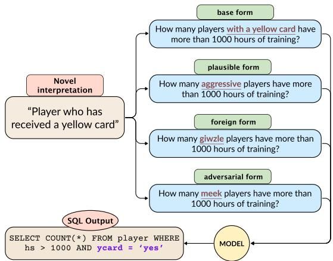  
Figure 1: An example from MAGNIFICo illustrating a novel interpretation denoted by plausible, foreign, and adversarial forms. The corresponding base example is also provided.

The task of learning novel interpretations has predominantly been studied from the perspective of inetuning a model, particularly the word embeddings, to acquire novel words during training (Lampinen and McClelland, 2017; Pham et al., 2018; Schick and Schütze, 2019). Prior studies on compositional generalization (Lake and Baroni, 2018; Kim and Linzen, 2020) also attempt to evaluate novel word learning using specially crafted train-test splits in which certain combinations of words are systematically held out from the test set. In recent years, however, contemporary Large Language Models (LLMs) have brought about a paradigm shift away from the classical train-test setup with their incredible capacity to learn new tasks in-context (Brown et al., 2020). With this study, we seek to understand how well can LLMs acquire novel interpretations in-context. Compared to previous setups, in-context learning (ICL) is also more practical since it is difficult to train models every time a new interpretation is encountered.

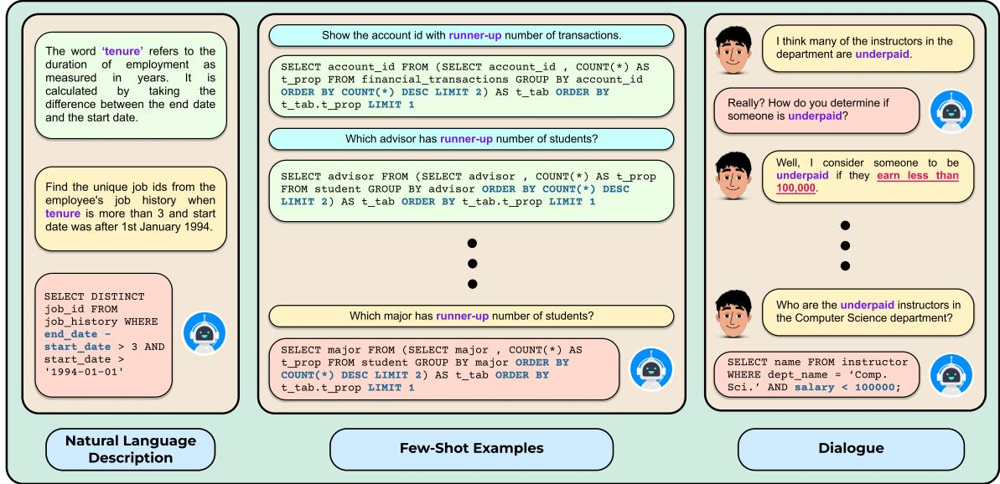  
Figure 2: We consider several scenarios of how a novel interpretation can be introduced in the prompt. Left: A natural language description of the novel interpretation tenure’ is provided with the question. Centre: Few-shot examples illustrating usage of the novel interpretation runner-up' are provided with the question. Right: Dialogue context describing the novel interpretation underpaid’ is provided with the question

In this work, we systematically analyse the ability of LLMs to in-context learn novel interpretations. We summarize our contributions below.

Evaluation Suite. To facilitate our analysis, we create an evaluation suite, MAGNIFICo: Measuring Adaptability and Generalization to Novel Interpretations For In-Context Learning. Each example in MAGNIFICo is a text-to-SQL semantic parsing problem that requires models to understand one or more novel interpretations used in the input text to generate the correct SQL query. To simulate real-world diversity and complexity, we experiment with different ways of introducing new interpretations to the model (see Figure 2).

Capabilities of LLMs. We extensively experiment with 11 LLMs to understand their ability for learning novel interpretations in-context. Experiments on MAGNIFICo reveal that LLMs show a high degree of capability in learning novel interpretations even from a brief natural language description of the interpretation or from a longform conversation. For larger LMs, learning from a description is competitive to providing explicit few-shot examples.

Challenges for LLMs. We find that LLMs severely fail at learning multiple novel interpretations simultaneously. Moreover, we observed that LLMs find it more challenging to learn interpretations for unfamiliar words. Our analysis also shows that LLMs have a recency bias and might find it difficult to learn interpretations presented earlier in the context.

## 2 Related Work

Word Learning. Previous works (Wang et al., 2017; Herbelot and Vecchi, 2016; Lampinen and McClelland, 2017; Pham et al., 2018; Schick and Schütze, 2019) have developed task- or modelspecific approaches for learning the embeddings of novel words. However, these methods cannot be applied in diverse scenarios with contemporary Large Language Models (LLMs). In this work, we take a more practical approach by evaluating how well do LLMs understand novel interpretations of words and phrases in-context on top of a grounded NLP task, text-to-SQL semantic parsing.

There are a limited number of works that analyse the novel word learning abilities of LLMs. Haley (2020) and Thrush et al. (2020) analysed novel word learning with BERT (Devlin et al., 2019) using synthetic tests. However, it is unclear how their findings relate to autoregressive LLMs. Brown et al. (2020) qualitatively tested GPT-3's ability to use a novel word in a sentence after seeing its definition. Eisenschlos et al. (2023) analyse the in-context word learning abilities of LLMs using a synthetic co-reference resolution task. In this paper, however, we work on a more practical task and take a broader view of the problem by studying the acquisition of novel interpretations, which can arise even from existing words and phrases in the vocabulary. We also study compositional generalization of multiple novel interpretations simultaneously.

<table><tr><td>CATEGORY</td><td>INTERPRETATION</td><td>EXAMPLES</td></tr><tr><td>Basic Operations</td><td>Minimum</td><td>Input: What are the name, latitude, and city of the station with the baseline latitude? Output: SELECT name, lat, city FROM station ORDER BY lat LIMIT 1</td></tr><tr><td>Subquery-based Operations</td><td>Most-frequent</td><td>Input: Display the sex and first name of students with the prevalent major. Output: SELECT Sex, Fname FROM Student WHERE Major IN (SELECT Major FROM Student GROUP BY Major ORDER BY COUNT(*) DESC LIMIT 1)</td></tr><tr><td>Value-based Filtering</td><td>4 credit courses</td><td>Input: List the names of all heavy courses ordered by their titles and credits. Output: SELECT title FROM course WHERE credits = 4 ORDER BY title, credits</td></tr><tr><td>Column Operations</td><td>Concatenation of last and first name</td><td>Input: How many students are there with &#x27;gE&#x27; in alias? Output: SELECT COUNT(*) FROM student WHERE 1name I| fname LIKE &#x27;%gE%&#x27;</td></tr></table>

Table 1: Examples of novel interpretations in MAGNIFICo. Illustrated examples use a plausible English form.

Compositional Generalization. Recent works (Lake and Baroni, 2018; Kim and Linzen, 2020; Keysers et al., 2020) proposed benchmarks with a systematic difference between the train and test sets: novel combinations of certain words are held out from the train set. However, such evaluation setups are susceptible to fairness issues (Sikarwar et al., 2022) arising from the dependence on a train set. Moreover, model-independent factors in the train set can influence generalization performance (Patel et al., 2022). Our evaluation framework is set within the paradigm of in-context learning (ICL), which does not require the creation of an explicit train set. Note that even in ICL settings, LLMs have saturated existing compositional generalization benchmarks (Drozdov et al., 2023). More recently, An et al. (2023) proposed a new benchmark, CoFE, for in-context compositional generalization. However, their focus was on understanding the factors affecting better selection of in-context examples for compositional generalization. Moreover, the examples in CoFE are based on another synthetic benchmark, while we focus on more realistic settings using a grounded text-to-SQL task.

Knowledge-intensive text-to-SQL. Works on knowledge-intensive text-to-SQL (Li et al., 2023a; Lee et al., 2021; Zhao et al., 2022; Dou et al., 2022) have some similarities with our work in that they assign schema-specific external knowledge to words or phrases in the input query. However, our interpretations are much more dynamic and do not have pre-defined formal definitions. Moreover, the focus of these works is on domain generalization for text-to-SQL semantic parsing. We only use text-to-SQL as a testbed since it allows us to more formally ground meanings of interpretations and has real-world applicability.

## 3 MAGNIFICO

We choose the text-to-SQL task to test LLMs’ ability to handle novel interpretations because of its relevance to real-world applications. Moreover, contemporary LLMs already achieve good zero/fewshot in-context performance on the task. We create MAGNIFICo by modifying and re-tasking examples from an existing text-to-SQL benchmark, Spider (Yu et al., 2018). Below, we describe the procedure in detail.

## 3.1 Novel Interpretations

We define a set of 24 interpretations that are either already being used or can be introduced in the examples of Spider:

\* Basic operations: Standard column operations frequently used in SQL queries.

★ Subquery-based operations: Complex operations using nested subqueries.

★ Value-based filtering: Particular subset of values for specific columns.

★ Column operations: Operations performed over specific columns.

Table 1 provides examples of some of the interpretations that we defined. We will refer to the word or phrase used to denote the novel interpretation on the source side of the example as its form. We defined 18 interpretations denoted by a single word form and 6 interpretations denoted by a phrase form (see Figure 3 for an illustration). The full list of all interpretations can be found in Tables 4 and 5 in the Appendix. For the 18 interpretations denoted by a single word, we experiment with three types of forms that vary in their pre-existing semantic meaning: (1) plausible forms are words that can reasonably be expected to represent the novel interpretation in realistic scenarios, (2) foreign forms are novel words without any pre-defined meaning that are generated using a random permutation of English characters, and (3) adversarial forms are words with an existing meaning that is contrary to the intent expressed by the novel interpretation. Figure 1 illustrates the three types of forms in an example from MAGNIFICo.

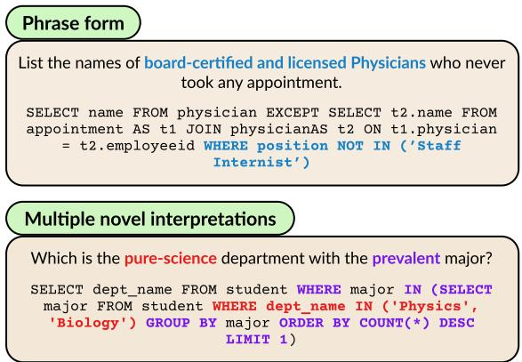  
Figure 3: Illustrations of examples with phrase form and multiple novel interpretations in MAGNIFICo.

## 3.2 Generating Data

We create MAGNIFICO examples by modifying examples in the Spider dataset such that understanding a novel interpretation¹ used in the input is necessary to successfully generate the corresponding SQL query. We will refer to the original examples from Spider as seed examples. For each interpretation, we generate data using one or more of the following methods:

(1) Regex-based pattern matching. Some interpretations such as the minimum value' (see Table 1) already have examples existing in Spider. For such interpretations, we find the relevant seed examples using regex-based pattern matching, either on the source side by conditioning on the presence of certain keywords such as minimum or lowest or on the target side by conditioning on operations such as min(). We then modify the seed examples to include the form of the interpretation in the input and inculcate the corresponding logic in the target SQL query using specific rules, if required. An illustration of this process is shown in Figure 4.

(2) LLM-assisted constrained paraphrasing. For many interpretations, it is not possible to manually devise rules for modifying the natural language queries of the seed example to include the corresponding form in a suitable manner. In such cases, we prompt GPT-4 (OpenAI, 2023) with the query of the seed example and instruct it to paraphrase the query so as to include the form of the novel interpretation. We then manually examine the modelgenerated paraphrase for grammatical correctness and consistency of intended meaning. Similar to the previous method, we modify the target SQL query using hand-crafted rules, if required.

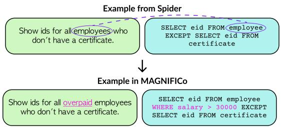  
Figure 4: Illustration of the Regex-based pattern matching’ procedure used for creating examples in MAG-NIFICO.

(3) Synchronous Context-Free Grammar. For many interpretations, there are either none or very few examples already existing in Spider. It is also difficult to find such examples automatically based on regex patterns. In such cases, if we have obtained a limited number of examples from Spider, we extract an SCFG representing those examples by abstracting away specific column and table names and data values similar to the method used by Yu et al. (2021). If there are not enough examples in Spider, we define an SCFG ourselves that represents the interpretation. We then automatically generate examples from the SCFG by filling it with randomly sampled column and table names and values from the set of databases in Spider. We only keep the examples for which the generated SQL query correctly executes and does not give a NULL output. An illustration of this process is provided in Figure 5.

## Multiple novel interpretations in same example.

From the data created using the procedures above, we select pairs of examples that have different novel interpretations but use the same database schema. We devise a set of rules using which, given such a pair, we can automatically create a new example that requires understanding both novel interpretations (one from each of the examples in the pair) simultaneously. Figure 3 illustrates such an example. We created a total of 376 such examples spanning 24 unique combinations of interpretations. We manually reviewed each example to ensure correctness.

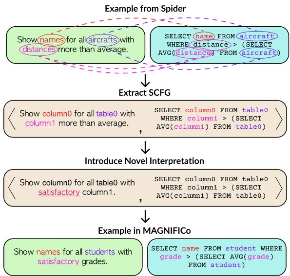  
Figure 5: Illustration of the Synchronous Context-Free Grammar’ procedure used for creating examples in MAGNIFICO.

Generating Conversations. We generate long-form dialogues for a subset of examples in MAGNIFICo. For each database schema used in these examples, we prompt GPT-4² to generate a long conversation between two users of that database. We instruct GPT-4 to introduce the corresponding novel interpretation and its description in a manner that makes it blend naturally into the flow of the conversation at the beginning. We generated a total of 125 unique dialogues, each at least 2000 tokens long. We manually reviewed all generated dialogues to ensure correctness.

Base Examples. We are only interested in measuring the ability of models to generalize to novel interpretations and not how well they perform on the text-to-SQL semantic parsing task. Hence, for every example in MAGNIFICo with a novel interpretation, we also maintain an example that does not include any novel interpretation form and instead directly states the interpretation as part of the input query. These examples serve as a comparative reference point for our evaluation. We refer to these examples as base examples and measure the performance of all models across all prompt types on them. An illustration of a base example is shown in Figure 1.

<table><tr><td>TYPE</td><td>UNIQUE TEMPLATES</td><td>TYPES OF FORMS</td><td>NUM OF EXAMPLES</td></tr><tr><td>Single-word</td><td>1150</td><td>base, adversarial, plausible, foreign</td><td>4600</td></tr><tr><td>Phrase</td><td>279</td><td>base, plausible</td><td>558</td></tr><tr><td>Multiple novel interpretations</td><td>94</td><td>base, adversarial, plausible, foreign</td><td>376</td></tr><tr><td>TOTAL</td><td>1523</td><td></td><td>5534</td></tr></table>

Table 2: Dataset statistics for MAGNIFICo.

Summary. Overall, we created 1523 unique examples across 24 interpretations. The forms of interpretations in these examples can be automatically replaced to generate more data at scale. Dataset statistics for MAGNIFICo are provided in Table 2. Additional details on creating MAGNIFICO are provided in Appendix B. Note that each example in MAGNIFICo was manually reviewed by at least one of the authors to ensure correctness.

## 4 Experimental Setup

In this section, we will discuss the setup for our experiments on MAGNIFICo.3

Models. We experiment with OpenAI GPT-3.5-Turbo (v0301) (Brown et al., 2020; Ouyang et al., 2022), StarCoder (Li et al., 2023b), LLaMA-7B,13B,30B (Touvron et al., 2023a), Alpaca-7B (Taori et al., 2023), MPT-7B4, MPT-7B-Instruct, RedPajama-7B5, RedPajama-7B-Instruct, and RWKV-14B (Bo, 2021). We additionally experimented with GPT-4 (OpenAI, 2023) and LLaMA-2 (Touvron et al., 2023b), results for which are provided in Appendix C.4. For all models, we decode greedily for a maximum of 128 tokens. To take stock of the basic text-to-SQL semantic parsing capabilities of these models, we show their execution accuracies over the base examples in MAGNIFICO averaged over all interpretations in Figure 6. Some of the results for RWKV-14B and the RedPajama-7B models can be found in Appendix C.

Prompt. All our experiments are in the in-context learning experimental setup. Our prompt structure largely follows the Create Table + Select 3 prompt format from Rajkumar et al. (2022) which resulted in the best performance on Spider with OpenAI Codex (Chen et al., 2021). This format provides the CREATE TABLE commands for each table in the schema and displays the values for the top three rows for each table. We experiment with three different prompt settings: (1) Direct’ is exactly the zero-shot Create Table + Select 3 setting which includes no information about how to interpret the form of the novel interpretation, (2) Description' additionally includes a brief, one-line natural language description of the novel interpretation(s), and (3) Few-shot’ includes 5 input-output examples6 of the novel interpretation instead of the description. We hold out 5 examples for each interpretation from the test sets to maintain consistency in testing across various experimental settings. For experiments with a dialogue in the context, the dialogue is prepended to the Create Table + Select 3 prompt. Examples for each type of prompt are provided in Appendix E.

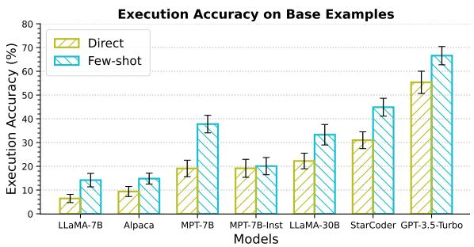  
Figure 6: Average execution accuracy (↑) of all models on base examples in MAGNIFICO across various prompt settings.

Metric. We use a metric called Relative Performance to measure the generalization ability of models towards acquiring novel interpretations. Our metric provides a measure that is relative to the performance of the model on the corresponding base examples:

$$
{ \mathrm { R e l a t i v e ~ P e r f o r m a n c e } } = m i n \left( { \frac { \mathrm { E X ^ { N I } } } { \mathrm { E X ^ { b a s e } } } } , 1 \right) \times 1 0 0 
$$

where $\mathrm { E X ^ { N I } }$ is the execution accuracy7 on the examples with novel interpretations from MAG-NIFICO and $\mathrm { E X ^ { b a s e } }$ is the execution accuracy on the corresponding base examples.8 Hence, the higher the Relative Performance, the lower the model's drop in performance on examples with novel interpretation(s) (relative to base examples), and consequently, the higher its ability to learn novel interpretations.

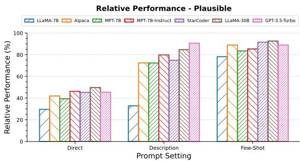  
Figure 7: Relative performance (↑) of all models on MAGNIFICo across various prompt settings when the TOKEN is a plausible English word.

## 5 Results and Discussion

## 5.1 Impact of Description and Few-shot Examples

Question: How well can LLMs learn novel interpretations when the interpretation is simply described in an English sentence? And how does it compare against the case when we provide few-shot examples of usage of that interpretation?

We compare providing a natural language description of the novel interpretation (Description' prompt type) against providing examples of usage of the novel interpretation (Few-shot' prompt type). Figure 7 provides the results when the form used to represent the novel interpretation is a plausible English word. The results for foreign and adversarial forms can be found in Figures 16 and 17 in the Appendix.

Most LLMs exhibit a surprisingly high capability to understand and generalize to novel interpretations from simply the natural language descriptions. This capability seems to increase with model size as GPT-3.5-Turbo and LLaMA-30B outperform all other models while the smallest model, LLaMA-7B, struggles to generalize from just the description. It is also interesting to see the benefit of instruction finetuning (Wang et al., 2023) in learning novel interpretations in-context just from natural language descriptions: the instruction-finetuned models outperform their corresponding base models, often by large margins. All models generalize well when a few examples of usage of the novel interpretation are provided.

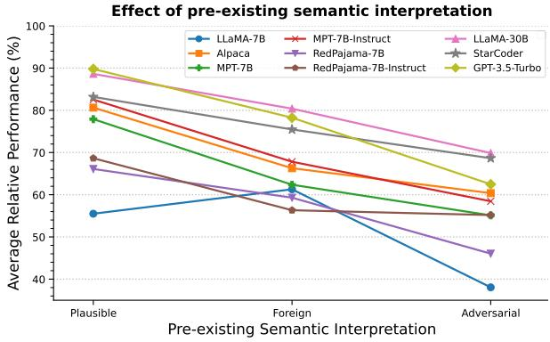  
Figure 8: Relative performance (↑) of all models across forms of different types.

## 5.2 Impact of Pre-existing Semantic Interpretation

Question: How much does the existing semantic interpretation of the form denoting the novel interpretation influence the generalization capability of LLMs?

As mentioned in §3.1, we experiment with three types of form. We plot the relative performance averaged over theDescription’andFew-shot' prompt types9 in Figure 8.

We see a trend of decrease in generalization ability when the pre-existing semantic interpretation of the form steers farther from the intended meaning of the novel interpretation. This shows that LLMs have strong semantic priors that may require targeted approaches to be overcome. Moreover, the fact that LLMs can easily understand novel interpretations when presented in a familiar form (as opposed to completely foreign words) is an interesting finding for potential applications requiring acquisition of novel interpretations in the wild (e.g. conversational agents).

## 5.3 Acquiring Novel Interpretations From Long Form Dialogue

We envision a real-life scenario requiring compositional generalization: acquiring novel interpretations introduced in a long form conversation. This may arise in situations such as having a conversation with an AI personal assistant or when we want to condition the outputs of an AI system based on a dialogue history between multiple users. An example is provided in Figure 2.

<table><tr><td rowspan="2"></td><td colspan="2">StarCoder</td><td colspan="2">GPT-3.5-Turbo</td></tr><tr><td>Prompt Plausible</td><td>Foreign</td><td>Plausible</td><td>Foreign</td></tr><tr><td>Description</td><td>79.40</td><td>80.74</td><td>91.46</td><td>85.95</td></tr><tr><td>Dialogue</td><td>68.91</td><td>80.55</td><td>84.87</td><td>87.63</td></tr></table>

Table 3: Relative performance (↑) of StarCoder and GPT-3.5-Turbo on examples in MAGNIFICO when the description of the novel interpretation is provided in a long form dialogue.

Question: How well can LLMs learn a novel interpretation from its description mentioned briefly within a long-form dialogue?

We select 8 interpretations, covering a total of 583 examples from MAGNIFICo, encompassing all four categories. We generate long conversation contexts for each of these examples as described in §3.2. An example of the prompt structure is provided in Figure 22. We experiment with StarCoder and GPT-3.5-Turbo since they are capable of processing more than 2000 tokens of text in-context. The results are provided in Table 3. For ease of comparison, we also state the results with the Description' prompt-type for the 8 interpretations considered.

For both models, using a foreign form to represent the novel interpretation does not result in much performance difference when the description of the novel interpretation is blended inside a long form dialogue instead of directly stating it. However, when the form is a plausible english word, we see a clear decrease in generalization ability for both models. The decrease is much more significant for StarCoder compared to GPT-3.5-Turbo. This indicates that LLMs may find it difficult to associate a case-specific interpretation with tokens that they are already familiar with when used in long conversations. It is possible that the models do not pay much attention to that aspect of the conversation as it might seem more normal' compared to the case where a foreign form is used.

## 5.4 Impact of Position of Description in Context Window

Question: How sensitive are LLMs to the location in the context window that the novel interpretation is described in?

We experiment with placing the description at the beginning, middle, or the end of the prompt when using the Description' prompt type. We also experiment with the Dialogue' setting by placing the turns of conversation describing the novel interpretation at the beginning, middle, or the end of the dialogue. The results for both experiments are provided in Figure 9. Note that we measure performance relative to the performance when the novel interpretation is described in the end so as to better characterize recency bias.

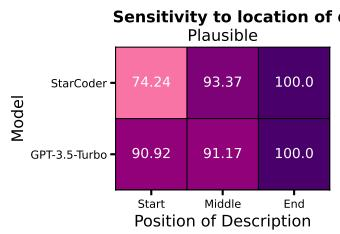  
(a)

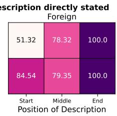

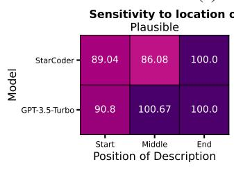  
(b)

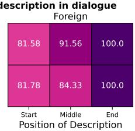  
Figure 9: Relative performance (↑) of StarCoder and GPT-3.5-Turbo on MAGNIFICO across different locations of the description of the novel interpretation in the prompt when the description is directly stated (top) and when the description is mentioned in a dialogue (bottom). The numbers are relative to the performance for the end position.

We observe a clear trend of recency bias in both LLMs, where the generalization increases when the interpretation is described nearer to the end of the context window. StarCoder suffers much more variation in performance compared to GPT-3.5-Turbo. The difference in performance between start and end positions for GPT-3. 5-Turbo, while comparatively small, is still significant enough to indicate a stronger preference for information presented later in the context.

## 5.5 Composing Multiple Novel Interpretations

Question: Are LLMs able to simultaneously learn multiple novel interpretations used compositionally in the same example?

We evaluate models on a total of 376 examples that require simultaneously understanding two novel interpretations (see Figure 3 for an example). The results for all models across all three types of form of interpretations using the Description' and

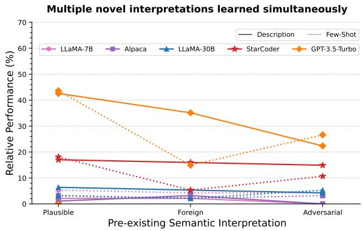  
Figure 10: Relative performance (↑) of all models across all settings when there are multiple novel interpretations in the same example.

Few-shot’ prompt types are provided in Figure 10.

We notice that all models struggle at learning multiple novel interpretations in the same example compared to learning just one novel interpretation. GPT-3.5-Turbo is the best performing model, significantly outperforming StarCoder while the rest of the models show nearly trivial performance. The difference in performance between description and few-shot' prompt types for foreign form suggests that models have a comparatively harder time composing interpretations when they are presented individually in separate examples in the prompt.

## 5.6 Learning Novel Interpretations of Phrases

Question: Are LLMs able to learn novel interpretations when they are denoted by more than a single word?

We defined 6 interpretations denoted by phrases of plausible English words in MAGNIFICo, amounting to a total of 279 examples (see Figure 3 for an example). The results of evaluation over these examples are provided in Figure 11.

We notice that LLaMA, StarCoder, and GPT-3.5-Turbo models show a surprisingly high ability to learn the novel interpretation from just the description. It is even more surprising to see both MPT-7B models struggle since they comparatively excelled for single-word form interpretations (see Figure 7). This shows that the task of learning novel interpretations denoted by multiword phrases is not simply an extension of learning single-word form interpretations, but a separate task that presents its own set of challenges. Lastly, it is interesting to see that contrary to expectations, StarCoder outperforms GPT-3.5-Turbo in both prompt settings.

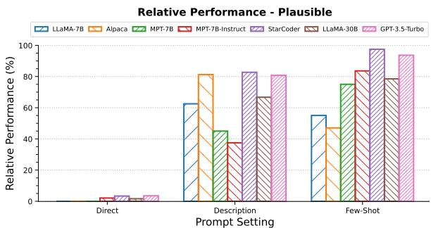  
Figure 11: Relative performance (↑) of all models on MAGNIFICo across various prompt settings when the novel interpretation is a phrase composed of multiple English words.

## 6 Final Remarks

We studied the ability of LLMs to interpret new words and phrases in-context using their description or a few demonstrations. We also extended this study to a realistic scenario: understanding userdefined interpretations from long form dialogue.

Our results indicate that current LLMs can, to an extent, acquire novel interpretations from diverse forms of context. However, interpreting unfamiliar words or multiple novel words simultaneously still poses a significant challenge for existing LLMs. These tasks can serve as a measure to evaluate the compositional generalization abilities of future LLMs in practical settings.

It is interesting to note that instruction finetuning leads to significant improvements in learning from descriptions across three different LLM families. Considering that instruction fine-tuning doesn't involve acquiring novel semantics, it could be useful to understand why it has this impact.

In the past few years, several works (Lake and Baroni, 2018; Kim and Linzen, 2020) showed that sequence models were limited in their ability to generalize to novel words on semantic parsing tasks based on a few examples in the training set. Many specialised methods and approaches (Liu et al., 2021; Chen et al., 2020) were designed to address this problem. It is therefore fascinating to see that contemporary general LLMs are able to generalize to novel words from not only processing a few examples in-context, but also from natural language descriptions and conversations. While a large part of the compositional generalization challenge still remains unsolved, we feel it is important to highlight this paradigm shift. We hope our work paves the way for further studies of practical setups that require LLMs to generalize compositionally.

## Acknowledgments

We would like to thank Navin Goyal for initial discussions related to the idea behind this work. We also thank the anonymous reviewers, and our colleagues at Mila and McGill University for helpful discussions and for providing valuable feedback. Arkil is also supported by the Canada Graduate Scholarship – Master's (CGS-M) funded by the Natural Sciences and Engineering Research Council of Canada (NSERC).

## Limitations

We created our evaluation suite MAGNIFICO over a single task, text-to-SQL semantic parsing. While semantic parsing is a fundamental task in language processing with general applicability, it would be useful to verify the findings across other tasks and domains. In the future, we aim to incorporate more tasks from diverse domains such as classification to better support our claims.

The execution accuracies over base examples in MAGNIFICo are low for smaller models. This results in a higher variance in the results of small models. While we enforce a threshold of minimum 5% accuracy on the base examples for each interpretation to be included in the results, in the future, we shall also include experiments over a task that is more easily solvable by smaller models.

The number of data points for some of our experimental settings (such as multiple novel interpretations) is not large. However, note that our study was exploratory in nature and our main focus was on analysing the in-context learning abilities of LLMs for acquiring novel interpretations rather than proposing a general benchmark for evaluating LLMs. Our findings revealed that LLMs face more difficulty when there are multiple novel interpretations in the same example. This motivates us to look more closely at this particular setting in the future and potentially create a challenging benchmark.

## Ethics Statement

We have extensively discussed the limitations of our work in the previous section. We use an existing dataset, Spider (Yu et al., 2018), which is publicly available and commonly used in NLP research. We generate additional data by modifying the examples in Spider in a rule-based manner. Since we focus on a text-to-SQL semantic parsing task, there are minimal risks and biases associated with our data and we believe that it does not require ethical consideration. We also employed Large Language Models to automatically generate data, and each example of the generated data went through manual verification, ensuring that it does not pose any significant risk. We have discussed the experimental details in Appendix A. The research presented in this paper focuses on analysing the in-context learning abilities of LLMs targeted towards interpreting novel interpretations and we believe that our work does not raise any ethical concerns.

## References

Ekin Akyurek and Jacob Andreas. 2021. Lexicon learning for few shot sequence modeling. In Proceedings of the 59th Annual Meeting of the Association for Computational Linguistics and the 11th International Joint Conference on Natural Language Processing (Volume 1: Long Papers), pages 4934–4946, Online. Association for Computational Linguistics.

Shengnan An, Zeqi Lin, Qiang Fu, Bei Chen, Nanning Zheng, Jian-Guang Lou, and Dongmei Zhang. 2023. How do in-context examples affect compositional generalization? In Proceedings of the 61st Annual Meeting of the Association for Computational Linguistics (Volume 1: Long Papers), pages 11027– 11052, Toronto, Canada. Association for Computational Linguistics.

Jacob Andreas. 2020. Good-enough compositional data augmentation. In Proceedings of the 58th Annual Meeting of the Association for Computational Linguistics, pages 7556–7566, Online. Association for Computational Linguistics.

Dzmitry Bahdanau, Kyunghyun Cho, and Yoshua Bengio. 2015. Neural machine translation by jointly learning to align and translate. In 3rd International Conference on Learning Representations, ICLR 2015, San Diego, CA, USA, May 7-9, 2015, Conference Track Proceedings.

PENG Bo. 2021. Blinkdl/rwkv-lm: 0.01.

Tom Brown, Benjamin Mann, Nick Ryder, Melanie Subbiah, Jared D Kaplan, Prafulla Dhariwal, Arvind Neelakantan, Pranav Shyam, Girish Sastry, Amanda Askell, et al. 2020. Language models are few-shot learners. Advances in neural information processing systems, 33:1877–1901.

Paco Calvo and John Symons. 2014. The architecture of cognition: Rethinking Fodor and Pylyshyn's systematicity challenge. MIT Press.

Mark Chen, Jerry Tworek, Heewoo Jun, Qiming Yuan, Henrique Ponde de Oliveira Pinto, Jared Kaplan, Harri Edwards, Yuri Burda, Nicholas Joseph,

Greg Brockman, et al. 2021. Evaluating large language models trained on code. arXiv preprint arXiv:2107.03374.

Xinyun Chen, Chen Liang, Adams Wei Yu, Dawn Song, and Denny Zhou. 2020. Compositional generalization via neural-symbolic stack machines. In Advances in Neural Information Processing Systems, volume 33, pages 1690–1701. Curran Associates, Inc.

Maxime Chevalier-Boisvert, Dzmitry Bahdanau, Salem Lahlou, Lucas Willems, Chitwan Saharia, Thien Huu Nguyen, and Yoshua Bengio. 2019. BabyAI: First steps towards grounded language learning with a human in the loop. In International Conference on Learning Representations.

Henry Conklin, Bailin Wang, Kenny Smith, and Ivan Titov. 2021. Meta-learning to compositionally generalize. In Proceedings of the 59th Annual Meeting of the Association for Computational Linguistics and the 11th International Joint Conference on Natural Language Processing (Volume 1: Long Papers), pages 3322–3335, Online. Association for Computational Linguistics.

Jacob Devlin, Ming-Wei Chang, Kenton Lee, and Kristina Toutanova. 2019. BERT: Pre-training of deep bidirectional transformers for language understanding. In Proceedings of the 2019 Conference of the North American Chapter of the Association for Computational Linguistics: Human Language Technologies, Volume 1 (Long and Short Papers), pages 4171–4186, Minneapolis, Minnesota. Association for Computational Linguistics.

Longxu Dou, Yan Gao, Xuqi Liu, Mingyang Pan, Dingzirui Wang, Wanxiang Che, Dechen Zhan, Min-Yen Kan, and Jian-Guang Lou. 2022. Towards knowledge-intensive text-to-SQL semantic parsing with formulaic knowledge. In Proceedings of the 2022 Conference on Empirical Methods in Natural Language Processing, pages 5240–5253, Abu Dhabi, United Arab Emirates. Association for Computational Linguistics.

Andrew Drozdov, Nathanael Schärli, Ekin Akyürek, Nathan Scales, Xinying Song, Xinyun Chen, Olivier Bousquet, and Denny Zhou. 2023. Compositional semantic parsing with large language models. In The Eleventh International Conference on Learning Representations.

Julian Martin Eisenschlos, Jeremy R. Cole, Fangyu Liu, and William W. Cohen. 2023. WinoDict: Probing language models for in-context word acquisition. In Proceedings of the 17th Conference of the European Chapter of the Association for Computational Linguistics, pages 94–102, Dubrovnik, Croatia. Association for Computational Linguistics.

Jerry A Fodor and Ernest Lepore. 2002. The compositionality papers. Oxford University Press.

Jerry A Fodor and Zenon W Pylyshyn. 1988. Connectionism and cognitive architecture: A critical analysis. Cognition, 28(1-2):3–71.

Jonathan Gordon, David Lopez-Paz, Marco Baroni, and Diane Bouchacourt. 2020. Permutation equivariant models for compositional generalization in language. In International Conference on Learning Representations.

Demi Guo, Yoon Kim, and Alexander Rush. 2020. Sequence-level mixed sample data augmentation. In Proceedings of the 2020 Conference on Empirical Methods in Natural Language Processing (EMNLP), pages 5547–5552, Online. Association for Computational Linguistics.

Robert F Hadley. 1994. Systematicity in connectionist language learning. Mind & Language, 9(3):247–272

Coleman Haley. 2020. This is a BERT. now there are several of them. can they generalize to novel words? In Proceedings of the Third BlackboxNLP Workshop on Analyzing and Interpreting Neural Networks for NLP, pages 333–341, Online. Association for Computational Linguistics.

Aurélie Herbelot and Eva Maria Vecchi. 2016. Many speakers, many worlds. Linguistic Issues in Language Technology, 13.

Felix Hill, Olivier Tieleman, Tamara von Glehn, Nathaniel Wong, Hamza Merzic, and Stephen Clark. 2021. Grounded language learning fast and slow. In International Conference on Learning Representations.

Daniel Keysers, Nathanael Schärli, Nathan Scales, Hylke Buisman, Daniel Furrer, Sergii Kashubin, Nikola Momchev, Danila Sinopalnikov, Lukasz Stafiniak, Tibor Tihon, Dmitry Tsarkov, Xiao Wang, Marc van Zee, and Olivier Bousquet. 2020. Measuring compositional generalization: A comprehensive method on realistic data. In International Conference on Learning Representations.

Najoung Kim and Tal Linzen. 2020. COGS: A compositional generalization challenge based on semantic interpretation. In Proceedings of the 2020 Conference on Empirical Methods in Natural Language Processing (EMNLP), pages 9087–9105, Online. Association for Computational Linguistics.

Brenden Lake and Marco Baroni. 2018. Generalization without systematicity: On the compositional skills of sequence-to-sequence recurrent networks. In Proceedings of the 35th International Conference on Machine Learning, volume 80 of Proceedings of Machine Learning Research, pages 2873–2882. PMLR.

Brenden M Lake. 2019. Compositional generalization through meta sequence-to-sequence learning. In Advances in Neural Information Processing Systems, volume 32. Curran Associates, Inc.

Andrew K Lampinen and James L McClelland. 2017. One-shot and few-shot learning of word embeddings. arXiv preprint arXiv:1710.10280.

Angeliki Lazaridou, Adhiguna Kuncoro, Elena Gribovskaya, Devang Agrawal, Adam Liska, Tayfun Terzi, Mai Gimenez, Cyprien de Masson d’Autume, Tomáš Kočiský, Sebastian Ruder, Dani Yogatama, Kris Cao, Susannah Young, and Phil Blunsom. 2021. Mind the gap: Assessing temporal generalization in neural language models. In Advances in Neural Information Processing Systems.

Chia-Hsuan Lee, Oleksandr Polozov, and Matthew Richardson. 2021. KaggleDBQA: Realistic evaluation of text-to-SQL parsers. In Proceedings of the 59th Annual Meeting of the Association for Computational Linguistics and the 11th International Joint Conference on Natural Language Processing (Volume 1: Long Papers), pages 2261–2273, Online. Association for Computational Linguistics.

Jinyang Li, Binyuan Hui, Ge Qu, Binhua Li, Jiaxi Yang, Bowen Li, Bailin Wang, Bowen Qin, Rongyu Cao, Ruiying Geng, et al. 2023a. Can llm already serve as a database interface? a big bench for largescale database grounded text-to-sqls. arXiv preprint arXiv:2305.03111.

Raymond Li, Loubna Ben Allal, Yangtian Zi, Niklas Muennighoff, Denis Kocetkov, Chenghao Mou, Marc Marone, Christopher Akiki, Jia Li, Jenny Chim, Qian Liu, Evgenii Zheltonozhskii, Terry Yue Zhuo, Thomas Wang, Olivier Dehaene, Mishig Davaadorj, Joel Lamy-Poirier, João Monteiro, Oleh Shliazhko, Nicolas Gontier, Nicholas Meade, Armel Zebaze, Ming-Ho Yee, Logesh Kumar Umapathi, Jian Zhu, Benjamin Lipkin, Muhtasham Oblokulov, Zhiruo Wang, Rudra Murthy, Jason Stillerman, Siva Sankalp Patel, Dmitry Abulkhanov, Marco Zocca, Manan Dey, Zhihan Zhang, Nour Fahmy, Urvashi Bhattacharyya, Wenhao Yu, Swayam Singh, Sasha Luccioni, Paulo Villegas, Maxim Kunakov, Fedor Zhdanov, Manuel Romero, Tony Lee, Nadav Timor, Jennifer Ding, Claire Schlesinger, Hailey Schoelkopf, Jan Ebert, Tri Dao, Mayank Mishra, Alex Gu, Jennifer Robinson, Carolyn Jane Anderson, Brendan Dolan-Gavitt, Danish Contractor, Siva Reddy, Daniel Fried, Dzmitry Bahdanau, Yacine Jernite, Carlos Muñoz Ferrandis, Sean Hughes, Thomas Wolf, Arjun Guha, Leandro von Werra, and Harm de Vries. 2023b. Starcoder: may the source be with you!

Yuanpeng Li, Liang Zhao, Jianyu Wang, and Joel Hestness. 2019. Compositional generalization for primitive substitutions. In Proceedings of the 2019 Conference on Empirical Methods in Natural Language Processing and the 9th International Joint Conference on Natural Language Processing (EMNLP-IJCNLP), pages 4293–4302, Hong Kong, China. Association for Computational Linguistics.

Chenyao Liu, Shengnan An, Zeqi Lin, Qian Liu, Bei Chen, Jian-Guang Lou, Lijie Wen, Nanning Zheng,

and Dongmei Zhang. 2021. Learning algebraic recombination for compositional generalization. In Findings of the Association for Computational Linguistics: ACL-IJCNLP 2021, pages 1129–1144, Online. Association for Computational Linguistics.

Qian Liu, Shengnan An, Jian-Guang Lou, Bei Chen, Zeqi Lin, Yan Gao, Bin Zhou, Nanning Zheng, and Dongmei Zhang. 2020. Compositional generalization by learning analytical expressions. In Advances in Neural Information Processing Systems, volume 33, pages 11416–11427. Curran Associates, Inc.

Gary F Marcus. 2003. The algebraic mind: Integrating connectionism and cognitive science. MIT press.

OpenAI. 2023. Gpt-4 technical report.

Long Ouyang, Jeff Wu, Xu Jiang, Diogo Almeida, Carroll L. Wainwright, Pamela Mishkin, Chong Zhang, Sandhini Agarwal, Katarina Slama, Alex Ray, John Schulman, Jacob Hilton, Fraser Kelton, Luke Miller, Maddie Simens, Amanda Askell, Peter Welinder, Paul Christiano, Jan Leike, and Ryan Lowe. 2022. Training language models to follow instructions with human feedback.

Adam Paszke, Sam Gross, Francisco Massa, Adam Lerer, James Bradbury, Gregory Chanan, Trevor Killeen, Zeming Lin, Natalia Gimelshein, Luca Antiga, Alban Desmaison, Andreas Kopf, Edward Yang, Zachary DeVito, Martin Raison, Alykhan Tejani, Sasank Chilamkurthy, Benoit Steiner, Lu Fang, Junjie Bai, and Soumith Chintala. 2019. Pytorch: An imperative style, high-performance deep learning library. In Advances in Neural Information Processing Systems, volume 32. Curran Associates, Inc.

Arkil Patel, Satwik Bhattamishra, Phil Blunsom, and Navin Goyal. 2022. Revisiting the compositional generalization abilities of neural sequence models. In Proceedings of the 60th Annual Meeting of the Association for Computational Linguistics (Volume 2: Short Papers), pages 424–434, Dublin, Ireland. Association for Computational Linguistics.

Ngoc-Quan Pham, Jan Niehues, and Alex Waibel. 2018. Towards one-shot learning for rare-word translation with external experts. arXiv preprint arXiv:1809.03182.

Nitarshan Rajkumar, Raymond Li, and Dzmitry Bahdanau. 2022. Evaluating the text-to-sq1 capabilities of large language models.

Timo Schick and Hinrich Schütze. 2019. Learning semantic representations for novel words: Leveraging both form and context. In Proceedings of the AAAI Conference on Artificial Intelligence, volume 33, pages 6965–6973.

Ankur Sikarwar, Arkil Patel, and Navin Goyal. 2022. When can transformers ground and compose: Insights from compositional generalization benchmarks. In Proceedings of the 2022 Conference on

Empirical Methods in Natural Language Processing, pages 648–669, Abu Dhabi, United Arab Emirates. Association for Computational Linguistics.

Rohan Taori, Ishaan Gulrajani, Tianyi Zhang, Yann Dubois, Xuechen Li, Carlos Guestrin, Percy Liang, and Tatsunori B Hashimoto. 2023. Alpaca: A strong, replicable instruction-following model. Stanford Center for Research on Foundation Models. https://crfm. stanford. edu/2023/03/13/alpaca. html.

Tristan Thrush, Ethan Wilcox, and Roger Levy. 2020. Investigating novel verb learning in BERT: Selectional preference classes and alternation-based syntactic generalization. In Proceedings of the Third BlackboxNLP Workshop on Analyzing and Interpreting Neural Networks for NLP, pages 265–275, Online. Association for Computational Linguistics.

Hugo Touvron, Thibaut Lavril, Gautier Izacard, Xavier Martinet, Marie-Anne Lachaux, Timothée Lacroix, Baptiste Rozière, Naman Goyal, Eric Hambro, Faisal Azhar, Aurelien Rodriguez, Armand Joulin, Edouard Grave, and Guillaume Lample. 2023a. Llama: Open and efficient foundation language models.

Hugo Touvron, Louis Martin, Kevin Stone, Peter Albert, Amjad Almahairi, Yasmine Babaei, Nikolay Bashlykov, Soumya Batra, Prajjwal Bhargava, Shruti Bhosale, Dan Bikel, Lukas Blecher, Cristian Canton Ferrer, Moya Chen, Guillem Cucurull, David Esiobu, Jude Fernandes, Jeremy Fu, Wenyin Fu, Brian Fuller, Cynthia Gao, Vedanuj Goswami, Naman Goyal, Anthony Hartshorn, Saghar Hosseini, Rui Hou, Hakan Inan, Marcin Kardas, Viktor Kerkez, Madian Khabsa, Isabel Kloumann, Artem Korenev, Punit Singh Koura, Marie-Anne Lachaux, Thibaut Lavril, Jenya Lee, Diana Liskovich, Yinghai Lu, Yuning Mao, Xavier Martinet, Todor Mihaylov, Pushkar Mishra, Igor Molybog, Yixin Nie, Andrew Poulton, Jeremy Reizenstein, Rashi Rungta, Kalyan Saladi, Alan Schelten, Ruan Silva, Eric Michael Smith, Ranjan Subramanian, Xiaoqing Ellen Tan, Binh Tang, Ross Taylor, Adina Williams, Jian Xiang Kuan, Puxin Xu, Zheng Yan, Iliyan Zarov, Yuchen Zhang, Angela Fan, Melanie Kambadur, Sharan Narang, Aurelien Rodriguez, Robert Stojnic, Sergey Edunov, and Thomas Scialom. 2023b. Llama 2: Open foundation and fine-tuned chat models.

Maria Tsimpoukelli, Jacob Menick, Serkan Cabi, S. M. Ali Eslami, Oriol Vinyals, and Felix Hill. 2021. Multimodal few-shot learning with frozen language models. In Advances in Neural Information Processing Systems.

Ashish Vaswani, Noam Shazeer, Niki Parmar, Jakob Uszkoreit, Llion Jones, Aidan N Gomez, Łukasz Kaiser, and Illia Polosukhin. 2017. Attention is all you need. Advances in neural information processing systems, 30.

Su Wang, Stephen Roller, and Katrin Erk. 2017. Distributional modeling on a diet: One-shot word learning from text only.

Yizhong Wang, Yeganeh Kordi, Swaroop Mishra, Alisa Liu, Noah A. Smith, Daniel Khashabi, and Hannaneh Hajishirzi. 2023. Self-instruct: Aligning language models with self-generated instructions.

Thomas Wolf, Lysandre Debut, Victor Sanh, Julien Chaumond, Clement Delangue, Anthony Moi, Pierric Cistac, Tim Rault, Remi Louf, Morgan Funtowicz, Joe Davison, Sam Shleifer, Patrick von Platen, Clara Ma, Yacine Jernite, Julien Plu, Canwen Xu, Teven Le Scao, Sylvain Gugger, Mariama Drame, Quentin Lhoest, and Alexander Rush. 2020. Transformers: State-of-the-art natural language processing. In Proceedings of the 2020 Conference on Empirical Methods in Natural Language Processing: System Demonstrations, pages 38–45, Online. Association for Computational Linguistics.

Hitomi Yanaka, Koji Mineshima, and Kentaro Inui. 2021. SyGNS: A systematic generalization testbed based on natural language semantics. In Findings of the Association for Computational Linguistics: ACL-IJCNLP 2021, pages 103–119, Online. Association for Computational Linguistics.

Tao Yu, Chien-Sheng Wu, Xi Victoria Lin, bailin wang, Yi Chern Tan, Xinyi Yang, Dragomir Radev, richard socher, and Caiming Xiong. 2021. Gra{pp}a: Grammar-augmented pre-training for table semantic parsing. In International Conference on Learning Representations.

Tao Yu, Rui Zhang, Kai Yang, Michihiro Yasunaga, Dongxu Wang, Zifan Li, James Ma, Irene Li, Qingning Yao, Shanelle Roman, Zilin Zhang, and Dragomir Radev. 2018. Spider: A large-scale human-labeled dataset for complex and cross-domain semantic parsing and text-to-SQL task. In Proceedings of the 2018 Conference on Empirical Methods in Natural Language Processing, pages 3911–3921, Brussels, Belgium. Association for Computational Linguistics.

Chen Zhao, Yu Su, Adam Pauls, and Emmanouil Antonios Platanios. 2022. Bridging the generalization gap in text-to-SQL parsing with schema expansion. In Proceedings of the 60th Annual Meeting of the Association for Computational Linguistics (Volume 1: Long Papers), pages 5568–5578, Dublin, Ireland. Association for Computational Linguistics.

Ruiqi Zhong, Tao Yu, and Dan Klein. 2020. Semantic evaluation for text-to-SQL with distilled test suites. In Proceedings of the 2020 Conference on Empirical Methods in Natural Language Processing (EMNLP), pages 396–411, Online. Association for Computational Linguistics.

## A Implementation Details

Experiments using GPT-3.5-Turbo and GPT-4 were performed using the OpenAI API10. All other experiments were done on a single NVIDIA A100 GPU with 80 GB memory. Our code is implemented in PyTorch (Paszke et al., 2019) and makes use of the HuggingFace Transformers library (Wolf et al., 2020).

## B Additional Information on MAGNIFICO

We provide examples for each of the 18 singleword form and 6 phrase form interpretations in MAGNIFICo in Table 4 and Table 5 respectively.

## B.1 Populating Tables with Edge Cases

The metric for evaluating the generated SQL queries in text2SQL benchmarks is execution accuracy, which compares the output of the execution of the generated query with the ground truth. Since we are introducing new interpretations in existing databases, it is possible that the output of the corresponding SQL query is trivial, like printing all values in the Table. Apart from this, it is possible that an incorrect SQL query leads to the groundtruth output because there are no edge case values present in the Table. To handle such cases, we automatically populate the tables by inserting new values that act as edge cases (Zhong et al., 2020).

## C Additional Experimental Results

## C.1 Performance on Base Examples

The performance of models on base examples in MAGNIFICO can be seen in Figure 12. We found the base text-to-SQL performance of RWKV-14B to be extremely low and hence do not experiment with it in other settings.

## C.2 Impact of Description and Few-Shot Examples

Figure 7, Figure 16 and Figure 17 illustrate the impact of providing description and few-shot examples of the novel interpretation when the novel interpretation is represented by a plausible, foreign or an adversarial form respectively for all models.

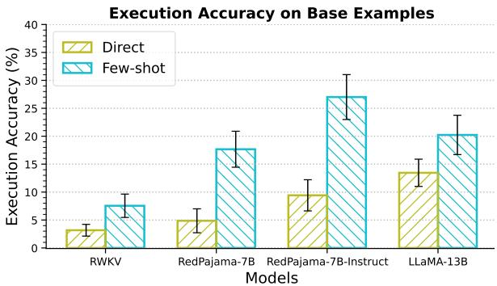

Figure 12: Average execution accuracy (↑) of models on base examples in MAGNIFICo across various prompt settings.  
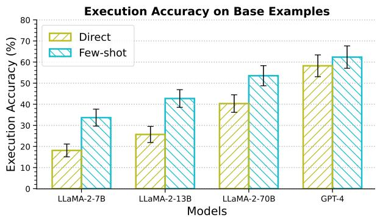  
Figure 13: Average execution accuracy (↑) of LLaMA-2 and GPT-4 models on base examples in MAGNIFICo across various prompt settings.

## C.3 Impact of Pre-existing Semantic Interpretation

Figure 18 provides the results for all models across all experimental settings.

## C.4 Results for LLaMA-2 and GPT-4

The performance of LLaMA-2 and GPT-4 models on base examples in MAGNIFICo can be seen in Figure Figure 13. Their performance across all experimental settings can be seen in Figure 14.

## D Additional Related Works

## Word Acquisition

Lazaridou et al. (2021) analyse the temporal generalization capabilities of LLMs and showed that the perplexity increases when modelling text containing new words. There is also some related work in the domain of grounded language learning. Chevalier-Boisvert et al. (2019) focus on learning a synthetic language which is a subset of English. However, they do not carry out any systematic evaluation focused on word learning. Hill et al. (2021) propose an approach for fast-mapping, i.e., the ability to bind a novel non-sense word to an object in their RL framework. However, their framework and approach are specifically designed to cater to word learning, while we wish to evaluate the word learning abilities of general NLP models across various NLP tasks. Tsimpoukelli et al. (2021) focus on using frozen pretrained models for learning words that only act as names of objects in images. We wish to study word learning at a broader level, by considering more complex types of words and interpretations.

## Compositional Generalization

Many works in the past (Fodor and Pylyshyn, 1988; Hadley, 1994; Fodor and Lepore, 2002; Marcus, 2003; Calvo and Symons, 2014) have argued that artificial neural networks are incapable of exhibiting systematic compositionality. However, recent successes of neural models (Bahdanau et al., 2015; Vaswani et al., 2017; Devlin et al., 2019) across various NLP tasks have revived this debate with a focus on investigating the presence and extent of compositional biases in models.

Lake and Baroni (2018) investigated the compositional generalization abilities of contemporary neural sequence models such as RNNs and LSTMs based on their performance on a synthetic benchmark called SCAN'. Their conclusions were consistent with past work in that they found neural sequence models generalize poorly when tested on systematically held-out novel combinations of words and phrases. Follow-up work by Kim and Linzen (2020) reached similar conclusions using their semantic parsing benchmark, COGS'.

While novel word learning has not been explicitly studied in previous compositional generalization literature, some of the experiments carried out by Lake and Baroni (2018) and Kim and Linzen (2020) do implicitly assess the abilities of models to one-shot acquire a novel word. However, the words used in these experiments are of a primitive nature and have a context-independent direct mapping in the output space (for e.g., in SCAN, models simply need to learn to map the input word jump' to its corresponding output token JUMP'). In our work, we broaden the scope to also understand how well models acquire more functional words, i.e., words that act over other words in a context-dependent manner to generate the output (for e.g., consider the interpretation ‘most-frequent' represented by the form prevalant in Table 1. The output looks very different for inputs like, Find the prevalant age of students’ or, What is the number of students that do not have the prevalant last name?’).

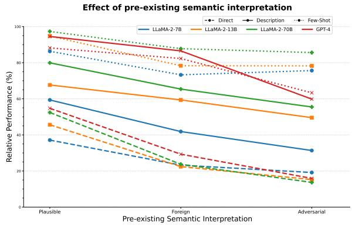  
Figure 14: Relative performance (↑) of LLaMA-2 and GPT-4 models across forms of different types for all prompt settings.

There have been many compositional generalization benchmarks proposed in recent years (Keysers et al., 2020; Yanaka et al., 2021), almost all of them illustrating deficiencies of neural models at generalizing compositionally. Many approaches have also been proposed to solve compositional generalization benchmarks (Li et al., 2019; Lake, 2019; Gordon et al., 2020; Chen et al., 2020; Andreas, 2020; Liu et al., 2020; Guo et al., 2020; Akyurek and Andreas, 2021; Conklin et al., 2021; Liu et al., 2021). However, most of these approaches are task-specific and cannot be generally applied for language processing. Moreover, LLMs achieve a very high level of performance on compositional generalization benchmarks based on just a few examples in-context (Drozdov et al., 2023). In this work, we seek to analyse the compositional generalization capabilities of LLMs more realistically, by grounding our evaluation to possible use case scenarios, for e.g. generating SQL queries for user inputs that require understanding novel interpretations from a long conversation context.

## E Example Prompts

Figure 19 shows an example of a prompt used to generate a long form dialogue using GPT-4. Figures 20, 21, and 22 show examples for the Description', ‘Few-shot', and ‘Dialogue' prompt types respectively.

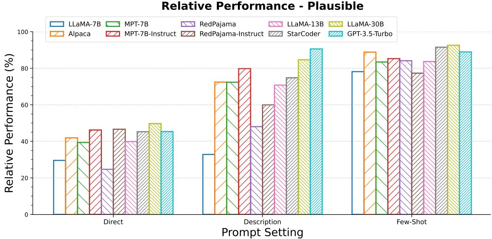  
Figure 15: Relative performance (↑) of all models on MAGNIFICo across various prompt settings when the TOKEN is a plausible word.

Relative Performance - Foreign  
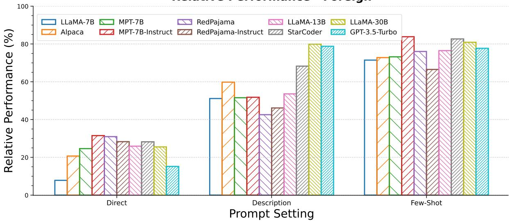  
Figure 16: Relative performance (↑) of all models on MAGNIFICo across various prompt settings when the TOKEN is a foreign word.

<table><tr><td>CATEGORY</td><td>INTERPRETATION EXAMPLES</td><td></td></tr><tr><td rowspan="5"></td><td>Minimum</td><td>Input: What are the name, latitude, and city of the station with the baseline latitude? Output: SELECT name, lat, city FROM station ORDER BY lat LIMIT 1</td></tr><tr><td>Maximum</td><td>Input: Which film has the coveted rental rate? And what is the rate? Output: SELECT title, rental_rate FROM film ORDER BY rental_rate DESC LIMIT 1</td></tr><tr><td>Average</td><td>Input: What is the representative price for flights from LA to honolulu? Output: SELECT AVG(price) FROM flight WHERE origin = 'Los Angeles’AND destination = 'honolulu'</td></tr><tr><td>Sum</td><td>Input: What is the accumulated employee number for each office of professors? Output: SELECT prof_office, SUM(emp_num) FROM professor GROUP BY prof_office</td></tr><tr><td>Count</td><td>Input: Show the magnitude of unique transaction types. Output: SELECT COUNT(DISTINCT transaction_type) FROM financial_transactions</td></tr><tr><td rowspan="5">Subquery-based Operations</td><td>Most-frequent</td><td>Input: Display the sex and first name of students with the prevalent major. Output: SELECT Sex , Fname FROM Student WHERE Major IN (SELECT Major FROM Student GROUP BY Major ORDER BY COUNT(*) DESC LIMIT 1)</td></tr><tr><td>Second-maximum</td><td>Input: Which major has runner-up number of students? Output: SELECT major FROM (SELECT major , COUNT(*) AS t_prop FROM student GROUP BY major ORDER BY COUNT(*) DESC LIMIT 2 AS t_tab ORDER BY t_tab.t_prop LIMIT 1</td></tr><tr><td>Above-average</td><td>Input: What are the name of players who got satisfactory points? Output: SELECT name FROM player WHERE points &gt; (SELECT AVG(points) FROM player)</td></tr><tr><td>Value not present</td><td>Input: How many customers are absent from having an account? Output: SELECT COUNT(*) FROM customers WHERE customer_id NOT IN (SELECT customer_id FROM accounts)</td></tr><tr><td>More than max (conditionally)</td><td>Input: Which songs dominate those with a rating below 6 in terms of resolution? Output: SELECT f_id FROM song WHERE resolution &gt; (SELECT MAX(resolution) FROM song WHERE rating &lt; 6)</td></tr><tr><td rowspan="5">Value-conditioned</td><td>4 credit courses</td><td>Input: List the names of all heavy courses ordered by their titles and credits. Output: SELECT title FROM course WHERE credits = 4 ORDER BY title, credits</td></tr><tr><td>Salary more than 30000</td><td>Input: Display information on those overpaid employees who joined after 1st April, 1995. Output: SELECT * FROM employees WHERE salary &gt; 30000 AND hire_date &gt;'1995-04-01'</td></tr><tr><td>Physics and Biology departments</td><td>Input: What are the addresses of pure-science subject departments? I Output: SELECT dept_address FROM department WHERE dept_name IN ('Physics', 'Biology')</td></tr><tr><td>Yellow card</td><td>Input: How many aggressive players have more than 1000 hours of training? Output: SELECT COUNT(*) FROM player WHERE hs &gt; 1000 AND ycard = yes'</td></tr><tr><td>Mountain View and Palo Alto cities</td><td>Input: How many trips did not end in tech-towns? Output: SELECT COUNT(*) FROM trip AS t1 JOIN station AS t2 ON t1.end_station_id = t2.id WHERE t2.city NOT IN ('Mountain View', 'Palo Alto')</td></tr><tr><td rowspan="3">Column Operations</td><td>Concatenation of last and first name</td><td>Input: How many students are there with 'gE' in alias? Output: SELECT COUNT(*) FROM student WHERE 1name  fname LIKE ‘%gE%</td></tr><tr><td>Subtraction of end and start dates</td><td>Input: What are the unique job ids in job history when tenure is more than 4. Output: SELECT DISTINCT job_id FROM job_history WHERE end_date - start_date &gt; 4</td></tr><tr><td>Product of Course and Prerequisite IDs</td><td>Input: How many courses have prerequisite with requirement-id less than 100000? Output: SELECT COUNT(*) FROM course WHERE course_id IN (SELECT course_id FROM prereq WHERE course_id * prereq_id &lt; 100000)</td></tr><tr><td>INTERPRETATION</td><td>EXAMPLES</td></tr><tr><td>Number of characters less than 8</td><td>Input: Find the average unit price for a track. Display outputs only if the name is within system length constraints. Output: SELECT AVG(unitprice) FROM track WHERE LENGTH(Name) &lt; 8</td></tr><tr><td>Value greater than the difference of the average and the standard deviation</td><td>Input: Find the campuses whose campus fee is in first order outlier range. Output: SELECT campus FROM csu_fees WHERE campusfee &gt; (SELECT AVG(campusfee) STDEV(campusfee) FROM csu_fees)</td></tr><tr><td>Value less than average</td><td>Input: What are the name of rooms that have a cost lying in the community-mandated spectrum. Output: SELECT roomname FROM rooms WHERE baseprice &lt; (SELECT AVG(baseprice) FROM rooms)</td></tr><tr><td>Hire date in July or August 1987</td><td>Input: Get the details of employees who manage a department. Show outputs only for those employees that were hired during the months of union labour strike. Output: SELECT DISTINCT * FROM employees AS t1 JOIN departments AS t2 ON t1.departmen_id = t2.department_id WHERE hire_date &gt;= '1987-07-01' AND hire_date &lt; '1987-09-01' AND t1.employee_id = t2.manager_id</td></tr><tr><td>Physicians that are not an intern</td><td>Input: List the name of board-certified and licensed physicians who never took any appointment. Output: SELECT name FROM physician EXCEPT SELECT t2.name FROM appointment AS t1 JOIN physician AS t2 ON t1.physician = t2.employeeid WHERE position NOT IN ('Staff Internist')</td></tr><tr><td>Number of docks greater than 19</td><td>Input: How many biking association compliant stations are in Mountain View? Output: SELECT COUNT(*) FROM station WHERE dock_count &gt;= 19 AND city = Mountain View'</td></tr></table>

Table 4: Examples of all single-word novel interpretations used in MAGNIFICo. Illustrated examples use a plausible English form.

Table 5: Examples of all novel interpretations represented by a phrase of English words used in MAGNIFICo.

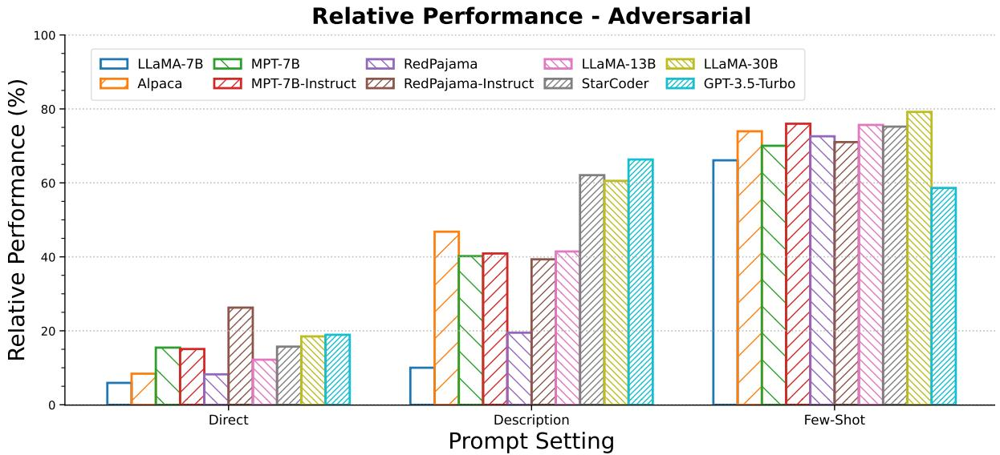  
Figure 17: Relative performance (↑) of all models on MAGNIFICo across various prompt settings when the TOKEN is a adversarial word.

Effect of pre-existing semantic interpretation  
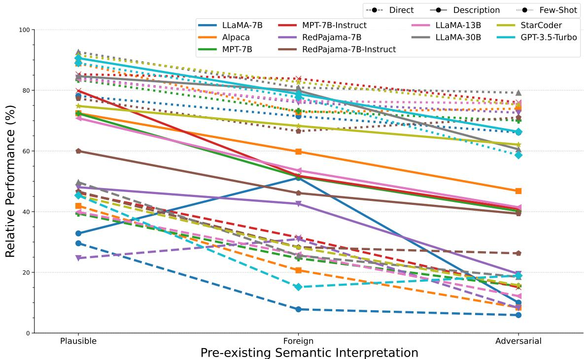  
Figure 18: Relative performance (↑) of all models across forms of different types for all prompt settings.

```sql
System Prompt:
You are DialogueGPT - a tool to generate realistic long-form multi-turn dialogues based on the
situation provided.
User Prompt:
You are given a database schema. Examples of the data in each of the tables is provided:
CREATE TABLE IF NOT EXISTS `departments(
DEPARTMENT_ID decimal(4,0) NOT NULL DEFAULT '0',
DEPARTMENT_NAME varchar(30) NOT NULL,
MANAGER_IDdecimal(6,0) DEFAULT NULL,
LOCATION_ID decimal(4,0) DEFAULT NULL,
PRIMARY KEY (`DEPARTMENT_ID`)
)
/*
3 example rows:
SELECT * FROM departmentsLIMIT 3;
DEPARTMENT_ID DEPARTMENT_NAME MANAGER_ID LOCATION_ID
10 Administration 200 1700
20 Marketing 201 1800
30 Purchasing 114 1700
*/
/*
CREATE TABLE IF NOT EXISTS jobs(
JOB_ID varchar(10) NOT NULL DEFAULT''
JOB_TITLE` varchar(35) NOT NULL,
MIN_SALARY decimal(6,0) DEFAULT NULL,
MAX_SALARY decimal(6,0) DEFAULT NULL,
PRIMARY KEY (`JOB_ID`)
)
/*
3 example rows:
SELECT * FROM `jobs LIMIT 3;
JOB_ID JOB_TITLE MIN_SALARY MAX_SALARY
AD_PRES President 20000 40000
AD_VP Administration Vice President 15000 30000
AD_ASST Administration Assistant 3000 6000
*/
Generate a 20-turn dialogue between two users of this database. Somewhere near the start of the
conversation, user1 says that based on the schema, some people are overpaid. In response to user2
asking what user1 means when they say someone is overpaid, user1 will casually mention that according
to them, anyone that earns a salary more than 30,000 is overpaid. The rest of the conversation should
make no mention of overpaid. The conversation should not include SQL queries.
```  
Figure 19: Prompt used for generating long form dialogues using GPT-4.

```sql
CREATE TABLE IF NOT EXISTS departments(
DEPARTMENT_ID decimal(4,0) NOT NULL DEFAULT '0',
DEPARTMENT_NAME varchar(30) NOT NULL,
MANAGER_IDdecimal(6,0) DEFAULT NULL,
LOCATION_ID decimal(4,0) DEFAULT NULL,
PRIMARY KEY (`DEPARTMENT_ID`)
)
/*
3 example rows:
SELECT * FROM departments LIMIT 3;
DEPARTMENT_ID DEPARTMENT_NAME MANAGER_ID LOCATION_ID
10 Administration 200 1700
20 Marketing 201 1800
30 Purchasing 114 1700
*/
/*
CREATE TABLE IF NOT EXISTS `jobs(
`JOB_ID varchar(10) NOT NULL DEFAULT'',
JOB_TITLE` varchar(35) NOT NULL,
MIN_SALARY decimal(6,0) DEFAULT NULL,
MAX_SALARY` decimal(6,0) DEFAULT NULL,
PRIMARY KEY (`JOB_ID`)
)
/*
3 example rows:
SELECT * FROM `jobs LIMIT 3;
JOB_ID JOB_TITLE MIN_SALARY MAX_SALARY
AD_PRES President 20000 40000
AD_VP Administration Vice President 15000 30000
AD_ASST Administration Assistant 3000 6000
*/
```

-- Using valid SQLite, answer the following questions for the tables provided above.

-- The word 'overpay' refers to those with salary more than 30000.

-- what is all the information about overpaid employees hired before April 2, 1995? SELECT

Figure 20: Example prompt for Create Table + Select 3 where the prompt contains a description of the novel interpretation.

```sql
CREATE TABLE IF NOT EXISTS regions(
REGION_IDdecimal(5,0) NOT NULL,
REGION_NAME varchar(25) DEFAULT NULL,
PRIMARY KEY (`REGION_ID`)
)
/*
create table prereq
(course_id varchar(8),
prereq_id varchar(8),
primary key (course_id, prereq_id),
foreign key (course_id) references course (course_id)
on delete cascade,
foreign key (prereq_id) references course (course_id)
)
/*
3 example rows:
SELECT * FROM prereq LIMIT 3;
course_id prereq_id
376 130
760 169
403 345
*/
-- Using valid SQLite, answer the following questions for the tables provided above.
-- on what dates were overpaid employees without the letter m in their first names hired?
select hire_date from employees where salary > 30000 and first_name not like '%m%'
-- give the distinct department ids of departments in which a manager is in charge of one or more
overpaid employees?
select distinct department_id from employees where salary > 30000 group by department_id , manager_id
having count(employee_id) >= 1
-- find the names of all overpaid instructors in comp. sci. department .
select name from instructor where dept_name = 'Comp. Sci.' and salary > 30000
-- what is all the information about overpaid employees hired before April 2, 1995?
SELECT
```  
Figure 21: Example prompt with few-shot examples for the novel interpretation represented by the plausible form overpaid' followed by the query input.

User1: Hey, I've been working with this database schema and I wanted to discuss some of the tables   
and their relationships.   
User2: Sure, I'm familiar with the schema. What do you want to know?   
User1: I noticed there's a table for employees with a salary column. Which employees would you   
consider to be overpaid ?   
User2: Well, that's subjective and depends on various factors. But for the sake of this conversation,   
let's say anyone earning a salary more than 30,000 is   
overpaid. What do you want to discuss in relation to the schema?   
/\* conversation containing 2000 words \*/   
User2: The benefits\_enrollment table has a foreign key EMPLOYEE\_ID, indicating which employee the   
benefit enrollment is associated with. It also has columns for the benefit name, enrollment date,   
and status.   
User1: Suppose you are given the following schema:   
CREATE TABLE IF NOT EXISTS regions(   
REGION\_IDdecimal(5,0) NOT NULL,   
REGION\_NAME\` varchar(25) DEFAULT NULL,   
PRIMARY KEY (\`REGION\_ID\`)   
)   
/\*   
3 example rows:   
SELECT \* FROM regions LIMIT 3;   
REGION\_ID REGION\_NAME   
1 Europe\r   
2 Americas\r   
3 Asia\r   
\*/   
/\*   
3 example rows:   
SELECT \* FROM \`locations LIMIT 3;   
LOCATION\_ID STREET\_ADDRESS POSTAL\_CODE CITY STATE\_PROVINCE COUNTRY\_ID   
1000 1297 Via Cola di Rie 989 Roma IT   
1100 93091 Calle della Testa 10934 Venice IT   
1200 2017 Shinjuku-ku 1689 Tokyo Tokyo Prefecture JP   
\*/   
Using valid SQLite, answer the following question with the corresponding SQL query:   
what is all the information about overpaid employees hired before April 2, 1995?   
User2: SELECT  
Figure 22: Example prompt which involves a long form dialogue containing the description of the novel interpretation. Note that the truncated section of the dialogue has over 2000 words.