# OPENASP: A Benchmark for Multi-document Open Aspect-based Summarization

Shmuel Amar1∗, Liat Schiff1∗†, Ori Ernst1, Asi Shefer2, Ori Shapira3‡, and Ido Dagan1

1Bar-Ilan University 2One AI 3Amazon {shmulikamar, liatschiff1, oriern}@gmail.com asi@oneai.com orishap@amazon.com dagan@cs.biu.ac.il

## Abstract

The performance of automatic summarization models has improved dramatically in recent years. Yet, there is still a gap in meeting specific information needs of users in real-world scenarios, particularly when a targeted summary is sought, such as in the useful aspectbased summarization setting targeted in this paper. Previous datasets and studies for this setting have predominantly concentrated on a limited set of pre-defined aspects, focused solely on single document inputs, or relied on synthetic data. To advance research on more realistic scenarios, we introduce OPENASP, a benchmark for multi-document open aspect-based summarization. This benchmark is created using a novel and cost-effective annotation protocol, by which an open aspect dataset is derived from existing generic multi-document summarization datasets. We analyze the properties of OPENASP showcasing its high-quality content. Further, we show that the realistic open-aspect setting realized in OPENASP poses a challenge for current state-of-the-art summarization models, as well as for large language models.

## 1 Introduction

When faced with a large body of text, a summary is an effective means to get a concise version of the salient content. However, informational needs of users vary, calling for summarizers that can focus a summary around a given request. The summarization community has addressed this demand mainly through query-focused summarization (QFS) and aspect-based summarization (ABS). Accordingly, several datasets and benchmarks have been compiled over time to enable research on these tasks (see Table 1).

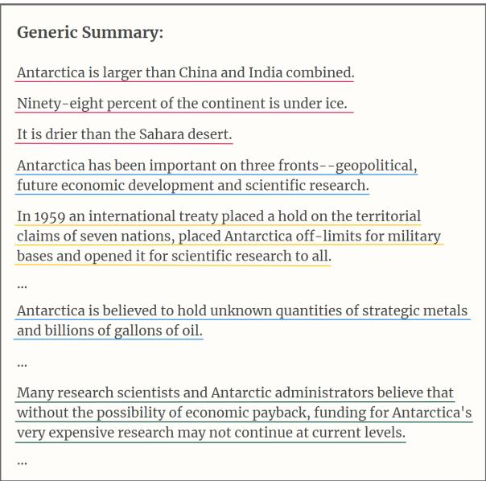  
Figure 1: A generic summary from DUC on the topic Antarctica with some of the marked sentences for each of the 4 identified aspect labels: Overview ofAntarctica, Research in Antarctica, Antarctica’s importance, and Territorial claims. The concatenated sentences of an aspect construct the respective aspect-based summary.

In QFS, a query is highly flexible and can target specific information within particular text. In contrast, ABS datasets traditionally predefined small sets of generic subtopics within a common topical category on which aspect-based summaries are generated, such as geography and recovery aspects in any article about an earthquake (Amplayo et al., 2021). Open-ABS (OABS; Tan et al., 2020), allows aspects to differ for each source text, yet still just as subtopics in the text.

Collecting datasets for these tasks is a major obstacle. This kind of data does not naturally occur in available resources, and manually annotating is highly burdening, particularly for the multidocument setting. Indeed, the very few existing OABS datasets are synthetically gathered. In addition, they address a single-document setting, even though real-world scenarios involve information navigation within multiple documents on a topic.

<table><tr><td colspan="2">Dataset</td><td>Domain</td><td>MDS</td><td>Open</td><td>Collection</td><td># Queries|Aspects</td><td># Instances</td></tr><tr><td rowspan="5">OFSS</td><td>SQuALITY (Wang et al., 2022)</td><td>Scifi</td><td>x</td><td>√</td><td>manual</td><td>437</td><td>625</td></tr><tr><td>QMSum (Zhong et al., 2021)</td><td>Meeting</td><td>x</td><td>√</td><td>manual</td><td>1,566</td><td>1,808</td></tr><tr><td>AQuaMuSe (Kulkarni et al., 2020)</td><td>General</td><td>√</td><td>√</td><td>automatic</td><td>5,519</td><td>7,168</td></tr><tr><td>TD-QFS (Baumel et al., 2016)</td><td>Medical</td><td>√</td><td>√</td><td>manual</td><td>40</td><td>120</td></tr><tr><td>FacetSum (Meng et al., 2021)</td><td>Science</td><td>x</td><td>x</td><td>automatic</td><td>4</td><td>60,532</td></tr><tr><td rowspan="5">ABS</td><td>MA-News (Frermann and Klementiev, 2019)</td><td>News</td><td>x</td><td>x</td><td>automatic</td><td>6</td><td>286,701</td></tr><tr><td>AspectNews (Ahuja et al., 2022)</td><td>News</td><td>x</td><td>x</td><td>manual</td><td>4</td><td>400</td></tr><tr><td>SPACE (Angelidis et al., 2021)</td><td>Reviews</td><td>√</td><td>x</td><td>manual</td><td>6</td><td>900</td></tr><tr><td>WikiAsp (Hayashi et al., 2021)</td><td>Wikipedia</td><td>√</td><td>x</td><td>automatic</td><td>200</td><td>504,546</td></tr><tr><td>AnyAspect (Tan et al., 2020)</td><td>News</td><td>x</td><td>√</td><td>automatic</td><td>363,440</td><td>2,204,270</td></tr><tr><td rowspan="3">OAS</td><td>OASUM (Yang et al., 2022)</td><td>Wikipedia</td><td>x</td><td>√</td><td>automatic</td><td>1,045,895</td><td>3,747,569</td></tr><tr><td>OPENASP (Ours)</td><td>News</td><td>√</td><td>√</td><td>manual</td><td>1,266</td><td>1,310</td></tr><tr><td></td><td></td><td></td><td></td><td></td><td></td><td></td></tr></table>

Table 1: Prominent datasets for query-focused summarization (QFS) and abstract-based summarization (ABS). Our annotation protocol enables efficient collection of high-quality multi-document open-aspect-based summaries. “# Queries|Aspects” is the number of unique queries or aspects appearing in the dataset, and “# Instances” is the number of data instances in the dataset (document set + query|aspect + summary).

In this work, we first propose a novel efficient protocol to manually derive high-quality multidocument open aspect-based summaries from standard multi-document summarization (MDS) datasets. Through crowdsourcing, open aspects and their summaries are extracted from generic reference summaries.

Applying our protocol, we present OPENASP, an OABS dataset for the multi-document setting.1 The aspects and respective summaries are based on the prominent DUC (NIST, 2002) and Multi-News (Fabbri et al., 2019) datasets. See Figure 1 for an example of open-aspect-based summaries extracted from a generic summary. The dataset contains 1,310 aspect-based summaries, split to train, validation and test sets, enabling methodological modeling for the task. We further implement and analyze several baseline models that demonstrate the challenging nature of the task and dataset, even for recent high-performing large language models.

## 2 Background

QFS is a long-standing task that addresses the need to summarize around a specified user request (Dang, 2005). A query is inherently fluid, allowing great variance in length, specificity and format (Carmel et al., 2006). Corresponding datasets, such as those at the top of Table 1, mainly evolved around queries for specific information needs within the source text(s). Wang et al. (2022), for instance, focused summaries around questions targeting distinct matters within the document, e.g. summarizing around “What is the CPA and what does it do?” in a certain story.

Early research on ABS (Hu and Liu, 2004; Titov and McDonald, 2008) recognized the need for more structured information around subtopics of the source text. Relevant datasets (middle of Table 1) focus on recurring aspects within a domain, and approach this by pre-defining a fixed list of aspects, e.g., “service” and “price” in all restaurant reviews. Some datasets expanded to multidocument inputs (Angelidis et al., 2021; Hayashi et al., 2021) which is a more realistic setting when seeking topical information.

An additional direction stemming from ABS permits open aspects that still concisely target subtopics, but can be unique for the individual input text (bottom of Table 1, with more details in Table 12 in the appendix). The existing OABS datasets, namely AnyAspect (Tan et al., 2020) and OASUM (Yang et al., 2022), are synthetically compiled and only address single document inputs. In AnyAspect, the named entities within the document are considered the aspects, and the corresponding summaries include any source sentence mentioning the respective entity. In OASUM, the aspects and the summaries were extracted from Wikipedia articles, where Wikipedia sub-titles are the aspects and their summaries are automatically extracted from the article’s abstract section via a greedy lexical similarity method. Applying such artificial methods yield lower-quality input documents, aspects and expected output summaries.

Collecting datasets for the ABS task poses a challenging undertaking that includes reading large input texts and writing out the focused summaries. Unlike in generic summarization, where large sources of summaries can be scraped from the web (Hermann et al., 2015; Grusky et al., 2018; Fabbri et al., 2019), summaries for our setting are not generally available. Meanwhile, manually writing high quality aspect-based summaries from scratch is an expensive labor-intensive task. Wang et al. (2022) reported 20–40 minutes just for reading a 3000–6000 word story. Summarizing multi-document sets is even more complex since the total input-length may be much larger (e.g., tens of thousands of words; see Section 6.2), while information-overlap further requires content consolidation by the summarizer. For instance, Dang (2005) reported 5 hours of labor for generating one multi-document summary by an expert. Employing crowdsource workers, on the other hand, has been shown to lead to poor extractive multi-document summaries (Lloret et al., 2013). Our protocol exploits existing MDS benchmarks and applies controlled crowdsourcing (Roit et al., 2020), and is hence substantially cheaper and more efficient than previous manual collection processes.

Our OPENASP dataset addresses all the above issues by supporting open-aspects in the multidocument setting, with manually annotated realistic summaries. Moreover, the annotation protocol can be applied across any available generic summarization dataset to produce even more like-quality aspect-based summaries.

## 3 Task Formulation

Following prior work (Ahuja et al., 2022; Yang et al., 2022), given a set of texts about a topic, we define an aspect as a central theme within a topic. The aspect can be referred by certain phrases, denoted aspect labels. As an example, Research in Antarctica and Territorial claims are aspect labels of the Antarctica topic (see Figure 1).

Similar to previous work on ABS (Hayashi et al., 2021; Angelidis et al., 2021), our aspect label is short and concise. In contrast, our aspect definition is open allowing ad-hoc aspects with freeform labels, contrary to having pre-defined domainspecific aspects. Relative to a query in queryfocused summarization (QFS; Dang, 2005), which might specify a complex information need, our aspects are restricted to relevant subtopics. (Hayashi et al., 2021; Angelidis et al., 2021; Angelidis and Lapata, 2018).

The OABS task definition follows previous work (Tan et al., 2020; Yang et al., 2022), and is extended to the multi-document setting as follows: Given a set of documents D on the same topic and an arbitrary aspect label a, the task is to output a short aspect-based summary $S ^ { a }$ . The summary should consolidate salient information from the document set that is relevant to the aspect.

## 4 Annotation Protocol

As emphasized in Section 2, manually collecting aspect-based summaries is very costly. We propose a novel and cost-effective protocol for generating aspect-based multi-document summaries, executed through controlled crowdsourcing (Roit et al., 2020) and a specially-designed annotation tool (Figure 3 in the Appendix). The key idea of our protocol is the extraction of gold aspect-based summaries from generic summaries in existing MDS datasets. Notably, the process is accomplished by reading the generic summary text only, as described below, while saving the strenuous need to read the entire set of source documents and to write the aspect-based summary from scratch.

## 4.1 Collecting Aspects and Summaries

From an existing MDS dataset, we gather pairs consisting of a document set D and a respective generic summary G. An annotator reads G and identifies prominent aspects within it, specified by aspect labels $a _ { 1 } , a _ { 2 } , . . . , a _ { m }$ . For each identified aspect label $a _ { i }$ , the annotator selects the relevant sentences from G. The concatenation of these sentences, retaining the original sentence-order from G, produces the corresponding aspect-based summary Sai. Accordingly, we establish m new aspect-based summaries for D as instances for the dataset. Notice that a summary is abstractive with respect to $D ,$ being comprised of sentences from the abstractive generic reference summary.

In our process, we favor extraction of fewer but high quality aspects from a generic summary. Specifically, our protocol instructs annotators to detect the aspects that are central in the generic summary, and to avoid circumstantial aspects. Although our protocol does not exhaustively extract aspects for the topic, the main sub-topics found in the generic summary establish a reliable and sufficient sample of aspects for addressing the multidocument open ABS task, for training and evaluating models. The full annotation guidelines appear in Appendix A.

<table><tr><td>Split</td><td># Topics</td><td># Instances</td><td># Docs</td></tr><tr><td>Test</td><td>192</td><td>596</td><td>6,536</td></tr><tr><td>Valid</td><td>82</td><td>238</td><td>2,168</td></tr><tr><td>Train</td><td>145</td><td>476</td><td>4,878</td></tr></table>

Table 2: The size of the OPENASP dataset splits. “# Topics” denotes the number of document sets, “# Instances” is the total number of aspect-based summaries, and “# Docs” is the total number of source documents.

Critically, the described protocol avoids reading through the full document set and writing text for the summary. Instead, each aspect summary comprises a subset of generic summary sentences. We suggest that summary quality is maintained since the extracted summaries are based on dependable generic gold summary sentences. The validity of our protocol is based on two assumptions: (1) the aspect-related sentences extracted from generic summaries cover well the prominent information about the aspect within the full source documentset; (2) the aspect-based summaries preserve the coherence borrowed from the source summaries. We show that these assumptions indeed hold by assessing our collected dataset in Section 6.1.

## 4.2 Curation Phase

We propose an optional curation phase for cleaning the annotated aspect labels and corresponding summaries. The process encompasses a manual review, by an expert, of the aspect label and aspect-based summary only. The reviewer can edit the aspect label, remove irrelevant sentences from the summary, or completely reject the aspect. Similar to the annotation protocol, the curation phase avoids the expensive task of reading the source documents.

## 5 The OPENASP Dataset

## 5.1 Source Data

We exploit 2 prominent MDS datasets that contain reference summaries with at least 200 words to demonstrate our protocol robustness: DUC,2 a high-quality and expert-annotated dataset, and MultiNews (Fabbri et al., 2019), with data scraped from newser.com. For MultiNews, we automatically filtered out samples with invalid source documents, to avoid consequential hallucinations in the summaries (see Appendix D.2). The large scale of MultiNews allowed further filtration to capture only instances with summaries of 350–880 words, to increase the potential yield of aspect-based summaries. For all source data, we excluded documentset instances that discuss topics presented as a list of related events (e.g., daily news briefs or various unrelated incidents of the same kind), since the generic summaries of such instances typically contain few subtopics, if any.

## 5.2 Dataset Collection

We followed the annotation protocol described in Section 4.1. Specifically, we used controlled crowdsourcing (Roit et al., 2020) for selecting 3 annotators on Amazon Mechanical Turk3 that successfully completed an introductory summary annotation task and correctly answered followup questions on the task guidelines. 4

Our workers annotated 236 generic summaries from MultiNews and 208 from DUC. From a total of 444 generic summaries, annotators extracted 1,455 aspect-based multi-document summaries. We (paper authors) then applied the curation procedure (Section 4.2) on 1,173 aspect based summaries as detailed in Appendix A.2.5 Out of the reviewed summaries, we modified 152 aspect labels, edited sentence choice of 48 summaries, and completely rejected 94 aspect based summaries (92% pass rate). Overall, we gathered 1,361 summaries for OPENASP, averaging 3 aspect-based summaries per topic (document set instance), and costing ∼\$0.5 per summary.

We split OPENASP into train, validation and test sets, keeping the original MultiNews splits and splitting DUC datasets by years (Appendix D.1). We set aside 51 summaries (from 16 topics) from the test and validation sets, denoted analysis-test and analysis-val sets, for quality assessment and modeling (Sections 6 and 8). Statistics on the final OPENASP sizes appear in Table 2.

## 6 OPENASP Assessment

We next examine the quality of the collected data, and then analyze its properties.

## 6.1 Dataset Quality

We applied a manual evaluation process to verify the collected summaries’ expected qualities. Following Fabbri et al. (2021), a summary should be measured for 4 quality criteria: (1) relevance, the selection of important content from the source; (2) coherence, the quality of the collective structure of all sentences; (3) consistency, the factual alignment between the summary and the summarized source; and (4) fluency, the linguistic quality of individual sentences. In the OABS setting, the aspect-relevance is an additional expected quality (Amplayo et al., 2021; Angelidis et al., 2021). This criterion inspects whether the summary includes information that is relevant to the paired aspect.

We assess the 5 quality criteria on 20 aspectbased summaries sampled from the analysis-test set (Section 5.2). A summary was rated on a 1–5 scale for each criterion by one expert and reviewed by another. In case of a disagreement, the two raters resolved the dispute through reconciliation.6

The relevance and consistency criteria require comparison of the evaluated summary against the aspect-relevant information across the source document-set. Therefore, for each aspect in the analysis sets, we extracted (via crowdsourcing) all the sentences in the corresponding document-set related to the aspect.7

The average ratings can be found in Table 3. The high relevance score of 4.6 supports our first extraction protocol assumption (Section 4.1) that the aspect-based summaries cover the most important information about the subtopic, even though they originate from generic reference summaries. Consistency is expectedly sturdy as well, since sentences are copied from gold generic summaries. Hence, consistency issues that are not already present in the generic summaries should not be introduced. Similarly, the fluency of sentences is adopted from that of the source reference summaries, which is almost flawless.

<table><tr><td>Coherence</td><td>Consistency</td><td>Fluency</td><td>Relevance</td><td>Aspect Rel.</td></tr><tr><td>4.7 (0.92)</td><td>4.8 (0.55)</td><td>5.0 (0.22)</td><td>4.6 (0.68)</td><td>4.7 (0.57)</td></tr></table>

Table 3: Average (std) human evaluation ratings (1–5 scale) on the five quality criteria, determined for 20 instances from the analysis-test set.

Although summaries that are extracted from another text can easily suffer from coherence issues, this is rarely the case with our protocol. We found that 86% of consecutive sentence pairs in our aspect-based summaries are respectively consecutive in the generic summary. Specifically, 60% of the aspect-based summaries are full continuous sentence sets from the generic summary. This phenomenon occurred naturally during annotation, without explicit instructions to follow such a principle. Consequently, coherence is also maintained according to the source generic summaries. Overall, coherence scored very high as well, validating our second assumption that our protocol generates coherent aspect-based summaries even as they are based on generic summaries.

To empirically corroborate the quality of the aspects, we statistically analyzed the source sentences corresponding to each of the 51 aspects in our analysis sets. We found that, on average, an aspect relates to 13.5% of all source documents’ sentences and appears in 68% of the source documents, indicating its topical dominance. Furthermore, only 11% of all aspect-related sentences refer to more than one aspect, indicating the high level of distinctness of the aspects. Finally, on average, 40% of all source sentences in a document set (topic) are related to at least one of the aspects extracted for that topic, indicating the substantial coverage of the set of aspects with respect to the entire document set content. Taken together, these findings establish that the collected aspects are central to the topic, covered thoroughly by its documents and collectively cover a main portion of its content.

Overall, the aspect-based summaries representing OPENASP were determined to exhibit high reliability for the OABS task, consistent with that of the standard generic MDS datasets from which they were extracted.

## 6.2 Dataset Analysis

We discuss properties of OPENASP that emphasize its underlying diversity from several angles. Details for these analyses are available in Appendix D.

The input lengths, measured as the aggregated document lengths in a topic, varies from several hundred to tens of thousands of tokens (Figure 11 in the Appendix), averaging 7,930 words. The summary length ranges from tens to hundreds of tokens, with a median input-to-output (compression) ratio of 69:1.

A topic contains 1–7 aspects with an average of 3.1 aspects per topic (see Figure 8 in the appendix). The aspect labels are almost all lexically unique, repeating on average 1.1 times throughout the dataset. The aspect label is 1–10 words, averaging 3.6 words. Some examples of topics and aspects from OPENASP appear in Table 15. Since aspect labels in OPENASP are annotated as subtopics of their corresponding topic, and are flexibly scripted, the aspects naturally vary widely.

Due to our annotation protocol, the summaryabstractiveness in source datasets (DUC and Multi-News) is transferred to the summaries in OPENASP. Accordingly, the aspect-based summaries exhibit varying extents of abstractivness, as apparent in the diversity plot in Figure 2 (Grusky et al., 2018; Fabbri et al., 2019). Consequently, OPENASP requires models to perform well on both extractive and abstractive forms of summarization.

Finally, a topic consists of 2–25 documents, with an average of 10.4 documents per topic (Figure 8 in the appendix). Following Wolhandler et al. (2022), we find that the aspect-based summaries rely on a varying number of corresponding source documents (Figure 9 in the appendix). In practice, this means some summaries require handpicking information from specific documents, while others require consolidating information from across the input document set.

Overall, the analyzed properties expressly show the diversity of OPENASP and the ensuing challenges of the task.

## 7 Baseline Models

In this and the subsequent sections we demonstrate the challenges that our dataset lays out for summarization models, and suggest initial directions to cope with these challenges. A major hurdle to overcome is the large input length of a document set, averaging ∼8K tokens in our data, and stretching to ∼30K (Section 6.2). Even with current advancements made to support growing input sizes, properly attending to relevant information in a large input remains a hurdle. There were no feasible models available to us that would fit all of

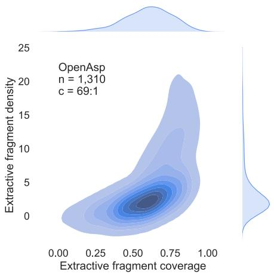  
Figure 2: OPENASP content diversity (Grusky et al., 2018). n and c denote number of examples and median compression ratio of OPENASP, respectively. The large area of the plot indicates that the dataset contains aspect-based summaries with a balance of extractive and abstractive fragments. (See Appendix D.4 for further explanations.)

our document-sets.

To cope with this we investigate two common schemas used in the MDS setting: (a) Filter-thensummarize (e.g., Wang et al., 2022; Baumel et al., 2016), runs a sentence selector to extract aspectrelated sentences, and passes them on to a summarization model (7.1); (b) Recursive summarization (e.g. Shapira and Levy, 2020) summarises subsets of documents separately, and then summarizes these summaries (7.2).

## 7.1 Filter-then-Summarize

Sentence selection. To slim down the input, one remedy is to select sub-texts that are more likely to be included in a summary. In MDS in the news domain, the conventional technique for this is the Lead method, which extracts a number of sentences from the beginning of each document, since these often contain the most crucial information in a news report.

However, in the case of ABS, there is no guarantee that salient aspect-specific information appears at the beginning of each document. Standard ABS models with a closed set of aspects can train a classifier to map a sentence to an aspect (e.g. Hayashi et al., 2021). In contrast, our open-aspect setting demands a selector that is robust to any aspect. We leverage the Sentence-T5 model (Ni et al., 2022) as an unsupervised sentence selector. Specifically, a cosine similarity score is computed between the dense vectors of an aspect label and a sentence, producing a ranking of aspect-relevant sentences.

For the summarization models we employ in the subsequent stage, we restrict the applied sentence selector to provide a set of sentences that fit within the input-size limit (1K or 4K tokens). An approximately equal number of sentences from each document is used within the limit.

Summarization. For the second stage of the decomposed procedure, we employ three architecturally different summarization models. The first two are sequence-to-sequence models trained for generic summarization: BART (Lewis et al., 2020) was pre-trained on the CNN/DailyMail dataset (Hermann et al., 2015) for single-document summarization, while PRIMERA (Xiao et al., 2022) was trained on the MultiNews dataset (Fabbri et al., 2019) for the multi-document setting. Accordingly, the former has a limit of 1K tokens, and the latter 4K. While PRIMERA is more suitable for our multi-document setting, BART has shown strong performance on single-document ABS (Tan et al., 2020; Meng et al., 2021; Wang et al., 2022) and is a worthy candidate. BART is adjusted for multidocument inputs with separation tokens between documents, following PRIMERA. We further finetuned the two models with the OPENASP train set, denoted $\mathbf { B A R T _ { S u m m } }$ and PRIMERASumm, respectively.8

In addition, we experiment with OpenAI’s promising ChatGPT LLM, based on gpt-3.5-turbo-0301 (OpenAI, 2023), denoted $\mathbf { C h a t G P T _ { S u m m } }$ . Such prompt-based models have demonstrated promising results on the zero-shot setting for summarization (Zhang et al., 2023), which we apply here as well. See Appendix B.2 for technical details.

## 7.2 Recursive Summarization

A different approach to handle the large input size is summarizing subsets of the input that fit the model size limit. The subset summaries are then recursively summarized to generate the final summary (see details in the Appendix B.2). We experiment with ChatGPT on a 4K or 16K input token-size, denoted $\mathbf { C h a t G P T _ { R e c u r s i v e } } .$ , whose robustness enables the recursive scheme without any fine-tuning. About 75% of our test instances require recursion for the 4K limit, however only about 10% don’t fit within the 16K limit, rendering nearly end-to-end summarization on our test set.

<table><tr><td rowspan="2">Sentence Selector</td><td colspan="3">1024 Tokens</td><td colspan="3">4096 Tokens</td></tr><tr><td>R</td><td>P</td><td> $F _ { 1 }$ </td><td>R</td><td>P</td><td> $F _ { 1 }$ </td></tr><tr><td>Lead</td><td>16.8</td><td>19.0</td><td>17.8</td><td>55.9</td><td>15.4</td><td>24.1</td></tr><tr><td>Sentence-T5</td><td>31.9</td><td>37.3</td><td>34.4</td><td>71.8</td><td>21.0</td><td>32.5</td></tr></table>

Table 4: $F _ { 1 }$ scores, and corresponding Recall (R) and Precision (P) scores, comparing the two sentence selectors against gold sentence alignments from the combined analysis-valid and analysis-test sets. In both selectors the top sentences that fit within 1024 or 4096 tokens are extracted, and evaluated separately.

For the sake of completeness, we also experimented with BART and PRIMERA in the recursive scheme, denoted BARTRecursive and PRIMERA , respectively. Note that training for this approach would require gold aspectbased summaries for subsets of the document set, which are not available. We therefore activated, in the recursive technique, the BART and PRIMERA systems that were fine-tuned for the filter-thensummarize approach above (Section 7.1).

## 8 Baseline Evaluation and Analysis

To assess the overall capabilities of our baseline models, we show an overall comparison of the methods (§8.1), an ablation analysis on the $\mathbf { B A R T _ { S u m m } }$ -based configurations (§8.2), and end with a human evaluation on our best baselines (§8.3).

## 8.1 Automatic Evaluation

Sentence selection. We first compare the Lead and Sentence-T5 sentence selectors, measuring the relevance of selected sentences to paired aspects. To that end, we utilized the sentence alignments (between aspects and document-set sentences) from the combined analysis-valid and analysis-test sets (Section 6.1), consisting of 1,782 aspect-sentence pairs. For the two sentence selectors, we selected sentences up to a cap of 1K or 4K tokens, and measured the $F _ { 1 }$ scores between the gold alignment pairs and the resulting selector’s pairs, over all aspects. As expected, the results in Table 4 strongly favor Sentence-T5, which directly focuses on a given aspect label. The lead sentences from the documents are much less relevant to any given aspect.

<table><tr><td>Base Model</td><td>Input Size</td><td>Fine Tuned</td><td>Sentence Selector</td><td>R-1</td><td>R-2</td><td>R-L</td></tr><tr><td> $\mathrm { B A R T _ { S u m m } }$ </td><td>1K</td><td>√</td><td>Sent-T5</td><td>32.4</td><td>8.3</td><td>18.7</td></tr><tr><td> $\mathrm { P R I M E R A _ { S u m m } }$ </td><td>4K</td><td>√</td><td>Sent-T5</td><td>30.5</td><td>8.0</td><td>18.3</td></tr><tr><td> $\mathrm { P R I M E R A _ { S u m m } }$ </td><td>1K</td><td>√</td><td>Sent-T5</td><td>31.2</td><td>8.3</td><td>18.7</td></tr><tr><td> $\operatorname { C h a t G P T } _ { \operatorname { S u m m } }$ </td><td>4K</td><td>x</td><td>Sent-T5</td><td>33.7</td><td>9.4</td><td>19.8</td></tr><tr><td> $\mathbf { C h a t G P T _ { R e c u r s i v e } }$ </td><td>4K</td><td>x</td><td>=</td><td>32.4</td><td>9.2</td><td>19.1</td></tr><tr><td> $\mathbf { C h a t G P T _ { R e c u r s i v e } }$ </td><td>16K</td><td>x</td><td>-</td><td>31.8</td><td>8.1</td><td>18.6</td></tr><tr><td>Oracle</td><td></td><td></td><td></td><td>53.4</td><td>27.8</td><td>31.7</td></tr></table>

Table 5: The ROUGE $F _ { 1 }$ scores of different summarization models on our test set. All variants include the aspect label as part of the input.

Summary quality. We next assess the aspectbased summaries of our baseline filter-thensummarize and recursive summarizers. We apply the commonly used ROUGE metrics (Lin, 2004), which measure the lexical overlap between the system and reference aspect-based summaries. Here we only apply the Sentence-T5 sentence selector in the filter-then-summarize configuration, as it is the better of the two selectors, as observed above.9

Table 5 shows that $\mathbf { C h a t G P T _ { S u m m } }$ outperforms all other methods, including the recursive Chat-GPT counterparts. This stresses the advantage of a preliminary selection of aspect-relevant sentences. In addition, it appears that shorter input lengths tend to yield better results, as illustrated by the two size-differences in each of the PRIMER $\mathbf { A } _ { \mathrm { S u m m } }$ and $\mathbf { C h a t G P T _ { R e c u r s i v e } }$ models. Finally, the effectiveness of fine-tuning $\mathbf { B A R T _ { S u m m } }$ and PRIMER $\mathbf { A } _ { \mathrm { S u m m } }$ with our train set is apparent, as these models are competitive with the relatively strong $\mathbf { C h a t G P T _ { S u m m } }$ model.

We also produced “Oracle” extractive summaries for our data, generated greedily to maximize the average of ROUGE-1 and ROUGE-2 scores, given the reference summary (Nallapati et al., 2017). The large gap between the baseline and Oracle scores, as seen in Table 5, leaves much room for improvement in future work on our task.

## 8.2 Ablation Analysis

We provide insights regarding the contribution of different components in our summarization baselines, operating the $\mathbf { B A R T _ { S u m m } }$ -based models as a use-case (being the best of the two fine-tuned models). We refer to rows in Table 6 throughout the analysis.

9We do not report results of the $\mathbf { B A R T _ { R e c u r s i v e } }$ and PRIME $\mathtt { \backslash A _ { R e c u r s i v e } }$ systems here, since they are not directly trained for the task, and therefore not compatibly comparable. See Table 9 and Table 10 in the appendix for full results.

<table><tr><td></td><td>Fine Tuned</td><td>Aspect Input</td><td>Sentence Selector</td><td>R-1</td><td>R-2</td><td>R-L</td></tr><tr><td>1</td><td>√</td><td>√</td><td>Sent-T5</td><td>32.4</td><td>8.3</td><td>18.7</td></tr><tr><td>2</td><td>√</td><td>√</td><td>Lead</td><td>31.3</td><td>7.6</td><td>17.9</td></tr><tr><td>3</td><td>√</td><td>x</td><td>Sent-T5</td><td>32.0</td><td>8.0</td><td>18.2</td></tr><tr><td>4</td><td>√</td><td>x</td><td>Lead</td><td>27.5</td><td>5.3</td><td>15.7</td></tr><tr><td>5</td><td>x</td><td>x</td><td>Lead</td><td>25.4</td><td>5.0</td><td>15.0</td></tr><tr><td>6</td><td> $\checkmark$ </td><td> $\checkmark$ </td><td> $\mathrm { O r a c l e } _ { \mathrm { S e l } }$ </td><td>40.6</td><td>14.5</td><td>23.2</td></tr></table>

Table 6: ROUGE $F _ { 1 }$ scores on different configurations of the $\mathrm { B A R T _ { S u m m } }$ model.

Aspect in input. We first observe what happens if the aspect label is left out from the input to the summarizing model. When using the Sentence-T5 selector, which already selects sentences relevant to the aspect, a very slight improvement in performance is achieved with the aspect in the input (row 1 vs. row 3). However, there is a much larger upgrade when the aspect is input with Lead sentences (row 2 vs. row 4). This indicates that simply providing the requested aspect in the input indeed trains $\mathbf { B A R T _ { S u m m } }$ to attend to aspect-relevant sentences.

Aspect-aware sentence selection. Inputting Lead sentences without the aspect is akin to generic multi-document summarization. Row 5 represents this setting without any fine-tuning, i.e., with the original BART model pre-trained for generic summarization. The large difference in scores with respect to the aspect-aware configurations suggests that the characteristics of our ABS data is distinct from the generic summarization task.

Oracle sentence selection. To estimate an upper bound for the $\mathrm { B A R T _ { S u m m } }$ summarizer, we devise an $\mathrm { ^ { 6 6 } O r a c l e ^ { 3 9 } }$ that mimics a near optimal sentence selector, denoted $\mathrm { O r a c l e } _ { \mathrm { S e l } }$ (not to be confused with the Oracle summary in Section 8.1). It greedily selects the sentences that maximize ROUGE against the reference aspect-based summary, at the allowed input size limit of ∼1K tokens (Hayashi et al., 2021) (see Appendix B.3 for details). As shown in row 6, using $\mathrm { O r a c l e } _ { \mathrm { S e l } }$ with $\mathbf { B A R T _ { S u m m } }$ produces substantially greater scores than the next best option, where the Sentence-T5 selector is applied (row 1). This stresses the potential of a good preliminary sentence selector when using the filter-then-summarize approach.

<table><tr><td>Model</td><td>Relevance to Aspect</td><td>Relevance to Reference Summ.</td></tr><tr><td> $\mathbf { C h a t G P T _ { R e c u r s i v e } }$ </td><td>3.70 (1.38)</td><td>2.45 (0.92)</td></tr><tr><td> $\mathrm { C h a t G P T } _ { \mathrm { S u m m ^ { - } } } \mathrm { S e n t ^ { - } } \mathrm { T } 5$ </td><td>3.40 (1.31)</td><td>2.80 (1.01)</td></tr><tr><td> $\mathrm { B A R T } _ { \mathrm { S u m m ^ { - } } } \mathrm { S e n t } { \mathrm { - } } \mathrm { T } \mathrm { 5 }$ </td><td>3.05 (1.83)</td><td>2.35 (1.46)</td></tr></table>

Table 7: Human evaluation results of the three models with the highest ROUGE scores. The evaluation was conducted on 20 system summaries of each model. ‘Overall’ values are the mean (std) scores on a scale of 1–5 for relevance to the aspect and relevance to the respective aspect-based reference summary.

## 8.3 Human Evaluation

We conduct a manual evaluation on the summaries produced by the three top-scoring models: $\mathrm { C h a t G P T } _ { \mathrm { R e c u r s i v e } } , \mathrm { C h a t G P T } _ { \mathrm { S u m m } } , \mathrm { a n d B A R T } _ { \mathrm { S u m m } } ,$ with the latter two using the Sentence-T5 sentence selector. For 20 random instances from the OPE-NASP test set, we assessed: (1) Relevance to the aspect, i.e., “is the target aspect adequately discussed in the system summary?”; and (2) Relevance to the Reference summary, i.e., “does the system summary refer to the information in the aspect-based reference summary?” (Ernst et al., 2022; Lebanoff et al., 2018). Each criterion was rated on a 1–5 scale, 5 being best. The outcomes of the evaluation are presented in Table 7.

The ranking of relevance to the reference summary is consistent with the automatic score ranking (in Table 5). Importantly, the manual scores achieved are quite low (all 2–3). Furthermore, the models demonstrate varying levels of success in extracting aspect-relevant information, as indicated by the moderate aspect-relevancy scores and high standard deviations. Overall, these observations re-emphasize the challenges posed for models on the task.

## 9 Conclusion

Summarizing texts around an open-aspect is a basic necessity when consuming information. Our new OPENASP benchmark serves this demand, as the first open ABS dataset in the multi-document setting, with high-quality summaries collected via an efficient protocol. Our protocol overcomes the major hurdle of manually collecting summaries, by tapping into existing generic summaries in multidocument summarization datasets. Our proposed baselines, based on strong models, reveal the gap towards solving this task, posing a challenge even for the best current models. Overall, our efficient data collection protocol can be expanded to supply even more data for real-world open-ABS and related information-seeking tasks.

## Limitations

This study leverages existing generic multidocument summaries to generate aspect-based summaries by manually extracting aspect-related sentences. While this approach proved effective for the specific news datasets we used, it may not be readily applicable to different datasets where aspectrelated sentences from the summary may not accurately capture all the necessary information for that aspect. We assess this in our analyses, and recommend to do so on other potential datasets on which our protocol is applied.

Although OPENASP contains a representative sample of aspects from the generic summaries, the overall distribution of aspect labels is sparse with a small fraction of repeating labels. This limits further analysis of aspect distribution or aspect discovery that we leave for future work.

Furthermore, the usage of ChatGPT raises certain concerns despite its popularity. Firstly, the lack of detailed documentation regarding ChatGPT’s training procedure makes it challenging to determine the specific training-data used. This raises the possibility of contamination, where our test data might have been incorporated somehow into the training of ChatGPT.

Finally, for our experiments, we employed specific prompts (detailed in the Appendix) to assess the capabilities of ChatGPT for our task. Although we attempted several prompts, it is important to note that other prompts could yield different outputs. Consequently, we cannot make definitive claims about the model’s capabilities.

## 10 Acknowledgements

This work was supported by the Israel Science Foundation (grant no. 2827/21), the Israel Ministry of Science and Technology, and One AI.

## References

Ojas Ahuja, Jiacheng Xu, Akshay Gupta, Kevin Horecka, and Greg Durrett. 2022. ASPECTNEWS: Aspect-Oriented Summarization of News Documents. In Proceedings of the 60th Annual Meeting of the Associationfor Computational Linguistics (Volume 1: Long Papers), pages 6494–6506, Dublin, Ireland. Association for Computational Linguistics.

Reinald Kim Amplayo, Stefanos Angelidis, and Mirella Lapata. 2021. Aspect-controllable opinion summarization. In Proceedings ofthe 2021 Conference on Empirical Methods in Natural Language Processing, pages 6578–6593, Online and Punta Cana, Dominican Republic. Association for Computational Linguistics.

Stefanos Angelidis, Reinald Kim Amplayo, Yoshihiko Suhara, Xiaolan Wang, and Mirella Lapata. 2021. Extractive opinion summarization in quantized transformer spaces. Transactions of the Association for Computational Linguistics, 9:277–293.

Stefanos Angelidis and Mirella Lapata. 2018. Summarizing opinions: Aspect extraction meets sentiment prediction and they are both weakly supervised. In Proceedings of the 2018 Conference on Empirical Methods in Natural Language Processing, pages 3675–3686, Brussels, Belgium. Association for Computational Linguistics.

Tal Baumel, Raphael Cohen, and Michael Elhadad. 2016. Topic concentration in query focused summarization datasets. Proceedings of the AAAI Conference on Artificial Intelligence, 30(1).

David Carmel, Elad Yom-Tov, Adam Darlow, and Dan Pelleg. 2006. What Makes a Query Difficult? In Proceedings ofthe 29th Annual International ACM SIGIR Conference on Research and Development in Information Retrieval, SIGIR ’06, page 390–397, New York, NY, USA. Association for Computing Machinery.

Hoa Trang Dang. 2005. Overview of duc 2005. In Proceedings ofthe document understanding conference, volume 2005, pages 1–12.

Ori Ernst, Avi Caciularu, Ori Shapira, Ramakanth Pasunuru, Mohit Bansal, Jacob Goldberger, and Ido Dagan. 2022. Proposition-level clustering for multidocument summarization. In Proceedings of the 2022 Conference of the North American Chapter of the Associationfor Computational Linguistics: Human Language Technologies, pages 1765–1779, Seattle, United States. Association for Computational Linguistics.

Alexander Fabbri, Irene Li, Tianwei She, Suyi Li, and Dragomir Radev. 2019. Multi-news: A large-scale multi-document summarization dataset and abstractive hierarchical model. In Proceedings of the 57th Annual Meeting ofthe Associationfor Computational Linguistics, pages 1074–1084, Florence, Italy. Association for Computational Linguistics.

Alexander R. Fabbri, Wojciech Krysci´ nski, Bryan Mc-´ Cann, Caiming Xiong, Richard Socher, and Dragomir Radev. 2021. SummEval: Re-evaluating summarization evaluation. Transactions ofthe Associationfor Computational Linguistics, 9:391–409.

Lea Frermann and Alexandre Klementiev. 2019. Inducing document structure for aspect-based summarization. In Proceedings ofthe 57th Annual Meeting of

the Association for Computational Linguistics, pages 6263–6273, Florence, Italy. Association for Computational Linguistics.

Max Grusky, Mor Naaman, and Yoav Artzi. 2018. Newsroom: A dataset of 1.3 million summaries with diverse extractive strategies. In Proceedings of the 2018 Conference of the North American Chapter of the Associationfor Computational Linguistics: Human Language Technologies, Volume 1 (Long Papers), pages 708–719, New Orleans, Louisiana. Association for Computational Linguistics.

Hiroaki Hayashi, Prashant Budania, Peng Wang, Chris Ackerson, Raj Neervannan, and Graham Neubig. 2021. WikiAsp: A dataset for multi-domain aspectbased summarization. Transactions of the Associationfor Computational Linguistics, 9:211–225.

Karl Moritz Hermann, Tomas Kocisky, Edward Grefenstette, Lasse Espeholt, Will Kay, Mustafa Suleyman, and Phil Blunsom. 2015. Teaching machines to read and comprehend. In Advances in Neural Information Processing Systems, volume 28. Curran Associates, Inc.

Minqing Hu and Bing Liu. 2004. Mining and summarizing customer reviews. In Proceedings of the Tenth ACM SIGKDD International Conference on Knowledge Discovery and Data Mining, KDD ’04, page 168–177, New York, NY, USA. Association for Computing Machinery.

Sayali Kulkarni, Sheide Chammas, Wan Zhu, Fei Sha, and Eugene Ie. 2020. Aquamuse: Automatically generating datasets for query-based multi-document summarization.

Logan Lebanoff, Kaiqiang Song, and Fei Liu. 2018. Adapting the neural encoder-decoder framework from single to multi-document summarization. In Proceedings of the 2018 Conference on Empirical Methods in Natural Language Processing, pages 4131–4141, Brussels, Belgium. Association for Computational Linguistics.

Mike Lewis, Yinhan Liu, Naman Goyal, Marjan Ghazvininejad, Abdelrahman Mohamed, Omer Levy, Veselin Stoyanov, and Luke Zettlemoyer. 2020. BART: Denoising sequence-to-sequence pre-training for natural language generation, translation, and comprehension. In Proceedings ofthe 58th Annual Meeting of the Association for Computational Linguistics, pages 7871–7880, Online. Association for Computational Linguistics.

Chin-Yew Lin. 2004. ROUGE: A package for automatic evaluation of summaries. In Text Summarization Branches Out, pages 74–81, Barcelona, Spain. Association for Computational Linguistics.

Elena Lloret, Laura Plaza, and Ahmet Aker. 2013. Analyzing the capabilities of crowdsourcing services for text summarization. Lang. Resour. Evaluation, 47(2):337–369.

Rui Meng, Khushboo Thaker, Lei Zhang, Yue Dong, Xingdi Yuan, Tong Wang, and Daqing He. 2021. Bringing structure into summaries: a faceted summarization dataset for long scientific documents. In Proceedings ofthe 59th Annual Meeting ofthe Associationfor Computational Linguistics and the 11th International Joint Conference on Natural Language Processing (Volume 2: Short Papers), pages 1080– 1089, Online. Association for Computational Linguistics.

Ramesh Nallapati, Feifei Zhai, and Bowen Zhou. 2017. Summarunner: A recurrent neural network based sequence model for extractive summarization of documents. In Proceedings of the Thirty-First AAAI Conference on Artificial Intelligence, AAAI’17, page 3075–3081. AAAI Press.

Jianmo Ni, Gustavo Hernandez Abrego, Noah Constant, Ji Ma, Keith Hall, Daniel Cer, and Yinfei Yang. 2022. Sentence-t5: Scalable sentence encoders from pretrained text-to-text models. In Findings of the Associationfor Computational Linguistics: ACL 2022, pages 1864–1874, Dublin, Ireland. Association for Computational Linguistics.

NIST. 2002. Document Understanding Conferences. https://duc.nist.gov/. Accessed: 2023-06-01.

OpenAI. 2023. Models - OpenAI API. openai.com. Accessed: 2023-06-01.

Paul Roit, Ayal Klein, Daniela Stepanov, Jonathan Mamou, Julian Michael, Gabriel Stanovsky, Luke Zettlemoyer, and Ido Dagan. 2020. Controlled crowdsourcing for high-quality QA-SRL annotation. In Proceedings of the 58th Annual Meeting of the Associationfor Computational Linguistics, pages 7008– 7013, Online. Association for Computational Linguistics.

Ori Shapira and Ran Levy. 2020. Massive Multi-Document Summarization of Product Reviews with Weak Supervision.

Bowen Tan, Lianhui Qin, Eric Xing, and Zhiting Hu. 2020. Summarizing text on any aspects: A knowledge-informed weakly-supervised approach. In Proceedings ofthe 2020 Conference on Empirical Methods in Natural Language Processing (EMNLP), pages 6301–6309, Online. Association for Computational Linguistics.

Ivan Titov and Ryan McDonald. 2008. A joint model of text and aspect ratings for sentiment summarization. In Proceedings of ACL-08: HLT, pages 308–316, Columbus, Ohio. Association for Computational Linguistics.

Alex Wang, Richard Yuanzhe Pang, Angelica Chen, Jason Phang, and Samuel R. Bowman. 2022. SQuAL-ITY: Building a long-document summarization dataset the hard way. In Proceedings of the 2022 Conference on Empirical Methods in Natural Language Processing, pages 1139–1156, Abu Dhabi, United

Arab Emirates. Association for Computational Linguistics.

Mark E. Whiting, Grant Hugh, and Michael S. Bernstein. 2019. Fair work: Crowd work minimum wage with one line of code. Proceedings ofthe AAAI Conference on Human Computation and Crowdsourcing, 7(1):197–206.

Ruben Wolhandler, Arie Cattan, Ori Ernst, and Ido Dagan. 2022. How “multi” is multi-document summarization? In Proceedings ofthe 2022 Conference on Empirical Methods in Natural Language Processing, pages 5761–5769, Abu Dhabi, United Arab Emirates. Association for Computational Linguistics.

Wen Xiao, Iz Beltagy, Giuseppe Carenini, and Arman Cohan. 2022. PRIMERA: Pyramid-based masked sentence pre-training for multi-document summarization. In Proceedings of the 60th Annual Meeting of the Associationfor Computational Linguistics (Volume 1: Long Papers), pages 5245–5263, Dublin, Ireland. Association for Computational Linguistics.

Xianjun Yang, Kaiqiang Song, Sangwoo Cho, Xiaoyang Wang, Xiaoman Pan, Linda Petzold, and Dong Yu. 2022. Oasum: Large-scale open domain aspect-based summarization. arXiv preprint arXiv:2212.09233.

Haopeng Zhang, Xiao Liu, and Jiawei Zhang. 2023. Summit: Iterative text summarization via chatgpt.

Ming Zhong, Da Yin, Tao Yu, Ahmad Zaidi, Mutethia Mutuma, Rahul Jha, Ahmed Hassan Awadallah, Asli Celikyilmaz, Yang Liu, Xipeng Qiu, and Dragomir Radev. 2021. QMSum: A new benchmark for querybased multi-domain meeting summarization. In Proceedings ofthe 2021 Conference ofthe North American Chapter ofthe Associationfor Computational Linguistics: Human Language Technologies, pages 5905–5921, Online. Association for Computational Linguistics.

## A OPENASP Collection Details

## A.1 Annotation Interfaces

We present screenshots of the UI and instructions to extract aspect-based summaries for our dataset in Figures 3 and 4, respectively. The provided instructions assist annotators in accurately identifying aspects and extracting relevant information related to each of them.

Furthermore, we show in Figure 5 a screenshot with the instructions provided to extract aspectrelated source sentences for the analysis-valid and analysis-test sets. The UI was similar to the version we used for creating our OpenAsp dataset except for the given aspects that couldn’t be edited or selected as in OpenAsp. The annotators only selected the related sentences to each predefined aspect from a given source document.

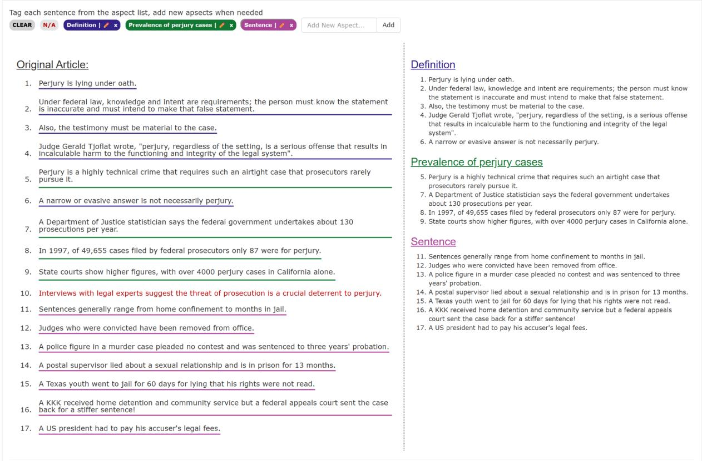  
Figure 3: Our interface for annotating aspect-based summaries. An annotator can add, remove or edit aspect labels (top), and respectively select sentences in the source reference summary that are relevant to the aspects. The produced summaries shown on the right side and updated in real time. Sentences with no aspect labels should actively annotated with special "N/A" label (sentence 10) to ensure workers reading all the article content.

## A.2 Curation Phase Details

Four paper authors applied the curation phase as detailed in Section 4.2. We first defined and refined the curation guidelines (Figure 6) in a discussion before starting curation. Then, we split the data evenly among curators, by original MTurk annotators and by data source splits (DUC vs. Multi-News) to avoid personal biases in specific sub-parts of the data. Some curated samples are shown in Table 8. The released OPENASP dataset includes the original aspect labels and summaries, as well as the instances from after curation.

## B Models Implementation Details

## B.1 Fine-tuned Models

BART. We used a variant of the BART-large model with 406M parameters, fine-tuned on the CNN Daily Mail dataset10.

PRIMERA. We utilized a variant of PRIMERA which was fine-tuned on the MultiNews dataset11 and includes 447M parameters

We fine-tuned PRIMERA and BART on OPE-NASP train set on 2 V100 GPUs with the following hyper-parameters: learning rate of 10e-5, batch size of 1, gradient accumulation steps of 3, and 3 epochs.

## B.2 ChatGPT

In Section B.2, we experimented with three models based on OpenAI’s ChatGPT API ChatGPTSumm, ChatGPTRecursive based on gpt-3.5-turbo-0301, while ChatGPT-16kRecursive uses gpt-3.5-turbo-16k-0613. The temperature of all models is set to 0 for reproducibility.

To determine the appropriate prompt, we manually evaluated the aspect-based summaries generated during a brief manual tuning of the prompt text. The final prompt used for all ChatGPT models is presented in Figure 7.

<table><tr><td rowspan=1 colspan=1>Topic</td><td rowspan=1 colspan=1>Originalaspect label</td><td rowspan=1 colspan=1>Original summary</td><td rowspan=1 colspan=1>Editedaspect label</td><td rowspan=1 colspan=1>Ispassed</td><td rowspan=1 colspan=1>Reason</td><td rowspan=1 colspan=1>Modified</td><td rowspan=1 colspan=1>Comment</td></tr><tr><td rowspan=1 colspan=1>Earthquakesmagnitude</td><td rowspan=1 colspan=1>Destructiveearthquakesbelow 7</td><td rowspan=1 colspan=1>9. Two quakes caused great destruction eventhough their magnitudes were below the 7 level.10. Twenty-five thousand were killed in Armenia,and at least another 1,000 in Tadzhikistan.</td><td rowspan=1 colspan=1></td><td rowspan=1 colspan=1>x</td><td rowspan=1 colspan=1>Topic</td><td rowspan=1 colspan=1></td><td rowspan=1 colspan=1>The topic is alist of incidentsand thereforeall itssummariesare rejected</td></tr><tr><td rowspan=1 colspan=1>ClarenceThomas</td><td rowspan=1 colspan=1>Lawcareer</td><td rowspan=1 colspan=1>0. Clarence Thomas, a black conservative republican,was confirmed as a Supreme Court justice on16 October 1991.8. He worked as an attorney and moved to Washingtonin 1974.9. Thomas was appointed to several civil rights andequal employment opportunity positions beginningin the early 1980s and as a judge in the U.S.10. Circuit Court of Appeals in 1990.12. His confirmation as a justice of the Supreme Courtbrought joy to his mother in Pinpoint, Georgia.</td><td rowspan=1 colspan=1></td><td rowspan=1 colspan=1>√</td><td rowspan=1 colspan=1></td><td rowspan=1 colspan=1>Summary</td><td rowspan=1 colspan=1>Sentence 12is not relevantand shouldbe removed.</td></tr><tr><td rowspan=1 colspan=1>Autism</td><td rowspan=1 colspan=1>Peoplewithautism</td><td rowspan=1 colspan=1>19. Autism affects 1 in 500-1000 and is on the rise.20. Eighty percent are boys.21. Odds are 1 in 20 that a family with one autisticchild will have another.22. Brick, NJ has an autism cluster.</td><td rowspan=1 colspan=1>Autismprevalence</td><td rowspan=1 colspan=1>√</td><td rowspan=1 colspan=1></td><td rowspan=1 colspan=1>Aspectname</td><td rowspan=1 colspan=1>The currentname isambiguousand thereforeis changed</td></tr></table>

Table 8: Examples of three data instances that were modified or rejected during the curation phase. Bold text represents a problematic sentence in the summary. The ‘Is passed’ column states whether the instance is included in the final data or is rejected. ‘Reason’ explains why the instance was rejected. ‘Modified’ specifies the type of problem (‘Aspect name’, ‘Summary’, or ‘Topic’) in case the instance needs a correction in order to be included in the final dataset.

In this paper, we used ChatGPT for summarization in two approaches, $\mathbf { C h a t G P T _ { S u m m } }$ and ChatGPTRecursive. ChatGPTSumm summarizes a reduced version of the original documents that fits within the model’s input length limit. The reduced version is created using a sentence selection method (described in Section 7.1). The selected sentences from each document in the document set are then consecutively presented within the same prompt as individual entries (document#1: “‘...“‘, ... , document#X: “‘...“‘).

For $\mathrm { C h a t G P T _ { R e c u r s i v e } }$ and ChatGPT-16kRecursive models, full documents are concatenated (separated by document title document#1:) until reaching the input length limit. Then the model generates a summary for the first portion of sentences. This process is repeated until all documents are summarized once. Then, the model gets all summaries with the same prompt, and summarizes the summaries to produce the final summary.

## B.3 Oracle Sentence-Selector Details

Following Hayashi et al. (2021) the oracle sentence selector is implemented as follows. Sentences from the document sets are aggregated to maximize the average of ROUGE-1 and ROUGE-2 F-1 scores against the reference aspect-based summaries. Once the score no longer improves, the selected sentences are omitted from the source, and the process is repeated again. This continues until the input size limit is reached, e.g., 1K tokens for

BART.

## C Model results

Table 9 presents the complete set of experiments conducted on our baseline models in the Filterthen-Summarize technique, employing the Lead, Sentence-T5, and Oracle sentence selectors.

Table 10 presents the experiments conducted on our baseline models in the Recursive summarization technique. As a reminder from Section 7.2, BARTRecursive and PRIMERARecursive were finetuned with the Filter-then-Summarize approach, which can use three different sentence selectors (Lead, Sent-T5 and Oracle ). In Table 10 it is apparent that the ‘Lead’ selector provides superior results over the other two sentence selectors. ‘Lead’ sentences are less focused on aspect-specific information (as revealed in Section 8.1). We can hence assume that this characteristic encourages the model to focus more on the aspect during training, and consequently to perform better during inference.

## C.1 System Summary Examples

Tables 13 and 14 present the aspect-based summaries generated by varied models for 2 different aspects, ’Launch into orbit’ and ’Reasons for high unemployment rates’, respectively. The corresponding reference summaries appear in the button line.

<table><tr><td rowspan="2">Fine Tuned</td><td rowspan="2">Aspect Input</td><td rowspan="2">Input Size</td><td rowspan="2">Base Model</td><td colspan="3">Oracle Selector</td><td colspan="3">Lead Selector</td><td colspan="3">S-T5 Selector</td></tr><tr><td>R-1</td><td>R-2</td><td>R-L</td><td>R-1</td><td>R-2</td><td>R-L</td><td>R-1</td><td>R-2</td><td>R-L</td></tr><tr><td>√</td><td>√</td><td>1K</td><td> $\mathbf { B A R T _ { S u m m } }$ </td><td>40.6</td><td>14.5</td><td>23.2</td><td>31.3</td><td>7.6</td><td>17.9</td><td>32.4</td><td>8.3</td><td>18.7</td></tr><tr><td>√</td><td>√</td><td>4K</td><td> $\mathrm { P R I M E R A _ { S u m m } }$ </td><td>33.8</td><td>10.0</td><td>20.0</td><td>30.0</td><td>7.6</td><td>17.9</td><td>30.5</td><td>8.0</td><td>18.3</td></tr><tr><td>√</td><td>√</td><td>1K</td><td> $\mathrm { P R I M E R A _ { S u m m } }$ </td><td>37.9</td><td>13.0</td><td>22.6</td><td>29.9</td><td>7.6</td><td>17.9</td><td>31.2</td><td>8.3</td><td>18.7</td></tr><tr><td>√</td><td>x</td><td>1K</td><td> $\mathbf { B A R T _ { S u m m } }$ </td><td>39.5</td><td>13.3</td><td>22.5</td><td>27.5</td><td>5.3</td><td>15.7</td><td>32.0</td><td>8.0</td><td>18.2</td></tr><tr><td>√</td><td>x</td><td>4K</td><td> $\mathrm { P R I M E R A _ { S u m m } }$ </td><td>31.4</td><td>8.2</td><td>18.6</td><td>26.4</td><td>5.2</td><td>15.7</td><td>29.1</td><td>6.6</td><td>17.0</td></tr><tr><td>√</td><td>x</td><td>1K</td><td> $\mathrm { P R I M E R A _ { S u m m } }$ </td><td>36.6</td><td>12.4</td><td>21.9</td><td>26.6</td><td>5.2</td><td>15.6</td><td>30.4</td><td>7.5</td><td>17.8</td></tr><tr><td>x</td><td>√</td><td>1K</td><td> $\mathbf { B A R T _ { S u m m } }$ </td><td>34.6</td><td>10.7</td><td>20.5</td><td>25.5</td><td>5.0</td><td>15.3</td><td>28.5</td><td>6.7</td><td>17.0</td></tr><tr><td>x</td><td>√</td><td>4K</td><td> $\mathrm { P R I M E R A _ { S u m m } }$ </td><td>30.9</td><td>7.5</td><td>17.3</td><td>28.7</td><td>6.3</td><td>16.0</td><td>29.5</td><td>6.6</td><td>16.4</td></tr><tr><td>x</td><td>√</td><td>1K</td><td> $\mathrm { P R I M E R A _ { S u m m } }$ </td><td>35.8</td><td>11.1</td><td>20.0</td><td>29.0</td><td>6.4</td><td>16.2</td><td>31.3</td><td>7.8</td><td>17.6</td></tr><tr><td>x</td><td>√</td><td>4K</td><td> $\mathrm { C h a t G P T } _ { \mathrm { S u m m } }$ </td><td>35.6</td><td>10.8</td><td>20.7</td><td>32.8</td><td>8.9</td><td>19.2</td><td>33.7</td><td>9.4</td><td>19.8</td></tr><tr><td>x</td><td>x</td><td>1K</td><td> $\mathbf { B A R T _ { S u m m } }$ </td><td>34.4</td><td>10.6</td><td>20.2</td><td>25.4</td><td>5.0</td><td>15.0</td><td>28.2</td><td>6.5</td><td>16.9</td></tr><tr><td>x</td><td>x</td><td>4K</td><td> $\mathrm { P R I M E R A _ { S u m m } }$ </td><td>31.1</td><td>7.7</td><td>17.4</td><td>28.5</td><td>6.2</td><td>16.1</td><td>29.6</td><td>6.7</td><td>16.7</td></tr><tr><td>x</td><td>x</td><td>1K</td><td> $\mathrm { P R I M E R A _ { S u m m } }$ </td><td>35.8</td><td>11.0</td><td>20.0</td><td>28.9</td><td>6.3</td><td>16.0</td><td>31.1</td><td>7.5</td><td>17.4</td></tr></table>

Table 9: The ROUGE $F _ { 1 }$ scores for all model configurations that use a sentence selector. The number of extracted sentences by a sentence selector is limited by the maximum input token-length, as indicated in ‘Input $\mathrm { S i z e ^ { \prime } }$ . The best configuration for each sentence selector option is marked in bold.

<table><tr><td>Base Model</td><td>Input Size</td><td>Fine Tuned</td><td>Sentence Selector</td><td>R-1</td><td>R-2</td><td>R-L</td></tr><tr><td>BARTRecursive</td><td>1K</td><td>√</td><td>Oraclesel</td><td>29.8</td><td>6.3</td><td>16.8</td></tr><tr><td>PRIMERARecursive</td><td>4K</td><td>√</td><td>Oraclesel</td><td>28.6</td><td>6.4</td><td>16.9</td></tr><tr><td> $\mathrm { P R I M E R A _ { R e c u r s i v e } }$ </td><td>1K</td><td>√</td><td>Oraclesel</td><td>27.3</td><td>5.6</td><td>16.2</td></tr><tr><td>BARTRecursive</td><td>1K</td><td>√</td><td>Sent-T5</td><td>29.1</td><td>6.0</td><td>16.2</td></tr><tr><td>PRIMERARecursive</td><td>4K</td><td>√</td><td>Sent-T5</td><td>29.1</td><td>6.7</td><td>17.1</td></tr><tr><td> $\mathrm { P R I M E R A _ { R e c u r s i v e } }$ </td><td>1K</td><td>√</td><td>Sent-T5</td><td>27.9</td><td>5.7</td><td>16.4</td></tr><tr><td> $\mathbf { B A R T _ { R e c u r s i v e } }$ </td><td>1K</td><td>√</td><td>Lead</td><td>30.1</td><td>6.6</td><td>17.1</td></tr><tr><td>PRIMERARecursive</td><td>4K</td><td>√</td><td>Lead</td><td>29.8</td><td>7.3</td><td>17.8</td></tr><tr><td> $\mathrm { P R I M E R A _ { R e c u r s i v e } }$ </td><td>1K</td><td>√</td><td>Lead</td><td>28.1</td><td>5.8</td><td>16.4</td></tr><tr><td> $\mathrm { C h a t G P T _ { R e c u r s i v e } }$ </td><td>4K</td><td>x</td><td>=</td><td>32.4</td><td>9.2</td><td>19.1</td></tr><tr><td> $\mathrm { C h a t G P T _ { R e c u r s i v e } }$ </td><td>16K</td><td>x</td><td>-</td><td>31.8</td><td>8.1</td><td>18.6</td></tr></table>

Table 10: The ROUGE $F _ { 1 }$ scores for all model configurations in the Recursive summarization technique. All variants include the aspect label as part of the input. $\mathbf { B A R T _ { R e c u r s i v e } }$ and $\mathrm { P R I M E R A _ { R e c u r s i v e } }$ were fine-tuned using the Filter-then-Summarize approach (on the input sentences extracted by a sentence selector), however executed through the recursive technique (see Section 7.2). The best configuration is marked in bold.

<table><tr><td>Split</td><td>Source</td><td># Topics</td><td># Aspects</td></tr><tr><td rowspan="3">Test</td><td>DUC-2002</td><td>56</td><td>157</td></tr><tr><td>DUC-2007</td><td>42</td><td>148</td></tr><tr><td>MultiNews-Test Total</td><td>94 192</td><td>291 596</td></tr><tr><td rowspan="3">Valid</td><td>DUC-2001-Test DUC-2006</td><td>26</td><td>78</td></tr><tr><td>MultiNews-Valid</td><td>13</td><td>38</td></tr><tr><td>Total</td><td>43 82</td><td>122 238</td></tr><tr><td rowspan="3">Train</td><td>DUC-2001-Train</td><td>28</td><td>82</td></tr><tr><td>DUC-2006</td><td>34</td><td>115</td></tr><tr><td>MultiNews-Train</td><td>83</td><td>279</td></tr><tr><td rowspan="2"></td><td>Total</td><td></td><td>476</td></tr><tr><td></td><td>145</td><td></td></tr></table>

Table 11: The size of the OPENASP dataset splits, broken down to their sources. # Topics denotes the number of document sets in the split; # Aspects is the total number of aspect-based summaries in the split.

## D OPENASP Details

We split OPENASP dataset into train, validation and test sets based on the source datasets they originated from (see Table 11). For aspect-based summaries originated from MultiNews, we followed the original splits, for summaries originated from DUC, we separated the test years from the train and validation.

## D.1 OPENASP Source Splits

## D.2 MultiNews Filtering

During annotation phase, we noticed several faulty source documents from MultiNews, probably due to failed crawling. We manually examine some suspicious short source documents, finding a few common phrases that imply the document retrieval failed. For example, “The seed for this crawl was a list of every host in the Wayback Machine This crawl was run at a level 1 (URLs including their embeds, plus the URLs ofall outbound links including their embeds) The WARCfiles associated with this crawl are not currently available to the general public." and several similar cases.

We created a short list of such texts and automatically filtered all topics from MultiNews containing one or more source documents matching these strings.

## D.3 Documents and Summaries Lengths

Figure 11, presents the distribution and cumulative distribution of token lengths in summaries and document-sets.

## D.4 Content Diversity

Content diversity (Grusky et al., 2018; Fabbri et al., 2019) is a joint measure for extractiveness of coverage and density. Coverage is the percentage of words in the summary that are from the source article, and density is the average length of the extractive fragment to which each summary word belongs. While OPENASP’s summaries are extracted from source generic summaries, the generic summaries themselves are at different levels of abstractiveness relative to their corresponding document set. Accordingly, the aspect-based summaries also exhibit varying abstractive extents. Figure 2 illustrates the distribution of coverage on the x-axis, and that of density on the y-axis. As shown, most extracts are short, however there are few cases of sentence-level extractions. Overall, there is a diversified balance of abstractiveness in the data. Figure 10, presents the content diversity graphs of OPE-NASP, separated by the source datasets DUC and MultiNews (a stratified version of Figure 2).

## D.5 Multi-document Coverage

Multi-document coverage quantifies the amount of documents in the document-set upon which a corresponding summary depends (Wolhandler et al., 2022). Figure 9 shows the multi-document coverage of OPENASP, compared to the source datasets. The coverage is derived in terms of propositional alignment (Ernst et al., 2022) between the highestmatching subset of k documents (x-axis) and the summary. The dispersion score, a function of the area-above-the-curve, is a measure of multidocument coverage, where a higher value means there is higher document-diversity overall.

The dispersion score of OPENASP is 2.9, with standard deviation of 4.1, while DUC-2001/2 and DUC-2006/7 render higher dispersion scores of 10.2 and 16.5 respectively. This can be explained by the longer summaries in the latter datasets, ∼2.5 times longer than OPENASP summaries. Moreover, a generic summary, as opposed to an aspect-based summary, is expected to cover several subtopics, and hence align with a wider range of source documents. Meanwhile, the high standard deviation in the dispersion score means there are still aspectbased summaries that align with a larger number of documents. Some summaries require handpicking information from specific documents, while others require consolidating information from across the document set.

## D.6 Adding Topic Names

We add to each document-set in our dataset a topic name, which was selected as an additional side task. Specifically, we asked Mturk annotators to identify the topic of each presented generic summary. This process helped us later to facilitate and quickly identify irrelevant aspects in the curation phase in Section 4.2.

## D.7 Dataset Examples

Table 15 shows the aspects labels and the corresponding aspect-based summaries, which belong to 3 randomly selected different document sets in our OpenAsp. Each document set is represented by its topic name.

## D.8 Details on OABS datasets

Table 12 presents more details regarding the OABS datasets from Table 1.

<table><tr><td rowspan=1 colspan=1>Dataset</td><td rowspan=1 colspan=1>Avg # Tokensin InputDoc/Docset</td><td rowspan=1 colspan=1>Avg # Tokensin OutputSummary</td><td rowspan=1 colspan=1>Avg # Tokensin InputAspect Label</td><td rowspan=1 colspan=1>Avg # Aspectsper Topic</td><td rowspan=1 colspan=1>Aspect Label Examples</td></tr><tr><td rowspan=1 colspan=1>AnyAspect(Tan et al., 2020)</td><td rowspan=1 colspan=1>818</td><td rowspan=1 colspan=1>23</td><td rowspan=1 colspan=1>1.6</td><td rowspan=1 colspan=1>7.0</td><td rowspan=1 colspan=1>kentucky,gray,mr tizzard,julie bishop,bernabeu,watson,kola,cash,cnn,australia</td></tr><tr><td rowspan=1 colspan=1>OASUM(Yang et al., 2022)</td><td rowspan=1 colspan=1>1615</td><td rowspan=1 colspan=1>40</td><td rowspan=1 colspan=1>2.7</td><td rowspan=1 colspan=1>1.8</td><td rowspan=1 colspan=1>History,Career,Background,Geography,Life,Reception,Description,Early life,Demographics,Production</td></tr><tr><td rowspan=2 colspan=1>OPENASP(Ours)</td><td rowspan=2 colspan=1>7,930</td><td rowspan=2 colspan=1>96</td><td rowspan=1 colspan=1></td><td rowspan=1 colspan=1></td><td rowspan=2 colspan=1>Hurricane impact,Drug treatments,Custody Ruling,British response,Elian&#x27;s rescue,Availability of gas,Removal of the guardhouse,Opinions on Hillary Clinton,Expenses controversy,Alterations of waterways</td></tr><tr><td rowspan=1 colspan=1>3.6</td><td rowspan=1 colspan=1>3.1</td></tr></table>

Table 12: Statistics on the OABS datasets from Table 1. In the first two datasets, the input topic is a single document, while in our dataset it is a document set. The example aspect labels in the right-most column are taken from sampled topics from across the respective dataset.

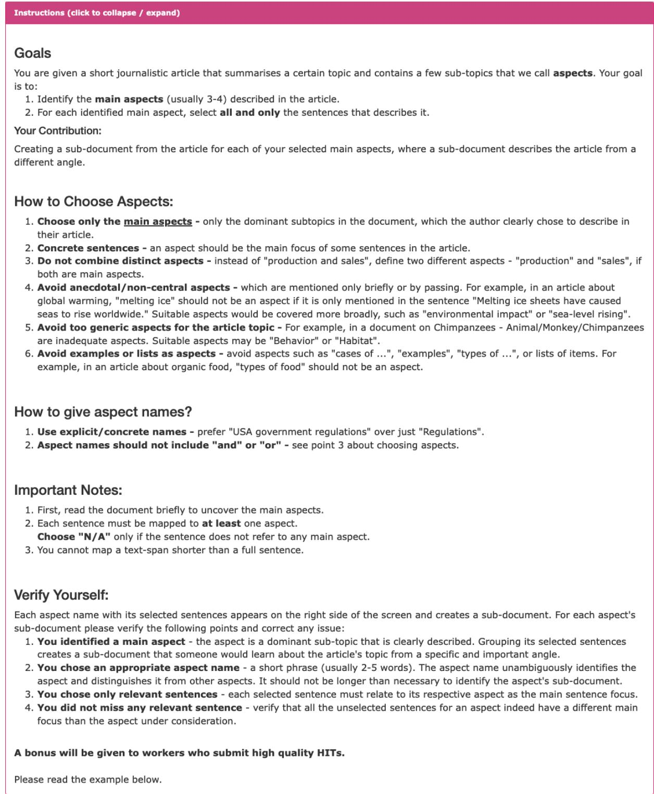  
Figure 4: Our annotation guidelines for extracting aspects and respective aspect-based summaries, as shown to crowdworkers on the Mechanical Turk platform.

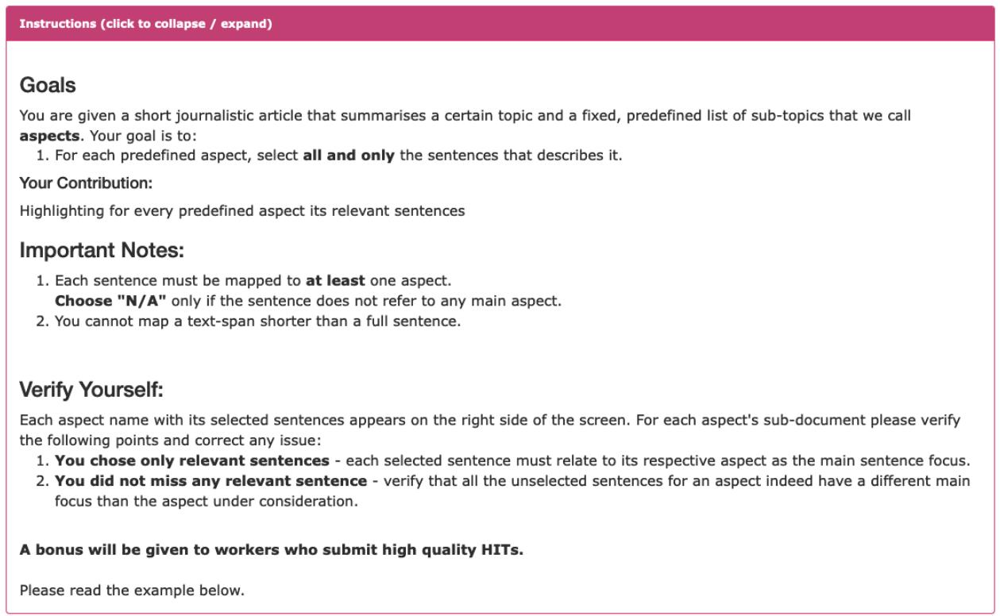  
Figure 5: Our annotation guidelines for aligning document-sentences to an aspect (Section 6.1), as presented to crowdworkers on the Mechanical Turk platform.

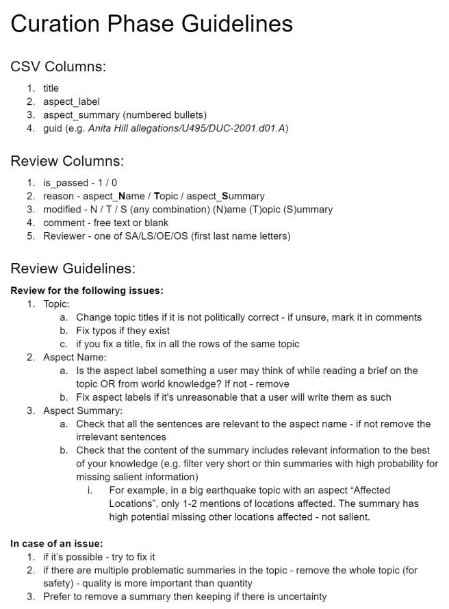  
Figure 6: Curation phase guidelines used for cleaning OPENASP.

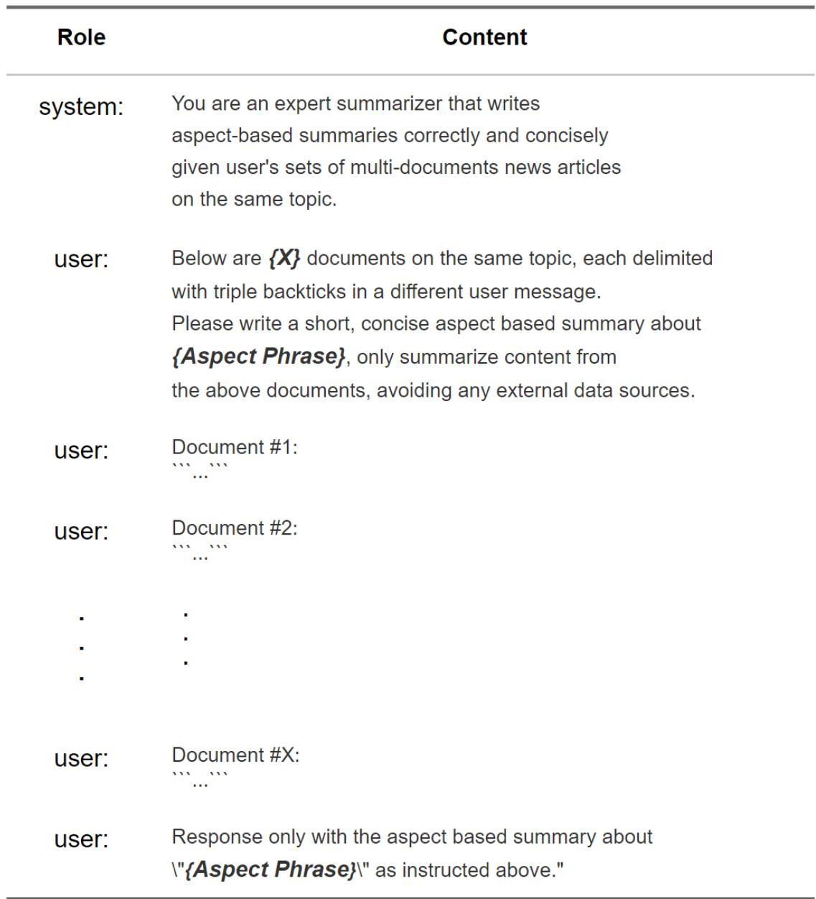  
Figure 7: The prompt template used for all ChatGPT models, $\mathbf { C h a t G P T _ { S u m m } }$ $\mathbf { C h a t G P T _ { R e c u r s i v e } }$ and ChatGPT-$1 6 \mathrm { k _ { R e c u r s i v e } }$ . In the recursive configuration, when summarizing summaries, the summaries act as “documents”.

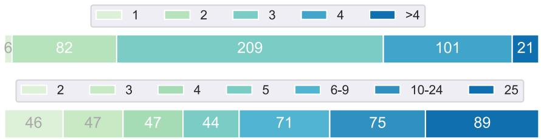  
Figure 8: The distribution of the number of aspects (top) and number of documents (bottom) per topic for OPENASP’s 419 topics. OPENASP has an average of 3.1 aspects and 10.4 documents per topic.

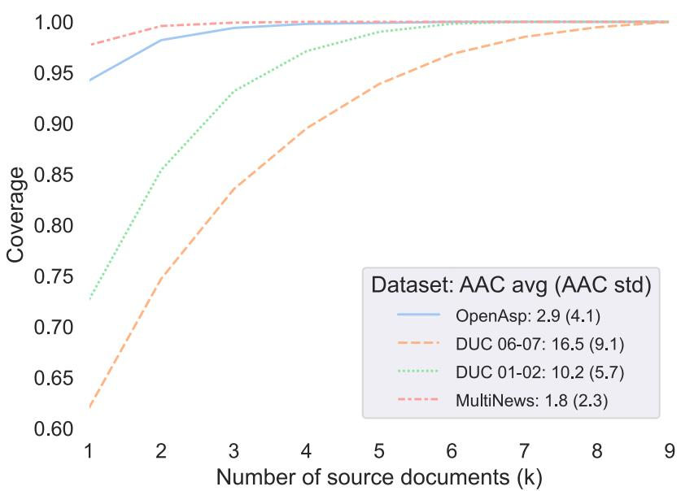  
Figure 9: The multi-document coverage and the dispersion score (AAC) of OPENASP compared to other MDS datasets as reported in Wolhandler et al. (2022). A larger area above the curve implies that summaries rely on a larger subset of their corresponding document-set.

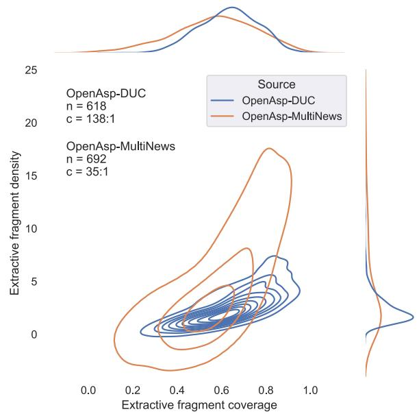  
Figure 10: The content diversity graphs (Grusky et al., 2018) of OPENASP, separated by the source datasets DUC and MultiNews (a stratified version of Figure 2). n and c denote number of examples and median compression ratio respectively. DUC-based summaries contains extracts that are substantially shorter than those of MultiNews.

<table><tr><td colspan="1" rowspan="1">Model</td><td colspan="1" rowspan="1">Summary Text</td></tr><tr><td colspan="1" rowspan="1"> $\mathrm { B A R T _ { S u m m } } 1 \mathrm { k } \mathrm { S } { \cdot } \mathrm { T } \mathrm { 5 }$ </td><td colspan="1" rowspan="1">The launch was scrubbed four minutes before liftoff because of bad weather.It was rescheduled for 8:31 a.m. EDT on March 8, 1989.The countdown began Saturday afternoon, April 27, 1989, and the countdown for thelaunch of the new shuttle, Discovery, began at 3:37pm.Five astronauts climbed into the crew cabin just as dawn broke over the Kennedy Space Center.They were ready to go out of the cabin at any time to assist with repairs.Mission Control ordered space-walking astronauts to be ready to help with the shuttle's final</td></tr><tr><td colspan="1" rowspan="1"> $\mathrm { P R I M E R A _ { S u m m } }$ 1K S-T5</td><td colspan="1" rowspan="1">The countdown began Saturday afternoon for a launch set for 8:31am EDT Tuesday.The launch was scrubbed four minutes before liftoff.</td></tr><tr><td colspan="1" rowspan="1"> $\mathrm { P R I M E R A _ { S u m m } }$ 4K S-T5</td><td colspan="1" rowspan="1">The launch was delayed for two weeks after a faulty power unit forced the National Aeronauticsand Space Administration to halt the first launch four minutes before liftoff on April 10, 1989.The second attempt to launch the Hubble Space Telescope was successfully launched on June 8, 1990.</td></tr><tr><td colspan="1" rowspan="1"> $\mathbf { C h a t G P T _ { S u m m } }$ 4K S-T5</td><td colspan="1" rowspan="1">The Hubble Space Telescope was launched into orbit by the Discovery shuttle,marking a significant moment for NASA.The telescope, which cost $1.5 billion, was released from the shuttle's mechanical arm andis expected to provide significant scientific data by satellite in a month or two.The launch was delayed by two weeks due to a faulty power unit, but the procedure went smoothlyand the telescope was released successfully.The orbit was dictated by the need to put the telescope above the Earth's distorting atmosphere.The mission was considered to be the most important shuttle mission to date</td></tr><tr><td colspan="1" rowspan="1"> $\mathrm { C h a t G P T _ { R e c u r s i v e } }$ 4K</td><td colspan="1" rowspan="1">Aspect Based Summary:The Hubble Space Telescope was successfully launched into orbit by the Discoveryshuttle after several delays.The telescope was deployed with the help of the shuttle's mechanical arm and two solar panelsthat power its instruments.It had some problems with its high-speed antennas and its science instruments were on hold,but it is expected to provide significant scientific data by satellite in a month or two.The telescope is considered the most important shuttle mission to date and is expected to provideclues to the age and size of the universe, and it may solve the mysteries of quasars, pulsars, andblack holes and even find stars with planets that could conceivably support life.</td></tr><tr><td colspan="1" rowspan="1"> $\mathrm { C h a t G P T _ { R e c u r s i v e } }$ 16K</td><td colspan="1" rowspan="1">The Hubble Space Telescope was successfully launched into orbit by the space shuttle Discovery.The launch was delayed multiple times due to technical problems and the Challenger accident.The telescope, named after astronomer Edwin P. Hubble, will allow astronomers to study starsand galaxies that are billions of years old and provide insights into the origins andexpansion of the universe.The telescope's mission is expected to last 15 years and it is equipped with advancedinstruments to capture high-resolution images and collect scientific data.</td></tr><tr><td colspan="1" rowspan="1">Gold</td><td colspan="1" rowspan="1">Deployment of the Hubble Space Telescope (HST), originally scheduled for 1983,was delayed by technical problems and the Challenger accident in 1986 and did nottake place until April 1990.A successful launch of space shuttle Discovery with the HST aboard took place at8:34 a.m. April 24, 1990 and Discovery ascended into orbit 380 miles above Earth.On April 25 the HST was placed in orbit on its own with Discovery trailing behindto provide astronaut assistance if needed.The HST's aluminum aperture door was successfully opened on April 27 exposingthe telescope's 94.5- inch mirror to starlight.By April 28 there were still problems with the electronic and communications systems, butprocedures were in place to take care of these, the HST was in orbit,and the Discovery astronauts prepared for return to earth on April 29, 1990.</td></tr><tr><td colspan="1" rowspan="1"> $\mathrm { B A R T _ { S u m m } } 1 \mathrm { k } \mathrm { S } { \cdot } \mathrm { T } \mathrm { 5 }$ </td><td colspan="1" rowspan="1">Unemployment in France is one of the country's main economic problems.Unemployment is a major problem because of a combination of factors includinglack of development of job market and lack of solidarity among people.The French Observatory of Economic Circumstances expects an unemployedpopulation of 140,000 by the end of the year and 120,000 in the following year.France is running a near-record 12.4% unemployment rate with a jobless populationof 3.1 million, one-third of whom has been unemployed for more than a year.</td></tr><tr><td colspan="1" rowspan="1">PRIMER $\mathbf { A } _ { \mathrm { S u m m } }$ 4K S-T5</td><td colspan="1" rowspan="1">Unemployment in France has long been a major problem, with a 12.4% unemployment rate.France's unemployment rate dropped slightly to 11.6% in October from 11.7% the previousOctober, but is still high and has not reversed over the past 15 years.Unemployment is fueled by a combination of factors, including a weak economy, a lack ofdevelopment of the job market, and social exclusion.Also, there is concern over the high cost of unemployment insurance and unemploymentcompensation.</td></tr><tr><td colspan="1" rowspan="1">PRIMER $\mathbf { A } _ { \mathrm { S u m m } }$ 1K S-T5</td><td colspan="1" rowspan="1">Unemployment in Europe is one of the most important problems facing the country.The unemployment rate in France is 11.2%, up from 11.7% since the Second World War.In 1982 unemployment peaked at 9.7%, the first full year of Reagan's administration,while in 1975 unemployment in Germany more than doubled to 3.4%.</td></tr><tr><td colspan="1" rowspan="1"> $\mathrm { C h a t G P T } _ { \mathrm { S u m m } } 4 \mathrm { K } \mathrm { S } – \mathrm { T } 5$ </td><td colspan="1" rowspan="1">France has been struggling with high unemployment rates, which have been a major economichurdle for the country.The unemployment rate in France stands at 12.5%, with 3.1 million people unemployed,one-third of which have been unemployed for more than a year. The major causes ofunemployment in France are attributed to the economic crisis, lack of job opportunities,high labor costs, and structural impediments in the functioning of labor markets.The rising crime rate among youths from working-class suburbs that have been hard-hit byunemployment is also a growing concern.</td></tr><tr><td colspan="1" rowspan="1"> $\mathbf { C h a t G P T _ { R e c u r s i v e } }$ 4K</td><td colspan="1" rowspan="1">High unemployment rates in France are attributed to various factors such as high labor costs.low economic growth, lack of job opportunities, insufficient social allowances, and the lackof development of the job market.The government has taken measures such as increasing unemployment benefits,providing financial aid to the jobless, and subsidizing employment programs.The OECD recommends raising wage flexibility, reforming the minimum wage system, andreducing the costs of the social protection system to address the problem of unemployment.</td></tr><tr><td colspan="1" rowspan="1"> $\mathbf { C h a t G P T _ { R e c u r s i v e } }$ 16K</td><td colspan="1" rowspan="1">The high unemployment rates in France are attributed to various factors, including economiccrisis, lack of job opportunities, rigid labor market regulations, social exclusion, and a risingcrime rate among youths from working class suburbs.The government's efforts to address the issue through measures such as increasing socialallowances and unemployment benefits have been met with protests and demands forfurther action.The need for wage flexibility, reforming the minimum wage system, and reducing restrictionson mass layoffs have also been highlighted as potential solutions.Additionally, concerns have been raised about the high costs of France's social protectionsystem and the need to make the benefit system less generous.</td></tr><tr><td colspan="1" rowspan="1">Gold</td><td colspan="1" rowspan="1">Critics attributed France's unemployment to its near-zero growth economicenvironment, to its focus on fairness in income distribution, to rigidity in budget policyto declines in social policy, and to layoffs in the public sector.Additional unemployment causes cited were high costs for low-skilled workers,high unemployment insurance and compensation costs, and over-regulation of industry.Critics suggested using the money paying for social aid programs to be used insteadfor investment in jobs.</td></tr></table>

Table 13: The generated aspect-based summaries that refer to the aspect ’Launch into $o r b i t '$ of the topic ’Hubble Space Telescope’. The bottom line contains the Gold summary in Bold.

Table 14: The generated aspect-based summaries that refer to the aspect ’Reasons for high unemployment rates’ of the topic ’Unemployment in France’. The bottom line contains the Gold summary in Bold.

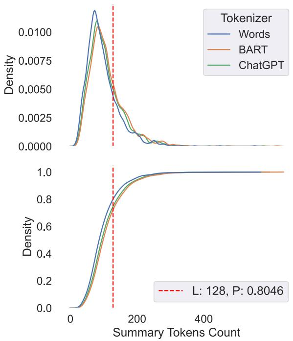

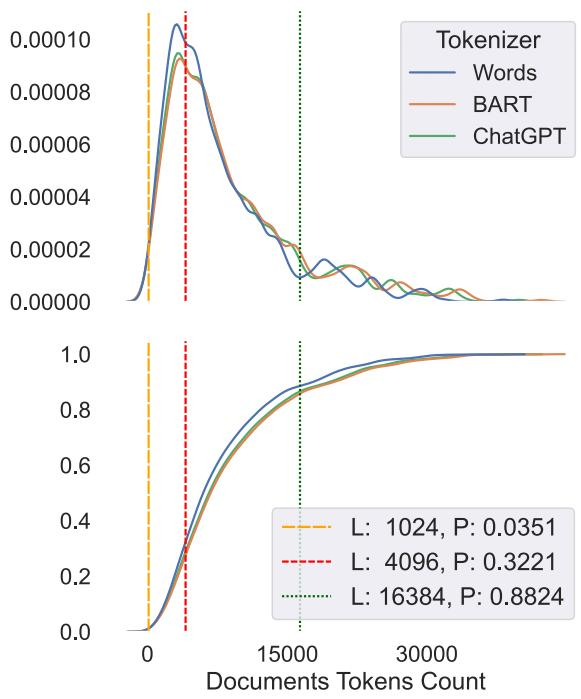  
Figure 11: The distribution (top) and cumulative distribution (bottom) of token-lengths in summaries (left) and document-sets (right) in OPENASP. Each plot is presented with three different tokenization methods: standard word tokenization (NLTK word\_tokenize), BART (also used by PRIMERA) and the ChatGPT tokenizer (tiktoken). The dashed horizontal lines mark 1024, 4096 and 16384 token lengths. For each horizontal line, $P$ is the percentage of instances in the dataset whose summary/document-set lengths are less than or equal to the corresponding length limit (L), using the word tokenizer. For example, 32.21% of the instances have input word-lengths less than 4,096 words. As seen, the differences between the tokenizers in terms of content length are negligible.

<table><tr><td>Topic</td><td>Aspect Label 2000 Senate</td><td>Aspect-based Summary She started raising $15 million for a second term in the Senate.Her 2000 Senate campaign blamed</td></tr><tr><td rowspan="3">Sstr tr Dtein</td><td>Campaign Political Posi-</td><td>Republicans for rejecting her patients&#x27; rights bill, tobacco regulation, and gun purchase restrictions.She ran on improving health care, preserving Lake Tahoe, restricting gun sales, eliminating the gas additive MTBE, and bringing together opponents in California&#x27;s water wars.Opponent Representative Tom Campbell (R-CA), a Stanford Law professor and pro-abortion rights, made her Senate race nationally significant and her toughest since 1990, when she was booed at a state Democratic convention for supporting the death penalty. In 1999 she authored a failed resolution censuring President Clinton, but voted against both articles of</td></tr><tr><td>tions Achievements of</td><td>impeachment.Her 2000 Senate campaign blamed Republicans for rejecting her patients&#x27; rights bill tobacco regulation, and gun purchase restrictions.She ran on improving health care, preserving Lake Tahoe, restricting gun sales, eliminating the gas additive MTBE, and bringing together opponents in California&#x27;s water wars.A centrist, her support cuts across lines of party, ethnicity and gender.She supported deficit reduction. By 1998 Senator Diane Feinstein (D-CA) was the senior Democrat on the Judiciary Committee&#x27;s</td></tr><tr><td>Feinstein&#x27;s Sen- ate Career Scandals</td><td>panel on technology, terrorism and government information.Her 1984 ban on assault weapons and a Mojave Desert national park were crowning achievements of her Senate career.Feinstein amended a trade bill to eliminate sanctions against Sub-Saharan African countries producing copycat US AIDS drugs.In 2000 Feinstein introduced legislation requiring gun owners to obtain licenses and register.Feinstein successfully rebutted opponent&#x27;s erroneous charges that her support for normalizing China trade relations benefited her husband and that she had hidden related financial disclosure information.Senators Feinstein and Boxer were the first two women co-chairs of a national political convention. His college career was threatened by the Vietnam War, but he arranged deferments until induction</td></tr><tr><td rowspan="2">Wiliitm Cilton</td><td>Early life</td><td>seemed unlikely, then drew a high lottery number, avoiding military service.This incident drew criticism during subsequent political campaigns.He and his wife, Hillary, invested in a real estate venture, Whitewater, and the related failure of a savings and loan.The scandal simmered for years.In the presidential campaign of 1992 he defended his record in Arkansas and his personal and draft history. William Clinton showed intelligence and promise from childhood.An overachiever at school, his home life was punctuated with long discussions on a variety of subjects including desegregation and social justice.After graduation he went on to Georgetown, Oxford (as a Rhodes Scholar) and Yale Law School.His college career was threatened by the Vietnam War, but he arranged deferments until induction seemed unlikely, then drew a high lottery number, avoiding military service.</td></tr><tr><td>Political career</td><td>Returning home, he ran successfully for governor in 1978 at age 32 but was defeated for reelection.Older and wiser, he ran successfully three more times, making improvements in education, the economy and welfare.In the presidential campaign of 1992 he defended his record in Arkansas and his personal and draft history.A German editorial summarizes Clinton&#x27;s early presidency.Despite some blunders, a year later he enjoys a 60% popularity rating; the economy is up, prices stable and interest and the deficit are down.</td></tr><tr><td rowspan="2">h  ns , w   wnd</td><td>Problems with the cast David Selznick reluctant to make the film</td><td>Clark Gable was under contract to Selznick&#x27;s father-in-law, who finally &quot;loaned&quot; him to Selznick, with plenty of strings attached—andGable wasn&#x27;t thrilled about it.Original director George Cukor didn&#x27;t get along with Gable and was eventually replaced by Fleming, who didn&#x27;t get along with Vivien Leigh.&quot;Leigh hated Fleming.With a passion.Fleming hated her.Clark Gable hated David ... Everybody hated David,&quot; an assistant said.Fleming quit before returning. In Entertainment Weekly, Chris Nashawaty tells the story of the film&#x27;s making, which centered on producer David Selznick.He was at first reluctant to make the film, despite a glowing review of the</td></tr><tr><td>The premiere sparked racial tension Script writing challanges</td><td>book by one of his employees.&quot;I am absolutely off my nut about this book,&quot; Katharine Brown wrote, finally convincing him to take action. And the trouble was far from over: Racism plagued the various premieres, with black cast members in many cases banned from attending, the Los Angeles Times reports.That prompted anger from Selznick, the AP reports; Gable, meanwhile, had already stood against segregated toilets on set, threatening to bail on the film, according to a Life magazine book cited by the Times. Among the challenges: The first writer dropped out after spending months on the script.After a number of other writers tried their hand, including Selznick himself, writer Ben Hecht took it on, but there was no time for him to read Margaret Mitchell&#x27;s book.So Selznick and director Victor Fleming &quot;stayed up all night acting out the story for him.&quot;</td></tr></table>

Table 15: The aspect labels and corresponding aspect-based summaries that belong to 3 random selected document sets from our OPENASP dataset. A topic name is assigned to each document set.