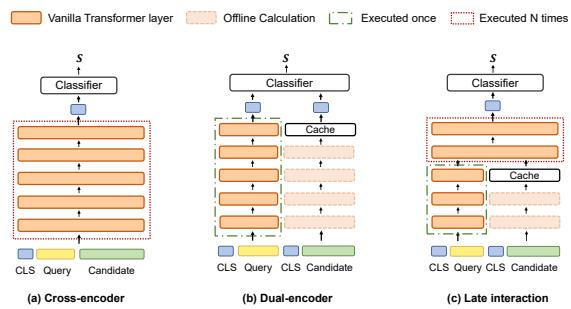
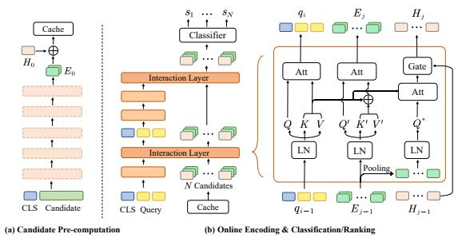
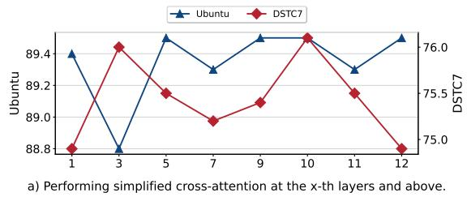
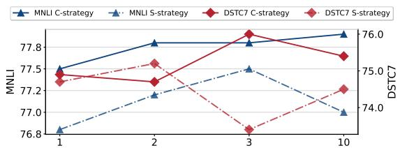
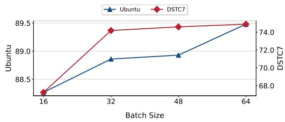

# Once is Enough: A Lightweight Cross-Attention for Fast Sentence Pair Modeling

Yuanhang Yang1 Shiyi Qi1 Chuanyi Liu1 Qifan Wang2

Cuiyun Gao1 Zenglin Xu1

1Harbin Institute of Technology, Shenzhen, China

2Meta AI, CA, USA

{ysngkil, syqi12138}@gmail.com liuchuanyi@hit.edu.cn wqfcr@fb.com {gaocuiyun, xuzenglin}@hit.edu.cn

## Abstract

Transformer-based models have achieved great success on sentence pair modeling tasks, such as answer selection and natural language inference (NLI). These models generally perform cross-attention over input pairs, leading to prohibitive computational costs. Recent studies propose dual-encoder and late interaction architectures for faster computation. However, the balance between the expressive of crossattention and computation speedup still needs better coordinated. To this end, this paper introduces a novel paradigm MixEncoder for efficient sentence pair modeling. MixEncoder involves a lightweight cross-attention mechanism. It avoids the repeated encoding of the same query for different candidates, thus allowing modeling the query-candidate interaction in parallel. Extensive experiments conducted on four tasks demonstrate that our Mix-Encoder can speed up sentence pairing by over 113x while achieving comparable performance as the more expensive cross-attention models. The source code is available at https: //github.com/ysngki/MixEncoder.

## 1 Introduction

Sentence pair modeling, such as natural language inference, question answering, and information retrieval, is an essential task in natural language processing (Nogueira and Cho, 2020; Qu et al., 2021; Zhao et al., 2021). These tasks can be depicted as a procedure of scoring the candidates given a query. Recently, Transformer-based models (Vaswani et al., 2017; Devlin et al., 2019) have shown promising performance on sentence pair modeling tasks due to the expressiveness of the pre-trained cross-encoder. As shown in Figure 1(a), the cross-encoder takes a pair of query and candidate as input and calculates the interaction between them at each layer by the input-wide self-attention mechanism. Despite the effective text representation power, the cross-encoder leads to exhaustive computation costs, especially when the number of candidates is very large ( e.g., the interaction will be calculated N times if there are N candidates). This computation cost, therefore, restricts the use of these cross-encoder models in many real-world applications (Chen et al., 2020).

To tackle this issue, we propose a lightweight cross-attention mechanism, called MixEncoder, that speeds up the inference while maintaining the expressiveness of cross-attention. Specifically, the proposed MixEncoder accelerates the crossattention by performing attention only from candidates to the query, involving few tokens and only at a few layers. This lightweight cross-attention avoids repetitive query encoding, supporting the processing of multiple candidates in parallel and thus reducing computation costs. Additionally, MixEncoder allows to pre-compute the candidates into several dense context embeddings and to store them offline to accelerate the inference further.

We evaluate MixEncoder for sentence pair modeling on four benchmark datasets related to tasks of natural language inference, dialogue, and information retrieval. The results demonstrate that Mix-Encoder better balances the effectiveness and efficiency. For example, MixEncoder achieves a substantial speedup of more than 113x over the crossencoder and provides competitive performance.

## 2 Background

Extensive studies, including dual-encoder (Reimers and Gurevych, 2019) and late interaction models (MacAvaney et al., 2020; Gao et al., 2020; Chen et al., 2020; Khattab and Zaharia, 2020), have been proposed to accelerate the transformer inference on sentence pair modeling tasks.

As shown in Figure 1, dual-encoders process the query and candidates separately, allowing precomputing the candidates to accelerate online inference, resulting in fast inference speed. However, this speedup is built upon sacrificing the expressiveness of cross-attention (Luan et al., 2021; Hu et al., 2021; Zhang et al., 2021). Alternatively, late-interaction models adjust dual-encoders by appending an interaction component, such as a stack of Transformer layers (Cao et al., 2020; Nie et al., 2020), for modeling the interaction between the query and the cached candidates. These approaches still suffer from the high costs of the interaction component (Chen et al., 2020).

Figure 1: Illustration of three popular sentence pair approaches, where N denotes the number of candidates and s denotes the relevance score of candidate-query pairs. The cache stores the pre-computed embeddings.  
  
Figure 2: Overview of proposed MixEncoder.

## 3 Method

In this section, we introduce the details of the proposed MixEncoder, which simplifies crossattention by enabling pre-computation, reducing the times of query encoding, and reducing the number of involved tokens and layers.

## 3.1 Candidate Pre-computation

Given a candidate that is a sequence of tokens $T _ { i } = [ t _ { 1 } , \cdots , t _ { l } ]$ , we experiment with two strategies to encode these tokens into k context embeddings in advance, where $k \ll l \colon ( 1 )$ prepending k special tokens $\{ S _ { i } \} _ { i = 1 } ^ { k }$ to $T _ { i }$ before feeding $T _ { i }$ into the Transformer encoder (Vaswani et al., 2017; Devlin et al., 2019), and using the output at these special tokens as context embeddings (S-strategy); (2) maintaining k context codes (Humeau et al.,

2020) to extract global features from output of the encoder by attention mechanism (C-strategy). The default configuration is S-strategy as it provides slightly better performance. The pre-computed context embeddings $E \in \mathbb { R } ^ { N \times k \times d }$ are cached for online inference, where N is the number of candidates.

## 3.1.1 Query Encoding

Since the cross-encoder performs N times of query encoding, which contributes to the inefficiency, a straightforward way to accelerate the inference is to reduce the encoding times of the query. Here we encode the query without taking its candidates into account, thus requiring the encoding only once.

To preserve the expressiveness of the crossattention, the simplified cross-attention is performed at several interaction layers. As shown in Figure 2, the context embeddings $E _ { j - 1 }$ of candidates are allowed to attend over the intermediate token embeddings of the query, thus obtaining context-aware representations $E _ { j }$ and $H _ { j }$ for the query and its candidates.

Concretely, at each interaction layer, the key and value matrices of the query are utilized by candidates in two ways. (1) Producing contextualized representations for the candidates:

$$
E _ { j } = \mathsf { A t t n } ( Q ^ { \prime } , [ K ^ { \prime } ; K ] , [ V ^ { \prime } ; V ] ) ,\tag{1}
$$

where $\boldsymbol { Q } ^ { \prime } , \boldsymbol { K } ^ { \prime } , \boldsymbol { V } ^ { \prime }$ are derived from the $E _ { j - 1 }$ with a linear transformation. $E _ { j }$ is supposed to contain semantics from both the query and candidates. (2) Compressing the semantics of the query into a vector for each candidate:

$$
H _ { j } = { \mathrm { G a t e } } ( { \mathrm { A t t n } } ( Q ^ { * } , K , V ) , H _ { j - 1 } ) ,\tag{2}
$$

where $Q ^ { * } \in \mathbb { R } ^ { N \times d }$ is derived from $E _ { j - 1 }$ by a pooling operation, $H \in \mathbb { R } ^ { N \times d }$ stands for the candidateaware query states and $H _ { 0 }$ is initialized as a zero matrix.

## 3.2 Prediction

Let H and E denote the query states and the candidate context embeddings generated by the last interaction layer, respectively. For the i-th candidate, its representation is the mean of the i-th row of $E ,$ denoted as $e _ { i }$ . The representation of the query with respect to this candidate is the i-th row of $H$ , denoted as $h _ { i }$ . The cosine similarity between $e _ { i }$ and $h _ { i }$ is used as the semantic similarity. Additionally, we can pass $e _ { i }$ and $h _ { i }$ to a classifier for classification tasks.

Table 1: Time Complexity of the attention module. We use $q ,$ c to denote the query and candidate length, respectively. d indicates the hidden layer dimension, N indicates the number of candidates for each query and k indicates the number of context embeddings for each candidate.
<table><tr><td>Model</td><td>Total  $\overline { { ( N = 1 ) } }$ </td><td>Pre-computation  $\overline { { ( N = 1 ) } }$ </td><td>Online</td></tr><tr><td>Dual-BERT</td><td> $\overline { { d ( c ^ { 2 } + q ^ { 2 } ) + d ^ { 2 } ( c + q ) } }$ </td><td> $\overline { { d c ^ { 2 } + d ^ { 2 } c } }$ </td><td> $\overline { { { d q ^ { 2 } + d ^ { 2 } q } } }$ </td></tr><tr><td>Cross-BERT</td><td> $d ( c + q ) ^ { 2 } + d ^ { 2 } ( c + q )$ </td><td>0</td><td> $N ( d ( q + c ) ^ { 2 } + d ^ { 2 } ( q + c ) )$ </td></tr><tr><td>MixEncoder</td><td> $d ( c ^ { 2 } + q ( q + k ) + k ^ { 2 } ) + d ^ { 2 } ( c + q + k )$ </td><td> $\overline { { d c ^ { 2 } + d ^ { 2 } c } }$ </td><td> $d q ^ { 2 } + d ^ { 2 } q + N ( k + q + d ) d k$ </td></tr></table>

## 3.3 Time Complexity

Table 1 presents the time complexity of the Dual-BERT, Cross-BERT, and our proposed MixEncoder. We can observe that MixEncoder supports offline pre-computation to reduce the online time complexity. During the online inference, the query encoding cost term $( d q ^ { 2 } + d ^ { 2 } q )$ of MixEncoder does not increase with the number of candidates since it conducts query encoding only once. Moreover, Mix-Encoder’s query-candidate term $N ( k + q + d ) d k$ can be reduced by setting k as a small value, which can further speed up the inference.

## 4 Experiments

Datasets. We evaluate MixEncoder on three paired-input tasks over four datasets, including MNLI (Williams et al., 2018) for natural language inference, MS MARCO passage reranking (Bajaj et al., 2018) for information retrieval, and DSTC7 (Yoshino et al., 2019), Ubuntu V2 (Lowe et al., 2015) for utterance selection for dialogue.

Baselines. (1) Cross-BERT is the original BERT (Devlin et al., 2019). (2) Dual-BERT (Sentence-BERT) is proposed by Reimers et al. (Reimers and Gurevych, 2019). (3) Deformer (Cao et al., 2020) is a decomposed Transformer that utilizes lower layers to encode sentences separately and then uses upper layers to encode text pairs together. (4) Poly-Encoder (Humeau et al., 2020) encodes the query and its candidates separately and performs a light-weight late interaction. (5) ColBERT (Khattab and Zaharia, 2020) is a late interaction model which adopts the MaxSim operation to obtain relevance scores. This operation prohibits the utilization of ColBERT on classification tasks. (6) VIRT (Li et al., 2022) performs the cross-attention at the last layer and utilizes knowledge distillation during training.

Training Details. While training models on MNLI, we use the labels provided in the dataset. While training models on the other three datasets, we use in-batch negatives (Karpukhin et al., 2020; Qu et al., 2021). Detailed settings are provided in A.1.

## 5 Results

Table 2 shows the experimental results of baselines and three variants of MixEncoder. We measure the inference time of all the baseline models for queries with 1000 candidates and report the speedup.

## 5.1 Performance Comparison

Variants of MixEncoder. To study the effect of the number of interaction layers and that of the number of context embeddings per candidate, we consider three variants, denoted as MixEncoder-a, -b, and -c, respectively. Specifically, MixEncoder-a and -b set k as 1. The former performs interaction at the last layer and the latter performs interaction at the last three layers. MixEncoder-c is similar to MixEncoder-b but with k = 2.

Dual-BERT and Cross-BERT. The performance of the dual-BERT and cross-BERT are reported in the first two rows of Table 2. We can observe that MixEncoder consistently outperforms the Dual-BERT. The variants with more interaction layers or more context embeddings generally yield more improvement. For example, on DSTC7, MixEncodera and MixEncoder-b achieve an improvement by 0.7% (absolute) and 1.6% over the Dual-BERT, respectively. Moreover, MixEncoder-a provides comparable performance to the Cross-BERT on both Ubuntu and DSTC7. MixEncoder-b can even outperform the Cross-BERT on DSTC7 (+0.6), since MixEncoder can benefit from a large batch size (Humeau et al., 2020). However, the effectiveness of the MixEncoder on MS MARCO is slight.

We can find that the difference in the inference time between the Dual-BERT and MixEncoder is minimal, while Cross-BERT is 2 orders of magnitude slower than these models.

Table 2: Performance of Dual-BERT, Cross-BERT and three variants of MixEncoder on four datasets.
<table><tr><td rowspan="2">Model</td><td rowspan="2">MNLI Accuracy</td><td colspan="2">Ubuntu</td><td colspan="2">DSTC7</td><td colspan="2">MS MARCO</td><td rowspan="2">Speedup Times</td><td rowspan="2">Space GB</td></tr><tr><td>R1@10</td><td>MRR</td><td>R1@100</td><td>MRR</td><td>R1@1000</td><td>MRR(dev)</td></tr><tr><td>Cross-BERT</td><td> $\mathbf { 8 3 . 7 _ { 0 . 1 } }$ </td><td> $8 3 . 1 _ { 0 . 7 }$ </td><td> $8 9 . 4 \mathrm { _ 0 . 5 }$ </td><td> $6 6 . 8 \phantom { 0 } { 0 . 6 }$ </td><td> $7 5 . 2 _ { 0 . 4 }$ </td><td>23.3</td><td>36.0</td><td>1.0x</td><td>-</td></tr><tr><td>Dual-BERT</td><td> $7 5 . 2 _ { 0 . 1 }$ </td><td> $8 1 . 6 _ { 0 . 2 }$ </td><td> $8 8 . 5 _ { 0 . 1 }$ </td><td> $6 5 . 8 _ { 1 . 0 }$ </td><td> $7 4 . 2 _ { 0 . 7 }$ </td><td>20.3</td><td>32.2</td><td>132x</td><td>0.3</td></tr><tr><td>PolyEncoder-64</td><td> $7 6 . 8 _ { 0 . 1 }$ </td><td> $8 2 . 3 \mathrm { _ 0 . 5 }$ </td><td> $8 8 . 9 _ { 0 . 4 }$ </td><td> $6 6 . 4 _ { 1 . 5 }$ </td><td> $7 4 . 8 _ { 0 . 9 }$ </td><td>20.3</td><td>32.3</td><td>130x</td><td>0.3</td></tr><tr><td>PolyEncoder-360</td><td> $7 7 . 3 \phantom { 0 } _ { 0 . 2 }$ </td><td> $8 1 . 8 _ { 0 . 2 }$ </td><td> $8 8 . 6 _ { 0 . 1 }$ </td><td> $6 5 . 7 _ { 0 . 6 }$ </td><td> $7 4 . 0 _ { 0 . 3 }$ </td><td>20.5</td><td>32.4</td><td>127x</td><td>0.3</td></tr><tr><td>ColBERT</td><td> $\times$ </td><td> $8 2 . 9 _ { 0 . 3 }$ </td><td> $8 9 . 3 _ { 0 . 2 }$ </td><td> $6 7 . 2 \phantom { 0 } 0 . 7 $ </td><td> $7 4 . 8 _ { 0 . 4 }$ </td><td>22.8</td><td>35.4</td><td>35.2x</td><td>8.6</td></tr><tr><td>VIRT</td><td> $7 8 . 3 _ { 0 . 3 }$ </td><td> $8 3 . 1 _ { 0 . 2 }$ </td><td> $8 9 . 4 _ { 0 . 2 }$ </td><td> $6 6 . 5 \mathrm { 0 . 7 }$ </td><td> $7 4 . 9 _ { 0 . 2 }$ </td><td>21.5</td><td>32.3</td><td>33.3x</td><td>52.7</td></tr><tr><td>Deformer</td><td> $8 2 . 0 \phantom { 0 } 0 . 1 $ </td><td> $8 3 . 2 _ { 0 . 4 }$ </td><td> $\mathbf { 8 9 . 5 0 . 2 }$ </td><td> $6 6 . 3 _ { 1 . 0 }$ </td><td> $7 5 . 3 \phantom { 0 } _ { 0 . 6 }$ </td><td>23.0</td><td>35.7</td><td>1.9x</td><td>52.7</td></tr><tr><td>MixEncoder-a</td><td> $7 7 . 5 \phantom { 0 } 0 . 4$ </td><td> $\overline { { 8 3 . 1 _ { 0 . 1 } } }$ </td><td> $\overline { { 8 9 . 4 _ { 0 . 1 } } }$ </td><td> $6 6 . 9 \mathrm { 0 . 5 }$ </td><td> $7 4 . 9 \substack { 0 . 2 }$ </td><td>20.4</td><td>32.0</td><td>113x</td><td>0.3</td></tr><tr><td>MixEncoder-b</td><td> $7 7 . 8 \phantom { } _ { 0 . 2 }$ </td><td> $8 3 . 2 _ { 0 . 0 }$ </td><td> $\mathbf { 8 9 . 5 _ { 0 . 1 } }$ </td><td> ${ \bf 6 8 . 2 0 . 8 }$ </td><td> ${ \bf 7 5 . 8 _ { 0 . 5 } }$ </td><td>20.7</td><td>32.5</td><td>89.6x</td><td>0.3</td></tr><tr><td>MixEncoder-c</td><td> $7 8 . 4 _ { 0 . 4 }$ </td><td> ${ \bf 8 3 . 3 _ { 0 . 1 } }$ </td><td> $\mathbf { 8 9 . 5 0 . 0 }$ </td><td> $6 6 . 7 _ { 0 . 4 }$ </td><td> $7 4 . 8 _ { 0 . 3 }$ </td><td>20.0</td><td>31.9</td><td>84.8x</td><td>0.6</td></tr></table>

Table 3: Ablation analysis for MixEncoder-a and -b.
<table><tr><td colspan="2">Ubuntu</td><td colspan="2">DTSC7</td></tr><tr><td>Variants</td><td>-a  $^ { - \mathbf { b } }$ </td><td> $\mathbf { - a }$ </td><td>-b</td></tr><tr><td>Original</td><td>89.5 89.5</td><td>74.9</td><td>76.1</td></tr><tr><td>w/o H</td><td>88.9</td><td>89.1 74.0</td><td>73.9</td></tr><tr><td>w/o E</td><td>89.2 89.3</td><td>74.8</td><td>75.2</td></tr></table>

Late Interaction Models. From Table 2, we have the following observations. First, among all the late interaction models, Deformer that adopts a stack of Transformer layers as the late interaction component consistently shows the best performance on all the datasets. This demonstrates the effectiveness of cross-attention. In exchange, Deformer shows limited speedup (1.9x). Compared to the ColBERT and Poly-Encoder, MixEncoder outperforms them on the datasets except for MS MARCO. Although ColBERT consumes more computation than Mix-Encoder, it shows worse performance than MixEncoder on DSTC7 and Ubuntu. This demonstrates that the lightweight cross-attention can achieve a better trade-off between efficiency and effectiveness. However, on MS MARCO, MixEncoder and poly-encoder lag behind the ColBERT by a large margin. We conjecture that MixEncoder falls short of handling term-level matching. We will elaborate on it in section A.4.

## 5.2 Ablation Study

Representations. We conduct ablation studies to quantify the impact of two key components (E and H) utilized in MixEncoder. The results are shown in Table 3. All components contribute to a gain in performance. It demonstrates that the simplified cross-attention can produce effective representations for both the query and its candidates.

  
b) Model with a varing number of context vectors and different strategies.  
Figure 3: Parameter analysis on the interaction layers and pre-computed context embeddings.

Interaction layers. Figure 3(a) shows the results when MixEncoder performs interaction at Transformer layers upper than x. Increasing interaction layers cannot continuously improve the ranking quality. On both Ubuntu and DSTC7, the performance of MixEncoder achieves a peak with the last three layers utilized for interaction. More experiments are reported in section A.6.

Context embeddings. We study the effect of the number of candidate embeddings and the precomputation strategies with the last layer to perform the simplified cross-attention. From Figure 3(b), it is observed that the S-strategy generally outperforms the C-strategy, and a larger k can lead to a better performance for the S-strategy.

Table 4 shows the average time per example for different models. It is shown that MixEncoder consumes more time as k increases. Nevertheless, the difference in timing between Dual-BERT and Mix-Encoder is rather minimal, whereas Cross-BERT is significantly slower by two orders of magnitude.

Table 4: Query processing times with 1,000 candidates and the last layer utilizing simplified cross-attention.
<table><tr><td>Model</td><td>Time (ms)</td></tr><tr><td>Dual-BERT</td><td>7.2</td></tr><tr><td>Cross-BERT</td><td>949.4</td></tr><tr><td>MixEncoder (k=1)</td><td>8.4</td></tr><tr><td>MixEncoder (k=2)</td><td>9.1</td></tr><tr><td>MixEncoder (k=3)</td><td>10.0</td></tr><tr><td>MixEncoder (k=4)</td><td>11.5</td></tr><tr><td>MixEncoder (k=10)</td><td>24.3</td></tr></table>

## 6 Conclusion

In this paper, we propose MixEncoder to balance the trade-off between performance and efficiency. It involves a lightweight cross-attention mechanism that allows us to encode the query once and process all the candidates in parallel. Experimental results demonstrate that MixEncoder can speed up sentence pairing by over 113x while achieving comparable performance as the more expensive cross-attention models.

## 7 Acknowledgements

This work was partially supported by the National Key Research and Development Program of China (No. 2018AAA0100204), a key program of fundamental research from Shenzhen Science and Technology Innovation Commission (No. JCYJ20200109113403826), the Major Key Project of PCL (No. 2022ZD0115301), and an Open Research Project of Zhejiang Lab (NO.2022RC0AB04).

## Limitations

Although MixEncoder has been demonstrated to be effective in cross-attention computation, we recognize that MixEncoder does not perform well on MS MARCO. It indicates that our MixEncoder falls short of detecting token overlapping since it loses token-level features by pre-encode candidates into several context embeddings. Moreover, Mix-Encoder is not evaluated on a large-scale evaluation dataset, such as an end-to-end retrieval task, which requires the model to retrieve top-k candidates from millions of candidates (Qu et al., 2021; Khattab and Zaharia, 2020).

## References

Payal Bajaj, Daniel Campos, Nick Craswell, Li Deng, Jianfeng Gao, Xiaodong Liu, Rangan Majumder, Andrew McNamara, Bhaskar Mitra, Tri Nguyen, Mir Rosenberg, Xia Song, Alina Stoica, Saurabh Tiwary, and Tong Wang. 2018. Ms marco: A human generated machine reading comprehension dataset.

Qingqing Cao, Harsh Trivedi, Aruna Balasubramanian, and Niranjan Balasubramanian. 2020. De-Former: Decomposing pre-trained transformers for faster question answering. In Proceedings ofthe 58th Annual Meeting ofthe Associationfor Computational Linguistics, pages 4487–4497, Online. Association for Computational Linguistics.

Jiecao Chen, Liu Yang, Karthik Raman, Michael Bendersky, Jung-Jung Yeh, Yun Zhou, Marc Najork, Danyang Cai, and Ehsan Emadzadeh. 2020. DiPair: Fast and accurate distillation for trillion-scale text matching and pair modeling. In Findings ofthe Associationfor Computational Linguistics: EMNLP 2020, pages 2925–2937, Online. Association for Computational Linguistics.

Jacob Devlin, Ming-Wei Chang, Kenton Lee, and Kristina Toutanova. 2019. BERT: Pre-training of deep bidirectional transformers for language understanding. In Proceedings ofthe 2019 Conference of the North American Chapter ofthe Associationfor Computational Linguistics: Human Language Technologies, Volume 1 (Long and Short Papers), pages 4171–4186, Minneapolis, Minnesota. Association for Computational Linguistics.

Luyu Gao, Zhuyun Dai, and Jamie Callan. 2020. Modularized transfomer-based ranking framework. In Proceedings of the 2020 Conference on Empirical Methods in Natural Language Processing (EMNLP), pages 4180–4190, Online. Association for Computational Linguistics.

Zhe Hu, Zuohui Fu, Yu Yin, and Gerard de Melo. 2021. Context-aware interaction network for question matching. In Proceedings of the 2021 Conference on Empirical Methods in Natural Language Processing, pages 3846–3853, Online and Punta Cana, Dominican Republic. Association for Computational Linguistics.

Samuel Humeau, Kurt Shuster, Marie-Anne Lachaux, and Jason Weston. 2020. Poly-encoders: Architectures and pre-training strategies for fast and accurate multi-sentence scoring. In International Conference on Learning Representations.

Vladimir Karpukhin, Barlas Oguz, Sewon Min, Patrick Lewis, Ledell Wu, Sergey Edunov, Danqi Chen, and Wen-tau Yih. 2020. Dense passage retrieval for opendomain question answering. In Proceedings of the 2020 Conference on Empirical Methods in Natural Language Processing (EMNLP), pages 6769–6781, Online. Association for Computational Linguistics.

Omar Khattab and Matei Zaharia. 2020. Colbert: Efficient and effective passage search via contextualized late interaction over bert. In Proceedings of the 43rd International ACM SIGIR Conference on Research and Development in Information Retrieval, page 39–48. Association for Computing Machinery.

Dan Li, Yang Yang, Hongyin Tang, Jiahao Liu, Qifan Wang, Jingang Wang, Tong Xu, Wei Wu, and Enhong Chen. 2022. VIRT: Improving representation-based text matching via virtual interaction. In Proceedings of the 2022 Conference on Empirical Methods in Natural Language Processing, pages 914–925, Abu Dhabi, United Arab Emirates. Association for Computational Linguistics.

Ryan Lowe, Nissan Pow, Iulian Serban, and Joelle Pineau. 2015. The Ubuntu dialogue corpus: A large dataset for research in unstructured multi-turn dialogue systems. In Proceedings of the 16th Annual Meeting ofthe Special Interest Group on Discourse and Dialogue, pages 285–294, Prague, Czech Republic. Association for Computational Linguistics.

Yi Luan, Jacob Eisenstein, Kristina Toutanova, and Michael Collins. 2021. Sparse, dense, and attentional representations for text retrieval. Transactions of the Association for Computational Linguistics, 9:329– 345.

Sean MacAvaney, Franco Maria Nardini, Raffaele Perego, Nicola Tonellotto, Nazli Goharian, and Ophir Frieder. 2020. Efficient document re-ranking for transformers by precomputing term representations. In Proceedings of the 43rd International ACM SI-GIR Conference on Research and Development in Information Retrieval, page 49–58. Association for Computing Machinery.

Ping Nie, Yuyu Zhang, Xiubo Geng, Arun Ramamurthy, Le Song, and Daxin Jiang. 2020. Dc-bert: Decoupling question and document for efficient contextual encoding. In Proceedings ofthe 43rd International ACM SIGIR Conference on Research and Development in Information Retrieval, page 1829–1832. Association for Computing Machinery.

Rodrigo Nogueira and Kyunghyun Cho. 2020. Passage re-ranking with bert.

Yingqi Qu, Yuchen Ding, Jing Liu, Kai Liu, Ruiyang Ren, Wayne Xin Zhao, Daxiang Dong, Hua Wu, and Haifeng Wang. 2021. RocketQA: An optimized training approach to dense passage retrieval for opendomain question answering. In Proceedings of the 2021 Conference ofthe North American Chapter of the Associationfor Computational Linguistics: Human Language Technologies, pages 5835–5847, Online. Association for Computational Linguistics.

Nils Reimers and Iryna Gurevych. 2019. Sentence-BERT: Sentence embeddings using Siamese BERTnetworks. In Proceedings ofthe 2019 Conference on Empirical Methods in Natural Language Processing and the 9th International Joint Conference on Natural Language Processing (EMNLP-IJCNLP), pages

3982–3992, Hong Kong, China. Association for Computational Linguistics.

Ashish Vaswani, Noam Shazeer, Niki Parmar, Jakob Uszkoreit, Llion Jones, Aidan N Gomez, Ł ukasz Kaiser, and Illia Polosukhin. 2017. Attention is all you need. In Advances in Neural Information Processing Systems, volume 30. Curran Associates, Inc.

Adina Williams, Nikita Nangia, and Samuel Bowman. 2018. A broad-coverage challenge corpus for sentence understanding through inference. In Proceedings ofthe 2018 Conference ofthe North American Chapter of the Association for Computational Linguistics: Human Language Technologies, Volume 1 (Long Papers), pages 1112–1122, New Orleans, Louisiana. Association for Computational Linguistics.

Koichiro Yoshino, Chiori Hori, Julien Perez, Luis Fernando D’Haro, Lazaros Polymenakos, Chulaka Gunasekara, Walter S. Lasecki, Jonathan K. Kummerfeld, Michel Galley, Chris Brockett, Jianfeng Gao, Bill Dolan, Xiang Gao, Huda Alamari, Tim K. Marks, Devi Parikh, and Dhruv Batra. 2019. Dialog system technology challenge 7.

Linhao Zhang, Dehong Ma, Sujian Li, and Houfeng Wang. 2021. Do it once: An embarrassingly simple joint matching approach to response selection. In Findings of the Association for Computational Linguistics: ACL-IJCNLP 2021, pages 4872–4877, Online. Association for Computational Linguistics.

Tiancheng Zhao, Xiaopeng Lu, and Kyusong Lee. 2021. SPARTA: Efficient open-domain question answering via sparse transformer matching retrieval. In Proceedings ofthe 2021 Conference ofthe North American Chapter ofthe Associationfor Computational Linguistics: Human Language Technologies, pages 565–575, Online. Association for Computational Linguistics.

## A More Details

## A.1 Training Details

For Cross-BERT and Deformer, which require exhaustive computation, we set the batch size as 16 due to the limitation of computation resources. For other models, we set the batch size as 64. All the models use BERT (based, uncased) with 12 layers and fine-tune it for up to 50 epochs with a learning rate of 1e-5 and linear scheduling. All experiments are conducted on a server with 4 Nvidia Tesla A100 GPUs, which have 40 GB graphic memory.

## A.2 Datasets

The statistics of datasets are detailed in Table 5. We use accuracy to evaluate the classification performance on MNLI. For other datasets, MRR and recall are used as evaluation metrics.

Table 5: Statistics of experimental datasets.
<table><tr><td colspan="2">Dataset</td><td>MNLI</td><td>MS MACRO</td><td>DSTC7</td><td>Ubuntu V2</td></tr><tr><td rowspan="3">Train</td><td># of queries</td><td>392,702</td><td>498,970</td><td>200,910</td><td>500,000</td></tr><tr><td>Avg length of queries</td><td>27</td><td>9</td><td>153</td><td>139</td></tr><tr><td>Avg length of candidates</td><td>14</td><td>76</td><td>20</td><td>31</td></tr><tr><td rowspan="4">Test</td><td># of queries</td><td>9,796</td><td>6,898</td><td>1,000</td><td>50,000</td></tr><tr><td># of candidates per query</td><td>1</td><td>1000</td><td>100</td><td>10</td></tr><tr><td>Avg length of queries</td><td>26</td><td>9</td><td>137</td><td>139</td></tr><tr><td>Avg length of candidates</td><td>14</td><td>74</td><td>20</td><td>31</td></tr></table>

## A.3 In-batch Negative Training

We change the batch size and show the results in Figure 4. It can be observed that increasing batch size contributes to better performance. Moreover, we have the observation that models may fail to diverge with small batch sizes. Due to the limitation of computation resources, we set the batch size as 64 for our training.

## A.4 Error Analysis

In this section, we take a sample from MS MARCO to analyze our errors. We observe that MixEncoder falls short of detecting token overlapping. Given the query "foods and supplements to lower blood sugar", MixEncoder fails to pay attention to the keyword “supplements," which appears in both the query and the positive candidate. We conjecture that this drawback is due to the pre-computation that represents each candidate into k context embeddings. It loses the token-level features of the candidates. On the contrary, ColBERT caches all the token embeddings of the candidates and estimates relevance scores based on token-level similarity.

  
MNLI C-strategy MNLI S-strategy DSTC7 C-strategy DSTC7 S-stratFigure 4: Parameter analysis on the batch size.

## 77.5IA.5 Inference Speed

M DWe conduct speed experiments to measure the online inference speed for all the baselines. Concretely, we sample 100 samples from MS MARCO. Each of the samples has roughly 1000 candidates. We measure the time for computations on the GPU and exclude time for text reprocessing and moving data to the GPU.

Table 6: Time to evaluate 100 queries with 1k candidates. The Space used to cache the pre-computed embeddings for 1k candidates are shown.
<table><tr><td>Model</td><td>Time (ms) 1k</td><td>Space (GB) 1k</td></tr><tr><td>Dual-BERT</td><td>7.2</td><td>0.3</td></tr><tr><td>PolyEncoder-64</td><td>7.3</td><td>0.3</td></tr><tr><td>PolyEncoder-360</td><td>7.5</td><td>0.3</td></tr><tr><td>ColBERT</td><td>27.0</td><td>8.6</td></tr><tr><td>Deformer</td><td>488.7</td><td>52.7</td></tr><tr><td>Cross-BERT</td><td>949.4</td><td>-</td></tr><tr><td>MixEncoder-a</td><td>8.4</td><td>0.3</td></tr><tr><td>MixEncoder-b</td><td>10.6</td><td>0.3</td></tr><tr><td>MixEncoder-c</td><td>11.2</td><td>0.6</td></tr></table>

## A.6 Interaction Layers

From Table 7, it is observed that performing crossattention at higher layers generally yields better performance. Since we use the output of the final interaction layers as the sentence embeddings, choosing low layers enables the early exit mechanism.

Table 7: Results (Recall@1) of performing simplified cross-attention at two interaction layers on DSTC.
<table><tr><td>Layer</td><td>12</td><td>10</td><td>8</td></tr><tr><td>2</td><td>65.4</td><td>64.8</td><td>64.3</td></tr><tr><td>4</td><td>66.4</td><td>65.7</td><td>66.2</td></tr><tr><td>6</td><td>67.1</td><td>65.5</td><td>66.0</td></tr><tr><td>8</td><td>66.6</td><td>65.4</td><td>-</td></tr><tr><td>10</td><td>67.4</td><td>-</td><td>一</td></tr></table>