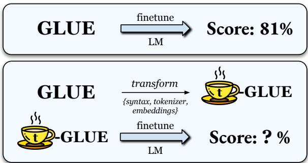
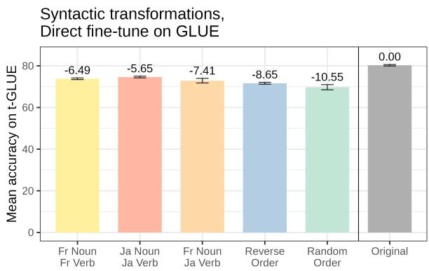
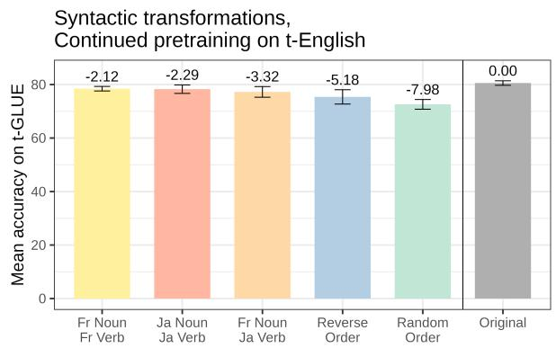
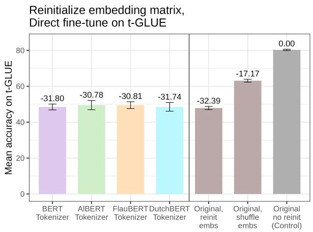
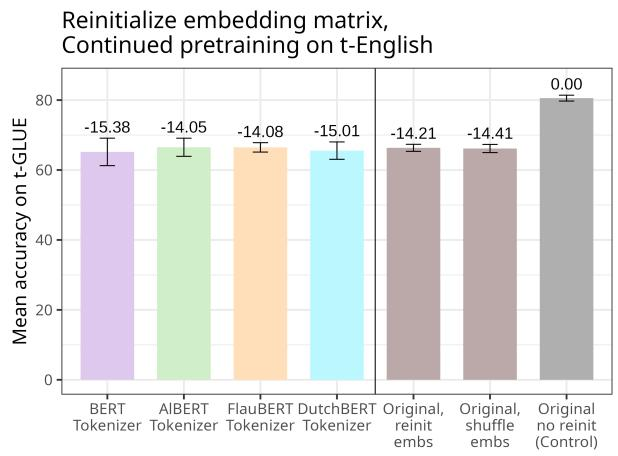
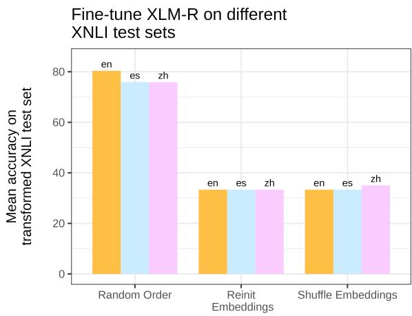
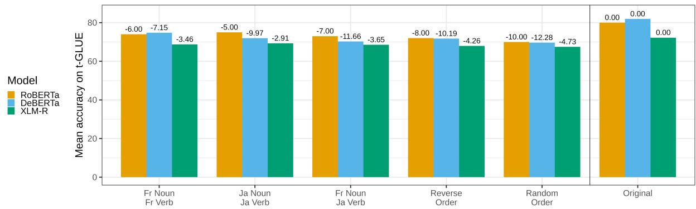
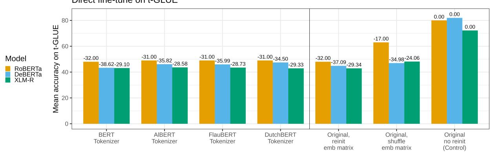
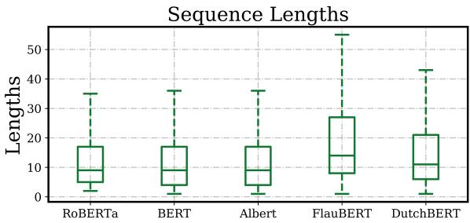

# Oolong: Investigating What Makes Transfer Learning Hard with Controlled Studies

Zhengxuan Wu∗, Alex Tamkin∗, Isabel Papadimitriou∗†

Stanford University

{wuzhengx, atamkin, isabelvp}@stanford.edu

## Abstract

When we transfer a pretrained language model to a new language, there are many axes of variation that change at once. To disentangle the impact of different factors like syntactic similarity and vocabulary similarity, we propose a set of controlled transfer studies: we systematically transform the language of the GLUE benchmark, altering one axis of crosslingual variation at a time, and then measure the resulting drops in a pretrained model’s downstream performance. We find that models can largely recover from syntactic-style shifts, but cannot recover from vocabulary misalignment and embedding matrix re-initialization, even with continued pretraining on 15 million tokens. Moreover, good-quality tokenizers in the transfer language do not make vocabulary alignment easier. Our experiments provide insights into the factors of cross-lingual transfer that researchers should most focus on when designing language transfer scenarios.

## 1 Introduction

What makes it hard for neural networks to learn new languages? Large language models (LLMs) require vast datasets for pretraining, making it challenging to train LLMs from scratch for lowresource languages (Devlin et al., 2018; Liu et al., 2019; Lacoste et al., 2019; Clark et al., 2020). For such languages, an appealing approach is to transfer knowledge from an LLM trained for a highresource language, especially since pretrained models can transfer knowledge across even extreme shifts (Papadimitriou and Jurafsky, 2020; Tamkin et al., 2020). A range of methods have been explored to enable such crosslingual transfer of English LLMs, using techniques such as adaptive pretraining (Reimers and Gurevych, 2020), and embedding retraining (Artetxe et al., 2020; Tran, 2020). To better understand the factors affecting successful transfer, we present a set of controlled transfer studies to compare the effects of different aspects of a cross-lingual shift.

  
Figure 1: Controlled transfer studies paradigm. We systematically transform GLUE tasks (t-GLUE) to target one linguistic factor, then finetune a pretrained language model on that dataset. The resulting drop in performance indicates the importance of that factor to crosslingual transfer. See Table 1 for the list of transformations.

Our controlled studies consist of transferring an English model to a language that is transformed from English on just one axis of variation. Realistic transfer scenarios involve languages that differ across multiple axes of variation at one time. Our experiments serve to disentangle these effects, and identify the issues that practitioners should most focus on when doing cross-lingual transfer learning. We examine three factors that are salient in a transfer learning context:

• Word-order syntactic differences: Languages vary greatly in the ways that their syntax orders words. Syntactic topological similarities are generally considered an important factor when deciding transfer language pairs. We test the effects of different levels of wordorder perturbation in transfer learning.

• Word identity alignments: Transferring to a new language requires learning the meaning, or word embeddings, of new words, and how their layer 0 embeddings correspond to the old language. We experiment with the effect of reinitializing or shuffling the rows of the layer 0 word embedding matrix before transfer.

• Tokenizer quality We test the effect of bad tokenizer quality by reinitializing the word embedding matrix and transferring to English data tokenized with French and Dutch tokenizers that are suboptimal quality for English tokenization.

We test the effect of these factors on transfer learning both by 1) directly fine-tuning on t-English versions of the GLUE benchmark, as well as 2) continuing masked language model pre-training on 15 million tokens of t-English wikitext. In all cases, we find that word identity alignment provides the greatest stumbling block for transfer learning. Reinitializing or shuffling the rows of the embedding matrix has a very negative effect on downstream learning which we cannot reverse in the low-data regime that we are simulating. If the embedding matrix is reinitialized and a new tokenizer is used, the effect of reinitialization overshadows any effect that the quality of the new tokenizer might cause. In the case of syntactic word-order transformations, we find that even in the low-data transfer learning regime, the models we test can adapt to word order shifts as long as vocabulary information is kept.

We run experiments on RoBERTa, DeBERTa, and XLM-R in order to test transfer learning beyond the training set languages for both monolingual and multilingual models. Our method allows us to disentangle the effects of correlated factors by inspecting them one at a time.1

## 2 Related Work

As self-supervised pretraining advances the state of NLP in high-resource languages, research into widening these successes beyond high-resource languages has become widespread and important. Methodologies for best transferring a monolingual or multilingual model to an unseen language are widely explored. Ogueji et al. (2021) and Ogunremi et al. (2023), showcase the positive effects of pretraining on closer and related languages to the target language, even if this is less data than larger pretrained models, in part because of the possibility of shared vocabulary (Oladipo et al., 2022). Our experiments build off previous efforts that try to enable crosslingual transfer from pretrained monolingual LLMs to new languages (Artetxe et al., 2018, 2020; Tran, 2020; Reimers and Gurevych, 2020; Gogoulou et al., 2021).

With respect to vocabulary sharing and adaptation, Liang et al. (2023) show that training a multilingual model with a massive vocabulary that separates out languages outweighs the benefits of vocabulary sharing between language (Patil et al., 2022), while in the transfer regime Chronopoulou et al. (2020) showcase the importance of maintaining vocabulary overlap. Techniques mapping subword embeddings to their new synonyms, or keeping subwords in the same script across languages, prove effective for cross-lingual transfer (Vernikos and Popescu-Belis, 2021; Pfeiffer et al., 2021, 2020; Muller et al., 2021). The importance of embedding intialization statistics is discussed in (Raghu et al., 2019).

Results on the importance of syntactic shifts remain broad, with work on multilingual training suggesting that syntactic shifts are significant compared to vocabulary effects (K et al., 2020), and that syntactic structure plays a role in developing parallel multilingual encodings (Dufter and Schütze, 2020), while Deshpande et al. (2022) show intersecting effects of vocabulary and word order shifts.

Understanding the direct relationship between the effect of syntactic shifts and the effect of vocabulary and tokenizer shifts remains an important problem in understanding transfer learning. Our work creates a framework for decomposing and disentangling the difficulties of transfer in controlled studies, giving researchers pointers for what aspects of language variation make transfer difficult.

## 3 Methods

Our methodology consists of taking a pretrained model, and transferring to a t-English: a systematically transformed version of English data that differs from English on one axis of variation. The different t-Englishes that we use are described and motivated below, and examples are in Table 1. We consider two low-data transfer environments: Direct Fine-tuning, where we transfer the English pretrained model directly to t-GLUE, transformed GLUE datasets (Wang et al., 2018), and Continued Pretraining, where we first do masked language modeling training on 15 million tokens of the WikiText-103M corpus (Merity et al., 2016)

<table><tr><td>Transformation Type Sentence / Sequence</td><td></td></tr><tr><td>Original English</td><td>“the film unfolds with all the mounting tension of an expert thriller , until the tragedy beneath it all gradually reveals itself .&quot;</td></tr><tr><td>Random Order Reverse Order</td><td>“an all all gradually beneath thriller with reveals . until tension tragedy mounting the it of the the expert , unfolds itself film&quot; “. itself reveals gradually all it beneath tragedy the until , thriller expert an of tension mounting the all with unfolds film the&quot;</td></tr><tr><td> $\{ \mathrm { N } _ { \mathrm { f r } } , \mathrm { V } _ { \mathrm { f r } } \}$ </td><td>“the film with all the of an expert , until the beneath all gradually . itself reveals it tragedy thriller tension mounting unfolds&quot;</td></tr><tr><td> $\{ \mathrm { N } _ { \mathrm { j a } } , \mathrm { V } _ { \mathrm { j a } } \}$   $\{ \dot { \mathrm { N _ { f r } } } , \dot { \mathrm { V _ { j a } } } \}$ </td><td>“the film unfolds with all the tension of an thriller , until the tragedy beneath it all gradually itself . reveals expert mounting&quot; “the film unfolds with all the of an expert , until the beneath all gradually . itself reveals it tragedy thriller tension mounting&quot;</td></tr><tr><td>RoBERTa Tokenizer</td><td></td></tr><tr><td>BERT Tokenizer</td><td>“the film unfolds with all the mounting tension of an expert thriller , until the tragedy beneath it all gradually reveals itself .&quot; “the film un fold s with all the mounting tension of an expert thriller , until the tragedy beneath it all gradually reveals itself .&quot;</td></tr><tr><td>Albert Tokenizer</td><td>&quot;the film unfold s with all the mounting tension of an expert thriller , until the tragedy beneath it all gradually reveals itself .&quot;</td></tr><tr><td>FlauBERT Tokenizer</td><td>“the film un fol ds with all the mou n ting tension of an expert thriller , un til the tr age dy bene ath it all gradu ally re ve als</td></tr><tr><td>DutchBERT Tokenizer</td><td>it self .&quot; &quot;the film u n f old s with all the mo unt ing te n sion of a n expert thriller , u n til the trage d y ben e ath i t all gra d u ally</td></tr></table>

Table 1: An example from the SST-2 dataset and its t-English variants. Tokenizer pre-fixes and post-fixes such as ${ \dot { G } } ,$ $\# \# , \textmd { ‰}$ are not shown for simplicity.

transformed to t-English. 2

## 3.1 Transformed English (t-Englishes)

Syntactic Shifts While syntax is a crucial aspect of language (Garrett, 1976), how sensitive or invariant lanugage models are to syntactic information is a complex topic (Pham et al., 2021; Sinha et al., 2021; Papadimitriou et al., 2022; Abdou et al., 2022). In the domain of transfer learning, we investigate a set of syntactic transformations that isolate syntactic word-order shifts from the other factors that differ between languages. We bound our syntactic transformation experiments with a random shuffle control, where no word order information from the original language can be used to decode the new language. We also do the simple, but drastic baseline of reversing the order of all of the words in the input. In order to test the effect of more realistic syntactic changes, we transform the English data into t-Englishes that follow the word-order statistics of other language. Using the Galactic Dependencies package (Wang and Eisner, 2016) with Stanza (Qi et al., 2020) to transform our corpora to match the ordering of words in noun phrases and verb phrases of French $( \{ \mathbf { N } _ { \mathrm { f r } } , \mathbf { V } _ { \mathrm { f r } } \} )$ and Japanese $( \{ \mathbf { N } _ { \mathrm { j a } } , \mathbf { V } _ { \mathrm { j a } } \} )$ and also perform a mixed transformation with French noun order and Japanese verb order $( \{ \mathbf { N } _ { \mathrm { f r } } , \mathbf { V } _ { \mathrm { j a } } \} )$ .

Word identity alignment Previous works have consistently found that good embeddings are crucial for enabling effective crosslingual transfer (Tran, 2020; Artetxe et al., 2020). However, these gains may due to several factors, including better initialization statistics (Raghu et al., 2019), or to a learned alignment between the learned embeddings and the pretrained transformer layers (Wu et al., 2021). Here, we test the baseline effect of reinitializing the embedding layer while transferring to the same language that the model was pretrained. We compare this to a scenario where the rows of the embedding matrix are shuffled, meaning that vector statistics are broadly similar but each word has been swapped with another and the model needs to find the mapping during fine-tuning.

Tokenizer How much does tokenizer quality matter, if the price of a better tokenizer is having to reinitialize the whole word embedding matrix? Though quality tokenizers undoubtedly play an important role in multilingual NLP (Rust et al., 2020), we wish to compare the effect of tokenizer quality when the word identity alignment problem remains constant. While re-initializing the embedding matrix, we compare the effects of the original RoBERTa tokenizer, to two tokenizers that produce low-quality tokenizations for English text: the French FlauBERT (Le et al., 2020) and the Dutch DutchBERT (de Vries et al., 2019). The non-English tokenizers used to tokenize English text simulate the effect of having a bad, non-languagespecific tokenizer in the low data regime (see Appendix B for statistics on how the different tokenizers work on English).

## 4 Results

We present the main results of our transfer experiments. Our experimental details (e.g. hyperparameter choices) with a per-task breakdown of t-

Figure 2: Models are largely able to adapt to syntactic shifts with minor drops in performance. Averaged GLUE scores for t-Englishes with syntactic shifts. Realistic syntactic shifts slightly impact downstream performance, while reverse and random order impact performance more significantly. Error bars represent 95% confidence intervals over 3 random seeds. Results are depicted for RoBERTa, but are consistent for all 3 models that we tested: RoBERTa, DeBERTa, and XLM-R (all results in Figure 5 in Appendix A).  

  
Figure 3: Token embedding transformations are hard to recover from, regardless of tokenizer. Averaged GLUE scores for t-Englishes with word identity perturbations. Any embedding reinitialization or shuffling, regardless of the tokenizer ultimately used, has a drastic effect on downstream performance. Error bars represent 95% confidence intervals over 3 random seeds. Results are depicted for RoBERTa, but are consistent for all 3 models that we tested: RoBERTa, DeBERTa, and XLM-R(all results in Figure 6 in Appendix A).

GLUE performance as well as additional results on DeBERTa and XLM-R are included in Appendix A.

## 4.1 Syntax matters, but training can mostly recover

Word order permutations have an effect on model performance, but the models that we test can recover relatively well from linguistic word order permutations when there are no vocabulary confounders. As shown in Figure 2, simply by fine-tuning on GLUE RoBERTa can recover from linguistic-style syntactic shifts relatively well, though this is significantly worse for random word order permutations that have no consistency or syntactic backing. These differences are all lessened with continued pretraining on 15M tokens of the transformed t-English data. These results suggest that syntactic shifts have real but limited impact on crosslingual transfer when disentangled from vocabulary learning effects.

## 4.2 Good embeddings matter most, bad embeddings can ruin a good tokenizer

Looking at the isolated effect of vocabulary, we find that in the low-data transfer regime the model has a hard time reconstructing a reinitialized embedding matrix. As shown in Figure 3, reinitializing the embedding matrix causes huge failures for the direct fine-tune case, and the quality of the tokenizer (language-bespoke versus not) do not have an effect beyond this. Our results suggest that tokenization may thus be a “lower-order bit” for crosslingual transfer, which has little impact until good word embeddings are learned. In the direct fine-tuning case, shuffling the word embedding matrix is significantly better than reinitializing the embeddings, though this difference disappears with continued pretraining.

  
Figure 4: Our findings generalize to fine-tuning on non-English datasets. Fine-tuning on three different XNLI datasets yields similar findings the English GLUE findings: models can recover from the most extreme syntactic case (random ordering) much more effectively than from any of the embeddings-related perturbations. This indicates that our findings are not related to properties specific to the English language.

## 5 Conclusions

In this paper, we propose a paradigm to study crosslingual transfer through transformations which simulate and disentangle the linguistic changes across languages. Our results suggest that solving the embedding alignment problem is the "high-order bit" for crosslingual transfer: it has the largest impact on finetuning performance and is the least improved by continued pretraining. Thus, future progress on solving this problem in large-scale transformers may have outsized impact.

## Limitations

Our paper is about multilinguality in NLP. However, using multiple natural languages would make it impossible to disentangle different factors. By using controlled variants of a single language, we can create a controllable environment to investigate and understand the factors that affect real cross-lingual transfer in a multilingual setting.

Despite looking at general factors that differ between languages, and using empirical syntactic patterns from non-English languages, the fact remains that all of our experiments are centered on English and t-Englishes, and this may introduce Englishcentric biases.

Our scope is mainly restricted to English LLMs (vs other languages), three components of crosslingual shifts (vs other potential factors), and GLUE tasks (vs other kinds of NLP tasks). While our experiments are not an exhaustive list of linguistic properties that affect cross-lingual transfer, we aim to focus on crucial factors that change between languages, grounded by the literature. Our paradigm is extensible to other model architectures while we focus on RoBERTa in this paper with additional results on DeBERTa and XLM-R included in Appendix A.

## Ethics Statement

Our experiments provide a controlled environment to test hypotheses about what influences crosslingual transfer. However, English-based experimentations affecting other languages should not be used to determine courses of action for lowresource NLP without supplementary in-language experiments.

## Acknowledgements

We would like to thank Nelson Liu, Mirac Suzgun, and Tolúlo. pé. Ògúnrè.mí for useful discussions and comments on drafts. This research was funded in part by NSF award number IIS-2128145.

## References

Mostafa Abdou, Vinit Ravishankar, Artur Kulmizev, and Anders Søgaard. 2022. Word order does matter and shuffled language models know it. In Proceedings of the 60th Annual Meeting of the Association for Computational Linguistics (Volume 1: Long Papers), pages 6907–6919.

Mikel Artetxe, Gorka Labaka, and Eneko Agirre. 2018. Generalizing and improving bilingual word embedding mappings with a multi-step framework of linear transformations. In Thirty-second AAAI conference on artificial intelligence.

Mikel Artetxe, Sebastian Ruder, and Dani Yogatama. 2020. On the cross-lingual transferability of monolingual representations. In Proceedings of the 58th Annual Meeting of the Association for Computational Linguistics, pages 4623–4637.

Alexandra Chronopoulou, Dario Stojanovski, and Alexander Fraser. 2020. Reusing a pretrained language model on languages with limited corpora for unsupervised nmt. In Proceedings ofthe 2020 Conference on Empirical Methods in Natural Language Processing (EMNLP), pages 2703–2711.

Kevin Clark, Minh-Thang Luong, Quoc V Le, and Christopher D Manning. 2020. Electra: Pre-training text encoders as discriminators rather than generators. arXiv preprint arXiv:2003.10555.

Wietse de Vries, Andreas van Cranenburgh, Arianna Bisazza, Tommaso Caselli, Gertjan van Noord, and Malvina Nissim. 2019. BERTje: A Dutch BERT Model.

Ameet Deshpande, Partha Talukdar, and Karthik Narasimhan. 2022. When is BERT multilingual? isolating crucial ingredients for cross-lingual transfer. In Proceedings ofthe 2022 Conference ofthe North American Chapter of the Association for Computational Linguistics: Human Language Technologies, pages 3610–3623, Seattle, United States. Association for Computational Linguistics.

Jacob Devlin, Ming-Wei Chang, Kenton Lee, and Kristina Toutanova. 2018. Bert: Pre-training of deep bidirectional transformers for language understanding. arXiv preprint arXiv:1810.04805.

Philipp Dufter and Hinrich Schütze. 2020. Identifying necessary elements for bert’s multilinguality. arXiv preprint arXiv:2005.00396.

Merrill F Garrett. 1976. Syntactic processes in sentence production. New approaches to language mecha nisms, 30:231–256.

Evangelia Gogoulou, Ariel Ekgren, Tim Isbister, and Magnus Sahlgren. 2021. Cross-lingual transfer of monolingual models. arXiv preprint arXiv:2109.07348.

Karthikeyan K, Zihan Wang, Stephen Mayhew, and Dan Roth. 2020. Cross-lingual ability of multilingual bert: An empirical study. In International Conference on Learning Representations.

Taku Kudo and John Richardson. 2018. Sentencepiece: A simple and language independent subword tokenizer and detokenizer for neural text processing. arXiv preprint arXiv:1808.06226.

Alexandre Lacoste, Alexandra Luccioni, Victor Schmidt, and Thomas Dandres. 2019. Quantifying the carbon emissions of machine learning. arXiv preprint arXiv:1910.09700.

Zhenzhong Lan, Mingda Chen, Sebastian Goodman, Kevin Gimpel, Piyush Sharma, and Radu Soricut. 2019. Albert: A lite bert for self-supervised learning of language representations. arXiv preprint arXiv:1909.11942.

Hang Le, Loïc Vial, Jibril Frej, Vincent Segonne, Maximin Coavoux, Benjamin Lecouteux, Alexandre Allauzen, Benoit Crabbé, Laurent Besacier, and Didier Schwab. 2020. Flaubert: Unsupervised language model pre-training for french. In Proceedings ofthe 12th Language Resources and Evaluation Conference, pages 2479–2490.

Davis Liang, Hila Gonen, Yuning Mao, Rui Hou, Naman Goyal, Marjan Ghazvininejad, Luke Zettlemoyer, and Madian Khabsa. 2023. Xlm-v: Overcoming the vocabulary bottleneck in multilingual masked language models. arXiv preprint arXiv:2301.10472.

Yinhan Liu, Myle Ott, Naman Goyal, Jingfei Du, Mandar Joshi, Danqi Chen, Omer Levy, Mike Lewis, Luke Zettlemoyer, and Veselin Stoyanov. 2019. ROBERTa: A robustly optimized BERT pretraining approach. arXiv preprint arXiv:1907.11692.

Stephen Merity, Caiming Xiong, James Bradbury, and Richard Socher. 2016. Pointer sentinel mixture models. arXiv preprint arXiv:1609.07843.

Benjamin Muller, Antonios Anastasopoulos, Benoît Sagot, and Djamé Seddah. 2021. When being unseen from mbert is just the beginning: Handling new languages with multilingual language models. In NAACL-HLT 2021-2021 Conference ofthe North American Chapter of the Association for Computational Linguistics: Human Language Technologies.

Kelechi Ogueji, Yuxin Zhu, and Jimmy Lin. 2021. Small data? no problem! exploring the viability of pretrained multilingual language models for lowresourced languages. In Proceedings ofthe 1st Workshop on Multilingual Representation Learning, pages 116–126, Punta Cana, Dominican Republic. Association for Computational Linguistics.

Tolulope Ogunremi, Dan Jurafsky, and Christopher Manning. 2023. Mini but mighty: Efficient multilingual pretraining with linguistically-informed data selection. In Findings of the Association for Computational Linguistics: EACL 2023, pages 1251–1266, Dubrovnik, Croatia. Association for Computational Linguistics.

Akintunde Oladipo, Odunayo Ogundepo, Kelechi Ogueji, and Jimmy Lin. 2022. An exploration of vocabulary size and transfer effects in multilingual language models for african languages. In 3rd Workshop on African Natural Language Processing.

Pedro Javier Ortiz Suárez, Benoît Sagot, and Laurent Romary. 2019. Asynchronous pipelines for processing huge corpora on medium to low resource infrastructures. Proceedings of the Workshop on Challenges in the Management of Large Corpora (CMLC-7) 2019. Cardiff, 22nd July 2019, pages 9 – 16, Mannheim. Leibniz-Institut für Deutsche Sprache.

Isabel Papadimitriou, Richard Futrell, and Kyle Mahowald. 2022. When classifying arguments, BERT doesn’t care about word order...except when it matters. In Proceedings ofthe Societyfor Computation

in Linguistics 2022, pages 203–205, online. Association for Computational Linguistics.

Isabel Papadimitriou and Dan Jurafsky. 2020. Learning music helps you read: Using transfer to study linguistic structure in language models. In Proceedings ofthe 2020 Conference on Empirical Methods in Natural Language Processing (EMNLP), pages 6829–6839.

Vaidehi Patil, Partha Talukdar, and Sunita Sarawagi. 2022. Overlap-based vocabulary generation improves cross-lingual transfer among related languages. In Proceedings of the 60th Annual Meeting ofthe Associationfor Computational Linguistics (Volume 1: Long Papers), pages 219–233, Dublin, Ireland. Association for Computational Linguistics.

Jonas Pfeiffer, Ivan Vulic, Iryna Gurevych, and Se-´ bastian Ruder. 2020. MAD-X: An Adapter-Based Framework for Multi-Task Cross-Lingual Transfer. In Proceedings ofthe 2020 Conference on Empirical Methods in Natural Language Processing (EMNLP), pages 7654–7673, Online. Association for Computational Linguistics.

Jonas Pfeiffer, Ivan Vulic, Iryna Gurevych, and Sebas-´ tian Ruder. 2021. UNKs everywhere: Adapting multilingual language models to new scripts. In Proceedings ofthe 2021 Conference on Empirical Methods in Natural Language Processing, pages 10186–10203, Online and Punta Cana, Dominican Republic. Association for Computational Linguistics.

Thang Pham, Trung Bui, Long Mai, and Anh Nguyen. 2021. Out of order: How important is the sequential order of words in a sentence in natural language understanding tasks? In Findings ofthe Association for Computational Linguistics: ACL-IJCNLP 2021, pages 1145–1160, Online. Association for Computational Linguistics.

Peng Qi, Yuhao Zhang, Yuhui Zhang, Jason Bolton, and Christopher D. Manning. 2020. Stanza: A Python natural language processing toolkit for many human languages. In Proceedings of the 58th Annual Meeting ofthe Associationfor Computational Linguistics: System Demonstrations.

Maithra Raghu, Chiyuan Zhang, Jon Kleinberg, and Samy Bengio. 2019. Transfusion: Understanding transfer learning for medical imaging. Advances in neural information processing systems, 32.

Nils Reimers and Iryna Gurevych. 2020. Making monolingual sentence embeddings multilingual using knowledge distillation. In Proceedings of the 2020 Conference on Empirical Methods in Natural Language Processing (EMNLP), pages 4512–4525.

Phillip Rust, Jonas Pfeiffer, Ivan Vulic, Sebastian´ Ruder, and Iryna Gurevych. 2020. How good is your tokenizer? on the monolingual performance of multilingual language models. arXiv preprint arXiv:2012.15613.

Rico Sennrich, Barry Haddow, and Alexandra Birch. 2015. Neural machine translation of rare words with subword units. arXiv preprint arXiv:1508.07909.

Koustuv Sinha, Robin Jia, Dieuwke Hupkes, Joelle Pineau, Adina Williams, and Douwe Kiela. 2021. Masked language modeling and the distributional hypothesis: Order word matters pre-training for little. arXiv preprint arXiv:2104.06644.

Alex Tamkin, Trisha Singh, Davide Giovanardi, and Noah Goodman. 2020. Investigating transferability in pretrained language models. Findings of the Association for Computational Linguistics: EMNLP 2020.

Ke Tran. 2020. From english to foreign languages: Transferring pre-trained language models. arXiv preprint arXiv:2002.07306.

Giorgos Vernikos and Andrei Popescu-Belis. 2021. Subword mapping and anchoring across languages. In Findings of the Association for Computational Linguistics: EMNLP 2021, pages 2633–2647.

Alex Wang, Amanpreet Singh, Julian Michael, Felix Hill, Omer Levy, and Samuel Bowman. 2018. Glue: A multi-task benchmark and analysis platform for natural language understanding. In Proceedings of the 2018 EMNLP Workshop BlackboxNLP: Analyzing and Interpreting Neural Networks for NLP, pages 353–355.

Dingquan Wang and Jason Eisner. 2016. The galactic dependencies treebanks: Getting more data by synthesizing new languages. Transactions ofthe Associationfor Computational Linguistics, 4:491–505.

Yonghui Wu, Mike Schuster, Zhifeng Chen, Quoc V Le, Mohammad Norouzi, Wolfgang Macherey, Maxim Krikun, Yuan Cao, Qin Gao, Klaus Macherey, et al. 2016. Google’s neural machine translation system: Bridging the gap between human and machine translation. arXiv preprint arXiv:1609.08144.

Zhengxuan Wu, Nelson F Liu, and Christopher Potts. 2021. Identifying the limits of cross-domain knowledge transfer for pretrained models. arXiv preprint arXiv:2104.08410.

## A Results on other models

We present the results in Figures 2 and 3 for two more models: DeBERTa and the cross-lingual model XLM-R:

## B Sequence Length Distribution

As described in Section 3.1, we try four different tokenizers to substitute for our RoBERTa (Liu et al., 2019) model that uses the Byte-Pair Encoding (BPE) (Sennrich et al., 2015) tokenizer. Specifically, we substitue with the WordPiece tokenizer (Wu et al., 2016) used by BERT (Devlin et al., 2018) (i.e., BERT Tokenizer in Table 1) and the SentencePiece tokenizer (Kudo and Richardson, 2018) used by Albert (Lan et al., 2019) (i.e., Albert Tokenizer in Table 1). Additionally, we substitute with two new non-English tokenizers including the French FlauBERT (Le et al., 2020) (FlauBERT Tokenizer in Table 1) and the Dutch DutchBERT (de Vries et al., 2019) (DutchBERT Tokenizer in Table 1). As shown in Figure 7, we plot the distributions of sequence lengths as a measure of the heterogeneity introduced by new tokenizers to ensure variences across tokenized sequence lengths. Specifically, we see there are inferior tokenizers such as FlauBERT Tokenizer with a 22.15% increase in sequence length. Our results are consistent with previous findings (Rust et al., 2020) where sequence length distributions are closer.

  
Figure 5: Models are largely able to adapt to syntactic shifts with minor drops in performance. Results for the embedding transformations shown for RoBERTa in Figure 2, for all models that we tested: RoBERTa, DeBERTa, and XLM-R.

  
Figure 6: Token embedding transformations are hard to recover from. Results for the embedding transformations shown for RoBERTa in Figure 3, for all models that we tested: RoBERTa, DeBERTa, and XLM-R.

## C Training Set-up Details

Downstream Task. We use the GLUE benchmark (Wang et al., 2018) to evaluate model performance, which covers nine different NLP tasks. We report scores on the development sets for each task by fine-tuning our pre-trained or mid-tuned models. We fine-tune for 5 epochs for the smaller datasets (WNLI and MRPC) and 3 epochs for the others. For the performance metrics, we use Matthew’s Correlation for CoLA, Pearson correlation for STS-B, and accuracy for all the other datasets.

Hyperparameter and Infrastructure. For each of the mid-tuning and fine-tuning experiments, we collect averaged results from 3 runs with distinct random seeds. We tune our models with two learning rates $\{ 2 e ^ { - 5 } , 4 e ^ { - 5 } \}$ , and report the best results from these two learning rates. Fine-tuning with 9 GLUE tasks takes about 8 hours on 4 NVIDIA

  
Figure 7: Distributions of sequence lengths by different tokenizers.

Titan 12G GPUs. Mid-tuning with our subset of WikiText-103M corpus takes about 18 hours with the same infrastructure.

## D Detailed GLUE Task Performance

Table 2 shows performance break-down for individual GLUE task under different transformations as described in Section 3.1. The individual t-GLUE and GLUE results are included in Table 2. We find a consistent picture across most of the tasks, with some interesting effects like CoLA (which is more syntax-sensitive) being impacted more by syntactic shifts.

<table><tr><td></td><td>Original</td><td>Token Swap</td><td>Word Swap</td><td>Reinit(Emb)</td><td>Bert</td><td>Albert</td><td>FlauBERT</td><td>DutchBERT</td><td>Random</td><td>Reverse</td><td> $\{ \mathbf { N _ { f r } } , \mathbf { V _ { f r } } \}$ </td><td> $\{ \mathbf { N _ { j a } } , \mathbf { V _ { j a } } \}$ </td><td> $\{ \mathbf { N _ { f r } } , \mathbf { V _ { j a } } \}$ </td></tr><tr><td>CoLA</td><td>.58(.01)</td><td>.00(.00)</td><td>.00(.00)</td><td>.00(.00)</td><td>.00(.00)</td><td>.00(.00)</td><td>.00(.00)</td><td>.00(.00)</td><td>.04(.05)</td><td>.01(.01)</td><td> $. 1 6 ( . 0 1 )$ </td><td> $. 2 1 ( . 0 1 )$ </td><td> $. 1 2 ( . 0 1 )$ </td></tr><tr><td> $\mathbf { C o L A _ { C . p . } }$ </td><td>.59(.01)</td><td>.05(.07)</td><td>.02(.02)</td><td>.06(.05)</td><td>.00(.00)</td><td>.00(.00)</td><td>.01(.01)</td><td>.00(.00)</td><td>.22(.04)</td><td>.35(.01)</td><td>.45(.03)</td><td>.47(.01)</td><td>.44(.01)</td></tr><tr><td>MNLI</td><td>.88(.00)</td><td>.34(.01)</td><td>.50(.08)</td><td>.53(.03)</td><td>.54(.01)</td><td>.53(.01)</td><td>.67(.01)</td><td>.68(.00)</td><td>.82(.00)</td><td>.85(.00)</td><td>.86(.00)</td><td>.86(.00)</td><td>.85(.00)</td></tr><tr><td> $\mathbf { M N L I _ { c . p . } }$ </td><td>.88(.00)</td><td>.72(.01)</td><td>.72(.01)</td><td>.73(.00)</td><td>.73(.01)</td><td>.71(.00)</td><td>.71(.01)</td><td>.69(.00)</td><td>.82(.00)</td><td>.86(.00)</td><td>.86(.00)</td><td>.86(.00)</td><td>.86(.00)</td></tr><tr><td> $\mathbf { M R P C }$ </td><td>.88(.01)</td><td>.68(.00)</td><td>.68(.00)</td><td>.68(.00)</td><td>.68(.00)</td><td>.68(.00)</td><td>.76(.01)</td><td>.77(.01)</td><td>.77(.01)</td><td>.85(.02)</td><td>.85(.01)</td><td>.86(.01)</td><td>.83(.00)</td></tr><tr><td> $\mathbf { M R P C _ { c . p . } }$ </td><td>.87(.00)</td><td>.83(.00)</td><td>.80(.04)</td><td>.79(.01)</td><td>.82(.01)</td><td>.80(.01)</td><td>.83(.01)</td><td>.78(.01)</td><td>.81(.01)</td><td>.87(.01)</td><td>.87(.01)</td><td>.87(.01)</td><td>.86(.00)</td></tr><tr><td>QNLI</td><td>.93(.00)</td><td>.60(.01)</td><td>.54(.02)</td><td>.54(.04)</td><td>.55(.03)</td><td>.52(.01)</td><td>.79(.01)</td><td>.79(.00)</td><td>.88(.00)</td><td>.89(.00)</td><td>.90(.00)</td><td>.91(.00)</td><td>.90(.00)</td></tr><tr><td> ${ \bf Q } { \bf N } { \bf L } { \bf I _ { c . p . } }$ </td><td>.93(.00)</td><td>.83(.01)</td><td>.82(.01)</td><td>.82(.00)</td><td>.83(.00)</td><td>.82(.00)</td><td>.82(.00)</td><td>.81(.00)</td><td>.88(.00)</td><td>.91(.00)</td><td>.91(.00)</td><td>.92(.00)</td><td>.91(.00)</td></tr><tr><td>QQP</td><td>.91(.00)</td><td>.77(.00)</td><td>.77(.00)</td><td>.77(.00)</td><td>.76(.00)</td><td>.75(.00)</td><td>.85(.00)</td><td>.86(.00)</td><td>.90(.00)</td><td>.91(.00)</td><td>.90(.00)</td><td>.91(.00)</td><td>.90(.00)</td></tr><tr><td> $\mathbf { Q O P _ { c , p . } }$ </td><td>.91(.00)</td><td>.87(.00)</td><td>.87(.00)</td><td>.87(.00)</td><td>.87(.00)</td><td>.87(.00)</td><td>.86(.00)</td><td>.87(.00)</td><td>.90(.00)</td><td>.91(.00)</td><td>.91(.00)</td><td>.91(.00)</td><td>.91(.00)</td></tr><tr><td>RTE</td><td>.65(.02)</td><td>.51(.03)</td><td>.51(.03)</td><td>.53(.00)</td><td>.53(.00)</td><td>.53(.01)</td><td>.54(.02)</td><td>.56(.02)</td><td>.57(.01)</td><td>.60(.02)</td><td>.60(.00)</td><td>.61(.01)</td><td>.59(.05)</td></tr><tr><td> $\bf R T E _ { c . p . }$ </td><td>.67(.01)</td><td>.56(.01)</td><td>.53(.01)</td><td>.54(.03)</td><td>.57(.01)</td><td>.59(.02)</td><td>.57(.03)</td><td>.57(.02)</td><td>.59(.02)</td><td>.58(.02)</td><td>.69(.01)</td><td>.64(.05)</td><td>.65(.03)</td></tr><tr><td> $\mathbf { S S T - } 2$ </td><td>.94(.00)</td><td>.79(.01)</td><td>.75(.02)</td><td>.79(.03)</td><td>.73(.04)</td><td>.68(.05)</td><td>.77(.01)</td><td>.78(.00)</td><td>.86(.01)</td><td>.91(.00)</td><td>.92(.00)</td><td>.92(.00)</td><td>.92(.00)</td></tr><tr><td> $\mathbf { s s } \mathbf { T } \mathbf { - } 2 _ { \mathbf { c } \mathbf { . p } \mathbf { . } }$ </td><td>.94(.00)</td><td>.83(.01)</td><td>.85(.01)</td><td>.85(.01)</td><td>.83(.00)</td><td>.82(.00)</td><td>.82(.01)</td><td>.81(.01)</td><td>.88(.00)</td><td>.93(.00)</td><td>.93(.00)</td><td>.93(.00)</td><td>.92(.00)</td></tr><tr><td> $\mathbf { S T S - B }$ </td><td>.89(.00)</td><td>.06(.01)</td><td>.06(.00)</td><td>.06(.02)</td><td>.09(.02)</td><td>.08(.02)</td><td>.74(.01)</td><td>.77(.00)</td><td>.87(.00)</td><td>.87(.00)</td><td>.88(.00)</td><td>.88(.00)</td><td>.88(.00)</td></tr><tr><td> $\mathbf { S T S - B _ { C , p . } }$ </td><td>.89(.00)</td><td>.76(.01)</td><td>.73(.03)</td><td>.77(.01)</td><td>.79(.01)</td><td>.78(.00)</td><td>.77(.00)</td><td>.79(.00)</td><td>.88(.00)</td><td>.87(.00)</td><td>.89(.00)</td><td>.89(.00)</td><td>.89(.00)</td></tr><tr><td> $\mathbf { W N L I }$ </td><td>.56(.00)</td><td>.56(.00)</td><td>.56(.00)</td><td>.56(.00)</td><td>.56(.00)</td><td>.58(.03)</td><td>.56(.00)</td><td>.56(.01)</td><td>.55(.01)</td><td>.56(.01)</td><td>.56(.00)</td><td>.56(.00)</td><td>.56(.01)</td></tr><tr><td> $\mathbf { W N L I _ { c . p . } }$ </td><td>.56(.01)</td><td>.52(.06)</td><td>.53(.05)</td><td>.53(.03)</td><td>.55(.02)</td><td>.51(.07)</td><td>.56(.00)</td><td>.56(.00)</td><td>.55(.01)</td><td>.51(.07)</td><td>.56(.01)</td><td>.56(.00)</td><td>.53(.05)</td></tr></table>

Table 2: GLUE scores for t-English with different types of interventions including scrambled word identities, syntactic shifts, and tokenizer substitutions with standard deviation (SD) for all tasks across $^ 3$ distinct runs with different random seeds. The scores with original English sentences are included for comparison. c.p. indicates finetuning results with continued pretrained models.