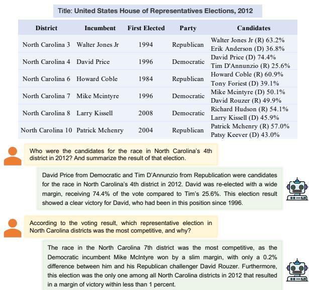
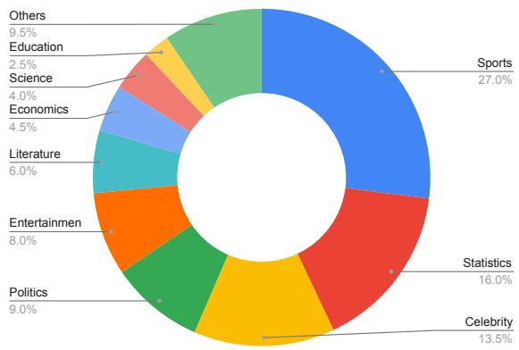
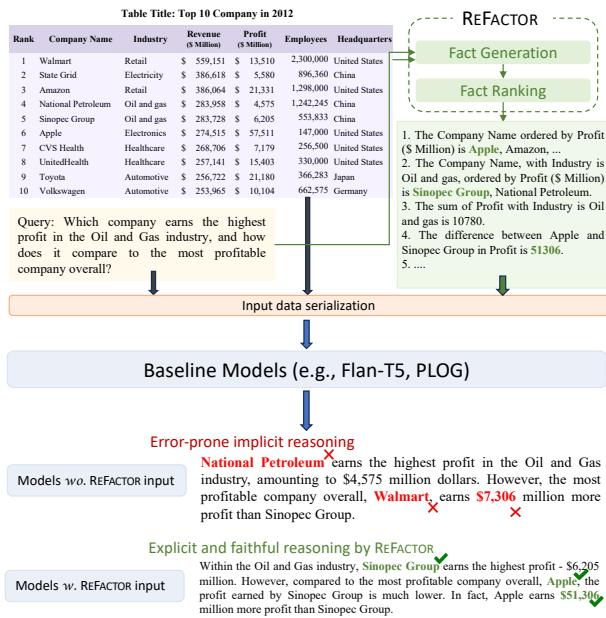
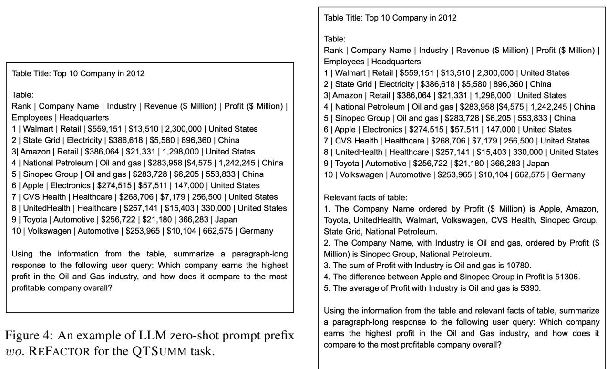

# QTSUMM: Query-Focused Summarization over Tabular Data

Yilun Zhao1 Zhenting Qi2 Linyong Nan1 Boyu Mi3 Yixin Liu1 Weijin Zou1 Simeng Han1 Ruizhe Chen3 Xiangru Tang1 Yumo Xu4 Dragomir Radev1 Arman Cohan1,5

1Yale University 2Harvard University 3Zhejiang University 4School of Informatics, University of Edinburgh 5Allen Institute for AI yilun.zhao@yale.edu

## Abstract

People primarily consult tables to conduct data analysis or answer specific questions. Text generation systems that can provide accurate table summaries tailored to users’ information needs can facilitate more efficient access to relevant data insights. Motivated by this, we define a new query-focused table summarization task, where text generation models have to perform human-like reasoning and analysis over the given table to generate a tailored summary. We introduce a new benchmark named QTSUMM for this task, which contains 7,111 human-annotated query-summary pairs over 2,934 tables covering diverse topics. We investigate a set of strong baselines on QTSUMM, including text generation, table-to-text generation, and large language models. Experimental results and manual analysis reveal that the new task presents significant challenges in table-totext generation for future research. Moreover, we propose a new approach named REFAC-TOR, to retrieve and reason over query-relevant information from tabular data to generate several natural language facts. Experimental results demonstrate that REFACTOR can bring improvements to baselines by concatenating the generated facts to the model input. Our data and code are publicly available at https: //github.com/yale-nlp/QTSumm.

## 1 Introduction

In the era of data-driven decision-making, tabular data plays a crucial role in facilitating data analysis, serving as a concise and structured representation of information (Kukich, 1983; Pasupat and Liang, 2015; Chen et al., 2020c; Zhu et al., 2021; Zhao et al., 2022a; Tang et al., 2023). People often consult tables to extract valuable insights and make informed decisions. For example, sales managers typically explore large tables with specific business questions to gain insights about clients and processes. Sports coaches will analyze performance tables containing various statistics to develop game strategies and make team adjustments. However, effectively accessing and comprehending the information contained within a large and complex table can be time-consuming for users (Hurst, 2000; Pasupat and Liang, 2015; Pujara et al., 2021; Nan et al., 2022a). Text generation systems that can accurately summarize a provided table according to users’ information needs have the potential to greatly enhance data analysis and expedite the process of obtaining data insights.

  
Figure 1: An example of QTSUMM. Given the numerous data points in the table, different users may be interested in various aspects for their own informationseeking or decision-making purposes. The system needs to perform human-like reasoning and analysis over relevant table regions to generate a tailored table summary.

Existing work and datasets on table-to-text generation (Parikh et al., 2020; Chen et al., 2020a; Cheng et al., 2022b; Lebret et al., 2016; Moosavi et al., 2021; Suadaa et al., 2021) have mainly focused on converting tabular data into coherent statements, aiming to present the structured data in a humanreadable format. However, these approaches have overlooked the fundamental goal of addressing users’ information-seeking purposes. Table-to-text generation systems should adopt a more flexible and interactive approach that allows people to obtain a user-customized summary tailored to their information needs (Dang, 2006; Xu and Lapata, 2020; Zhong et al., 2021; Xu and Lapata, 2022; Zhou et al., 2023), as illustrated in Figure 1. While table question answering (QA) (Pasupat and Liang, 2015; Iyyer et al., 2017; Zhong et al., 2018; Chen et al., 2020c; Nan et al., 2022b) has made significant progress in answering fact-based questions, the primary focus of their approaches is on extracting relevant facts or entities from the table and composing short-form answers. Nevertheless, in real-world scenarios, users often have more complex and diverse information needs that extend beyond simple fact retrieval. They expect models to perform human-like reasoning and provide trustworthy explanations or analyses that accompany the extracted insights.

With comprehensive consideration of the realworld information needs of users when consulting tabular data, we propose a new task, query-focused table summarization. In this task, the model is required to generate a user-customized summary given the table and user query. To enable research in this area, we construct a human-annotated tableto-text generation dataset named QTSUMM1, that contains 7,111 query-summary pairs over 2,934 Wikipedia tables covering diverse topics. Table 1 compares QTSUMM with previous table-to-text generation datasets. To the best of our knowledge, QTSUMM is the first dataset that tackles tasks of generating user-customized table summaries based on real-world scenarios.

We provide a comprehensive evaluation of current state-of-the-art models, including text generation (Lewis et al., 2020; Raffel et al., 2020; Chung et al., 2022), table-to-text generation (Liu et al., 2022b; Zhao et al., 2022b; Jiang et al., 2022), and large language models (Touvron et al., 2023a,b; Zheng et al., 2023; Jiang et al., 2023a; Xu et al., 2023; OpenAI, 2023). Our results and analysis from different perspectives reveal that the existing models struggle in solving this new task, highlighting the challenges the models face when performing human-like reasoning and analysis to generate summary tailored to users’ information needs.

To improve both text generation systems for QT-SUMM, we propose REFACTOR. Given a user query, REFACTOR can retrieve and reason over query-relevant facts from the source table to generate multiple data insights in natural language sentences. Our results illustrate that directly concatenating the original input sequence with REFAC-TOR’s generation can bring effective improvements to state-of-the-art baseline systems.

We conclude our main contributions as follows:

• We propose a new query-focused table summarization task, and construct a large-scale benchmark, QTSUMM, comprising 7,111 querysummary pairs collected in real-world situations. Strict quality control measures are employed to ascertain the high quality of the dataset.

• We conduct a systematic study of state-of-the-art models on QTSUMM, and illustrate that they are still far behind expert performance, motivating future research on this new table-to-text task.

• We present REFACTOR for the efficient retrieval and reasoning of query-relevant facts from tables. It demonstrates significant enhancements pertaining to state-of-the-art text generation baselines.

## 2 Related Work

Table-to-Text Generation As illustrated in Table 1, existing work and datasets on table-to-text generation typically pose the problem as either a single-sentence generation task (Chen et al., 2020a; Parikh et al., 2020; Cheng et al., 2022b; Liu et al., 2022a), or a generic summarization task (Lebret et al., 2016; Moosavi et al., 2021; Suadaa et al., 2021). In the single-sentence generation task (Parikh et al., 2020; Chen et al., 2020a; Cheng et al., 2022b), the focus is on generating fluent and faithful descriptions using provided table regions as a control for text generation. Nevertheless, using table regions for controlling text generation does not align with real-world scenarios, where people refer to tabular data for information-seeking purposes. The generic table summarization tasks (Lebret et al., 2016; Moosavi et al., 2021; Suadaa et al., 2021) aim to create concise and informative summaries based on the content of a given domainspecific table (i.e., sports or scientific). In contrast, the tables in QTSUMM cover diverse topics. Furthermore, considering the numerous data points in the table, various users may be interested in different aspects for their own information-seeking purposes, making it challenging to create a generic summary that encompasses all the salient information within the table. Therefore, in this paper, we propose and investigate a new task setting related to query-focused summarization. FeTaQA (Nan et al., 2022b) is a table QA dataset that collects queries by rewriting ToTTo’s (Parikh et al., 2020) statements into questions and uses the same statements as the answers. In comparison with FeTaQA, the queries in QTSUMM were annotated under realworld scenarios, making them more natural and better-reflecting users’ actual information needs.

<table><tr><td>Dataset</td><td>Table Source</td><td># Tables / Statements</td><td># Words / Statement</td><td>Explicit Control</td><td>Rich in Analysis &amp; Reasoning?</td></tr><tr><td colspan="6">Single-sentence Table-to-Text</td></tr><tr><td>ToTTo (Parikh et al., 2020)</td><td>Wikipedia</td><td>83,141 / 83,141</td><td></td><td>17.4 Table region</td><td>x</td></tr><tr><td>LoGICNLG (Chen et al., 2020a)</td><td>Wikipedia</td><td>7,392 / 36,960</td><td>14.2</td><td>Table regions</td><td>√</td></tr><tr><td>HiTab (Cheng et al., 2022b)</td><td>Statistics web</td><td>3,597 / 10,672</td><td></td><td>16.4 Table regions &amp; reasoning operator</td><td>√</td></tr><tr><td colspan="6">Generic Table Summarization</td></tr><tr><td>ROTOWIRE (Lebret et al., 2016)</td><td>NBA games</td><td>4,953 /  4,953</td><td>337.1 X</td><td></td><td>x</td></tr><tr><td>SciGen (Moosavi et al., 2021)</td><td>Sci-Paper</td><td>1,338 / 1,338</td><td>116.0</td><td>x</td><td>√</td></tr><tr><td>NumericNLG (Suadaa et al., 2021)</td><td>Sci-Paper</td><td>1,355 / 1,355</td><td>94.2 X</td><td></td><td>√</td></tr><tr><td colspan="6">Table Question Answering</td></tr><tr><td>FeTaQA (Nan et al., 2022b)</td><td>Wikipedia</td><td>10,330 / 10,330</td><td>18.9</td><td>Queries rewritten from ToTTo</td><td>x</td></tr><tr><td colspan="6">Query-Focused Table Summarization</td></tr><tr><td>QTSUMM</td><td>Wikipedia</td><td>2,934/7,111</td><td></td><td>68.0 Queries from real-world scenarios</td><td>√</td></tr></table>

Table 1: Comparison between QTSUMM and existing table-to-text generation datasets.

Reasoning Over Tabular Data Enhancing the table reasoning capabilities of models is essential for a variety of tasks related to tables, such as table question answering (Pasupat and Liang, 2015; Iyyer et al., 2017; Zhong et al., 2018; Zhao et al., 2023d), table fact verification (Chen et al., 2020b), and table-to-text generation (Chen et al., 2020a; Cheng et al., 2022b). One prevalent approach is pre-training models with table-text joint reasoning data (Herzig et al., 2020; Liu et al., 2022b; Zhao et al., 2022b; Liu et al., 2022a; Jiang et al., 2022; Dong et al., 2022; Cheng et al., 2022a; Xie et al., 2022). Nevertheless, these models generate text in an end-to-end manner, resulting in reduced explainability and difficulties in handling more complex reasoning, such as arithmetic calculation. Therefore, we propose REFACTOR, which can retrieve and generate query-relevant facts from tables as intermediate results for model input (Zhou et al., 2022; Zhao et al., 2023b), mitigating the implicit reasoning processes of text generation models.

Query-Focused Summarization Initially formulated as a document summarization task, QFS aims to generate summaries from documents that are tailored to specific user queries (Dang, 2006). Despite its potential real-world applications, QFS remains a challenging task due to the lack of large-scale training data. Existing works have attempted to address this issue by leveraging distant NLP resources, including question answering (Xu and Lapata, 2020) and paraphrase identification (Su et al., 2020), and generic summarization (Xu and Lapata, 2022; Zhou et al., 2023). Recently, Zhong et al. (2021) adopted QFS for meeting summarization and proposed a human-annotated benchmark over meeting transcripts. Similar to text, effectively accessing and comprehending the information contained within a large and complex table can be time-consuming for users, while QFS remains unexplored in tableto-text generation. In this work, we extend QFS to this new modality for more effective informationseeking and decision-making purposes.

## 3 Query-Focused Table Summarization

## 3.1 Problem Formulation

We formally define the proposed query-focused table summarization task as follows. The input is a user query Q, and a table T. The table ${ \textbf { 2 } } =$ $W \cup \{ T _ { i , j } | i \leq R _ { T } , j \leq C _ { T } \}$ has $R _ { T }$ rows and $C _ { T }$ columns, with W being the table title and $T _ { i , j }$ being the textual content in the $( i , j )$ -th cell. The task objective of QTSUMM is to generate a paragraphlong textual summary $Y = ( y _ { 1 } , y _ { 2 } , \dots y _ { n } )$ given the user query Q and source table T:

$$
Y = \operatorname { a r g m a x } \prod _ { i = 1 } ^ { n } P ( y _ { i } | y _ { < i } , Q , T ; \theta ) ,\tag{1}
$$

where θ denotes the parameters of a neural text generation model, and yi denotes the i-th tokens in the generated summary.

## 3.2 Data Collection Principles

At a high level, the goal of the data collection process is to obtain high-quality user queries and corresponding paragraph-long summaries grounded on the tabular data. We outline our key criteria for designing a benchmark to thoroughly evaluate the table-to-text summarization capabilities of models. To achieve this, we first design three principles for annotating a good query-summary pair:

• Comprehensiveness: The tailored summary should provide enough details and analysis of the source table to respond to the user query, fulfilling user’s information need.

• Attributablity & Faithfulness: The query should be answerable using only information from the source table. The summary should be grounded on the source table, and not contain any unfaithful or nonsensical text.

• Fluency: Both the user query and its corresponding table summary should be coherent and fluent.

## 3.3 QTSUMM Annotation Pipeline

To ensure that QTSUMM annotation fulfills the aforementioned principles, we carefully design an annotation pipeline consisting of following steps:

Source Table Collection QTSUMM uses tables from LOGICNLG (Chen et al., 2020a) and TOTTO (Parikh et al., 2020) datasets as source tables, as these tables are crwaled from Wikipedia and covers diverse domains and topics. We filter out tables that are 1) too large or too small, 2) with only string-type columns, or 3) with hierarchical structures (e.g., containing more than one table header). Then we randomly sample 2,000 candidate tables from LOGICNLG and TOTTO, respectively, for the query-summary annotation.

User Query Annotation Given a table, the annotators are required to read its content, and determine whether the table is informative and intelligible to common web users. Then they were asked to come up with two or three queries, assuming they are users seeking certain information from the table. We require each query to be answerable using information only from the table. Moreover, as this work focuses on paragraph-long summaries as query responses, we avoid queries that can be answered in a short sentence (e.g., “Which country held the 2022 FIFA World Cup?”).

<table><tr><td>Property</td><td>Value</td></tr><tr><td>Unique Tables</td><td>2,934</td></tr><tr><td colspan="2">Query-Summary Pairs 7,111</td></tr><tr><td>Rows per Table (Median/Avg)</td><td>10 / 11.8</td></tr><tr><td>Columns per Table (Median/Avg)</td><td>6 / 6.6</td></tr><tr><td>Table Title Length (Median/Avg)</td><td>7/7.6</td></tr><tr><td colspan="2">Query Length(Median/Avg)</td></tr><tr><td>Relevant Rows (Median/Avg)</td><td>22 / 22.3 4/3.8</td></tr><tr><td>Summary Length (Median/Avg)</td><td>63 / 68.0</td></tr><tr><td>Training Set Size (Table/Summary)</td><td></td></tr><tr><td>Development Set Size (Table/Summary)</td><td>2,055 / 4,981 (70%) 439 / 1,052 (15%)</td></tr><tr><td>Test Set Size (Table/Summary)</td><td>440 / 1,078 (15%)</td></tr></table>

Table 2: Basic statistics of QTSUMM dataset.

Query-Focused Summary Annotation Given a table and user query, we ask another annotator to use only information from the source table to write a paragraph-long summary that satisfies the user’s information need. We encourage annotators to produce sophisticated summaries that 1) contain as much information from the table as possible, and 2) involve more types of reasoning over multiple relevant table regions. To further encourage high quality annotations, we adopt the "two channel collection" design (Chen et al., 2020b), in which the annotators would be paid 60% more if their summaries are manually verified to exhibit adequate complexity. We also require the annotators to annotate the row indices of relevant table regions that are referenced in the written summary, allowing future researchers to quantify how well the summaries are grounded in the table in their work.

Multi-Round Validation We conduct a multiround validation protocol to ensure that the annotated data fulfills the aforementioned annotation principles. We first assign query annotators to validate each summary against their corresponding queries, and fix the mistakes if there are any. Then we check 1) whether a query-summary pair contain adequate information and complex aggregation by examining the length of the summary, and 2) whether the information in summary is essential in responding to the user query. We manually revise pairs that do not meet the above standard.

## 3.4 Annotation Quality Control

Table 2 describes the basic statistics of QTSUMM. In addition to the multi-round validation, we carefully design several quality control approaches, comprising expert annotation and numerous annotation de-biasing designs, to ensure the high quality of QTSUMM annotations.

Expert Annotators To help improve the annotation process, five experts with professional experience in the text summarization tasks are invited to conduct the internal annotation. They are asked to provide feedback regarding the task instructions and the user experience of the annotation interface, based on which we iteratively modify the annotation guideline and interface design. In the stage of external annotation, we enroll 17 graduate students majoring in STEM fields (10 females, and 7 males). We do not use the crowd-source annotation platform such as Mechanical Turk as our preliminary study indicates that annotators on MTurk fail to annotate high-quality query-summary data. Before starting the official annotation process, each annotator is given a two-hour training session to learn the annotation requirements and interface.

Annotation De-biasing We observed several kinds of annotation bias during our internal annotation, and we proposed countermeasures as follows for annotation de-biasing:

Source Table Diversity: During internal annotation, we found that many tables in LOGICNLG have similar content. For example, there are around 200 tables describing the results of football games, with identical table headers. To ensure the diversity of source tables, we keep only one table for each unique table header.

Query Diversity: When annotating queries, annotators may prefer simpler ones, resulting in low query diversity. Therefore, we frequently monitor the diversity of queries for each annotator. Annotators are also encouraged to craft queries that are either creative or require complex reasoning in summarization, resulting in a doubled payment to compensate them for the extra time.

Supporting Fact Position: We found that annotators prefer to raise queries regarding the first few rows of each table. To deal with such bias regarding supporting fact positions, we randomly highlight certain rows for each table in the annotation interface. We require the annotators to write queries whose summaries should cover at least two rows of the highlighted regions.

We also report the human evaluation scores and inter-evaluator agreements over 200 sampled querysummary pairs. QTSUMM has a high annotation quality and inter-annotator agreement (Table 3).

Figure 2: Domain distribution of QTSUMM tables.
<table><tr><td>Annotation Quality</td><td>%S ≥ 4</td><td>Agree</td><td>Kappa /95% CI</td></tr><tr><td>Table Informativeness</td><td>84.9</td><td>0.81</td><td>0.77 / [0.72, 0.82]</td></tr><tr><td>Query Meaningfulness</td><td>93.2</td><td>0.89</td><td>0.84 / [0.79, 0.89]</td></tr><tr><td>Query Complexity</td><td>91.4</td><td>0.87</td><td>0.81 / [0.75, 0.87]</td></tr><tr><td>Query Fluency</td><td>97.2</td><td>0.94</td><td>0.92 / [0.90, 0.94]</td></tr><tr><td>Relevant Rows Correctness</td><td>89.7</td><td>0.85</td><td>0.83 / [0.79, 0.88]</td></tr><tr><td>Summary Comprehensiveness</td><td>97.5</td><td>0.97</td><td>0.93 / [0.90, 0.96]</td></tr><tr><td>Summary Faithfulness</td><td>91.6</td><td>0.90</td><td>0.88 / [0.84, 0.92]</td></tr><tr><td>Summary Fluency</td><td>96.1</td><td>0.93</td><td>0.89 / [0.86, 0.92]</td></tr></table>

Table 3: Human evaluation over 200 samples of QT-SUMM. Three internal evaluators were asked to rate the samples on a scale of 1 to 5. We report 1) percent of samples that have an average score  4 to indicate the annotation quality of QTSUMM; and 2) percent of agreement and Randolph’s Kappa with 95% CI (Randolph, 2005) to show the inter-annotator agreement.

## 3.5 QTSUMM Evaluation

We develop a comprehensive approach for evaluating QTSumm, incorporating both automated and human evaluation. We adopt following popular automated evaluation metrics:

BLEU (Papineni et al., 2002) computes the geometric average of the precision over output text’s ngrams. We used SacreBLEU (Post, 2018) that produces comparable and reproducible BLEU scores.

ROUGE (Lin and Hovy, 2003) measures the word overlap between the candidate and reference summaries. We reported F1 score for ROUGE-L (longest common subsequences).

METEOR (Banerjee and Lavie, 2005) is based on a generalized concept of unigram matching between the machine-produced translation and human-produced reference translations.

BERTScore (Zhang et al., 2020) computes the similarity between the reference and generated summary using contextual word embeddings.

TAPAS-Acc (Herzig et al., 2020; Liu et al., 2022a) is a reference-free metric that uses TAPAS (Herzig et al., 2020) fine-tuned on the Tab-Fact dataset (Chen et al., 2020b) as the backbone to evaluate the faithfulness of generation.

AutoACU (Liu et al., 2023a) is an interpretable and reference-based summarization evaluation system that exhibits better alignment with human judgements. The A2CU first extracts atomic content units (ACUs) from the generated summary and then evaluates them against reference. A3CU is an accelerated version of A2CU that directly computes the similarity between two text without extracting ACUs, but with the similar evaluation target. We use F1 score of A3CU for evaluation.

For human evaluation, the summaries from different models were evaluated by experts from three criteria (i.e., comprehensiveness, faithfulness, and fluency) that have been discussed in Section 3.2. Each summary was scored from 1 (worst) to 5 (best) for each criteria, with the final score averaged across different evaluators.

## 4 REFACTOR

QTSUMM requires models to perform human-like reasoning in generating summaries that provide comprehensive and precise analysis of the source table to fulfill the user’s information need. However, existing end-to-end text generation models rely on error-prone implicit reasoning processes for generating text, leading to diminished explainability and challenges in addressing user queries that necessitate complex human-like reasoning (Zhou et al., 2022; Zhao et al., 2023b). To address this, we present REFACTOR, to retrieve and reason over query-relevant information from tabular data to generate several NL data insights (i.e., facts) as explicit reasoning results. As shown in Figure 3, the generated facts is concatenated to the model input to mitigate the implicit reasoning issues, enhancing the comprehensiveness and faithfulness of generated summary. We next discuss the implementation of REFACTOR.

## 4.1 Fact Generation

Given the user query and source table, REFACTOR will generate several candidate facts by executing various forms of human-like reasoning over the table. Specifically, we define 6 types of table reasoning operations (e.g., numerical operation, counting, and conjunction) that are necessary for the QT-SUMM task, as shown in Table 7 in the Appendix. For each reasoning operation, the fact generator (adopted from Zhao et al. (2022b)) takes a table and a query as input. It produces multiple facts based on the fact template. Each fact template includes several placeholders that need to be filled with information retrieved from the table. Specifically, column col and cell value val are indexed to specify the column and cell name, respectively. Some templates also regulate that the selected column and cell value must be date or number type. OPERATOR corresponds to operators that are instantiated according to the specific reasoning reasoning. And CONDITION:i can be 1) a cell value from the i-th column; or 2) a number/temporal comparison statement if the i-th column is date or number type. After substituting all the placeholders in the provided template, the fact generator will programmatically return the executed\_results and form one fact. Once facts for a {table, query} pair are collected from different fact generators, we pass them to the Fact Ranking process.

  
Figure 3: Enhancing fine-tuned models with the proposed REFACTOR. After generating and selecting the top-n query-relevant facts obtained through various reasoning operations (e.g., numerical comparison, counting), these facts are concatenated with query and table data as the model input in both fine-tuning and inference stage. REFACTOR can mitigate the error-prone implicit reasoning issues of end-to-end text generation systems. For LLM in zero- or few-shot setting, we provide generated facts within the prompts (Figure 5 in Appendix A).

## 4.2 Fact Ranking

Given the query and source table, each fact generator will be utilized to generate several queryrelevant facts, resulting in a large number of candidate facts in total. Therefore, we need to rank the generated facts to select the most relevant ones. We use the QA encoding model (Reimers and Gurevych, 2019) to obtain the embedding of the query and each generated fact. Then, we select the top-n generated facts with the highest cosine similarity to the query embedding. In practice, we assign n as $m a x ( \sqrt { \frac { r o w _ { n u m } \times c o l u m n _ { n u m } } { 2 } }$ , 5), and ensure that the number of selected facts from each type of reasoning operation does not exceed 3. The selected facts, which are handy and readily available for end-to-end text generation systems, are then concatenated into the model input.

## 5 QTSUMM Experiments

## 5.1 Baseline Systems

We evaluate the following three types of state-ofthe-art baseline systems2 on QTSUMM:

## 5.1.1 Text Generation Models

BART (Lewis et al., 2020) is a pre-trained denoising autoencoder with transformer-based architecture and shows effectiveness in NLG tasks.

T5 (Raffel et al., 2020) demonstrates effectiveness in NLG tasks by treating all NL problems as textto-text tasks during pre-training stage.

Flan-T5 (Chung et al., 2022) enhances T5 by scaling instruction fine-tuning and demonstrates better human-like reasoning abilities than the T5.

## 5.1.2 Table-to-Text Generation Models

TAPEX (Liu et al., 2022b) continues pre-training the BART model by using a large-scale corpus of synthetic SQL query execution data. It shows better table understanding and reasoning abilities.

ReasTAP (Zhao et al., 2022b) enhances the table understanding and reasoning abilities of BART by pre-training on a synthetic Table QA corpus.

OmniTab (Jiang et al., 2022) uses the same backbone as TAPEX, and is further pre-trained on collected natural and synthetic Table QA examples.

## 5.1.3 Large Language Models

Llama-23 (Touvron et al., 2023a,b) is an opensource large language model trained on large-scale and publicly available datasets.

Vicuna4 (Zheng et al., 2023) is tuned from Llama-1 with instruction-following data, exhibiting better instruction-following capabilities.

Mistral5 (Jiang et al., 2023a) is a 7–billionparameter LLM that outperforms Llama-2-13B across most of popular evaluated benchmarks.

Lemur6 (Xu et al., 2023) is tuned from Llama-2 with instruction-following data, exhibiting competitive natural language and coding capabilities.

GPT (Brown et al., 2020; OpenAI, 2023) is a powerful large language model which is capable of generating human-like text and performing a wide range of NLP tasks in a few-shot setting.

## 5.2 Experimental Setup

The specifics of input data serialization and LLM prompting examples are discussed in Appendix A. All experiments were conducted on an 8 NVIDIA RTX A6000 48GB cluster. We selected the large version for all fine-tuned baseline models, whose weights are publicly available at HuggingFace. For each fine-tuning experiment, we ran 15 epochs with a batch size of 128. The best fine-tuning checkpoints were selected according to the validation loss. The experiments for open-sourced LLMs were conducted using vLLM framework (Kwon et al., 2023). We used gpt-3.5-turbo-0613 for GPT-3.5 and gpt-4-0613 for GPT-4 via the OpenAI APIs7. For LLM hyperparameter settings, we set temperature as 1.0, Top P as 1.0, and maximum output length as 256.

## 5.3 Main Results

We draw following conclusions based on the automated and human evaluation results (Table 4 & 6).

Importance of table structure understanding Table-to-text generation models achieve better performance than their corresponding text-generation backbones, demonstrating the importance of considering table structure for the QTSUMM task.

<table><tr><td>Type</td><td>Model</td><td>Backbone</td><td>Avg Len</td><td>BLEU</td><td>ROUGE-L</td><td>METEOR</td><td>BERTScore</td><td>TAPAS-Acc</td><td>A3CU</td></tr><tr><td>Ground Truth</td><td></td><td></td><td>67.8</td></tr><tr><td></td><td>T5-large</td><td></td><td>61.8</td><td>20.3</td><td>38.7</td><td>40.2</td><td>89.6</td><td>75.1</td><td>43.5</td></tr><tr><td rowspan="4">Text Generation ine-tuning</td><td>Flan-T5-large</td><td>T5</td><td>74.1</td><td>19.9</td><td>39.8</td><td>42.5</td><td>89.8</td><td>83.9</td><td>46.3</td></tr><tr><td>BART-large</td><td>一</td><td>60.1</td><td>21.2</td><td>40.6</td><td>43.0</td><td>90.6</td><td>77.1</td><td>48.0</td></tr><tr><td>w. REFACTOR</td><td></td><td>61.4</td><td>21.5 (+0.3)</td><td>41.0 (+0.4)</td><td>43.1 (+0.1)</td><td>90.1 (-0.5)</td><td>79.4 (+2.3)</td><td>48.6 (+0.6)</td></tr><tr><td>ReasTAP</td><td>BART</td><td>61.4</td><td>22.5</td><td>41.9</td><td>44.3</td><td>90.8</td><td>80.6</td><td>51.9</td></tr><tr><td rowspan="4">Table-to-Text fine-tuning</td><td>TAPEX</td><td>BART</td><td>70.1</td><td>23.1</td><td>42.1</td><td>45.6</td><td>90.6</td><td>87.8</td><td>52.0</td></tr><tr><td>OmniTab</td><td>BART</td><td>59.5</td><td>22.4</td><td>42.4</td><td>44.7</td><td>91.0</td><td>80.2</td><td>53.1</td></tr><tr><td>w. REFACTOR</td><td>BART</td><td>58.3</td><td>22.5 (+0.1)</td><td>42.2 (-0.2)</td><td>44.8 (+0.1)</td><td>90.7 (-0.3)</td><td>80.3 (+0.1)</td><td>54.0 (+0.9)</td></tr><tr><td>Llama-2-13B</td><td>1</td><td>64.3</td><td>14.6</td><td>25.5</td><td>30.9</td><td>86.8</td><td>76.6</td><td>28.6</td></tr><tr><td rowspan="10">LLM zero-shot</td><td>Llama-2-7B</td><td></td><td>110.3</td><td>13.3</td><td>31.3</td><td>42.5</td><td>88.8</td><td>78.1</td><td>37.3</td></tr><tr><td>Mistral-7B</td><td>Llama-2</td><td>98.4</td><td>13.8</td><td>31.7</td><td>41.4</td><td>89.1</td><td>73.0</td><td>37.5</td></tr><tr><td>w. REFACTOR</td><td>Llama-2</td><td>99.0</td><td>13.8 (+0.0)</td><td>31.4 (-0.3)</td><td>41.5 (+0.1)</td><td>88.7 (-0.4)</td><td>74.5 (+1.5)</td><td>37.7 (+0.2)</td></tr><tr><td>Vicuna-33b</td><td>Llama-1</td><td>93.8</td><td>15.1</td><td>32.6</td><td>42.2</td><td>89.2</td><td>82.0</td><td>40.0</td></tr><tr><td>Lemur-70B</td><td>Llama-2</td><td>102.3</td><td>13.3</td><td>30.9</td><td>39.9</td><td>87.8</td><td>82.8</td><td>40.8</td></tr><tr><td>Llama-2-70B</td><td></td><td>91.5</td><td>17.2</td><td>35.2</td><td>44.1</td><td>89.8</td><td>85.7</td><td>45.7</td></tr><tr><td>w. REFACTOR</td><td></td><td>98.1</td><td>17.0 (-0.2)</td><td>34.7 (-0.5)</td><td>44.6 (+0.5)</td><td>90.0 (+0.2)</td><td>82.3 (-3.4)</td><td>46.3 (+0.6)</td></tr><tr><td>GPT-3.5</td><td></td><td>82.5</td><td>21.1</td><td>40.7</td><td>49.1</td><td>91.1</td><td>89.7</td><td>55.5</td></tr><tr><td>w. REFACTOR</td><td></td><td>85.4</td><td>20.6 (-0.5)</td><td>39.8 (-0.9)</td><td>49.2 (+0.1)</td><td>90.5 (-0.6)</td><td>89.9 (+0.2)</td><td>55.9 (+0.4)</td></tr><tr><td>GPT-4</td><td></td><td>86.9</td><td>19.8</td><td>38.4</td><td>48.4</td><td>85.8</td><td>92.3</td><td>57.5</td></tr><tr><td></td><td>w. REFACTOR</td><td>88.2</td><td>19.6 (-0.2)</td><td>37.9 (-0.5)</td><td>48.1 (-0.3)</td><td>87.1 (+1.3)</td><td>92.3 (+0.0)</td><td>57.5 (+0.0)</td></tr><tr><td rowspan="10">LLM 1-shot</td><td>Llama-2-13B Mistral-7B</td><td>一 Llama-2</td><td>61.5 96.6</td><td>13.8 13.7</td><td>23.9 31.5</td><td>28.1 40.9</td><td>86.6 88.9</td><td>81.4 71.7</td><td>26.5</td></tr><tr><td>w. REFACTOR</td><td>Llama-2</td><td>94.2</td><td>14.1 (+0.4)</td><td>31.8 (+0.3)</td><td></td><td>88.9 (+0.0)</td><td></td><td>36.7</td></tr><tr><td></td><td></td><td></td><td></td><td></td><td>40.7 (-0.2)</td><td></td><td>72.2 (+0.5)</td><td>38.2 (+1.5)</td></tr><tr><td>Llama-2-7B</td><td></td><td>105.0</td><td>13.6</td><td>32.3</td><td>42.5</td><td>89.1</td><td>75.3</td><td>38.5</td></tr><tr><td>Lemur-70B</td><td>Llama-2</td><td>86.5</td><td>14.3</td><td>31.5</td><td>38.3</td><td>88.1</td><td>81.3</td><td>39.8</td></tr><tr><td>Vicuna-33b</td><td>Llama-1</td><td>75.0</td><td>19.3</td><td>37.0</td><td>43.8</td><td>90.1</td><td>78.4</td><td>45.3</td></tr><tr><td>Llama-2-70B</td><td></td><td>92.8</td><td>18.2</td><td>37.3</td><td>46.2</td><td>90.2</td><td>86.5</td><td>48.1</td></tr><tr><td>w. REFACTOR</td><td></td><td>92.0</td><td>18.1 (-0.1)</td><td>37.0 (-0.3)</td><td>46.2 (+0.0)</td><td>90.3 (+0.1)</td><td>86.7 (+0.2)</td><td>48.3 (+0.2)</td></tr><tr><td>GPT-3.5</td><td></td><td>88.0</td><td>20.2</td><td>40.0</td><td>49.7</td><td>90.9</td><td>91.7</td><td>55.6</td></tr><tr><td>w. REFACTOR</td><td></td><td>85.2</td><td>20.3 (+0.1)</td><td>39.8 (-0.2)</td><td>50.0 (+0.3)</td><td>91.2 (+0.3)</td><td>92.2 (+0.5)</td><td>57.0 (+1.4)</td></tr><tr><td>GPT-4 w. REFACTOR</td><td></td><td>92.1 89.4</td><td>19.0 19.5 (+0.5)</td><td>39.9 40.0 (+0.1)</td><td>51.2 51.4 (+0.2)</td><td>91.0 91.3 (+0.3)</td><td>94.3 93.7 (-0.6)</td><td>60.1 61.3 (+1.2)</td></tr><tr><td rowspan="7"></td><td>Llama-2-13B</td><td></td><td>72.6</td><td></td><td></td><td></td><td></td><td></td><td></td></tr><tr><td>Mistral-7B</td><td>Llama-2</td><td>86.0</td><td>17.5 14.9</td><td>31.2 32.7</td><td>37.3</td><td>88.6</td><td>81.2</td><td>37.1</td></tr><tr><td>Llama-2-7B</td><td></td><td>99.3</td><td>14.0</td><td>33.2</td><td>40.7 42.3</td><td>89.1 89.0</td><td>72.8 77.9</td><td>38.4</td></tr><tr><td>Lemur-70B</td><td>Llama-2</td><td>82.7</td><td>15.0</td><td>32.0</td><td>38.5</td><td>88.4</td><td>81.6</td><td>39.6 40.6</td></tr><tr><td>Llama-2-70B</td><td>Llama-2</td><td>87.3</td><td>19.0</td><td>38.0</td><td>46.4</td><td>90.4</td><td>87.3</td><td>49.1</td></tr><tr><td>GPT-3.5</td><td>一</td><td>89.8</td><td>20.0</td><td>39.9</td><td>50.0</td><td>90.9</td><td>93.2</td><td>56.2</td></tr><tr><td>GPT-4</td><td>一</td><td>90.1</td><td>19.5</td><td>40.5</td><td>51.1</td><td>91.1</td><td>93.3</td><td>61.0</td></tr></table>

Table 4: Automated evaluation results on the QTSUMM test set, involving three types of baseline systems with and without REFACTOR. We used chat or instruct version for each type of LLMs. Within each experimental setting, we used A3CU (F-score) as the ranking indicator of model performance. Due to the budget constraints, for all LLM w. REFACTOR experiments, we randomly selected 200 samples.
<table><tr><td rowspan=1 colspan=2># Examples  Error Types</td><td rowspan=1 colspan=1>Representative Question</td><td rowspan=1 colspan=1>Explanation</td></tr><tr><td rowspan=1 colspan=1>24 / 200</td><td rowspan=1 colspan=1>Difficulty in parsingcell values via rule-based methods</td><td rowspan=1 colspan=1></td><td rowspan=1 colspan=1>The relevant numeric- or time-type columns are hardto parse (e.g., multiple numbers and text within onecell), thus REFACTOR fail to generate related facts.</td></tr><tr><td rowspan=1 colspan=1>17 / 200</td><td rowspan=1 colspan=1>Complex user querycauses difficulty inranking related facts</td><td rowspan=1 colspan=1>Analyze the correlation betweenthe size of the geographical areaof a Gmina type and its popula-tion?</td><td rowspan=1 colspan=1>REFACTOR employs the QA encoding model forfact ranking. However, it struggles to understandcomplex information needs from users, such as the&quot;correlation between A and B&quot;, and might conse-quently rank irrelevant facts higher.</td></tr><tr><td rowspan=1 colspan=1>13 / 200</td><td rowspan=1 colspan=1>Unsupported rea-soning operations</td><td rowspan=1 colspan=1>Who are the top three coacheswith the highest win percent-ages? Analyze their perfor-mance in the 2019-2020 season.</td><td rowspan=1 colspan=1>The table only contains “wins&quot; and “overall games&quot;columns. Models must compute the winning per-centages independently. However, REFACTOR doesnot support such rate calculations</td></tr><tr><td rowspan=1 colspan=1>5 /200</td><td rowspan=1 colspan=1>Other errors</td><td rowspan=1 colspan=1></td><td rowspan=1 colspan=1></td></tr><tr><td rowspan=1 colspan=1>141 / 200</td><td rowspan=1 colspan=1>Successful cases</td><td rowspan=1 colspan=1></td><td rowspan=1 colspan=1></td></tr></table>

Table 5: Case study on REFACTOR’s failure cases.

<table><tr><td>Model</td><td>Faithfulness</td><td>Compre.</td><td>Fluency</td></tr><tr><td>BART</td><td>3.26</td><td>3.67</td><td>4.56</td></tr><tr><td>W. REFACTOR</td><td>3.37 (+0.11) 3.72 (+0.05)</td><td></td><td>4.59 (+0.03)</td></tr><tr><td>OmniTab</td><td>3.30</td><td>3.58</td><td>4.52</td></tr><tr><td>w. REFACTOR</td><td>3.45 (+0.15)</td><td>3.69 (+0.11)</td><td>4.52 (+0.0)</td></tr><tr><td>1-shot Mistral-7B</td><td>2.98</td><td>3.77</td><td>4.65</td></tr><tr><td>w. REFACTOR</td><td>3.12 (+0.14)</td><td>3.82 (+0.05)</td><td>4.52 (-0.13)</td></tr><tr><td>1-shot Llama-2-70B 3.08</td><td></td><td>3.82</td><td>4.69</td></tr><tr><td>w. REFACTOR</td><td>3.36 (+0.28)</td><td>3.99 (+0.17)</td><td>4.66 (-0.03)</td></tr><tr><td>0-shot GPT-3.5</td><td>3.65</td><td>3.94</td><td>4.66</td></tr><tr><td>w. REFACTOR</td><td>3.84 (+0.19)</td><td>4.03 (+0.09)</td><td>4.74 (+0.08)</td></tr><tr><td>0-shot GPT-4</td><td>3.92</td><td>4.12</td><td>4.84</td></tr><tr><td>w. REFACTOR</td><td>4.08 (+0.16)</td><td>4.15 (+0.03)</td><td>4.70 (-0.14)</td></tr><tr><td>1-shot GPT-3.5</td><td>3.84</td><td>4.20</td><td>4.86</td></tr><tr><td>w. REFACTOR</td><td>3.95 (+0.11)</td><td>4.27 (+0.07)</td><td>4.84 (-0.02)</td></tr><tr><td>1-shot GPT-4</td><td>4.11</td><td>4.32</td><td>4.88</td></tr><tr><td>w. REFACTOR</td><td>4.08 (-0.03)</td><td>4.35 (+0.03)</td><td>4.76 (-0.12)</td></tr></table>

Table 6: Human evaluation results (Likert Scale Scoring) of selected baselines on the test set. Five experts are enrolled to evaluate 50 predictions for each model.

Importance of reasoning and analysis Among text generation models, Flan-T5, which enhances T5 through scaled instruction fine-tuning, outperforms T5. Moreover, LLMs with improved reasoning capabilities (i.e., Llama-2-70B and GPT-4) also achieve better performance. These findings indicate the significance of reasoning and analytical skills in handling the QTSUMM task.

Mismatch between automated and human evaluation Despite receiving low scores in popular automated evaluation metrics such as BLEU and ROUGE, GPT-\* exhibit better performance than state-of-the-art fine-tuned models in human evaluation. This finding underscores the need for future research to investigate the development of automated evaluation metrics for the QTSUMM task that better align with human judgments (Zhang and Bansal, 2021; Liu et al., 2023a; Jiang et al., 2023b).

Effectiveness of REFACTOR As assessed by human evaluation, baseline systems employing REFACTOR typically yield better performance, especially in faithfulness-level. This suggests the efficacy of REFACTOR in enhancing the reasoning process in text generation.

## 5.4 Error Analysis

For a deeper understanding of the query-focused table summarization task on QTSUMM, we conduct an error analysis to illustrate existing challenges.

We identify four common mistakes that current text generation models are likely to make (i.e., hallucination, factual incorrectness, user intent misunderstanding, and repetition), providing detailed examples and explanations for each type of common mistake in Table 8 in the Appendix.

## 5.5 REFACTOR Analysis

We also undertake a human evaluation to examine the efficacy of REFACTOR in generating queryrelevant facts from tabular data. Specifically, we randomly sample 200 examples from QTSUMM validation set, and ask two human evaluators to evaluate each fact generated by REFACTOR, determining its relevance to the query. 56.4% generated facts (528 out of 937) are labeled as “relevant”, suggesting an adequate coverage of REFACTOR. To delve deeper into this, we also conduct a case study examining the failure cases, specifically those examples where less than two facts were annotated as “relevant”. We identified three kinds of common failure cases: (1) difficulty in parsing cell values via rule-based methods, (2) complex user query causes difficulty in ranking related facts, and (3) unsupported reasoning operations. We provide detailed examples and explanations in Table 5.

## 6 Conclusion

This paper defines a new query-focused table summarization task, and constructs a large-scale benchmark, QTSUMM. We investigate a set of strong baselines, including text generation, table-to-text generation, and large language models. Experimental results and manual analysis reveal that the new task presents significant challenges in tableto-text generation. Moreover, we propose a novel approach named REFACTOR, to retrieve and reason over query-relevant information from tables, improving the faithfulness of generated summary.

## Acknowledgements

We would like to dedicate this paper to the memory of Dr. Dragomir Radev. Dr. Radev’s leadership, guidance, and expertise were instrumental in shaping the direction and quality of this project. We appreciate the efforts of all annotators in constructing QTSUMM and conducting human evaluation. We are grateful to the Google TRC program for their support. We would also like to thank the anonymous reviewers and action editors for constructive discussions and feedback.

## Limitations and Future Work

The baseline systems provided have a restricted maximum number of tokens they can accommodate (e.g., 1024 for all examined fine-tuned models), which prevents them from generating summaries for large tables that, when converted into a sequence, exceed the maximum number of tokens. To handle large tables (e.g., with more than 300 table cells), future work can apply neural models (Herzig et al., 2020; Liu et al., 2022b) to first filter out those query-irrelevant rows or columns.

Moreover, this paper demonstrates the effectiveness of using intermediate results obtained from ex plicit reasoning operations to mitigate the implicit reasoning issues. However, the proposed REFAC-TOR utilizes template-based method to generate facts. Although such template-based approach can ensure the factual correctness of generated facts, as discussed in Section 5.5, it might not cover all crucial facts for some complex user query. We believe following directions warrant further explo ration: (1) Complex query decomposition. Our case study reveals that the TAPEX-based fact ranking module struggles with comprehending complex questions. To address this, future research could investigate LLM chain-of-thought methods to break down complex questions into more understandable and actionable sub-questions. (2) Tool usage. The predefined and template-based execution modules in the REFACTOR fact generation phase have their limitations. Recent studies (Schick et al., 2023; Lu et al., 2023; Paranjape et al., 2023; Gou et al., 2023; Qiao et al., 2023) highlight the impressive abilities of LLMs in making and utilizing tools for problem-solving. It would be intriguing to explore if LLMs can produce executable programs from scratch to derive query-relevant insights. (3) Explainable automated evaluation. In Section 5.3, a discrepancy between automated and human evaluation results is observed. Such discrepancies are concerning, as developers might opt for suboptimal systems for real-world applications if they solely rely on automatic metrics for comparing and ranking different text generation systems. Therefore, a more reliable and explainable automated evaluation system is required (Zhang and Bansal, 2021; Liu et al., 2023a,b; Jiang et al., 2023b).

## Ethical Consideration

The source tables in QTSUMM were collected from LOGICNLG (Chen et al., 2020a) and

TOTTO (Parikh et al., 2020) datasets, which are publicly available under the MIT license8 and CC BY-SA 3.0 license9, respectively. They both permit us to compose, modify, publish, and distribute additional annotations upon the original dataset.

For the external annotation of QTSUMM, we hired 17 graduate students majoring in STEM majors. We regard 1) creating three queries for one table, and validating the corresponding summaries annotated by others, and 2) composing a queryfocused summary response as a unit task. And we paid around \$1.5 for each unit task. For creative annotation rewards, we paid additional \$0.5 for a query, and \$1.5 for a summary. Averagely, an annotator can finish 7 unit tasks per hour after training and practicing. And the hourly rates are in the range of \$9 and \$13 based on the different working speed (above the local average wage of similar jobs). We recommended that annotators complete a maximum of 30 unit tasks per day in order to reduce pressure and maintain a comfortable pace. In total, the approximate working hours to annotate QTSUMM dataset was 1,400 hours. The whole annotation work lasted about 40 days.

## References

Satanjeev Banerjee and Alon Lavie. 2005. METEOR: An automatic metric for MT evaluation with improved correlation with human judgments. In Proceedings ofthe ACL Workshop on Intrinsic and Extrinsic Evaluation Measures for Machine Translation and/or Summarization, pages 65–72, Ann Arbor, Michigan. Association for Computational Linguistics.

Tom Brown, Benjamin Mann, Nick Ryder, Melanie Subbiah, Jared D Kaplan, Prafulla Dhariwal, Arvind Neelakantan, Pranav Shyam, Girish Sastry, Amanda Askell, Sandhini Agarwal, Ariel Herbert-Voss, Gretchen Krueger, Tom Henighan, Rewon Child, Aditya Ramesh, Daniel Ziegler, Jeffrey Wu, Clemens Winter, Chris Hesse, Mark Chen, Eric Sigler, Mateusz Litwin, Scott Gray, Benjamin Chess, Jack Clark, Christopher Berner, Sam McCandlish, Alec Radford, Ilya Sutskever, and Dario Amodei. 2020. Language models are few-shot learners. In Advances in Neural Information Processing Systems, volume 33, pages 1877–1901. Curran Associates, Inc.

Wenhu Chen, Jianshu Chen, Yu Su, Zhiyu Chen, and William Yang Wang. 2020a. Logical natural language generation from open-domain tables. In Pro-

ceedings of the 58th Annual Meeting of the Association for Computational Linguistics, pages 7929– 7942, Online. Association for Computational Linguistics.

Wenhu Chen, Hongmin Wang, Jianshu Chen, Yunkai Zhang, Hong Wang, Shiyang Li, Xiyou Zhou, and William Yang Wang. 2020b. Tabfact : A large-scale dataset for table-based fact verification. In International Conference on Learning Representations (ICLR), Addis Ababa, Ethiopia.

Wenhu Chen, Hanwen Zha, Zhiyu Chen, Wenhan Xiong, Hong Wang, and William Wang. 2020c. Hybridqa: A dataset of multi-hop question answering over tabular and textual data. Findings ofEMNLP 2020.

Zhoujun Cheng, Haoyu Dong, Ran Jia, Pengfei Wu, Shi Han, Fan Cheng, and Dongmei Zhang. 2022a. FORTAP: Using formulas for numerical-reasoningaware table pretraining. In Proceedings ofthe 60th Annual Meeting ofthe Associationfor Computational Linguistics (Volume 1: Long Papers), pages 1150– 1166, Dublin, Ireland. Association for Computational Linguistics.

Zhoujun Cheng, Haoyu Dong, Zhiruo Wang, Ran Jia, Jiaqi Guo, Yan Gao, Shi Han, Jian-Guang Lou, and Dongmei Zhang. 2022b. HiTab: A hierarchical table dataset for question answering and natural language generation. In Proceedings ofthe 60th Annual Meeting of the Association for Computational Linguistics (Volume 1: Long Papers), pages 1094–1110, Dublin, Ireland. Association for Computational Linguistics.

Hyung Won Chung, Le Hou, S. Longpre, Barret Zoph, Yi Tay, William Fedus, Eric Li, Xuezhi Wang, Mostafa Dehghani, Siddhartha Brahma, Albert Webson, Shixiang Shane Gu, Zhuyun Dai, Mirac Suzgun, Xinyun Chen, Aakanksha Chowdhery, Dasha Valter, Sharan Narang, Gaurav Mishra, Adams Wei Yu, Vincent Zhao, Yanping Huang, Andrew M. Dai, Hongkun Yu, Slav Petrov, Ed Huai hsin Chi, Jeff Dean, Jacob Devlin, Adam Roberts, Denny Zhou, Quoc V. Le, and Jason Wei. 2022. Scaling instruction-finetuned language models. ArXiv, abs/2210.11416.

Hoa Trang Dang. 2006. DUC 2005: Evaluation of question-focused summarization systems. In Proceedings ofthe Workshop on Task-Focused Summarization and Question Answering, pages 48–55, Sydney, Australia. Association for Computational Linguistics.

Haoyu Dong, Zhoujun Cheng, Xinyi He, Mengyu Zhou, Anda Zhou, Fan Zhou, Ao Liu, Shi Han, and Dongmei Zhang. 2022. Table pre-training: A survey on model architectures, pre-training objectives, and downstream tasks. In Proceedings ofthe Thirty-First International Joint Conference on Artificial Intelligence, IJCAI-22, pages 5426–5435. International Joint Conferences on Artificial Intelligence Organization. Survey Track.

Zhibin Gou, Zhihong Shao, Yeyun Gong, Yelong Shen, Yujiu Yang, Nan Duan, and Weizhu Chen. 2023. Critic: Large language models can self-correct with tool-interactive critiquing.

Jonathan Herzig, Pawel Krzysztof Nowak, Thomas Müller, Francesco Piccinno, and Julian Eisenschlos. 2020. TaPas: Weakly supervised table parsing via pre-training. In Proceedings ofthe 58th Annual Meeting ofthe Associationfor Computational Linguistics, pages 4320–4333, Online. Association for Computational Linguistics.

Matthew F. Hurst. 2000. The interpretation of tables in texts.

Mohit Iyyer, Wen-tau Yih, and Ming-Wei Chang. 2017. Search-based neural structured learning for sequential question answering. In Proceedings ofthe 55th Annual Meeting ofthe Associationfor Computational Linguistics (Volume 1: Long Papers), pages 1821– 1831, Vancouver, Canada. Association for Computational Linguistics.

Alon Jacovi, Avi Caciularu, Omer Goldman, and Yoav Goldberg. 2023. Stop uploading test data in plain text: Practical strategies for mitigating data contamination by evaluation benchmarks.

Albert Q Jiang, Alexandre Sablayrolles, Arthur Mensch, Chris Bamford, Devendra Singh Chaplot, Diego de las Casas, Florian Bressand, Gianna Lengyel, Guillaume Lample, Lucile Saulnier, et al. 2023a. Mistral 7b. arXiv preprint arXiv:2310.06825.

Dongfu Jiang, Yishan Li, Ge Zhang, Wenhao Huang, Bill Yuchen Lin, and Wenhu Chen. 2023b. Tigerscore: Towards building explainable metric for all text generation tasks.

Zhengbao Jiang, Yi Mao, Pengcheng He, Graham Neubig, and Weizhu Chen. 2022. OmniTab: Pretraining with natural and synthetic data for few-shot tablebased question answering. In Proceedings of the 2022 Conference ofthe North American Chapter of the Association for Computational Linguistics: Human Language Technologies, pages 932–942, Seattle, United States. Association for Computational Linguistics.

Karen Kukich. 1983. Design of a knowledge-based report generator. In 21st Annual Meeting ofthe Associationfor Computational Linguistics, pages 145– 150, Cambridge, Massachusetts, USA. Association for Computational Linguistics.

Woosuk Kwon, Zhuohan Li, Siyuan Zhuang, Ying Sheng, Lianmin Zheng, Cody Hao Yu, Joseph E. Gonzalez, Hao Zhang, and Ion Stoica. 2023. Efficient memory management for large language model serving with pagedattention. In Proceedings of the ACM SIGOPS 29th Symposium on Operating Systems Principles.

Rémi Lebret, David Grangier, and Michael Auli. 2016. Neural text generation from structured data with application to the biography domain. In Proceedings of the 2016 Conference on Empirical Methods in Natural Language Processing, pages 1203–1213, Austin, Texas. Association for Computational Linguistics.

Mike Lewis, Yinhan Liu, Naman Goyal, Marjan Ghazvininejad, Abdelrahman Mohamed, Omer Levy, Veselin Stoyanov, and Luke Zettlemoyer. 2020. BART: Denoising sequence-to-sequence pre-training for natural language generation, translation, and comprehension. In Proceedings ofthe 58th Annual Meeting of the Association for Computational Linguistics, pages 7871–7880, Online. Association for Computational Linguistics.

Chin-Yew Lin and Eduard Hovy. 2003. Automatic evaluation of summaries using n-gram co-occurrence statistics. In Proceedings of the 2003 Human Language Technology Conference ofthe North American Chapter of the Association for Computational Linguistics, pages 150–157.

Ao Liu, Haoyu Dong, Naoaki Okazaki, Shi Han, and Dongmei Zhang. 2022a. PLOG: Table-to-logic pretraining for logical table-to-text generation. In Proceedings ofthe 2022 Conference on Empirical Methods in Natural Language Processing, pages 5531– 5546, Abu Dhabi, United Arab Emirates. Association for Computational Linguistics.

Qian Liu, Bei Chen, Jiaqi Guo, Morteza Ziyadi, Zeqi Lin, Weizhu Chen, and Jian-Guang Lou. 2022b. TAPEX: Table pre-training via learning a neural SQL executor. In International Conference on Learning Representations.

Yixin Liu, Alexander R. Fabbri, Pengfei Liu, Yilun Zhao, Linyong Nan, Ruilin Han, Simeng Han, Shafiq Joty, Chien-Sheng Wu, Caiming Xiong, and Dragomir Radev. 2023a. Revisiting the gold standard: Grounding summarization evaluation with robust human evaluation.

Yixin Liu, Alexander R. Fabbri, Yilun Zhao, Pengfei Liu, Shafiq Joty, Chien-Sheng Wu, Caiming Xiong, and Dragomir Radev. 2023b. Towards interpretable and efficient automatic reference-based summarization evaluation.

Pan Lu, Baolin Peng, Hao Cheng, Michel Galley, Kai-Wei Chang, Ying Nian Wu, Song-Chun Zhu, and Jianfeng Gao. 2023. Chameleon: Plug-and-play compositional reasoning with large language models.

Nafise Sadat Moosavi, Andreas Rücklé, Dan Roth, and Iryna Gurevych. 2021. Scigen: a dataset for reasoning-aware text generation from scientific tables. In Thirty-fifth Conference on Neural Information Processing Systems Datasets and Benchmarks Track (Round 2).

Linyong Nan, Lorenzo Jaime Flores, Yilun Zhao, Yixin Liu, Luke Benson, Weijin Zou, and Dragomir Radev.

2022a. R2D2: Robust data-to-text with replacement detection. In Proceedings ofthe 2022 Conference on Empirical Methods in Natural Language Processing, pages 6903–6917, Abu Dhabi, United Arab Emirates. Association for Computational Linguistics.

Linyong Nan, Chiachun Hsieh, Ziming Mao, Xi Victoria Lin, Neha Verma, Rui Zhang, Wojciech Krysci ´ nski,´ Hailey Schoelkopf, Riley Kong, Xiangru Tang, Mutethia Mutuma, Ben Rosand, Isabel Trindade, Renusree Bandaru, Jacob Cunningham, Caiming Xiong, Dragomir Radev, and Dragomir Radev. 2022b. FeTaQA: Free-form table question answering. Transactions ofthe Associationfor Computational Linguistics, 10:35–49.

OpenAI. 2023. Gpt-4 technical report. ArXiv, abs/2303.08774.

Kishore Papineni, Salim Roukos, Todd Ward, and Wei-Jing Zhu. 2002. Bleu: a method for automatic evaluation of machine translation. In Proceedings of the 40th Annual Meeting ofthe Associationfor Computational Linguistics, pages 311–318, Philadelphia, Pennsylvania, USA. Association for Computational Linguistics.

Bhargavi Paranjape, Scott Lundberg, Sameer Singh, Hannaneh Hajishirzi, Luke Zettlemoyer, and Marco Tulio Ribeiro. 2023. Art: Automatic multistep reasoning and tool-use for large language models.

Ankur Parikh, Xuezhi Wang, Sebastian Gehrmann, Manaal Faruqui, Bhuwan Dhingra, Diyi Yang, and Dipanjan Das. 2020. ToTTo: A controlled table-to-text generation dataset. In Proceedings ofthe 2020 Conference on Empirical Methods in Natural Language Processing (EMNLP), pages 1173–1186, Online. Association for Computational Linguistics.

Panupong Pasupat and Percy Liang. 2015. Compositional semantic parsing on semi-structured tables. In Proceedings of the 53rd Annual Meeting of the Associationfor Computational Linguistics and the 7th International Joint Conference on Natural Language Processing (Volume 1: Long Papers), pages 1470– 1480, Beijing, China. Association for Computational Linguistics.

Matt Post. 2018. A call for clarity in reporting BLEU scores. In Proceedings of the Third Conference on Machine Translation: Research Papers, pages 186– 191, Belgium, Brussels. Association for Computational Linguistics.

Jay Pujara, Pedro Szekely, Huan Sun, and Muhao Chen. 2021. From tables to knowledge: Recent advances in table understanding. In Proceedings of the 27th ACM SIGKDD Conference on Knowledge Discovery & Data Mining, KDD ’21, page 4060–4061, New York, NY, USA. Association for Computing Machinery.

Shuofei Qiao, Honghao Gui, Huajun Chen, and Ningyu Zhang. 2023. Making language models better tool learners with execution feedback.

Colin Raffel, Noam Shazeer, Adam Roberts, Katherine Lee, Sharan Narang, Michael Matena, Yanqi Zhou, Wei Li, and Peter J. Liu. 2020. Exploring the limits of transfer learning with a unified text-to-text transformer. Journal ofMachine Learning Research, 21(140):1–67.

Justus J Randolph. 2005. Free-marginal multirater kappa (multirater k [free]): An alternative to fleiss fixed-marginal multirater kappa. Advances in Data Analysis and Classification, 4.

Nils Reimers and Iryna Gurevych. 2019. Sentence-BERT: Sentence embeddings using Siamese BERTnetworks. In Proceedings ofthe 2019 Conference on Empirical Methods in Natural Language Processing and the 9th International Joint Conference on Natural Language Processing (EMNLP-IJCNLP), pages 3982–3992, Hong Kong, China. Association for Computational Linguistics.

Timo Schick, Jane Dwivedi-Yu, Roberto Dessì, Roberta Raileanu, Maria Lomeli, Luke Zettlemoyer, Nicola Cancedda, and Thomas Scialom. 2023. Toolformer: Language models can teach themselves to use tools.

Dan Su, Yan Xu, Tiezheng Yu, Farhad Bin Siddique, Elham Barezi, and Pascale Fung. 2020. CAiRE-COVID: A question answering and query-focused multi-document summarization system for COVID-19 scholarly information management. In Proceedings ofthe 1st Workshop on NLPfor COVID-19 (Part 2) at EMNLP 2020, Online. Association for Computational Linguistics.

Lya Hulliyyatus Suadaa, Hidetaka Kamigaito, Kotaro Funakoshi, Manabu Okumura, and Hiroya Takamura. 2021. Towards table-to-text generation with numerical reasoning. In Proceedings of the 59th Annual Meeting of the Association for Computational Linguistics and the 11th International Joint Conference on Natural Language Processing (Volume 1: Long Papers), pages 1451–1465, Online. Association for Computational Linguistics.

Xiangru Tang, Yiming Zong, Jason Phang, Yilun Zhao, Wangchunshu Zhou, Arman Cohan, and Mark Gerstein. 2023. Struc-bench: Are large language models really good at generating complex structured data?

Hugo Touvron, Thibaut Lavril, Gautier Izacard, Xavier Martinet, Marie-Anne Lachaux, Timothée Lacroix, Baptiste Rozière, Naman Goyal, Eric Hambro, Faisal Azhar, Aur’elien Rodriguez, Armand Joulin, Edouard Grave, and Guillaume Lample. 2023a. Llama: Open and efficient foundation language models. ArXiv, abs/2302.13971.

Hugo Touvron, Louis Martin, Kevin R. Stone, Peter Albert, Amjad Almahairi, Yasmine Babaei, Nikolay Bashlykov, Soumya Batra, Prajjwal Bhargava, Shruti Bhosale, Daniel M. Bikel, Lukas Blecher, Cristian Canton Ferrer, Moya Chen, Guillem Cucurull, David Esiobu, Jude Fernandes, Jeremy Fu, Wenyin Fu, Brian Fuller, Cynthia Gao, Vedanuj Goswami,

Naman Goyal, Anthony S. Hartshorn, Saghar Hosseini, Rui Hou, Hakan Inan, Marcin Kardas, Viktor Kerkez, Madian Khabsa, Isabel M. Kloumann, A. V. Korenev, Punit Singh Koura, Marie-Anne Lachaux, Thibaut Lavril, Jenya Lee, Diana Liskovich, Yinghai Lu, Yuning Mao, Xavier Martinet, Todor Mihaylov, Pushkar Mishra, Igor Molybog, Yixin Nie, Andrew Poulton, Jeremy Reizenstein, Rashi Rungta, Kalyan Saladi, Alan Schelten, Ruan Silva, Eric Michael Smith, R. Subramanian, Xia Tan, Binh Tang, Ross Taylor, Adina Williams, Jian Xiang Kuan, Puxin Xu, Zhengxu Yan, Iliyan Zarov, Yuchen Zhang, Angela Fan, Melanie Kambadur, Sharan Narang, Aurelien Rodriguez, Robert Stojnic, Sergey Edunov, and Thomas Scialom. 2023b. Llama 2: Open foundation and fine-tuned chat models.

Tianbao Xie, Chen Henry Wu, Peng Shi, Ruiqi Zhong, Torsten Scholak, Michihiro Yasunaga, Chien-Sheng Wu, Ming Zhong, Pengcheng Yin, Sida I. Wang, Victor Zhong, Bailin Wang, Chengzu Li, Connor Boyle, Ansong Ni, Ziyu Yao, Dragomir Radev, Caiming Xiong, Lingpeng Kong, Rui Zhang, Noah A. Smith, Luke Zettlemoyer, and Tao Yu. 2022. Unifiedskg: Unifying and multi-tasking structured knowledge grounding with text-to-text language models. EMNLP.

Yiheng Xu, Hongjin Su, Chen Xing, Boyu Mi, Qian Liu, Weijia Shi, Binyuan Hui, Fan Zhou, Yitao Liu, Tianbao Xie, Zhoujun Cheng, Siheng Zhao, Lingpeng Kong, Bailin Wang, Caiming Xiong, and Tao Yu. 2023. Lemur: Harmonizing natural language and code for language agents.

Yumo Xu and Mirella Lapata. 2020. Coarse-to-fine query focused multi-document summarization. In Proceedings of the 2020 Conference on Empirical Methods in Natural Language Processing (EMNLP), pages 3632–3645, Online. Association for Computational Linguistics.

Yumo Xu and Mirella Lapata. 2022. Document summarization with latent queries. Transactions of the Associationfor Computational Linguistics, 10:623– 638.

Shiyue Zhang and Mohit Bansal. 2021. Finding a balanced degree of automation for summary evaluation. In Proceedings of the 2021 Conference on Empirical Methods in Natural Language Processing, pages 6617–6632, Online and Punta Cana, Dominican Republic. Association for Computational Linguistics.

Tianyi Zhang, Varsha Kishore, Felix Wu, Kilian Q. Weinberger, and Yoav Artzi. 2020. Bertscore: Evaluating text generation with bert. In International Conference on Learning Representations.

Yilun Zhao, Yunxiang Li, Chenying Li, and Rui Zhang. 2022a. MultiHiertt: Numerical reasoning over multi hierarchical tabular and textual data. In Proceedings of the 60th Annual Meeting of the Association for Computational Linguistics (Volume 1: Long Papers), pages 6588–6600, Dublin, Ireland. Association for Computational Linguistics.

Yilun Zhao, Boyu Mi, Zhenting Qi, Linyong Nan, Minghao Guo, Arman Cohan, and Dragomir Radev. 2023a. OpenRT: An open-source framework for reasoning over tabular data. In Proceedings of the 61st Annual Meeting of the Association for Computational Linguistics (Volume 3: System Demonstrations), pages 336–347, Toronto, Canada. Association for Computational Linguistics.

Yilun Zhao, Linyong Nan, Zhenting Qi, Rui Zhang, and Dragomir Radev. 2022b. ReasTAP: Injecting table reasoning skills during pre-training via synthetic reasoning examples. In Proceedings ofthe 2022 Conference on Empirical Methods in Natural Language Processing, pages 9006–9018, Abu Dhabi, United Arab Emirates. Association for Computational Linguistics.

Yilun Zhao, Zhenting Qi, Linyong Nan, Lorenzo Jaime Flores, and Dragomir Radev. 2023b. LoFT: Enhancing faithfulness and diversity for table-to-text generation via logic form control. In Proceedings of the 17th Conference of the European Chapter of the Associationfor Computational Linguistics, pages 554– 561, Dubrovnik, Croatia. Association for Computational Linguistics.

Yilun Zhao, Haowei Zhang, Shengyun Si, Linyong Nan, Xiangru Tang, and Arman Cohan. 2023c. Large language models are effective table-to-text generators, evaluators, and feedback providers.

Yilun Zhao, Chen Zhao, Linyong Nan, Zhenting Qi, Wenlin Zhang, Xiangru Tang, Boyu Mi, and Dragomir Radev. 2023d. RobuT: A systematic study of table QA robustness against human-annotated adversarial perturbations. In Proceedings of the 61st Annual Meeting ofthe Associationfor Computational Linguistics (Volume 1: Long Papers), pages 6064– 6081, Toronto, Canada. Association for Computational Linguistics.

Lianmin Zheng, Wei-Lin Chiang, Ying Sheng, Siyuan Zhuang, Zhanghao Wu, Yonghao Zhuang, Zi Lin, Zhuohan Li, Dacheng Li, Eric Xing, et al. 2023. Judging llm-as-a-judge with mt-bench and chatbot arena. arXiv preprint arXiv:2306.05685.

Ming Zhong, Da Yin, Tao Yu, Ahmad Zaidi, Mutethia Mutuma, Rahul Jha, Ahmed Hassan Awadallah, Asli Celikyilmaz, Yang Liu, Xipeng Qiu, and Dragomir Radev. 2021. QMSum: A new benchmark for querybased multi-domain meeting summarization. In Proceedings ofthe 2021 Conference ofthe North American Chapter ofthe Associationfor Computational Linguistics: Human Language Technologies, pages 5905–5921, Online. Association for Computational Linguistics.

Victor Zhong, Caiming Xiong, and Richard Socher. 2018. Seq2SQL: Generating structured queries from natural language using reinforcement learning.

Fan Zhou, Mengkang Hu, Haoyu Dong, Zhoujun Cheng, Fan Cheng, Shi Han, and Dongmei Zhang. 2022.

TaCube: Pre-computing data cubes for answering numerical-reasoning questions over tabular data. In Proceedings of the 2022 Conference on Empirical Methods in Natural Language Processing, pages 2278–2291, Abu Dhabi, United Arab Emirates. Association for Computational Linguistics.

Yijie Zhou, Kejian Shi, Wencai Zhang, Yixin Liu, Yilun Zhao, and Arman Cohan. 2023. Odsum: New benchmarks for open domain multi-document summarization.

Fengbin Zhu, Wenqiang Lei, Youcheng Huang, Chao Wang, Shuo Zhang, Jiancheng Lv, Fuli Feng, and Tat-Seng Chua. 2021. TAT-QA: A question answering benchmark on a hybrid of tabular and textual content in finance. In Proceedings of the 59th Annual Meeting of the Association for Computational Linguistics and the 11th International Joint Conference on Natural Language Processing (Volume 1: Long Papers), pages 3277–3287, Online. Association for Computational Linguistics.

## A Implementation Details

Input Data Serialization The input contains a user query, and corresponding table data. For text generation and large language models (Section 5.1.1 & 5.1.3), we followed recent works on table-to-text generation (Liu et al., 2022b; Xie et al., 2022; Zhao et al., 2023c,a) to flatten the table data as $\mathrm { { T } = [ \mathrm { { H E A D E R } ] } }$ :h, $[ \mathrm { R O W } ] \boldsymbol { 1 } : \boldsymbol { r } _ { 1 } , \dots , [ \mathrm { R O W } ] \boldsymbol { \mathrm { n } } : \boldsymbol { r } _ { n }$ , where h is table header, $r _ { i }$ is the i-th table row. For text generation models, [HEADER] and [ROW] are special tokens indicating the region of table headers and rows respectively; while for LLMs, we set them as empty strings. We also separated headers or cells in different columns using a vertical bar |. In this way, the flattened table input can be fed directly into text generation models. For table-to-text generation models (Section 5.1.2), we followed their original data processing methods to input the query and table data.

<table><tr><td>Reasoning</td><td>Example of Fact Templates</td><td>Example of Fact</td></tr><tr><td>Conjunction</td><td>The col that have CONDTION executed_results.</td><td>are The Player Name that have Country is Canada are Corey Conners, Nick Taylor, Adam Svensson.</td></tr><tr><td>Counting</td><td>executed_results col:1 have col:2 CONDITION:2.</td><td>2 Game have Attendance greater than 10,235.</td></tr><tr><td>Temporal or Numerical Order</td><td>The col:1 ordered by col:3 are executed_results. The col:1, with col:2 CONDITION:2, ordered by col:3 are executed_results.</td><td>The Company ordered by Sales are Apple, Nvidia, Google,(...abbreviate...)</td></tr><tr><td>Temporal or Numerical Comparison</td><td>The col:1 that col:2 CONDITION:2 are executed_results.</td><td>The institutions that Founded year is ear- lier than 1860 are Adrian College, Michigan State University.</td></tr><tr><td>Numerical Operation (Sum, Avg)</td><td>The OPERATOR of col:1 with col:2 CONDITION:2 is executed_results.</td><td>The sum of Earning with Point is greater than 140 is 430, 027.</td></tr><tr><td>Numerical Operation (Diff)</td><td>The difference between val : 1 and val : 2 in col is executed_results.</td><td>The difference between China and Canada in Gold is 16.</td></tr></table>

Table 7: 6 reasoning operations, along with fact template and examples, defined for the fact generation process of REFACTOR. Variable names indicate permissible instantiations. col denotes a column name, val denotes a cell value, and executed\_results denotes the execution results of the function. OPERATOR is instantiated according to the specific reasoning operation, e.g., for “Numerical Operation”, OPERATOR is replaced with “sum” or “average”; CONDITION can be 1) a cell value from the i-th column, or 2) number/temporal comparison statement (e.g. "later than 1967") if the i-th column is of number or date type.

  
Figure 5: An example of LLM zero-shot prompt prefix w. REFACTOR for the QTSUMM task.

<table><tr><td rowspan=1 colspan=1>Query</td><td rowspan=1 colspan=1>System output</td><td rowspan=1 colspan=1>Reference</td><td rowspan=1 colspan=1>Error analysis</td></tr><tr><td rowspan=1 colspan=1>Q: Which driver per-formed better, Tracy orHaberfeld, and why is</td><td rowspan=2 colspan=1>Paul Tracy performed betterthan Mario Haberfeld, as ev-idenced in their results fromthe 2004 Centrix FinancialGrand Prix of Denver. In therace, Tracy finished in secondplace, while Haberfeld placed ineighth. Additionally, Tracy be-</td><td rowspan=1 colspan=1>Paul Tracy is more competitive.Tracy finished the race in sec-ond place with a time of +7.446</td><td rowspan=3 colspan=1>Error Type:HallucinationExplanation:Mention facts that are notshown in the table.Analysis:There is no information indicat-ing that Forsythe Racing has amore successful track recordcompared to Walker Racing,and the model incorrectly statesthat Haberfeld completed only86 laps instead of the correct90.</td></tr><tr><td rowspan=2 colspan=1>that?</td><td rowspan=2 colspan=1>seconds, whereas Haberfeld fin-ished in eighth place with atime of +24.141 seconds. Thisdemonstrates that Tracy wasable to navigate the track muchfaster than Haberfeld and placehigher in the race. Additionally,Tracy earned 28 points whileHaberfeld earned only 15 points,which confirms that Tracy isstronger competitor. In conclu-sion, Tracy is the more competi-tive driver.</td></tr><tr><td rowspan=1 colspan=1>longs to Forsythe Racing, whichhas had a more successful trackrecord compared to Haberfeld&#x27;sWalker Racing. Additionally,Tracy was able to maintain hisposition in the race for the full90 laps, whereas Haberfeld wasonly able to make it to 86 laps.Based on these results, it is clearthat Tracy was more competitivecompared to Mario Haberfeld.</td></tr><tr><td rowspan=1 colspan=1>Q: According to the vot-ing result, which rep-resentative election inNorth Carolina districtswas the most competi-tive, and why?</td><td rowspan=1 colspan=1>The most competitive represen-tative election in North Carolinadistricts was the one for the8th district, in which incumbentLarry Kissell (D) lost re-electionto Richard Hudson (R). Thiswas the only race which was de-cided by less than 10 percentagepoints, with Hudson winning54.1% of the vote to Kissell&#x27;s45.9%. The close margin of therace demonstrates that both can-didates were competitive, and itwas an intense contest until thevery end.</td><td rowspan=1 colspan=1>The race in the North Carolina7th district was the most com-petitive, as the Democratic in-cumbent Mike McIntyre wonby a slim margin, with only a0.2% difference between himand his Republican challengerDavid Rouzer. Furthermore, thiselection was the only one amongall North Carolina districts in2012 that resulted in a marginof victory within less than 1%.</td><td rowspan=1 colspan=1>Error Type:Factuai IncorrectnessExplanation:Present information that contra-dicts the source table.Analysis:The most competitive repre-sentative election should bethe North Carolina 7th district,rather than the 8th district, inwhich the difference betweenthe two rivals was only 0.2</td></tr><tr><td rowspan=1 colspan=1>Q: Analyse the coun-tries in East Asia withHuman Development In-dex (HDI) higher than0.8.</td><td rowspan=1 colspan=1>The countries in East Asiawith Human Development Index(HDI) higher than 0.8 are HongKong, Japan, Macau, Mongolia,and South Korea. Hong Konghas the highest HDI at 0.898, fol-lowed by Japan at 0.901. Macauhas the lowest HDI at 0.653, andNorth Korea has the highest at0.897. All of these countrieshave populations greater than1.8 million, with the highest pop-ulation density being in Japan at337 people per km square.</td><td rowspan=1 colspan=1>The countries in East Asia withan HDI higher than 0.8 areHong Kong (PRC), Japan, andSouth Korea. Hong Kong hasan HDI of 0.898 and a popu-lation density per square kilo-meter of 6390. Japan has anHDI of 0.901 and a populationdensity per square kilometer of337. South Korea has an HDI of0.897 and a population densityper square kilometer of 500. Ailthree countries have a compar-atively high population densitywhich is likely to be a factor intheir high HDI.</td><td rowspan=1 colspan=1>Error Type:User Intent MisunderstandingExplanation:Include information that isirrelevant to the user question.Analysis:The query does not ask forcountry with lowest HDI, orany country with HDI lowerthan 0.8. The system outputalso displays many other errorssuch as hallucination (confusingSouth Korea with North Korea)and factual incorrectness (Japanhas highest HDI).</td></tr><tr><td rowspan=1 colspan=1>Q: What are the build-ings that have beenthe tallest in Portland,Oregon between 1927and 1965? Summarizethe basic information ofthese buildings.</td><td rowspan=1 colspan=1>The buildings that have beenthe tallest in Portland, Ore-gon between 1927 and 1965are the Public Service Build-ing, the Hilton Portland Hotel,and the Harrison West Condo-minium Tower. The Public Ser-vice Building is located at 920Sw Sixth Avenue and has beenthe tallest building in PortlandOregon. It stands at a height of220 feet (67 meters) and has 16floors. The Hilton Portland Ho-tel is located at 921 Sw SixthAvenue and has been the tallestbuilding in Portland, Oregon.</td><td rowspan=1 colspan=1>Between 1927 and 1965, thetallest buildings in Portland,Oregon were Public ServiceBuilding, Hilton Portland Ho-tel, and Harrison West Condo-minium Tower. Specifically,Public Service Building wasbuilt in 1927, was 220 feet / 67meters tall, had 16 floors, andheld the title of tallest buildinguntil 1962. Hilton Portland Ho-tel was built in 1963, was 241feet / 73 meters tali, had 22floors, and held the title of tallestbuilding until 1965. HarrisonWest Condominium Tower wasbuilt in 1965, was 256 feet / 78meters tall, had 25 floors, andheld the title of tallest buildinguntil 1969.</td><td rowspan=1 colspan=1>Error Type:RepetitionExplanation:Generate repetitive information.Analysis:The information of these build-ings being the tallest in Portland,Oregon has been mentionedrepetitively throughout thesystem output, while the systemfail to also distinguish them(until which year each of themwas the tallest respectively).</td></tr></table>

Table 8: Case study for common errors made by Flan-T5-large wo. REFACTOR. The colored text highlights problematic parts of the system output. 1172