# Symbol tuning improves in-context learning in language models

Jerry Wei1,2,∗ Le Hou1 Andrew Lampinen1 Xiangning Chen1,∗ Da Huang1

Yi Tay1 Xinyun Chen1 Yifeng Lu1 Denny Zhou1 Tengyu Ma1,2,† Quoc V. Le1

1 Google 2 Stanford University

## Abstract

We present symbol tuning—finetuning language models on in-context input–label pairs where natural language labels (e.g., “positive/negative sentiment”) are replaced with arbitrary symbols (e.g., “foo/bar”). Symbol tuning leverages the intuition that when a model cannot use instructions or natural language labels to figure out a task, it must instead do so by learning the input–label mappings.

We experiment with symbol tuning across PaLM models up to 540B parameters and observe benefits across various settings. First, symbol tuning boosts performance on unseen in-context learning tasks and is much more robust to underspecified prompts, such as those without instructions or without natural language labels. Second, symbol-tuned models are much stronger at algorithmic reasoning tasks, with up to 18.2% better performance on the List Functions benchmark and up to 15.3% better performance on the Simple Turing Concepts benchmark. Finally, symbol-tuned models show large improvements in following flipped-labels presented in-context, meaning that they are more capable of using in-context information to override prior knowledge.

## 1 Introduction

A key feature of human intelligence is that humans can learn to perform new tasks by reasoning using only a few examples. Scaling up language models has unlocked a range of new applications and paradigms in machine learning, including the ability to perform challenging reasoning tasks via few-shot examples given in-context (Brown et al., 2020; Chowdhery et al., 2022; OpenAI, 2023, inter alia). Language models, however, are still sensitive to the way that prompts are given, indicating that they are not reasoning in a robust manner. For instance, language models often require heavy prompt engineering (Brown et al., 2020; Reynolds and McDonell, 2021) or phrasing tasks as instructions (Wei et al., 2022a; Ouyang et al., 2022; Sanh et al., 2022, inter alia), and they exhibit unexpected behaviors such as performance on tasks being unaffected even when shown exemplars with random labels (Min et al., 2022b) or flipped labels (Wei et al., 2023).

In this paper, we propose a simple finetuning procedure that we call symbol tuning, which significantly improves the ability of language models to reason with and learn from input–label mappings presented in-context. In the symbol-tuning procedure, we finetune language models on input–label pairs presented in-context where natural language labels are remapped to arbitrary symbols.1 The intuition is that when models cannot rely on instructions or relevant natural language labels to figure out a given task, they must instead do so by reasoning with input–label mappings presented in-context in order to learn the mappings that reveal the task. We perform symbol tuning using a mixture of 22 NLP datasets with various arbitrary symbols as labels and experiment using instruction-tuned PaLM models (Flan-PaLM) with several sizes (8B, 62B, 62B-cont, 540B).

First, symbol tuning improves performance of baseline models on unseen in-context learning tasks across various settings (with/without instructions, with/without relevant labels), with larger performance gains when instructions or natural language labels are not given in the prompt. For example, when prompts do not contain instructions or relevant labels, symbol tuning yields a +11.1% average performance improvement across eleven evaluation tasks for Flan-PaLM-62B-cont.

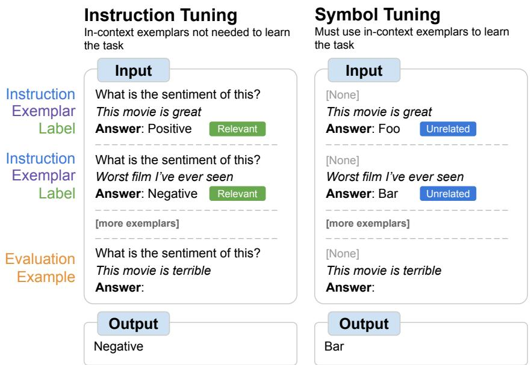  
Figure 1: We tune models on tasks where natural language labels are replaced with arbitrary symbols (symbol tuning). Symbol tuning relies on the intuition that when instructions and relevant labels are not available, models must use in-context exemplars to learn the task.

Second, symbol-tuned models are better at algorithmic reasoning tasks, a striking result since symbol tuning only includes natural language data and did not have any numerical or algorithmic data. On a set of reasoning evaluation suites for list functions (e.g., remove the last element in a list), symboltuned models experience performance improvements of +18.2% for Flan-PaLM-8B, +11.1% for Flan-PaLM-62B, and +3.6% for Flan-PaLM-540B. On a set of turing concept tasks (e.g., swapping 0s and 1s in a string), symbol-tuned models also improve by +15.3% for Flan-PaLM-8B and Flan-PaLM-62B and +4.7% for Flan-PaLM-540B.

Finally, we experiment on an in-context learning setting where inputs have flipped labels, which forces the model to override its prior knowledge when presented with contradictory information incontext. Pretrained language models have the ability to somewhat follow flipped labels—this ability is lost during instruction tuning but can be restored via symbol tuning. Overall, we hope that the strong empirical results from symbol tuning encourage further work in allowing language models to reason over arbitrary symbols given in-context.

## 2 Symbol tuning

Despite their ability to perform some reasoning tasks after being shown in-context exemplars (Chowdhery et al., 2022; OpenAI, 2023), language models are still sensitive to the way in which these tasks are presented in prompts (Brown et al., 2020;

Reynolds and McDonell, 2021; Wei et al., 2022a), suggesting that they are not reasoning in a robust way. Instruction tuning has been shown to improve performance and allow models to better follow incontext exemplars (Mishra et al., 2022; Min et al., 2022a; Wei et al., 2022a; Ye et al., 2021; Chung et al., 2022). One shortcoming, however, is that models are not forced to learn to use the exemplars because the task is redundantly defined in the evaluation example via instructions and natural language labels. For example, in the left-hand side of Figure 1, although the exemplars can help the model understand the task, they are not strictly necessary since the model could ignore the exemplars and just read the instruction.

To make the model better at in-context learning, we propose symbol tuning, in which the model is finetuned on exemplars where the instructions are removed and natural language labels are replaced with semantically-unrelated labels (e.g., “Foo,” “Bar,” etc.). In this setup, the task is unclear without looking at the in-context exemplars. For example, if the prompt from the previous paragraph was changed to “<sentence>. Answer: {Foo, Bar}” (as shown in the right-hand side of Figure 1), multiple in-context exemplars would be needed in order to figure out the task. Because symbol tuning teaches the model to reason over in-context exemplars, symbol-tuned models should have better performance on unseen tasks that require reasoning between in-context exemplars and their labels.

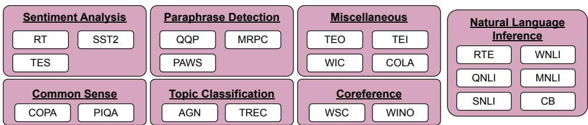  
Figure 2: Datasets and task types used for symbol tuning. See Appendix D.1 for dataset details.

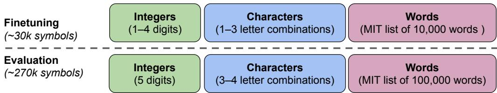  
Figure 3: We use a set of 300k arbitrary symbols from three categories (integers, character combinations, and words). 30k symbols are used during tuning and the rest are held out for evaluation. See Appendix E.1 for more details on the symbols that we used.

## 3 Experimental setup

## 3.1 Tuning tasks & prompt formatting

Figure 2 shows the 22 publicly-available NLP datasets from HuggingFace (Lhoest et al., 2021) (see Appendix D.1 for dataset details) that we use for our symbol-tuning procedure (we ablate the number of datasets used for symbol tuning in Appendix B.4). We selected NLP tasks that have been widely used in the literature (Wang et al., 2018, 2019). Each dataset is categorized into one of seven task types—we only selected classificationtype tasks because symbol tuning requires discrete labels. For each dataset, we use examples from the training split to compose prompts that we use for tuning. Each prompt uses a randomlyselected input–label format (formats are shown in Appendix E.2) and contains a randomly-selected number between 2 and 10 of in-context exemplars per class. We remap labels to a randomlyselected label from a set of 30k labels from three label types as shown in Figure 3 (we ablate the number of labels in Appendix B.5 and the label types in Appendix B.6). Examples of generated tuning prompts for each task are shown in Appendix G.1. Code for generating arbitrary symbols can be found at https://github.com/ JerryWeiAI/symbol-tuning.

## 3.2 Evaluation tasks

We want to evaluate a model’s ability to perform on unseen tasks, so we cannot evaluate on tasks used in symbol tuning (22 datasets) or used during instruction tuning (1.8k tasks). Hence, we choose 11 NLP datasets from HuggingFace (Lhoest et al., 2021) that were not used in either stage of finetuning (details are shown in Appendix D.2): (Conneau and Kiela, 2018, SUBJ); (Basile et al., 2019, TEH); (Mohammad et al., 2016, TEAB); (Mohammad et al., 2016, TEAT); (Mohammad et al., 2016, TEFE); (Mohammad et al., 2016, TEHI); (Alex et al., 2021, ADEC); (Alex et al., 2021, OR); (Alex et al., 2021, SOT); (Alex et al., 2021, TOS); and (Alex et al., 2021, TC). We use the validation split of each dataset to generate evaluation prompts. For each dataset, we randomly select a maximum of 100 examples to use during evaluation. Each evaluation prompt uses a randomly-selected input–label format following Section 3.1, though we fix the number of in-context exemplars per class at k = 4 (we ablate this parameter in Appendix C.4).

We generate prompts for the four different incontext learning (ICL) settings described in Figure 4; each setting either contains or does not contain instructions describing the task (see Appendix D.2 for the instructions we use for each task) and does or does not contain relevant natural language labels. For settings that do not use relevant natural language labels, we remap original labels to a randomly-selected label from a set of 270k semantically-unrelated labels as shown in Figure 3 (we removed labels that were seen during symbol tuning). Examples of generated evaluation prompts for each task are shown in Appendix G.2.

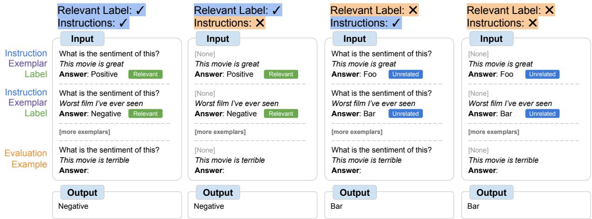  
Figure 4: Depending on the availability of instructions and relevant natural language labels, models may need to do varying amounts of reasoning with in-context exemplars. When these features are not available, models must reason with the given in-context exemplars in order to successfully perform the task. When they are available, reasoning with exemplars can help but is not necessary.

## 3.3 Models & finetuning procedure

For our experiments, we tune Flan-PaLM, the instruction-tuned variants of PaLM. We use the instruction-tuned variants in order to reduce the number of steps needed for tuning, since symbol tuning an instruction-tuned model does not require relearning the information learned during the original round of instruction tuning. We use three different sizes of Flan-PaLM models: Flan-PaLM-8B, Flan-PaLM-62B, and Flan-PaLM-540B. We also tested Flan-PaLM-62B-cont (PaLM-62B at 1.3T tokens instead of 780B tokens); we abbreviate this model size as 62B-c.

Our symbol-tuning pipeline mixes all datasets and randomly samples from each dataset. To ensure that the dataset sizes are balanced (i.e., no dataset gets completely overshadowed), we limit the number of training examples per dataset to a maximum of 25k randomly-selected examples. Training examples are combined into a single sequence using packing (Raffel et al., 2020), and inputs are separated from labels using an end-of-sequence (EOS) token. We tune all models using a batch size of 32 and the Adafactor optimizer (Shazeer and Stern, 2018). For 8B and 62B models, we tune with a learning rate of $3 \times 1 0 ^ { - 3 }$ , and we tune Flan-PaLM-540B with a learning rate of $1 \times 1 0 ^ { - 3 }$ . We use 2048 and 512, respectively, as the input and target sequence lengths during tuning.

For 8B and 62B model evaluations, we report results from the checkpoint after tuning for 4k steps, and for 540B model evaluations, we report results from the checkpoint after tuning for 1k steps (we ablate the number of tuning steps in Appendix B.2). See Appendix E.3 for the number of finetuning steps, learning rate, batch size, and dropout used for each model. As a baseline, we compare symboltuned models against Flan-PaLM models, and we also compare symbol tuning against continued instruction tuning in Appendix B.1.

## 4 Symbol-tuned models are better in-context learners

During symbol tuning, models must learn to reason with in-context exemplars in order to successfully perform tasks because prompts are modified to ensure that tasks cannot be learned from natural language labels or instructions. Symbol-tuned models should thus perform better in settings where tasks are unclear and require reasoning between incontext exemplars and their labels. Additionally, since symbol tuning is meant to improve the ability to follow in-context exemplars, it should not modify prior knowledge and should thus retain the same performance in settings where exemplars are not as necessary to complete the task.

To explore these settings, we define four ICL settings that vary the amount of reasoning required between inputs and labels in order to learn the task (based on the availability of instructions/relevant labels), as shown in Figure 4. The easiest of these settings uses prompts where both instructions and relevant labels are available (as in-context exemplars are not necessary to learn the task), while the hardest setting uses prompts where instructions and relevant labels are both unavailable.

<table><tr><td rowspan="2">Relevant labels:</td><td colspan="4">Average performance on eleven tasks</td></tr><tr><td>&gt;&gt;</td><td>&gt;×</td><td>×&gt;</td><td>××</td></tr><tr><td>Random Guessing</td><td>42.4</td><td>42.4</td><td>42.4</td><td>42.4</td></tr><tr><td>Flan-PaLM-8B + Symbol tuning (ours)</td><td>63.9 57.6 (-6.3)</td><td>61.6 54.3 (-7.3)</td><td>42.4 58.2 (+15.8)</td><td>44.2 52.8 (+8.6)</td></tr><tr><td>Flan-PaLM-62B + Symbol tuning (ours)</td><td>74.3 75.5 (+1.2)</td><td>70.0 70.8 (+0.8)</td><td>57.0 71.4 (+14.4)</td><td>50.5 60.3 (+9.8)</td></tr><tr><td>Flan-PaLM-62B-cont + Symbol tuning (ours)</td><td>77.3 78.9 (+1.6)</td><td>70.3 74.5 (+4.2)</td><td>56.3 71.8 (+15.5)</td><td>51.0 62.1 (+11.1)</td></tr><tr><td>Flan-PaLM-540B + Symbol tuning (ours)</td><td>82.2 84.4 (+2.2)</td><td>77.4 78.8 (+1.4)</td><td>70.7 80.0 (+9.3)</td><td>58.1 63.6 (+5.5)</td></tr></table>

Table 1: Large-enough symbol-tuned models are better at in-context learning than baselines, especially in settings where relevant labels are not available. Performance is shown as average model accuracy (%) across eleven tasks (per-task results are shown in Appendix F.2).

In Table 1, we evaluate model performance before and after symbol tuning in each of these settings. We find that symbol tuning improves performance across all ICL settings for models 62B and larger, with small improvements in settings with relevant natural language labels (+0.8% to +4.2%) and substantial improvements in settings without relevant natural language labels (+5.5% to +15.5%). Strikingly, when relevant labels are unavailable, symbol-tuned Flan-PaLM-8B outperforms Flan-PaLM-62B, and symbol-tuned Flan-PaLM-62B outperforms Flan-PaLM-540B. This performance difference suggests that symbol tuning can allow much smaller models to perform as well as large models on learning input-label mapping from exemplars (effectively saving 10x inference compute).

Symbol-tuned models also perform somewhatcomparably in settings with only relevant labels or only instructions, unlike baseline models whose performance in settings with only relevant labels is always better than in settings with only instructions. Performance in settings with relevant labels actually decreases for Flan-PaLM-8B after symboltuning, however, which may suggest that symbol tuning a small model can override its prior knowledge due to overfitting. Overall, the improvements demonstrate the strong potential of symbol tuning to improve model performance, especially when tasks require learning from in-context exemplars.

## 5 Symbol tuning improves algorithmic reasoning

Symbol tuning is designed to force the model to learn from input–label mappings in the in-context exemplars because the symbols are unrelated to the task and no instructions are provided (and thus the model cannot rely on any other guidance to determine the task). For this reason, we posit that symbol tuning should not only improve the model’s ability to map natural language inputs to arbitrary symbols, but also its ability to learn other forms of input–label mappings such as algorithms.

To test this, we experiment on algorithmic reasoning tasks from BIG-Bench (Srivastava et al., 2022). We first experiment on a set of list function tasks (Rule et al., 2020; Srivastava et al., 2022) where the model needs to identify a transformation function (e.g., remove the last element in a list) between input and output lists containing nonnegative integers. These tasks were evaluated in a four-shot setting, following our evaluation setup in Section 3.2. Additionally, we test models on a set of simple turing concepts (Telle et al., 2019; Srivastava et al., 2022) where models need to reason

Flan-PaLM + Symbol tuning (ours)

(A) Remove elements  
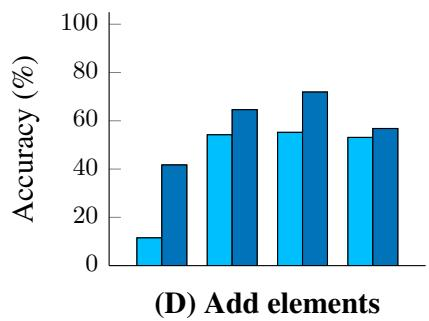

(B) Modify the list  
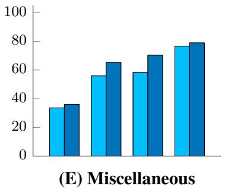

(C) Input-independent  
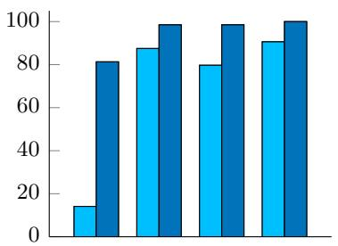

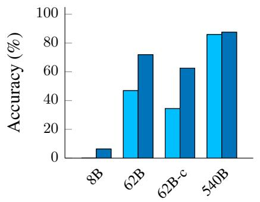

(F) Simple turing concepts  
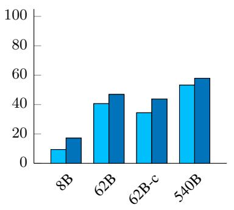

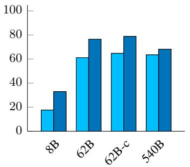  
Figure 5: Symbol-tuned models achieve higher performance on list function tasks and simple turing concept tasks. (A–E): categories of list functions tasks (Rule et al., 2020; Srivastava et al., 2022). (F): simple turing concepts task (Telle et al., 2019; Srivastava et al., 2022). Accuracy per list function category is averaged across all subtasks (categories and per-task results are shown in Appendix F.1).

with binary strings to learn the concept that maps an input to an output (e.g., swapping 0s and 1s in a string). These tasks have predetermined shots for each evaluation example. We selected these algorithmic tasks because they test the model’s ability to generalize to different task types (the symbol-tuning tasks were classification problems with discrete labels, while these tasks are more open-ended generation problems2) and do not require world knowledge (symbol tuning does not increase a model’s prior knowledge).

In Figure 5, we show model performance on the twenty list function tasks with the highest human accuracy baselines3 (Rule, 2020) separated into five categories (category details are described in Appendix F.1) and the turing concepts containing 3 or fewer instructions in the AS II subset of the simple turing concepts task. On the list function tasks, symbol tuning results in an average performance improvement across all tasks of 18.2% for Flan-PaLM-8B, 11.1% for Flan-PaLM-62B, 15.5% for Flan-PaLM-62B-cont, and 3.6% for Flan-PaLM-540B. On the turing concept tasks, symbol tuning results in a performance improvement of 15.3% for Flan-PaLM-8B and Flan-PaLM-62B, 14.1% for Flan-PaLM-62B-cont, and 4.7% for Flan-PaLM-540B. Flan-PaLM-62B-cont with symbol tuning outperforms Flan-PaLM-540B on the list function tasks (in terms of average accuracy across tasks), which is equal to a 10x reduction in inference compute. These improvements on an unseen task type suggest that symbol tuning indeed strengthens the model’s ability to learn in-context, as the symbol-tuning procedure did not have algorithmic data and only used natural language data.

## 6 Symbol-tuned models can override priors via flipped labels

Wei et al. (2023) showed that while pretrained language models (without instruction tuning) could, to some extent, follow flipped labels presented incontext, instruction tuning degraded this ability. Symbol tuning, on the other hand, forces models to consider the label presented in-context as an arbitrary symbol, which should reduce the model’s usage of prior knowledge that contradicts the flipped labels. For this reason, we expect that symbol tuning would be able to improve and restore the ability to follow flipped labels in-context.

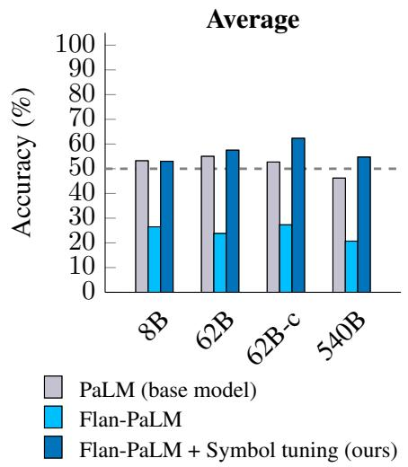

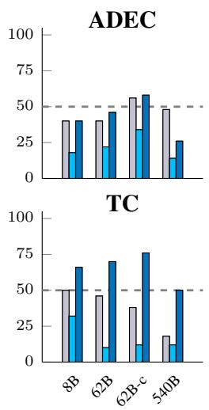

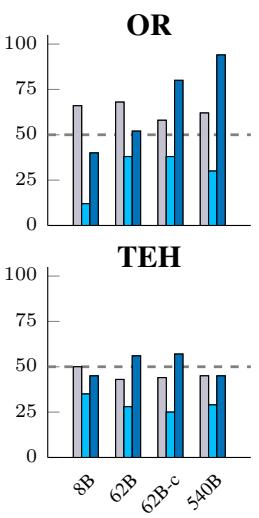

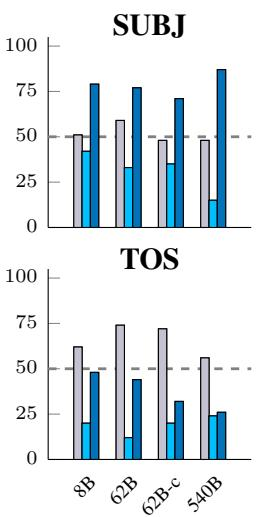  
Figure 6: Symbol-tuned models are much better at following flipped labels presented in-context than instructiontuned models are for all model sizes. Instruction-tuned models cannot flip predictions to follow flipped labels (performance is well below random guessing), while symbol-tuned models can do this more often (performance matches or is slightly above random guessing). Ground-truth labels for evaluation examples are flipped, so if a model learns to follow flipped labels, its accuracy should be above random guessing (e.g., a perfect model that can follow flipped labels should get 100% accuracy on our evaluations).

To test this, we flip the labels of both in-context exemplars and the evaluation example for the tasks described in Section 3.2 (we remove tasks with more than two labels from this experiment since it is unclear how to best “flip” more than two labels). For example, for the SST2 dataset, all exemplars that are labeled as having “positive” sentiment will now be labeled as having “negative” sentiment. A perfect model that can follow these flipped labels should achieve 100% accuracy on these tasks if its accuracy in the standard ICL setting is also 100%.

As shown in Figure 6, symbol tuning restores the ability to follow flipped labels that was lost during instruction tuning. We see that there is a similar trend across all model sizes—instructiontuned models are generally unable to follow flipped labels (as demonstrated by their performance being far below random guessing), but symbol-tuned models are much more capable of doing so. We found that after symbol tuning, Flan-PaLM-8B sees an average improvement across all datasets of 26.5%, Flan-PaLM-62B sees an improvement of 33.7%, and Flan-PaLM-540B sees an improvement of 34.0%. For some datasets (e.g., OR, SUBJ, TC), symbol-tuned models can now override priors and follow flipped labels (i.e., achieve much better performance than random guessing), despite instruction-tuned models not being able to do so for any datasets. Additionally, symbol-tuned models match or beat pretraining-only models in terms of average performance, indicating that symbol tuning has, to some extent, restored the model’s original ability to follow flipped labels.

These results further indicate another type of generalized in-context learning capability, as we did not include any flipped labels during symbol tuning. Although the performance improvement from symbol tuning is large, we note that more work should be done in this area since performance on the flipped-labels settings is, on average, not significantly better than random guessing.

## 7 Related work

## 7.1 In-context learning via semantic prior knowledge

Recent studies on in-context learning suggest that prior knowledge plays a significant role in how models learn in-context. For example, Wei et al. (2023) showed that some small models and instruction-tuned models cannot follow flipped labels presented in-context, suggesting that these models primarily utilize prior knowledge for incontext learning. Min et al. (2022b) found a similar result that using random ground-truth labels in in-context exemplars does not significantly affect performance, meaning that performance may be driven by other factors such as the label space.

Reynolds and McDonell (2021) also showed that cleverly-constructed prompts in a zero-shot setting could outperform prompts in a few-shot setting, implying that, for some tasks, models can achieve better performance by leveraging their existing knowledge than from attempting to learn the task from in-context exemplars. Additionally, in chain-of-thought prompting (Wei et al., 2022b), Madaan and Yazdanbakhsh (2022) and Wang et al. (2022) showed that performance on multi-step reasoning tasks does not decrease when models are provided with logically-incorrect prompts. Raghu et al. (2020) also demonstrated that systems such as MAML can effectively “memorize” labels when trained in a way where all labels can be memorized, which further illustrates that, when possible, models may attempt to use prior knowledge rather than adapt to each new task.

Our findings do not dispute the idea that semantic prior knowledge can provide significant benefits to in-context learning. Indeed, we showed that instruction-tuned models cannot follow flipped labels in-context, which is consistent with the findings from Wei et al. (2023). We instead aim to demonstrate that through symbol tuning, language models can retain the benefits of utilizing prior knowledge while also improving their ability to learn from input–label pairs shown in-context.

## 7.2 In-context learning via in-context exemplars

At the same time, however, other recent work has suggested that language models can, in fact, learn in-context using the given exemplars. This ability may be more useful than the ability to use semantic prior knowledge because it would allow models to perform tasks that are not seen in or contradict pretraining data. Garg et al. (2022), for instance, showed that transformers trained from scratch can perform in-context learning on linearregression tasks at a similar performance level as the least-squares estimator. This capability was shown to result from transformers implementing standard learning algorithms such as gradient descent (Akyürek et al., 2023; von Oswald et al.,

2022; Dai et al., 2023). Furthermore, Webson and Pavlick (2022) demonstrated that, in a natural language setting, language models can learn at the same rate during finetuning even when given irrelevant or misleading prompts. On a broader level, Rajendran et al. (2020) and Yin et al. (2020) found that adding noise to, shuffling, or regularizing the label space can make systems better at learning and adapting to new tasks.

In this paper, we attempt to improve the degree to which language models are able to learn tasks via input–label mappings. Our symbol-tuning method can be seen as a form of label augmentation and is thus similar to the proposed methods from Rajendran et al. (2020) and Yin et al. (2020), though it differs crucially in that we apply them to tune large language models. Additionally, We found that symbol-tuned models saw significant improvements in their ability to learn in-context (e.g., on algorithmic tasks or settings with underspecified prompts), which supports the idea that langauge models have the ability to learn in-context using the given exemplars.

## 7.3 Tuning language models

Our work presented symbol tuning, a form of finetuning on input–label pairs where labels are remapped to arbitrary symbols. Symbol tuning relates to a broader body of work showing that finetuning language models can significantly alter their behavior and performance in different settings. For example, Wei et al. (2022a) first presented instruction tuning (finetuning on tasks phrased as instructions) and showed that this finetuning procedure substantially improves model performance in zero-shot settings. Chung et al. (2022) further scaled this procedure by adding more tasks, increasing model sizes, and adding chain-of-thought data, demonstrating that, with these changes, tuned models are significantly better at chain-of-thought reasoning, open-ended generation, and several evaluation benchmarks.

Our experimental findings match these results in terms of showing that finetuning can significantly alter model performance. Our work differs, however, by not only focusing on settings with in-context exemplars and underspecified prompts, but also by modifying the finetuning procedure to make tasks harder to learn and require additional reasoning with in-context exemplars.

## 8 Limitations

While our study presents a simple yet effective method of improving in-context learning for language models, there are several limitations to our work. An open question is how to apply symbol tuning in a generative setting—we symbol tuned models on a range of classification tasks with discrete labels so that we can remap labels to arbitrary symbols, but we did not tune on generation tasks since it is unclear how to remap outputs to symbols in those settings. Future work could thus explore whether symbol tuning can be applied in a generative setting.

Additionally, our symbol-tuning procedure used 22 NLP datasets—while we ablated the number of datasets in Appendix B.4 and saw that increasing the number of datasets used for symbol tuning generally improves performance, we did not experiment with adding more tasks. Prior work, however, has demonstrated that scaling up finetuning methods can improve their impact on language models (Chung et al., 2022), so a natural extension would be to examine whether further scaling up the symbol-tuning method would have a similar result.

Furthermore, we applied symbol tuning to a family of instruction-tuned language models. It is unknown, however, whether the effects of symbol tuning that we showed may be affected by changes to the pretraining objective, model architecture, or training process. Similarly, symbol tuning may have different effects on language models that are not instruction tuned, as we did not specifically experiment on this factor. For this reason, future work may investigate how these factors impact the effectiveness of symbol tuning for improving in-context learning abilities in language models.

Because we only experimented with one family of language models, it is still unclear whether symbol tuning is effective for other models. Applying symbol tuning to other language models would likely require adjustments to the finetuning procedure to be successful (e.g., number of finetuning steps, mixing with previous data, number datasets), but a definitive conclusion about these factors cannot be drawn without further experimentation. We thus note that a crucial direction for future work is to explore how well symbol tuning translates to other language models.

## 9 Conclusions

In this paper, we presented symbol tuning, a new method of tuning models on tasks where natural language labels are remapped to arbitrary symbols. Symbol tuning is based off of the intuition that when models cannot use instructions or relevant labels to determine a presented task, it must do so by instead learning from in-context exemplars. We tuned four language models (Flan-PaLM-8B, Flan-PaLM-62B, Flan-PaLM-62B-cont, and Flan-PaLM-540B) using our symbol-tuning procedure, utilizing a tuning mixture of 22 datasets and approximately 30k arbitrary symbols as labels.

Experimentally, we showed that symbol tuning can significantly improve a model’s ability to learn from in-context exemplars in not only natural language settings, but also on algorithmic tasks. First, we showed that symbol tuning improves performance on unseen in-context learning tasks, especially when prompts do not contain instructions or relevant labels. We also found that symbol-tuned models were much better at algorithmic reasoning tasks, despite the lack of numerical or algorithmic data in the symbol-tuning procedure. Finally, in an in-context learning setting where inputs have flipped labels, symbol tuning (for some datasets) reunlocks the ability to follow flipped labels that was lost during instruction tuning.

Through symbol tuning, we aim to have increased the degree to which models can examine and learn from input–label mappings during in-context learning. We hope that our results encourage further work towards improving language models’ ability to reason over symbols presented in-context.

## References

Ekin Akyürek, Dale Schuurmans, Jacob Andreas, Tengyu Ma, and Denny Zhou. 2023. What learning algorithm is in-context learning? Investigations with linear models. In International Conference on Learning Representations.

Neel Alex, Eli Lifland, Lewis Tunstall, Abhishek Thakur, Pegah Maham, C. Jess Riedel, Emmie Hine, Carolyn Ashurst, Paul Sedille, Alexis Carlier, Michael Noetel, and Andreas Stuhlmüller. 2021. RAFT: A real-world few-shot text classification benchmark. In Conference on Neural Information Processing Systems.

Valerio Basile, Cristina Bosco, Elisabetta Fersini, Debora Nozza, Viviana Patti, Francisco Manuel Rangel Pardo, Paolo Rosso, and Manuela Sanguinetti. 2019. SemEval-2019 Task 5: Multilingual detection of hate speech against immigrants and women in Twitter. In International Workshop on Semantic Evaluation.

Yonatan Bisk, Rowan Zellers, Ronan Le Bras, Jianfeng Gao, and Yejin Choi. 2020. PIQA: Reasoning about physical commonsense in natural language. In Conference of the Association for the Advancement of Artificial Intelligence.

Samuel R. Bowman, Gabor Angeli, Christopher Potts, and Christopher D. Manning. 2015. A large annotated corpus for learning natural language inference. In Conference on Empirical Methods in Natural Language Processing.

Tom Brown, Benjamin Mann, Nick Ryder, Melanie Subbiah, Jared D. Kaplan, Prafulla Dhariwal, Arvind Neelakantan, Pranav Shyam, Girish Sastry, Amanda Askell, et al. 2020. Language models are few-shot learners. In Conference on Neural Information Processing Systems.

Zihang Chen, Hongbo Zhang, Xiaoji Zhang, and Leqi Zhao. 2017. Quora question pairs.

Aakanksha Chowdhery, Sharan Narang, Jacob Devlin, Maarten Bosma, Gaurav Mishra, Hyung Won Chung, Charles Sutton, Sebastian Gehrmann, Parker Schuh, et al. 2022. PaLM: Scaling language modeling with Pathways.

Hyung Won Chung, Le Hou, Shayne Longpre, Barret Zoph, Yi Tay, William Fedus, Eric Li, Xuezhi Wang, Mostafa Dehghani, Siddhartha Brahma, et al. 2022. Scaling instruction-finetuned language models.

Alexis Conneau and Douwe Kiela. 2018. SentEval: An evaluation toolkit for universal sentence representations. In Conference on Language Resources and Evaluation.

Damai Dai, Yutao Sun, Li Dong, Yaru Hao, Zhifang Sui, and Furu Wei. 2023. Why can GPT learn in-context? Language models secretly perform gradient descent as meta-optimizers. In Workshop on Understanding

Foundation Models at the International Conference on Learning Representations.

Shivam Garg, Dimitris Tsipras, Percy Liang, and Gregory Valiant. 2022. What can transformers learn in-context? A case study of simple function classes. In Conference on Neural Information Processing Systems.

Dan Hendrycks, Collin Burns, Steven Basart, Andy Zou, Mantas Mazeika, Dawn Song, and Jacob Steinhardt. 2021. Measuring massive multitask language understanding. In International Conference on Learning Representations.

Sakaguchi Keisuke, Le Bras Ronan, Bhagavatula Chandra, and Choi Yejin. 2021. WinoGrande: An adversarial winograd schema challenge at scale. Communications of the Association for Computing Machinery.

Hector Levesque, Ernest Davis, and Leora Morgenstern. 2012. The winograd schema challenge. In International Conference on the Principles of Knowledge Representation and Reasoning.

Aitor Lewkowycz, Anders Andreassen, David Dohan, Ethan Dyer, Henryk Michalewski, Vinay Ramasesh, Ambrose Slone, Cem Anil, Imanol Schlag, Theo Gutman-Solo, Yuhuai Wu, Behnam Neyshabur, Guy Gur-Ari, and Vedant Misra. 2022. Solving quantitative reasoning problems with language models. In Conference on Neural Information Processing Systems.

Quentin Lhoest, Albert Villanova del Moral, Yacine Jernite, Abhishek Thakur, Patrick von Platen, Suraj Patil, Julien Chaumond, Mariama Drame, Julien Plu, Lewis Tunstall, Joe Davison, Mario Šaško, Gunjan Chhablani, Bhavitvya Malik, Simon Brandeis, Teven Le Scao, Victor Sanh, Canwen Xu, Nicolas Patry, Angelina McMillan-Major, Philipp Schmid, Sylvain Gugger, Clément Delangue, Théo Matussière, Lysandre Debut, Stas Bekman, Pierric Cistac, Thibault Goehringer, Victor Mustar, François Lagunas, Alexander Rush, and Thomas Wolf. 2021. Datasets: A community library for natural language processing. In Conference on Empirical Methods in Natural Language Processing: System Demonstrations.

Xin Li and Dan Roth. 2002. Learning question classifiers. In Conference on Computational Linguistics.

Aman Madaan and Amir Yazdanbakhsh. 2022. Text and patterns: For effective chain of thought, it takes two to tango.

Sewon Min, Mike Lewis, Luke Zettlemoyer, and Hannaneh Hajishirzi. 2022a. MetaICL: Learning to learn in context. In Conference of the North American Chapter of the Association for Computational Linguistics.

Sewon Min, Xinxi Lyu, Ari Holtzman, Mikel Artetxe, Mike Lewis, Hannaneh Hajishirzi, and Luke Zettlemoyer. 2022b. Rethinking the role of demonstrations:

What makes in-context learning work? In Conference on Empirical Methods in Natural Language Processing.

Swaroop Mishra, Daniel Khashabi, Chitta Baral, and Hannaneh Hajishirzi. 2022. Cross-task generalization via natural language crowdsourcing instructions. In Proceedings ofthe Associationfor Computational Linguistics.

Saif Mohammad, Svetlana Kiritchenko, Parinaz Sobhani, Xiaodan Zhu, and Colin Cherry. 2016. SemEval-2016 Task 6: Detecting stance in tweets. In International Workshop on Semantic Evaluation.

Allen Newell. 1980. Physical symbol systems. Cognitive Science.

Allen Newell and Herbert A. Simon. 1976. Computer science as empirical inquiry: Symbols and search. In Communications of the Association for Computing Machinery.

OpenAI. 2023. GPT-4 technical report.

Long Ouyang, Jeff Wu, Xu Jiang, Diogo Almeida, Carroll L. Wainwright, Pamela Mishkin, Chong Zhang, Sandhini Agarwal, Katarina Slama, Alex Ray, John Schulman, Jacob Hilton, Fraser Kelton, Luke Miller, Maddie Simens, Amanda Askell, Peter Welinder, Paul Christiano, Jan Leike, and Ryan Lowe. 2022. Training language models to follow instructions with human feedback. In Conference on Neural Information Processing Systems.

Bo Pang and Lillian Lee. 2005. Seeing stars: Exploiting class relationships for sentiment categorization with respect to rating scales. In Proceedings of the Associationfor Computational Linguistics.

Colin Raffel, Noam Shazeer, Adam Roberts, Katherine Lee, Sharan Narang, Michael Matena, Yanqi Zhou, Wei Li, and Peter J. Liu. 2020. Exploring the limits of transfer learning with a unified text-to-text transformer. Journal ofMachine Learning Research.

Aniruddh Raghu, Maithra Raghu, Samy Bengio, and Oriol Vinyals. 2020. Rapid learning or feature reuse? towards understanding the effectiveness of MAML. In International Conference on Learning Representations.

Janarthanan Rajendran, Alexander Irpan, and Eric Jang. 2020. Meta-learning requires meta-augmentation. In Conference on Neural Information Processing Systems.

Pranav Rajpurkar, Jian Zhang, Konstantin Lopyrev, and Percy Liang. 2016. SQuAD: 100,000+ questions for machine comprehension of text. In Conference on Empirical Methods in Natural Language Processing.

Laria Reynolds and Kyle McDonell. 2021. Prompt programming for large language models: Beyond the few-shot paradigm. In Extended Abstracts of the Conference on Human Factors in Computing Systems.

Sara Rosenthal, Noura Farra, and Preslav Nakov. 2017. SemEval-2017 Task 4: Sentiment analysis in twitter. In International Workshop on Semantic Evaluation.

Joshua S. Rule, Joshua B. Tenenbaum, and Steven T. Piantadosi. 2020. The child as hacker. Trends in Cognitive Sciences.

Joshua Stewart Rule. 2020. The child as hacker: building more human-like models oflearning. Ph.D. thesis, Massachusetts Institute of Technology.

Victor Sanh, Albert Webson, Colin Raffel, Stephen H. Bach, Lintang Sutawika, Zaid Alyafeai, Antoine Chaffin, Arnaud Stiegler, Teven Le Scao, Arun Raja, Manan Dey, M Saiful Bari, Canwen Xu, Urmish Thakker, Shanya Sharma Sharma, Eliza Szczechla, Taewoon Kim, Gunjan Chhablani, Nihal Nayak, Debajyoti Datta, Jonathan Chang, Mike Tian-Jian Jiang, Han Wang, Matteo Manica, Sheng Shen, Zheng Xin Yong, Harshit Pandey, Rachel Bawden, Thomas Wang, Trishala Neeraj, Jos Rozen, Abheesht Sharma, Andrea Santilli, Thibault Fevry, Jason Alan Fries, Ryan Teehan, Tali Bers, Stella Biderman, Leo Gao, Thomas Wolf, and Alexander M. Rush. 2022. Multitask prompted training enables zero-shot task generalization. In International Conference on Learning Representations.

Adam Santoro, Andrew K. Lampinen, Kory W. Mathewson, Timothy P. Lillicrap, and David Raposo. 2021. Symbolic behaviour in artificial intelligence.

Noam Shazeer and Mitchell Stern. 2018. Adafactor: Adaptive learning rates with sublinear memory cost. In International Conference on Machine Learning.

Richard Socher, Alex Perelygin, Jean Wu, Jason Chuang, Christopher D. Manning, Andrew Ng, and Christopher Potts. 2013. Recursive deep models for semantic compositionality over a sentiment treebank. In Conference on Empirical Methods in Natural Language Processing.

Aarohi Srivastava, Abhinav Rastogi, Abhishek Rao, Abu Awal Md Shoeb, Abubakar Abid, Adam Fisch, Adam R Brown, Adam Santoro, Aditya Gupta, Adrià Garriga-Alonso, et al. 2022. Beyond the imitation game: Quantifying and extrapolating the capabilities of language models.

Mirac Suzgun, Nathan Scales, Nathanael Schärli, Sebastian Gehrmann, Yi Tay, Hyung Won Chung, Aakanksha Chowdhery, Quoc V. Le, Ed H. Chi, Denny Zhou, and Jason Wei. 2022. Challenging BIG-Bench tasks and whether chain-of-thought can solve them.

Jan Arne Telle, José Hernández-Orallo, and Cèsar Ferri. 2019. The teaching size: computable teachers and learners for universal languages. Machine Learning.

Cynthia Van Hee, Els Lefever, and Véronique Hoste. 2018. SemEval-2018 Task 3: Irony detection in english tweets. In International Workshop on Semantic Evaluation.

Johannes von Oswald, Eyvind Niklasson, Ettore Randazzo, João Sacramento, Alexander Mordvintsev, Andrey Zhmoginov, and Max Vladymyrov. 2022. Transformers learn in-context by gradient descent.

Alex Wang, Yada Pruksachatkun, Nikita Nangia, Amanpreet Singh, Julian Michael, Felix Hill, Omer Levy, and Samuel Bowman. 2019. SuperGLUE: A stickier benchmark for general-purpose language understanding systems. In Conference on Neural Information Processing Systems.

Alex Wang, Amanpreet Singh, Julian Michael, Felix Hill, Omer Levy, and Samuel R. Bowman. 2018. GLUE: A multi-task benchmark and analysis platform for natural language understanding. In BlackboxNLP Workshop at the Conference on Empirical Methods in Natural Language Processing.

Boshi Wang, Sewon Min, Xiang Deng, Jiaming Shen, You Wu, Luke Zettlemoyer, and Huan Sun. 2022. Towards understanding chain-of-thought prompting: An empirical study of what matters.

Albert Webson and Ellie Pavlick. 2022. Do promptbased models really understand the meaning of their prompts? In Conference of the North American Chapter of the Association for Computational Linguistics.

Jason Wei, Maarten Bosma, Vincent Y. Zhao, Kelvin Guu, Adams Wei Yu, Brian Lester, Nan Du, Andrew M. Dai, and Quoc V. Le. 2022a. Finetuned language models are zero-shot learners. In International Conference on Learning Representations.

Jason Wei, Xuezhi Wang, Dale Schuurmans, Maarten Bosma, Brian Ichter, Fei Xia, Ed H. Chi, Quoc V Le, and Denny Zhou. 2022b. Chain of thought prompting elicits reasoning in large language models. In Conference on Neural Information Processing Systems.

Jerry Wei, Jason Wei, Yi Tay, Dustin Tran, Albert Webson, Yifeng Lu, Xinyun Chen, Hanxiao Liu, Da Huang, Denny Zhou, and Tengyu Ma. 2023. Larger language models do in-context learning differently.

Qinyuan Ye, Bill Yuchen Lin, and Xiang Ren. 2021. CrossFit: A few-shot learning challenge for crosstask generalization in NLP. In Conference on Empirical Methods in Natural Language Processing.

Mingzhang Yin, George Tucker, Mingyuan Zhou, Sergey Levine, and Chelsea Finn. 2020. Metalearning without memorization. In International Conference on Learning Representations.

Marcos Zampieri, Shervin Malmasi, Preslav Nakov, Sara Rosenthal, Noura Farra, and Ritesh Kumar. 2019. SemEval-2019 Task 6: Identifying and categorizing offensive language in social media (offenseval). In International Workshop on Semantic Evaluation.

Xiang Zhang, Junbo Jake Zhao, and Yann LeCun. 2015. Character-level convolutional networks for text classification. In Conference on Neural Information Processing Systems.

Yuan Zhang, Jason Baldridge, and Luheng He. 2019. PAWS: Paraphrase Adversaries from Word Scrambling. In Proceedings ofthe North American Chapter ofthe Associationfor Computational Linguistics.