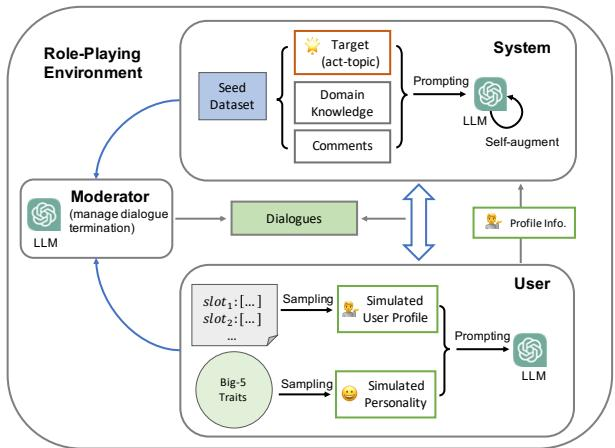
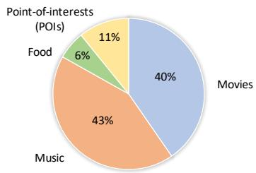
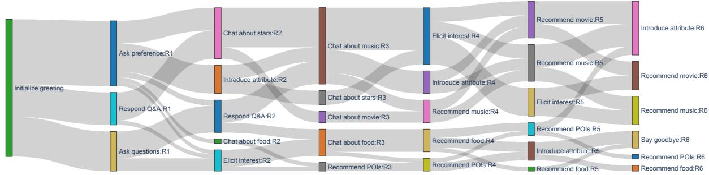
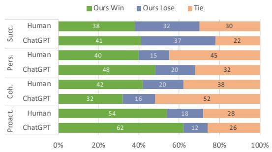
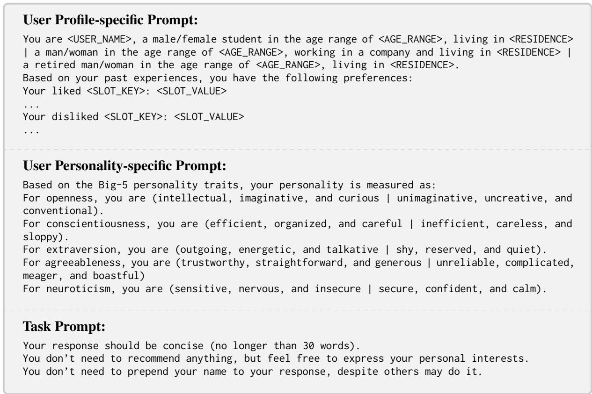
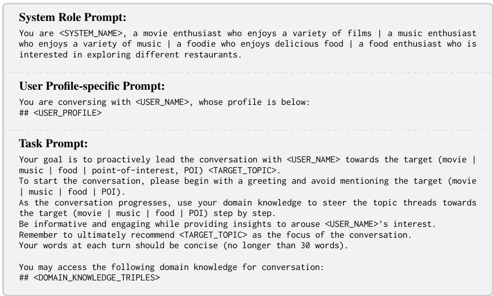
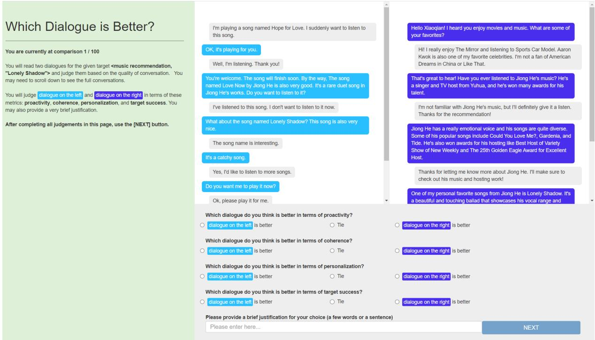
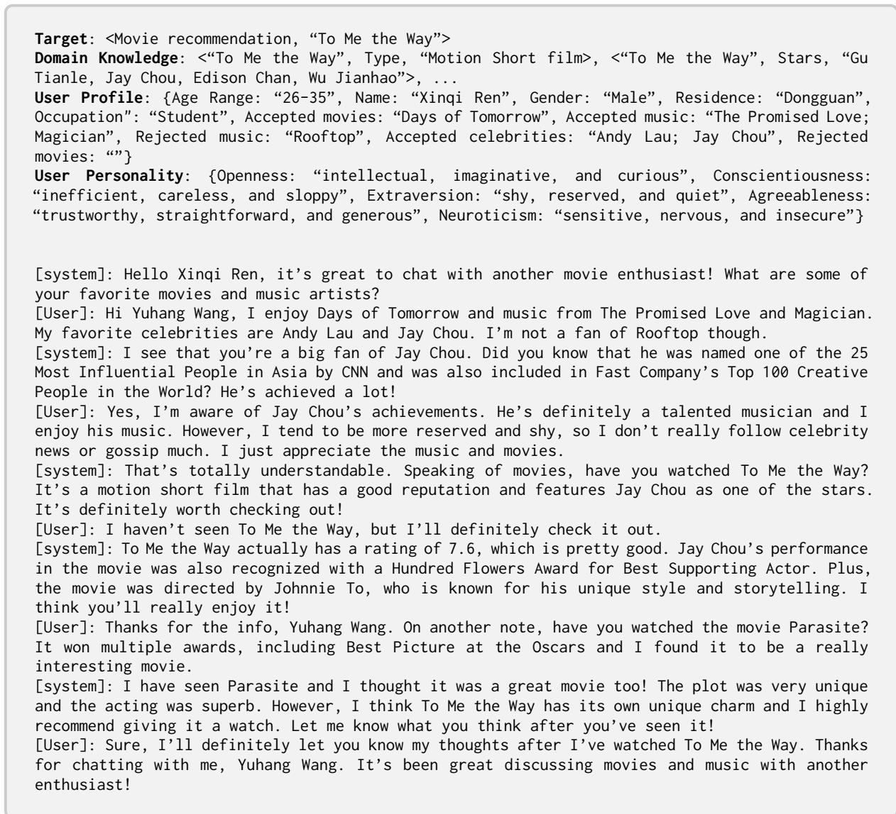
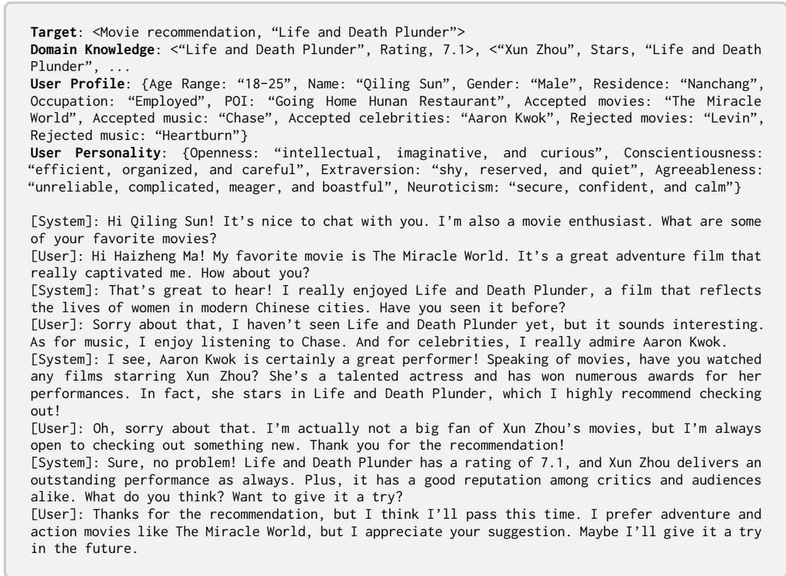

# Target-oriented Proactive Dialogue Systems with Personalization: Problem Formulation and Dataset Curation

Jian Wang, Yi Cheng, Dongding Lin, Chak Tou Leong, Wenjie Li Department of Computing, The Hong Kong Polytechnic University {jian-dylan.wang, alyssa.cheng, dongding88.lin, chak-tou.leong} @connect.polyu.hk cswjli@comp.polyu.edu.hk

## Abstract

Target-oriented dialogue systems, designed to proactively steer conversations toward predefined targets or accomplish specific system-side goals, are an exciting area in conversational AI. In this work, by formulating a <dialogue act, topic> pair as the conversation target, we explore a novel problem of personalized targetoriented dialogue by considering personalization during the target accomplishment process. However, there remains an emergent need for high-quality datasets, and building one from scratch requires tremendous human effort. To address this, we propose an automatic dataset curation framework using a role-playing approach. Based on this framework, we construct a large-scale personalized target-oriented dialogue dataset, TOPDIAL1, which comprises about 18K multi-turn dialogues. The experimental results show that this dataset is of high quality and could contribute to exploring personalized target-oriented dialogue.

## 1 Introduction

Compared with traditional dialogue systems that focus merely on passively responding to user requirements, a recently investigated research topic of target-oriented dialogue systems (Sevegnani et al., 2021; Deng et al., 2023) specifies a conversation target from the system side, enabling the system to take the initiative and lead the conversation. Early work in this area mainly formulates the targets as mentioning certain keywords (Tang et al., 2019; Qin et al., 2020; Zhong et al., 2021; Yang et al., 2022) or specific topics (Wu et al., 2019; Sevegnani et al., 2021). To allow the formed targets to be applicable in broad scenarios, a few recent studies (Zhang et al., 2021; Wang et al., 2023b) define <dialogue act, topic> pairs as targets. For example, given the target of <movie recommendation, "King of Comedy">, the system needs to take appropriate dialogue acts and smoothly steer the discussed topic towards the designated one. Its ultimate objective is to achieve recommendations on the target topic “King of Comedy”. Our work also follows the form of <dialogue act, topic> pairs as targets to study target-oriented dialogue systems due to their higher applicability in real-world scenarios.

Despite many existing efforts, we find that two critical issues remain to be solved. One urgent problem is the need for well-organized benchmarks or datasets. Current studies for target-oriented dialogue (Gupta et al., 2022; Wang et al., 2023a) mainly re-purpose existing non-target-oriented dialogue datasets, which are not exactly suitable as they are crowd-sourced without consideration of target accomplishment. Nevertheless, building a new high-quality dataset from scratch requires expensive human effort. The other essential issue is that, target-oriented dialogue systems need to consider personalized aspects (Wu et al., 2021; Rana et al., 2023), such as user profiles and personalities, which were largely ignored by previous work. User profiles involve user preferences about potential topics relevant to the target, while personalities imply possible reactions and feedback during the dialogue process. With personalized information incorporated, the system could be tailored to a user and lead the conversation towards the target with higher engagement instead of obtrusively driving to the target, thereby improving user experience. Thus, we raise the question: How can we build high-quality datasets with little human effort for personalized target-oriented dialogue?

In this work, we first give a comprehensive definition (§2) of personalized target-oriented dialogue, then lay out the desirable characteristics (§2) that a qualified dialogue dataset should meet. Drawing inspiration from some recent work that has demonstrated unprecedented capabilities of large language models (LLM) in simulating human social behaviors (Guo et al., 2023; Li et al., 2023), we propose a role-playing approach for automatic dataset curation (§3) using multiple LLM agents. They are designed to follow specific instructions to fulfill the requirements. Based on that, we synthesize a large-scale dialogue dataset named TOP-DIAL and show its quality and effectiveness (§4).

Our main contributions are: (1) We formulate the problem of personalized target-oriented dialogue, which is promising yet underexplored. (2) We propose a novel role-playing framework for automatic dialogue dataset curation. It provides insights into building large-scale datasets for many other dialogue tasks. (3) Our constructed TOPDIAL dataset is of high quality and contributes to the related research community.

## 2 Problem Formulation

Task Definition We consider a dialogue corpus $\mathcal { D } = \{ ( \mathcal { U } _ { i } , \mathcal { K } _ { i } , \mathcal { T } _ { i } , \mathcal { C } _ { i } ) \} _ { i = 1 } ^ { N }$ , where N is the total number of dialogues. In the i-th dialogue, $\mathcal { U } _ { i }$ represents the personalized information, such as the user’s profiles and/or personalities. $\kappa _ { i }$ represents the domain knowledge facts relevant to the i-th dialogue. $\tau _ { i }$ denotes the predefined target consisting of an <dialogue act, topic> pair. $\bar { \mathcal { C } _ { i } } = \{ \mathcal { C } _ { i , t } \} _ { t = 1 } ^ { N _ { T } }$ is the dialogue content, with a total of $N _ { T }$ turns. The task of personalized target-oriented dialogue is formalized as follows: given a target $\tau$ , a set of user’s personalized information , a set of relevant domain knowledge $\kappa .$ and a dialogue context ${ \mathcal { C } } ,$ the objective is to proactively lead the conversation and generate proper utterances to achieve the target $\tau$ at an appropriate time.

Desirable Characteristics of Datasets Based on the above definition, we lay out two desirable characteristics that a qualified dataset should meet, namely target-oriented proactivity and personalization. Target-oriented proactivity emphasizes that a dialogue dataset should allow the system to (i) take the initiative throughout a conversation, (ii) proactively lead the discussed topic towards the target topic based on domain knowledge, and (iii) accomplish the target act. On the other hand, personalization indicates that dialogues in a qualified dataset should embody (i) user profiles, which may involve users’ past preferences about potential topics relevant to the target, and (ii) user personalities, which may imply users’ possible reactions and feedback during the system-initiative process.

  
Figure 1: Overview of our role-playing framework for automatic dialogue dataset curation.

## 3 Dataset Curation Framework

In this section, we describe a role-playing approach for automatic dataset curation using multiple LLM agents. Figure 1 depicts the whole framework, which involves one user agent, one system agent, and one moderator agent. All these agents are designed to follow specific instructions and communicate in our role-playing environment.

Role-Playing Environment This environment is designed to provide a global description for prompting all LLM agents. To achieve desirable targetoriented role playing, we instantiate the environment description based on the domains of the predefined targets. For example, one can describe the environment as “You are participating in a conversation about music or movies.” for a given target  = <movie recommendation, “King of Comedy”>. Then, the description will be prepended to each agent’s instructions.

User Agent The user agent aims to simulate human users who generate utterances conditioned on their specific profiles and personalities. Since there are many off-the-shelf dialogue datasets grounded with user profiles, we collect all user profiles from one chosen dataset and parse them into a profile slot pool. Each slot contains a particular slot key (e.g., name, age range, liked or disliked movies) and a list of candidate values. We randomly sample a slot value for each key, and then form all key-value pairs as the simulated user profile.

Inspired by Big-5 personality traits (Goldberg, 1993) that have been widely adopted in personalityaware tasks (Oraby et al., 2018; Yu et al., 2019), we randomly sample a positive or negative description for each of the following traits: openness (O), conscientiousness (C), extraversion (E), agreeableness (A), neuroticism (N). The sampled descriptions are then combined as the simulated user personality. We verbalize the simulated user profile and personality in natural languages, prompting the user agent to act as a human user. We present our detailed instruction template in Appendix A.1.

<table><tr><td>Dataset</td><td>Participants</td><td>Formed Targets</td><td>TO</td><td>PF</td><td>PN</td><td>Domains</td><td>MT</td><td>#Dialogue</td></tr><tr><td>TGC (Tang et al., 2019)</td><td>Crowd workers</td><td>Keywords</td><td>√</td><td>x</td><td>x</td><td>Open-domain</td><td>√</td><td>9,939</td></tr><tr><td>DuConv (Wu et al., 2019)</td><td>Crowd workers</td><td>Topical entities</td><td>√</td><td>x</td><td>x</td><td>Movies</td><td>√</td><td>29,858</td></tr><tr><td>TG-ReDial (Zhou et al., 2020)</td><td>Crowd workers</td><td>N/A</td><td>x</td><td>√</td><td>x</td><td>Movies</td><td>√</td><td>10,000</td></tr><tr><td>OTTers (Sevegnani et al., 2021)</td><td>Crowd workers</td><td>Topics</td><td>√</td><td>x</td><td>x</td><td>Open-domain</td><td>x</td><td>4,316</td></tr><tr><td>TGConv (Yang et al., 2022)</td><td>Crowd workers</td><td>Keywords</td><td>√</td><td>x</td><td>x</td><td>Open-domain</td><td>√</td><td>18,878</td></tr><tr><td>DuRecDial 2.0 (Liu et al., 2021)</td><td>Crowd workers</td><td>N/A</td><td>x</td><td>√</td><td>x</td><td>Movies, music, food, POIs*</td><td>√</td><td>16,482</td></tr><tr><td>DuRecDial 2.0† (Wang et al., 2023a)</td><td>Human experts</td><td>Act-topic pairs</td><td>√</td><td>√</td><td>x</td><td>Movies, music, food, POIs*</td><td>√</td><td>6,080</td></tr><tr><td>TOPDIAL (Ours)</td><td>LLM agents</td><td>Act-topic pairs</td><td>√</td><td>√</td><td>√</td><td>Movies, music, food, POIs</td><td>√</td><td>18,009</td></tr></table>

Table 1: Comparison between TOPDIAL and other related datasets (TO: target-oriented, PF: profile grounding, PN: personality grounding, MT: multi-turn conversation, : re-purposed version, : point-of-interest restaurants).

System Agent The system agent aims to serve as a human-like domain-specific enthusiast, such as a movie enthusiast who enjoys a variety of films, or a foodie who enjoys delicious food. Its longterm goal is to proactively lead the conversation towards the target, as discussed in §2. To achieve target-oriented proactivity, we take a given target and a set of relevant domain knowledge (and a few comments related to the target topic, if applicable) from a chosen seed dataset as the fundamental prompting source. Besides, in human-to-human conversations, one can easily know the other’s explicit profile information, while it is hard to be aware of implicit personality before their first conversation. Thus, we pass the simulated user profile yielded by the user agent to the system agent as a personalized prompting source (see Figure 1).

We assign required instructions to the system agent based on the above prompting sources and task definition. We provide the instruction template in Appendix A.2. In practice, we further enhance the system agent in a self-augmented instruction manner, where the agent’s task prompt will be repeated at each dialogue round to avoid forgetting its long-term goal.

Moderator Agent The moderator agent is designed to automatically manage the termination of the conversation between the system and the user agents. To ensure that the synthetic data adhere to desirable characteristics, we set certain conditions to terminate the conversation. These conditions are outlined as follows: (1) The system agent completes the target act (e.g., recommendation) on the target topic, the user agent accepts it, and the system no longer takes the initiative for two rounds. (2) The user agent explicitly rejects the system agent’s act on the target topic for the second time. (3) The conversation between the system and the user agents reaches a maximum number of rounds. For the first two conditions, we take a few dialogues from the seed dataset as in-context examples to demonstrate whether or not an ongoing conversation should be terminated. We present the detailed instruction template in Appendix A.3.

<table><tr><td>Total # dialogues (train / valid / test) Total # utterances (train / valid / test) Total # targets</td><td>12,601 / 1,802 / 3,606 141,928 / 20,310 / 40,496 501 10</td></tr></table>

Table 2: Statistics of the TOPDIAL dataset.

  
Figure 2: Distribution of domains among dialogues.

Dataset Curation We employ three ChatGPT (gpt-3.5-turbo version) agents as LLM agents for the above roles. We ask the system agent to initiate a greeting with the user agent, and they will chat turn by turn, resulting in multi-turn conversations. Their conversations are terminated by the moderator agent or the maximum limit of rounds.

  
Figure 3: Transitions of dialogue acts of the system through the first six rounds.

The three agents can generate large-scale dialogues through their collaboration, with very little human effort involved in the whole process.

## 4 TOPDIAL Dataset

Based on our dataset curation framework, we synthesized the dataset TOPDIAL by utilizing the repurposed version (Wang et al., 2023a) of DuRec-Dial 2.0 (Liu et al., 2021) as the seed dataset after carefully considering the problem formulation and necessary prompting sources. We report more implementation details in Appendix B.1.

Dataset Statistics Table 1 compares TOPDIAL with related datasets. To the best of our knowledge, TOPDIAL is the first dataset equipped with the desirable characteristics discussed in §2. It should be noted that the DuRecDial 2.0 dataset is crowdsourced without considering targets and is not exactly suitable for the end task of target-oriented proactive dialogue, while the re-purposed version of DuRecDial 2.0 largely relies on human effort to form targets and preprocess dialogues. In comparison, our TOPDIAL dataset is curated based on target-oriented proactivity. In addition, by grounding the personality information during the dataset curation process, TOPDIAL is more natural and effective in reflecting personalization.

Table 2 shows detailed statistics of the TOPDIAL dataset (see domain distributions in Figure 2). We also visualize the transitions of dialogue acts of the system through the first six dialogue rounds in Figure 3. We observe that the system often asks preferences or other questions at the very beginning. As the dialogue continues, the system introduces topic-related attributes and elicits the user’s interest. It shows that the system proactively leads the dialogue and gradually achieves target dialogue acts, i.e., recommendations on target topics.

  
Figure 4: Automatic and human evaluation results between the seed dataset and ours (TOPDIAL).

Automatic and Human Evaluations To assess the quality of TOPDIAL, we conduct LLM-based automatic evaluation and human evaluation. We randomly choose 100 targets and then sample one dialogue per target from the seed and TOPDIAL datasets, respectively. We ask ChatGPT (OpenAI, 2022) and human evaluators to compare each pair of dialogues over four metrics: proactivity (Proact.), coherence (Coh.), personalization (Pers.), and target success rate (Succ.). We provide details for these metrics and our evaluation settings in Appendix B.2.

Figure 4 shows the evaluation results, where Fleiss’s kappa (Fleiss, 1971) scores are distributed between [0.41, 0.60], indicating moderate interevaluator agreement. We observe that for all metrics, the TOPDIAL dataset achieves comparable and slightly higher win percentages over the seed dataset. It verifies the high quality of TOPDIAL.

Dataset Evaluation by Baseline Models We quantitatively evaluate TOPDIAL using representative dialogue models, including DialoGPT (Zhang et al., 2020) and Alpaca-7B (Taori et al., 2023). We fine-tune these models on the seed and TOPDIAL datasets, respectively, with an identical training data size. For a fair comparison, we build the test set for evaluation with 50% from the seed test data and 50% from the TOPDIAL test data. Our evaluation metrics include the average score of BLEU-1/2 (Papineni et al., 2002), persona F1 (Lim et al., 2022), knowledge F1 and target success rate (Succ.) (Wang et al., 2023a). We describe details of these metrics and model training in Appendix C.

<table><tr><td>Model</td><td>Avg. BLEU</td><td>Knowledge F1 (%)</td><td>Persona F1 (%)</td><td>Succ. (%)</td></tr><tr><td>DialoGPT w/ S</td><td>0.127</td><td>24.62</td><td>21.55</td><td>32.94</td></tr><tr><td>DialoGPT w/ T</td><td>0.138</td><td>47.42</td><td>30.51</td><td>51.83</td></tr><tr><td>Alpaca-7B w/S</td><td>0.177</td><td>38.60</td><td>37.05</td><td>48.78</td></tr><tr><td>Alpaca-7B w/ T</td><td>0.229</td><td>57.12</td><td>51.99</td><td>85.04</td></tr></table>

Table 3: Performance of baseline models trained on the seed (S) dataset and our TOPDIAL (T) dataset.

The comparison results reported in Table 3 show a similar trend: the two baseline models trained on our TOPDIAL dataset significantly outperform those trained on the seed dataset. In particular, our TOPDIAL dataset is more effective in training personalized target-oriented dialogue models (e.g., much higher persona F1 and Succ. socres) by grounding the profile and personality information during the dataset curation process. It shows that TOPDIAL is an effective training resource for the personalized target-oriented dialogue task.

Case Study Due to space limitation, we present some cases in Appendix D (see Figure 9 and Figure 10) for a better understanding. These cases intuitively show that our TOPDIAL dataset fulfills target-oriented proactivity and personalization. It also shows that our dataset curation framework can be a viable alternative for building personalized target-oriented dialogue datasets.

## 5 Conclusion

In this work, we explore a new task: personalized target-oriented dialogue. We first define this challenging task, and then lay out the desirable characteristics that a qualified dialogue dataset should meet. We propose a novel role-playing framework for automatic dataset curation, based on which we construct a large-scale dialogue dataset TOPDIAL. Our statistics and evaluations validate its effectiveness and high quality.

## Limitations

Since we adopt ChatGPT agents to simulate the designed roles, ensuring the factual correctness of the synthetic dialogues during the role-playing process is challenging, as ChatGPT may produce output content with hallucinations (Bang et al., 2023). We intend to improve the dataset curation process with some post-processing steps, such as fact-checking and correction based on the grounded domain knowledge. In addition, we observe that sometimes the moderator agent cannot appropriately terminate a conversation due to its difficulty in understanding the achievement of the target, even though it has been assigned with detailed instructions and in-context examples. We will leave this for future research.

## Ethical Considerations

Developing target-oriented dialogue systems requires careful ethical considerations due to the potential impact on specific scenarios. As an application scenario explored in this work, providing recommendations is one of the highly-applicable target dialogue acts. Target-oriented dialogue systems can create non-obtrusive recommendations for specific products and services. Our work does not force the system to achieve the designated target nor force users to accept recommendations.

We emphasize that regulation of the target designation is crucial when deploying target-oriented dialogue systems in particular domains. For instance, specifying a target should not violate factual correctness, user privacy rules, or laws of human society. We want to raise awareness about the potential misuse of such systems with toxic intentions. For example, such systems may be used to pose as humans and mislead users through conversations. To avoid such risks, we highlight that it is necessary to improve transparency, such as informing users that they are chatting with a bot, not a human.

## Acknowledgments

This work was supported by the Research Grants Council of Hong Kong (15207122, 15207920, 15207821, 15204018, 15213323) and National Natural Science Foundation of China (62076212). It was also supported in part by PolyU internal grants (ZVQ0, ZVVX).

## References

Yejin Bang, Samuel Cahyawijaya, Nayeon Lee, Wenliang Dai, Dan Su, Bryan Wilie, Holy Lovenia, Ziwei Ji, Tiezheng Yu, Willy Chung, et al. 2023. A multitask, multilingual, multimodal evaluation of chatgpt

on reasoning, hallucination, and interactivity. arXiv preprint arXiv:2302.04023.

Yang Deng, Wenqiang Lei, Wai Lam, and Tat-Seng Chua. 2023. A survey on proactive dialogue systems: Problems, methods, and prospects. In Proceedings of the Thirty-Second International Joint Conference on Artificial Intelligence, IJCAI-23, pages 6583–6591. International Joint Conferences on Artificial Intelligence Organization. Survey Track.

Emily Dinan, Angela Fan, Adina Williams, Jack Urbanek, Douwe Kiela, and Jason Weston. 2020. Queens are powerful too: Mitigating gender bias in dialogue generation. In Proceedings of the 2020 Conference on Empirical Methods in Natural Language Processing (EMNLP), pages 8173–8188, Online. Association for Computational Linguistics.

Joseph L Fleiss. 1971. Measuring nominal scale agreement among many raters. Psychological bulletin, 76(5):378.

Lewis R Goldberg. 1993. The structure of phenotypic personality traits. American psychologist, 48(1):26.

Biyang Guo, Xin Zhang, Ziyuan Wang, Minqi Jiang, Jinran Nie, Yuxuan Ding, Jianwei Yue, and Yupeng Wu. 2023. How close is chatgpt to human experts? comparison corpus, evaluation, and detection. arXiv preprint arXiv:2301.07597.

Prakhar Gupta, Harsh Jhamtani, and Jeffrey Bigham. 2022. Target-guided dialogue response generation using commonsense and data augmentation. In Findings of the Association for Computational Linguistics: NAACL 2022, pages 1301–1317, Seattle, United States. Association for Computational Linguistics.

Edward J Hu, Phillip Wallis, Zeyuan Allen-Zhu, Yuanzhi Li, Shean Wang, Lu Wang, Weizhu Chen, et al. 2022. Lora: Low-rank adaptation of large language models. In International Conference on Learning Representations.

Minju Kim, Chaehyeong Kim, Yong Ho Song, Seungwon Hwang, and Jinyoung Yeo. 2022. BotsTalk: Machine-sourced framework for automatic curation of large-scale multi-skill dialogue datasets. In Proceedings ofthe 2022 Conference on Empirical Methods in Natural Language Processing, pages 5149– 5170, Abu Dhabi, United Arab Emirates. Association for Computational Linguistics.

Guohao Li, Hasan Abed Al Kader Hammoud, Hani Itani, Dmitrii Khizbullin, and Bernard Ghanem. 2023. Camel: Communicative agents for "mind" exploration of large scale language model society. arXiv preprint arXiv:2303.17760.

Margaret Li, Jason Weston, and Stephen Roller. 2019. Acute-eval: Improved dialogue evaluation with optimized questions and multi-turn comparisons. Advances in Neural Information Processing Systems, Conversational AI Workshop.

Jungwoo Lim, Myunghoon Kang, Yuna Hur, Seung Won Jeong, Jinsung Kim, Yoonna Jang, Dongyub Lee, Hyesung Ji, DongHoon Shin, Seungryong Kim, and Heuiseok Lim. 2022. You truly understand what I need : Intellectual and friendly dialog agents grounding persona and knowledge. In Findings ofthe Associationfor Computational Linguistics: EMNLP 2022, pages 1053–1066, Abu Dhabi, United Arab Emirates. Association for Computational Linguistics.

Zeming Liu, Haifeng Wang, Zheng-Yu Niu, Hua Wu, and Wanxiang Che. 2021. DuRecDial 2.0: A bilingual parallel corpus for conversational recommendation. In Proceedings of the 2021 Conference on Empirical Methods in Natural Language Processing, pages 4335–4347, Online and Punta Cana, Dominican Republic. Association for Computational Linguistics.

OpenAI. 2022. Introducing ChatGPT. https:// openai.com/blog/chatgpt.

Shereen Oraby, Lena Reed, Shubhangi Tandon, Sharath T.S., Stephanie Lukin, and Marilyn Walker. 2018. Controlling personality-based stylistic variation with neural natural language generators. In Proceedings of the 19th Annual SIGdial Meeting on Discourse and Dialogue, pages 180–190, Melbourne, Australia. Association for Computational Linguistics.

Kishore Papineni, Salim Roukos, Todd Ward, and Wei-Jing Zhu. 2002. Bleu: a method for automatic evaluation of machine translation. In Proceedings of the 40th Annual Meeting ofthe Associationfor Computational Linguistics, pages 311–318, Philadelphia, Pennsylvania, USA. Association for Computational Linguistics.

Jinghui Qin, Zheng Ye, Jianheng Tang, and Xiaodan Liang. 2020. Dynamic knowledge routing network for target-guided open-domain conversation. In Proceedings ofthe AAAI Conference on Artificial Intelligence, 05, pages 8657–8664.

Arpit Rana, Scott Sanner, Mohamed Reda Bouadjenek, Ron Dicarlantonio, and Gary Farmaner. 2023. User experience and the role of personalization in critiquing-based conversational recommendation. ACM Transactions on the Web.

Karin Sevegnani, David M. Howcroft, Ioannis Konstas, and Verena Rieser. 2021. OTTers: One-turn topic transitions for open-domain dialogue. In Proceedings ofthe 59th Annual Meeting ofthe Associationfor Computational Linguistics and the 11th International Joint Conference on Natural Language Processing (Volume 1: Long Papers), pages 2492–2504, Online. Association for Computational Linguistics.

Jianheng Tang, Tiancheng Zhao, Chenyan Xiong, Xiaodan Liang, Eric Xing, and Zhiting Hu. 2019. Targetguided open-domain conversation. In Proceedings of the 57th Annual Meeting of the Association for Computational Linguistics, pages 5624–5634, Florence, Italy. Association for Computational Linguistics.

Rohan Taori, Ishaan Gulrajani, Tianyi Zhang, Yann Dubois, Xuechen Li, Carlos Guestrin, Percy Liang, and Tatsunori B. Hashimoto. 2023. Stanford alpaca: An instruction-following llama model. https:// github.com/tatsu-lab/stanford\_alpaca.

Hugo Touvron, Thibaut Lavril, Gautier Izacard, Xavier Martinet, Marie-Anne Lachaux, Timothée Lacroix, Baptiste Rozière, Naman Goyal, Eric Hambro, Faisal Azhar, et al. 2023. Llama: Open and efficient foundation language models. arXiv preprint arXiv:2302.13971.

Jian Wang, Dongding Lin, and Wenjie Li. 2023a. Dialogue planning via brownian bridge stochastic process for goal-directed proactive dialogue. In Findings of the Association for Computational Linguistics: ACL 2023, Toronto, Canada. Association for Computational Linguistics.

Jian Wang, Dongding Lin, and Wenjie Li. 2023b. A target-driven planning approach for goal-directed dialog systems. IEEE Transactions on Neural Networks and Learning Systems.

Wenquan Wu, Zhen Guo, Xiangyang Zhou, Hua Wu, Xiyuan Zhang, Rongzhong Lian, and Haifeng Wang. 2019. Proactive human-machine conversation with explicit conversation goal. In Proceedings of the 57th Annual Meeting ofthe Associationfor Computational Linguistics, pages 3794–3804, Florence, Italy. Association for Computational Linguistics.

Yuwei Wu, Xuezhe Ma, and Diyi Yang. 2021. Personalized response generation via generative split memory network. In Proceedings ofthe 2021 Conference of the North American Chapter ofthe Associationfor Computational Linguistics: Human Language Technologies, pages 1956–1970, Online. Association for Computational Linguistics.

Zhitong Yang, Bo Wang, Jinfeng Zhou, Yue Tan, Dongming Zhao, Kun Huang, Ruifang He, and Yuexian Hou. 2022. TopKG: Target-oriented dialog via global planning on knowledge graph. In Proceedings of the 29th International Conference on Computational Linguistics, pages 745–755, Gyeongju, Republic of Korea. International Committee on Computational Linguistics.

Mingzhi Yu, Emer Gilmartin, and Diane Litman. 2019. Identifying personality traits using overlap dynamics in multiparty dialogue. Proceedings ofInterspeech 2019, pages 1921–1925.

Jun Zhang, Yan Yang, Chencai Chen, Liang He, and Zhou Yu. 2021. KERS: A knowledge-enhanced framework for recommendation dialog systems with multiple subgoals. In Findings of the Association for Computational Linguistics: EMNLP 2021, pages 1092–1101, Punta Cana, Dominican Republic. Association for Computational Linguistics.

Yizhe Zhang, Siqi Sun, Michel Galley, Yen-Chun Chen, Chris Brockett, Xiang Gao, Jianfeng Gao, Jingjing

Liu, and Bill Dolan. 2020. DIALOGPT : Large-scale generative pre-training for conversational response generation. In Proceedings ofthe 58th Annual Meeting of the Association for Computational Linguistics: System Demonstrations, pages 270–278, Online. Association for Computational Linguistics.

Hanxun Zhong, Zhicheng Dou, Yutao Zhu, Hongjin Qian, and Ji-Rong Wen. 2022. Less is more: Learning to refine dialogue history for personalized dialogue generation. In Proceedings of the 2022 Conference of the North American Chapter of the Association for Computational Linguistics: Human Language Technologies, pages 5808–5820, Seattle, United States. Association for Computational Linguistics.

Peixiang Zhong, Yong Liu, Hao Wang, and Chunyan Miao. 2021. Keyword-guided neural conversational model. In Proceedings of the AAAI Conference on Artificial Intelligence, 16, pages 14568–14576.

Kun Zhou, Yuanhang Zhou, Wayne Xin Zhao, Xiaoke Wang, and Ji-Rong Wen. 2020. Towards topic-guided conversational recommender system. In Proceedings of the 28th International Conference on Computational Linguistics, pages 4128–4139, Barcelona, Spain (Online). International Committee on Computational Linguistics.

## A Instructions for Different Agents

## A.1 User Agent

We provide the assigned instruction template for the user agent in Figure 5.

## A.2 System Agent

We provide the assigned instruction template for the system agent in Figure 6.

## A.3 Moderator Agent

We provide the assigned instruction template for the moderator agent in Figure 7.

## B TOPDIAL Dataset

## B.1 Implementation Details of Dataset Curation

In this work, we implemented our role-playing framework based on an open-source library named ChatArena2. We called the gpt-3.5-turbo version of ChatGPT API3 to build each LLM agent. We adopted a temperature of 0.75 to generate responses for all agents. We set the maximum number of tokens to generate to 100, 80, and 20 for the system, user, and moderator agents, respectively. We set a maximum limit of 8 rounds based on our observation of target accomplishment while ensuring that the dataset curation is not too costly. We synthesized three different dialogue instances for each seed example in the chosen seed dataset, i.e., the repurposed version (Wang et al., 2023a) of DuRecDial 2.0 (Liu et al., 2021). On average, the cost of API calls is approximately 0.032 \$ for one dialogue. We obtain two types of splits for the test set: seen and unseen, similar to Sevegnani et al. (2021); Wang et al. (2023a). The test-unseen split ensures that none of the target topics in the test set are present in the training set, whereas the test-seen split allows them to appear.

Figure 5: Instruction template for the user agent. This involves the user profile-specific prompt, user personalityspecific prompt, and task prompt.  
  
Figure 6: Instruction template for the system agent. This involves the system role prompt, user profile-specific prompt, and task prompt.

You are the moderator of a conversation. You need to determine whether the discussion between   
<SYSTEM\_NAME> and <USER\_NAME> should come to an immediate end.   
The conversation should be terminated under the following two conditions:   
(1) If <SYSTEM\_NAME> completes recommendation on <TARGET\_TOPIC> and <USER\_NAME> accepts it, and   
<SYSTEM\_NAME> no longer takes the initiative for two rounds.   
(2) If <USER\_NAME> explicitly rejects <SYSTEM\_NAME>’s recommendation on <TARGET\_TOPIC> when   
<SYSTEM\_NAME> has tried to recommend it for the second time.   
In either of these cases, the conversation should be brought to an immediate end.   
For example, here is a conversation: ## <SEED\_DIALOGUE\_1>   
Should the conversation end? The answer is no.   
Here is another conversation: ## <SEED\_DIALOGUE\_2>   
Should the conversation end? The answer is yes.   
Now, for the following conversation:   
## <ONGOING\_DIALOGUE>   
Should the conversation end? Answer yes or no.  
Figure 7: Instruction template for the moderator agent. This involves two comparative in-context examples to improve the instruction.

## B.2 Settings of Automatic and Human Evaluations

We describe the settings for LLM-based automatic evaluation and human evaluation that we conduct to validate the quality of the constructed TOP-DIAL dataset. We randomly choose 100 targets and then sample one dialogue per target from the seed and TOPDIAL datasets, respectively. We only include the targets and dialogue contexts while excluding grounded contexts (e.g., domain knowledge and personalized user information) for anonymity, since the grounded contexts of the seed and TOPDIAL datasets are distinguishable. For LLM-based automatic evaluation, we employ the gpt-3.5-turbo version of ChatGPT to compare each pair of dialogues. For human evaluation, we recruit three well-educated graduate students as evaluators and ask them to perform a blind pairwise comparison. Specifically, we employ ACUTE-EVAL (Li et al., 2019), a widely used dialogue evaluation platform for multi-turn dialogue evaluation (Dinan et al., 2020; Kim et al., 2022). We adopt Fleiss’s kappa (Fleiss, 1971) to measure the agreement among the human evaluators. Figure 8 shows the interface used for human evaluation.

We ask ChatGPT and human evaluators to compare each pair of dialogues in terms of the following metrics: proactivity (Proact.), coherence (Coh.), personalization (Pers.), and target success rate (Succ.), similar to related studies (Wang et al., 2023a; Kim et al., 2022). We use a question form to describe these metrics, with the wording of questions presented as follows:

• Proactivity (Proact.): Which dialogue shows that the system takes the initiative during the conversation and proactively leads the topic threads toward the target topic?

• Coherence (Coh.): Which dialogue is more natural and coherent, like humans? Whose dialogue context flows more smoothly?

• Personalization (Pers.): Which dialogue reflects the user’s preferences or personalities more? Which dialogue is more likely to arouse the user’s interest?

• Target Success Rate (Succ.): Which dialogue successfully achieves the target dialogue act on the target topic?

  
Figure 8: Interface for human evaluation. Here is a pair of dialogues from the seed dataset (left) and TOPDIAL dataset (right).

## C Experimental Setup

## C.1 Implementation Details

We consider the following representative dialogue models as baseline models to evaluate the TOP-DIAL dataset:

• DialoGPT (Zhang et al., 2020): It is a state-ofthe-art pre-trained dialogue response generation model for multi-turn conversations. We adopt the pre-trained small4 model (approximately 117M parameters) for fine-tuning.

• Alpaca-7B (Taori et al., 2023): It is an open-source instruction-following large language model (LLM), which is fine-tuned from a 7B LLaMA (Touvron et al., 2023) model. It supports diverse conversational tasks and is one of the most advanced LLMs for dialogue. To make it affordable, we fine-tune Alpaca-7B5 on 2 NVIDIA 3090 GPUs with LoRA (Hu et al., 2022), a parameter-efficient fine-tuning approach.

Due to the much larger size of the constructed TOP-DIAL dataset compared to the seed dataset, we randomly sample 5K dialogues (close to the size of training dialogues in the seed dataset) from the training sets of the seed and TOPDIAL datasets, respectively. This ensures an identical data size for model training. Then, we fine-tune the above two baseline models for 5 epochs on the seed and TOPDIAL training datasets, respectively. We adopt default hyper-parameter settings for the two models based on their open-source code.

For a fair comparison, we build the test set containing 2000 samples, with 50% randomly sampled from the seed test data and 50% randomly sampled from the TOPDIAL test data. We adopt greedy search decoding for all baseline models during inference, with a maximum decoding length of 80.

## C.2 Evaluation Metrics

To evaluate the system utterance generation performance of the baseline models trained on different datasets, we adopt commonly used evaluation metrics, including the average score of BLEU-1/2 (Papineni et al., 2002), knowledge F1 (Liu et al., 2021; Wang et al., 2023a), persona F1 (Lim et al., 2022; Zhong et al., 2022), and target success rate (Succ.) (Wang et al., 2023a), following many existing studies. Concretely, the average score of BLEU-1/2 measures word overlaps of the generated utterances and the system’s ground truth utterances. The knowledge F1 evaluates the performance of generating correct knowledge (e.g., topics, attributes)

  
Figure 9: A randomly picked curated case for personalized target-oriented dialogue.

from the domain knowledge triples. The persona F1 calculates the F1 value of the uni-grams cooccurring in the generated utterance and grounded user profile, following existing work for personalized dialogue (Lim et al., 2022; Zhong et al., 2022). The target success rate measures the proportion of correct target topic generation within the groundtruth turn and the two adjacent turns in the test set, because multiple temporary strategies can be reasonable before reaching the target due to the nature of dialogue.

## D Case Study

We provide two randomly picked cases in Figure 9 and Figure 10.

  
Figure 10: A randomly picked curated case when the user rejects the target topic.