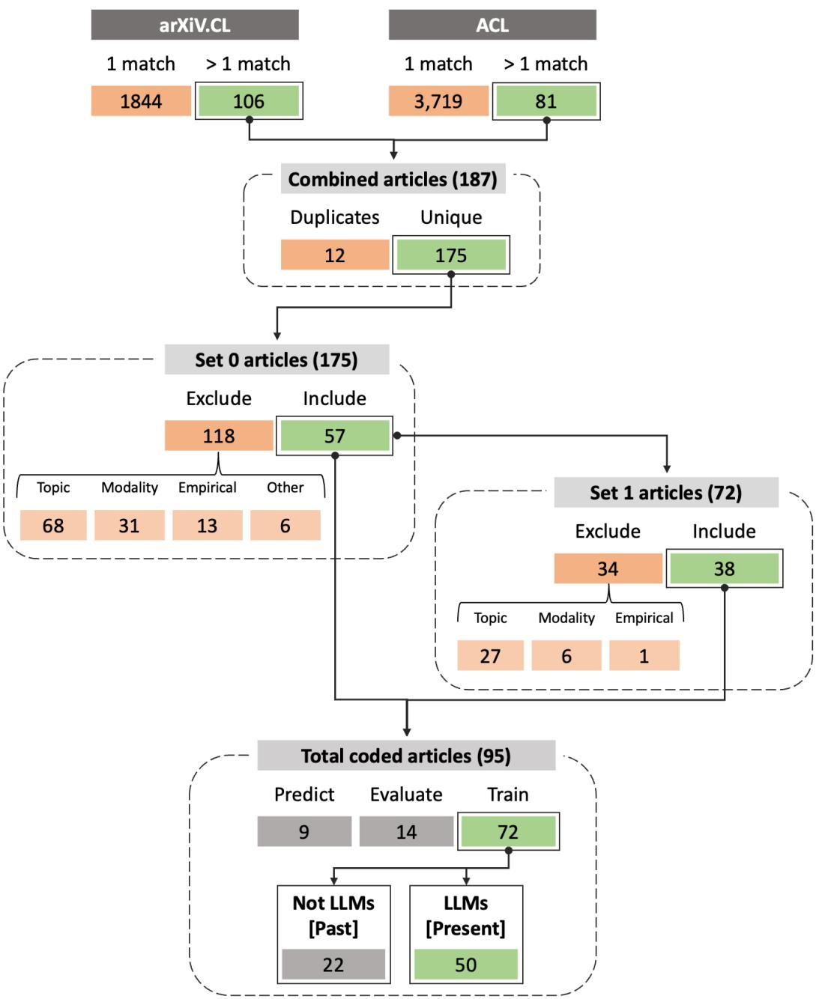

# The Past, Present and Better Future of Feedback Learning in Large Language Models for Subjective Human Preferences and Values

Hannah Rose Kirk1‡, Andrew M. Bean1, Bertie Vidgen1, Paul Röttger2, Scott A. Hale1,3 1University of Oxford, 2Bocconi University, 3Meedan ‡hannah.kirk@oii.ox.ac.uk

## Abstract

Human feedback is increasingly used to steer the behaviours of Large Language Models (LLMs). However, it is unclear how to collect and incorporate feedback in a way that is efficient, effective and unbiased, especially for highly subjective human preferences and values. In this paper, we survey existing approaches for learning from human feedback, drawing on 95 papers primarily from the ACL and arXiv repositories. First, we summarise the past, pre-LLM trends for integrating human feedback into language models. Second, we give an overview of present techniques and practices, as well as the motivations for using feedback; conceptual frameworks for defining values and preferences; and how feedback is collected and from whom. Finally, we encourage a better future of feedback learning in LLMs by raising five unresolved conceptual and practical challenges.

## 1 Introduction

Incorporating human feedback into Large Language Models (LLMs) is a welcome development to create models that are better aligned with human preferences or values, and exhibit traits such as helpfulness, honesty and harmlessness (Askell et al., 2021; Bai et al., 2022a) or safety, quality and groundedness (Thoppilan et al., 2022). However, learning from human feedback introduces new biases and challenges, and there are many unresolved questions in this fast-moving field of research. It is important to take stock of current practices, possible blindspots, and new frontiers of research, so that tangible progress can continue to be made. In this paper, we adopt the dual aim to both survey existing literature on human feedback learning, then draw on the regularities, commonalities and critiques of this survey to also provide recommendations for future work. We review 95 articles that use human feedback to steer, guide or tailor the behaviours of language models. This includes making models’ responses more coherent and engaging (Lu et al., 2022); assisting models to infer user intent (Ouyang et al., 2022); rejecting and rebutting unsafe requests (Ganguli et al., 2022; Bai et al., 2022a); or minimising the risk of hallucination (Nakano et al., 2021; Glaese et al., 2022). We source articles primarily from the ACL and arXiv repositories, coding each according to a detailed conceptual and methodological schema. Our review makes three contributions:

• The Past: We include articles released both before and after the advent of LLMs, which avoids recency bias and allows us to track developments through time.

• The Present: We summarise current practices for incorporating human feedback learning into LLMs, such as reinforcement learning fine-tuning, supervised fine-tuning, and pretraining. We also document how feedback is collected and from whom.

• The Future: We draw on the findings of our review to highlight five unresolved challenges in the field; two challenges are conceptual and three are practical. Conceptual challenges revolve around the fundamental difficulty of specifying a clear shared set of preferences and values. And, even if the conceptual challenges can be resolved, practical challenges remain for converting abstract concepts into reliable signals to guide model behaviours.

We find that current processes of incorporating human feedback into LLMs often rely on unsatisfactory simplifying assumptions about the stability, universality and objectivity of human preferences and values. What counts as a “good”, “highquality”, “preferred” or “value-aligned” output is only objective in the abstract (Kirk et al., 2023a); so, we explicitly centre our review on subjective human preferences and values because we believe most text attributes retain some degree of contextual subjectivity. With this in mind, we call for more open, democratically-grounded and interdisciplinary collaboration, supported by robust processes of external scrutiny, to decide how different voices shape current and future LLMs.

## 2 Methods

## 2.1 Selecting Articles

We use a semi-automated method, casting a wide net of keywords to retrieve articles, then manually assessing their relevance for our review (see Tab. 1 for keywords and Appendix A for a schema).

Initial set $( S _ { 0 } )$ We retrieve articles from two corpora. First, we download the ACL anthology as a .bib file. Second, we use the arXiv API with the computation and language subclass (cs.CL) to find new or industry-led preprints that are not peerreviewed but have early impact on the field. We match titles with $\geq 2$ keywords $( n = 1 8 7 )$ , and deduplicate dual-posted articles (n = 175).1

Inclusion criteria Two authors read the abstract and introduction of $S _ { 0 }$ articles, and included them if all the following questions were answered ‘yes’:

1. Topic: Does the article seek alignment or adaptation of AI systems to human preferences and values? This criterion excludes articles that functionally align aspects of language models e.g., word embedding alignment or sequence alignment.

2. Modality: Does the article discuss language agents or language as its primary modality? This criterion excludes any multimodal models, delegate agents or games-based RL.

3. Empirical: Does the article contain empirical analysis or artefacts (such as experiments, datasets or models)? This criterion excludes opinion papers, reviews or policy frameworks.   
To ensure consistency, both authors coded the same   
70 articles, finding 82% agreement in inclusion

decisions. We then discussed and refined the criteria before continuing. In total, 57 articles were included from $S _ { 0 }$

Snowballed set $( S _ { 1 } )$ To address blindspots in our keywords and corpora, we gather additional articles referenced within $S _ { 0 }$ articles, regardless of where they were published $( n = 7 2 )$ , and then reapply the inclusion criteria to ensure relevance. This results in 38 additional articles from $S _ { 1 }$

We further narrow our scope with two categorisations on the 95 articles from $S _ { 0 } + S _ { 1 }$

Dominant contribution types We categorise articles into: (i) those that evaluate or benchmark model’s capabilities, ethics or worldviews $( n =$ 14); (ii) those that predict human preferences and values from social media data using specialised models not intended for other downstream generative or classification tasks $( n = 9 )$ ; and (iii) those that train or seek to align models with a general notion of human preferred or valued text $( n = 7 2 )$ The last category is the focus of our review.2

Use of LLMs For the purposes of our review, we define LLMs as any encoder-only, decoder-only or encoder-decoder model that is pre-trained with selfsupervised learning over large internet corpora. As a rule of thumb, we consider BERT (Devlin et al., 2019) and ELMO (Peters et al., 2018) among the first LLMs; so, any articles published before 2018 fall outside our definition. Of the 72 train articles, we cover 22 articles published in the pre-LLM era in our review of The Past (§3) and 50 articles using LLMs in The Present (§4).

## 2.2 Coding Articles

We examine each article under two main themes.3 The Conceptual theme documents the motivations for collecting human feedback; the definitions of human preferences or values; whether these are understood as universal or contextual/cultural; and the level of interpretative freedom in applying preference or value concepts. The Methodological theme covers sub-categories on (i) annotation or labour force details, such as how feedback was collected and from whom; and (ii) modelling details, such as how feedback is integrated into training and evaluation phases, and the target task. We also collect procedural details on academia vs industry authorship, whether empirical artefacts (data and/or models) are publicly available, and if (to the best of our knowledge) the paper has been peer-reviewed.

<table><tr><td rowspan=1 colspan=2>Keywords</td><td rowspan=1 colspan=1>Stemmed Keywords</td></tr><tr><td rowspan=2 colspan=2>alignment, human,value, moral, ethic, feedback,reinforcement, instruction, red teaming, red-teaming,preferences, harm, honest,helpful,personalis,personaliz</td><td rowspan=2 colspan=1>align, human,value, moral, ethic, feedback, reinforc, instruct,red team, red-team, prefer, harm, honest,helpful,personalis,personaliz</td></tr><tr><td rowspan=1 colspan=1></td></tr></table>

Table 1: Keywords for retrieving articles from ACL and arXiv repositories. Highlighted keywords were not stemmed due to irrelevant matches e.g., “value” as “valu” returns many false positives including the title word “evaluation”.

## 3 The Past

In this section, we review 22 articles released between 2014-2019 that use human feedback but with older generation model architectures. Highlighting these works ensures that foundational research is adequately attributed for advancements in today’s models, and demonstrates the evolution from indirect or proxied human feedback.

## 3.1 Conceptual Classification

None of the articles released in this period seek alignment to human values. Instead, they generate text according to human preferences in machine translation (Mirkin et al., 2015; Mirkin and Meunier, 2015; Lawrence et al., 2017; Nguyen et al., 2017; Rabinovich et al., 2017; Kreutzer et al., 2018) and dialogue (Li et al., 2016; Mo et al., 2016; Li et al., 2017b; Wang et al., 2017; Liu et al., 2018; Jaques et al., 2019). Preferences are defined in both personal and universal contexts, reflecting the persistent difficulties of separating the two. Ficler and Goldberg (2017) focus on modulating formality depending on context, while others focus on the personalisation of language models, such as reflecting author personality in machine translation (Mirkin et al., 2015; Mirkin and Meunier, 2015; Rabinovich et al., 2017); providing financial recommendations via chat bots (Den Hengst et al., 2019); or enabling customised online shopping (Mo et al., 2016). Most studies target human preferences assumed to be commonly-held and stable, such as word order (Futrell and Levy, 2019), sense making (De Deyne et al., 2016; Seminck and Amsili, 2017) and vocabulary matching (Campano et al., 2014; Dubuisson Duplessis et al., 2017). In contrast, Nguyen et al. (2017) and Kreutzer et al. (2017) acknowledge the noisiness of human feedback but attempt to extract a single, unified preference.

## 3.2 Methodological Classification

Most articles use pre-transformer recurrent neural networks such as LSTMs (Hochreiter and Schmidhuber, 1997; Vaswani et al., 2017). Few articles use direct human feedback, mostly in information retrieval tasks. In two cases, humans answer a series of yes/no questions to provide a more expressive reward for reinforcement learning (RL) (Li et al., 2017a; Lawrence and Riezler, 2018). Dhingra et al. (2017) use requests for additional information to form better queries with a binary ‘success/failure’ reward. Lawrence et al. (2017) and Lawrence and Riezler (2018) compare forms of human feedback, finding cardinal feedback to be more useful than pairwise comparison.

Human feedback is an expensive and timeconsuming source of data to collect, which motivates efforts to find reliable proxies (Lawrence et al., 2017; Nguyen et al., 2017). Implicit feedback methods attempt to utilise naturally-occurring signals in human interactions, such as sentiment (Wang et al., 2017; Jaques et al., 2019) and response length (Campano et al., 2014). Other articles define rules on desirable dialogue properties, such as length (Li et al., 2016), vocabulary alignment (Dubuisson Duplessis et al., 2017), or tone (Ficler and Goldberg, 2017), and score the agent for achieving them. Only Li et al. (2016) apply RL to further train the model from the feedback.

Simulating human feedback is also a commonlyused and cost effective approach where ‘feedback’ is generated by measuring similarity to the gold standard in pre-existing, human-labelled datasets. Parallel translation corpora are a common source of gold demonstrations, e.g., translated TED talks (Mirkin et al., 2015; Mirkin and Meunier, 2015; Nguyen et al., 2017) or European Parliament speeches (Kreutzer et al., 2017; Rabinovich et al., 2017). User simulators typically use a ‘success/failure’ score for RL (Mo et al., 2016; Liu et al., 2018), while ‘gold standard’ approaches use a more complex loss function on output similarity (Mirkin and Meunier, 2015; Nguyen et al., 2017).

## 4 The Present

Turning our attention to the heart of our review, this section discusses the 50 papers that incorporate human feedback to steer LLM behaviours.

## 4.1 Conceptual Classification

We first seek to understand why human feedback is collected. The motivations for eliciting feedback form two groups. The first group generally seeks value alignment, i.e., some notion of steering language models towards producing societally-desirable text (Zhao et al., 2021; Liu et al., 2021a). We note a variety of vague goals such as to reduce “non-normative” (Peng et al., 2020) or “immoral” text (Liu et al., 2023c); to generate more “pro-social” (Liu et al., 2022) or “legitimate” text (Bakker et al., 2022); or to encourage that LLM technologies have a “positive impact on society” (Liu et al., 2023b). Specific motivations include minimising toxic or offensive language (Dinan et al., 2019; Xu et al., 2021a; Ju et al., 2022; Scheurer et al., 2022; Korbak et al., 2023); improving safety (Liu et al., 2021a; Xu et al., 2021b; Thoppilan et al., 2022; Ganguli et al., 2022; Jin et al., 2022); adapting to ethical or moral scenarios (Forbes et al., 2020; Jiang et al., 2022; Jin et al., 2022); or achieving political ideological balance (Liu et al., 2021b). The broad definitions of value alignment mostly assume some universality of value dimensions.4 However, some do seek to align LLMs to specific groups, sets of values or according to cultural context (Solaiman and Dennison, 2021; Qiu et al., 2021; Bang et al., 2022).

The second group of articles is motivated by more practical target concepts of improving model capabilities, particularly when clear optimisation metrics or programmatic rewards are lacking (Ziegler et al., 2019; Wu et al., 2021; Glaese et al., 2022; Bai et al., 2022b). Motivations often revolve around generating high-quality or human-preferred outputs (Gao et al., 2018; Böhm et al., 2019; Jaques et al., 2020; Stiennon et al., 2020; Wang et al., 2021; Scheurer et al., 2022; Nguyen et al., 2022; Xu et al., 2022), without much discussion of why this matters or whether humans agree amongst themselves what is “high-quality”. Specific target attributes include minimising repetitiveness (Arora et al., 2022); increasing coherence (Lu et al., 2022), usefulness (Liu et al., 2021a), engagingness (Gao et al., 2020; Xu et al., 2021b; Lu et al., 2022), or interest (Thoppilan et al., 2022); and producing human-like conversations (Hancock et al., 2019; Jaques et al., 2020). Some seek greater explainability and factuality in generated text (Nakano et al., 2021; Menick et al., 2022; Scheurer et al., 2022; Thoppilan et al., 2022) or correctness in code (Korbak et al., 2023). Preferences can also be elicited for customisation and personalisation (Majumder et al., 2019; Zhou et al., 2021; Deng et al., 2022).

The boundary between preference- and valuemotivated aims is not always clear-cut. Commonlyadopted mixed motivations include helpful, honest and harmless behaviours, introduced by Askell et al. (2021) and adopted by others (Bai et al., 2022b,a; Bakker et al., 2022; Menick et al., 2022). Thoppilan et al. (2022) target safety, quality and groundedness—concepts that similarly blur the lines between practical preferences and value-laden judgements. Even for instruction-tuning articles motivated by inferring user intent, what Ouyang et al. (2022) call “explicit” and “implicit” intent is synonymous with the helpfulness versus honesty/harmlessness distinction.5

## 4.2 Methodological Classification

We primarily discuss how feedback is collected (§4.2.1) and integrated into LLMs (§4.2.2). We additionally present an overview of target tasks and evaluation methods in Appendix C.

## 4.2.1 Collecting Feedback

First, we address how feedback is collected. Explicit comparisons collected on model outputs are used to reveal the preferences of human raters (Gao et al., 2018; Ziegler et al., 2019; Askell et al., 2021; Jaques et al., 2020; Stiennon et al., 2020; Ganguli et al., 2022; Glaese et al., 2022).6 More finegrained feedback includes binary or Likert scale questions on text attributes (Nakano et al., 2021;

Menick et al., 2022; Thoppilan et al., 2022); natural language comments (Ju et al., 2022; Scheurer et al., 2022); or edits (Hancock et al., 2019; Lu et al., 2022; Liu et al., 2023c). Ideal demonstrations are used to ground norm-dependent or ethical judgements (Forbes et al., 2020; Zhao et al., 2021; Pyatkin et al., 2022; Jiang et al., 2022; Jin et al., 2022), or in combination with ratings to prime model behaviour (Nakano et al., 2021; Wu et al., 2021; Ouyang et al., 2022; Bakker et al., 2022). Several articles collect negative feedback via adversarial examples (Dinan et al., 2019; Xu et al., 2021a,b; Glaese et al., 2022). Xu et al. (2022) test various feedback types including binary, free-form conversation, and fine-grained failure modes.

Human input can be further removed from directly assessing model outputs. For example, simulating feedback with an “oracle” assumed to prefer specific text attributes measured via automated metrics (Wang et al., 2021; Nguyen et al., 2022; Korbak et al., 2023) or predictions from a separate classifier (Peng et al., 2020; Liu et al., 2021b). In Bai et al. (2022b) human input defines the constitution but AI feedback is used to implement it during training. A seed of human generated examples guiding synthetic data generation also applies elsewhere (Bang et al., 2022; Castricato et al., 2022; Honovich et al., 2022; Wang et al., 2022). Other articles adopt human labels on pre-existing datasets (Böhm et al., 2019; Liu et al., 2021a; Arora et al., 2022; Jiang et al., 2022), or leverage implicit feedback data from stories (Nahian et al., 2020) and social media such as Reddit or StackOverflow (Gao et al., 2020; Askell et al., 2021; Bai et al., 2022a). Feedback can also be inferred from certain language patterns or emotive attributes in conversations with human partners (Hancock et al., 2019; Zhou et al., 2021).

Second, we address who feedback is collected from. Almost all articles use crowdworkers for training and/or evaluation, recruited from a variety of sources—including MTurk (Nahian et al., 2020; Peng et al., 2020; Jaques et al., 2020; Liu et al., 2021a,b; Qiu et al., 2021; Bai et al., 2022a; Ganguli et al., 2022; Jin et al., 2022; Xu et al., 2022; Ju et al., 2022); Upwork (Stiennon et al., 2020; Bai et al., 2022a; Ganguli et al., 2022); ScaleAI (Ouyang et al., 2022; Stiennon et al., 2020; Ziegler et al., 2019); and SurgeAI (Solaiman and Dennison, 2021; Nakano et al., 2021; Bai et al., 2022b). With ‘in-the-wild’ social media data, social media users unknowingly become the ‘raters’ (Gao et al., 2020; Askell et al., 2021; Bai et al., 2022a). Ouyang et al. (2022) include OpenAI API users as “demonstrators”. At least 13 articles rely on their authors for a variety of tasks:7 writing seeds to scale synthetic data (Honovich et al., 2022; Wang et al., 2022); hand-crafting conditioning prompts (Askell et al., 2021; Glaese et al., 2022); defining a constitution (Bai et al., 2022b); specifying topics or starter questions (Solaiman and Dennison, 2021; Bakker et al., 2022), and ethical scenarios (Zhao et al., 2021); conducting evaluation (Stiennon et al., 2020; Ganguli et al., 2022; Lu et al., 2022) or generating benchmarks (Bai et al., 2022a); and compiling training tasks for crowdworkers (Qiu et al., 2021; Glaese et al., 2022). Even without direct involvement, authors can influence feedback collection by writing annotator guidelines.

## 4.2.2 Integrating Feedback

RL with Direct Human Feedback A reward signal can first be extracted by asking actual humans about their preferences for model outputs then embedded into the LLM via RL fine-tuning. The general recipe is as follows: (Step 1): Either take an “off-the-shelf” pre-trained LLM (Lu et al., 2022); Or adapt this model via prompt-guiding (Askell et al., 2021; Bakker et al., 2022; Bai et al., 2022a; Glaese et al., 2022) or supervised finetuning and behavioural cloning over ideal demonstrations (Ziegler et al., 2019; Stiennon et al., 2020; Nakano et al., 2021; Ouyang et al., 2022; Menick et al., 2022).8 (Step 2): Generate multiple outputs from this model, and employ crowdworkers to create a comparisons dataset. (Step 3): Train a preference reward model (PM) on this feedback so “better” items are assigned higher score (Bai et al., 2022a)—either a scalar reward for a given item or an ELO score i.e., the log odds that A B (Stiennon et al., 2020; Nakano et al., 2021; Glaese et al., 2022). The PM can be pre-trained on naturally-occurring text and ratings e.g., from Reddit or Stackoverflow (Askell et al., 2021; Bai et al., 2022a). (Step 4): Fine-tune a RL policy (another LM) that generates text autoregressively, whilst the PM provides a reward signal. Often, the policy is updated using the PPO algorithm (Ziegler et al., 2019; Stiennon et al., 2020; Nakano et al., 2021) and a KL-penalty term is applied to control deviations from the base model (Jaques et al., 2019; Ziegler et al., 2019; Stiennon et al., 2020; Nakano et al., 2021; Menick et al., 2022; Ouyang et al., 2022; Liu et al., 2023c). This pipeline can be implemented in offline, online or batched settings (see Ziegler et al., 2019). Modifications to the recipe include using recursive subtasks (Wu et al., 2021); applying a rule reward model in addition to the PM to penalise undesired outputs (Glaese et al., 2022); or using the PM to re-rank or reject sample generations from the supervised model (Askell et al., 2021; Nakano et al., 2021; Glaese et al., 2022; Ganguli et al., 2022; Bai et al., 2022a; Xu et al., 2022; Bakker et al., 2022), which can match or outperform optimising a model via RL (Menick et al., 2022; Thoppilan et al., 2022).

RL with Indirect Human Feedback A reward can be inferred without directly asking humans about their preferences over model outputs. These articles skip the step of training a PM from comparisons data, and instead infer preferences from textual attributes of outputs (Jaques et al., 2020; Zhou et al., 2021). It varies how far removed the human input is, for example in designing the constitution (Bai et al., 2022a), in determining the automated metric (Nguyen et al., 2022; Korbak et al., 2023) or in compiling the word lists to measure political bias (Liu et al., 2021b). Often another model is treated as the ‘oracle’ to simulate human rewards—Gao et al. (2018), for example, simulate preferences on two summaries with perfect, noisy and logistic noisy “oracles” based on ROGUE scores; Wang et al. (2021) take the reward as human revisions from parallel machine translation corpora; while others deploy the rewards from a value, moral or toxicity classifier trained on crowdworker labels to reinforce a generator (Qiu et al., 2021; Liu et al., 2022; Castricato et al., 2022; Pyatkin et al., 2022).

Generator and Discriminator Some use a unified generator and classifier step to steer the LLM away from undesirable text (Arora et al., 2022), for example using other fine-tuned LLMs to modify the predicted probability in a base model for the next token at decoding time (Liu et al., 2021a). A combined model that functions as a generator and a discriminator can be trained sequentially (Thoppilan et al., 2022) or jointly (Lu et al., 2022).

Preference Pre-training Korbak et al. (2023) argue that incorporating human feedback in supervised or RL fine-tuning phases is suboptimal. Instead, they approach alignment in the pre-training phase of GPT-2, finding that conditional training is the most effective pre-training objective, and is more robust than later fine-tuning an already pretrained model.

Preference Fine-Tuning Human feedback can be incorporated via supervised fine-tuning (Hancock et al., 2019; Nahian et al., 2020; Jiang et al., 2022). For example, Gao et al. (2020) apply contrastive learning with a GPT-2 based dialogue model over 133M pairs of human feedback data with a loss designed to simultaneously maximise the positive sample score and minimise the negative score. Liu et al. (2023b) use “chain of hindsight” fine-tuning to include both positive and negative feedback. Fine-tuning data is often filtered relative to the value or preference goal (Solaiman and Dennison, 2021; Xu et al., 2022; Bang et al., 2022). Peng et al. (2020) instead train a reward model (normative text classifier) but this reward is applied to the loss and backpropagated during fine-tuning.

Prompting Prompting is a simple way to align LLMs with specified human preferences and values. Jin et al. (2022) cast moral situations as multi-step prompts to elicit chain of thought reasoning in InstructGPT, while Zhao et al. (2021) use zero- and few-shot prompts for responsive questioning on unethical behaviours. Askell et al. (2021) show that using a long prompt (4,600 words) from ideal author-written conversations is an effective alternative to fine-tuning in data-constrained scenarios. They also use context distillation by training a new LLM to replicate the behaviour of another LLM that is using a specific prompt.

## 5 Challenges and Recommendations for the Future

Drawing on our analysis of the reviewed papers, we identify five key challenges for future researchers. These challenges are divided into conceptual and practical issues. The conceptual challenges (C1- C3) revolve around the difficulty of specifying a clear set (or sets) of preferences and values. Even assuming the resolution of the conceptual challenges, practical challenges remain in converting conceptual ideals into empirical signals, which in turn steer language model behaviours.

(C1) Preferences and values are not universal ‘Aligning’ a language model requires a set of desired preferences or values to align with; but spec ifying such a set is an unresolved problem. One popular approach is to specify a minimal set of ostensibly unobjectionable and widely-shared val ues, such as helpfulness, honesty and harmless ness (Bai et al., 2022a,b; Thoppilan et al., 2022). However, these values are only unobjectionable be cause they are abstract and not precisely defined (Kirk et al., 2023a). These terms can be considered what Levi-Strauss and Laclau call ‘empty signi fiers’ (Lévi-Strauss, 1987; Laclau, 2005); terms that are viewed positively but are inscribed with different meanings by different people. For example, when Bai et al. (2022a) design a constitution to produce outputs as “ethical and harmless as possible”, this can have varying interpretations based on an individual’s own ethical frameworks and socio cultural background. Establishing priorities over sets of preferences or values to embed in LLMs, and ensuring consistent interpretation of conceptual meaning across people, is a persistent challenge which cannot alone be resolved via purely techni cal solutions. One possible approach is to draw on legal theory, and values protected in human rights law (Solaiman and Dennison, 2021). Translating abstract shared values into decisions is a core func tion of legal systems and legal theory offers a long history of scholarship which combines the philo sophical and practical. One approach along these lines was proposed by Kirk et al. (2023b) which applies a principle of subsidiarity to govern the per sonalisation of generative AI systems for different use cases. We also advocate for anchoring closely to existing legal systems as a matter of democratic principle: it is dangerous for moral and value judge ments with broad societal impacts to be made by small independent groups.

(C2) Preferences and values are inconsistently defined Although the terminology of ‘preferences’ and ‘values’ implies some difference between the two, the conceptual basis and normative implications of this distinction is often unclear. Colloquially, values are understood to be stronger than preferences, and potentially carry greater normative weight as guiding principles or life goals (Fischer, 2017). As such, users may have greater concerns about an LLM misaligned with their values than with their preferences; So, it is important to be clear about which is being discussed. Within the broad terms, there are many meanings: ‘preferences’ have been defined as ‘instrumental utility’ (Dubuisson Duplessis et al., 2017; Gao et al., 2018; Nguyen et al., 2022), ‘stylistic taste’ (Mirkin and Meunier, 2015; Seminck and Amsili, 2017; Jaques et al., 2020), and ‘behavioural principles (Bai et al., 2022b; Castricato et al., 2022). ‘Values’ definitions are based on ‘instrumental and intrinsic value’ (Askell et al., 2021), ‘acceptable social behaviours’ (Forbes et al., 2020; Bang et al., 2022), or ‘making decisions which are unlikely to be harmful’ (Nahian et al., 2020). The differences between individual (subjective) and global (objective) preferences is often blurred—for example, which properties of a “better” summary are universal, and which depend on subjective appreciation, like writing style and tone. Clearer definitions of preferences and values in the context of alignment would serve to motivate and clarify what we are aligning LLMs to.

(C3) Human feedback is inherently incomplete Alignment via human feedback ultimately relies on LLMs being capable of successfully generalising from few examples to new cases and domains. This is because the space of possible behaviours over which to collect feedback is prohibitively large and is not fully known. An open question is the extent to which models generalise from partial human feedback, especially when presented with data that is completely out-of-domain for their training or at the margins of its distribution. For instance, if an LLM is trained with examples of safe responses to user prompts which deny the Holocaust, it may generalise to different expressions of the same canonical request. However, it will not necessarily learn how to handle denials that the earth is round and denials of vaccine efficacy, or have domain expertise for other harmful requests, such as users who ask how to make a bomb or bio-weapon. Human values are considered to be fairly stable guiding principles that manifest similarly across situations for a given individual (Fischer, 2017) but the same generalisation cannot be guaranteed of LLMs.

Several related epistemological issues arise from technical details of the methods being used. Reinforcement learning introduces a path-dependence problem, where the particular order in which feedback is given may change the quality of the final results. As a result, it is difficult to know whether a local optimum is reached which is notably worse than the global optimum. With any form of learning from feedback, language models may also overfit or appear to be aligned externally, but have persistent internal misalignment which manifests subtly in cases more distant from the training data (Perez et al., 2022). These challenges become yet more convoluted when dealing with more complex tasks—an issue that Bowman et al. (2022) examine in their discussion of scalable oversight.

(C4) Operationalising a “good” output is difficult Even if a shared set of values could be agreed upon, converting these thick normative concepts into signals that models can use, such as by collecting annotator ratings, is hard. Complex goal operationalisation is itself a motivator for collecting feedback—when humans may not be able to articulate their preferences or write ideal demonstrations but can rate outputs, a kind of “I know it when I see it” logic. However, training with human feedback involves moving values and preferences from the abstract to particular survey or rating instruments, reinforcing differences in interpretation. To reduce disagreements, some authors write very prescriptive and/or comprehensive guidelines for the task in order to “make comparisons as unambiguous as possible” (Nakano et al., 2021, p.18). Several papers still find low inter-annotator agreement with such prescriptive approaches (Stiennon et al., 2020; Glaese et al., 2022; Bai et al., 2022a; Ouyang et al., 2022). In other cases, annotators are explicitly allowed to use their own subjective assessment, to “interpret these concepts as they see fit” (Bai et al., 2022a, p.4), but then agreement between annotators is no longer ensured. When multiple text attributes affect annotators’ preferences, it is hard to pin down what we are actually measuring. For example, Stiennon et al. (2020) and Wu et al. (2021) condition their evaluation question as “how good is this summary, given that it is X words long?”. Hypothetically, if “good” is subjective then the question should be “how good is this summary for individual Y?”. Some guidelines do ask annotators to role-play or put themselves in the shoes of others, for example to infer the intent of a prompt (Ouyang et al., 2022) or question (Nakano et al., 2021), but this may introduce further prob lems, especially for value-laden judgements where the rater may have a biased interpretation of how to apply another person’s values (Qiu et al., 2021).

To aid transparent communication, it should be clearly documented whether researchers aspire to follow the prescriptive or subjective paradigm of data annotation, rather than leaving it unspecified (Röttger et al., 2022; Kirk et al., 2023a). Increased interdisciplinary communication with practitioners in other fields would impart wisdom on measuring the perspectives and behaviours of human subjects. For example, Human-Computer Interaction literature shows how interfaces and incentives can be optimally designed to avoid participant response bias (Deng and Poole, 2010; Dell et al., 2012; Hsieh and Kocielnik, 2016); Experimental psychology and behavioural economics research show how the presentation of scales and order effects influence ratings (Friedman et al., 1994; Maeda, 2015; Westland, 2022) and that human preferences are unstable, intransitive and vulnerable to experimental artefacts (Tversky, 1969; Lacy, 2001; Chiesa and Hobbs, 2008; Lee et al., 2009; Chuang and Schechter, 2015). Researchers should consider techniques to model the noise and distribution of human feedback (Ju et al., 2022) or establish post-hoc consensus (Bakker et al., 2022), rather than ignoring disagreement by aggregating responses. However, there are trade-offs: the specific nuances and minutiae captured in fine-grained feedback might heighten biases and reduce generalisability when drawn from unrepresentative samples—which we now discuss.

(C5) Crowdworkers and social media users are neither representative nor sufficient A degree of subjectivity persists even with prescriptive guidelines and well-designed experimental instruments; So, outcomes critically depend on who is interpreting value or preference-based concepts. In the majority of articles, fewer than 100 humans are employed to guide or evaluate language model behaviours (Jaques et al., 2020; Stiennon et al., 2020; Nakano et al., 2021; Menick et al., 2022; Bai et al., 2022a; Ouyang et al., 2022; Jin et al., 2022; Pyatkin et al., 2022), which is concerning for ethically or morally ambiguous scenarios. It is striking that so few voices have so much power in shaping LLM behaviours—in Bai et al. (2022a) just 20 humans contributed 80% of the feedback data, and in Nakano et al. (2021) the top 5 humans contributed 50%. Workforces employed for evaluation are similarly small, with some employing <25 workers (Scheurer et al., 2022; Castricato et al., 2022; Gao et al., 2018; Liu et al., 2023b). Overwhelmingly, these humans are USbased, English-speaking crowdworkers with Master’s degrees and between the ages of 25-34. This results in a non-democratic and non-diverse feedback process, termed “the tyranny of crowdworker” by Kirk et al. (2023b), which has been shown to introduce political and religious biases in model behaviours (Perez et al., 2022). The limitations of relying on the subjective interpretations of a small and non-representative work force are exacerbated by inadequate documentation. Only nine out of 50 papers provided solid documentation, such as demographic breakdowns (Stiennon et al., 2020; Thoppilan et al., 2022; Bai et al., 2022a; Ganguli et al., 2022; Glaese et al., 2022; Jin et al., 2022; Liu et al., 2022; Ouyang et al., 2022; Liu et al., 2023c). Others provide high-level details of the rater pool such as number of workers, hiring platform, or aggregate demographics. The majority of articles do not document their workforce, nor discuss sample biases or annotator artefacts.

When soliciting human feedback, attempts should be made to diversify who is given a voice, such as by applying democratic or jury-based principles in how these voices are weighted (Gordon et al., 2022) and by employing bottom-up participatory approaches (Martin Jr. et al., 2020; Birhane et al., 2022; Zytko et al., 2022; Derczynski et al., 2023); Or to seek top-down sampling that better represents the population being studied (Bakker et al., 2022). Mirroring the move in other areas of NLP to document and explore annotator disagreement (Aroyo and Welty, 2015; Geva et al., 2019; Nie et al., 2020; Prabhakaran et al., 2021; Davani et al., 2022), each item of feedback should be associated with a pseudo-anonymised annotator ID. So far as privacy allows, documentation of annotator background should be provided in a data statement (Bender and Friedman, 2018).

## 6 Conclusion

This review provided an overview of incorporating human feedback into LLMs, with a focus on subjective preferences and values that lack ‘ground truth alignment’. We have witnessed two notable shifts in the field from past to present—first, a move away from specialist systems towards general purpose language agents capable of handling many NLP subtasks via instruction or open-ended dialogue;

second, more use of direct human feedback which surpasses the limitations of user simulations or automated metrics.

While the shift to incorporate human voices directly into LLM development is welcome, it introduces new challenges that require careful navigation. Some challenges are more tractable than others—for example, practitioners will always have to deal with the complexities and intricacies of unstable and idiosyncratic preferences across end users of their model, but can take practical steps to better approximate this distribution by diversifying the recruitment of feedback providers.

External scrutiny is crucial to ensure the integrity and reliability of research efforts. Our review shows that many influential papers lack open and externally-validated peer review, especially those published by big industry labs like Google DeepMind, Anthropic, Google, and OpenAI. Furthermore, the majority of reviewed papers do not release model artefacts, or only do so behind a paywalled API. To foster progress, we advocate for a greater degree of open, interdisciplinary and democratically-grounded discussion on how humans can meaningfully shape future LLM behaviours in a way which is well-bounded, operationalisable, and equitable.

## 7 Limitations

We discuss limitations associated with our review:

Applying topic exclusion We exclude articles on the basis of being unrelated to the topic of value or preference alignment, but found it consistently difficult to draw a clear distinction between articles in and out of scope. For validation purposes, we had both reviewers read a portion of the articles, and found the cases of disagreement helpful to highlight this challenge. One such example was with two articles using similar methods to approach translation which we initially classified differently, Kreutzer et al. (2017) and Lawrence et al. (2017). The papers primarily treat translation as an objective task focused on BLEU scores, which would make them out of scope. However, translation inherently involves stylistic and subjective judgements, and the methods developed seek to replicate these judgements from the training data, blurring the distinction. Honesty is another target concept with these issues—whether in-text claims are referenced is fairly black and white, but whether an end user ascribes more trust to the system because of these references is subject to idiosyncratic epistemology. We use this case to highlight the weaknesses of creating a dichotomy between subjective and objective preferences in practice.

Related NLP subfields A related issue is where to draw the line for what is and is not in scope. Some narrowing was needed to make the review focused, feasible and instrumentally useful to future practitioners. However, technically fairness and bias are values of intrinsic utility—hence their inclusion in many AI principles around the world (Jobin et al., 2019). That said, there exists a very wide and distinct literature on fairness and bias in LLMs that would be too expansive for this review (see, e.g., Chang et al., 2019; Lucy and Bamman, 2021; Abid et al., 2021; Nadeem et al., 2021; Kirk et al., 2021; Smith et al., 2022). Similarly, there are sub-literatures on other aspects of LLM behaviours—such as toxicity (Gehman et al., 2020; Welbl et al., 2021), truthfulness (Lin et al., 2022) or hallucination (Ji et al., 2022). We explicitly focus on papers that target some notion of human preferences and values in their motivations, but the challenges raised from our review can be applied to other fields which similarly suffer from subjectivity in interpretative scope—e.g., carefully deciding who the human labellers are and what guidelines govern their interpretation of concepts.

Blindspots in reviewed articles Blindspots come from a number of sources. First, keyword and corpora blindspots: We ground our initial review on articles from arXiv and ACL using a set of defined keywords. We attempt to mitigate blindspots by snowballing related and relevant articles outside our initial collection; however, it is almost certain that we have missed some papers in the field as a whole. Second, language blindspots: Our review only contains articles written in English, limited by the expertise of authors who acted as the coders. This bias however reflects the dominance of English in academic publishing in general, but English language proficiency may gatekeep the concepts and voices already contributing to LLM development. Third, community blindspots: we only look at academic papers—but issues surrounding large language model behaviours or alignment have become a hot topic of conversation on blogs and social media forums. We inherently exclude such discussions from these other stakeholder communities. Fourth, modality blindspots: there is a rich history of using RL to align models in other modalities, such as delegate agents acting in toy or game worlds (see, e.g., Christiano et al., 2017). We do not cover the insights from these related literatures. Finally, temporal blindspots: research into LLMs is a fast-paced field—in one week, there can be as many as 500 articles posted on the cs.CL subclass of arXiv. Inevitably, other influential articles have been released after the review was completed and more were released during its peer review period. A good example of this is Rafailov et al. (2023) who introduce Direct Preference Optimisation, a technique that could substantially change how people approach feedback learning in the future. Other relevant papers that appeared after the cut-off for this review include Dong et al. (2023); Hosking et al. (2023); Liu et al. (2023d,a); Song et al. (2023); Yuan et al. (2023); Wu et al. (2023); Zhou et al. (2023). With the field’s rapid developments, any review paper runs the risk of lagging behind the latest research. However, given the substantial number of articles that we did review, we expect many of the general findings and highlighted challenges to apply in upcoming future work.

External scrutiny of reviewed articles We consciously made the decision to include articles which have not yet been peer reviewed to stay ahead of the curve with early-released pre-prints and also to track industry contributions (which are often not externally peer reviewed). In the 22 papers appearing the The Past section, 18 were peer reviewed. Of the 50 papers appearing in The Present section, only 21 were clearly peer-reviewed. It is a contentious issue that many influential papers lack standard practices of external scrutiny and rigorous academic backstops, though often industry-authored papers do undergo a process of internal review before a preprint is released.

## Acknowledgements

This paper received funding from a MetaAI Dynabench grant as part of a research agenda on optimising feedback between human-and-model-in-theloop. H.R.K.’s PhD is supported by the Economic and Social Research Council grant ES/P000649/1. A.M.B.’s PhD is supported by the Clarendon Fund. P.R. received funding through the INDOMITA project (CUP number J43C22000990001) and the European Research Council (ERC) under the European Union’s Horizon 2020 research and innovation program (No. 949944, INTEGRATOR).

## References

Abubakar Abid, Maheen Farooqi, and James Zou. 2021. Persistent Anti-Muslim Bias in Large Language Models. In Proceedings ofthe 2021 AAAI/ACM Conference on AI, Ethics, and Society, AIES ’21, pages 298–306, New York, NY, USA. Association for Computing Machinery.

Kushal Arora, Kurt Shuster, Sainbayar Sukhbaatar, and Jason Weston. 2022. Director: Generator-Classifiers For Supervised Language Modeling. In Proceedings of the 2nd Conference of the Asia-Pacific Chapter ofthe Associationfor Computational Linguistics and the 12th International Joint Conference on Natural Language Processing (Volume 1: Long Papers), pages 512–526, Online only. Association for Computational Linguistics.

Lora Aroyo and Chris Welty. 2015. Truth is a lie: Crowd truth and the seven myths of human annotation. AI Magazine, 36(1):15–24.

Amanda Askell, Yuntao Bai, Anna Chen, Dawn Drain, Deep Ganguli, Tom Henighan, Andy Jones, Nicholas Joseph, Ben Mann, Nova DasSarma, Nelson Elhage, Zac Hatfield-Dodds, Danny Hernandez, Jackson Kernion, Kamal Ndousse, Catherine Olsson, Dario Amodei, Tom Brown, Jack Clark, Sam McCandlish, Chris Olah, and Jared Kaplan. 2021. A General Language Assistant as a Laboratory for Alignment. arXiv:2112.00861 [cs].

Luigi Asprino, Luana Bulla, Stefano De Giorgis, Aldo Gangemi, Ludovica Marinucci, and Misael Mongiovi. 2022. Uncovering Values: Detecting Latent Moral Content from Natural Language with Explainable and Non-Trained Methods. In Proceedings of Deep Learning Inside Out (DeeLIO 2022): The 3rd Workshop on Knowledge Extraction and Integration for Deep Learning Architectures, pages 33–41, Dublin, Ireland and Online. Association for Computational Linguistics.

Yuntao Bai, Andy Jones, Kamal Ndousse, Amanda Askell, Anna Chen, Nova DasSarma, Dawn Drain, Stanislav Fort, Deep Ganguli, Tom Henighan, Nicholas Joseph, Saurav Kadavath, Jackson Kernion, Tom Conerly, Sheer El-Showk, Nelson Elhage, Zac Hatfield-Dodds, Danny Hernandez, Tristan Hume, Scott Johnston, Shauna Kravec, Liane Lovitt, Neel Nanda, Catherine Olsson, Dario Amodei, Tom Brown, Jack Clark, Sam McCandlish, Chris Olah, Ben Mann, and Jared Kaplan. 2022a. Training a Helpful and Harmless Assistant with Reinforcement Learning from Human Feedback. arXiv: 2204.05862.

Yuntao Bai, Saurav Kadavath, Sandipan Kundu, Amanda Askell, Jackson Kernion, Andy Jones, Anna Chen, Anna Goldie, Azalia Mirhoseini, Cameron McKinnon, Carol Chen, Catherine Olsson, Christopher Olah, Danny Hernandez, Dawn Drain, Deep Ganguli, Dustin Li, Eli Tran-Johnson, Ethan Perez, Jamie Kerr, Jared Mueller, Jeffrey Ladish, Joshua

Landau, Kamal Ndousse, Kamile Lukosuite, Liane Lovitt, Michael Sellitto, Nelson Elhage, Nicholas Schiefer, Noemi Mercado, Nova DasSarma, Robert Lasenby, Robin Larson, Sam Ringer, Scott Johnston, Shauna Kravec, Sheer El Showk, Stanislav Fort, Tamera Lanham, Timothy Telleen-Lawton, Tom Conerly, Tom Henighan, Tristan Hume, Samuel R. Bowman, Zac Hatfield-Dodds, Ben Mann, Dario Amodei, Nicholas Joseph, Sam McCandlish, Tom Brown, and Jared Kaplan. 2022b. Constitutional AI: Harmlessness from AI Feedback. arXiv: 2212.08073.

Michiel A. Bakker, Martin J. Chadwick, Hannah R. Sheahan, Michael Henry Tessler, Lucy Campbell-Gillingham, Jan Balaguer, Nat McAleese, Amelia Glaese, John Aslanides, Matthew M. Botvinick, and Christopher Summerfield. 2022. Fine-tuning language models to find agreement among humans with diverse preferences. arXiv: 2211.15006v1.

Yejin Bang, Tiezheng Yu, Andrea Madotto, Zhaojiang Lin, Mona Diab, and Pascale Fung. 2022. Enabling Classifiers to Make Judgements Explicitly Aligned with Human Values. arXiv: 2210.07652v1.

Emily M Bender and Batya Friedman. 2018. Data statements for natural language processing: Toward mitigating system bias and enabling better science. Transactions of the Association for Computational Linguistics, 6:587–604.

Abeba Birhane, William Isaac, Vinodkumar Prabhakaran, Mark Diaz, Madeleine Clare Elish, Iason Gabriel, and Shakir Mohamed. 2022. Power to the People? Opportunities and Challenges for Participatory AI. In Equity and Access in Algorithms, Mechanisms, and Optimization, EAAMO ’22, pages 1–8, New York, NY, USA. Association for Computing Machinery.

Samuel R. Bowman, Jeeyoon Hyun, Ethan Perez, Edwin Chen, Craig Pettit, Scott Heiner, Kamile Lukoši˙ ut¯ e,˙ Amanda Askell, Andy Jones, Anna Chen, Anna Goldie, Azalia Mirhoseini, Cameron McKinnon, Christopher Olah, Daniela Amodei, Dario Amodei, Dawn Drain, Dustin Li, Eli Tran-Johnson, Jackson Kernion, Jamie Kerr, Jared Mueller, Jeffrey Ladish, Joshua Landau, Kamal Ndousse, Liane Lovitt, Nelson Elhage, Nicholas Schiefer, Nicholas Joseph, Noemí Mercado, Nova DasSarma, Robin Larson, Sam McCandlish, Sandipan Kundu, Scott Johnston, Shauna Kravec, Sheer El Showk, Stanislav Fort, Timothy Telleen-Lawton, Tom Brown, Tom Henighan, Tristan Hume, Yuntao Bai, Zac Hatfield-Dodds, Ben Mann, and Jared Kaplan. 2022. Measuring Progress on Scalable Oversight for Large Language Models. arXiv:2211.03540 [cs].

Florian Böhm, Yang Gao, Christian M. Meyer, Ori Shapira, Ido Dagan, and Iryna Gurevych. 2019. Better Rewards Yield Better Summaries: Learning to Summarise Without References. In Proceedings of the 2019 Conference on Empirical Methods in Natural Language Processing and the 9th International Joint Conference on Natural Language Processing

(EMNLP-IJCNLP), pages 3110–3120, Hong Kong, China. Association for Computational Linguistics.

Sabrina Campano, Jessica Durand, and Chloé Clavel. 2014. Comparative analysis of verbal alignment in human-human and human-agent interactions. In Proceedings of the Ninth International Conference on Language Resources and Evaluation (LREC’14), pages 4415–4422, Reykjavik, Iceland. European Language Resources Association (ELRA).

Louis Castricato, Alexander Havrilla, Shahbuland Matiana, Michael Pieler, Anbang Ye, Ian Yang, Spencer Frazier, and Mark Riedl. 2022. Robust preference learning for storytelling via contrastive reinforcement learning. arXiv: 2210.07792v2 [cs.CL].

Kai-Wei Chang, Vinodkumar Prabhakaran, and Vicente Ordonez. 2019. Bias and fairness in natural language processing. In Proceedings ofthe 2019 Conference on Empirical Methods in Natural Language Processing and the 9th International Joint Conference on Natural Language Processing (EMNLP-IJCNLP): Tutorial Abstracts.

Mecca Chiesa and Sandy Hobbs. 2008. Making sense of social research: How useful is the hawthorne effect? European Journal of Social Psychology, 38(1):67– 74.

Paul F Christiano, Jan Leike, Tom Brown, Miljan Martic, Shane Legg, and Dario Amodei. 2017. Deep reinforcement learning from human preferences. Ad vances in neural information processing systems, 30.

Yating Chuang and Laura Schechter. 2015. Stability of experimental and survey measures of risk, time, and social preferences: A review and some new results. Journal ofdevelopment economics, 117:151–170.

Aida Mostafazadeh Davani, Mark Díaz, and Vinodkumar Prabhakaran. 2022. Dealing with disagreements: Looking beyond the majority vote in subjective annotations. Transactions ofthe Associationfor Computational Linguistics, 10:92–110.

Simon De Deyne, Amy Perfors, and Daniel J Navarro. 2016. Predicting human similarity judgments with distributional models: The value of word associations. In Proceedings of COLING 2016, the 26th International Conference on Computational Linguistics: Technical Papers, pages 1861–1870, Osaka, Japan. The COLING 2016 Organizing Committee.

Nicola Dell, Vidya Vaidyanathan, Indrani Medhi, Edward Cutrell, and William Thies. 2012. " yours is better!" participant response bias in hci. In Proceedings of the sigchi conference on human factors in computing systems, pages 1321–1330.

Floris Den Hengst, Mark Hoogendoorn, Frank Van Harmelen, and Joost Bosman. 2019. Reinforcement learning for personalized dialogue management. In IEEE/WIC/ACM International Conference on Web Intelligence, pages 59–67.

Liqiong Deng and Marshall Scott Poole. 2010. Affect in web interfaces: A study of the impacts of web page visual complexity and order. Mis Quarterly, pages 711–730.

Yang Deng, Yaliang Li, Wenxuan Zhang, Bolin Ding, and Wai Lam. 2022. Toward personalized answer generation in e-commerce via multi-perspective preference modeling. ACM Transactions on Information Systems (TOIS), 40(4):1–28.

Leon Derczynski, Hannah Rose Kirk, Vidhisha Balachandran, Sachin Kumar, Yulia Tsvetkov, M. R. Leiser, and Saif Mohammad. 2023. Assessing Language Model Deployment with Risk Cards. arXiv:2303.18190 [cs].

Jacob Devlin, Ming-Wei Chang, Kenton Lee, and Kristina Toutanova. 2019. BERT: Pre-training of Deep Bidirectional Transformers for Language Understanding. arXiv:1810.04805 [cs].

Bhuwan Dhingra, Lihong Li, Xiujun Li, Jianfeng Gao, Yun-Nung Chen, Faisal Ahmed, and Li Deng. 2017. Towards End-to-End Reinforcement Learning of Dialogue Agents for Information Access. In Proceedings of the 55th Annual Meeting of the Association for Computational Linguistics (Volume 1: Long Papers), pages 484–495, Vancouver, Canada. Association for Computational Linguistics.

Emily Dinan, Samuel Humeau, Bharath Chintagunta, and Jason Weston. 2019. Build it Break it Fix it for Dialogue Safety: Robustness from Adversarial Human Attack. arXiv:1908.06083 [cs].

Hanze Dong, Wei Xiong, Deepanshu Goyal, Yihan Zhang, Winnie Chow, Rui Pan, Shizhe Diao, Jipeng Zhang, Kashun Shum, and Tong Zhang. 2023. RAFT: Reward rAnked FineTuning for Generative Foundation Model Alignment. arXiv: 2304.06767.

Guillaume Dubuisson Duplessis, Chloé Clavel, and Frédéric Landragin. 2017. Automatic Measures to Characterise Verbal Alignment in Human-Agent Interaction. In Proceedings ofthe 18th Annual SIGdial Meeting on Discourse and Dialogue, pages 71–81, Saarbrücken, Germany. Association for Computational Linguistics.

Jessica Ficler and Yoav Goldberg. 2017. Controlling Linguistic Style Aspects in Neural Language Generation. In Proceedings of the Workshop on Stylistic Variation, pages 94–104, Copenhagen, Denmark. Association for Computational Linguistics.

Ronald Fischer. 2017. Personality, Values, Culture. In Personality, Values, Culture: An Evolutionary Approach, Culture and Psychology, pages i–ii. Cambridge University Press, Cambridge.

Maxwell Forbes, Jena D. Hwang, Vered Shwartz, Maarten Sap, and Yejin Choi. 2020. Social Chemistry 101: Learning to Reason about Social and Moral Norms. In Proceedings of the 2020 Conference on Empirical Methods in Natural Language Processing

(EMNLP), pages 653–670, Online. Association for Computational Linguistics.

Hershey H Friedman, Paul J Herskovitz, and Simcha Pollack. 1994. The biasing effects of scale-checking styles on response to a likert scale. In Proceedings of the American statistical association annual conference: survey research methods, volume 792, pages 792–795.

Richard Futrell and Roger P. Levy. 2019. Do RNNs learn human-like abstract word order preferences? In Proceedings of the Society for Computation in Linguistics (SCiL) 2019, pages 50–59.

Deep Ganguli, Liane Lovitt, Jackson Kernion, Amanda Askell, Yuntao Bai, Saurav Kadavath, Ben Mann, Ethan Perez, Nicholas Schiefer, Kamal Ndousse, Andy Jones, Sam Bowman, Anna Chen, Tom Conerly, Nova DasSarma, Dawn Drain, Nelson Elhage, Sheer El-Showk, Stanislav Fort, Zac Hatfield-Dodds, Tom Henighan, Danny Hernandez, Tristan Hume, Josh Jacobson, Scott Johnston, Shauna Kravec, Catherine Olsson, Sam Ringer, Eli Tran-Johnson, Dario Amodei, Tom Brown, Nicholas Joseph, Sam McCandlish, Chris Olah, Jared Kaplan, and Jack Clark. 2022. Red Teaming Language Models to Reduce Harms: Methods, Scaling Behaviors, and Lessons Learned. arXiv: 2209.07858v2.

Xiang Gao, Yizhe Zhang, Michel Galley, Chris Brockett, and Bill Dolan. 2020. Dialogue Response Ranking Training with Large-Scale Human Feedback Data. In Proceedings of the 2020 Conference on Empirical Methods in Natural Language Processing (EMNLP), pages 386–395, Online. Association for Computational Linguistics.

Yang Gao, Christian M. Meyer, and Iryna Gurevych. 2018. APRIL: Interactively learning to summarise by combining active preference learning and reinforcement learning. In Proceedings ofthe 2018 conference on empirical methods in natural language processing, pages 4120–4130, Brussels, Belgium. Association for Computational Linguistics.

Samuel Gehman, Suchin Gururangan, Maarten Sap, Yejin Choi, and Noah A. Smith. 2020. RealToxicityPrompts: Evaluating Neural Toxic Degeneration in Language Models. In Findings of the Association for Computational Linguistics: EMNLP 2020, pages 3356–3369, Online. Association for Computational Linguistics.

Mor Geva, Yoav Goldberg, and Jonathan Berant. 2019. Are we modeling the task or the annotator? an investigation of annotator bias in natural language understanding datasets. In Proceedings ofthe 2019 Conference on Empirical Methods in Natural Language Processing and the 9th International Joint Conference on Natural Language Processing (EMNLP-IJCNLP), pages 1161–1166.

Amelia Glaese, Nat McAleese, Maja Tr˛ebacz, John Aslanides, Vlad Firoiu, Timo Ewalds, Maribeth Rauh,

Laura Weidinger, Martin Chadwick, Phoebe Thacker, Lucy Campbell-Gillingham, Jonathan Uesato, Po-Sen Huang, Ramona Comanescu, Fan Yang, Abigail See, Sumanth Dathathri, Rory Greig, Charlie Chen, Doug Fritz, Jaume Sanchez Elias, Richard Green, Sona Mokrá, Nicholas Fernando, Boxi Wu, Rachelˇ Foley, Susannah Young, Iason Gabriel, William Isaac, John Mellor, Demis Hassabis, Koray Kavukcuoglu, Lisa Anne Hendricks, and Geoffrey Irving. 2022. Improving alignment of dialogue agents via targeted human judgements. arXiv: 2209.14375v1.

Mitchell L Gordon, Michelle S Lam, Joon Sung Park, Kayur Patel, Jeff Hancock, Tatsunori Hashimoto, and Michael S Bernstein. 2022. Jury learning: Integrating dissenting voices into machine learning models. In Proceedings ofthe 2022 CHI Conference on Human Factors in Computing Systems, pages 1–19.

David Gros, Yu Li, and Zhou Yu. 2021. The R-U-A-Robot Dataset: Helping Avoid Chatbot Deception by Detecting User Questions About Human or Non-Human Identity. In Proceedings ofthe 59th Annual Meeting of the Association for Computational Linguistics and the 11th International Joint Conference on Natural Language Processing (Volume 1: Long Papers), pages 6999–7013, Online. Association for Computational Linguistics.

Braden Hancock, Antoine Bordes, Pierre-Emmanuel Mazare, and Jason Weston. 2019. Learning from Dialogue after Deployment: Feed Yourself, Chatbot! In Proceedings of the 57th Annual Meeting of the Association for Computational Linguistics, pages 3667–3684, Florence, Italy. Association for Computational Linguistics.

Dan Hendrycks, Collin Burns, Steven Basart, Andrew Critch, Jerry Li, Dawn Song, and Jacob Steinhardt. 2020. Aligning AI With Shared Human Values. arXiv: 2008.02275v5.

Sepp Hochreiter and Jürgen Schmidhuber. 1997. Long Short-term Memory. Neural computation, 9:1735– 80.

Or Honovich, Thomas Scialom, Omer Levy, and Timo Schick. 2022. Unnatural Instructions: Tuning Language Models with (Almost) No Human Labor. arXiv: 2212.09689v1.

Joe Hoover, Gwenyth Portillo-Wightman, Leigh Yeh, Shreya Havaldar, Aida Mostafazadeh Davani, Ying Lin, Brendan Kennedy, Mohammad Atari, Zahra Kamel, Madelyn Mendlen, Gabriela Moreno, Christina Park, Tingyee E. Chang, Jenna Chin, Christian Leong, Jun Yen Leung, Arineh Mirinjian, and Morteza Dehghani. 2020. Moral Foundations Twitter Corpus: A Collection of 35k Tweets Annotated for Moral Sentiment. Social Psychological and Personality Science, 11(8):1057–1071. Publisher: SAGE Publications Inc.

Tom Hosking, Phil Blunsom, and Max Bartolo. 2023. Human Feedback is not Gold Standard. arXiv: 2309.16349.

Gary Hsieh and Rafał Kocielnik. 2016. You get who you pay for: The impact of incentives on participation bias. In Proceedings of the 19th ACM conference on computer-supported cooperative work & social computing, pages 823–835.

Xiaolei Huang, Alexandra Wormley, and Adam Cohen. 2022. Learning to Adapt Domain Shifts of Moral Values via Instance Weighting. arXiv: 2204.07603v2.

Natasha Jaques, Asma Ghandeharioun, Judy Hanwen Shen, Craig Ferguson, Agata Lapedriza, Noah Jones, Shixiang Gu, and Rosalind Picard. 2019. Way Off-Policy Batch Deep Reinforcement Learning of Implicit Human Preferences in Dialog. arXiv:1907.00456 [cs, stat].

Natasha Jaques, Judy Hanwen Shen, Asma Ghandeharioun, Craig Ferguson, Agata Lapedriza, Noah Jones, Shixiang Gu, and Rosalind Picard. 2020. Humancentric dialog training via offline reinforcement learning. In Proceedings of the 2020 conference on empirical methods in natural language processing (EMNLP), pages 3985–4003, Online. Association for Computational Linguistics.

Sophie Jentzsch, Patrick Schramowski, Constantin Rothkopf, and Kristian Kersting. 2019. Semantics Derived Automatically from Language Corpora Contain Human-like Moral Choices. In Proceedings of the 2019 AAAI/ACM Conference on AI, Ethics, and Society, AIES ’19, pages 37–44, New York, NY, USA. Association for Computing Machinery.

Ziwei Ji, Nayeon Lee, Rita Frieske, Tiezheng Yu, Dan Su, Yan Xu, Etsuko Ishii, Yejin Bang, Andrea Madotto, and Pascale Fung. 2022. Survey of Hallucination in Natural Language Generation.

Liwei Jiang, Jena D. Hwang, Chandra Bhagavatula, Ronan Le Bras, Jenny Liang, Jesse Dodge, Keisuke Sakaguchi, Maxwell Forbes, Jon Borchardt, Saadia Gabriel, Yulia Tsvetkov, Oren Etzioni, Maarten Sap, Regina Rini, and Yejin Choi. 2022. Can Machines Learn Morality? The Delphi Experiment. arXiv:2110.07574 [cs].

Zhijing Jin, Sydney Levine, Fernando Gonzalez, Ojasv Kamal, Maarten Sap, Mrinmaya Sachan, Rada Mihalcea, Josh Tenenbaum, and Bernhard Schölkopf. 2022. When to Make Exceptions: Exploring Language Models as Accounts of Human Moral Judgment. arXiv: 2210.01478v3.

Anna Jobin, Marcello Ienca, and Effy Vayena. 2019. The global landscape of ai ethics guidelines. Nature Machine Intelligence, 1(9):389–399.

Da Ju, Jing Xu, Y.-Lan Boureau, and Jason Weston. 2022. Learning from data in the mixed adversarial non-adversarial case: Finding the helpers and ignoring the trolls. arXiv:2208.03295 [cs].

Johannes Kiesel, Milad Alshomary, Nicolas Handke, Xiaoni Cai, Henning Wachsmuth, and Benno Stein.

2022. Identifying the Human Values behind Arguments. In Proceedings of the 60th Annual Meeting of the Associationfor Computational Linguistics (Volume 1: Long Papers), pages 4459–4471, Dublin, Ireland. Association for Computational Linguistics.

Hannah Rose Kirk, Yennie Jun, Filippo Volpin, Haider Iqbal, Elias Benussi, Frederic Dreyer, Aleksandar Shtedritski, and Yuki Asano. 2021. Bias Out-of-the-Box: An Empirical Analysis of Intersectional Occupational Biases in Popular Generative Language Models. In Advances in Neural Information Processing Systems, volume 34, pages 2611–2624.

Hannah Rose Kirk, Bertie Vidgen, Paul Röttger, and Scott A. Hale. 2023a. The Empty Signifier Problem: Towards Clearer Paradigms for Operationalising "Alignment" in Large Language Models. arXiv: 2310.02457.

Hannah Rose Kirk, Bertie Vidgen, Paul Röttger, and Scott A. Hale. 2023b. Personalisation within bounds: A risk taxonomy and policy framework for the alignment of large language models with personalised feedback. arXiv:2303.05453.

Tomasz Korbak, Kejian Shi, Angelica Chen, Rasika Bhalerao, Christopher L. Buckley, Jason Phang, Samuel R. Bowman, and Ethan Perez. 2023. Pretraining Language Models with Human Preferences. arXiv:2302.08582 [cs].

Julia Kreutzer, Artem Sokolov, and Stefan Riezler. 2017. Bandit Structured Prediction for Neural Sequenceto-Sequence Learning. In Proceedings of the 55th Annual Meeting of the Association for Computational Linguistics (Volume 1: Long Papers), pages 1503– 1513, Vancouver, Canada. Association for Computational Linguistics.

Julia Kreutzer, Joshua Uyheng, and Stefan Riezler. 2018. Reliability and Learnability of Human Bandit Feedback for Sequence-to-Sequence Reinforcement Learning. In Proceedings of the 56th Annual Meeting of the Association for Computational Linguistics (Volume 1: Long Papers), pages 1777–1788, Melbourne, Australia. Association for Computational Linguistics.

Ernesto Laclau. 2005. On populist reason. Verso, London New York (N.Y.).

Dean Lacy. 2001. A theory of nonseparable preferences in survey responses. American Journal of Political Science, pages 239–258.

Carolin Lawrence and Stefan Riezler. 2018. Improving a Neural Semantic Parser by Counterfactual Learning from Human Bandit Feedback. In Proceedings of the 56th Annual Meeting of the Association for Computational Linguistics (Volume 1: Long Papers), pages 1820–1830, Melbourne, Australia. Association for Computational Linguistics.

Carolin Lawrence, Artem Sokolov, and Stefan Riezler. 2017. Counterfactual Learning from Bandit Feedback under Deterministic Logging : A Case Study in

Statistical Machine Translation. In Proceedings of the 2017 Conference on Empirical Methods in Natural Language Processing, pages 2566–2576, Copenhagen, Denmark. Association for Computational Linguistics.

Leonard Lee, On Amir, and Dan Ariely. 2009. In search of homo economicus: Cognitive noise and the role of emotion in preference consistency. Journal of consumer research, 36(2):173–187.

Jiwei Li, Alexander H. Miller, Sumit Chopra, Marc’Aurelio Ranzato, and Jason Weston. 2017a. Dialogue Learning With Human-In-The-Loop. arXiv:1611.09823 [cs].

Jiwei Li, Alexander H. Miller, Sumit Chopra, Marc’Aurelio Ranzato, and Jason Weston. 2017b. Learning through Dialogue Interactions by Asking Questions. arXiv:1612.04936 [cs].

Jiwei Li, Will Monroe, Alan Ritter, Dan Jurafsky, Michel Galley, and Jianfeng Gao. 2016. Deep Reinforcement Learning for Dialogue Generation. In Proceedings ofthe 2016 Conference on Empirical Methods in Natural Language Processing, pages 1192– 1202, Austin, Texas. Association for Computational Linguistics.

Manling Li, Ying Lin, Joseph Hoover, Spencer Whitehead, Clare Voss, Morteza Dehghani, and Heng Ji. 2019. Multilingual Entity, Relation, Event and Human Value Extraction. In Proceedings of the 2019 Conference of the North American Chapter of the Association for Computational Linguistics (Demonstrations), pages 110–115, Minneapolis, Minnesota. Association for Computational Linguistics.

Stephanie Lin, Jacob Hilton, and Owain Evans. 2022. TruthfulQA: Measuring How Models Mimic Human Falsehoods. In Proceedings ofthe 60th Annual Meeting ofthe Associationfor Computational Linguistics (Volume 1: Long Papers), pages 3214–3252, Dublin, Ireland. Association for Computational Linguistics.

Ying Lin, Joe Hoover, Morteza Dehghani, Marlon Mooijman, and Heng Ji. 2017. Acquiring Background Knowledge to Improve Moral Value Prediction. arXiv: 1709.05467v1.

Alisa Liu, Maarten Sap, Ximing Lu, Swabha Swayamdipta, Chandra Bhagavatula, Noah A. Smith, and Yejin Choi. 2021a. DExperts: Decoding-Time Controlled Text Generation with Experts and Anti-Experts. In Proceedings of the 59th Annual Meeting ofthe Associationfor Computational Linguistics and the 11th International Joint Conference on Natural Language Processing (Volume 1: Long Papers), pages 6691–6706, Online. Association for Computational Linguistics.

Bing Liu, Gokhan Tür, Dilek Hakkani-Tür, Pararth Shah, and Larry Heck. 2018. Dialogue Learning with Human Teaching and Feedback in End-to-End

Trainable Task-Oriented Dialogue Systems. In Proceedings of the 2018 Conference of the North American Chapter ofthe Associationfor Computational Linguistics: Human Language Technologies, Volume 1 (Long Papers), pages 2060–2069, New Orleans, Louisiana. Association for Computational Linguistics.

Hao Liu, Carmelo Sferrazza, and Pieter Abbeel. 2023a. Chain of Hindsight Aligns Language Models with Feedback. arXiv: 2302.02676.

Hao Liu, Carmelo Sferrazza, and Pieter Abbeel. 2023b. Languages are rewards: Chain of hindsight finetuning using human feedback. arXiv: 2302.02676v2 [cs.LG].

Ruibo Liu, Chenyan Jia, Jason Wei, Guangxuan Xu, Lili Wang, and Soroush Vosoughi. 2021b. Mitigating Political Bias in Language Models through Reinforced Calibration. Proceedings of the AAAI Conference on Artificial Intelligence, 35(17):14857–14866. Number: 17.

Ruibo Liu, Chenyan Jia, Ge Zhang, Ziyu Zhuang, Tony X. Liu, and Soroush Vosoughi. 2023c. Second Thoughts are Best: Learning to Re-Align With Human Values from Text Edits. arXiv: 2301.00355v2.

Ruibo Liu, Ruixin Yang, Chenyan Jia, Ge Zhang, Denny Zhou, Andrew M. Dai, Diyi Yang, and Soroush Vosoughi. 2023d. Training Socially Aligned Language Models in Simulated Human Society. arXiv: 2305.16960.

Ruibo Liu, Ge Zhang, Xinyu Feng, and Soroush Vosoughi. 2022. Aligning Generative Language Models with Human Values. In Findings of the Associationfor Computational Linguistics: NAACL 2022, pages 241–252, Seattle, United States. Association for Computational Linguistics.

Nicholas Lourie, Ronan Le Bras, and Yejin Choi. 2021. SCRUPLES: A Corpus of Community Ethical Judgments on 32,000 Real-Life Anecdotes. Proceedings of the AAAI Conference on Artificial Intelligence, 35(15):13470–13479. Number: 15.

Hua Lu, Siqi Bao, Huang He, Fan Wang, Hua Wu, and Haifeng Wang. 2022. Towards Boosting the Open-Domain Chatbot with Human Feedback. arXiv: 2208.14165v1.

Li Lucy and David Bamman. 2021. Gender and Representation Bias in GPT-3 Generated Stories. In Proceedings of the Third Workshop on Narrative Understanding, pages 48–55, Virtual. Association for Computational Linguistics.

Claude Lévi-Strauss. 1987. Introduction to the work of Marcel Mauss. Routledge & Kegan Paul, London.

Hotaka Maeda. 2015. Response option configuration of online administered likert scales. International Journal of Social Research Methodology, 18(1):15– 26.

Tushar Maheshwari, Aishwarya N. Reganti, Samiksha Gupta, Anupam Jamatia, Upendra Kumar, Björn Gambäck, and Amitava Das. 2017. A Societal Sentiment Analysis: Predicting the Values and Ethics of Individuals by Analysing Social Media Content. In Proceedings ofthe 15th Conference ofthe European Chapter ofthe Associationfor Computational Linguistics: Volume 1, Long Papers, pages 731–741, Valencia, Spain. Association for Computational Linguistics.

Bodhisattwa Prasad Majumder, Shuyang Li, Jianmo Ni, and Julian McAuley. 2019. Generating personalized recipes from historical user preferences. In Proceedings of the 2019 conference on empirical methods in natural language processing and the 9th international joint conference on natural language processing (EMNLP-IJCNLP), pages 5976–5982, Hong Kong, China. Association for Computational Linguistics.

Donald Martin Jr., Vinodkumar Prabhakaran, Jill Kuhlberg, Andrew Smart, and William S. Isaac. 2020. Participatory Problem Formulation for Fairer Machine Learning Through Community Based System Dynamics. arXiv:2005.07572 [cs, stat].

Jacob Menick, Maja Trebacz, Vladimir Mikulik, John Aslanides, Francis Song, Martin Chadwick, Mia Glaese, Susannah Young, Lucy Campbell-Gillingham, Geoffrey Irving, and Nat McAleese. 2022. Teaching language models to support answers with verified quotes. arXiv:2203.11147 [cs].

Shachar Mirkin and Jean-Luc Meunier. 2015. Personalized machine translation: Predicting translational preferences. In Proceedings ofthe 2015 conference on empirical methods in natural language processing, pages 2019–2025, Lisbon, Portugal. Association for Computational Linguistics.

Shachar Mirkin, Scott Nowson, Caroline Brun, and Julien Perez. 2015. Motivating Personality-aware Machine Translation. In Proceedings of the 2015 Conference on Empirical Methods in Natural Language Processing, pages 1102–1108, Lisbon, Portugal. Association for Computational Linguistics.

Nailia Mirzakhmedova, Johannes Kiesel, Milad Alshomary, Maximilian Heinrich, Nicolas Handke, Xiaoni Cai, Barriere Valentin, Doratossadat Dastgheib, Omid Ghahroodi, Mohammad Ali Sadraei, Ehsaneddin Asgari, Lea Kawaletz, Henning Wachsmuth, and Benno Stein. 2023. The touché23-ValueEval dataset for identifying human values behind arguments. arXiv: 2301.13771v1 [cs.CL].

Kaixiang Mo, Shuangyin Li, Yu Zhang, Jiajun Li, and Qiang Yang. 2016. Personalizing a dialogue system with transfer reinforcement learning. arXiv: 1610.02891v3 [cs.AI].

Moin Nadeem, Anna Bethke, and Siva Reddy. 2021. StereoSet: Measuring stereotypical bias in pretrained language models. In Proceedings ofthe 59th Annual

Meeting of the Association for Computational Linguistics and the 11th International Joint Conference on Natural Language Processing (Volume 1: Long Papers), pages 5356–5371, Online. Association for Computational Linguistics.

Md Sultan Al Nahian, Spencer Frazier, Mark Riedl, and Brent Harrison. 2020. Learning norms from stories: A prior for value aligned agents. In Proceedings of the AAAI/ACM Conference on AI, Ethics, and Society, pages 124–130.

Reiichiro Nakano, Jacob Hilton, Suchir Balaji, Jeff Wu, Long Ouyang, Christina Kim, Christopher Hesse, Shantanu Jain, Vineet Kosaraju, William Saunders, Xu Jiang, Karl Cobbe, Tyna Eloundou, Gretchen Krueger, Kevin Button, Matthew Knight, Benjamin Chess, and John Schulman. 2021. WebGPT: Browser-assisted question-answering with human feedback. arXiv: 2112.09332v3.

Duy-Hung Nguyen, Nguyen Viet Dung Nghiem, Bao-Sinh Nguyen, Dung Tien Tien Le, Shahab Sabahi, Minh-Tien Nguyen, and Hung Le. 2022. Make The Most of Prior Data: A Solution for Interactive Text Summarization with Preference Feedback. In Findings of the Association for Computational Linguistics: NAACL 2022, pages 1919–1930, Seattle, United States. Association for Computational Linguistics.

Khanh Nguyen, Hal Daumé III, and Jordan Boyd-Graber. 2017. Reinforcement Learning for Bandit Neural Machine Translation with Simulated Human Feedback. In Proceedings ofthe 2017 Conference on Empirical Methods in Natural Language Processing, pages 1464–1474, Copenhagen, Denmark. Association for Computational Linguistics.

Yixin Nie, Xiang Zhou, and Mohit Bansal. 2020. What can we learn from collective human opinions on natural language inference data? In Proceedings ofthe 2020 Conference on Empirical Methods in Natural Language Processing (EMNLP), pages 9131–9143.

Long Ouyang, Jeff Wu, Xu Jiang, Diogo Almeida, Carroll L. Wainwright, Pamela Mishkin, Chong Zhang, Sandhini Agarwal, Katarina Slama, Alex Ray, John Schulman, Jacob Hilton, Fraser Kelton, Luke Miller, Maddie Simens, Amanda Askell, Peter Welinder, Paul Christiano, Jan Leike, and Ryan Lowe. 2022. Training language models to follow instructions with human feedback. arXiv: 2203.02155v1.

Xiangyu Peng, Siyan Li, Spencer Frazier, and Mark Riedl. 2020. Reducing Non-Normative Text Generation from Language Models. In Proceedings of the 13th International Conference on Natural Language Generation, pages 374–383, Dublin, Ireland. Association for Computational Linguistics.

Ethan Perez, Sam Ringer, Kamile Lukoši˙ ut¯ e, Karina˙ Nguyen, Edwin Chen, Scott Heiner, Craig Pettit, Catherine Olsson, Sandipan Kundu, Saurav Kadavath, Andy Jones, Anna Chen, Ben Mann, Brian Israel, Bryan Seethor, Cameron McKinnon, Christopher Olah, Da Yan, Daniela Amodei, Dario Amodei,

Dawn Drain, Dustin Li, Eli Tran-Johnson, Guro Khundadze, Jackson Kernion, James Landis, Jamie Kerr, Jared Mueller, Jeeyoon Hyun, Joshua Landau, Kamal Ndousse, Landon Goldberg, Liane Lovitt, Martin Lucas, Michael Sellitto, Miranda Zhang, Neerav Kingsland, Nelson Elhage, Nicholas Joseph, Noemí Mercado, Nova DasSarma, Oliver Rausch, Robin Larson, Sam McCandlish, Scott Johnston, Shauna Kravec, Sheer El Showk, Tamera Lanham, Timothy Telleen-Lawton, Tom Brown, Tom Henighan, Tristan Hume, Yuntao Bai, Zac Hatfield-Dodds, Jack Clark, Samuel R. Bowman, Amanda Askell, Roger Grosse, Danny Hernandez, Deep Ganguli, Evan Hubinger, Nicholas Schiefer, and Jared Kaplan. 2022. Discovering Language Model Behaviors with Model-Written Evaluations. arXiv:2212.09251 [cs].

ME Peters, M Neumann, M Iyyer, M Gardner, C Clark, K Lee, and L Zettlemoyer. 2018. Deep contextualized word representations. arxiv 2018. arXiv preprint arXiv:1802.05365, 12.

Vinodkumar Prabhakaran, Aida Mostafazadeh Davani, and Mark Diaz. 2021. On releasing annotator-level labels and information in datasets. In Proceedings of The Joint 15th Linguistic Annotation Workshop (LAW) and 3rd Designing Meaning Representations (DMR) Workshop, pages 133–138.

Vjosa Preniqi, Kyriaki Kalimeri, and Charalampos Saitis. 2022. "More Than Words": Linking Music Preferences and Moral Values Through Lyrics. arXiv: 2209.01169v1.

Valentina Pyatkin, Jena D. Hwang, Vivek Srikumar, Ximing Lu, Liwei Jiang, Yejin Choi, and Chandra Bhagavatula. 2022. Reinforced clarification question generation with defeasibility rewards for disambiguating social and moral situations. arXiv: 2212.10409v1 [cs.CL].

Liang Qiu, Yizhou Zhao, Jinchao Li, Pan Lu, Baolin Peng, Jianfeng Gao, and Song-Chun Zhu. 2021. ValueNet: A New Dataset for Human Value Driven Dialogue System. arXiv: 2112.06346v1.

Ella Rabinovich, Raj Nath Patel, Shachar Mirkin, Lucia Specia, and Shuly Wintner. 2017. Personalized Machine Translation: Preserving Original Author Traits. In Proceedings ofthe 15th Conference ofthe European Chapter ofthe Associationfor Computational Linguistics: Volume 1, Long Papers, pages 1074–1084, Valencia, Spain. Association for Computational Linguistics.

Rafael Rafailov, Archit Sharma, Eric Mitchell, Stefano Ermon, Christopher D. Manning, and Chelsea Finn. 2023. Direct Preference Optimization: Your Language Model is Secretly a Reward Model. arXiv: 2305.18290.

Hannah Rashkin, Eric Michael Smith, Margaret Li, and Y-Lan Boureau. 2019. Towards Empathetic Opendomain Conversation Models: A New Benchmark

and Dataset. In Proceedings ofthe 57th Annual Meeting of the Association for Computational Linguistics, pages 5370–5381, Florence, Italy. Association for Computational Linguistics.

Paul Röttger, Bertie Vidgen, Dirk Hovy, and Janet Pierrehumbert. 2022. Two contrasting data annotation paradigms for subjective nlp tasks. In Proceedings of the 2022 Conference of the North American Chapter of the Association for Computational Linguistics: Human Language Technologies, pages 175–190.

Maarten Sap, Saadia Gabriel, Lianhui Qin, Dan Jurafsky, Noah A. Smith, and Yejin Choi. 2020. Social Bias Frames: Reasoning about Social and Power Implications of Language. In Proceedings of the 58th Annual Meeting of the Association for Computational Linguistics, pages 5477–5490, Online. Association for Computational Linguistics.

Maarten Sap, Hannah Rashkin, Derek Chen, Ronan Le Bras, and Yejin Choi. 2019. Social IQa: Commonsense Reasoning about Social Interactions. In Proceedings of the 2019 Conference on Empirical Methods in Natural Language Processing and the 9th International Joint Conference on Natural Language Processing (EMNLP-IJCNLP), pages 4463– 4473, Hong Kong, China. Association for Computational Linguistics.

Jérémy Scheurer, Jon Ander Campos, Jun Shern Chan, Angelica Chen, Kyunghyun Cho, and Ethan Perez. 2022. Training Language Models with Language Feedback. arXiv:2204.14146 [cs].

Patrick Schramowski, Cigdem Turan, Sophie Jentzsch, Constantin Rothkopf, and Kristian Kersting. 2019. BERT has a Moral Compass: Improvements of ethical and moral values of machines. arXiv: 1912.05238v1.

Olga Seminck and Pascal Amsili. 2017. A Computational Model of Human Preferences for Pronoun Resolution. In Proceedings ofthe Student Research Workshop at the 15th Conference of the European Chapter of the Association for Computational Linguistics, pages 53–63, Valencia, Spain. Association for Computational Linguistics.

Eric Michael Smith, Melissa Hall Melanie Kambadur, Eleonora Presani, and Adina Williams. 2022. "I’m sorry to hear that": Finding bias in language models with a holistic descriptor dataset.

Irene Solaiman and Christy Dennison. 2021. Process for Adapting Language Models to Society (PALMS) with Values-Targeted Datasets. In Advances in Neural Information Processing Systems, volume 34, pages 5861–5873. Curran Associates, Inc.

Feifan Song, Bowen Yu, Minghao Li, Haiyang Yu, Fei Huang, Yongbin Li, and Houfeng Wang. 2023. Preference Ranking Optimization for Human Alignment. arXiv: 2306.17492.

Nisan Stiennon, Long Ouyang, Jeff Wu, Daniel M. Ziegler, Ryan Lowe, Chelsea Voss, Alec Radford, Dario Amodei, and Paul Christiano. 2020. Learning to summarize from human feedback. arXiv: 2009.01325v3.

Yi Tay, Donovan Ong, Jie Fu, Alvin Chan, Nancy Chen, Anh Tuan Luu, and Chris Pal. 2020. Would you Rather? A New Benchmark for Learning Machine Alignment with Cultural Values and Social Preferences. In Proceedings of the 58th Annual Meeting of the Associationfor Computational Linguistics, pages 5369–5373, Online. Association for Computational Linguistics.

Romal Thoppilan, Daniel De Freitas, Jamie Hall, Noam Shazeer, Apoorv Kulshreshtha, Heng-Tze Cheng, Alicia Jin, Taylor Bos, Leslie Baker, Yu Du, YaGuang Li, Hongrae Lee, Huaixiu Steven Zheng, Amin Ghafouri, Marcelo Menegali, Yanping Huang, Maxim Krikun, Dmitry Lepikhin, James Qin, Dehao Chen, Yuanzhong Xu, Zhifeng Chen, Adam Roberts, Maarten Bosma, Vincent Zhao, Yanqi Zhou, Chung-Ching Chang, Igor Krivokon, Will Rusch, Marc Pickett, Pranesh Srinivasan, Laichee Man, Kathleen Meier-Hellstern, Meredith Ringel Morris, Tulsee Doshi, Renelito Delos Santos, Toju Duke, Johnny Soraker, Ben Zevenbergen, Vinodkumar Prabhakaran, Mark Diaz, Ben Hutchinson, Kristen Olson, Alejandra Molina, Erin Hoffman-John, Josh Lee, Lora Aroyo, Ravi Rajakumar, Alena Butryna, Matthew Lamm, Viktoriya Kuzmina, Joe Fenton, Aaron Cohen, Rachel Bernstein, Ray Kurzweil, Blaise Aguera-Arcas, Claire Cui, Marian Croak, Ed Chi, and Quoc Le. 2022. LaMDA: Language Models for Dialog Applications. arXiv:2201.08239 [cs].

Amos Tversky. 1969. Intransitivity of preferences. Psychological review, 76(1):31.

Ashish Vaswani, Noam Shazeer, Niki Parmar, Jakob Uszkoreit, Llion Jones, Aidan N. Gomez, Lukasz Kaiser, and Illia Polosukhin. 2017. Attention Is All You Need.

Dongqi Wang, Haoran Wei, Zhirui Zhang, Shujian Huang, Jun Xie, and Jiajun Chen. 2021. Non-Parametric Online Learning from Human Feedback for Neural Machine Translation. arXiv: 2109.11136v3.

Xin Wang, Jianan Wang, Yuanchao Liu, Xiaolong Wang, Zhuoran Wang, and Baoxun Wang. 2017. Predicting Users’ Negative Feedbacks in Multi-Turn Human-Computer Dialogues. In Proceedings of the Eighth International Joint Conference on Natural Language Processing (Volume 1: Long Papers), pages 713– 722, Taipei, Taiwan. Asian Federation of Natural Language Processing.

Yizhong Wang, Yeganeh Kordi, Swaroop Mishra, Alisa Liu, Noah A. Smith, Daniel Khashabi, and Hannaneh Hajishirzi. 2022. Self-Instruct: Aligning Language Model with Self Generated Instructions. arXiv: 2212.10560v1.

Johannes Welbl, Amelia Glaese, Jonathan Uesato, Sumanth Dathathri, John Mellor, Lisa Anne Hendricks, Kirsty Anderson, Pushmeet Kohli, Ben Coppin, and Po-Sen Huang. 2021. Challenges in Detoxifying Language Models.

J Christopher Westland. 2022. Information loss and bias in likert survey responses. Plos one, 17(7):e0271949.

Jeff Wu, Long Ouyang, Daniel M. Ziegler, Nisan Stiennon, Ryan Lowe, Jan Leike, and Paul Christiano. 2021. Recursively Summarizing Books with Human Feedback. arXiv: 2109.10862v2.

Zeqiu Wu, Yushi Hu, Weijia Shi, Nouha Dziri, Alane Suhr, Prithviraj Ammanabrolu, Noah A. Smith, Mari Ostendorf, and Hannaneh Hajishirzi. 2023. Fine-Grained Human Feedback Gives Better Rewards for Language Model Training. arXiv: 2306.01693.

Jing Xu, Da Ju, Margaret Li, Y-Lan Boureau, Jason Weston, and Emily Dinan. 2021a. Bot-Adversarial Dialogue for Safe Conversational Agents. In Proceedings ofthe 2021 Conference ofthe North American Chapter ofthe Associationfor Computational Linguistics: Human Language Technologies, pages 2950–2968, Online. Association for Computational Linguistics.

Jing Xu, Da Ju, Margaret Li, Y.-Lan Boureau, Jason Weston, and Emily Dinan. 2021b. Recipes for Safety in Open-domain Chatbots. arXiv:2010.07079 [cs].

Jing Xu, Megan Ung, Mojtaba Komeili, Kushal Arora, Y.-Lan Boureau, and Jason Weston. 2022. Learning New Skills after Deployment: Improving opendomain internet-driven dialogue with human feedback. arXiv: 2208.03270v2.

Zheng Yuan, Hongyi Yuan, Chuanqi Tan, Wei Wang, Songfang Huang, and Fei Huang. 2023. RRHF: Rank Responses to Align Language Models with Human Feedback without tears. arXiv: 2304.05302.

Saizheng Zhang, Emily Dinan, Jack Urbanek, Arthur Szlam, Douwe Kiela, and Jason Weston. 2018. Personalizing Dialogue Agents: I have a dog, do you have pets too? In Proceedings of the 56th Annual Meeting of the Association for Computational Linguistics (Volume 1: Long Papers), pages 2204–2213, Melbourne, Australia. Association for Computational Linguistics.

Jieyu Zhao, Daniel Khashabi, Tushar Khot, Ashish Sabharwal, and Kai-Wei Chang. 2021. Ethical-Advice Taker: Do Language Models Understand Natural Language Interventions? In Findings of the Association for Computational Linguistics: ACL-IJCNLP 2021, pages 4158–4164, Online. Association for Computational Linguistics.

Chunting Zhou, Pengfei Liu, Puxin Xu, Srini Iyer, Jiao Sun, Yuning Mao, Xuezhe Ma, Avia Efrat, Ping Yu, Lili Yu, Susan Zhang, Gargi Ghosh, Mike Lewis, Luke Zettlemoyer, and Omer Levy. 2023. LIMA: Less Is More for Alignment. arXiv: 2305.11206.

Ruijie Zhou, Soham Deshmukh, Jeremiah Greer, and Charles Lee. 2021. NaRLE: Natural language models using reinforcement learning with emotion feedback. arXiv: 2110.02148v1 [cs.CL].

Daniel M. Ziegler, Nisan Stiennon, Jeffrey Wu, Tom B. Brown, Alec Radford, Dario Amodei, Paul Christiano, and Geoffrey Irving. 2019. Fine-Tuning Language Models from Human Preferences. arXiv: 1909.08593v2.

Caleb Ziems, Jane Yu, Yi-Chia Wang, Alon Halevy, and Diyi Yang. 2022. The Moral Integrity Corpus: A Benchmark for Ethical Dialogue Systems. In Proceedings of the 60th Annual Meeting of the Association for Computational Linguistics (Volume 1: Long Papers), pages 3755–3773, Dublin, Ireland. Association for Computational Linguistics.

Douglas Zytko, Pamela J. Wisniewski, Shion Guha, Eric P. S. Baumer, and Min Kyung Lee. 2022. Participatory Design of AI Systems: Opportunities and Challenges Across Diverse Users, Relationships, and Application Domains. In Extended Abstracts ofthe 2022 CHI Conference on Human Factors in Computing Systems, CHI EA ’22, pages 1–4, New York, NY, USA. Association for Computing Machinery.

## A Flowchart of Articles for Scoping the Review

In Fig. 1, we schematically summarise the process of selecting articles for our review.

## B Code Book

We present the full code book used for each article in Tab. 3. These questions were inputted into an online form then coded by two authors of the paper, with frequent check-ins to ensure similarity of interpretation on how the form should be used. The first theme (conceptual) makes up our conceptual comments in the main paper, while the laboural and technical themes make up our methodological comments in the main paper.

## C Additional Information on Reviewed Articles

## C.1 Target Tasks

In Tab. 2, we summarise the core target tasks approached by each article. Reflecting the recent movement away from specialist NLP systems towards general purpose language agents, the majority of articles work with generalised models that can handle many other NLP subtasks via instruction or dialogue.

## C.2 Evaluating Models

Even articles employing indirect or simulated human feedback usually conduct a human evaluation stage (Peng et al., 2020; Liu et al., 2021b, 2022). Differently-trained models are often compared via ELO scores or win rates (Ziegler et al., 2019; Nakano et al., 2021; Bai et al., 2022b,a; Scheurer et al., 2022; Bakker et al., 2022; Glaese et al., 2022; Ouyang et al., 2022). Most evaluations include fine-grained questions about model outputs, including quality or usefulness (Wu et al., 2021; Nakano et al., 2021; Liu et al., 2022; Bakker et al., 2022); political bias (Liu et al., 2021b); coherence (Wu et al., 2021; Nakano et al., 2021; Liu et al., 2022; Bakker et al., 2022); safety or harmlessness (Xu et al., 2021a; Lu et al., 2022; Ganguli et al., 2022; Thoppilan et al., 2022); informativeness, correctness or trustworthiness (Wu et al., 2021; Nakano et al., 2021; Lu et al., 2022); creativity (Honovich et al., 2022); and alignment with a human value or trait (Solaiman and Dennison, 2021; Liu et al., 2022; Castricato et al., 2022; Liu et al., 2023b).

Others use automated metrics to quantitatively compare models and outputs, with Böhm et al. (2019) and Stiennon et al. (2020) performing a comparison of how such automated metrics correlate with human preferences. Metrics include ROGUE (Böhm et al., 2019; Ziegler et al., 2019; Stiennon et al., 2020; Liu et al., 2022; Nguyen et al., 2022; Wang et al., 2022; Wu et al., 2021; Liu et al., 2023c), summary length (Stiennon et al., 2020), perplexity (Liu et al., 2021b, 2022, 2023c) or Sacre-BLEU (Wang et al., 2021). Sometimes separate discriminative classifier are deployed to measure textual attributes (Thoppilan et al., 2022), such as toxicity measured via Perspective API scores (Solaiman and Dennison, 2021; Arora et al., 2022). Scheurer et al. (2022) score how close feedback and refinements are in the embedding space because they find written feedback often describes an “ideal” output. Any prediction tasks – e.g., whether an ethical judgement is fair or unfair (Jiang et al., 2022), a situation is normative or non-normative (Nahian et al., 2020; Forbes et al., 2020), a norm exception is permissible or not permissible (Jin et al., 2022) or an utterance is value aligned or misaligned (Qiu et al., 2021) – use F1-score or accuracy as evaluation metrics.

Metrics or human evaluations that measure how aligned a resultant model is with human preferences or values can be contrasted with general investigations of model capabilities to estimate the so-called “alignment tax” (Liu et al., 2022). For instance, Korbak et al. (2023) rely on two metrics: (i) misalignment score, calculated using the same automated reward functions as training (toxicity score, number of PII instances per character, number of PEP errors per character), and (ii) capability score, calculated as the KL divergence of output distribution from a highly capable model (GPT-3). Some articles assess the drop in other performance measures on NLP benchmark tasks measuring truthfulness, toxicity or bias (Bai et al., 2022a; Ouyang et al., 2022).

<table><tr><td>Task</td><td>References</td></tr><tr><td>Text generation</td><td>(Peng et al., 2020; Liu et al., 2021b; Solaiman and Dennison, 2021; Arora et al., 2022; Liu et al., 2022; Korbak et al., 2023), including story generation (Castricato et al., 2022) and code generation (Korbak et al., 2023)</td></tr><tr><td>Instruction following</td><td>(Honovich et al., 2022; Ouyang et al., 2022; Wang et al., 2022)</td></tr><tr><td>Open-ended dialogue</td><td>(Hancock et al., 2019; Gao et al., 2020; Jaques et al., 2020; Askell et al., 2021; Qiu et al., 2021; Thoppilan et al., 2022; Bai et al., 2022b,a; Ganguli et al., 2022; Lu et al., 2022; Xu et al., 2022; Liu et al., 2023b), including information-seeking dialogue (Glaese et al., 2022)</td></tr><tr><td>Open-book generative QA</td><td>(Zhao et al., 2021; Deng et al., 2022; Nakano et al., 2021; Menick et al., 2022)</td></tr><tr><td>Summarization</td><td>(Gao et al., 2018; Böhm et al., 2019; Ziegler et al., 2019; Stiennon et al., 2020; Scheurer et al., 2022; Nguyen et al., 2022; Liu et al., 2023b), including long-form book summarisa- tion (Wu et al., 2021) and opinion consensus summarisation (Bakker et al., 2022)</td></tr><tr><td>Toxic language</td><td>(Dinan et al., 2019; Peng et al., 2020; Liu et al., 2021a; Scheurer et al., 2022; Ju et al., 2022; Bang et al., 2022; Liu et al., 2022)</td></tr><tr><td>Moral &amp; normative judgements</td><td>(Forbes et al., 2020; Nahian et al., 2020; Jiang et al., 2022; Liu et al., 2022; Jin et al., 2022; Pyatkin et al., 2022; Liu et al., 2023c)</td></tr><tr><td>Others</td><td>Sentiment and style transfer (Ziegler et al., 2019; Peng et al., 2020; Liu et al., 2021a); recipe generation (Majumder et al., 2019); predicting intent of emails (Zhou et al., 2021); machine translation (Wang et al., 2021)</td></tr></table>

Table 2: Articles categorised by target task.

## D Articles with Other Contribution Types

In the main paper, we discuss papers that seek to embed, train or align LLMs with human preferences and values. Here, we give a brief overview of the other categories of papers which are excluded from the main review.

Predict These articles include detecting moral content from tweets (Hoover et al., 2020; Asprino et al., 2022) or adapting to moral shifts (Huang et al., 2022); predicting values and ethics from social media content (Maheshwari et al., 2017) or music preferences (Preniqi et al., 2022); linking event or entity extraction with moral values in knowledge bases (Lin et al., 2017; Li et al., 2019); and identifying human values in arguments (Kiesel et al., 2022).

Evaluate These articles include those that benchmark judgements in moral or ethical situations (Tay et al., 2020; Hendrycks et al., 2020; Lourie et al., 2021; Ziems et al., 2022; Mirzakhmedova et al., 2023); assess social biases or social reasoning (Sap et al., 2019, 2020); evaluate performance on personality-aware dialogue (Zhang et al., 2018) or empathetic dialogue (Rashkin et al., 2019); and detect non-human identity in conversations (Gros et al., 2021). Others directly evaluate the values or traits of existing models (Schramowski et al., 2019; Jentzsch et al., 2019; Perez et al., 2022).

  
Figure 1: Flowchart of the selection process for articles in our review. We first match on the keywords defined in Tab. 1, keeping only articles with >1 matches in the title. We then de-duplicate articles posted on both arXiv and ACL. This initial set is called $S _ { 0 } .$ We apply the inclusion criteria listed in §2.1, and also add any possibly relevant references to the snowballed set $( S _ { 1 } )$ regardless of publishing venue. We also apply the inclusion criteria to $S _ { 1 }$ Finally, we make two additional categorisations — the dominant contribution type of the article (predict, evaluate or train) and whether it uses LLMs.

<table><tr><td colspan="3">METADATA</td></tr><tr><td>relevance</td><td>Whether to include or exclude article from set</td><td>single choice: [exclude, include]</td></tr><tr><td>exclusion criteria</td><td>Reason for excluding the article</td><td>single choice: [topic, modality, empirical, other]</td></tr><tr><td>exclusion detail</td><td>Additional text summary of exclusion criteria reasoning</td><td>free-text</td></tr><tr><td>snowball keys</td><td>The bib keys of additional references</td><td>free-text</td></tr><tr><td>contribution type</td><td>Dominant contribution type of article</td><td>single choice: [evaluate, predict, train, other]</td></tr><tr><td>contribution de- tail</td><td>How are the main contributions of the article described?</td><td>free-text</td></tr><tr><td>about LLMs</td><td>Whether the article uses LLMs</td><td>single choice: [yes, no]</td></tr><tr><td>short summary</td><td>1-3 sentence summary of the article</td><td>free-text</td></tr><tr><td colspan="3">CONCEPTUAL THEME</td></tr><tr><td>terminology</td><td>Is feedback discussed using the terms prefer-</td><td>single choice: [ preferences, values, mix, other]</td></tr><tr><td>motivation</td><td>ences’ or ‘values’? What is the motivation for feedback learning?</td><td>free-text</td></tr><tr><td>target concepts</td><td>Which human values or preferences are priori-</td><td>free-text</td></tr><tr><td>concept defs</td><td>tised or included? How are human values or preferences defined?</td><td>free-text</td></tr><tr><td>theories</td><td>What theories (if any) are used to define prefer- ences/values?</td><td>free-text</td></tr><tr><td>concept scope</td><td>Are concepts defined as universal or cultur- ally/contextually understood?</td><td>free-text</td></tr><tr><td>interpretation freedom</td><td>What level of freedom are humans given in interpreting the in-scope target concepts, e.g.,</td><td>single choice: [prescriptive paradigm, subjec- tive paradigm, unclear]</td></tr><tr><td></td><td>&quot;helpfulness”? LABOURAL THEME</td><td></td></tr><tr><td colspan="3">feedback genera- How is feedback data collected? multi choice: [human-generated explicit,</td></tr><tr><td>tion feedback types</td><td>What forms of feedback are collected? At what</td><td>human-generated implicit, model-generated, combined, other] free-text</td></tr><tr><td>labour documen-</td><td>stage, and if for training or for evaluation? Is the labour force documented?</td><td></td></tr><tr><td>tation labour details</td><td></td><td>single choice: [yes, no, nan]</td></tr><tr><td>labour force</td><td>What level of documentation or what details are documented?</td><td>free-text</td></tr><tr><td>labour force detail</td><td>Which human group(s) generate the feedback?</td><td>multi choice: [crowdworkers, in-house team authors, unknown]</td></tr><tr><td></td><td>What further detail is provided on who gener- ates feedback?</td><td>free-text</td></tr><tr><td>labour force size</td><td>How many humans are involved in feedback collection for training and/or evaluation?</td><td>free-text</td></tr><tr><td colspan="3">TECHNICAL THEME</td></tr><tr><td>data size</td><td>What is the size of the feedback dataset for training and for evaluation?</td><td>free-text</td></tr><tr><td>intervention stage</td><td>When and how is feedback integrated into the model?</td><td>multi choice: [pre-training, fine-tuning, prompt- ing, other]</td></tr><tr><td>metrics</td><td>What metrics and which evaluation datasets are</td><td>free-text</td></tr><tr><td>model approach</td><td>used? Summarise the modelling methodology</td><td>free-text</td></tr><tr><td colspan="3">PROCEDURAL THEME</td></tr><tr><td>authorship</td><td>Authorship composition of the article</td><td>single choice: [academia, industry, mixed]</td></tr><tr><td>data availability</td><td>Whether the data artifacts are publicly available</td><td>single choice: [yes, no, unclear]</td></tr><tr><td>model availability</td><td>Whether the model artifacts are publicly avail-</td><td>single choice: [yes, no, unclear]</td></tr><tr><td>peer review</td><td>able Whether the article is peer-reviewed</td><td>single choice: [yes, no, unclear]</td></tr></table>

Table 3: Code book used for each article included in the review. We show the field name, the prompt or instruction for the coder and the type of response variable (including options if it is a single or multiple choice question). Frequent communication between two coders was established to ensure the fields were being applied consistently.