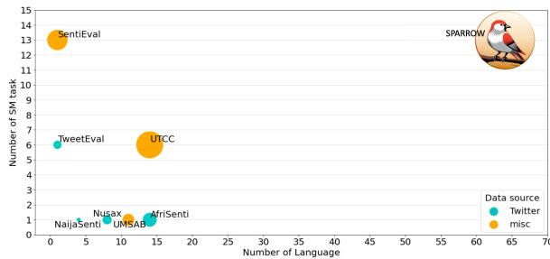
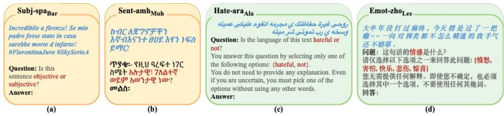
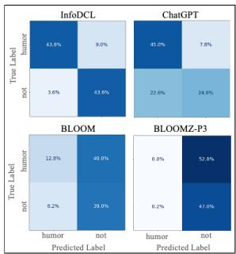
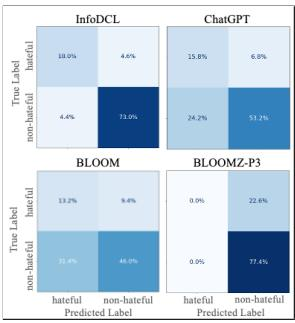
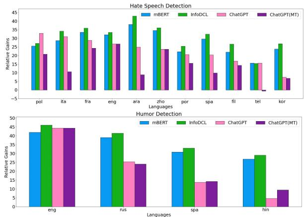

# The Skipped Beat: A Study of Sociopragmatic Understanding in LLMs for 64 Languages

Chiyu Zhangξ Khai Duy Doanλ,∗ Qisheng Liaoλ,∗ Muhammad Abdul-Mageedξ,λ   
ξDeep Learning & Natural Language Processing Group, The University of British Columbia λDepartment of Natural Language Processing & Department of Machine Learning, MBZUAI {chiyuzh@mail,muhammad.mageed@}.ubc.ca, {duy.doan,qisheng.liao}@mbzuai.ac.ae

## Abstract

Instruction tuned large language models (LLMs), such as ChatGPT, demonstrate remarkable performance in a wide range of tasks. Despite numerous recent studies that examine the performance of instruction-tuned LLMs on various NLP benchmarks, there remains a lack of comprehensive investigation into their ability to understand cross-lingual sociopragmatic meaning (SM), i.e., meaning embedded within social and interactive contexts. This deficiency arises partly from SM not being adequately represented in any of the existing benchmarks. To address this gap, we present SPARROW, an extensive multilingual benchmark specifically designed for SM understanding. SPARROW comprises 169 datasets covering 13 task types across six primary categories (e.g., anti-social language detection, emotion recognition). SPAR-ROW datasets encompass 64 different languages originating from 12 language families representing 16 writing scripts. We evaluate the performance of various multilingual pretrained language models (e.g., mT5) and instruction-tuned LLMs (e.g., BLOOMZ, ChatGPT) on SPARROW through fine-tuning, zero-shot, and/or few-shot learning. Our comprehensive analysis reveals that existing opensource instruction tuned LLMs still struggle to understand SM across various languages, performing close to a random baseline in some cases. We also find that although Chat-GPT outperforms many LLMs, it still falls behind task-specific finetuned models with a gap of 12.19 SPARROW score. Our benchmark is available at: https://github.com/ UBC-NLP/SPARROW

## 1 Introduction

Multilingual LLMs have recently transformed NLP, due to their powerful capabilities on a wide range of tasks (Xue et al., 2021; Scao et al., 2022). Methods such instruction tuning and reinforcement learning from human feedback (RLHF) (Ouyang et al., 2022) have further enhanced the zero-shot generalizability of these models. Notably, ChatGPT exhibits impressive capabilities in this regard. Human language, however, is intrinsically ambiguous and far from solved. In fact, some forms of meaning are deeply embedded in social interactions. We collectively refer to this type of meaning as sociopragmatic meaning (SM). To appreciate SM, consider how the meaning of an utterance in social interaction (e.g., on social media) can be highly subtle and how it incorporates both the social variation related to language users (from a sociolinguistics perspective) (Tagliamonte, 2015) and their communicative intentions (from a pragmatics perspective) (Boxer and Cortés-Conde, 2021). Although SM is quite established within linguistics, NLP systems still struggle with this type of meaning that is intertwined in social and interactive contexts (Zhang and Abdul-Mageed, 2022). The extent to which instruction tuned models such as ChatGPT can capture SM across languages remains largely unclear as these models are yet to be evaluated on appropriate datasets under standardized conditions easy to replicate.

  
Figure 1: Comparison of SM benchmarks with leaderboards. The bubble size indicates the number of datasets. Previous works: TweetEval (Barbieri et al., 2020), UMSAB (Barbieri et al., 2022), Nusax (Winata et al., 2022), UTCC (Risch et al., 2021), NaijaSenti (Muhammad et al., 2022), AfriSenti (Muhammad et al., 2023a), SentiEval (Zhang et al., 2023b).

To facilitate evaluation of LLMs and enhance fairness of model comparisons and reproducibility, early work introduces evaluation benchmarks. Most existing benchmarks, however, focus on the monolingual setting. These include GLUE (Wang et al., 2019), SentEval (Conneau and Kiela, 2018), and TweetEval (Barbieri et al., 2020) for English, ARLUE (Abdul-Mageed et al., 2021) for Arabic, CLUE (Xu et al., 2020a) for Chinese, and IndoNLU (Wilie et al., 2020) for Indonesian. Although XTREME (Hu et al., 2020) and XGLUE (Liang et al., 2020) introduce multilingual benchmarks, they only include a few SM tasks for a limited number of languages. They are also limited to standard language use (e.g., Wikipedia). Barbieri et al. (2022) propose a multilingual sentiment analysis benchmark (UMSAB), but it solely contains tweet sentiment analysis datasets in only eight languages. As such, absence of a unified, diverse, and comprehensive benchmark and a fragmented evaluation landscape hamper NLP work for cross-lingual SM.

Another challenge for SM research is the issue of data inaccessibility (Assenmacher et al., 2022). Although many studies release the IDs of posts (e.g., tweets), substantial amounts of these social posts become inaccessible over time due to deletion, etc. (Zhang et al., 2022). In our benchmark, we attempt to re-collect text contents of 25 datasets by using their IDs but can only retrieve 58% samples on average (see Table 8 in Appendix). This data decay also hinders fair comparisons in NLP for SM research. This issue has already become worse as corporations such as Twitter tighten access to their API, making it even harder to collect historical data. To address this bottleneck, we introduce a massively multilingual SM evaluation benchmark, dubbed SPAR-ROW, that comprises 169 datasets covering 64 languages from 12 language families, 16 types of scripts, across diverse online platforms (e.g., Twitter, YouTube, and Weibo). We then perform an extensive evaluation of ChatGPT, comparing it to 13 other models ranging in size between 110M-7B parameters. Our evaluations allow us to answer multiple questions related to how it is that LLMs fare across languages on SM. To facilitate future comparisons, we also design a modular, interactive leaderboard on top of our new benchmark.

<table><tr><td>Studies</td><td>Lang.</td><td>Tasks</td><td>SM Tasks 1</td><td></td><td></td><td>Dataset Models LeaderBrd</td></tr><tr><td>Zhong et al. (2023)</td><td>en</td><td>5</td><td>1</td><td>8</td><td>5</td><td>x</td></tr><tr><td>Qin et al. (2023)</td><td>en</td><td>7</td><td>1</td><td>20</td><td>29</td><td>x</td></tr><tr><td>Ahuja et al. (2023)</td><td>70</td><td>10</td><td>3</td><td>16</td><td>11</td><td>x</td></tr><tr><td>Laskar et al. (2023)</td><td>12</td><td>12</td><td>2</td><td>140</td><td>27</td><td>x</td></tr><tr><td>Bang et al. (2023)</td><td>8</td><td>8</td><td>1</td><td>23</td><td>3</td><td>x</td></tr><tr><td>Lai et al. (2023)</td><td>37</td><td>7</td><td>0</td><td>8</td><td>7</td><td>x</td></tr><tr><td>Das et al. (2023)</td><td>11</td><td>2</td><td>2</td><td>2</td><td>1</td><td>x</td></tr><tr><td>Wang et al. (2023)</td><td>en</td><td>5</td><td>5</td><td>18</td><td>3</td><td>x</td></tr><tr><td>Zhang et al. (2023b)</td><td>en</td><td>13</td><td>13</td><td>26</td><td>5</td><td>√</td></tr><tr><td>Ziems et al. (2023)</td><td>en</td><td>24</td><td>18</td><td>24</td><td>13</td><td>x</td></tr><tr><td>Ours</td><td>64</td><td>13</td><td>13</td><td>169</td><td>14</td><td>√</td></tr></table>

Table 1: Our work in comparison.

To summarize, the contributions of this paper are as follows: (1) We collect, uniformize, and responsibly release massively multilingual SM datasets in a new benchamark; (2) Our SPAR-ROW benchmark is essentially an archive of SM datasets that alleviates the serious issue of data decay; (3) We evaluate a wide range of models on our SPARROW benchmark via fine-tuning SoTA encoder-only pretrained language models and zero-shot learning of a number of generative models, including instruction tuned models (e.g., BLOOMZ) as well as ChatGPT; and (4) We establish standard settings for future research in this area across a large number of languages and tasks. through a public leaderboard.

## 2 Related Work

Evaluation of LLMs. There have been many attempts to evaluate ChatGPT and instruction tuned LLMs. Qin et al. (2023); Laskar et al. (2023); Zhong et al. (2023); Wu et al. (2023) utilize existing English evaluation benchmarks, such as GLUE (Wang et al., 2019) and BigBench (Srivastava et al., 2022), to evaluate LLMs’ capacities on various NLP tasks. These studies find that although ChatGPT performs less effectively than the models finetuned specifically for each task, it demonstrates superior capabilities compared to other instruction tuned LLMs (e.g., FLAN (Chung et al., 2022)). Ahuja et al. (2023); Bang et al. (2023); Laskar et al. (2023); Lai et al. (2023); Huang et al. (2023) evaluate LLMs on more diverse languages using existing multilingual benchmarks (e.g., XNLI, PAWS-X, XLSum) involving monolingual NLP tasks and crosslingual tasks (e.g., machine translation). Their findings point to a large gap in performance of instruction tuned LLMs and ChatGPT, especially on low-resource languages and those with non-Latin scripts.

SM is still not adequately represented in existing benchmarks, hindering comprehensive evaluations on more languages. As we summarize in Table 1, benchmarks used for listed evaluations only include a few SM tasks focusing on sentiment analysis. Wang et al. (2023); Zhang et al. (2023b) investigate LLMs on a number of SM tasks (e.g., offensive language detection), but only on English. Ziems et al. (2023) investigate Chat-GPT performance on a range of computational social science tasks covering subjects such as sociology, psychology, and linguistics, but they again focus only on English. Das et al. (2023) extend evaluation of ChatGPT on hate speech detection to 11 languages. Compared to these works, our objective is to investigate more diverse SM tasks on a massively multilingual setting.

Sociopragmatic Meaning Benchmarks. Many previous works introduce unified benchmarks such as GLUE (Wang et al., 2019), SentEval (Conneau and Kiela, 2018), XTREME (Hu et al., 2020), and XGLUE (Liang et al., 2020). These benchmarks include a wide range of NLP tasks, but comprise a sole SM task (i.e., sentiment analysis). Some recent studies started to construct benchmarks focusing on SM: Barbieri et al. (2020) introduce TweetEval benchmark that contains seven English datasets of six SM tasks; Zhang et al. (2023b) develop SentiEval that involves 26 English datasets of 13 sentimentrelated tasks. Beyond English, NusaX (Winata et al., 2022), NaijaSenti (Muhammad et al., 2022), and AfriSenti (Muhammad et al., 2023a) propose benchmarks for sentiment analysis with eight Indonesian languages, four African languages, and 14 African languages, respectively. UMSAB introduced by Barbieri et al. (2022) contains 11 sentiment analysis datasets in 11 languages. For detecting antisocial online comments, Risch et al. (2021) introduces a toxic comment collection that contains 43 datasets of six antisocial detection tasks in 14 languages. Compared to these works, our SPARROW benchmark includes significantly more SM tasks and languages, from more diverse sources (refer to Figure 1 for a comparison).

## 3 SPARROW Benchmark

In this section, we describe clusters of tasks in our benchmark as well as our preprocessing and unification. SPARROW consists of 13 types of tasks in six main categories. It contains 169 datasets from diverse online platforms and covers a wide period of time (1986-2022). We group different tasks in our benchmark by what we perceive to be an affinity between these tasks. For example, we group tasks of hate speech, offensive language, and dangerous language detection as anti-social language detection. Meanwhile, we keep particular tasks (such as sentiment analysis and emotion recognition) distinct due to the popularity of these tasks and since there are multiple datasets representing each of them. Table 2 summarizes statistics of SPARROW. We now briefly introduce our task clusters. We provide more information about languages in SPARROW in Table 7 of the Appendix. We also provide detailed descriptions with full citations of all our datasets in Tables 9, 10, 11, 12, 13, and 14 in Appendix.

<table><tr><td></td><td>Tasks</td><td>Dataset</td><td>Lang.</td><td>LF</td><td>Scr</td></tr><tr><td rowspan="6">Anocial</td><td>Aggressive</td><td>1</td><td>1</td><td>1</td><td>1</td></tr><tr><td>Dangerous</td><td>1</td><td>1</td><td>1</td><td>1</td></tr><tr><td>Hate</td><td>16</td><td>11</td><td>6</td><td>5</td></tr><tr><td>Offense</td><td>7</td><td>6</td><td>3</td><td>3</td></tr><tr><td>H/O-Group</td><td>3</td><td>3</td><td>2</td><td>3</td></tr><tr><td>H/O-Target Antisocial</td><td>8</td><td>8</td><td>4</td><td>7</td></tr><tr><td colspan="2">Emotion</td><td>36</td><td>20</td><td>7</td><td>10</td></tr><tr><td colspan="2">Humor</td><td>26</td><td>17</td><td>7</td><td>5</td></tr><tr><td rowspan="4">Irarc</td><td>Irony</td><td>4</td><td>4</td><td>1</td><td>2</td></tr><tr><td>Sarcasm</td><td>9 10</td><td>7 4</td><td>3 3</td><td>3</td></tr><tr><td>Irony-Type</td><td>1</td><td>1</td><td>1</td><td>3 1</td></tr><tr><td>Irony&amp;Sarcasm</td><td>20</td><td>8</td><td>3</td><td>3</td></tr><tr><td colspan="2">Sentiment</td><td>77</td><td>58</td><td>10</td><td>15</td></tr><tr><td colspan="2">Subjectivity</td><td>6</td><td>5</td><td>2</td><td>2</td></tr><tr><td colspan="2">SPARROW</td><td>169</td><td>64</td><td>12</td><td>16</td></tr></table>

Table 2: Summary of datasets in SPARROW. Lang: number of languages, LF: number of language families, Scr: number of scripts.

## 3.1 Task Clusters

Antisocial Language Detection. The proliferation of antisocial language (e.g., hate speech) toxifies public discourse, incites violence, and undermines civil society (Sap et al., 2019; Vidgen and Derczynski, 2020). Antisocial language detection is thus a useful task. We include under the umbrella of antisocial language the following: (1) aggressive language (Kumar et al., 2018), (2) dangerous language (Alshehri et al., 2020), (3) hate speech (e.g., Waseem and Hovy (2016); Deng et al. (2022)), (4) offensive language (e.g., Mubarak et al. (2020); Kralj Novak et al. (2021)), (5) offense type identification (e.g., Zampieri et al. (2019)), and (6) offense target identification (e.g., Ousidhoum et al. (2019); Jeong et al. (2022)).

Emotion Recognition. Emotion affects our decision-making as well as mental and physical health (Abdul-Mageed and Ungar, 2017). SPAR-ROW includes 26 emotion datasets in 17 languages (e.g., Kajava (2018); Bianchi et al. (2021)).

Humor Detection. Humor is a type of figurative language which induces amusing effects, such as laughter or well-being sensations. We include four humor detection datasets in four languages (e.g., Blinov et al. (2019); Meaney et al. (2021)).

Irony & Sarcasm Detection. Irony and sarcasm also involve figurative language. An ironic/sarcastic expression intentionally uses diametric language to signify implied meaning. We include (1) nine irony detection datasets in seven languages (e.g., Xiang et al. (2020)), (2) ten sarcasm detection datasets in four languages (e.g., Walker et al. (2012)), and (3) an irony type identification dataset (Van Hee et al., 2018).

Subjectivity and Sentiment Analysis. Subjectivity analysis aims to understand the opinions, feelings, judgments, and speculations expressed via language (Abdul-Mageed et al., 2014). Our benchmark includes six subjectivity analysis datasets in five different languages (e.g., Pang and Lee (2004); Pribán and Steinberger (2022)). Subjectivity incorporates sentiment. Sentiment analysis (Poria et al., 2020) is one of the most popular tasks in SM understanding where the objective is to identify the underlying sentiment of a given text. Our benchmark contains 77 sentiment analysis datasets in 58 languages (e.g., Pang and Lee (2005); Marreddy et al. (2022)).

## 3.2 Preprocessing, Splits, and Metrics

We apply light normalization on all the samples by converting user mentions and hyperlinks to ‘USER’ and ‘URL’, respectively. We standardize label names for consistency across datasets without reassigning nor aggregating the original labels of the datasets. For instance, in certain sentiment analysis datasets, we map ‘0’ and ‘1’ to ‘Negative and ‘Positive’ respectively. Regarding data splits, if the dataset already has Train, Dev, and Test sets, we maintain the same splits. If the original dataset does not include a Dev set, we randomly select 10% of training data to be a Dev set. In cases without pre-defined splits, we use an 80% Train, 10% Dev, and 10% Test random split. For computing constraints, we also prepare a smaller Test set for each dataset by randomly sampling 500 samples from Test (if its size exceeds 500). We refer to this smaller test set as Test-S.

We evaluate on each dataset using its original metric as Tables 9, 10, 11, 12, 13, and 14 in Appendix summarize.1 We report the performance on individual datasets, aggregate datasets into 13 tasks, and report an average score over each task. Moreover, we introduce a metric for each main category, calculated as the average of dataset-specific metrics within that category. Inspired by previous evaluation benchmarks like GLUE (Wang et al., 2019), we define a global metric called SPARROW score, which represents the unweighted average of all dataset-specific metrics. The SPARROW score provides an overall indication of performance on SM tasks.

## 4 Evaluation Methods

## 4.1 Finetuning on Encoder-Only Models

We evaluate the following Transformer-encoderbased multilingual models on SPARROW: (1) Multilingual-BERT (mBERT) (Devlin et al., 2019) (Base, 110M parameters), (2) XLM-$\mathbf { R o B E R T a _ { B a s e } }$ (XLM-R) (Conneau et al., 2020) (270M parameters), (3) Bernice (DeLucia et al., 2022), a 270M-parameter model trained with 2.5B tweets in 66 languages, and (4) InfoDCL (Zhang et al., 2023a), a SoTA for SM understanding, which further trains XLM-R with 100M tweets in 66 languages with contrastive learning. More details about all models are in Appendix B.

## 4.2 Zero- and Few-Shot on LLMs

We investigate zero-shot performance on a wide range of generative models, including pretrained generative models: (1) BLOOM (Scao et al., 2022), (2) mT5 (Xue et al., 2021), (3) LLaMA (Touvron et al., 2023), instruction tuned models: (4) BLOOMZ (Scao et al., 2022), a BLOOM-initialized model tuned with multilingual xP3 corpus, (5) BLOOMZ-P3 (Muennighoff et al., 2022), a BLOOM-initialized model tuned with English-only P3 corpus, (6) BLOOM-Bactrian (Li et al., 2023), a BLOOM-initialized model tuned with 3.4M instruction-following samples in 52 languages, (7) mT0 (Muennighoff et al., 2022), an mT5 model tuned with xP3 corpus, (8) Alpaca (Taori et al., 2023), a

  
Figure 2: Examples of prompts used for zero-shot evaluation with lm-evaluation-harness ( yellow ) and ChatGPT ( green ). We use an English prompt (Figures a, c) and machine translated the prompt in the corresponding language (Figures b, d), repectively. The prompts construct each task as question-and-answer tasks. The actual input sample is in blue, and the label options are in red.

LLaMA-initialized model tuned with 52K English instruction-following samples, (9) Vicuna (Chiang et al., 2023), a LLaMA-initialized model on 70K conversational data, and (10) ChatGPT, for which we use the gpt-3.5-turbo-0301 version via OpenAI API.2 We use 7B-size version of BLOOM- and LLaMA-based models and 4B-size version of mT5-based models. We also evaluate six open-source LLMs (i.e, BLOOM, BLOOMZ-P3, mT5, mT0, LLaMA, and Vicuna) via few-shot in-context learning.

## 5 Experiments

## 5.1 Implementation

Finetuning. To keep computation reasonable, we randomly select 45 datasets for hyperparameter tuning and only tune the learning rate of each model.3 For all experiments, we finetune a pretrained model with an arbitrary batch size of 32 and sequence length of 128 tokens. Each model is finetuned on the full Train set of each dataset for 20 epochs (with patience = 5) based on performance on Dev set. We run each experiment three times with different random seeds and identify the best model on Dev in each run. We report the average performance on Test-S over three runs.

Zero-shot Evaluation. We perform a zero-shot evaluation on SPARROW for BLOOM-, mT5-, and LLaMA-based models using language model evaluation harness (lm-evaluation-harness Gao et al. (2021)).5 While we do not tailor prompts specifically for each model, customized prompts are employed for each set of tasks. These prompts follow the structure of question-and-answer tasks, where we present sample content alongside a taskspecific question, as shown in Figure 2. The prompts are summarized in Appendix Table 15. We then instruct the model to generate an answer based on the provided option labels. Each option label represents a potential answer, and we calculate the log-likelihood for each candidate. The prediction with the highest log-likelihood is chosen as the model’s final prediction. For the evaluation of ChatGPT, we draw inspiration from previous practices for prompt design (Ziems et al., 2023), and incorporate additional instructions to guide its generation of the desired labels. As shown in Figure 2, we provide an instruction that compels ChatGPT to select a single label for the given input text without providing any additional explanation. We set the temperature to 0 to generate deterministic and reproducible results from ChatGPT. For a few instances, we observe that ChatGPT is unable to provide a direct answer. In these cases, we randomly assign a false label to each sample. In addition, we also use machine translation to translate English prompts and label names to the corresponding language of each dataset.6

Few-shot Evaluation. We utilize lm-evaluationharness tool with the same prompts employed in zero-shot evaluation to explore the few-shot incontext learning abilities of open-source LLMs. Before the actual test examples, we prepend m examples from the Train set. Each example consists of an input text, task-specific instruction, and the corresponding answer. We set m to either 3 or 5.

## 5.2 Results

We present the aggregated performance of Test-S on each task and main category, respectively, in Table 3. We also present test results on all datasets and compare to dataset-specific SoTA performance in Tables 17, 18, 19, 20, 21, and 22 in Appendix.

(1) How is the overall performance over different models? All the fully finetuned models surpass the zero-shot generative models as well as ChatGPT, as shown in Table 3. The most superior among the finetuned models is InfoDCL, which achieves a SPARROW score of 71.60 and outperforms ChatGPT with 11.56 points SPAR-ROW score. On the other hand, the open-source models (i.e., BLOOM, mT5 and LLaMA) still significantly lag behind on multilingual SM understanding with performance close to a random baseline. Meanwhile, the instruction tuned multilingual LLMs (BLOOMZ and mT0) only slightly perform better than the random baseline.

(2) Can instruction tuning enhance LLMs’ ability on SM understanding? Yes, but it depends on the instruction training data. Following instruction tuning on the English-only P3 dataset, BLOOMZ-P3 demonstrates an improvement of 7.76 SPARROW score compared to BLOOM. Also, BLOOMZ improves 5.85 points over BLOOM (but falls short of BLOOMZ-P3). MT0 also outperforms mT5. However, there remains a substantial gap between all instruction tuned models and finetuned models. BLOOM-Bactrian performs worse than BLOOMZ and BLOOMZ-P3, which are instruction tuned with NLP tasks. This indicates that the general purpose instruction-response dataset is not very useful for SM understanding.

To further probe how instruction tuning improves BLOOM-based models, we compare BLOOM with BLOOMZ-P3 and BLOOMZ in terms of individual tasks, finding sentiment analysis to exhibit the most significant improvement. BLOOMZ-P3 and BLOOMZ achieve a sentiment score improvement of 16.37 and 12.36, respectively, based on average calculation across 77 sentiment analysis datasets. However, BLOOM-Bactrian obtains an improvement of only 1.79 sentiment score, perhaps implying that the Bactrian instruction-response data is not all that useful for some SM tasks. After tuning mT5 on xP3 dataset, mT0 also experiences a 13.88 improvement in the sentiment score. These may be stemming from inclusion of five English sentiment analysis datasets in both P3 and xP3 during the training phase. For example, we observe that BLOOM, BLOOMZ, BLOOMZ-P3, mT5, and mT0 obtain an accuracy of 56.4, 92.2, 93.00, 49.00, and 76.8 on SentengSoc (not included in either xP3 or P3), respectively and that BLOOM-Bactrian still performs poorly (accuracy= 53.60) after instruction tuning. Again, these results indicate that it is still important to include task-related datasets in the instruction tuning stage.

(3) How do LLMs perform across different SM tasks? They are inferior at humor and antisocial language detection while being relatively better at sentiment and emotion recognition tasks. BLOOMZ-P3, BLOOMZ, and mT0 exhibit considerable enhancements (> 5 points) on sentiment and emotion when compared to their respective initialization models. On the other hand, we find that instruction tuned models perform significantly worse on aggressive language detection and humor detection tasks. BLOOMZ-P3, BLOOMZ, BLOOM-Bactrian, and mT0 all incur a loss of more than 5 points on these two tasks. Upon investigating the predictions of instruction tuned models, we find that they tend to assign negative labels (i.e., non-aggressive or non-humor) which results in many false negative predictions. For a concrete example, we show that BLOOMZ-P3 predict most samples as non-humor in Figure 3a shows.

ChatGPT outperforms the open-source LLMs on all tasks except dangerous language detection. Comparing ChatGPT to InfoDCL, we find gaps favoring InfoDCL in subjectivity analysis (a difference of 9.47), emotion recognition (a difference of 10.68), and irony & sarcasm detection (a difference of 10.70). ChatGPT also largely lags behind InfoDCL in humor detection (a difference of 15.40) and antisocial language detection (a difference of 14.06). As the example shows in Figure 3b, ChatGPT makes more false positive errors (classifies non-hateful as hateful).

(4) How do LLMs perform across different languages? We now examine the impact of instruction finetuning on the model’s language-wise performance. We categorize the performance of each dataset based on language and calculate the average language scores across all datasets within a language. Since each language contains different tasks and datasets, a direct comparison across languages is not feasible. Therefore, we compare the relative performance between different models for each language. By comparing the instruction tuned models to their initial models, we observe that most languages experience improvement. However, we also observe a significant decline in performance for the Amharic (amh) dataset among these models. Specifically, BLOOMZ-P3, BLOOMZ, and mT0 experience a deterioration of 36.07, 24.99, and 26.12 points, respectively, compared to their respective initial models. We hypothesize that this deterioration can be attributed to catastrophic forgetting after instruction tuning, where Amharic was not included in the training set and does not share the writing scripts with the other included languages.

<table><tr><td rowspan="3"></td><td rowspan="3">Tasks</td><td>Rand.</td><td colspan="3">Finetuning</td><td colspan="10">Zero-shot</td></tr><tr><td></td><td>mB. X-R</td><td>Ber.</td><td>InfoD</td><td>BM</td><td>BMZ</td><td>BMZ (MT)</td><td>BMZ P3</td><td>BM Bac.</td><td>mT5</td><td>mT0</td><td>mT0 (MT)</td><td>LLa.</td><td>Alp.</td><td>Vic.</td><td>CG</td></tr><tr><td></td><td>110M</td><td>270M</td><td>270M</td><td>270M</td><td>7B</td><td>7B</td><td>7B</td><td>7B</td><td>7B 4B</td><td>4B</td><td>4B</td><td>7B</td><td>7B</td><td>7B</td><td>CG 175B</td><td>(MT) 175B</td></tr><tr><td rowspan="10">Aniocial Hate</td><td>Aggressive Dangerours</td><td>43.14</td><td>72.71 74.64</td><td>75.45</td><td>73.96</td><td>51.06</td><td>15.82</td><td>15.82</td><td>18.72</td><td>16.37</td><td>53.67</td><td>15.82</td><td>22.00</td><td>18.31</td><td>49.29</td><td>25.07, 63.53</td><td>54.36</td></tr><tr><td></td><td>42.06</td><td>62.36</td><td>63.57 67.13</td><td>65.23</td><td>46.87</td><td>46.87</td><td>50.84</td><td>46.87</td><td>46.8749.31</td><td></td><td>46.87</td><td>46.8746.87</td><td></td><td>46.87</td><td>46.8737.93</td><td>33.68</td></tr><tr><td></td><td>43.62</td><td>72.97 74.37</td><td>76.76</td><td>75.85</td><td>39.83</td><td>39.44</td><td>37.76</td><td>38.52</td><td>42.23</td><td>23.29</td><td>37.33</td><td>39.05 37.80</td><td></td><td>44.31</td><td>41.5966.06</td><td>58.74</td></tr><tr><td>Offense</td><td>39.48</td><td>77.53 75.88</td><td>78.45</td><td>78.88</td><td>41.06</td><td>40.42</td><td>20.28</td><td>38.59</td><td>40.43</td><td>24.99</td><td>39.90</td><td>21.11 39.85</td><td></td><td>16.82</td><td>48.7067.31</td><td>52.70</td></tr><tr><td>H/O-Group</td><td>14.82</td><td>46.18 42.39</td><td>51.15</td><td>50.24</td><td>13.63</td><td>17.26</td><td>14.23</td><td>21.23</td><td>14.81</td><td>7.02</td><td>16.25</td><td>17.01 12.35</td><td></td><td>14.13</td><td>9.26 39.66</td><td>26.74</td></tr><tr><td>H/O-Target</td><td>20.39</td><td>53.16 57.67</td><td>60.96</td><td>60.79</td><td>18.73</td><td>19.03</td><td>18.74</td><td>16.89</td><td>18.77</td><td>6.69</td><td>20.58</td><td>17.99</td><td>19.32 16.83</td><td>17.01</td><td>35.89</td><td>28.67</td></tr><tr><td>AS</td><td>35.20</td><td>66.92 67.99</td><td>71.14</td><td>70.61</td><td>33.70</td><td>32.80</td><td>27.93</td><td>31.97</td><td>33.79</td><td>20.14</td><td>32.02</td><td>28.79 31.68</td><td>30.55</td><td>34.50</td><td>56.55</td><td>47.40</td></tr><tr><td>Emotion</td><td>15.86</td><td>61.42</td><td>66.87 68.13</td><td>69.27</td><td>9.71</td><td>17.18</td><td>13.85</td><td>15.07</td><td>15.19</td><td>7.75</td><td>27.87</td><td>24.21</td><td>15.14</td><td>31.80</td><td>18.1259.58</td><td>50.85</td></tr><tr><td>Humor</td><td>49.65</td><td>84.35</td><td>85.19 86.75</td><td>87.05</td><td>41.78</td><td>33.12</td><td>33.82</td><td>33.17</td><td></td><td>33.04  35.91</td><td>43.60</td><td>33.12</td><td>39.78</td><td>41.72 46.19</td><td>71.65</td><td>72.70</td></tr><tr><td>Irony</td><td>42.39</td><td>64.24</td><td>65.53</td><td>66.88</td><td>68.38</td><td>36.63 35.15</td><td>38.69</td><td>44.46</td><td>36.18 36.52</td><td></td><td>34.69</td><td>33.99  40.78</td><td></td><td>27.49</td><td>47.48 58.23</td><td>56.24</td></tr><tr><td rowspan="2">S8I Sarcasm Irony-Type</td><td>45.48</td><td>72.41</td><td>73.40</td><td>74.78</td><td>74.94</td><td>43.00</td><td>41.62</td><td>32.23</td><td>32.22</td><td>41.6846.34</td><td>36.09</td><td></td><td>41.6241.17</td><td>32.48</td><td>47.6765.34</td><td></td><td>65.55</td></tr><tr><td>22.36</td><td>47.35</td><td>46.43</td><td>56.04</td><td>57.58</td><td>18.83</td><td>18.83</td><td>18.83</td><td>18.83</td><td>18.83 1</td><td>18.83</td><td>18.83</td><td>18.83 18.83</td><td>18.83</td><td>18.83</td><td>30.81</td><td>30.81</td></tr><tr><td>I&amp;S</td><td>42.93</td><td>67.48</td><td>68.51</td><td>70.29</td><td>71.12</td><td>38.92</td><td>37.57</td><td>34.46</td><td>41.79</td><td>40.39</td><td>35.42</td><td>37.36</td><td>32.35 39.87</td><td>29.56</td><td></td><td>46.1460.41</td><td>59.63</td></tr><tr><td>Sentiment</td><td>34.68</td><td>66.34</td><td>69.58</td><td>70.44</td><td>71.64</td><td>26.67</td><td>39.03</td><td>28.61</td><td>43.03</td><td>28.46 20.77</td><td></td><td>34.65</td><td>32.76 27.55</td><td></td><td>25.84</td><td>25.02  60.34</td><td>54.94</td></tr><tr><td>Subjectivity</td><td>41.41</td><td>72.54</td><td>74.45</td><td>74.80</td><td>75.73</td><td>44.12</td><td>29.45</td><td>30.69</td><td>30.73</td><td>39.65 | 37.35</td><td></td><td>41.64</td><td>36.16 | 42.30</td><td></td><td>30.44</td><td>38.73 | 66.26</td><td>59.33</td></tr><tr><td>SPARROW</td><td>33.47</td><td></td><td>66.60 69.38</td><td>70.85</td><td>71.60</td><td>27.94</td><td>33.79</td><td>27.17</td><td>35.70</td><td>29.45</td><td>21.45</td><td>33.63</td><td>30.85|28.75</td><td></td><td>28.79</td><td>29.3660.04</td><td>53.90</td></tr></table>

Table 3: SPARROW benchmark Test-S results. We report the average of dataset-specific metrics in a task and a category, respectively. Rand.: random baseline, mB.: mBERT, X-R: XLM-R, Ber.: Bernice, InfoD: InfoDCL, BM: BLOOM, LLa.: LLaMA, Alp.: Aplaca, Vic.: Vicuna, CG: ChatGPT, MT: using machine translated prompts. The best performance in each setting is Bold. The red font denotes a performance lower than the random baseline.

  
(a) Humo-spaChi

  
(b) Hate-araAla  
Figure 3: Confusion matrices of two datasets.

<table><tr><td>Lang</td><td>Random </td><td>InfoDCL BMZ-P3</td><td></td><td>mT0</td><td>Vicuna</td><td>CG</td><td>CG-MT</td></tr><tr><td>amh</td><td>37.95</td><td>65.68</td><td>16.05</td><td>22.49</td><td>2.99</td><td>20.62</td><td>46.82</td></tr><tr><td>bug</td><td>30.77</td><td>71.55</td><td>34.60</td><td>18.27</td><td>12.90</td><td>34.63</td><td>30.86</td></tr><tr><td>ell</td><td>41.24</td><td>79.13</td><td>46.71</td><td>45.47</td><td>48.21</td><td>60.94</td><td>34.98</td></tr><tr><td>eng</td><td>37.90</td><td>75.48</td><td>43.32</td><td>39.23</td><td>39.75</td><td>66.51</td><td></td></tr><tr><td>fil</td><td>52.37</td><td>79.01</td><td>34.47</td><td>34.47</td><td>34.47</td><td>69.13</td><td>66.67</td></tr><tr><td>heb</td><td>47.60</td><td>95.80</td><td>71.20</td><td>76.60</td><td>40.80</td><td>84.20</td><td>57.40</td></tr><tr><td>hin</td><td>35.24</td><td>67.55</td><td>28.92</td><td>26.20</td><td>29.06</td><td>52.63</td><td>48.30</td></tr><tr><td>mal</td><td>31.68</td><td>82.70</td><td>43.84</td><td>41.65</td><td>24.85</td><td>44.03</td><td>31.44</td></tr></table>

Table 4: Language-wise model performance for sample languages. The complete results are in Table 23 in Appendix. Best performance in each language is bold, and the second best is in green highlight . The red font denotes a performance lower than the random baseline.

Similarly, the Filipino (fil) tasks exhibit an average decline of approximately 11 points on both BLOOMZ-P3 and BLOOMZ, as Filipino is not included in the xP3 dataset. Although Hindi is included in the xP3 dataset, the three instruction tuned models still show a decline in performance. Upon examining the individual performance of Hindi datasets, we find that the major deteriorations occur in the aggressive language detection and humor detection tasks, while the emotion recognition and sentiment analysis tasks show improvement. The instruction-response data for training Alpaca and Vicuna consist solely of English language. Therefore, we compare the performance of Alpaca and Vicuna to that of LLaMA using both English and non-English datasets. We observe that Alpaca and Vicuna outperform LLaMA when evaluated on English datasets, achieving average scores of 8.30 and 5.51, respectively. However, their performance declines when tested on non-English datasets, resulting in average decreases of 1.53 and 0.33, respectively. Compared to task-specific InfoDCL, ChatGPT performs poorly in 63 out of 64 languages, sometimes with a large gap (e.g., 45.06 lower on Amharic, 38.67 lower on Malayalam, and 36.91 lower on Buginese), as Table 4 shows.

  
Figure 4: A comparison of different models on multiple tasks across various languages. We show the relative gain of each model compared to the random baseline.

We also investigate how different models perform on SM tasks across various languages. Results for two tasks, hate speech detection (top) and humor detection (bottom), are presented in Figure 4. The dataset for each task is grouped according to language, and the average score of each language is obtained. The relative gain of each model against the random baseline is shown, allowing us to compare across these languages.7 We observe that InfoDCL is the best model across various tasks and languages, with the exception of hate speech in Polish where ChatGPT outperforms it. As Figure 4 shows, ChatGPT performs better for Western languages on hate speech detection. We can also observe wider gaps in hate speech detection between ChatGPT and InfoDCL on Arabic and Korean. Similarly, while ChatGPT demonstrates satisfactory performance in English humor, it remains at significant distance behind InfoDCL in Hindi humor.

(5) Do machine translated prompts help LLMs? Not in general, but they do help in a few cases. We find, in Table 3, that the SPAR-ROW score of ChatGPT with machine translated prompts is 6.14 points lower than ChatGPT with English prompts. Meanwhile, a few tasks such as humor and sarcasm acquire improvements. We also observe a similar pattern for BLOOMZ and mT0, as Table 3 shows. The low-resource languages with non-Latin scripts experience more performance drops in general, which is in line with findings by Lai et al. (2023). Hebrew (heb) and Greek (ell) get the largest performance drops (over 25 points in each case), as shown in Table 4.

<table><tr><td>Task</td><td>#Sample</td><td>CG (sample MT)</td><td>GPT-4</td></tr><tr><td>Hate-engwas</td><td>96</td><td></td><td>28.82</td></tr><tr><td>Hate-engDav</td><td>168</td><td></td><td>76.30</td></tr><tr><td>Hate-araAla</td><td>153</td><td>38.82</td><td>35.76</td></tr><tr><td>Hate-itaBos</td><td>104</td><td>29.75</td><td>38.44</td></tr><tr><td>Hate-filCab</td><td>145</td><td>15.76</td><td>23.96</td></tr><tr><td>Hate-araMul</td><td>127</td><td>29.49</td><td>36.33</td></tr><tr><td>Hate-engBas</td><td>178</td><td></td><td>19.23</td></tr><tr><td>Hate-spaBas</td><td>174</td><td>21.06</td><td>17.35</td></tr><tr><td>Hate-porFor</td><td>142</td><td>35.37</td><td>37.34</td></tr><tr><td>Hate-polpta</td><td>54</td><td>35.62</td><td>49.57</td></tr><tr><td>Hate-korMoo</td><td>250</td><td>14.20</td><td>15.85</td></tr><tr><td>Hate-araMub</td><td>89</td><td>20.54</td><td>16.74</td></tr><tr><td>Hate-zhoDen</td><td>125</td><td>29.24</td><td>39.24</td></tr><tr><td>Hate-korjeo</td><td>169</td><td>27.75</td><td>44.84</td></tr><tr><td>Hate-telMar</td><td>2</td><td>100.00</td><td>100.00</td></tr><tr><td>Sexi-fraChi</td><td>113</td><td>34.10</td><td>43.69</td></tr><tr><td>Humo-hinAgg</td><td>220</td><td>22.73</td><td>30.91</td></tr><tr><td>Humo-rusBli</td><td>136</td><td>26.89</td><td>47.31</td></tr><tr><td>Humo-spaChi</td><td>152</td><td>30.68</td><td>36.80</td></tr><tr><td>Humo-engMea</td><td>48</td><td></td><td>50.34</td></tr></table>

Table 5: Case study on using machine translated input and GPT-4 on samples mispredicted by ChatGPT.

(6) Does GPT-4 outperform ChatGPT? Yes, it does. We provide a study on probing GPT-4’s capacities. We exploit 20 datasets from two tasks (i.e., hate speech and humor detection) in 12 languages, only choosing samples whose labels Chat-GPT predicted incorrectly. We refer to this test set as GPTHard and provide samples from it to GPT-4 in their original language, employing the same English prompts as those used by ChatGPT. As Table 5 shows, GPT-4 significantly outperforms ChatGPT (McNemar’s test with α < 0.01) on 19 datasets.8

(7) Can translating input samples into English help improve ChatGPT’s predictions? Yes, it can. Here, we use the non-English part of GPTHard (16 datasets). We translate these test samples into English using ChatGPT and subsequently employ the translated text and English prompt for classification. As Table 5 shows, we acquire a noteworthy enhancement in ChatGPT’s performance (McNemar’s test with α < 0.01)

<table><tr><td rowspan="2">Tasks</td><td rowspan="2"></td><td colspan="6">Zero-shot</td><td colspan="6">Three-shot</td><td colspan="6">Five-shot</td></tr><tr><td>BM</td><td>BMZ P3</td><td>mT5</td><td>mT0</td><td>LLa.</td><td>Vic.</td><td>BM</td><td>BMZ P3</td><td>mT5</td><td>mT0</td><td>LLa.</td><td>Vic.</td><td>BM</td><td>BMZ P3</td><td>mT5</td><td>mT0</td><td>LLa. Vic.</td></tr><tr><td></td><td>Aggressive</td><td>51.06</td><td>18.72</td><td>53.67 15.82</td><td>18.31</td><td>25.07</td><td>46.43</td><td>43.93</td><td>40.73</td><td>41.88</td><td>43.70</td><td>44.53</td><td>47.92</td><td>47.63</td><td>33.80</td><td>37.52</td><td>50.66</td><td>55.27</td></tr><tr><td></td><td>Dangerours</td><td>46.87</td><td>46.87</td><td>49.31 46.87</td><td>46.87</td><td></td><td>46.87 46.87</td><td>46.87</td><td>45.68</td><td>46.87</td><td>46.87</td><td>46.87</td><td>46.87</td><td>46.87</td><td>48.91</td><td>46.87</td><td>46.87</td><td>46.87</td></tr><tr><td>Hate</td><td></td><td>39.83</td><td>38.52</td><td>23.29 37.33</td><td>37.80</td><td>41.59</td><td>38.83</td><td>38.30</td><td>39.43</td><td>37.82</td><td>43.51</td><td>49.17</td><td>37.95</td><td>37.14</td><td>39.53</td><td>37.70</td><td>41.87</td><td>48.37</td></tr><tr><td>Ancial</td><td>Offense</td><td>41.06</td><td>38.59</td><td>24.99 39.90</td><td>39.85</td><td></td><td>48.70</td><td>43.94 40.25</td><td>21.99</td><td>41.53</td><td>46.36</td><td>54.49</td><td>42.42</td><td>40.59</td><td>34.10</td><td>41.67</td><td>43.83</td><td>51.72</td></tr><tr><td></td><td>H/O-Group</td><td>13.63</td><td>21.23 7.02</td><td>16.25</td><td>12.35</td><td>9.26</td><td>11.43</td><td>13.04</td><td>7.92</td><td>15.98</td><td>11.81</td><td>14.19</td><td>9.68</td><td>11.76</td><td>7.23</td><td>14.50</td><td>12.58</td><td>16.27</td></tr><tr><td></td><td>H/O-Target</td><td>18.73</td><td>16.89 6.69</td><td>20.58</td><td>19.32</td><td>17.01</td><td>17.09</td><td>18.41</td><td>10.48</td><td>16.55</td><td>20.56</td><td>24.84</td><td>17.44</td><td>17.45</td><td>9.32</td><td>16.56</td><td>20.09</td><td>23.60</td></tr><tr><td>AS</td><td></td><td>33.70</td><td>31.97 20.14</td><td>32.02</td><td>31.68</td><td>34.50</td><td>33.14</td><td>32.55</td><td>27.19</td><td>32.36</td><td>36.42</td><td>41.69</td><td>32.43</td><td>3T.88</td><td>29.17</td><td>32.09</td><td>35.35</td><td>40.99</td></tr><tr><td>Emotion</td><td></td><td>9.71</td><td>15.07 7.75</td><td>27.87</td><td>15.14</td><td>18.12</td><td>17.08</td><td>12.17</td><td>10.66</td><td>23.12</td><td>32.12</td><td>40.28</td><td>18.48</td><td>12.35</td><td>10.07</td><td>25.57</td><td>34.20</td><td>41.79</td></tr><tr><td>Humor</td><td></td><td>41.78</td><td>33.04 43.60</td><td>33.12</td><td>39.78</td><td>46.19</td><td>33.67</td><td>33.12</td><td>44.70</td><td>38.19</td><td>55.20</td><td>57.15</td><td>34.06</td><td>33.12</td><td>40.20</td><td>37.08</td><td>53.86</td><td>58.75</td></tr><tr><td>Irony</td><td></td><td>36.63</td><td>44.46 36.52</td><td>34.69</td><td>40.78</td><td>47.48</td><td>42.21</td><td>41.58</td><td>42.61</td><td>35.18</td><td>36.76</td><td>39.78</td><td>44.34</td><td>44.14</td><td>39.67</td><td>34.82</td><td>38.40</td><td>41.61</td></tr><tr><td>S8I Sarcasm</td><td></td><td>43.00</td><td>41.68 36.09</td><td>41.62</td><td>41.17</td><td>47.67</td><td>46.14</td><td>42.91</td><td>46.72</td><td>48.42</td><td>49.75</td><td>52.55</td><td>45.43</td><td>43.05</td><td>45.75</td><td>39.88</td><td>49.03</td><td>52.51</td></tr><tr><td>Irony-Type</td><td></td><td>18.83</td><td>18.83 18.83</td><td>18.83</td><td>18.83</td><td>18.83</td><td>18.83</td><td>18.83</td><td>18.83</td><td>18.83</td><td>18.83</td><td>18.83</td><td>18.83</td><td>18.83</td><td>18.83</td><td>18.83</td><td>18.83</td><td>18.83</td></tr><tr><td>I&amp;S</td><td></td><td>38.92</td><td>41.79 35.42</td><td>37.36</td><td>39.87</td><td>46.14</td><td>43.01</td><td>41.11</td><td>43.48</td><td>40.98</td><td>42.36</td><td>45.12</td><td>43.61</td><td>42.33</td><td>41.67</td><td>36.55</td><td>42.74</td><td>45.92</td></tr><tr><td>Sentiment</td><td></td><td>26.67</td><td>43.03 20.77</td><td>34.65</td><td>27.55</td><td>25.02</td><td>34.81</td><td>35.79</td><td>24.76</td><td>31.37</td><td>37.73</td><td>34.53</td><td>33.15</td><td>37.71</td><td>23.17</td><td>29.25</td><td>40.88</td><td>39.37</td></tr><tr><td>Subjectivity</td><td></td><td>44.12</td><td>30.73 37.35</td><td>41.64</td><td>42.30</td><td>38.73</td><td>36.50</td><td>30.66</td><td>37.11</td><td>34.36</td><td>44.20</td><td>54.77</td><td>33.70</td><td>30.72</td><td>39.36</td><td>31.42</td><td>46.53</td><td>56.15</td></tr><tr><td>SPARROW</td><td></td><td>27.94</td><td>35.70 21.45</td><td>33.63</td><td>28.75</td><td>29.36</td><td>32.76</td><td>31.91</td><td>26.12</td><td>31.71</td><td>37.82</td><td>39.44</td><td>32.03</td><td>32.84</td><td>25.47</td><td>30.44</td><td>39.48</td><td>41.97</td></tr></table>

Table 6: Evaluating open-source LLMs on SPARROW with few-shot in-context learning. The best performance in each setting is Bold. The red font denotes a performance lower than the random baseline.

when using the translated input. We also observe that when fed with these English-translated samples, ChatGPT is able to surpass GPT4 with the original inputs in three datasets (i.e., HatearaAla, Hate-spaBas, Hate-araMub). These results suggest that although ChatGPT has inferior ability on several languages in terms of detecting SM, a translate-then-detect approach may be possible.

(8) How do open-source LLMs perform with few-shot in-context learning? As Table 6 shows, we compare three-shot and five-shot results with zero-shot results. Based on SPAR-ROW score, we observe that few-shot learning does enhance the performance of BLOOM, mT5, LLaMA, and Vicuna. With the increasing number of shots, the performance of LLaMA and Vicuna increases. Vicuna obtains SPARROW scores of 29.36, 39.44, and 41.97 with zero, three, and five shots, respectively. However, BLOOMZ-P3 and mT0 do not improve with few-shot learning. We suspect this is because the instruction finetuning of these two models only uses a zero-shot template that hurts their few-shot learning capacities. BLOOMZ-P3 and mT0 are also different from BLOOM and LLaMA in that they are finetuned on several NLP tasks only one of which is an SM task (i.e., sentiment analysis). This probably biases the behavior of these two models.

(9) Are the open-source LLMs sensitive to prompts used? We carry out a study to probe the open-source LLMs’ sensitivity to prompts. We curate 55 datasets across four tasks from SPARROW and evaluate six models with the prompts we used for evaluating ChatGPT. As Table 24 in Appendix shows, we find that BLOOM, LLaMA, and Vicuna incur sizable performance drops (> 6 points decrease across 55 datasets), while BLOOMZ-P3, mT5, and mT0 demonstrate performance levels akin to those observed in previous experiments (< 2 points different). We leave a more comprehensive evaluation of prompt sensitivity as future work.

## 6 Public Leaderboard

To facilitate future work, we design a public leaderboard for scoring models on SPARROW. Our leaderboard is interactive and offers rich metadata about the various datasets in our benchmark. It also encourages users to submit information about their models (e.g., number of parameters, time to convergence, pretraining datasets). We also distribute a new modular toolkit for finetuning or evaluating models on SPARROW.

## 7 Conclusion

In order to understand the abilities of ChatGPT and other instruction tuned LLMs on capturing sociopragmatic meaning, we introduced a massively multilingual evaluation benchmark, dubbed SPARROW. The benchmark involves 169 datasets covering 64 languages from 12 language families and 16 scripts. Evaluating ChatGPT on SPAR-ROW, we find it struggles with different languages. We also reveal that task-specific models finetuned on SM (much smaller than ChatGPT) consistently outperform larger models by a significant margin even on English.

## 8 Limitations

Benchmark Construction. Our SPARROW benchmark only includes text classification tasks related to SM. Despite our best efforts, we acknowledge that our benchmark has not covered existing SM datasets exhaustively. We will continue expanding this benchmark and welcome future datasets or metric contributions to it. We also plan to extend SPARROW to more types of tasks related to SM, such as span-based sentiment analysis (Xu et al., 2020b), affective language generation (Goswamy et al., 2020), and conversational sentiment analysis (Ojamaa et al., 2015). We only include text-based SM tasks. Another improvement direction is to extend this benchmark to more tasks that involve more modalities, such affective image captioning (Mohamed et al., 2022) and multi-modal emotion recognition (Firdaus et al., 2020).

Model Selection. Due to computation constraints, we cannot evaluate on model sizes > 7B. However, we hope SPARROW will be used in the future to evaluate larger-sized models. Again, due to budget constraints, we only conduct a relatively small case study on GPT-4 and do not evaluate more diverse commercial instruction tuned models that are more expensive (e.g., text-davinci-003 by OpenAI).

Experiments. While we customize prompts employed for each task, we do not tailor prompts specifically for each model. We acknowledge that the performance of models may be influenced by different prompt variants. In future work, we will test diverse prompt variations for more robust results. We only experiment with machine translated prompts in our analyses and acknowledge that the performance drop may stem from the poor quality of machine translation. We will investigate the utility of human translated prompts in a future study. In this paper, we only evaluate LLMs on zero-shot learning. The adoption of few-shot incontext learning may enhance performance, which we also leave to future work.

## Ethics Statement and Broad Impacts

Data Collection and Releasing. All the 169 datasets are produced by previous research. Since there are large numbers of datasets and languages in SPARROW, it is hard to manually verify the quality of all the datasets. As a quality assurance measure, we only include in SPARROW datasets that are introduced in peer-reviewed published research. To facilitate access to information about each dataset, we link to each published paper describing each of these datasets inTables 9, 10, 11, 12, 13, and 14.

Following privacy protection policies, we anonymize all SPARROW data as described in Section 3.2. With reference to accessibility of the original individual dataset, SPARROW data can be categorized into three releasing strategies: (1) In the case of datasets requiring approval by the original authors, we require future researchers to obtain approval first and will share our splits once approval has been obtained. We indicate these nine datasets in our data description tables. (2) For the 25 datasets (see Table 8 in Appendix) that are shared via tweet IDs, we share our obtained data for research use. By doing so, we expect to mitigate the issue of data decay and allow fair comparisons. (3) We will share the other 135 publicly accessible datasets upon request. We will also require a justification for responsible use of the datasets. Each dataset will be shared in our Train, Dev, and Test splits along with a dataset card to indicate the original publication of the dataset.

Intended Use. The intended use of SPARROW benchmark is to construct a scoring board to facilitate model comparisons as well as enhance fairness and reproducibility across different languages and tasks. We also aim to mitigate data decay issues in social media research. SPARROW could help researchers investigate model’s capacity on SM tasks across languages. SPARROW may also be used to investigate model transferability across a wide range of tasks and diverse languages in different settings (such as zero- or few-shot settings and prompting).

Potential Misuse and Bias. We notice that some annotations in the datasets of SPARROW (e.g., for hate speech task (Waseem and Hovy, 2016)) can carry annotation and temporal biases. We recommend that any dataset in SPARROW not be used for research or in applications without careful consideration of internal biases of the datasets and potential biases of the resulting systems. We also suggest that users of SPARROW not only focus on the overall SPARROW score but also a model performance on each task and dataset. The SPARROW score is an unweighted average score over all the dataset-specific metrics, which may lose the fine-grained information and be dominated by the largest task cluster (i.e., sentiment analysis) or languages (e.g., languages from Indo-European language family).

## Acknowledgements

We acknowledge support from Canada Research Chairs (CRC), the Natural Sciences and Engineering Research Council of Canada (NSERC; RGPIN-2018-04267), the Social Sciences and Humanities Research Council of Canada (SSHRC; 435-2018-0576; 895-2020- 1004; 895-2021-1008), Canadian Foundation for Innovation (CFI; 37771), Digital Research Alliance of Canada,9 and UBC ARC-Sockeye.10

## References

Muhammad Abdul-Mageed, Mona T. Diab, and Sandra Kübler. 2014. SAMAR: subjectivity and sentiment analysis for arabic social media. Comput. Speech Lang., 28(1):20–37.

Muhammad Abdul-Mageed, AbdelRahim A. Elmadany, and El Moatez Billah Nagoudi. 2021. AR-BERT & MARBERT: deep bidirectional transformers for arabic. In Proceedings of the 59th Annual Meeting of the Association for Computational Linguistics and the 11th International Joint Conference on Natural Language Processing, ACL/IJCNLP 2021, (Volume 1: Long Papers), Virtual Event, August 1-6, 2021, pages 7088–7105. Association for Computational Linguistics.

Muhammad Abdul-Mageed and Lyle Ungar. 2017. EmoNet: Fine-grained emotion detection with gated recurrent neural networks. In Proceedings of the 55th Annual Meeting of the Association for Computational Linguistics (Volume 1: Long Papers), pages 718–728, Vancouver, Canada. Association for Computational Linguistics.

Muhammad Abdul-Mageed, Chiyu Zhang, Abdel-Rahim Elmadany, Houda Bouamor, and Nizar Habash. 2022. NADI 2022: The third nuanced Arabic dialect identification shared task. In Proceedings of the The Seventh Arabic Natural Language Processing Workshop (WANLP), pages 85–97, Abu Dhabi, United Arab Emirates (Hybrid). Association for Computational Linguistics.

Muhammad Abdul-Mageed, Chiyu Zhang, Azadeh Hashemi, and El Moatez Billah Nagoudi. 2020. AraNet: A deep learning toolkit for Arabic social media. In Proceedings of the 4th Workshop on

Open-Source Arabic Corpora and Processing Tools, with a Shared Task on Offensive Language Detection, pages 16–23, Marseille, France. European Language Resource Association.

Ibrahim Abu Farha and Walid Magdy. 2020. From Arabic sentiment analysis to sarcasm detection: The Ar-Sarcasm dataset. In Proceedings of the 4th Workshop on Open-Source Arabic Corpora and Processing Tools, with a Shared Task on Offensive Language Detection, pages 32–39, Marseille, France. European Language Resource Association.

Akshita Aggarwal, Anshul Wadhawan, Anshima Chaudhary, and Kavita Maurya. 2020. “did you really mean what you said?” : Sarcasm detection in Hindi-English code-mixed data using bilingual word embeddings. In Proceedings of the Sixth Workshop on Noisy User-generated Text (W-NUT 2020), pages 7–15, Online. Association for Computational Linguistics.

Kabir Ahuja, Rishav Hada, Millicent Ochieng, Prachi Jain, Harshita Diddee, Samuel Maina, Tanuja Ganu, Sameer Segal, Maxamed Axmed, Kalika Bali, and Sunayana Sitaram. 2023. MEGA: multilingual evaluation of generative AI. CoRR, abs/2303.12528.

Azalden Alakrot, Liam Murray, and Nikola S. Nikolov. 2018. Dataset construction for the detection of antisocial behaviour in online communication in arabic. In Fourth International Conference On Arabic Computational Linguistics, ACLING 2018, November 17-19, 2018, Dubai, United Arab Emirates, volume 142 of Procedia Computer Science, pages 174– 181. Elsevier.

Ali Alshehri, El Moatez Billah Nagoudi, and Muhammad Abdul-Mageed. 2020. Understanding and detecting dangerous speech in social media. In Proceedings of the 4th Workshop on Open-Source Arabic Corpora and Processing Tools, with a Shared Task on Offensive Language Detection, pages 40– 47, Marseille, France. European Language Resource Association.

Adam Amram, Anat Ben David, and Reut Tsarfaty. 2018. Representations and architectures in neural sentiment analysis for morphologically rich languages: A case study from Modern Hebrew. In Proceedings ofthe 27th International Conference on Computational Linguistics, pages 2242–2252, Santa Fe, New Mexico, USA. Association for Computational Linguistics.

Seyed Arad Ashrafi Asli, Behnam Sabeti, Zahra Majdabadi, Preni Golazizian, reza fahmi, and Omid Momenzadeh. 2020. Optimizing annotation effort using active learning strategies: A sentiment analysis case study in Persian. In Proceedings of The 12th Language Resources and Evaluation Conference, pages 2855–2861, Marseille, France. European Language Resources Association.

Dennis Assenmacher, Derek Weber, Mike Preuss, André Calero Valdez, Alison Bradshaw, Björn Ross,

Stefano Cresci, Heike Trautmann, Frank Neumann, and Christian Grimme. 2022. Benchmarking crisis in social media analytics: A solution for the datasharing problem. Social Science Computer Review, 40(6):1496–1522.

David Bamman and Noah A. Smith. 2015. Contextualized sarcasm detection on twitter. In Proceedings of the Ninth International Conference on Web and Social Media, ICWSM 2015, University ofOxford, Oxford, UK, May 26-29, 2015, pages 574–577. AAAI Press.

Yejin Bang, Samuel Cahyawijaya, Nayeon Lee, Wenliang Dai, Dan Su, Bryan Wilie, Holy Lovenia, Ziwei Ji, Tiezheng Yu, Willy Chung, Quyet V. Do, Yan Xu, and Pascale Fung. 2023. A multitask, multilingual, multimodal evaluation of chatgpt on reasoning, hallucination, and interactivity. CoRR, abs/2302.04023.

Francesco Barbieri, Valerio Basile, Danilo Croce, Malvina Nissim, Nicole Novielli, and Viviana Patti. 2016. Overview of the evalita 2016 sentiment polarity classification task. In Proceedings of Third Italian Conference on Computational Linguistics (CLiC-it 2016) & Fifth Evaluation Campaign of Natural Language Processing and Speech Tools for Italian. Final Workshop (EVALITA 2016), Napoli, Italy, December 5-7, 2016, volume 1749 of CEUR Workshop Proceedings. CEUR-WS.org.

Francesco Barbieri, Jose Camacho-Collados, Luis Espinosa Anke, and Leonardo Neves. 2020. TweetEval: Unified benchmark and comparative evaluation for tweet classification. In Findings of the Association for Computational Linguistics: EMNLP 2020, pages 1644–1650, Online. Association for Computational Linguistics.

Francesco Barbieri, Luis Espinosa Anke, and Jose Camacho-Collados. 2022. XLM-T: Multilingual language models in Twitter for sentiment analysis and beyond. In Proceedings of the Thirteenth Language Resources and Evaluation Conference, pages 258–266, Marseille, France. European Language Resources Association.

Valerio Basile, Andrea Bolioli, Viviana Patti, Paolo Rosso, and Malvina Nissim. 2014. Overview of the evalita 2014 sentiment polarity classification task. Overview of the Evalita 2014 SENTIment POLarity Classification Task, pages 50–57.

Valerio Basile, Cristina Bosco, Elisabetta Fersini, Debora Nozza, Viviana Patti, Francisco Manuel Rangel Pardo, Paolo Rosso, and Manuela Sanguinetti. 2019. SemEval-2019 task 5: Multilingual detection of hate speech against immigrants and women in Twitter. In Proceedings ofthe 13th International Workshop on Semantic Evaluation, pages 54–63, Minneapolis, Minnesota, USA. Association for Computational Linguistics.

Federico Bianchi, Debora Nozza, and Dirk Hovy. 2021. FEEL-IT: Emotion and sentiment classification for

the Italian language. In Proceedings ofthe Eleventh Workshop on Computational Approaches to Subjectivity, Sentiment and Social Media Analysis, pages 76–83, Online. Association for Computational Linguistics.

Federico Bianchi, Debora Nozza, and Dirk Hovy. 2022. XLM-EMO: Multilingual emotion prediction in social media text. In Proceedings of the 12th Workshop on Computational Approaches to Subjectivity, Sentiment & Social Media Analysis, pages 195–203, Dublin, Ireland. Association for Computational Linguistics.

Vladislav Blinov, Valeria Bolotova-Baranova, and Pavel Braslavski. 2019. Large dataset and language model fun-tuning for humor recognition. In Proceedings of the 57th Conference of the Association for Computational Linguistics, ACL 2019, Florence, Italy, July 28- August 2, 2019, Volume 1: Long Papers, pages 4027–4032. Association for Computational Linguistics.

Cristina Bosco, Felice Dell’Orletta, Fabio Poletto, Manuela Sanguinetti, and Maurizio Tesconi. 2018. Overview of the EVALITA 2018 hate speech detection task. In Proceedings of the Sixth Evaluation Campaign ofNatural Language Processing and Speech Toolsfor Italian. Final Workshop (EVALITA 2018) co-located with the Fifth Italian Conference on Computational Linguistics (CLiC-it 2018), Turin, Italy, December 12-13, 2018, volume 2263 of CEUR Workshop Proceedings. CEUR-WS.org.

Diana Boxer and Florencia Cortés-Conde. 2021. Social Groups and Relational Networks, Cambridge Handbooks in Language and Linguistics, page 227–246. Cambridge University Press.

Tom B. Brown, Benjamin Mann, Nick Ryder, Melanie Subbiah, Jared Kaplan, Prafulla Dhariwal, Arvind Neelakantan, Pranav Shyam, Girish Sastry, Amanda Askell, Sandhini Agarwal, Ariel Herbert-Voss, Gretchen Krueger, Tom Henighan, Rewon Child, Aditya Ramesh, Daniel M. Ziegler, Jeffrey Wu, Clemens Winter, Christopher Hesse, Mark Chen, Eric Sigler, Mateusz Litwin, Scott Gray, Benjamin Chess, Jack Clark, Christopher Berner, Sam Mc-Candlish, Alec Radford, Ilya Sutskever, and Dario Amodei. 2020. Language models are few-shot learners. In Advances in Neural Information Processing Systems 33: Annual Conference on Neural Information Processing Systems 2020, NeurIPS 2020, December 6-12, 2020, virtual.

Henrico Bertini Brum. 2018. Expansão de recursos para análise de sentimentos usando aprendizado semi-supervisionado. Ph.D. thesis, Universidade de São Paulo.

Henrico Bertini Brum and Maria das Graças Volpe Nunes. 2018. Building a sentiment corpus of tweets in Brazilian Portuguese. In Proceedings of the Eleventh International Conference on Language Resources and Evaluation, LREC 2018, Miyazaki,

Japan, May 7-12, 2018. European Language Resources Association (ELRA).

Neil Vicente Cabasag, Vicente Raphael Chan, Sean Christian Lim, Mark Edward Gonzales, and Charibeth Cheng. 2019. Hate speech in philippine election-related tweets: Automatic detection and classification using natural language processing. Philippine Computing Journal, XIV No, 1.

Bharathi Raja Chakravarthi, Ruba Priyadharshini, Vigneshwaran Muralidaran, Navya Jose, Shardul Suryawanshi, Elizabeth Sherly, and John P. McCrae. 2022. Dravidiancodemix: sentiment analysis and offensive language identification dataset for dravidian languages in code-mixed text. Lang. Resour. Evaluation, 56(3):765–806.

Qianben Chen, Richong Zhang, Yaowei Zheng, and Yongyi Mao. 2022. Dual contrastive learning: Text classification via label-aware data augmentation. CoRR, abs/2201.08702.

Wei-Lin Chiang, Zhuohan Li, Zi Lin, Ying Sheng, Zhanghao Wu, Hao Zhang, Lianmin Zheng, Siyuan Zhuang, Yonghao Zhuang, Joseph E. Gonzalez, Ion Stoica, and Eric P. Xing. 2023. Vicuna: An opensource chatbot impressing gpt-4 with 90%\* chatgpt quality.

Patricia Chiril, Véronique Moriceau, Farah Benamara, Alda Mari, Gloria Origgi, and Marlène Coulomb-Gully. 2020. An annotated corpus for sexism detection in french tweets. In Proceedings of The 12th Language Resources and Evaluation Conference, LREC 2020, Marseille, France, May 11-16, 2020, pages 1397–1403. European Language Resources Association.

Luis Chiruzzo, Santiago Castro, Santiago Góngora, Aiala Rosá, J. A. Meaney, and Rada Mihalcea. 2021. Overview of HAHA at IberLEF 2021: Detecting, rating and analyzing humor in Spanish. Proces. del Leng. Natural, 67:257–268.

Paul F. Christiano, Jan Leike, Tom B. Brown, Miljan Martic, Shane Legg, and Dario Amodei. 2017. Deep reinforcement learning from human preferences. In Advances in Neural Information Processing Systems 30: Annual Conference on Neural Information Processing Systems 2017, December 4-9, 2017, Long Beach, CA, USA, pages 4299–4307.

Hyung Won Chung, Le Hou, Shayne Longpre, Barret Zoph, Yi Tay, William Fedus, Eric Li, Xuezhi Wang, Mostafa Dehghani, Siddhartha Brahma, Albert Webson, Shixiang Shane Gu, Zhuyun Dai, Mirac Suzgun, Xinyun Chen, Aakanksha Chowdhery, Sharan Narang, Gaurav Mishra, Adams Yu, Vincent Y. Zhao, Yanping Huang, Andrew M. Dai, Hongkun Yu, Slav Petrov, Ed H. Chi, Jeff Dean, Jacob Devlin, Adam Roberts, Denny Zhou, Quoc V. Le, and Jason Wei. 2022. Scaling instructionfinetuned language models. CoRR, abs/2210.11416.

Alessandra Teresa Cignarella, Simona Frenda, Valerio Basile, Cristina Bosco, Viviana Patti, and Paolo Rosso. 2018. Overview of the EVALITA 2018 task on irony detection in italian tweets (ironita). In Proceedings of the Sixth Evaluation Campaign of Natural Language Processing and Speech Tools for Italian. Final Workshop (EVALITA 2018) co-located with the Fifth Italian Conference on Computational Linguistics (CLiC-it 2018), Turin, Italy, December 12-13, 2018, volume 2263 of CEUR Workshop Proceedings. CEUR-WS.org.

Alexandra Ciobotaru and Liviu P. Dinu. 2021. Red: A novel dataset for romanian emotion detection from tweets. In Proceedings of the International Conference on Recent Advances in Natural Language Processing (RANLP 2021), pages 296–305, Varna, Bulgaria. INCOMA Ltd.

Alexis Conneau, Kartikay Khandelwal, Naman Goyal, Vishrav Chaudhary, Guillaume Wenzek, Francisco Guzmán, Edouard Grave, Myle Ott, Luke Zettlemoyer, and Veselin Stoyanov. 2020. Unsupervised cross-lingual representation learning at scale. In Proceedings ofthe 58th Annual Meeting ofthe Association for Computational Linguistics, pages 8440– 8451, Online. Association for Computational Linguistics.

Alexis Conneau and Douwe Kiela. 2018. SentEval: An evaluation toolkit for universal sentence representations. In Proceedings of the Eleventh International Conference on Language Resources and Evaluation (LREC 2018), Miyazaki, Japan. European Language Resources Association (ELRA).

Diogo Cortiz, Jefferson O. Silva, Newton Calegari, Ana Luísa Freitas, Ana Angélica Soares, Carolina Botelho, Gabriel Gaudencio Rêgo, Waldir Sampaio, and Paulo Sergio Boggio. 2021. A weak supervised dataset of fine-grained emotions in portuguese. CoRR, abs/2108.07638.

Mithun Das, Saurabh Kumar Pandey, and Animesh Mukherjee. 2023. Evaluating chatgpt’s performance for multilingual and emoji-based hate speech detection. CoRR, abs/2305.13276.

Thomas Davidson, Dana Warmsley, Michael W. Macy, and Ingmar Weber. 2017. Automated hate speech detection and the problem of offensive language. In Proceedings of the Eleventh International Conference on Web and Social Media, ICWSM 2017, Montréal, Québec, Canada, May 15-18, 2017, pages 512–515. AAAI Press.

Alexandra DeLucia, Shijie Wu, Aaron Mueller, Carlos Aguirre, Mark Dredze, and Philip Resnik. 2022. Bernice: A multilingual pre-trained encoder for Twitter. In Proceedings of the 2022 Conference on Empirical Methods in Natural Language Processing, EMNLP 2022, Abu Dhabi, United Arab Emirates, December, 2022, pages 6191–6205. Association for Computational Linguistics.

Dorottya Demszky, Dana Movshovitz-Attias, Jeongwoo Ko, Alan Cowen, Gaurav Nemade, and Sujith Ravi. 2020. GoEmotions: A dataset of finegrained emotions. In Proceedings of the 58th Annual Meeting of the Association for Computational Linguistics, pages 4040–4054, Online. Association for Computational Linguistics.

Jiawen Deng, Jingyan Zhou, Hao Sun, Fei Mi, and Minlie Huang. 2022. COLD: A benchmark for chinese offensive language detection. CoRR, abs/2201.06025.

Jacob Devlin, Ming-Wei Chang, Kenton Lee, and Kristina Toutanova. 2019. BERT: Pre-training of deep bidirectional transformers for language understanding. In Proceedings of the 2019 Conference of the North American Chapter of the Association for Computational Linguistics: Human Language Technologies, Volume 1 (Long and Short Papers), pages 4171–4186, Minneapolis, Minnesota. Association for Computational Linguistics.

Mountaga Diallo, Chayma Fourati, and Hatem Haddad. 2021. Bambara language dataset for sentiment analysis.

Alexiei Dingli and Nicole Sant. 2016. Sentiment analysis on maltese using machine learning. In Proceedings of The Tenth International Conference on Advances in Semantic Processing (SEMAPRO 2016), pages 21–25.

Stefan Daniel Dumitrescu, Andrei-Marius Avram, and Sampo Pyysalo. 2020. The birth of romanian BERT. In Findings of the Association for Computational Linguistics: EMNLP 2020, Online Event, 16-20 November 2020, volume EMNLP 2020 of Findings ofACL, pages 4324–4328. Association for Computational Linguistics.

AbdelRahim A. Elmadany, El Moatez Billah Nagoudi, and Muhammad Abdul-Mageed. 2022. ORCA: A challenging benchmark for arabic language understanding. CoRR, abs/2212.10758.

Ibrahim Abu Farha, Wajdi Zaghouani, and Walid Magdy. 2021. Overview of the WANLP 2021 shared task on sarcasm and sentiment detection in arabic. In Proceedings of the Sixth Arabic Natural Language Processing Workshop, WANLP 2021, Kyiv, Ukraine (Virtual), April 9, 2021, pages 296–305. Association for Computational Linguistics.

Bjarke Felbo, Alan Mislove, Anders Søgaard, Iyad Rahwan, and Sune Lehmann. 2017. Using millions of emoji occurrences to learn any-domain representations for detecting sentiment, emotion and sarcasm. In Proceedings of the 2017 Conference on Empirical Methods in Natural Language Processing, pages 1615–1625, Copenhagen, Denmark. Association for Computational Linguistics.

Mauajama Firdaus, Hardik Chauhan, Asif Ekbal, and Pushpak Bhattacharyya. 2020. MEISD: A multimodal multi-label emotion, intensity and sentiment

dialogue dataset for emotion recognition and sentiment analysis in conversations. In Proceedings of the 28th International Conference on Computational Linguistics, pages 4441–4453, Barcelona, Spain (Online). International Committee on Computational Linguistics.

Paula Fortuna, João Rocha da Silva, Juan Soler-Company, Leo Wanner, and Sérgio Nunes. 2019. A hierarchically-labeled Portuguese hate speech dataset. In Proceedings of the Third Workshop on Abusive Language Online, pages 94–104, Florence, Italy. Association for Computational Linguistics.

Leo Gao, Jonathan Tow, Stella Biderman, Sid Black, Anthony DiPofi, Charles Foster, Laurence Golding, Jeffrey Hsu, Kyle McDonell, Niklas Muennighoff, Jason Phang, Laria Reynolds, Eric Tang, Anish Thite, Ben Wang, Kevin Wang, and Andy Zou. 2021. A framework for few-shot language model evaluation.

Bilal Ghanem, Jihen Karoui, Farah Benamara, Véronique Moriceau, and Paolo Rosso. 2019. IDAT at FIRE2019: overview of the track on irony detection in arabic tweets. In FIRE ’19: Forum for Information Retrieval Evaluation, Kolkata, India, December, 2019, pages 10–13. ACM.

Preni Golazizian, Behnam Sabeti, Seyed Arad Ashrafi Asli, Zahra Majdabadi, Omid Momenzadeh, and Reza Fahmi. 2020. Irony detection in Persian language: A transfer learning approach using emoji prediction. In Proceedings of the 12th Language Resources and Evaluation Conference, pages 2839– 2845, Marseille, France. European Language Resources Association.

Xiaochang Gong, Qin Zhao, Jun Zhang, Ruibin Mao, and Ruifeng Xu. 2020. The design and construction of a chinese sarcasm dataset. In Proceedings of The 12th Language Resources and Evaluation Conference, LREC 2020, Marseille, France, May 11-16, 2020, pages 5034–5039. European Language Resources Association.

Raymond G Gordon Jr. 2005. Ethnologue, languages of the world. http://www. ethnologue. com/.

Tushar Goswamy, Ishika Singh, Ahsan Barkati, and Ashutosh Modi. 2020. Adapting a language model for controlled affective text generation. In Proceedings of the 28th International Conference on Computational Linguistics, pages 2787–2801, Barcelona, Spain (Online). International Committee on Computational Linguistics.

Zekeriya Güven, Banu Diri, and Tolgahan Çakaloglu.˘ 2020. Comparison of n-stage latent dirichlet allocation versus other topic modeling methods for emotion analysis. Journal of the Faculty of Engineering and Architecture ofGazi University, 35(4).

Vong Anh Ho, Duong Huynh-Cong Nguyen, Danh Hoang Nguyen, Linh Thi-Van Pham,

Duc-Vu Nguyen, Kiet Van Nguyen, and Ngan Luu-Thuy Nguyen. 2019. Emotion recognition for Vietnamese social media text. In Computational Linguistics - 16th International Conference of the Pacific Association for Computational Linguistics, PACLING 2019, Hanoi, Vietnam, October 11-13, 2019, Revised Selected Papers, volume 1215 of Communications in Computer and Information Science, pages 319–333. Springer.

Junjie Hu, Sebastian Ruder, Aditya Siddhant, Graham Neubig, Orhan Firat, and Melvin Johnson. 2020. XTREME: A massively multilingual multitask benchmark for evaluating cross-lingual generalisation. In Proceedings of the 37th International Conference on Machine Learning, ICML 2020, 13- 18 July 2020, Virtual Event, volume 119 of Proceedings of Machine Learning Research, pages 4411– 4421. PMLR.

Haoyang Huang, Tianyi Tang, Dongdong Zhang, Wayne Xin Zhao, Ting Song, Yan Xia, and Furu Wei. 2023. Not all languages are created equal in llms: Improving multilingual capability by crosslingual-thought prompting. CoRR, abs/2305.07004.

Md. Asif Iqbal, Avishek Das, Omar Sharif, Mohammed Moshiul Hoque, and Iqbal H. Sarker. 2022. Bemoc: A corpus for identifying emotion in bengali texts. SN Comput. Sci., 3(2):135.

Khondoker Ittehadul Islam, Sudipta Kar, Md Saiful Islam, and Mohammad Ruhul Amin. 2021. SentNoB: A dataset for analysing sentiment on noisy Bangla texts. In Findings of the Association for Computational Linguistics: EMNLP 2021, pages 3265–3271, Punta Cana, Dominican Republic. Association for Computational Linguistics.

Hayeon Jang, Munhyong Kim, and Hyopil Shin. 2013. KOSAC: A full-fledged korean sentiment analysis corpus. In Proceedings of the 27th Pacific Asia Conference on Language, Information and Computation, PACLIC 27, Taipei, Taiwan, November 21- 24, 2013. National Chengchi University, Taiwan.

Younghoon Jeong, Juhyun Oh, Jaimeen Ahn, Jongwon Lee, Jihyung Moon, Sungjoon Park, and Alice Oh. 2022. KOLD: korean offensive language dataset. CoRR, abs/2205.11315.

Kaisla Kajava. 2018. Cross-lingual sentiment preservation and transfer learning in binary and multiclass classification. Master’s thesis, University of Helsinki.

Md. Rezaul Karim, Sumon Kanti Dey, Tanhim Islam, Sagor Sarker, Mehadi Hasan Menon, Kabir Hossain, Md. Azam Hossain, and Stefan Decker. 2021. Deephateexplainer: Explainable hate speech detection in under-resourced bengali language. In 8th IEEE International Conference on Data Science and Advanced Analytics, DSAA 2021, Porto, Portugal, October 6-9, 2021, pages 1–10. IEEE.

Pei Ke, Haozhe Ji, Siyang Liu, Xiaoyan Zhu, and Minlie Huang. 2020. SentiLARE: Sentiment-aware language representation learning with linguistic knowledge. In Proceedings of the 2020 Conference on Empirical Methods in Natural Language Processing (EMNLP), pages 6975–6988, Online. Association for Computational Linguistics.

Jan Kocon, Piotr Miłkowski, and Monika Za´ sko-´ Zielinska. 2019.´ Multi-level sentiment analysis of PolEmo 2.0: Extended corpus of multi-domain consumer reviews. In Proceedings of the 23rd Conference on Computational Natural Language Learning (CoNLL), pages 980–991, Hong Kong, China. Association for Computational Linguistics.

Petra Kralj Novak, Igor Mozetic, and Nikola Ljubešiˇ c.´ 2021. Slovenian twitter hate speech dataset IMSyPP-sl. Slovenian language resource repository CLARIN.SI.

Atharva Kulkarni, Meet Mandhane, Manali Likhitkar, Gayatri Kshirsagar, and Raviraj Joshi. 2021. L3cubemahasent: A marathi tweet-based sentiment analysis dataset. CoRR, abs/2103.11408.

Ritesh Kumar, Aishwarya N. Reganti, Akshit Bhatia, and Tushar Maheshwari. 2018. Aggressionannotated corpus of hindi-english code-mixed data. In Proceedings ofthe Eleventh International Conference on Language Resources and Evaluation, LREC 2018, Miyazaki, Japan, May 7-12, 2018. European Language Resources Association (ELRA).

Viet Dac Lai, Nghia Trung Ngo, Amir Pouran Ben Veyseh, Hieu Man, Franck Dernoncourt, Trung Bui, and Thien Huu Nguyen. 2023. Chatgpt beyond english: Towards a comprehensive evaluation of large language models in multilingual learning. CoRR, abs/2304.05613.

Md. Tahmid Rahman Laskar, M. Saiful Bari, Mizanur Rahman, Md Amran Hossen Bhuiyan, Shafiq Joty, and Jimmy Xiangji Huang. 2023. A systematic study and comprehensive evaluation of chatgpt on benchmark datasets. CoRR, abs/2305.18486.

Sophia Lee and Zhongqing Wang. 2015. Emotion in code-switching texts: Corpus construction and analysis. In Proceedings of the Eighth SIGHAN Workshop on Chinese Language Processing, pages 91– 99, Beijing, China. Association for Computational Linguistics.

Haonan Li, Fajri Koto, Minghao Wu, Alham Fikri Aji, and Timothy Baldwin. 2023. Bactrian-x : A multilingual replicable instruction-following model with low-rank adaptation. CoRR, abs/2305.15011.

Yaobo Liang, Nan Duan, Yeyun Gong, Ning Wu, Fenfei Guo, Weizhen Qi, Ming Gong, Linjun Shou, Daxin Jiang, Guihong Cao, Xiaodong Fan, Ruofei Zhang, Rahul Agrawal, Edward Cui, Sining Wei, Taroon Bharti, Ying Qiao, Jiun-Hung Chen, Winnie Wu, Shuguang Liu, Fan Yang, Daniel Campos, Rangan Majumder, and Ming Zhou. 2020.

XGLUE: A new benchmark datasetfor cross-lingual pre-training, understanding and generation. In Proceedings ofthe 2020 Conference on Empirical Methods in Natural Language Processing, EMNLP 2020, Online, November 16-20, 2020, pages 6008–6018. Association for Computational Linguistics.

Mounika Marreddy, Subba Reddy Oota, Lakshmi Sireesha Vakada, Venkata Charan Chinni, and Radhika Mamidi. 2022. Am i a resource-poor language? data sets, embeddings, models and analysis for four different nlp tasks in telugu language. ACM Trans. Asian Low-Resour. Lang. Inf. Process., 22(1).

J. A. Meaney, Steven Wilson, Luis Chiruzzo, Adam Lopez, and Walid Magdy. 2021. SemEval 2021 task 7: HaHackathon, detecting and rating humor and offense. In Proceedings of the 15th International Workshop on Semantic Evaluation (SemEval-2021), pages 105–119, Online. Association for Computational Linguistics.

Youssef Mohamed, Faizan Farooq Khan, Kilichbek Haydarov, and Mohamed Elhoseiny. 2022. It is okay to not be okay: Overcoming emotional bias in affective image captioning by contrastive data collection. In IEEE/CVF Conference on Computer Vision and Pattern Recognition, CVPR 2022, New Orleans, LA, USA, June 18-24, 2022, pages 21231–21240. IEEE.

Saif Mohammad, Felipe Bravo-Marquez, Mohammad Salameh, and Svetlana Kiritchenko. 2018. SemEval-2018 task 1: Affect in tweets. In Proceedings ofThe 12th International Workshop on Semantic Evaluation, pages 1–17, New Orleans, Louisiana. Association for Computational Linguistics.

Jihyung Moon, Won Ik Cho, and Junbum Lee. 2020. BEEP! Korean corpus of online news comments for toxic speech detection. In Proceedings of the Eighth International Workshop on Natural Language Processing for Social Media, pages 25–31, Online. Association for Computational Linguistics.

Igor Mozetic, Miha Grˇ car, and Jasmina Smailoviˇ c.´ 2016. Multilingual twitter sentiment classification: The role of human annotators. PloS one, 11(5):e0155036.

Hamdy Mubarak, Kareem Darwish, Walid Magdy, Tamer Elsayed, and Hend Al-Khalifa. 2020. Overview of OSACT4 Arabic offensive language detection shared task. In Proceedings of the 4th Workshop on Open-Source Arabic Corpora and Processing Tools, with a Shared Task on Offensive Language Detection, pages 48–52, Marseille, France. European Language Resource Association.

Niklas Muennighoff, Thomas Wang, Lintang Sutawika, Adam Roberts, Stella Biderman, Teven Le Scao, M. Saiful Bari, Sheng Shen, Zheng Xin Yong, Hailey Schoelkopf, Xiangru Tang, Dragomir Radev, Alham Fikri Aji, Khalid Almubarak, Samuel Albanie, Zaid Alyafeai, Albert Webson, Edward Raff, and Colin Raffel. 2022.

Crosslingual generalization through multitask finetuning. CoRR, abs/2211.01786.

Shamsuddeen Hassan Muhammad, Idris Abdulmumin, Abinew Ali Ayele, Nedjma Ousidhoum, David Ifeoluwa Adelani, Seid Muhie Yimam, Ibrahim Said Ahmad, Meriem Beloucif, Saif M. Mohammad, Sebastian Ruder, Oumaima Hourrane, Pavel Brazdil, Felermino Dário Mário António Ali, Davis David, Salomey Osei, Bello Shehu Bello, Falalu Ibrahim, Tajuddeen Gwadabe, Samuel Rutunda, Tadesse Destaw Belay, Wendimu Baye Messelle, Hailu Beshada Balcha, Sisay Adugna Chala, Hagos Tesfahun Gebremichael, Bernard Opoku, and Steven Arthur. 2023a. Afrisenti: A twitter sentiment analysis benchmark for african languages. CoRR, abs/2302.08956.

Shamsuddeen Hassan Muhammad, Idris Abdulmumin, Seid Muhie Yimam, David Ifeoluwa Adelani, Ibrahim Sa’id Ahmad, Nedjma Ousidhoum, Abinew Ali Ayele, Saif M. Mohammad, Meriem Beloucif, and Sebastian Ruder. 2023b. SemEval-2023 Task 12: Sentiment Analysis for African Languages (AfriSenti-SemEval). In Proceedings of the 17th International Workshop on Semantic Evaluation (SemEval-2023). Association for Computational Linguistics.

Shamsuddeen Hassan Muhammad, David Adelani, Sebastian Ruder, Ibrahim Sa’id Ahmad, Idris Abdulmumin, Shehu Bello Bello, Monojit Choudhury, Chris Chinenye Emezue, Saheed Salahuddeen Abdullahi, Anuoluwapo Aremu, Alipio Jeorge, and Pavel Brazdil. 2022. Naijasenti: A nigerian twitter sentiment corpus for multilingual sentiment analysis. In Proceedings ofthe 13th Language Resources and Evaluation Conference, pages 590–602, Marseille, France. European Language Resources Association.

Hala Mulki, Hatem Haddad, Chedi Bechikh Ali, and Halima Alshabani. 2019. L-HSAB: A Levantine Twitter dataset for hate speech and abusive language. In Proceedings of the Third Workshop on Abusive Language Online, pages 111–118, Florence, Italy. Association for Computational Linguistics.

Sebastian Nordhoff and Harald Hammarström. 2011. Glottolog/langdoc: Defining dialects, languages, and language families as collections of resources. In Proceedings of the First International Workshop on Linked Science 2011, Bonn, Germany, October 24, 2011, volume 783 of CEUR Workshop Proceedings. CEUR-WS.org.

Emily Öhman, Marc Pàmies, Kaisla Kajava, and Jörg Tiedemann. 2020. XED: A multilingual dataset for sentiment analysis and emotion detection. In Proceedings of the 28th International Conference on Computational Linguistics, COLING 2020, Barcelona, Spain (Online), December 8-13, 2020, pages 6542–6552. International Committee on Computational Linguistics.

Birgitta Ojamaa, Päivi Kristiina Jokinen, and Kadri Muischenk. 2015. Sentiment analysis on conversational texts. In Proceedings of the 20th Nordic Conference of Computational Linguistics, NODAL-IDA 2015, Institute of the Lithuanian Language, Vilnius, Lithuania, May 11-13, 2015, volume 109 of Linköping Electronic Conference Proceedings, pages 233–237. Linköping University Electronic Press / Association for Computational Linguistics.

Shereen Oraby, Vrindavan Harrison, Lena Reed, Ernesto Hernandez, Ellen Riloff, and Marilyn Walker. 2016. Creating and characterizing a diverse corpus of sarcasm in dialogue. In Proceedings of the 17th Annual Meeting of the Special Interest Group on Discourse and Dialogue, pages 31–41, Los Angeles. Association for Computational Linguistics.

Reynier Ortega-Bueno, Francisco Rangel, D Hernández Farıas, Paolo Rosso, Manuel Montes-y Gómez, and José E Medina Pagola. 2019. Overview of the task on irony detection in spanish variants. In Proceedings of the Iberian Languages Evaluation Forum co-located with 35th Conference of the Spanish Society for Natural Language Processing, Iber-LEF@SEPLN 2019, Bilbao, Spain, September 24th, 2019, volume 2421 of CEUR Workshop Proceedings, pages 229–256. CEUR-WS.org.

Nedjma Ousidhoum, Zizheng Lin, Hongming Zhang, Yangqiu Song, and Dit-Yan Yeung. 2019. Multilingual and multi-aspect hate speech analysis. In Proceedings of the 2019 Conference on Empirical Methods in Natural Language Processing and the 9th International Joint Conference on Natural Language Processing, EMNLP-IJCNLP 2019, Hong Kong, China, November 3-7, 2019, pages 4674– 4683. Association for Computational Linguistics.

Long Ouyang, Jeffrey Wu, Xu Jiang, Diogo Almeida, Carroll L. Wainwright, Pamela Mishkin, Chong Zhang, Sandhini Agarwal, Katarina Slama, Alex Ray, John Schulman, Jacob Hilton, Fraser Kelton, Luke Miller, Maddie Simens, Amanda Askell, Peter Welinder, Paul F. Christiano, Jan Leike, and Ryan Lowe. 2022. Training language models to follow instructions with human feedback. In NeurIPS.

Wuraola Fisayo Oyewusi, Olubayo Adekanmbi, and Olalekan Akinsande. 2020. Semantic enrichment of nigerian pidgin english for contextual sentiment classification.

Bo Pang and Lillian Lee. 2004. A sentimental education: Sentiment analysis using subjectivity summarization based on minimum cuts. In Proceedings of the 42nd Annual Meeting of the Association for Computational Linguistics, 21-26 July, 2004, Barcelona, Spain, pages 271–278. ACL.

Bo Pang and Lillian Lee. 2005. Seeing stars: Exploiting class relationships for sentiment categorization with respect to rating scales. In Proceedings of the 43rd Annual Meeting of the Association for

Computational Linguistics (ACL’05), pages 115– 124, Ann Arbor, Michigan. Association for Computational Linguistics.

Braja Gopal Patra, Dipankar Das, and Amitava Das. 2018. Sentiment analysis of code-mixed indian languages: An overview of sail\_code-mixed shared task @icon-2017. CoRR, abs/1803.06745.

Flor Miriam Plaza del Arco, Carlo Strapparava, L. Alfonso Urena Lopez, and Maite Martin. 2020. Emo-Event: A multilingual emotion corpus based on different events. In Proceedings of the Twelfth Language Resources and Evaluation Conference, pages 1492–1498, Marseille, France. European Language Resources Association.

Soujanya Poria, Devamanyu Hazarika, Navonil Majumder, and Rada Mihalcea. 2020. Beneath the tip of the iceberg: Current challenges and new directions in sentiment analysis research. arXiv preprint arXiv:2005.00357.

Pavel Pribán and Josef Steinberger. 2022. Czech dataset for cross-lingual subjectivity classification. In Proceedings of the Thirteenth Language Resources and Evaluation Conference, LREC 2022, Marseille, France, 20-25 June 2022, pages 1381– 1391. European Language Resources Association.

Tomáš Ptácek, Ivan Habernal, and Jun Hong. 2014.ˇ Sarcasm detection on Czech and English Twitter. In Proceedings of COLING 2014, the 25th International Conference on Computational Linguistics: Technical Papers, pages 213–223, Dublin, Ireland. Dublin City University and Association for Computational Linguistics.

Michal Ptaszynski, Agata Pieciukiewicz, and Paweł Dybała. 2019. Results of the PolEval 2019 shared task 6: First dataset and open shared task for automatic cyberbullying detection in Polish twitter. Proceedings ofthe PolEval 2019 Workshop, page 89.

Chengwei Qin, Aston Zhang, Zhuosheng Zhang, Jiaao Chen, Michihiro Yasunaga, and Diyi Yang. 2023. Is chatgpt a general-purpose natural language processing task solver? CoRR, abs/2302.06476.

Ashwin Rajadesingan, Reza Zafarani, and Huan Liu. 2015. Sarcasm detection on twitter: A behavioral modeling approach. In Proceedings of the Eighth ACM International Conference on Web Search and Data Mining, WSDM 2015, Shanghai, China, February 2-6, 2015, pages 97–106. ACM.

Luis Rei, Dunja Mladenic, and Simon Krek. 2016. A multilingual social media linguistic corpus. In Proceedings of the 4th Conference on CMC and Social Media Corpora for the Humanities, Ljubljana, Slovenia.

Ellen Riloff, Ashequl Qadir, Prafulla Surve, Lalindra De Silva, Nathan Gilbert, and Ruihong Huang. 2013. Sarcasm as contrast between a positive sentiment and negative situation. In Proceedings of

the 2013 Conference on Empirical Methods in Natural Language Processing, pages 704–714, Seattle, Washington, USA. Association for Computational Linguistics.

Julian Risch, Philipp Schmidt, and Ralf Krestel. 2021. Data integration for toxic comment classification: Making more than 40 datasets easily accessible in one unified format. In Proceedings ofthe 5th Workshop on Online Abuse and Harms (WOAH 2021), pages 157–163, Online. Association for Computational Linguistics.

Sara Rosenthal, Noura Farra, and Preslav Nakov. 2017. SemEval-2017 task 4: Sentiment analysis in Twitter. In Proceedings of the 11th International Workshop on Semantic Evaluation (SemEval-2017), pages 502–518, Vancouver, Canada. Association for Computational Linguistics.

Piotr Rybak, Robert Mroczkowski, Janusz Tracz, and Ireneusz Gawlik. 2020. KLEJ: Comprehensive benchmark for polish language understanding. In Proceedings ofthe 58th Annual Meeting ofthe Association for Computational Linguistics, pages 1191– 1201, Online. Association for Computational Linguistics.

Nazanin Sabri, Reyhane Akhavan, and Behnam Bahrak. 2021. EmoPars: A collection of 30k emotion-annotated persian social media texts. pages 167–173.

Victor Sanh, Albert Webson, Colin Raffel, Stephen H. Bach, Lintang Sutawika, Zaid Alyafeai, Antoine Chaffin, Arnaud Stiegler, Arun Raja, Manan Dey, M Saiful Bari, Canwen Xu, Urmish Thakker, Shanya Sharma Sharma, Eliza Szczechla, Taewoon Kim, Gunjan Chhablani, Nihal V. Nayak, Debajyoti Datta, Jonathan Chang, Mike Tian-Jian Jiang, Han Wang, Matteo Manica, Sheng Shen, Zheng Xin Yong, Harshit Pandey, Rachel Bawden, Thomas Wang, Trishala Neeraj, Jos Rozen, Abheesht Sharma, Andrea Santilli, Thibault Févry, Jason Alan Fries, Ryan Teehan, Teven Le Scao, Stella Biderman, Leo Gao, Thomas Wolf, and Alexander M. Rush. 2022. Multitask prompted training enables zero-shot task generalization. In The Tenth International Conference on Learning Representations, ICLR 2022, Virtual Event, April 25-29, 2022. OpenReview.net.

Maarten Sap, Dallas Card, Saadia Gabriel, Yejin Choi, and Noah A. Smith. 2019. The risk of racial bias in hate speech detection. In Proceedings of the 57th Annual Meeting of the Association for Computational Linguistics, pages 1668–1678, Florence, Italy. Association for Computational Linguistics.

Mei Silviana Saputri, Rahmad Mahendra, and Mirna Adriani. 2018. Emotion classification on indonesian twitter dataset. In 2018 International Conference on Asian Language Processing, IALP 2018, Bandung, Indonesia, November 15-17, 2018, pages 90– 95. IEEE.

Alexander G. Sboev, Aleksandr Naumov, and Roman B. Rybka. 2020. Data-driven model for emotion detection in russian texts. In Proceedings of the 2020 Annual International Conference on Brain-Inspired Cognitive Architectures for Artificial Intelligence, BICA 2020, Eleventh Annual Meeting ofthe BICA Society, November 10-15, 2020, Virtual Event /Natal, Rio Grande do Norte, Brazil, volume 190 of Procedia Computer Science, pages 637–642. Elsevier.

Teven Le Scao, Angela Fan, Christopher Akiki, Ellie Pavlick, Suzana Ilic, Daniel Hesslow, Roman Castagné, Alexandra Sasha Luccioni, François Yvon, Matthias Gallé, Jonathan Tow, Alexander M. Rush, Stella Biderman, Albert Webson, Pawan Sasanka Ammanamanchi, Thomas Wang, Benoît Sagot, Niklas Muennighoff, Albert Villanova del Moral, Olatunji Ruwase, Rachel Bawden, Stas Bekman, Angelina McMillan-Major, Iz Beltagy, Huu Nguyen, Lucile Saulnier, Samson Tan, Pedro Ortiz Suarez, Victor Sanh, Hugo Laurençon, Yacine Jernite, Julien Launay, Margaret Mitchell, Colin Raffel, Aaron Gokaslan, Adi Simhi, Aitor Soroa, Alham Fikri Aji, Amit Alfassy, Anna Rogers, Ariel Kreisberg Nitzav, Canwen Xu, Chenghao Mou, Chris Emezue, Christopher Klamm, Colin Leong, Daniel van Strien, David Ifeoluwa Adelani, and et al. 2022. BLOOM: A 176b-parameter open-access multilingual language model. CoRR, abs/2211.05100.

Iyanuoluwa Shode, David Ifeoluwa Adelani, and Anna Feldman. 2022. YOSM: A new Yorùbá Sentiment Corpus for Movie Reviews. AfricaNLP 2022 @ICLR.

Debaditya Shome. 2021. Emohind: Fine-grained multilabel emotion recognition from hindi texts with deep learning. In 12th International Conference on Computing Communication and Networking Technologies, ICCCNT2021, Kharagpur, India, July 6-8, 2021, pages 1–5. IEEE.

Richard Socher, Alex Perelygin, Jean Wu, Jason Chuang, Christopher D. Manning, Andrew Ng, and Christopher Potts. 2013. Recursive deep models for semantic compositionality over a sentiment treebank. In Proceedings of the 2013 Conference on Empirical Methods in Natural Language Processing, pages 1631–1642, Seattle, Washington, USA. Association for Computational Linguistics.

Aarohi Srivastava, Abhinav Rastogi, Abhishek Rao, Abu Awal Md Shoeb, Abubakar Abid, Adam Fisch, Adam R. Brown, Adam Santoro, Aditya Gupta, Adrià Garriga-Alonso, Agnieszka Kluska, Aitor Lewkowycz, Akshat Agarwal, Alethea Power, Alex Ray, Alex Warstadt, Alexander W. Kocurek, Ali Safaya, Ali Tazarv, Alice Xiang, Alicia Parrish, Allen Nie, Aman Hussain, Amanda Askell, Amanda Dsouza, Ameet Rahane, Anantharaman S. Iyer, Anders Andreassen, Andrea Santilli, Andreas

Stuhlmüller, Andrew M. Dai, Andrew La, Andrew K. Lampinen, Andy Zou, Angela Jiang, Angelica Chen, Anh Vuong, Animesh Gupta, Anna Gottardi, Antonio Norelli, Anu Venkatesh, Arash Gholamidavoodi, Arfa Tabassum, Arul Menezes, Arun Kirubarajan, Asher Mullokandov, Ashish Sabharwal, Austin Herrick, Avia Efrat, Aykut Erdem, Ayla Karakas, and et al. 2022. Beyond the imitation game: Quantifying and extrapolating the capabilities of language models. CoRR, abs/2206.04615.

Yu Sun, Shuohuan Wang, Yu-Kun Li, Shikun Feng, Hao Tian, Hua Wu, and Haifeng Wang. 2020. ERNIE 2.0: A continual pre-training framework for language understanding. In The Thirty-Fourth AAAI Conference on Artificial Intelligence, AAAI 2020, The Thirty-Second Innovative Applications of Artificial Intelligence Conference, IAAI 2020, The Tenth AAAI Symposium on Educational Advances in Artificial Intelligence, EAAI 2020, New York, NY, USA, February 7-12, 2020, pages 8968–8975. AAAI Press.

Varsha Suresh and Desmond C. Ong. 2021. Not all negatives are equal: Label-aware contrastive loss for fine-grained text classification. In Proceedings of the 2021 Conference on Empirical Methods in Natural Language Processing, EMNLP 2021, Virtual Event / Punta Cana, Dominican Republic, 7-11 November, 2021, pages 4381–4394. Association for Computational Linguistics.

Arthit Suriyawongkul, Ekapol Chuangsuwanich, Pattarawat Chormai, and Charin Polpanumas. 2019. Pythainlp/wisesight-sentiment: First release.

Haruya Suzuki, Yuto Miyauchi, Kazuki Akiyama, Tomoyuki Kajiwara, Takashi Ninomiya, Noriko Takemura, Yuta Nakashima, and Hajime Nagahara. 2022. A Japanese dataset for subjective and objective sentiment polarity classification in micro blog domain. In Proceedings of the Thirteenth Language Resources and Evaluation Conference, pages 7022– 7028, Marseille, France. European Language Resources Association.

Sali A Tagliamonte. 2015. Making waves: The story of variationist sociolinguistics. John Wiley & Sons.

Songbo Tan and Jin Zhang. 2008. An empirical study of sentiment analysis for chinese documents. Expert Syst. Appl., 34(4):2622–2629.

Rohan Taori, Ishaan Gulrajani, Tianyi Zhang, Yann Dubois, Xuechen Li, Carlos Guestrin, Percy Liang, and Tatsunori B. Hashimoto. 2023. Stanford alpaca: An instruction-following llama model. https:// github.com/tatsu-lab/stanford\_alpaca.

Mike Thelwall, Kevan Buckley, and Georgios Paltoglou. 2012. Sentiment strength detection for the social web. J. Assoc. Inf. Sci. Technol., 63(1):163– 173.

Hao Tian, Can Gao, Xinyan Xiao, Hao Liu, Bolei He, Hua Wu, Haifeng Wang, and Feng Wu. 2020. SKEP: Sentiment knowledge enhanced pre-training for sentiment analysis. In Proceedings of the 58th Annual Meeting of the Association for Computational Linguistics, pages 4067–4076, Online. Association for Computational Linguistics.

Hugo Touvron, Thibaut Lavril, Gautier Izacard, Xavier Martinet, Marie-Anne Lachaux, Timothée Lacroix, Baptiste Rozière, Naman Goyal, Eric Hambro, Faisal Azhar, Aurélien Rodriguez, Armand Joulin, Edouard Grave, and Guillaume Lample. 2023. Llama: Open and efficient foundation language models. CoRR, abs/2302.13971.

Cynthia Van Hee, Els Lefever, and Véronique Hoste. 2018. SemEval-2018 task 3: Irony detection in English tweets. In Proceedings of The 12th International Workshop on Semantic Evaluation, pages 39– 50, New Orleans, Louisiana. Association for Computational Linguistics.

Erik Velldal, Lilja Øvrelid, Eivind Alexander Bergem, Cathrine Stadsnes, Samia Touileb, and Fredrik Jørgensen. 2018. NoReC: The Norwegian review corpus. In Proceedings of the Eleventh International Conference on Language Resources and Evaluation (LREC 2018), Miyazaki, Japan. European Language Resources Association (ELRA).

Bertie Vidgen and Leon Derczynski. 2020. Directions in abusive language training data, a systematic review: Garbage in, garbage out. Plos one, 15(12):e0243300.

Deepanshu Vijay, Aditya Bohra, Vinay Singh, Syed Sarfaraz Akhtar, and Manish Shrivastava. 2018. A dataset for detecting irony in hindi-english code-mixed social media text. In Proceedings of 4th Workshop on Sentic Computing, Sentiment Analysis, Opinion Mining, and Emotion Detection (EMSASW 2018) Co-located with the 15th Extended Semantic Web Conference 2018 (ESWC 2018), Heraklion, Greece, June 4, 2018, volume 2111 of CEUR Workshop Proceedings, pages 38–46. CEUR-WS.org.

Marilyn Walker, Jean Fox Tree, Pranav Anand, Rob Abbott, and Joseph King. 2012. A corpus for research on deliberation and debate. In Proceedings ofthe Eighth International Conference on Language Resources and Evaluation (LREC’12), pages 812–817, Istanbul, Turkey. European Language Resources Association (ELRA).

Harald G Wallbott and Klaus R Scherer. 1986. How universal and specific is emotional experience? evidence from 27 countries on five continents. Social science information, 25(4):763–795.

Shuo Wan, Bohan Li, Anman Zhang, Wenhuan Wang, and Donghai Guan. 2020. S2ap: Sequential sentiweibo analysis platform. In Database Systems for Advanced Applications - 25th International Conference, DASFAA 2020, Jeju, South Korea, September

24-27, 2020, Proceedings, Part III, volume 12114 of Lecture Notes in Computer Science, pages 745–749. Springer.

Alex Wang, Amanpreet Singh, Julian Michael, Felix Hill, Omer Levy, and Samuel R. Bowman. 2019. GLUE: A multi-task benchmark and analysis platform for natural language understanding. In 7th International Conference on Learning Representations, ICLR 2019, New Orleans, LA, USA, May 6-9, 2019. OpenReview.net.

Zengzhi Wang, Qiming Xie, Zixiang Ding, Yi Feng, and Rui Xia. 2023. Is chatgpt a good sentiment analyzer? A preliminary study. CoRR, abs/2304.04339.

Zeerak Waseem and Dirk Hovy. 2016. Hateful symbols or hateful people? predictive features for hate speech detection on Twitter. In Proceedings of the NAACL Student Research Workshop, pages 88–93, San Diego, California. Association for Computational Linguistics.

Bryan Wilie, Karissa Vincentio, Genta Indra Winata, Samuel Cahyawijaya, Xiaohong Li, Zhi Yuan Lim, Sidik Soleman, Rahmad Mahendra, Pascale Fung, Syafri Bahar, and Ayu Purwarianti. 2020. Indonlu: Benchmark and resources for evaluating indonesian natural language understanding. In Proceedings of the 1st Conference of the Asia-Pacific Chapter of the Association for Computational Linguistics and the 10th International Joint Conference on Natural Language Processing, AACL/IJCNLP 2020, Suzhou, China, December 4-7, 2020, pages 843–857. Association for Computational Linguistics.

Genta Indra Winata, Alham Fikri Aji, Samuel Cahyawijaya, Rahmad Mahendra, Fajri Koto, Ade Romadhony, Kemal Kurniawan, David Moeljadi, Radityo Eko Prasojo, Pascale Fung, Timothy Baldwin, Jey Han Lau, Rico Sennrich, and Sebastian Ruder. 2022. Nusax: Multilingual parallel sentiment dataset for 10 indonesian local languages. CoRR, abs/2205.15960.

Minghao Wu, Abdul Waheed, Chiyu Zhang, Muhammad Abdul-Mageed, and Alham Fikri Aji. 2023. Lamini-lm: A diverse herd of distilled models from large-scale instructions. CoRR, abs/2304.14402.

Rong Xiang, Xuefeng Gao, Yunfei Long, Anran Li, Emmanuele Chersoni, Qin Lu, and Chu-Ren Huang. 2020. Ciron: a new benchmark dataset for chinese irony detection. In Proceedings of The 12th Language Resources and Evaluation Conference, LREC 2020, Marseille, France, May 11-16, 2020, pages 5714–5720. European Language Resources Association.

Liang Xu, Hai Hu, Xuanwei Zhang, Lu Li, Chenjie Cao, Yudong Li, Yechen Xu, Kai Sun, Dian Yu, Cong Yu, Yin Tian, Qianqian Dong, Weitang Liu, Bo Shi, Yiming Cui, Junyi Li, Jun Zeng, Rongzhao Wang, Weijian Xie, Yanting Li, Yina Patterson,

Zuoyu Tian, Yiwen Zhang, He Zhou, Shaoweihua Liu, Zhe Zhao, Qipeng Zhao, Cong Yue, Xinrui Zhang, Zhengliang Yang, Kyle Richardson, and Zhenzhong Lan. 2020a. CLUE: A chinese language understanding evaluation benchmark. In Proceedings of the 28th International Conference on Computational Linguistics, COLING 2020, Barcelona, Spain (Online), December 8-13, 2020, pages 4762– 4772. International Committee on Computational Linguistics.

Lu Xu, Lidong Bing, Wei Lu, and Fei Huang. 2020b. Aspect sentiment classification with aspect-specific opinion spans. In Proceedings of the 2020 Conference on Empirical Methods in Natural Language Processing (EMNLP), pages 3561–3567, Online. Association for Computational Linguistics.

Linting Xue, Noah Constant, Adam Roberts, Mihir Kale, Rami Al-Rfou, Aditya Siddhant, Aditya Barua, and Colin Raffel. 2021. mt5: A massively multilingual pre-trained text-to-text transformer. In Proceedings of the 2021 Conference of the North American Chapter of the Association for Computational Linguistics: Human Language Technologies, NAACL-HLT 2021, Online, June 6-11, 2021, pages 483–498. Association for Computational Linguistics.

Seid Muhie Yimam, Hizkiel Mitiku Alemayehu, Abinew Ayele, and Chris Biemann. 2020. Exploring Amharic sentiment analysis from social media texts: Building annotation tools and classification models. In Proceedings of the 28th International Conference on Computational Linguistics, pages 1048–1060, Barcelona, Spain (Online). International Committee on Computational Linguistics.

Marcos Zampieri, Shervin Malmasi, Preslav Nakov, Sara Rosenthal, Noura Farra, and Ritesh Kumar. 2019. Predicting the type and target of offensive posts in social media. In Proceedings of the 2019 Conference of the North American Chapter of the Association for Computational Linguistics: Human Language Technologies, Volume 1 (Long and Short Papers), pages 1415–1420, Minneapolis, Minnesota. Association for Computational Linguistics.

Marcos Zampieri, Preslav Nakov, Sara Rosenthal, Pepa Atanasova, Georgi Karadzhov, Hamdy Mubarak, Leon Derczynski, Zeses Pitenis, and Çagri Çöltekin. 2020. Semeval-2020 task 12: Multilingual offensive language identification in social media (offenseval 2020). In Proceedings of the Fourteenth Workshop on Semantic Evaluation, SemEval@COLING 2020, Barcelona (online), December 12-13, 2020, pages 1425–1447. International Committee for Computational Linguistics.

Chiyu Zhang and Muhammad Abdul-Mageed. 2022. Improving social meaning detection with pragmatic masking and surrogate fine-tuning. In Proceedings of the 12th Workshop on Computational Approaches to Subjectivity, Sentiment & Social Media Analysis, pages 141–156, Dublin, Ireland. Association for Computational Linguistics.

Chiyu Zhang, Muhammad Abdul-Mageed, and Ganesh Jawahar. 2023a. Contrastive learning of sociopragmatic meaning in social media. In Findings of the Associationfor Computational Linguistics: ACL 2023, pages 2405–2439, Toronto, Canada. Association for Computational Linguistics.

Chiyu Zhang, Muhammad Abdul-Mageed, and El Moatez Billah Nagoudi. 2022. Decay no more: A persistent twitter dataset for learning social meaning. In Workshop Proceedings of the 16th International AAAI Conference on Web and Social Media, ICWSM 2022 Workshops, Atlanta, Georgia, USA [hybrid], June 6, 2022.

Wenxuan Zhang, Yue Deng, Bing Liu, Sinno Jialin Pan, and Lidong Bing. 2023b. Sentiment analysis in the era of large language models: A reality check. CoRR, abs/2305.15005.

Qihuang Zhong, Liang Ding, Juhua Liu, Bo Du, and Dacheng Tao. 2023. Can chatgpt understand too? A comparative study on chatgpt and fine-tuned BERT. CoRR, abs/2302.10198.

Caleb Ziems, William Held, Omar Shaikh, Jiaao Chen, Zhehao Zhang, and Diyi Yang. 2023. Can large language models transform computational social science? CoRR, abs/2305.03514.

## Appendices

## A Benchmark

Table 7 summarizes language distribution of datasets in SPARROW and taxonomy of these language according to Ethnologue (Gordon Jr, 2005) and Glottolog (Nordhoff and Hammarström, 2011). Tables 9, 10, 11, 12, 13, and 14 describe the datasets in tasks of antisocial language detection, emotion recognition, humor detection, irony and sarcasm detection, sentiment analysis, and subjectivity analysis, respectively.

We empirically characterize the issue of data inaccessibility by re-collecting tweets content via tweet IDs. Table 8 shows the data decay issue of 25 datasets.

## B Models

## B.1 Finetuning on Encoder-only LLMs

We evaluate the following Transformer-encoderbased multilingual PLMs on SPARROW. We finetune each PLMs on the full training set and update all the parameters of the model during the training.

(1) Multilingual-BERT (mBERT) (Devlin et al., 2019) is trained on a Wikipedia corpus including 104 languages with masked language modelling (MLM) and next sentence prediction objectives. It contains 110M parameters. mBERT tokenizes text by using WordPiece with a vocabulary size of 172K.

(2) XLM-RoBERTaBase (XLM-R) (Conneau et al., 2020) is trained on CommonCrawl data involving 100 languages with MLM objective. It uses a SentencePiece tokenizer with a vocabulary size of 250K and contains 270M parameters.

(3) Bernice (DeLucia et al., 2022) is trained with 2.5B tweets in 66 languages and MLM objective. Bernice consists of 270M parameters and a tweet-specific SentencePiece tokenizer including a vocabulary size of 250K.

(4) InfoDCL (Zhang et al., 2023a) further trains XLM-R with 100M tweets in 66 languages with two contrastive learning, MLM, and distant label prediction objectives. InfoDCL shows that it effectively learns language representations for understanding SM.

## B.2 Zero-shot Setting on LLMs

We also investigate the zero-shot performance on a wide range of LLMs:

(1) BLOOM (Scao et al., 2022) is a Transformer decoder-only model trained on the ROOTS corpus consisting of 46 natural and 13 programming languages. BLOOM uses a multilingual vocabulary with 250K tokens and is trained with auto-regressive language modelling objectives.

(2) Multilingual T5 (mT5) (Xue et al., 2021) is Transformer encoder-decoder model trained on CommonCrawl data involving 101 languages and contains a vocabulary with 250K tokens. It trained with sequence-to-sequence MLM objective.

(3) LLaMA (Touvron et al., 2023) is a Transformer decoder-only model pretrained on 1.4T tokens where the majority are English and a small amount of data in 20 other languages. We utilize LLaMA with 7B parameters and a vocabulary with 30K tokens.

(4) BLOOMZ (Muennighoff et al., 2022) is also an instruction finetune model. It further finetunes BLOOM on xP3 corpus that contains 13 type of tasks in 46 languages with English prompt. We benchmark SPARROW on the BLOOM-based models with a size of 7.1B parameters.

(5) BLOOMZ-P3 (Muennighoff et al., 2022) is an instruction finetuned model. It is initialized by BLOOM and further finetunes on English-only P3 corpus (Sanh et al., 2022) containing 2, 073 natural language prompts for eight types of NLP tasks.

(6) BLOOM-Bactrian (Li et al., 2023) tune BLOOM on a 3.4M instruction-following dataset in 52 languages with low-rank adaptation modules. Li et al. (2023) translate the English 67K instructions from Alpaca and Dolly datasets into 51 languages and utilize ChatGPT API to generate responses in the corresponding language.

(7) mT0 (Muennighoff et al., 2022) is instruction fine-tuned mT5 model with xP3 corpus. We evaluate the mT5-based models with XL size (with 3.7B parameters).

(8) Alpaca (Taori et al., 2023) further tune LLaMA on a 52K instruction-following dataset that is generated by gpt-3.5-turbo of OpenAI API. The dataset includes diverse English instruction-following tasks, e.g., question answering and programming.

(9) Vicuna (Chiang et al., 2023) further tune LLaMA on 70K diverse user-shared conversations with ChatGPT in English.

(10) ChatGPT is a conversation-based LLM trained GTP-3 (Brown et al., 2020) through reinforcement learning with human feedback (Ouyang et al., 2022; Christiano et al., 2017). We expolit gpt-3.5-turbo-0301 via OpenAI API.11

## C Experiments

## C.1 Hyperparameters

To be computation friendly, we only tune the peak learning rate of each model in a set of 1e 4, 5e 5, 3e 5, 1e 5 and randomly select 45 datasets for hyper-parameter tuning. We fine-tune a PLM with an arbitrary batch size of 32, sequence length of 128 tokens, and 20 epochs with patience of five epochs based on the model performance on Dev set. We fine-tune each dataset three time with different seeds and identify the best model based on Dev set performance. The best learning rate for each model is identified based on the average score of Dev set of the 45 datasets. The best peak learning rate is 3e 5 for mBERT, XLM-T, and Bernice and 1e 5 for other models.

## C.2 Prompts

The prompts we use in our experiments are summarized in Table 15.

## C.3 Results

Table 16 shows aggregated performance of finetuned models on Dev and Test-S. We report the average of dataset-specific metrics and standard deviation in a task and a category. We also report the Test-S performance of tasks of antisocial language detection, emotion recognition, humor detection, irony and sarcasm detection, sentiment analysis, and subjectivity analysis in Tables 17, 18, 19, 20, 21, and 22, respectively.

We provide a concise study to probe the sensitivity of open-source LLMs to prompts and present the results in Table 24.

<table><tr><td>Lang. Family</td><td>Lang.</td><td>Code</td><td># dataset</td><td>Script</td></tr><tr><td rowspan="7">Afro-Asiatic</td><td>Amharic</td><td>amh</td><td>1</td><td>Ethiopic</td></tr><tr><td>Arabic</td><td>ara</td><td>15</td><td>Arabic</td></tr><tr><td>Darija</td><td>ary</td><td>1</td><td>Arabic</td></tr><tr><td>Dziria</td><td>arq</td><td>1</td><td>Arabic</td></tr><tr><td>Hausa</td><td>hau</td><td>1</td><td>Latin</td></tr><tr><td>Hebrew</td><td>heb</td><td>1</td><td>Hebrew</td></tr><tr><td>Maltese</td><td>mlt</td><td>1</td><td>Latin</td></tr><tr><td rowspan="7">Atlantic-Congo</td><td>Bambara</td><td>bam</td><td>1</td><td>Latin</td></tr><tr><td>Igbo</td><td>ibo</td><td>1</td><td>Latin</td></tr><tr><td>Kinyarwanda</td><td>kin</td><td>1</td><td>Latin</td></tr><tr><td>Swahili</td><td>swh</td><td>1</td><td>Latin</td></tr><tr><td>Twi</td><td>twi</td><td>1</td><td>Latin</td></tr><tr><td>Tsonga</td><td>tso</td><td>1</td><td>Latin</td></tr><tr><td>Yoruba</td><td>yor</td><td>2</td><td>Latin</td></tr><tr><td>Austroasiatic</td><td>Vietnamese</td><td>vie</td><td>1</td><td>Latin</td></tr><tr><td rowspan="14">Austronesian</td><td></td><td></td><td></td><td></td></tr><tr><td>Acehnese</td><td>ace</td><td>1</td><td>Latin</td></tr><tr><td>Balinese Banjarese</td><td>ban</td><td>1</td><td>Latin</td></tr><tr><td>Buginese</td><td>bjn bug</td><td>1</td><td>Latin</td></tr><tr><td>Filipino</td><td>fil</td><td>1 1</td><td>Latin</td></tr><tr><td>Indonesian</td><td>ind</td><td>3</td><td>Latin Latin</td></tr><tr><td>Javanese</td><td>jav</td><td>1</td><td>Latin</td></tr><tr><td>Madurese</td><td>mad</td><td>1</td><td>Latin</td></tr><tr><td>Minangkabau</td><td>min</td><td>1</td><td>Latin</td></tr><tr><td>Ngaju</td><td>nij</td><td>1</td><td>Latin</td></tr><tr><td>Sundanese</td><td>sun</td><td>1</td><td>Latin</td></tr><tr><td>Toba batak</td><td>bbc</td><td>1</td><td>Latin</td></tr><tr><td>Kannada</td><td>kan</td><td></td><td></td></tr><tr><td>Malayalam</td><td>mal</td><td></td><td>Kannada, Latin</td></tr><tr><td>Dravidian</td><td></td><td>tam</td><td>2２２２</td><td>Malayalam, Latin Tamil, Latin</td></tr><tr><td rowspan="19"></td><td>Tamii Telugu</td><td>tel</td><td></td><td>Telugu</td></tr><tr><td>Albanian</td><td>sqi</td><td></td><td></td></tr><tr><td>Bosnian</td><td>bos</td><td>1 1</td><td>Latin</td></tr><tr><td>Bulgarian Bengali</td><td>bul</td><td>1</td><td>Latin Cyrillic</td></tr><tr><td></td><td>ben</td><td>4</td><td>Bengali, Latin</td></tr><tr><td>Croatian</td><td>hrv</td><td>1</td><td>Latin</td></tr><tr><td>Czech</td><td>ces</td><td>2</td><td>Latin</td></tr><tr><td>Danish</td><td>dan</td><td>1</td><td>Latin</td></tr><tr><td>English</td><td>eng</td><td>27</td><td>Latin</td></tr><tr><td>French</td><td>fra</td><td>6</td><td>Latin</td></tr><tr><td>German</td><td>deu</td><td>3</td><td>Latin</td></tr><tr><td>Greek</td><td>ell</td><td>1</td><td>Greek</td></tr><tr><td>Hindi</td><td>hin</td><td>5</td><td>Devanagari, Latin</td></tr><tr><td>Italian</td><td>ita</td><td>11</td><td>Latin</td></tr><tr><td>Marathi</td><td>mar</td><td>1</td><td>Devanagari</td></tr><tr><td>Nigerian Pidgin</td><td>pcm</td><td>2</td><td>Latin</td></tr><tr><td>Norwegian</td><td>nor</td><td>1</td><td>Latin</td></tr><tr><td>Persian</td><td>fas</td><td>3</td><td>Arabic</td></tr><tr><td>Portuguese</td><td>por</td><td>4</td><td></td></tr><tr><td>Polish</td><td>pol</td><td></td><td>Latin</td></tr><tr><td>Romanian</td><td>ron</td><td>4</td><td>Latin</td></tr><tr><td>Russian</td><td>rus</td><td>23</td><td>Latin Cyrillic</td></tr><tr><td>Spanish</td><td></td><td>9</td><td>Latin</td></tr><tr><td>Serbian</td><td>spa</td><td></td><td>Cyrillic</td></tr><tr><td>Slovak</td><td>srp slk</td><td>1 1</td><td></td></tr><tr><td></td><td>Slovenian</td><td>slv</td><td></td><td>Latin Latin</td></tr><tr><td></td><td>Swedish</td><td>swe</td><td>21</td><td>Latin</td></tr><tr><td>Japonic</td><td>Japanese</td><td>jpn</td><td>1</td><td>Han, Hir., Kat.</td></tr><tr><td>Koreanic</td><td>Korean</td><td>kor</td><td>5</td><td>Hangul</td></tr><tr><td>Sino-Tibetan</td><td>Chinese</td><td>zho</td><td>6</td><td>Han</td></tr><tr><td>Tai-Kadai</td><td>Thai</td><td>tha</td><td>1</td><td>Thai</td></tr><tr><td rowspan="2">Turkic</td><td>Turkish</td><td>tur</td><td>2</td><td>Latin</td></tr><tr><td>Finnish</td><td>fin</td><td>3</td><td>Latin</td></tr></table>

Table 7: Summary of languages covered in SPARROW. Lang.: Language. Language code is marked by ISO 639-3 code. Language information is retrieved from Ethnologue (Gordon Jr, 2005) and Glottolog (Nordhoff and Hammarström, 2011). The column # dataset shows the number of datasets covered by SPARROW per language. Hir.: Hiragana, Kat.: Katakana

<table><tr><td>Dataset</td><td>Study</td><td>Year</td><td>Original</td><td>Retrieval</td><td>Decay %</td></tr><tr><td>Sarc-engRil</td><td>Riloff et al. (2013)</td><td>2013</td><td>3K</td><td>1K</td><td>0.41</td></tr><tr><td> $_ \mathrm { S a r c - c e s _ { P t a } }$ </td><td>Ptáček et al. (2014)</td><td>2013</td><td>7K</td><td>4K</td><td>0.29</td></tr><tr><td> ${ \mathrm { S a r c - e n g } } _ { \mathrm { P t a } }$ </td><td>Ptáček et al. (2014)</td><td>2013</td><td>100K</td><td>89K</td><td>0.11</td></tr><tr><td> ${ \mathrm { S a r c - e n g } } _ { \mathrm { B a m } }$ </td><td>Bamman and Smith (2015)</td><td>2015</td><td>19K</td><td>14K</td><td>0.24</td></tr><tr><td> $\mathbf { S e n t - b u l _ { M o z } }$ </td><td>Mozetič et al. (2016)</td><td>2016</td><td>67K</td><td>27K</td><td>0.59</td></tr><tr><td> $\mathbf { S e n t - b o s _ { M o z } }$ </td><td>Mozetič et al. (2016)</td><td>2016</td><td>44K</td><td>20K</td><td>0.54</td></tr><tr><td> $\mathrm { S e n t - d e u _ { M o z } }$ </td><td>Mozetič et al. (2016)</td><td>2016</td><td>109K</td><td>52K</td><td>0.52</td></tr><tr><td> $\mathbf { S e n t - e n g _ { M o z } }$ </td><td>Mozetič et al. (2016)</td><td>2016</td><td>103K</td><td>43K</td><td>0.58</td></tr><tr><td>Sent-spaMoz</td><td>Mozetič et al. (2016)</td><td>2016</td><td>275K</td><td>153K</td><td>0.44</td></tr><tr><td> $\mathbf { S e n t - h r v _ { M o z } }$ </td><td>Mozetič et al. (2016)</td><td>2016</td><td>97K</td><td>66K</td><td>0.32</td></tr><tr><td> $\mathtt { S e n t - h u n _ { M o z } }$ </td><td>Mozetič et al. (2016)</td><td>2016</td><td>109K</td><td>40K</td><td>0.63</td></tr><tr><td> $\mathrm { S e n t - p o l { _ { M o z } } }$ </td><td>Mozetič et al. (2016)</td><td>2016</td><td>223K</td><td>109K</td><td>0.51</td></tr><tr><td> $\mathbf { S e n t - p o r _ { M o z } }$ </td><td>Mozetič et al. (2016)</td><td>2016</td><td>157K</td><td>49K</td><td>0.69</td></tr><tr><td> $\mathbf { S e n t - r u s _ { M o z } }$ </td><td>Mozetič et al. (2016)</td><td>2016</td><td>107K</td><td>41K</td><td>0.62</td></tr><tr><td> $\mathrm { S e n t - s l k _ { M o z } }$ </td><td>Mozetič et al. (2016)</td><td>2016</td><td>70K</td><td>38K</td><td>0.46</td></tr><tr><td> $\mathrm { S e n t - s l v _ { M o z } }$ </td><td>Mozetič et al. (2016)</td><td>2016</td><td>133K</td><td>74K</td><td>0.44</td></tr><tr><td> $\mathbf { S e n t - s q i _ { M o z } }$ </td><td>Mozetič et al. (2016)</td><td>2016</td><td>53K</td><td>36K</td><td>0.31</td></tr><tr><td> $\operatorname { S e n t - s r p } _ { \mathrm { M o z } }$ </td><td>Mozetič et al. (2016)</td><td>2016</td><td>73K</td><td>27K</td><td>0.63</td></tr><tr><td> $\mathbf { S e n t - s w e _ { M o z } }$ </td><td>Mozetič et al. (2016)</td><td>2016</td><td>58K</td><td>34K</td><td>0.42</td></tr><tr><td> $\mathrm { H a t e - e n g _ { W a s } }$ </td><td>Waseem and Hovy (2016)</td><td>2016</td><td>16K</td><td>10K</td><td>0.36</td></tr><tr><td>Sent-porBru</td><td>Brum (2018)</td><td>2017</td><td>157K</td><td>56K</td><td>0.64</td></tr><tr><td>Sent-engRos</td><td>Rosenthal et al. (2017)</td><td>2017</td><td>50K</td><td>42K</td><td>0.15</td></tr><tr><td>Iron-hinvij</td><td>Vijay et al. (2018)</td><td>2018</td><td>3K</td><td>2K</td><td>0.10</td></tr><tr><td>Sexi-freChi</td><td>Chiril et al. (2020)</td><td>2018</td><td>12K</td><td>9K</td><td>0.22</td></tr><tr><td> $\mathrm { H u m o - h i n _ { A g g } }$ </td><td>Aggarwal et al. (2020)</td><td>2018</td><td>7K</td><td>5K</td><td>0.30</td></tr></table>

Table 8: Data decay issue in social media data. These 25 datasets are distribute by tweet IDs. We retrieve these tweet on Nov. 2020 - Jan. 2022 and find that 42% samples are inaccessible.

<table><tr><td>Dataset</td><td>Study</td><td>Lang.</td><td>Source / Domain</td><td>Year</td><td>#Lb</td><td>Labels</td><td>Data Slipt</td><td>Metric</td></tr><tr><td>Aggr-hinKum</td><td>Kumar et al. (2018)</td><td>hin</td><td>Twitter, Facebook</td><td>2018</td><td>2</td><td>{Aggressive, Not}</td><td>9,306/1,163/1,164</td><td>M-F1</td></tr><tr><td>Dang-araAls</td><td>Alshehri et al. (2020)</td><td>ara</td><td>Twitter</td><td>2020</td><td>2</td><td>{Dangerous, Not}</td><td>3,474/615/663</td><td>M-F1</td></tr><tr><td>Hate-engWas</td><td>Waseem and Hovy (2016)</td><td>eng</td><td>Twitter</td><td>2016</td><td>3</td><td>{Not, Racism, Sexism}</td><td>8,683/1,086/1,085</td><td>W-F1</td></tr><tr><td>Hate-engDav</td><td>Davidson et al. (2017)</td><td>eng</td><td>Twitter</td><td>2017</td><td>3</td><td>{Hate, Not, Offensive}</td><td>19,826/2,478/2,479</td><td>W-F1</td></tr><tr><td>Hate-araAla</td><td>Alakrot et al. (2018)</td><td>ara</td><td>YouTube comment</td><td>2017</td><td>2</td><td>{Hate, Not}</td><td>9,014/1,127/1,127</td><td>M-F1</td></tr><tr><td>Hate-itaBos</td><td>Bosco et al. (2018)</td><td>ita</td><td>Twitter</td><td>2018</td><td>2</td><td>{Hate, Not}</td><td>2,700/300/1,000</td><td>M-F1</td></tr><tr><td>Hate-filCab</td><td>Cabasag et al. (2019)</td><td>fil</td><td>Twitter</td><td>2016</td><td>2</td><td>{Hate, Not}</td><td>10,000/4,232/4,232</td><td>M-F1</td></tr><tr><td>Hate-araMul</td><td>Mulki et al. (2019)</td><td>ara</td><td>Twitter</td><td>2019</td><td>3 2</td><td>{Abusive, Hate, Not}</td><td>4,208/468/1,170</td><td>M-F1</td></tr><tr><td>Hate-engBas</td><td>Basile et al. (2019) Basile et al. (2019)</td><td>eng</td><td>Twitter</td><td>2019</td><td></td><td>{Hate, Not}</td><td>9,000/1,000/3,000</td><td>M-F1</td></tr><tr><td>Hate-spaBas</td><td>Fortuna et al. (2019)</td><td>spa</td><td>Twitter</td><td>2019 2019</td><td>2 2</td><td>{Hate, Not}</td><td>4,500/500/1,600</td><td>M-F1</td></tr><tr><td>Hate-porFor</td><td>Ptaszynski et al. (2019)</td><td>por</td><td>Twitter</td><td>2019</td><td></td><td>{Hate, Not}</td><td>4,536/567/567</td><td>M-F1</td></tr><tr><td>Hate-polpta</td><td></td><td>pol</td><td>Twitter</td><td></td><td>2 3</td><td>{Hate, Not}</td><td>9,037/1,004/1,000 7,106/790/471</td><td>M-F1</td></tr><tr><td>Hate-korMoo</td><td>Moon et al. (2020) Mubarak et al. (2020)</td><td>kor</td><td>News comment Twitter</td><td>2020 2020</td><td>2</td><td>{Hate, Not, Offensive} {Hate, Not}</td><td>6,839/1,000/2,000</td><td>M-F1 M-F1</td></tr><tr><td>Hate-araMub</td><td>Deng et al. (2022)</td><td>ara zho</td><td>Weibo</td><td>2022</td><td>2</td><td>{Hate, Not}</td><td>25,726/6,431/5,323</td><td>M-F1</td></tr><tr><td>Hate-zhoDen Hate-korJeo</td><td>Jeong et al. (2022)</td><td>kor</td><td>News</td><td>2022</td><td>2</td><td>{Hate, Not}</td><td>32,343/4,043/4,043</td><td>M-F1</td></tr><tr><td></td><td></td><td></td><td>YouTube ment</td><td></td><td></td><td></td><td></td><td></td></tr><tr><td>Hate-telMar Sexi-fraChi</td><td>Marreddy et al. (2022) Chiril et al. (2020)</td><td>tel fra</td><td>Misc Twitter</td><td>2022 2018</td><td>2 2</td><td>{Hate, Not} {Not, Sexism}</td><td>24,599/3,510/7,033 7,670/959/959</td><td>M-F1 M-F1</td></tr><tr><td></td><td></td><td></td><td></td><td></td><td></td><td></td><td></td><td></td></tr><tr><td>Offe-engZam</td><td>Zampieri et al. (2019) Zampieri et al. (2020)</td><td>eng</td><td>Twitter</td><td>2019 2019</td><td>2 2</td><td>{Not, Offensive} {Not, Offensive}</td><td>11,916/1,324/860 7,055/784/1,827</td><td>M-F1</td></tr><tr><td>Offe-araZam Offe-danZam</td><td>Zampieri et al. (2020)</td><td>ara</td><td>Twitter</td><td>2019</td><td>2</td><td>{Not, Offensive}</td><td></td><td>M-F1</td></tr><tr><td>Offe-ellZam</td><td></td><td>dan</td><td>Misc</td><td>2019</td><td>2</td><td></td><td>2,664/296/329</td><td>M-F1</td></tr><tr><td>Offe-turZam</td><td>Zampieri et al. (2020) Zampieri et al. (2020)</td><td>ell</td><td>Twitter</td><td>2019</td><td>2</td><td>{Not, Offensive} {Not, Offensive}</td><td>7,869/874/1,544</td><td>M-F1 M-F1</td></tr><tr><td>Offe-araMub</td><td>Mubarak et al. (2020)</td><td>tur</td><td>Twitter Twitter</td><td>2020</td><td>2</td><td>{Not, Offensive}</td><td>28,149/3,128/3,515 6,839/1,000/2,000</td><td></td></tr><tr><td>Offe-slvNov</td><td>Kralj Novak et al. (2021)</td><td>ara slv</td><td>Twitter</td><td>2020</td><td>4</td><td>{Appropriate, Inappropriate, Not, Of-</td><td>65,021/8,127/8,128</td><td>M-F1 M-F1</td></tr><tr><td></td><td></td><td></td><td></td><td></td><td></td><td>fensive}</td><td></td><td></td></tr><tr><td>Offe-G-engZam</td><td>Zampieri et al. (2019) Ousidhoum et al. (2019)</td><td>eng</td><td>Twitter</td><td>2019</td><td>3</td><td>{Group, Individual, Others} {African_descent, Arabs,</td><td>3,485/391/213 2,682/334/335</td><td>M-F1</td></tr><tr><td>Hate-G-araOus</td><td></td><td>ara</td><td>Twitter</td><td>2019</td><td></td><td>Asians, Christian, Gay, Immigrants, In- dian/hindu, Individual, Jews, Mus- lims, Others, Refugees, Women} {African_descent, Arabs, Asians, Christian, Gay, Gispanics, Immi-</td><td></td><td></td></tr><tr><td></td><td></td><td></td><td></td><td></td><td></td><td>grants, Indian/hindu, Individual, Jews, Left_wing_people, Muslims, Others, Refugees, Special_needs, Women}</td><td></td><td></td></tr><tr><td>Offe-T-engZam</td><td>Zampieri et al. (2019)</td><td>eng</td><td>Twitter</td><td>2019</td><td>2</td><td>{Targeted, Untargeted}</td><td>3,963/437/240</td><td></td></tr><tr><td>Hate-T-araOus</td><td>Ousidhoum et al. (2019)</td><td>ara</td><td>Twitter</td><td>2019</td><td>4</td><td>{Gender, Origin, Others, Religion}</td><td>2,682/334/336</td><td>M-F1 M-F1</td></tr><tr><td>Hate-T-fraOus</td><td>Ousidhoum et al. (2019)</td><td>fra</td><td>Twitter</td><td>2019</td><td>6</td><td>{Disability, Gender, Origin, Others, Religion, Sexual_Orientation}</td><td>3,211/401/402</td><td>M-F1</td></tr><tr><td>Hate-T-benKar</td><td>Karim et al. (2021)</td><td>ben</td><td>Misc</td><td>2020</td><td>4</td><td>{Geopolitical, Personal, Political, Re- ligion}</td><td>4,558/570/570</td><td>M-F1</td></tr><tr><td>Offe-T-kanCha</td><td>Chakravarthi et al. (2022)</td><td>kan</td><td>YouTube comment</td><td>2019</td><td>5</td><td>{Group, Individual, Not, Others, Un-</td><td>4,694/586/593</td><td>M-F1</td></tr><tr><td>Offe-T-malCha</td><td>Chakravarthi et al. (2022)</td><td>mal</td><td>YouTube comment</td><td>2019</td><td>4</td><td>targeted} {Group, Individual, Not, Untargeted}</td><td>14,723/1,836/1,844</td><td>M-F1</td></tr><tr><td>Offe-T-tamCha</td><td>Chakravarthi et al. (2022)</td><td>tam</td><td>YouTube comment</td><td>2019</td><td>5</td><td>{Group, Individual, Not, Others, Un- targeted}</td><td>33,685/4,216/4,232</td><td>M-F1</td></tr><tr><td>Hate-T-korJeo</td><td>Jeong et al. (2022)</td><td>kor</td><td>News YouTube com-</td><td>2022</td><td>4</td><td>{Group, Individual, Other, Untar- geted}</td><td>16,239/2,049/2,022</td><td>M-F1</td></tr><tr><td>Emot-engwal</td><td>Wallbott and Scherer (1986)</td><td>eng</td><td>Questionnaire</td><td>1986</td><td>7</td><td>{Anger, Disgust, Fear, Guilt, Joy, Sadness, Shame}</td><td>6,132/767/767</td><td>M-F1</td></tr><tr><td>Emot-zhoLee</td><td>Lee and Wang (2015)</td><td>zho</td><td>Weibo</td><td>2015</td><td>5</td><td>{Anger, Fear, Happy, Sadness, Sur- prise}</td><td>3,122/347/418</td><td>Accuracy</td></tr><tr><td>Emot-finKaj</td><td>Kajava (2018)</td><td>fin</td><td>Subtitle</td><td>2016</td><td>8</td><td>{Anger, Anticipation, Disgust, Fear, Joy, Sadness, Surprise, Trust}</td><td>5,197/577/653</td><td>M-F1</td></tr><tr><td>Emot-fraKaj</td><td>Kajava (2018)</td><td>fra</td><td>Subtitle</td><td>2016</td><td>8</td><td>{Anger, Anticipation, Disgust, Fear, Joy, Sadness, Surprise, Trust}</td><td>5,198/577/653</td><td>M-F1</td></tr><tr><td>Emot-itaKaj</td><td>Kajava (2018)</td><td>ita</td><td>Subtitle</td><td>2016</td><td>8</td><td>{Anger, Anticipation, Disgust, Fear, Joy, Sadness, Surprise, Trust}</td><td>5,197/577/653</td><td>M-F1</td></tr><tr><td>Emot-araAbd</td><td>Abdul-Mageed et al. (2020)</td><td>ara</td><td>Twitter</td><td>2016</td><td>8</td><td>{Anger, Anticipation, Disgust, Fear, Joy, Sadness, Surprise, Trust}</td><td>50,000/910/941</td><td>M-F1</td></tr><tr><td>Emot-engMoh</td><td>Mohammad et al. (2018)</td><td>eng</td><td>Twitter</td><td>2018</td><td>4</td><td>{Anger, Joy, Optimism, Sadness}</td><td>3,257/374/1,421</td><td>M-F1</td></tr><tr><td>Emot-araMoh</td><td>Mohammad et al. (2018)</td><td>ara</td><td>Twitter</td><td>2018</td><td>4</td><td>{Anger, Joy, Fear, Sadness}</td><td>2,284/490/1,188</td><td>M-F1</td></tr><tr><td>Emot-spaMoh</td><td>Mohammad et al. (2018)</td><td>spa</td><td>Twitter</td><td>2018</td><td>4</td><td>{Anger, Joy, Fear, Sadness}</td><td>2,708/479/1,696</td><td>M-F1</td></tr><tr><td>Emot-indSap Emot-turGuv</td><td>Saputri et al. (2018)</td><td>ind</td><td>Twitter</td><td>2019</td><td>5</td><td>{Anger, Fear, Happy, Love, Sadness}</td><td>3,520/440/441</td><td>M-F1</td></tr><tr><td></td><td>Güven et al. (2020)</td><td>tur</td><td>Twitter</td><td>2020</td><td>5</td><td>{Anger, Fear, Happy, Sadness, Sur- prise}</td><td>3,200/400/400</td><td>Accuracy</td></tr><tr><td>Emot-indwil</td><td>Wilie et al. (2020)</td><td>ind</td><td>Twitter</td><td>2018</td><td>5</td><td>{Anger, Fear, Happy, Love, Sadness}</td><td>3,169/352/440</td><td>M-F1</td></tr><tr><td>Emot-vieHo</td><td>Ho et al. (2019)</td><td>vie</td><td>Facebook</td><td>2019</td><td>7</td><td>{Anger, Disgust, Fear, Joy, Others Sadness, Surprise}</td><td>5,548/686/693</td><td>W-F1</td></tr><tr><td>Emot-engPla</td><td>Plaza del Arco et al. (2020)</td><td>eng</td><td>Twitter</td><td>2020</td><td>7</td><td>{Anger, Disgust, Fear, Joy, Others, Sadness, Surprise}</td><td>5,842/730/731</td><td>M-F1</td></tr><tr><td>Emot-spapla</td><td>Plaza del Arco et al. (2020)</td><td>spa</td><td>Twitter</td><td>2020</td><td>7</td><td>{Anger, Disgust, Fear, Joy, Others,</td><td>6,727/841/841</td><td>M-F1</td></tr><tr><td>Emot-finOhm</td><td>Öhman et al. (2020)</td><td>fin</td><td>Subtitle</td><td>2020</td><td>8</td><td>Sadness, Surprise} {Anger, Anticipation, Disgust, Fear, Joy, Sadness, Surprise, Trust}</td><td>8,864/1,118/1,086</td><td>M-F1</td></tr><tr><td>Emot-engDem</td><td>Demszky et al. (2020)</td><td>eng</td><td>Reddit</td><td>2020</td><td>27</td><td>{Admiration, Amusement, Anger, Annoyance, Approval, Caring, Con- fusion, Curiosity, Desire, Disappoint- ment, Disapproval, Disgust, Embar- rassment, Excitement, Fear, Grati- tude, Grief, Joy, Love, Nervousness, Optimism, Pride, Realization, Relief,</td><td>23,485/2,956/2,984</td><td>M-F1</td></tr><tr><td>Emot-itaBia</td><td>Bianchi et al. (2021)</td><td></td><td></td><td>2021</td><td></td><td>Remorse, Sadness5, Surprise6} {Anger, Fear, Joy, Sadness}</td><td>1,629/204/204</td><td>M-F1</td></tr><tr><td>Emot-ronCio Emot-hinDeb</td><td>Ciobotaru and Dinu (2021)</td><td>ita ron</td><td>Twitter Twitter</td><td>2020</td><td>4 4</td><td>{Anger, Fear, Joy, Sadness} {Admiration, Amusement, Anger,</td><td>2,600/318/324 23,485/2,956/2,984</td><td>M-F1</td></tr><tr><td></td><td>Shome (2021)</td><td>hin</td><td>Machine Transla- tion</td><td>2021</td><td>27</td><td>Annoyance, Approval, Caring, Con- fusion, Curiosity, Desire, Disappoint- ment, Disapproval, Disgust, Embar- rassment, Excitement, Fear, Grati-</td><td></td><td>M-F1</td></tr><tr><td>Emot-porCor</td><td>Cortiz et al. (2021)</td><td>por</td><td>Twitter</td><td>2021</td><td>28</td><td>tude, Grief, Joy, Love, Nervousness, Optimism, Pride, Realization, Relief, Remorse, Sadness, Surprise} {Admiration, Amusement, Anger, Annoyance, Approval, Compassion, Confusion, Curiosity, Desire, Disap- pointment, Disapproval, Disgust, Em-</td><td>24,919/2,769/12,966</td><td>M-F1</td></tr><tr><td>Emot-fasSab</td><td>Sabri et al. (2021)</td><td></td><td></td><td></td><td></td><td>Nervousness, Optimism, Pride, Re- lief, Remorse, Sadness, Surprise} {Anger, Fear, Happy, Hatred, Sad-</td><td></td><td></td></tr><tr><td>Emot-russbo</td><td>Sboev et al. (2020)</td><td></td><td></td><td></td><td></td><td>ness, Wonder} {Anger, Fear, Joy, Sadness, Surprise}</td><td>3,951/427/1,128</td><td>M-F1</td></tr><tr><td>Emot-benIqb</td><td>Iqbal et al. (2022)</td><td>rus ben</td><td>Misc Misc</td><td>2021 2022</td><td>5 6</td><td>{Anger, Disgust, Fear, Joy, Sadness, Surprise}</td><td>5,600/700/700</td><td>M-F1</td></tr><tr><td>Emot-fraBia</td><td>Bianchi et al. (2022)</td><td>fra</td><td>Machine Transla-</td><td>2018</td><td>4</td><td>{Anger, Fear, Joy, Sadness}</td><td>3,798/476/476</td><td>M-F1</td></tr><tr><td>Emot-deuBia</td><td>Bianchi et al. (2022)</td><td>deu</td><td>tion Machine Transla-</td><td>2018</td><td>4</td><td>{Anger, Fear, Joy, Sadness}</td><td>3,798/476/476</td><td>M-F1</td></tr></table>

Table 9: Description of 36 antisocial language detection datasets. Lang.: Language is marked by ISO 639-3, #Lb: the label size of a dataset. M-F1: Macro-F1, W-F1: Weighted-F1. ⋆ indicates that data sharing needs approval from the original authors.

Table 10: Description of 26 emotion recognition datasets. Lang.: Language is marked by ISO 639-3, #Lb: the label size of a dataset. M-F1: Macro-F1, W-F1: Weighted-F1.

<table><tr><td>Dataset</td><td>Study</td><td>Lang</td><td>Source / Domain</td><td>Year</td><td>#Lb</td><td>Labels</td><td>Data Slipt</td><td>Metric</td></tr><tr><td>Humo-hinAgg</td><td>Aggarwal et al. (2020)</td><td>hin</td><td>Twitter</td><td>2018</td><td>2</td><td>{Humor, Not}</td><td>4,187/524/523</td><td>Accuracy</td></tr><tr><td>Humo-rusBli</td><td>Blinov et al. (2019)</td><td>rus</td><td>Misc</td><td>2018</td><td>222</td><td>{Humor, Not}</td><td>251,416/61,794/1,877</td><td>M-F1</td></tr><tr><td>Humo-spaChi</td><td>Chiruzzo et al. (2021)</td><td>spa</td><td>Twitter</td><td>2019</td><td></td><td>{Humor, Not}</td><td>24,000/6,000/6,000</td><td>M-F1</td></tr><tr><td>Humo-engMea</td><td>Meaney et al. (2021)</td><td>eng</td><td>Twitter</td><td>2021</td><td></td><td>{Humor, Not}</td><td>8,000/1,000/1,000</td><td>M-F1</td></tr><tr><td>Dataset</td><td>Study</td><td>Lang.</td><td>Source / Domain</td><td>Year</td><td>#Lb</td><td>Labels</td><td>Data Slipt</td><td>Metric</td></tr><tr><td>Iron-itaBas</td><td>Basile et al. (2014)</td><td>ita</td><td>Twitter</td><td>2014</td><td>2</td><td>{Irony, Not}</td><td>4,062/453/1,936</td><td>M-F1</td></tr><tr><td>Iron-spaBar</td><td>Barbieri et al. (2016)</td><td>spa</td><td>Twitter</td><td>2014</td><td>2</td><td>{Irony, Not}</td><td>6,669/741/1,997</td><td>M-F1</td></tr><tr><td>Iron-engHee</td><td>Van Hee et al. (2018)</td><td>eng</td><td>Twitter</td><td>2018</td><td>2</td><td>{Irony, Not}</td><td>3,450/384/784</td><td>F1-irony</td></tr><tr><td>Iron-itaCig</td><td>Cignarella et al. (2018)</td><td>ita</td><td>Twitter</td><td>2018</td><td>2</td><td>{Irony, Not}</td><td>3,579/398/872</td><td>M-F1</td></tr><tr><td>Iron-hinvij</td><td>Vijay et al. (2018)</td><td>hin</td><td>Twitter</td><td>2018</td><td>2</td><td>{Irony, Not}</td><td>2,217/277/277</td><td>M-F1</td></tr><tr><td>Iron-araGha</td><td>Ghanem et al. (2019)</td><td>ara</td><td>Twitter</td><td>2019</td><td>2２２5</td><td>{Irony, Not}</td><td>3,622/402/1,006</td><td>M-F1</td></tr><tr><td>Iron-spaOrt</td><td>Ortega-Bueno et al. (2019)</td><td>spa</td><td>Twitter</td><td>2019</td><td></td><td>{Irony, Not}</td><td>2,160/240/600</td><td>M-F1</td></tr><tr><td> $\mathrm { I r o n { - } f a s _ { G o l } } ^ { \star }$ </td><td>Golazizian et al. (2020)</td><td>fas</td><td>Twitter</td><td>2019</td><td></td><td>{Irony, Not}</td><td>2,352/295/294</td><td>Accuracy</td></tr><tr><td> $\mathrm { I r o n - z h o _ { X i a } } ^ { \star }$ </td><td>Xiang et al. (2020)</td><td>zho</td><td>Weibo</td><td>2020</td><td></td><td>{Insufficient_Evidence, Irony, Not, Unlikely_Ironic, Weakly_Irony}</td><td>7,014/876/876</td><td>M-F1</td></tr><tr><td>Sarc-engwal</td><td>Walker et al. (2012)</td><td>eng</td><td></td><td></td><td></td><td></td><td></td><td></td></tr><tr><td>Sarc-engRil</td><td>Riloff et al. (2013)</td><td>eng</td><td>Debate Forum Twitter</td><td>2012 2013</td><td></td><td>{Not, Sarcasm} {Not, Sarcasm}</td><td>900/100/995 1,413/177/177</td><td>M-F1 F1-sarcasm</td></tr><tr><td>Sarc-cesPta</td><td>Ptáček et al. (2014)</td><td>ces</td><td>Twitter</td><td>2013</td><td>222</td><td>{Not, Sarcasm}</td><td>3,977/497/497</td><td>M-F1</td></tr><tr><td> ${ \mathrm { S a r c - e n g } } _ { \mathrm { P t a } }$ </td><td>Ptáček et al. (2014)</td><td>eng</td><td>Twitter</td><td>2013</td><td></td><td>{Not, Sarcasm}</td><td>71,433/8,929/8,930</td><td>M-F1</td></tr><tr><td> ${ \mathrm { S a r c - e n g } } _ { \mathrm { B a m } }$ </td><td>Bamman and Smith (2015)</td><td>eng</td><td>Twitter</td><td>2015</td><td>22</td><td>{Not, Sarcasm}</td><td>11,864/1,483/1,484</td><td>Accuracy</td></tr><tr><td> $\mathbf { S a r c - e n g _ { R a j } }$ </td><td>Rajadesingan et al. (2015)</td><td>eng</td><td>Twitter</td><td>2015</td><td>2</td><td>{Not, Sarcasm}</td><td>41,261/5,158/5,158</td><td>Accuracy</td></tr><tr><td> $\mathbf { S a r c - e n g _ { O r a } }$ </td><td>Oraby et al. (2016)</td><td>eng</td><td>Debate Forum</td><td>2016</td><td>2</td><td>{Not, Sarcasm}</td><td>900/100/2,260</td><td>M-F1</td></tr><tr><td> $\mathrm { S a r c - z h o _ { G o n } } ^ { \star }$ </td><td>Gong et al. (2020)</td><td>zho</td><td>News comment</td><td>2019</td><td>2</td><td>{Not, Sarcasm}</td><td>3,978/497/497</td><td>M-F1</td></tr><tr><td>Sarc-araAbu</td><td>Abu Farha and Magdy (2020)</td><td>ara</td><td>Twitter</td><td>2020</td><td>22</td><td>{Not, Sarcasm}</td><td>7,593/844/2,110</td><td>M-F1</td></tr><tr><td>Sarc-araFar</td><td>Farha et al. (2021)</td><td>ara</td><td>Twitter</td><td>2020</td><td></td><td>{Not, Sarcasm}</td><td>11,293/1,255/3,000</td><td>M-F1</td></tr><tr><td>Iron-T-engHee</td><td>Van Hee et al. (2018)</td><td>eng</td><td>Twitter</td><td>2018</td><td>4</td><td>{Ironic_by_clash, Not, Other_irony,</td><td>3,450/384/784</td><td>M-F1</td></tr></table>

Table 11: Description of four humor detection datasets. Lang: Language is marked by ISO 639-3, #Lb: the label size of a dataset. M-F1: Macro-F1.

Table 12: Description of 20 irony and sarcasm detection datasets. Lang.: Language is marked by ISO 639-3, #Lb: the label size of a dataset. M-F1: Macro-F1. ⋆ indicates that data sharing needs an approval from the original authors.

<table><tr><td rowspan=1 colspan=16>Dataset      Study                Lang.  Source / Domain     Year  #Lb  Labels                          Data Slipt  Metric</td></tr><tr><td rowspan=1 colspan=4>Sent-engPan    Pang and Lee (2005)        eng</td><td rowspan=1 colspan=2>Moview review</td><td rowspan=1 colspan=10>2005   2   {Negative, Positive}            8,529/1,066/1,067  Accuracy2008   22   {Negative, Positive}            9,600/1,200/1,200   M-F1</td></tr><tr><td rowspan=1 colspan=4>Sent-zhoTan    Tan and Zhang (2008)       zho</td><td rowspan=1 colspan=2>Misc</td><td rowspan=1 colspan=4>20082{Negative</td><td rowspan=1 colspan=1>Positive</td><td rowspan=1 colspan=1></td><td></td><td></td><td></td><td></td></tr><tr><td rowspan=1 colspan=1>Sent-Y-engThe</td><td rowspan=1 colspan=1>Thelwall et al. (2012)</td><td rowspan=1 colspan=1>eng</td><td rowspan=1 colspan=1></td><td rowspan=1 colspan=1>YouTube</td><td rowspan=1 colspan=1>comment</td><td rowspan=1 colspan=1>2012</td><td rowspan=1 colspan=3>2   {Negative, P</td><td rowspan=1 colspan=1>ositive</td><td rowspan=1 colspan=1>}</td><td rowspan=1 colspan=2>900/100/1,142</td><td rowspan=1 colspan=2>Accuracy</td></tr><tr><td rowspan=1 colspan=1>Sent-5-engSoc</td><td rowspan=1 colspan=2>Socher et al. (2013)        eng</td><td rowspan=1 colspan=1></td><td rowspan=1 colspan=1>Moview</td><td rowspan=1 colspan=1>review</td><td rowspan=1 colspan=1>2013</td><td rowspan=1 colspan=3>5    {Negative,</td><td rowspan=1 colspan=1>Neutr</td><td rowspan=1 colspan=3>al, Pos-      8,544/1,101/2,210</td><td rowspan=1 colspan=2>Accuracy</td></tr><tr><td rowspan=1 colspan=1></td><td rowspan=1 colspan=2></td><td rowspan=1 colspan=1></td><td rowspan=1 colspan=1></td><td rowspan=1 colspan=1></td><td rowspan=1 colspan=1></td><td rowspan=1 colspan=3>itive,Very_Positive}</td><td></td><td rowspan=1 colspan=3></td><td rowspan=1 colspan=2></td></tr><tr><td rowspan=1 colspan=1>Sent-korJan*</td><td rowspan=1 colspan=1>Jang et al. (2013)</td><td rowspan=1 colspan=1>kor</td><td rowspan=1 colspan=1></td><td rowspan=1 colspan=1>News</td><td rowspan=1 colspan=1>article</td><td rowspan=1 colspan=1>2013</td><td rowspan=1 colspan=1></td><td rowspan=1 colspan=2>4   {Complex, NPositive}</td><td rowspan=1 colspan=1>egative</td><td rowspan=1 colspan=3>, Neutral,        4,187/523/524</td><td rowspan=1 colspan=2>M-F1</td></tr><tr><td rowspan=1 colspan=1>Sent-engSoc</td><td rowspan=1 colspan=1>Socher et al. (2013)</td><td rowspan=1 colspan=1>eng</td><td rowspan=1 colspan=1></td><td rowspan=1 colspan=1>Moview</td><td rowspan=1 colspan=1>review</td><td rowspan=1 colspan=1>2013</td><td rowspan=1 colspan=1></td><td rowspan=1 colspan=2>2   {Negative, P</td><td rowspan=1 colspan=1>ositive</td><td rowspan=1 colspan=1>}</td><td rowspan=1 colspan=2>6,920/872/1,821</td><td rowspan=1 colspan=2>Accuracy</td></tr><tr><td rowspan=1 colspan=1>Sent-itaBas</td><td rowspan=1 colspan=1>Basile et al. (2014)</td><td rowspan=1 colspan=1>ita</td><td rowspan=1 colspan=1></td><td rowspan=1 colspan=1>Twitter</td><td rowspan=1 colspan=1></td><td rowspan=1 colspan=1>2014</td><td rowspan=1 colspan=1></td><td rowspan=1 colspan=2>{Negative, P</td><td rowspan=1 colspan=1>ositive}</td><td rowspan=1 colspan=1></td><td rowspan=1 colspan=2>2,376/265/1,207</td><td rowspan=1 colspan=2>M-F1</td></tr><tr><td rowspan=1 colspan=1>Sent-itaBas</td><td rowspan=1 colspan=1>Barbieri et al. (2016)</td><td rowspan=1 colspan=1>ita</td><td rowspan=1 colspan=1></td><td rowspan=1 colspan=1>Twitter</td><td rowspan=1 colspan=1></td><td rowspan=1 colspan=1>2016</td><td rowspan=1 colspan=1></td><td rowspan=1 colspan=2>{Negative, P</td><td rowspan=1 colspan=1>ositive}</td><td rowspan=1 colspan=1></td><td rowspan=1 colspan=2>3,738/416/1,018</td><td rowspan=1 colspan=2>M-F1</td></tr><tr><td rowspan=1 colspan=1>Sent-mltDin</td><td rowspan=1 colspan=1>Dingli and Sant (2016)</td><td rowspan=1 colspan=1>mlt</td><td rowspan=1 colspan=1></td><td></td><td></td><td></td><td></td><td></td><td></td><td></td><td></td><td></td><td></td><td></td><td></td></tr><tr><td rowspan=1 colspan=1>Sent-bulMoz</td><td rowspan=1 colspan=1>Mozetič et al. (2016)</td><td rowspan=1 colspan=1>bul</td><td rowspan=1 colspan=1></td><td rowspan=1 colspan=1>Twitter</td><td rowspan=1 colspan=1></td><td rowspan=1 colspan=1>2016</td><td rowspan=1 colspan=1></td><td rowspan=1 colspan=1></td><td rowspan=1 colspan=1>{Negative, N</td><td rowspan=1 colspan=1>eutral, P</td><td rowspan=1 colspan=1>ositive}</td><td rowspan=1 colspan=1></td><td rowspan=1 colspan=1>22,184/2,773/2,773</td><td rowspan=1 colspan=2>M-F1</td></tr><tr><td rowspan=1 colspan=1>Sent-bosMoz</td><td rowspan=1 colspan=1>Mozetič et al. (2016)</td><td rowspan=1 colspan=1>bos</td><td rowspan=1 colspan=1></td><td rowspan=1 colspan=1>Twitter</td><td rowspan=1 colspan=1></td><td rowspan=1 colspan=1>2016</td><td rowspan=1 colspan=1></td><td rowspan=1 colspan=1></td><td rowspan=1 colspan=1>{Negative, N</td><td rowspan=1 colspan=1>eutral, P</td><td rowspan=1 colspan=1>ositive}</td><td rowspan=1 colspan=1></td><td rowspan=1 colspan=1>16,335/2,042/2,042</td><td rowspan=1 colspan=2>M-F1</td></tr><tr><td rowspan=1 colspan=1>Sent-engMoz</td><td rowspan=1 colspan=1>Mozetič et al. (2016)</td><td rowspan=1 colspan=1>eng</td><td rowspan=1 colspan=1></td><td rowspan=1 colspan=1>Twitter</td><td rowspan=1 colspan=1></td><td rowspan=1 colspan=1>2016</td><td rowspan=1 colspan=1></td><td rowspan=1 colspan=1>3</td><td rowspan=1 colspan=1>{Negative,</td><td rowspan=1 colspan=1>Neutral</td><td rowspan=1 colspan=1>Positive</td><td rowspan=1 colspan=1></td><td rowspan=1 colspan=1>34,538/4,317/4,318</td><td rowspan=1 colspan=2>M-F1</td></tr><tr><td rowspan=1 colspan=1>Sent-spaMoz</td><td rowspan=1 colspan=1>Mozetič et al. (2016)</td><td rowspan=1 colspan=1>spa</td><td rowspan=1 colspan=1></td><td rowspan=1 colspan=1>Twitter</td><td rowspan=1 colspan=1></td><td rowspan=1 colspan=1>2016</td><td></td><td></td><td></td><td></td><td></td><td></td><td></td><td></td><td></td></tr><tr><td rowspan=1 colspan=1>Sent-hrvMoz</td><td rowspan=1 colspan=1>Mozetič et al. (2016)</td><td rowspan=1 colspan=1>hrv</td><td rowspan=1 colspan=1></td><td rowspan=1 colspan=1>Twitter</td><td rowspan=1 colspan=1></td><td rowspan=1 colspan=1>2016</td><td rowspan=1 colspan=1></td><td rowspan=1 colspan=1>3</td><td rowspan=1 colspan=1>{Negative, N</td><td rowspan=1 colspan=1>eutral, P</td><td rowspan=1 colspan=1>ositive}</td><td rowspan=1 colspan=1></td><td rowspan=1 colspan=1>52,971/6,621/6,622</td><td rowspan=1 colspan=1></td><td rowspan=1 colspan=1>M-F1</td></tr><tr><td rowspan=1 colspan=1>Sent-hunMoz</td><td rowspan=1 colspan=1>Mozetič et al. (2016)</td><td rowspan=1 colspan=1>hun</td><td rowspan=1 colspan=1></td><td rowspan=1 colspan=1>Twitter</td><td rowspan=1 colspan=1></td><td rowspan=1 colspan=1>2016</td><td rowspan=1 colspan=1></td><td rowspan=1 colspan=1>3</td><td rowspan=1 colspan=1>{Negative.</td><td rowspan=1 colspan=1>Neutral</td><td rowspan=1 colspan=1>Positive</td><td rowspan=1 colspan=2>32,717/4,089/4,090</td><td rowspan=1 colspan=1></td><td rowspan=1 colspan=1>M-F1</td></tr><tr><td rowspan=1 colspan=1>Sent-polMoz</td><td rowspan=1 colspan=1>Mozetič et al. (2016)</td><td rowspan=1 colspan=1>pol</td><td rowspan=1 colspan=1></td><td rowspan=1 colspan=1>Twitter</td><td rowspan=1 colspan=1></td><td rowspan=1 colspan=1>2016</td><td rowspan=1 colspan=1></td><td rowspan=1 colspan=1></td><td rowspan=1 colspan=1>{Negative, N</td><td rowspan=1 colspan=1>eutral, P</td><td rowspan=1 colspan=1>ositive}</td><td rowspan=1 colspan=2>87,941/10,993/10,992</td><td rowspan=1 colspan=1></td><td rowspan=1 colspan=1>M-F1</td></tr><tr><td rowspan=1 colspan=1>Sent-porMoz</td><td rowspan=1 colspan=1>Mozetič et al. (2016)</td><td rowspan=1 colspan=1>por</td><td rowspan=1 colspan=1></td><td rowspan=1 colspan=1>Twitter</td><td rowspan=1 colspan=1></td><td rowspan=1 colspan=1>2016</td><td rowspan=1 colspan=1></td><td rowspan=1 colspan=1></td><td rowspan=1 colspan=1>{Negative, N</td><td rowspan=1 colspan=1>eutral, P</td><td rowspan=1 colspan=1>ositive}</td><td rowspan=1 colspan=2>39,525/4,941/4,940</td><td rowspan=1 colspan=1></td><td rowspan=1 colspan=1>M-F1</td></tr><tr><td rowspan=1 colspan=1>Sent-slkMoz</td><td rowspan=1 colspan=1>Mozetič et al. (2016)</td><td rowspan=1 colspan=1>slk</td><td rowspan=1 colspan=1></td><td rowspan=1 colspan=1>Twitter</td><td rowspan=1 colspan=1></td><td rowspan=1 colspan=1>2016</td><td rowspan=1 colspan=1></td><td rowspan=1 colspan=1>3</td><td rowspan=1 colspan=1>{Negative, N</td><td rowspan=1 colspan=1>eutral, P</td><td rowspan=1 colspan=1>ositive}</td><td rowspan=1 colspan=2>30,694/3,837/3,837</td><td rowspan=1 colspan=1></td><td rowspan=1 colspan=1>M-F1</td></tr><tr><td rowspan=1 colspan=1>Sent-slvMoz</td><td rowspan=1 colspan=1>Mozetič et al. (2016)</td><td rowspan=1 colspan=1>slv</td><td rowspan=1 colspan=1></td><td rowspan=1 colspan=1>Twitter</td><td rowspan=1 colspan=1></td><td rowspan=1 colspan=1>2016</td><td rowspan=1 colspan=1></td><td rowspan=1 colspan=1></td><td rowspan=1 colspan=1>{Negative, N</td><td rowspan=1 colspan=1>eutral, P</td><td rowspan=1 colspan=1>ositive}</td><td rowspan=1 colspan=2>59,924/7,491/7,490</td><td rowspan=1 colspan=1></td><td rowspan=1 colspan=1>M-F1</td></tr><tr><td rowspan=1 colspan=1>Sent-sqiMoz</td><td rowspan=1 colspan=1>Mozetič et al. (2016)</td><td rowspan=1 colspan=1>sqi</td><td rowspan=1 colspan=1></td><td rowspan=1 colspan=1>Twitter</td><td rowspan=1 colspan=1></td><td rowspan=1 colspan=1>2016</td><td rowspan=1 colspan=1></td><td rowspan=1 colspan=1>3</td><td rowspan=1 colspan=1>{Negative, N</td><td rowspan=1 colspan=1>eutral, P</td><td rowspan=1 colspan=1>ositive}</td><td rowspan=1 colspan=2>29,375/3,672/3,672</td><td rowspan=1 colspan=1></td><td rowspan=1 colspan=1>M-F1</td></tr><tr><td rowspan=1 colspan=1>Sent-srpMoz</td><td rowspan=1 colspan=1>Mozetič et al. (2016)</td><td rowspan=1 colspan=1>srp</td><td rowspan=1 colspan=1></td><td rowspan=1 colspan=1>Twitter</td><td rowspan=1 colspan=1></td><td rowspan=1 colspan=1>2016</td><td rowspan=1 colspan=1></td><td rowspan=1 colspan=1></td><td rowspan=1 colspan=1>{Negative,</td><td rowspan=1 colspan=1>Neutral, P</td><td rowspan=1 colspan=1>ositive}</td><td rowspan=1 colspan=2>22,124/2,765/2,766</td><td rowspan=1 colspan=2>M-F1</td></tr><tr><td rowspan=1 colspan=1>Sent-sweMoz</td><td rowspan=1 colspan=1>Mozetič et al. (2016)</td><td rowspan=1 colspan=1>swe</td><td rowspan=1 colspan=1></td><td rowspan=1 colspan=1>Twitter</td><td rowspan=1 colspan=1></td><td rowspan=1 colspan=1>2016</td><td rowspan=1 colspan=1></td><td rowspan=1 colspan=1></td><td rowspan=1 colspan=1>{Negative, N</td><td rowspan=1 colspan=1>eutral, P</td><td rowspan=1 colspan=1>ositive}</td><td rowspan=1 colspan=2>27,277/3,409/3,410</td><td rowspan=1 colspan=2>M-F1</td></tr><tr><td rowspan=1 colspan=1>Sent-spaRei</td><td rowspan=1 colspan=1>Rei et al. (2016)</td><td rowspan=1 colspan=1>spa</td><td rowspan=1 colspan=1></td><td rowspan=1 colspan=1>Twitter</td><td rowspan=1 colspan=1></td><td rowspan=1 colspan=1>2016</td><td rowspan=1 colspan=1></td><td rowspan=1 colspan=1></td><td rowspan=1 colspan=1>{Negative, N</td><td rowspan=1 colspan=1>eutral, P</td><td rowspan=1 colspan=1>ositive}</td><td rowspan=1 colspan=2>6,099/763/762</td><td rowspan=1 colspan=2>M-F1</td></tr><tr><td rowspan=1 colspan=1>Sent-itaRei</td><td rowspan=1 colspan=1>Rei et al. (2016)</td><td rowspan=1 colspan=1>ita</td><td rowspan=1 colspan=1></td><td rowspan=1 colspan=1>Twitter</td><td rowspan=1 colspan=1></td><td rowspan=1 colspan=1>2016</td><td rowspan=1 colspan=1></td><td rowspan=1 colspan=1></td><td rowspan=1 colspan=1>{Negative, N</td><td rowspan=1 colspan=1>eutral, Positive}</td><td></td><td></td><td></td><td></td><td></td></tr><tr><td rowspan=1 colspan=1>Sent-engRos</td><td rowspan=1 colspan=1>Rosenthal et al. (2017)</td><td rowspan=1 colspan=1>eng</td><td rowspan=1 colspan=1></td><td rowspan=1 colspan=1>Twitter</td><td rowspan=1 colspan=1></td><td rowspan=1 colspan=1>2017</td><td rowspan=1 colspan=1></td><td rowspan=1 colspan=1></td><td rowspan=1 colspan=2>{Negative, Neutral, P</td><td rowspan=1 colspan=1>ositive}</td><td rowspan=1 colspan=2>42,756/4,751/12,284</td><td rowspan=1 colspan=2>M-Recall</td></tr><tr><td rowspan=1 colspan=1>Sent-benpat *</td><td rowspan=1 colspan=1>Patra et al. (2018)</td><td rowspan=1 colspan=1>ben</td><td rowspan=1 colspan=1></td><td rowspan=1 colspan=1>Twitter</td><td rowspan=1 colspan=1></td><td rowspan=1 colspan=1>2015</td><td rowspan=1 colspan=1></td><td rowspan=1 colspan=1></td><td rowspan=1 colspan=2>{Negative, Neutral, P</td><td rowspan=1 colspan=1>ositive}</td><td rowspan=1 colspan=2>2,250/250/3,038</td><td rowspan=1 colspan=2>M-F1</td></tr><tr><td rowspan=1 colspan=1>Sent-hinpat*</td><td rowspan=1 colspan=1>Patra et al. (2018)</td><td rowspan=1 colspan=1>hin</td><td rowspan=1 colspan=1></td><td rowspan=1 colspan=2>Twitter</td><td rowspan=1 colspan=1>2015</td><td rowspan=1 colspan=1></td><td rowspan=1 colspan=1></td><td rowspan=1 colspan=2>{Negative, Neutral, P</td><td rowspan=1 colspan=1>ositive}</td><td rowspan=1 colspan=2>11,642/1,293/5,525</td><td rowspan=1 colspan=2>M-F1</td></tr><tr><td rowspan=1 colspan=1>Sent-hebAmr</td><td rowspan=1 colspan=1>Amram et al. (2018)</td><td rowspan=1 colspan=1>heb</td><td rowspan=1 colspan=1></td><td rowspan=1 colspan=2>Facebook</td><td rowspan=1 colspan=1>2018</td><td></td><td></td><td></td><td></td><td></td><td></td><td></td><td></td><td></td></tr><tr><td rowspan=1 colspan=1>Sent-porBru</td><td rowspan=1 colspan=1>Brum and dasGraçasVolpe Nunes (2018)</td><td rowspan=1 colspan=1>por</td><td rowspan=1 colspan=1></td><td rowspan=1 colspan=2>Twitter</td><td rowspan=1 colspan=1>2017</td><td rowspan=1 colspan=1></td><td rowspan=1 colspan=1>3</td><td rowspan=1 colspan=2>{Negative, Neutral, P</td><td rowspan=1 colspan=1>ositive}</td><td rowspan=1 colspan=2>45,127/5,585/5,637</td><td rowspan=1 colspan=1></td><td rowspan=1 colspan=1>M-F1</td></tr><tr><td rowspan=1 colspan=1>Sent-finKaj</td><td rowspan=1 colspan=1>Kajava (2018)</td><td rowspan=1 colspan=1>fin</td><td rowspan=1 colspan=1></td><td rowspan=1 colspan=1>Subtitle</td><td rowspan=1 colspan=1></td><td rowspan=1 colspan=1>2016</td><td rowspan=1 colspan=1></td><td rowspan=1 colspan=1>2</td><td rowspan=1 colspan=2>{Negative, Positive</td><td rowspan=1 colspan=1>}</td><td rowspan=1 colspan=2>5,197/577/653</td><td rowspan=1 colspan=1></td><td rowspan=1 colspan=1>M-F1</td></tr><tr><td rowspan=1 colspan=1>Sent-fraKaj</td><td rowspan=1 colspan=1>Kajava (2018)</td><td rowspan=1 colspan=1>fra</td><td rowspan=1 colspan=1></td><td rowspan=1 colspan=1>Subtitle</td><td rowspan=1 colspan=1></td><td rowspan=1 colspan=1>2016</td><td rowspan=1 colspan=1></td><td rowspan=1 colspan=1></td><td rowspan=1 colspan=2>{Negative, Positive}</td><td rowspan=1 colspan=1></td><td rowspan=1 colspan=2>5,198/577/653</td><td rowspan=1 colspan=1></td><td rowspan=1 colspan=1>M-F1</td></tr><tr><td></td><td></td><td></td><td></td><td></td><td></td><td rowspan=1 colspan=1>2016</td><td></td><td></td><td></td><td></td><td></td><td></td><td></td><td></td><td></td></tr><tr><td rowspan=1 colspan=1>Sent-norVel</td><td rowspan=1 colspan=1>Velldal et al. (2018)</td><td rowspan=1 colspan=1>nor</td><td rowspan=1 colspan=1></td><td rowspan=1 colspan=1>Online</td><td rowspan=1 colspan=1>review</td><td rowspan=1 colspan=1>2018</td><td rowspan=1 colspan=1></td><td rowspan=1 colspan=1>6</td><td rowspan=1 colspan=2>{Negative1, Negatative3, Positive4, P</td><td rowspan=1 colspan=1>ive2, Negositive5</td><td rowspan=1 colspan=1>-,</td><td rowspan=1 colspan=1>34,903/4,360/4,351</td><td rowspan=1 colspan=1></td><td rowspan=3 colspan=1>M-F1M-F1</td></tr><tr><td rowspan=1 colspan=1></td><td rowspan=1 colspan=1></td><td rowspan=1 colspan=1></td><td rowspan=1 colspan=1></td><td rowspan=1 colspan=1></td><td rowspan=1 colspan=1></td><td rowspan=1 colspan=1></td><td rowspan=1 colspan=1></td><td rowspan=1 colspan=1></td><td rowspan=1 colspan=2>Positive6}</td><td rowspan=1 colspan=1></td><td rowspan=1 colspan=1></td><td rowspan=1 colspan=1></td><td rowspan=2 colspan=1></td></tr><tr><td rowspan=1 colspan=1>Sent-polKoc</td><td rowspan=1 colspan=1>Kocoń et al. (2019)</td><td rowspan=1 colspan=1>pol</td><td rowspan=1 colspan=1></td><td rowspan=1 colspan=1>Customer</td><td rowspan=1 colspan=1>review</td><td rowspan=1 colspan=1>2019</td><td rowspan=1 colspan=1></td><td rowspan=1 colspan=1>4</td><td rowspan=1 colspan=2>{Complex, NegativePositive}</td><td rowspan=1 colspan=1>, Neutral</td><td rowspan=1 colspan=1>,</td><td rowspan=1 colspan=1>5,170/574/1,217</td></tr><tr><td rowspan=1 colspan=1>Sent-thaSur</td><td rowspan=1 colspan=1>Suriyawongkul et al. (2019)</td><td rowspan=1 colspan=1>tha</td><td rowspan=1 colspan=1></td><td rowspan=1 colspan=1>Faceboo</td><td rowspan=1 colspan=1>k</td><td rowspan=1 colspan=1>2019</td><td rowspan=1 colspan=1></td><td rowspan=1 colspan=1></td><td rowspan=1 colspan=2>{Negative, Neutral, P</td><td rowspan=1 colspan=1>ositive}</td><td rowspan=1 colspan=1></td><td rowspan=1 colspan=1>21,152/2,362/2,614</td><td rowspan=1 colspan=1></td><td rowspan=1 colspan=1>M-F1</td></tr><tr><td rowspan=1 colspan=1>Sent-fasAsh*</td><td rowspan=1 colspan=1>Ashrafi Asli et al. (2020)</td><td rowspan=1 colspan=1>fas</td><td rowspan=1 colspan=1></td><td rowspan=1 colspan=1>Customer</td><td rowspan=1 colspan=1>review</td><td rowspan=1 colspan=1>2020</td><td rowspan=1 colspan=1></td><td rowspan=1 colspan=1></td><td rowspan=1 colspan=2>{Negative, Neutral, P</td><td rowspan=1 colspan=1>ositive}</td><td rowspan=1 colspan=1></td><td rowspan=1 colspan=1>75,094/9,387/9,387</td><td rowspan=1 colspan=1></td><td rowspan=1 colspan=1>M-F1</td></tr><tr><td rowspan=1 colspan=1>Sent-ronDum</td><td rowspan=1 colspan=1>Dumitrescu et al. (2020)</td><td rowspan=1 colspan=1>ron</td><td rowspan=1 colspan=1></td><td rowspan=1 colspan=1>Customer</td><td rowspan=1 colspan=1>review</td><td rowspan=1 colspan=1>2020</td><td rowspan=1 colspan=1></td><td rowspan=1 colspan=1></td><td rowspan=1 colspan=2>{Negative, Positive</td><td rowspan=1 colspan=1>}</td><td rowspan=1 colspan=1></td><td rowspan=1 colspan=1>16,146/1,795/11,005</td><td rowspan=1 colspan=1></td><td rowspan=1 colspan=1>M-F1</td></tr><tr><td rowspan=1 colspan=1>Sent-polRyb</td><td rowspan=1 colspan=1>Rybak et al. (2020)</td><td rowspan=1 colspan=1>pol</td><td rowspan=1 colspan=1></td><td rowspan=1 colspan=1>Customer</td><td rowspan=1 colspan=1>review</td><td rowspan=1 colspan=1>2020</td><td rowspan=1 colspan=1></td><td rowspan=1 colspan=1>5</td><td rowspan=1 colspan=2>{Negative,Neutr</td><td rowspan=1 colspan=1>al, Pos</td><td rowspan=1 colspan=2>-       8,619/958/1,002</td><td rowspan=1 colspan=1></td><td rowspan=1 colspan=1>M-F1</td></tr><tr><td rowspan=1 colspan=1></td><td rowspan=1 colspan=1></td><td rowspan=1 colspan=1></td><td rowspan=1 colspan=1></td><td rowspan=1 colspan=1></td><td rowspan=1 colspan=1></td><td></td><td></td><td></td><td></td><td></td><td></td><td rowspan=1 colspan=2></td><td rowspan=1 colspan=1></td><td rowspan=1 colspan=1></td></tr><tr><td rowspan=1 colspan=1>Sent-indwil</td><td rowspan=1 colspan=1>Wilie et al. (2020)</td><td rowspan=1 colspan=1>ind</td><td rowspan=1 colspan=1></td><td rowspan=1 colspan=2>Misc</td><td rowspan=1 colspan=1>2019</td><td rowspan=1 colspan=1></td><td rowspan=1 colspan=1>3</td><td rowspan=1 colspan=2>{Negative, Neutral, P</td><td rowspan=1 colspan=1>ositive}</td><td rowspan=1 colspan=2>9,900/1,100/1,260</td><td rowspan=1 colspan=1></td><td rowspan=1 colspan=1>M-F1</td></tr><tr><td rowspan=1 colspan=1>Sent-araAbd</td><td rowspan=1 colspan=1>Abdul-Mageed et al. (2021)</td><td rowspan=1 colspan=1>ara</td><td rowspan=1 colspan=1></td><td rowspan=1 colspan=2>Twitter</td><td rowspan=1 colspan=1>2021</td><td rowspan=1 colspan=1></td><td rowspan=1 colspan=1>3</td><td rowspan=1 colspan=2>{Negative, Neutral, P</td><td rowspan=1 colspan=1>ositive}</td><td rowspan=1 colspan=2>49,301/4,443/4,933</td><td rowspan=1 colspan=1></td><td rowspan=1 colspan=1>M-F1</td></tr><tr><td rowspan=1 colspan=1>Sent-bamDia</td><td rowspan=1 colspan=1>Diallo et al. (2021)</td><td rowspan=1 colspan=1>bam</td><td rowspan=1 colspan=1></td><td rowspan=1 colspan=2>Misc</td><td rowspan=1 colspan=1>2021</td><td rowspan=1 colspan=1></td><td rowspan=1 colspan=1></td><td rowspan=1 colspan=2>{Negative, Neutral, P</td><td rowspan=1 colspan=1>ositive}</td><td rowspan=1 colspan=2>2,436/305/305</td><td rowspan=1 colspan=1></td><td rowspan=1 colspan=1>M-F1</td></tr><tr><td rowspan=1 colspan=1>Sent-marKul</td><td rowspan=1 colspan=1>Kulkarni et al. (2021)</td><td rowspan=1 colspan=1>mar</td><td rowspan=1 colspan=1></td><td rowspan=1 colspan=2>Twitter</td><td rowspan=1 colspan=1>2020</td><td rowspan=1 colspan=1></td><td rowspan=1 colspan=1></td><td rowspan=1 colspan=2>{Negative, Neutral, P</td><td rowspan=1 colspan=1>ositive}</td><td rowspan=1 colspan=2>12,114/1,500/2,250</td><td rowspan=1 colspan=1></td><td rowspan=1 colspan=1>Accuracy</td></tr><tr><td rowspan=1 colspan=1>Sent-kanCha</td><td rowspan=1 colspan=1>Chakravarthi et al. (2022)</td><td rowspan=1 colspan=1>kan</td><td rowspan=1 colspan=1></td><td rowspan=1 colspan=2>YouTube comment</td><td rowspan=1 colspan=1>2019</td><td rowspan=1 colspan=1></td><td rowspan=1 colspan=1></td><td rowspan=1 colspan=2>{Negative, Positive}</td><td rowspan=1 colspan=1></td><td rowspan=1 colspan=2>3,995/505/502</td><td rowspan=1 colspan=1></td><td rowspan=1 colspan=1>M-F1</td></tr><tr><td rowspan=1 colspan=1>Sent-malCha</td><td rowspan=1 colspan=1>Chakravarthi et al. (2022)</td><td rowspan=1 colspan=1>mal</td><td rowspan=1 colspan=1></td><td rowspan=1 colspan=2>YouTube comment</td><td rowspan=1 colspan=1>2019</td><td rowspan=1 colspan=1></td><td rowspan=1 colspan=1></td><td rowspan=1 colspan=2>{Negative, Positive}</td><td rowspan=1 colspan=1></td><td rowspan=1 colspan=2>8,410/1,044/1,039</td><td rowspan=1 colspan=1></td><td rowspan=1 colspan=1>M-F1</td></tr><tr><td rowspan=1 colspan=1>Sent-tamCha</td><td rowspan=1 colspan=1>Chakravarthi et al. (2022)</td><td rowspan=1 colspan=2>tam</td><td rowspan=1 colspan=2>YouTube comment</td><td rowspan=1 colspan=1>2019</td><td rowspan=1 colspan=1></td><td rowspan=1 colspan=1></td><td rowspan=1 colspan=2>{Negative, Positive}</td><td rowspan=1 colspan=1></td><td rowspan=1 colspan=2>24,063/2,966/3,047</td><td rowspan=1 colspan=1></td><td rowspan=1 colspan=1>M-F1</td></tr><tr><td rowspan=1 colspan=1>Sent-amhMuh</td><td rowspan=1 colspan=1>Yimam et al. (2020)</td><td rowspan=1 colspan=1>amh</td><td rowspan=1 colspan=1></td><td rowspan=1 colspan=2>Twitter</td><td rowspan=1 colspan=1>2020</td><td rowspan=1 colspan=1></td><td rowspan=1 colspan=1></td><td rowspan=1 colspan=2>{Negative, Neutral, P</td><td rowspan=1 colspan=1>ositive}</td><td rowspan=1 colspan=2>5,984/1,497/1,999</td><td rowspan=1 colspan=1></td><td rowspan=1 colspan=1>W-F1</td></tr><tr><td rowspan=1 colspan=1>Sent-aryMuh</td><td rowspan=1 colspan=1>Muhammad et al. (2023b)</td><td rowspan=1 colspan=1>ary</td><td rowspan=1 colspan=1></td><td rowspan=1 colspan=2>Twitter</td><td rowspan=1 colspan=1>2021</td><td rowspan=1 colspan=1></td><td rowspan=1 colspan=1>3</td><td rowspan=1 colspan=2>{Negative. Neutral. P</td><td rowspan=1 colspan=1>ositive}</td><td rowspan=1 colspan=2>5,583/494/2,961</td><td rowspan=1 colspan=1></td><td rowspan=1 colspan=1>W-F1</td></tr><tr><td rowspan=1 colspan=1>Sent-hauMuh</td><td rowspan=1 colspan=1>Muhammad et al. (2022)</td><td rowspan=1 colspan=1>hau</td><td rowspan=1 colspan=1></td><td rowspan=1 colspan=2>Twitter</td><td rowspan=1 colspan=1>2021</td><td rowspan=1 colspan=1></td><td rowspan=1 colspan=1>3</td><td rowspan=1 colspan=2>{Negative, Neutral, P</td><td rowspan=1 colspan=1>ositive}</td><td rowspan=1 colspan=2>14,172/2,677/5,303</td><td rowspan=1 colspan=1></td><td rowspan=1 colspan=1>W-F1</td></tr><tr><td rowspan=1 colspan=1>Sent-iboMuh</td><td rowspan=1 colspan=1>Muhammad et al. (2022)</td><td rowspan=1 colspan=1>ibo</td><td rowspan=1 colspan=1></td><td rowspan=1 colspan=2>Twitter</td><td rowspan=1 colspan=1>2021</td><td rowspan=1 colspan=1></td><td rowspan=1 colspan=1></td><td rowspan=1 colspan=2>{Negative, Neutral, P</td><td rowspan=1 colspan=1>ositive}</td><td rowspan=1 colspan=2>10,192/1,841/3,682</td><td rowspan=1 colspan=1></td><td rowspan=1 colspan=1>W-F1</td></tr><tr><td rowspan=1 colspan=1>Sent-pcmMuh</td><td rowspan=1 colspan=1>Muhammad et al. (2022)</td><td rowspan=1 colspan=1>pcm</td><td rowspan=1 colspan=1></td><td rowspan=1 colspan=2>Twitter</td><td rowspan=1 colspan=1>2021</td><td rowspan=1 colspan=1></td><td rowspan=1 colspan=1></td><td rowspan=1 colspan=2>{Negative, Neutral, P</td><td rowspan=1 colspan=1>ositive}</td><td rowspan=1 colspan=2>5,121/1,281/4,154</td><td rowspan=1 colspan=1></td><td rowspan=1 colspan=1>W-F1</td></tr><tr><td rowspan=1 colspan=1>Sent-kinMuh</td><td rowspan=1 colspan=1>Muhammad et al. (2022)</td><td rowspan=1 colspan=2>kin</td><td rowspan=1 colspan=2>Twitter</td><td rowspan=1 colspan=1>2021</td><td rowspan=1 colspan=1></td><td rowspan=1 colspan=1></td><td rowspan=1 colspan=2>{Negative, Neutral, P</td><td rowspan=1 colspan=1>ositive}</td><td rowspan=1 colspan=2>3,302/827/1,026</td><td rowspan=1 colspan=1></td><td rowspan=1 colspan=1>W-F1</td></tr><tr><td rowspan=1 colspan=1>Sent-swhMuh</td><td rowspan=1 colspan=1>Muhammad et al. (2022)</td><td rowspan=1 colspan=2>swh</td><td rowspan=1 colspan=2>Twitter</td><td rowspan=1 colspan=1>2021</td><td rowspan=1 colspan=1></td><td rowspan=1 colspan=1></td><td rowspan=1 colspan=2>{Negative, Neutral, P</td><td rowspan=1 colspan=1>ositive}</td><td rowspan=1 colspan=2>1,810/453/748</td><td rowspan=1 colspan=1></td><td rowspan=1 colspan=1>W-F1</td></tr><tr><td rowspan=1 colspan=1>Sent-tsoMuh</td><td rowspan=1 colspan=1>Muhammad et al. (2022)</td><td rowspan=1 colspan=2>tso</td><td rowspan=1 colspan=2>Twitter</td><td rowspan=1 colspan=1>2021</td><td rowspan=1 colspan=1></td><td rowspan=1 colspan=1></td><td rowspan=1 colspan=2>{Negative, Neutral, P</td><td rowspan=1 colspan=1>ositive}</td><td rowspan=1 colspan=2>804/203/254</td><td rowspan=1 colspan=1></td><td rowspan=1 colspan=1>W-F1</td></tr><tr><td rowspan=1 colspan=1>Sent-twiMuh</td><td rowspan=1 colspan=1>Muhammad et al. (2022)</td><td rowspan=1 colspan=2>twi</td><td rowspan=1 colspan=2>Twitter</td><td rowspan=1 colspan=1>2021</td><td rowspan=1 colspan=1></td><td rowspan=1 colspan=1></td><td rowspan=1 colspan=2>{Negative, Neutral, P</td><td rowspan=1 colspan=1>ositive}</td><td rowspan=1 colspan=2>3,481/388/949</td><td rowspan=1 colspan=1></td><td rowspan=1 colspan=1>W-F1</td></tr><tr><td rowspan=1 colspan=1>Sent-yorMuh</td><td rowspan=1 colspan=1>Muhammad et al. (2022)</td><td rowspan=1 colspan=2>yor</td><td rowspan=1 colspan=2>Twitter</td><td rowspan=1 colspan=1>2021</td><td rowspan=1 colspan=1></td><td rowspan=1 colspan=1></td><td rowspan=1 colspan=2>{Negative, Neutral, P</td><td rowspan=1 colspan=1>ositive}</td><td rowspan=1 colspan=2>8,522/2,090/4,515</td><td rowspan=1 colspan=1></td><td rowspan=1 colspan=1>W-F1</td></tr><tr><td rowspan=1 colspan=1>Sent-yorsho</td><td rowspan=1 colspan=1>Shode et al. (2022)</td><td rowspan=1 colspan=2>yor</td><td rowspan=1 colspan=2>Misc</td><td rowspan=1 colspan=1>2021</td><td rowspan=1 colspan=1></td><td rowspan=1 colspan=1>2</td><td rowspan=1 colspan=2>{Negative, Positive</td><td rowspan=1 colspan=1>}</td><td rowspan=1 colspan=2>800/200/500</td><td rowspan=1 colspan=1></td><td rowspan=1 colspan=1>M-F1</td></tr><tr><td rowspan=1 colspan=1>Sent-jpnSuz</td><td rowspan=1 colspan=1>Suzuki et al. (2022)</td><td rowspan=1 colspan=2>jpn</td><td rowspan=1 colspan=2>SNS post</td><td rowspan=1 colspan=2>2021</td><td rowspan=1 colspan=1></td><td rowspan=1 colspan=2>{Negative,Neutr</td><td rowspan=1 colspan=1>al,Pos</td><td rowspan=1 colspan=2>-     30,000/2,500/2,500</td><td rowspan=1 colspan=1></td><td rowspan=4 colspan=1>AccuracyM-F1</td></tr><tr><td></td><td rowspan=2 colspan=1></td><td rowspan=2 colspan=2></td><td rowspan=2 colspan=2></td><td></td><td rowspan=2 colspan=3></td><td rowspan=2 colspan=1></td><td rowspan=2 colspan=1></td><td rowspan=2 colspan=1>Very_Positive}</td><td></td></tr><tr><td></td><td></td><td rowspan=2 colspan=1></td></tr><tr><td rowspan=1 colspan=1>Sent-aceWin</td><td rowspan=1 colspan=1>Winata et al. (2022)</td><td rowspan=1 colspan=1>ace</td><td rowspan=1 colspan=1></td><td rowspan=1 colspan=2>Trans. of online com.</td><td rowspan=1 colspan=1>2022</td><td rowspan=1 colspan=1></td><td rowspan=1 colspan=1></td><td rowspan=1 colspan=2>{Negative, Neutral, P</td><td rowspan=1 colspan=1>ositive}</td><td rowspan=1 colspan=2>500/100/400</td></tr><tr><td rowspan=1 colspan=1>Sent-banWin</td><td rowspan=1 colspan=1>Winata et al. (2022)</td><td rowspan=1 colspan=1>ban</td><td rowspan=1 colspan=1></td><td rowspan=1 colspan=2>Trans. of online com.</td><td rowspan=1 colspan=1>2022</td><td rowspan=1 colspan=1></td><td rowspan=1 colspan=1></td><td rowspan=1 colspan=2>{Negative, Neutral, P</td><td rowspan=1 colspan=1>ositive}</td><td rowspan=1 colspan=2>500/100/400</td><td rowspan=1 colspan=1></td><td rowspan=1 colspan=1>M-F1</td></tr><tr><td rowspan=1 colspan=1>Sent-bbcWin</td><td rowspan=1 colspan=1>Winata et al. (2022)</td><td rowspan=1 colspan=1>bbc</td><td rowspan=1 colspan=1></td><td rowspan=1 colspan=2>Trans. of online com.</td><td rowspan=1 colspan=1>2022</td><td rowspan=1 colspan=1></td><td rowspan=1 colspan=1></td><td rowspan=1 colspan=2>{Negative, Neutral, P</td><td rowspan=1 colspan=1>ositive}</td><td rowspan=1 colspan=2>500/100/400</td><td rowspan=1 colspan=1></td><td rowspan=1 colspan=1>M-F1</td></tr><tr><td rowspan=1 colspan=1>Sent-bjnWin</td><td rowspan=1 colspan=1>Winata et al. (2022)</td><td rowspan=1 colspan=1>bjn</td><td rowspan=1 colspan=1></td><td rowspan=1 colspan=2>Trans. of online com.</td><td rowspan=1 colspan=1>2022</td><td rowspan=1 colspan=1></td><td rowspan=1 colspan=1></td><td rowspan=1 colspan=2>{Negative, Neutral, P</td><td rowspan=1 colspan=1>ositive}</td><td rowspan=1 colspan=2>500/100/400</td><td rowspan=1 colspan=1></td><td rowspan=1 colspan=1>M-F1</td></tr><tr><td rowspan=1 colspan=1>Sent-javWin</td><td rowspan=1 colspan=1>Winata et al. (2022)</td><td rowspan=1 colspan=1>jav</td><td rowspan=1 colspan=1></td><td rowspan=1 colspan=2>Trans. of online com.</td><td rowspan=1 colspan=1>2022</td><td rowspan=1 colspan=1></td><td rowspan=1 colspan=1></td><td rowspan=1 colspan=2>{Negative, Neutral, P</td><td rowspan=1 colspan=1>ositive}</td><td rowspan=1 colspan=2>500/100/400</td><td rowspan=1 colspan=1></td><td rowspan=1 colspan=1>M-F1</td></tr><tr><td rowspan=1 colspan=1>Sent-madWin</td><td rowspan=1 colspan=1>Winata et al. (2022)</td><td rowspan=1 colspan=1>mad</td><td rowspan=1 colspan=1></td><td rowspan=1 colspan=2>Trans. of online com.</td><td rowspan=1 colspan=1>2022</td><td rowspan=1 colspan=1></td><td rowspan=1 colspan=1></td><td rowspan=1 colspan=2>{Negative, Neutral, P</td><td rowspan=1 colspan=1>ositive}</td><td rowspan=1 colspan=2>500/100/400</td><td rowspan=1 colspan=1></td><td rowspan=2 colspan=1>M-F1M-F1</td></tr><tr><td rowspan=1 colspan=1>Sent-minWin</td><td rowspan=1 colspan=1>Winata et al. (2022)</td><td rowspan=1 colspan=1>min</td><td rowspan=1 colspan=1></td><td rowspan=1 colspan=2>Trans. of online com.</td><td rowspan=1 colspan=1>2022</td><td rowspan=1 colspan=1></td><td rowspan=1 colspan=1></td><td rowspan=1 colspan=2>{Negative, Neutral, P</td><td rowspan=1 colspan=1>ositive}</td><td rowspan=1 colspan=2>500/100/400</td><td rowspan=1 colspan=1></td></tr><tr><td rowspan=1 colspan=1>Sent-nijWin</td><td rowspan=1 colspan=1>Winata et al. (2022)</td><td rowspan=1 colspan=2>nij</td><td rowspan=1 colspan=2>Trans. of online com.</td><td rowspan=1 colspan=2>2022</td><td rowspan=1 colspan=1></td><td rowspan=1 colspan=2>{Negative, Neutral, P</td><td rowspan=1 colspan=1>ositive}</td><td rowspan=1 colspan=2>500/100/400</td><td rowspan=2 colspan=2>M-F1500/100/400   M-F124,599/3,510/7,033   M-F1</td></tr><tr><td rowspan=1 colspan=4>Sent-telMar    Marreddy et al. (2022)       tel</td><td rowspan=1 colspan=2>Misc</td><td rowspan=1 colspan=2>2022</td><td rowspan=1 colspan=4>{Negative, Neutral, Positive}</td><td></td><td></td></tr></table>

Table 13: Description of 77 sentiment analysis datasets. Lang.: Language is marked by ISO 639-3, #Lb: the label size of a dataset. M-F1: Macro-F1, M-Recall: Macro-Recall, Trans. of online com.: Trans. of online com. ⋆ indicates that data sharing needs approval from the original authors.

<table><tr><td>Dataset</td><td>Study</td><td>Lang.</td><td>Source / Domain</td><td>Year</td><td>#Lb</td><td>Labels</td><td>Data Slipt</td><td>Metric</td></tr><tr><td>Subj-engPan</td><td>Pang and Lee (2004)</td><td>eng</td><td>Moview review</td><td>2004</td><td>27</td><td>{Objective, Subjective}</td><td>8,100/900/1,000</td><td>Accuracy</td></tr><tr><td>Subj-korJan</td><td>Jang et al. (2013)</td><td>kor</td><td>News article</td><td>2013</td><td></td><td>{Agreement, Argument, Emotion, Intention, Judg-</td><td>4,284/535/536</td><td>M-F1</td></tr><tr><td>Subj-itaBas</td><td>Basile et al. (2014)</td><td>ita</td><td>Twitter</td><td>2014</td><td></td><td>ment, Others, Speculation} {Objective, Subjective}</td><td>4,061/452/1,935</td><td>M-F1</td></tr><tr><td>Subj-itaBas</td><td>Barbieri et al. (2016)</td><td>ita</td><td>Twitter</td><td>2016</td><td></td><td>{Objective, Subjective}</td><td>6,669/741/1,943</td><td>M-F1</td></tr><tr><td>Subj-spaBar</td><td>Barbieri et al. (2016)</td><td>spa</td><td>Twitter</td><td>2014</td><td></td><td>{Objective, Subjective}</td><td>6,669/741/1,998</td><td>M-F1</td></tr><tr><td>Subj-cespri</td><td>Pribán and Steinberger (2022)</td><td>ces</td><td>Moview review</td><td>2021</td><td>2222</td><td>{Objective, Subjective}</td><td>7,500/500/2,000</td><td>Accuracy</td></tr></table>

Table 14: Description of four subjectivity analysis datasets. Lang.: Language is marked by ISO 639-3, #Lb: the label size of a dataset. M-F1: Macro-F1. ⋆ indicates that data sharing needs an approval from the original authors.

<table><tr><td>Dataset</td><td></td></tr><tr><td>Dang-araAls</td><td>{Content} Question: Is the language of this sentence {labels}? Answer:</td></tr><tr><td>Aggr-hinKum, Hate-engDav, Hate-engWas, Hate-araAla, Hate-itaBos&#x27; Hate-filCab Hate-araMul, Hate-engBas, Hate-spaBas, Hate-porFor, Hate-polpta, Hate-korMoo Hate-araMub, Hate-zhoDen, Hate-korJeo, Hate-telMar, Sexi-fraChi, Offe-engZam Offe-araZam, Offe-danZam, Offe-ellZam, Offe-turZam, Offe-araMub, Offe-slvNov</td><td>{Content} Question: Is the language of this text {labels}? Answer:</td></tr><tr><td>Offe-T-kanCha, Offe-G-engZam, Hate-T-korJeo</td><td>{Content} Question: Does this offensive text target {labels}? Answers:</td></tr><tr><td>Hate-G-araOus, Hate-G-fraOus</td><td>{Content} Question: Does this hate speech target {labels}?</td></tr><tr><td>Ani-cial</td><td>Answer: {Content}</td></tr><tr><td>Offe-T-engZam</td><td>Question: Is this offensive text {labels} insult? Answer:</td></tr><tr><td></td><td>{Content} Question: Does this hate speech text insult against people based on</td></tr><tr><td>Hate-T-araOus, Hate-T-fraOus</td><td>their attribute of {labels}? Answer:</td></tr><tr><td></td><td>{Content} Question: Does this text express {labels}?</td></tr><tr><td>Hate-T-benKar</td><td>Answer: {Content}</td></tr><tr><td>Offe-T-malCha, Offe-T-tamCha</td><td>Question: Is this sentence hate speech or not? If yes, does this sentence target individual, group or not? Answer:</td></tr><tr><td>Emot-engwal, Emot-zhoLee, Emot-finKaj, Emot-fraKaj, Emot-itaKaj, Emot-msaHus, Emot-araAbd Emot-engMoh, Emot-araMoh, Emot-spaMoh, Emot-indSap, Emot-turGuv, Emot-spaMoh, Emot-indwil</td><td>{Content} Question: Is the emotion of this sentence {labels}?</td></tr><tr><td>Emoton Hmor Humo-hinAgg, Humo-rusBli, Humo-spaChi, Humo-engMea</td><td>Emot-vieHo, Emot-engPla, Emot-spapla, Emot-finOhm, Emot-engDem, Emot-itaBia, Emot-ronCio Emot-hinDeb, Emot-porCor, Emot-fasSab, Emot-russbo, Emot-benIqb, Emot-fraBia, Emot-deuBia Answer: {Content} Question: Is this sentence {labels}?</td></tr><tr><td></td><td>Answer: Iron-itaBas, Iron-spaBar, Iron-engHee, Iron-itaCig, Iron-hinvij, Iron-araGha, Iron-spaOrt {Content} Iron-fasGol&#x27; Iron-zhoxia&#x27; Sarc-engwal, Sarc-engRil, Sarc-cesPta, Sarc-engPta, Sarc-engBam Question: Is this sentence {labels}?</td></tr><tr><td>Irony Iron-T-engHee</td><td>Sarc-engRaj, Sarc-engOra, Sarc-zhoGon&#x27; Sarc-araAbu, Sarc-araFar Answer: {Content} Question: Is the type of this text {labels}?</td></tr><tr><td></td><td>Answer: Sent-engPan, Sent-zhoTan, Sent-korJan, Sent-engSoc, Sent-itaBas, Sent-benPat, Sent-hinpat</td></tr><tr><td></td><td>Sent-itaBas, Sent-mltDin, Sent-bulMoz, Sent-bosMoz, Sent-deuMoz, Sent-engMoz, Sent-spaMoz Sent-hrvMoz, Sent-hunMoz, Sent-polMoz, Sent-porMoz, Sent-rusMoz, Sent-slkMoz, Sent-slvMoz Sent-sqiMoz, Sent-srpMoz, Sent-sweMoz, Sent-deuRei, Sent-spaRei, Sent-itaRei, Sent-engRos {Content} Question: Is the sentiment of this sentence {labels}?</td></tr><tr><td></td><td>Sent-hebAmr, Sent-porBru, Sent-finKaj, Sent-fraKaj, Sent-itaKaj, Sent-polKoc, Sent-thasur Sent-zhowan, Sent-fasAsh, Sent-ronDum, Sent-pcmOye, Sent-polRyb, Sent-indwil, Sent-araAbd</td></tr><tr><td></td><td>Sent-bamDia, Sent-benIs1, Sent-marKul, Sent-kanCha, Sent-malCha, Sent-tamCha, Sent-araMuh</td></tr><tr><td></td><td>Sent-amhMuh, Sent-aryMuh, Sent-arqMuh, Sent-hauMuh, Sent-iboMuh, Sent-pcmMuh, Sent-kinMuh</td></tr><tr><td></td><td>Sent-swhMuh, Sent-tsoMuh, Sent-twiMuh, Sent-yorMuh, Sent-yorSho, Sent-jpnSuz, Sent-aceWin</td></tr><tr><td>Sunat Aysis</td><td></td></tr><tr><td></td><td>Sent-nijWin, Sent-sunwin, Sent-telMar, Sent-T-engThe, Sent-Y-engThe, Sent-5-engSoc</td></tr><tr><td></td><td></td></tr><tr><td></td><td>Sent-banWin, Sent-bbcWin, Sent-bjnWin, Sent-bugWin, Sent-javWin, Sent-madWin, Sent-minwin</td></tr><tr><td></td><td></td></tr><tr><td></td><td></td></tr><tr><td></td><td></td></tr><tr><td></td><td></td></tr><tr><td></td><td></td></tr><tr><td></td><td></td></tr><tr><td></td><td></td></tr><tr><td></td><td></td></tr><tr><td></td><td></td></tr><tr><td></td><td></td></tr><tr><td></td><td></td></tr><tr><td></td><td></td></tr><tr><td></td><td>{Content}</td></tr><tr><td>Sent-norvel</td><td></td></tr><tr><td></td><td>Question: Is this text rated as {labels}? Higher is better.</td></tr><tr><td></td><td></td></tr><tr><td></td><td></td></tr><tr><td></td><td>Answer:</td></tr><tr><td></td><td></td></tr><tr><td></td><td></td></tr><tr><td></td><td></td></tr><tr><td></td><td></td></tr><tr><td></td><td></td></tr><tr><td></td><td></td></tr><tr><td></td><td></td></tr><tr><td></td><td></td></tr><tr><td></td><td></td></tr><tr><td>Subj-korJan</td><td></td></tr><tr><td></td><td></td></tr><tr><td>Suqtive</td><td></td></tr><tr><td></td><td>{Content}</td></tr><tr><td></td><td></td></tr><tr><td></td><td></td></tr><tr><td></td><td></td></tr><tr><td></td><td></td></tr><tr><td></td><td></td></tr><tr><td></td><td></td></tr><tr><td></td><td></td></tr><tr><td></td><td></td></tr><tr><td></td><td>Question: Does this sentence express {labele}?</td></tr><tr><td></td><td></td></tr><tr><td></td><td></td></tr><tr><td></td><td></td></tr><tr><td></td><td></td></tr><tr><td></td><td></td></tr><tr><td></td><td></td></tr><tr><td></td><td></td></tr><tr><td></td><td></td></tr><tr><td></td><td></td></tr><tr><td></td><td></td></tr><tr><td></td><td></td></tr><tr><td></td><td>Answer:</td></tr><tr><td></td><td></td></tr><tr><td></td><td></td></tr><tr><td></td><td></td></tr><tr><td></td><td></td></tr><tr><td></td><td></td></tr><tr><td></td><td></td></tr><tr><td></td><td></td></tr><tr><td></td><td></td></tr><tr><td></td><td></td></tr><tr><td></td><td></td></tr><tr><td></td><td></td></tr><tr><td></td><td></td></tr><tr><td></td><td></td></tr><tr><td></td><td></td></tr><tr><td></td><td></td></tr><tr><td></td><td></td></tr><tr><td></td><td></td></tr><tr><td></td><td></td></tr><tr><td></td><td></td></tr><tr><td></td><td></td></tr><tr><td></td><td></td></tr><tr><td></td><td>{Content}</td></tr><tr><td></td><td></td></tr><tr><td></td><td></td></tr><tr><td></td><td></td></tr><tr><td>Subj-engPan, Subj-itaBas, Subj-itaBas, Subj-spaBar, Subj-cespri</td><td></td></tr></table>

Table 15: Prompts use for zero-shot evaluation with lm-evaluation-harness.

<table><tr><td rowspan="2" colspan="2"></td><td colspan="4">Dev Set</td><td colspan="4">Test-S Set</td></tr><tr><td>mBERT</td><td>XLM-R</td><td>Bernice</td><td>InfoDCL</td><td>mBERT</td><td>XLM-R</td><td>Bernice</td><td>InfoDCL</td></tr><tr><td rowspan="7">Antisocial</td><td>Aggressive</td><td>73.39±0.30</td><td>73.92±0.50</td><td>76.79±0.52</td><td>76.09±0.38</td><td>72.71±1.92</td><td>74.64±0.14</td><td>75.45±0.73</td><td>73.96±0.91</td></tr><tr><td>Dangerours</td><td>69.76±1.56</td><td>69.53±1.04</td><td>74.92±1.18</td><td>73.42±0.80</td><td>62.36±1.08</td><td>63.57±1.15</td><td>67.13±0.56</td><td>65.23±1.60</td></tr><tr><td>Hate</td><td>77.73±0.76</td><td>79.40±0.85</td><td>81.16±1.15</td><td>80.62±0.60</td><td>72.97±1.40</td><td>74.37±1.48</td><td>76.76±2.43</td><td>75.85±0.90</td></tr><tr><td>Offense</td><td>78.96±1.04</td><td>80.21±0.92</td><td>82.15±0.68</td><td>81.55±0.46</td><td>77.53±1.27</td><td>75.88±2.43</td><td>78.45±1.89</td><td>78.88±2.63</td></tr><tr><td>H/O-Group</td><td>51.57±2.35</td><td>41.24±3.16</td><td>48.30±1.90</td><td>46.05±2.25</td><td>46.18±4.10</td><td>42.39±3.30</td><td>51.15±2.01</td><td>50.24±4.19</td></tr><tr><td>H/O-Target</td><td>54.02±3.60</td><td>59.23±1.71</td><td>60.83±1.26</td><td>60.14±1.21</td><td>53.16±4.49</td><td>57.67±1.79</td><td>60.96±2.26</td><td>60.79±1.38</td></tr><tr><td>AS</td><td>70.18±1.59</td><td>71.471.24</td><td>73.80王1.T3</td><td>73.04±0.85</td><td>66.92±2.29</td><td>67.99±1.84</td><td>71.14±2.15</td><td>70.61±1.64</td></tr><tr><td colspan="2">Emotion</td><td>62.30±0.90</td><td>67.43±0.68</td><td>68.56±0.85</td><td>69.34±0.53</td><td>61.42±1.51</td><td>66.87±0.99</td><td>68.13±1.28</td><td>69.27±1.03</td></tr><tr><td colspan="2">Humor</td><td>85.15±0.32</td><td>85.83±0.57</td><td>86.72±0.63</td><td>86.74±0.42</td><td>84.35±1.23</td><td>85.19±1.62</td><td>86.75±1.13</td><td>87.05±0.82</td></tr><tr><td rowspan="5">I&amp;S</td><td>Irony</td><td>69.16±1.29</td><td>69.94±1.02</td><td>72.19±1.24</td><td>71.12±0.72</td><td>64.24±1.16</td><td>65.53±1.57</td><td>66.88±1.23</td><td>68.38±1.00</td></tr><tr><td>Sarcasm</td><td>74.65±1.14</td><td>75.64±1.92</td><td>77.82±1.56</td><td>77.21±1.05</td><td>72.41±1.38</td><td>73.40±2.42</td><td>74.78±1.69</td><td>74.94±1.13</td></tr><tr><td>Irony-Type</td><td>53.51±2.11</td><td>52.18±2.15</td><td>58.55±3.17</td><td>57.72±2.92</td><td>47.35±1.89</td><td>46.43±0.63</td><td>56.04±1.87</td><td>57.58±1.42</td></tr><tr><td>I&amp;S</td><td>71.13±1.26</td><td>71.90±1.52</td><td>74.32王1.50</td><td>73.49±1.00</td><td>67.48±1.31</td><td>68.51±1.95</td><td>70.29±T.49</td><td>71.12±1.09</td></tr><tr><td></td><td>69.29±1.14</td><td>71.34±0.78</td><td>72.95±0.88</td><td>73.81±0.70</td><td>66.34±1.92</td><td>69.58±1.41</td><td>70.44±1.61</td><td>71.64±1.31</td></tr><tr><td colspan="2">Subjectivity</td><td>75.18±0.63</td><td>77.28±0.74</td><td>76.97±0.69</td><td>77.78±0.87</td><td>72.54±1.46</td><td>74.45±1.18</td><td>74.80±1.08</td><td>75.73±1.33</td></tr><tr><td colspan="2">SM</td><td>69.29±1.17</td><td>71.50±0.93</td><td>73.16±0.98</td><td>73.46±0.72</td><td>66.60±1.83</td><td>69.38±1.51</td><td>70.85±1.63</td><td>71.60±1.30</td></tr></table>

Table 16: Performance of finetuned models on Dev and Test-S set. We finetune each model on each dataset for three runs with different random seeds and calculate the mean and standard deviation of dataset-specific metrics over the three runs. We report the average of dataset-specific metrics and standard deviation in a task and a category. I&S: irony and sarcasm.
<table><tr><td>Dataset</td><td colspan="7">Metric Random mBERT XLM-R Bernice</td><td colspan="2">BLOOMZ BLOOMZ- (MT) P3</td><td colspan="2">BLOOMZ- Bactrian</td><td colspan="2">mT0 mT0 LLaMA (MT)</td><td colspan="2">Alpaca Vicuna ChatGPT</td><td>ChatGPT (MT)</td><td></td><td>SoTA SoTA study</td></tr><tr><td></td><td>M-F1</td><td>43.14</td><td></td><td>74.64</td><td>75.45</td><td>73.96</td><td>51.06</td><td>15.82</td><td>15.82</td><td>18.72</td><td>16.37</td><td>15.82</td><td>18.31</td><td>49.29</td><td>25.07</td><td>63.53</td><td>54.36</td><td>70.00</td></tr><tr><td>Aggr-hinKum</td><td>M-F1</td><td></td><td>72.71 62.36</td><td>63.57</td><td>67.13</td><td>65.23</td><td>46.87</td><td>50.84</td><td></td><td></td><td>53.67 46.87 49.31</td><td>22.00 46.87</td><td>46.87</td><td>46.87</td><td></td><td></td><td>33.68</td><td>Kumar et al. (2018) 59.60</td></tr><tr><td>Dang-araAls</td><td>W-F1</td><td>42.06</td><td></td><td></td><td></td><td>88.93</td><td></td><td>65.96</td><td>46.87</td><td></td><td></td><td>46.87</td><td>46.87 37.33</td><td>61.66</td><td>37.93 79.98</td><td></td><td>79.98</td><td>Alshehri et al. (2020) 73.62 Waseem and Hovy (2016)</td></tr><tr><td>Hate-engWas</td><td></td><td>41.57</td><td>87.74</td><td>89.33</td><td>88.79</td><td></td><td>58.26</td><td>65.96</td><td>60.07</td><td>60.17</td><td>118.66</td><td>59.75 59.751 60.42</td><td></td><td></td><td></td><td></td><td>69.58</td><td></td></tr><tr><td>Hate-engDav</td><td>W-F1</td><td>38.97</td><td>91.28</td><td>92.96</td><td>91.99</td><td>91.12</td><td>7.99</td><td>10.78 10.78 43.63</td><td>25.43</td><td>9.32</td><td>113.36</td><td>8.33 8.33 1 8.33</td><td>73.10</td><td>55.89</td><td>69.58</td><td></td><td>90.00</td><td>Davidson et al. (2017)</td></tr><tr><td>Hate-araAla</td><td>M-F1</td><td>43.70</td><td>82.07</td><td>81.23</td><td>83.99</td><td>85.95</td><td>54.28</td><td>43.63</td><td>43.63</td><td>52.08</td><td>24.11</td><td>43.63 43.63 43.63</td><td>43.50</td><td>43.63</td><td>63.96</td><td>52.85</td><td></td><td></td></tr><tr><td>Hate-itaBos</td><td>M-F1</td><td>47.00</td><td>75.67</td><td>76.96</td><td>80.19</td><td>81.17</td><td>44.63</td><td>40.26 40.26</td><td>40.26</td><td>45.69</td><td>25.55</td><td>40.26 40.26 40.26</td><td>42.34</td><td>40.26</td><td>77.98</td><td>57.62</td><td>79.93</td><td>Bosco et al. (2018)</td></tr><tr><td>Hate-filCab</td><td>M-F1</td><td>52.37</td><td>74.38</td><td>78.40</td><td>79.50</td><td>79.01</td><td>46.79</td><td>34.47 45.46</td><td>34.47</td><td>46.80</td><td>32.93</td><td>34.47 57.76 34.47</td><td>47.00</td><td>34.47</td><td>69.13</td><td>66.67</td><td>71.12</td><td>Cabasag et al. (2019)</td></tr><tr><td>Hate-araMul</td><td>M-F1</td><td>29.56</td><td>69.38</td><td>67.12</td><td>76.53</td><td>71.74</td><td>15.62</td><td>25.46 25.46 36.22</td><td>37.90</td><td></td><td>114.50 19.22</td><td>25.46 25.46 25.46</td><td>17.16</td><td>30.99</td><td>61.13</td><td>32.01</td><td>89.60</td><td>Mulki et al. (2019)</td></tr><tr><td>Hate-engBas</td><td>M-F1</td><td>52.61</td><td>50.24</td><td>51.87</td><td>54.17</td><td>53.25</td><td>51.11</td><td>36.22</td><td>36.22</td><td></td><td>52.86 129.97</td><td>36.22 36.22</td><td>36.65 53.15</td><td>37.96</td><td>63.69</td><td></td><td>63.69 65.10</td><td>Basile et al. (2019)</td></tr><tr><td>Hate-spaBas</td><td>M-F1</td><td>44.59</td><td>74.18</td><td>76.26</td><td>78.20</td><td>76.96</td><td>46.61</td><td>37.50</td><td>37.50</td><td></td><td>48.68 131.06</td><td>37.50 37.501</td><td>38.95 59.16</td><td>37.50</td><td>64.93</td><td></td><td>54.43 73.00</td><td>Basile et al. (2019)</td></tr><tr><td>Hate-porFor</td><td>M-F1</td><td>47.84</td><td>70.08</td><td>70.02</td><td>74.40</td><td>73.22</td><td>48.01</td><td>39.69</td><td>39.69</td><td></td><td>51.53 129.73</td><td>39.69 39.69 40.09</td><td>55.27</td><td>39.69</td><td>68.45</td><td>63.34</td><td>72.00</td><td>Fortuna et al. (2019)</td></tr><tr><td>Hate-polPta Hate-korMoo</td><td>M-F1</td><td>44.15</td><td>69.69</td><td>70.26</td><td>71.68</td><td>71.23</td><td>47.77</td><td>46.47</td><td>46.47</td><td></td><td>48.05 12.41</td><td>46.47 46.47 47.46</td><td>53.11</td><td>46.47</td><td>77.02</td><td>64.96</td><td>50.30</td><td>Rybak et al. (2020)</td></tr><tr><td></td><td>M-F1</td><td>36.74</td><td>57.10</td><td>63.17</td><td>64.80</td><td>63.09</td><td>18.03</td><td>16.90 21.94</td><td>20.95</td><td>16.90</td><td>15.88</td><td>16.90 20.30 16.90</td><td>27.59</td><td>16.90</td><td>39.79</td><td>46.90</td><td>63.30</td><td>Moon et al. (2020)</td></tr><tr><td>Hate-araMub Hate-zhoDen</td><td>M-F1 M-F1</td><td>37.84</td><td>73.92</td><td>79.67</td><td>81.16</td><td>82.00</td><td>35.69</td><td>48.67</td><td>48.67</td><td>34.08</td><td>8.36</td><td>48.67 48.67 48.67</td><td>48.51</td><td>48.67</td><td>60.72</td><td>52.04</td><td>84.79</td><td>Abdul-Mageed et al. (2021)</td></tr><tr><td>Hate-korJco</td><td>M-F1</td><td>48.72</td><td>83.29</td><td>83.36</td><td>84.39</td><td>84.86</td><td>69.31 35.55</td><td>36.22 33.69 33.69</td><td>36.22 33.69</td><td>60.96</td><td>30.56</td><td>36.22 38.13 36.73</td><td>36.22</td><td>36.22</td><td>72.34</td><td>74.24</td><td>81.00</td><td>Deng et al. (2022)</td></tr><tr><td>Hate-telMar</td><td>M-F1</td><td>51.96</td><td>79.03</td><td>78.50</td><td>80.19</td><td>79.32 49.75</td><td>32.67</td><td>49.90</td><td>49.90</td><td>34.75</td><td>135.77</td><td>33.69 34.05 33.87</td><td>40.06</td><td>33.69</td><td>63.61</td><td>57.09</td><td>77.20</td><td>Jeong et al. (2022)</td></tr><tr><td>Sexi-fraChi</td><td>M-F1</td><td>34.32</td><td>49.90</td><td>49.78</td><td>58.22</td><td>81.99</td><td>24.92</td><td>49.90 65.25</td><td>25.26</td><td>48.19</td><td>10.60 149.17</td><td>49.90 49.90 49.90</td><td>49.90</td><td>49.90</td><td>49.90</td><td>34.23</td><td>60.00</td><td>Marreddy et al. (2022)</td></tr><tr><td>Offe-engZam</td><td>M-F1</td><td>46.05 44.20</td><td>79.60</td><td>81.01</td><td>79.96 77.75</td><td>78.67</td><td>42.06</td><td>36.45 42.06 42.06</td><td>42.62</td><td>46.40 42.06</td><td>123.97</td><td>40.05 38.651 42.95</td><td>25.60</td><td>51.53</td><td>74.81</td><td>70.29 67.90</td><td>76.20</td><td>Chiril et al. (2020)</td></tr><tr><td>Offe-araZam</td><td>M-F1</td><td>45.64</td><td>75.07</td><td>75.10</td><td>91.55</td><td>89.53</td><td>44.07</td><td>44.07 17.49</td><td>44.07</td><td>44.07</td><td>127.25</td><td>42.06 42.06 42.06</td><td>25.57</td><td>59.67 58.47</td><td>67.90</td><td>67.52</td><td>82.90</td><td>Zampieri et al. (2019)</td></tr><tr><td>Offe-danZam</td><td>M-F1</td><td>41.14</td><td>86.27</td><td>86.88</td><td></td><td>82.09</td><td>46.68</td><td>46.68 11.08</td><td>46.68</td><td>46.68</td><td>20.35</td><td>44.07 17.49 44.07</td><td>17.49</td><td>51.84</td><td>82.01</td><td>66.79</td><td>90.17</td><td>Zampieri et al. (2020) Zampieri et al. (2020)</td></tr><tr><td>Offe-ellZam</td><td>M-F1</td><td>41.24</td><td>77.53</td><td>76.11</td><td>78.03 79.63</td><td>79.13</td><td>45.47</td><td>45.47 14.24</td><td>46.71</td><td>45.47</td><td>33.99</td><td>46.68 11.08 46.68 45.47 14.24 45.47</td><td>11.46 14.24</td><td>48.21</td><td>66.91 60.94</td><td>34.98</td><td>81.19 85.22</td><td>Zampieri et al. (2020)</td></tr><tr><td>Offe-turZam Offe-araMub</td><td>M-F1</td><td>41.11</td><td>80.64 73.11</td><td>76.91 76.90</td><td>77.07</td><td>76.08</td><td>44.38</td><td>44.38 19.92</td></table>

Table 17: Full Test-S results on Antisocial task. SoTA: Previous SoTA performance on each respective dataset. Underscore indicates that we have different data splits to the SoTA model. Best model of each dataset is in bold.
<table><tr><td>Dataset</td><td colspan="7">Metric Random mBERT XLM-R Bernice InfoDCL</td><td colspan="3">BLOOMZ BLOOMZ- (MT) P3</td><td colspan="2">BLOOMZ- mT5 mT0 Bactrian</td><td colspan="7">mT0 LLaMA Alpaca Vicuna (MT)</td><td>ChatGPT (MT) SoTA SoTA study</td></tr><tr><td></td><td>M-F1</td><td>12.00</td><td>65.35</td><td>69.24</td><td>69.51</td><td>70.10</td><td>16.86</td><td>21.13</td><td>21.13</td><td>11.05</td><td>24.58</td><td>4.54</td><td>27.01 27.01</td><td>47.94</td><td>60.08</td><td>44.88</td><td>68.06</td><td></td><td>68.06</td><td>57.00 Suresh and Ong (2021)</td></tr><tr><td>Emot-engWal Emot-zhoLee</td><td>Acc.</td><td>16.27</td><td>65.87</td><td>70.81</td><td>67.30</td><td>72.97</td><td>14.11</td><td>52.63</td><td>56.94</td><td>51.44</td><td>18.42</td><td>23.92</td><td>55.50 57.42</td><td>16.03</td><td>49.76</td><td>19.14</td><td>68.18</td><td></td><td>65.55 53.90</td><td>Lee and Wang (2015)</td></tr><tr><td>Emot-finKaj</td><td>M-F1</td><td>13.32</td><td>46.15</td><td>58.61</td><td>49.54</td><td>58.87</td><td>4.88</td><td>3.45</td><td>3.53</td><td>3.45</td><td>8.46</td><td>13.61</td><td>18.70 8.89 1</td><td>3.30</td><td>3.86</td><td>5.45</td><td>52.79</td><td></td><td>46.58</td><td></td></tr><tr><td>Emot-fraKaj</td><td>M-F1</td><td>12.85</td><td>49.99</td><td>58.23</td><td>60.10</td><td>60.04</td><td>4.24</td><td>12.51</td><td>12.04</td><td>4.39</td><td>8.45</td><td>13.75</td><td>20.70 22.32</td><td>8.82</td><td>17.40</td><td>14.23</td><td>58.29</td><td></td><td>45.88</td><td></td></tr><tr><td>Emot-itaKaj</td><td>M-F1</td><td>13.28</td><td>54.61</td><td>59.35</td><td>60.68</td><td>60.84</td><td>6.21</td><td>8.78</td><td>4.34</td><td>5.87</td><td>12.75</td><td>5.62</td><td>20.58 14.28</td><td>8.60</td><td>14.08</td><td>11.84</td><td>60.53</td><td></td><td>38.16</td><td></td></tr><tr><td>Emot-araAbd</td><td>M-F1</td><td>13.16</td><td>57.77</td><td>59.70</td><td>66.24</td><td>65.69</td><td>5.08</td><td>9.42</td><td>10.93</td><td>6.65</td><td>8.92</td><td>5.17 13.98</td><td>5.32</td><td>3.19</td><td>5.33</td><td>9.49</td><td>32.09</td><td>27.15</td><td></td><td>Abdul-Mageed et al. (2020)</td></tr><tr><td>Emot-engMoh</td><td>M-F1</td><td>24.41</td><td>70.90</td><td>78.30</td><td>80.86</td><td>81.37</td><td>16.48</td><td>9.63</td><td>9.63</td><td>29.70</td><td>31.00</td><td>15.51 47.57</td><td>47.57</td><td>15.77</td><td>59.71</td><td>25.15</td><td>74.44</td><td>74.44</td><td>60.32 78.50</td><td>Barbieri et al. (2020)</td></tr><tr><td>Emot-araMoh</td><td>M-F1</td><td>22.98</td><td>72.93</td><td>83.19</td><td>84.10</td><td>83.29</td><td>19.12</td><td>23.15</td><td>34.83</td><td>21.07</td><td>22.68</td><td>112.70 35.32</td><td>8.751</td><td>26.18</td><td>41.16</td><td>25.85</td><td>80.57</td><td>71.69</td><td>91.00</td><td>Bianchi et al. (2022)</td></tr><tr><td>Emot-spaMoh</td><td>M-F1</td><td>25.58</td><td>78.53</td><td>82.27</td><td>83.33</td><td>85.49</td><td>15.56</td><td>25.14</td><td>8.30</td><td>19.50</td><td>33.17</td><td>112.53 42.72</td><td>23.43</td><td>25.37</td><td>54.06</td><td>29.18</td><td>75.89</td><td>74.64</td><td>91.00</td><td>Bianchi et al. (2022)</td></tr><tr><td>Emot-indSap</td><td>M-F1</td><td>19.69</td><td>63.58</td><td>76.93</td><td>78.37</td><td>81.27</td><td>8.85</td><td>36.78</td><td>7.69</td><td>35.53</td><td>15.55</td><td>1 6.73 29.03</td><td>34.631</td><td>26.94</td><td>36.37</td><td>24.04</td><td>77.51</td><td>60.20</td><td>68.00</td><td>Saputri et al. (2018)</td></tr><tr><td>Emot-turGuv</td><td>Acc.</td><td>18.00</td><td>98.25</td><td>98.50</td><td>98.92</td><td>99.33</td><td>22.50</td><td>20.25</td><td>22.00</td><td>20.25</td><td>19.50</td><td>121.75 51.75</td><td>49.00</td><td>22.75</td><td>36.50</td><td>19.75</td><td>89.50</td><td>84.00</td><td>87.00</td><td>Güven et al. (2020)</td></tr><tr><td>Emot-indwil</td><td>M-F1</td><td>18.34</td><td>63.10</td><td>73.39</td><td>76.12</td><td>75.18</td><td>8.00</td><td>33.62</td><td>8.00</td><td>33.93</td><td>16.30</td><td>15.47 30.50</td><td>30.10</td><td>29.79</td><td>36.78</td><td>25.26</td><td>74.87</td><td>58.25</td><td>79.47</td><td>Wilie et al. (2020)</td></tr><tr><td>Emot-vieHo</td><td>W-F1</td><td>16.12</td><td>54.63</td><td>63.50</td><td>63.12</td><td>64.58</td><td>2.19</td><td>14.90</td><td>5.52</td><td>12.22</td><td>10.20</td><td>1.76 27.81</td><td>24.03</td><td>2.04</td><td>16.34</td><td>9.52</td><td>54.69</td><td>32.96</td><td>66.34</td><td>Ho et al. (2019)</td></tr><tr><td>Emot-engPla</td><td>M-F1</td><td>11.23</td><td>39.09</td><td>46.49</td><td>48.51</td><td>47.45</td><td>5.30</td><td>9.74</td><td>9.74</td><td>7.80</td><td>10.12</td><td>2.93 19.29</td><td>19.29</td><td>7.96</td><td>25.59</td><td>20.60</td><td>40.73</td><td>40.73</td><td>32.00</td><td>Plaza del Arco et al. (2020)</td></tr><tr><td>Emot-spapla</td><td>M-F1</td><td>11.47</td><td>50.89</td><td>52.28</td><td>57.95</td><td>54.25</td><td>5.64</td><td>12.63</td><td>10.31</td><td>7.77</td><td>3.52</td><td>13.36 13.54</td><td>13.45</td><td>9.41</td><td>27.48</td><td>22.31</td><td>40.51</td><td>44.00</td><td>44.00</td><td>Plaza del Arco et al. (2020)</td></tr><tr><td>Emot-finOhm</td><td>M-F1</td><td>13.60</td><td>41.74</td><td>49.82</td><td>45.07</td><td>50.36</td><td>5.96</td><td>3.78</td><td>2.39</td><td>2.84</td><td>7.67</td><td>14.39 14.47</td><td>7.32 1</td><td>3.73</td><td>3.73</td><td>6.04</td><td>52.94</td><td>42.55</td><td></td><td></td></tr><tr><td>Emot-engDem</td><td>M-F1</td><td>3.18</td><td>53.75</td><td>52.58</td><td>57.50</td><td>58.83</td><td>1.96</td><td>5.40</td><td>5.40</td><td>1.90</td><td>3.14</td><td>1 0.31 11.36</td><td>11.361</td><td>4.03</td><td>15.91</td><td>10.65</td><td>32.61</td><td>32.61</td><td>64.80</td><td>Suresh and Ong (2021)</td></tr><tr><td>Emot-itaBia</td><td>M-F1</td><td>22.54</td><td>66.47</td><td>67.76</td><td>76.78</td><td>75.58</td><td>16.21</td><td>27.07</td><td>15.42</td><td>21.44</td><td>22.65</td><td>16.80 38.69</td><td>13.15</td><td>27.47</td><td>50.42</td><td>24.10</td><td>73.66</td><td>73.19</td><td>71.00</td><td>Bianchi et al. (2021)</td></tr><tr><td>Emot-ronCio</td><td>M-F1 M-F1</td><td>23.99</td><td>87.63</td><td>91.24</td><td>89.26</td><td>91.43</td><td>11.37</td><td>19.59</td><td>9.90</td><td>14.75</td><td>30.85</td><td>10.25 41.07</td><td>33.29</td><td>26.95</td><td>52.76</td><td>30.81</td><td>84.74</td><td>60.97</td><td>78.00</td><td>Ciobotaru and Dinu (2021)</td></tr><tr><td>Emot-hinDeb</td><td>M-F1</td><td>3.10</td><td>45.42</td><td>50.17</td><td>48.52</td><td>52.46</td><td>1.17</td><td>4.70</td><td>3.03</td><td>4.51</td><td>3.67</td><td>0.37 9.07</td><td>12.67</td><td>2.44</td><td>6.70</td><td>2.88</td><td>31.31 8.72</td><td>19.91 8.98</td><td></td><td>64.00 Cortiz et al. (2021)</td></tr><tr><td>Emot-porCor Emot-fasSab</td><td>M-F1</td><td>3.44 20.27</td><td>72.09 21.49</td><td>73.93 21.32</td><td>76.70 21.15</td><td>75.16 26.21</td><td>0.68 5.23</td><td>2.62 11.15</td><td>3.58 3.35</td><td>1.12 12.00</td><td>2.99 5.24</td><td>0.18 2.55 16.59 14.03</td><td>0.65 7.79 1</td><td>1.05 5.13</td><td>6.70 12.26</td><td>2.54 4.47</td></tr><tr><td>Dataset</td><td>Metric Random mBERT</td><td></td><td></td><td>XLM-R</td><td>Bernice</td><td>InfoDCL</td><td></td><td>BLOOM BLOOMZ</td><td>BLOOMZ (MT)</td><td>BLOOMZ- P3</td><td>BLOOMZ- Bactrian</td><td>mT5 mT0</td><td> $\begin{array} { c } { { \bf { m T 0 } } } \\ { { \bf { ( M T ) } } } \end{array}$ </td><td>LLaMA</td><td>Alpaca</td><td>Vicuna</td><td>ChatGPT</td><td>ChatGPT (MT)</td><td></td><td>SoTA SoTA study</td></tr><tr><td>Humo-hinAgg</td><td>Acc.</td><td>51.40</td><td>78.27</td><td>78.87</td><td>78.27</td><td>80.40</td><td>58.60</td><td></td><td></td><td></td><td></td><td>40.80 52.20</td><td>39.60 42.40</td><td>56.80</td><td>60.40</td><td></td><td></td><td>56.00</td><td>61.00</td><td>69.30</td></tr><tr><td>Humo-rusBli</td><td>M-F1</td><td>47.38</td><td>86.47</td><td>87.60</td><td>88.13</td><td>88.80</td><td>34.12</td><td>39.60 34.12</td><td>39.80 34.12</td><td>39.60 34.12</td><td>36.38</td><td>45.09 34.12</td><td>34.12</td><td>35.36</td><td>32.52</td><td>37.20 54.60</td><td>72.75</td><td>71.44</td><td>89.00</td><td>Aggarwal et al. (2020) Blinov et al. (2019)</td></tr><tr><td>Humo-spaChi</td><td>M-F1</td><td>54.58</td><td>85.46</td><td>84.45</td><td>87.20</td><td>87.66</td><td>48.25</td><td>32.07</td><td>32.07</td><td>31.97</td><td>39.39</td><td>134.28</td><td>32.07 32.071</td><td>38.56</td><td>34.55</td><td>50.10</td><td>68.28</td><td></td><td>68.80 88.50</td><td>Chiruzzo et al. (2021)</td></tr><tr><td>Humo-engMea</td><td>M-F1</td><td>45.25</td><td>87.19</td><td>89.86</td><td>93.41</td><td>91.34</td><td>26.16</td><td>26.69</td><td>26.69</td><td>26.47</td><td>27.06</td><td>42.83 26.69</td><td>26.69</td><td>28.39</td><td>39.39</td><td>42.86</td><td>89.56</td><td>89.56</td><td>98.54</td><td>Meaney et al. (2021)</td></tr><tr><td>Average</td><td></td><td>49.65</td><td>84.35</td><td>85.19</td><td>86.75</td><td>87.05</td><td>41.78</td><td>33.12</td><td>33.17</td><td>33.04</td><td>35.91</td><td>43.60 33.12</td><td>33.82</td><td>39.78</td><td>41.72</td><td>46.19</td><td>71.65</td><td>72.70</td><td></td><td></td></tr></table>

Table 18: Full Test-S results on emotion recognition. SoTA: Previous SoTA performance on each respective dataset. Underscore indicates that we have different data splits to the SoTA model. Best model of each dataset is in bold.

Table 19: Full Test-S results on humor detection. SoTA: Previous SoTA performance on each respective dataset. Underscore indicates that we have different data splits to the SoTA model.

<table><tr><td>Dataset</td><td colspan="6">Metric Random mBERT XLM-R</td><td>BLOOM BLOOMZ</td><td>(MT)</td><td>BLOOMZ BLOOMZ- P3</td><td></td><td>BLOOMZ- mT5 Bactrian</td><td>mT0  $\begin{array} { c } { { \bf { m T 0 } } } \\ { { \bf { ( M T ) } } } \end{array}$ </td><td>Alpaca LLaMA</td><td></td><td>Vicuna</td><td>ChatGPT</td><td>ChatGPT (MT)</td><td></td><td>SoTA SoTA study</td></tr><tr><td></td><td></td><td></td><td></td><td></td><td></td><td></td><td>46.92</td><td></td><td></td><td></td><td></td><td></td><td></td><td>49.02</td><td>13.27</td><td>55.49</td><td>59.91</td><td>55.16</td><td>59.59</td><td>Basile et al. (2014)</td></tr><tr><td>Iron-itaBas</td><td>M-F1</td><td>41.87 40.70</td><td>63.38</td><td>61.54</td><td>63.16</td><td>65.67</td><td>46.47</td><td>46.92 46.47</td><td>50.38 48.65</td><td>50.97 56.77</td><td>46.92 46.47</td><td>48.89</td><td>49.59 46.92 46.92 46.47</td><td>49.34</td><td>13.88</td><td>52.78</td><td>66.10</td><td>63.97</td><td>54.12</td><td>Barbieri et al. (2016)</td></tr><tr><td>Iron-spaBar Iron-engHee</td><td>M-F1 F1-iro.</td><td>45.00</td><td>57.90 59.99</td><td>58.01 63.43</td><td>61.66 67.43</td><td>67.52 68.25</td><td>0.00</td><td>0.00</td><td>0.00</td><td>25.41</td><td>0.00</td><td>1 1.03</td><td>46.47 0.00 0.00 </td><td>5.29</td><td>55.06</td><td>41.19</td><td>59.00</td><td>59.00</td><td>70.50</td><td>Van Hee et al. (2018)</td></tr><tr><td>Iron-itaCig</td><td>M-F1</td><td>51.80</td><td>70.37</td><td>72.66</td><td>77.44</td><td>75.92</td><td>34.67</td><td>34.21</td><td>45.82</td><td>48.21</td><td>34.21</td><td>38.78</td><td>34.21 34.21</td><td>48.22</td><td>33.24</td><td>56.22</td><td>73.32</td><td>74.20</td><td>73.10</td><td>Cignarella et al. (2018)</td></tr><tr><td>Iron-hinvij</td><td>M-F1</td><td>46.88</td><td>70.90</td><td>73.25</td><td>72.90</td><td>71.16</td><td>56.66</td><td>43.99</td><td>57.75</td><td>51.30</td><td>55.80</td><td>46.28</td><td>42.53 46.63</td><td>52.02</td><td>23.61</td><td>57.73</td><td>52.89</td><td>57.92</td><td>77.00</td><td>Vijay et al. (2018)</td></tr><tr><td>Iron-araGha</td><td>M-F1</td><td>48.39</td><td>82.19</td><td>83.95</td><td>82.45</td><td>83.08</td><td>40.10</td><td>34.24</td><td>32.61</td><td>51.43</td><td>32.61</td><td>33.80</td><td>32.61 32.61</td><td>39.17</td><td>34.40</td><td>35.94</td><td>68.78</td><td>67.40</td><td>84.40</td><td>Abdul-Mageed et al. (2020)</td></tr><tr><td>Iron-spaort</td><td>M-F1</td><td>46.84</td><td>67.42</td><td>71.18</td><td>72.79</td><td>73.88</td><td>39.47</td><td>39.47</td><td>53.40</td><td>54.46</td><td>39.47</td><td>40.22</td><td>39.47 39.47</td><td>60.64</td><td>29.47</td><td>56.77</td><td>62.92</td><td>61.69</td><td>71.67</td><td>Ortega-Bueno et al. (2019)</td></tr><tr><td>Iron-fasGol</td><td>Acc.</td><td>48.30</td><td>74.04</td><td>74.60</td><td>73.58</td><td>76.53</td><td>51.70</td><td>56.46</td><td>56.46</td><td>51.70</td><td>56.46</td><td>56.46</td><td>56.46 56.46</td><td>49.66 43.88</td><td></td><td>57.82</td><td>62.59</td><td>56.80</td><td>83.10</td><td>Golazizian et al. (2020)</td></tr><tr><td>Iron-zhoXia</td><td>M-F1</td><td>11.71</td><td>31.96</td><td>31.19</td><td>30.52</td><td>33.36</td><td>13.65</td><td>14.56</td><td>3.09</td><td>9.89</td><td>13.65</td><td>13.65</td><td>13.55 3.171</td><td>13.61</td><td>0.63</td><td>13.40</td><td>18.58</td><td>10.06</td><td>57.20</td><td>Xiang et al. (2020)</td></tr><tr><td>Sarc-engWal</td><td>M-F1</td><td>53.33</td><td>63.32</td><td>65.36</td><td>67.45</td><td>63.65</td><td>45.21</td><td>32.80</td><td>32.80</td><td>33.23</td><td>41.54</td><td>145.01</td><td>32.80 32.801</td><td>34.55</td><td>50.47</td><td>33.38</td><td>70.79</td><td>70.79</td><td>69.00</td><td>Felbo et al. (2017)</td></tr><tr><td>Sarc-engRil</td><td>F1-sar.</td><td>27.00</td><td>46.76</td><td>52.50</td><td>54.89</td><td>57.46</td><td>10.53</td><td>0.00</td><td>0.00</td><td>0.00</td><td>0.00</td><td>136.36</td><td>0.00 0.00</td><td>0.00</td><td>38.97</td><td>14.81</td><td>50.00</td><td>50.00</td><td>51.00</td><td>Riloff et al. (2013)</td></tr><tr><td>Sarc-cespta</td><td>M-F1</td><td>35.92</td><td>66.12</td><td>60.17</td><td>65.97</td><td>67.89</td><td>46.90</td><td>49.03</td><td>3.68</td><td>49.03</td><td>49.75</td><td>33.94 49.03</td><td>3.68</td><td>34.46</td><td>6.22</td><td>55.00</td><td>51.20</td><td>52.48</td><td>58.20</td><td>Ptáček et al. (2014)</td></tr><tr><td>Sarc-engPta</td><td>M-F1</td><td>49.85</td><td>94.28</td><td>95.76</td><td>94.99</td><td>95.56</td><td>41.77</td><td>38.42</td><td>38.42</td><td>39.49</td><td>37.05</td><td>45.25 38.42</td><td>38.42</td><td>40.45 33.01</td><td></td><td>48.17</td><td>74.30</td><td>74.30</td><td>92.37</td><td>Ptáček et al. (2014)</td></tr><tr><td>Sarc-engBam</td><td>Acc.</td><td>52.20</td><td>79.73</td><td>80.40</td><td>82.40</td><td>82.27</td><td>48.60</td><td>52.00</td><td>52.00</td><td>51.80</td><td>50.60</td><td>49.00 52.00</td><td>52.00 49.20</td><td>52.00</td><td></td><td>52.20</td><td>64.60</td><td>64.60</td><td>85.10</td><td>Bamman and Smith (2015)</td></tr><tr><td>Sarc-engRaj</td><td>Acc.</td><td>48.80</td><td>94.20</td><td>95.33</td><td>96.27</td><td>95.67</td><td>77.60</td><td>91.20</td><td>91.20</td><td>90.80</td><td>87.80</td><td>19.60 91.20</td><td>91.20 87.00</td><td>15.00</td><td></td><td>83.60</td><td>74.60</td><td>74.60</td><td>92.94</td><td>Rajadesingan et al. (2015)</td></tr><tr><td>Sarc-engOra</td><td>M-F1</td><td>49.00</td><td>72.73</td><td>75.87</td><td>74.69</td><td>75.64</td><td>41.48</td><td>32.89</td><td>32.89</td><td>32.80</td><td>42.11</td><td>41.83 32.89</td><td>32.891 33.71</td><td>47.08</td><td></td><td>36.08</td><td>73.78</td><td>73.78</td><td>75.00</td><td>Felbo et al. (2017)</td></tr><tr><td>Sarc-zhoGon</td><td>M-F1</td><td>48.25</td><td>71.01</td><td>70.63</td><td>72.75</td><td>70.53</td><td>49.04</td><td>33.29</td><td>33.20</td><td>33.20</td><td>56.10</td><td>138.89 33.29</td><td>33.291 36.25</td><td>41.41</td><td></td><td>49.36</td><td>53.50</td><td>51.05</td><td>73.68</td><td>Gong et al. (2020)</td></tr><tr><td>Sarc-araAbu</td><td>M-F1</td><td>44.26</td><td>69.06</td><td>69.57</td><td>69.57</td><td>71.87</td><td>27.16</td><td>44.57</td><td>16.39</td><td>44.57</td><td>45.15</td><td>|20.66 44.57</td><td>16.39 53.38</td><td>17.21</td><td></td><td>53.74</td><td>74.38</td><td>75.47</td><td>76.30</td><td>Abdul-Mageed et al. (2021)</td></tr><tr><td>Sarc-araFar</td><td>M-F1</td><td>46.22</td><td>66.87</td><td>68.45</td><td>68.80</td><td>68.81</td><td>41.67 18.83</td><td>42.00 18.83</td><td>21.63 18.83</td><td>41.93 18.83</td><td>53.31 18.83</td><td>30.34 42.00</td><td>21.63 42.65</td><td>23.47</td><td></td><td>50.37</td><td>66.24</td><td>68.43</td><td>73.10</td><td>Farha et al. (2021)</td></tr><tr><td>Iron-T-engHee</td><td>M-F1</td><td>22.36</td><td>47.35</td><td>46.43</td><td>56.04</td><td>57.58</td><td></td><td></td><td></td><td></td><td></td><td>18.83</td><td>18.83 18.83 18.83</td><td>18.83</td><td></td><td>18.83</td><td>30.81</td><td>30.81</td><td>50.70</td><td>Van Hee et al. (2018)</td></tr><tr><td>Average</td><td></td><td>42.93</td><td>67.48</td><td>68.51</td><td>70.29</td><td>71.12</td><td>38.92</td><td>37.57</td><td>34.46</td><td>41.79</td><td>40.39</td><td></td><td>135.42 37.36 32.351 39.87</td><td>29.56</td><td></td><td>46.14</td></table>

Table 20: Full Test-S results on irony & sarcasm detection. SoTA: Previous SoTA performance on each respective dataset. Underscore indicates that we have different data splits to the SoTA model. Best model of each dataset is in bold.

Table 21: Full Test-S results on sentiment analysis. SoTA: Previous SoTA performance on each respective dataset. Underscore indicates that we have different data splits to the SoTA model. Best model of each dataset is in bold.
<table><tr><td>Dataset</td><td></td><td>Metric Random mBERT XLM-R Bernice InfoDCL BLOOM BLOOMZ</td><td></td><td></td><td></td><td></td><td></td><td></td><td>(MT)</td><td>BLOOMZ BLOOMZ- P3</td><td>BLOOMZ- Bactrian</td><td>mT5 mT0</td><td>mT0 (MT)</td><td>LLaMA Alpaca Vicuna ChatGPT</td><td></td><td></td><td>ChatGPT (MT)</td><td></td><td>SoTA SoTA study</td></tr><tr><td>Subj-engPan</td><td>Acc.</td><td>48.60</td><td>95.00</td><td>95.13</td><td>94.53</td><td>95.20</td><td></td><td></td><td>49.00</td><td>49.00</td><td></td><td>49.60</td><td>48.8048.80</td><td>52.80</td><td>49.60</td><td>50.60</td><td>73.40</td><td>73.40</td><td>97.10 Chen et al. (2022)</td></tr><tr><td>Subj-korJan</td><td>M-F1</td><td>10.74</td><td>36.53</td><td>36.99</td><td>37.78</td><td>36.95</td><td>56.80 2.33</td><td>49.00 3.15</td><td>3.63</td><td>10.80</td><td>51.00 3.94</td><td>9.85 12.80</td><td>1.93 6.55</td><td>7.17</td><td>12.76</td><td>27.41</td><td>15.14</td><td></td><td></td></tr><tr><td>Subj-itaBas</td><td>M-F1</td><td>43.30</td><td>74.02</td><td>77.18</td><td>77.71</td><td>80.16</td><td>50.00</td><td>17.76</td><td>19.57</td><td>17.76</td><td>47.24</td><td>120.68 54.09</td><td>43.821 46.67</td><td>18.89</td><td>43.88</td><td>72.48</td><td>61.84</td><td>71.40</td><td>Basile et al. (2014)</td></tr><tr><td>Subj-itaBas</td><td>M-F1</td><td>48.51</td><td>68.10</td><td>71.34</td><td>71.65</td><td>72.36</td><td>50.14</td><td>26.14</td><td>27.63</td><td>26.14</td><td>48.18</td><td>143.43 47.04</td><td>41.79 47.24</td><td>26.14</td><td>39.55</td><td>73.51</td><td>60.37</td><td>74.44</td><td>Barbieri et al. (2016)</td></tr><tr><td>Subj-spaBar</td><td>M-F1</td><td>51.13</td><td>70.95</td><td>73.92</td><td>75.54</td><td>77.33</td><td>53.67</td><td>27.85</td><td>31.51</td><td>27.85</td><td>40.33</td><td>47.72 42.94</td><td>27.85 53.33</td><td>27.85</td><td>38.60</td><td>71.38</td><td>71.21</td><td>74.44</td><td>Barbieri et al. (2016)</td></tr><tr><td>Subj-cespri</td><td>Acc.</td><td>46.20</td><td>90.67</td><td>92.13</td><td>91.60</td><td>92.40</td><td>51.80</td><td>52.80</td><td>52.80</td><td>52.80</td><td>47.20</td><td>52.80 44.2052.80</td><td>47.20</td><td>53.00</td><td>47.00</td><td>79.40</td><td>74.00</td><td>93.56</td><td>Pribán and Steinberger (2022)</td></tr><tr><td>Average</td><td></td><td>41.41</td><td>72.54</td><td>74.45</td><td>74.80</td><td>75.73</td><td>44.12</td><td>29.45</td><td>30.69</td><td>30.73</td><td>39.65</td><td>137.35 41.64 36.161</td><td>42.30</td><td>30.44</td><td>38.73</td><td>66.26</td><td>59.33</td><td></td><td></td></tr></table>

Table 22: Full test results on subjectivity analysis. SoTA: Previous SoTA performance on each respective dataset. Underscore indicates that we have different data splits to the SoTA model. Best model of each dataset is in bold.

<table><tr><td rowspan=1 colspan=3>Lang Fam.LangRandom</td><td rowspan=1 colspan=1>InfoDCL</td><td rowspan=1 colspan=6>BMZ-P3mT0Vicuna CG  CG-MT</td></tr><tr><td rowspan=2 colspan=1></td><td rowspan=2 colspan=2>ara   34.05amh  37.95</td><td rowspan=1 colspan=1>73.53</td><td rowspan=1 colspan=1>36.78</td><td rowspan=1 colspan=2>35.61 33.61</td><td rowspan=1 colspan=3>60.81  52.53</td></tr><tr><td rowspan=1 colspan=1>65.68</td><td rowspan=1 colspan=1>16.05</td><td rowspan=1 colspan=2>22.49 2.99</td><td rowspan=1 colspan=2>20.62</td><td rowspan=1 colspan=1>46.82</td></tr><tr><td rowspan=1 colspan=1></td><td rowspan=1 colspan=2>arq   34.23</td><td rowspan=1 colspan=1>71.25</td><td rowspan=1 colspan=1>52.02</td><td rowspan=1 colspan=1>18.05</td><td rowspan=1 colspan=1>5.33</td><td rowspan=1 colspan=2>63.89</td><td rowspan=1 colspan=1>67.58</td></tr><tr><td rowspan=1 colspan=1>Afro-Asiatic</td><td rowspan=1 colspan=2>ary   35.94</td><td rowspan=1 colspan=1>53.44</td><td rowspan=1 colspan=1>37.40</td><td rowspan=1 colspan=1>23.41</td><td rowspan=1 colspan=1>16.64</td><td rowspan=1 colspan=2>52.19</td><td rowspan=1 colspan=1>51.66</td></tr><tr><td rowspan=1 colspan=1></td><td rowspan=1 colspan=2>hau   35.22</td><td rowspan=1 colspan=1>72.18</td><td rowspan=1 colspan=1>30.14</td><td rowspan=1 colspan=1>20.93</td><td rowspan=1 colspan=1>17.39</td><td rowspan=1 colspan=2>55.52</td><td rowspan=1 colspan=1>34.13</td></tr><tr><td rowspan=1 colspan=1></td><td rowspan=1 colspan=2>heb   47.60</td><td rowspan=1 colspan=1>95.80</td><td rowspan=1 colspan=1>71.20</td><td rowspan=1 colspan=1>76.60</td><td rowspan=1 colspan=1>40.80</td><td rowspan=1 colspan=2>84.20</td><td rowspan=1 colspan=1>57.40</td></tr><tr><td rowspan=1 colspan=1></td><td rowspan=1 colspan=2>mlt   47.51</td><td rowspan=1 colspan=1>68.01</td><td rowspan=1 colspan=1>47.70</td><td rowspan=1 colspan=2>39.25 48.98</td><td rowspan=1 colspan=2>78.47</td><td rowspan=1 colspan=1>77.45</td></tr><tr><td rowspan=1 colspan=1></td><td rowspan=1 colspan=2>bam  27.61</td><td rowspan=1 colspan=1>65.57</td><td rowspan=1 colspan=1>36.70</td><td rowspan=1 colspan=2>24.31 14.40</td><td rowspan=1 colspan=2>40.27</td><td rowspan=1 colspan=1>37.11</td></tr><tr><td rowspan=1 colspan=1></td><td rowspan=1 colspan=2>ibo   32.90</td><td rowspan=1 colspan=1>76.75</td><td rowspan=1 colspan=1>23.21</td><td rowspan=1 colspan=1>11.52</td><td rowspan=1 colspan=1>28.37</td><td rowspan=1 colspan=1>57.55</td><td></td><td rowspan=1 colspan=1>33.46</td></tr><tr><td rowspan=2 colspan=1>Atlantic-C.</td><td rowspan=1 colspan=2>kin   35.83</td><td rowspan=1 colspan=1>56.69</td><td rowspan=1 colspan=1>28.06</td><td rowspan=1 colspan=1>14.84</td><td rowspan=1 colspan=1>22.23</td><td rowspan=1 colspan=1>53.78</td><td></td><td rowspan=1 colspan=1>29.03</td></tr><tr><td rowspan=1 colspan=1>swh</td><td rowspan=1 colspan=1>33.72</td><td rowspan=1 colspan=1>61.29</td><td rowspan=1 colspan=1>17.60</td><td rowspan=1 colspan=1>14.02</td><td rowspan=1 colspan=1>45.55</td><td rowspan=1 colspan=2>54.39</td><td rowspan=1 colspan=1>53.84</td></tr><tr><td rowspan=1 colspan=1></td><td rowspan=1 colspan=1>twi</td><td rowspan=1 colspan=1>34.04</td><td rowspan=1 colspan=1>64.51</td><td rowspan=1 colspan=1>46.56</td><td rowspan=1 colspan=1>29.34</td><td rowspan=1 colspan=1>5.28</td><td rowspan=1 colspan=2>51.12</td><td rowspan=1 colspan=1>32.06</td></tr><tr><td rowspan=1 colspan=1></td><td rowspan=1 colspan=1>tso</td><td rowspan=1 colspan=1>34.03</td><td rowspan=1 colspan=1>52.55</td><td rowspan=1 colspan=1>45.54</td><td rowspan=1 colspan=1>30.74</td><td rowspan=1 colspan=1>6.50</td><td rowspan=1 colspan=2>42.58</td><td rowspan=1 colspan=1>35.70</td></tr><tr><td rowspan=1 colspan=1></td><td rowspan=1 colspan=2>yor   41.68</td><td rowspan=1 colspan=1>74.88</td><td rowspan=1 colspan=1>43.10</td><td rowspan=1 colspan=1>35.83</td><td rowspan=1 colspan=1>26.38</td><td rowspan=1 colspan=1>64.77</td><td></td><td rowspan=1 colspan=1>42.31</td></tr><tr><td rowspan=1 colspan=1>Austroasi.</td><td rowspan=1 colspan=2>vie   16.12</td><td rowspan=1 colspan=1>64.58</td><td rowspan=1 colspan=1>12.22</td><td rowspan=1 colspan=1>27.81</td><td rowspan=1 colspan=1>9.52</td><td rowspan=1 colspan=1>54.69</td><td></td><td rowspan=1 colspan=1>32.96</td></tr><tr><td rowspan=1 colspan=1></td><td rowspan=1 colspan=2>ace   34.78</td><td rowspan=1 colspan=1>77.36</td><td rowspan=1 colspan=1>37.89</td><td rowspan=1 colspan=1>24.73</td><td rowspan=1 colspan=1>12.79</td><td rowspan=1 colspan=2>52.63</td><td rowspan=1 colspan=1>58.05</td></tr><tr><td rowspan=1 colspan=1></td><td rowspan=1 colspan=2>ban   30.14</td><td rowspan=1 colspan=1>79.49</td><td rowspan=1 colspan=1>41.90</td><td rowspan=1 colspan=1>29.91</td><td rowspan=1 colspan=1>13.82</td><td rowspan=1 colspan=2>60.91</td><td rowspan=1 colspan=1>42.28</td></tr><tr><td rowspan=1 colspan=1></td><td rowspan=1 colspan=2>bjn   30.77</td><td rowspan=1 colspan=1>84.50</td><td rowspan=1 colspan=1>50.51</td><td rowspan=1 colspan=1>27.78</td><td rowspan=1 colspan=1>14.89</td><td rowspan=1 colspan=2>69.34</td><td rowspan=1 colspan=1>75.43</td></tr><tr><td rowspan=1 colspan=1></td><td rowspan=1 colspan=2>bug   30.77</td><td rowspan=1 colspan=1>71.55</td><td rowspan=1 colspan=1>34.60</td><td rowspan=1 colspan=1>18.27</td><td rowspan=1 colspan=1>12.90</td><td rowspan=1 colspan=2>34.63</td><td rowspan=1 colspan=1>30.86</td></tr><tr><td rowspan=1 colspan=1></td><td rowspan=1 colspan=1>fil</td><td rowspan=1 colspan=1>52.37</td><td rowspan=1 colspan=1>79.01</td><td rowspan=1 colspan=1>34.47</td><td rowspan=1 colspan=1>34.47</td><td rowspan=1 colspan=1>34.47</td><td rowspan=1 colspan=1>69.13</td><td></td><td rowspan=1 colspan=1>66.67</td></tr><tr><td rowspan=1 colspan=1>Austrones.</td><td rowspan=1 colspan=1>ind</td><td rowspan=1 colspan=1>22.85</td><td rowspan=1 colspan=1>83.05</td><td rowspan=1 colspan=1>42.86</td><td rowspan=1 colspan=1>36.77</td><td rowspan=1 colspan=1>20.69</td><td rowspan=1 colspan=1>75.29</td><td></td><td rowspan=1 colspan=1>64.14</td></tr><tr><td rowspan=1 colspan=1></td><td rowspan=1 colspan=1>jav</td><td rowspan=1 colspan=1>31.62</td><td rowspan=1 colspan=1>84.79</td><td rowspan=1 colspan=1>48.06</td><td rowspan=1 colspan=1>37.65</td><td rowspan=1 colspan=1>15.21</td><td rowspan=1 colspan=2>73.03</td><td rowspan=1 colspan=1>78.56</td></tr><tr><td rowspan=1 colspan=1></td><td rowspan=1 colspan=1>mad</td><td rowspan=1 colspan=1>28.64</td><td rowspan=1 colspan=1>78.36</td><td rowspan=1 colspan=1>45.44</td><td rowspan=1 colspan=1>21.85</td><td rowspan=1 colspan=1>13.14</td><td rowspan=1 colspan=2>61.07</td><td rowspan=1 colspan=1>61.14</td></tr><tr><td rowspan=1 colspan=1></td><td rowspan=1 colspan=1>min</td><td rowspan=1 colspan=1>34.41</td><td rowspan=1 colspan=1>84.07</td><td rowspan=1 colspan=1>49.93</td><td rowspan=1 colspan=1>32.41</td><td rowspan=1 colspan=1>14.95</td><td rowspan=1 colspan=2>69.80</td><td rowspan=1 colspan=1>62.91</td></tr><tr><td rowspan=1 colspan=1></td><td rowspan=1 colspan=1>nij</td><td rowspan=1 colspan=1>34.86</td><td rowspan=1 colspan=1>77.22</td><td rowspan=1 colspan=1>42.86</td><td rowspan=1 colspan=1>22.89</td><td rowspan=1 colspan=1>15.21</td><td rowspan=1 colspan=2>57.64</td><td rowspan=1 colspan=1>57.07</td></tr><tr><td rowspan=1 colspan=1></td><td rowspan=1 colspan=1>sun</td><td rowspan=1 colspan=1>32.18</td><td rowspan=1 colspan=1>81.71</td><td rowspan=1 colspan=1>44.83</td><td rowspan=1 colspan=1>37.65</td><td rowspan=1 colspan=1>12.93</td><td rowspan=1 colspan=2>64.97</td><td rowspan=1 colspan=1>68.76</td></tr><tr><td rowspan=1 colspan=1></td><td rowspan=1 colspan=1>bbc</td><td rowspan=1 colspan=1>30.60</td><td rowspan=1 colspan=1>73.58</td><td rowspan=1 colspan=1>36.42</td><td rowspan=1 colspan=1>19.20</td><td rowspan=1 colspan=1>13.86</td><td rowspan=1 colspan=2>38.43</td><td rowspan=1 colspan=1>40.65</td></tr><tr><td rowspan=1 colspan=1></td><td rowspan=1 colspan=1>kan</td><td rowspan=1 colspan=1>32.14</td><td rowspan=1 colspan=1>61.79</td><td rowspan=1 colspan=1>39.23</td><td rowspan=1 colspan=1>27.80</td><td rowspan=1 colspan=1>19.12</td><td rowspan=1 colspan=2>44.81</td><td rowspan=1 colspan=1>30.39</td></tr><tr><td rowspan=1 colspan=1>Dravidian</td><td rowspan=1 colspan=1>mal</td><td rowspan=1 colspan=1>31.68</td><td rowspan=1 colspan=1>82.70</td><td rowspan=1 colspan=1>43.84</td><td rowspan=1 colspan=1>41.65</td><td rowspan=1 colspan=1>24.85</td><td rowspan=1 colspan=2>44.03</td><td rowspan=1 colspan=1>31.44</td></tr><tr><td rowspan=1 colspan=1></td><td rowspan=1 colspan=1>tam</td><td rowspan=1 colspan=1>29.45</td><td rowspan=1 colspan=1>57.81</td><td rowspan=1 colspan=1>38.53</td><td rowspan=1 colspan=1>34.27</td><td rowspan=1 colspan=1>17.60</td><td rowspan=1 colspan=2>45.85</td><td rowspan=1 colspan=1>33.20</td></tr><tr><td rowspan=1 colspan=1></td><td rowspan=1 colspan=1>tel</td><td rowspan=1 colspan=1>32.29</td><td rowspan=1 colspan=1>59.61</td><td rowspan=1 colspan=1>40.99</td><td rowspan=1 colspan=1>35.15</td><td rowspan=1 colspan=1>36.61</td><td rowspan=1 colspan=2>53.33</td><td rowspan=1 colspan=1>38.68</td></tr><tr><td rowspan=1 colspan=1></td><td rowspan=1 colspan=1>sqi</td><td rowspan=1 colspan=1>29.39</td><td rowspan=1 colspan=1>47.04</td><td rowspan=1 colspan=1>31.78</td><td rowspan=1 colspan=1>26.59</td><td rowspan=1 colspan=1>16.11</td><td rowspan=1 colspan=2>46.82</td><td rowspan=1 colspan=1>33.84</td></tr><tr><td rowspan=1 colspan=1></td><td rowspan=1 colspan=1>bos</td><td rowspan=1 colspan=1>34.37</td><td rowspan=1 colspan=1>68.31</td><td rowspan=1 colspan=1>31.80</td><td rowspan=1 colspan=1>21.16</td><td rowspan=1 colspan=1>16.72</td><td rowspan=1 colspan=2>63.22</td><td rowspan=1 colspan=1>48.15</td></tr><tr><td rowspan=1 colspan=1></td><td rowspan=1 colspan=1>bul</td><td rowspan=1 colspan=1>32.48</td><td rowspan=1 colspan=1>65.09</td><td rowspan=1 colspan=1>27.35</td><td rowspan=1 colspan=1>19.37</td><td rowspan=1 colspan=1>23.69</td><td rowspan=1 colspan=2>59.32</td><td rowspan=1 colspan=1>54.39</td></tr><tr><td rowspan=1 colspan=1></td><td rowspan=1 colspan=1>ben</td><td rowspan=1 colspan=1>24.53</td><td rowspan=1 colspan=1>69.49</td><td rowspan=1 colspan=1>24.71</td><td rowspan=1 colspan=1>25.18</td><td rowspan=1 colspan=1>15.62</td><td rowspan=1 colspan=2>53.25</td><td rowspan=1 colspan=1>37.33</td></tr><tr><td rowspan=1 colspan=1></td><td rowspan=1 colspan=1>hrv</td><td rowspan=1 colspan=1>30.23</td><td rowspan=1 colspan=1>67.83</td><td rowspan=1 colspan=1>35.18</td><td rowspan=1 colspan=1>27.47</td><td rowspan=1 colspan=1>13.67</td><td rowspan=1 colspan=2>62.02</td><td rowspan=1 colspan=1>55.66</td></tr><tr><td rowspan=1 colspan=1></td><td rowspan=1 colspan=1>ces</td><td rowspan=1 colspan=1>41.06</td><td rowspan=1 colspan=1>80.15</td><td rowspan=1 colspan=1>50.91</td><td rowspan=1 colspan=1>46.61</td><td rowspan=1 colspan=1>51.00</td><td rowspan=1 colspan=2>65.30</td><td rowspan=1 colspan=1>63.24</td></tr><tr><td rowspan=1 colspan=1></td><td rowspan=1 colspan=1>dan</td><td rowspan=1 colspan=1>41.14</td><td rowspan=1 colspan=1>82.09</td><td rowspan=1 colspan=1>46.68</td><td rowspan=1 colspan=1>46.68</td><td rowspan=1 colspan=1>51.84</td><td rowspan=1 colspan=2>66.91</td><td rowspan=1 colspan=1>66.79</td></tr><tr><td rowspan=1 colspan=1></td><td rowspan=1 colspan=1>eng</td><td rowspan=1 colspan=1>37.90</td><td rowspan=1 colspan=1>75.48</td><td rowspan=1 colspan=1>43.32</td><td rowspan=1 colspan=1>39.23</td><td rowspan=1 colspan=1>39.75</td><td rowspan=1 colspan=2>66.51</td><td rowspan=1 colspan=1></td></tr><tr><td rowspan=1 colspan=1></td><td rowspan=1 colspan=1>fra</td><td rowspan=1 colspan=1>24.65</td><td rowspan=1 colspan=1>66.58</td><td rowspan=1 colspan=1>23.29</td><td rowspan=1 colspan=1>32.20</td><td rowspan=1 colspan=1>30.46</td><td rowspan=1 colspan=2>62.08</td><td rowspan=1 colspan=1>56.84</td></tr><tr><td rowspan=1 colspan=1></td><td rowspan=1 colspan=1>deu</td><td rowspan=1 colspan=1>24.40</td><td rowspan=1 colspan=1>67.55</td><td rowspan=1 colspan=1>20.00</td><td rowspan=1 colspan=1>26.51</td><td rowspan=1 colspan=1>29.31</td><td rowspan=1 colspan=2>52.24</td><td rowspan=1 colspan=1>35.41</td></tr><tr><td rowspan=1 colspan=1></td><td rowspan=1 colspan=1>ell</td><td rowspan=1 colspan=1>41.24</td><td rowspan=1 colspan=1>79.13</td><td rowspan=1 colspan=1>46.71</td><td rowspan=1 colspan=1>45.47</td><td rowspan=1 colspan=1>48.21</td><td rowspan=1 colspan=2>60.94</td><td rowspan=1 colspan=1>34.98</td></tr><tr><td rowspan=1 colspan=1></td><td rowspan=1 colspan=1>hin</td><td rowspan=1 colspan=1>35.24</td><td rowspan=1 colspan=1>67.55</td><td rowspan=1 colspan=1>28.92</td><td rowspan=1 colspan=1>26.20</td><td rowspan=1 colspan=1>29.06</td><td rowspan=1 colspan=2>52.63</td><td rowspan=1 colspan=1>48.30</td></tr><tr><td rowspan=1 colspan=1>Indo-Euro.</td><td rowspan=1 colspan=1>ita</td><td rowspan=1 colspan=1>39.83</td><td rowspan=1 colspan=1>74.78</td><td rowspan=1 colspan=1>38.76</td><td rowspan=1 colspan=1>41.45</td><td rowspan=1 colspan=1>45.05</td><td rowspan=1 colspan=1>70.29</td><td></td><td rowspan=1 colspan=1>64.37</td></tr><tr><td rowspan=1 colspan=1></td><td rowspan=1 colspan=1>mar</td><td rowspan=1 colspan=1>29.60</td><td rowspan=1 colspan=1>86.47</td><td rowspan=1 colspan=1>43.80</td><td rowspan=1 colspan=1>35.40</td><td rowspan=1 colspan=1>34.40</td><td rowspan=1 colspan=1>68.60</td><td></td><td rowspan=1 colspan=1>50.20</td></tr><tr><td rowspan=1 colspan=1></td><td rowspan=1 colspan=1>pcm</td><td rowspan=1 colspan=1>33.36</td><td rowspan=1 colspan=1>66.65</td><td rowspan=1 colspan=1>47.16</td><td rowspan=1 colspan=1>24.25</td><td rowspan=1 colspan=1>13.92</td><td rowspan=1 colspan=1>61.13</td><td></td><td rowspan=1 colspan=1>42.75</td></tr><tr><td rowspan=1 colspan=1></td><td rowspan=1 colspan=1>nor</td><td rowspan=1 colspan=1>16.24</td><td rowspan=1 colspan=1>42.36</td><td rowspan=1 colspan=1>19.84</td><td rowspan=1 colspan=1>35.73</td><td rowspan=1 colspan=1>9.80</td><td rowspan=1 colspan=1>42.11</td><td></td><td rowspan=1 colspan=1>41.41</td></tr><tr><td rowspan=1 colspan=1></td><td rowspan=1 colspan=1>fas</td><td rowspan=1 colspan=1>33.03</td><td rowspan=1 colspan=1>62.43</td><td rowspan=1 colspan=1>35.01</td><td rowspan=1 colspan=1>38.73</td><td rowspan=1 colspan=1>26.64</td><td rowspan=1 colspan=1>55.02</td><td></td><td rowspan=1 colspan=1>51.17</td></tr><tr><td rowspan=1 colspan=1></td><td rowspan=1 colspan=1>por</td><td rowspan=1 colspan=1>29.17</td><td rowspan=1 colspan=1>66.10</td><td rowspan=1 colspan=1>24.45</td><td rowspan=1 colspan=1>20.14</td><td rowspan=1 colspan=1>19.16</td><td rowspan=1 colspan=1>41.10</td><td></td><td rowspan=1 colspan=1>39.37</td></tr><tr><td rowspan=1 colspan=2>pol</td><td rowspan=1 colspan=1>30.43</td><td rowspan=1 colspan=1>68.04</td><td rowspan=1 colspan=1>31.82</td><td rowspan=1 colspan=1>31.96</td><td rowspan=1 colspan=1>19.15</td><td rowspan=1 colspan=1>58.25</td><td></td><td rowspan=1 colspan=1>49.43</td></tr><tr><td rowspan=1 colspan=2>ron</td><td rowspan=1 colspan=1>38.16</td><td rowspan=1 colspan=1>89.83</td><td rowspan=1 colspan=1>48.97</td><td rowspan=1 colspan=1>67.14</td><td rowspan=1 colspan=1>30.54</td><td rowspan=1 colspan=1>89.11</td><td></td><td rowspan=1 colspan=1>77.34</td></tr><tr><td rowspan=1 colspan=2>rus</td><td rowspan=1 colspan=1>31.85</td><td rowspan=1 colspan=1>84.31</td><td rowspan=1 colspan=1>25.49</td><td rowspan=1 colspan=1>28.33</td><td rowspan=1 colspan=1>28.51</td><td rowspan=1 colspan=1>71.34</td><td></td><td rowspan=1 colspan=1>69.08</td></tr><tr><td rowspan=1 colspan=2>spa</td><td rowspan=1 colspan=1>35.98</td><td rowspan=1 colspan=1>70.20</td><td rowspan=1 colspan=1>30.80</td><td rowspan=1 colspan=1>32.17</td><td rowspan=1 colspan=1>37.71</td><td rowspan=1 colspan=1>57.16</td><td></td><td rowspan=1 colspan=1>56.64</td></tr><tr><td rowspan=1 colspan=1></td><td rowspan=1 colspan=1>srp</td><td rowspan=1 colspan=1>34.09</td><td rowspan=1 colspan=1>56.85</td><td rowspan=1 colspan=1>27.45</td><td rowspan=1 colspan=2>20.55 19.05</td><td rowspan=1 colspan=1>55.84</td><td></td><td rowspan=1 colspan=1>52.54</td></tr><tr><td rowspan=1 colspan=1></td><td rowspan=1 colspan=1>slk</td><td rowspan=1 colspan=1>28.57</td><td rowspan=1 colspan=1>75.71</td><td rowspan=1 colspan=1>31.89</td><td rowspan=1 colspan=2>27.85 10.46</td><td rowspan=1 colspan=1>57.46</td><td></td><td rowspan=1 colspan=1>56.18</td></tr><tr><td rowspan=1 colspan=1></td><td rowspan=1 colspan=1>slv</td><td rowspan=1 colspan=1>26.32</td><td rowspan=1 colspan=1>58.62</td><td rowspan=1 colspan=1>14.37</td><td rowspan=1 colspan=2>16.84 16.64</td><td rowspan=1 colspan=1>46.25</td><td></td><td rowspan=1 colspan=1>36.97</td></tr><tr><td rowspan=1 colspan=3>swe  33.35</td><td rowspan=1 colspan=1>70.98</td><td rowspan=1 colspan=3>29.31  20.77  16.05</td><td rowspan=1 colspan=1>60.10</td><td></td><td rowspan=1 colspan=1>62.58</td></tr><tr><td rowspan=1 colspan=3>Japonic    jpn   18.00</td><td rowspan=1 colspan=1>61.47</td><td rowspan=1 colspan=3>44.20  47.60 26.80</td><td rowspan=1 colspan=1>55.80</td><td></td><td rowspan=1 colspan=1>44.40</td></tr><tr><td rowspan=1 colspan=3>Koreanic   kor   28.55</td><td rowspan=1 colspan=1>57.46</td><td rowspan=1 colspan=3>19.48  21.24 16.26</td><td rowspan=1 colspan=1>42.90</td><td></td><td rowspan=1 colspan=1>37.06</td></tr><tr><td rowspan=1 colspan=3>Sino-Tib.   zho   36.77</td><td rowspan=1 colspan=1>76.10</td><td rowspan=1 colspan=3>48.19  46.94 38.19</td><td rowspan=1 colspan=1>63.43</td><td></td><td rowspan=1 colspan=1>61.39</td></tr><tr><td rowspan=1 colspan=3>Tai-Kadai   tha   31.26</td><td rowspan=1 colspan=1>75.17</td><td rowspan=1 colspan=3>20.16  23.94 24.40</td><td rowspan=1 colspan=1>52.81</td><td></td><td rowspan=1 colspan=1>36.32</td></tr><tr><td rowspan=1 colspan=3>Turkic     tur   29.56</td><td rowspan=1 colspan=1>87.71</td><td rowspan=1 colspan=3>32.32  48.07 35.44</td><td rowspan=1 colspan=1>82.27</td><td></td><td rowspan=1 colspan=1>64.84</td></tr><tr><td rowspan=2 colspan=3>fin   25.68Uralichun   27.80</td><td rowspan=1 colspan=1>63.85</td><td rowspan=1 colspan=3>15.84  30.45 23.08</td><td rowspan=1 colspan=1>63.17</td><td></td><td rowspan=1 colspan=1>57.48</td></tr><tr><td rowspan=1 colspan=1>68.37</td><td rowspan=1 colspan=3>30.31  27.19 16.39</td><td rowspan=1 colspan=3>53.22  43.89</td></tr></table>

Table 23: Language-wise model performance. The best performance in each language is bold, and the second best is in green highlight . The red font denotes a performance lower than the random baseline. BMZ: BLOOMZ, CG: ChatGPT, MT: using machine translated prompts.

Table 24: Study on model sensitivity to prompts used for zero-shot evaluation.
<table><tr><td rowspan="2">Task</td><td colspan="6">Im-evaluation-harness Prompts</td><td colspan="6">ChatGPT Prompts</td></tr><tr><td>BLOOM</td><td>BLOOMZ</td><td>mT5</td><td>mT0</td><td>LLaMA</td><td>Vicuna</td><td>BLOOM</td><td>BLOOMZ</td><td>mT5</td><td>mT0</td><td>LLaMA</td><td>Vicuna</td></tr><tr><td>Hate</td><td>39.83</td><td>38.52</td><td>23.29</td><td>37.33</td><td>37.80</td><td>41.59</td><td>18.39</td><td>31.34</td><td>28.96</td><td>38.19</td><td>18.37</td><td>37.33</td></tr><tr><td>Emotion</td><td>9.71</td><td>15.07</td><td>7.75</td><td>27.87</td><td>15.14</td><td>18.12</td><td>8.61</td><td>20.07</td><td>7.57</td><td>29.63</td><td>17.61</td><td>8.65</td></tr><tr><td>Humor</td><td>41.78</td><td>33.04</td><td>43.60</td><td>33.12</td><td>39.78</td><td>46.19</td><td>41.59</td><td>44.99</td><td>41.34</td><td>34.13</td><td>41.59</td><td>33.12</td></tr><tr><td>Irony</td><td>36.63</td><td>44.46</td><td>36.52</td><td>34.69</td><td>40.78</td><td>47.48</td><td>27.33</td><td>26.02</td><td>36.08</td><td>34.31</td><td>26.02</td><td>34.70</td></tr><tr><td>Aveage</td><td>25.21</td><td>28.01</td><td>19.58</td><td>32.12</td><td>27.72</td><td>31.80</td><td>16.92</td><td>26.14</td><td>20.91</td><td>33.21</td><td>20.95</td><td>23.03</td></tr></table>