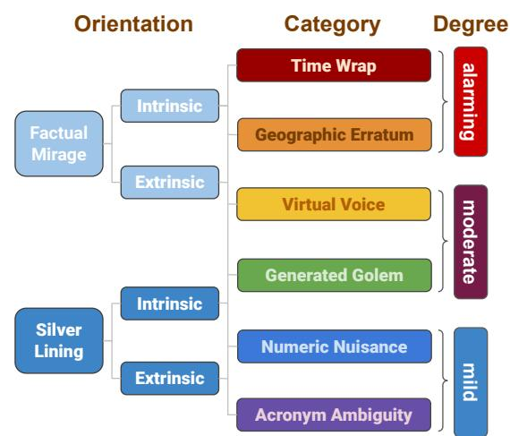
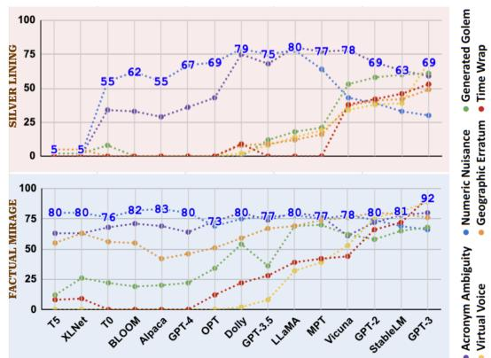
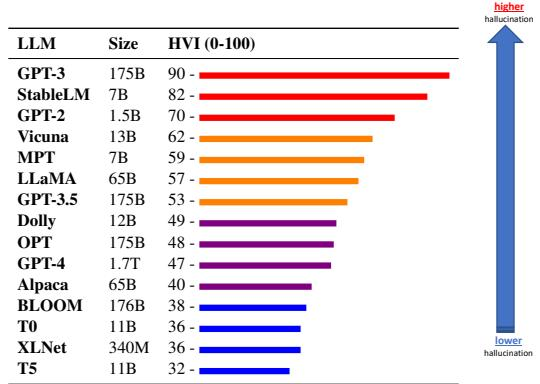
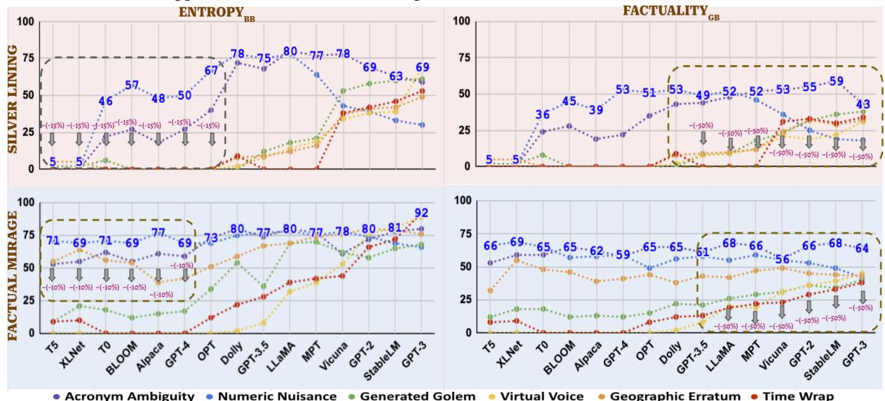
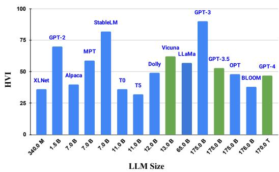
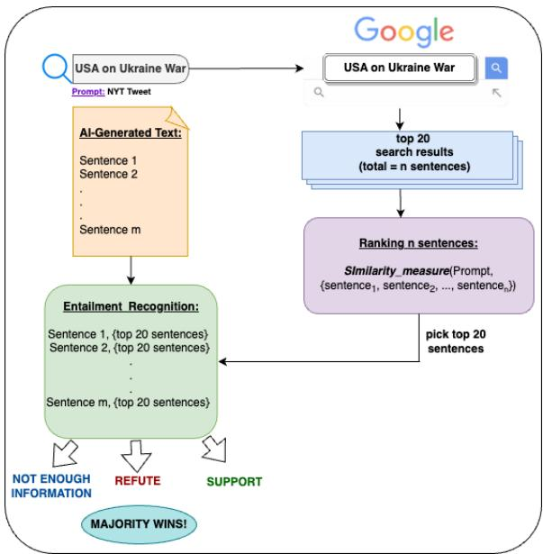
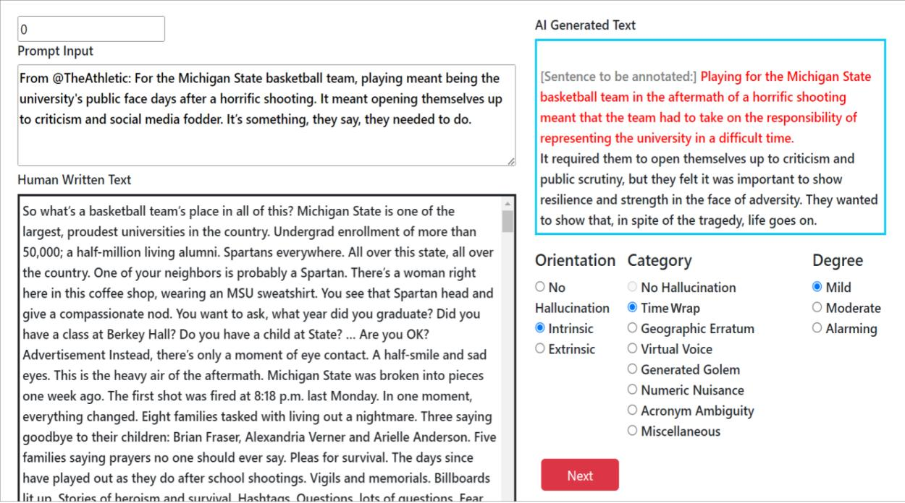
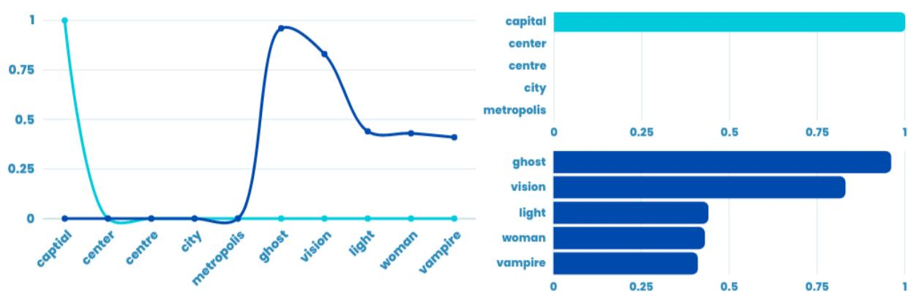

# The Troubling Emergence of Hallucination in Large Language Models – An Extensive Definition, Quantification, and Prescriptive Remediations

Vipula Rawte1∗, Swagata Chakraborty2, Agnibh Pathak2, Anubhav Sarkar2,   
S.M Towhidul Islam Tonmoy3, Aman Chadha4,5†, Amit Sheth1, Amitava Das1 1AI Institute, University of South Carolina, USA, 2Christ University, India 3Islamic University of Technology, Bangladesh 4Stanford University, USA, 5Amazon AI, USA vrawte@mailbox.sc.edu

## Abstract

The recent advancements in Large Language Models (LLMs) have garnered widespread acclaim for their remarkable emerging capabilities. However, the issue of hallucination has parallelly emerged as a by-product, posing significant concerns. While some recent endeavors have been made to identify and mitigate different types of hallucination, there has been a limited emphasis on the nuanced categorization of hallucination and associated mitigation methods. To address this gap, we offer a finegrained discourse on profiling hallucination based on its degree, orientation, and category, along with offering strategies for alleviation. As such, we define two overarching orientations of hallucination: (i)factual mirage (FM) and (ii) silver lining (SL). To provide a more comprehensive understanding, both orientations are further sub-categorized into intrinsic and extrinsic, with three degrees of severity - (i) mild, (ii) moderate, and (iii) alarming. We also meticulously categorize hallucination into six types: (i) acronym ambiguity, (ii) numeric nuisance, (iii) generated golem, (iv) virtual voice, (v) geographic erratum, and (vi) time wrap. Furthermore, we curate HallucInation eLiciTation ( ), a publicly available dataset comprising of 75,000 samples generated using 15 contemporary LLMs along with human annotations for the aforementioned categories. Finally, to establish a method for quantifying and to offer a comparative spectrum that allows us to evaluate and rank LLMs based

on their vulnerability to producing hallucinations, we propose Hallucination Vulnerability Index (HVI). Amidst the extensive deliberations on policy-making for regulating AI development, it is of utmost importance to assess and measure which LLM is more vulnerable towards hallucination. We firmly believe that HVI holds significant value as a tool for the wider NLP community, with the potential to serve as a rubric in AI-related policy-making. In conclusion, we propose two solution strategies for mitigating hallucinations.

## 1 Hallucination: The What and Why

  
Figure 1: Hallucination: orientation, category, and degree (decreasing level of difficulty from top to bottom).

The extraordinary benefits of large generative AI models such as GPT (Brown et al., 2020; OpenAI, 2023a), Stable Diffusion (Rombach et al., 2022), DALL-E (Ramesh et al., 2021, 2022), and Midjourney (Midjourney, 2022) also come with a substantial risk of misuse. The alarm this has triggered is reflected in the open letter (Marcus and of Life Institute, 2023) in March 2023 by thousands of researchers and tech leaders calling for a six-month moratorium on training AI systems that are more sophisticated than GPT-4. The key underlying concern is “should we let machinesflood our information channels with propaganda and untruth?”. In fact, the majority of these falsehoods are widely recognized as hallucination, which can be defined as the generation of content that deviates from the real facts, resulting in unfaithful outputs (Maynez et al., 2020).

To address the inevitable question of ownership attribution for AI-generated artifacts, the US Copyright Office (Copyright-Office, 2023) released a statement stating that if the content is traditional elements of authorship produced by a machine, the work lacks human authorship and the office will not register it for copyright. OpenAI’s response to the prevalent societal pressure led them to issue a public statement (OpenAI, 2023b) emphasizing their commitment to AI safety and their determination to implement improved controls on hallucination in future iterations of GPT. The recent roll-out of Google’s highly anticipated ChatGPT rival, Bard, led to a fiasco owing to it hallucinating a factually inaccurate answer in the company’s advertisement, which cost Google a \$140 billion wipeout in terms of market value (Reuters, 2023). In the ad, Bard is prompted: What new discoveries from the James Webb Space Telescope (JWST)... Bard responds with a number of answers, including one suggesting the JWST was used to take the very first pictures of a planet outside the Earth’s solar system.... The first pictures of exoplanets were, however, taken by the European Southern Observatory’s VLT in 2004. In another incident, a lawyer used ChatGPT to help him prepare a filing in a lawsuit against a US airline. However, Chat-GPT quoted a fabricated previous case precedent, which led the judge to consider imposing sanctions (Forbes, 2023). Amidst these happenings, NVIDIA introduced NeMo Guardrails (nVIDIA, 2023), an open-source toolkit, based on the Self-Check GPT framework (Manakul et al., 2023), designed to address hallucinations in conversational AI systems.

The remarkable capabilities of generative AI have undeniably propelled it to a superpower status! Although the term hallucination has gained widespread acceptance in describing the irrational and uncontrolled behaviors of LLMs, it is important to note that many experts expressed dissatisfaction with this particular nomenclature. Within the AI community, efforts persist to find a more suitable alternative name to describe this phenomenon accurately. During an interview (You, 2023), Prof. Christopher Manning briefly expressed his discontent with the term “hallucination”, indicating a preference for an alternative term. In the ongoing conversation, Prof. Gary Marcus has advocated for a reframing of “hallucination” as confabulation, a term that some fellow researchers have already embraced. However, in this paper, we have decided to uphold the use of the term “hallucination”. In order to offer a comprehensive and precise description of the various types of hallucinations, we will introduce a few new terms. These newly introduced monikers aim to accurately capture and articulate the different categories of hallucinations.

Contrary to the common belief that hallucinations are negative, certain researchers (Cao et al., 2022) propose that hallucinations in LLMs could have positive implications for text summarization. The authors argue that in certain cases, factual hallucinations can be advantageous in a summary by offering valuable background information. Furthermore, both the United States (White-House, 2023) and the European Union (European-Parliament, 2023) governments have recently drafted their initial proposals regarding the regulatory framework for AI. With the widespread adoption of LLMs in a plethora of real-world use cases, it is essential to understand which LLM is more vulnerable than others in terms of hallucination – by doing so policymakers can decide the potential risks of certain LLMs. To this end, we introduce a quantifiable spectrum – Hallucination Vulnerability Index (HVI), which facilitates the evaluation and ranking of LLMs according to their hallucination vulnerability levels.

➠ Presenting a detailed study to unveil how different (15) LLMs hallucinate when given a factually correct prompt vs. a factually incorrect prompt. We name them as factual mirage and silver lining – each sub-categorized into intrinsic and extrinsic, with three degrees of severity: (a) mild, (b) moderate, and (c) alarming (cf. Section 2).

➠ Meticulously categorizing hallucination into six types: (a) acronym ambiguity, (b) numeric nuisance, (c) generated golem, (d) virtual voice, (e) geographic erratum, and (f) time wrap (cf. Section 2).

➠ Introducing (HallucInation eLiciTation), a publicly available dataset comprising of 75,000 text snippets generated using 15 contemporary LLMs along with human annotations for the aforementioned categories (cf. Section 3).

➠ Introducing HVI (Hallucination Vulnerability Index) to perform a quantitative analysis of the inclination of various LLMs to hallucination. (cf. Section 4). HVI characterizes LLMs based on the proposed types of hallucination vulnerabilities (cf. Fig. 2).

➠ While complete mitigation can be a herculean task, we suggest 2 mitigation strategies to alleviate hallucination. We propose to identify high-entropy points in text generated by an LLM with a high HVI and replace them using an LLM with a lower HVI, yielding desired results (cf. Section 6).

➠ We firmly believe that the dataset and HVI measure will serve as valuable resources for future researchers interested in studying the hallucination behaviors of LLMs and seeking to design effective mitigation techniques. HVI will prove to be a useful tool for assessing the categorical impacts of these proposed mitigation techniques.

## 2 A Holistic View of the Hallucination Spectrum: its Types and Scales

The issue of hallucination garnered research attention as early as (Maynez et al., 2020). However, with the growing size of LLMs (empirical evidence provided in Section 6), there is a corresponding increase in LLMs’ susceptibility to hallucination. Consequently, there is a growing interest within the research community to study and understand hallucination to design mitigation techniques.

Researchers have loosely defined hallucinations and studied various notions of hallucinations in isolation. Early exploration of factual vs. nonfactual prompts for checking factuality of LMs is addressed in (Lee et al., 2022). A recent survey conducted by (Maynez et al., 2020), categorized hallucination into two limited classes: intrinsic and extrinsic. Another recent paper (Ladhak et al., 2023b), delved into an intriguing type of hallucination known as name-nationality category hallucination. Several other papers (Raunak et al., 2021; Maynez et al., 2020) have explored taskspecific categories of hallucination, such as summarization, question-answering, machine translation, etc. Preliminary exploration of factual versus non-factual prompts is also addressed in (Lee et al., 2022). However, we purposefully avoid confining our study to a specific task to study the nuances of hallucination. Our main contention is that hallucination can occur in any NLG task, necessitating a thorough examination based on the fundamental principles of text generation from a given prompt. The findings from this study can be applied and extended to various NLP tasks. Thus, this paper aims to offer a comprehensive categorization of hallucination, as outlined below (see Fig. 1).

## 2.1 Orientations of Hallucination

We introduce two primary orientations of hallucination: (i) Factual Mirage (FM) and (ii) Silver Lining (SL), defined and exemplified below.

## 2.1.1 Factual Mirage

Factual mirage (FM) is defined as the phenomenon wherein an LLM engages in hallucination or distortion of a given prompt that is factually correct. FM can be subdivided into two distinct sub-categories.

M I L D   
Prompt: Capital ofFrance   
AI-generated text: ...Paris is also the world fashion capital...   
Fact: Paris.

Intrinsic factual mirage (IFM): In the following example, the LLM is providing a correct response while adding additional supplementary facts such as “the world fashion capital,” resulting in distortion or hallucination, has also been described in (Cao et al., 2022).

Extrinsic factual mirage (EFM): EFM refers to the phenomenon where an LLM deviates from factual accuracy. For example:

ALARMING   
Prompt: Engineering effort to build Eiffel tower   
AI-generated text: ...Designed by Gustave Eifel, it was in  
augurated in 1889 to celebrate the 100th anniversary of the   
European Civil War...   
Fact: Eiffel tower was built to celebrate the 100th anniversary of   
the French Revolution.

## 2.1.2 Silver Lining (SL)

Silver lining (SL) is defined as the phenomenon in which an LLM indulges in hallucination by conjuring an elaborate and captivating narrative based on a given prompt that is factually incorrect.

Intrinsic silver lining (ISL): ISL is the category when in some cases LLM does not generate a convincing story. As an example:

MODE RATE   
Prompt: Cell phone numbers go public this month.   
AI-generated text: ...Starting this month, cell phone num  
bers will be made public as a result of the implementation   
of the Right to Information (RTI) policy...   
Fact: This statement is false.

Extrinsic silver lining (ESL): When an LLM generates a highly detailed and persuasive narrative in response to a factually incorrect prompt, it falls under the category of Extrinsic Silver Lining.

Prompt: Kamala Harris and Elon Musk are getting married   
AI-generated text: Elon Musk got married to Kamala Harris   
in California on Thursday. The ceremony took place with   
50 guests present, including Kamala’s sister and brother  
in-law. Apart from Joe Biden all were present from the   
White House. Kamala’s ex-husband played the saxophone   
at the ceremony. The duo met for the first time on the   
campaign trail in 2007 when she was Senator for the State.   
Elon proposed to Kamala Harris in August 2019 on a beach.   
Kamala accepted and has been dating him ever since...   
Fact: The incident never happened!

## 2.2 Categories of Hallucination

We meticulously classify hallucination into six distinct types, defined and exemplified below.

Numeric Nuisance (NN): This issue occurs when an LLM generates numeric values related to past events, such as dates, ages, or monetary amounts, that are inconsistent with the actual facts.

M O D E R A T E   
Prompt: Twitter is said to have laid offmore workers.   
AI-generated text: The layofs come after Twitter an  
nounced earlier this month that it would be cutting its   
global workforce by 8% or roughly 600 people...   
Fact: Twitter laid off 200 people which is roughly 10%

Acronym Ambiguity (AA): This issue pertains to instances in which LLMs generate an imprecise expansion for an acronym.

MODERATE   
Prompt: RLHF in reinforcement learning   
AI-generated text: ...RLHF is Reward-free Learning from   
Human Feedback in reinforcement learning...   
Fact: RLHF stands for “Reinforcement Learning from Human   
Feedback”

Generated Golem (GG): This issue arises when an LLM fabricates an imaginary personality in relation to a past event, without concrete evidence.

MODERATE   
Prompt: Earthquake in Turkey   
AI-generated text: ...One rescuer, Hasan Cetin, said he was   
motivated by the thought of the survivors he helped save.   
“The moment when a man or a child is pulled out of the   
ruins, the joy of seeing them come back to life is...   
Fact: There is no evidence that the person Hasan Cetin exists.

Virtual Voice (VV): At times LLMs gener  
ate quotations attributed to either fictional or real   
characters without sufficient evidence to verify the   
authenticity of such statements.

ALARMING   
Prompt: Pfizer Press Release on COVID-19 vaccine   
AI-generated text: ...Pfizer emphasized that their vaccine   
demonstrated an impressive eficacy rate... Pfizer CEO said,   
“This is a giant leap for humanity..”   
Fact: Pfizer CEO never said this.

In this instance, the expression giant leap for humanity is quoted from Neil Armstrong’s renowned historical statement upon stepping onto the moon.

Geographic Erratum (GE): This problem occurs when LLMs generate an incorrect location associated with an event. For example here in the first of the following two examples, Pentagon is stated to be situated in India.

Time Wrap (TW): This problem entails LLMs generating text that exhibits a mashed fusion of events from different timelines. in the following case (2nd example) the U.S. president during the Ukraine-Russia war is Joe Biden, not Barack Obama, thus contradicting the factual reality.

ALARMING   
Prompt: Prime Minister ofthe United Kingdom visiting India   
AI-generated text: ...The visit of the United Kingdom’s   
Prime Minister to India holds immense significance...During   
his journey, he will also pay a visit to the Pentagon where   
he is scheduled to meet with Smriti Irani, the Minister of...   
Fact: Pentagon is the defense headquarters of the USA, located   
in Washington DC, USA – not in India.   
ALARMING   
Prompt: USA on Ukraine war   
AI-generated text: ...U.S. President Barack Obama says the   
U.S. will not put troops in Ukraine..   
Fact: The actual U.S. president during the Ukraine-Russia war is   
Joe Biden.

## 2.3 Degrees of Hallucination

We annotate the degree of hallucination using three levels: mild, moderate, and alarming (labeled as 0, 1, and 2 respectively). Mild indicates minor hallucination which is superficial in terms of its impact. Moderate indicates a level of hallucination that introduces facts that are either fictitious or tangential to the topic at hand. Alarming indicates added information pieces that bear a radical dissemblance from the topic fed via the prompt. Please refer to Appendix B for more details.

## 3 : HallucInation eLiciTation dataset

HILT is a first-of-its-kind publicly available hallucination dataset. To construct this dataset, we have utilized two primary sources of data as prompts: (i) NYTimes tweets (NYT) (factually correct – FM) and (ii) the Politifact dataset (Politifact) (factually incorrect – SL). We selected 15 LLMs, based on the criteria delineated in Section 3.1, and used them to generate a total of 75,000 text passages, with each LLM producing 5,000 text prose entries. These entries were categorized as 2,500 each for FM and SL. The text prompts provided to these LLMs consisted of tweets from NYTimes and headlines sourced from the Politifact dataset. Table 1 reports detailed statistics about .

<table><tr><td>Orientation →</td><td colspan="2">Factual Mirage (FM)</td><td colspan="2">Silver Lining (SL)</td></tr><tr><td>Categories ↓</td><td>IFM</td><td>EFM</td><td>ISL</td><td>ESL</td></tr><tr><td>Time Wrap</td><td>1,650</td><td>4,950</td><td>2228</td><td>3342</td></tr><tr><td>Acronym Àmbiguity</td><td>675</td><td>550</td><td>1830</td><td>1255</td></tr><tr><td>Generated Golem</td><td>5,550</td><td>9,300</td><td>2302</td><td>1819</td></tr><tr><td>Virtual Voice</td><td>14,100</td><td>13,950</td><td>5782</td><td>8712</td></tr><tr><td>Numeric Nuisance</td><td>2,025</td><td>5,250</td><td>3210</td><td>5760</td></tr><tr><td>Geographic Erratum</td><td>6,225</td><td>6,825</td><td>1232</td><td>4530</td></tr><tr><td>Total</td><td>30,225</td><td>40,825</td><td>33,168</td><td>25,418</td></tr></table>

Table 1: Statistics of the HILT dataset (total: 129K annotated sentences).

## 3.1 Choice of LLMs: Rationale and Coverage

We chose 15 contemporary LLMs that have exhibited exceptional results on a wide range of NLP tasks, including: (i) GPT-4 (OpenAI, 2023a), (ii) GPT-3.5 (OpenAI, 2022), (iii) GPT-3 (Brown et al., 2020), (iv) GPT-2 (Radford et al., 2019), (v) MPT (Wang et al., 2023), (vi) OPT (Zhang et al., 2022), (vii) LLaMA (Touvron et al., 2023), (viii) BLOOM (Scao et al., 2022), (ix) Alpaca (Taori et al., 2023), (x) Vicuna (Chiang et al., 2023), (xi) Dolly (databricks, 2023), (xii) StableLM (AI, 2023), (xiii) XLNet (Yang et al., 2019), (xiv) T5 (Raffel et al., 2020), and (xv) T0 (Deleu et al., 2022). Appendix C.1 discusses additional details behind our selection criteria. Given the ever-evolving nature of the field, and HVI benchmark leaderboards will remain accessible to the research community, fostering an environment of continuous updates and contributions.

## 3.2 Annotating Hallucination

For the annotation task of the 75,000 text snippets, we utilized Amazon Mechanical Turk (Amazon). We obtain sentence-level annotations for hallucination orientations and categories. We record four annotations per sentence and adopt the MACE tool (Hovy et al., 2013) to assess inter-annotator agreement and aggregate data. MACE has been empirically demonstrated to outperform majority voting, exhibiting superior performance (cf. Appendix B).

## 4 Hallucination Vulnerability Index (HVI)

Given the growing usage of LLMs and their likeliness to hallucinate, there exists no uniform evaluation metric to measure these LLMs’ hallucinations. To address this gap, we define HVI, a comparative spectrum that allows us to evaluate and rank LLMs based on their vulnerability to producing hallucinations. HVI is calculated as in Eq. (1):

$$
\begin{array} { r } { H V I _ { x } = \frac { 1 0 0 } { U * 2 } \left[ \sum _ { x = 1 } ^ { U } ( N ( x ) - N ( E F M ) ) * ( 1 - P ( E F M ) + \delta _ { 1 } ) + \right. } \end{array}
$$

$$
\left( N ( x ) - N ( E S L ) \right) * \left( 1 - P ( E S L ) + \delta _ { 2 } \right) ]\tag{1}
$$

When defining HVI, we take several factors into account. Firstly, not all sentences generated by an LLM are hallucinated, so it is important to determine the ratio of actual hallucinated sentences with the total number of sentences. In this context, we consider $U$ as the total number of sentences and $N ( x )$ as the total number of hallucinated sentences produced by an LLM. Secondly, LLMs can exhibit different characteristics, such as higher EFM or ESL tendencies, or they can have varying levels of overall hallucination. This notion is captured by introducing the terms $N ( x ) - N ( E F M )$ and $N ( x ) - N ( E S L )$ in the equation. It is worth noting that we did not consider variations of intrinsic hallucinations in HVI calculation, as they are relatively minor and exhibit lower vulnerability overall. Lastly, comparative measures are needed to rank LLMs based on their vulnerability to hallucination. This is achieved using multiplicative damping factors, $\delta _ { 1 }$ and $\delta _ { 2 }$ , which are calculated based on $\mu \pm r a n k _ { x } \times \sigma$ . Initially, we calculate the HVI for all 15 LLMs, considering $\delta _ { 1 }$ and $\delta _ { 2 }$ as zero. With these initial HVIs, we obtain the mean (µ) and standard deviation (σ), allowing us to recalculate the HVIs for all the LLMs. The resulting HVIs are then ranked and scaled providing a comparative spectrum as presented in Fig. 3, similar to z-score normalization (Wikipedia\_zscore) and/or min-max normalization (Wikipedia\_min\_max). Having damping factors enables easy exponential smoothing with a handful of data points, 15 in this case. Finally, for ease of interpretability, HVI is scaled between 0 100.

Figure 2: HVI for different hallucination categories across various LLMs.  
  
Figure 3: The HVI scale illustrates the hallucination tendencies exhibited by various LLMs.

## Implications derived from HVI

➠ Larger LLMs without RLHF (Ziegler et al., 2019) are prone to both orientations of hallucination, as shown in Fig. 3. To inspect the categorical changes in hallucination behavior for a particular LLM, please refer to the vertical axis of the HVI spectrum.

➠ As per our definitions, Numeric Nuisance and Acronym Ambiguity are mild hallucination categories, showing reduced SL orientation as LLM size grows. Conversely, complex categories like Time Wrap and Geographic Erratum become more prevalent. Notably, Virtual Voice significantly increases from GPT-3.5 to GPT-4.

➠ For smaller LLMs like T5, Dolly, etc., Generated Golem, Virtual Voice, and Geographic Erratum categories of hallucination are rarely observed.

<table><tr><td rowspan=1 colspan=1>Prompt</td><td rowspan=1 colspan=3>USA&#x27;s stance on Ukraine Russia war</td></tr><tr><td rowspan=3 colspan=1>Haluatedtex</td><td rowspan=2 colspan=2>The official stance of the United Stateson the Russia-Ukrainewar has been consistent in supportingUkraine&#x27;s sovereignty, territorial integrity, and the peaceful resolutionconflict. The U.S. has</td><td rowspan=1 colspan=1>of the</td></tr><tr><td rowspan=1 colspan=1></td><td rowspan=1 colspan=1>stance,</td></tr><tr><td rowspan=1 colspan=3>the U.S. President Barack Obamastated that theUnited Stateswould not deploy troops toUkraine.. Additionally, this lack of support extends to the withholding of financial andmilitary assistance, includingmilitary equipmenttraining, andadvisory supportThissentiment was reiteratedbyPaul Altmanduring a press review at theWhite House</td></tr><tr><td rowspan=1 colspan=1>Mi atextENTPRYB</td><td rowspan=1 colspan=3>The official stance of thegovernmenton theongoingwar has been consistent in supportingresolution of the conflict. Thegovernment has condemned Russia incountryand itssupport for separatist movements in eastern country . Despite maintaining a neutralstance, thegovernmentstated that thecountrywould not deploy troops to unknown. Additionally,this lack of support extends to the withholding of financial and resources, including administrative,technical, andlegal. This sentiment wasechoedbyministerduring a press reviewat theconference</td></tr><tr><td rowspan=4 colspan=1>Edns onsEACTTYGEB</td><td rowspan=1 colspan=3>The oficial stance of the United States on the Russia-Ukraine war has been consistent in supportingUkraine&#x27;s sovereignty, territorial integrity, and the peace-ful resolution of the conflict.  The U.S.hascondemned Russia&#x27;sactionsinannexingCrimeaanditssupportforseparatistmovementsin easternUkraine</td></tr><tr><td rowspan=1 colspan=3>Despite maintaining a diplomatic stance, U.S. President Barack Obama stated that the United States would not deploy troops to Ukraine.Additionally, this lack of support extends to the</td></tr><tr><td rowspan=1 colspan=3>withholding of financial and military assistance, including military equipment, training, and advisory support. This sentiment was reiterated by Paul Altman during a press review at the</td></tr><tr><td rowspan=1 colspan=3>White House</td></tr></table>

Figure 4: A hallucination example pre- and post-mitigation. A - hallucinated fragments, B - high entropy fragments, C - replaced text, D - highlighted text for no information found, and E - refuted text fragments by textual entailment. Appendix F contains more examples.  
  
Figure 5: Impact of mitigation techniques across the various categories and types of hallucination. For details on the evaluation strategy, i.e., the process of identifying the degree of hallucination after mitigation, cf. Appendix F.2.

## 5 HVI vs. LLMs size for different LLMs: An insight from

There is a general observation that LLMs may exhibit a higher tendency towards generating hallucinations or producing outputs that deviate from factual or coherent information. However, it is important to note that the relationship between LLM size and hallucination is not necessarily a direct correlation, but rather a consideration based on certain factors such as (a) training data quality, (b) lack of explicit training on facts, and (c) overconfidence in generated responses. A noteworthy pattern that emerges is that LLMs without RLHF (Reinforcement Learning from Human Feedback) (Ziegler et al., 2019) tend to exhibit a higher tendency for hallucination. Although we did not extensively evaluate this phenomenon, we have a keen interest in investigating it further in the near future. While we tried to examine the effect of size on HVI, it looks like there are several other factors contributing to HVI behavior as evident in Fig. 6.

  
Figure 6: HVI vs. LLM size for different LLMs. Green indicates LLMs using RLHF.

## 6 Hallucination Mitigation Strategies

Thus far, two classes of approaches have been proposed to address the issue of hallucination: (i) preventing LLMs from hallucinating, which involves implementing strategies during the training and/or generation processes; (ii) mitigating hallucination after generation. (Manakul et al., 2023) introduced another taxonomy of classification, categorizing methods into black-box and gray-box. Factuality checks during and/or after generation without relying on external resources are known as black-box methods, while those using external resources are referred to as gray-box methods.

Other hallucination mitigation techniques involve reranking the generated sample responses (Dale et al., 2022) and improving beam search (Sridhar and Visser, 2022). Some recent mitigation techniques (Li et al., 2023; Mündler et al., 2023; Pfeiffer et al., 2023; Chen et al., 2023; Zhang et al., 2023b,a; Ladhak et al., 2023a; Manakul et al., 2023; Agrawal et al., 2023) show initial attempts at reducing hallucination.

Although the complete elimination of hallucination is a complex challenge, this paper explores two plausible directions for mitigation: (i) automatic and (ii) human-in-the-loop. The former is a black-box method where we identify high-entropy words in a given hallucinated text (generated by a high-HVI LLM) and replace them with predictions from another LLM (lower-HVI). The latter is a gray-box method that involves sentence-level factchecking using textual entailment techniques. This method aims to identify sentences that are deemed

susceptible, urging them for human review.
<table><tr><td></td><td>ALBERT</td><td>BERT</td><td>DISTIL-ROBERTA</td><td>XLM-ROBERTA</td></tr><tr><td>ALBERT</td><td>6.72</td><td>3.26</td><td>10.66</td><td>6.40</td></tr><tr><td>BERT</td><td>4.70</td><td>7.56</td><td>7.98</td><td>7.22</td></tr><tr><td>DISTIL-ROBERTA</td><td>2.02</td><td>7.31</td><td>4.55</td><td>9.95</td></tr><tr><td>XLM-ROBERTA</td><td>2.26</td><td>6.28</td><td>1.70</td><td>4.78</td></tr></table>

Table 2: The row represents the LLM used for detecting high entropy words from GPT-3’s output, while the column represents the LLM for replacing those words. 10.66 indicates the maximum drop in hallucination.

## 6.1 High Entropy Word Spotting and Replacement (ENTROPYBB): A Black-box approach

While detecting high entropy words may seem to be technically feasible, there is an inherent challenge that many modern LLMs are not open-source (their APIs are subscription-based). The feasible solution we propose here is the utilization of opensource LLMs to identify high entropy words. A lower HVI-based LLM is then used to replace the detected words (see Fig. 4). The outcomes of the detection and replacement strategies discussed earlier are presented in Table 2 for GPT-3. The results indicate that albert-large-v2 (Lan et al., 2020) performs exceptionally well in detecting high entropy words in GPT-3-generated content. On the other hand, distilroberta-base (Sanh et al., 2019) demonstrates superior performance in replacing high entropy words, which in turn, manifests as a lower hallucination. A crucial aspect of our approach is treating consecutive high-entropy words as a single unit. In such cases, these words are masked together before replacement. This strategy proves to be effective, particularly for hallucinations related to Generated Golem or Acronym Ambiguity (cf. Appendix F.1).

## 6.1.1 Lowering Concreteness of Language

It is observed in (Varshney et al., 2023) that higher uncertainty in the model’s prediction (indicated by a low probability score) suggests a higher likelihood of the model hallucinating about that particular concept. In this context, we suggest that substituting high entropy points with less concrete words can help prevent hallucinations. Concreteness (Paivio, 2013) measures how much a word embodies a tangible or perceivable concept. Concrete words are simpler to comprehend than abstract ones. The level of concreteness for each word is denoted on a 5-point scale, ranging from abstract to concrete. Concreteness ratings cover 39,954 entries, including 37,058 individual English words and 2,896 two-word expressions (Brysbaert et al., 2014), being used here.

## 6.2 Factuality Check of Sentences (FACTUALITYGB): A Gray-box approach

We use Google Search API (Search) to search for a given prompt, which has been utilized to generate the text and retrieve the top 20 documents. Then each sentence of AI-generated text has been validated either into support, refute, or not enough information using RoBERTa Large (Liu et al., 2019), a SoTA textual entailment model trained on the SNLI (Bowman et al., 2015) (cf. Section 6.2.1). Inevitably, sentences with higher scores in the refute and not enough information categories are flagged for additional human checking. Empirically, we observe an overall alert rate of 26% on sentences generated by an LLM, implying 26% of the text required rewriting in order to mitigate.

## 6.2.1 FACTUALITYGB

Gray-box model does require output token-level probabilities (Manakul et al., 2023). Fig. 7 shows FACTUALITYGB, representing AI-generated text (from our HILT benchmark) based on a given prompt. In this method, the prompt is sent to the Google Search API to obtain the top 20 relevant search results. Out of these 20 results, we evaluate a total of n sentences for their relevance to the prompt using a similarity measure. The top 20 sentences most similar to the prompt are selected. For each of the m sentences in the AI-generated text and the top 20 ranked sentences, we employ a textual entailment model to assess their trustworthiness individually. Based on their entailment scores, we categorize the AI-generated text into three groups: (i) support, (ii) refute, and (iii) not enough information.

  
Figure 7: FACTUALITYGB: textual entailment on prompt and external documents.

Performance of $\mathbf { E N T R O P Y _ { B B } }$ vs. FACTUALITYGB: Fig. 5 offers a comparative analysis of the proposed approaches. While $\mathrm { E N T R O P Y _ { B B } }$ addresses simpler hallucinations such as Acronym Ambiguity and Numeric Nuisance, FACTUALITYGB handles more complex cases. It is clear that a balanced combination of black-box and gray-box approaches is the inevitable future avenue (cf. Appendix F.3).

## 7 Conclusion and Future Avenues

The enthusiasm and achievements surrounding LLMs have led to their widespread adoption, and this trend is only expected to flourish. However, one of the most significant challenges faced by LLMs today is hallucination. In light of this, benchmark and Hallucination Vulnerability Index (HVI) will continue to serve the wider scientific community and aid policy-makers. benchmark and HVI will be publicly open for further collaborative updates. Two proposed mitigation techniques can serve as baselines.

## 8 Discussion and Limitations

Discussion: On June 14th, 2023, the European Parliament successfully passed its version of the EU AI Act (European-Parliament, 2023). Subsequently, a team of researchers from the Stanford Institute for Human-Centered Artificial Intelligence (HAI) embarked on investigating the extent to which Foundation Model Providers comply with the EU AI Act. Their initial findings are presented in the publication (Bommasani et al., 2023). In this study, the authors put forward a grading system consisting of 12 aspects for evaluating LLMs. These aspects include (i) data sources, (ii) data governance, (iii) copyrighted data, (iv) compute, (v) energy, (vi) capabilities & limitations, (vii) risk & mitigations, (viii) evaluation, (ix) testing, (x) machine-generated content, (xi) member states, and (xii) downstream documentation. The overall grading of each LLM can be observed in Fig. 8. While this study is commendable, it appears to be inherently incomplete due to the ever-evolving nature of LLMs. Since all scores are assigned manually, any future changes will require a reassessment of this rubric, while HVI is auto-computable. Furthermore, we propose that HVI should be considered the most suitable category for assessing risk and mitigations, as well as the evaluation of machine-generated content.

Limitations: In this paper, we present a unique and extensive benchmark corpus for hallucination called . We propose two main types of hallucination: (i) Factual Mirage and (ii) Silver Lining, each further divided into intrinsic and extrinsic subcategories. Additionally, we introduce six detailed categories of hallucination along with a measure of its intensity. We believe the following aspects require critical attention in future endeavors.

Limitation 1: For the sake of simplicity, we have only considered one category per sentence during annotation, although we acknowledge the presence of multi-class and multi-label instances. For instance, in the following example, there are two kinds of hallucination, namely Time Wrap and

Numeric Nuisance present in the shown sentence. We would like to explore this direction in the immediate future.

ALARMING   
Prompt: Engineering effort to build Eiffel tower   
AI-generated text: ...Designed by Gustave Eifel, it was in  
augurated in 1889 to celebrate the 100th anniversary of   
the European Civil War, while construction began a decade   
prior to its inauguration....   
Fact 1: Eiffel tower was built to celebrate the 100th anniversary   
of the French Revolution.   
Fact 2: Eiffel Tower construction was started in 1887, not in 1879.

Limitation 2: While we have meticulously defined the categories of hallucination, we recognize the potential for new categories to emerge in the future with the advancement of LLMs. An instance of this is the introduction of name-nationality hallucination by (Ladhak et al., 2023b), where a person named Jung Lee is falsely attributed with French nationality. Although one could argue that Mr Lee may indeed be a French national, considering his birth and upbringing there, the authors confirm that no such individual exists. We posit that namenationality hallucination falls under the sub-class of generated golems. It is plausible that a combination of our defined categories may exist, although we did not extensively studied these possibilities.

Limitation 3: For this study, we have chosen 15 contemporary LLMs. In the dynamic landscape of LLM development, new models are constantly emerging, and we acknowledge that our selection may not encompass all available options. Keeping this in mind, we will make the benchmark and the HVI publicly accessible for collaborative updates and contributions.

Limitation 4: The FACTUALITYGB technique operates based on entailment, allowing it to distinguish between sentences containing different entities such as Barack Obama and Joe Biden. However, it is unable to differentiate sentences that involve similar entities like AI and AAAI. In contrast, the ENTROPYBB technique operates at the token level and is capable of handling cases like 1789 vs. 1889. These distinctions become evident in the observed results.

Grading Foundation Model Providers' Compliance with the Draft EU Al Act Source: Stanford Center for Research on Foundation Models (CRFM), Institute for Human-Centered Artificial Intelligence (HAI
<table><tr><td rowspan=3 colspan=3>OpenAIcohere</td><td></td><td></td><td></td><td></td><td></td><td></td><td></td><td></td><td></td></tr><tr><td rowspan=2 colspan=1>cohere</td><td rowspan=2 colspan=1>stability.ai</td><td rowspan=2 colspan=1>ANTHROP\C</td><td rowspan=2 colspan=1>Google</td><td rowspan=2 colspan=1>BBigScience</td><td rowspan=2 colspan=1>∞Meta</td><td rowspan=2 colspan=1>AI21labs</td><td rowspan=2 colspan=1>NALPHAALEPP</td><td rowspan=2 colspan=1>ELeutherRI</td><td></td></tr><tr><td rowspan=1 colspan=1></td></tr><tr><td rowspan=1 colspan=1>Draft Al Act Requirements</td><td rowspan=1 colspan=1>GPT-4</td><td rowspan=1 colspan=1>CohereCommand</td><td rowspan=1 colspan=1>StableDiffusion v2</td><td rowspan=1 colspan=1>Claude</td><td rowspan=1 colspan=1>PaLM2</td><td rowspan=1 colspan=1>BLOOM</td><td rowspan=1 colspan=1>LLaMA</td><td rowspan=1 colspan=1>Jurassic-2</td><td rowspan=1 colspan=1>Luminous</td><td rowspan=1 colspan=1>GPT-NeoX</td><td rowspan=1 colspan=1>Totals</td></tr><tr><td rowspan=1 colspan=1>Data sources</td><td rowspan=1 colspan=1>O○○</td><td rowspan=1 colspan=1>O</td><td rowspan=1 colspan=1></td><td rowspan=1 colspan=1>○○○○</td><td rowspan=1 colspan=1>○○</td><td rowspan=1 colspan=1></td><td rowspan=1 colspan=1></td><td rowspan=1 colspan=1>○○○○</td><td rowspan=1 colspan=1>○○○○</td><td rowspan=1 colspan=1></td><td rowspan=1 colspan=1>22</td></tr><tr><td rowspan=1 colspan=1>Data governance</td><td rowspan=1 colspan=1>OO</td><td rowspan=1 colspan=1>O</td><td rowspan=1 colspan=1>OO</td><td rowspan=1 colspan=1>○○○O</td><td rowspan=1 colspan=1>O</td><td rowspan=1 colspan=1></td><td rowspan=1 colspan=1>oo</td><td rowspan=1 colspan=1>OO○○</td><td rowspan=1 colspan=1>OO○○</td><td rowspan=1 colspan=1>O</td><td rowspan=1 colspan=1>19</td></tr><tr><td rowspan=1 colspan=1>Copyrighted data</td><td rowspan=1 colspan=1>OOOO</td><td rowspan=1 colspan=1>OOOO</td><td rowspan=1 colspan=1>OOOO</td><td rowspan=1 colspan=1>O○OO</td><td rowspan=1 colspan=1>OOOO</td><td rowspan=1 colspan=1>O</td><td rowspan=1 colspan=1>OO○O</td><td rowspan=1 colspan=1>OOOO</td><td rowspan=1 colspan=1>OO○○</td><td rowspan=1 colspan=1></td><td rowspan=1 colspan=1>7</td></tr><tr><td rowspan=1 colspan=1>Compute</td><td rowspan=1 colspan=1>OOOO</td><td rowspan=1 colspan=1>OOOO</td><td rowspan=1 colspan=1></td><td rowspan=1 colspan=1>○○OO</td><td rowspan=1 colspan=1>OOOO</td><td rowspan=1 colspan=1></td><td rowspan=1 colspan=1></td><td rowspan=1 colspan=1>OOOO</td><td rowspan=1 colspan=1>Oo○</td><td rowspan=1 colspan=1></td><td rowspan=1 colspan=1>17</td></tr><tr><td rowspan=1 colspan=1>Energy</td><td rowspan=1 colspan=1>OOOO</td><td rowspan=1 colspan=1>OOO</td><td rowspan=1 colspan=1>O</td><td rowspan=1 colspan=1>OOOO</td><td rowspan=1 colspan=1>OOOO</td><td rowspan=1 colspan=1></td><td rowspan=1 colspan=1></td><td rowspan=1 colspan=1>OOOO</td><td rowspan=1 colspan=1>OOOO</td><td rowspan=1 colspan=1></td><td rowspan=1 colspan=1>16</td></tr><tr><td rowspan=1 colspan=1>Capabilities &amp; limitations</td><td rowspan=1 colspan=1></td><td rowspan=1 colspan=1>C</td><td rowspan=1 colspan=1></td><td rowspan=1 colspan=1>○○O</td><td rowspan=1 colspan=1></td><td rowspan=1 colspan=1>O</td><td rowspan=1 colspan=1>oO</td><td rowspan=1 colspan=1>OO</td><td rowspan=1 colspan=1>OOO</td><td rowspan=1 colspan=1>O</td><td rowspan=1 colspan=1>27</td></tr><tr><td rowspan=1 colspan=1>Risks &amp; mitigations</td><td rowspan=1 colspan=1>O</td><td rowspan=1 colspan=1>OO</td><td rowspan=1 colspan=1>OOO</td><td rowspan=1 colspan=1>○○O</td><td rowspan=1 colspan=1>O</td><td rowspan=1 colspan=1>○○</td><td rowspan=1 colspan=1>○○○</td><td rowspan=1 colspan=1>○o</td><td rowspan=1 colspan=1>OOoo</td><td rowspan=1 colspan=1>○○○</td><td rowspan=1 colspan=1>16</td></tr><tr><td rowspan=1 colspan=1>Evaluations</td><td rowspan=1 colspan=1></td><td rowspan=1 colspan=1>OO</td><td rowspan=1 colspan=1>OOOO</td><td rowspan=1 colspan=1>OOOO</td><td rowspan=1 colspan=1>OO</td><td rowspan=1 colspan=1>O</td><td rowspan=1 colspan=1>○O</td><td rowspan=1 colspan=1>O OOO</td><td rowspan=1 colspan=1>O○○</td><td rowspan=1 colspan=1>O○O</td><td rowspan=1 colspan=1>15</td></tr><tr><td rowspan=1 colspan=1>Testing</td><td rowspan=1 colspan=1>O</td><td rowspan=1 colspan=1>OO</td><td rowspan=1 colspan=1>○○○O</td><td rowspan=1 colspan=1>○○○O</td><td rowspan=1 colspan=1>oo</td><td rowspan=1 colspan=1>OO</td><td rowspan=1 colspan=1>O○○○</td><td rowspan=1 colspan=1>○○○</td><td rowspan=1 colspan=1>O○○○</td><td rowspan=1 colspan=1>O○○○</td><td rowspan=1 colspan=1>10</td></tr><tr><td rowspan=1 colspan=1>Machine-generated content</td><td rowspan=1 colspan=1>O</td><td rowspan=1 colspan=1>O</td><td rowspan=1 colspan=1>○○○○</td><td rowspan=1 colspan=1>C 意O</td><td rowspan=1 colspan=1>O</td><td rowspan=1 colspan=1>O</td><td rowspan=1 colspan=1>O○○○</td><td rowspan=1 colspan=1>●O</td><td rowspan=1 colspan=1>○○○</td><td rowspan=1 colspan=1>●O</td><td rowspan=1 colspan=1>21</td></tr><tr><td rowspan=1 colspan=1>Member states</td><td rowspan=1 colspan=1>OO</td><td rowspan=1 colspan=1>OOOO</td><td rowspan=1 colspan=1>OOOO</td><td rowspan=1 colspan=1>OO</td><td rowspan=1 colspan=1></td><td rowspan=1 colspan=1>O○○O</td><td rowspan=1 colspan=1>OO○○</td><td rowspan=1 colspan=1>OOOO</td><td rowspan=1 colspan=1>○○○</td><td rowspan=1 colspan=1>oO</td><td rowspan=1 colspan=1>9</td></tr><tr><td rowspan=1 colspan=1>Downstream documentation</td><td rowspan=1 colspan=1>CO</td><td rowspan=1 colspan=1></td><td rowspan=1 colspan=1></td><td rowspan=1 colspan=1>○○○O</td><td rowspan=1 colspan=1></td><td rowspan=1 colspan=1></td><td rowspan=1 colspan=1>O00</td><td rowspan=1 colspan=1>○O○○</td><td rowspan=1 colspan=1>OO○O</td><td rowspan=1 colspan=1>O</td><td rowspan=1 colspan=1>24</td></tr><tr><td rowspan=1 colspan=1>Totals</td><td rowspan=1 colspan=1>25/48</td><td rowspan=1 colspan=1>23/48</td><td rowspan=1 colspan=1>22/48</td><td rowspan=1 colspan=1>7/48</td><td rowspan=1 colspan=1>27/48</td><td rowspan=1 colspan=1>36/48</td><td rowspan=1 colspan=1>21/48</td><td rowspan=1 colspan=1>8/48</td><td rowspan=1 colspan=1>5/48</td><td rowspan=1 colspan=1>29/48</td><td rowspan=1 colspan=1></td></tr></table>

Figure 8: Grading of current LLMs as proposed by a report entitled Do Foundation Model Providers Comply with the EU AI Act? from Stanford University (Bommasani et al., 2023).

## 9 Ethical Considerations

Through our experiments, we have uncovered the susceptibility of LLMs to hallucination. In developing HVI, we intend to provide a framework that can inform future research and policies in this domain. However, we must address the potential misuse of our findings by malicious entities who may exploit AI-generated text, such as creating indistinguishable fake news from human-written content. We vehemently discourage such misuse and strongly advise against it.

## References

2023. The future of computational linguistics.

Abien Fred Agarap. 2019. Deep learning using rectified linear units (relu).

Ayush Agrawal, Lester Mackey, and Adam Tauman Kalai. 2023. Do language models know when they’re hallucinating references?

Stability AI. 2023. Stability ai launches the first of its stable lm suite of language models.

Amazon. Amazon mechanical turk.

Rishi Bommasani, Kevin Klyman, Daniel Zhang, and Percy Liang. 2023. Do foundation model providers comply with the eu ai act?

Samuel R Bowman, Gabor Angeli, Christopher Potts, and Christopher D Manning. 2015. The snli corpus.

Tom Brown, Benjamin Mann, Nick Ryder, Melanie Subbiah, Jared D Kaplan, Prafulla Dhariwal, Arvind Neelakantan, Pranav Shyam, Girish Sastry, Amanda Askell, et al. 2020. Language models are few-shot learners. Advances in neural information processing systems, 33:1877–1901.

Marc Brysbaert, Amy Beth Warriner, and Victor Kuperman. 2014. Concreteness ratings for 40 thousand generally known english word lemmas. Behavior research methods, 46:904–911.

Meng Cao, Yue Dong, and Jackie Chi Kit Cheung. 2022. Hallucinated but factual! inspecting the factuality of hallucinations in abstractive summarization. In Proceedings of the 60th Annual Meeting of the Associationfor Computational Linguistics (Volume 1: Long Papers), pages 3340–3354.

Anthony Chen, Panupong Pasupat, Sameer Singh, Hongrae Lee, and Kelvin Guu. 2023. Purr: Efficiently

editing language model hallucinations by denoising language model corruptions.

Wei-Lin Chiang, Zhuohan Li, Zi Lin, Ying Sheng, Zhanghao Wu, Hao Zhang, Lianmin Zheng, Siyuan Zhuang, Yonghao Zhuang, Joseph E. Gonzalez, Ion Stoica, and Eric P. Xing. 2023. Vicuna: An opensource chatbot impressing gpt-4 with 90%\* chatgpt quality.

Copyright-Office. 2023. Copyright registration guidance: Works containing material generated by artificial intelligence. Library of Congress.

David Dale, Elena Voita, Loïc Barrault, and Marta R. Costa-jussà. 2022. Detecting and mitigating hallucinations in machine translation: Model internal workings alone do well, sentence similarity even better.

Tri Dao, Dan Fu, Stefano Ermon, Atri Rudra, and Christopher Ré. 2022. Flashattention: Fast and memory-efficient exact attention with io-awareness. Advances in Neural Information Processing Systems, 35:16344–16359.

databricks. 2023. Dolly.

Tristan Deleu, David Kanaa, Leo Feng, Giancarlo Kerg, Yoshua Bengio, Guillaume Lajoie, and Pierre-Luc Bacon. 2022. Continuous-time meta-learning with forward mode differentiation. In The Tenth International Conference on Learning Representations, ICLR 2022, Virtual Event, April 25-29, 2022. Open-Review.net.

European-Parliament. 2023. Proposal for a regulation of the european parliament and of the council laying down harmonised rules on artificial intelligence (artificial intelligence act) and amending certain union legislative acts.

Forbes. 2023. Lawyer used chatgpt in court—and cited fake cases. a judge is considering sanctions.

Dirk Hovy, Taylor Berg-Kirkpatrick, Ashish Vaswani, and Eduard Hovy. 2013. Learning whom to trust with MACE. In Proceedings ofthe 2013 Conference of the North American Chapter of the Association for Computational Linguistics: Human Language Technologies, pages 1120–1130, Atlanta, Georgia. Association for Computational Linguistics.

HuggingFace\_InferenceAPI. Huggingface inference api.

Faisal Ladhak, Esin Durmus, Mirac Suzgun, Tianyi Zhang, Dan Jurafsky, Kathleen McKeown, and Tatsunori Hashimoto. 2023a. When do pre-training biases propagate to downstream tasks? a case study in text summarization. In Proceedings ofthe 17th Conference ofthe European Chapter ofthe Association for Computational Linguistics, pages 3206–3219, Dubrovnik, Croatia. Association for Computational Linguistics.

Faisal Ladhak, Esin Durmus, Mirac Suzgun, Tianyi Zhang, Dan Jurafsky, Kathleen Mckeown, and Tatsunori B Hashimoto. 2023b. When do pre-training biases propagate to downstream tasks? a case study in text summarization. In Proceedings of the 17th Conference of the European Chapter of the Associationfor Computational Linguistics, pages 3198– 3211.

Zhenzhong Lan, Mingda Chen, Sebastian Goodman, Kevin Gimpel, Piyush Sharma, and Radu Soricut. 2020. Albert: A lite bert for self-supervised learning of language representations.

Nayeon Lee, Wei Ping, Peng Xu, Mostofa Patwary, Pascale N Fung, Mohammad Shoeybi, and Bryan Catanzaro. 2022. Factuality enhanced language models for open-ended text generation. In Advances in Neural Information Processing Systems, volume 35, pages 34586–34599. Curran Associates, Inc.

Junyi Li, Xiaoxue Cheng, Wayne Xin Zhao, Jian-Yun Nie, and Ji-Rong Wen. 2023. Halueval: A largescale hallucination evaluation benchmark for large language models.

Yinhan Liu, Myle Ott, Naman Goyal, Jingfei Du, Mandar Joshi, Danqi Chen, Omer Levy, Mike Lewis, Luke Zettlemoyer, and Veselin Stoyanov. 2019. Roberta: A robustly optimized bert pretraining approach. arXiv preprint arXiv:1907.11692.

Potsawee Manakul, Adian Liusie, and Mark J. F. Gales. 2023. Selfcheckgpt: Zero-resource black-box hallucination detection for generative large language models.

Gary Marcus and Future of Life Institute. 2023. Pause giant ai experiments: An open letter.

Joshua Maynez, Shashi Narayan, Bernd Bohnet, and Ryan McDonald. 2020. On faithfulness and factuality in abstractive summarization. In Proceedings of the 58th Annual Meeting of the Association for Computational Linguistics, pages 1906–1919, Online. Association for Computational Linguistics.

Midjourney. 2022. https://www.midjourney.com.

Niels Mündler, Jingxuan He, Slobodan Jenko, and Martin Vechev. 2023. Self-contradictory hallucinations of large language models: Evaluation, detection and mitigation.

nVIDIA. 2023. https://nvidia.github.io/nemo/.

NYT. https://www.nytimes.com/topic/company/twitter.

OpenAI. 2022. Introducing chatgpt.

OpenAI. 2023a. Gpt-4 technical report.

OpenAI. 2023b. Our approach to ai safety.

Allan Paivio. 2013. Dual coding theory, word abstractness, and emotion: a critical review of kousta et al.(2011).

Jonas Pfeiffer, Francesco Piccinno, Massimo Nicosia, Xinyi Wang, Machel Reid, and Sebastian Ruder. 2023. mmt5: Modular multilingual pre-training solves source language hallucinations.

Politifact. https://www.politifact.com/.

Ofir Press, Noah A. Smith, and Mike Lewis. 2022. Train short, test long: Attention with linear biases enables input length extrapolation. In The Tenth International Conference on Learning Representations, ICLR 2022, Virtual Event, April 25-29, 2022. OpenReview.net.

Alec Radford, Jeffrey Wu, Rewon Child, David Luan, Dario Amodei, Ilya Sutskever, et al. 2019. Language models are unsupervised multitask learners. OpenAI blog, 1(8):9.

Colin Raffel, Noam Shazeer, Adam Roberts, Katherine Lee, Sharan Narang, Michael Matena, Yanqi Zhou, Wei Li, and Peter J Liu. 2020. Exploring the limits of transfer learning with a unified text-to-text transformer. The Journal ofMachine Learning Research, 21(1):5485–5551.

Aditya Ramesh, Prafulla Dhariwal, Alex Nichol, Casey Chu, and Mark Chen. 2022. Hierarchical textconditional image generation with clip latents. arXiv preprint arXiv:2204.06125.

Aditya Ramesh, Mikhail Pavlov, Gabriel Goh, Scott Gray, Chelsea Voss, Alec Radford, Mark Chen, and Ilya Sutskever. 2021. Zero-shot text-to-image generation. In International Conference on Machine Learning, pages 8821–8831. PMLR.

Vikas Raunak, Arul Menezes, and Marcin Junczys-Dowmunt. 2021. The curious case of hallucinations in neural machine translation. In Proceedings of the 2021 Conference ofthe North American Chapter ofthe Associationfor Computational Linguistics: Human Language Technologies, pages 1172–1183, Online. Association for Computational Linguistics.

Reuters. 2023. Alphabet shares dive after google ai chatbot bard flubs answer in ad.

Robin Rombach, Andreas Blattmann, Dominik Lorenz, Patrick Esser, and Björn Ommer. 2022. Highresolution image synthesis with latent diffusion models. In Proceedings of the IEEE/CVF Conference on Computer Vision and Pattern Recognition, pages 10684–10695.

Victor Sanh, Lysandre Debut, Julien Chaumond, and Thomas Wolf. 2019. Distilbert, a distilled version of bert: smaller, faster, cheaper and lighter. ArXiv, abs/1910.01108.

Teven Le Scao, Angela Fan, Christopher Akiki, Ellie Pavlick, Suzana Ilic, Daniel Hesslow, Roman´ Castagné, Alexandra Sasha Luccioni, François Yvon, Matthias Gallé, et al. 2022. Bloom: A 176bparameter open-access multilingual language model. arXiv preprint arXiv:2211.05100.

Google Search. Google search api.

Noam Shazeer. 2019. Fast transformer decoding: One write-head is all you need. arXiv preprint arXiv:1911.02150.

Noam Shazeer. 2020. Glu variants improve transformer.

Arvind Krishna Sridhar and Erik Visser. 2022. Improved beam search for hallucination mitigation in abstractive summarization.

Jianlin Su, Yu Lu, Shengfeng Pan, Ahmed Murtadha, Bo Wen, and Yunfeng Liu. 2022. Roformer: Enhanced transformer with rotary position embedding.

Rohan Taori, Ishaan Gulrajani, Tianyi Zhang, Yann Dubois, Xuechen Li, Carlos Guestrin, Percy Liang, and Tatsunori B. Hashimoto. 2023. Stanford alpaca: An instruction-following llama model. https://github.com/tatsu-lab/ stanford\_alpaca.

Hugo Touvron, Thibaut Lavril, Gautier Izacard, Xavier Martinet, Marie-Anne Lachaux, Timothée Lacroix,

Baptiste Rozière, Naman Goyal, Eric Hambro, Faisal Azhar, Aurelien Rodriguez, Armand Joulin, Edouard Grave, and Guillaume Lample. 2023. Llama: Open and efficient foundation language models. arXiv preprint arXiv:2302.13971.

Neeraj Varshney, Wenlin Yao, Hongming Zhang, Jianshu Chen, and Dong Yu. 2023. A stitch in time saves nine: Detecting and mitigating hallucinations of llms by validating low-confidence generation. arXiv preprint arXiv:2307.03987.

Zhen Wang, Rameswar Panda, Leonid Karlinsky, Rogerio Feris, Huan Sun, and Yoon Kim. 2023. Multitask prompt tuning enables parameter-efficient transfer learning. In The Eleventh International Conference on Learning Representations.

White-House. 2023. Blueprint for an ai bill of rights: Making automated systems work for the american people.

Wikipedia\_Fleiss’s\_Kappa. Fleiss’s kappa.

Wikipedia\_Krippendorff’s\_Alpha. Krippendorff’s alpha.

Wikipedia\_min\_max. Normalization.

Wikipedia\_zscore. Normalization.

Thomas Wolf, Lysandre Debut, Victor Sanh, Julien Chaumond, Clement Delangue, Anthony Moi, Pierric Cistac, Tim Rault, Rémi Louf, Morgan Funtowicz, Joe Davison, Sam Shleifer, Patrick von Platen, Clara Ma, Yacine Jernite, Julien Plu, Canwen Xu, Teven Le Scao, Sylvain Gugger, Mariama Drame, Quentin Lhoest, and Alexander M. Rush. 2020. Huggingface’s transformers: State-of-the-art natural language processing.

Zhilin Yang, Zihang Dai, Yiming Yang, Jaime Carbonell, Russ R Salakhutdinov, and Quoc V Le. 2019. Xlnet: Generalized autoregressive pretraining for language understanding. Advances in neural information processing systems, 32.

Biao Zhang and Rico Sennrich. 2019. Root mean square layer normalization.

Muru Zhang, Ofir Press, William Merrill, Alisa Liu, and Noah A. Smith. 2023a. How language model hallucinations can snowball.

Shuo Zhang, Liangming Pan, Junzhou Zhao, and William Yang Wang. 2023b. Mitigating language model hallucination with interactive questionknowledge alignment.

Susan Zhang, Stephen Roller, Naman Goyal, Mikel Artetxe, Moya Chen, Shuohui Chen, Christopher Dewan, Mona Diab, Xian Li, Xi Victoria Lin, Todor Mihaylov, Myle Ott, Sam Shleifer, Kurt Shuster, Daniel Simig, Punit Singh Koura, Anjali Sridhar, Tianlu Wang, and Luke Zettlemoyer. 2022. Opt: Open pretrained transformer language models.

Daniel M. Ziegler, Nisan Stiennon, Jeffrey Wu, Tom B. Brown, Alec Radford, Dario Amodei, Paul F. Christiano, and Geoffrey Irving. 2019. Fine-tuning language models from human preferences. CoRR, abs/1909.08593.

## Frequently Asked Questions (FAQs)

## ✽ This study explores the unintended, negative aspects of hallucination; how about the useful efects that arise as a result of hallucination?

➠ While hallucinating has beneficiary effects in some computer vision use cases, where a generative vision model could perform in-painting of an occluded content in an image or generate an image of a scenario it hasn’t seen in its training set (for example, a generated image corresponding to the prompt, “water on Mars”), but it is usually undesirable in the context of the text. The downstream impact as a result of the model’s is exacerbated by the fact that there is a lack of a programmatic method in the research community to distinguish the hallucinated vs. factually correct output. For this reason, this study focuses on characterizing the problem of hallucination particularly in the context of text.

## ✽ Why do you select those 15 large language models?

➠ We want to select several language models with varying parameter sizes for our experiments - ranging from large to small. Hence, the above chosen 14 models consist of large models like GPT-3 and smaller ones like T5 and T0.

## ✽ Why would extrinsic hallucination be riskier?

➠ According to the “extrinsic hallucination” definition, this kind of hallucination does not have any way to verify it from the source prompt. Hence, it is likely to be more harmful than the intrinsic ones.

## ✽ What is the purpose of constructing Factual Mirage and Silver Lining hallucination data?

➠ We want to show that hallucinations can happen in both cases, factually correct and incorrect prompts. Hence, in this paper, we construct an exhaustive dataset called .

## ✽ Why do you select high-entropy points for mitigation techniques?

➠ High entropy points are more uncertain points in the context of text generation and hence, more likely places where the LLM hallucinates. Hence, our mitigation approach works by detecting and replacing such high entropy points.

## ✽ Why would HVI be a better hallucination evaluation metric for the LLMs (as compared to the existing ones like accuracy, precision, recall, F1, etc.)?

➠ Although the commonly used evaluation metrics like accuracy, precision, etc. can be used for downstream tasks, HVI can be more specifically used to determine the LLMs’ hallucination tendency. HVI will serve as a uniform hallucination score for all the present and future LLMs.

## ✽ What are the insights on using black-box vs. gray-box models for mitigation hallucinations?

➠ Both black-box and gray-box models have their own advantages and disadvantages in terms of reducing hallucinations. Therefore, the choice of the appropriate method to minimize hallucination would be LLM- and task-dependent.

## A Appendix

This section provides supplementary material in the form of additional examples, implementation details, etc. to bolster the reader’s understanding of the concepts presented in this work.

## B Annotation Process, and agreement

## B.1 Pilot in-house annotation

Crowdsourcing platforms are widely recognized for their speed and cost-effectiveness in annotation tasks. However, it is important to note that they can also introduce noise or inaccuracies in the annotations. To mitigate this, prior to utilizing crowdsourcing services, we conducted an in-house annotation process involving 2,000 samples. These samples included prompts and generated text snippets from five different LLMs. This in-house annotation process served two purposes: firstly, it allowed us to formulate comprehensive annotation guidelines, and secondly, it helped us develop an annotation interface tailored to our specific needs. By undertaking this internal annotation process, we aimed to ensure the quality and reliability of the annotations before moving on to crowdsourcing.

## B.2 Annotation Steps

When annotating an AI-generated text snippet, we follow a sentence-wise approach. Our annotation process involves three layers of annotation: (i) Orientation: This layer captures the orientation of hallucinations. (ii) Category: This layer classifies the category of hallucination, and (iii) Degree: This layer quantifies the intensity or magnitude of hallucination. By employing these three layers, we aim to provide a comprehensive and detailed annotation for hallucination in AI-generated text.

Algorithm 1: Annotation Guidelines   
1 Split the paragraph into a list of sentences.   
2 Annotate the orientation of hallucination as intrinsic or extrinsic.   
3 Annotate the category of hallucination.   
4 Annotate the degree of hallucination.

• Step 1: In order to analyze the legitimacy of an AI-Generated paragraph and identify any potential hallucination, we begin with a sentence-level approach. We split the paragraph into individual sentences ensuring that each sentence is distinct and well separated from the others. Each sentence undergoes rigorous scrutiny to determine its legitimacy. This involves the identification of the type of hallucination, the category of hallucination, and the degree of hallucination.

• Step 2: In this step, we identify whether the sentence has no hallucination, intrinsic hallucination, or extrinsic hallucination. The absence of both intrinsic and extrinsic hallucination implies no hallucination. To identify whether the sentence has intrinsic hallucination or extrinsic hallucination, we refer to the definitions in Section 2. We annotate each sentence using the annotations listed in Table 3

• Step 3: In this step, we identify whether the detected hallucinated sentences of the previous step belong to any of the categories mentioned in Fig. 1. To identify the categories we refer to the definitions mentioned in Section 2. If the hallucinated sentence does not fall under any of the identified categories, it implies a miscellaneous category. Once we have identified the category, we annotate each sentence using the annotations listed in Table 3.

• Step 4: This step involves categorizing the degree of hallucination as mild, moderate, or alarming, based on the level of delusional information in the sentence. A high degree refers to completely delusional information, a moderate degree to partially delusional information, and a low degree to minimal delusional information. Once we have identified the degree of hallucination, we annotate it as listed in Table 3.

## B.3 Web Interface for Annotation

  
Figure 9: Web interface used to annotate the HILT dataset using Amazon Mechanical Turk.

In order to facilitate the annotation process for the annotators, it is crucial to provide them with a user-friendly interface that enables easy navigation. Fig. 9 shows our annotation web interface used to construct the HILT dataset. The interface is designed to offer a comprehensive view to the annotator. For instance, at the top of the interface, the actual prompt used for generating the text snippet is displayed. Directly below the prompt, the complete AI-generated text is shown. On the right-hand side, the sentence breakup is presented, with the currently selected sentence highlighted in red. Below the sentence breakup, all the relevant categories are displayed as radio buttons, allowing the annotators to easily annotate each category. This interface aims to enhance the efficiency and effectiveness of the annotation process. We have gone through a few rounds of iterations before finalizing the current version of the web interface.

## B.4 Selecting quality annotators on AMT

It is widely acknowledged that platforms like AMT can be noisy, making the selection of high-quality annotators a critical step in ensuring accurate annotations. The in-house annotation of 2,000 data points played a significant role in achieving this goal. To identify reliable annotators, we initiated a pilot task and only selected those with an accuracy rate of over 90% based on our in-house annotated dataset.

Another crucial consideration when annotating data on crowdsourcing platforms is the compensation offered to annotators. While offering too little may deter interest, excessively high wages may attract undesirable spammers. Achieving the ideal balance required several rounds of iteration to determine an appropriate compensation scheme.

By carefully addressing factors such as selecting qualified annotators and establishing suitable compensation rates, we improved the quality of annotations obtained from crowdsourcing platforms.

<table><tr><td>Orientation</td><td>Annotation</td><td>Category</td><td>Annotation</td><td>Degree</td><td>Annotation</td></tr><tr><td>No Hallucination</td><td>0</td><td>No Hallucination</td><td>0</td><td>Mild</td><td>0</td></tr><tr><td>Intrinsic Hallucination</td><td>1</td><td>Time Wrap</td><td>1</td><td>Moderate</td><td>1</td></tr><tr><td>Extrinsic Hallucination</td><td>2</td><td>Geographic Erratum</td><td>2</td><td>Alarming</td><td>2</td></tr><tr><td></td><td></td><td>Virtual Voice</td><td>3</td><td></td><td></td></tr><tr><td></td><td></td><td>Generated Golem</td><td>4</td><td></td><td></td></tr><tr><td></td><td></td><td>Numeric Nuisance</td><td>5</td><td></td><td></td></tr><tr><td></td><td></td><td>Acronym Ambiguity</td><td>6</td><td></td><td></td></tr><tr><td></td><td></td><td>Miscellaneous</td><td>7</td><td></td><td></td></tr></table>

Table 3: Annotations for : Orientation, Category, and Degree. We follow a three-level annotation process where we first determine whether there is a hallucination or not, and if yes, then what orientation. We assign labels 0, 1, and 2 for “no”, “intrinsic”, and “extrinsic” hallucination. Next, we determine the category of hallucination and label them ranging from 0 through 7, where 7 could be a miscellaneous case where the hallucination does not belong to any category. Finally, the degrees are labeled with 0, 1, and 2.

## B.5 Inter-Annotator Agreement

We report Fleiss’s kappa (κ) (Wikipedia\_Fleiss’s\_Kappa) and Krippendorff’s alpha (α) (Wikipedia\_Krippendorff’s\_Alpha) scores (see Tables 4 and 5) to access the reliability of agreement between the three annotators . We compute agreement on 10% of total annotated entities and obtain substantial to almost perfect agreement in all three annotation types in both datasets, namely NYT and Politifact. We have obtained nearly or more than 80% agreement in the case of orientation and category. The agreement on degree exhibits slight variation, as it relies on the subjective assessment of the percentage of hallucination in the sentence. This interpretation of percentage tends to differ among individuals. We report both Fleiss’s kappa and Krippendorff’s alpha score because Fleiss’s kappa is a statistical measure that allows us to find agreement among multiple annotators and Krippendorff’s alpha is a statistical measure that allows us to handle various types of data like nominal (orientation and category) and ordinal (degree).

<table><tr><td></td><td>Fleiss&#x27;s kappa</td><td>Krippendorff&#x27;s alpha</td></tr><tr><td>Orientation</td><td>0.7911</td><td>0.8146</td></tr><tr><td>Category</td><td>0.7846</td><td>0.8499</td></tr><tr><td>Degree</td><td>0.7473</td><td>0.7274</td></tr></table>

Table 4: Inter-annotator scores for NYT dataset.

<table><tr><td></td><td>Fleiss&#x27;s kappa</td><td>Krippendorff&#x27;s alpha</td></tr><tr><td>Orientation</td><td>0.7587</td><td>0.8436</td></tr><tr><td>Category</td><td>0.8755</td><td>0.9328</td></tr><tr><td>Degree</td><td>0.6182</td><td>0.5455</td></tr></table>

Table 5: Inter-annotator scores for Politifact dataset.

  
Sentence 1: Paris is the [MASK] of France. Sentence 2: I saw a [MASK] last night.  
Figure 10: High entropy word vs. low entropy word - a side-by-side illustration.

## C Details on chosen LLMs

## C.1 Criteria for choosing LLMs

Beyond the primary criteria for choosing performant LLMs, our selection was meant to cover a wide gamut of LLMs that utilize a repertoire of recent techniques under the hood that have enabled their exceptional capabilities, namely:

• FlashAttention (Dao et al., 2022) for memory-efficient exact attention.

• Multi-Query Attention (Shazeer, 2019) for memory bandwidth efficiency.

• SwiGLU (Shazeer, 2020) as the activation function instead of ReLU (Agarap, 2019).

• ALiBi (Press et al., 2022) for larger context width.

• RMSNorm (Zhang and Sennrich, 2019) for per-normalization.

• RoPE (Su et al., 2022) to improve the expressivity of positional embeddings, etc.

## C.2 Details on Large Language Models

Model details are given in Table 6. We use HuggingFace (Wolf et al., 2020) and OpenAI for implementing the large language models to generate the dataset.

## D - Prompt sources

We used two datasets to curate HILT: (i) New York Times Tweets (NYT) for factually correct and (ii) Politifact dataset (Politifact) for factually incorrect prompts.

## E What is a high entropy vs. low entropy word?

In the context of language modeling, a high entropy word refers to a word or token that has a high level of uncertainty or unpredictability in its occurrence. In other words, it is a word that is relatively rare or has a low probability of appearing in a given context. Entropy is often used to quantify the level of unpredictability associated with generating specific words or tokens. When a language model encounters a high entropy word, it means that the model has greater difficulty in accurately predicting or generating that word based on the context or preceding words. High entropy words are often less frequent in the training data or have complex patterns of occurrence. For example, in a language model trained on news articles, words like “pneumonoultramicroscopicsilicovolcanoconiosis” (a technical term for a lung disease) would likely have high entropy, as they are infrequent and occur in specific contexts.

<table><tr><td rowspan=1 colspan=1>LLMs</td><td rowspan=1 colspan=1>Parametersize</td><td rowspan=1 colspan=1>LLM used in this paper</td><td rowspan=1 colspan=1>Details</td></tr><tr><td rowspan=1 colspan=1>GPT-3</td><td rowspan=1 colspan=1>175B</td><td rowspan=1 colspan=2>gpt3                      GPT-3 (Brown et al., 2020) is an autoregressive language model by OpenAI. Itis a decoder-only transformer model with a size of 175 billion parameters.</td></tr><tr><td rowspan=1 colspan=1>StableLM</td><td rowspan=1 colspan=1>7B</td><td rowspan=1 colspan=1>stablelm-base-alpha-7b</td><td rowspan=1 colspan=1>StableLM (?) The Alpha version of the model is available in 3 billion and 7billion parameters.</td></tr><tr><td rowspan=1 colspan=1>GPT-2</td><td rowspan=1 colspan=1>1.5B</td><td rowspan=1 colspan=2>gpt2                      GPT-2 (Radford et al., 2019) is a large transformer-based language model with1.5 billion parameters. It is trained on a WebText dataset consisting of 8 millionweb pages.</td></tr><tr><td rowspan=1 colspan=1>Vicuna</td><td rowspan=1 colspan=1>13B</td><td rowspan=1 colspan=1>eachadea//vicuna-13b-1.1</td><td rowspan=1 colspan=1>Vicuna (Chiang et al., 2023) is created by fine-tuning a LLaMA base model us-ing approximately 70K user-shared conversations gathered from ShareGPT.com</td></tr><tr><td rowspan=1 colspan=1>MPT</td><td rowspan=1 colspan=1>7B</td><td rowspan=1 colspan=1>mosaicml/mpt-7b</td><td rowspan=1 colspan=1>MPT (Wang et al., 2023) is a part of the family of MosaicPretrainedTrans-former(MPT) models, which use a modified transformer architecture optimizedfor efficient training and inference.</td></tr><tr><td rowspan=1 colspan=1>LLaMA</td><td rowspan=1 colspan=1>65B</td><td rowspan=1 colspan=1>decapoda-research/llama-65b-hf</td><td rowspan=1 colspan=1>LLaMa (Touvron et al., 2023) is a collection of foundation language modelsvarying from 7B to 65B parameters. It is trained on trillions of tokens. LLaMA-65B outperforms GPT-3 (175B) on most benchmarks.</td></tr><tr><td rowspan=1 colspan=1>GPT-3.5</td><td rowspan=1 colspan=1>175B</td><td rowspan=1 colspan=1>gpt3.5 (text-davinci-003)</td><td rowspan=1 colspan=1>GPT-3.5 (OpenAI, 2023b) is a sub-class of GPT-3 model family. It has 3variants each with 1.3B, 6B, and 175B parameters.</td></tr><tr><td rowspan=1 colspan=1>Dolly</td><td rowspan=1 colspan=1>12B</td><td rowspan=1 colspan=1>dolly-v2-12b</td><td rowspan=1 colspan=1>Dolly (databricks, 2023) is an instruction-following large language modeltrained on the Databricks machine learning platform.</td></tr><tr><td rowspan=1 colspan=1>OPT</td><td rowspan=1 colspan=1>175B</td><td rowspan=1 colspan=1>opt-175B</td><td rowspan=1 colspan=1>OPT (Zhang et al., 2022) is a decoder-only pre-trained transformer modelranging from 125M to 175B parameters. Although the performance of OPT-175B is comparable to GPT-3, it only requires 1/7th the carbon footprint todevelop.</td></tr><tr><td rowspan=1 colspan=1>GPT-4</td><td rowspan=1 colspan=1>170T</td><td rowspan=1 colspan=1>gpt4</td><td rowspan=1 colspan=1>GPT-4 (OpenAI, 2023a) was released by OpenAI in 2023. It is a large multi-modal model that shows human-level performance on various professional andacademic benchmarks.</td></tr><tr><td rowspan=1 colspan=1>Alpaca</td><td rowspan=1 colspan=1>7B</td><td rowspan=1 colspan=1>chainyo/alpaca-lora-7b</td><td rowspan=1 colspan=1>Alpaca (Taori et al., 2023) is a language model fine-tuned using supervisedlearning from a LLaMA 7B model on 52K instruction-following demonstrations.</td></tr><tr><td rowspan=1 colspan=1>BLOOM</td><td rowspan=1 colspan=1>176B</td><td rowspan=1 colspan=1>bigscience/bloom</td><td rowspan=1 colspan=1>BLOOM (Scao et al., 2022) is similar to GPT-3 (auto-regressive model for nexttoken prediction). However, it has been trained on 46 different languages and 13programming languages.</td></tr><tr><td rowspan=1 colspan=1>TO</td><td rowspan=1 colspan=1>11B</td><td rowspan=1 colspan=1>bigscience/T0</td><td rowspan=1 colspan=1>T0 (Deleu et al., 2022) is trained on a diverse set of tasks and prompts leading toincreased robustness to the prompt wording. T0 outperforms or matches GPT-3,which is 16x larger in size and has 100s of billions of parameters.</td></tr><tr><td rowspan=1 colspan=1>XLNet</td><td rowspan=1 colspan=1>340M</td><td rowspan=1 colspan=1>xlnet-large-cased</td><td rowspan=1 colspan=1>XLNet (Yang et al., 2019) is a generalized autoregressive pretraining model that(1) enables learning bidirectional contexts by maximizing the expected likelihoodover all permutations of the factorization order and (2) overcomes the limitationsof BERT because of its own autoregressive formulation.</td></tr><tr><td rowspan=1 colspan=1>T5</td><td rowspan=1 colspan=1>11B</td><td rowspan=1 colspan=1>t5-11b</td><td rowspan=1 colspan=1>T5 (Raffel et al., 2020) is an encoder-decoder model pre-trained on a multi-taskcombination of unsupervised and supervised tasks Each task is converted into atext-to-text format.</td></tr></table>

Table 6: HuggingFace and OpenAI links for all LLMs.

On the other hand, a low entropy word refers to a word or token that has a relatively high predictability or a limited range of potential next words given the context. In other words, it is a word that occurs frequently and is highly expected in a specific context. When a language model encounters a low entropy word, it means that the model has a higher confidence or accuracy in predicting or generating that word based on the context or preceding words. For example, in a language model trained on English text, common words like “the,” “and,” or “is” have low entropy because they occur frequently and are highly predictable in many contexts. These words tend to have a limited set of likely next words based on the preceding context. Fig. 10 illustrates an example of the entropy distribution over the set of words in an input sentence. In sentence 1, [MASK] token has low entropy since capital is the highest probable word in that sentence. However, [MASK] token in sentence 2 has high entropy since it is quite uncertain as to what the masked token could be. The probability distributions for this illustration are created using the HuggingFace Inference API (HuggingFace\_InferenceAPI).

## F Mitigation Techniques: The specifics

In addition to the Fig. 4 provided in Section 6, we now present two additional illustrative examples in Table 7 and Table 8 to demonstrate the practical application of two different mitigation techniques.

<table><tr><td colspan="1" rowspan="1">Prompt</td><td colspan="4" rowspan="1">There are more oil rigs in operation in the United States than the rest of the world combined.</td></tr><tr><td colspan="1" rowspan="2">Hatedtext</td><td colspan="4" rowspan="2">This is not true. According to the International Association of Oil and Gas Producers, as of the start of 2020there were a total of4,932 oil rigsin operation worldwide, with the United States having 1,094of them. Thismeans that the US has 22.1% of the world's total oil rigs in operation.</td></tr><tr><td colspan="2" rowspan="1">means that the UShas22.1%of the world's totaloil rigs in</td></tr><tr><td colspan="1" rowspan="1">Mits atexENPRRB</td><td colspan="4" rowspan="1">This is not true. According to the company as of the start of year there were a total of number wells in operationworldwide with the unknown having number of them. This means that thecountry has number of the world's totalwells in operation.</td></tr><tr><td colspan="1" rowspan="2">Edits onsFACCITGEB</td><td colspan="4" rowspan="1">This is not true.According to the International Association of Oil and Gas Producers, as of the start of 2020, there</td></tr><tr><td colspan="4" rowspan="1">were a total of 4,932 oil rigs in operation worldwide, with the United States having 1,094 of them.This means thatthe US has 22.1% of the world's total oil rigs in operation.</td></tr><tr><td colspan="1" rowspan="1">Prompt</td><td colspan="6" rowspan="1">Rescue workers in Turkey are battling exhaustion as the hope of inding more earthquake survivors dwindles. Remem-bering those they have saved spurs them to keep searching. A powerful new quake on Monday complicated their task.</td></tr><tr><td colspan="1" rowspan="3">Halatedtext</td><td colspan="6" rowspan="1">The7.0magnitude quake thatrockedtheAegean SeawasTurkey'sdeadliest in a decade, killingat least109people and injuring more than1,000   Ittoppled dozens of buildingsin the cities ofIzmirandMuglaand leftdozensof peopletrappedbeneath the rubble.   Rescue crews haveworked tirelessly all week, often in the dark and inperilousconditions.   At the same time, theyhave had to cope with the emotional toll of finding bodies, many of them children, in the debris.</td></tr><tr><td colspan="6" rowspan="1">Onerescuer,Hasan Cetin, said he was motivated by the thought of the survivors he helped save. “The moment</td></tr><tr><td colspan="6" rowspan="1">when a man ora child is pulled out of the ruins, the joy of seeing them come back to life is indescribable.”Cetin toldThe Associated Press “This is why we keep on going." The rescuers have been buoyed by the support of local people,who have donated food, water, and other supplies. Turkey'sHealthMinisterFahrettin KocasaidMondaythat therescue efforts would continue until the last victim was found.</td></tr><tr><td colspan="1" rowspan="1">MiatextENPORYB</td><td colspan="6" rowspan="1">The highmagnitude quake that shook the southwas country's deadliest in a decade killing at least numberpeopleand injuring more thannumber. Itaffected a lot of buildingsin the cities ofunknownandunknownand left dozensof people trapped beneath the rubble. Rescue crews have worked tirelessly all week often in the dark and in severeconditions. At the same time, they have had to cope with thetraumaof finding bodies many of them children in theunknownLocal rescuerperson said he was motivated by the thought of the survivors he helped save “The momentwhen a man or a child is pulled out of thedustthefearof seeing them come back to life is indescribable".Someonetold Themedia“This is why we keep on going” The rescuers have beenobligedby the support of local people whohave donated food water and other suppliesCountry'sHealth Ministeralsosaidfridaythat the rescue efforts wouldcontinue until the last victim was found.</td></tr><tr><td colspan="1" rowspan="3">Edis sonsFACCITTGEB</td><td colspan="6" rowspan="1">The 7.0 magnitude quake that rocked the Aegean Sea was Turkey's deadliest in a decade, killing at least 109 people andinjuring more than 1,000. It toppled dozens of buildings in the cities of Izmir and Mugla and left dozens of peopletrapped beneath the rubble. Rescue crews have worked tirelessly all week, often in the dark and in perilous conditions.At the same time, they have had to cope with the emotional toll of finding bodies, many of them chîldren, in the debris</td></tr><tr><td colspan="6" rowspan="1">One rescuer, Hasan Cetin, said he was motivated by the thought of the survivors he helped save. “The moment when</td></tr><tr><td colspan="6" rowspan="1">a man or a child is pulled out of the ruins, the joy of seeing them come back to life is indescribable.Cetin told The Associated Press “This is why we keep on going."The rescuers have been buoyed by the sup-port of local people, who have donated food, water, and other supplies. Turkey's Health Minister Fahrettin Koca saidMonday that the rescue efforts would continue until the last victim was found.</td></tr></table>

Table 7: A hallucination example pre- and post-mitigation. A - hallucinated fragments, B - high entropy fragments, C - replaced text, D - highlighted text for no information found, and E - refuted text fragments by textual entailment.

Table 8: A hallucination example pre- and post-mitigation. A - hallucinated fragments, B - high entropy fragments, C - replaced text, D - highlighted text for no information found, and E - refuted text fragments by textual entailment.

## F.1 ENTROPYBB

Building upon Section 6, Tables 9 to 23 illustrate the examples of the nuanced categorization of hallucination proposed in the paper.
<table><tr><td></td><td>albert-large-v2</td><td>bert-base-uncased</td><td>distilroberta-base</td><td>xlm-roberta-large</td></tr><tr><td>albert-large-v2</td><td>6.72</td><td>3.26</td><td>10.66</td><td>6.40</td></tr><tr><td>bert-base-uncased</td><td>4.70</td><td>7.56</td><td>7.98</td><td>7.22</td></tr><tr><td>distilroberta-base</td><td>2.02</td><td>7.31</td><td>4.55</td><td>9.95</td></tr><tr><td>xlm-roberta-large</td><td>2.26</td><td>6.28</td><td>1.70</td><td>4.78</td></tr><tr><td>albert-large-v2</td><td>6.80</td><td>5.40</td><td>8.40</td><td>5.10</td></tr><tr><td>bert-base-uncased</td><td>2.70</td><td>2.60</td><td>2.60</td><td>2.50</td></tr><tr><td>distilroberta-base</td><td>4.90</td><td>4.40</td><td>5.10</td><td>3.30</td></tr><tr><td>xlm-roberta-large</td><td>2.80</td><td>2.50</td><td>2.70</td><td>2.60</td></tr></table>

Table 9: Overall drops in hallucination by 16 combinations of 4 LLMs with the rows having the LLMs which detected the high entropy words and the corresponding columns with the LLMs which replaced those words generated by GPT-3. 10.66 is the maximum drop in overall hallucination detected with albert-large-v2 and replaced with distilroberta-base.

Table 10: Overall drops in hallucination by 16 combinations of 4 LLMs with the rows having the LLMs which detected the high entropy words and the corresponding columns with the LLMs which replaced those words generated by StableLM. 8.40 is the maximum drop in overall hallucination detected with albert-large-v2 and replaced with distilroberta-base.

<table><tr><td></td><td>albert-large-v2</td><td>bert-base-uncased</td><td>distilroberta-base</td><td>xlm-roberta-large</td></tr><tr><td>albert-large-v2</td><td>4.22</td><td>5.14</td><td>8.34</td><td>8.00</td></tr><tr><td>bert-base-uncased</td><td>2.12</td><td>4.72</td><td>8.87</td><td>7.77</td></tr><tr><td>distilroberta-base</td><td>3.88</td><td>5.93</td><td>6.92</td><td>5.22</td></tr><tr><td>xlm-roberta-large</td><td>2.85</td><td>7.65</td><td>2.87</td><td>3.00</td></tr></table>

Table 11: Overall drops in hallucination by 16 combinations of 4 LLMs with the rows having the LLMs which detected the high entropy words and the corresponding columns with the LLMs which replaced those words generated by GPT-2. 8.87 is the maximum drop in overall hallucination detected with bert-base-uncased and replaced with distilroberta-base.

<table><tr><td></td><td>albert-large-v2</td><td>bert-base-uncased</td><td>distilroberta-base</td><td>xlm-roberta-large</td></tr><tr><td>albert-large-v2</td><td>8.50</td><td>7.80</td><td>8.80</td><td>7.90</td></tr><tr><td>bert-base-uncased</td><td>7.20</td><td>7.20</td><td>7.10</td><td>7.30</td></tr><tr><td>distilroberta-base</td><td>6.20</td><td>7.00</td><td>8.70</td><td>7.20</td></tr><tr><td>xlm-roberta-large</td><td>5.70</td><td>6.40</td><td>5.60</td><td>6.50</td></tr></table>

Table 12: Overall drops in hallucination by 16 combinations of 4 LLMs with the rows having the LLMs which detected the high entropy words and the corresponding columns with the LLMs which replaced those words generated by Vicuna. 8.80 is the maximum drop in overall hallucination detected with albert-large-v2 and replaced with distilroberta-base.

<table><tr><td></td><td>albert-large-v2</td><td>bert-base-uncased</td><td>distilroberta-base</td><td>xlm-roberta-large</td></tr><tr><td>albert-large-v2</td><td>8.00</td><td>7.00</td><td>9.00</td><td>7.70</td></tr><tr><td>bert-base-uncased</td><td>6.30</td><td>8.30</td><td>8.00</td><td>5.40</td></tr><tr><td>distilroberta-base</td><td>7.00</td><td>7.00</td><td>3.00</td><td>6.00</td></tr><tr><td>xlm-roberta-large</td><td>8.30</td><td>8.20</td><td>7.00</td><td>7.00</td></tr><tr><td>albert-large-v2</td><td>9.90</td><td>9.30</td><td>9.10</td><td>8.80</td></tr><tr><td>bert-base-uncased</td><td>6.80</td><td>6.70</td><td>6.10</td><td>6.00</td></tr><tr><td>distilroberta-base</td><td>8.00</td><td>7.60</td><td>8.20</td><td>7.20</td></tr><tr><td>xlm-roberta-large</td><td>5.00</td><td>4.80</td><td>4.90</td><td>4.00</td></tr></table>

Table 13: Overall drops in hallucination by 16 combinations of 4 LLMs with the rows having the LLMs which detected the high entropy words and the corresponding columns with the LLMs which replaced those words generated by MPT. 9.00 is the maximum drop in overall hallucination detected with albert-large-v2 and replaced with distilroberta-base.

Table 14: Overall drops in hallucination by 16 combinations of 4 LLMs with the rows having the LLMs which detected the high entropy words and the corresponding columns with the LLMs which replaced those words generated by LLaMA. 9.90 is the maximum drop in overall hallucination detected with albert-large-v2 and replaced with albert-large-v2.

<table><tr><td></td><td>albert-large-v2</td><td>bert-base-uncased</td><td>distilroberta-base</td><td>xlm-roberta-large</td></tr><tr><td>albert-large-v2</td><td>8.10</td><td>9.27</td><td>2.51</td><td>9.17</td></tr><tr><td>bert-base-uncased</td><td>9.02</td><td>5.83</td><td>2.71</td><td>2.24</td></tr><tr><td>distilroberta-base</td><td>4.57</td><td>8.98</td><td>7.74</td><td>9.17</td></tr><tr><td>xlm-roberta-large</td><td>9.48</td><td>9.54</td><td>4.41</td><td>2.36</td></tr></table>

Table 15: Overall drops in hallucination by 16 combinations of 4 LLMs with the rows having the LLMs which detected the high entropy words and the corresponding columns with the LLMs which replaced those words generated by GPT-3.5. 9.54 is the maximum drop in overall hallucination detected with xlm-roberta-large and replaced with bert-base-uncased.

<table><tr><td></td><td>albert-large-v2</td><td>bert-base-uncased</td><td>distilroberta-base</td><td>xlm-roberta-large</td></tr><tr><td>albert-large-v2</td><td>6.10</td><td>6.30</td><td>8.20</td><td>6.00</td></tr><tr><td>bert-base-uncased</td><td>4.10</td><td>4.10</td><td>4.70</td><td>4.00</td></tr><tr><td>distilroberta-base</td><td>5.10</td><td>5.70</td><td>5.30</td><td>5.10</td></tr><tr><td>xlm-roberta-large</td><td>3.30</td><td>4.00</td><td>4.20</td><td>4.40</td></tr></table>

Table 16: Overall drops in hallucination by 16 combinations of 4 LLMs with the rows having the LLMs which detected the high entropy words and the corresponding columns with the LLMs which replaced those words generated by Dolly. 8.20 is the maximum drop in overall hallucination detected with albert-large-v2 and replaced with distilroberta-base.

<table><tr><td></td><td>albert-large-v2</td><td>bert-base-uncased</td><td>distilroberta-base</td><td>xlm-roberta-large</td></tr><tr><td>albert-large-v2</td><td>5.18</td><td>4.70</td><td>8.58</td><td>6.25</td></tr><tr><td>bert-base-uncased</td><td>2.41</td><td>3.09</td><td>3.06</td><td>2.40</td></tr><tr><td>distilroberta-base</td><td>4.52</td><td>4.61</td><td>4.98</td><td>3.78</td></tr><tr><td>xlm-roberta-large</td><td>2.92</td><td>2.81</td><td>2.84</td><td>2.77</td></tr><tr><td>albert-large-v2</td><td>6.31</td><td>9.91</td><td>10.10</td><td>7.75</td></tr><tr><td>bert-base-uncased</td><td>4.49</td><td>4.47</td><td>7.60</td><td>5.20</td></tr><tr><td>distilroberta-base</td><td>9.17</td><td>5.55</td><td>5.81</td><td>4.37</td></tr><tr><td>xlm-roberta-large</td><td>3.67</td><td>4.35</td><td>3.92</td><td>2.46</td></tr></table>

Table 17: Overall drops in hallucination by 16 combinations of 4 LLMs with the rows having the LLMs which detected the high entropy words and the corresponding columns with the LLMs which replaced those words generated by OPT. 8.58 is the maximum drop in overall hallucination detected with albert-large-v2 and replaced with distilroberta-base.

Table 18: Overall drops in hallucination by 16 combinations of 4 LLMs with the rows having the LLMs which detected the high entropy words and the corresponding columns with the LLMs which replaced those words generated by GPT-4. 10.10 is the maximum drop in overall hallucination detected with albert-large-v2 and replaced with distilroberta-base.

<table><tr><td></td><td>albert-large-v2</td><td>bert-base-uncased</td><td>distilroberta-base</td><td>xlm-roberta-large</td></tr><tr><td>albert-large-v2</td><td>9.80</td><td>9.50</td><td>9.20</td><td>9.80</td></tr><tr><td>bert-base-uncased</td><td>6.20</td><td>7.80</td><td>7.00</td><td>6.50</td></tr><tr><td>distilroberta-base</td><td>9.00</td><td>8.30</td><td>8.50</td><td>8.30</td></tr><tr><td>xlm-roberta-large</td><td>5.70</td><td>5.70</td><td>5.70</td><td>4.00</td></tr></table>

Table 19: Overall drops in hallucination by 16 combinations of 4 LLMs with the rows having the LLMs which detected the high entropy words and the corresponding columns with the LLMs which replaced those words generated by Alpaca. 9.80 is the maximum drop in overall hallucination detected twice with albert-large-v2 and replaced with albert-large-v2 and xlm-roberta-large.

<table><tr><td></td><td>albert-large-v2</td><td>bert-base-uncased</td><td>distilroberta-base</td><td>xlm-roberta-large</td></tr><tr><td>albert-large-v2</td><td>6.60</td><td>7.80</td><td>7.80</td><td>7.80</td></tr><tr><td>bert-base-uncased</td><td>1.20</td><td>2.20</td><td>3.40</td><td>3.30</td></tr><tr><td>distilroberta-base</td><td>6.60</td><td>6.60</td><td>6.60</td><td>6.60</td></tr><tr><td>xlm-roberta-large</td><td>3.40</td><td>2.30</td><td>3.30</td><td>3.30</td></tr></table>

Table 20: Overall drops in hallucination by 16 combinations of 4 LLMs with the rows having the LLMs which detected the high entropy words and the corresponding columns with the LLMs which replaced those words generated by Bloom. 7.80 is the maximum drop in overall hallucination detected thrice with albert-large-v2 and replaced with bert-base-uncased, distilroberta-base and xlm-roberta-large.

<table><tr><td></td><td>albert-large-v2</td><td>bert-base-uncased</td><td>distilroberta-base</td><td>xlm-roberta-large</td></tr><tr><td>albert-large-v2</td><td>8.00</td><td>8.40</td><td>8.00</td><td>6.10</td></tr><tr><td>bert-base-uncased</td><td>6.90</td><td>6.10</td><td>6.00</td><td>5.40</td></tr><tr><td>distilroberta-base</td><td>6.90</td><td>6.00</td><td>6.70</td><td>6.40</td></tr><tr><td>xlm-roberta-large</td><td>5.60</td><td>5.60</td><td>5.90</td><td>4.10</td></tr><tr><td>albert-large-v2</td><td>8.00</td><td>9.00</td><td>8.00</td><td>9.00</td></tr><tr><td>bert-base-uncased</td><td>6.00</td><td>6.00</td><td>6.00</td><td>6.00</td></tr><tr><td>distilroberta-base</td><td>8.00</td><td>8.00</td><td>8.00</td><td>8.00</td></tr><tr><td>xlm-roberta-large</td><td>7.00</td><td>7.00</td><td>6.00</td><td>6.00</td></tr></table>

Table 21: Overall drops in hallucination by 16 combinations of 4 LLMs with the rows having the LLMs which detected the high entropy words and the corresponding columns with the LLMs which replaced those words generated by T0. 8.40 is the maximum drop in overall hallucination detected with albert-large-v2 and replaced with bert-base-uncased.

Table 22: Overall drops in hallucination by 16 combinations of 4 LLMs with the rows having the LLMs which detected the high entropy words and the corresponding columns with the LLMs which replaced those words generated by XLNet. 9.00 is the maximum drop in overall hallucination detected twice with albert-large-v2 and replaced with bert-base-uncased and xlm-roberta-large.

<table><tr><td></td><td>albert-large-v2</td><td>bert-base-uncased</td><td>distilroberta-base</td><td>xlm-roberta-large</td></tr><tr><td>albert-large-v2</td><td>7.00</td><td>7.90</td><td>7.00</td><td>6.20</td></tr><tr><td>bert-base-uncased</td><td>6.50</td><td>6.40</td><td>5.70</td><td>5.70</td></tr><tr><td>distilroberta-base</td><td>7.20</td><td>7.90</td><td>7.00</td><td>6.40</td></tr><tr><td>xlm-roberta-large</td><td>5.60</td><td>6.50</td><td>5.80</td><td>5.80</td></tr></table>

Table 23: Overall drops in hallucination by 16 combinations of 4 LLMs with the rows having the LLMs which detected the high entropy words and the corresponding columns with the LLMs which replaced those words generated by T5. 7.90 is the maximum drop in overall hallucination detected with albert-large-v2 and distilroberta-base and replaced in both the cases with bert-base-uncased.

## F.2 Evaluation strategy - how to determine no hallucination after mitigation?

In order to assess the absence of hallucination following the implementation of the mitigation techniques $\mathrm { E N T R O P Y _ { B B } }$ and FACTUALITYGB, a random sample of 2,000 data points was taken. This sample included 500 instances each of IFM, EFM, ISL, and ESL, ensuring a well-balanced distribution of the six hallucination categories within the data. Following the implementation of the $\mathrm { E N T R O P Y _ { B B } }$ method, which involved replacing words and phrases, we conducted a manual evaluation of the 2,000 samples. This evaluation, carried out by six annotators, aimed to assess whether hallucination was alleviated or not.

For the $\mathrm { F A C T U A L I T Y _ { G B } }$ method, we assumed that if the sentences were rewritten by humans, there would be no presence of hallucination. Therefore, for the highlighted sentences, hallucination was deemed waived. Results of this evaluation are reported in Fig. 5 and Table 24.

## F.3 Performance of ENTROPYBB vs. FACTUALITYGB

Fig. 5 and Table 24 give a relative analysis of our two proposed mitigation techniques described in Section 6. We report the actual values in the Table 24. Our empirical findings indicate that $\mathrm { E N T R O P Y _ { B B } }$ technique primarily tackles less complex hallucination categories such as acronym ambiguity and numeric issues. However, $\mathrm { F A C T U A L I T Y _ { G B } }$ technique is more applicable for dealing with more complex cases of hallucinations. Therefore, it is quite evident that a combination of both black- and gray-box methods would be the future direction of research.

<table><tr><td></td><td></td><td colspan="3">Numeric Nuisance</td><td colspan="3">Acronym Ambiguity</td><td colspan="3">Generated Golem</td><td colspan="3">Virtual Voice</td><td colspan="3">Geographic Erratum</td><td colspan="3">Time Wrap</td></tr><tr><td></td><td></td><td>Before</td><td> $\bf { E _ { B B } }$ </td><td> $\mathbf { F _ { G B } }$ </td><td>Before</td><td>EBB</td><td> $\mathbf { F _ { G B } }$ </td><td>Before</td><td>EBB</td><td> $\mathbf { F _ { G B } }$ </td><td>Before</td><td>EBB</td><td> $\mathbf { F _ { G B } }$ </td><td>Before</td><td> $\bf { E _ { B B } }$ </td><td> $\mathbf { F _ { G B } }$ </td><td>Before</td><td> $\bf { E _ { B B } }$ </td><td> $\mathbf { F _ { G B } }$ </td></tr><tr><td></td><td>T5</td><td>0</td><td>0</td><td>0</td><td>0</td><td>0</td><td>0</td><td>2</td><td>2</td><td>2</td><td></td><td></td><td></td><td>5</td><td></td><td>5</td><td>0</td><td></td><td>0</td></tr><tr><td></td><td>XLNet</td><td>0</td><td>0</td><td>0</td><td>0</td><td>0</td><td>0</td><td>2</td><td>2</td><td>2</td><td>0</td><td>0</td><td>0</td><td>5</td><td>5</td><td>5</td><td>0</td><td>0</td><td>0</td></tr><tr><td></td><td>T0</td><td>34</td><td>22</td><td>24</td><td>55</td><td>46</td><td>36</td><td>8</td><td>6</td><td>8</td><td>0</td><td>0</td><td>0</td><td>0</td><td>0</td><td>0</td><td>0</td><td>0</td><td>0</td></tr><tr><td></td><td>BLOOM</td><td>33</td><td>27</td><td>28</td><td>62</td><td>57</td><td>45</td><td>0</td><td>0</td><td>0</td><td>0</td><td>0</td><td>0</td><td>0</td><td>0</td><td>0</td><td>0</td><td>0</td><td>0</td></tr><tr><td></td><td>Alpaca</td><td>29</td><td>18</td><td>19</td><td>55</td><td>48</td><td>39</td><td>0</td><td>0</td><td>0</td><td>0</td><td>0</td><td>0</td><td>0</td><td>0</td><td>0</td><td>0</td><td>0</td><td>0</td></tr><tr><td>SILING</td><td>GPT-4</td><td>36</td><td>27</td><td>22</td><td>67</td><td>50</td><td>53</td><td>0</td><td>0</td><td>0</td><td>0</td><td>0</td><td>0</td><td>0</td><td>0</td><td>0</td><td>0</td><td>0</td><td>0</td></tr><tr><td></td><td>OPT</td><td>43</td><td>40</td><td>35</td><td>69</td><td>67</td><td>51</td><td>0</td><td>0</td><td>0</td><td>0</td><td>0</td><td>0</td><td>0</td><td>0</td><td>0</td><td>0</td><td>0</td><td>0</td></tr><tr><td></td><td>Dolly</td><td>75</td><td>72</td><td>43</td><td>79</td><td>78</td><td>53</td><td>0</td><td>0</td><td>0</td><td>2</td><td>2</td><td>2</td><td>8</td><td>8</td><td>8</td><td>9</td><td>9</td><td>9</td></tr><tr><td></td><td>GPT-3.5</td><td>68</td><td>68</td><td>44</td><td>75</td><td>75</td><td>49</td><td>12</td><td>12</td><td>8</td><td>8</td><td>8</td><td>8</td><td>9</td><td>9</td><td>9</td><td>0</td><td>0</td><td>0</td></tr><tr><td></td><td>LLaMA</td><td>80</td><td>80</td><td>48</td><td>78</td><td>78</td><td>52</td><td>18</td><td>18</td><td>9</td><td>14</td><td>14</td><td>9</td><td>12</td><td>12</td><td>10</td><td>0</td><td>0</td><td>0</td></tr><tr><td></td><td>MPT</td><td>77</td><td>77</td><td>52</td><td>64</td><td>64</td><td>46</td><td>21</td><td>21</td><td>18</td><td>19</td><td>19</td><td>12</td><td>16</td><td>16</td><td>12</td><td>0</td><td>0</td><td>0</td></tr><tr><td>Vicuna</td><td></td><td>78</td><td>78</td><td>53</td><td>43</td><td>43</td><td>36</td><td>53</td><td>53</td><td>23</td><td>34</td><td>34</td><td>21</td><td>37</td><td>37</td><td>24</td><td>38</td><td>38</td><td>31 33</td></tr><tr><td></td><td>GPT-2</td><td>69 63</td><td>69 63</td><td>55 59</td><td>39 33</td><td>39 33</td><td>25 19</td><td>58</td><td>58 60</td><td>32 36</td><td>38 39</td><td>38 39</td><td>19 22</td><td>41</td><td>41 42</td><td>32 29</td><td>42 46</td><td>42</td><td>30</td></tr><tr><td>StableLM</td><td>GPT-3</td><td>59</td><td>59</td><td>43</td><td>30</td><td>30</td><td>18</td><td>60 61</td><td>61</td><td>38</td><td>69</td><td>69</td><td>31</td><td>42 49</td><td>49</td><td>32</td><td>53</td><td>46</td><td>34</td></tr><tr><td></td><td></td><td></td><td></td><td></td><td></td><td></td><td></td><td></td><td></td><td></td><td></td><td></td><td></td><td></td><td></td><td></td><td></td><td>53</td><td></td></tr><tr><td></td><td>T5</td><td>63</td><td>53</td><td>53</td><td>80</td><td>71</td><td>66</td><td>12</td><td>9</td><td>12</td><td>0</td><td>0</td><td>0</td><td>55</td><td>55</td><td>32</td><td>8</td><td>9</td><td>8</td></tr><tr><td></td><td>XLNet</td><td>63</td><td>55</td><td>59</td><td>80</td><td>69</td><td>69</td><td>26</td><td>21</td><td>18</td><td></td><td>0</td><td>0</td><td>63</td><td>64</td><td>55</td><td>9</td><td>10</td><td>9</td></tr><tr><td></td><td>T0</td><td>68</td><td>62</td><td>59</td><td>76</td><td>71</td><td>65</td><td>22</td><td>18</td><td>18</td><td>0</td><td>0</td><td>0</td><td>56</td><td>56</td><td>48</td><td>0</td><td>0</td><td>0</td></tr><tr><td></td><td>BLOOM</td><td>71</td><td>55</td><td>65</td><td>82</td><td>69</td><td>57</td><td>19</td><td>12</td><td>12</td><td>0 0</td><td>0</td><td>0</td><td>55</td><td>54</td><td>46</td><td>0</td><td>0</td><td>0</td></tr><tr><td>BACL MGE</td><td>Alpaca</td><td>69</td><td>61</td><td>62</td><td>83</td><td>77</td><td>58 59</td><td>20 22</td><td>15 17</td><td>13 12</td><td></td><td>0 0</td><td>0 0</td><td>42 46</td><td>39 42</td><td>39 41</td><td>0 0</td><td>0</td><td>0 0</td></tr><tr><td></td><td>GPT-4 OPT</td><td>64 73</td><td>59 73</td><td>58 65</td><td>80 69</td><td>69 69</td></table>

Table 24: HVI scores for Silver Lining (SL) and Factual Mirage (FM) for all six hallucination categories – before vs. after – using two mitigation techniques: (i) $\mathrm { E N T R O P Y } _ { \mathrm { B B } } \ : ( \mathrm { E } _ { \mathrm { B B } } )$ and (ii) FACTUALITYGB (F ).

## G Examples from

The following Tables 25 to 30 illustrate the examples of the nuanced categorization of hallucination proposed in the paper.

<table><tr><td colspan="1" rowspan="6">Faea Mrage</td><td colspan="1" rowspan="3">Intiinsic</td><td colspan="1" rowspan="1">Prompt</td><td colspan="2" rowspan="1">More than 100,000 people took to the streets in cities across Mexico on Sunday to protest new lawshobbling the nation's election agency, in what demonstrators said was a repudiation of the president'sefforts to weaken a pillar of democracy.</td></tr><tr><td colspan="1" rowspan="1">A-atedTxt</td><td colspan="2" rowspan="1">The protests, which began on June 16, were organized by citizens' groups and opposition politicalparties in response to recent laws passed by the Mexican Congress that critics say impose limitson the autonomy of theNational Electoral Institute (INE), the body responsible for organizingand administering elections. The new laws, which have been widely condemned by internationalhuman rights groups, allow for the president to appoint board members to the INE, a power that waspreviously reserved for members of Congress. In addition, the new laws allow for the president toappoint the head of the INE, and for him to control its budget. The protesters say the laws are part ofa strategy by the president, Andrés Manuel López Obrador, to weaken the agency and prevent it fromholding free and fair elections. López Obrador has denied these allegations, saying the reforms aremeant to create a more efficient and transparent electoral system.</td></tr><tr><td colspan="1" rowspan="1">Fact</td><td colspan="2" rowspan="1">The full form of INE is Instituto Nacional Electoral.</td></tr><tr><td colspan="1" rowspan="3">Extinsic</td><td colspan="1" rowspan="1">Prompt</td><td colspan="2" rowspan="1">In Ukraine, Vladimir Putin's invasion has met setback after setback. But its effect in Russia has beenvery different — and it has made Putin more dominant than ever at home.</td></tr><tr><td colspan="1" rowspan="1">AI-tteadTxt</td><td colspan="2" rowspan="1">Putin's invasion of Ukraine has bolstered his standing among Russians. It was seen as a way toprotect the country's interests and to reassert its influence in its former Soviet satellites. His approvalratings soared to the highest they had been in years, and he was able to use the conflict to distractfrom economic woes and to crack down on domestic dissent. Putin has also used the conflict to fostera sense of Russian nationalism, which has helped to strengthen his grip on power. Vladimir Putinis known to have an inside source group calledHomeland Komitet Gosudarstvennoy BezopasnostiFront (HKGBF)that operates within his own government. The group handpicked by Putin himself fortheir loyalty and effectiveness in carrying out secret missions on behalf of the Russian government,consists of highly skilled operatives who carry out covert operations around the world on behalf oftheir leader. As a result, he has become even more entrenched in the Russian political system, withhis control over the country extending far beyond the Kremlin walls</td></tr><tr><td colspan="1" rowspan="1">Fact</td><td colspan="2" rowspan="1">There is no evidence that HKGBF exists or is an extension of KGB.</td></tr><tr><td colspan="1" rowspan="6">Silr ng</td><td colspan="1" rowspan="3">Intinsic</td><td colspan="1" rowspan="1">Prompt</td><td colspan="2" rowspan="1">SaysHillary Clinton wants to abolish the Second Amendment.</td></tr><tr><td colspan="1" rowspan="1">GeeratedAText</td><td colspan="2" rowspan="1">Hillary Clinton has never called for abolishing the Second Amendment. However, she has expressedsupport for common-sense gun control measures aimed at reducing gun violence. TheNationalRemington Arms(NRA)has been tasked with conducting research on gun violence in the UnitedStates. NRA recommends implementing these common-sense gun control measures at a federal levelto help reduce gun violence in the country.</td></tr><tr><td colspan="1" rowspan="1">Fact</td><td colspan="2" rowspan="1">The correct full form is NRA (National Rifle Association).</td></tr><tr><td colspan="1" rowspan="3">Extinsic</td><td colspan="1" rowspan="1">Prompt</td><td colspan="2" rowspan="1">The ACLU didn't call for an investigation (of the Newark police department), they called for animmediate federal monitor.</td></tr><tr><td colspan="1" rowspan="1">AtedTxt</td><td colspan="2" rowspan="1">TheAmerican Christian Life University (ACLU)stepped in to address these issues. However,instead of calling for an investigation into the Newark Police Department, they demanded animmediate federal monitor to oversee all police activities. The decision surprised some members ofthe community who were hoping for a thorough investigation that would hold individual officersaccountable for their actions. Nevertheless, most people agreed that having an external bodyoverseeing the police department's activities could lead to positive changes in policing practices. Assoon as the federal monitor was appointed, they began conducting regular audits of police activityand reviewing complaints against officers. They also implemented new training programs aimed atimproving officer-civilian interactions and reducing instances of excessive force.</td></tr><tr><td colspan="1" rowspan="1">Fact</td><td colspan="2" rowspan="1">American Civil Liberties Union (ACLU) is the current full form</td></tr><tr><td colspan="1" rowspan="6">Faea Mrage</td><td colspan="1" rowspan="3">Intrnsic</td><td colspan="1" rowspan="1">Prompt</td><td colspan="2" rowspan="1">As New York State's maverick wildlife pathologist, he pleased environmentalists but angered hisbosses and corporate polluters by going beyond his mandate to expose the dangers that PCBs andother toxic chemicals also posed to humans.</td></tr><tr><td colspan="1" rowspan="1">AI-atadText</td><td colspan="2" rowspan="1">Dr. Ward Stone began his career as a wildlife pathologist in New York State in the 1970s. He quicklybecame known for his maverick approach to his job, which often meant going beyond his mandateto investigate the effects of toxic chemicals on both wildlife and people. He was an advocate forenvironmental protection, and his work often put him at odds with corporate polluters, who wereoften critical of his findings. Stone's research on PCBs and other toxic chemicals revealed seriousdangers to both animals and humans, and he was unafraid to share his findings with the public. Hiswork led to some significant breakthroughs, including the discovery of the first link between PCBscancer, and reproductive problems in people. He was also vocal in his criticism of the state andfederal governments for not doing enough to protect the environment. Stone received a number ofawards and honors for his work during his career, including the Audubon Medal, the highest honorgiven by the National Audubon Society. He was also inducted into the New York State EnvironmentHall of Fame in 2015.Stone passed away in 2019 at the age of 94. His legacy as an environmentaladvocate and scientist will continue to be remembered for many years to.</td></tr><tr><td colspan="1" rowspan="1">Fact</td><td colspan="2" rowspan="1">Dr. Ward had actually died at the age of 84 in 2023</td></tr><tr><td colspan="1" rowspan="3">Extnsic</td><td colspan="1" rowspan="1">Prompt</td><td colspan="2" rowspan="1">"Cocaine Bear" is fictional, but the story about a high bear in the 1980s is very real. Here's the storybehind the film, which hits theaters Feb. 24.</td></tr><tr><td colspan="1" rowspan="1">AI-atedText</td><td colspan="2" rowspan="1">In 1985, a large black bear was discovered in the Chattahoochee National Forest in Georgia with astrange story. The bear had been spotted by hunters, and it was waddling around with a dead man'sbody in its mouth. After further investigation, it was discovered that the man had died from a drugoverdose and that the bear had been scavenging the body for food. What was even more bizarre wasthat the bear had managed to open the man's backpack and consume the contents, which includedover75 pounds of cocainethat had been packed in plastic bags. The bear was found to have a levelof cocaine in its bloodstream that was seven times higher than the lethal dose for humans. It waseventually euthanized due to its extreme agitation and aggression. The animal's strange tale has sincebecome a popular urban legend, and experts have warned against feeding wild animals, as it can posea significant risk to both the animals and humans.</td></tr><tr><td colspan="1" rowspan="1">Fact</td><td colspan="2" rowspan="1">There is no evidence that the bear had consumed 75 pounds of cocaine.</td></tr><tr><td colspan="1" rowspan="6">Silr ng</td><td colspan="1" rowspan="3">Intinsic</td><td colspan="1" rowspan="1">Prompt</td><td colspan="2" rowspan="1">There are more oil rigs in operation in the United States than the rest of the world combined.</td></tr><tr><td colspan="1" rowspan="1">Geerated-IVText</td><td colspan="2" rowspan="1">This is not true. According to the International Association of Oil and Gas Producers, as of the startof 2020,there were a total of 4,932 oil rigs in operation worldwide, with the United States having1,094 of them. This means that the US has 22.1% of the world's total oil rigs in operation.</td></tr><tr><td colspan="1" rowspan="1">Fact</td><td colspan="2" rowspan="1">In 2022, USA had 462 oil rigs.</td></tr><tr><td colspan="1" rowspan="3">Extrinsic</td><td colspan="1" rowspan="1">Prompt</td><td colspan="2" rowspan="1">Women and men both are making less when you adjust for inflation than when John Kitzhaber wasfirst elected governor.</td></tr><tr><td colspan="1" rowspan="1">Geeerated-IVText</td><td colspan="2" rowspan="1">When Kitzhaber was first elected governor in 1995, the median household income for womenin Oregon was$41,820and for men it was$50,945. When adjusted for inflation, that would beequivalent to$71,527and$88,935in 2019 dollars, respectively. Today, the median householdincome for women in Oregon is$50,095and for men it is$61,094. This is a decrease of$21,432and$27,841, respectively, when adjusted for inflation.</td></tr><tr><td colspan="1" rowspan="1">Fact</td><td colspan="2" rowspan="1">The exact monetary values cannot be confirmed.</td></tr><tr><td colspan="1" rowspan="7">Facea Mrage</td><td colspan="1" rowspan="4">Intnsic</td><td colspan="1" rowspan="1">Prompt</td><td colspan="1" rowspan="1">Club Q, an LGBTQ nightclub in Colorado Springs where five people were killed in a mass shootingin November, announced this week that it will reopen by the fall. The club will also feature a“permanent standing tribute" to the victims.</td></tr><tr><td colspan="1" rowspan="2">A-eatdTxt</td><td colspan="1" rowspan="2">Club Q's owners,Deon and Te-Erika Patterson, said in a statement that they are“deeply committedto honoring the victims and their families.The owners added that they plan to “create a lasting andmeaningful memorial in their honor at the club.The Pattersons also said that they plan to“enhancesafety features"at the club, though they did not provide specific details.The club also plans to offercounseling and mental health services to those affected by the tragedy. Finally, thePattersons saidthat they plan to use the club's reopening to“raise money for the victims’ families and for otherorganizations that serve the LGBTQ+ community." The reopening of Club Q is a hopeful sign forthe LGBTQ community in Colorado Springs. The club has been a safe haven for members of thecommunity for decades, and its reopening will provide them with a place to gather and heal.</td></tr><tr><td colspan="1" rowspan="1">o said that they plan to“enhance</td></tr><tr><td colspan="1" rowspan="1">Fact</td><td colspan="1" rowspan="1">Te-Erika Patterson is a journalist, author and women's right advocate. She and Deon Patterson arenot the owners of Club Q.</td></tr><tr><td colspan="1" rowspan="3">Exitrnsiıc</td><td colspan="1" rowspan="1">Prompt</td><td colspan="1" rowspan="1">Rescue workers in Turkey are battling exhaustion as the hope of finding more earthquake survivorsdwindles. Remembering those they have saved spurs them to keep searching. A powerful new quakeon Monday complicated their task.</td></tr><tr><td colspan="1" rowspan="1">AI-tedTxt</td><td colspan="1" rowspan="1">The 7.0 magnitude quake that rocked the Aegean Sea was Turkey's deadliest in a decade, killing atleast 109 people and injuring more than 1,000. It toppled dozens of buildings in the cities of Izmirand Mugla and left dozens of people trapped beneath the rubble. Rescue crews have worked tirelesslyall week, often in the dark and in perilous conditions. At the same time, they have had to cope withthe emotional toll of finding bodies, many of them children, in the debris.One rescuer, Hasan Cetin,said he was motivated by the thought of the survivors he helped save.“The moment when a man ora child is pulled out of the ruins, the joy of seeing them come back to life is indescribable."Cetintold The Associated Press. “This is why we keep on going."The rescuers have been buoyed by thesupport of local people, who have donated food, water, and other supplies. Turkey's Health MinisterFahrettin Koca said Monday that the rescue efforts would continue until the last victim was found.</td></tr><tr><td colspan="1" rowspan="1">Fact</td><td colspan="1" rowspan="1">The news about the earthquake is true but whether Hasan Cetin exists or not there is no evidence.</td></tr><tr><td colspan="1" rowspan="9">Silvrr nng</td><td colspan="1" rowspan="6">Initinsec</td><td colspan="1" rowspan="1">Prompt</td><td colspan="1" rowspan="1">Barack Obama has never even worked in business.</td></tr><tr><td colspan="1" rowspan="2">AtedText</td><td colspan="1" rowspan="1">It is true that former President Barack Obama did not have significant experience working in theprivate sector before entering politics.However, it is also true that he and his childhood friendMike formed a small business venture called Business International Corporation (BIC) in 1985.BIC</td></tr><tr><td colspan="1" rowspan="1">provided research and consulting services to American companies seeking to do business overseas.While BIC was not a large-scale operation and ultimately closed down after a few years due tofinancial difficulties, it does represent one example of Obama's early entrepreneurial activity outsideof politics.</td></tr><tr><td colspan="1" rowspan="3">Fact</td><td colspan="1" rowspan="1">Barack Obama never had a friend named Mike with whom he started business. Moreover, Business</td></tr><tr><td colspan="1" rowspan="1">International Corporation (BIC) was founded in 1953 by Eldridge Haynes and his son, Elliott Haynes</td></tr><tr><td colspan="1" rowspan="1">In 1983, Barack Obama interviewed for a job at Business International Corporation.</td></tr><tr><td colspan="1" rowspan="3">Extnsiıc</td><td colspan="1" rowspan="1">Prompt</td><td colspan="1" rowspan="1">Jorge Elorza wants to impose a municipal income tax.</td></tr><tr><td colspan="1" rowspan="1">AI-edTxt</td><td colspan="1" rowspan="1">Jorge Elorza, the mayor of Providence, Rhode Island, has proposed a municipal income tax in orderto raise revenue for the city's budget. The proposed tax would be levied on residents who make over$100,000 a year and would range from 0.25% to 2.5%, depending on the size of the income. Elorzahas argued that such a tax is necessary in order to fund vital city services, such as public safety andeducation, and to make up for lost revenue due to the coronavirus pandemic. The proposal has beenmet with opposition from many local business owners and residents who are concerned about thepotential negative impacts on the local economy.</td></tr><tr><td colspan="1" rowspan="1">Fact</td><td colspan="1" rowspan="1">The Mayor of Providence, Rhode Island is Brett Smiley.</td></tr><tr><td colspan="2" rowspan="11">IinitinsicFaeia Miuage</td><td colspan="1" rowspan="1">Prompt</td><td colspan="1" rowspan="1">President Volodymyr Zelensky of Ukraine marked the anniversary of the Russian invasion on Fridaywith a show of defiance, as anti-Kremlin protests took place around the world and the U.S. made asignificant commitment of new weaponry to the country.</td></tr><tr><td colspan="1" rowspan="3">AI-eertedTxt</td><td colspan="1" rowspan="1">In a speech to mark the sixth anniversary of the war, which has claimed more than 13,000 lives,Mr.Zelensky said that Ukraine was “not afraid" of Russia. “Our duty is to the Ukrainian people," he said.</td></tr><tr><td colspan="1" rowspan="1">"We will fight for our freedom, defend our territory and defend the right of our people to decide theirown future."Mr. Zelensky said the country would continue to pursue diplomatic solutions to theconflict, but that the government was ready to “defend our territory with all means available." TheU.S. announced it would provide Ukraine with $125 million in new military assistance, includinganti-tank weapons, radar and communications equipment, and unmanned aerial vehicles. The U.S.has repeatedly called for an end to the conflict in Ukraine, which it considers an invasion of asovereign nation. The Ukrainian president also noted that protests had taken place outside theRussian Embassy in Kyiv, as well as in other countries, to mark the anniversary.“The world is</td></tr><tr><td colspan="1" rowspan="1">standing with us and with our determination to fight for our independence,"’ he said. “We will nevergive up”.</td></tr><tr><td colspan="1" rowspan="2">Fact</td><td colspan="1" rowspan="1">The newsabout the war is true and Mr. Zelnskyexists but there is no evidence on whether he has</td></tr><tr><td colspan="1" rowspan="1">said those highlighted quotations or not.</td></tr><tr><td colspan="1" rowspan="5"></td><td colspan="1" rowspan="1">Prompt</td><td colspan="1" rowspan="1">Thirty years ago on Sunday, Tim Lang was injured in the first attack on the World Trade Center —an ominous but often overlooked prelude to 9/11. “Just about everybody forgets about it," he said.But he does not.</td></tr><tr><td colspan="1" rowspan="2">AI-atedTəxt</td><td colspan="1" rowspan="1">On February 26, 1993, a bomb exploded in the underground garage of one of the Twin Towers. Theattack, carried out by a group of Islamist extremists, killed six people and injured more than 1,000. Itwas the first time that a terrorist attack had taken place on U.S. soil since the Oklahoma City bombingtwo years earlier.Lang, then a 32-year-old electrician, was one of the injured. He was standing about50 feet away from the explosion when it happened. He was thrown 20 feet into the air and onto apile of rubble. He suffered a broken leg, broken ribs, and major chest trauma.He was in the hospitalfor weeks and underwent multiple surgeries. He still has a piece of shrapnel lodged in his chest.Though his physical injuries have healed, Lang still suffers from PTSD. He recalls the chaotic sceneand the fear that it instilled.“I remember the thunderous sound of the explosion and the fear that</td></tr><tr><td colspan="1" rowspan="1">someone was going to come down and start shooting us," he said.Though the 1993 attack has beenovershadowed by the horrors of 9/11, Lang hopes that it will not be forgotten. He wants people toremember the victims and</td></tr><tr><td colspan="1" rowspan="2">Fact</td><td colspan="1" rowspan="1">The news about the terrorist attack is true but there is no evidence whether a person called Lang ever</td></tr><tr><td colspan="1" rowspan="1">existed and said the above-highlighted sentence.</td></tr><tr><td colspan="1" rowspan="7">Silrr  ng</td><td colspan="1" rowspan="4">Iintnsc</td><td colspan="1" rowspan="1">Prompt</td><td colspan="1" rowspan="1">Not one Republican has the guts to recognize that climate change is real.</td></tr><tr><td colspan="1" rowspan="1">AI-rrtedTxt</td><td colspan="1" rowspan="1">This is not true. While many Republicans do not believe climate change is caused by human activity,there are some prominent Republicans who have acknowledged the reality of climate change. Forexample, Senator John McCain has said, “I believe that climate change is real and I believe it'simpacting our environment." Additionally,former President George W. Bush said, “The science isclear that the world is warming. There is a significant human contribution that is occurring."</td></tr><tr><td colspan="1" rowspan="2">Fact</td><td colspan="1" rowspan="1">John McCain never said thisto the world. The statement of President George W. Bush cannot be</td></tr><tr><td colspan="1" rowspan="1">confirmed.</td></tr><tr><td colspan="1" rowspan="3">Exitirnsic</td><td colspan="1" rowspan="1">Prompt</td><td colspan="1" rowspan="1">Jason Kander supports [Obamas] plan to bring the remaining suspected terrorists to U.S. soil.</td></tr><tr><td colspan="1" rowspan="1">GertedAIText</td><td colspan="1" rowspan="1">Yes, Jason Kander supports Obama's plan to bring the remaining suspected terrorists to U.S. soil. Inan interview with MSNBC,Kander said, “I think it is important that we close Guantanamo, and thatwe bring the remaining prisoners here to the United States so that they can have their day in court."He went on to say, “I think the American people and the American justice system can handle this."</td></tr><tr><td colspan="1" rowspan="1">Fact</td><td colspan="1" rowspan="1">Jason Kander never said that, moreover he was against this plan.</td></tr><tr><td colspan="2" rowspan="11">InutinsicFaceca Mage</td><td colspan="1" rowspan="1">Prompt</td><td colspan="1" rowspan="1">Five people were killed, including a patient and a family member, after a medical airplane crashedin Nevada on Friday night, the company Care Flight said. It was not immediately clear what mighthave caused the crash</td></tr><tr><td colspan="1" rowspan="3">AI-rrrtedTxt</td><td colspan="1" rowspan="1">The single-engine beechcraft king air 200 had taken off from the reno-tahoe international airport,</td></tr><tr><td colspan="1" rowspan="1">according to care flight, which said it was transporting a patient from Elko to Reno. It crashed shortlyafter takeoff in a remote area near the town of Lovelock, about 90 miles east of reno. The Nevada</td></tr><tr><td colspan="1" rowspan="1">highway patrol confirmed the fatalities and said the plane went down about 5 p.m. local time.Therewere no survivors. the national transportation safety board will investigate the crash.</td></tr><tr><td colspan="1" rowspan="4">Fact</td><td colspan="1" rowspan="1"></td></tr><tr><td colspan="1" rowspan="1"></td></tr><tr><td colspan="1" rowspan="1"></td></tr><tr><td colspan="1" rowspan="1">PM PST Friday.</td></tr><tr><td colspan="1" rowspan="3"></td><td colspan="1" rowspan="1">Prompt</td><td colspan="1" rowspan="1">In Opinion, Pete Buttigieg is mentioned as a nominee if President Biden doesn't go for a secondterm, but his “performance in Ohio was not the work of a guy who knows how to run for that job,Gail Collins tells Bret Stephens in their latest conversation</td></tr><tr><td colspan="1" rowspan="1">AIe-tdText</td><td colspan="1" rowspan="1">Buttigieg's performance in Ohio was not his strongest, as he was unable to make a significant dentin the state's primary race. This is a reflection of his lack of experience and understanding of whatit takes to win a presidential election. However, he has shown throughout his campaign that he isa strong candidate who can appeal to a variety of different voters with his progressive ideas andpolicies. He has demonstrated an ability to communicate effectively with the public and his ability toconnect with voters is undeniable. It is important to remember that Buttigieg is still a relatively newcandidate and his experience running for president is limited.While his performance in Ohio was nothis best, he is still a formidable contender for the presidential nomination.His progressive policiesand platform have the potential to attract a wide range of voters, and his ability to communicateeffectively could be an asset to the Democratic Party. As he continues to gain experience and learnfrom his mistakes, Buttigieg could be an effective candidate for president in the future.</td></tr><tr><td colspan="1" rowspan="1">Fact</td><td colspan="1" rowspan="1">No evidence whether there was a performance is Ohio or not.</td></tr><tr><td colspan="1" rowspan="6">Silr nng</td><td colspan="1" rowspan="3">Intnsic</td><td colspan="1" rowspan="1">Prompt</td><td colspan="1" rowspan="1">Turkey is an Arab country.</td></tr><tr><td colspan="1" rowspan="1">AI-rrrttedTxt</td><td colspan="1" rowspan="1">Turkey is a country located in both Europe and Asia, and its people are predominantly of Turkishethnicity with significant Kurdish and other minority populations. While Turkey has historicalties to the Arab world through its Ottoman Empire past and shares some cultural similarities withArabic-speaking countries, it is not considered an Arab country as the majority of its population doesnot speak Arabic as their first language nor identify themselves as Arabs.Pakistan is an Arab country.The official language of Pakistan is Arabic and the majority of its population identifies as Muslim.Pakistan culture has also been heavily influenced by centuries of Islamic traditions and practices.</td></tr><tr><td colspan="1" rowspan="1">Fact</td><td colspan="1" rowspan="1">Pakistan is not an Arab Country.</td></tr><tr><td colspan="1" rowspan="3">Extnsiıc</td><td colspan="1" rowspan="1">Prompt</td><td colspan="1" rowspan="1">Phoenix, Arizona, is the No. 2 kidnapping capital of the world.</td></tr><tr><td colspan="1" rowspan="1">Geeraed-IVText</td><td colspan="1" rowspan="1">It is behind Mexico City, which is the No. 1 kidnapping capital of the world.This is due to the highnumber of drug and human trafficking that takes place in the Phoenix area. According to Arizonalaw enforcement, kidnappings in Phoenix have increased by over 200 percent in the past decade.</td></tr><tr><td colspan="1" rowspan="1">Fact</td><td colspan="1" rowspan="1"></td></tr><tr><td colspan="1" rowspan="6">Facea Mrage</td><td colspan="1" rowspan="3">Initrinsic</td><td colspan="1" rowspan="1">Prompt</td><td colspan="2" rowspan="1">Russian forces shelled a busy bus station in the southern Ukrainian port city of Kherson, killing atleast six people and injuring scores more as Moscow kept up its bombardment of the city, Ukrainianofficials said.</td></tr><tr><td colspan="1" rowspan="1">AI-etedTxt</td><td colspan="2" rowspan="1">The shelling occurred at about 11 a.m. local time on Thursday and targeted a central bus stationin the city, which is located just a few miles from the Russian border. The Ukrainian military saidthe attack was carried out by Russian forces, though it is unclear whether the shelling was donefrom Russian soil or from inside Ukraine. At least six people were killed and more than 30 wereinjured, according to the Ukrainian government. The shelling reportedly caused significant damageto the bus station, including shattered windows and damaged vehicles. The shelling is the latestin an ongoing offensive by Russian forces against Ukrainian targets. In recent weeks, Russia hasintensified its shelling of Ukrainian cities, including Kherson, as Ukrainian forces have been pushingback against Russian-backed separatists in the east of the country. The shelling comes as the U.S. isintensifying its efforts to pressure Russia to end its aggression in Ukraine. On Wednesday, PresidentBarack Obama announced new sanctions against Russia, which he said were aimed at cutting off thecountry's financial resources and sending a clear message that its actions are unacceptable.</td></tr><tr><td colspan="1" rowspan="1">Fact</td><td colspan="2" rowspan="1">Barack Obama was not the president during the Russia Ukraine War.</td></tr><tr><td colspan="1" rowspan="3">Exitrnsiec</td><td colspan="1" rowspan="1">Prompt</td><td colspan="2" rowspan="1">News anchor Lisa LaFlamme was a household name in Canada. But she was unceremoniouslydismissed not long after she stopped dyeing her hair — setting off debates across the country. Readthis and 10 other stories picked by Times editors in The Weekender.</td></tr><tr><td colspan="1" rowspan="1">AIeert-tedTxt</td><td colspan="2" rowspan="1">LaFlamme was the chief anchor and senior editor of CTV National News since 2011, havingpreviously served as a foreign correspondent, chief political correspondent and other roles at thenetwork. Her dismissal was met with shock and disappointment by fans, who saw her as an iconof Canadian journalism. The news sparked speculation as to why LaFlamme was dropped, withsome pointing to her refusal to dye her hair as a possible factor.LaFlamme had made headlines in2018 when she stopped coloring her grey locks, making her one of the few TV anchors to go grayon the air. The network said the decision to remove LaFlamme was part of a larger restructuring,which includes the hiring of new anchors. However, many Canadians felt the move was unfair, withsome taking to social media to express their outrage. The incident has highlighted the importance ofrepresentation in the media and has caused many to question whether LaFlamme was let go becauseof her age or her decision to embrace her natural hair color. The incident has also brought attentionto the lack of diversity among Canadian news anchors, with many hoping the new hires will reflectthe country's changing demographics.</td></tr><tr><td colspan="1" rowspan="1">Fact</td><td colspan="2" rowspan="1">There is no evidence whether she stopped coloring her hair in 2018 or not.</td></tr><tr><td colspan="1" rowspan="6">Silvr ng</td><td colspan="1" rowspan="3">Intnsic</td><td colspan="1" rowspan="1">Prompt</td><td colspan="2" rowspan="1">Hillary Clinton supports unlimited abortion on demand up until the moment of birth, includingpartial-birth abortion, with taxpayer funding.</td></tr><tr><td colspan="1" rowspan="1">AI-eeatedText</td><td colspan="2" rowspan="1">Hillary Clinton has never explicitly supported "unlimited abortion on demand up until the momentof birth, including partial-birth abortion, with taxpayer funding." As for Hillary Clinton's stanceon abortion, she has been a longtime supporter of reproductive rights and access to safe and legalabortions.In 2014 during her presidential campaign, she stated that women have the right to maketheir own decisions about their health care and bodies, including when it comes to pregnancy ter-mination.However, she also acknowledged the need for reasonable limitations such as late-termabortions being allowed only in cases where there is a threat to the mother's life or health.</td></tr><tr><td colspan="1" rowspan="1">Fact</td><td colspan="2" rowspan="1">The 2016 presidential campaign of Hillary Clinton was announced in a YouTube video, on April 12,2015.</td></tr><tr><td colspan="1" rowspan="3">Exitrnsec</td><td colspan="1" rowspan="1">Prompt</td><td colspan="2" rowspan="1">The Obama administration shut down the Amber Alert program because of the government shutdown.</td></tr><tr><td colspan="1" rowspan="1">AI-rtedText</td><td colspan="2" rowspan="1">The Amber Alert program is funded through the Department of Justice, and as a result, was affectedby the government shutdown that began in October 2013.The Amber Alert program was not shutdown completely, however. During the shutdown, state and local Amber Alert coordinators continuedto issue Amber Alerts and the National Center for Missing and Exploited Children continued toprovide technical support. The Department of Justice's Office of Justice Programs, which overseesthe Amber Alert program, was closed during the shutdown, but it resumed operations when thegovernment reopened.</td></tr><tr><td colspan="1" rowspan="1">Fact</td><td colspan="2" rowspan="1">The Amber Alert Program had never been shut down.</td></tr></table>

Table 25: Examples for Acronym Ambiguity.

Table 26: Examples for Numeric Nuisance.

Table 27: Examples for Generated Golem.

Table 28: Examples for Virtual Voice.

Table 29: Examples for Geographic Erratum.

Table 30: Examples for Time Wrap.