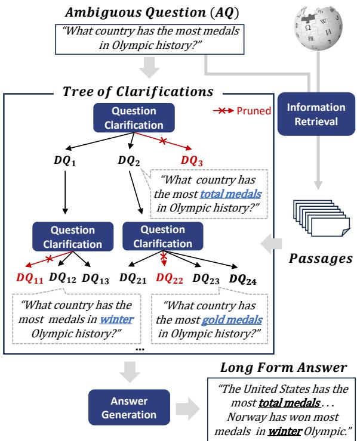
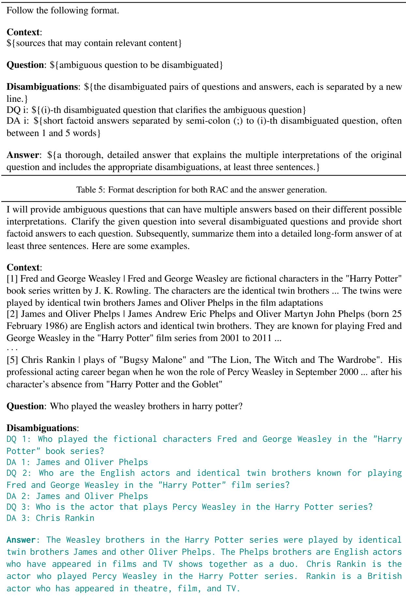
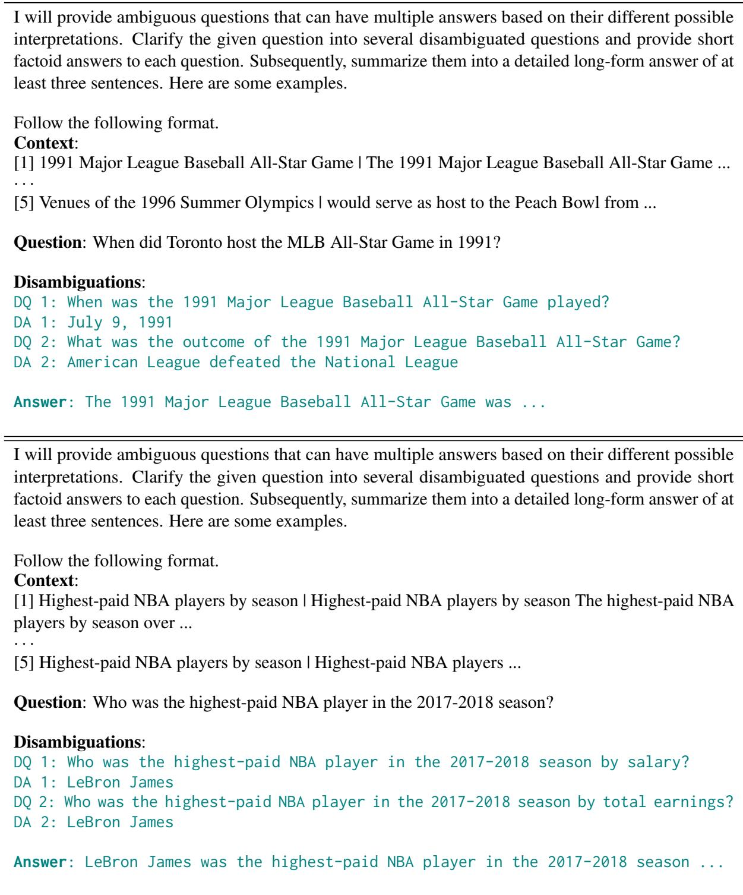
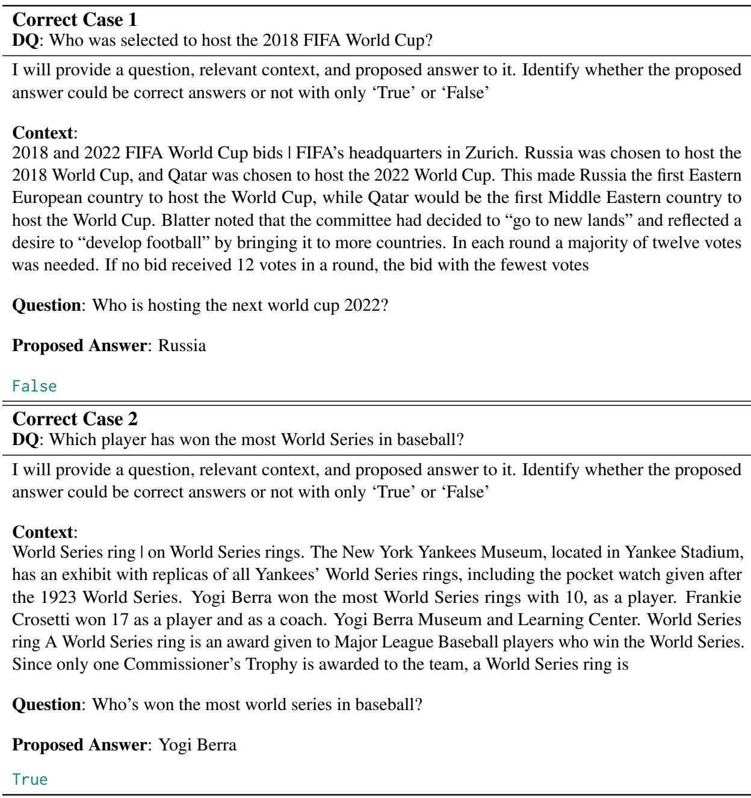
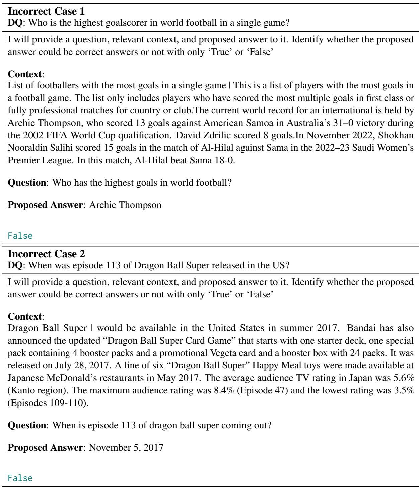
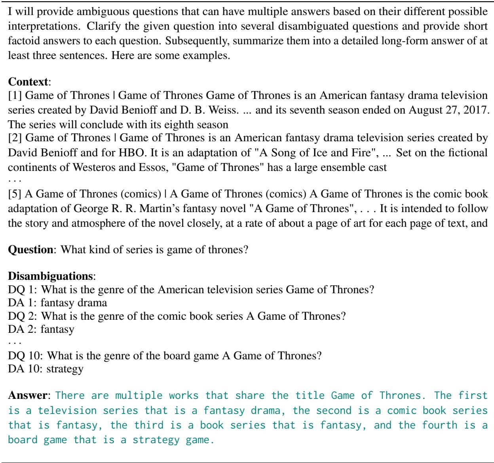

# Tree of Clarifications: Answering Ambiguous Questions with Retrieval-Augmented Large Language Models

Gangwoo Kim1 Sungdong Kim2,3,4 Byeongguk Jeon1 Joonsuk Park2,3,5 Jaewoo Kang1† Korea University1 NAVER Cloud2 NAVER AI Lab3 KAIST AI4 University of Richmond5 {gangwoo\_kim, bkjeon1211, kangj}@korea.ac.kr sungdong.kim@navercorp.com park@joonsuk.org

## Abstract

Questions in open-domain question answering are often ambiguous, allowing multiple interpretations. One approach to handling them is to identify all possible interpretations of the ambiguous question (AQ) and to generate a long-form answer addressing them all, as suggested by Stelmakh et al. (2022). While it provides a comprehensive response without bothering the user for clarification, considering multiple dimensions of ambiguity and gathering corresponding knowledge remains a challenge. To cope with the challenge, we propose a novel framework, TREE OF CLARIFICATIONS (TOC): It recursively constructs a tree of disambiguations for the AQ—via few-shot prompting leveraging external knowledge—and uses it to generate a long-form answer. TOC outperforms existing baselines on ASQA in a fewshot setup across all metrics, while surpassing fully-supervised baselines trained on the whole training set in terms of Disambig-F1 and Disambig-ROUGE. Code is available at github.com/gankim/tree-of-clarifications.

## 1 Introduction

In open-domain question answering (ODQA), users often ask ambiguous questions (AQs), which can be interpreted in multiple ways. To handle AQs, several approaches have been proposed, such as providing individual answers to disambiguated questions (DQs) for all plausible interpretations of the given AQ (Min et al., 2020) or asking a clarification question (Guo et al., 2021). Among them, we adopt that of Stelmakh et al. (2022), which provides a comprehensive response without bothering the user for clarification: The task is to identify all DQs of the given AQ and generate a long-form answer addressing all the DQs (See Figure 1).

There are two main challenges to this task: (1) the AQ may need to be clarified by considering multiple dimensions of ambiguity. For example, the AQ “what country has the most medals in Olympic history” in Figure 1 can be clarified with respect to the type of medals—gold, silver, or bronze—or Olympics—summer or winter; and (2) substantial knowledge is required to identify DQs and respective answers. For example, it requires knowledge to be aware of the existence of different types of medals and the exact counts for each country.

  
Figure 1: Overview of TREE OF CLARIFICATIONS. (1) relevant passages for the ambiguous question (AQ) are retrieved. (2) leveraging the passages, disambiguated questions (DQs) for the AQ are recursively generated via few-shot prompting and pruned as necessary. (3) a long-form answer addressing all DQs is generated.

To address the challenges and provide a longform answer to AQ, we propose a novel framework, TREE OF CLARIFICATIONS (TOC): It recursively constructs a tree of DQs for the AQ—via few-shot prompting leveraging external knowledge—and uses it to generate a long-form answer. More specifically, first, relevant passages for the AQ are retrieved. Then, leveraging the passages, DQs for the AQ are recursively generated via few-shot prompting and pruned as necessary. Lastly, a long-form answer addressing all DQs is generated. The tree structure promotes exploring DQs in targeting particular dimensions of clarification, addressing the first challenge, and the external sources offer additional knowledge to cope with the second challenge.

Experiments demonstrate that our proposed use of LLMs with retrieval-augmentation and guidance to pursue diverse paths of clarification results in the new state-of-the-art on ASQA (Stelmakh et al., 2022)—a long-form QA benchmark for AQs. TOC outperforms existing baselines on ASQA in a few-shot setup across all metrics. In addition, this 5-shot performance surpasses that of the fullysupervised baselines trained on the whole training set by 7.3 and 2.9 in terms of Disambig-F1 and Disambig-ROUGE, respectively.

The main contribution of this work is proposing a novel framework, TREE OF CLARIFICATIONS (TOC), for generating long-form answers to AQs in ODQA, advancing the state-of-the-art on the ASQA benchmark. TOC introduces two main innovations:

• It guides LLMs to explore diverse paths of clarification of the given AQ in a tree structure with the ability to prune unhelpful DQs.

• To the best of our knowledge, it is the first to combine retrieval systems with LLM for generating long-form answers to AQs.

## 2 Related Work

A line of studies (Min et al., 2020, 2021; Gao et al., 2021; Shao and Huang, 2022) extends retrieve-andread frameworks dominant in ODQA task (Chen et al., 2017; Karpukhin et al., 2020; Lewis et al., 2020; Izacard and Grave, 2021) to clarify AQ and generate DQs with corresponding answers to them. However, their approaches require fine-tuning models on the large-scale train set. On the other hand, our framework enables LLM to generate a comprehensive response addressing all DQs via few-shot prompting.

Recent studies introduce LLM-based methods to generate a long-form answer to the AQ. Amplayo et al. (2023) suggest optimal prompts specifically engineered for the task. Kuhn et al. (2022) prompt LLMs to clarify ambiguous questions selectively. However, the studies do not utilize external information to ensure the factual correctness of the disambiguations, thereby potentially increasing the risk of hallucinations from LLMs. Moreover, the results could be bounded by inherent parametric knowledge of LLM. Concurrently, Lee et al. (2023) automatically generate clarifying questions to resolve ambiguity.

Our framework involves the recursive tree architecture, inspired by several prior studies. Min et al. (2021) propose the tree-decoding algorithm to autoregressively rerank passages in ambiguous QA. Gao et al. (2021) iteratively explore additional interpretations and verify them in a round-trip manner. Concurrently, extending chain of thoughts (Wei et al., 2022) prompting, Yao et al. (2023) apply the tree architecture to reasoning tasks for deductive or mathematical problems. On the contrary, TOC recursively clarifies questions and introduces a self-verification method to prune unhelpful DQs.

## 3 Tree of Clarifications

We introduce a novel framework, TREE OF CLARI-FICATIONS (TOC), as illustrated in Figure 1. We first devise retrieval-augmented clarification (RAC; Sec. 3.1), a basic component that clarifies AQ and generates DQs based on relevant passages. TOC explores various fine-grained interpretations, represented as a tree structure (TS; Sec. 3.2) by recursively performing RAC and pruning unhelpful DQs. Lastly, it aggregates the tree and generates a long-form answer addressing all valid interpretations.

## 3.1 Retrieval-Augmented Clarification (RAC)

We first retrieve relevant Wikipedia documents for the AQ by using two retrieval systems, Col-BERT (Khattab and Zaharia, 2020) and Bing search engine1. ColBERT is a recent dense retriever that has effective and efficient zero-shot search quality. Following Khattab et al. (2022), we use the off-the-shelf model pre-trained on MS-Marco (Bajaj et al., 2016). We additionally include the Bing search engine to promote the diversity of retrieved Wikipedia passages. Finally, we obtain over 200 passages by combining passages retrieved by each system.

After collecting a passage set for the AQ, we rerank and choose top-k passages and augment them to a prompt. We use SentenceBERT (Reimers and Gurevych, 2019) pre-trained on MS-Marco as the reranker backbone. For in-context learning setup, we dynamically choose k-shot examples with the nearest neighbor search2 and add them to the prompt. We initiate with the instruction of Amplayo et al. (2023) and revise it for our setup. Given the prompt with relevant passages and AQs, LLM generates all possible DQs and their corresponding answers3.

## 3.2 Tree Structure (TS)

To effectively explore the diverse dimensions of ambiguity, we introduce a recursive tree structure of clarifications. Starting from the root node with AQ, it progressively inserts child nodes by recursively performing RAC, each of which contains a disambiguated question-answer pair. In each expansion step, passages are reranked again regarding the current query. It allows each step to focus on its own DQ, encouraging TOC to comprehend a wider range of knowledge. Exploration of a tree ends when it satisfies termination conditions; it reaches the maximum number of valid nodes or the maximum depth. We choose the breadth-first search (BFS) by default, hence the resulting tree could cover the broader interpretations4.

Pruning with Self-Verification To remove unhelpful nodes, we design a pruning method, inspired by current studies for self-verification (Kadavath et al., 2022; Cole et al., 2023). Specifically, we check the factual coherency between the answers in a target node and the AQ in the root node. By doing so, we discard the generated DQs that ask different or irrelevant facts from the original one. For example, given an AQ “Who will host the next world cup 2022?”, a generated disambiguation “DQ: Who hosted the world cup 2018? A: Russia” is a factually consistent question-answer pair but it changes the original scope of the AQ5. We perform self-verification by prompting LLMs to determine whether the current node would be pruned or not. Prompted with AQ, the answer to the target DQ, and the answer-containing passage, LLM identifies

<table><tr><td>Model</td><td>D-F1</td><td>R-L</td><td>DR</td></tr><tr><td colspan="4">Fully-supervised</td></tr><tr><td>T5-Large Closed-Book</td><td>7.4</td><td>33.5</td><td>15.7</td></tr><tr><td>T5-Large w/ JPR</td><td>26.4</td><td>43.0</td><td>33.7</td></tr><tr><td>PaLM w/ Soft Prompt Tuning *</td><td>27.8</td><td>37.4</td><td>32.1</td></tr><tr><td colspan="4">Few-shot Prompting (5-shot)</td></tr><tr><td>PaLM*</td><td>25.3</td><td>34.5</td><td>29.6</td></tr><tr><td>GPT-3*</td><td>25.0</td><td>31.8</td><td>28.2</td></tr><tr><td colspan="4">Tree of Clarifications (ToC; Ours)</td></tr><tr><td>GPT-3 + RAC</td><td>31.1</td><td>39.6</td><td>35.1</td></tr><tr><td>GPT-3 + RAC + TS</td><td>32.4</td><td>40.0</td><td>36.0</td></tr><tr><td>GPT-3 + RAC + TS w/ Pruning</td><td>33.7</td><td>39.7</td><td>36.6</td></tr></table>

from Amplayo et al. (2023)

Table 1: Evaluation results for long-form QA on ambiguous questions from the development set of ASQA (Stelmakh et al., 2022). Baselines are either fully-supervised or 5-shot prompted. Note, TOC framework consists of retrieval-augmented clarification (RAC) and tree structure (TS).

if the given answer could be a correct answer to AQ.

Answer Generation Once constructing the tree of clarifications, TOC aggregates all valid nodes and generates a comprehensive long-form answer to AQ. It selects the disambiguations in retained nodes of the resulting tree with the relevant passages. If the number of nodes is insufficient, we undo the pruning steps from closer nodes to the root node in BFS order. Passages that contain the answers of valid nodes are prioritized. It finally generates a long-form answer, encoding AQ, selected disambiguations, and relevant passages6.

## 4 Experiment

## 4.1 Experimental Setup

Datasets All baselines and our framework are evaluated on ASQA (Stelmakh et al., 2022). It is a long-form QA dataset built upon the 6K ambiguous questions identified from AmbigNQ (Min et al., 2020). More details are in Appendix A.1

Evaluation Metrics We use three evaluation metrics, following Stelmakh et al. (2022). (1) Disambig-F1 (D-F1) measures the factual correctness of generated predictions. It extracts short answers to each DQ and computes their F1 accuracy. (2) ROUGE-L (R-L) measures the lexical overlap between long-form answers from references and predictions. (3) DR score is the geometric mean of two scores, which assesses the overall performance. For validating intermediate nodes, we additionally use Answer-F1 that measures the accuracy of generated short answers in disambiguation. Further details are in Appendix A.2.

<table><tr><td>Model</td><td>D-F1</td><td>R-L</td><td>DR</td></tr><tr><td>GPT-3 (Baseline)</td><td>24.2</td><td>36.0</td><td>29.5</td></tr><tr><td>GPT-3 w/ RAC</td><td>31.1</td><td>39.6</td><td>35.1</td></tr><tr><td>— Disambiguations</td><td>30.5</td><td>37.3</td><td>33.7</td></tr><tr><td>– Bing Search Engine</td><td>28.5</td><td>37.4</td><td>32.7</td></tr><tr><td>— Retrieval Systems</td><td>25.6</td><td>35.1</td><td>30.0</td></tr></table>

Table 2: Ablation study on all components of retrievalaugmented clarification (RAC).

Baselines Stelmakh et al. (2022) propose finetuned baselines. They fine-tune T5-large (Raffel et al., 2020) to generate long-form answers on the whole train set. Models are evaluated in the closed-book setup or combined with JPR (Min et al., 2021), task-specific dense retriever for ambiguous QA by enhancing DPR (Karpukhin et al., 2020). On the other hand, Amplayo et al. (2023) propose a prompt engineering method to adapt LLMs to the ASQA benchmark. They employ PaLM (Chowdhery et al., 2022) and Instruct-GPT (Ouyang et al., 2022) that learn the soft prompts or adopt in-context learning with few-shot examples. They conduct experiments in the closedbook setup. Note that they share the same backbone with our models, GPT-3 with 175B parameters (text-davinci-002).

## 4.2 Experimental Results

TOC outperforms fully-supervised and few-shot prompting baselines. Table 1 shows the long-form QA performance of baselines and TOC on the development set of ASQA. Among baselines, using the whole training set (Fully-supervised) achieves greater performances than Few-shot Prompting in all metrics. It implies that long-form QA task is challenging in the few-shot setup. In the closed-book setup, GPT-3 shows competitive performances with T5-large with JPR in D-F1 score, showing LLM’s strong reasoning ability over its inherent knowledge.

Among our models, LLM with RAC outperforms all other baselines in D-F1 and DR scores. It indicates the importance of leveraging external knowledge in clarifying AQs. Employing the tree structure (TS) helps the model to explore diverse interpretations, improving D-F1 and DR scores by

<table><tr><td>Filtration</td><td>#(DQs)</td><td>Answer-F1</td></tr><tr><td>w/o Pruning (None)</td><td>12,838</td><td>40.9</td></tr><tr><td>w Pruning</td><td></td><td></td></tr><tr><td>+ Deduplication</td><td>10,598</td><td>40.1</td></tr><tr><td>+ Self-Verification</td><td>4,239</td><td>59.3</td></tr></table>

Table 3: Ablated results with and without pruning methods. The number of retained DQs after pruning and Answer-F1 are reported.

1.3 and 0.9. When pruning the tree with our proposed self-verification (TS w/ Pruning), the model achieves state-of-the-art performance in D-F1 and DR score, surpassing the previous few-shot baseline by 8.4 and 7.0. Notably, it outperforms the best model in a fully-supervised setup (T5-large with JPR) by 7.3 and 2.9. In the experiment, T5-Large in a closed-book setup achieves comparable performance with LLM baselines in ROUGE-L score despite its poor D-F1 scores. It reconfirms the observation from Krishna et al. (2021) that shows the limitations of the ROUGE-L metric.

Integrating retrieval systems largely contributes to accurate and diverse disambiguations. Table 2 displays the ablation study for measuring the contributions of each proposed component. When removing disambiguations from fewshot training examples, the ROUGE-L score is significantly degraded, which shows the importance of the intermediate step to provide the complete answer. Integrating retrieval systems (i.e., Bing search engine and ColBERT) largely improves the model performance, especially in the D-F1 score. It indicates using external knowledge is key to enhancing the factual correctness of clarification. We report intrinsic evaluation for each retrieval system in Appendix B.

Our pruning method precisely identifies helpful disambiguations from the tree. Table 3 shows intrinsic evaluation for generated disambiguations, where all baselines are evaluated with Answer-F1 score that measures the F1 accuracy of the answer to the target DQ. Compared to the baseline, the valid nodes that pass self-verification contain more accurate disambiguations, achieving much higher Answer-F1 score (+18.4). On the other hand, solely using deduplication does not advance the accuracy, indicating the efficacy of our proposed self-verification method.

## 5 Discussion

Ambiguity Detection TOC is designed to clarify AQs without bothering users; hence does not explicitly identify whether the given question is ambiguous or not. It tries to perform clarification even if the question cannot be disambiguated anymore, often resulting in generating duplicate or irrelevant DQs7. However, we could presume a question to be unambiguous if it can no longer be disambiguated8. In TOC, when it fails to disambiguate the given question or all generated disambiguations are pruned, the question could be regarded as unambiguous.

Computational Complexity Although TOC requires multiple LLM calls, its maximum number is less than 20 times per question. Exploration of the tree ends when it obtains the pre-defined number of valid nodes (10 in our experiments). Since the clarification process generates from two to five disambiguations for each question, it satisfies the termination condition in a few steps without the pruning method. Failing to expand three times in a row also terminates the exploration. Pruning steps consume a smaller amount of tokens since they encode a single passage without few-shot exemplars. Compared to the existing ensemble methods such as self-consistency (Wei et al., 2022) which cannot be directly adopted to the generative task, ToC achieves a state-of-the-art performance with a comparable number of LLM calls.

Generalizability The key idea of ToC could be potentially generalized to other tasks and model architectures. It has a model-agnostic structure that could effectively explore diverse paths of recursive reasoning, which would be helpful for tasks that require multi-step reasoning, such as multi-hop QA. Future work might investigate the generalizability of TOC to diverse tasks, datasets, and LM architectures.

## 6 Conclusion

In this work, we propose a novel framework, TREE OF CLARIFICATIONS. It recursively builds a tree of disambiguations for the AQ via few-shot prompting with external knowledge and utilizes it to generate a long-form answer. Our framework explores diverse dimensions of interpretations of ambiguity. Experimental results demonstrate TOC successfully guide LLMs to traverse diverse paths of clarification for a given AQ within tree structure and generate comprehensive answers. We hope this work could shed light on building robust clarification models, which can be generalized toward real-world scenarios.

## Limitations

Although TOC is a model-agnostic framework that could be combined with other components, our study is limited in demonstrating the generalizability of different kinds or sizes of LLMs. In addition, the experiments are only conducted on a benchmark, ASQA (Stelmakh et al., 2022). Although TOC enables LLM to explore diverse reasoning paths by iteratively prompting LLM, the cost of multiple prompting is not negligible.

We tried the recent prompting method, chain of thoughts (Wei et al., 2022), but failed to enhance the performance in our pilot experiments. It might indicate the disambiguation process requires external knowledge, which shows the importance of document-grounded or retrieval-augmented systems. Future work could suggest other pruning methods that identify unhelpful DQs more effectively. The performance could be further enhanced by using the state-of-the-art reranker in the answer sentence selection task, as proposed by recent works (Garg et al., 2020; Lauriola and Moschitti, 2021).

## Acknowledgements

The first author, Gangwoo Kim, has been supported by the Hyundai Motor Chung Mong-Koo Foundation. This research was supported by the National Research Foundation of Korea (NRF-2023R1A2C3004176, RS-2023-00262002), the MSIT (Ministry of Science and ICT), Korea, under the ICT Creative Consilience program (IITP-2022- 2020-0-01819) supervised by the IITP (Institute for Information & communications Technology Planning & Evaluation), and the Electronics and Telecommunications Research Institute (RS-2023- 00220195).

## References

Reinald Kim Amplayo, Kellie Webster, Michael Collins, Dipanjan Das, and Shashi Narayan. 2023. Query refinement prompts for closed-book long-form question answering. Proceedings ofthe 61st Annual Meeting of the Association for Computational Linguistics.

Payal Bajaj, Daniel Campos, Nick Craswell, Li Deng, Jianfeng Gao, Xiaodong Liu, Rangan Majumder, Andrew McNamara, Bhaskar Mitra, Tri Nguyen, et al. 2016. Ms marco: A human generated machine reading comprehension dataset. 30th Conference on Neural Information Processing Systems (NIPS 2016), Barcelona, Spain.

Danqi Chen, Adam Fisch, Jason Weston, and Antoine Bordes. 2017. Reading wikipedia to answer opendomain questions. In Proceedings of the 55th Annual Meeting of the Association for Computational Linguistics (Volume 1: Long Papers), pages 1870–1879.

Aakanksha Chowdhery, Sharan Narang, Jacob Devlin, Maarten Bosma, Gaurav Mishra, Adam Roberts, Paul Barham, Hyung Won Chung, Charles Sutton, Sebastian Gehrmann, et al. 2022. Palm: Scaling language modeling with pathways. arXiv preprint arXiv:2204.02311.

Jeremy R Cole, Michael JQ Zhang, Daniel Gillick, Julian Martin Eisenschlos, Bhuwan Dhingra, and Jacob Eisenstein. 2023. Selectively answering ambiguous questions. arXiv preprint arXiv:2305.14613.

Yifan Gao, Henghui Zhu, Patrick Ng, Cicero dos Santos, Zhiguo Wang, Feng Nan, Dejiao Zhang, Ramesh Nallapati, Andrew O Arnold, and Bing Xiang. 2021. Answering ambiguous questions through generative evidence fusion and round-trip prediction. In Proceedings of the 59th Annual Meeting of the Association for Computational Linguistics and the 11th International Joint Conference on Natural Language Processing (Volume 1: Long Papers), pages 3263– 3276.

Siddhant Garg, Thuy Vu, and Alessandro Moschitti. 2020. Tanda: Transfer and adapt pre-trained transformer models for answer sentence selection. In Proceedings ofthe AAAI conference on artificial intelligence, volume 34, pages 7780–7788.

Meiqi Guo, Mingda Zhang, Siva Reddy, and Malihe Alikhani. 2021. Abg-coqa: Clarifying ambiguity in conversational question answering. In 3rd Conference on Automated Knowledge Base Construction.

Gautier Izacard and Édouard Grave. 2021. Leveraging passage retrieval with generative models for open domain question answering. In Proceedings of the 16th Conference of the European Chapter of the Associationfor Computational Linguistics: Main Volume, pages 874–880.

Jeff Johnson, Matthijs Douze, and Hervé Jégou. 2019. Billion-scale similarity search with gpus. IEEE Transactions on Big Data, 7(3):535–547.

Saurav Kadavath, Tom Conerly, Amanda Askell, Tom Henighan, Dawn Drain, Ethan Perez, Nicholas Schiefer, Zac Hatfield Dodds, Nova DasSarma, Eli Tran-Johnson, et al. 2022. Language models (mostly) know what they know. arXiv preprint arXiv:2207.05221.

Vladimir Karpukhin, Barlas Oguz, Sewon Min, Patrick Lewis, Ledell Wu, Sergey Edunov, Danqi Chen, and Wen-tau Yih. 2020. Dense passage retrieval for opendomain question answering. In Proceedings of the 2020 Conference on Empirical Methods in Natural Language Processing (EMNLP), pages 6769–6781.

Omar Khattab, Keshav Santhanam, Xiang Lisa Li, David Hall, Percy Liang, Christopher Potts, and Matei Zaharia. 2022. Demonstrate-searchpredict: Composing retrieval and language models for knowledge-intensive nlp. arXiv preprint arXiv:2212.14024.

Omar Khattab and Matei Zaharia. 2020. Colbert: Efficient and effective passage search via contextualized late interaction over bert. In Proceedings ofthe 43rd International ACM SIGIR conference on research and development in Information Retrieval, pages 39– 48.

Kalpesh Krishna, Aurko Roy, and Mohit Iyyer. 2021. Hurdles to progress in long-form question answering. In Proceedings of the 2021 Conference of the North American Chapter of the Association for Computational Linguistics: Human Language Technologies, pages 4940–4957.

Lorenz Kuhn, Yarin Gal, and Sebastian Farquhar. 2022. Clam: Selective clarification for ambiguous questions with large language models. arXiv preprint arXiv:2212.07769.

Tom Kwiatkowski, Jennimaria Palomaki, Olivia Redfield, Michael Collins, Ankur Parikh, Chris Alberti, Danielle Epstein, Illia Polosukhin, Jacob Devlin, Kenton Lee, et al. 2019. Natural questions: A benchmark for question answering research. Transactions ofthe Association for Computational Linguistics, 7:452– 466.

Ivano Lauriola and Alessandro Moschitti. 2021. Answer sentence selection using local and global context in transformer models. In European Conference on Information Retrieval, pages 298–312. Springer.

Dongryeol Lee, Segwang Kim, Minwoo Lee, Hwanhee Lee, Joonsuk Park, Sang-Woo Lee, and Kyomin Jung. 2023. Asking clarification questions to handle ambiguity in open-domain qa. arXiv preprint arXiv:2305.13808.

Patrick Lewis, Ethan Perez, Aleksandra Piktus, Fabio Petroni, Vladimir Karpukhin, Naman Goyal, Heinrich Küttler, Mike Lewis, Wen-tau Yih, Tim Rocktäschel, et al. 2020. Retrieval-augmented generation for knowledge-intensive nlp tasks. Advances in Neural Information Processing Systems, 33:9459–9474.

Yinhan Liu, Myle Ott, Naman Goyal, Jingfei Du, Mandar Joshi, Danqi Chen, Omer Levy, Mike Lewis, Luke Zettlemoyer, and Veselin Stoyanov. 2019. Roberta: A robustly optimized bert pretraining approach. arXiv preprint arXiv:1907.11692.

Sewon Min, Kenton Lee, Ming-Wei Chang, Kristina Toutanova, and Hannaneh Hajishirzi. 2021. Joint passage ranking for diverse multi-answer retrieval. In Proceedings of the 2021 Conference on Empirical Methods in Natural Language Processing, pages 6997–7008.

Sewon Min, Julian Michael, Hannaneh Hajishirzi, and Luke Zettlemoyer. 2020. Ambigqa: Answering ambiguous open-domain questions. In Proceedings of the 2020 Conference on Empirical Methods in Natural Language Processing (EMNLP), pages 5783– 5797.

Long Ouyang, Jeffrey Wu, Xu Jiang, Diogo Almeida, Carroll Wainwright, Pamela Mishkin, Chong Zhang, Sandhini Agarwal, Katarina Slama, Alex Ray, et al. 2022. Training language models to follow instructions with human feedback. Advances in Neural Information Processing Systems, 35:27730–27744.

Colin Raffel, Noam Shazeer, Adam Roberts, Katherine Lee, Sharan Narang, Michael Matena, Yanqi Zhou, Wei Li, and Peter J Liu. 2020. Exploring the limits of transfer learning with a unified text-to-text transformer. The Journal of Machine Learning Research, 21(1):5485–5551.

Pranav Rajpurkar, Robin Jia, and Percy Liang. 2018. Know what you don’t know: Unanswerable questions for squad. In Proceedings ofthe 56th Annual Meeting of the Association for Computational Linguistics (Volume 2: Short Papers), pages 784–789.

Nils Reimers and Iryna Gurevych. 2019. Sentence-bert: Sentence embeddings using siamese bert-networks. In Proceedings of the 2019 Conference on Empirical Methods in Natural Language Processing and the 9th International Joint Conference on Natural Language Processing (EMNLP-IJCNLP), pages 3982–3992.

Zhihong Shao and Minlie Huang. 2022. Answering open-domain multi-answer questions via a recallthen-verify framework. In Proceedings of the 60th Annual Meeting of the Association for Computational Linguistics (Volume 1: Long Papers), pages 1825– 1838.

Ivan Stelmakh, Yi Luan, Bhuwan Dhingra, and Ming-Wei Chang. 2022. ASQA: Factoid questions meet long-form answers. In Proceedings ofthe 2022 Conference on Empirical Methods in Natural Language Processing, pages 8273–8288, Abu Dhabi, United Arab Emirates. Association for Computational Linguistics.

Wenhui Wang, Furu Wei, Li Dong, Hangbo Bao, Nan Yang, and Ming Zhou. 2020. Minilm: Deep selfattention distillation for task-agnostic compression

of pre-trained transformers. Advances in Neural Information Processing Systems, 33:5776–5788.

Jason Wei, Xuezhi Wang, Dale Schuurmans, Maarten Bosma, Fei Xia, Ed Chi, Quoc V Le, Denny Zhou, et al. 2022. Chain-of-thought prompting elicits reasoning in large language models. Advances in Neural Information Processing Systems, 35:24824–24837.

Shunyu Yao, Dian Yu, Jeffrey Zhao, Izhak Shafran, Thomas L Griffiths, Yuan Cao, and Karthik Narasimhan. 2023. Tree of thoughts: Deliberate problem solving with large language models. arXiv preprint arXiv:2305.10601.

## A Experimental Setup Details

## A.1 Ambiguous QA Datasets

All baselines and our framework are evaluated on ASQA benchmark (Stelmakh et al., 2022). It is a long-form QA dataset built on the subset of ambiguous questions identified from AmbigNQ dataset (Min et al., 2020). It contains opendomain questions collected from Natural Questions (Kwiatkowski et al., 2019). ASQA consists of 6,316 ambiguous questions and their long-form answers with disambiguations, split into 4,353, 948, and 1,015 train, development, and test set, respectively.

## A.2 Evaluation Metrics

Following Stelmakh et al. (2022), we use three evaluation metrics on ASQA. First, ROUGE-L (R-L) measures the lexical overlap between long-form answers from references and system-generated predictions. Since the benchmark provides two groundtruth answers, we report the maximum ROUGE-L score. Disambig-F1 (D-F1) measures the factual correctness of generated predictions. A reading comprehension model, RoBERTa (Liu et al., 2019) trained on SQuADv2 (Rajpurkar et al., 2018), finds short answers to the ground-truth DQs from the generated long-form response. Then, F1 accuracy of the detected answer is calculated to check if the long-form answer contains accurate information. Disambiguation-ROUGE (DR) score is computed as the geometric mean of ROUGE-L and Disambig-F1 to measure the overall performance. We additionally use Answer-F1 to validate the disambiguations. It computes the maximum F1 accuracy of answers to a single DQ. We use ground-truth disambiguations provided by AmbigNQ (Min et al., 2020).

## A.3 Implementation Details

A large portion of our implementation is based on the DSP library (Khattab et al., 2022). To dynamically find few-shot examples with the nearest neighbor search, we use pre-trained MiniLM (Wang et al., 2020) to obtain hidden representations of questions and compute similarity scores with Faiss library (Johnson et al., 2019). We add 5-shot training examples to the prompt, following Amplayo et al. (2023). It was the optimal number in our pilot experiment.

For prompting LLM to perform RAC, we use top-5 relevant passages. To determine whether to prune the target node or not, we rerank and pick the most relevant passage among those containing the answer in the target node. In the answer generation process, we took ten valid disambiguations in BFS order and five answer-containing passages. We use API served by OpenAI9 to employ GPT-3 as our backbone. We set max tokens as 300 and top-p as 1.0.

<table><tr><td>Retrieval System</td><td>AC@10</td><td>AC@30</td><td>AC@100</td></tr><tr><td>ColBERTv2</td><td>56.4</td><td>68.4</td><td>73.4</td></tr><tr><td>w/ Reranker</td><td>56.8</td><td>69.0</td><td>73.4</td></tr><tr><td>Bing Search Engine</td><td>43.3</td><td>58.3</td><td>73.5</td></tr><tr><td>w/ Reranker</td><td>62.7</td><td>68.0</td><td>72.8</td></tr><tr><td>Combined w/ Reranker</td><td>64.2</td><td>77.4</td><td>80.1</td></tr></table>

Table 4: Intrinsic evaluation of retrieval systems. Answer coverage at k (AC@k) measures the proportion of disambiguated answers that are covered by top-k retrieved passages.

## B Additional Experiment

## B.1 Intrinsic Evaluation for Retrieval Systems

We randomly sample 100 examples from ASQA dataset and report intrinsic evaluation results for retrieval systems. Since a single AQ has multiple ground-truth DQs and their answers, it is not trivial to check how many answers are covered by retrieved passages. Inspired by Min et al. (2021), we devise an evaluation proxy, answer coverage, for measuring the quality of retrieved passages in ambiguous QA tasks. We consider the retrieval as successful if the retrieved passages contain one of the answers to the target DQ. We calculate the proportion of success among DQs for a single AQ to check overall answer coverage.

Table 4 compares retrieval systems in answer coverage (AC@k) of top-k passages. Bing search engine without reranker performs worst among baselines in AC@10 and @30. However, with reranker, its performances are greatly enhanced, outperforming ColBERT baselines. When combining two retrieval systems, it shows the best performances across all evaluation metrics; hence two results are complementary. It achieves 80.1 in AC@100 scores, which indicates the passage set has sufficient information if properly explored.

## C Qualitative Analysis

## C.1 Prompt Format

We add format descriptions to our prompt following Khattab et al. (2022). Table 5 displays the format specifically designed to generate disambiguations for a given question based on external documents. The format description is augmented to prompts of both RAC and the answer generation. By using it, we encouarge LLM to comply with the format.

## C.2 Question Clarification

Table 6 shows an example of RAC for the AQ. Retrieval systems provide the external knowledge. Leveraging it, LLM generates disambiguated question-answer pairs. In RAC, long-form answers are also generated to follow the format but we do not use them in the later steps.

In Table 7, we observe the cases where TOC encounters unambiguous questions and fails to clarify them. It often asks different or irrelevant facts from them of original AQ.

## C.3 Self Verification

Table 8, 9 show examples of self-verification prompt. We prompt LLM to verify the current answer is factually coherent with AQ based on the relevant passage. It generates ‘True’ or ‘False’ to determine whether the node would be discarded or not. We do not provide few-shot training examples or formats.

## C.4 Answer Generation

Table 10 depicts an example of answer generation prompt. We use a similar prompt to that of RAC except disambiguations are given as inputs. It encodes up to ten disambiguations and five relevant passages.

  
Table 6: Example prompt and output in RAC. Few-shot training examples and format descriptions are omitted for simplicity.

  
Table 7: Failure case where the model encounters and clarifies unambiguous questions. Few-shot training examples and format descriptions are omitted for simplicity.

  
Table 8: Correct cases of pruning method. Few-shot training examples or formats are not augmented to the prompt. Generated texts are colored green.

  
Table 9: Incorrect cases of self-verification. Generated texts are colored green.

  
Table 10: Example prompt for the answer generation process. Generated texts are colored green.