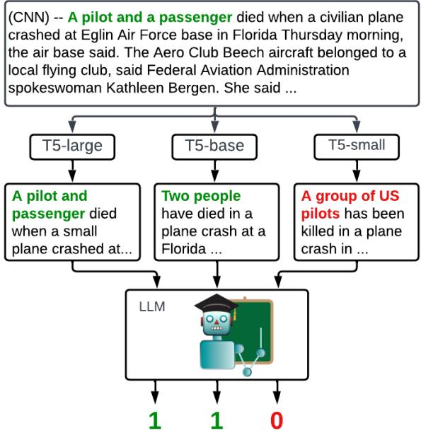
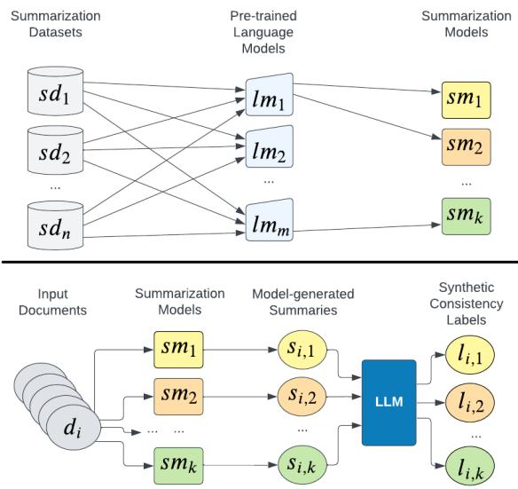
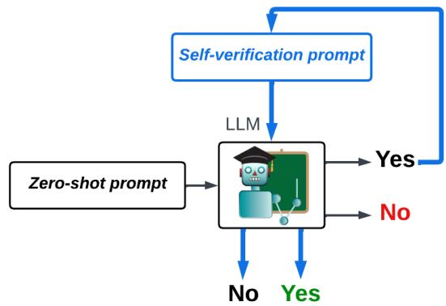
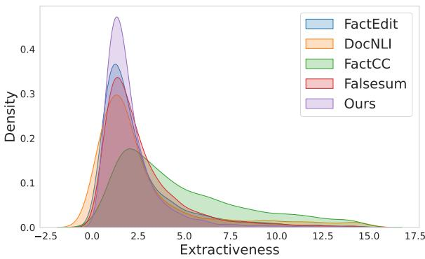

# TrueTeacher: Learning Factual Consistency Evaluation with Large Language Models

Zorik GekhmanT,G,∗ Jonathan HerzigG Roee AharoniG

Chen ElkindG Idan SzpektorG

T Technion - Israel Institute of Technology GGoogle Research zorik@campus.technion.ac.il

{zorik jherzig roeeaharoni chenel szpektor}@google.com

## Abstract

Factual consistency evaluation is often conducted using Natural Language Inference (NLI) models, yet these models exhibit limited success in evaluating summaries. Previous work improved such models with synthetic training data. However, the data is typically based on perturbed human-written summaries, which often differ in their characteristics from real model-generated summaries and have limited coverage of possible factual errors. Alternatively, large language models (LLMs) have recently shown promising results in directly evaluating generative tasks, but are too computationally expensive for practical use. Motivated by these limitations, we introduce TrueTeacher, a method for generating synthetic data by annotating diverse model-generated summaries using a LLM. Un like prior work, TrueTeacher does not rely on human-written summaries, and is multilingual by nature. Experiments on the TRUE benchmark show that a student model trained using our data, substantially outperforms both the state-of-the-art model with similar capacity, and the LLM teacher. In a systematic study, we compare TrueTeacher to existing synthetic data generation methods and demonstrate its superiority and robustness to domain-shift. We also show that our method generalizes to multi lingual scenarios. Lastly, we release our largescale synthetic dataset (1.4M examples), generated using TrueTeacher, and a checkpoint trained on this data.1

## 1 Introduction

Generative summarization models are prone to generate summaries that are factually inconsistent with respect to the corresponding input documents (Goodrich et al., 2019; Kryscinski et al., 2019), limiting their applicability in real-world scenarios.

  
Figure 1: A real example from our data generation process. We fine-tune summarization models with different capacities, and use them to produce a diverse set of model-generated summaries of CNN/DM articles, which we label for consistency using a 540B LLM.

Since factual consistency evaluation could be cast as a Natural Language Inference (NLI) task, NLI models are often used to evaluate consistency (Falke et al., 2019a; Maynez et al., 2020; Laban et al., 2022). However, NLI models exhibit limited success in evaluating factual consistency in summarization (Falke et al., 2019b; Kryscinski et al., 2020), since NLI datasets lack the entailment phenomena that naturally arise in abstractive summarization (Khot et al., 2018). For example, single-sentence premise-hypothesis pairs are shorter than document-summary pairs (Mishra et al., 2021; Schuster et al., 2022).

To address this domain mismatch, previous work proposed various approaches for generating synthetic training data (Kryscinski et al., 2020; Yin et al., 2021; Utama et al., 2022; Balachandran et al., 2022). The data is typically generated by perturbing human-written summaries to introduce factual inconsistencies. While these perturbations are effective, they are limited to factual error categories that can be covered by the perturbation logic. In addition, since simulating factual errors is challenging, such perturbations may fail to introduce factual errors, leading to incorrect labels.2 Finally, since the synthetic summaries are based on humanwritten summaries, they may differ in style from real model-generated summaries, which can reduce the effectiveness of the synthetic data.

An alternative approach to augmenting NLI models with synthetic data, is to directly prompt large language models (LLMs) to evaluate factual consistency. Recently, there has been a growing evidence for the effectiveness of LLMs in evaluating generative tasks (Kocmi and Federmann, 2023; Wang et al., 2023; Liu et al., 2023), including factual consistency in summarization (Chen et al., 2023). However, LLMs are still too computationally expensive to be heavily used in practice.

To make the best of both worlds we propose TrueTeacher, a simple and effective synthetic data generation method that leverages model-generated summaries and the reasoning abilities of LLMs (Huang and Chang, 2022). In TrueTeacher, we first train a diverse collection of summarization models with different capacities. Next, we use these models to summarize each document in a given corpus (Figure 1). The resulting document-summary pairs are then annotated by prompting a LLM to predict the corresponding factual consistency label.

We apply TrueTeacher using FLAN-PaLM 540B (Chung et al., 2022) to generate a large-scale synthetic dataset, which is used to train a student model. Experiments on the summarization subset of the TRUE benchmark (Honovich et al., 2022) show that augmenting existing NLI data with TrueTeacher data improves a state-of-the-art model’s ROC-AUC from 82.7 to 87.8, while maintaining similar model capacity. The resulting model even outperforms its LLM teacher, despite the latter having a 50 larger capacity.

We also compare TrueTeacher to existing synthetic data generation methods. To this end, we design a systematic study to re-evaluate existing methods with a "fair comparison" in a challenging setting. Our results indicate that existing approaches fail to generalize to documents derived from a distribution different from the one used for synthetic data generation. In contrast, TrueTeacher demonstrates robustness by successfully generalizing to documents from new domains.

Finally, we apply TrueTeacher to generate multilingual synthetic data. While existing data generation methods are often limited to English (Utama et al., 2022; Balachandran et al., 2022), TrueTeacher can use a multilingual LLM. Results on the mFACE dataset (Aharoni et al., 2022), show improvements on 35 out of 45 languages when using our method. This demonstrates the usefulness of multilingual synthetic data and the effectiveness of TrueTeacher in generating such data.

To summarize, this work includes the following contributions:

• We introduce TrueTeacher, a synthetic data generation approach based on annotating model-generated summaries with LLMs, and demonstrate its effectiveness and robustness.

• We evaluate FLAN-PaLM 540B on the task of factual consistency evaluation and show that its knowledge can be distilled into a significantly smaller model using our method.

• We conduct a systematic study, re-evaluating existing synthetic data generation methods for the task in an apples-to-apples comparison and identify their limitations.

• We perform the first experiment in generating multilingual synthetic data for factual consistency, and demonstrate its usefulness.

• We release a large-scale dataset comprised of 1.4 million TrueTeacher examples, and verify its quality with human evaluation. We additionally release a state-of-the-art consistency evaluation model trained on this data.1

## 2 TrueTeacher

In this section we describe TrueTeacher, our approach for generating synthetic examples for the task of factual consistency evaluation in summarization. Our main motivation is to use factual inconsistencies that occur in real model-generated summaries, instead of relying on perturbed human-written summaries. To this end, we generate a diverse set of summaries using generative summarization models of different capacities, and leverage a LLM to label them for factual consistency. Some of the generated summaries are expected to contain factual errors, and we hypothesize that a strong-performing LLM can generalize to the task and label them with sufficient quality to be useful for training. The usage of model-generated summaries not only yields more realistic texts, but also allows to potentially include rare errors, which can be harder to incorporate with perturbation logic.

  
Figure 2: Our data generation process. We train a collection of generative summarization models, use them to summarize documents and label the resulting summaries for factual consistency using a LLM.

Our data generation process is illustrated in Figure 2. First, we train a variety of summarization models (upper diagram). We use a collection of one or more summarization training sets $T = \{ s d _ { 1 } , s d _ { 2 } , . . . , s d _ { n } \}$ and different pretrained $L M s ~ = ~ \{ l m _ { 1 } , l m _ { 2 } , . . . , l m _ { m } \}$ to finetune a collection of summarization models $S M =$ $\left\{ s m _ { 1 } , s m _ { 2 } , \ldots , s m _ { k } \right\}$ , where $k = n \times m . ^ { 3 }$ Using different pretrained LMs allows to diversify the expected consistency errors, e.g., errors made by large or small models. The choice of summarization training sets allows to control for the nature of the resulting summaries, e.g., focusing on abstrative training sets to increase output abstractiveness.

Next, we obtain model-generated summaries and annotate them (lower diagram). We choose a documents corpus $D = \{ d _ { 1 } , d _ { 2 } , \dots , d _ { r } \}$ and use all the summarization models in SM to summarize all the documents in D, resulting in a collection of modelgenerated output summaries $O = \{ s _ { 1 , 1 } , . . . s _ { r , k } \}$ where $s _ { i , j }$ is the summary of document $d _ { i }$ generated by summarization model smj. TrueTeacher does not require gold summaries, which allows it to be used with any collection of documents D, and makes it more scalable than previous methods (Yin et al., 2021; Utama et al., 2022; Balachandran et al., 2022).

Finally, a LLM is prompted to label all the summaries in O for consistency w.r.t. their source documents, resulting with labels $\{ l _ { 1 , 1 } , \ldots , l _ { 1 , k } , \ldots l _ { r , k } \} .$ 4 Figure 1 illustrates a real example of this process for a single document $d \sb i \in \textit { D }$ . Each document, summary, and label $( d _ { i } , s _ { i , j } , l _ { i , j } )$ are then used as a synthetic example for training a factual consistency classifier. Since we leverage LLMs for labeling, our approach is likely to benefit from the ongoing progress in LLMs quality. Furthermore, previous approaches often rely on language-specific components (e.g., Information Extraction), which limits their applicability in multiple languages. Since recent LLMs are pretrained on multilingual data, our method can be easily applied to non-English languages, as we show in §5.

## 3 Experimental Setup

We use TrueTeacher to generate a synthetic dataset for factual consistency evaluation in summarization (§3.1), and experiment with it to evaluate the effectiveness and usefulness of our method (§4).

## 3.1 TrueTeacher Instantiation

To apply TrueTeacher, we instantiate the summarization datasets T, the pre-trained LMs and the documents corpus D. We use XSum (Narayan et al., 2018) as T, T5 pre-trained models (Raffel et al., 2020) as LMs = T5-small, T5-base, T5-large, T5-3B, T5-11B , and documents from CNN/DailyMail (Hermann et al., 2015) as D.

As our teacher model, we employ FLAN-PaLM 540B (Chung et al., 2022). This model was instruction fine-tuned, including training on the closelyrelated NLI task.5 Therefore, we expect it to generalize well to factual consistency evaluation.6 We use zero-shot prompting for simplicity, and since applying few-shot or chain-of-thought prompting did not improve performance in early experiments.7

<table><tr><td>Summaries Source</td><td># Consistent</td><td># Inconsistent</td></tr><tr><td>T5-11B</td><td>233,815</td><td>39,423</td></tr><tr><td>T5-3B</td><td>229,097</td><td>45,662</td></tr><tr><td>T5-large</td><td>195,681</td><td>81,986</td></tr><tr><td>T5-base</td><td>161,177</td><td>118,480</td></tr><tr><td>T5-small</td><td>88,129</td><td>190,012</td></tr><tr><td>Total</td><td>907,899</td><td>475,563</td></tr></table>

Table 1: Our generated dataset statistics.

Extensive implementation details about our FLAN-PaLM usage are provided in §A.1 and §A.2.

Applying TrueTeacher in this setup resulted in 1.4M synthetic training examples (Table 1), which we use to train a student model for factual consistency evaluation.8 In §4, we provide evidence for the dataset’s quality through human evaluation (§4.4), its usefulness for improving NLI models in a challenging setting (§4.1), and its superiority over other existing synthetic datasets (§4.2).

In early experiments, we also explored data filtering based on prompting FLAN-PaLM for selfverification (details in §A.5). This resulted in an increase in the labeling accuracy. Yet, surprisingly, training the student model on the filtered data did not improve performance in comparison to training on the full dataset.9 Thus, for simplicity, we conduct experiments using the full dataset.

## 3.2 Evaluation

To compare between consistency evaluation models, we use the TRUE benchmark (Honovich et al., 2022), focusing on its summarization subset: MNBM (Maynez et al., 2020), FRANK (Pagnoni et al., 2021), SummEval (Fabbri et al., 2020), QAGS-X and QAGS-C (Wang et al., 2020). For additional details about these datasets, we refer the reader to Honovich et al. (2022). Following Honovich et al., we use ROC-AUC in a binary classification setting as our evaluation metric.

## 3.3 Baselines

We compare the performance of factual consistency evaluation models trained on TrueTeacher data, against the top performing models on the TRUE benchmark: QuestEval (Scialom et al., 2021), $\mathbf { Q ^ { 2 } }$ (Honovich et al., 2021), SUMM $\mathbf { \nabla } _ { \mathbf { X } \mathbf { Z } S }$ (Laban et al., 2022), T5-11B fine tuned on ANLI (Honovich et al., 2022), WeCheck (Wu et al., 2023), and the Ensemble from Honovich et al. (2022).10

We also compare TrueTeacher data generation mechanism to existing methods for synthetic data generation. We consider the following approaches:

DocNLI (Yin et al., 2021). Reformatted NLI, question answering and summarization datasets, including the CNN/DM corpus. The summarizationbased positive examples are based on concatenated gold summaries. The negative examples are then generated using word/entity replacements.

FactCC (Kryscinski et al., 2020). The documents are from CNN/DM. The consistent summaries are randomly sampled sentences from the document, which are optionally injected with noise or paraphrased. The inconsistent summaries are obtained by rule-based transformations, such as sentence negation and entity/pronoun/number swaps.

FactEdit (Balachandran et al., 2022). The positive examples are based on gold summaries from CNN/DM. For the negative examples, an infilling model is trained using sentences from the documents, employing the OpenIE framework (Banko et al., 2007) to mask predicates and arguments. Each predicate and argument phrase in the summary is then iterativelly masked and infilled with the model’s lower order beam candidates.

Falsesum (Utama et al., 2022). The positive examples are based on gold summaries from CNN/DM. For the negative examples, predicates and arguments are detected in the document and the summary using the OpenIE (Banko et al., 2007) framework. Randomly selected predicates and arguments from the summary are then masked and infilled using predicates and arguments from the document, or by "hallucinating" new content. For this purpose a dedicated infilling model is trained.

## 4 Experiments and Analysis

Our main experiments are in §4.1 and §4.2, followed by various analyses and ablations in §4.3, §4.4, §4.5 and §4.6. We design our experiments to address the following research questions (RQs):

• RQ1: What is the performance of FLAN-PaLM 540B in factual consistency evaluation in summarization? Is it a good choice for a teacher?

<table><tr><td></td><td>MNBM</td><td>QAGS-X</td><td>FRANK</td><td>SummEval</td><td>QAGS-C</td><td>Average</td></tr><tr><td>QuestEval (Scialom et al., 2021)</td><td>65.3</td><td>56.3</td><td>84.0</td><td>70.1</td><td>64.2</td><td>68.0</td></tr><tr><td>Q2 (Honovich et al., 2021)</td><td>68.7</td><td>70.9</td><td>87.8</td><td>78.8</td><td>83.5</td><td>77.9</td></tr><tr><td>SUMMACzs (Laban et al., 2022)</td><td>71.3</td><td>78.1</td><td>89.1</td><td>81.7</td><td>80.9</td><td>80.2</td></tr><tr><td>T5-11B w. ANLI (Honovich et al., 2022)</td><td>77.9</td><td>83.8</td><td>82.1</td><td>80.5</td><td>89.4</td><td>82.7</td></tr><tr><td>WeCheck (Wu et al., 2023)</td><td>83.0</td><td>81.4</td><td>88.1</td><td>79.8</td><td>82.6</td><td>83.0</td></tr><tr><td>Ensemble (Honovich et al., 2022)</td><td>76.6</td><td>85.8</td><td>91.2</td><td>82.9</td><td>87.7</td><td>84.8</td></tr><tr><td>FLAN-PaLM 540B (Chung et al., 2022)</td><td>76.0</td><td>88.1</td><td>91.4</td><td>83.7</td><td>85.2</td><td>84.9</td></tr><tr><td>T5-11B w. ANLI + TrueTeacher full</td><td>78.1</td><td>89.4</td><td>93.6</td><td>88.5</td><td>89.4</td><td>87.8</td></tr></table>

Table 2: ROC-AUC results on the summarization subset of the TRUE benchmark (Honovich et al., 2022).

• RQ2: Can TrueTeacher facilitate training of a competitive model w.r.t. state-of-the-art models?

• RQ3: What is the quality of the data generated using TrueTeacher compared to existing synthetic data generation methods?

We address RQ1 and RQ2 in §4.1. To address RQ1, we evaluate FLAN-PaLM 540B against competitive models for factual consistency evaluation. To address RQ2, we use our full dataset from §3.1 to train our best-performing model, and evaluate it in the exact same setting. Finally, RQ3 is addressed in §4.2, where we conduct a systematic study, comparing existing methods to TrueTeacher, while controlling for factors such as the synthetic data size and the documents used for data synthesis.

## 4.1 Main Results on the TRUE Benchmark

We address RQ1 by evaluating FLAN-PaLM 540B on the task and present the results in Table 2. FLAN-PaLM 540B achieves an impressive performance, with an average ROC-AUC of 84.9 compared to 83.0 of the best single-model baseline, and performs on-par with the Ensemble. This demonstrates the chosen LLM’s capability for the task, and its potential as a teacher for smaller models.

To address RQ2, we fine-tune T5-11B (Raffel et al., 2020) over our full dataset (§3.1) mixed with ANLI (Nie et al., 2020). Table 2 shows that including TrueTeacher data in the training set, substantially improves the strong-performing T5-11B w. ANLI baseline from an average ROC-AUC of 82.7 to 87.8 (+5.1), while maintaining exactly the same model capacity. This strong result demonstrates the high effectiveness of TrueTeacher in a challenging setup. Notably, our model sets the new state-of-the-art result on the benchmark, outperforming the 50 times larger LLM that we used as the teacher (84.9 87.8). This can be attributed to large-scale knowledge distillation on a specific task, while the LLM is trained to perform many tasks. Additionally, the smaller model is trained on target-domain data (documents and model-generated summaries) which can further improve performance (Gururangan et al., 2020).

## 4.2 Re-evaluating Synthetic Data Generation Methods – A Study

Previous studies on synthetic data generation have used different experimental setups, making it difficult to compare their results. In this section, we design a systematic study to re-evaluate existing methods in a standardized setup. We first discuss our study design choices followed by the results.

Previous work has demonstrated that synthetic data can improve NLI-based models. However, they typically used relatively small-capacity models, whereas Honovich et al. (2022) recently demonstrated significant performance gains by scaling up to T5-11B fine-tuned on ANLI. We therefore adopt this competitive baseline, to which we add synthetic data from each method. For ablation, we include variants trained solely on synthetic data (without ANLI), and also repeat our study using the smaller-capacity T5-base model.

To preform a fair comparison, we restrict the number of examples from each evaluated method to 100k, randomly sampled with balanced labels.

To evaluate domain-shift robustness, we further restrict the synthetic training examples to ones that were generated only based on CNN/DM documents,11 and then consider the XSum-based evaluation sets as out-of-domain.12

<table><tr><td colspan="2" rowspan="2">Training data ANLI</td><td colspan="3">CNN/DM-based</td><td rowspan="2"></td><td colspan="3">XSUM-based</td><td colspan="3">Average scores</td></tr><tr><td>QAGS-C SummEval</td><td>FRANK-C</td><td>FRANK</td><td>FRANK-X</td><td>QAGS-X</td><td>MNBM</td><td>In-domain</td><td>Out-of-domain</td><td>TRUE</td></tr><tr><td colspan="2"></td><td>83.4</td><td>74.2</td><td>85.6</td><td>90.7</td><td>93.2</td><td>88.0</td><td>73.9 |81.1</td><td>85.0</td><td>82.0</td><td></td></tr><tr><td rowspan="12">T5-1B</td><td>FactEdit</td><td>87.8</td><td>77.0</td><td>77.2</td><td>83.7</td><td>76.0</td><td>69.4</td><td>53.1</td><td>80.7 (-0.4)</td><td>66.2 (-18.8)</td><td>74.2 (-7.8)</td></tr><tr><td>FactEdit + ANLI</td><td>88.9</td><td>78.9</td><td>81.1</td><td>88.0</td><td>86.1</td><td>76.2</td><td>59.8</td><td>83.0 (+1.9)</td><td>74.0 (-11.0)</td><td>78.4 (-1.6)</td></tr><tr><td>DocNLI</td><td>89.1</td><td>72.9</td><td>83.0</td><td>89.2</td><td>92.4</td><td>83.8</td><td>67.0</td><td>81.7 (+0.6)</td><td>81.1 (-3.9)</td><td>80.4 (-1.6)</td></tr><tr><td>DocNLI + ANLI</td><td>87.8</td><td>72.0</td><td>81.9</td><td>88.2</td><td>93.7</td><td>84.2</td><td>68.0</td><td>80.6 (-0.5)</td><td>82.0 (-3.0)</td><td>80.0 (-2.0)</td></tr><tr><td>FactCC</td><td>83.1</td><td>79.0</td><td>81.6</td><td>84.1</td><td>67.5</td><td>72.7</td><td>55.0</td><td>81.2 (+0.1)</td><td>65.1 (-19.9)</td><td>74.8 (-7.2)</td></tr><tr><td>FactCC + ANLI</td><td>84.7</td><td>83.3</td><td>84.7</td><td>89.5</td><td>89.6</td><td>82.9</td><td>71.5</td><td>84.2 (+3.1)</td><td>81.3 (-3.7)</td><td>82.4 (+0.4)</td></tr><tr><td>Falsesum</td><td>90.3</td><td>85.4</td><td>85.8</td><td>89.8</td><td>84.5</td><td>70.8</td><td>53.9</td><td>87.2 (+6.1)</td><td>69.7 (-15.3)</td><td>78.0 (-4.0)</td></tr><tr><td>Falsesum + ANLI</td><td>90.7</td><td>85.8</td><td>87.0</td><td>91.6</td><td>90.5</td><td>75.2</td><td>60.5</td><td>87.8 (+6.7)</td><td>75.4 (-9.6)</td><td>80.8 (-1.2)</td></tr><tr><td>TrueTeacher</td><td>84.9</td><td>85.0</td><td>88.8</td><td>93.6</td><td>94.4</td><td>86.5</td><td>76.1</td><td>86.2 (+5.1)</td><td>85.7 (+0.7)</td><td>85.2 (+3.2)</td></tr><tr><td>TrueTeacher + ANLI</td><td>88.4</td><td>85.8</td><td>89.6</td><td>93.9</td><td>93.9</td><td>87.8</td><td>76.3</td><td>87.9 (+6.8)</td><td>86.0 (+1.0)</td><td>86.4 (+6.4)</td></tr><tr><td>ANLI FactEdit</td><td>74.9</td><td>63.7</td><td>73.1</td><td>81.3</td><td>80.6</td><td>77.2</td><td>77.0</td><td>70.6</td><td>78.3</td><td>74.8</td></tr><tr><td rowspan="12">T5-q-ase</td><td></td><td>61.4</td><td>59.4</td><td>59.4</td><td>73.6</td><td>51.9</td><td>48.0</td><td>58.4</td><td>60.1 (-10.5)</td><td>52.8 (-25.5)</td><td>60.2 (-14.6)</td></tr><tr><td>FactEdit + ANLI</td><td>68.7</td><td>60.0</td><td>62.2</td><td>78.5</td><td>73.6</td><td>72.2</td><td>75.5</td><td>63.6 (-7.0)</td><td>73.8 (-4.5)</td><td>71.0 (-3.8)</td></tr><tr><td>DocNLI</td><td>71.4</td><td>66.5</td><td>66.7</td><td>77.9</td><td>81.0</td><td>75.2</td><td>71.6</td><td>68.2 (-2.4)</td><td>75.9 (-2.4)</td><td></td></tr><tr><td>DocNLI + ANLI</td><td>75.2</td><td>66.7</td><td>74.4</td><td>84.9</td><td>83.3</td><td>78.7</td><td>74.8</td><td>72.1 (+1.5)</td><td>78.9 (+0.6)</td><td>72.5 (-2.3)</td></tr><tr><td>FactCC</td><td>74.0</td><td>72.7</td><td>78.7</td><td>83.2</td><td>71.9</td><td>71.0</td><td>62.7</td><td>75.3 (+4.7)</td><td>68.5 (-9.8)</td><td>76.1 (+1.3)</td></tr><tr><td>FactCC + ANLI</td><td>72.8</td><td>73.2</td><td>78.8</td><td>83.2</td><td>66.8</td><td>71.5</td><td>63.2</td><td>74.9 (+4.3)</td><td>67.2 (-11.1)</td><td>72.7 (-2.1)</td></tr><tr><td>Falsesum</td><td>80.9</td><td>74.2</td><td>82.0</td><td>86.4</td><td>71.6</td><td>65.0</td><td>53.1</td><td>79.0 (+8.4)</td><td>63.2 (-15.1)</td><td>72.8 (-2.0) 71.9 (-2.9)</td></tr><tr><td>Falsesum + ANLI</td><td>82.9</td><td>73.4</td><td>83.3</td><td>86.5</td><td>72.6</td><td>66.0</td><td>58.7</td><td>79.9 (+9.3)</td><td>65.8 (-12.5)</td><td></td></tr><tr><td>TrueTeacher</td><td>77.3</td><td>73.6</td><td>79.1</td><td>88.0</td><td>82.6</td><td>79.9</td><td>78.3</td><td>76.7 (+6.1)</td><td>80.3 (+2.0)</td><td>73.5 (-1.3)</td></tr><tr><td>TrueTeacher + ANLI</td><td>81.9</td><td>78.0</td><td>81.4</td><td>89.3</td><td>86.4</td><td>81.9</td><td>78.5</td><td>80.4 (+9.8)</td><td>82.3 (+4.0)</td><td>79.4 (+4.6) 81.9 (+7.1)</td></tr></table>

Table 3: ROC-AUC results on TRUE comparing different synthetic data generation methods. For each model size, average scores are compared to the corresponding ANLI-only baseline (difference is listed in parentheses).

Table 3 presents the results of our study. We calculate three average scores: for in-domain test sets based on CNN/DM documents, for out-of-domain test sets based on XSum documents, and for the original datasets from TRUE.

In-Domain Results Most methods outperform the corresponding ANLI-only baseline, demonstrating the usefulness of synthetic data. Predictably, all methods improve with larger models and a complementary effect is often observed when mixing synthetic data with ANLI. The best results are obtained by mixing ANLI with Falsesum or TrueTeacher data and using T5-11B, with a substantial improvement over the corresponding ANLI-only baseline (in-domain score increase from 81.1 to 87.9).

Out-of-domain Results While most methods perform well in-domain, their performance drops significantly on the out-of-domain test sets. Most of the evaluated methods underperform the corresponding ANLI-only baseline with similar model capacity. For some methods, performance deteriorates dramatically; e.g. Falsesum – despite its impressive in-domain performance, its out-ofdomain score falls significantly below the ANLIonly baseline. This suggests that some methods overfit to documents from the distribution used to generate the synthetic data. Based on this finding, we encourage future research to prioritize outof-domain evaluation. Interestingly, even though TrueTeacher’s relative improvement is smaller compared to the in-domain setup, it is still the only method with higher out-of-domain score compared to the corresponding ANLI-only baseline. This demonstrates the robustness of TrueTeacher to domain shift, which may be due to the use of modelgenerated summaries that increase the variability of the resulting synthetic data.

Overall Results on TRUE Due to the poor outof-domain performance of the existing methods, TrueTeacher is the only method that consistently outperforms the ANLI-only baseline on the TRUE benchmark. Notably, TrueTeacher + ANLI with T5- base (81.9) performs on par with the ANLI-only baseline using T5-11B (82.0). Additionally, the TrueTeacher-based variant using T5-11B (85.2) already performs on-par with the 540B LLM teacher (84.9, Table 2), even though we used only 100k synthetic examples in this experiment, and did not use ANLI data. When comparing TrueTeacher + ANLI with T5-11B and 100k examples (Table 3) to the equivalent variant using the full dataset (Table 2), we observe a performance increase (86.4  87.8), which demonstrates TrueTeacher’s scalability. We conclude that TrueTeacher yields high quality data and generalizes well for new domains, which we attribute to the usage of model-generated summaries.

## 4.3 Qualitative Analysis

Figure 3 presents a case study with a randomly sampled document, and the corresponding inconsistent summaries generated with each of the evaluated

CNN/DailyMail ID: 372f7e02e5bb17bac3a1b2260c6ac78414f97ee3 Article: LOS ANGELES, California (CNN) -- Los Angeles firefighters and city crews worked for several hours Tuesday to rescue one of their own: a 22-ton firetruck that was nearly swallowed by a water-logged sinkhole. Two firefighters crawled out of the truck's windows after it sank Tuesday morning. No one was injured. The incident happened after four firefighters took the truck to the San Fernando Valley neighborhood of Valley Village, where flooding had been reported… …

## Gold Summaries:

1. Los Angeles firetruck nearly swallowed by sinkhole Tuesday morning 2. Firefighters in truck were responding to flooding call when incident happened.

3. Two firefighters escaped truck through windows; no injuries reported.
<table><tr><td rowspan=1 colspan=1>FactEdit</td><td rowspan=1 colspan=1>Firefighters in truck were respondingrescuewhenincident happened .</td></tr><tr><td rowspan=1 colspan=1>DocNLI</td><td rowspan=1 colspan=1>Los Angeles firetruck nearlydestroyedby sinkholeTuesdaynight. Firefighters in truck were responding toemergency callwhenithappened . Two firefightersescaped truck through windows; no injuries reported .</td></tr><tr><td rowspan=1 colspan=1>FactCC</td><td rowspan=1 colspan=1>LOS LOS ANGELES, California ((CNN) - Los Angelesfirefighters andcrews workedTwo onTuesday to rescueone of their ownown: a 22-tonfire enginenearlyswallowed by asinkhole filled with waterwater.</td></tr><tr><td rowspan=1 colspan=1>Falsesum</td><td rowspan=1 colspan=1>Los Angeles firetruck nearly swallowed by water.</td></tr><tr><td rowspan=1 colspan=1>TrueTeacher</td><td rowspan=1 colspan=1>A firefighter has rescued a truck that sank in Los Angeles,causing extensive flooding.</td></tr></table>

Figure 3: A case study comparing factually inconsistent summaries of the same document generated using different methods. Content replacements are highlighted using the same color for the original and the replaced text. Added content is in bold red font.

methods. FactEdit used the second gold-summary and replaced "to flooding call" with "rescue", introducing a grammatical error rather than a factual error, demonstrating the potential problems with using lower-beam completions as proxy for factual errors. DocNLI uses all the gold summaries concatenated. While replacing "morning" with "night" introduces a factual error, three other edits fail to introduce factual errors, demonstrating the limitations of using simple word/entity replacements. FactCC used the first sentence from the article and successfully introduced factual error by an entity swap from "firetruck" to "fire engine". The paraphrase highlighted in green increases the abstractiveness, but the paraphrase in orange introduces a grammatical error that is less likely to be made by a strong summarization model. The noise injection used by FactCC (duplicating or removing random tokens) is colored in red, but its usefulness is questionable. Falsesum uses the first gold summary, and its perturbation model predicts the removal of "Tuesday morning" and the replacement of the "sinkhole" argument with "water", failing to introduce a factual error, since the sinkhole is referred to as "water-logged sinkhole" in the article. Finally, TrueTeacher uses an abstractive summary generated by a real summarization model.

<table><tr><td>Class</td><td>#Ex.</td><td>Precision</td><td>Recall</td><td>F1</td></tr><tr><td>Consistent</td><td>41</td><td>80.0</td><td>97.6</td><td>87.9</td></tr><tr><td>Inconsistent</td><td>59</td><td>98.0</td><td>83.1</td><td>89.9</td></tr></table>

Table 4: Human evaluation results.

It introduces a nuanced factual error by replacing "Los Angeles firefighters" with A firefighter and also by hallucinating new content (the text in bold red font). This case study further illustrates the challenges of perturbing texts to introduce factual inconsistencies and re-iterates the importance in using model-generated summaries.

## 4.4 Human Evaluation

To further assess the quality of the synthetic data produced by TrueTeacher, we perform human evaluation carried out by domain experts.13 We evaluate 100 examples from our dataset,14 using binary judgements based on the attribution definition from Rashkin et al. (2021). The labeling accuracy of the sampled examples from our data stands at 89%, which demonstrates its high quality. Table 4 further presents the precision, recall and F1 scores for the consistent and inconsistent classes. More details on the human evaluation are available in §A.8.

## 4.5 Ablating Summary Distribution and Label Correctness

There are two key differences between TrueTeacher and perturbation-based synthetic data generation methods: (1) the distribution of the summaries15 and (2) the correctness of the generated labels.16 Each of these differences may lead to the better quality of TrueTeacher w.r.t the baselines. To measure the impact of each difference, we isolate them in a controlled ablation study. We create 2 ablated variants, using Falsesum as a recent baseline method for synthetic data generation. The results are presented in Table 5.

LabelAblation is an ablation created by labeling the document-summary pairs from Falsesum’s data using FLAN-PaLM 540B.17 Comparing

<table><tr><td>Variant</td><td>Summary Distribution</td><td>Labeling Quality</td><td>T5-11B</td><td>T5-Base</td></tr><tr><td>Falsesum + ANLI TrueTeacher + ANLI</td><td>Human-written perturbed Model-generated</td><td>Falsesum FLAN-PaLM 540B</td><td>80.8 86.4 (+6.9%)</td><td>73.5 81.9 (+11.4%)</td></tr><tr><td>LabelAblation</td><td>Human-written perturbed</td><td>FLAN-PaLM 540B</td><td>85.3 (+5.6%)</td><td>78.9 (+7.3%)</td></tr><tr><td>SummaryAblation</td><td>Model-generated</td><td>Falsesum (proxy)</td><td>85.5 (+5.8%)</td><td>79.1 (+7.6%)</td></tr><tr><td></td><td></td><td></td><td></td><td></td></tr></table>

Table 5: Average ROC-AUC on TRUE for the ablated variants. Falsesum + ANLI and TrueTeacher + ANLI are copied from Table 3 for reference.

LabelAblation to Falsesum + ANLI allows us to examine the effect of using FLAN-PaLM labels instead of the original Falsesum labels, while controlling for the summaries distribution. LabelAblation outperforms Falsesum + ANLI by 5.6%, which shows that performance gains can be obtained using summaries generated with existing synthetic data generation methods combined with second-stage improved labeling quality. However, TrueTeacher is substantially simpler and also results in better performance.

SummaryAblation is an ablation created by flipping labels on a random portion of TrueTeacher’s data, such that the expected labeling accuracy is similar to Falsesum (More details in §A.9). Comparing SummaryAblation to Falsesum + ANLI allows us to examine the effect of changing the summary distribution from human-written perturbed to model-generated, while controlling for the labeling quality. SummaryAblation outperforms Falsesum + ANLI by 5.8%, a similar improvement as observed for LabelAblation (5.6%). This demonstrates that label correctness and summary distribution have a similar effect on the performance, but they also have a complimentary effect as the best performance of 86.4 ROC-AUC is obtained only when they are combined together.

## 4.6 Abstractiveness Analysis

Advances in large scale pretraining (Devlin et al., 2019; Lewis et al., 2020) and the availability of relevant datasets (Narayan et al., 2018), enabled rapid progress in abstractive summarization, which better imitates the way humans summarize (Koh et al., 2023) and is also preferred by humans (Goyal et al., 2022). This motivates us to focus on generating abstractive synthetic summaries.

We compare the abstractiveness degree of different methods using the extractive fragment coverage and density measures from Grusky et al. (2018). Following Utama et al. (2022) we multiply these measures to obtain a combined score.18 Table 6 presents the abstractiveness scores, and a density plot is available in the Appendix (Figure 5). We observe higher abstractiveness for model-based methods (FactEdit, Falsesum and TrueTeacher), suggesting that rule-based methods might be less useful with the recent shift towards abstractive summarization. TrueTeacher produces the most abstractive summaries with lowest combined score.

<table><tr><td></td><td>Coverage ↓</td><td>Density ↓</td><td>Combined ↓</td></tr><tr><td>FactEdit</td><td>0.86</td><td>2.92</td><td>2.67</td></tr><tr><td>DocNLI</td><td>0.85</td><td>15.66</td><td>15.20</td></tr><tr><td>FactCC</td><td>0.93</td><td>8.16</td><td>7.93</td></tr><tr><td>Falsesum</td><td>0.88</td><td>2.98</td><td>2.76</td></tr><tr><td>TrueTeacher</td><td>0.86</td><td>2.41</td><td>2.15</td></tr></table>

Table 6: Average abstractiveness scores (lower is better), measured on a random sample of 5k examples.

## 5 Multi-Lingual Data Generation for Factual Consistency Evaluation

Utilizing a multilingual LLM enables a straightforward application of TrueTeacher to multiple languages. This contrasts with recent approaches that rely on NLP components only available for highresource languages, e.g., information extraction (Utama et al., 2022; Balachandran et al., 2022). In this section, we examine TrueTeacher’s usefulness for multilingual factual consistency evaluation.

We first generate multilingual synthetic data using TrueTeacher. This time we train a single summarization model by fine tuning mT5-XXL (Xue et al., 2021) on XLSum (Hasan et al., 2021) and use it to summarize documents from WikiLingua (Ladhak et al., 2020), which we then label for consistency with our LLM. For the purposes of this experiment we focus on a subset of WikiLingua documents in 4 languages: English (en), French (fe), Spanish (es) and German (de).19. After generating the dataset for these 4 languages, we sample 100k examples, by randomly sampling 25k in each language with balanced labels (as illustrated in Table 9 in the Appendix). For ablation, we also create an English-only variant, by randomly sampling 100k English examples with balanced labels.20

<table><tr><td rowspan="2">Training data</td><td rowspan="2"># Improved languages</td><td colspan="2">Avg. ROC-AUC</td></tr><tr><td>Per lang. |</td><td>Per ex.</td></tr><tr><td>ANLI+XNLI</td><td>-</td><td>73.3</td><td>71.6</td></tr><tr><td>+TrueTeacher en</td><td>32 /45</td><td>75.7</td><td>73.8</td></tr><tr><td>+TrueTeacher en,fe,es,ge</td><td>35 / 45</td><td>77.2</td><td>75.3</td></tr></table>

Table 7: Multilingual results on the mFACE test set.

We use the resulted data to train multilingual consistency evaluation models and evaluate them on the mFace test set (Aharoni et al., 2022), containing 3150 examples in 45 languages. As a strong baseline we follow Aharoni et al. and fine-tune mT5- XXL (Xue et al., 2021) on the ANLI (Nie et al., 2020) and XNLI (Conneau et al., 2018) datasets. We then assess whether adding our synthetic data to the training set can improve this model.

Table 7 presents the results overview, full results in all 45 languages are available in Table 10 (Appendix). Adding English-only summarizationbased synthetic data, already improves results on 32 out of 45 languages and increases the avg. ROC-AUC from 71.6 to 73.8. Yet, using the same amount of multi-lingual examples improved the performance even more, with avg. ROC AUC of 75.3. This demonstrates the added value in generating multi-lingual synthetic examples using TrueTeacher, laying the ground for future work.

## 6 Related Work

Previous work proposed methods for generating synthetic training data for factual consistency evaluation, by perturbing gold summaries (Yin et al., 2021; Kryscinski et al., 2020; Balachandran et al., 2022; Utama et al., 2022; Soleimani et al., 2023).21 A key advantage of TrueTeacher, is the ability to leverage real model-generated summaries, leading to superior performance and robustness. The utility of model-generated outputs was also highlighted by Wu et al. (2023), who proposed a weakly supervised consistency evaluation model that leverages probabilistic labels derived from aggregated scores of other consistency evaluation models. Our work proposes a simpler solution, that is also inherently multilingual.

Another line of work for adapting NLI-based models for summarization, focuses on better processing of long texts, splitting the documents into sentences to create shorter premise-hypothesis pairs (Laban et al., 2022; Schuster et al., 2022).

Recent work attempts to assess LLMs’ capability for evaluating generative tasks (Kocmi and Federmann, 2023; Wang et al., 2023; Liu et al., 2023). Luo et al. (2023) evaluated ChatGPT (OpenAI, 2022) speciffically on the task of factual consistency evaluation in summarization. Yet, Aiyappa et al. (2023) argued that ChatGPT’s "closed" nature risks data leakage (training-test contamination).22 Chen et al. (2023) performed a study of LLMs as factual consistency evaluators, using a variety of prompting methods.

Previous work also attempted to distill knowledge from LLMs (West et al., 2022; Hsieh et al., 2023), as well as to leverage LLMs for data annotation (Wang et al., 2021; Ding et al., 2022), and synthetic data generation (Agrawal et al., 2022; Liu et al., 2022; Bitton et al., 2023). As far as we aware, our work is the first to leverage LLMs for data generation for factual consistency evaluation.

## 7 Conclusion

We introduced TrueTeacher, a simple and highly effective method for generating synthetic data for factual consistency evaluation. Instead of perturbation of human-written summaries like done in previous work, TrueTeacher leverages realistic model-generated summaries, which are annotated by prompting a large language model.

Using our method, we generate a large-scale synthetic dataset, which we are making publicly available. Our experimental results show that this dataset substantially enhances the performance of a state-of-the-art model. In our systematic study, we compare TrueTeacher to existing approaches and further demonstrate its effectiveness and robustness. Our study highlights the importance of out-ofdomain evaluation, which we hope will be adopted in future work. Lastly, we show that TrueTeacher generalizes well to multilingual scenarios, presenting additional advantage over existing methods.

## 8 Limitations

Noisy synthetic data TrueTeacher relies on a LLM for labeling model generated summaries. This process may result in some frequency of noisy synthetic examples for which the label is incorrect. This can affect the overall quality of the student model that trains on this data. In our experiments we validated the quality of our synthetic data with human evaluation, however this should be reexamined when generating data for new domains. In addition, we experimented with different filtering approaches, but found that training on filtered data with higher labeling accuracy, did not improve the performance of the student model. We encourage future work to further examine such automatic filtering.

Reliance on LLMs In this work we use a 540B LLM to label 1.4M model generated summaries. This requires non-negligible resources that may not be available to the whole community. To mitigate this, we release our collected synthetic data and the corresponding model checkpoint. In addition, the decreasing inference cost of proprietary LLMs, and the availability of open-source LLMs (Touvron et al., 2023) can further assist.

Effect of low-resource languages Our multilingual experiments (§5) focus on a subset of WikiLingua documents in only 4 languages: English (en), French (fe), Spanish (es) and German (de), that are the most prevalent in our LLM’s pre-training data. As can be seen in our full results (Table 9 in the Appendix), our multilingual data successfully improves low-resource languages as well. We did not fully explore the effect of adding additional languages to our synthetic data, especially lowresource ones. We believe that there is a tradeoff between language coverage and labeling quality. i.e, while generating the synthetic data in lowresource languages will increase language coverage, it can lead to poor labeling quality by our LLM. We did not fully explore the exact sweet-spot for how many languages to include in our synthetically labeled training data, leaving this for future work.

## References

Priyanka Agrawal, Chris Alberti, Fantine Huot, Joshua Maynez, Ji Ma, Sebastian Ruder, Kuzman Ganchev, Dipanjan Das, and Mirella Lapata. 2022. Qameleon: Multilingual QA with only 5 examples. CoRR, abs/2211.08264.

Roee Aharoni, Shashi Narayan, Joshua Maynez, Jonathan Herzig, Elizabeth Clark, and Mirella Lapata. 2022. mface: Multilingual summarization with factual consistency evaluation. CoRR, abs/2212.10622.

Rachith Aiyappa, Jisun An, Haewoon Kwak, and Yong-Yeol Ahn. 2023. Can we trust the evaluation on chatgpt? CoRR, abs/2303.12767.

Vidhisha Balachandran, Hannaneh Hajishirzi, William W. Cohen, and Yulia Tsvetkov. 2022. Correcting diverse factual errors in abstractive summarization via post-editing and language model infilling. In Proceedings of the 2022 Conference on Empirical Methods in Natural Language Processing, EMNLP 2022, Abu Dhabi, United Arab Emirates, December 7-11, 2022, pages 9818–9830. Association for Computational Linguistics.

Michele Banko, Michael J. Cafarella, Stephen Soderland, Matthew Broadhead, and Oren Etzioni. 2007. Open information extraction from the web. In IJCAI 2007, Proceedings of the 20th International Joint Conference on Artificial Intelligence, Hyderabad, India, January 6-12, 2007, pages 2670–2676.

Yonatan Bitton, Shlomi Cohen-Ganor, Ido Hakimi, Yoad Lewenberg, Roee Aharoni, and Enav Weinreb. 2023. q2d: Turning questions into dialogs to teach models how to search.

Shiqi Chen, Siyang Gao, and Junxian He. 2023. Evaluating factual consistency of summaries with large language models. CoRR, abs/2305.14069.

Aakanksha Chowdhery, Sharan Narang, Jacob Devlin, Maarten Bosma, Gaurav Mishra, Adam Roberts, Paul Barham, Hyung Won Chung, Charles Sutton, Sebastian Gehrmann, Parker Schuh, Kensen Shi, Sasha Tsvyashchenko, Joshua Maynez, Abhishek Rao, Parker Barnes, Yi Tay, Noam Shazeer, Vinodkumar Prabhakaran, Emily Reif, Nan Du, Ben Hutchinson, Reiner Pope, James Bradbury, Jacob Austin, Michael Isard, Guy Gur-Ari, Pengcheng Yin, Toju Duke, Anselm Levskaya, Sanjay Ghemawat, Sunipa Dev, Henryk Michalewski, Xavier Garcia, Vedant Misra, Kevin Robinson, Liam Fedus, Denny Zhou, Daphne Ippolito, David Luan, Hyeontaek Lim, Barret Zoph, Alexander Spiridonov, Ryan Sepassi, David Dohan, Shivani Agrawal, Mark Omernick, Andrew M. Dai, Thanumalayan Sankaranarayana Pillai, Marie Pellat, Aitor Lewkowycz, Erica Moreira, Rewon Child, Oleksandr Polozov, Katherine Lee, Zongwei Zhou, Xuezhi Wang, Brennan Saeta, Mark Diaz, Orhan Firat, Michele Catasta, Jason Wei, Kathy Meier-Hellstern, Douglas Eck, Jeff Dean, Slav Petrov, and Noah Fiedel. 2022. Palm: Scaling language modeling with pathways. CoRR, abs/2204.02311.

Hyung Won Chung, Le Hou, Shayne Longpre, Barret Zoph, Yi Tay, William Fedus, Eric Li, Xuezhi Wang,

Mostafa Dehghani, Siddhartha Brahma, Albert Webson, Shixiang Shane Gu, Zhuyun Dai, Mirac Suzgun, Xinyun Chen, Aakanksha Chowdhery, Sharan Narang, Gaurav Mishra, Adams Yu, Vincent Y. Zhao, Yanping Huang, Andrew M. Dai, Hongkun Yu, Slav Petrov, Ed H. Chi, Jeff Dean, Jacob Devlin, Adam Roberts, Denny Zhou, Quoc V. Le, and Jason Wei. 2022. Scaling instruction-finetuned language models. CoRR, abs/2210.11416.

Alexis Conneau, Ruty Rinott, Guillaume Lample, Adina Williams, Samuel R. Bowman, Holger Schwenk, and Veselin Stoyanov. 2018. XNLI: evaluating cross-lingual sentence representations. In Proceedings of the 2018 Conference on Empirical Methods in Natural Language Processing, Brussels, Belgium, October 31 - November 4, 2018, pages 2475–2485. Association for Computational Linguistics.

Jacob Devlin, Ming-Wei Chang, Kenton Lee, and Kristina Toutanova. 2019. BERT: pre-training of deep bidirectional transformers for language understanding. In Proceedings of the 2019 Conference of the North American Chapter of the Association for Computational Linguistics: Human Language Technologies, NAACL-HLT 2019, Minneapolis, MN, USA, June 2-7, 2019, Volume 1 (Long and Short Papers), pages 4171–4186. Association for Computational Linguistics.

Bosheng Ding, Chengwei Qin, Linlin Liu, Lidong Bing, Shafiq R. Joty, and Boyang Li. 2022. Is GPT-3 a good data annotator? CoRR, abs/2212.10450.

Alexander R Fabbri, Wojciech Krysci´ nski, Bryan´ McCann, Caiming Xiong, Richard Socher, and Dragomir Radev. 2020. Summeval: Reevaluating summarization evaluation. arXiv preprint arXiv:2007.12626.

Tobias Falke, Leonardo F. R. Ribeiro, Prasetya Ajie Utama, Ido Dagan, and Iryna Gurevych. 2019a. Ranking generated summaries by correctness: An interesting but challenging application for natural language inference. In Proceedings of the 57th Conference of the Association for Computational Linguistics, ACL 2019, Florence, Italy, July 28- August 2, 2019, Volume 1: Long Papers, pages 2214–2220. Association for Computational Linguistics.

Tobias Falke, Leonardo F. R. Ribeiro, Prasetya Ajie Utama, Ido Dagan, and Iryna Gurevych. 2019b. Ranking generated summaries by correctness: An interesting but challenging application for natural language inference. In Proceedings ofthe 57th Annual Meeting of the Association for Computational Linguistics, pages 2214–2220, Florence, Italy. Association for Computational Linguistics.

Ben Goodrich, Vinay Rao, Mohammad Saleh, and Peter J. Liu. 2019. Assessing the factual accuracy of generated text. CoRR, abs/1905.13322.

Tanya Goyal, Junyi Jessy Li, and Greg Durrett. 2022. News summarization and evaluation in the era of GPT-3. CoRR, abs/2209.12356.

Max Grusky, Mor Naaman, and Yoav Artzi. 2018. Newsroom: A dataset of 1.3 million summaries with diverse extractive strategies. In Proceedings of the 2018 Conference of the North American Chapter of the Association for Computational Linguistics: Human Language Technologies, NAACL-HLT 2018, New Orleans, Louisiana, USA, June 1-6, 2018, Volume 1 (Long Papers), pages 708–719. Association for Computational Linguistics.

Suchin Gururangan, Ana Marasovic, Swabha´ Swayamdipta, Kyle Lo, Iz Beltagy, Doug Downey, and Noah A. Smith. 2020. Don’t stop pretraining: Adapt language models to domains and tasks. In Proceedings of the 58th Annual Meeting of the Association for Computational Linguistics, pages 8342–8360, Online. Association for Computational Linguistics.

Tahmid Hasan, Abhik Bhattacharjee, Md. Saiful Islam, Kazi Samin Mubasshir, Yuan-Fang Li, Yong-Bin Kang, M. Sohel Rahman, and Rifat Shahriyar. 2021. Xl-sum: Large-scale multilingual abstractive summarization for 44 languages. In Findings of the Association for Computational Linguistics: ACL/IJCNLP 2021, Online Event, August 1- 6, 2021, volume ACL/IJCNLP 2021 of Findings of ACL, pages 4693–4703. Association for Computational Linguistics.

Karl Moritz Hermann, Tomás Kociský, Edward Grefenstette, Lasse Espeholt, Will Kay, Mustafa Suleyman, and Phil Blunsom. 2015. Teaching machines to read and comprehend. In Advances in Neural Information Processing Systems 28: Annual Conference on Neural Information Processing Systems 2015, December 7-12, 2015, Montreal, Quebec, Canada, pages 1693–1701.

Or Honovich, Roee Aharoni, Jonathan Herzig, Hagai Taitelbaum, Doron Kukliansy, Vered Cohen, Thomas Scialom, Idan Szpektor, Avinatan Hassidim, and Yossi Matias. 2022. TRUE: re-evaluating factual consistency evaluation. In Proceedings of the 2022 Conference of the North American Chapter of the Association for Computational Linguistics: Human Language Technologies, NAACL 2022, Seattle, WA, United States, July 10-15, 2022, pages 3905– 3920. Association for Computational Linguistics.

Or Honovich, Leshem Choshen, Roee Aharoni, Ella Neeman, Idan Szpektor, and Omri Abend. 2021. \$qˆ2\$: Evaluating factual consistency in knowledgegrounded dialogues via question generation and question answering. In Proceedings of the 2021 Conference on Empirical Methods in Natural Language Processing, EMNLP 2021, Virtual Event / Punta Cana, Dominican Republic, 7-11 November, 2021, pages 7856–7870. Association for Computational Linguistics.

Cheng-Yu Hsieh, Chun-Liang Li, Chih-kuan Yeh, Hootan Nakhost, Yasuhisa Fujii, Alex Ratner, Ranjay Krishna, Chen-Yu Lee, and Tomas Pfister. 2023.

Distilling step-by-step! outperforming larger language models with less training data and smaller model sizes. In Findings of the Association for Computational Linguistics: ACL 2023, pages 8003– 8017, Toronto, Canada. Association for Computational Linguistics.

Jie Huang and Kevin Chen-Chuan Chang. 2022. Towards reasoning in large language models: A survey. CoRR, abs/2212.10403.

Tushar Khot, Ashish Sabharwal, and Peter Clark. 2018. Scitail: A textual entailment dataset from science question answering. In Proceedings of the Thirty-Second AAAI Conference on Artificial Intelligence, (AAAI-18), the 30th innovative Applications ofArtificial Intelligence (IAAI-18), and the 8th AAAI Symposium on Educational Advances in Artificial Intelligence (EAAI-18), New Orleans, Louisiana, USA, February 2-7, 2018, pages 5189–5197. AAAI Press.

Tom Kocmi and Christian Federmann. 2023. Large language models are state-of-the-art evaluators of translation quality. CoRR, abs/2302.14520.

Huan Yee Koh, Jiaxin Ju, Ming Liu, and Shirui Pan. 2023. An empirical survey on long document summarization: Datasets, models, and metrics. ACM Comput. Surv., 55(8):154:1–154:35.

Takeshi Kojima, Shixiang Shane Gu, Machel Reid, Yutaka Matsuo, and Yusuke Iwasawa. 2022. Large language models are zero-shot reasoners. In NeurIPS.

Wojciech Kryscinski, Nitish Shirish Keskar, Bryan Mc-Cann, Caiming Xiong, and Richard Socher. 2019. Neural text summarization: A critical evaluation. In Proceedings of the 2019 Conference on Empirical Methods in Natural Language Processing and the 9th International Joint Conference on Natural Language Processing, EMNLP-IJCNLP 2019, Hong Kong, China, November 3-7, 2019, pages 540–551. Association for Computational Linguistics.

Wojciech Kryscinski, Bryan McCann, Caiming Xiong, and Richard Socher. 2020. Evaluating the factual consistency of abstractive text summarization. In Proceedings of the 2020 Conference on Empirical Methods in Natural Language Processing, EMNLP 2020, Online, November 16-20, 2020, pages 9332– 9346. Association for Computational Linguistics.

Philippe Laban, Tobias Schnabel, Paul N. Bennett, and Marti A. Hearst. 2022. Summac: Re-visiting nlibased models for inconsistency detection in summarization. Trans. Assoc. Comput. Linguistics, 10:163– 177.

Faisal Ladhak, Esin Durmus, Claire Cardie, and Kathleen R. McKeown. 2020. Wikilingua: A new benchmark dataset for cross-lingual abstractive summarization. CoRR, abs/2010.03093.

Mike Lewis, Yinhan Liu, Naman Goyal, Marjan Ghazvininejad, Abdelrahman Mohamed, Omer Levy, Veselin Stoyanov, and Luke Zettlemoyer.

2020. BART: denoising sequence-to-sequence pretraining for natural language generation, translation, and comprehension. In Proceedings of the 58th Annual Meeting of the Association for Computational Linguistics, ACL 2020, Online, July 5-10, 2020, pages 7871–7880. Association for Computational Linguistics.

Alisa Liu, Swabha Swayamdipta, Noah A. Smith, and Yejin Choi. 2022. WANLI: worker and AI collaboration for natural language inference dataset creation. In Findings of the Association for Computational Linguistics: EMNLP 2022, Abu Dhabi, United Arab Emirates, December 7-11, 2022, pages 6826–6847. Association for Computational Linguistics.

Yang Liu, Dan Iter, Yichong Xu, Shuohang Wang, Ruochen Xu, and Chenguang Zhu. 2023. G-eval: NLG evaluation using GPT-4 with better human alignment. CoRR, abs/2303.16634.

Zheheng Luo, Qianqian Xie, and Sophia Ananiadou. 2023. Chatgpt as a factual inconsistency evaluator for abstractive text summarization. CoRR, abs/2303.15621.

Aman Madaan, Niket Tandon, Prakhar Gupta, Skyler Hallinan, Luyu Gao, Sarah Wiegreffe, Uri Alon, Nouha Dziri, Shrimai Prabhumoye, Yiming Yang, Sean Welleck, Bodhisattwa Prasad Majumder, Shashank Gupta, Amir Yazdanbakhsh, and Peter Clark. 2023. Self-refine: Iterative refinement with self-feedback. CoRR, abs/2303.17651.

Joshua Maynez, Shashi Narayan, Bernd Bohnet, and Ryan T. McDonald. 2020. On faithfulness and factuality in abstractive summarization. In Proceedings of the 58th Annual Meeting of the Association for Computational Linguistics, ACL 2020, Online, July 5-10, 2020, pages 1906–1919. Association for Computational Linguistics.

Anshuman Mishra, Dhruvesh Patel, Aparna Vijayakumar, Xiang Lorraine Li, Pavan Kapanipathi, and Kartik Talamadupula. 2021. Looking beyond sentencelevel natural language inference for question answering and text summarization. In Proceedings of the 2021 Conference of the North American Chapter of the Association for Computational Linguistics: Human Language Technologies, NAACL-HLT 2021, Online, June 6-11, 2021, pages 1322–1336. Association for Computational Linguistics.

Shashi Narayan, Shay B. Cohen, and Mirella Lapata. 2018. Don’t give me the details, just the summary! topic-aware convolutional neural networks for extreme summarization. In Proceedings of the 2018 Conference on Empirical Methods in Natural Language Processing, Brussels, Belgium, October 31 - November 4, 2018, pages 1797–1807. Association for Computational Linguistics.

Yixin Nie, Adina Williams, Emily Dinan, Mohit Bansal, Jason Weston, and Douwe Kiela. 2020. Adversarial NLI: A new benchmark for natural lan-

guage understanding. In Proceedings ofthe 58th Annual Meeting of the Association for Computational Linguistics, ACL 2020, Online, July 5-10, 2020, pages 4885–4901. Association for Computational Linguistics.

OpenAI. 2022. Chatgpt, https://openai.com/blog/chatgpt/.

Artidoro Pagnoni, Vidhisha Balachandran, and Yulia Tsvetkov. 2021. Understanding factuality in abstractive summarization with FRANK: A benchmark for factuality metrics. In Proceedings of the 2021 Conference of the North American Chapter of the Association for Computational Linguistics: Human Language Technologies, NAACL-HLT 2021, Online, June 6-11, 2021, pages 4812–4829. Association for Computational Linguistics.

Colin Raffel, Noam Shazeer, Adam Roberts, Katherine Lee, Sharan Narang, Michael Matena, Yanqi Zhou, Wei Li, and Peter J. Liu. 2020. Exploring the limits of transfer learning with a unified text-to-text transformer. J. Mach. Learn. Res., 21:140:1–140:67.

Hannah Rashkin, Vitaly Nikolaev, Matthew Lamm, Michael Collins, Dipanjan Das, Slav Petrov, Gaurav Singh Tomar, Iulia Turc, and David Reitter. 2021. Measuring attribution in natural language generation models. CoRR, abs/2112.12870.

Tal Schuster, Sihao Chen, Senaka Buthpitiya, Alex Fabrikant, and Donald Metzler. 2022. Stretching sentence-pair NLI models to reason over long documents and clusters. In Findings of the Association for Computational Linguistics: EMNLP 2022, Abu Dhabi, UnitedArab Emirates, December 7-11, 2022, pages 394–412. Association for Computational Linguistics.

Thomas Scialom, Paul-Alexis Dray, Sylvain Lamprier, Benjamin Piwowarski, Jacopo Staiano, Alex Wang, and Patrick Gallinari. 2021. Questeval: Summarization asks for fact-based evaluation. In Proceedings of the 2021 Conference on Empirical Methods in Natural Language Processing, EMNLP 2021, Virtual Event / Punta Cana, Dominican Republic, 7-11 November, 2021, pages 6594–6604. Association for Computational Linguistics.

Amir Soleimani, Christof Monz, and Marcel Worring. 2023. NonFactS: NonFactual summary generation for factuality evaluation in document summarization. In Findings of the Association for Computational Linguistics: ACL 2023, pages 6405–6419, Toronto, Canada. Association for Computational Linguistics.

Hugo Touvron, Thibaut Lavril, Gautier Izacard, Xavier Martinet, Marie-Anne Lachaux, Timothée Lacroix, Baptiste Rozière, Naman Goyal, Eric Hambro, Faisal Azhar, et al. 2023. Llama: Open and efficient foundation language models. arXiv preprint arXiv:2302.13971.

Prasetya Utama, Joshua Bambrick, Nafise Sadat Moosavi, and Iryna Gurevych. 2022. Falsesum: Generating document-level NLI examples for recognizing factual inconsistency in summarization. In Proceedings of the 2022 Conference of the North American Chapter of the Association for Computational Linguistics: Human Language Technologies, NAACL 2022, Seattle, WA, United States, July 10- 15, 2022, pages 2763–2776. Association for Computational Linguistics.

Alex Wang, Kyunghyun Cho, and Mike Lewis. 2020. Asking and answering questions to evaluate the factual consistency of summaries. In Proceedings of the 58th Annual Meeting ofthe Associationfor Computational Linguistics, ACL 2020, Online, July 5-10, 2020, pages 5008–5020. Association for Computational Linguistics.

Jiaan Wang, Yunlong Liang, Fandong Meng, Haoxiang Shi, Zhixu Li, Jinan Xu, Jianfeng Qu, and Jie Zhou. 2023. Is chatgpt a good NLG evaluator? A preliminary study. CoRR, abs/2303.04048.

Shuohang Wang, Yang Liu, Yichong Xu, Chenguang Zhu, and Michael Zeng. 2021. Want to reduce labeling cost? GPT-3 can help. In Findings ofthe Association for Computational Linguistics: EMNLP 2021, Virtual Event / Punta Cana, Dominican Republic, 16-20 November, 2021, pages 4195–4205. Association for Computational Linguistics.

Yixuan Weng, Minjun Zhu, Fei Xia, Bin Li, Shizhu He, Kang Liu, and Jun Zhao. 2023. Large language models are better reasoners with self-verification. CoRR, abs/2212.09561.

Peter West, Chandra Bhagavatula, Jack Hessel, Jena Hwang, Liwei Jiang, Ronan Le Bras, Ximing Lu, Sean Welleck, and Yejin Choi. 2022. Symbolic knowledge distillation: from general language models to commonsense models. In Proceedings of the 2022 Conference of the North American Chapter of the Association for Computational Linguistics: Human Language Technologies, pages 4602– 4625, Seattle, United States. Association for Computational Linguistics.

Wenhao Wu, Wei Li, Xinyan Xiao, Jiachen Liu, Sujian Li, and Yajuan Lv. 2023. Wecheck: Strong factual consistency checker via weakly supervised learning. Proceedings ofthe 61th Annual Meeting ofthe Associationfor Computational Linguistics, ACL 2023.

Linting Xue, Noah Constant, Adam Roberts, Mihir Kale, Rami Al-Rfou, Aditya Siddhant, Aditya Barua, and Colin Raffel. 2021. mt5: A massively multilingual pre-trained text-to-text transformer. In Proceedings of the 2021 Conference of the North American Chapter of the Association for Computational Linguistics: Human Language Technologies, NAACL-HLT 2021, Online, June 6-11, 2021, pages 483–498. Association for Computational Linguistics.

Wenpeng Yin, Dragomir R. Radev, and Caiming Xiong. 2021. Docnli: A large-scale dataset for document-level natural language inference. In Findings of the Association for Computational Linguistics: ACL/IJCNLP 2021, Online Event, August 1- 6, 2021, volume ACL/IJCNLP 2021 of Findings of ACL, pages 4913–4922. Association for Computational Linguistics.

## A Appendix

## A.1 FLAN-PaLM Prompt Design

To apply FLAN-PaLM for factual consistency evaluation, we experimented with zero-shot, few-shot and chain-of-thought prompting strategies, and various formats for each strategy. We chose the best performing strategy and format, based on the accuracy on a development set.23 Table 8 presents the accuracy of each prompt type on the development set. We observed only minor performance differences, and thus we opted for the simplest solution that is the zero-shot prompt. While we cannot know the exact reasons for why few-shot and chain-ofthought did not improve performance, we can offer potential explanations. (1) Since the model was fine-tuned on NLI datasets, it is able to effectively generalize to factual consistency evaluation, making further demonstrations via few-shot prompting unnecessary in this case. (2) The performance with the zero-shot prompt is already notably high (89%, §4.4) and thus our particular LLM is less likely to benefit from chain-of-thought prompting. (3) It could be the case that only a few reasoning steps are needed to evaluate consistency in our particular setup and thus chain-of-thought is not necessarily better in this case.

Below, we describe our top-performing zeroshot, few-shot and chain-of-thought prompts.

Zero-shot Prompt Since FLAN-PaLM was instruction fine-tuned on NLI, we designed our prompt to resemble an NLI prompt (e.g. using "premise" and "hypothesis" instead of "document" and "summary"). Our final prompt is as follows:

Premise: {document} Hypothesis: {summary} Can the hypothesis be inferredfrom the premise? Answer using "Yes" or "No" only.

Few-shot Prompt We use two few-shot examples, one "consistent" and one "inconsistent". We randomly sample these examples from the development set examples shorter than 200 words.23 We limit ourselves to two short examples since summarization examples can include long documents, and thus few-shot may lead to too long context length. Our final prompt is as follows:

Premise: (CNN) Desperate migrants from Africa and the Middle East keep heading to Europe, with 978 rescued Friday in the Mediterranean Sea, the Italian Coast Guard said Saturday via Twitter. The migrants were picked up 30 miles offthe coast ofLibya, said European Parliament member Matteo Salvini, the leader ofItaly’s far-right Northern League. In thefirst three months of 2015, Italy registered more than 10,000 migrants arriving, the International Organizationfor Migration said, and about 2,000 were rescued at sea during the first weekend of April in the Channel of Sicily. Most migrants recorded this year comefrom countries in West Africa as well as Somalia and Syria, the IMO said. They use Libya as a country of transit. At least 480 migrants have died while crossing the Mediterranean since the beginning of the year, often because of bad weather and overcrowded vessels used by smugglers, the IMO said. Sometimes the captains and crews abandon the ships, leaving passengers to fend for themselves. At this time last year, there werefewer than 50 deaths reported, the IMO said. Most of the migrants are asylum seekers, victims oftrafficking or violence, unaccompanied children and pregnant women.

Hypothesis: the migrants were picked up 30 miles off the coast of libya.   
Can the hypothesis be inferredfrom the premise? Answer using "Yes" or "No" only.   
Answer: Yes Premise: (CNN) A nuclear submarine being repaired at a Russian shipyard has caught on fire, according to a law enforcement source speaking to Russia’s state-run news agency ITAR-Tass. "The submarine is in a dry dock," Tass reports, citing the source, and there is no ammunition on board. "The rubber insulation between the submarine’s light and pressure hull is onfire," Tass reported. Russia’s RIA Novosti news agency says insulation caught on fire as welding work was being done on the submarine. Tass reported that thefire began on a sub in the Zvyozdochka shipyard in northwestern Russia. Zvyozdochka spokesman Yevgeny Gladyshev told the news agency that the sub had been undergoing repairs since November 2013. "Nuclearfuelfrom the sub’s reactor has been unloaded," he reportedly said. "There are no armaments or chemically active, dangerous substances,fissionable materials on it," Gladyshev said to Tass. "The enterprise’s personnel left the premises when the submarine caughtfire, no one has been injured. The fire presents no threat to people and the shipyard." Hypothesis: "the rubber insulation between the submarine’s light and pressure hull is on fire," russia’s ria novosti news agency says.   
Can the hypothesis be inferredfrom the premise? Answer using "Yes" or "No" only.   
Answer: No Premise: {document}   
Hypothesis: {summary}   
Can the hypothesis be inferredfrom the premise? Answer using "Yes" or "No" only.   
Answer:

Chain-of-thought Prompt Following Kojima et al. (2022) we append "Let’s think step by step" to the prompt to facilitate a step-by-step reasoning before predicting the label. Our final prompt is as follows:

Premise: {document}   
Hypothesis: {summary}   
Q: Can the hypothesis be inferred from the premise?   
Answer using "Yes" or "No" only.   
A: Let’s think step by step

This prompt successfully unlocked a step by step reasoning. Below is FLAN-PaLM’s response format, where {answer} is either "yes" or "no".

{reasoning steps}. So, the answer is {answer}.

## Example input:

Premise: (CNN) Georgia Southern University was in mourning Thursday after five nursing students were killed the day before in a multivehicle wreck near Savannah. Caitlyn Baggett, Morgan Bass, Emily Clark, Abbie Deloach and Catherine (McKay) Pittman – all juniors – were killed in the Wednesday morning crash as they were traveling to a hospital in Savannah, according to the school website. Fellow nursing students Brittney McDaniel and Megan Richards were injured as was another person, who was not identified by the Georgia State Patrol. The young women were on their way to finish their first set of clinical rotations ... ... ... Hypothesis: georgia southern university was in mourning afterfive nursing students died.   
Q: Can the hypothesis be inferred from the premise? Answer using "Yes" or "No" only.   
A: Let’s think step by step

## The output for this example is:

Georgia Southern University was in mourning Thursday after five nursing students were killed the day before in a multivehicle wreck near Savannah. So, the answer is yes.

## A.2 Inference with FLAN-PaLM

We used the zero-shot prompt (see §A.1). The vast majority of FLAN-PaLM’s responses were either "Yes" or "No", and a tiny fraction of the responses were "It’s impossible to say".

During the labeling phase, we let FLAN-PaLM generate the output (predict mode), and label as "consistent" if the generated output is "Yes" and "inconsistent" in case the output is "No". We discard the "It’s impossible to say" examples. In order to measure ROC-AUC in a binary classification setting, we compute the model’s probability of generating "Yes" (score mode) and use it as the example-level factual consistency score.

## A.3 Fine tuning T5

We fine tune our T5 models for factual consistency evaluation using the following input format:

<table><tr><td>Prompt type</td><td>Dev accuracy</td></tr><tr><td>zero-shot</td><td>93.6</td></tr><tr><td>few-shot</td><td>93.2</td></tr><tr><td>chain-of-thought</td><td>93.8</td></tr></table>

Table 8: FLAN-PaLM accuracy on the development set23 using different prompting strategies.

<table><tr><td>Language</td><td>ISO 639-1</td><td>consistent</td><td>inconsistent</td></tr><tr><td>English</td><td>en</td><td>12,500</td><td>12,500</td></tr><tr><td>Spanish</td><td>es</td><td>12,500</td><td>12,500</td></tr><tr><td>French</td><td>fr</td><td>12,500</td><td>12,500</td></tr><tr><td>German</td><td>de</td><td>12,500</td><td>12,500</td></tr><tr><td colspan="2">total</td><td>50,000</td><td>50,000</td></tr></table>

Table 9: Our multilingual dataset statistics.

## Premise: {document} Hypothesis: {summary}

The model is trained to predict "1" if the summary is factually consistent and "0" otherwise. We use a learning rate of $1 0 ^ { - 4 }$ and a batch size of 32. During training, we use a maximum input length of 512 tokens and truncate the premise if needed.24 During inference we use a maximum input length of 2048 tokens. We train for a maximum of 20 epochs, evaluate a checkpoint every 1k steps and choose the checkpoint with the best ROC-AUC on a development set.23 In our study we make sure to use the same training regime for all baselines.

The ANLI-only results in Table 3 are from our experiments, while in Table 2 we use the results reported in previous work.

For the summarization models we fine tune the corresponding T5 models on the XSum training set (Narayan et al., 2018) in a similar fashion and use the ROUGE score on the XSum development set as a stopping criteria.

## A.4 Additional Details About Our Dataset

As mentioned in §3.1, we create the dataset based on documents from CNN/DailyMail (Hermann et al., 2015). We do not use the gold summaries, and we only use examples from the training set.

In our experiments with the full dataset (§4.1), we balance the labels by randomly sampling 475,563 positive examples (see Table 1).

  
Figure 4: Self-verification prompting. If the LLM classified the summary as consistent, we prompt it again and ask it for its certainty. If the answer is “Yes” (consistent with the original reasoning), we keep the example, otherwise we filter it out.

## A.5 Data Filtering with Self-verification

As mentioned in §3 we also explored data filtering based on prompting FLAN-PaLM for selfverification. Our proccess is based on 3 steps. (1) Detect potential examples in our dataset that are likely to be labeled incorrectly by the LLM. (2) Prompt the LLM to self-verify its earlier prediction and filter out examples that the model is uncertain of. This leads to a smaller dataset with improved labeling accuracy. (3) Train the factual consistency evaluation model on the filtered dataset. This approach is based on 2 observations:

1. In early experiments, we saw that our LLM has extremely high precision for the inconsistent class. This can also be seen in our human evaluation (Table 4). This means that almost all the errors occur when the LLM predicts that the summary is consistent. Following this, we only consider filtering examples classified as consistent by the LLM.

2. Inspired by the work of Weng et al. (2023) and Madaan et al. (2023), we use a self verification prompt. If the LLM classified the summary as consistent, we prompt it again and ask it for its certainty. If the answer is “Yes” (i.e. it is consistent with the original reasoning path), we keep the example, otherwise we filter it out. This proccess is illustrated in Figure 4.

The self-verification prompt is as follows:

Premise: {document} Hypothesis: {summary} Are you   
sure that the summary can be inferredfrom the docu  
ment? Answer using "Yes" or "No" only.

This approach filtered-out 15% of the dataset.

  
Figure 5: Visualization of the density of the combined abstractivness score. The plot is actually measuring the extractiveness degree, so lower x-values mean higher abstractiveness.

When we qualitatively analyzed the filtered examples, it seems that the majority of the filtered examples indeed had a wrong label, and that applying this filtering mechanism increases the labeling accuracy by approximately 5%.

While this filtering mechanism results in higher labeling accuracy, we did not observe a performance gain when filtering the training data in this way. For TrueTeacher + ANLI with T5-11B (on a sample of 100k examples) we got an average of 86 ROC-AUC on TRUE using the filtered data, slightly below the 86.4 using the unfiltered data (Table 3). As mentioned in Footnote 9, we attribute this to the fact that the labeling accuracy is high to begin with (89%, section 4.4) and that the model is likely robust to some amount of labeling noise. Following this, for simplicity, our official method does not use filtering.

## A.6 Abstractiveness Analysis: Additional Details

As our backbone metrics we use the Extractive Fragment Coverage and Density measures defined by Grusky et al. (2018). Coverage measures the percentage of words in the summary that are part of an extractive fragment with the article, quantifying the extent to which a summary is derivative of a text. Density measures the average length of the extractive fragment to which each word in the summary belongs, quantifying how well the word sequence of a summary can be described as a series of extractions. Our Combined score is obtained by multiplyng the Coverage and the Density scores, similar to Utama et al. (2022). To further illustrated the differences in the abstractiveness of different methods, we include a visualization of the density of the combined abstractivness score in Figure 5.

<table><tr><td></td><td>ANLI+XNLI</td><td>+100K en</td><td>+100K en/es/de/fe</td></tr><tr><td>amharic</td><td>63.1</td><td>67.2</td><td>68.6</td></tr><tr><td>arabic</td><td>87.8</td><td>89.0</td><td>87.7</td></tr><tr><td>azerbaijani</td><td>59.6</td><td>68.6</td><td>65.5</td></tr><tr><td>bengali</td><td>90.4</td><td>94.3</td><td>98.5</td></tr><tr><td>burmese</td><td>59.0</td><td>64.5</td><td>57.9</td></tr><tr><td>chinesesimp.</td><td>87.6</td><td>86.4</td><td>89.9</td></tr><tr><td>chinese trad.</td><td>82.5</td><td>82.6</td><td>83.2</td></tr><tr><td>english</td><td>80.2</td><td>74.7</td><td>80.0</td></tr><tr><td>french</td><td>91.9</td><td>94.1</td><td>97.1</td></tr><tr><td>gujarati</td><td>50.8</td><td>52.0</td><td>51.5</td></tr><tr><td>hausa</td><td>69.5</td><td>67.7</td><td>73.7</td></tr><tr><td>hindi</td><td>72.2</td><td>79.9</td><td>86.5</td></tr><tr><td>igbo</td><td>62.2</td><td>62.8</td><td>75.7</td></tr><tr><td>indonesian</td><td>77.6</td><td>84.1</td><td>85.8</td></tr><tr><td>japanese</td><td>97.7</td><td>98.9</td><td>99.6</td></tr><tr><td>kirundi</td><td>83.5</td><td>89.3</td><td>90.4</td></tr><tr><td>korean</td><td>87.3</td><td>82.3</td><td>89.9</td></tr><tr><td>kyrgyz</td><td>70.1</td><td>77.4</td><td>79.0</td></tr><tr><td>marathi</td><td>75.2</td><td>78.7</td><td>73.6</td></tr><tr><td>nepali</td><td>55.2</td><td>59.1</td><td>57.2</td></tr><tr><td>oromo</td><td>81.2</td><td>83.7</td><td>83.3</td></tr><tr><td>pashto</td><td>56.4</td><td>68.2</td><td>67.7</td></tr><tr><td>persian</td><td>43.5</td><td>42.3</td><td>45.8</td></tr><tr><td>pidgin</td><td>70.0</td><td>81.4</td><td>77.1</td></tr><tr><td>portuguese</td><td>79.6</td><td>79.5</td><td>79.0</td></tr><tr><td>punjabi</td><td>77.7</td><td>81.5</td><td>78.2</td></tr><tr><td>russian</td><td>88.8</td><td>85.1</td><td>81.2</td></tr><tr><td>scottish gaelic serbian cyrillic</td><td>59.0</td><td>58.8</td><td>63.1</td></tr><tr><td></td><td>84.2</td><td>79.3</td><td>85.5</td></tr><tr><td>serbian latin</td><td>39.7</td><td>42.2</td><td>43.6</td></tr><tr><td>sinhala</td><td>72.9</td><td>74.9</td><td>76.1</td></tr><tr><td>somali</td><td>85.1</td><td>88.6</td><td>86.6</td></tr><tr><td>spanish</td><td>80.7</td><td>85.9</td><td>89.1</td></tr><tr><td>swahili</td><td>88.1</td><td>89.2</td><td>92.2</td></tr><tr><td>tamil</td><td>63.9</td><td>69.8</td><td>66.0</td></tr><tr><td>telugu</td><td>55.9</td><td>62.3</td><td>60.4</td></tr><tr><td>thai</td><td>78.8</td><td>83.8</td><td>86.8</td></tr><tr><td>tigrinya</td><td>79.9</td><td>82.9</td><td>86.1</td></tr><tr><td>turkish</td><td>87.0</td><td>86.6</td><td>86.6</td></tr><tr><td>ukrainian</td><td>55.5</td><td>67.0</td><td>65.9</td></tr><tr><td>urdu</td><td>69.0</td><td>63.8</td><td>75.3</td></tr><tr><td>uzbek</td><td>54.6</td><td>59.3</td><td>58.8</td></tr><tr><td>vietnamese</td><td>89.8</td><td>84.4</td><td>88.1</td></tr><tr><td>welsh</td><td>83.0</td><td>83.4</td><td>83.9</td></tr><tr><td>yoruba</td><td>69.0</td><td>69.0</td><td>77.2</td></tr><tr><td># wins</td><td>5</td><td>15</td><td>25</td></tr><tr><td># &gt; ANLI+XNLI</td><td></td><td>32</td><td>35</td></tr><tr><td>Per lang. avg.</td><td>73.3</td><td>75.7</td><td>77.2</td></tr><tr><td>Per example avg.</td><td>71.6</td><td>73.8</td><td>75.3</td></tr></table>

Table 10: ROC-AUC results on the mFace test set.

## A.7 Using the mFace dataset

In §5 we report results on the mFace dataset (Aharoni et al., 2022). Aharoni et al. performed large scale human evaluation of summaries of documents from the XLSum corpus (Hasan et al., 2021), produced by different summarization models. Each summary was rated for quality, attribution and informativeness. We use the attribution scores in our work. The attribution evaluation is based on the attribution definition provided in Rashkin et al. (2021), with the participants asked "Is all the information in the summaryfully attributable to the article?". In our work we use the average attribution score (between 0 to 1) and treat summaries as factually consistent if the score is larger than 0.5. We focus on the test split of XLSum containing 3150 examples in 45 languages (i.e., 70 examples in each language). In §5 we refer to Table 7 with the results overview, and we provide the full results for all languages in Table 10.

## A.8 Human Evaluation

We instructed the participants to review the document and its corresponding summary, and to evaluate the summary based on the attribution definition provided by Rashkin et al. (2021), using binary judgements. To avoid a common confusion between factual inconsistency and contradiction, we also provided the following instruction:

In this task you will evaluate the factual consistency of a system-generated summary. The system’s goal is to summarize the original source document, while remaining truthful to it. Your goal is to evaluate whether the system-generated summary is consistent w.r.t. the source document. Summary will be considered consistent if all of the information in the summary can be verified from the source document (i.e., for the summary to be inconsistent, the document does not necessarily need to contradict it, it can also fail to support some facts).

In an early experiment, we found that using crowd workers without domain expertise and substantial time investments resulted in extremely lowquality ratings. Following this, all our raters were NLP researchers, each with at least one year of specific experience in the task of factual consistency evaluation, with significant time allocation and no more than 10 examples per rater.25 These steps ensured high quality ratings.

## A.9 Adding noise to TrueTeacher

In §4.5 we create SummaryAblation by flipping labels to a random portion of TrueTeacher’s data, such that the expected labeling accuracy is similar to Falsesum. Falsesum’s labeling method is coupled with the data generation, thus we need an approximation for its labeling quality. We estimate Falesum’s labeling accuracy as 83.5%, according to Utama et al. (2022)’s human evaluation (we average the Intrinsic and Extrinsic results), while ours is 89% (§4.4). So to mimic Falsesum’s quality we flipped TrueTeacher’s labels in order to add additional 5.5% errors.