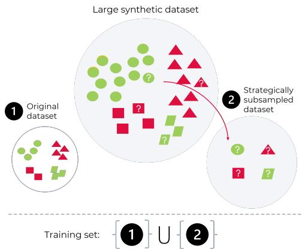
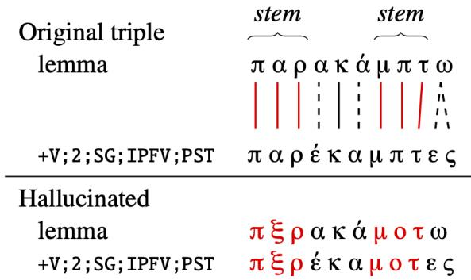
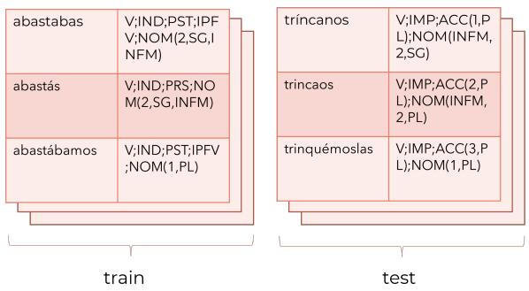
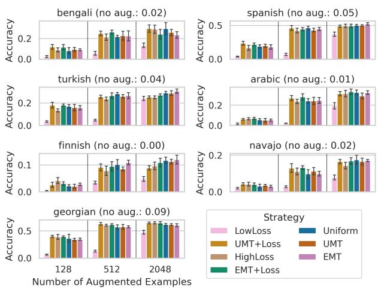
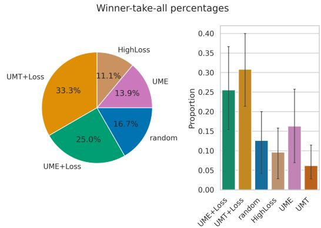
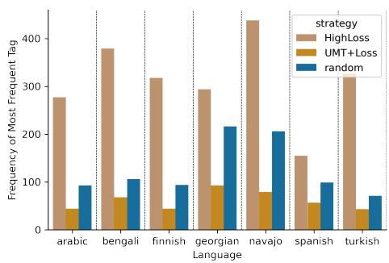
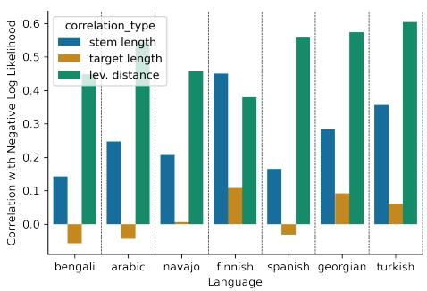
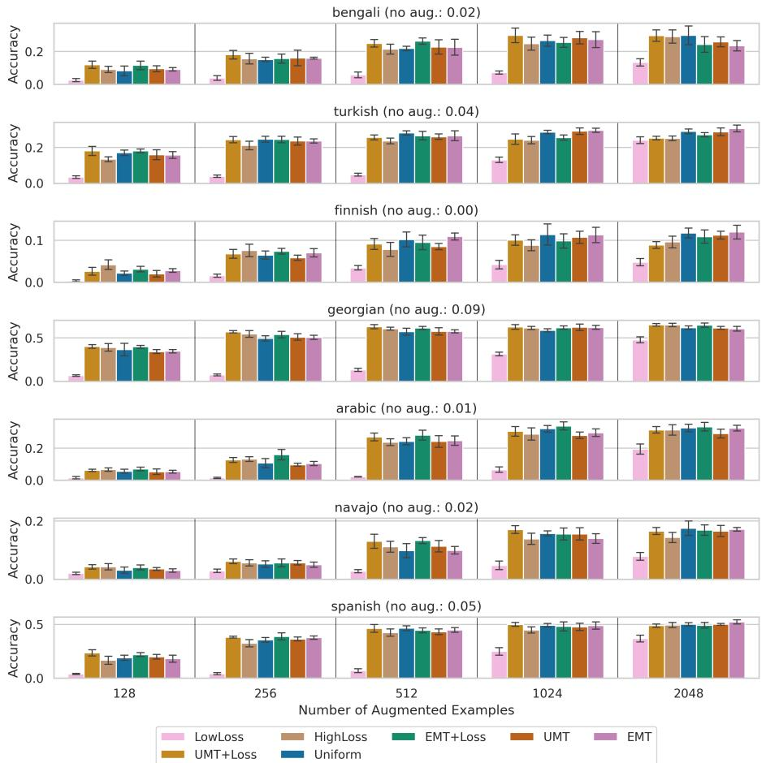

# Understanding Compositional Data Augmentation in Typologically Diverse Morphological Inflection

Farhan Samir Miikka Silfverberg

Natural Language Processing Group, University of British Columbia fsamir@cs.ubc.ca

## Abstract

Data augmentation techniques are widely used in low-resource automatic morphological inflection to overcome data sparsity. However, the full implications of these techniques remain poorly understood. In this study, we aim to shed light on the theoretical aspects of the prominent data augmentation strategy STEM-CORRUPT (Silfverberg et al., 2017; Anastasopoulos and Neubig, 2019), a method that generates synthetic examples by randomly substituting stem characters in gold standard training examples. To begin, we conduct an information-theoretic analysis, arguing that STEMCORRUPT improves compositional generalization by eliminating spurious correlations between morphemes, specifically between the stem and the affixes. Our theoretical analysis further leads us to study the sampleefficiency with which STEMCORRUPT reduces these spurious correlations. Through evaluation across seven typologically distinct languages, we demonstrate that selecting a subset of dat apoints with both high diversity and high predictive uncertainty significantly enhances the data-efficiency of STEMCORRUPT. However, we also explore the impact of typological features on the choice of the data selection strat egy and find that languages incorporating a high degree of allomorphy and phonological alternations derive less benefit from synthetic examples with high uncertainty. We attribute this effect to phonotactic violations induced by STEMCORRUPT, emphasizing the need for fur ther research to ensure optimal performance across the entire spectrum of natural language morphology.1

## 1 Introduction

Compositional mechanisms are widely believed to be the basis for human language production and comprehension (Baroni, 2020). These mechanisms involve the combination of simpler parts to form complex concepts, where valid combinations are licensed by a recursive grammar (Kratzer and Heim, 1998; Partee et al., 1984). However, domain general neural architectures often fail to generalize to new, unseen data in a compositional manner, revealing a failure in inferring the data-generating grammar (Kim and Linzen, 2020; Lake and Baroni, 2018; Wu et al., 2023). This failure hinders these models from closely approximating the productivity and systematicity of human language.

Consider the task of automatic morphological inflection, where models must learn the underlying rules of a language’s morphoysyntax to produce the inflectional variants for any lexeme from a large lexicon. The task is challenging: the models must efficiently induce the rules with only a small human-annotated dataset. Indeed, a recent analysis by Goldman et al. (2022) demonstrates that even state-of-the-art, task-specific automatic inflection models fall short of a compositional solution: they perform well in random train-test splits, but struggle in compositional ones where they must inflect lexemes that were unseen at training time.

Nevertheless, there is reason for optimism. Several works have shown that automatic inflection models come much closer to a compositional solution when the human-annotated dataset is complimented by a synthetic data-augmentation procedure (Liu and Hulden, 2022; Silfverberg et al., 2017; Anastasopoulos and Neubig, 2019; Lane and Bird, 2020; Samir and Silfverberg, 2022), where morphological affixes are identified and attached to synthetic lexemes distinct from those in the training dataset (Fig. 2). However, little is understood about this prominent data augmentation method and the extent to which it can improve compositional generalization in neural word inflection. In this work, we seek to reveal the implicit assumptions about morpheme distributions made by this rule-based augmentation scheme, and analyze the effect of these assumptions on learning of crosslinguistically prevalent morphological patterns.

  
Figure 1: Given a small human-annotated dataset and a large pool of synthetic examples, we find that sampling a subset of data representing both diversity (a multitude of shapes) and high predictive uncertainty (shapes with a question mark) are on average more sample-efficient in improving compositional generalization in morphological inflection.

To this end, our work presents the first theoretical explanation for the effectiveness of compositional data augmentation in morphological inflection. Through an information-theoretic analysis (Section 3), we show that this method eliminates “spurious correlations” (Gardner et al., 2021) between the word’s constituent morphemes, specifically between the stem (e.g., walk) and the inflectional affix (e.g., -ed). By removing these correlations, the training data distribution becomes aligned with concatenative morphology, where a word can be broken down into two independent substructures: the stem (identifying the lexeme) and the inflectional affixes (specifying grammatical function). This finding sheds light on why the method is widely attested to improve compositional generalization (Liu and Hulden, 2022), as concatenative morphological distributions are cross-linguistically prevalent (Haspelmath and Sims, 2013).

We go on to show, however, that the augmentation method tends towards removing all correlations between stems and affixes, whether spurious or not. Unfortunately, this crude representation of concatenative morphology, while reasonable in broad strokes, is violated in virtually all languages to varying degrees by long-distance phonological phenomena like vowel harmony and reduplication. Thus, our analysis demonstrates that while the method induces a useful approximation to concatenative morphology, there is still ample room for improvement in better handling of allomorphy and phonological alternations.

Building on our theoretical analysis, we investigate whether it is possible to improve the sample-efficiency with which the data augmentation method induces probabilistic independence between stems and affixes. Specifically, we investigate whether we can use a small subset of the synthetic data to add to our training dataset. We find that selecting a subset that incorporates both high predictive uncertainty and high diversity (see Fig. 1) is significantly more efficient in removing correlations between stems and affixes, providing an improvement in sample-efficiency for languages where the morphological system is largely concatenative. At the same time, in accordance with our theoretical analysis, this selection strategy impairs performance for languages where phonological alternations are common.

  
[Illustration from Anastasopoulos and Neubig (2019)]  
Figure 2: STEMCORRUPT: a data augmentation method, where the stem – aligned subsequences of length 3 or greater in the input and output – is mutated by substitution with random characters from the alphabet.

Our work contributes to a comprehensive understanding of a prominent data augmentation method from both a theoretical (Section 3) and practical standpoint (Section 4). Through our systematic analysis, we aim to inspire further research in the analysis and evaluation of existing compositional data augmentation methods (reviewed in Section 6), as well as the development of novel augmentation methods that can better capture cross-linguistic diversity in morphological patterns.

## 2 Preliminaries

In automatic morphological inflection, we assume access to a gold-standard dataset $D _ { t r a i n }$ with triples of X, Y, T , where X is the character sequence of the lemma, T is a morphosyntactic description (MSD), and Y is the character sequence of the inflected form.2 The goal is then to learn the distribution P(Y X, T) over inflected forms conditioned

on a lemma and MSD .

Generating a synthetic training dataset with STEMCORRUPT. For many languages, $D _ { t r a i n }$ is too small for models to learn and make systematic morphological generalizations. Previous work has found that generating a complementary synthetic dataset $D _ { t r a i n } ^ { S y n }$ using a data augmentation technique can substantially improve generalization (Anastasopoulos and Neubig, 2019; Silfverberg et al., 2017, among others).

The technique, henceforth called STEMCOR-RUPT, works as follows: We identify the aligned subsequences (of length 3 or greater) between a lemma X and an inflected form Y, which we denote the stem.3 We then substitute some of the characters in the stem with random ones from the language’s alphabet; Fig. 2. The STEMCORRUPT procedure has a hyperparameter θ. It sets the probability that a character in the stem will be substituted by a random one; a higher value of θ (approaching 1) indicates a greater number of substitutions in the stem. 4

How does STEMCORRUPT improve compositional generalization? Despite the widespread adoption of this technique for automatic morphological inflection and analysis, this fundamental question has heretofore remained unanswered. In the next section, we argue that STEMCORRUPT improves compositional generalization by removing correlations between inflectional affixes and the stems to which they are attached. By enforcing independence between these two substructures, STEMCOR-RUPT facilitates productive reuse of the inflectional affixes with other lexemes. That is, our theoretical argument shows that the effectiveness of the method arises from factoring the probability distribution to approximate concatenative morphology, a cross-linguistically prevalent strategy for word formation where words can be “neatly segmented into roots and affixes” (Haspelmath and Sims, 2013). We formalize and prove this in the following section.

## 3 STEMCORRUPT induces compositional structure

In this section, we analyze the ramifications of training on the synthetic training dataset generated by STEMCORRUPT $( D _ { t r a i n } ^ { S y n } )$ and the humanannotated training dataset $( D _ { t r a i n } )$ . Our analysis focuses on asymptotic behaviour, specifically, how the conditional distribution $P ( \mathbf { Y } | \mathbf { X } , \mathbf { T } )$ evolves as we add more augmented data $( | D _ { t r a i n } ^ { S y n } |  \infty )$

  
Figure 3: Models are trained and evaluated on entirely different lexemes.

Theorem 1. For all X, Y, T datapoints in $D _ { t r a i n } ,$ , assume that X and Y share a stem ${ \bf Y } _ { s t e m }$ that is non-empty, and let $\mathbf { Y } _ { a f f i x }$ be the remaining characters of Y. Let ${ \bf X } _ { s t e m }$ and ${ \bf X } _ { a f f i x }$ be analogously defined. Further, let $D _ { t r a i n } ^ { S y n }$ be generated with STEMCORRUPT using $\theta ~ = ~ 1 . ^ { 5 }$ Next, consider the data-generating probability distribution $P ( \mathbf { Y } | \mathbf { X } , \mathbf { T } )$ over $D _ { t r a i n } ^ { S y n } \cup$ $D _ { t r a i n } .$ Then, as $| D _ { t r a i n } ^ { S y n } | ~  ~ \infty ,$ , we have that ${ \cal P } ( { \bf Y } | { \bf X } , { \bf T } ) \equiv { \cal P } ( { \bf Y } _ { s t e m } , { \bf Y } _ { a f f i x } | { \bf X } , { \bf T } ) =$ $P ( \mathbf { Y } _ { a f f i x } | \mathbf { X } _ { a f f i x } , \mathbf { T } ) P ( \mathbf { Y } _ { s t e m } | \mathbf { X } _ { s t e m } )$

Remark 1 (Concatenative compositionality). The augmentation method thus makes the model more effective at capturing concatenative morphological patterns, as the conditional probability distribution becomes factorized into a root generation component $( P ( \mathbf { Y } _ { s t e m } | \cdot ) )$ and an affix generation component $( P ( \mathbf { Y } _ { a f f i x } | \cdot ) )$ . Crucially, this removes the potential for any spurious correlation between these two substructures.6

Remark 2 (Stem-affix dependencies). While concatenation is a cross-linguistically prevalent strategy for inflection (Haspelmath and Sims, 2013), stems and affixes are rarely entirely independent. Therefore, enforcing complete independence between these structures is an overly strong constraint that STEMCORRUPT places on the training data. The constraint is consistently violated in Turkish, for example, where front-back vowel harmony constraints dictate that the vowels in the suffix share the same front/back feature as the initial vowel in the stem. This leads to forms like “daların” and prevents forms like “dalerin”, “dalerın”, or “dalarin” (Kabak, 2011). In Section 5, we show that STEM-CORRUPT regularly generates examples violating vowel harmony, and that this can undermine its effectiveness. Nevertheless, the empirical success of STEMCORRUPT demonstrates that the benefits of its concatenative bias outweigh its limitations.

Remark 3 (Comparison to previous accounts). Our analysis provides a simple yet the most accurate characterization of STEMCORRUPT. Previous works have called STEMCORRUPT a beneficial “copying bias ” (Liu and Hulden, 2022; Jaidi et al., 2022) or a strategy for mitigating overgeneration of common character n-grams (Anastasopoulos and Neubig, 2019). However, our analysis demonstrates that neither of these characterizations are entirely accurate. First, the denotation of a “copying bias” is only suggestive of the second factor in our statement $P ( \mathbf { Y } _ { s t e m } | \mathbf { X } _ { s t e m } )$ , and does not address the impact on affix generation. In contrast, our analysis shows that both stem and affix generation are affected. Furthermore, alleviating overfitting to common character sequences is also misleading, as it would suggest that STEMCORRUPT serves the same purpose as standard regularization techniques like label smoothing (Müller et al., 2019).7

## 3.1 Proving the theorem

The proof of the theorem is straightforward with the following proposition (proved in Appendix B).

Proposition 1. As $| D _ { t r a i n } ^ { S y n } | \to \infty$ , the mutual information between certain pairs ofrandom variables declines:

(i) $I ( { \bf Y } _ { s t e m } ; { \bf T } ) \to 0$

(ii) $I ( { \bf Y } _ { s t e m } ; { \bf X } _ { a f f i x } )  0$

(iii) $I ( { \bf Y } _ { a f f i x } ; { \bf Y } _ { s t e m } )  0$

(iv) $I ( { \bf Y } _ { a f f i x } ; { \bf X } _ { s t e m } )  0$

ProofofTheorem 1. By the definition of $\begin{array} { r l r } { { \textbf Y } } & { { } = } & { { \textbf Y } _ { s t e m } { \textbf Y } _ { a f f i x } } \end{array}$ we have that $P ( { \bf Y } | { \bf X } , { \bf T } ) \equiv P ( { \bf Y } _ { s t e m } , { \bf Y } _ { a f f i x } | { \bf X } , { \bf T } )$ . Then, by the chain rule of probability, we have $P ( \mathbf { Y } _ { a f f i x } | \mathbf { Y } _ { s t e m } , \mathbf { X } , \mathbf { T } ) P ( \mathbf { Y } _ { s t e m } | \mathbf { X } , \mathbf { T } )$ We first deconstruct the second factor. By Proposition 1 (i), we have that the second factor $\begin{array} { r l r } { P ( \mathbf { Y } _ { s t e m } | \mathbf { X } , \mathbf { T } ) } & { { } = } & { P ( \mathbf { Y } _ { s t e m } | \mathbf { X } ) } \end{array}$ , since the stem is invariant with respect to the inflectional features. Then, by Proposition 1 (ii), we have that $\begin{array} { r } { P ( \mathbf { Y } _ { s t e m } | \mathbf { X } ) = P ( \mathbf { Y } _ { s t e m } | \mathbf { X } _ { s t e m } , \mathbf { X } _ { a f f i x } ) } \end{array}$ = $P ( \mathbf { Y } _ { s t e m } | \mathbf { X } _ { s t e m } )$ , since the stem is invariant with respect to the inflectional affix of the lemma.

Next, we tackle the factor $P ( \mathbf { Y } _ { a f f i x } | \mathbf { Y } _ { s t e m } , \mathbf { X } , \mathbf { T } )$ By parts (iii) and (iv) of Proposition 1, we have that this can be simplified to $P ( \mathbf { Y } _ { a f f i x } | \mathbf { X } _ { a f f i x } , \mathbf { T } )$ . Taken together, we have that $P ( \mathbf { \bar { Y } } | \mathbf { X } , \mathbf { T } )$ can be decomposed into $P ( \mathbf { Y } _ { a f f i x } | \mathbf { X } _ { a f f i x } , \mathbf { T } ) P ( \mathbf { Y } _ { s t e m } | \mathbf { X } _ { s t e m } )$ □

Investigating STEMCORRUPT’s sample efficiency. So far, we have studied the behaviour of STEMCORRUPT through an asymptotic argument, demonstrating that in the infinite limit of $| \bar { D } _ { t r a i n } ^ { S y n } |$ STEMCORRUPT enforces complete independence between stems and affixes. In doing so, it likely removes a number of spurious correlations between stems and affixes, thus providing a theoretical explanation for its attested benefit in improving compositional generalization. However, our theoretical analysis, while informative of the overall effect of STEMCORRUPT, says little about the sample efficiency of the method in practice.

Indeed, recent studies in semantic parsing have demonstrated that sample efficiency can be greatly increased by strategically sampling data to overcome spurious correlations that hinder compositional generalization in non-IID data splits (Oren et al., 2021; Bogin et al., 2022; Gupta et al., 2022). In the following section, we examine whether strategic data selection can yield similar benefits in the context of typologically diverse morphological inflection.

## 4 Extracting sample-efficient training sets from STEMCORRUPT

Problem setup. We use the following problem setup from Oren et al. (2021) to investigate whether the sample-efficiency of STEMCOR-RUPT can be improved. Recall that we have a dataset $D _ { t r a i n }$ with gold triples of $\langle \mathbf { X } , \mathbf { Y } , \mathbf { T } \rangle$ . Further, we have a synthesized dataset $D _ { t r a i n } ^ { S y n }$ where $| D _ { t r a i n } ^ { S y n } | \gg | D _ { t r a i n } |$ . Our goal is now to select $\hat { D } _ { t r a i n } ^ { S y n } \ \subset \ D _ { t r a i n } ^ { S y n }$ so that training the model on $D _ { t r a i n } \cup \hat { D } _ { t r a i n } ^ { S y n }$ maximizes performance on a heldout compositional testing split.

## 4.1 Model and training

We start by training an inflection model on the gold-standard training data, denoted as $D _ { t r a i n }$ . Following Wu et al. (2021); Liu and Hulden (2022), we employ Transformer (Vaswani et al., 2017) for . We use the fairseq package (Ott et al., 2019) for training our models and list our hyperparameter settings in Appendix A. We conduct all of our experiments with $| D _ { t r a i n } | = 1 0 0$ gold-standard examples, adhering to the the low-resource setting for SIGMORPHON 2018 shared task for each language. We next describe the construction of $\hat { D } _ { t r a i n } ^ { S \bar { y } n }$

## 4.2 Subset sampling strategies

Here, we introduce a series of strategies for sampling from $D _ { t r a i n } ^ { S y n }$ oriented for improving compositional generalization. Broadly, we focus on selecting subsets that reflect either high structural diversity, high predictive uncertainty, or both, as these properties have been tied to improvements in compositional generalization in prior work on semantic parsing (e.g., Bogin et al., 2022), an NLP research area where compositionality is well studied.

RANDOM. Our baseline sampling method is to construct $\hat { D } _ { t r a i n } ^ { S y n }$ by sampling from the large synthetic training data $D _ { t r a i n } ^ { S y n }$ uniformly.

UNIFORM MORPHOLOGICAL TEMPLATE (UMT). With this method, we seek to improve the structural diversity in our subsampled in synthetic training dataset $\hat { D } _ { t r a i n } ^ { S y n }$ . Training on diverse subset is crucial, as the SIGMORPHON 2018 shared task dataset is imbalanced in frequency of different morphosyntactic descriptions $( \mathrm { M S D s } ) . ^ { 8 }$ These imbalances can pose challenges to the model in generalizing to rarer MSDs. To incorporate greater structural diversity, we employ the templatic sampling process proposed by Oren et al. (2021). Specifically, we modify the distribution over MSDs to be closer to uniform in $\hat { D } _ { t r a i n } ^ { S y n }$ 2

Formally, we sample without replacement from the following distribution: $\begin{array} { r l r } { q _ { \alpha } ( { \bf X } , { \bf Y } , { \bf T } ) } & { { } = } & { p ( { \bf T } ) ^ { \alpha } / \sum _ { \bf T } p ( { \bf T } ) ^ { \alpha } } \end{array}$ where $p ( \mathbf { T } )$ is the proportion of times that T appears in $D _ { t r a i n } ^ { S y n }$ . We consider two cases: $\alpha = 0$ corresponds to sampling MSDs from a uniform distribution (UMT), while $\alpha = 1$ corresponds to sampling tags according to the empirical distribution over MSDs (EMT).

HIGHLOSS. Next, we employ a selection strategy that selects datapoints that have high predictive uncertainty to the initial model . Spurious correlations between substructures (like ${ \mathbf Y } _ { s t e m }$ and $\mathbf { T } ;$ Section 3) will exist in any dataset of bounded size (Gupta et al., 2022; Gardner et al., 2021), and we conjecture that selecting high uncertainty datapoints will efficiently mitigate these correlations.

We quantify the uncertainty of a synthetic datapoint in $D _ { t r a i n } ^ { S \bar { y } n }$ by computing the negative loglikelihood (averaged over all tokens in the the target Y) for each synthetic datapoint in $D _ { t r a i n } ^ { S y n }$ . Next, we select the synthetic datapoints with the highest uncertainty and add them to $\hat { D } _ { t r a i n } ^ { S y n }$

To thoroughly demonstrate that incorporating predictive uncertainty is important for yielding training examples that counteract the spurious dependencies in the ground-truth training dataset, we benchmark it against another subset selection strategy LOWLOSS. With this method, we instead select synthetic datapoints that the model finds easy, i.e., those with the lowest uncertainty scores. We hypothesize this strategy will yield less performant synthetic training datasets, as it is biased towards selecting datapoints that corroborate rather than counteract the spurious correlations learned by .

UMT/EMT+ LOSS. Finally, we test a hybrid approach containing both high structural diversity and predictive uncertainty by combining UMT/EMT and HIGHLOSS. First, we sample an MSD T (according to the MSD distribution defined by UMT/EMT) and then select the most uncertain synthetic datapoint for that T.

## 5 Experiments and Results

Data. We use data from the UniMorph project (Batsuren et al., 2022), considering typological diversity when selecting languages to include. We aim for an evaluation similar in scope to Muradoglu and Hulden (2022). That is, broadly, we attempt to include types of languages that exhibit variation in inflectional characteristics such as inflectional synthesis of the verb, exponence, and morphological paradigm size (Haspelmath et al., 2005). Our selected languages can be seen in Fig. 4. We provide further information on the languages in Appendix C.

Obtaining a large synthetic dataset. In order to generate the large augmentation dataset $D _ { t r a i n } ^ { S y n }$ for every language, we generate 10, 000 augmented datapoints for every language by applying STEM-CORRUPT to their respective low datasets from SIGMORPHON 2018 (Cotterell et al., 2018).

  
Figure 4: Performance after training on $D _ { t r a i n } \cup \hat { D } _ { t r a i n } ^ { S y n }$ , for varying sizes of $\hat { D } _ { t r a i n } ^ { S y n }$ . In the subtitle for each language, we also list the performance from training on no augmented data in parentheses $( \hat { D } _ { t r a i n } ^ { S y n } = \varnothing )$ .

Generating a compositional generalization test set. For generating test sets, we adopt the lemma-split approach of Goldman et al. (2022). Specifically, we use all available data from SIGMORPHON2018 for the target language, excluding any lexemes from the low setting since those were used to train the initial model (Section 4.1). The remaining lexemes and their associated paradigms comprise our compositional generalization test set; see Fig. 3.

Populating $\hat { D } _ { t r a i n } ^ { S y n }$ . We evaluate the performance of all methods listed in Section 4 in selecting $\hat { D } _ { t r a i n } ^ { S y n }$ . We evaluated the performance of using $\hat { D } _ { t r a i n } ^ { S y n }$ of sizes ranging from 128 to 2048 examples, increasing the size by powers of 2.

## 5.1 Results

We demonstrate the results of each strategy for all languages, considering each combination of language, subset selection strategy, and $| D _ { t r a i n } ^ { S y n } |$ , thus obtaining 35 sets of results. For each setting, we report the performance achieved over 6 different random initializations, along with their respective standard deviations. For brevity, we show the results for $| \hat { D } _ { t r a i n } ^ { S y n } | \in \{ 1 2 8 , 5 1 2 , \dot { 2 } 0 4 8 \}$ ; we include the expanded set of results (including 256, 1024 ) in Appendix D.

STEMCORRUPT improves compositional generalization. At a high level, we find that data augmentation brings substantial benefits for compositional generalization compared to models trained solely on the gold-standard training data $D _ { t r a i n }$ . Without STEMCORRUPT, the initial model for every language achieves only single-digit accuracy, while their augmented counterparts perform significantly better. For instance, the best models for Georgian and Spanish achieve over 50% accuracy. These findings agree with those of Liu and Hulden (2022) who found that unaugmented Transformer models fail to generalize inflection patterns.

  
Figure 5: Summary of subset selection strategies performances from. Left: percentage of times each strategy gets the best performance out of 35 settings (across each of the 7 languages and 5 $\hat { D } _ { t r a i n } ^ { S y n }$ sizes). Right: bootstrapped confidence intervals for the percentages on the left.

We also find that performance tends to increase as we add more synthetic data; the best models for every language are on the higher end of the $| \hat { D } _ { t r a i n } ^ { S y n } |$ sizes. This finding agrees with our theoretical results that the dependence between the stem $( \mathbf { Y } _ { s t e m } )$ and that of the inflectional affix $( { \bf Y } _ { a f f i x } )$ is weakened as we add more samples from STEM-CORRUPT (Section 3; Proposition 1).

Effective subsets have high diversity and predictive uncertainty. Our analysis reveals statistically significant differences between the subset selection strategies, highlighting the effectiveness of the hybrid approaches (UMT/EMT+LOSS) that consider both diversity and predictive uncertainty. Among the strategies tested, the UMT+LOSS method outperformed all others in approximately one-third of the 35 settings examined, as indicated in Figure 5 (left). The improvements achieved by the UMT+LOSS method over a random baseline were statistically significant $( p \ : < \ : 0 . 0 5 )$ according to a bootstrap percentile test (Efron and Tibshirani, 1994), as shown in Figure 5 (right). Moreover, our results also show that the EMT+LOSS strategy closely followed the UMT+LOSS approach, achieving the highest performance in a quarter of the cases. In contrast, the same strategies without the uncertainty component were much less effective. For instance, UMT never achieved the best performance in any combination of the languages and $| \hat { D } _ { t r a i n } ^ { S y n } |$ sizes, highlighting that selecting a diverse subset without factoring in predictive uncertainty is suboptimal.

  
Figure 6: The frequency of the most commonly sampled mor phosyntactic description by three of subset selection methods.

Furthermore, selecting datapoints based solely on high predictive uncertainty without considering diversity (HIGHLOSS) is an ineffective strategy, having the second lowest proportion of wins (Fig. 5, right). Empirically, we find this may be attributed to the HIGHLOSS strategy fixating on a particular MSD, as shown in Fig. 6, rather than exploring the full distribution of MSDs. The figure displays the frequency of the most commonly sampled morphosyntactic description for each of UMT+LOSS, RANDOM, and HIGHLOSS strategies. Across all languages, the HIGHLOSS method samples the most frequent tag much more often than the RANDOM and UMT+LOSS methods.9

“Easy” synthetic datapoints have low sample efficiency. As hypothesized, the datapoints with low uncertainty hurt performance. We attribute this to the LowLoss strategy selecting datapoints with a smaller number of substitutions to the stem. In Fig. 7, we show that the number of edits made to the stem – as measured by Levenshtein distance between the corrupted target sequence and the uncorrupted version – is strongly correlated with the uncertainty assigned to the synthetic datapoint across all languages. Moreover, the correlation between the number of edits and uncertainty is higher than the correlation with other plausible factors driving uncertainty, namely stem length and target length.10 Overall, the lagging sample efficiency of LOWLOSS corroborates our theory; STEMCORRUPT is effective because it generates datapoints where the stem has no correspondence with the affix. LOWLOSS counteracts its effectiveness, as it is biased towards datapoints where spurious dependencies between the stem and affix are maintained.11

  
Figure 7: Pearson correlations between Negative Log Likelihood and three other metrics: length of the stem, length of the target inflected form, and Levenshtein distance between the ground-truth target form and the augmented target.

Selecting by high predictive uncertainty worsens performance when there are stem-affix dependencies. We found that the UMT+LOSS strategy improves performance for 5 out of 7 languages compared to the RANDOM baseline. The improvement ranges from 4.8 (Georgian) to small declines of 1.9 (Turkish) and 0.9 (Finnish). The declines for Finnish and Turkish are partly due to a mismatch between the generated synthetic examples and the languages’ morphophonology. STEM-CORRUPT will generate synthetic examples that violate vowel harmony constraints between the stem and the affix. For instance, it may replace a front vowel in the stem with a back one. As a result, UMT+LOSS will select such harmony-violating examples more often, since they have greater uncertainty to the initial model (Section 4.1), resulting in the augmented model tending to violate the harmony restrictions more often. Indeed, for Turkish, the average uncertainty for synthetic examples violating vowel harmony (0.46) is significantly higher than those that adhere to vowel harmony (0.39), as assessed by a bootstrap percentile test $( p < 0 . 0 5 )$ . This finding also corroborates our theory from Section 3: STEMCORRUPT eliminates dependencies between stems and affixes, even when the dependencies are real rather than spurious. This shortcoming of STEMCORRUPT is exacerbated by selecting examples with high uncertainty, as these examples are less likely to adhere to stem-affix constraints like vowel harmony.

<table><tr><td>Language</td><td colspan="2">Improvement</td></tr><tr><td>Georgian</td><td></td><td rowspan="3">4.8 2.5</td></tr><tr><td>Bengali</td><td></td></tr><tr><td>Spanish</td><td>1.3</td></tr><tr><td>Navajo</td><td>1.1</td></tr><tr><td>Arabic</td><td>0.4</td></tr><tr><td>Finnish</td><td>-0.9</td></tr><tr><td>Turkish</td><td>-1.9</td></tr></table>

Table 1: Improvement of UMT+Loss relative to the random baseline, averaged over all possible sizes of $\hat { D } _ { t r a i n } ^ { S y n }$

Takeaways. Aligning with the semantic parsing literature on efficient compositional data augmentation (Oren et al., 2021; Bogin et al., 2022; Gupta et al., 2022), we find that certain subsets of data are on average more efficient at eliminating spurious correlations between substructures – in the case of morphological inflection, the relevant substructures being the individual morphemes: the stem $( \mathbf { Y } _ { s t e m } )$ and affix $( \mathbf { Y } _ { a f f i x } ;$ Section 3). However, the sample-efficiency gains from strategic sampling are less dramatic than in semantic parsing (see, for example, Oren et al., 2021).

We provided empirical evidence that the gains are tempered by STEMCORRUPT’s tendencies to violate stem-affix constraints in its synthetic training examples, such as vowel harmony constraints in Turkish. Thus, further work is needed to adapt or supplant STEMCORRUPT for languages where such long-range dependencies are commonplace. In doing so, the data selection strategies are likely to fetch greater gains in sample efficiency.

## 6 Related work

Compositional data augmentation methods. In general, such methods synthesize new data points by splicing or swapping small parts from existing training data, leveraging the fact that certain constituents can be interchanged while preserving overall meaning or syntactic structure. A common approach is to swap spans between pairs of datapoints when their surrounding contexts are identical (Andreas, 2020; Guo et al., 2020; Jia and Liang, 2016, inter alia). Recently, Akyürek et al. (2021) extended this approach, eschewing rule-based splicing in favour of neural network-based recombination. Chen et al. (2023) review more compositional data augmentation techniques, situating them within the broader landscape of limited-data learning techniques for NLP.

Extracting high-value subsets in NLP training data. Oren et al. (2021); Bogin et al. (2022); Gupta et al. (2022) propose methods for extracting diverse sets of abstract templates to improve compositional generalization in semantic parsing. Muradoglu and Hulden (2022) train a baseline model on a small amount of data and use entropy estimates to select new data points for annotation, reducing annotation costs for morphological inflection. Swayamdipta et al. (2020) identify effective data subsets for training high-quality models for question answering, finding that small subsets of ambiguous examples perform better than randomly selected ones. Our work is also highly related to active-learning in NLP (Tamkin et al., 2022; Yuan et al., 2020; Margatina et al., 2021, inter alia); however we focus on selecting synthetic rather than unlabeled datapoints, and our experiments are geared towards compositional generalization rather than IID performance.

Compositional data splits in morphological inflection. Assessing the generalization capacity of morphological inflections has proven a challenging and multifaceted problem. Relying on standard “IID” (Oren et al., 2021; Liu and Hulden, 2022) splits obfuscated (at least) two different manners in which inflection models fail to generalize compositionally.

First, Goldman et al. (2022) uncovered that generalizing to novel lexemes was challenging for even state of the art inflection models. Experiments by Liu and Hulden (2022) however showed that the STEMCORRUPT method could significantly improve generalization to novel lexemes. Our work builds on theirs by contributing to understanding the relationship between STEMCORRUPT and lexical compositional generalization. Specifically, we studied the structure of the probability distribution that StemCorrupt promotes (Section 3), and the conditions under which it succeeds (Remark 1) and fails (Remark 2).

Second, Kodner et al. (2023) showed that inflection models also fail to generalize compositionally to novel feature combinations, even with agglutinative languages that have typically have a strong oneto-one alignment between morphological features and affixes. Discovering strategies to facilitate compositional generalization in terms of novel feature combinations remains an open-area of research.

## 7 Conclusion

This paper presents a novel theoretical explanation for the effectiveness of STEMCORRUPT, a widelyused data augmentation method, in enhancing compositional generalization in automatic morphological inflection. By applying information-theoretic constructs, we prove that the augmented examples work to improve compositionality by eliminating dependencies between substructures in words – stems and affixes. Building off of our theoretical analysis, we present the first exploration of whether the sample efficiency of reducing these spurious dependencies can be improved. Our results show that improved sample efficiency is achievable by selecting subsets of synthetic data reflecting high structural diversity and predictive uncertainty, but there is room for improvement – both in strategic sampling strategies and more cross-linguistically effective data augmentation strategies that can represent long distance phonological alternations.

Overall, NLP data augmentation strategies are poorly understood (Dao et al., 2019; Feng et al., 2021) and our work contributes to filling in this gap. Through our theoretical and empirical analyses, we provide insights that can inform future research on the effectiveness of data augmentation methods in improving compositional generalization.

## 8 Limitations

Theoretical analysis. We make some simplifying assumptions to facilitate our analysis in Section 3. First, we assume that the stem between a gold-standard lemma and inflected form X and Y is discoverable. This is not always the case; for example, with suppletive inflected forms, the relationship between the source lemma and the target form is not systematic. Second, we assume that all characters in the stem are randomly substituted, corresponding to setting the θ = 1 for STEMCOR-RUPT. This does not correspond to how we deploy STEMCORRUPT; the implementation provided by Anastasopoulos and Neubig (2019) sets $\theta = 0 . 5$ and we use this value for our empirical analysis Section 5. We believe the analysis under $\theta = 1$ provides a valuable and accurate characterization of STEMCORRUPT nonetheless and can be readily extended to accommodate the $0 < \theta < 1$ case in future work.

Empirical analysis. In our empirical analysis, we acknowledge two limitations that can be addressed in future research. First, we conduct our experiments using data collected for the SIGMORPHON 2018 shared task, which may not contain a naturalistic distribution of morphosyntactic descriptions since it was from an online database (Wiktionary). In future work, we aim to replicate our work in a more natural setting such as applications for endangered language documentation (Muradoglu and Hulden, 2022; Moeller et al., 2020), where the morphosyntactic description distribution is likely to be more imbalanced. Second, we perform our analyses in an extremely data-constrained setting where only 100 gold-standard examples are available. In higher resourced settings, data augmentation with STEMCORRUPT may provide a much more limited improvement to compositional generalization; indeed the compositional generalization study of morphological inflection systems by Goldman et al. (2022) demonstrates that the disparity between IID generalization and compositional generalization largely dissipates when the model is trained on more gold-standard data.

## 9 Acknowledgements

We thank the EMNLP reviewers, the area chair, Vered Shwartz, Kat Vylomova, and Adam Wiemerslage for helpful discussion and feedback on the manuscript. We also thank Ronak D. Mehta for insightful discussion on properties of mutual information. This work was supported by an NSERC PGS-D scholarship to the first author.

## References

Ekin Akyürek, Afra Feyza Akyürek, and Jacob Andreas. 2021. Learning to recombine and resample data for compositional generalization. In International Conference on Learning Representations.

Antonios Anastasopoulos and Graham Neubig. 2019. Pushing the limits of low-resource morphological inflection. In Proceedings ofthe 2019 Conference on Empirical Methods in Natural Language Processing and the 9th International Joint Conference on Natural Language Processing (EMNLP-IJCNLP), pages 984–996, Hong Kong, China. Association for Computational Linguistics.

Jacob Andreas. 2020. Good-Enough Compositional Data Augmentation. In Proceedings of the 58th Annual Meeting of the Association for Computational Linguistics, pages 7556–7566, Online. Association for Computational Linguistics.

Marco Baroni. 2020. Linguistic generalization and compositionality in modern artificial neural networks. Philosophical Transactions of the Royal Society B, 375(1791):20190307. Publisher: The Royal Society.

Khuyagbaatar Batsuren, Omer Goldman, Salam Khalifa, Nizar Habash, Witold Kieras, Gábor Bella,´ Brian Leonard, Garrett Nicolai, Kyle Gorman, Yustinus Ghanggo Ate, Maria Ryskina, Sabrina Mielke, Elena Budianskaya, Charbel El-Khaissi, Tiago Pimentel, Michael Gasser, William Abbott Lane, Mohit Raj, Matt Coler, Jaime Rafael Montoya Samame, Delio Siticonatzi Camaiteri, Esaú Zu maeta Rojas, Didier López Francis, Arturo Oncevay, Juan López Bautista, Gema Celeste Silva Villegas, Lucas Torroba Hennigen, Adam Ek, David Guriel, Peter Dirix, Jean-Philippe Bernardy, Andrey Scherbakov, Aziyana Bayyr-ool, Antonios Anastasopoulos, Roberto Zariquiey, Karina Sheifer, Sofya Ganieva, Hilaria Cruz, Ritván Karahóga,ˇ Stella Markantonatou, George Pavlidis, Matvey Plugaryov, Elena Klyachko, Ali Salehi, Candy Angulo, Jatayu Baxi, Andrew Krizhanovsky, Natalia Krizhanovskaya, Elizabeth Salesky, Clara Vania, Sardana Ivanova, Jennifer White, Rowan Hall Maudslay, Josef Valvoda, Ran Zmigrod, Paula Czarnowska, Irene Nikkarinen, Aelita Salchak, Brijesh Bhatt, Christopher Straughn, Zoey Liu, Jonathan North Washington, Yuval Pinter, Duygu Ataman, Marcin Wolinski, Totok Suhardijanto, Anna Yablonskaya, Niklas Stoehr, Hossep Dolatian, Zahroh Nuriah, Shyam Ratan, Francis M. Tyers, Edoardo M. Ponti, Grant Aiton, Aryaman Arora, Richard J. Hatcher, Ritesh Kumar, Jeremiah Young, Daria Rodionova, Anastasia Yemelina, Taras Andrushko, Igor Marchenko, Polina Mashkovtseva, Alexandra Serova, Emily Prud’hommeaux, Maria Nepomniashchaya, Fausto Giunchiglia, Eleanor Chodroff, Mans Hulden, Miikka Silfverberg, Arya D. Mc-Carthy, David Yarowsky, Ryan Cotterell, Reut Tsarfaty, and Ekaterina Vylomova. 2022. UniMorph 4.0: Universal Morphology. In Proceedings of the Thirteenth Language Resources and Evaluation Confer-

ence, pages 840–855, Marseille, France. European Language Resources Association.

Balthasar Bickel and Johanna Nichols. 2013. Exponence of selected inflectional formatives (v2020.3). In Matthew S. Dryer and Martin Haspelmath, editors, The World Atlas ofLanguage Structures Online. Zenodo.

Ben Bogin, Shivanshu Gupta, and Jonathan Berant. 2022. Unobserved local structures make compositional generalization hard. In Proceedings of the 2022 Conference on Empirical Methods in Natural Language Processing, pages 2731–2747, Abu Dhabi, United Arab Emirates. Association for Computational Linguistics.

Jiaao Chen, Derek Tam, Colin Raffel, Mohit Bansal, and Diyi Yang. 2023. An empirical survey of data augmentation for limited data learning in NLP. Transactions of the Association for Computational Linguistics, 11:191–211.

Ryan Cotterell, Christo Kirov, John Sylak-Glassman, Géraldine Walther, Ekaterina Vylomova, Arya D. McCarthy, Katharina Kann, Sabrina J. Mielke, Garrett Nicolai, Miikka Silfverberg, David Yarowsky, Jason Eisner, and Mans Hulden. 2018. The CoNLL–SIGMORPHON 2018 Shared Task: Universal Morphological Reinflection. In Proceedings of the CoNLL–SIGMORPHON 2018 Shared Task: Universal Morphological Reinflection, pages 1–27, Brussels. Association for Computational Linguistics.

Tri Dao, Albert Gu, Alexander Ratner, Virginia Smith, Chris De Sa, and Christopher Ré. 2019. A kernel theory of modern data augmentation. In Proceedings of the 36th International Conference on Machine Learning, ICML 2019, volume 97 of Proceedings of Machine Learning Research, pages 1528–1537. PMLR.

Bradley Efron and Robert J Tibshirani. 1994. An introduction to the bootstrap. CRC press.

Bryan Eikema and Wilker Aziz. 2020. Is MAP decoding all you need? the inadequacy of the mode in neural machine translation. In Proceedings of the 28th International Conference on Computational Linguistics, pages 4506–4520, Barcelona, Spain (Online). International Committee on Computational Linguistics.

Steven Y. Feng, Varun Gangal, Jason Wei, Sarath Chandar, Soroush Vosoughi, Teruko Mitamura, and Eduard Hovy. 2021. A survey of data augmentation approaches for NLP. In Findings of the Association for Computational Linguistics: ACL-IJCNLP 2021, pages 968–988, Online. Association for Computational Linguistics.

Matt Gardner, William Merrill, Jesse Dodge, Matthew Peters, Alexis Ross, Sameer Singh, and Noah A. Smith. 2021. Competency problems: On finding and removing artifacts in language data. In Proceedings ofthe 2021 Conference on Empirical Methods in Natural Language Processing, pages 1801–1813, Online

and Punta Cana, Dominican Republic. Association for Computational Linguistics.

Omer Goldman, David Guriel, and Reut Tsarfaty. 2022. (Un)solving Morphological Inflection: Lemma Overlap Artificially Inflates Models’ Performance. In Proceedings of the 60th Annual Meeting of the Associationfor Computational Linguistics (Volume 2: Short Papers), pages 864–870, Dublin, Ireland. Association for Computational Linguistics.

Demi Guo, Yoon Kim, and Alexander Rush. 2020. Sequence-level mixed sample data augmentation. In Proceedings of the 2020 Conference on Empirical Methods in Natural Language Processing (EMNLP), pages 5547–5552, Online. Association for Computational Linguistics.

Shivanshu Gupta, Sameer Singh, and Matt Gardner. 2022. Structurally diverse sampling for sampleefficient training and comprehensive evaluation. In Findings ofthe Associationfor Computational Linguistics: EMNLP 2022, pages 4966–4979, Abu Dhabi, United Arab Emirates. Association for Computational Linguistics.

Martin Haspelmath, Matthew S Dryer, David Gil, and Bernard Comrie. 2005. The world atlas oflanguage structures. OUP Oxford.

Martin Haspelmath and Andrea Sims. 2013. Understanding Morphology. Routledge.

Badr Jaidi, Utkarsh Saboo, Xihan Wu, Garrett Nicolai, and Miikka Silfverberg. 2022. Impact of sequence length and copying on clause-level inflection. In Proceedings of the The 2nd Workshop on Multi-lingual Representation Learning (MRL), pages 106–114, Abu Dhabi, United Arab Emirates (Hybrid). Association for Computational Linguistics.

Robin Jia and Percy Liang. 2016. Data recombination for neural semantic parsing. In Proceedings of the 54th Annual Meeting ofthe Associationfor Computational Linguistics (Volume 1: Long Papers), pages 12–22, Berlin, Germany. Association for Computational Linguistics.

Bari¸s Kabak. 2011. Turkish vowel harmony. The Blackwell companion to phonology, pages 1–24.

Najoung Kim and Tal Linzen. 2020. COGS: A Compositional Generalization Challenge Based on Semantic Interpretation. In Proceedings of the 2020 Conference on Empirical Methods in Natural Language Processing (EMNLP), pages 9087–9105, Online. Association for Computational Linguistics.

Jordan Kodner, Sarah Payne, Salam Khalifa, and Zoey Liu. 2023. Morphological inflection: A reality check. In Annual Meeting ofthe Associationfor Computational Linguistics.

Angelika Kratzer and Irene Heim. 1998. Semantics in generative grammar, volume 1185. Blackwell Oxford.

Brenden M. Lake and Marco Baroni. 2018. Generalization without systematicity: On the compositional skills of sequence-to-sequence recurrent networks. In Proceedings ofthe 35th International Conference on Machine Learning, ICML 2018, volume 80 of Proceedings of Machine Learning Research, pages 2879–2888. PMLR.

William Lane and Steven Bird. 2020. Bootstrapping techniques for polysynthetic morphological analysis. In Proceedings of the 58th Annual Meeting of the Association for Computational Linguistics, pages 6652–6661, Online. Association for Computational Linguistics.

Paul M. A. Lewis. 2009. Ethnologue : languages of the world.

Ling Liu and Mans Hulden. 2022. Can a Transformer Pass the Wug Test? Tuning Copying Bias in Neural Morphological Inflection Models. In Proceedings ofthe 60th Annual Meeting ofthe Association for Computational Linguistics (Volume 2: Short Papers), pages 739–749, Dublin, Ireland. Association for Computational Linguistics.

Katerina Margatina, Giorgos Vernikos, Loïc Barrault, and Nikolaos Aletras. 2021. Active Learning by Acquiring Contrastive Examples. In Proceedings ofthe 2021 Conference on Empirical Methods in Natural Language Processing, pages 650–663, Online and Punta Cana, Dominican Republic. Association for Computational Linguistics.

Sarah Moeller, Ling Liu, Changbing Yang, Katharina Kann, and Mans Hulden. 2020. IGT2P: From interlinear glossed texts to paradigms. In Proceedings ofthe 2020 Conference on Empirical Methods in Natural Language Processing (EMNLP), pages 5251–5262, Online. Association for Computational Linguistics.

Rafael Müller, Simon Kornblith, and Geoffrey E Hinton. 2019. When does label smoothing help? volume 32. Advances in Neural Information Processing Systems.

Saliha Muradoglu and Mans Hulden. 2022. Eeny, meeny, miny, moe. How to choose data for morphological inflection. In Proceedings ofthe 2022 Conference on Empirical Methods in Natural Language Processing, pages 7294–7303, Abu Dhabi, United Arab Emirates. Association for Computational Linguistics.

Inbar Oren, Jonathan Herzig, and Jonathan Berant. 2021. Finding needles in a haystack: Sampling Structurallydiverse Training Sets from Synthetic Data for Compositional Generalization. In Proceedings of the 2021 Conference on Empirical Methods in Natural Language Processing, pages 10793–10809, Online and Punta Cana, Dominican Republic. Association for Computational Linguistics.

Myle Ott, Sergey Edunov, Alexei Baevski, Angela Fan, Sam Gross, Nathan Ng, David Grangier, and Michael

Auli. 2019. fairseq: A Fast, Extensible Toolkit for Sequence Modeling. In Proceedings of the 2019 Conference of the North American Chapter of the Association for Computational Linguistics (Demonstrations), pages 48–53, Minneapolis, Minnesota. Association for Computational Linguistics.

Barbara Partee et al. 1984. Compositionality. Varieties offormal semantics, 3:281–311.

Neil Rathi, Michael Hahn, and Richard Futrell. 2021. An information-theoretic characterization of morphological fusion. In Proceedings of the 2021 Conference on Empirical Methods in Natural Language Processing, pages 10115–10120, Online and Punta Cana, Dominican Republic. Association for Computational Linguistics.

Farhan Samir and Miikka Silfverberg. 2022. One wug, two wug+s transformer inflection models hallucinate affixes. In Proceedings of the Fifth Workshop on the Use of Computational Methods in the Study of Endangered Languages, pages 31–40, Dublin, Ireland. Association for Computational Linguistics.

Miikka Silfverberg, Adam Wiemerslage, Ling Liu, and Lingshuang Jack Mao. 2017. Data augmentation for morphological reinflection. In Proceedings of the CoNLL SIGMORPHON 2017 Shared Task: Universal Morphological Reinflection, pages 90–99, Vancouver. Association for Computational Linguistics.

Swabha Swayamdipta, Roy Schwartz, Nicholas Lourie, Yizhong Wang, Hannaneh Hajishirzi, Noah A. Smith, and Yejin Choi. 2020. Dataset Cartography: Mapping and Diagnosing Datasets with Training Dynamics. In Proceedings ofthe 2020 Conference on Empirical Methods in Natural Language Processing (EMNLP), pages 9275–9293, Online. Association for Computational Linguistics.

Alex Tamkin, Dat Nguyen, Salil Deshpande, Jesse Mu, and Noah Goodman. 2022. Active learning helps pretrained models learn the intended task. In Advances in Neural Information Processing Systems.

Joy A Thomas and Thomas M Cover. 2006. Elements ofinformation theory. John Wiley & Sons.

Ashish Vaswani, Noam Shazeer, Niki Parmar, Jakob Uszkoreit, Llion Jones, Aidan N Gomez, Ł ukasz Kaiser, and Illia Polosukhin. 2017. Attention is all you need. volume 30. Advances in Neural Information Processing Systems.

Shijie Wu, Ryan Cotterell, and Mans Hulden. 2021. Applying the Transformer to Character-level Transduction. In Proceedings of the 16th Conference of the European Chapter ofthe Associationfor Computational Linguistics: Main Volume, pages 1901–1907, Online. Association for Computational Linguistics.

Zhengxuan Wu, Christopher D. Manning, and Christopher Potts. 2023. Recogs: How incidental details of a logical form overshadow an evaluation of semantic interpretation.

Michelle Yuan, Hsuan-Tien Lin, and Jordan Boyd-Graber. 2020. Cold-start active learning through selfsupervised language modeling. In Proceedings ofthe 2020 Conference on Empirical Methods in Natural Language Processing (EMNLP), pages 7935–7948, Online. Association for Computational Linguistics.

## A Transformer training details

<table><tr><td>Batch size</td><td>16</td></tr><tr><td>Label smoothing</td><td>0.2</td></tr><tr><td>Warmup updates Total updates</td><td>4000</td></tr><tr><td></td><td>6000</td></tr><tr><td>Dropout</td><td>0.3</td></tr><tr><td>Encoder layers</td><td>4</td></tr><tr><td>Decoder layers</td><td>4</td></tr><tr><td>Attention dropout</td><td>0.1</td></tr><tr><td>Adam  $( \beta _ { 1 } , \beta _ { 2 } )$ </td><td>(0.9,0.999)</td></tr></table>

## B Proof of Proposition 1

We recall proposition 1:

Proposition 1. $A s \vert D _ { t r a i n } ^ { S y n } \vert  \infty$ , the mutual information between certain pairs ofrandom variables declines:

(i) $I ( { \bf Y } _ { s t e m } ; { \bf T } ) \to 0$

(ii) $I ( { \bf Y } _ { s t e m } ; { \bf X } _ { a f f i x } )  0$

(iii) $I ( { \bf Y } _ { a f f i x } ; { \bf Y } _ { s t e m } )  0$

(iv) $I ( { \bf Y } _ { a f f i x } ; { \bf X } _ { s t e m } )  0$

Our proof hinges on the fact that mutual information $I ( X ; Y )$ is convex in the conditional distribution $P ( { Y \vert } X )$ when the marginal distribution $P ( X )$ is held constant, due to Thomas and Cover (2006).

Theorem 2 (Thomas & Cover). Let $( X , Y ) \sim$ $p ( x , y ) \ : = \ : p ( x ) p ( y | x )$ . The mutual information $I ( X ; Y )$ is a concave function of p(x) for fixed $p ( y | x )$ and a convex function of $p ( y | x )$ for fixed $p ( x )$

This theorem is useful for our argument since the data augmentation algorithm results in the marginal distribution over some random variables being affected (namely $\mathbf { Y } _ { s t e m } , \mathbf { X } _ { s t e m } )$ and other marginals staying fixed $( { \bf T } , { \bf X } _ { a f f i x } , { \bf Y } _ { a f f i x } )$ . This enables us to invoke the latter half of the theorem (“convex function of $p ( y | x )$ for fixed $p ( x ) ^ { \prime \prime } )$ and thus obtain an upper bound on the mutual information between the pairs of variables stated in proposition 1. We will argue that this upper bound will decline to 0 as we take $| D _ { t r a i n } ^ { S y n } | \stackrel { } {  } \infty ,$ and thus the mutual information must also decline to 0.

Proof. Let $I _ { G } : = I ( \mathbf { T } ; \mathbf { Y } _ { s t e m } )$ be the mutual information between the random variables T and ${ \mathbf Y } _ { s t e m }$ in the human annotated dataset $D _ { t r a i n }$ , where T is generated from some distribution $P ( \mathbf { T } )$ and $Y _ { s t e m }$ be generated from $P _ { G } ( \mathbf { Y } _ { s t e m } | \mathbf { T } )$

<table><tr><td>Bengali Finnish Arabic Navajo</td><td>Indo-Aryan; 300M Uralic; 5.8M Semitic; 360M Athabaskan; 170K</td></tr></table>

Table 2: Languages assessed in our experiments on assessing the sample efficiency of data augmentation. We also list their language families and number of speakers.

Let $I _ { A } : = I ( \mathbf { T } ; \mathbf { Y } _ { s t e m } )$ be the mutual information between the random variables T and ${ \bf Y } _ { s t e m }$ in the synthetic dataset $D _ { t r a i n } ^ { S y n } .$ where T is generated from $P ( \mathbf { T } )$ (as before) and $\mathbf { Y } _ { s t e m }$ is generated from $P _ { A } ( \mathbf { Y } _ { s t e m } | \mathbf { T } )$ . The data augmentation algorithm generates the stem characters by uniformly sampling characters the a language’s alphabet. Crucially, this means the mutual information $I _ { A } = 0$ since the value of $\mathbf { Y } _ { s t e m }$ is independent of the value of T.

Then, let ${ \cal I } ~ : = { \cal I } ( { \bf T } ; { \bf Y } _ { s t e m } )$ be the mutual information between the random variables T and $\mathbf { Y } _ { s t e m } \mathrm { o v e r } D _ { t r a i n } \cup D _ { t r a i n } ^ { S y n }$ , where $( \mathbf { T } , \mathbf { Y } _ { s t e m } ) \sim$ $( p ( \mathbf { T } ) , \lambda P _ { G } ( \mathbf { Y } _ { s t e m } | \mathbf { T } ) + ( 1 - \lambda ) P _ { A } ( \mathbf { Y } _ { s t e m } | T ) )$ and $\lambda ~ : = ~ | D _ { t r a i n } | / | D _ { t r a i n } \cup D _ { t r a i n } ^ { S y n } |$ . By the convexity of mutual information (Theorem 2), we have that $I \leq \lambda I _ { G } + ( 1 - \lambda ) I _ { A }$

As we take $| D _ { t r a i n } ^ { S y n } | \to \infty$ , we have that $\lambda I _ { G } +$ $( 1 - \lambda ) I _ { A } \to 0 \cdot I _ { G } + 1 \cdot I _ { A } = 0$ . Thus, I is lower bounded by zero (since mutual information is nonnegative) and upper bounded by 0 as $D _ { t r a i n } ^ { S y n }  0$ (by the above argument). Thus, we have that $I  0 .$ as desired. This proves (1).

The same argument can be applied to prove (ii), (iii), and (iv). For (ii), we let ${ \bf X } _ { a f f i x }$ take the place of T and repeat the argument above. For (iii), we let $\mathbf { Y } _ { a f f i x }$ take the place of T. For (iv), we let $\mathbf { Y } _ { a f f i x }$ take the place of T and let ${ \bf X } _ { s t e m }$ take the place of ${ \bf Y } _ { s t e m }$

## C Language information

In Table 2, we list the languages assessed in our experiments on assessing the sample efficiency of STEMCORRUPT with their language families and estimated number of speakers (Lewis, 2009).

## D Expanded results for assessing STEMCORRUPT’s sample efficiency

Here we present the expanded set of results for Section 5; see Fig. 8. The results are the same as those in Fig. 4, except they also include $| \hat { D } _ { t r a i n } ^ { S y n } | \in$

256, 1024 in addition to 128, 512, 2048 .

  
Figure 8: Performance after training on $D _ { t r a i n } \cup \hat { D } _ { t r a i n } ^ { S y n }$ , for varying sizes of $\hat { D } _ { t r a i n } ^ { S y n }$ . In the subtitle for each language, we also list the performance from training on no augmented data in parentheses $( \hat { D } _ { t r a i n } ^ { S y n } = \varnothing )$